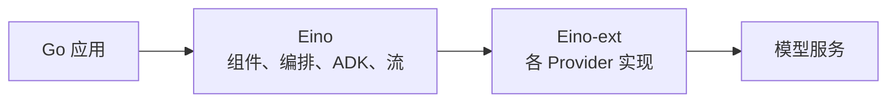
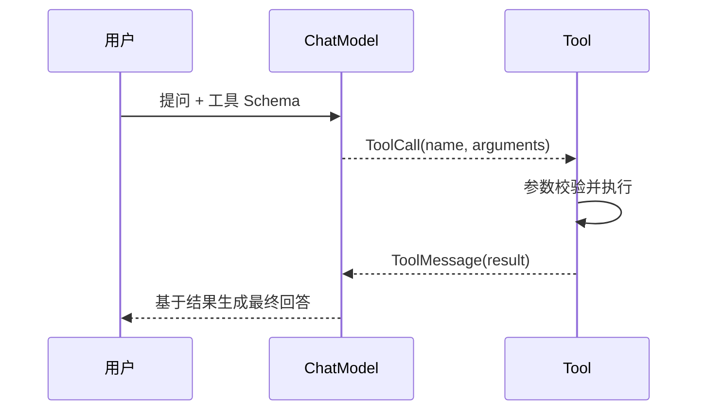

# Eino：Go 大模型应用与 Agent 开发框架

## 前言

调用一次模型接口并不难：组织请求、发送 HTTP 请求、读取响应即可。真正的应用通常还要面对流式输出、不同模型服务商、提示词、工具调用、检索、会话、可观测性，以及带分支和人工确认的长流程。把这些能力分别手写在业务代码中，会很快出现厂商协议渗透、流无法正确关闭、工具调用循环难以测试等问题。

Eino 是 CloudWeGo 开源的 Go 大模型应用开发框架。它把模型、提示词、工具、检索器等能力抽象为组件，用 `compose` 连接成可控的 Chain、Graph 和 Workflow，并用 ADK（Agent Development Kit）提供 Agent 运行时。它借鉴了 LangChain、Google ADK 等框架，但接口和并发、`context.Context`、错误处理等习惯遵循 Go 的风格。

Eino 不是模型服务，也不会替应用保存 API Key；它是应用与模型服务之间的一层编程框架。模型实现通常来自 `eino-ext`，例如 OpenAI、Claude、Gemini、Ollama 等组件。应用只依赖 Eino 的组件接口，供应商协议留在构造组件的边缘位置。



## 一、先建立整体认识

Eino 可以按四层理解：

```text
应用层：HTTP / RPC / CLI、配置、业务规则
    ↓
编排与 Agent：compose Chain / Graph / Workflow，ADK Agent / Runner
    ↓
组件抽象：ChatModel、ChatTemplate、Tool、Retriever、Embedder、Indexer
    ↓
组件实现：OpenAI、Claude、向量数据库、搜索服务、文件加载器等
```

| 层次 | 解决的问题 | 常见包 |
| --- | --- | --- |
| 组件抽象 | 用稳定接口表示模型、工具和检索能力 | `components/model`、`tool`、`retriever` |
| 组件实现 | 将某个厂商或存储系统适配到抽象接口 | `github.com/cloudwego/eino-ext/...` |
| 编排 | 将多个确定性步骤连接为链路、图和工作流 | `compose` |
| Agent | 让模型在规则约束下决定是否调用工具、何时结束 | `adk`、`flow/agent/react` |

选择时先区分“确定性流程”和“模型自主决策”：固定的校验、审批、数据转换适合 Graph 或普通 Go 函数；是否搜索、调用哪个工具、如何基于工具结果继续推理，才适合交给 Agent。不要把本应确定的业务规则完全交给模型。

## 二、准备一个可替换模型的 ChatModel

安装核心包和所需的 Provider 实现：

```bash
go get github.com/cloudwego/eino@latest
go get github.com/cloudwego/eino-ext/components/model/openai@latest
```

`eino` 与 `eino-ext` 分离很重要：前者定义面向应用的能力边界，后者放具体实现。因此业务逻辑应接收 `model.BaseChatModel`，不应到处依赖某个厂商的配置类型。

一个包含浏览器流式对话、Provider Registry 和 `ChatModelAgent + Runner` 的可运行示例位于 [gocode-examples/aiagent/eino](https://github.com/zzxrepository/gocode-examples/tree/master/aiagent/eino)。它将 HTTP、配置、模型工厂和 Eino Agent 分开，适合作为下列组件边界在服务端的落地参考。

下面的构造函数以 OpenAI 兼容协议为例。它从环境变量读取配置，既可对接 OpenAI，也可对接实现同一协议的服务；密钥不会进入源码或版本库。

```go
package llm

import (
	"context"
	"fmt"
	"os"
	"time"

	"github.com/cloudwego/eino/components/model"
	"github.com/cloudwego/eino-ext/components/model/openai"
)

// NewChatModel 在基础设施边界完成 Provider 适配，业务层只看到 BaseChatModel。
func NewChatModel(ctx context.Context) (model.BaseChatModel, error) {
	apiKey := os.Getenv("LLM_API_KEY")
	baseURL := os.Getenv("LLM_BASE_URL")
	modelID := os.Getenv("LLM_MODEL")
	if apiKey == "" || baseURL == "" || modelID == "" {
		return nil, fmt.Errorf("LLM_API_KEY、LLM_BASE_URL 和 LLM_MODEL 必须设置")
	}

	return openai.NewChatModel(ctx, &openai.ChatModelConfig{
		APIKey:  apiKey,
		BaseURL: baseURL,
		Model:   modelID,
		Timeout: 60 * time.Second, // 请求有上限；调用方 context 仍可更早取消。
	})
}
```

模型可替换不是指在每个 Handler 里写 `if provider == ...`。更合理的边界如下：配置选择 Provider 和模型名称；工厂创建对应实现；应用服务只依赖 `model.BaseChatModel`。新增模型服务时增加一个 Factory，不改对话、RAG 或 Agent 的业务代码。

```text
配置 provider/model
      ↓
Provider Factory ──→ model.BaseChatModel
                         ↓
                   Chat / RAG / Agent 服务
```

可把工厂注册为 `map[string]Factory`。这在 Go 中是策略模式加注册表的直接表达：接口隔离变化，函数或小结构体承载实现；不需要继承树。

## 三、Message、上下文与普通调用

`schema.Message` 是 Eino 对聊天消息的统一表达。核心字段是 `Role` 与 `Content`，同时还能携带工具调用、工具结果、多模态内容、推理内容和响应元数据。辅助函数让角色创建更清晰：

```go
messages := []*schema.Message{
	schema.SystemMessage("你是严谨的 Go 助手。"),
	schema.UserMessage("解释 context.Context 的取消传播。"),
}

answer, err := chatModel.Generate(ctx, messages)
if err != nil {
	return err
}
fmt.Println(answer.Content)
```

`Generate` 在完整回答可用后才返回，适合批处理、结构化提取或后续节点必须依赖完整文本的场景。多轮对话的本质不是模型在服务端自动记住用户，而是应用把必要历史按顺序放入 `messages` 后再次传入模型：

```text
system → user(第 1 轮) → assistant(第 1 轮回答) → user(第 2 轮)
```

历史不能无限增长。应用应按会话保存消息，并依据 token 预算裁剪、摘要或检索相关历史。`context.Context` 则负责一次调用的生命周期：HTTP 客户端断开、超时或上层主动取消时，应将请求的 `r.Context()` 继续传给 Eino，而不要在深层重新创建 `context.Background()`。

## 四、流式输出：读取、关闭与转发

`BaseChatModel` 的核心接口很小：

```go
type BaseModel[M messageType] interface {
	Generate(ctx context.Context, input []M, opts ...Option) (M, error)
	Stream(ctx context.Context, input []M, opts ...Option) (*schema.StreamReader[M], error)
}
```

`Stream` 返回 `*schema.StreamReader[*schema.Message]`。它不是 Go channel，也不能被多个消费者随意并发读取；调用方必须读取到 `io.EOF`，并在任何返回路径上调用 `Close`。

```go
stream, err := chatModel.Stream(ctx, []*schema.Message{
	schema.UserMessage("用三句话解释 Go interface。"),
})
if err != nil {
	return err
}
defer stream.Close() // 提前退出、客户端断开时也释放底层流资源。

for {
	chunk, err := stream.Recv()
	if errors.Is(err, io.EOF) {
		break
	}
	if err != nil {
		return fmt.Errorf("读取模型流：%w", err)
	}
	fmt.Print(chunk.Content) // chunk.Content 是增量，不是每次的完整答案。
}
```

一个流需要同时供“写给浏览器”和“记录审计”两个消费者使用时，不能让两个 goroutine 直接调用同一个 `Recv`。应在读取前使用 `stream.Copy(2)`，分别关闭复制后的 Reader。`Copy` 后原 Reader 不再可读，这个约束避免了同一数据被多个读取者竞争。

HTTP 层常把每个文本增量写成 SSE。关键点是：使用 `r.Context()`；每次写入后 `Flush`；设置 `X-Accel-Buffering: no` 防止代理缓冲；写入失败时立即返回，让请求取消向下游传播。

```go
func streamChat(w http.ResponseWriter, r *http.Request, chat model.BaseChatModel) {
	flusher, ok := w.(http.Flusher)
	if !ok {
		http.Error(w, "streaming is unavailable", http.StatusInternalServerError)
		return
	}
	w.Header().Set("Content-Type", "text/event-stream; charset=utf-8")
	w.Header().Set("Cache-Control", "no-cache, no-transform")
	w.Header().Set("X-Accel-Buffering", "no")

	stream, err := chat.Stream(r.Context(), []*schema.Message{schema.UserMessage("你好")})
	if err != nil {
		http.Error(w, "model request failed", http.StatusBadGateway)
		return
	}
	defer stream.Close()

	for {
		chunk, err := stream.Recv()
		if errors.Is(err, io.EOF) {
			fmt.Fprint(w, "event: done\ndata: {}\n\n")
			flusher.Flush()
			return
		}
		if err != nil {
			return
		}
		// 生产代码应以 json.Marshal 编码 data，避免文本破坏 SSE 格式。
		fmt.Fprintf(w, "event: delta\ndata: %s\n\n", chunk.Content)
		flusher.Flush()
	}
}
```

## 五、Prompt：模板负责消息，不替代业务校验

Prompt 在 Eino 中通常是 `prompt.ChatTemplate`，其 `Format` 接收变量并返回 `[]*schema.Message`。这正好与 ChatModel 的输入对齐。

```go
tpl := prompt.FromMessages(schema.FString,
	schema.SystemMessage("你是 {role}，只依据给定资料回答。"),
	schema.UserMessage("资料：{context}\n\n问题：{question}"),
)

messages, err := tpl.Format(ctx, map[string]any{
	"role":     "技术文档助手",
	"context":  "context.Context 用于携带截止时间、取消信号和请求范围值。",
	"question": "它为什么不应放在 struct 字段中？",
})
```

模板的变量名在运行时才校验，缺少变量会返回错误。提示词适合表达角色、输出格式、上下文和任务边界；鉴权、输入长度限制、权限判断和敏感操作确认仍应由普通程序逻辑完成。

## 六、Tool 与模型工具调用

Tool 有两部分：模型需要的描述（名称、说明、参数 JSON Schema），以及真正执行的 Go 函数。`tool.BaseTool` 只提供 `Info`，足以让模型生成 Tool Call；能够执行的工具还实现 `tool.InvokableTool` 或 `tool.StreamableTool`。

`toolutils.InferTool` 可从带泛型参数的 Go 函数推导 JSON Schema，避免手写参数描述：

```go
type WeatherInput struct {
	City string `json:"city" jsonschema:"description=要查询天气的城市"`
}

func newWeatherTool() (tool.InvokableTool, error) {
	return toolutils.InferTool("get_weather", "查询指定城市的天气", func(
		ctx context.Context, input *WeatherInput,
	) (string, error) {
		if input.City == "" {
			return "", errors.New("city 不能为空")
		}
		// 这里应调用经过鉴权、超时与错误处理封装的天气服务。
		return input.City + "：晴，22°C", nil
	})
}
```

工具描述是模型决策的依据，函数本身仍是不可信输入的执行边界。因此每个工具都应校验参数、设置超时、最小化权限，并对“转账、删除、发送”等有副作用的动作设置人工确认。模型说“调用工具”不等于应用已经获得执行敏感操作的授权。

工具调用的完整闭环是：



手动实现时，需要解析模型返回的 `Message.ToolCalls`，执行工具，再将结果构造成关联同一 `ToolCallID` 的 Tool Message 送回模型。Eino 的 `compose.ToolsNode` 和 ADK 能接管这一执行与回传步骤；不要只把工具 Schema 绑定给模型却遗漏工具结果回注，否则模型无法得到真实结果。

## 七、RAG：Embedding、Indexer、Retriever 与生成

RAG 不是“把文档塞进 Prompt”，而是一条可拆开的数据链：

```text
离线入库：文档 → 切分/清洗 → Embedder → Indexer → 向量库
在线问答：问题 → Embedder → Retriever → 相关 Document → Prompt → ChatModel
```

Eino 将职责分开：

| 组件 | 输入与输出 | 职责 |
| --- | --- | --- |
| `embedding.Embedder` | `[]string → [][]float64` | 用同一向量模型将文本表示为向量 |
| `indexer.Indexer` | `[]*schema.Document → []string` | 写入向量库或检索索引 |
| `retriever.Retriever` | `query → []*schema.Document` | 按相关性返回文档 |
| `prompt.ChatTemplate` | 变量 → Messages | 将检索到的材料组织为模型输入 |
| `model.BaseChatModel` | Messages → Answer | 根据证据生成回答 |

`Retriever.Retrieve` 的返回值是 `[]*schema.Document`。向量模型要在入库和查询时保持一致，否则向量维度或语义空间不同，检索结果会失真。`TopK` 是召回上限，`ScoreThreshold` 是过滤条件；二者都应通过离线评测和真实问题集调节，而不是凭感觉固定。

最小在线 RAG 步骤可以写成普通 Go 代码：

```go
docs, err := retriever.Retrieve(ctx, question, retriever.WithTopK(4))
if err != nil {
	return err
}

contextText := joinDocuments(docs) // 保留来源、标题等元数据，便于回答引用。
messages, err := ragPrompt.Format(ctx, map[string]any{
	"context":  contextText,
	"question": question,
})
if err != nil {
	return err
}
answer, err := chatModel.Generate(ctx, messages)
```

RAG 的质量通常首先取决于文档解析、切分、元数据、召回和重排；Prompt 只是最后一步。没有相关证据时，Prompt 应允许模型明确回答“资料不足”，而不是要求它必然给出结论。

## 八、Chain、Graph 与 Workflow：让控制流显式化

线性步骤适合 Chain，例如“格式化输入 → 生成 → 格式化输出”。需要分支、并行、循环、共享状态或检查点时使用 Graph / Workflow。Eino 的 `compose` 不是只能连接 LLM：普通 Go Lambda、Retriever、Tool、ChatModel 都可以成为节点。

```go
graph := compose.NewGraph[[]*schema.Message, *schema.Message]()
validate := compose.InvokableLambda(func(
	ctx context.Context, input []*schema.Message,
) ([]*schema.Message, error) {
	if len(input) == 0 || input[len(input)-1].Content == "" {
		return nil, errors.New("问题不能为空")
	}
	return input, nil
})

graph.AddLambdaNode("validate", validate)
graph.AddChatModelNode("generate", chatModel)
graph.AddLambdaNode("format", compose.InvokableLambda(func(
	ctx context.Context, answer *schema.Message,
) (*schema.Message, error) {
	answer.Content = strings.TrimSpace(answer.Content)
	return answer, nil
}))

graph.AddEdge(compose.START, "validate")
graph.AddEdge("validate", "generate")
graph.AddEdge("generate", "format")
graph.AddEdge("format", compose.END)

runnable, err := graph.Compile(ctx)
if err != nil {
	return err // Compile 负责检查节点与边的连接是否成立。
}
answer, err := runnable.Invoke(ctx, []*schema.Message{schema.UserMessage("解释 Go 的 context")})
```

内部的 `graph` 保存节点表、控制边、数据边、分支和起止节点；`Compile` 后图被标记为不可修改，避免运行期间拓扑改变。运行器根据边和节点输入输出类型调度数据。这个设计把流程从隐藏在嵌套 `if`、`for` 中的控制逻辑，变成可验证、可追踪的显式拓扑。

```text
Graph
├── nodes：节点名称 → graphNode
├── controlEdges：执行顺序与触发关系
├── dataEdges：节点间的数据传递关系
├── branches：条件分支
└── Compile：校验并生成 Runnable
```

流经图的值也可能是 Stream。Eino 为流提供合并、转换、复制等能力，使一个节点只需实现自己有意义的流式范式。仍要明确背压、取消和资源关闭：慢的下游会限制上游消费；节点出错或请求取消时，Reader 必须及时关闭。

## 九、ADK Agent：把 ReAct 循环交给运行时

`adk.ChatModelAgent` 把 ChatModel、Instruction、工具和迭代控制组合为一个 Agent。`Runner` 负责运行 Agent，并以迭代器形式产出 `AgentEvent`。模型可能直接回答，也可能多次执行“模型选择工具 → 工具执行 → 工具结果回注 → 模型继续”的 ReAct 循环。

```go
weatherTool, err := newWeatherTool()
if err != nil {
	return err
}

agent, err := adk.NewChatModelAgent(ctx, &adk.ChatModelAgentConfig{
	Name:        "weather-assistant",
	Instruction: "需要天气信息时调用 get_weather；不要编造工具结果。",
	Model:       chatModel,
	ToolsConfig: adk.ToolsConfig{
		ToolsNodeConfig: compose.ToolsNodeConfig{
			Tools: []tool.BaseTool{weatherTool},
		},
	},
	MaxIterations: 6, // 防止模型与工具之间无止境循环。
})
if err != nil {
	return err
}

runner := adk.NewRunner(ctx, adk.RunnerConfig{Agent: agent, EnableStreaming: true})
iter := runner.Query(ctx, "杭州今天的天气怎么样？")
for {
	event, ok := iter.Next()
	if !ok {
		break
	}
	if event.Err != nil {
		return event.Err
	}
	// event 可能是模型消息、工具执行或流式消息；HTTP 层应按事件类型过滤与编码。
}
```

Agent 的职责不是取代所有编排。一个可靠的常见组合是：Graph 负责可审计的固定流程，把它包装为 Tool；Agent 只在需要时决定是否调用这个 Tool。这样既保留模型的弹性，也保留关键业务流程的确定性。

对于需要人工确认的工具，ADK 支持 Interrupt / Resume 与 Checkpoint：在执行副作用操作前中断，保存状态，收到确认后恢复。检查点的持久化位置、会话标识、过期策略和权限校验仍由应用设计，不能仅依赖内存状态。

## 十、Callback、观测与错误边界

一次用户请求可能经过 Prompt、Retriever、ChatModel、ToolsNode、Agent 等多个组件。仅记录最终回答无法定位“是检索没有召回、模型超时，还是工具失败”。Eino 的 Callback 在组件、图和 Agent 的固定切点提供横切观察能力，包括开始、结束、错误以及流式输入输出。

观测记录至少应包含：请求或会话标识、组件名称、模型与版本、耗时、token 用量、工具名称、检索文档标识和错误类别。日志中不要写入 API Key、完整敏感提示词、用户隐私或未经脱敏的工具结果。

错误处理要按边界转换：

| 位置 | 应做的事 |
| --- | --- |
| Provider 适配层 | 保留底层错误，补充服务名、超时与可重试信息 |
| Service / Agent 层 | 区分输入错误、模型错误、工具错误、上下文取消和迭代上限 |
| HTTP / RPC 层 | 将内部错误映射为稳定的状态码和错误码；流式通道发送 error 事件后结束 |
| 日志与 Trace | 记录根因与 trace ID，不将根因原样返回客户端 |

`context.Canceled` 通常表示用户取消或连接断开，不应与模型服务故障混为一谈。对网络错误重试也必须谨慎：只对幂等、可安全重试的调用使用有限次数和退避；有副作用的工具应通过幂等键或业务状态防止重复执行。

## 十一、源码视角：小接口、泛型与流运行时

Eino 的底层设计可以从三个核心点理解。

第一，组件接口很小。例如 `Retriever` 只有一个方法：

```go
type Retriever interface {
	Retrieve(ctx context.Context, query string, opts ...Option) ([]*schema.Document, error)
}
```

这让任何符合该方法签名的实现都可进入 Graph，也方便在单元测试中编写 fake Retriever。`Option` 用于附加 `TopK`、Embedding、回调等调用期行为，避免接口参数无限膨胀。

第二，`BaseModel` 使用泛型统一非流式和流式模型调用：`Generate` 返回完整值，`Stream` 返回同类型的 `StreamReader`。`BaseChatModel` 是 `BaseModel[*schema.Message]` 的兼容别名，因此旧式聊天代码和新的泛型能力可以共存。

第三，`StreamReader` 是显式拥有资源的读取器。它的 `Recv` 返回“一个元素或错误”，`io.EOF` 表示正常结束；`Close` 负责停止底层接收；`Copy(n)` 在需要扇出时创建独立 Reader。这个 API 比隐式后台 goroutine 更强调所有权：谁取得 Reader，谁就负责消费或关闭它。

这些设计共同形成一条稳定边界：Provider 只需实现组件接口；编排只关心节点输入输出；HTTP 层只负责把最终流写给客户端；每层都能独立替换和测试。

## 参考资料

- [Eino 用户手册](https://www.cloudwego.io/zh/docs/eino/)
- [Eino GitHub 仓库](https://github.com/cloudwego/eino)
- [Eino ChatModel 使用说明](https://www.cloudwego.io/zh/docs/eino/core_modules/components/chat_model_guide/)
- [Eino Components 接口源码](https://github.com/cloudwego/eino/tree/main/components)
- [Eino 编排与流式编程文档](https://www.cloudwego.io/zh/docs/eino/core_modules/chain_and_graph_orchestration/)
- [Eino ADK 文档](https://www.cloudwego.io/zh/docs/eino/core_modules/eino_adk/)

## 总结

Eino 用 Go 风格的组件抽象组织大模型应用：`ChatModel` 负责生成，Message 和 Prompt 负责上下文，Tool 为模型提供受控行动能力，Embedding、Indexer 与 Retriever 组成 RAG 的检索侧，`compose` 负责确定性编排，ADK 负责 Agent 的工具调用循环与运行时。

构建时应先从一个可取消、可正确关闭的 ChatModel 流开始，再按实际需求加入 Prompt、多轮历史、工具、检索和工作流。模型服务商差异收敛到 Factory 和配置层；固定业务规则留在 Graph 或普通 Go 代码中；Agent 只处理需要模型决策的部分；观测、权限、超时、取消与错误边界贯穿所有层。这样得到的不是“能调用模型的代码”，而是可替换、可测试、可维护的 Go AI 应用。
