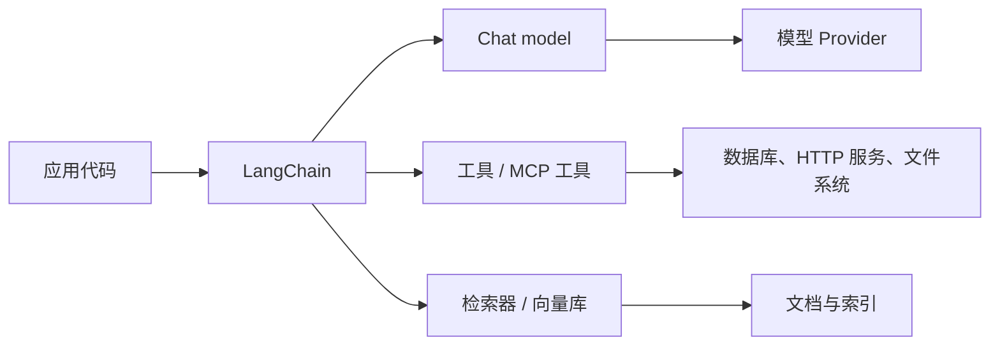
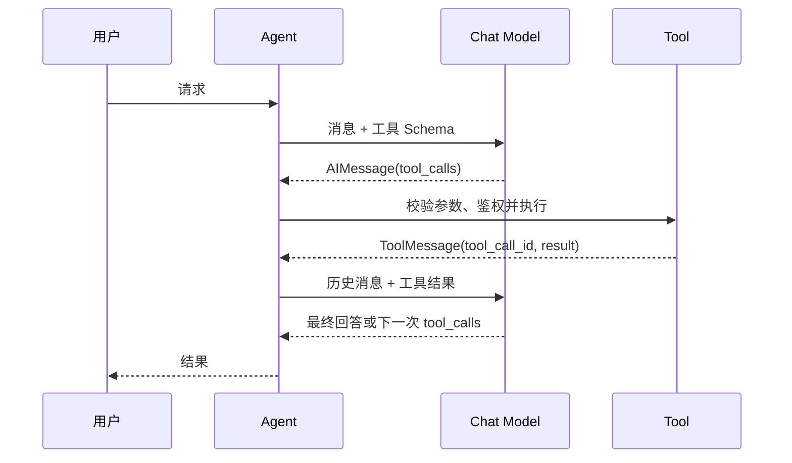
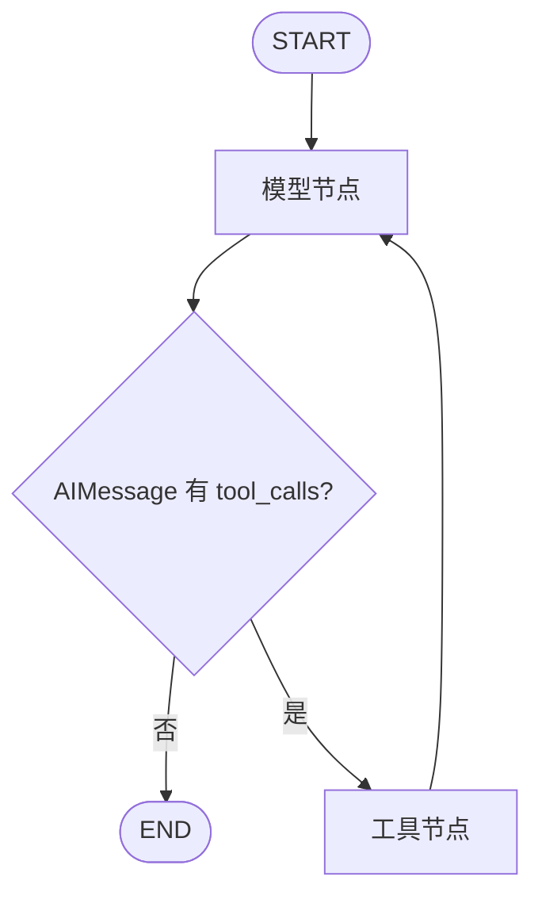

# LangChain：构建 Python 大模型应用

## 前言

直接调用模型 SDK 很适合一次请求：准备消息、调用 API、读取文本。应用开始需要多轮消息、流式输出、结构化数据、检索、外部工具和可观测性后，重复处理 Provider 差异、消息格式、工具协议与错误边界，才会逐渐成为主要工作。LangChain 是面向这一层问题的 Python 框架：它提供统一的模型和工具抽象，并以 `create_agent` 组织模型、提示词、工具和中间件。

LangChain 不是模型，也不替代模型厂商 SDK。它位于应用和模型 Provider 之间：应用仍需要选择模型、设置密钥、控制数据边界和处理业务规则；框架负责把这些组件按一致方式组合起来。



当前 LangChain 的主线是 **Python**，并有官方维护的 TypeScript 实现。Python 版的现代 API 以 `langchain`、`langchain-core` 和独立 Provider 集成为中心；早期常见的 `LLMChain`、`ConversationChain` 等写法属于历史 API，不应作为新代码的首选。当前官方将 Agent 定义为“模型加上运行支架”：提示词、工具和中间件共同构成围绕模型运行的控制层；其 Agent 运行在 LangGraph 之上，因此可获得持久化、人工介入和长流程能力。

## 一、什么时候使用 LangChain

直接使用 Provider SDK 往往更合适的情况：只有一个模型调用、模型特有能力是核心、依赖必须极少，或需要完全控制原始 HTTP 请求。LangChain 的价值在于需要组合能力，并希望尽量保持应用层代码稳定。

| 需求 | 直接使用 SDK | 使用 LangChain |
| --- | --- | --- |
| 单次文本生成 | 简洁直接 | 可以，但未必必要 |
| 更换模型 Provider | 需要改消息、初始化和流式代码 | 通常替换模型初始化或配置 |
| Tool Calling | 自己维护 JSON Schema、调用 ID 和结果回填 | Tool 抽象与 Agent 运行时处理循环 |
| 结构化返回 | 自己约束 JSON、解析和校验 | Schema、策略选择和校验统一处理 |
| RAG | 自己拼接嵌入、检索、上下文 | 可组合 loader、splitter、vector store、retriever |
| 可恢复的复杂流程 | 自己维护状态机 | 使用 LangGraph 更合适 |

不要把 LangChain 当作“所有请求都必须经过的中间层”。它解决的是编排和抽象问题；模型质量、提示词质量、权限设计、知识库质量和业务校验仍由应用负责。

## 二、安装、配置与第一个模型调用

Python 3.10+ 环境中可安装核心包和一个 Provider 集成包。使用 `uv` 创建独立项目时，可执行：

```bash
uv init llm-demo
cd llm-demo
uv add langchain langchain-openai pydantic
```

最小可运行代码位于 [gocode-examples/aiagent/langchain](https://github.com/zzxrepository/gocode-examples/tree/master/aiagent/langchain)，包含 Message 与流式输出、Pydantic 结构化输出、以及本地固定数据的 Agent Tool Calling 示例。该示例和 LangGraph 示例共用 `aiagent/python` 中的 `uv` 环境；进入该目录执行 `uv sync` 后，以 `uv run python ../langchain/chat.py` 运行。`.env.example` 只是变量模板；shell 不会自动加载 `.env`，运行前仍需以环境变量或自己的密钥管理方式提供认证信息。

`langchain-openai` 是 OpenAI Provider 集成包，`ChatOpenAI` 将该厂商协议适配为 LangChain 的聊天模型接口。其他模型应安装各自的官方集成包，例如 `langchain-anthropic`、`langchain-google-genai` 或 `langchain-ollama`，而不是假定所有模型都能使用 OpenAI 兼容协议。

认证信息通过环境变量注入，不应写进代码或提交到仓库：

```bash
export OPENAI_API_KEY='replace-with-your-key'
export OPENAI_MODEL='gpt-4.1-mini'
# 只有使用兼容接口时才设置：
# export OPENAI_BASE_URL='https://your-openai-compatible-endpoint/v1'
```

模型初始化应集中在应用边缘，而不要让每个 Handler 或业务函数分别读取环境变量：

```python
import os

from langchain_openai import ChatOpenAI


def build_model(streaming: bool = False) -> ChatOpenAI:
    """创建聊天模型；认证和地址由环境变量提供。"""
    return ChatOpenAI(
        model=os.getenv("OPENAI_MODEL", "gpt-4.1-mini"),
        temperature=0,
        streaming=streaming,
        # None 表示使用 Provider 默认地址；兼容服务可通过环境变量覆盖。
        base_url=os.getenv("OPENAI_BASE_URL") or None,
    )
```

聊天模型的输入不是简单字符串，而是一组带角色和内容的消息。

| 类型 | 表示的来源 | 典型用途 |
| --- | --- | --- |
| `SystemMessage` | 应用 | 固定行为、边界与输出要求 |
| `HumanMessage` | 用户 | 用户输入、文件或图片内容 |
| `AIMessage` | 模型 | 历史回答，也可能带有 `tool_calls` |
| `ToolMessage` | 工具执行器 | 对某个工具调用的结果 |

```python
from langchain.messages import HumanMessage, SystemMessage

model = build_model()
messages = [
    SystemMessage("你是一名严谨的 Go 教学助手。回答未知事实时明确说明不确定性。"),
    HumanMessage("用两句话解释 Go 的 interface。"),
]

# invoke 返回 AIMessage，而不是纯字符串；完整对象保留 metadata、tool_calls 等信息。
answer = model.invoke(messages)
print(answer.text)
```

只保存文本会丢失工具调用、多模态内容和模型元数据。保留 Message 对象，才能正确组织下一轮对话。

## 三、Runnable：同步、异步和流式的统一入口

聊天模型实现 LangChain 的 Runnable 协议。最常见的入口如下：

| 方法 | 返回方式 | 适用场景 |
| --- | --- | --- |
| `invoke(input)` | 一个完整结果 | 后台任务、一次性结构化处理 |
| `stream(input)` | 逐块迭代 | CLI、网页逐字输出 |
| `batch(inputs)` | 多个输入的结果 | 彼此独立的批量任务 |
| `ainvoke` / `astream` | 异步版本 | async Web 服务、并发 I/O |

流式调用要消费 chunk，而不是等待完整回答：

```python
from langchain.messages import HumanMessage

model = build_model(streaming=True)
for chunk in model.stream([HumanMessage("解释 HTTP 的请求响应模型。")]):
    # 部分 chunk 可能仅承载工具调用增量或元数据；文本为空时不输出。
    if chunk.text:
        print(chunk.text, end="", flush=True)
print()
```

流式模型并不保证所有增量都是普通文本。工具调用期间，模型可能先发送工具名和参数片段；API 网关和前端应区分“文本 token”“工具进度”“最终结果”和“错误”，不要把所有 chunk 直接拼进回答区域。

## 四、Prompt：模板构造消息，不替代业务规则

`ChatPromptTemplate` 将稳定指令与运行时变量组合为消息列表。它的价值不是把提示词藏起来，而是让输入变量显式、可测试、可复用。

```python
from langchain.prompts import ChatPromptTemplate

prompt = ChatPromptTemplate.from_messages([
    ("system", "你是 {language} 教师。使用简洁、可验证的表述。"),
    ("human", "问题：{question}"),
])

messages = prompt.invoke({
    "language": "Go",
    "question": "为什么 context.Context 要作为第一个参数？",
}).messages
```

最终发送给模型的是 `messages`。模板变量缺失会在应用侧暴露错误，比把未替换的 `{question}` 交给模型更容易发现问题。

Prompt 和模型可组合成顺序 Runnable：

```python
chain = prompt | build_model()
response = chain.invoke({"language": "Go", "question": "什么是 goroutine？"})
print(response.text)
```

`|` 构造的是顺序数据流：前一个组件输出的 `ChatPromptValue` 传给后一个模型。线性流程适合这样组合；出现条件分支、循环、持久化或人工审核时，应使用 LangGraph 显式建模状态。

## 五、结构化输出：让模型返回可用的数据

自然语言适合给人阅读；应用程序更需要可靠字段。例如从一段工单文本提取优先级、标题和标签，不应该用正则从回答中猜字段。LangChain 支持以 Pydantic、dataclass、TypedDict 或 JSON Schema 描述预期结构。

```python
from pydantic import BaseModel, Field


class Ticket(BaseModel):
    """应用需要的工单结构；Field 描述也会进入模型可见的 schema。"""

    title: str = Field(description="不超过 20 字的标题")
    priority: str = Field(description="只能是 low、medium 或 high")
    tags: list[str] = Field(description="用于检索的短标签")


extractor = build_model().with_structured_output(Ticket)
ticket = extractor.invoke("登录后页面空白，所有用户均受影响，需要尽快处理。")
print(ticket.model_dump())
```

`with_structured_output` 不只是“要求模型输出 JSON”。支持 Provider 原生结构化输出时，Schema 会映射到厂商的约束能力；否则通常通过 tool calling 实现。无论采用哪种方式，应用仍应把 Pydantic 校验错误视为正常失败路径，并按业务选择重试、人工处理或返回明确错误。

在 Agent 中使用 `response_format=Ticket` 时，`create_agent` 会在支持原生结构化输出的模型上选择 Provider strategy，否则回退到 Tool strategy；最终结构在 Agent 状态的 `structured_response` 键中。这比从最终文本再 `json.loads` 更可控。

## 六、工具调用：模型提出意图，应用执行受控动作

工具是具有明确输入和输出的可调用函数。模型只能提出“调用某个工具并传入参数”；真正运行函数、检查权限、访问网络或数据库的仍是应用进程。

```python
from langchain.tools import tool


@tool
def convert_temperature(value: float, unit: str) -> str:
    """在摄氏度和华氏度之间换算。unit 只能是 C 或 F。"""
    unit = unit.upper()
    if unit == "C":
        return f"{value:.1f}°C = {value * 9 / 5 + 32:.1f}°F"
    if unit == "F":
        return f"{value:.1f}°F = {(value - 32) * 5 / 9:.1f}°C"
    return "参数 unit 必须为 C 或 F"
```

`@tool` 会根据函数名、类型标注和 docstring 构造工具的名称、输入 Schema 与描述。docstring 是帮助模型判断“何时调用、如何传参”的契约，应说明能力范围、单位、限制和副作用。



工具不是授权机制。模型可能传错参数，也可能被提示注入诱导执行不安全操作。带副作用的工具应在函数内部完成身份验证、资源范围检查、审计记录、超时和幂等控制；删除、支付、发布等操作还应要求显式确认。

## 七、Agent：将工具循环交给 `create_agent`

手写工具循环需要维护消息历史、tool call ID、多个工具调用、失败结果和停止条件。`create_agent` 把这套控制流程封装为可执行 Agent：

```python
from langchain.agents import create_agent
from langchain.tools import tool


@tool
def get_office_hours(day: str) -> str:
    """查询服务台在指定星期的开放时间，day 使用星期一至星期日。"""
    hours = {"星期一": "09:00-18:00", "星期六": "10:00-16:00"}
    return hours.get(day, "当天不开放")


agent = create_agent(
    model=build_model(),
    tools=[get_office_hours],
    system_prompt="你是服务台助手。涉及开放时间时优先调用工具，不要编造。",
)

result = agent.invoke({
    "messages": [{"role": "user", "content": "星期六几点可以办理业务？"}],
})
print(result["messages"][-1].text)
```

`create_agent` 的输出是状态字典，`messages` 保存本次执行产生的消息。模型没有工具调用时，Agent 返回最终 `AIMessage`；模型有工具调用时，运行时执行工具，将 `ToolMessage` 追加到状态，然后再次调用模型。现代 LangChain 的 Agent 建立在 LangGraph 上，不应把它误解为一个只执行一次的普通函数。

其核心控制流可以抽象为：

```text
State.messages
  -> model node：调用绑定过工具 schema 的聊天模型
  -> AIMessage 是否包含 tool_calls？
       ├─ 否：结束，最后一条 AIMessage 是回答
       └─ 是：tool node 执行对应工具，追加 ToolMessage
                   -> 回到 model node
```

Agent 流式输出既可呈现最终文本 token，也可呈现模型与工具节点进度：

```python
for chunk in agent.stream(
    {"messages": [{"role": "user", "content": "星期六几点可以办理业务？"}]},
    stream_mode="messages",
    version="v2",
):
    if chunk["type"] != "messages":
        continue
    token, metadata = chunk["data"]
    if metadata["langgraph_node"] == "model" and token.text:
        print(token.text, end="", flush=True)
```

一个 Agent 调用可能先流出工具参数片段，再流出工具结果，最后才流出回答。服务端和前端应根据事件类型渲染，而不是把所有 chunk 当作最终回答。

## 八、多轮对话：消息历史、线程与短期记忆

每次把完整历史消息传给模型当然可以实现多轮对话，但会不断增长 token。LangChain Agent 的短期记忆使用 LangGraph checkpointer 管理：为每个会话提供稳定的 `thread_id`，运行时将该线程状态读取、合并、保存。

```python
from langchain.agents import create_agent
from langgraph.checkpoint.memory import InMemorySaver

agent = create_agent(model=build_model(), tools=[], checkpointer=InMemorySaver())
config = {"configurable": {"thread_id": "conversation-42"}}

agent.invoke({"messages": [{"role": "user", "content": "我叫小林。"}]}, config=config)
reply = agent.invoke({"messages": [{"role": "user", "content": "我叫什么？"}]}, config=config)
print(reply["messages"][-1].text)
```

`InMemorySaver` 仅适合开发和测试：进程重启后状态消失，也不适合多实例服务。生产环境需要持久化 checkpointer，并设计线程 ID 的归属、过期、删除和访问控制。短期会话历史也不等于长期用户记忆；长期记忆需要明确的数据模型、可追溯来源和用户删除机制。

## 九、RAG 与 MCP：LangChain 的接入位置

RAG（检索增强生成）通常分成两条链路：

```text
离线：文档 -> 切分 -> Embedding -> Vector Store
在线：问题 -> Embedding -> Retriever -> 相关片段 -> Prompt -> Chat Model
```

LangChain 可以提供 document loader、text splitter、embedding、vector store 和 retriever 的组件抽象，但它不自动保证答案正确。切分策略、索引更新、召回数量、重排、引用展示、权限过滤和评测指标都属于 RAG 系统设计。检索结果应该作为带来源的上下文传给模型，而不要把整座知识库直接拼入提示词。

```python
documents = retriever.invoke("如何配置 HTTP 超时？")
context = "\n\n".join(doc.page_content for doc in documents)
answer = (prompt | build_model()).invoke({"context": context, "question": "如何配置 HTTP 超时？"})
```

`retriever` 是一个“按查询返回 Document 列表”的接口。模型不知道向量数据库的存在；它只看到经过应用筛选后的上下文。

MCP（Model Context Protocol）是应用向模型提供工具、资源和提示词的开放协议，不是 RAG 的替代品，也不是模型调用协议。LangChain 可通过 `langchain-mcp-adapters` 将一个或多个 MCP Server 暴露的工具加载为 LangChain tools：

```python
import asyncio

from langchain.agents import create_agent
from langchain_mcp_adapters.client import MultiServerMCPClient


async def main() -> None:
    client = MultiServerMCPClient({
        "math": {"transport": "stdio", "command": "python", "args": ["/absolute/path/to/math_server.py"]},
        "weather": {"transport": "http", "url": "http://localhost:8000/mcp"},
    })
    tools = await client.get_tools()
    agent = create_agent(model=build_model(), tools=tools)
    result = await agent.ainvoke({"messages": [{"role": "user", "content": "计算 18*24"}]})
    print(result["messages"][-1].text)


asyncio.run(main())
```

这段适配代码只完成协议互通，不会自动解决权限。远程 MCP Server、stdio 子进程和工具返回内容都属于不可信边界：应限制允许连接的 Server、验证凭据、设置超时、审查工具权限，并防范工具输出中的提示注入。

## 十、理解底层：从 Runnable 到 LangGraph

LangChain 的“统一接口”来自核心抽象，而不是所有 Provider 恰好拥有相同 API。聊天模型接收统一 Message，输出 `AIMessage` 或消息 chunk；Provider 集成包负责把它们转换为各厂商请求和响应。因此应用可以替换模型实现，同时保留 Prompt、Tool 和上层组合代码。

从源码入口看，`BaseChatModel.invoke` 先将字符串、PromptValue 或消息序列转换为消息，再经 `generate_prompt` 取得第一条 `ChatGeneration` 的 `message`；`stream` 则在模型不支持流式时退化为一次 `invoke`，支持时持续产出 `AIMessageChunk`。这解释了为什么上层可以用同一个输入类型调用不同 Provider，也解释了为什么流式消费者必须接受“chunk”而不是假定每次都是完整文本。对应实现见 [BaseChatModel](https://github.com/langchain-ai/langchain/blob/master/libs/core/langchain_core/language_models/chat_models.py)。

```text
ChatPromptTemplate
  --invoke--> ChatPromptValue(messages)
  --输入--> BaseChatModel.invoke / stream
  --输出--> AIMessage / AIMessageChunk
  --传递--> Parser、Tool 或下一个 Runnable
```

`@tool` 会读取函数签名、类型标注和 docstring，构造工具名称、描述和参数 Schema。Agent 调用模型前将 Schema 绑定到请求；模型返回的是名称、参数与调用 ID，而不是已经执行的函数。运行时根据名称定位 Tool，执行后用相同调用 ID 生成 `ToolMessage`，从而使模型能把结果对应到原调用。

```text
Python function + annotations + docstring
  -> BaseTool(input schema)
  -> model.bind_tools(tools)
  -> AIMessage.tool_calls
  -> Tool executor
  -> ToolMessage(tool_call_id, content)
```

`create_agent` 创建并编译 LangGraph 状态图：状态中维护消息；模型节点决定是否产生 `tool_calls`；条件边选择结束或转向工具节点；工具节点追加结果后回到模型节点。checkpointer 在图执行边界保存状态。

这一点可直接从 [`create_agent` 的源码](https://github.com/langchain-ai/langchain/blob/master/libs/langchain_v1/langchain/agents/factory.py) 看出：工厂先创建 `StateGraph`，注册 `model` 和可选的 `tools` 节点；模型节点调用经过 `bind_tools` 处理的模型；随后通过条件边决定进入 `tools`、返回模型，或结束图执行。中间件节点也在同一张图中插入，因此重试、人工审核、模型选择等能力不是散落在业务代码里的特殊分支。



这也是职责分界：LangChain 提供高层、常用的 Agent harness；LangGraph 公开状态图、节点、边、检查点与中断控制，适合更复杂的确定性与 Agent 混合工作流。

## 十一、工程化边界

| 方面 | 实践 |
| --- | --- |
| 配置与密钥 | 使用环境变量、密钥管理系统或本地忽略文件；禁止记录到日志 |
| Provider 抽象 | 在应用边缘集中创建模型；不要在业务函数中散落 Provider 名称 |
| 超时与取消 | 将请求生命周期映射到调用；工具和远程检索分别设置超时 |
| 错误处理 | 区分鉴权、限流、模型拒绝、Schema 校验、工具失败和客户端取消 |
| 资源控制 | 限制输入、历史消息、工具调用次数、并发与重试预算 |
| 工具安全 | 每个工具独立鉴权、参数校验、最小权限、审计与副作用确认 |
| 可观测性 | 记录 request ID、模型、耗时、token、检索来源、工具调用与失败原因；脱敏用户数据 |
| 质量评测 | 为结构化字段、检索命中、工具选择和端到端回答建立可重复测试集 |

LangSmith 可采集 LangChain 与 LangGraph 的 trace，用于观察模型调用、工具调用、状态变化和延迟；它是调试和评测工具，而不是替代日志、权限审计或业务指标的基础设施。

## 十二、多语言生态与选型

| 名称 | 主要语言 | 维护关系与定位 |
| --- | --- | --- |
| LangChain | Python | 官方主线；模型、工具、Agent 与集成生态最完整 |
| LangChain.js | TypeScript | 官方维护；面向 Node.js、Web 与 TypeScript 应用 |
| LangGraph | Python / TypeScript | 官方的低层状态化 Agent 与工作流编排框架 |
| LangChain4j | Java | 独立的 Java 项目，不是 LangChain Python 的官方 Java 移植版 |
| LangChainGo / langchaingo | Go | 社区项目，不是 LangChain 官方维护的 Go 版本 |
| Eino | Go | CloudWeGo 的 Go 大模型应用框架，适合作为 Go 应用开发主线之一 |

选型应首先跟随运行语言和部署边界：Python 服务需要快速接入大量模型和 AI 工具时，LangChain 与 LangGraph 很自然；Java 服务可评估 LangChain4j；Go 服务更应比较 Eino 与自身所需的 Provider、流式、工具和工作流能力。不要因为名称相似，就假设它们 API 或运行模型相同。

## 参考资料

- [LangChain Python 官方概览](https://docs.langchain.com/oss/python/langchain/overview)
- [LangChain Models 官方文档](https://docs.langchain.com/oss/python/langchain/models)
- [LangChain Messages 官方文档](https://docs.langchain.com/oss/python/langchain/messages)
- [LangChain Streaming 官方文档](https://docs.langchain.com/oss/python/langchain/streaming)
- [LangChain Structured output 官方文档](https://docs.langchain.com/oss/python/langchain/structured-output)
- [LangChain Tools 官方文档](https://docs.langchain.com/oss/python/langchain/tools)
- [LangChain MCP 官方文档](https://docs.langchain.com/oss/python/langchain/mcp)
- [LangChain GitHub 仓库](https://github.com/langchain-ai/langchain)
- [LangChain4j 官方文档](https://docs.langchain4j.dev/intro/)
- [LangChainGo GitHub 仓库](https://github.com/tmc/langchaingo)

## 总结

LangChain 把大模型应用的常见连接点组织为稳定抽象：Message 表达对话，Prompt 构造输入，Chat Model 屏蔽 Provider 调用差异，Runnable 提供统一的同步、异步和流式入口，Tool 把受控能力暴露给模型，`create_agent` 将模型与工具组织为可循环执行的 Agent。

可靠的实现顺序通常是：先用 Message 和模型完成可验证的单次调用；再引入 Prompt、流式与结构化输出；确认确实需要外部能力后定义安全的 Tool；最后才用 Agent 承担多步工具循环。RAG 与 MCP 可以接入这套组件体系，但其数据质量、协议安全和权限边界仍需独立设计。需要显式控制状态、分支、循环、持久化和人工审核时，使用 LangGraph 的图模型比继续堆叠高层链式调用更清晰。
