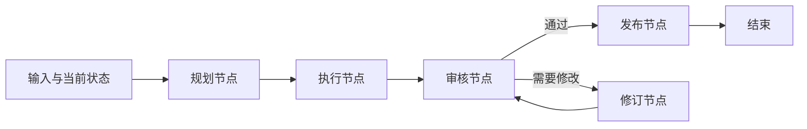
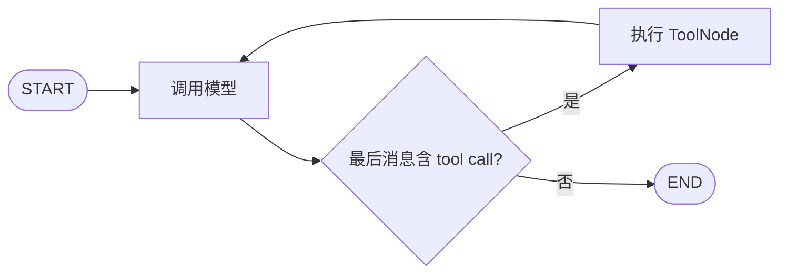

# LangGraph：构建可控、可恢复的 Agent 工作流

## 前言

大模型能在一次调用中回答问题，但真实任务往往不是“一问一答”：可能需要调用多个工具、根据结果走不同分支、反复修订草稿、等待人工批准，或者在进程重启后从中断处继续。只用一个 `while` 循环也能实现其中的一部分，但当状态、并发、失败恢复和人工介入逐渐增多时，控制流会分散在大量条件判断中，难以观察和测试。

LangGraph 是 LangChain 团队提供的**有状态工作流运行时**。它用图来描述计算：节点执行代码，边决定下一步，状态在节点之间流动；编译后的图还提供流式输出、检查点、暂停与恢复等运行能力。它尤其适合路径并不完全固定，但又必须保留明确边界和可观测性的 LLM 应用。

这里的“图”不是知识图谱，也不是用来绘制架构图的工具，而是程序的执行图。一个节点可以调用模型、工具或普通 Python 函数；一条边可以是固定跳转，也可以由状态决定。



LangGraph 不要求使用 LangChain，也不绑定某一家模型。可以把它当作纯 Python 的状态机运行时；也可以把 LangChain 的模型、消息和工具组件接入节点。官方文档中，LangChain 的 `create_agent` 会在 LangGraph 运行时上构建 Agent，因此二者是“组件/高层 Agent”与“编排/运行时”的关系，而不是互相替代的两个模型框架。

## 一、适用边界：什么时候需要图

简单模型调用不需要为了“使用框架”而引入图：准备消息、调用模型、返回文本即可。步骤完全确定的流程，例如“上传文件 → 校验 → 保存 → 返回结果”，通常使用普通函数或已有任务编排系统更直接。

LangGraph 的价值出现在以下情形：

| 问题 | 图式建模带来的能力 |
| --- | --- |
| 任务有多个可选路径 | 条件边或 `Command` 使路由显式化 |
| 工具可能需要多次调用 | 节点之间形成受限循环，可设置递归和预算上限 |
| 需要边做边展示结果 | `stream()` 输出状态更新、消息 token 或自定义事件 |
| 有高风险操作 | `interrupt()` 暂停，等待人工确认后再继续 |
| 任务较长、可能重启 | checkpointer 保存检查点，按 `thread_id` 恢复 |
| 多个专业 Agent 协作 | 子图将每个子任务封装成可组合的工作单元 |

不要把“Agent”理解为必须由模型决定所有步骤。更可靠的做法经常是：稳定、权限敏感的部分由固定边和普通代码控制；只有确实需要语言理解或开放式判断的节点才调用模型。

## 二、四个核心对象：State、Node、Edge 与 Graph

### 1. State：节点共享的、受 schema 约束的数据

`StateGraph` 先接收状态 schema。常用 `TypedDict`，也可以使用 dataclass 或 Pydantic 模型。状态字段既定义节点可读取的数据，也定义节点返回更新时允许写入的数据。

```python
from typing_extensions import TypedDict


class DraftState(TypedDict):
    topic: str
    outline: str
    draft: str
```

节点接收完整状态，但应当**返回更新字典，而不是原地修改 `state`**：

```python
def make_outline(state: DraftState) -> dict:
    # 只返回本节点产生的字段；运行时负责把它合并回全局状态。
    return {"outline": f"{state['topic']}：定义、例子、边界"}
```

默认情况下，同一字段的新值会替换旧值。这对字符串、数字等单值字段很自然；但列表、消息历史、并行分支汇合的数据不能简单覆盖，需要 reducer，后文会展开说明。

### 2. Node：执行一个可测试的步骤

节点就是普通的同步或异步 Python 函数。它可以读取 `state`，也可以接收运行时的配置和 `Runtime`；返回值通常是状态更新。节点本身不必知道自己位于什么 URL、什么 Web 框架或什么前端页面中。

```python
def write_draft(state: DraftState) -> dict:
    draft = f"# {state['topic']}\n\n{state['outline']}"
    return {"draft": draft}
```

一个好节点应有清晰的输入、输出和副作用边界：

- 模型节点负责让模型做受限的判断或生成；
- 工具节点负责执行已校验的外部操作；
- 领域节点负责业务规则；
- 审批节点负责提出中断和接收人工决定。

不要把整套 Agent 循环、数据库访问和 HTTP 响应都塞进一个节点，否则图只剩下装饰作用。

### 3. Edge：描述控制流

`START` 和 `END` 是 LangGraph 提供的特殊边界。普通边表示必经路径：

```python
from langgraph.graph import END, START, StateGraph

builder = StateGraph(DraftState)
builder.add_node("outline", make_outline)
builder.add_node("draft", write_draft)
builder.add_edge(START, "outline")
builder.add_edge("outline", "draft")
builder.add_edge("draft", END)
```

这段定义还不能执行。 `StateGraph` 是构建器；调用 `compile()` 后得到的是可运行图。

### 4. `compile()`：从定义变成运行时

```python
graph = builder.compile()
result = graph.invoke({"topic": "LangGraph", "outline": "", "draft": ""})
print(result["draft"])
```

`compile()` 不是把 Python 函数编译成机器码。它主要完成图结构校验，并把节点、边、状态 channel、重试策略、检查点和中断配置组装为可执行运行时。编译阶段可以发现孤立节点等结构问题；checkpointer、断点等运行参数也在这里传入。官方 Graph API 要求在 `invoke()`、`stream()` 等执行前先完成编译。

```text
StateGraph（节点和边的声明）
             │ compile
             ▼
CompiledStateGraph（可执行图）
             │ invoke / stream / get_state
             ▼
Pregel 运行时（调度、状态写入、检查点、流）
```

## 三、一个完整示例：可审核、可恢复的内容工作流

下面的示例不调用外部模型，因此可以直接运行并专注观察图的机制。它模拟了一个常见过程：生成计划和草稿，交给人工审核；拒绝时修订后再次审核，通过后发布。代码位于示例仓库的 `aiagent/langgraph` 目录。

```text
langgraph/
├── pyproject.toml
├── README.md
└── approval_workflow.py
```

安装并运行：

```bash
cd gocode-examples/aiagent/langgraph
python -m venv .venv
source .venv/bin/activate
pip install -e .
python approval_workflow.py
```

核心状态包含两类字段：`topic`、`draft`、`status` 是单值字段；`events` 是执行记录，需要以追加方式合并。

```python
import operator
from typing import Annotated, Literal
from typing_extensions import TypedDict


class ContentState(TypedDict):
    topic: str
    plan: str
    draft: str
    status: str
    events: Annotated[list[str], operator.add]
```

`plan` 和 `draft` 节点按固定顺序执行：

```python
def plan(state: ContentState) -> dict:
    return {
        "plan": f"解释 {state['topic']} 的概念、用途和风险边界",
        "events": ["已生成计划"],
    }


def draft(state: ContentState) -> dict:
    return {
        "draft": f"{state['topic']}：{state['plan']}",
        "status": "pending_review",
        "events": ["已生成草稿，等待审核"],
    }
```

审核节点使用 `interrupt()` 暂停。第一次执行到这里时，传入的字典会作为中断 payload 交给调用方；恢复时，`interrupt()` 表达式得到 `Command(resume=...)` 中的值。节点返回 `Command`，一次完成“写状态 + 选择下一节点”。

```python
from langgraph.types import Command, interrupt


def review(state: ContentState) -> Command[Literal["publish", "revise"]]:
    decision = interrupt({
        "question": "是否批准发布？",
        "draft": state["draft"],
    })
    approved = bool(decision)
    return Command(
        update={"events": [f"审核结果：{'通过' if approved else '退回'}"]},
        goto="publish" if approved else "revise",
    )
```

完整的图连接关系为：

```python
from langgraph.checkpoint.memory import InMemorySaver
from langgraph.graph import END, START, StateGraph

builder = StateGraph(ContentState)
builder.add_node("plan", plan)
builder.add_node("draft", draft)
builder.add_node("review", review)
builder.add_node("revise", revise)
builder.add_node("publish", publish)

builder.add_edge(START, "plan")
builder.add_edge("plan", "draft")
builder.add_edge("draft", "review")
builder.add_edge("revise", "review")       # 被退回时形成有限循环
builder.add_edge("publish", END)

graph = builder.compile(checkpointer=InMemorySaver())
```

注意 `review` 没有再通过 `add_edge()` 指向 `publish` 或 `revise`。它已经由 `Command(goto=...)` 做动态路由；对同一节点同时配置静态后继边和 `Command(goto=...)`，两类后继都会被调度，通常不是预期行为。

运行时使用稳定的 `thread_id` 标识一次工作流会话：

```python
config = {"configurable": {"thread_id": "article-001"}}

# 第一次运行会在 review 节点暂停。
paused = graph.invoke({
    "topic": "LangGraph",
    "plan": "",
    "draft": "",
    "status": "new",
    "events": [],
}, config=config)
print(paused["__interrupt__"])

# 同一个 thread_id 才能读取刚才的检查点，并将 True 送回 interrupt()。
finished = graph.invoke(Command(resume=True), config=config)
print(finished["status"])
```

示例使用内存 checkpointer，只适合理解机制和测试；进程结束后数据消失。真正需要跨进程恢复的任务必须选择持久化 checkpointer，并为其数据库、序列化、数据保留与访问控制做单独设计。

## 四、State 更新与 reducer：为什么列表不能直接覆盖

状态不是一个可以被各节点随意改写的全局变量。LangGraph 将状态字段视作 channel：节点在一个执行步中产生 update，运行时用该字段的 reducer 将 update 写入 channel。

若字段没有声明 reducer，默认是“最后写入的值覆盖旧值”。例如：

```python
class State(TypedDict):
    status: str
```

节点返回 `{"status": "running"}` 后，`status` 会被替换。这适合单一事实，但不适合并行节点都想向一个列表添加内容。使用 `Annotated` 可以为字段声明 reducer：

```python
import operator
from typing import Annotated


class State(TypedDict):
    # operator.add 把原列表和节点返回的新列表拼接起来。
    logs: Annotated[list[str], operator.add]
```

```text
已有状态：logs = ["开始"]
节点 A：  {"logs": ["检索完成"]}
节点 B：  {"logs": ["校验完成"]}
reducer：operator.add
结果：    ["开始", "检索完成", "校验完成"]
```

聊天消息更值得注意：直接以列表相加无法处理“按消息 ID 替换一条消息”等需求。LangGraph 为此提供 `MessagesState`，其中 `messages` 使用 `add_messages` reducer；它能够把普通消息对象转换为统一消息类型，并按 ID 追加或更新。带消息历史的 Agent 通常从它扩展状态：

```python
from langgraph.graph import MessagesState


class AgentState(MessagesState):
    # 继承 messages: Annotated[list[AnyMessage], add_messages]
    remaining_steps: int
```

reducer 的含义应在设计状态时先确定。若一个字段既有“覆盖”语义又有“累积”语义，应拆成两个字段或明确使用 `Overwrite`；不能依赖节点执行恰好发生的顺序。

## 五、路由、循环与并行任务

### 1. 条件边：只决定走向

当路由函数只负责选择下一个节点时，使用 `add_conditional_edges()` 最清楚：

```python
from typing import Literal


def next_step(state: ContentState) -> Literal["publish", "revise"]:
    return "publish" if state["status"] == "approved" else "revise"


builder.add_conditional_edges("check", next_step)
```

路由函数可以返回节点名，也可以借助 path map 映射到节点名。循环只是让一条边回到先前节点，并不特殊；但任何可能不断循环的图都应设计终止条件，例如最大工具调用数、截止时间、人工接管或明确的失败状态。运行时也有递归限制，用于防止无意的无限循环；它不是业务正确性的替代品。

### 2. `Command`：同时更新状态与跳转

如果同一节点既产生数据又决定去向，`Command` 比“返回更新 + 额外条件边”更集中：

```python
from langgraph.types import Command


def classify(state: ContentState) -> Command[Literal["answer", "ask_human"]]:
    if not state["topic"].strip():
        return Command(update={"status": "need_input"}, goto="ask_human")
    return Command(update={"status": "ready"}, goto="answer")
```

返回类型中的 `Literal[...]` 不只是类型装饰：它让图可视化和静态检查知道动态边可能通往哪些节点。 `Command` 还可用于子图回到父图，以及把 `resume` 作为图输入恢复中断。

### 3. `Send`：动态 fan-out 与汇合

当待处理对象数量在运行前未知时，不能预先写死边的数量。 `Send` 允许条件边为每个对象投递一个节点任务，适合 map-reduce：

```python
from langgraph.types import Send


def fan_out(state: dict) -> list[Send]:
    # 每个主题收到一份局部输入；下游结果由 reducer 汇合。
    return [Send("research_one", {"topic": topic}) for topic in state["topics"]]
```

如果多个 `research_one` 并行返回 `{"findings": [...]}`，`findings` 必须有可合并的 reducer。并行并不意味着外部副作用可以随意重复：向支付、发信、写数据库等节点 fan-out 前，仍应设计幂等键、并发上限和失败补偿。

## 六、模型与工具循环：图如何承载 Agent

LangGraph 不把节点限制为 LLM。典型的工具调用 Agent 只有两个核心节点：模型节点根据消息决定回答还是请求工具；工具节点执行已注册工具；条件边检查最后一条 AI 消息是否有 tool call，有则回到工具节点，无则结束。



概念代码如下，模型创建方式取决于所使用的 Provider 集成包：

```python
from langchain_core.messages import HumanMessage
from langgraph.graph import END, START, MessagesState, StateGraph
from langgraph.prebuilt import ToolNode, tools_condition


def call_model(state: MessagesState) -> dict:
    # model 已绑定可调用工具。模型只提出工具调用；真正执行由 ToolNode 完成。
    response = model_with_tools.invoke(state["messages"])
    return {"messages": [response]}


builder = StateGraph(MessagesState)
builder.add_node("agent", call_model)
builder.add_node("tools", ToolNode(tools))
builder.add_edge(START, "agent")
builder.add_conditional_edges("agent", tools_condition, {"tools": "tools", END: END})
builder.add_edge("tools", "agent")
graph = builder.compile()

result = graph.invoke({"messages": [HumanMessage("查询北京天气")]})
```

这里的关键边界是：模型输出的 tool call 只是建议；工具实现必须在服务端再次校验参数、身份、资源范围与权限。 `ToolNode` 负责分派工具调用和把结果包装回消息状态，但不应被误解为安全授权层。涉及写入、付款、删除、发送等副作用时，应该在工具前设置明确审批节点或 `interrupt()`。

对于只需要一个常规工具调用 Agent 的场景，LangChain 的高层 `create_agent` 更省代码，并且其底层仍运行在 LangGraph 上。需要显式控制状态 schema、分支、检查点、跨节点恢复或多 Agent 协作时，再直接使用 `StateGraph`。

## 七、执行方式：`invoke()`、`stream()` 与状态观察

### 1. `invoke()`：等待图完成

`invoke(input, config=...)` 运行到结束、错误或中断，返回最终状态。适合短任务或 HTTP 的非流式接口。

```python
result = graph.invoke({"topic": "状态机"}, config={"configurable": {"thread_id": "t-1"}})
```

### 2. `stream()`：逐步获取执行过程

`stream()` 返回迭代器。常见模式是 `updates`，每当节点写入状态时产生一个事件：

```python
for update in graph.stream({"topic": "状态机"}, stream_mode="updates"):
    # update 的键通常是刚执行的节点名，值是该节点返回的状态更新。
    print(update)
```

常用 stream mode 的关注点不同：

| 模式 | 适合观察什么 |
| --- | --- |
| `updates` | 每个节点刚写入的增量，适合界面展示进度 |
| `values` | 每一步后的完整状态，适合调试小状态 |
| `messages` | 模型消息及 token 元数据，适合聊天流式输出 |
| `custom` | 节点通过 stream writer 主动发出的业务进度 |
| `debug`、`tasks` | 任务调度、重试和诊断信息 |

长状态不要把完整 `values` 无限制转发给浏览器；应选择必要字段，并将 token、工具参数、内部错误或敏感检索内容分级处理。需要统一接收 LangChain/LangGraph 运行事件时，还可以使用 `stream_events()`，它更适合追踪和调试。

### 3. `config`：执行身份而非业务状态

`config` 里经常出现：

```python
config = {
    "configurable": {"thread_id": "conversation-42"},
    "tags": ["production"],
}
```

`thread_id` 不是业务字段，也不应由用户随意猜测后直接传入。它是 checkpointer 定位状态快照的键，必须映射到经过鉴权的会话或任务所有者；否则可能出现跨用户读取或恢复任务的问题。

## 八、检查点、持久化与短期记忆

没有 checkpointer 的图像一次普通函数调用：进程结束，执行上下文也结束。编译时传入 checkpointer 后，运行时会在步骤之间保存状态快照；以相同 `thread_id` 再调用时，图能读取相应会话的历史状态。

```python
from langgraph.checkpoint.memory import InMemorySaver

checkpointer = InMemorySaver()
graph = builder.compile(checkpointer=checkpointer)
config = {"configurable": {"thread_id": "task-202"}}
```

`InMemorySaver` 适合教学和测试。生产任务需要选择持久化实现，并评估至少四件事：

1. **数据生命周期**：检查点保存多久，如何清理和删除；
2. **隔离与权限**：`thread_id` 与租户、用户、任务所有者如何绑定；
3. **序列化兼容性**：状态 schema 演进后，旧快照是否可读取；
4. **恢复语义**：已执行外部副作用的节点重跑时如何避免重复写入。

检查点主要提供线程级的短期状态；长期用户偏好或跨线程知识不能简单等同于聊天历史。LangGraph 还提供 store 概念用于跨线程共享数据，两者应按数据语义、保留时间和权限模型分别设计。

可以用 `get_state()` 查看当前快照，用 `get_state_history()` 审查历史。 `update_state()` 允许修改某个检查点并从那里继续，适用于受控修正和调试；它并不是绕开业务校验直接改生产数据的通道。

## 九、中断与恢复：把人工审批做成运行时能力

`interrupt(value)` 可以在任意节点内部暂停执行。它不是异常处理技巧，而是一个持久化协作协议：框架保存当前进度，将 JSON 可序列化的 payload 交给外部系统；外部界面收集决定后，以 `Command(resume=value)` 恢复。

```python
from langgraph.types import Command, interrupt


def approve_payment(state: dict) -> dict:
    approved = interrupt({
        "kind": "payment_approval",
        "amount": state["amount"],
        "currency": state["currency"],
    })
    return {"approved": bool(approved)}
```

恢复必须使用同一个 checkpointer 和同一个 `thread_id`：

```python
# 第一次调用返回 __interrupt__，而不是继续执行付款。
graph.invoke({"amount": 100, "currency": "CNY"}, config=config)

# 审核系统验证操作者权限后才恢复。
graph.invoke(Command(resume=True), config=config)
```

一个容易遗漏的运行语义是：恢复时，包含 `interrupt()` 的节点会从节点开头重新执行，并在对应的 `interrupt()` 处取得恢复值。因此，中断之前不能放不可幂等的外部副作用，例如先扣款、后要求确认。正确的顺序是“准备数据 → interrupt 审批 → 审批后执行副作用”；若确实必须在中断前调用外部系统，应使用幂等键、事务或可靠的状态记录保护重复执行。

编译参数中的 `interrupt_before`、`interrupt_after` 可用于静态断点调试。它们按节点边界暂停，适合开发诊断；面向业务的人机协作应使用能携带业务 payload 的动态 `interrupt()`。

## 十、子图与多 Agent：组合而不是放任自治

子图是一个已编译图作为父图的节点。它适合把“检索与证据整理”“生成并自检”“订单核验”等具有独立状态和流程的能力封装起来：

```text
父图：接收任务 → 分派 → 汇总 → 审批 → 交付
                     │
                     ├── 子图 A：资料检索
                     ├── 子图 B：规则核验
                     └── 子图 C：草稿生成
```

父图和子图可以共享部分 state key，也可以在节点函数中显式转换输入输出。选择取决于数据边界：若子图是独立能力，应使用明确适配，避免让它随意读写父图全部状态。

子图的持久化方式也有区别：默认的每次调用持久化适合独立子 Agent 的一次性任务；需要跨多轮保留子 Agent 自身上下文时，才使用线程级持久化。父图必须启用 checkpointer，子图的中断、状态检查和线程记忆等持久化能力才能正常工作。

“多 Agent”首先是职责分割，而不是把同一个模型复制多份。一个常见结构是 supervisor 根据任务分派给专业子图，最后由固定的汇总/审批节点收口。需要明确：

- 每个子 Agent 可调用哪些工具；
- 子图之间通过什么结构化状态交换信息；
- 谁拥有最终写操作的权限；
- 并行失败时是重试、降级还是整体失败；
- 如何限制循环次数、token、时间与并发数。

没有这些边界的多 Agent 系统通常只会增加上下文传递和排障成本。

## 十一、从源码看执行机制：图为什么能暂停、并行与恢复

应用代码通常使用 `StateGraph`；源码中它会把高层图定义编译到 Pregel 运行时。LangGraph 仓库的 `langgraph/pregel/main.py` 明确将 `StateGraph` 与 Functional API 描述为 Pregel 之上的高层接口。理解这个分层有助于解释三个现象：节点不是随意嵌套调用的、状态更新要经过 reducer、检查点可以在步骤之间保存。

```text
StateGraph.add_node / add_edge
        │
        │ compile：构造节点触发条件、channel、输入输出与运行选项
        ▼
CompiledStateGraph（继承可执行 Pregel 能力）
        │
        │ invoke / stream
        ▼
Pregel loop
  1. 读取当前 checkpoint 与可用 channel
  2. 找出本轮被触发的节点任务
  3. 执行任务，收集各节点的 update
  4. 通过 reducer 将 update 写入 channel
  5. 写入 checkpoint，安排下一轮任务
  6. 无待执行任务时结束；遇 interrupt 时暂停
```

这一模型接近 BSP（Bulk Synchronous Parallel）/ Pregel 的“超步”思想：同一轮里可运行的任务先执行，写入在轮次边界统一应用，再决定下一轮哪些节点被触发。它不是要求所有业务一定并行，而是让并行分支和状态汇合有一致语义。

源码层可以把几个概念对应起来：

| 高层概念 | 运行时中的角色 |
| --- | --- |
| State 字段 | channel；保存当前值并定义更新合并方式 |
| reducer | 对同一 channel 的多个 write 应用合并规则 |
| Node | 带订阅 channel、写入 channel、重试/超时策略的可执行任务 |
| Edge / 条件边 | 下一轮调度任务的触发关系 |
| checkpointer | 读写 checkpoint，保存状态、待执行任务和配置 |
| `stream()` | 在状态更新、消息、任务或自定义事件产生时向调用者输出 |

`interrupt()` 的实现也依赖这个运行时：没有可用 resume 值时，它构造 `GraphInterrupt` 并携带 `Interrupt` 信息；运行 loop 捕获后保存 checkpoint 并把中断暴露给调用者。恢复调用带来的 `Command(resume=...)` 会让框架在相同任务上下文中重新执行节点，并把该值作为 `interrupt()` 的返回值。因而暂停并不是把 Python 调用栈序列化到数据库，而是“保存可重建的图状态和任务位置，再重放节点到中断点”。

这也解释了两个工程规则：节点尽量保持确定性；中断前的副作用必须幂等。运行时恢复的是工作流语义，而不是冻结某个 Python 栈帧。

## 十二、可靠性、安全性与测试

图解决的是编排，不自动保证业务正确性。以下设计仍需应用层负责：

| 主题 | 建议 |
| --- | --- |
| 工具权限 | 工具服务端校验身份、参数、数据范围和权限；模型不能直接获得数据库凭据 |
| 副作用 | 写操作使用幂等键；审批放在操作前；为失败设计补偿或人工处置流程 |
| 重试 | 只对可安全重试的节点设置重试；区分瞬时网络错误、限流和业务拒绝 |
| 循环 | 设置最大步骤、超时、预算与明确终止状态；记录每轮原因 |
| 状态 | 不把密钥、完整敏感原文或不必要的个人数据写入 checkpoint |
| 观测 | 为运行加 trace ID、节点耗时、工具调用、token/成本和失败原因 |
| 测试 | 单测节点与路由函数；集成测图路径；为中断、恢复、重试和重复投递写场景测试 |

节点可作为普通函数单独测试，路由函数也应覆盖每个分支。图级测试则应使用假模型和假工具，断言“给定输入 → 经哪些节点 → 产生何种状态”，而不是只断言最终自然语言文本。对依赖模型的节点，可以断言结构化输出、工具选择、拒绝策略和 token 上限等更稳定的行为。

## 参考资料

- [LangGraph Graph API 官方文档](https://docs.langchain.com/oss/python/langgraph/graph-api)
- [LangGraph 使用 Graph API 官方指南](https://docs.langchain.com/oss/python/langgraph/use-graph-api)
- [LangGraph Interrupts 官方文档](https://docs.langchain.com/oss/python/langgraph/interrupts)
- [LangGraph Subgraphs 官方文档](https://docs.langchain.com/oss/python/langgraph/use-subgraphs)
- [LangGraph 源码：StateGraph 与 CompiledStateGraph](https://github.com/langchain-ai/langgraph/blob/main/libs/langgraph/langgraph/graph/state.py)
- [LangGraph 源码：Pregel 运行时](https://github.com/langchain-ai/langgraph/blob/main/libs/langgraph/langgraph/pregel/main.py)
- [LangGraph 源码：`Command`、`Send` 与 `interrupt`](https://github.com/langchain-ai/langgraph/blob/main/libs/langgraph/langgraph/types.py)

## 总结

LangGraph 将多步骤 LLM 应用拆成可观察的状态、节点和边：State 定义数据契约与合并规则，Node 执行模型、工具或业务代码，Edge/`Command` 描述确定或动态的下一步，`compile()` 将它们组装为可运行的图。

它的核心价值不只是“画出 Agent 流程”，而是让复杂执行拥有明确运行语义：用 reducer 处理状态汇合，用 `stream()` 暴露执行过程，用 checkpointer 保存线程状态，用 `interrupt()` 实现可恢复的人机协作，用子图管理可组合的多 Agent 能力。模型应只在需要不确定性判断的节点中发挥作用；权限、幂等、审批、预算和终止条件仍然必须由应用程序明确控制。
