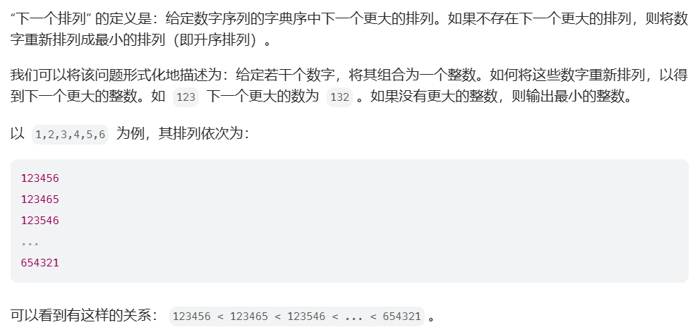
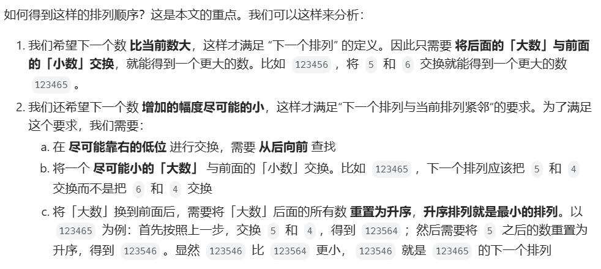
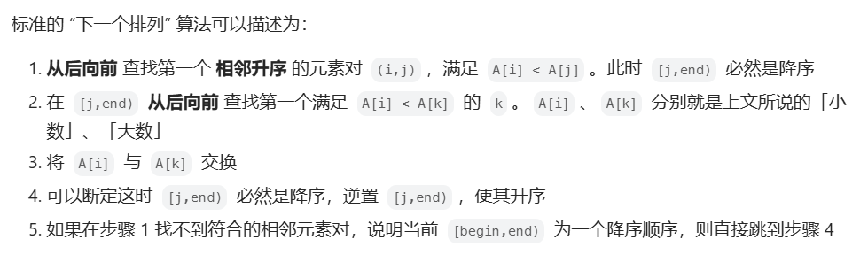
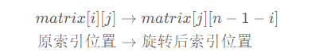

# Hot 100 面试题

[toc]


## 哈希

## [1. 两数之和](https://leetcode.cn/problems/two-sum/)

### 1.题目描述

给定一个整数数组 `nums` 和一个整数目标值 `target`，请你在该数组中找出 **和为目标值** *`target`* 的那 **两个** 整数，并返回它们的数组下标。

你可以假设每种输入只会对应一个答案，并且你不能使用两次相同的元素。

你可以按任意顺序返回答案。

**示例 1：**

```
输入：nums = [2,7,11,15], target = 9
输出：[0,1]
解释：因为 nums[0] + nums[1] == 9 ，返回 [0, 1] 。
```

**示例 2：**

```
输入：nums = [3,2,4], target = 6
输出：[1,2]
```

**示例 3：**

```
输入：nums = [3,3], target = 6
输出：[0,1]
```

**提示：**

- $2 <= nums.length <= 10^4$
- $-10^9 <= nums[i] <= 10^9$
- $-10^9 <= target <= 10^9$
- **只会存在一个有效答案**

**进阶：**你可以想出一个时间复杂度小于 $O(n^2)$ 的算法吗？

### 2.题解

#### 2.1 哈希集合-推荐

```java
class Solution {
    public int[] twoSum(int[] nums, int target) {
        Map<Integer,Integer> map = new HashMap<>();
        for(int i=0;i<nums.length;i++){
            int diff = target - nums[i];
            if(map.containsKey(diff)){
                return new int[]{map.get(diff),i};
            } else{
                map.put(nums[i],i);
            }
        }
        return new int[2];
    }
}
```


## 题目2：[49. 字母异位词分组](https://leetcode.cn/problems/group-anagrams/)

### 1.题目描述

给你一个字符串数组，请你将 **字母异位词** 组合在一起。可以按任意顺序返回结果列表。

**字母异位词** 是由重新排列源单词的所有字母得到的一个新单词。

**示例 1:**

```
输入: strs = ["eat", "tea", "tan", "ate", "nat", "bat"]
输出: [["bat"],["nat","tan"],["ate","eat","tea"]]
```

**示例 2:**

```
输入: strs = [""]
输出: [[""]]
```

**示例 3:**

```
输入: strs = ["a"]
输出: [["a"]]
```

**提示：**

- $1 <= strs.length <= 10^4$
- `0 <= strs[i].length <= 100`
- `strs[i]` 仅包含小写字母

### 2.题解

- 这个题目的关键是把谁作为键，根据把谁作为键衍生出来两种方法

#### 2.1 方法1

```java
class Solution {
    public List<List<String>> groupAnagrams(String[] strs) {
        Map<String,List<String>> map = new HashMap<>();
        for(String str : strs){
            char[] chs = str.toCharArray();
            Arrays.sort(chs);
            String key = new String(chs);
            List<String> list = map.getOrDefault(key,new ArrayList<String>());
            list.add(str);
            map.put(newStr,list);
        }
        return new ArrayList<>(map.values());
    }
}
```

#### 2.2 方法2-面试推荐

```java
class Solution {
    public List<List<String>> groupAnagrams(String[] strs) {
        Map<String,List<String>> map = new HashMap<>();
        for(String str : strs){
            int[] counts = new int[26];
            for(int i=0;i<str.length();i++){
                counts[str.charAt(i) - 'a']++;
            }

            StringBuilder sb = new StringBuilder();
            for(int i=0;i<counts.length;i++){
                if(counts[i] != 0){
                    //字母 拼接 次数
                    sb.append((char) 'a' + i).append(counts[i]);
                }
            }

            String key = sb.toString();
            List<String> list = map.getOrDefault(key,new ArrayList<>());
            list.add(str);
            map.put(key,list);
        }
        return new ArrayList<>(map.values());
    }
}
```

## 题目3：[128. 最长连续序列](https://leetcode.cn/problems/longest-consecutive-sequence/)

### 1.题目描述

给定一个未排序的整数数组 `nums` ，找出数字连续的最长序列（不要求序列元素在原数组中连续）的长度。

请你设计并实现时间复杂度为 `O(n)` 的算法解决此问题。

**示例 1：**

```
输入：nums = [100,4,200,1,3,2]
输出：4
解释：最长数字连续序列是 [1, 2, 3, 4]。它的长度为 4。
```

**示例 2：**

```
输入：nums = [0,3,7,2,5,8,4,6,0,1]
输出：9
```

**提示：**

- $0 <= nums.length <= 10^5$
- $-10^9 <= nums[i] <= 10^9$

### 2.题解-推荐

- 核心思路：对于 nums 中的元素 x，以 x 为起点，不断查找下一个数 x+1,x+2,⋯ 是否在 nums 中，并统计序列的长度。
- 为了做到 O(n) 的时间复杂度，需要两个关键优化：
  - 把 nums 中的数都放入一个哈希集合中，这样可以 O(1) 判断数字是否在 nums 中。
  - 如果 x−1 在哈希集合中，则不以 x 为起点。为什么？因为以 x−1 为起点计算出的序列长度，一定比以 x 为起点计算出的序列长度要长！这样可以避免大量重复计算。比如 nums=[3,2,4,5]，从 3 开始，我们可以找到 3,4,5 这个连续序列；而从 2 开始，我们可以找到 2,3,4,5 这个连续序列，一定比从 3 开始的序列更长。

- 代码：

```java
class Solution {
    public int longestConsecutive(int[] nums) {
        Set<Integer> set = new HashSet<>();
        for (int num : nums) {
            set.add(num);
        }
        int result = 0;
        for (int x : set) {
            if (set.contains(x - 1))
                continue;

            // x 是序列的起点
            int y = x + 1;
            while (set.contains(y))
                y++;// 不断查找下一个数是否在哈希集合中
            // 循环结束，y-1 是最后一个在哈希集合中的元素
            result = Math.max(result, y - x);
        }
        return result;
    }
}
```

- 复杂度：
  - 时间复杂度：
    - 构建 HashSet 需要$O(n)$
    - 遍历集合并找到连续序列，最坏情况下每个数字被访问两次（一次检查起点，一次在序列中前进），因此总时间复杂度为$O(n)$
  - 空间复杂度：
    - 主要是 HashSet 存储所有元素，空间复杂度为$O(n)$


## 双指针

## [283. 移动零](https://leetcode.cn/problems/move-zeroes/)

### 1.题目描述

给定一个数组 `nums`，编写一个函数将所有 `0` 移动到数组的末尾，同时保持非零元素的相对顺序。

**请注意** ，必须在不复制数组的情况下原地对数组进行操作。

**示例 1:**

```
输入: nums = [0,1,0,3,12]
输出: [1,3,12,0,0]
```

**示例 2:**

```
输入: nums = [0]
输出: [0]
```

**提示**:

- $1 <= nums.length <= 10^4$
- $-2^{31} <= nums[i] <= 2^{31} - 1$

**进阶：**你能尽量减少完成的操作次数吗？

### 2.题解

#### 2.1 两次遍历

```java
class Solution {
    public void moveZeroes(int[] nums) {
        int left = 0, right;
        for (right = 0; right < nums.length; right++) {
            if (nums[right] != 0) {
                nums[left++] = nums[right];
            }
        }
        while (left < nums.length) {
            nums[left] = 0;
            left++;
        }
    }
}
```

#### 2.2 一次遍历-面试推荐

```java
class Solution {
    public void moveZeroes(int[] nums) {
        int left = 0,right;
        for(right = 0 ; right < nums.length;right++){
            if(nums[right] != 0){
                int temp = nums[left];
                nums[left] = nums[right];
                nums[right] = temp;
                left++;
            }
        }
    }
}
```

### 3.相似题目

- [27. 移除元素](https://leetcode.cn/problems/remove-element/)

  ```java
  class Solution {
      public int removeElement(int[] nums, int val) {
          int left = 0,right;
          for(right = 0; right < nums.length;right++){
              if(nums[right] != val){
                  nums[left++] = nums[right];
              }
          }
          return left;
      }
  }
  ```

- [2460. 对数组执行操作](https://leetcode.cn/problems/apply-operations-to-an-array/)

  ```java
  class Solution {
      public int[] applyOperations(int[] nums) {
          //直接模拟
          int left = 0, right;
          for (right = 0; right < nums.length; right++) {
              if (nums[right] != 0) {
                  if (right + 1 < nums.length && nums[right] == nums[right + 1]) {
                      nums[right] = nums[right] * 2;
                      nums[right + 1] = 0;
                  }
                  int temp = nums[left];
                  nums[left] = nums[right];
                  nums[right] = temp;
                  left++;
              }
          }
          return nums;
      }
  }
  ```

### 4.思路阐述

- 一个指针在前面扫描，一个指针在后面统计，如果要保留指定的值就需要把两个指针的值进行交换

## 15. 三数之和](https://leetcode.cn/problems/3sum/)

### 1.题目描述

给你一个整数数组 `nums` ，判断是否存在三元组 `[nums[i], nums[j], nums[k]]` 满足 `i != j`、`i != k` 且 `j != k` ，同时还满足 `nums[i] + nums[j] + nums[k] == 0` 。请你返回所有和为 `0` 且不重复的三元组。

**注意：**答案中不可以包含重复的三元组。

**示例 1：**

```
输入：nums = [-1,0,1,2,-1,-4]
输出：[[-1,-1,2],[-1,0,1]]
解释：
nums[0] + nums[1] + nums[2] = (-1) + 0 + 1 = 0 。
nums[1] + nums[2] + nums[4] = 0 + 1 + (-1) = 0 。
nums[0] + nums[3] + nums[4] = (-1) + 2 + (-1) = 0 。
不同的三元组是 [-1,0,1] 和 [-1,-1,2] 。
注意，输出的顺序和三元组的顺序并不重要。
```

**示例 2：**

```
输入：nums = [0,1,1]
输出：[]
解释：唯一可能的三元组和不为 0 。
```

**示例 3：**

```
输入：nums = [0,0,0]
输出：[[0,0,0]]
解释：唯一可能的三元组和为 0 。
```

**提示：**

- `3 <= nums.length <= 3000`
- $-10^5 <= nums[i] <= 10^5$

### 2.题解

#### 2.1 排序+双指针（关键是去重）

```java
class Solution {
    public List<List<Integer>> threeSum(int[] nums) {
        // 创建结果返回值
        List<List<Integer>> result = new ArrayList<>();
        // 先排序：升序排列
        Arrays.sort(nums);
        for (int first = 0; first < nums.length - 2; first++) {
            //去重1
            if(first > 0 && nums[first] == nums[first - 1]) continue;
            //优化1
            if(nums[first] > 0) break;
            int second = first + 1;
            int third = nums.length - 1;
            while (second < third) {
                int sum = nums[first] + nums[second] + nums[third];
                if (sum == 0) {
                    result.add(Arrays.asList(nums[first], nums[second], nums[third]));
                    //去重2
                    while(second < third && nums[second] == nums[second + 1]) second++;
                    while(second < third && nums[third] == nums[third - 1]) third--;
                    second++;
                    third--;
                } else if (sum < 0) {
                    second++;
                } else {
                    third--;
                }
            }
        }
        return result;
    }
}
```

### 3.相似题目

- [16. 最接近的三数之和](https://leetcode.cn/problems/3sum-closest/)

  ```java
  class Solution {
      public int threeSumClosest(int[] nums, int target) {
          int diff = Integer.MAX_VALUE;
          int result = 0;
          //排序
          Arrays.sort(nums);
          for(int first = 0; first < nums.length - 2;first++){
              if(first > 0 && nums[first] == nums[first - 1]) continue;
              int second = first + 1;
              int third = nums.length - 1;
              while(second < third){
                  int sum = nums[first] + nums[second] + nums[third];

                  if(sum == target) return sum;
                  else if(sum < target)
                      second++;
                  else
                      third--;

                  if(Math.abs(sum - target) < diff){
                      diff = Math.abs(sum - target);
                      result = sum;
                  }
              }
          }
          return result;
      }
  }
  ```

- [18. 四数之和](https://leetcode.cn/problems/4sum/)

## [11. 盛最多水的容器](https://leetcode.cn/problems/container-with-most-water/)

### 1.题目描述

给定一个长度为 `n` 的整数数组 `height` 。有 `n` 条垂线，第 `i` 条线的两个端点是 `(i, 0)` 和 `(i, height[i])` 。

找出其中的两条线，使得它们与 `x` 轴共同构成的容器可以容纳最多的水。

返回容器可以储存的最大水量。

**说明：**你不能倾斜容器。

**示例 1：**


```
输入：[1,8,6,2,5,4,8,3,7]
输出：49
解释：图中垂直线代表输入数组 [1,8,6,2,5,4,8,3,7]。在此情况下，容器能够容纳水（表示为蓝色部分）的最大值为 49。
```

**示例 2：**

```
输入：height = [1,1]
输出：1
```

**提示：**

- `n == height.length`
- $2 <= n <= 10^5$
- $0 <= height[i] <= 10^4$

### 2.题解

#### 2.1 双指针-面试推荐

```java
class Solution {
    public int maxArea(int[] height) {
        int result = 0;
        int left = 0, right = height.length - 1;
        while (left < right) {
            int area = Math.min(height[left], height[right]) * (right - left);
            result = Math.max(area, result);
            if (height[left] < height[right]) {
                left++;
            } else {
                right--;
            }
        }
        return result;
    }
}
```


## 42. 接雨水](https://leetcode.cn/problems/trapping-rain-water/)

### 1.题目描述

给定 `n` 个非负整数表示每个宽度为 `1` 的柱子的高度图，计算按此排列的柱子，下雨之后能接多少雨水。


**示例 1：**


```
输入：height = [0,1,0,2,1,0,1,3,2,1,2,1]
输出：6
解释：上面是由数组 [0,1,0,2,1,0,1,3,2,1,2,1] 表示的高度图，在这种情况下，可以接 6 个单位的雨水（蓝色部分表示雨水）。
```

**示例 2：**

```
输入：height = [4,2,0,3,2,5]
输出：9
```

**提示：**

- `n == height.length`
- $1 <= n <= 2 * 10^4$
- $0 <= height[i] <= 10^5$

### 2.题解

#### 2.2 双指针-面试推荐

```java
class Solution {
    public int trap(int[] height) {
        int result = 0;
        int left = 0,right = height.length - 1;
        int leftMax = 0,rightMax =0;
        while(left < right){
            leftMax = Math.max(leftMax,height[left]);
            rightMax = Math.max(rightMax,height[right]);
            if(height[left] < height[right]){
                result += leftMax - height[left];
                left++;
            } else {
                result += rightMax - height[right];
                right--;
            }
        }
        return result;
    }
}
```

#### 2.3 单调栈

```java
class Solution {
    public int trap(int[] height) {
        int result = 0;
        Deque<Integer> stack = new LinkedList<>();
        int n = height.length;
        for (int i = 0; i < n; i++) {
            while (!stack.isEmpty() && height[i] > height[stack.peek()]) {
                int top = stack.pop();
                if (stack.isEmpty())
                    break;
                int left = stack.peek();
                int currWidth = i - left - 1;
                int currHeight = Math.min(height[left], height[i]) - height[top];
                result += currWidth * currHeight;
            }
            stack.push(i);
        }
        return result;
    }
}
```


## 二分查找

## 35. 搜索插入位置](https://leetcode.cn/problems/search-insert-position/)

### 1.题目描述

给定一个排序数组和一个目标值，在数组中找到目标值，并返回其索引。如果目标值不存在于数组中，返回它将会被按顺序插入的位置。

请必须使用时间复杂度为 `O(log n)` 的算法。

**示例 1:**

```
输入: nums = [1,3,5,6], target = 5
输出: 2
```

**示例 2:**

```
输入: nums = [1,3,5,6], target = 2
输出: 1
```

**示例 3:**

```
输入: nums = [1,3,5,6], target = 7
输出: 4
```

**提示:**

- $1 <= nums.length <= 10^4$
- $-10^4 <= nums[i] <= 10^4$
- `nums` 为 **无重复元素** 的 **升序** 排列数组
- $-10^4 <= target <= 10^4$

### 2.题解

#### 2.1 二分查找-面试推荐

```java
class Solution {
    public int searchInsert(int[] nums, int target) {
        int left = 0, right = nums.length - 1;
        while (left <= right) {
            int mid = left + (right - left) / 2;
            if (target <= nums[mid]) {
                right = mid - 1;
            } else {
                left = mid + 1;
            }
        }
        return left;
    }
}
```

## [74. 搜索二维矩阵](https://leetcode.cn/problems/search-a-2d-matrix/)

### 1.题目描述

给你一个满足下述两条属性的 `m x n` 整数矩阵：

- 每行中的整数从左到右按非严格递增顺序排列。
- 每行的第一个整数大于前一行的最后一个整数。

给你一个整数 `target` ，如果 `target` 在矩阵中，返回 `true` ；否则，返回 `false` 。

**示例 1：**


```
输入：matrix = [[1,3,5,7],[10,11,16,20],[23,30,34,60]], target = 3
输出：true
```

**示例 2：**


```
输入：matrix = [[1,3,5,7],[10,11,16,20],[23,30,34,60]], target = 13
输出：false
```

**提示：**

- `m == matrix.length`
- `n == matrix[i].length`
- `1 <= m, n <= 100`
- $-10^4 <= matrix[i][j], target <= 10^4$

### 2.题解

#### 2.1 二分查找-面试推荐

```java
class Solution {
    public boolean searchMatrix(int[][] matrix, int target) {
        int n = matrix.length;
        int m = matrix[0].length;
        int left = 0,right = n * m - 1;
        while(left <= right){
            int mid = left + (right - left) / 2;
            if(target > matrix[mid / m][mid % m]){
                left = mid + 1;
            } else {
                right = mid - 1;
            }
        }
        //注意这个判断最重要
        return left < n * m ? (matrix[left / m][left % m] == target ? true : false)  : false;
    }
}
```

## [34. 在排序数组中查找元素的第一个和最后一个位置](https://leetcode.cn/problems/find-first-and-last-position-of-element-in-sorted-array/)

### 1.题目描述

给你一个按照非递减顺序排列的整数数组 `nums`，和一个目标值 `target`。请你找出给定目标值在数组中的开始位置和结束位置。

如果数组中不存在目标值 `target`，返回 `[-1, -1]`。

你必须设计并实现时间复杂度为 `O(log n)` 的算法解决此问题。

**示例 1：**

```
输入：nums = [5,7,7,8,8,10], target = 8
输出：[3,4]
```

**示例 2：**

```
输入：nums = [5,7,7,8,8,10], target = 6
输出：[-1,-1]
```

**示例 3：**

```
输入：nums = [], target = 0
输出：[-1,-1]
```

**提示：**

- `0 <= nums.length <= 105`
- `-109 <= nums[i] <= 109`
- `nums` 是一个非递减数组
- `-109 <= target <= 109`

### 2.题解

#### 2.1 二分查找-面试推荐

```java
class Solution {
    public int[] searchRange(int[] nums, int target) {
        int leftIndex = leftMost(nums, target);
        if (leftIndex < nums.length && nums[leftIndex] == target) {
            return new int[] { leftIndex, rightMost(nums, target) };
        }
        return new int[] { -1, -1 };
    }

    private int leftMost(int[] nums, int target) {
        int left = 0, right = nums.length - 1;
        while (left <= right) {
            int mid = left + (right - left) / 2;
            if (target <= nums[mid]) {
                right = mid - 1;
            } else {
                left = mid + 1;
            }
        }
        return left;
    }

    private int rightMost(int[] nums, int target) {
        int left = 0, right = nums.length - 1;
        while (left <= right) {
            int mid = left + (right - left) / 2;
            if (target < nums[mid]) {
                right = mid - 1;
            } else {
                left = mid + 1;
            }
        }
        return left - 1;
    }
}
```

### 3.补充

#### 3.1 找开始索引

- **结论1：返回值`left`为大于等于目标值的最靠左的元素的索引**（此时`left = right + 1`）

  - 如果目标值存在，返回值`left`就是等于目标值的最靠左的索引
  - 如果目标值不存在，返回值`left`就是大于目标值的最靠左的元素的索引

- **结论2：** `right`无论目标值是否存在，都表征的是小于目标值最靠右的元素的索引**（不要硬记，记住第一个结论，会推出这个结论）**

- 代码：

  ```java
  public int Leftmost(int[] nums, int target) {
      int left = 0, right = nums.length - 1;
      while (left <= right) {
          int mid = left + (right - left) / 2;
          if (target <= nums[mid]) {
              right = mid - 1;
          } else {
              left = mid + 1;
          }
      }
      return left;
  }
  ```

#### 3.2 找结束索引

- **结论1：返回值`left-1=right`为小于等于目标值的最靠右的元素的索引**

  - 如果目标值存在，返回值`left-1`就是等于目标值的最靠右的索引
  - 如果目标值不存在，返回值`left-1`就是小于目标值的最靠右的元素的索引

- 代码：

  ```java
  public static int Rightmost(int[] nums, int target) {
      int left = 0, right = nums.length - 1;
      while (left <= right) {
          int mid = left + (right - left) / 2;
          if (target < nums[mid]) {
              right = mid - 1;
          } else {
              left = mid + 1;
          }
      }
      return left - 1;
  }
  ```

## [33. 搜索旋转排序数组](https://leetcode.cn/problems/search-in-rotated-sorted-array/)

### 1.题目描述

整数数组 `nums` 按升序排列，数组中的值 **互不相同** 。

在传递给函数之前，`nums` 在预先未知的某个下标 `k`（`0 <= k < nums.length`）上进行了 **旋转**，使数组变为 `[nums[k], nums[k+1], ..., nums[n-1], nums[0], nums[1], ..., nums[k-1]]`（下标 **从 0 开始** 计数）。例如， `[0,1,2,4,5,6,7]` 在下标 `3` 处经旋转后可能变为 `[4,5,6,7,0,1,2]` 。

给你 **旋转后** 的数组 `nums` 和一个整数 `target` ，如果 `nums` 中存在这个目标值 `target` ，则返回它的下标，否则返回 `-1` 。

你必须设计一个时间复杂度为 `O(log n)` 的算法解决此问题。

**示例 1：**

```
输入：nums = [4,5,6,7,0,1,2], target = 0
输出：4
```

**示例 2：**

```
输入：nums = [4,5,6,7,0,1,2], target = 3
输出：-1
```

**示例 3：**

```
输入：nums = [1], target = 0
输出：-1
```

**提示：**

- `1 <= nums.length <= 5000`
- $-10^4 <= nums[i] <= 10^4$
- `nums` 中的每个值都 **独一无二**
- 题目数据保证 `nums` 在预先未知的某个下标上进行了旋转
- $-10^4 <= target <= 10^4$

### 2.题解

#### 2.1 一次-二分查找

```java
class Solution {
    public int search(int[] nums, int target) {
        int left = 0;
        int right = nums.length - 1;

        while (left < right) {
            int mid = left + (right - left) / 2;
            if (check(nums, target, mid)) {
                right = mid;
            } else {
                left = mid + 1;
            }
        }

        // 最后检查 left（此时 left 和 right 相等）位置的元素是否为目标值
        return nums[left] == target ? left : -1;
    }

    private boolean check(int[] nums, int target, int i) {
        int x = nums[i];
        int end = nums[nums.length - 1];
        if (x > end) {
            //说明target肯定在左边的第一段
            return target > end && x >= target;
        }
        return target > end || x >= target;
    }
}
```

#### 2.2 两次-二分查找-面试推荐

```java
class Solution {
    public int search(int[] nums, int target) {
        // 两次二分
        int n = nums.length;
        //一次二分
        int i = findMin(nums);
        //二次二分
        if (target > nums[n - 1]) {
            return bianrySearch(nums, 0, i - 1, target);
        }
        return bianrySearch(nums, i, n - 1, target);
    }

    private int findMin(int[] nums) {
        int left = 0, right = nums.length - 1;
        while (left < right) {
            int mid = left + (right - left) / 2;
            if (nums[mid] < nums[right]) {
                right = mid;
            } else {
                left = mid + 1;
            }
        }
        return left;
    }

    private int bianrySearch(int[] nums, int start, int end, int target) {
        int left = start, right = end;
        while (left <= right) {
            int mid = left + (right - left) / 2;
            if (target <= nums[mid]) {
                right = mid - 1;
            } else {
                left = mid + 1;
            }
        }
        return left <= end ? (nums[left] == target ? left : -1) : -1;
    }
}
```

### 3.相似题目

- [81. 搜索旋转排序数组 II](https://leetcode.cn/problems/search-in-rotated-sorted-array-ii/):此题与 [搜索旋转排序数组](https://leetcode-cn.com/problems/search-in-rotated-sorted-array/description/) 相似，但本题中的 `nums` 可能包含 **重复** 元素。这会影响到程序的时间复杂度吗？会有怎样的影响，为什么？

  ```java
  class Solution {
      public boolean search(int[] nums, int target) {
          int n = nums.length;
          if(n == 0) return false;
          if(n == 1) return target == nums[0] ? true : false;
          int left = 0,right = n - 1;
          while(left <= right){
              int mid = left + (right - left) / 2;
              if(target == nums[mid]) return true;
              if(nums[left] == nums[mid]) {
                  left++;
                  continue;
              } else if(nums[0] < nums[mid]){
                  //区间[left,mid]是单调升
                  if(nums[0] <= target && target < nums[mid]){
                      right = mid - 1;
                  } else {
                      left = mid + 1;
                  }
              } else {
                  //区间[mid,right]是单调升
                  if(target > nums[mid] && target <= nums[n-1]){
                      left = mid + 1;
                  } else {
                      right = mid - 1;
                  }
              }
          }
          return false;
      }
  }
  ```


## [153. 寻找旋转排序数组中的最小值](https://leetcode.cn/problems/find-minimum-in-rotated-sorted-array/)

### 1.题目描述

已知一个长度为 `n` 的数组，预先按照升序排列，经由 `1` 到 `n` 次 **旋转** 后，得到输入数组。例如，原数组 `nums = [0,1,2,4,5,6,7]` 在变化后可能得到：

- 若旋转 `4` 次，则可以得到 `[4,5,6,7,0,1,2]`
- 若旋转 `7` 次，则可以得到 `[0,1,2,4,5,6,7]`

注意，数组 `[a[0], a[1], a[2], ..., a[n-1]]` **旋转一次** 的结果为数组 `[a[n-1], a[0], a[1], a[2], ..., a[n-2]]` 。

给你一个元素值 **互不相同** 的数组 `nums` ，它原来是一个升序排列的数组，并按上述情形进行了多次旋转。请你找出并返回数组中的 **最小元素** 。

你必须设计一个时间复杂度为 `O(log n)` 的算法解决此问题。

**示例 1：**

```
输入：nums = [3,4,5,1,2]
输出：1
解释：原数组为 [1,2,3,4,5] ，旋转 3 次得到输入数组。
```

**示例 2：**

```
输入：nums = [4,5,6,7,0,1,2]
输出：0
解释：原数组为 [0,1,2,4,5,6,7] ，旋转 3 次得到输入数组。
```

**示例 3：**

```
输入：nums = [11,13,15,17]
输出：11
解释：原数组为 [11,13,15,17] ，旋转 4 次得到输入数组。
```

**提示：**

- `n == nums.length`
- `1 <= n <= 5000`
- `-5000 <= nums[i] <= 5000`
- `nums` 中的所有整数 **互不相同**
- `nums` 原来是一个升序排序的数组，并进行了 `1` 至 `n` 次旋转

### 2.题解

#### 2.1 二分查找-闭区间-方法1

- 当left ==  right时，区间为1，肯定是最小元素

```java
class Solution {
    public int findMin(int[] nums) {
        // 闭区间二分
        int n = nums.length;
        int left = 0, right = n - 1;
        while (left < right) {
            int mid = left + (right - left) / 2;
            if (nums[mid] < nums[right]) {
                // 最小值在 mid 或 mid 的左侧
                right = mid;
            } else {
                // 最小值在 mid 的右侧
                left = mid + 1;
            }
        }
        // 当 left 和 right 相遇时，即为最小值的索引
        return nums[left];
    }
}
```

#### 2.2二分查找-闭区间-面试推荐

```java
class Solution {
    public int findMin(int[] nums) {
        int n = nums.length;
        int left = 0, right = n - 1;
        while (left < right) {
            int mid = left + (right - left) / 2;
            if (nums[mid] < nums[n - 1]) {
                right = mid;
            } else {
                left = mid + 1;
            }
        }
        return nums[left];
    }
}
```

### 3.相似题目

- [154. 寻找旋转排序数组中的最小值 II](https://leetcode.cn/problems/find-minimum-in-rotated-sorted-array-ii/)：这道题与 [寻找旋转排序数组中的最小值](https://leetcode-cn.com/problems/find-minimum-in-rotated-sorted-array/description/) 类似，但 `nums` 可能包含重复元素。允许重复会影响算法的时间复杂度吗？会如何影响，为什么？

### 4.思路阐述

- 第一种情况是 *nums*[*pivot*]<*nums*[*high*]。如下图所示，这说明 *nums*[*pivot*] 是最小值右侧的元素，因此我们可以忽略二分查找区间的右半部分。


- 第二种情况是 *nums*[*pivot*]>*nums*[*high*]。如下图所示，这说明 *nums*[*pivot*] 是最小值左侧的元素，因此我们可以忽略二分查找区间的左半部分。


## [4. 寻找两个正序数组的中位数](https://leetcode.cn/problems/median-of-two-sorted-arrays/)

### 1.题目描述

给定两个大小分别为 `m` 和 `n` 的正序（从小到大）数组 `nums1` 和 `nums2`。请你找出并返回这两个正序数组的 **中位数** 。

算法的时间复杂度应该为 `O(log (m+n))` 。

**示例 1：**

```
输入：nums1 = [1,3], nums2 = [2]
输出：2.00000
解释：合并数组 = [1,2,3] ，中位数 2
```

**示例 2：**

```
输入：nums1 = [1,2], nums2 = [3,4]
输出：2.50000
解释：合并数组 = [1,2,3,4] ，中位数 (2 + 3) / 2 = 2.5
```

**提示：**

- `nums1.length == m`
- `nums2.length == n`
- `0 <= m <= 1000`
- `0 <= n <= 1000`
- `1 <= m + n <= 2000`
- `-106 <= nums1[i], nums2[i] <= 106`

### 2.题解

#### 2.2 二分查找-面试推荐

```java
class Solution {
    public double findMedianSortedArrays(int[] nums1, int[] nums2) {
        if (nums1.length > nums2.length) {
            // 交换 nums1 和 nums2，保证下面的i可以从0开始枚举
            int[] tmp = nums1;
            nums1 = nums2;
            nums2 = tmp;
        }

        int m = nums1.length;
        int n = nums2.length;
        int[] a = new int[m + 2];
        int[] b = new int[n + 2];
        a[0] = b[0] = Integer.MIN_VALUE;// 最左边插入 - ∞
        a[m + 1] = b[n + 1] = Integer.MAX_VALUE;// 最右边插入 ∞
        System.arraycopy(nums1, 0, a, 1, m); // 数组没法直接插入，只能 copy
        System.arraycopy(nums2, 0, b, 1, n);

        int left = 0, right = m + 1;
        while (left + 1 < right) {
            int i = (left + right) / 2;
            int j = (m + n + 1) / 2 - i;
            if (a[i] <= b[j + 1]) {
                left = i;// 缩小二分区间为 (i, right)
            } else {
                right = i;// 缩小二分区间为 (left, i)
            }
        }

        int i = left;
        int j = (m + n + 1) / 2 - i;
        int max1 = Math.max(a[i], b[j]);
        int min2 = Math.min(a[i + 1], b[j + 1]);
        return (m + n) % 2 > 0 ? max1 : (max1 + min2) / 2.0;
    }
}
```

## 滑动窗口

## [3. 无重复字符的最长子串](https://leetcode.cn/problems/longest-substring-without-repeating-characters/)

### 1.题目描述

给定一个字符串 `s` ，请你找出其中不含有重复字符的 **最长子串**的长度。

**示例 1:**

```
输入: s = "abcabcbb"
输出: 3
解释: 因为无重复字符的最长子串是 "abc"，所以其长度为 3。
```

**示例 2:**

```
输入: s = "bbbbb"
输出: 1
解释: 因为无重复字符的最长子串是 "b"，所以其长度为 1。
```

**示例 3:**

```
输入: s = "pwwkew"
输出: 3
解释: 因为无重复字符的最长子串是 "wke"，所以其长度为 3。
     请注意，你的答案必须是 子串 的长度，"pwke" 是一个子序列，不是子串。
```

**提示：**

- `0 <= s.length <= 5 * 104`
- `s` 由英文字母、数字、符号和空格组成

### 2.题解

#### 2.3 优化-哈希数组-面试推荐

```java
class Solution {
    public int lengthOfLongestSubstring(String s) {
        int[] chs = new int[128];
        int result = 0;
        int left = 0,right;
        for(right = 0;right < s.length();right++){
            char c = s.charAt(right);
            while(chs[c] >= 1){
                chs[s.charAt(left)]--;
                left++;
            }
            chs[c]++;
            result = Math.max(result,right - left + 1);
        }
        return result;
    }
}
```


## [438. 找到字符串中所有字母异位词](https://leetcode.cn/problems/find-all-anagrams-in-a-string/)

### 1.题目描述

给定两个字符串 `s` 和 `p`，找到 `s` 中所有 `p` 的 **异位词**的子串，返回这些子串的起始索引。不考虑答案输出的顺序。

**示例 1:**

```
输入: s = "cbaebabacd", p = "abc"
输出: [0,6]
解释:
起始索引等于 0 的子串是 "cba", 它是 "abc" 的异位词。
起始索引等于 6 的子串是 "bac", 它是 "abc" 的异位词。
```

 **示例 2:**

```
输入: s = "abab", p = "ab"
输出: [0,1,2]
解释:
起始索引等于 0 的子串是 "ab", 它是 "ab" 的异位词。
起始索引等于 1 的子串是 "ba", 它是 "ab" 的异位词。
起始索引等于 2 的子串是 "ab", 它是 "ab" 的异位词。
```

**提示:**

- $1 <= s.length, p.length <= 3 * 10^4$
- `s` 和 `p` 仅包含小写字母

### 2.题解

#### 2.2 不定长滑窗-面试推荐

```java
class Solution {
    public List<Integer> findAnagrams(String s, String p) {
        List<Integer> reuslt = new ArrayList<>();
        int[] chs = new int[26];
        for (char ch : p.toCharArray()) {
            chs[ch - 'a']++;
        }
        int left = 0;
        for (int right = 0; right < s.length(); right++) {
            char c = s.charAt(right);
            chs[c - 'a']--;
            while(chs[c - 'a'] < 0){
                chs[s.charAt(left) - 'a']++;
                left++;
            }
            if(right - left + 1 == p.length())
                reuslt.add(left);
        }
        return reuslt;
    }
}
```


## [209. 长度最小的子数组](https://leetcode.cn/problems/minimum-size-subarray-sum/)

### 1.题目描述

给定一个含有 `n` 个正整数的数组和一个正整数 `target` **。**

找出该数组中满足其总和大于等于 `target` 的长度最小的 **子数组**`[numsl, numsl+1, ..., numsr-1, numsr]` ，并返回其长度**。**如果不存在符合条件的子数组，返回 `0` 。

**示例 1：**

```
输入：target = 7, nums = [2,3,1,2,4,3]
输出：2
解释：子数组 [4,3] 是该条件下的长度最小的子数组。
```

**示例 2：**

```
输入：target = 4, nums = [1,4,4]
输出：1
```

**示例 3：**

```
输入：target = 11, nums = [1,1,1,1,1,1,1,1]
输出：0
```

**提示：**

- `1 <= target <= 109`
- `1 <= nums.length <= 105`
- `1 <= nums[i] <= 104`

**进阶：**

- 如果你已经实现 `O(n)` 时间复杂度的解法, 请尝试设计一个 `O(n log(n))` 时间复杂度的解法。

### 2.题解

#### 2.1 滑动窗口 + 双指针-面试推荐

```java
class Solution {
    public int minSubArrayLen(int target, int[] nums) {
        // 初始化滑动窗口的和为0
        int sum = 0;
        // 初始化左指针，右指针将通过循环向右移动
        int left = 0, right;
        // 初始化最小长度为数组长度+1，这是一个不可能的最大值
        int minLen = nums.length + 1;

        // 通过右指针遍历数组
        for (right = 0; right < nums.length; right++) {
            // 将当前元素加入滑动窗口的和
            sum += nums[right];

            // 当滑动窗口内的和大于等于目标值时，尝试缩小窗口
            while (sum >= target) {
                // 更新最小长度为当前窗口的长度
                minLen = Math.min(minLen, right - left + 1);
                // 缩小窗口，即将左指针指向的值移出窗口
                sum -= nums[left++];
            }
        }

        // 如果没有找到符合条件的子数组，返回0，否则返回最小长度
        return minLen == nums.length + 1 ? 0 : minLen;
    }
}
```


## [718. 最长重复子数组](https://leetcode.cn/problems/maximum-length-of-repeated-subarray/)

### 1.题目描述

给两个整数数组 `nums1` 和 `nums2` ，返回 *两个数组中 **公共的** 、长度最长的子数组的长度* 。

**示例 1：**

```
输入：nums1 = [1,2,3,2,1], nums2 = [3,2,1,4,7]
输出：3
解释：长度最长的公共子数组是 [3,2,1] 。
```

**示例 2：**

```
输入：nums1 = [0,0,0,0,0], nums2 = [0,0,0,0,0]
输出：5
```

**提示：**

- `1 <= nums1.length, nums2.length <= 1000`
- `0 <= nums1[i], nums2[i] <= 100`

### 2.题解

#### 2.1 滑动窗口

```java
```


## [76. 最小覆盖子串](https://leetcode.cn/problems/minimum-window-substring/)

### 1.题目描述

给你一个字符串 `s` 、一个字符串 `t` 。返回 `s` 中涵盖 `t` 所有字符的最小子串。如果 `s` 中不存在涵盖 `t` 所有字符的子串，则返回空字符串 `""` 。

**注意：**

- 对于 `t` 中重复字符，我们寻找的子字符串中该字符数量必须不少于 `t` 中该字符数量。
- 如果 `s` 中存在这样的子串，我们保证它是唯一的答案。

**示例 1：**

```
输入：s = "ADOBECODEBANC", t = "ABC"
输出："BANC"
解释：最小覆盖子串 "BANC" 包含来自字符串 t 的 'A'、'B' 和 'C'。
```

**示例 2：**

```
输入：s = "a", t = "a"
输出："a"
解释：整个字符串 s 是最小覆盖子串。
```

**示例 3:**

```
输入: s = "a", t = "aa"
输出: ""
解释: t 中两个字符 'a' 均应包含在 s 的子串中，
因此没有符合条件的子字符串，返回空字符串。
```

**提示：**

- `m == s.length`
- `n == t.length`
- $1 <= m, n <= 10^5$
- `s` 和 `t` 由英文字母组成

**进阶：**你能设计一个在 `o(m+n)` 时间内解决此问题的算法吗？

### 2.题解

#### 2.1 暴力解法

```java
 class Solution {
    int[] sArr = new int[128];
    int[] tArr = new int[128];

    public String minWindow(String s, String t) {
        //创建结果返回值
        String result = "";
        Integer minLen = Integer.MAX_VALUE;
        // 统计字符串t
        for (int i = 0; i < t.length(); i++) {
            tArr[t.charAt(i)]++;
        }
        //滑动窗口
        int left = 0,right = 0;
        while(right < s.length()){
            sArr[s.charAt(right)]++;
            while(check(sArr,tArr)){
                if(right - left + 1 < minLen){
                    minLen = right - left + 1;
                    result = s.substring(left,right + 1);
                }
                sArr[s.charAt(left++)]--;
            }
            right++;
        }
        return result;
    }

    public boolean check(int[] sArr, int[] tArr) {
        for (int i = 0; i < 128; i++) {
            if (tArr[i] > sArr[i])
                return false;
        }
        return true;
    }
}
```

#### 2.2 优化

```java
class Solution {
    public String minWindow(String s, String t) {
        int[] sArr = new int[128];
        int[] tArr = new int[128];
        int cnt = 0;
        for (char c : t.toCharArray()) {
            if (tArr[c]++ == 0)
                cnt++;
        }

        int left = 0, right = 0;
        int minLen = Integer.MAX_VALUE;
        String result = "";

        while (right < s.length()) {
            char c = s.charAt(right);
            if (++sArr[c] == tArr[c])
                cnt--;
            while (cnt == 0) {
                if (right - left + 1 < minLen) {
                    minLen = right - left + 1;
                    result = s.substring(left, right + 1);
                }

                char x = s.charAt(left);
                if (sArr[x]-- == tArr[x])
                    cnt++;
                left++;
            }
            right++;
        }
        return result;
    }
}
```


## [239. 滑动窗口最大值](https://leetcode.cn/problems/sliding-window-maximum/)

### 1.题目描述

给你一个整数数组 `nums`，有一个大小为 `k` 的滑动窗口从数组的最左侧移动到数组的最右侧。你只可以看到在滑动窗口内的 `k` 个数字。滑动窗口每次只向右移动一位。

返回 *滑动窗口中的最大值* 。

**示例 1：**

```
输入：nums = [1,3,-1,-3,5,3,6,7], k = 3
输出：[3,3,5,5,6,7]
解释：
滑动窗口的位置                最大值
---------------               -----
[1  3  -1] -3  5  3  6  7       3
 1 [3  -1  -3] 5  3  6  7       3
 1  3 [-1  -3  5] 3  6  7       5
 1  3  -1 [-3  5  3] 6  7       5
 1  3  -1  -3 [5  3  6] 7       6
 1  3  -1  -3  5 [3  6  7]      7
```

**示例 2：**

```
输入：nums = [1], k = 1
输出：[1]
```

**提示：**

- $1 <= nums.length <= 10^5$
- $-10^4 <= nums[i] <= 10^4$
- `1 <= k <= nums.length`

### 2.题解

#### 2.2 单调栈

```java
class Solution {
    public int[] maxSlidingWindow(int[] nums, int k) {
        int n = nums.length;
        int[] result = new int[n - k + 1];
        Deque<Integer> dq = new LinkedList<>();
        for (int i = 0; i < n; i++) {
            while (!dq.isEmpty() && nums[i] >= nums[dq.peekLast()])
                dq.pollLast();

            dq.offer(i);

            while (i - dq.peek() >= k)
                dq.poll();

            if (i - k + 1 >= 0)
                result[i - k + 1] = nums[dq.peek()];
        }
        return result;
    }
}
```

- 思路描述：维护一个从队尾到对头递增的单调队列，队列长度为k，


## 技巧

## [136. 只出现一次的数字](https://leetcode.cn/problems/single-number/)

### 1.题目描述

给你一个 **非空** 整数数组 `nums` ，除了某个元素只出现一次以外，其余每个元素均出现两次。找出那个只出现了一次的元素。

你必须设计并实现线性时间复杂度的算法来解决此问题，且该算法只使用常量额外空间。

**示例 1 ：**

**输入：**nums = [2,2,1]

**输出：**1

**示例 2 ：**

**输入：**nums = [4,1,2,1,2]

**输出：**4

**示例 3 ：**

**输入：**nums = [1]

**输出：**1

**提示：**

- $1 <= nums.length <= 3 * 10^4$
- $-3 * 10^4 <= nums[i] <= 3 * 10^4$
- 除了某个元素只出现一次以外，其余每个元素均出现两次。

### 2.题解

#### 2.1 位运算

```java
class Solution {
    public int singleNumber(int[] nums) {
        int result = 0;
        for (int num : nums) {
            result ^= num;
        }
        return result;
    }
}
```

### 3.思路阐述

- 利用位运算的性质：
    - 任何数和 0 做异或运算，结果仍然是原来的数，即 *a*⊕0=*a*
    - 任何数和其自身做异或运算，结果是 0，即 *a*⊕*a*=0
    - 异或运算满足交换律和结合律，即 *a*⊕*b*⊕*a*=*b*⊕*a*⊕*a*=*b*⊕(*a*⊕*a*)=*b*⊕0=*b*

- 如果不考虑时间复杂度和空间复杂度的限制，这道题有很多种解法，可能的解法有如下几种。
    - 使用集合存储数字。遍历数组中的每个数字，如果集合中没有该数字，则将该数字加入集合，如果集合中已经有该数字，则将该数字从集合中删除，最后剩下的数字就是只出现一次的数字。
    - 使用哈希表存储每个数字和该数字出现的次数。遍历数组即可得到每个数字出现的次数，并更新哈希表，最后遍历哈希表，得到只出现一次的数字。
    - 使用集合存储数组中出现的所有数字，并计算数组中的元素之和。由于集合保证元素无重复，因此计算集合中的所有元素之和的两倍，即为每个元素出现两次的情况下的元素之和。由于数组中只有一个元素出现一次，其余元素都出现两次，因此用集合中的元素之和的两倍减去数组中的元素之和，剩下的数就是数组中只出现一次的数字。


## [169. 多数元素](https://leetcode.cn/problems/majority-element/)

### 1.题目描述

给定一个大小为 `n` 的数组 `nums` ，返回其中的多数元素。多数元素是指在数组中出现次数 **大于** `⌊ n/2 ⌋` 的元素。

你可以假设数组是非空的，并且给定的数组总是存在多数元素。

**示例 1：**

```
输入：nums = [3,2,3]
输出：3
```

**示例 2：**

```
输入：nums = [2,2,1,1,1,2,2]
输出：2
```

**提示：**

- `n == nums.length`
- `1 <= n <= 5 * 104`
- `-109 <= nums[i] <= 109`

**进阶：**尝试设计时间复杂度为 O(n)、空间复杂度为 O(1) 的算法解决此问题。

### 2.题解

#### 2.1 摩尔投票法

- 核心理念为 **票数正负抵消** 。此方法时间和空间复杂度分别为 *O*(*N*) 和 *O*(1) ，为本题的最佳解法。

```java
class Solution {
    public int majorityElement(int[] nums) {
        int candidate = 0, votes = 0;
        for (int num : nums) {
            if(votes == 0) candidate = num;
            votes += candidate == num ? 1 : -1;
        }
        return candidate;
    }
}
```

## [75. 颜色分类](https://leetcode.cn/problems/sort-colors/)

### 1.题目描述

给定一个包含红色、白色和蓝色、共 `n` 个元素的数组 `nums` ，**[原地](https://baike.baidu.com/item/原地算法)** 对它们进行排序，使得相同颜色的元素相邻，并按照红色、白色、蓝色顺序排列。

我们使用整数 `0`、 `1` 和 `2` 分别表示红色、白色和蓝色。

必须在不使用库内置的 sort 函数的情况下解决这个问题。

**示例 1：**

```
输入：nums = [2,0,2,1,1,0]
输出：[0,0,1,1,2,2]
```

**示例 2：**

```
输入：nums = [2,0,1]
输出：[0,1,2]
```

**提示：**

- `n == nums.length`
- `1 <= n <= 300`
- `nums[i]` 为 `0`、`1` 或 `2`

**进阶：**

- 你能想出一个仅使用常数空间的一趟扫描算法吗？

### 2.题解

#### 2.1 面试推荐-双指针


#### 2.1 单指针

```java
class Solution {
    public void sortColors(int[] nums) {
        int n = nums.length;
        int ptr = 0;
        for(int i=0;i<n;i++){
            if(nums[i] == 0){
                int temp = nums[i];
                nums[i] = nums[ptr];
                nums[ptr++] = temp;
            }
        }
        for(int i=ptr;i<n;i++){
            if(nums[i] == 1){
                int temp = nums[i];
                nums[i] = nums[ptr];
                nums[ptr++] = temp;
            }
        }
    }
}
```

#### 2.2 双指针

```java
class Solution {
    public void sortColors(int[] nums) {
        int n = nums.length;
        int p0 = 0, p2 = n - 1;
        int i = 0;

        while (i <= p2) {
            if (nums[i] == 0) {
                swap(nums, i, p0);
                p0++;
                i++;
            } else if (nums[i] == 2) {
                swap(nums, i, p2);
                p2--;
            } else {
                i++;
            }
        }
    }

    private void swap(int[] nums, int i, int j) {
        int temp = nums[i];
        nums[i] = nums[j];
        nums[j] = temp;
    }
}
```

### 3.思路阐述


## [31. 下一个排列](https://leetcode.cn/problems/next-permutation/)

### 1.题目描述

整数数组的一个 **排列** 就是将其所有成员以序列或线性顺序排列。

- 例如，`arr = [1,2,3]` ，以下这些都可以视作 `arr` 的排列：`[1,2,3]`、`[1,3,2]`、`[3,1,2]`、`[2,3,1]` 。

整数数组的 **下一个排列** 是指其整数的下一个字典序更大的排列。更正式地，如果数组的所有排列根据其字典顺序从小到大排列在一个容器中，那么数组的 **下一个排列** 就是在这个有序容器中排在它后面的那个排列。如果不存在下一个更大的排列，那么这个数组必须重排为字典序最小的排列（即，其元素按升序排列）。

- 例如，`arr = [1,2,3]` 的下一个排列是 `[1,3,2]` 。
- 类似地，`arr = [2,3,1]` 的下一个排列是 `[3,1,2]` 。
- 而 `arr = [3,2,1]` 的下一个排列是 `[1,2,3]` ，因为 `[3,2,1]` 不存在一个字典序更大的排列。

给你一个整数数组 `nums` ，找出 `nums` 的下一个排列。

必须**[ 原地 ](https://baike.baidu.com/item/原地算法)**修改，只允许使用额外常数空间。

**示例 1：**

```
输入：nums = [1,2,3]
输出：[1,3,2]
```

**示例 2：**

```
输入：nums = [3,2,1]
输出：[1,2,3]
```

**示例 3：**

```
输入：nums = [1,1,5]
输出：[1,5,1]
```

**提示：**

- `1 <= nums.length <= 100`
- `0 <= nums[i] <= 100`

### 2.题解

#### 2.1  两次扫描

```java
class Solution {
    public void nextPermutation(int[] nums) {
        int i = nums.length - 2;
        // 从后向前 查找第一个 相邻升序 的元素对 (i,j)，满足 A[i] < A[j]。此时 [j,end) 必然是降序
        while (i >= 0 && nums[i] >= nums[i + 1]) {
            i--;
        }
        // 在 [j,end) 从后向前 查找第一个满足 A[i] < A[k] 的 k。A[i]、A[k] 分别就是上文所说的「小数」、「大数」
        if (i >= 0) {
            int j = nums.length - 1;
            while (j >= 0 && nums[i] >= nums[j]) {
                j--;
            }
            // 将 A[i] 与 A[k] 交换
            int temp = nums[i];
            nums[i] = nums[j];
            nums[j] = temp;
        }
        // 可以断定这时 [j,end) 必然是降序，逆置 [j,end)，使其升序
        int left = i + 1, right = nums.length - 1;
        while (left < right) {
            int temp = nums[left];
            nums[left] = nums[right];
            nums[right] = temp;
            left++;
            right--;
        }
    }
}
```

### 3.思路阐述

- 理解题目：



- 算法推导



- 算法过程：



### 4.相似题目


## [287. 寻找重复数](https://leetcode.cn/problems/find-the-duplicate-number/)

### 1.题目描述

给定一个包含 `n + 1` 个整数的数组 `nums` ，其数字都在 `[1, n]` 范围内（包括 `1` 和 `n`），可知至少存在一个重复的整数。

假设 `nums` 只有 **一个重复的整数** ，返回 **这个重复的数** 。

你设计的解决方案必须 **不修改** 数组 `nums` 且只用常量级 `O(1)` 的额外空间。

**示例 1：**

```
输入：nums = [1,3,4,2,2]
输出：2
```

**示例 2：**

```
输入：nums = [3,1,3,4,2]
输出：3
```

**示例 3 :**

```
输入：nums = [3,3,3,3,3]
输出：3
```

**提示：**

- `1 <= n <= 105`
- `nums.length == n + 1`
- `1 <= nums[i] <= n`
- `nums` 中 **只有一个整数** 出现 **两次或多次** ，其余整数均只出现 **一次**

**进阶：**

- 如何证明 `nums` 中至少存在一个重复的数字?
- 你可以设计一个线性级时间复杂度 `O(n)` 的解决方案吗？

### 2.题解

#### 2.1 Floyd判圈算法-面试推荐

```java
class Solution {
    public int findDuplicate(int[] nums) {
        int slow = nums[0], fast = nums[nums[0]];
        while (slow != fast) {
            slow = nums[slow];
            fast = nums[nums[fast]];
        }
        slow = 0;
        while (slow != fast) {
            slow = nums[slow];
            fast = nums[fast];
        }

        return slow;
    }
}
```

#### 2.2 原地交换

```java
class Solution {
    public int findDuplicate(int[] nums) {
        // 原地交换
        int i = 0;
        while (i < nums.length) {
            if (nums[i] == i) {
                i++;
                continue;
            }

            if (nums[nums[i]] == nums[i])
                return nums[i];

            int tmp = nums[i];
            nums[i] = nums[tmp];
            nums[tmp] = tmp;
        }
        return -1;
    }
}
```


## 数组

## 题目1：[53. 最大子数组和](https://leetcode.cn/problems/maximum-subarray/)

### 1.题目描述

给你一个整数数组 `nums` ，请你找出一个具有最大和的连续子数组（子数组最少包含一个元素），返回其最大和。**子数组**是数组中的一个连续部分。

**示例 1：**

```
输入：nums = [-2,1,-3,4,-1,2,1,-5,4]
输出：6
解释：连续子数组 [4,-1,2,1] 的和最大，为 6 。
```

**示例 2：**

```
输入：nums = [1]
输出：1
```

**示例 3：**

```
输入：nums = [5,4,-1,7,8]
输出：23
```

**提示：**

- $1 <= nums.length <= 10^5$
- $-10^4 <= nums[i] <= 10^4$

**进阶：**如果你已经实现复杂度为 `O(n)` 的解法，尝试使用更为精妙的 **分治法** 求解。

### 2.题解

#### 2.1 贪心算法

```java
class Solution {
    public int maxSubArray(int[] nums) {
        int result = Integer.MIN_VALUE;
        int sum = 0;
        for (int num : nums) {
            sum += num;
            result = Math.max(result, sum);
            if (sum < 0) sum = 0;
        }
        return result;
    }
}
```

#### 2.2 动态规划

```java
class Solution {
    public int maxSubArray(int[] nums) {
        int result = nums[0];
        // dp[i]表示包括下标i（以nums[i]为结尾）的最大连续子序列和为dp[i]
        int[] dp = new int[nums.length];
        dp[0] = nums[0];
        for (int i = 1; i < nums.length; i++) {
            dp[i] = Math.max(dp[i - 1] + nums[i], nums[i]);
            result = Math.max(dp[i], result);
        }
        return result;
    }
}
```


## 题目2：[56. 合并区间](https://leetcode.cn/problems/merge-intervals/)

### 1.题目描述

以数组 `intervals` 表示若干个区间的集合，其中单个区间为 `intervals[i] = [starti, endi]` 。请你合并所有重叠的区间，并返回 *一个不重叠的区间数组，该数组需恰好覆盖输入中的所有区间* 。

**示例 1：**

```
输入：intervals = [[1,3],[2,6],[8,10],[15,18]]
输出：[[1,6],[8,10],[15,18]]
解释：区间 [1,3] 和 [2,6] 重叠, 将它们合并为 [1,6].
```

**示例 2：**

```
输入：intervals = [[1,4],[4,5]]
输出：[[1,5]]
解释：区间 [1,4] 和 [4,5] 可被视为重叠区间。
```

**提示：**

- $1 <= intervals.length <= 10^4$
- `intervals[i].length == 2`
- $0 <= start_i <= end_i <= 10^4$

### 2.题解

#### 2.1 排序-面试推荐

```java
class Solution {
    public int[][] merge(int[][] intervals) {
        List<int[]> result = new ArrayList<>();
        Arrays.sort(intervals, (arr1, arr2) -> Integer.compare(arr1[0], arr2[0]));

        for (int i = 0; i < intervals.length; i++) {
            int L = intervals[i][0], R = intervals[i][1];
            if(result.isEmpty() || L > result.get(result.size() - 1)[1]){
                result.add(intervals[i]);
            } else {
                result.get(result.size() - 1)[1] = Math.max(R,result.get(result.size() - 1)[1]);
            }
        }
        return result.toArray(new int[result.size()][]);
    }
}
```


## 题目3：[189. 轮转数组](https://leetcode.cn/problems/rotate-array/)

### 1.题目描述

给定一个整数数组 `nums`，将数组中的元素向右轮转 `k` 个位置，其中 `k` 是非负数。

**示例 1:**

```
输入: nums = [1,2,3,4,5,6,7], k = 3
输出: [5,6,7,1,2,3,4]
解释:
向右轮转 1 步: [7,1,2,3,4,5,6]
向右轮转 2 步: [6,7,1,2,3,4,5]
向右轮转 3 步: [5,6,7,1,2,3,4]
```

**示例 2:**

```
输入：nums = [-1,-100,3,99], k = 2
输出：[3,99,-1,-100]
解释:
向右轮转 1 步: [99,-1,-100,3]
向右轮转 2 步: [3,99,-1,-100]
```

**提示：**

- $1 <= nums.length <= 10^5$
- $-2^{31} <= nums[i] <= 2^{31} - 1$
- $0 <= k <= 10^5$

**进阶：**

- 尽可能想出更多的解决方案，至少有 **三种** 不同的方法可以解决这个问题。
- 你可以使用空间复杂度为 `O(1)` 的 **原地** 算法解决这个问题吗？

### 2.题解

#### 2.1 数组反转- 面试推荐

```java
class Solution {
    public void rotate(int[] nums, int k) {
        int n = nums.length;
        k = k % n;
        // 第一次反转
        reverseArr(nums, 0, n - 1);
        // 第二次反转
        reverseArr(nums, 0, k - 1);
        // 第三次反转
        reverseArr(nums, k, n - 1);
    }

    public void reverseArr(int[] nums, int begin, int end) {
        while (begin < end) {
            int temp = nums[begin];
            nums[begin] = nums[end];
            nums[end] = temp;
            begin++;
            end--;
        }
    }
}
```

#### 2.2 数组模拟

```java
class Solution {
    public void rotate(int[] nums, int k) {
        // 数组模拟
        int n = nums.length;  // 获取数组的长度

        // 创建一个长度为 2*n 的新数组 arr
        // 这个数组的作用是将原数组 nums 复制两次，方便后续的旋转操作
        int[] arr = new int[2 * n];

        // 将 nums 数组的元素复制到 arr 数组中
        // arr 的前半部分和后半部分都是 nums 的副本
        for (int i = 0; i < n; i++) {
            arr[i] = nums[i];        // 前半部分
            arr[i + n] = nums[i];    // 后半部分
        }

        // 计算实际需要旋转的步数 k
        // 因为如果 k 大于数组长度 n，旋转 k 次和旋转 k % n 次的效果是一样的
        k = k % n;

        // 将旋转后的结果存回原数组 nums
        // 从 arr 数组的 n - k 位置开始，取 n 个元素，即为旋转后的数组
        for (int i = 0; i < n; i++) {
            nums[i] = arr[n - k + i];
        }
    }
}
```

### 4.相似题目

- [61. 旋转链表](https://leetcode.cn/problems/rotate-list/)


## 题目4：[238. 除自身以外数组的乘积](https://leetcode.cn/problems/product-of-array-except-self/)

### 1.题目描述

给你一个整数数组 `nums`，返回 数组 `answer` ，其中 `answer[i]` 等于 `nums` 中除 `nums[i]` 之外其余各元素的乘积 。

题目数据 **保证** 数组 `nums`之中任意元素的全部前缀元素和后缀的乘积都在 **32 位** 整数范围内。

请 **不要使用除法，**且在 `O(n)` 时间复杂度内完成此题。

**示例 1:**

```
输入: nums = [1,2,3,4]
输出: [24,12,8,6]
```

**示例 2:**

```
输入: nums = [-1,1,0,-3,3]
输出: [0,0,9,0,0]
```

**提示：**

- $2 <= nums.length <= 10^5$
- `-30 <= nums[i] <= 30`
- 输入 **保证** 数组 `answer[i]` 在 **32 位** 整数范围内

**进阶：**你可以在 `O(1)` 的额外空间复杂度内完成这个题目吗？（ 出于对空间复杂度分析的目的，输出数组 **不被视为** 额外空间。）

### 2.题解

#### 2.1 前后缀分解优化-面试推荐

```java
class Solution {
    public int[] productExceptSelf(int[] nums) {
        int n = nums.length;

        int[] suf = new int[n];
        suf[n - 1] = 1;
        for (int i = n - 2; i >= 0; i--) {
            suf[i] = suf[i + 1] * nums[i + 1];
        }

        int pre = 1;
        for (int i = 0; i < n; i++) {
            suf[i] = pre * suf[i];
            pre *= nums[i];
        }

        return suf;
    }
}
```

#### 2.2 前后缀分解

```java
class Solution {
    public int[] productExceptSelf(int[] nums) {
        int n = nums.length;
        int[] pre = new int[n];
        int[] tail = new int[n];
        pre[0] = 1;
        for (int i = 0; i < n - 1; i++) {
            pre[i + 1] = pre[i] * nums[i];
        }
        tail[n-1] = 1;
        for (int i = n - 1; i > 0; i--) {
            tail[i - 1] = tail[i] * nums[i];
        }
        for (int i = 0; i < n; i++) {
            nums[i] = pre[i] * tail[i];
        }
        return nums;
    }
}
```


### 3.思路阐述


## 题目5：[41. 缺失的第一个正数](https://leetcode.cn/problems/first-missing-positive/)

### 1.题目描述

给你一个未排序的整数数组 `nums` ，请你找出其中没有出现的最小的正整数。

请你实现时间复杂度为 `O(n)` 并且只使用常数级别额外空间的解决方案。

**示例 1：**

```
输入：nums = [1,2,0]
输出：3
解释：范围 [1,2] 中的数字都在数组中。
```

**示例 2：**

```
输入：nums = [3,4,-1,1]
输出：2
解释：1 在数组中，但 2 没有。
```

**示例 3：**

```
输入：nums = [7,8,9,11,12]
输出：1
解释：最小的正数 1 没有出现。
```

**提示：**

- $1 <= nums.length <= 10^5$
- $-2^{31} <= nums[i] <= 2^{31} - 1$

### 2.题解

#### 2.1 哈希集合

```java
class Solution {
    public int firstMissingPositive(int[] nums) {
        int n = nums.length;
        Set<Integer> set = new HashSet<>();
        for (int num : nums) {
            set.add(num);
        }

        for (int i = 1; i <= n; i++) {
            if (!set.contains(i))
                return i;
        }
        return n+1;
    }
}
```

#### 2.3 原地哈希-面试推荐

```java
class Solution {
    public int firstMissingPositive(int[] nums) {
        //思路，把指定的数字放到指定的位置
        int n = nums.length;
        for (int i = 0; i < n; i++) {
            while (nums[i] > 0 && nums[i] <= n && nums[nums[i] - 1] != nums[i]) {
                int temp = nums[nums[i] - 1];
                nums[nums[i] - 1] = nums[i];
                nums[i] = temp;
            }
        }
        int i;
        for (i = 1; i <= n; i++) {
            if (nums[i - 1] != i)
                return i;
        }
        return i;
    }
}
```


## 题目6：[912. 排序数组](https://leetcode.cn/problems/sort-an-array/)

### 1.题目描述

给你一个整数数组 `nums`，请你将该数组升序排列。

你必须在 **不使用任何内置函数** 的情况下解决问题，时间复杂度为 `O(nlog(n))`，并且空间复杂度尽可能小。

**示例 1：**

```
输入：nums = [5,2,3,1]
输出：[1,2,3,5]
```

**示例 2：**

```
输入：nums = [5,1,1,2,0,0]
输出：[0,0,1,1,2,5]
```

**提示：**

- `1 <= nums.length <= 5 * 104`
- `-5 * 104 <= nums[i] <= 5 * 104`

### 2.题解

#### 2.1 快速排序

- 快速排序的主要思想是通过划分将待排序的序列分成前后两部分，其中前一部分的数据都比后一部分的数据要小，然后再递归调用函数对两部分的序列分别进行快速排序，以此使整个序列达到有序。

```java
class Solution {
    public int[] sortArray(int[] nums) {
        quickselect(nums, 0, nums.length - 1);
        return nums;
    }

    public void quickselect(int[] nums, int l, int r) {
        if (l >= r)
            return;
        int p = partition(nums, l, r);
        quickselect(nums, l, p - 1);
        quickselect(nums, p + 1, r);
    }

    public int partition(int[] nums, int l, int r) {
        int randIdx = new Random().nextInt(r - l + 1) + l;
        int pivot = nums[randIdx];
        swap(nums, randIdx, l);
        int j = l + 1;
        int k = r;
        while (j <= k) {
            while (j <= k && nums[j] < pivot)
                j++;
            while (j <= k && nums[k] > pivot)
                k--;
            if (j <= k) {
                swap(nums, j, k);
                j++;
                k--;
            }
        }
        swap(nums, l, j - 1);
        return j - 1;
    }

    public void swap(int[] nums, int i, int j) {
        int tmp = nums[i];
        nums[i] = nums[j];
        nums[j] = tmp;
    }
}
```


#### 2.2 方法2


## 题目7：[88. 合并两个有序数组](https://leetcode.cn/problems/merge-sorted-array/)

### 1.题目描述

给你两个按 **非递减顺序** 排列的整数数组 `nums1` 和 `nums2`，另有两个整数 `m` 和 `n` ，分别表示 `nums1` 和 `nums2` 中的元素数目。

请你 **合并** `nums2` 到 `nums1` 中，使合并后的数组同样按 **非递减顺序** 排列。

**注意：**最终，合并后数组不应由函数返回，而是存储在数组 `nums1` 中。为了应对这种情况，`nums1` 的初始长度为 `m + n`，其中前 `m` 个元素表示应合并的元素，后 `n` 个元素为 `0` ，应忽略。`nums2` 的长度为 `n` 。


**示例 1：**

```
输入：nums1 = [1,2,3,0,0,0], m = 3, nums2 = [2,5,6], n = 3
输出：[1,2,2,3,5,6]
解释：需要合并 [1,2,3] 和 [2,5,6] 。
合并结果是 [1,2,2,3,5,6] ，其中斜体加粗标注的为 nums1 中的元素。
```

**示例 2：**

```
输入：nums1 = [1], m = 1, nums2 = [], n = 0
输出：[1]
解释：需要合并 [1] 和 [] 。
合并结果是 [1] 。
```

**示例 3：**

```
输入：nums1 = [0], m = 0, nums2 = [1], n = 1
输出：[1]
解释：需要合并的数组是 [] 和 [1] 。
合并结果是 [1] 。
注意，因为 m = 0 ，所以 nums1 中没有元素。nums1 中仅存的 0 仅仅是为了确保合并结果可以顺利存放到 nums1 中。
```

**提示：**

- `nums1.length == m + n`
- `nums2.length == n`
- `0 <= m, n <= 200`
- `1 <= m + n <= 200`
- `-109 <= nums1[i], nums2[j] <= 109`

**进阶：**你可以设计实现一个时间复杂度为 `O(m + n)` 的算法解决此问题吗？

### 2.题解

#### 2.1 逆向双指针

```java
class Solution {
    public void merge(int[] nums1, int m, int[] nums2, int n) {
        int i = m - 1, j = n - 1;
        int tail = m + n - 1;
        int cur;
        while (i >= 0 || j >= 0) {
            if (i == -1)
                cur = nums2[j--];
            else if (j == -1)
                cur = nums1[i--];
            else if (nums2[j] >= nums1[i]) {
                cur = nums2[j--];
            } else {
                cur = nums1[i--];
            }
            nums1[tail--] = cur;
        }
    }
}
```


## 题目8：[560. 和为 K 的子数组](https://leetcode.cn/problems/subarray-sum-equals-k/)

### 1.题目描述

给你一个整数数组 `nums` 和一个整数 `k` ，请你统计并返回 *该数组中和为 `k` 的子数组的个数* 。

子数组是数组中元素的连续非空序列。

**示例 1：**

```
输入：nums = [1,1,1], k = 2
输出：2
```

**示例 2：**

```
输入：nums = [1,2,3], k = 3
输出：2
```

**提示：**

- `1 <= nums.length <= 2 * 104`
- `-1000 <= nums[i] <= 1000`
- `-107 <= k <= 107`

### 2.题解

- 一开始想的是前缀和

#### 2.3 前缀和+哈希表优化

```java
class Solution {
    public int subarraySum(int[] nums, int k) {
        int result = 0;
        // 哈希映射
        Map<Integer, Integer> map = new HashMap<>();
        map.put(0, 1);
        int preSum = 0;
        for (int num : nums) {
            preSum += num;

            // 先获得前缀和为 preSum - k 的个数,加到计数变量里
            if (map.containsKey(preSum - k)) {
                result += map.get(preSum - k);
            }

            // 然后维护map
            map.put(preSum, map.getOrDefault(preSum, 0) + 1);
        }

        return result;
    }
}
```


## 矩阵

## 题目1：[73. 矩阵置零](https://leetcode.cn/problems/set-matrix-zeroes/)

### 1.题目描述

给定一个 `m * n` 的矩阵，如果一个元素为 **0** ，则将其所在行和列的所有元素都设为 **0** 。请使用 **[原地](http://baike.baidu.com/item/原地算法)** 算法**。**

**示例 1：**


```
输入：matrix = [[1,1,1],[1,0,1],[1,1,1]]
输出：[[1,0,1],[0,0,0],[1,0,1]]
```

**示例 2：**


```
输入：matrix = [[0,1,2,0],[3,4,5,2],[1,3,1,5]]
输出：[[0,0,0,0],[0,4,5,0],[0,3,1,0]]
```

**提示：**

- `m == matrix.length`
- `n == matrix[0].length`
- `1 <= m, n <= 200`
- `-231 <= matrix[i][j] <= 231 - 1`

**进阶：**

- 一个直观的解决方案是使用  `O(mn)` 的额外空间，但这并不是一个好的解决方案。
- 一个简单的改进方案是使用 `O(m + n)` 的额外空间，但这仍然不是最好的解决方案。
- 你能想出一个仅使用常量空间的解决方案吗？

### 2.题解

#### 2.1 使用标记数组 - 暴力解法

```java
class Solution {
    public void setZeroes(int[][] matrix) {
        int n = matrix.length;
        int m = matrix[0].length;

        boolean[] row = new boolean[n];
        boolean[] col = new boolean[m];
        for (int i = 0; i < n; i++) {
            for (int j = 0; j < m; j++) {
                if (matrix[i][j] == 0)
                    row[i] = col[j] = true;
            }
        }

        for (int i = 0; i < n; i++) {
            for (int j = 0; j < m; j++) {
                if (row[i] || col[j])
                    matrix[i][j] = 0;
            }
        }
    }
}
```

- **复杂度分析**
    - 时间复杂度：*O*(*mn*)，其中 *m* 是矩阵的行数，*n* 是矩阵的列数。我们至多只需要遍历该矩阵两次。
    - 空间复杂度：*O*(*m*+*n*)，其中 *m* 是矩阵的行数，*n* 是矩阵的列数。我们需要分别记录每一行或每一列是否有零出现。

#### 2.2 优化1：使用两个标记变量

```java
class Solution {
    public void setZeroes(int[][] matrix) {
        int n = matrix.length;
        int m = matrix[0].length;
        boolean flagRaw0 = false, flagCol0 = false;
        for (int i = 0; i < n; i++) {
            if (matrix[i][0] == 0)
                flagCol0 = true;
        }

        for (int i = 0; i < m; i++) {
            if (matrix[0][i] == 0)
                flagRaw0 = true;
        }

        for (int i = 1; i < n; i++) {
            for (int j = 1; j < m; j++) {
                if (matrix[i][j] == 0) {
                    matrix[i][0] = matrix[0][j] = 0;
                }

            }
        }

        for (int i = 1; i < n; i++) {
            for (int j = 1; j < m; j++) {
                if (matrix[i][0] == 0 || matrix[0][j] == 0)
                    matrix[i][j] = 0;
            }
        }

        if (flagCol0) {
            for (int i = 0; i < n; i++) {
                matrix[i][0] = 0;
            }
        }

        if (flagRaw0) {
            for (int i = 0; i < m; i++) {
                matrix[0][i] = 0;
            }
        }
    }
}
```

- **复杂度分析**
    - 时间复杂度：*O*(*mn*)，其中 *m* 是矩阵的行数，*n* 是矩阵的列数。我们至多只需要遍历该矩阵两次。
    - 空间复杂度：*O*(1)。我们只需要常数空间存储若干变量。

## 题目2：[54. 螺旋矩阵](https://leetcode.cn/problems/spiral-matrix/)

### 1.题目描述

给你一个 `m` 行 `n` 列的矩阵 `matrix` ，请按照 **顺时针螺旋顺序** ，返回矩阵中的所有元素。

**示例 1：**


```
输入：matrix = [[1,2,3],[4,5,6],[7,8,9]]
输出：[1,2,3,6,9,8,7,4,5]
```

**示例 2：**


```
输入：matrix = [[1,2,3,4],[5,6,7,8],[9,10,11,12]]
输出：[1,2,3,4,8,12,11,10,9,5,6,7]
```

**提示：**

- `m == matrix.length`
- `n == matrix[i].length`
- `1 <= m, n <= 10`
- `-100 <= matrix[i][j] <= 100`

### 2.题解

#### 2.1 按层模拟

```java
class Solution {
    public List<Integer> spiralOrder(int[][] matrix) {
        List<Integer> result = new ArrayList<>();
        int n = matrix.length;
        int m = matrix[0].length;
        int top = 0, bottom = n - 1, left = 0, right = m - 1;
        while (left <= right && top <= bottom) {

            for (int i = left; i <= right; i++) {
                result.add(matrix[top][i]);
            }

            for (int i = top + 1; i <= bottom; i++) {
                result.add(matrix[i][right]);
            }

            if (left < right && top < bottom) {
                for (int i = right - 1; i > left; i--) {
                    result.add(matrix[bottom][i]);
                }

                for (int i = bottom; i > top; i--) {
                    result.add(matrix[i][left]);
                }
            }

            top++;
            bottom--;
            left++;
            right--;
        }
        return result;
    }
}
```


### 4.相似题目

- [59. 螺旋矩阵 II](https://leetcode.cn/problems/spiral-matrix-ii/)

    ```java
    class Solution {
        public int[][] generateMatrix(int n) {
            // 创建一个 n x n 的矩阵用于存储结果
            int[][] result = new int[n][n];
            // 初始化从 1 开始的计数器
            int count = 1;
            // 目标计数为 n*n，表示矩阵中应有的最大值
            int target = n * n;
            // 定义四个边界：上(top)、下(bottom)、左(left)、右(right)
            int top = 0, bottom = n - 1;
            int left = 0, right = n - 1;

            // 循环继续，直到所有的边界都相交
            while (left <= right && top <= bottom) {
                // 从左到右填充矩阵的上边界
                for (int i = left; i <= right; i++) result[top][i] = count++;
                // 从上到下填充矩阵的右边界
                for (int i = top + 1; i <= bottom; i++) result[i][right] = count++;

                // 确保矩阵中至少有两行两列，然后填充底边和左边
                if (left < right && top < bottom) {
                    // 从右到左填充矩阵的下边界
                    for (int i = right - 1; i > left; i--) result[bottom][i] = count++;
                    // 从下到上填充矩阵的左边界
                    for (int i = bottom; i > top; i--) result[i][left] = count++;
                }

                // 调整边界，以缩小矩阵范围
                bottom--;
                right--;
                top++;
                left++;
            }

            // 返回生成的螺旋矩阵
            return result;
        }
    }
    ```


## 题目3：[48. 旋转图像](https://leetcode.cn/problems/rotate-image/)

### 1.题目描述

给定一个 *n* × *n* 的二维矩阵 `matrix` 表示一个图像。请你将图像顺时针旋转 90 度。

你必须在原地旋转图像，这意味着你需要直接修改输入的二维矩阵。**请不要** 使用另一个矩阵来旋转图像。

**示例 1：**


```
输入：matrix = [[1,2,3],[4,5,6],[7,8,9]]
输出：[[7,4,1],[8,5,2],[9,6,3]]
```

**示例 2：**


```
输入：matrix = [[5,1,9,11],[2,4,8,10],[13,3,6,7],[15,14,12,16]]
输出：[[15,13,2,5],[14,3,4,1],[12,6,8,9],[16,7,10,11]]
```

**提示：**

- `n == matrix.length == matrix[i].length`
- `1 <= n <= 20`
- `-1000 <= matrix[i][j] <= 1000`

### 2.题解

- 对于n * n的矩阵，顺时针旋转 90º 后，可找到以下规律：
    - 「第 *i* 行」元素旋转到「第 *n*−1−*i* 列」元素；
    - 「第 *j* 列」元素旋转到「第 *j* 行」元素；

- 因此，对于矩阵任意第 *i* 行、第 *j* 列元素 *ma**t**r**i**x*[*i*][*j*] ，矩阵旋转 90º 后「元素位置旋转公式」为：




#### 2.1 辅助矩阵

```java
class Solution {
    public void rotate(int[][] matrix) {
        int n = matrix.length;
        int[][] temp = new int[n][];
        for(int i=0;i<n;i++){
            //深拷贝
            temp[i] = matrix[i].clone();
        }

        //根据元素的旋转公式，遍历修改矩阵 matrix 的各元素
        for(int i=0;i<n;i++){
            for(int j=0;j<n;j++){
                matrix[j][n-1-i] = temp[i][j];
            }
        }
    }
}
```

#### 2.2 原地修改

- 代码：

    ```java
    class Solution {
        public void rotate(int[][] matrix) {
            int n = matrix.length;
            for (int i = 0; i < n / 2; i++) {
                for (int j = 0; j < (n + 1) / 2; j++) {
                    int tmp = matrix[i][j];
                    matrix[i][j] = matrix[n-1-j][i];
                    matrix[n-1-j][i] = matrix[n-1-i][n-1-j];
                    matrix[n-1-i][n-1-j] = matrix[j][n-1-i];
                    matrix[j][n-1-i] = tmp;
                }
            }
        }
    }
    ```

- 图解：


## 题目4：[240. 搜索二维矩阵 II](https://leetcode.cn/problems/search-a-2d-matrix-ii/)

### 1.题目描述

编写一个高效的算法来搜索 `*m* x *n*` 矩阵 `matrix` 中的一个目标值 `target` 。该矩阵具有以下特性：

- 每行的元素从左到右升序排列。
- 每列的元素从上到下升序排列。

**示例 1：**


```
输入：matrix = [[1,4,7,11,15],[2,5,8,12,19],[3,6,9,16,22],[10,13,14,17,24],[18,21,23,26,30]], target = 5
输出：true
```

**示例 2：**


```
输入：matrix = [[1,4,7,11,15],[2,5,8,12,19],[3,6,9,16,22],[10,13,14,17,24],[18,21,23,26,30]], target = 20
输出：false
```

**提示：**

- `m == matrix.length`
- `n == matrix[i].length`
- `1 <= n, m <= 300`
- `-109 <= matrix[i][j] <= 109`
- 每行的所有元素从左到右升序排列
- 每列的所有元素从上到下升序排列
- `-109 <= target <= 109`

### 2.题解

#### 2.3 Z字形查找

```java
class Solution {
    public boolean searchMatrix(int[][] matrix, int target) {
        int m = matrix.length;
        int n = matrix[0].length;
        // Z字型查找
        int i = m - 1, j = 0;
        while (i >= 0 && j < n) {
            if (matrix[i][j] == target)
                return true;
            else if (matrix[i][j] > target)
                i--;
            else
                j++;
        }
        return false;
    }
}
```


## 链表

## 题目1：[160. 相交链表](https://leetcode.cn/problems/intersection-of-two-linked-lists/)

### 1.题目描述

给你两个单链表的头节点 `headA` 和 `headB` ，请你找出并返回两个单链表相交的起始节点。如果两个链表不存在相交节点，返回 `null` 。

图示两个链表在节点 `c1` 开始相交**：**

[](https://assets.leetcode-cn.com/aliyun-lc-upload/uploads/2018/12/14/160_statement.png)

题目数据 **保证** 整个链式结构中不存在环。

**注意**，函数返回结果后，链表必须 **保持其原始结构** 。

**自定义评测：**

**评测系统** 的输入如下（你设计的程序 **不适用** 此输入）：

- `intersectVal` - 相交的起始节点的值。如果不存在相交节点，这一值为 `0`
- `listA` - 第一个链表
- `listB` - 第二个链表
- `skipA` - 在 `listA` 中（从头节点开始）跳到交叉节点的节点数
- `skipB` - 在 `listB` 中（从头节点开始）跳到交叉节点的节点数

评测系统将根据这些输入创建链式数据结构，并将两个头节点 `headA` 和 `headB` 传递给你的程序。如果程序能够正确返回相交节点，那么你的解决方案将被 **视作正确答案** 。

**示例 1：**

[](https://assets.leetcode.com/uploads/2018/12/13/160_example_1.png)

```
输入：intersectVal = 8, listA = [4,1,8,4,5], listB = [5,6,1,8,4,5], skipA = 2, skipB = 3
输出：Intersected at '8'
解释：相交节点的值为 8 （注意，如果两个链表相交则不能为 0）。
从各自的表头开始算起，链表 A 为 [4,1,8,4,5]，链表 B 为 [5,6,1,8,4,5]。
在 A 中，相交节点前有 2 个节点；在 B 中，相交节点前有 3 个节点。
— 请注意相交节点的值不为 1，因为在链表 A 和链表 B 之中值为 1 的节点 (A 中第二个节点和 B 中第三个节点) 是不同的节点。换句话说，它们在内存中指向两个不同的位置，而链表 A 和链表 B 中值为 8 的节点 (A 中第三个节点，B 中第四个节点) 在内存中指向相同的位置。
```

**示例 2：**

[](https://assets.leetcode.com/uploads/2018/12/13/160_example_2.png)

```
输入：intersectVal = 2, listA = [1,9,1,2,4], listB = [3,2,4], skipA = 3, skipB = 1
输出：Intersected at '2'
解释：相交节点的值为 2 （注意，如果两个链表相交则不能为 0）。
从各自的表头开始算起，链表 A 为 [1,9,1,2,4]，链表 B 为 [3,2,4]。
在 A 中，相交节点前有 3 个节点；在 B 中，相交节点前有 1 个节点。
```

**示例 3：**

[](https://assets.leetcode.com/uploads/2018/12/13/160_example_3.png)

```
输入：intersectVal = 0, listA = [2,6,4], listB = [1,5], skipA = 3, skipB = 2
输出：No intersection
解释：从各自的表头开始算起，链表 A 为 [2,6,4]，链表 B 为 [1,5]。
由于这两个链表不相交，所以 intersectVal 必须为 0，而 skipA 和 skipB 可以是任意值。
这两个链表不相交，因此返回 null 。
```

**提示：**

- `listA` 中节点数目为 `m`
- `listB` 中节点数目为 `n`
- `1 <= m, n <= 3 * 104`
- `1 <= Node.val <= 105`
- `0 <= skipA <= m`
- `0 <= skipB <= n`
- 如果 `listA` 和 `listB` 没有交点，`intersectVal` 为 `0`
- 如果 `listA` 和 `listB` 有交点，`intersectVal == listA[skipA] == listB[skipB]`

**进阶：**你能否设计一个时间复杂度 `O(m + n)` 、仅用 `O(1)` 内存的解决方案？

### 2.题解

#### 2.1 双指针

```java
public class Solution {
    public ListNode getIntersectionNode(ListNode headA, ListNode headB) {
        ListNode p1 = headA, p2 = headB;
        while (p1 != p2) {
            p1 = p1 != null ? p1.next : headB;
            p2 = p2 != null ? p2.next : headA;
        }
        return p1;
    }
}
```


## 题目2：[206. 反转链表](https://leetcode.cn/problems/reverse-linked-list/)

### 1.题目描述

给你单链表的头节点 `head` ，请你反转链表，并返回反转后的链表。

**示例 1：**


```
输入：head = [1,2,3,4,5]
输出：[5,4,3,2,1]
```

**示例 2：**


```
输入：head = [1,2]
输出：[2,1]
```

**示例 3：**

```
输入：head = []
输出：[]
```

**提示：**

- 链表中节点的数目范围是 `[0, 5000]`
- `-5000 <= Node.val <= 5000`

**进阶：**链表可以选用迭代或递归方式完成反转。你能否用两种方法解决这道题？

### 2.题解

#### 2.1 迭代法- 双指针

```java
class Solution {
    public ListNode reverseList(ListNode head) {
        ListNode cur = head, pre = null;
        while(cur != null){
            ListNode tmp = cur.next;
            cur.next = pre;
            pre = cur;
            cur = tmp;
        }
        return pre;
    }
}
```

- 思路：假设链表为 1→2→3→∅，我们想要把它改成 ∅←1←2←3。在遍历链表时，将当前节点的 next 指针改为指向前一个节点。由于节点没有引用其前一个节点，因此必须事先存储其前一个节点。在更改引用之前，还需要存储后一个节点。最后返回新的头引用。
- 算法复杂度分析：
  - 时间复杂度：*O*(*n*)，其中 *n* 是链表的长度。需要遍历链表一次。
  - 空间复杂度：*O*(1)。

#### 2.2 递归法

```java
class Solution {
    public ListNode reverseList(ListNode head) {
        return reverse(null,head);
    }
    public ListNode reverse(ListNode pre,ListNode cur){
        //递归终点
        if(cur == null) return pre;
        //递归后继节点
        ListNode tmp = cur.next;
        cur.next = pre;
        return reverse(cur,tmp);
    }
}
```

- 算法复杂度分析：
  - **时间复杂度 O(N) ：** 遍历链表使用线性大小时间。
  - **空间复杂度O(N)：** 遍历链表的递归深度达到 *N* ，系统使用 *O*(*N*) 大小额外空间。

### 3.思路阐述


### 4.相似题目

#### 4.1 [92. 反转链表 II](https://leetcode.cn/problems/reverse-linked-list-ii/)

##### 1.题目

给你单链表的头指针 `head` 和两个整数 `left` 和 `right` ，其中 `left <= right` 。请你反转从位置 `left` 到位置 `right` 的链表节点，返回 **反转后的链表** 。

**示例 1：**


```
输入：head = [1,2,3,4,5], left = 2, right = 4
输出：[1,4,3,2,5]
```

**示例 2：**

```
输入：head = [5], left = 1, right = 1
输出：[5]
```

**提示：**

- 链表中节点数目为 `n`
- `1 <= n <= 500`
- `-500 <= Node.val <= 500`
- `1 <= left <= right <= n`

**进阶：** 你可以使用一趟扫描完成反转吗？

##### 2.题解

###### 2.1 迭代法

```java
class Solution {
    public ListNode reverseBetween(ListNode head, int left, int right) {
        // 虚设头节点
        ListNode dummy = new ListNode(0, head);
        ListNode p0 = dummy;
        for (int i = 0; i < left - 1; i++) {
            p0 = p0.next;
        }

        // 开始迭代，反转链表
        ListNode pre = null;
        ListNode cur = p0.next;
        for (int i = 0; i < right - left + 1; i++) {
            ListNode ntx = cur.next;
            cur.next = pre;
            pre = cur;
            cur = ntx;
        }

        p0.next.next = cur;
        p0.next = pre;
        return dummy.next;
    }
}
```


#### 4.2 [25. K 个一组翻转链表](https://leetcode.cn/problems/reverse-nodes-in-k-group/)

##### 1.题目描述

给你链表的头节点 `head` ，每 `k` 个节点一组进行翻转，请你返回修改后的链表。

`k` 是一个正整数，它的值小于或等于链表的长度。如果节点总数不是 `k` 的整数倍，那么请将最后剩余的节点保持原有顺序。

你不能只是单纯的改变节点内部的值，而是需要实际进行节点交换。

**示例 1：**


```
输入：head = [1,2,3,4,5], k = 2
输出：[2,1,4,3,5]
```

**示例 2：**


```
输入：head = [1,2,3,4,5], k = 3
输出：[3,2,1,4,5]
```

**提示：**

- 链表中的节点数目为 `n`
- `1 <= k <= n <= 5000`
- `0 <= Node.val <= 1000`

**进阶：**你可以设计一个只用 `O(1)` 额外内存空间的算法解决此问题吗？

##### 2.题解

###### 2.1 迭代法

```java
class Solution {
    public ListNode reverseKGroup(ListNode head, int k) {
        // 计算链表的长度
        ListNode cur = head;
        int len = 0;
        while (cur != null) {
            cur = cur.next;
            len++;
        }

        // k个一组进行反转
        // 虚设头节点
        ListNode dummy = new ListNode(0, head);
        ListNode p0 = dummy;
        cur = head;
        ListNode pre = null;
        for (; len >= k; len -= k) {
            for (int i = 0; i < k; i++) {
                ListNode ntx = cur.next;
                cur.next = pre;
                pre = cur;
                cur = ntx;
            }

            //关键代码
            ListNode ntx = p0.next;
            p0.next.next = cur;
            p0.next = pre;
            p0 = ntx;
        }
        return dummy.next;
    }
}
```


## 题目3：[234. 回文链表](https://leetcode.cn/problems/palindrome-linked-list/)

### 1.题目描述

给你一个单链表的头节点 `head` ，请你判断该链表是否为回文链表。如果是，返回 `true` ；否则，返回 `false` 。

**示例 1：**


```
输入：head = [1,2,2,1]
输出：true
```

**示例 2：**


```
输入：head = [1,2]
输出：false
```


**提示：**

- 链表中节点数目在范围`[1, 105]` 内
- `0 <= Node.val <= 9`

**进阶：**你能否用 `O(n)` 时间复杂度和 `O(1)` 空间复杂度解决此题？

### 2.题解

- 判断是不是回文链表，直接将链表反转，判断反转的链表和原始链表的每一个元素是不是相同的不就行了

#### 2.2 快慢指针

```java
class Solution {
    public boolean isPalindrome(ListNode head) {
        //首先查找链表的中间节点
        ListNode mid = middleNode(head);
        //反转链表
        ListNode head2 = reverseList(mid);
        //开始判断
        while(head2 != null){
            if(head.val != head2.val)
                return false;
            head = head.next;
            head2 = head2.next;
        }
        return true;
    }

    public ListNode middleNode(ListNode head){
        ListNode slow = head,fast = head;
        while(fast != null && fast.next != null){
            slow = slow.next;
            fast = fast.next.next;
        }
        return slow;
    }
    public ListNode reverseList(ListNode head){
        ListNode pre = null,cur = head;
        while(cur != null){
            ListNode tmp = cur.next;
            cur.next = pre;
            pre = cur;
            cur = tmp;
        }
        return pre;
    }
}
```


## 题目4：[141. 环形链表](https://leetcode.cn/problems/linked-list-cycle/)

### 1.题目描述

给你一个链表的头节点 `head` ，判断链表中是否有环。

如果链表中有某个节点，可以通过连续跟踪 `next` 指针再次到达，则链表中存在环。 为了表示给定链表中的环，评测系统内部使用整数 `pos` 来表示链表尾连接到链表中的位置（索引从 0 开始）。**注意：`pos` 不作为参数进行传递** 。仅仅是为了标识链表的实际情况。

*如果链表中存在环* ，则返回 `true` 。 否则，返回 `false` 。

**示例 1：**


```
输入：head = [3,2,0,-4], pos = 1
输出：true
解释：链表中有一个环，其尾部连接到第二个节点。
```

**示例 2：**


```
输入：head = [1,2], pos = 0
输出：true
解释：链表中有一个环，其尾部连接到第一个节点。
```

**示例 3：**


```
输入：head = [1], pos = -1
输出：false
解释：链表中没有环。
```

**提示：**

- 链表中节点的数目范围是 `[0, 104]`
- `-105 <= Node.val <= 105`
- `pos` 为 `-1` 或者链表中的一个 **有效索引** 。

**进阶：**你能用 `O(1)`（即，常量）内存解决此问题吗？

### 2.题解

#### 2.1 快慢指针-写法1

```java
public class Solution {
    public boolean hasCycle(ListNode head) {
        // 判断特殊情况
        if (head == null || head.next == null)
            return false;
        ListNode slow = head;
        ListNode fast = head;
        while (fast != null && fast.next != null) {
            slow = slow.next;
            fast = fast.next.next;
            if (fast == slow)
                return true;
        }
        return false;
    }
}
```

#### 2.2 快慢指针-写法2

```java
public class Solution {
    public boolean hasCycle(ListNode head) {
        // 判断特殊情况
        if (head == null || head.next == null)
            return false;
        ListNode slow = head;
        ListNode fast = head.next;
        while (slow != fast) {
            if (fast == null || fast.next == null)
                return false;
            slow = slow.next;
            fast = fast.next.next;
        }
        return true;
    }
}
```

### 3.思路阐述


## 题目5：[142. 环形链表 II](https://leetcode.cn/problems/linked-list-cycle-ii/)

### 1.题目描述

给定一个链表的头节点  `head` ，返回链表开始入环的第一个节点。 *如果链表无环，则返回 `null`。*

如果链表中有某个节点，可以通过连续跟踪 `next` 指针再次到达，则链表中存在环。 为了表示给定链表中的环，评测系统内部使用整数 `pos` 来表示链表尾连接到链表中的位置（**索引从 0 开始**）。如果 `pos` 是 `-1`，则在该链表中没有环。**注意：`pos` 不作为参数进行传递**，仅仅是为了标识链表的实际情况。

**不允许修改** 链表。

**示例 1：**


```
输入：head = [3,2,0,-4], pos = 1
输出：返回索引为 1 的链表节点
解释：链表中有一个环，其尾部连接到第二个节点。
```

**示例 2：**


```
输入：head = [1,2], pos = 0
输出：返回索引为 0 的链表节点
解释：链表中有一个环，其尾部连接到第一个节点。
```

**示例 3：**


```
输入：head = [1], pos = -1
输出：返回 null
解释：链表中没有环。
```

**提示：**

- 链表中节点的数目范围在范围 `[0, 104]` 内
- `-105 <= Node.val <= 105`
- `pos` 的值为 `-1` 或者链表中的一个有效索引

**进阶：**你是否可以使用 `O(1)` 空间解决此题？

### 2.题解

#### 2.1 快慢指针

```java
public class Solution {
    public ListNode detectCycle(ListNode head) {
        // 判断特殊情况
        if (head == null || head.next == null)
            return null;
        // 首先判断是否有环
        boolean flag = false;
        ListNode slow = head;
        ListNode fast = head;
        while (fast != null && fast.next != null) {
            slow = slow.next;
            fast = fast.next.next;
            if (slow == fast) {
                flag = true;
                break;
            }
        }
        if (!flag)
            return null;
        slow = head;
        while (slow != fast) {
            slow = slow.next;
            fast = fast.next;
        }
        return slow;
    }
}
```


### 3.思路阐述


## 题目6：[21. 合并两个有序链表](https://leetcode.cn/problems/merge-two-sorted-lists/)

### 1.题目描述

将两个升序链表合并为一个新的 **升序** 链表并返回。新链表是通过拼接给定的两个链表的所有节点组成的。

**示例 1：**


```
输入：l1 = [1,2,4], l2 = [1,3,4]
输出：[1,1,2,3,4,4]
```

**示例 2：**

```
输入：l1 = [], l2 = []
输出：[]
```

**示例 3：**

```
输入：l1 = [], l2 = [0]
输出：[0]
```


**提示：**

- 两个链表的节点数目范围是 `[0, 50]`
- `-100 <= Node.val <= 100`
- `l1` 和 `l2` 均按 **非递减顺序** 排列

### 2.题解

#### 2.1 迭代法-双指针法

```java
class Solution {
    public ListNode mergeTwoLists(ListNode list1, ListNode list2) {
        // 创建一个新的链表的头节点
        ListNode dum = new ListNode(), cur = dum;
        while (list1 != null && list2 != null) {
            if (list1.val < list2.val) {
                cur.next = list1;
                list1 = list1.next;
            } else {
                cur.next = list2;
                list2 = list2.next;
            }
            cur = cur.next;
        }
        cur.next = list1 != null ? list1 : list2;
        return dum.next;
    }
}
```

#### 2.2 递归法

```java
class Solution {
    public ListNode mergeTwoLists(ListNode list1, ListNode list2) {
        // 判断终止条件
        if (list1 == null)
            return list2;
        else if (list2 == null)
            return list1;
        else if (list1.val < list2.val) {
            list1.next = mergeTwoLists(list1.next, list2);
            return list1;
        } else {
            list2.next = mergeTwoLists(list1, list2.next);
            return list2;
        }
    }
}
```


### 3.思路阐述


## 题目7：[2. 两数相加](https://leetcode.cn/problems/add-two-numbers/)

### 1.题目描述

给你两个 **非空** 的链表，表示两个非负的整数。它们每位数字都是按照 **逆序** 的方式存储的，并且每个节点只能存储 **一位** 数字。

请你将两个数相加，并以相同形式返回一个表示和的链表。

你可以假设除了数字 0 之外，这两个数都不会以 0 开头。

**示例 1：**


```
输入：l1 = [2,4,3], l2 = [5,6,4]
输出：[7,0,8]
解释：342 + 465 = 807.
```

**示例 2：**

```
输入：l1 = [0], l2 = [0]
输出：[0]
```

**示例 3：**

```
输入：l1 = [9,9,9,9,9,9,9], l2 = [9,9,9,9]
输出：[8,9,9,9,0,0,0,1]
```

**提示：**

- 每个链表中的节点数在范围 `[1, 100]` 内
- `0 <= Node.val <= 9`
- 题目数据保证列表表示的数字不含前导零

### 2.题解

#### 2.1 迭代法

```java
class Solution {
    public ListNode addTwoNumbers(ListNode l1, ListNode l2) {
        ListNode dummy = new ListNode(0),cur = dummy;
        int carry = 0;
        while(l1 != null || l2 != null || carry != 0){
            if(l1 != null){
                carry += l1.val;
                l1 = l1.next;
            }
            if(l2 != null){
                carry += l2.val;
                l2 = l2.next;
            }
            cur.next = new ListNode(carry % 10);
            cur = cur.next;
            carry /= 10;
        }
        return dummy.next;
    }
}
```

#### 2.2 递归法

```java
class Solution {
    public ListNode addTwoNumbers(ListNode l1, ListNode l2) {
        return addTwoNumbers(l1, l2, 0);
    }

    public ListNode addTwoNumbers(ListNode l1, ListNode l2, int carry) {
        if (l1 == null && l2 == null) {
            return carry != 0 ? new ListNode(carry) : null;
        }
        if (l1 == null) {
            l1 = l2;
            l2 = null;
        }
        int sum = carry + l1.val + (l2 != null ? l2.val : 0);
        l1.val = sum % 10;
        l1.next = addTwoNumbers(l1.next, (l2 != null ? l2.next : null), sum / 10);

        return l1;
    }
}
```


## 题目8：[19. 删除链表的倒数第 N 个结点](https://leetcode.cn/problems/remove-nth-node-from-end-of-list/)

### 1.题目描述

给你一个链表，删除链表的倒数第 `n` 个结点，并且返回链表的头结点。

**示例 1：**


```
输入：head = [1,2,3,4,5], n = 2
输出：[1,2,3,5]
```

**示例 2：**

```
输入：head = [1], n = 1
输出：[]
```

**示例 3：**

```
输入：head = [1,2], n = 1
输出：[1]
```

**提示：**

- 链表中结点的数目为 `sz`
- `1 <= sz <= 30`
- `0 <= Node.val <= 100`
- `1 <= n <= sz`

**进阶：**你能尝试使用一趟扫描实现吗？

### 2.题解

#### 2.1 双指针

```java
class Solution {
    public ListNode removeNthFromEnd(ListNode head, int n) {
        // 虚设头节点
        ListNode dummy = new ListNode(0,head);
        //双指针
        ListNode slow = dummy;
        ListNode fast = dummy;
        //让第一个指针先走n步
        for (int i = 0; i < n; i++) {
            fast = fast.next;
        }
        //走到删除节点的前一个节点
        while (fast.next != null) {
            fast = fast.next;
            slow = slow.next;
        }
        // 开始删除节点
        slow.next = slow.next.next;
        return dummy.next;
    }
}
```

#### 2.2 递归法

```java
class Solution {
    int count = 0; //计数器，用于记录递归层数
    //递归法 三步走
    //1.确定形参和返回值
    public ListNode removeNthFromEnd(ListNode head, int n) {
        //2.确定终止条件
        if(head == null) return null;

        //3.确定单层递归逻辑
        head.next = removeNthFromEnd(head.next,n);
        count++;
        return count == n ? head.next : head;
    }
}
```


## 题目9：[24. 两两交换链表中的节点](https://leetcode.cn/problems/swap-nodes-in-pairs/)

### 1.题目描述

给你一个链表，两两交换其中相邻的节点，并返回交换后链表的头节点。你必须在不修改节点内部的值的情况下完成本题（即，只能进行节点交换）。

**示例 1：**


```
输入：head = [1,2,3,4]
输出：[2,1,4,3]
```

**示例 2：**

```
输入：head = []
输出：[]
```

**示例 3：**

```
输入：head = [1]
输出：[1]
```

**提示：**

- 链表中节点的数目在范围 `[0, 100]` 内
- `0 <= Node.val <= 100`

### 2.题解

#### 2.1 迭代法

```java
class Solution {
    public ListNode swapPairs(ListNode head) {
        ListNode dummy = new ListNode(0,head);
        ListNode pre = dummy;
        while(pre.next != null && pre.next.next != null){
            ListNode node1 = pre.next;
            ListNode node2 = pre.next.next;
            pre.next = node2;
            node1.next = node2.next;
            node2.next = node1;
            pre = node1;
        }
        return dummy.next;
    }
}
```

#### 2.2  递归法

```java
class Solution {
    public ListNode swapPairs(ListNode head) {
        if(head == null || head.next == null)
            return head;
        ListNode newHead = head.next;
        head.next = swapPairs(newHead.next);
        newHead.next = head;
        return newHead;
    }
}
```


### 3.思路阐述


## 题目10：[138. 随机链表的复制](https://leetcode.cn/problems/copy-list-with-random-pointer/)

### 1.题目描述

给你一个长度为 `n` 的链表，每个节点包含一个额外增加的随机指针 `random` ，该指针可以指向链表中的任何节点或空节点。

构造这个链表的 **[深拷贝](https://baike.baidu.com/item/深拷贝/22785317?fr=aladdin)**。 深拷贝应该正好由 `n` 个 **全新** 节点组成，其中每个新节点的值都设为其对应的原节点的值。新节点的 `next` 指针和 `random` 指针也都应指向复制链表中的新节点，并使原链表和复制链表中的这些指针能够表示相同的链表状态。**复制链表中的指针都不应指向原链表中的节点** 。

例如，如果原链表中有 `X` 和 `Y` 两个节点，其中 `X.random --> Y` 。那么在复制链表中对应的两个节点 `x` 和 `y` ，同样有 `x.random --> y` 。

返回复制链表的头节点。

用一个由 `n` 个节点组成的链表来表示输入/输出中的链表。每个节点用一个 `[val, random_index]` 表示：

- `val`：一个表示 `Node.val` 的整数。
- `random_index`：随机指针指向的节点索引（范围从 `0` 到 `n-1`）；如果不指向任何节点，则为 `null` 。

你的代码 **只** 接受原链表的头节点 `head` 作为传入参数。

**示例 1：**


```
输入：head = [[7,null],[13,0],[11,4],[10,2],[1,0]]
输出：[[7,null],[13,0],[11,4],[10,2],[1,0]]
```

**示例 2：**


```
输入：head = [[1,1],[2,1]]
输出：[[1,1],[2,1]]
```

**示例 3：**

****

```
输入：head = [[3,null],[3,0],[3,null]]
输出：[[3,null],[3,0],[3,null]]
```

**提示：**

- `0 <= n <= 1000`
- `-104 <= Node.val <= 104`
- `Node.random` 为 `null` 或指向链表中的节点。

### 2.题解

#### 2.1 哈希表

```java
class Solution {
    public Node copyRandomList(Node head) {
        // 哈希表法
        // 判断特殊情况
        if (head == null)
            return null;
        // 开始深拷贝
        Node cur = head;
        Map<Node, Node> map = new HashMap<>();
        //复制各节点，并简历`原节点 -> 新节点` 的Map映射
        while(cur != null){
            map.put(cur,new Node(cur.val));
            cur = cur.next;
        }

        cur = head;
        //构建新链表的next 和random指向
        while(cur != null){
            map.get(cur).next = map.get(cur.next);
            map.get(cur).random = map.get(cur.random);
            cur = cur.next;
        }
        //返回新链表的头节点
        return map.get(head);
    }
}
```

- 复杂度分析：
  - **时间复杂度 \*O\*(\*N\*) ：** 两轮遍历链表，使用 *O*(*N*) 时间。
  - **空间复杂度 \*O\*(\*N\*) ：** 哈希表 `dic` 使用线性大小的额外空间。

#### 2.2 哈希表 + 递归

```java
class Solution {
    Map<Node, Node> cache = new HashMap<>();

    public Node copyRandomList(Node head) {
        if (head == null)
            return null;

        if (!cache.containsKey(head)) {
            Node headNew = new Node(head.val);
            cache.put(head, headNew);
            headNew.next = copyRandomList(head.next);
            headNew.random = copyRandomList(head.random);
        }
        return cache.get(head);
    }
}
```


## 题目12：[148. 排序链表](https://leetcode.cn/problems/sort-list/)

### 1.题目描述

给你链表的头结点 `head` ，请将其按 **升序** 排列并返回 **排序后的链表** 。

**示例 1：**


```
输入：head = [4,2,1,3]
输出：[1,2,3,4]
```

**示例 2：**


```
输入：head = [-1,5,3,4,0]
输出：[-1,0,3,4,5]
```

**示例 3：**

```
输入：head = []
输出：[]
```

**提示：**

- 链表中节点的数目在范围 `[0, 5 * 104]` 内
- `-105 <= Node.val <= 105`

**进阶：**你可以在 `O(n log n)` 时间复杂度和常数级空间复杂度下，对链表进行排序吗？

### 2.题解

#### 2.1 归并排序 - 递归法（分治）- 自顶向下- 推荐

```java
/**
 * Definition for singly-linked list.
 * public class ListNode {
 *     int val;
 *     ListNode next;
 *     ListNode() {}
 *     ListNode(int val) { this.val = val; }
 *     ListNode(int val, ListNode next) { this.val = val; this.next = next; }
 * }
 */
class Solution {
    //1.确定形参和返回值
    public ListNode sortList(ListNode head) {
        //归并排序-递归
        //2.递归终止条件
        if(head == null || head.next == null)
            return head;
        //3.确定单层递归逻辑
        //3.1 找到中间节点，并断开head2与其前一个节点的连接
        // 比如 head=[4,2,1,3]，那么 middleNode 调用结束后 head=[4,2] head2=[1,3]
        ListNode head2 = middleNode(head);
        //分治
        head = sortList(head);
        head2 = sortList(head2);
        //合并
        return mergeTwoLists(head,head2);
    }

    // 876. 链表的中间结点（快慢指针）
    public ListNode middleNode(ListNode head){
        ListNode pre = head;
        ListNode slow = head;
        ListNode fast = head;
        while(fast != null && fast.next != null){
            pre = slow;// 记录 slow 的前一个节点
            slow = slow.next;
            fast = fast.next.next;
        }
        pre.next = null;// 断开 slow 的前一个节点和 slow 的连接
        return slow;
    }

    // 21. 合并两个有序链表（双指针）
    public ListNode mergeTwoLists(ListNode list1,ListNode list2){
        ListNode dummy = new ListNode();//虚设头节点
        ListNode cur = dummy;//cur指向新链表的末尾
        while(list1 != null && list2 != null){
            if(list1.val < list2.val){
                cur.next = list1;
                list1 = list1.next;
            } else {
                cur.next = list2;
                list2 = list2.next;
            }
            cur = cur.next;
        }
        cur.next = list1 != null ? list1 : list2;//拼接剩余列表
        return dummy.next;
    }
}
```


### 3.思路阐述


### 4.相似题目

#### 4.1 [147. 对链表进行插入排序](https://leetcode.cn/problems/insertion-sort-list/)-暴力解法

##### 1.题目描述

给定单个链表的头 `head` ，使用 **插入排序** 对链表进行排序，并返回 *排序后链表的头* 。

**插入排序** 算法的步骤:

1. 插入排序是迭代的，每次只移动一个元素，直到所有元素可以形成一个有序的输出列表。
2. 每次迭代中，插入排序只从输入数据中移除一个待排序的元素，找到它在序列中适当的位置，并将其插入。
3. 重复直到所有输入数据插入完为止。

下面是插入排序算法的一个图形示例。部分排序的列表(黑色)最初只包含列表中的第一个元素。每次迭代时，从输入数据中删除一个元素(红色)，并就地插入已排序的列表中。

对链表进行插入排序。


**示例 1：**


```
输入: head = [4,2,1,3]
输出: [1,2,3,4]
```

**示例 2：**


```
输入: head = [-1,5,3,4,0]
输出: [-1,0,3,4,5]
```

**提示：**

- 列表中的节点数在 `[1, 5000]`范围内
- `-5000 <= Node.val <= 5000`

##### 2.题解

```java
/**
 * Definition for singly-linked list.
 * public class ListNode {
 * int val;
 * ListNode next;
 * ListNode() {}
 * ListNode(int val) { this.val = val; }
 * ListNode(int val, ListNode next) { this.val = val; this.next = next; }
 * }
 */
class Solution {
    public ListNode insertionSortList(ListNode head) {
        if (head == null)
            return head;

        ListNode dummy = new ListNode(0, head);
        ListNode lastSorted = head, cur = head.next;
        while (cur != null) {
            if (lastSorted.val <= cur.val) {
                lastSorted = lastSorted.next;
            } else {
                ListNode pre = dummy;
                while (pre.next.val <= cur.val) {
                    pre = pre.next;
                }
                // 首先处理后面的节点
                lastSorted.next = cur.next;
                cur.next = pre.next;
                pre.next = cur;
            }
            cur = lastSorted.next;
        }

        return dummy.next;
    }
}
```

## 题目13：[23. 合并 K 个升序链表](https://leetcode.cn/problems/merge-k-sorted-lists/)

### 1.题目描述

给你一个链表数组，每个链表都已经按升序排列。

请你将所有链表合并到一个升序链表中，返回合并后的链表。

**示例 1：**

```
输入：lists = [[1,4,5],[1,3,4],[2,6]]
输出：[1,1,2,3,4,4,5,6]
解释：链表数组如下：
[
  1->4->5,
  1->3->4,
  2->6
]
将它们合并到一个有序链表中得到。
1->1->2->3->4->4->5->6
```

**示例 2：**

```
输入：lists = []
输出：[]
```

**示例 3：**

```
输入：lists = [[]]
输出：[]
```

**提示：**

- `k == lists.length`
- `0 <= k <= 10^4`
- `0 <= lists[i].length <= 500`
- `-10^4 <= lists[i][j] <= 10^4`
- `lists[i]` 按 **升序** 排列
- `lists[i].length` 的总和不超过 `10^4`

### 2.题解

#### 2.1 两两合并

```java
class Solution {
    public ListNode mergeKLists(ListNode[] lists) {
        ListNode result = null;
        for (int i = 0; i < lists.length; i++) {
            result = mergeTwoLists(result, lists[i]);
        }
        return result;
    }

    public ListNode mergeTwoLists(ListNode list1, ListNode list2) {
        ListNode dummy = new ListNode();
        ListNode cur = dummy;
        while (list1 != null && list2 != null) {
            if (list1.val < list2.val) {
                cur.next = list1;
                list1 = list1.next;
            } else {
                cur.next = list2;
                list2 = list2.next;
            }
            cur = cur.next;
        }
        cur.next = list1 != null ? list1 : list2;
        return dummy.next;
    }
}
```

- 算法复杂度分析：


#### 2.2 两两合并优化 - 迭代法

```java
class Solution {
    public ListNode mergeKLists(ListNode[] lists) {
        if (lists.length == 0)
            return null;
        int k = lists.length;
        while (k > 1) {
            int idx = 0;
            for (int i = 0; i < k; i += 2) {
                if(i == k - 1){
                    lists[idx++] = lists[i];
                } else {
                    lists[idx++] = mergeTwoLists(lists[i],lists[i+1]);
                }
            }
            k = idx;
        }
        return lists[0];
    }

    public ListNode mergeTwoLists(ListNode list1, ListNode list2) {
        ListNode dummy = new ListNode();
        ListNode cur = dummy;
        while (list1 != null && list2 != null) {
            if (list1.val < list2.val) {
                cur.next = list1;
                list1 = list1.next;
            } else {
                cur.next = list2;
                list2 = list2.next;
            }
            cur = cur.next;
        }
        cur.next = list1 != null ? list1 : list2;
        return dummy.next;
    }
}
```

#### 2.3 两两合并优化 - 递归法-分治合并

```java
class Solution {
    public ListNode mergeKLists(ListNode[] lists) {
        if (lists.length == 0)
            return null;
        return merge(lists, 0, lists.length - 1);
    }

    public ListNode merge(ListNode[] lists, int left, int right) {
        if (left == right)
            return lists[left];

        int mid = left + (right - left) / 2;
        ListNode l1 = merge(lists, left, mid);
        ListNode l2 = merge(lists, mid + 1, right);
        return mergeTwoLists(l1, l2);
    }

    public ListNode mergeTwoLists(ListNode list1, ListNode list2) {
        ListNode dummy = new ListNode();
        ListNode cur = dummy;
        while (list1 != null && list2 != null) {
            if (list1.val < list2.val) {
                cur.next = list1;
                list1 = list1.next;
            } else {
                cur.next = list2;
                list2 = list2.next;
            }
            cur = cur.next;
        }
        cur.next = list1 != null ? list1 : list2;
        return dummy.next;
    }
}
```

- 时间复杂度分析：*K* 条链表的总结点数是 *N*，平均每条链表有 *N*/*K* 个节点，因此合并两条链表的时间复杂度是 *O*(*N*/*K*)。从 *K* 条链表开始两两合并成 1 条链表，因此每条链表都会被合并 logK次，因此 *K* 条链表会被合并 *K*∗logK 次，因此总共的时间复杂度是 K \∗ logK*∗N/K 即 *O*（*Nl**o**g**K*）。


#### 2.4 优先队列合并

```java
import java.util.Comparator;
import java.util.PriorityQueue;

class Solution {
    public ListNode mergeKLists(ListNode[] lists) {
        // 初始化优先队列：直接比较节点的值，避免创建额外对象
        PriorityQueue<ListNode> queue = new PriorityQueue<>((node1, node2) -> node1.val - node2.val);

        // 将所有链表的头节点加入队列（跳过空链表）
        for (ListNode node : lists) {
            if (node != null) {
                queue.offer(node);
            }
        }

        // 构建结果链表的虚拟头节点
        ListNode dummy = new ListNode(0);
        ListNode cur = dummy;

        // 每次取出最小节点并追加到结果链表
        while (!queue.isEmpty()) {
            ListNode minNode = queue.poll();
            cur.next = minNode;
            cur = cur.next;

            // 将当前节点的下一个节点加入队列
            if (minNode.next != null) {
                queue.offer(minNode.next);
            }
        }

        return dummy.next;
    }
}
```

- 时间复杂度：考虑优先队列中的元素不超过 *k* 个，那么插入和删除的时间代价为 *O*(log*k*)，这里最多有 *kn* 个点，对于每个点都被插入删除各一次，故总的时间代价即渐进时间复杂度为 *O*(*kn*×log*k*)。
- 空间复杂度：这里用了优先队列，优先队列中的元素不超过 *k* 个，故渐进空间复杂度为 *O*(*k*)。


### 3.思路阐述


## 题目14：[146. LRU 缓存](https://leetcode.cn/problems/lru-cache/)

### 1.题目描述

请你设计并实现一个满足 [LRU (最近最少使用) 缓存](https://baike.baidu.com/item/LRU) 约束的数据结构。

实现 `LRUCache` 类：

- `LRUCache(int capacity)` 以 **正整数** 作为容量 `capacity` 初始化 LRU 缓存
- `int get(int key)` 如果关键字 `key` 存在于缓存中，则返回关键字的值，否则返回 `-1` 。
- `void put(int key, int value)` 如果关键字 `key` 已经存在，则变更其数据值 `value` ；如果不存在，则向缓存中插入该组 `key-value` 。如果插入操作导致关键字数量超过 `capacity` ，则应该 **逐出** 最久未使用的关键字。

函数 `get` 和 `put` 必须以 `O(1)` 的平均时间复杂度运行。

**示例：**

```
输入
["LRUCache", "put", "put", "get", "put", "get", "put", "get", "get", "get"]
[[2], [1, 1], [2, 2], [1], [3, 3], [2], [4, 4], [1], [3], [4]]
输出
[null, null, null, 1, null, -1, null, -1, 3, 4]

解释
LRUCache lRUCache = new LRUCache(2);
lRUCache.put(1, 1); // 缓存是 {1=1}
lRUCache.put(2, 2); // 缓存是 {1=1, 2=2}
lRUCache.get(1);    // 返回 1
lRUCache.put(3, 3); // 该操作会使得关键字 2 作废，缓存是 {1=1, 3=3}
lRUCache.get(2);    // 返回 -1 (未找到)
lRUCache.put(4, 4); // 该操作会使得关键字 1 作废，缓存是 {4=4, 3=3}
lRUCache.get(1);    // 返回 -1 (未找到)
lRUCache.get(3);    // 返回 3
lRUCache.get(4);    // 返回 4
```

**提示：**

- `1 <= capacity <= 3000`
- `0 <= key <= 10000`
- `0 <= value <= 105`
- 最多调用 `2 * 105` 次 `get` 和 `put`

### 2.题解

#### 2.2 哈希表 + 双向链表 - 写法2

```java
public class LRUCache {
    class Node {
        int key, value;
        Node prev, next;

        public Node() {
        }

        public Node(int k, int v) {
            key = k;
            value = v;
        }
    }

    private Map<Integer, Node> cache = new HashMap<>();
    int capacity;
    private Node head, tail;//伪头部   伪尾部

    public LRUCache(int capacity) {
        this.capacity = capacity;
        head = new Node();
        tail = new Node();
        head.next = tail;
        tail.prev = head;
    }

    public int get(int key) {
        Node node = cache.get(key);
        if(node == null) return -1;
        //如果key存在，先通过哈希表定位，再移动到头部
        moveToHead(node);
        return node.value;
    }

    public void put(int key, int value) {
        Node node = cache.get(key);
        //首先判断在不在
        if(node == null){
            //如果key 不存在，创建一个新的节点
            Node newNode = new Node(key,value);
            //添加进哈希表
            cache.put(key,newNode);
            //添加至双向链表的头部
            addToHead(newNode);
            if(cache.size() > capacity){
                // 如果超出容量，删除双向链表的尾部节点
                Node lastNode = removeTail();
                // 删除哈希表中对应的项
                cache.remove(lastNode.key);
            }
        } else{
            // 如果 key 存在，先通过哈希表定位，再修改 value，并移到头部
            node.value = value;
            moveToHead(node);
        }
    }

    //移除节点，抽出一本书
    private void removeNode(Node x){
        x.prev.next = x.next;
        x.next.prev = x.prev;
    }

    //把节点添加到最前面
    private void addToHead(Node x){
        x.prev = head;
        x.next = head.next;
        x.prev.next = x;
        x.next.prev = x;
    }

    //把书抽出来放到最前面
    private void moveToHead(Node x){
        removeNode(x);
        addToHead(x);
    }

    //删除尾部的节点 最下面的书
    private Node removeTail(){
        Node lastNode = tail.prev;
        removeNode(lastNode);
        return lastNode;
    }
}
```


### 4.相似题目

#### 4.1 进阶：增加了一个节点失效的时间，超过该时间节点自动失效

```java
import java.util.HashMap;
import java.util.Map;

public class LRUCacheWithTTL {

    // 定义双向链表节点
    class Node {
        int key;
        int value;
        long expireTime; // 失效时间
        Node prev;
        Node next;

        public Node(int key, int value, long expireTime) {
            this.key = key;
            this.value = value;
            this.expireTime = expireTime;
        }
    }

    private final int capacity; // 缓存容量
    private final Map<Integer, Node> cache; // 哈希表，存储键和节点的映射
    private final Node head; // 虚拟头节点
    private final Node tail; // 虚拟尾节点

    public LRUCacheWithTTL(int capacity) {
        this.capacity = capacity;
        this.cache = new HashMap<>();
        this.head = new Node(-1, -1, -1); // 初始化虚拟头节点
        this.tail = new Node(-1, -1, -1); // 初始化虚拟尾节点
        head.next = tail; // 头节点指向尾节点
        tail.prev = head; // 尾节点指向头节点
    }

    // 获取键对应的值
    public int get(int key) {
        if (!cache.containsKey(key)) {
            return -1; // 键不存在
        }
        Node node = cache.get(key);
        if (System.currentTimeMillis() > node.expireTime) {
            // 节点已失效，移除
            removeNode(node);
            cache.remove(key);
            return -1;
        }
        // 将节点移动到链表头部（表示最近使用）
        moveToHead(node);
        return node.value;
    }

    // 插入或更新键值对
    public void put(int key, int value, long ttl) {
        if (cache.containsKey(key)) {
            // 键已存在，更新值和失效时间
            Node node = cache.get(key);
            node.value = value;
            node.expireTime = System.currentTimeMillis() + ttl;
            moveToHead(node); // 移动到链表头部
        } else {
            // 键不存在，创建新节点
            if (cache.size() >= capacity) {
                // 缓存已满，移除最久未使用的节点
                Node lastNode = tail.prev;
                removeNode(lastNode);
                cache.remove(lastNode.key);
            }
            // 创建新节点并插入到链表头部
            Node newNode = new Node(key, value, System.currentTimeMillis() + ttl);
            cache.put(key, newNode);
            addToHead(newNode);
        }
    }

    // 将节点移动到链表头部
    private void moveToHead(Node node) {
        removeNode(node);
        addToHead(node);
    }

    // 移除节点
    private void removeNode(Node node) {
        node.prev.next = node.next;
        node.next.prev = node.prev;
    }

    // 将节点添加到链表头部
    private void addToHead(Node node) {
        node.next = head.next;
        node.prev = head;
        head.next.prev = node;
        head.next = node;
    }

    // 测试代码
    public static void main(String[] args) {
        LRUCacheWithTTL cache = new LRUCacheWithTTL(2);
        cache.put(1, 1, 1000); // 插入键值对，TTL 为 1000 毫秒
        cache.put(2, 2, 2000); // 插入键值对，TTL 为 2000 毫秒
        System.out.println(cache.get(1)); // 返回 1
        Thread.sleep(1500); // 等待 1500 毫秒
        System.out.println(cache.get(1)); // 返回 -1（已失效）
        System.out.println(cache.get(2)); // 返回 2
        cache.put(3, 3, 3000); // 插入键值对，TTL 为 3000 毫秒
        System.out.println(cache.get(2)); // 返回 -1（缓存已满，2 被移除）
        System.out.println(cache.get(3)); // 返回 3
    }
}
```


## 题目15：[25. K 个一组翻转链表](https://leetcode.cn/problems/reverse-nodes-in-k-group/)

### 1.题目描述

给你链表的头节点 `head` ，每 `k` 个节点一组进行翻转，请你返回修改后的链表。

`k` 是一个正整数，它的值小于或等于链表的长度。如果节点总数不是 `k` 的整数倍，那么请将最后剩余的节点保持原有顺序。

你不能只是单纯的改变节点内部的值，而是需要实际进行节点交换。


**示例 1：**


```
输入：head = [1,2,3,4,5], k = 2
输出：[2,1,4,3,5]
```

**示例 2：**


```
输入：head = [1,2,3,4,5], k = 3
输出：[3,2,1,4,5]
```


**提示：**

- 链表中的节点数目为 `n`
- `1 <= k <= n <= 5000`
- `0 <= Node.val <= 1000`


**进阶：**你可以设计一个只用 `O(1)` 额外内存空间的算法解决此问题吗？


### 2.题解

```java
class Solution {
    public ListNode reverseKGroup(ListNode head, int k) {
        //计算链表的长度
        int len = 0;
        for (ListNode cur = head; cur != null; cur = cur.next)
            len++;

        ListNode dummy = new ListNode(0, head);
        ListNode p0 = dummy;
        ListNode pre = null;
        ListNode cur = head;

        for (int i = 0; i < len / k; i++) {
            for (int j = 0; j < k; j++) {
                ListNode tmp = cur.next;
                cur.next = pre;
                pre = cur;
                cur = tmp;
            }

            //逻辑处理
            ListNode tmp = p0.next;
            p0.next.next = cur;
            p0.next = pre;
            p0 = tmp;
        }

        return dummy.next;
    }
}
```


## 栈

## 题目1：[20. 有效的括号](https://leetcode.cn/problems/valid-parentheses/)

### 1.题目描述

给定一个只包括 `'('`，`')'`，`'{'`，`'}'`，`'['`，`']'` 的字符串 `s` ，判断字符串是否有效。

有效字符串需满足：

1. 左括号必须用相同类型的右括号闭合。
2. 左括号必须以正确的顺序闭合。
3. 每个右括号都有一个对应的相同类型的左括号。

**示例 1：**

**输入：**s = "()"

**输出：**true

**示例 2：**

**输入：**s = "()[]{}"

**输出：**true

**示例 3：**

**输入：**s = "(]"

**输出：**false

**示例 4：**

**输入：**s = "([])"

**输出：**true

**提示：**

- `1 <= s.length <= 104`
- `s` 仅由括号 `'()[]{}'` 组成

### 2.题解

#### 2.1 栈

```java
class Solution {
    public boolean isValid(String s) {
        if (s.length() % 2 != 0)
            return false;

        Deque<Character> deque = new LinkedList<>();
        for (int i = 0; i < s.length(); i++) {
            char c = s.charAt(i);
            if (c == '(')
                deque.push(')');
            else if (c == '[')
                deque.push(']');
            else if (c == '{')
                deque.push('}');
            else if (deque.isEmpty() || deque.poll() != c)
                return false;
        }
        return deque.isEmpty();
    }
}
```

#### 2.2 HashMap

```java
class Solution {
    public boolean isValid(String s) {
        if (s.length() % 2 != 0) { // s 长度必须是偶数
            return false;
        }
        Map<Character, Character> map = new HashMap<>();
        map.put('(', ')');
        map.put('[', ']');
        map.put('{', '}');
        Stack<Character> stack = new Stack<>();
        for (char ch : s.toCharArray()) {
            if (map.containsKey(ch)) {
                stack.push(map.get(ch));
            } else if (stack.isEmpty() || ch != stack.pop())
                return false;
        }
        return stack.isEmpty();
    }
}
```


## 题目2：[155. 最小栈](https://leetcode.cn/problems/min-stack/)

### 1.题目描述

设计一个支持 `push` ，`pop` ，`top` 操作，并能在常数时间内检索到最小元素的栈。

实现 `MinStack` 类:

- `MinStack()` 初始化堆栈对象。
- `void push(int val)` 将元素val推入堆栈。
- `void pop()` 删除堆栈顶部的元素。
- `int top()` 获取堆栈顶部的元素。
- `int getMin()` 获取堆栈中的最小元素。

**示例 1:**

```
输入：
["MinStack","push","push","push","getMin","pop","top","getMin"]
[[],[-2],[0],[-3],[],[],[],[]]

输出：
[null,null,null,null,-3,null,0,-2]

解释：
MinStack minStack = new MinStack();
minStack.push(-2);
minStack.push(0);
minStack.push(-3);
minStack.getMin();   --> 返回 -3.
minStack.pop();
minStack.top();      --> 返回 0.
minStack.getMin();   --> 返回 -2.
```

**提示：**

- `-231 <= val <= 231 - 1`
- `pop`、`top` 和 `getMin` 操作总是在 **非空栈** 上调用
- `push`, `pop`, `top`, and `getMin`最多被调用 `3 * 104` 次

### 2.题解

#### 2.1 辅助栈

```java
class MinStack {
    private Stack<Integer> stack;
    private Stack<Integer> min_stack;

    public MinStack() {
        stack = new Stack<>();
        min_stack = new Stack<>();
    }

    public void push(int val) {
        stack.push(val);
        if (min_stack.isEmpty() || val <= min_stack.peek()) {
            min_stack.push(val);
        }
    }

    public void pop() {
        if (stack.isEmpty())
            return;
        int top = stack.pop();
        if (top == min_stack.peek())
            min_stack.pop();
    }

    public int top() {
        return stack.peek();
    }

    public int getMin() {
        return min_stack.peek();
    }
}

```


## 题目3：[394. 字符串解码](https://leetcode.cn/problems/decode-string/)

### 1.题目描述

给定一个经过编码的字符串，返回它解码后的字符串。

编码规则为: `k[encoded_string]`，表示其中方括号内部的 `encoded_string` 正好重复 `k` 次。注意 `k` 保证为正整数。

你可以认为输入字符串总是有效的；输入字符串中没有额外的空格，且输入的方括号总是符合格式要求的。

此外，你可以认为原始数据不包含数字，所有的数字只表示重复的次数 `k` ，例如不会出现像 `3a` 或 `2[4]` 的输入。

**示例 1：**

```
输入：s = "3[a]2[bc]"
输出："aaabcbc"
```

**示例 2：**

```
输入：s = "3[a2[c]]"
输出："accaccacc"
```

**示例 3：**

```
输入：s = "2[abc]3[cd]ef"
输出："abcabccdcdcdef"
```

**示例 4：**

```
输入：s = "abc3[cd]xyz"
输出："abccdcdcdxyz"
```

**提示：**

- `1 <= s.length <= 30`
- `s` 由小写英文字母、数字和方括号 `'[]'` 组成
- `s` 保证是一个 **有效** 的输入。
- `s` 中所有整数的取值范围为 `[1, 300]`

### 2.题解

#### 2.1 辅助栈法

```java
class Solution {
    public String decodeString(String s) {
        StringBuilder res = new StringBuilder();
        int multi = 0;
        Deque<Integer> st_multi = new ArrayDeque<>();
        Deque<String> st_res = new ArrayDeque<>();
        for (char ch : s.toCharArray()) {
            if (ch == '[') {
                st_multi.push(multi);
                multi = 0;
                st_res.push(res.toString());
                res = new StringBuilder();
            } else if (ch == ']') {
                StringBuilder tmp = new StringBuilder();
                int cur_multi = st_multi.pop();
                for (int i = 0; i < cur_multi; i++)
                    tmp.append(res);
                res = new StringBuilder(st_res.pop() + tmp);
            } else if (ch >= '0' && ch <= '9') {
                multi = multi * 10 + Integer.parseInt(ch + "");
            } else {
                res.append(ch);
            }
        }
        return res.toString();
    }
}
```

#### 2.2 递归法-推荐

```java
class Solution {
    int index = 0;

    public String decodeString(String s) {
        return dfs(s);
    }

    private String dfs(String s) {
        StringBuilder res = new StringBuilder();
        while (index < s.length() && s.charAt(index) != ']') {
            char c = s.charAt(index);
            if (c >= '0' && c <= '9') {
                //解析数字
                int k = 0;
                while (index < s.length() && s.charAt(index) >= '0' && s.charAt(index) <= '9') {
                    k = k * 10 + (s.charAt(index) - '0');
                    index++;
                }
                //数字过了肯定是'[',得跳过
                index++;//'['后面的字符串进行递归
                String decoded = dfs(s);
                //重复k次
                for (int i = 0; i < k; i++) {
                    res.append(decoded);
                }
            } else if (c >= 'a' && c <= 'z') {
                res.append(c);
                index++;
            }
        }

        if (index < s.length() && s.charAt(index) == ']')
            index++;
        return res.toString();
    }
}
```

### 3.思路阐述


## 题目4：[739. 每日温度](https://leetcode.cn/problems/daily-temperatures/)

### 1.题目描述

给定一个整数数组 `temperatures` ，表示每天的温度，返回一个数组 `answer` ，其中 `answer[i]` 是指对于第 `i` 天，下一个更高温度出现在几天后。如果气温在这之后都不会升高，请在该位置用 `0` 来代替。

**示例 1:**

```
输入: temperatures = [73,74,75,71,69,72,76,73]
输出: [1,1,4,2,1,1,0,0]
```

**示例 2:**

```
输入: temperatures = [30,40,50,60]
输出: [1,1,1,0]
```

**示例 3:**

```
输入: temperatures = [30,60,90]
输出: [1,1,0]
```

**提示：**

- `1 <= temperatures.length <= 105`
- `30 <= temperatures[i] <= 100`

### 2.题解

#### 2.1 单调栈-从左到右

```java
class Solution {
    public int[] dailyTemperatures(int[] temperatures) {
        //栈中存储的元素是从大到小的，从栈底到栈顶
        Deque<Integer> st = new ArrayDeque<>();
        int[] result = new int[temperatures.length];
        for (int i = 0; i < temperatures.length; i++) {
            int t = temperatures[i];
            while (!st.isEmpty() && t > temperatures[st.peek()]) {
                int j = st.pop();
                result[j] = i - j;
            }
            st.push(i);
        }
        return result;
    }
}
```

#### 2.2 单调栈-从右到左

```java
class Solution {
    public int[] dailyTemperatures(int[] temperatures) {
        int n = temperatures.length;
        Deque<Integer> stack = new ArrayDeque<>();
        int[] result = new int[n];
        for (int i = n - 1; i >= 0; i--) {
            int t = temperatures[i];
            while(!stack.isEmpty() && t >= temperatures[stack.peek()]){
                stack.pop();
            }
            //遇到了大于t的温度
            if(!stack.isEmpty()){
                result[i] = stack.peek() - i;
            }
            stack.push(i);
        }
        return result;
    }
}
```


### 3.思路阐述


### 4.相似题目

- 下一个大于当前元素的索引
  - 单调栈：从左到右/从右到左
- 下一个小于当前元素的索引
  - 单调栈：从左到右/从右到左


## 题目5：[84. 柱状图中最大的矩形](https://leetcode.cn/problems/largest-rectangle-in-histogram/)

### 1.题目描述

给定 *n* 个非负整数，用来表示柱状图中各个柱子的高度。每个柱子彼此相邻，且宽度为 1 。

求在该柱状图中，能够勾勒出来的矩形的最大面积。

**示例 1:**


```
输入：heights = [2,1,5,6,2,3]
输出：10
解释：最大的矩形为图中红色区域，面积为 10
```

**示例 2：**


```
输入： heights = [2,4]
输出： 4
```

**提示：**

- `1 <= heights.length <=105`
- `0 <= heights[i] <= 104`

### 2.题解

#### 2.1 暴力解法-超时

**思路：** 可以枚举以每个柱形为高度的最大矩形的面积。

**具体来说是**：依次遍历柱形的高度，对于每一个高度分别向两边扩散，求出以当前高度为矩形的最大宽度多少。

代码：

```java
class Solution {
    public int largestRectangleArea(int[] heights) {
        int result = 0;
        int n = heights.length;
        for (int mid = 0; mid < n; mid++) {
            int midHeight = heights[mid];
            int left = mid, right = mid;
            while (left - 1 >= 0 && heights[left - 1] >= midHeight)
                left--;
            while (right < n - 1 && heights[right + 1] >= midHeight)
                right++;

            result = Math.max(result, midHeight * (right - left + 1));
        }
        return result;
    }
}
```

#### 2.2 单调栈

我们归纳一下枚举「高」的方法：

- 首先我们枚举某一根柱子 i 作为高 h=heights[i]；

- 随后我们需要进行向左右两边扩展，使得扩展到的柱子的高度均不小于 h。换句话说，我们需要找到左右两侧最近的高度小于 h 的柱子，这样这两根柱子之间（不包括其本身）的所有柱子高度均不小于 h，并且就是 i 能够扩展到的最远范围。

```java
class Solution {
    public int largestRectangleArea(int[] heights) {
        int n = heights.length;
        int[] left = new int[n];
        int[] right = new int[n];
        Deque<Integer> stack = new ArrayDeque<>();
        // 找到左边小于当前元素的索引
        for (int i = 0; i < n; i++) {
            int t = heights[i];
            while (!stack.isEmpty() && t <= heights[stack.peek()]) {
                stack.pop();
            }
            left[i] = stack.isEmpty() ? -1 : stack.peek();
            stack.push(i);
        }

        stack.clear();
        // 找到右边小于当前元素的索引
        for (int i = n - 1; i >= 0; i--) {
            int t = heights[i];
            while (!stack.isEmpty() && t <= heights[stack.peek()])
                stack.pop();
            right[i] = stack.isEmpty() ? n : stack.peek();
            stack.push(i);
        }

        int result = 0;
        for (int i = 0; i < n; i++) {
            int h = heights[i];
            int w = right[i] - 1 - (left[i] + 1) + 1;
            result = Math.max(result, h * w);
        }
        return result;
    }
}
```

#### 2.3 面试推荐 - 单调栈 + 常数优化

```java
class Solution {
    public int largestRectangleArea(int[] heights) {
        int n = heights.length;
        int[] left = new int[n];
        int[] right = new int[n];
        Arrays.fill(right, n);
        Deque<Integer> stack = new ArrayDeque<>();
        // 找到左边小于当前元素的索引
        for (int i = 0; i < n; i++) {
            int t = heights[i];
            while (!stack.isEmpty() && t <= heights[stack.peek()]) {
                right[stack.peek()] = i;
                stack.pop();
            }
            left[i] = stack.isEmpty() ? -1 : stack.peek();
            stack.push(i);
        }

        int result = 0;
        for (int i = 0; i < n; i++) {
            int h = heights[i];
            int w = right[i] - 1 - (left[i] + 1) + 1;
            result = Math.max(result, h * w);
        }
        return result;
    }
}
```

### 3.思路阐述


### 4.相似题目


## 二叉树

## 题目1：[94. 二叉树的中序遍历](https://leetcode.cn/problems/binary-tree-inorder-traversal/)

### 1.题目描述

给定一个二叉树的根节点 `root` ，返回 *它的 **中序** 遍历* 。

**示例 1：**


```
输入：root = [1,null,2,3]
输出：[1,3,2]
```

**示例 2：**

```
输入：root = []
输出：[]
```

**示例 3：**

```
输入：root = [1]
输出：[1]
```

**提示：**

- 树中节点数目在范围 `[0, 100]` 内
- `-100 <= Node.val <= 100`

**进阶:** 递归算法很简单，你可以通过迭代算法完成吗？

### 2.题解

#### 2.1 递归法

```java
class Solution {
    List<Integer> result = new ArrayList<>();

    // 1.确定形参和返回值
    public List<Integer> inorderTraversal(TreeNode root) {
        // 2.确定终止条件
        if (root == null)
            return result;

        // 3.确定单层递归逻辑
        inorderTraversal(root.left);// 左
        result.add(root.val);// 中
        inorderTraversal(root.right);// 右
        return result;
    }
}
```

#### 2.2 迭代法

```java
class Solution {
    public List<Integer> inorderTraversal(TreeNode root) {
        List<Integer> result = new ArrayList<>();
        Stack<TreeNode> stack = new Stack<>();
        TreeNode cur = root;
        while (cur != null || !stack.isEmpty()) {
            if (cur != null) {
                stack.push(cur);
                cur = cur.left;
            } else {
                cur = stack.pop();
                result.add(cur.val);
                cur = cur.right;
            }
        }
        return result;
    }
}
```

#### 2.3 Morris遍历

```java
```


## 题目2：[104. 二叉树的最大深度](https://leetcode.cn/problems/maximum-depth-of-binary-tree/)

### 1.题目描述

给定一个二叉树 `root` ，返回其最大深度。

二叉树的 **最大深度** 是指从根节点到最远叶子节点的最长路径上的节点数。

**示例 1：**


```
输入：root = [3,9,20,null,null,15,7]
输出：3
```

**示例 2：**

```
输入：root = [1,null,2]
输出：2
```

**提示：**

- 树中节点的数量在 `[0, 104]` 区间内。
- `-100 <= Node.val <= 100`

### 2.题解

#### 2.1 递归法 - 后序遍历

```java
class Solution {
    // 1.确定形参和返回值
    public int maxDepth(TreeNode root) {
        // 2.确定终止条件
        if (root == null)
            return 0;

        // 3.确定单层递归逻辑
        int leftHeight = maxDepth(root.left);
        int rightHeight = maxDepth(root.right);
        return Math.max(leftHeight, rightHeight) + 1;
    }
}
```

#### 2.2 迭代法（借助队列）- 层序遍历

```java
class Solution {
    // 1.确定形参和返回值
    public int maxDepth(TreeNode root) {
        Queue<TreeNode> queue = new LinkedList<>();
        if (root != null)
            queue.offer(root);
        int depth = 0;
        while (!queue.isEmpty()) {
            // 获取每一层的节点个数
            int size = queue.size();
            for (int i = 0; i < size; i++) {
                TreeNode cur = queue.poll();
                if (cur.left != null)
                    queue.offer(cur.left);
                if (cur.right != null)
                    queue.offer(cur.right);
            }
            depth++;
        }
        return depth;
    }
}
```


### 3.思路阐述


## 题目3：[226. 翻转二叉树](https://leetcode.cn/problems/invert-binary-tree/)

### 1.题目描述

给你一棵二叉树的根节点 `root` ，翻转这棵二叉树，并返回其根节点。

**示例 1：**


```
输入：root = [4,2,7,1,3,6,9]
输出：[4,7,2,9,6,3,1]
```

**示例 2：**


```
输入：root = [2,1,3]
输出：[2,3,1]
```

**示例 3：**

```
输入：root = []
输出：[]
```

**提示：**

- 树中节点数目范围在 `[0, 100]` 内
- `-100 <= Node.val <= 100`

### 2.题解

#### 2.1 递归法

```java
class Solution {
    public TreeNode invertTree(TreeNode root) {
        if (root == null)
            return null;

        TreeNode tmp = root.left;
        root.left = invertTree(root.right);
        root.right = invertTree(tmp);
        return root;
    }
}
```

#### 2.2 迭代法

```java
class Solution {
    public TreeNode invertTree(TreeNode root) {
        Stack<TreeNode> stack = new Stack<>();
        if(root != null)
            stack.push(root);

        while(!stack.isEmpty()){
            TreeNode cur = stack.pop();
            //交换节点
            TreeNode tmp = cur.left;
            cur.left = cur.right;
            cur.right = tmp;
            //迭代下面的节点
            if(cur.left != null)
                stack.push(cur.left);
            if(cur.right != null)
                stack.push(cur.right);
        }
        return root;
    }
}
```

### 3.思路阐述


## 题目4：[101. 对称二叉树](https://leetcode.cn/problems/symmetric-tree/)

### 1.题目描述

给你一个二叉树的根节点 `root` ， 检查它是否轴对称。

**示例 1：**


```
输入：root = [1,2,2,3,4,4,3]
输出：true
```

**示例 2：**


```
输入：root = [1,2,2,null,3,null,3]
输出：false
```

**提示：**

- 树中节点数目在范围 `[1, 1000]` 内
- `-100 <= Node.val <= 100`

**进阶：**你可以运用递归和迭代两种方法解决这个问题吗？

### 2.题解

#### 2.1 递归

```java
class Solution {
    public boolean isSymmetric(TreeNode root) {
        return isSymmetric(root, root);
    }

    public boolean isSymmetric(TreeNode p1, TreeNode p2) {
        if (p1 == null && p2 == null)
            return true;

        if (p1 == null || p2 == null)
            return false;

        return p1.val == p2.val && isSymmetric(p1.left, p2.right) && isSymmetric(p1.right, p2.left);
    }
}
```

#### 2.2 迭代法

```java
class Solution {
    public boolean isSymmetric(TreeNode root) {
        Stack<TreeNode> stack = new Stack<>();
        if (root != null) {
            stack.push(root.left);
            stack.push(root.right);
        }
        while (!stack.isEmpty()) {
            TreeNode left = stack.pop();
            TreeNode right = stack.pop();

            if (left == null && right == null)
                continue;
            if (left == null || right == null)
                return false;
            if (left.val != right.val)
                return false;

            // 下层节点入栈
            stack.push(right.right);
            stack.push(left.left);
            stack.push(right.left);
            stack.push(left.right);
        }

        return true;
    }
}
```

### 3.思路阐述


## 题目5：[543. 二叉树的直径](https://leetcode.cn/problems/diameter-of-binary-tree/)

### 1.题目描述

给你一棵二叉树的根节点，返回该树的 **直径** 。

二叉树的 **直径** 是指树中任意两个节点之间最长路径的 **长度** 。这条路径可能经过也可能不经过根节点 `root` 。

两节点之间路径的 **长度** 由它们之间边数表示。

**示例 1：**


```
输入：root = [1,2,3,4,5]
输出：3
解释：3 ，取路径 [4,2,1,3] 或 [5,2,1,3] 的长度。
```

**示例 2：**

```
输入：root = [1,2]
输出：1
```

**提示：**

- 树中节点数目在范围 `[1, 104]` 内
- `-100 <= Node.val <= 100`

### 2.题解

#### 2.1 递归法

```java
class Solution {
    int diameter = 0;

    public int diameterOfBinaryTree(TreeNode root) {
        getHeight(root);
        return diameter;
    }

    public int getHeight(TreeNode cur) {
        if (cur == null)
            return 0;

        int leftHeight = getHeight(cur.left);
        int rightHeight = getHeight(cur.right);

        diameter = Math.max(leftHeight + rightHeight, diameter);
        return Math.max(leftHeight, rightHeight) + 1;
    }
}
```

#### 2.2 迭代法

```java

```

### 3.思路阐述


## 题目6：[102. 二叉树的层序遍历](https://leetcode.cn/problems/binary-tree-level-order-traversal/)

### 1.题目描述

给你二叉树的根节点 `root` ，返回其节点值的 **层序遍历** 。 （即逐层地，从左到右访问所有节点）

**示例 1：**


```
输入：root = [3,9,20,null,null,15,7]
输出：[[3],[9,20],[15,7]]
```

**示例 2：**

```
输入：root = [1]
输出：[[1]]
```

**示例 3：**

```
输入：root = []
输出：[]
```

**提示：**

- 树中节点数目在范围 `[0, 2000]` 内
- `-1000 <= Node.val <= 1000`

### 2.题解

#### 2.1 迭代法

```java
class Solution {
    public List<List<Integer>> levelOrder(TreeNode root) {
        // 迭代法
        List<List<Integer>> result = new ArrayList<>();
        Queue<TreeNode> queue = new LinkedList<>();
        if (root != null)
            queue.offer(root);
        while (!queue.isEmpty()) {
            int size = queue.size();
            List<Integer> list = new ArrayList<>();
            for (int i = 0; i < size; i++) {
                TreeNode cur = queue.poll();
                list.add(cur.val);
                if (cur.left != null)
                    queue.offer(cur.left);
                if (cur.right != null)
                    queue.offer(cur.right);
            }
            result.add(list);
        }
        return result;
    }
}
```

#### 2.2 递归法

```java
```


### 3.思路阐述


## 题目7：[108. 将有序数组转换为二叉搜索树](https://leetcode.cn/problems/convert-sorted-array-to-binary-search-tree/)

### 1.题目描述

给你一个整数数组 `nums` ，其中元素已经按 **升序** 排列，请你将其转换为一棵 平衡二叉搜索树。

**示例 1：**


```
输入：nums = [-10,-3,0,5,9]
输出：[0,-3,9,-10,null,5]
解释：[0,-10,5,null,-3,null,9] 也将被视为正确答案：
```

**示例 2：**


```
输入：nums = [1,3]
输出：[3,1]
解释：[1,null,3] 和 [3,1] 都是高度平衡二叉搜索树。
```

**提示：**

- `1 <= nums.length <= 104`
- `-104 <= nums[i] <= 104`
- `nums` 按 **严格递增** 顺序排列

### 2.题解

#### 2.1 递归法

```java
class Solution {
    public TreeNode sortedArrayToBST(int[] nums) {
        return dfs(nums, 0, nums.length - 1);
    }

    private TreeNode dfs(int[] nums, int left, int right) {
        if (left > right)
            return null;
        int mid = left + (right - left) / 2;
        TreeNode node = new TreeNode(nums[mid]);
        node.left = dfs(nums, left, mid - 1);
        node.right = dfs(nums, mid + 1, right);
        return node;
    }
}
```

### 3.思路阐述


## 题目8：[98. 验证二叉搜索树](https://leetcode.cn/problems/validate-binary-search-tree/)

### 1.题目描述

给你一个二叉树的根节点 `root` ，判断其是否是一个有效的二叉搜索树。

**有效** 二叉搜索树定义如下：

- 节点的左子树只包含小于 当前节点的数。
- 节点的右子树只包含 **大于** 当前节点的数。
- 所有左子树和右子树自身必须也是二叉搜索树。

**示例 1：**


```
输入：root = [2,1,3]
输出：true
```

**示例 2：**


```
输入：root = [5,1,4,null,null,3,6]
输出：false
解释：根节点的值是 5 ，但是右子节点的值是 4 。
```

**提示：**

- 树中节点数目范围在`[1, 104]` 内
- `-231 <= Node.val <= 231 - 1`

### 2.题解

#### 2.1 递归法-前序遍历

```java
class Solution {
    public boolean isValidBST(TreeNode root) {
        return isValidBST(root, Long.MIN_VALUE, Long.MAX_VALUE);
    }

    private boolean isValidBST(TreeNode cur, long left, long right) {
        if (cur == null)
            return true;

        long x = cur.val;
        return left < x && x < right && isValidBST(cur.left, left, x) && isValidBST(cur.right, x, right);
    }
}
```

#### 2.2 递归法-中序遍历

```java
class Solution {
    private long pre = Long.MIN_VALUE;

    public boolean isValidBST(TreeNode root) {
        if (root == null)
            return true;

        if (!isValidBST(root.left) || root.val <= pre)
            return false;

        pre = root.val;
        return isValidBST(root.right);
    }
}
```


#### 2.3 后序遍历

```java
class Solution {
    public boolean isValidBST(TreeNode root) {
        return dfs(root)[1] != Long.MAX_VALUE;
    }

    // 后序遍历
    private long[] dfs(TreeNode cur) {
        if (cur == null)
            return new long[] { Long.MAX_VALUE, Long.MIN_VALUE };

        long[] left = dfs(cur.left);
        long[] right = dfs(cur.right);
        long x = cur.val;
        if (x <= left[1] || x >= right[0])
            return new long[] { Long.MIN_VALUE, Long.MAX_VALUE };

        return new long[] { Math.min(left[0], x), Math.max(right[1], x) };
    }
}
```

#### 2.4 迭代法-中序遍历

```java
/**
 * Definition for a binary tree node.
 * public class TreeNode {
 *     int val;
 *     TreeNode left;
 *     TreeNode right;
 *     TreeNode() {}
 *     TreeNode(int val) { this.val = val; }
 *     TreeNode(int val, TreeNode left, TreeNode right) {
 *         this.val = val;
 *         this.left = left;
 *         this.right = right;
 *     }
 * }
 */
class Solution {
    public boolean isValidBST(TreeNode root) {
        //中序遍历 迭代法
        //创建栈
        Stack<TreeNode> stack = new Stack<>();
        //记录中序遍历上一个结点
        TreeNode pre = null;
        //记录中序遍历当前结点
        TreeNode cur = root;
        //开始迭代
        while(cur != null || !stack.isEmpty()){
            while(cur != null){
                stack.push(cur);
                cur = cur.left;
            }

            cur = stack.pop();
            //如果中序遍历当前节点值小于等于前一个节点值，说明不是二叉搜索树
            if(pre != null && cur.val <= pre.val) return false;
            pre = cur;
            cur = cur.right;
        }
        //如果迭代过程中没有不符合条件的，就是二叉搜索树
        return true;
    }
}
```


### 3.思路阐述


## 题目9：[230. 二叉搜索树中第 K 小的元素](https://leetcode.cn/problems/kth-smallest-element-in-a-bst/)

### 1.题目描述

给定一个二叉搜索树的根节点 `root` ，和一个整数 `k` ，请你设计一个算法查找其中第 `k` 小的元素（从 1 开始计数）。

**示例 1：**


```
输入：root = [3,1,4,null,2], k = 1
输出：1
```

**示例 2：**


```
输入：root = [5,3,6,2,4,null,null,1], k = 3
输出：3
```

**提示：**

- 树中的节点数为 `n` 。
- `1 <= k <= n <= 104`
- `0 <= Node.val <= 104`

**进阶：**如果二叉搜索树经常被修改（插入/删除操作）并且你需要频繁地查找第 `k` 小的值，你将如何优化算法？

### 2.题解

#### 2.1 迭代法-中序遍历

```java
class Solution {
    // 迭代法 中序遍历
    public int kthSmallest(TreeNode root, int k) {
        Stack<TreeNode> stack = new Stack<>();
        TreeNode cur = root;
        while (cur != null || !stack.isEmpty()) {
            while (cur != null) {
                stack.push(cur);
                cur = cur.left;
            }
            k--;
            cur = stack.pop();
            if (k == 0)
                return cur.val;
            cur = cur.right;
        }
        return root.val;
    }
}
```

#### 2.2 递归法-中序遍历

```java
class Solution {
    int res;
    int count = 0;

    public void dfs(TreeNode cur, int k) {
        if (cur == null)
            return;

        dfs(cur.left, k);
        count++;
        if (count == k) {
            res = cur.val;
            return;  // 提前返回，避免不必要的遍历
        }
        dfs(cur.right, k);
    }

    public int kthSmallest(TreeNode root, int k) {
        dfs(root, k);
        return res;
    }
}
```


### 3.思路阐述


## 题目10：[199. 二叉树的右视图](https://leetcode.cn/problems/binary-tree-right-side-view/)

### 1.题目描述

给定一个二叉树的 **根节点** `root`，想象自己站在它的右侧，按照从顶部到底部的顺序，返回从右侧所能看到的节点值。

**示例 1：**

**输入：**root = [1,2,3,null,5,null,4]

**输出：**[1,3,4]

**解释：**


**示例 2：**

**输入：**root = [1,2,3,4,null,null,null,5]

**输出：**[1,3,4,5]

**解释：**


**示例 3：**

**输入：**root = [1,null,3]

**输出：**[1,3]

**示例 4：**

**输入：**root = []

**输出：**[]

**提示:**

- 二叉树的节点个数的范围是 `[0,100]`
- `-100 <= Node.val <= 100`

### 2.题解

#### 2.1 递归法

```java

```

#### 2.2 迭代法

```java
class Solution {
    public List<Integer> rightSideView(TreeNode root) {
        // 迭代法 层序遍历
        Queue<TreeNode> queue = new LinkedList<>();
        if (root != null)
            queue.offer(root);
        List<Integer> result = new ArrayList<>();
        while (!queue.isEmpty()) {
            int size = queue.size();
            for (int i = 0; i < size; i++) {
                TreeNode cur = queue.poll();
                if (i == size - 1)
                    result.add(cur.val);

                if (cur.left != null)
                    queue.offer(cur.left);
                if (cur.right != null)
                    queue.offer(cur.right);

            }
        }
        return result;
    }
}
```


### 3.思路阐述


## 题目11：[114. 二叉树展开为链表](https://leetcode.cn/problems/flatten-binary-tree-to-linked-list/)

### 1.题目描述

给你二叉树的根结点 `root` ，请你将它展开为一个单链表：

- 展开后的单链表应该同样使用 `TreeNode` ，其中 `right` 子指针指向链表中下一个结点，而左子指针始终为 `null` 。
- 展开后的单链表应该与二叉树 [**先序遍历**](https://baike.baidu.com/item/先序遍历/6442839?fr=aladdin) 顺序相同。

**示例 1：**


```
输入：root = [1,2,5,3,4,null,6]
输出：[1,null,2,null,3,null,4,null,5,null,6]
```

**示例 2：**

```
输入：root = []
输出：[]
```

**示例 3：**

```
输入：root = [0]
输出：[0]
```

**提示：**

- 树中结点数在范围 `[0, 2000]` 内
- `-100 <= Node.val <= 100`

**进阶：**你可以使用原地算法（`O(1)` 额外空间）展开这棵树吗？

### 2.题解

#### 2.1 递归法 头插法

```java
class Solution {
    private TreeNode head;

    //后续遍历头插法创建链表
    public void flatten(TreeNode root) {
        //递归终止条件
        if(root == null)
            return;

        flatten(root.right);
        flatten(root.left);
        root.left = null;
        root.right = head;//头插法，相当于链表的 root.next = head
        head = root;//更新头节点
    }
}
```

#### 2.2 迭代法

```java
class Solution {
    public void flatten(TreeNode root) {
        Stack<TreeNode> stack = new Stack<>();
        if (root != null)
            stack.push(root);
        TreeNode pre = null;
        while (!stack.isEmpty()) {
            TreeNode cur = stack.pop();
            if (pre != null) {
                pre.left = null;
                pre.right = cur;
            }

            if (cur.right != null)
                stack.push(cur.right);

            if (cur.left != null)
                stack.push(cur.left);

            pre = cur;
        }
    }
}
```


### 3.思路阐述


## 题目12：[105. 从前序与中序遍历序列构造二叉树](https://leetcode.cn/problems/construct-binary-tree-from-preorder-and-inorder-traversal/)

### 1.题目描述

给定两个整数数组 `preorder` 和 `inorder` ，其中 `preorder` 是二叉树的**先序遍历**， `inorder` 是同一棵树的**中序遍历**，请构造二叉树并返回其根节点。

**示例 1:**


```
输入: preorder = [3,9,20,15,7], inorder = [9,3,15,20,7]
输出: [3,9,20,null,null,15,7]
```

**示例 2:**

```
输入: preorder = [-1], inorder = [-1]
输出: [-1]
```

**提示:**

- `1 <= preorder.length <= 3000`
- `inorder.length == preorder.length`
- `-3000 <= preorder[i], inorder[i] <= 3000`
- `preorder` 和 `inorder` 均 **无重复** 元素
- `inorder` 均出现在 `preorder`
- `preorder` **保证** 为二叉树的前序遍历序列
- `inorder` **保证** 为二叉树的中序遍历序列

### 2.题解

#### 2.1 递归法

```java
class Solution {
    public TreeNode buildTree(int[] preorder, int[] inorder) {
        return buildSubTree(preorder ,0 ,preorder.length ,inorder ,0 ,inorder.length);
    }
    //递归法 三步走
    //1.确定形参和返回值
    public TreeNode buildSubTree(int[] preorder,int preBegin,int preEnd,int[] inorder,int inBegin,int inEnd){
        //2.确定终止条件
        //①如果数组大小为零的话，说明是空节点了
        if(preBegin == preEnd || inBegin == inEnd) return null;

        //3.确定单层递归逻辑
        //②如果不为空，那么取前序数组第一个元素作为节点元素
        int val = preorder[preBegin];
        TreeNode root = new TreeNode(val);
        //③找到前序数组第一个元素在中序数组的位置，作为切割点
        int index;
        for(index = inBegin;index < inEnd; index++) {
            if(inorder[index] == val) break;
        }
        //下面是本题的关键，获取切割之后的子树的开始索引和结束索引
        //前序：[3,9,20,15,7] 中序：[9,3,15,20,7]
        //⑥递归处理左区间和右区间
        int leftLen = index - inBegin;
        root.left = buildSubTree(preorder,preBegin+1,preBegin+leftLen+1,inorder,inBegin,index);
        root.right = buildSubTree(preorder,preBegin+leftLen+1,preEnd,inorder,index+1,inEnd);
        return root;
     }
}
```


### 3.思路阐述


## 题目13：[437. 路径总和 III](https://leetcode.cn/problems/path-sum-iii/)

### 1.题目描述

给定一个二叉树的根节点 `root` ，和一个整数 `targetSum` ，求该二叉树里节点值之和等于 `targetSum` 的 **路径** 的数目。

**路径** 不需要从根节点开始，也不需要在叶子节点结束，但是路径方向必须是向下的（只能从父节点到子节点）。

**示例 1：**


```
输入：root = [10,5,-3,3,2,null,11,3,-2,null,1], targetSum = 8
输出：3
解释：和等于 8 的路径有 3 条，如图所示。
```

**示例 2：**

```
输入：root = [5,4,8,11,null,13,4,7,2,null,null,5,1], targetSum = 22
输出：3
```

**提示:**

- 二叉树的节点个数的范围是 `[0,1000]`
- `-109 <= Node.val <= 109`
- `-1000 <= targetSum <= 1000`

### 2.题解

#### 2.1 递归法- 前缀和优化

```java
class Solution {
    //前缀和
    public int pathSum(TreeNode root, int targetSum) {
        Map<Long, Integer> map = new HashMap<>();
        map.put(0L, 1);
        return dfs(root, map, 0L, targetSum);
    }

    private int dfs(TreeNode root, Map<Long, Integer> map, long cur, int targetSum) {
        if (root == null)
            return 0;

        //确定单层递归逻辑
        int ret = 0;
        cur += root.val;

        ret = map.getOrDefault(cur - targetSum, 0);
        //把前缀和放进去
        map.put(cur, map.getOrDefault(cur, 0) + 1);
        //左子树
        ret += dfs(root.left, map, cur, targetSum);
        ret += dfs(root.right, map, cur, targetSum);
        //回溯
        map.put(cur, map.getOrDefault(cur, 0) - 1);
        return ret;
    }
}
```


### 3.思路阐述


## 题目14：[236. 二叉树的最近公共祖先](https://leetcode.cn/problems/lowest-common-ancestor-of-a-binary-tree/)

### 1.题目描述

给定一个二叉树, 找到该树中两个指定节点的最近公共祖先。

[百度百科](https://baike.baidu.com/item/最近公共祖先/8918834?fr=aladdin)中最近公共祖先的定义为：“对于有根树 T 的两个节点 p、q，最近公共祖先表示为一个节点 x，满足 x 是 p、q 的祖先且 x 的深度尽可能大（**一个节点也可以是它自己的祖先**）。”

**示例 1：**


```
输入：root = [3,5,1,6,2,0,8,null,null,7,4], p = 5, q = 1
输出：3
解释：节点 5 和节点 1 的最近公共祖先是节点 3 。
```

**示例 2：**


```
输入：root = [3,5,1,6,2,0,8,null,null,7,4], p = 5, q = 4
输出：5
解释：节点 5 和节点 4 的最近公共祖先是节点 5 。因为根据定义最近公共祖先节点可以为节点本身。
```

**示例 3：**

```
输入：root = [1,2], p = 1, q = 2
输出：1
```

**提示：**

- 树中节点数目在范围 `[2, 105]` 内。
- `-109 <= Node.val <= 109`
- 所有 `Node.val` `互不相同` 。
- `p != q`
- `p` 和 `q` 均存在于给定的二叉树中。

### 2.题解

#### 2.1 递归法

```java
class Solution {
    public TreeNode lowestCommonAncestor(TreeNode root, TreeNode p, TreeNode q) {
        //递归终止条件
        if (root == null || root == p || root == q)
            return root;

        //单层递归逻辑
        TreeNode left = lowestCommonAncestor(root.left, p, q);
        TreeNode right = lowestCommonAncestor(root.right, p, q);
        if (left == null && right == null)
            return null;
        if (left == null)
            return right;
        if (right == null)
            return left;
        return root;
    }
}
```


### 3.思路阐述


## 题目15：[124. 二叉树中的最大路径和](https://leetcode.cn/problems/binary-tree-maximum-path-sum/)

### 1.题目描述

二叉树中的 **路径** 被定义为一条节点序列，序列中每对相邻节点之间都存在一条边。同一个节点在一条路径序列中 **至多出现一次** 。该路径 **至少包含一个** 节点，且不一定经过根节点。

**路径和** 是路径中各节点值的总和。

给你一个二叉树的根节点 `root` ，返回其 **最大路径和** 。

**示例 1：**


```
输入：root = [1,2,3]
输出：6
解释：最优路径是 2 -> 1 -> 3 ，路径和为 2 + 1 + 3 = 6
```

**示例 2：**


```
输入：root = [-10,9,20,null,null,15,7]
输出：42
解释：最优路径是 15 -> 20 -> 7 ，路径和为 15 + 20 + 7 = 42
```

**提示：**

- 树中节点数目范围是 `[1, 3 * 104]`
- `-1000 <= Node.val <= 1000`

### 2.题解

#### 2.1 递归法

```java
class Solution {
    int result = Integer.MIN_VALUE;

    public int maxPathSum(TreeNode root) {
        dfs(root);
        return result;
    }

    private int dfs(TreeNode cur) {
        if (cur == null)
            return 0;

        int leftGain = dfs(cur.left);
        int rightGain = dfs(cur.right);

        result = Math.max(result, leftGain + rightGain + cur.val);
        return Math.max(Math.max(leftGain, rightGain) + cur.val, 0);
    }
}
```

### 3.思路阐述


## 回溯

## 题目1：[46. 全排列](https://leetcode.cn/problems/permutations/)

### 1.题目描述

给定一个不含重复数字的数组 `nums` ，返回其 *所有可能的全排列* 。你可以 **按任意顺序** 返回答案。

**示例 1：**

```
输入：nums = [1,2,3]
输出：[[1,2,3],[1,3,2],[2,1,3],[2,3,1],[3,1,2],[3,2,1]]
```

**示例 2：**

```
输入：nums = [0,1]
输出：[[0,1],[1,0]]
```

**示例 3：**

```
输入：nums = [1]
输出：[[1]]
```

**提示：**

- `1 <= nums.length <= 6`
- `-10 <= nums[i] <= 10`
- `nums` 中的所有整数 **互不相同**

### 2.题解

#### 2.1 回溯解法1

```java
class Solution {
    List<List<Integer>> result = new ArrayList<>();
    List<Integer> path = new ArrayList<>();

    public List<List<Integer>> permute(int[] nums) {
        backtracking(nums, new boolean[nums.length]);
        return result;
    }

    private void backtracking(int[] nums, boolean[] used) {
        // 终止条件
        if (path.size() == nums.length) {
            result.add(new ArrayList<>(path));
            return;
        }

        // 单层递归逻辑
        for (int i = 0; i < nums.length; i++) {
            if (used[i])
                continue;

            used[i] = true;
            path.add(nums[i]);
            backtracking(nums, used);
            path.remove(path.size() - 1);
            used[i] = false;
        }
    }
}
```

#### 2.2 优化

- 由于数组没用重复数

```java
class Solution {
    List<List<Integer>> result = new ArrayList<>();
    List<Integer> path = new ArrayList<>();

    public List<List<Integer>> permute(int[] nums) {
        backtracking(nums);
        return result;
    }

    private void backtracking(int[] nums) {
        // 终止条件
        if (path.size() == nums.length) {
            result.add(new ArrayList<>(path));
            return;
        }

        // 单层递归逻辑
        for (int i = 0; i < nums.length; i++) {
            if (path.contains(nums[i]))
                continue;

            path.add(nums[i]);
            backtracking(nums);
            path.remove(path.size() - 1);
        }
    }
}
```


### 3.思路阐述


### 4.相似题目

#### 题目2：[47. 全排列 II](https://leetcode.cn/problems/permutations-ii/)

##### 1.题目描述

给定一个可包含重复数字的序列 `nums` ，***按任意顺序*** 返回所有不重复的全排列。

**示例 1：**

```
输入：nums = [1,1,2]
输出：
[[1,1,2],
 [1,2,1],
 [2,1,1]]
```

**示例 2：**

```
输入：nums = [1,2,3]
输出：[[1,2,3],[1,3,2],[2,1,3],[2,3,1],[3,1,2],[3,2,1]]
```

**提示：**

- `1 <= nums.length <= 8`
- `-10 <= nums[i] <= 10`

##### 2.题解

- 使用哈希集合去重的思路来源于：[491. 非递减子序列](https://leetcode.cn/problems/non-decreasing-subsequences/)

- 使用排序去重思路来源于：[15. 三数之和](https://leetcode.cn/problems/3sum/)

###### 2.1 回溯算法-哈希集合去重

```java
class Solution {
    // 存储最终结果的列表，result 用于存储所有可能的全排列
    List<List<Integer>> result = new ArrayList<>();
    // 存储当前排列路径的列表，path 用于构建当前的排列
    List<Integer> path = new ArrayList<>();

    // 主方法 permuteUnique，输入一个包含重复元素的整数数组 nums，返回其所有不重复的全排列
    public List<List<Integer>> permuteUnique(int[] nums) {
        // 调用回溯算法，初始化标记数组，并开始回溯
        backtracking(nums, new boolean[nums.length]);
        // 返回最终结果
        return result;
    }

    // 回溯算法方法 backtracking，用于生成所有可能的不重复全排列
    public void backtracking(int[] nums, boolean[] used) {
        // 当路径的长度等于数组的长度时，表示已经生成一个完整的排列
        if (path.size() == nums.length) {
            // 将当前路径 path 的副本加入结果列表中
            result.add(new ArrayList<>(path));
            return; // 结束当前递归
        }

        // 使用一个 Set 集合去重，避免在同一层中使用相同的元素
        Set<Integer> set = new HashSet<>();
        // 遍历数组中的每一个元素
        for (int i = 0; i < nums.length; i++) {
            // 如果当前元素已经被使用，或在同一层中已添加到 set 集合，则跳过该元素
            if (used[i] || set.contains(nums[i])) continue;
            // 添加当前元素到 set 集合，表示在当前层已经处理过该元素
            set.add(nums[i]);
            // 标记当前元素为已使用
            used[i] = true;
            // 将当前元素添加到排列路径中
            path.add(nums[i]);
            // 递归处理下一个元素
            backtracking(nums, used);
            // 回溯：移除路径中的最后一个元素
            path.remove(path.size() - 1);
            // 重置当前元素的使用状态，以便回溯到上一步
            used[i] = false;
        }
    }
}
```

###### 2.2 回溯算法-哈希数组去重

```java
class Solution {
    List<List<Integer>> result = new ArrayList<>(); // 存储最终结果的列表，保存所有不重复的全排列
    List<Integer> path = new ArrayList<>(); // 存储当前排列路径的列表，用于构建每一个排列

    // 主函数，输入一个包含重复数字的数组 nums，返回所有不重复的全排列
    public List<List<Integer>> permuteUnique(int[] nums) {
        boolean[] used = new boolean[nums.length]; // 标记数组，记录每个数字是否已经在当前排列中使用过
        backtracking(nums, used); // 调用回溯算法开始生成全排列
        return result; // 返回生成的所有不重复全排列结果
    }

    // 回溯算法方法，用于生成所有不重复的全排列
    public void backtracking(int[] nums, boolean[] used) {
        // 当当前排列路径的长度等于数组的长度时，表示已生成一个完整的排列
        if (path.size() == nums.length) {
            result.add(new ArrayList<>(path)); // 将当前路径保存到结果列表中
            return; // 结束当前递归
        }

        int[] hash = new int[21]; // 哈希数组，避免同一层中使用相同的数字，范围 [-10, 10] 映射为 [0, 20]

        // 遍历数组中的每一个元素，尝试将其加入当前排列路径
        for (int i = 0; i < nums.length; i++) {
            // 如果当前元素已经使用过，或者在本轮递归中已经处理过相同的元素，则跳过
            if (used[i] || hash[nums[i] + 10] == 1) continue;

            used[i] = true; // 标记该元素为已使用
            hash[nums[i] + 10] = 1; // 在哈希数组中记录该元素本轮递归已使用
            path.add(nums[i]); // 将当前元素加入排列路径

            backtracking(nums, used); // 递归处理下一个元素

            // 回溯过程：移除路径中的最后一个元素，并重置其使用状态
            path.remove(path.size() - 1);
            used[i] = false;
        }
    }
}
```

###### 2.3 回溯算法-排序去重

```java
class Solution {
    // 存储最终结果的列表，用于保存所有不重复的全排列
    List<List<Integer>> result = new ArrayList<>();
    // 存储当前排列路径的列表，用于构建每一个排列
    List<Integer> path = new ArrayList<>();

    // 主方法 permuteUnique，输入一个包含重复元素的整数数组 nums，返回其所有不重复的全排列
    public List<List<Integer>> permuteUnique(int[] nums) {
        // 对数组进行排序，便于后续剪枝去重
        Arrays.sort(nums);
        // 调用回溯算法，初始化标记数组并开始递归生成全排列
        backtracking(nums, new boolean[nums.length]);
        // 返回生成的所有不重复的全排列
        return result;
    }

    // 回溯算法，用于生成所有不重复的全排列
    public void backtracking(int[] nums, boolean[] used) {
        // 当路径的长度等于数组的长度时，表示已生成一个完整的排列
        if (path.size() == nums.length) {
            // 将当前路径的副本加入结果列表中
            result.add(new ArrayList<>(path));
            return; // 结束当前递归
        }

        // 遍历数组中的每一个元素，尝试将其加入当前排列路径
        for (int i = 0; i < nums.length; i++) {
            // 剪枝：跳过重复的数字
            // nums[i] == nums[i-1] 保证当前数字和前一个相同
            // used[i-1] == false 保证是在同一层级使用过该元素
            if (i > 0 && nums[i] == nums[i - 1] && used[i - 1] == false) continue;

            // 如果当前元素未使用过
            if (used[i] == false) {
                used[i] = true; // 标记当前元素为已使用
                path.add(nums[i]); // 将元素加入当前排列路径
                backtracking(nums, used); // 递归处理下一个元素
                path.remove(path.size() - 1); // 回溯，移除最后加入的元素
                used[i] = false; // 重置使用状态，以便后续递归使用
            }
        }
    }
}
```

- 补充：去重最为关键的代码为：、

```cpp
if (i > 0 && nums[i] == nums[i - 1] && used[i - 1] == false) {
    continue;
}
```

- **如果改成 `used[i - 1] == true`， 也是正确的!**，去重代码如下：

```cpp
if (i > 0 && nums[i] == nums[i - 1] && used[i - 1] == true) {
    continue;
}
```

这是为什么呢，就是上面我刚说的，如果要对树层中前一位去重，就用`used[i - 1] == false`，如果要对树枝前一位去重用`used[i - 1] == true`。

**对于排列问题，树层上去重和树枝上去重，都是可以的，但是树层上去重效率更高！**


## 题目2：[78. 子集](https://leetcode.cn/problems/subsets/)

### 1.题目描述

给你一个整数数组 `nums` ，数组中的元素 **互不相同** 。返回该数组所有可能的子集（幂集）。

解集 **不能** 包含重复的子集。你可以按 **任意顺序** 返回解集。

**示例 1：**

```
输入：nums = [1,2,3]
输出：[[],[1],[2],[1,2],[3],[1,3],[2,3],[1,2,3]]
```

**示例 2：**

```
输入：nums = [0]
输出：[[],[0]]
```

**提示：**

- `1 <= nums.length <= 10`
- `-10 <= nums[i] <= 10`
- `nums` 中的所有元素 **互不相同**

### 2.题解

#### 2.1 回溯算法

```java
class Solution {
    List<List<Integer>> result = new ArrayList<>();
    List<Integer> path = new ArrayList<>();

    public List<List<Integer>> subsets(int[] nums) {
        backtracking(nums, 0);
        return result;
    }

    private void backtracking(int[] nums, int start) {
        result.add(new ArrayList<>(path));

        if (start >= nums.length)
            return;

        for (int i = start; i < nums.length; i++) {
            path.add(nums[i]);
            backtracking(nums, i + 1);
            path.remove(path.size() - 1);
        }
    }
}
```


### 3.思路阐述


### 4.相似题目

#### 题目：[90. 子集 II](https://leetcode.cn/problems/subsets-ii/)

##### 1.题目描述

给你一个整数数组 `nums` ，其中可能包含重复元素，请你返回该数组所有可能的 子集（幂集）。

解集 **不能** 包含重复的子集。返回的解集中，子集可以按 **任意顺序** 排列。

**示例 1：**

```
输入：nums = [1,2,2]
输出：[[],[1],[1,2],[1,2,2],[2],[2,2]]
```

**示例 2：**

```
输入：nums = [0]
输出：[[],[0]]
```

**提示：**

- `1 <= nums.length <= 10`
- `-10 <= nums[i] <= 10`

##### 2.题解

```java
class Solution {
    List<List<Integer>> result = new ArrayList<>(); // 存储最终的子集结果
    List<Integer> path = new ArrayList<>(); // 存储当前路径的子集

    public List<List<Integer>> subsetsWithDup(int[] nums) {
        Arrays.sort(nums); // 排序以便去重
        backtracking(nums, 0); // 从索引 0 开始回溯
        return result; // 返回所有子集结果
    }

    public void backtracking(int[] nums, int start) {
        result.add(new ArrayList<>(path)); // 将当前路径加入结果列表
        if (start == nums.length) return; // 递归结束条件
        for (int i = start; i < nums.length; i++) {
            if (i > start && nums[i] == nums[i - 1]) continue; // 跳过重复元素
            path.add(nums[i]); // 将当前元素加入路径
            backtracking(nums, i + 1); // 递归处理下一个元素
            path.remove(path.size() - 1); // 回溯：移除最后添加的元素
        }
    }
}
```


## 题目3：[17. 电话号码的字母组合](https://leetcode.cn/problems/letter-combinations-of-a-phone-number/)

### 1.题目描述

给定一个仅包含数字 `2-9` 的字符串，返回所有它能表示的字母组合。答案可以按 **任意顺序** 返回。

给出数字到字母的映射如下（与电话按键相同）。注意 1 不对应任何字母。


**示例 1：**

```
输入：digits = "23"
输出：["ad","ae","af","bd","be","bf","cd","ce","cf"]
```

**示例 2：**

```
输入：digits = ""
输出：[]
```

**示例 3：**

```
输入：digits = "2"
输出：["a","b","c"]
```

**提示：**

- `0 <= digits.length <= 4`
- `digits[i]` 是范围 `['2', '9']` 的一个数字。

### 2.题解

#### 2.1 回溯算法

```java
class Solution {
    List<String> result = new ArrayList<>();
    Map<Integer, String> map = new HashMap<>();

    public List<String> letterCombinations(String digits) {
        map.put(2, "abc");
        map.put(3, "def");
        map.put(4, "ghi");
        map.put(5, "jkl");
        map.put(6, "mno");
        map.put(7, "pqrs");
        map.put(8, "tuv");
        map.put(9, "wxyz");
        backtracking(digits, 0, new StringBuilder());
        return result;
    }

    private void backtracking(String digits, int start, StringBuilder sb) {
        if (start >= digits.length()) {
            return;
        }
        String s = map.get(digits.charAt(start) - '0');
        for (int i = 0; i < s.length(); i++) {
            sb.append(s.charAt(i));
            if (sb.length() == digits.length())
                result.add(sb.toString());
            backtracking(digits, start + 1, sb);
            sb.deleteCharAt(sb.length() - 1);
        }
    }
}
```


### 3.思路阐述


## 题目4：[39. 组合总和](https://leetcode.cn/problems/combination-sum/)

### 1.题目描述

给你一个 **无重复元素** 的整数数组 `candidates` 和一个目标整数 `target` ，找出 `candidates` 中可以使数字和为目标数 `target` 的 所有 **不同组合** ，并以列表形式返回。你可以按 **任意顺序** 返回这些组合。

`candidates` 中的 **同一个** 数字可以 **无限制重复被选取** 。如果至少一个数字的被选数量不同，则两种组合是不同的。

对于给定的输入，保证和为 `target` 的不同组合数少于 `150` 个。

**示例 1：**

```
输入：candidates = [2,3,6,7], target = 7
输出：[[2,2,3],[7]]
解释：
2 和 3 可以形成一组候选，2 + 2 + 3 = 7 。注意 2 可以使用多次。
7 也是一个候选， 7 = 7 。
仅有这两种组合。
```

**示例 2：**

```
输入: candidates = [2,3,5], target = 8
输出: [[2,2,2,2],[2,3,3],[3,5]]
```

**示例 3：**

```
输入: candidates = [2], target = 1
输出: []
```

**提示：**

- `1 <= candidates.length <= 30`
- `2 <= candidates[i] <= 40`
- `candidates` 的所有元素 **互不相同**
- `1 <= target <= 40`

### 2.题解

#### 2.1 回溯算法

```java
class Solution {
    List<List<Integer>> result = new ArrayList<>();
    List<Integer> path = new ArrayList<>();

    public List<List<Integer>> combinationSum(int[] candidates, int target) {
        backtracking(candidates, target, 0, 0);
        return result;
    }

    private void backtracking(int[] candidates, int target, int sum, int start) {
        // 判断终止条件
        if (sum == target) {
            result.add(new ArrayList<>(path));
            return;
        }

        // 单层递归逻辑
        // sum < target 剪枝1
        // int i = start 剪枝2
        for (int i = start; i < candidates.length && sum < target; i++) {
            path.add(candidates[i]);
            backtracking(candidates, target, sum + candidates[i], i);
            path.remove(path.size() - 1);
        }
    }
}
```


### 3.思路阐述


## 题目5：[22. 括号生成](https://leetcode.cn/problems/generate-parentheses/)

### 1.题目描述

数字 `n` 代表生成括号的对数，请你设计一个函数，用于能够生成所有可能的并且 **有效的** 括号组合。

**示例 1：**

```
输入：n = 3
输出：["((()))","(()())","(())()","()(())","()()()"]
```

**示例 2：**

```
输入：n = 1
输出：["()"]
```

**提示：**

- `1 <= n <= 8`

### 2.题解

#### 2.1 枚举当前位置填左括号还是右括号

```java
class Solution {
    private int n;
    private final List<String> result = new ArrayList<>();
    private char[] path;

    public List<String> generateParenthesis(int n) {
        this.n = n;
        path = new char[n * 2];
        dfs(0, 0);
        return result;
    }

    private void dfs(int i, int open) {
        if (i == n * 2) {
            result.add(new String(path));
            return;
        }

        if (open < n) { // 可以填左括号
            path[i] = '(';// 直接覆盖
            dfs(i + 1, open + 1);// 多了一个左括号
        }

        if (i - open < open) {// 可以填右括号
            path[i] = ')';// 直接覆盖
            dfs(i + 1, open);
        }
    }

}
```

#### 2.2 枚举下一个左括号的位置

```java

```


### 3.思路阐述


## 题目6：[79. 单词搜索](https://leetcode.cn/problems/word-search/)

### 1.题目描述

给定一个 `m x n` 二维字符网格 `board` 和一个字符串单词 `word` 。如果 `word` 存在于网格中，返回 `true` ；否则，返回 `false` 。

单词必须按照字母顺序，通过相邻的单元格内的字母构成，其中“相邻”单元格是那些水平相邻或垂直相邻的单元格。同一个单元格内的字母不允许被重复使用。

**示例 1：**


```
输入：board = [["A","B","C","E"],["S","F","C","S"],["A","D","E","E"]], word = "ABCCED"
输出：true
```

**示例 2：**


```
输入：board = [["A","B","C","E"],["S","F","C","S"],["A","D","E","E"]], word = "SEE"
输出：true
```

**示例 3：**


```
输入：board = [["A","B","C","E"],["S","F","C","S"],["A","D","E","E"]], word = "ABCB"
输出：false
```

**提示：**

- `m == board.length`
- `n = board[i].length`
- `1 <= m, n <= 6`
- `1 <= word.length <= 15`
- `board` 和 `word` 仅由大小写英文字母组成

**进阶：**你可以使用搜索剪枝的技术来优化解决方案，使其在 `board` 更大的情况下可以更快解决问题？

### 2.题解

#### 2.1 深度优先搜索

```java
public class Solution {
    private final int[][] dirs = { { -1, 0 }, { 1, 0 }, { 0, 1 }, { 0, -1 } };

    public boolean exist(char[][] board, String word) {
        for (int i = 0; i < board.length; i++) {
            for (int j = 0; j < board[0].length; j++) {
                if (dfs(board, word, 0, i, j))
                    return true;
            }
        }
        return false;
    }

    private boolean dfs(char[][] board, String word, int start, int x, int y) {
        // 如果越界、字符不匹配或者已经访问过，返回 false
        if (x < 0 || x >= board.length || y < 0 || y >= board[0].length || board[x][y] != word.charAt(start)) {
            return false;
        }
        // 如果已经匹配到单词的最后一个字符，返回 true
        if (start == word.length() - 1) {
            return true;
        }
        // 标记当前字符为已访问
        char temp = board[x][y];
        board[x][y] = '#';
        // 尝试四个方向
        for (int[] dir : dirs) {
            int newX = x + dir[0];
            int newY = y + dir[1];
            if (dfs(board, word, start + 1, newX, newY)) {
                return true;
            }
        }
        // 恢复当前字符
        board[x][y] = temp;
        return false;
    }
}
```


### 3.思路阐述


## 题目7：[131. 分割回文串](https://leetcode.cn/problems/palindrome-partitioning/)

### 1.题目描述

给你一个字符串 `s`，请你将 `s` 分割成一些 子串，使每个子串都是 **回文串** 。返回 `s` 所有可能的分割方案。

**示例 1：**

```
输入：s = "aab"
输出：[["a","a","b"],["aa","b"]]
```

**示例 2：**

```
输入：s = "a"
输出：[["a"]]
```

**提示：**

- `1 <= s.length <= 16`
- `s` 仅由小写英文字母组成

### 2.题解

#### 2.1 回溯 - 写法1

```java
class Solution {
    List<List<String>> result = new ArrayList<>();
    List<String> path = new ArrayList<>();

    public List<List<String>> partition(String s) {
        backtracking(s, 0);
        return result;
    }

    private void backtracking(String s, int start) {
        if (start == s.length()) {
            result.add(new ArrayList<>(path));
            return;
        }

        for (int i = start; i < s.length(); i++) {
            String sub = s.substring(start, i + 1);
            if (check(sub)) {
                path.add(sub);
                backtracking(s, i + 1);
                path.remove(path.size() - 1);
            }
        }
    }

    public boolean check(String s) {
        int left = 0, right = s.length() - 1;
        while (left < right) {
            if (s.charAt(left) != s.charAt(right))
                return false;
            left++;
            right--;
        }
        return true;
    }
}
```

#### 2.2 回溯-写法2

```java
class Solution {
    List<List<String>> result = new ArrayList<>();
    List<String> path = new ArrayList<>();

    public List<List<String>> partition(String s) {
        backtracking(s, 0, new StringBuilder());
        return result;
    }

    private void backtracking(String s, int start, StringBuilder sb) {
        if (start == s.length()) {
            result.add(new ArrayList<>(path));
            return;
        }

        for (int i = start; i < s.length(); i++) {
            sb.append(s.charAt(i));
            if (check(sb)) {
                path.add(sb.toString());
                backtracking(s, i + 1, new StringBuilder());
                path.remove(path.size() - 1);
            }
        }
    }

    public boolean check(StringBuilder s) {
        int left = 0, right = s.length() - 1;
        while (left < right) {
            if (s.charAt(left) != s.charAt(right))
                return false;
            left++;
            right--;
        }
        return true;
    }
}
```


### 3.思路阐述


## 题目8：[51. N 皇后](https://leetcode.cn/problems/n-queens/)

### 1.题目描述

按照国际象棋的规则，皇后可以攻击与之处在同一行或同一列或同一斜线上的棋子。

**n 皇后问题** 研究的是如何将 `n` 个皇后放置在 `n×n` 的棋盘上，并且使皇后彼此之间不能相互攻击。

给你一个整数 `n` ，返回所有不同的 **n 皇后问题** 的解决方案。

每一种解法包含一个不同的 **n 皇后问题** 的棋子放置方案，该方案中 `'Q'` 和 `'.'` 分别代表了皇后和空位。

**示例 1：**


```
输入：n = 4
输出：[[".Q..","...Q","Q...","..Q."],["..Q.","Q...","...Q",".Q.."]]
解释：如上图所示，4 皇后问题存在两个不同的解法。
```

**示例 2：**

```
输入：n = 1
输出：[["Q"]]
```

**提示：**

- `1 <= n <= 9`

### 2.题解

#### 2.1 回溯算法

```java
class Solution {
    List<List<String>> result = new ArrayList<>();

    public List<List<String>> solveNQueens(int n) {
        char[][] board = new char[n][n];
        for (int i = 0; i < n; i++) {
            Arrays.fill(board[i], '.');
        }
        backtracking(board, 0, n);
        return result;
    }

    private void backtracking(char[][] board, int row, int n) {
        //终止条件
        if (row == n) {
            List<String> list = new ArrayList<>();
            for (char[] chs : board)
                list.add(new String(chs));

            result.add(list);
            return;
        }

        //单层递归逻辑
        for (int i = 0; i < n; i++) {
            if (check(board, row, i, n)) {
                board[row][i] = 'Q';
                backtracking(board, row + 1, n);
                board[row][i] = '.';
            }
        }
    }

    private boolean check(char[][] board, int row, int col, int n) {
        //检查垂直反向
        for (int i = 0; i < row; i++)
            if (board[i][col] == 'Q')
                return false;

        for (int i = row - 1, j = col + 1; i >= 0 && j < n; i--, j++)
            if (board[i][j] == 'Q')
                return false;

        for (int i = row - 1, j = col - 1; i >= 0 && j >= 0; i--, j--)
            if (board[i][j] == 'Q')
                return false;

        return true;
    }

}
```


### 3.思路阐述


## 图论

## 题目1：[200. 岛屿数量](https://leetcode.cn/problems/number-of-islands/)

### 1.题目描述

给你一个由 `'1'`（陆地）和 `'0'`（水）组成的的二维网格，请你计算网格中岛屿的数量。

岛屿总是被水包围，并且每座岛屿只能由水平方向和/或竖直方向上相邻的陆地连接形成。

此外，你可以假设该网格的四条边均被水包围。

**示例 1：**

```
输入：grid = [
  ["1","1","1","1","0"],
  ["1","1","0","1","0"],
  ["1","1","0","0","0"],
  ["0","0","0","0","0"]
]
输出：1
```

**示例 2：**

```
输入：grid = [
  ["1","1","0","0","0"],
  ["1","1","0","0","0"],
  ["0","0","1","0","0"],
  ["0","0","0","1","1"]
]
输出：3
```

**提示：**

- `m == grid.length`
- `n == grid[i].length`
- `1 <= m, n <= 300`
- `grid[i][j]` 的值为 `'0'` 或 `'1'`

### 2.题解

#### 2.1 深度优先遍历

```java
class Solution {
    public int numIslands(char[][] grid) {
        int count = 0;
        for (int i = 0; i < grid.length; i++) {
            for (int j = 0; j < grid[0].length; j++) {
                if (grid[i][j] == '1') {
                    dfs(grid, i, j);
                    count++;
                }
            }
        }
        return count;
    }

    private void dfs(char[][] grid, int i, int j) {
        if (i < 0 || j < 0 || i >= grid.length || j >= grid[0].length || grid[i][j] == '0')
            return;

        grid[i][j] = '0';
        dfs(grid, i + 1, j);
        dfs(grid, i - 1, j);
        dfs(grid, i, j + 1);
        dfs(grid, i, j - 1);
    }
}
```


#### 2.2 广度优先遍历

```java
class Solution {
    public int numIslands(char[][] grid) {
        int count = 0;
        for (int i = 0; i < grid.length; i++) {
            for (int j = 0; j < grid[0].length; j++) {
                if (grid[i][j] == '1') {
                    bfs(grid, i, j);
                    count++;
                }
            }
        }
        return count;
    }

    private void bfs(char[][] grid, int i, int j) {
        Queue<int[]> list = new LinkedList<>();
        list.add(new int[] { i, j });
        while (!list.isEmpty()) {
            int[] cur = list.remove();
            i = cur[0];
            j = cur[1];
            if (i >= 0 && i < grid.length && j >= 0 && j < grid[0].length && grid[i][j] == '1') {
                grid[i][j] = '0';
                list.add(new int[] { i + 1, j });
                list.add(new int[] { i - 1, j });
                list.add(new int[] { i, j + 1 });
                list.add(new int[] { i, j - 1 });
            }
        }
    }
}
```


### 3.思路阐述


## 题目2：[994. 腐烂的橘子](https://leetcode.cn/problems/rotting-oranges/)

### 1.题目描述

在给定的 `m x n` 网格 `grid` 中，每个单元格可以有以下三个值之一：

- 值 `0` 代表空单元格；
- 值 `1` 代表新鲜橘子；
- 值 `2` 代表腐烂的橘子。

每分钟，腐烂的橘子 **周围 4 个方向上相邻** 的新鲜橘子都会腐烂。

返回 *直到单元格中没有新鲜橘子为止所必须经过的最小分钟数。如果不可能，返回 `-1`* 。

**示例 1：**

****

```
输入：grid = [[2,1,1],[1,1,0],[0,1,1]]
输出：4
```

**示例 2：**

```
输入：grid = [[2,1,1],[0,1,1],[1,0,1]]
输出：-1
解释：左下角的橘子（第 2 行， 第 0 列）永远不会腐烂，因为腐烂只会发生在 4 个方向上。
```

**示例 3：**

```
输入：grid = [[0,2]]
输出：0
解释：因为 0 分钟时已经没有新鲜橘子了，所以答案就是 0 。
```

**提示：**

- `m == grid.length`
- `n == grid[i].length`
- `1 <= m, n <= 10`
- `grid[i][j]` 仅为 `0`、`1` 或 `2`

### 2.题解

#### 2.1 广度优先遍历

```java
class Solution {
    private static final int[][] directions = { { -1, 0 }, { 1, 0 }, { 0, 1 }, { 0, -1 } };

    public int orangesRotting(int[][] grid) {
        int n = grid.length;
        int m = grid[0].length;
        int fresh = 0;
        List<int[]> list = new ArrayList<>();
        for (int i = 0; i < n; i++) {
            for (int j = 0; j < m; j++) {
                if (grid[i][j] == 1) {
                    fresh++;
                } else if (grid[i][j] == 2) {
                    list.add(new int[] { i, j });// 一开始就腐烂的橘子
                }
            }
        }

        int result = 0;
        while (fresh > 0 && !list.isEmpty()) {
            result++;// 经过一分钟
            List<int[]> temp = list;
            list = new ArrayList<>();
            for (int[] pos : temp) {
                for (int[] d : directions) {
                    int i = pos[0] + d[0];
                    int j = pos[1] + d[1];
                    if (i >= 0 && j >= 0 && i < n && j < m && grid[i][j] == 1) {
                        grid[i][j] = 2;
                        fresh--;
                        list.add(new int[] { i, j });
                    }
                }
            }
        }

        return fresh > 0 ? -1 : result;
    }
}
```


### 3.思路阐述


## 题目3：[207. 课程表](https://leetcode.cn/problems/course-schedule/)

### 1.题目描述

你这个学期必须选修 `numCourses` 门课程，记为 `0` 到 `numCourses - 1` 。

在选修某些课程之前需要一些先修课程。 先修课程按数组 `prerequisites` 给出，其中 `prerequisites[i] = [ai, bi]` ，表示如果要学习课程 `ai` 则 **必须** 先学习课程 `bi` 。

- 例如，先修课程对 `[0, 1]` 表示：想要学习课程 `0` ，你需要先完成课程 `1` 。

请你判断是否可能完成所有课程的学习？如果可以，返回 `true` ；否则，返回 `false` 。

**示例 1：**

```
输入：numCourses = 2, prerequisites = [[1,0]]
输出：true
解释：总共有 2 门课程。学习课程 1 之前，你需要完成课程 0 。这是可能的。
```

**示例 2：**

```
输入：numCourses = 2, prerequisites = [[1,0],[0,1]]
输出：false
解释：总共有 2 门课程。学习课程 1 之前，你需要先完成课程 0 ；并且学习课程 0 之前，你还应先完成课程 1 。这是不可能的。
```

**提示：**

- `1 <= numCourses <= 2000`
- `0 <= prerequisites.length <= 5000`
- `prerequisites[i].length == 2`
- `0 <= ai, bi < numCourses`
- `prerequisites[i]` 中的所有课程对 **互不相同**

### 2.题解

#### 2.1 题意解释

- 一共有 `n` 门课要上，编号为 `0 ~ n-1`。
- 先决条件 `[1, 0]`，意思是必须先上课 `0`，才能上课 `1`。
- 给你 `n`、和一个先决条件表，请你判断能否完成所有课程。

**再举个生活的例子**

- 先穿内裤再穿裤子，先穿打底再穿外套，先穿衣服再戴帽子，是约定俗成的。
- 内裤外穿、光着身子戴帽子等，都会有点奇怪。
- 我们遵循穿衣的一条条先后规则，用一串 **顺序行为**，把衣服一件件穿上。
- 我们遵循课程之间的先后规则，找到一种上课顺序，把所有课一节节上完。

**用有向图描述依赖关系**

- 示例：`n = 6`，先决条件表：`[[3, 0], [3, 1], [4, 1], [4, 2], [5, 3], [5, 4]]`
- 课 `0, 1, 2` 没有先修课，可以直接选。其余的课，都有两门先修课。
- 我们用有向图来展现这种依赖关系（做事情的先后关系）：
  
- 这种叫 **有向无环图**，把一个 有向无环图 转成 线性的排序 就叫 **拓扑排序**。
- 有向图有入度和出度的概念：
  - 如果存在一条有向边 A --> B，则这条边给 A 增加了 1 个出度，给 B 增加了 1 个入度。
- 所以，顶点 0、1、2 的入度为 0。顶点 3、4、5 的入度为 2。

**每次只能选你能上的课**

- 每次只能选入度为 0 的课，因为它不依赖别的课，是当下你能上的课。
- 假设选了 0，课 3 的先修课少了一门，入度由 2 变 1。
- 接着选 1，导致课 3 的入度变 0，课 4 的入度由 2 变 1。
- 接着选 2，导致课 4 的入度变 0。
- 现在，课 3 和课 4 的入度为 0。继续选入度为 0 的课……直到选不到入度为 0 的课。

**这很像 BFS**

- 让入度为 0 的课入列，它们是能直接选的课。
- 然后逐个出列，出列代表着课被选，需要减小相关课的入度。
- 如果相关课的入度新变为 0，安排它入列、再出列……直到没有入度为 0 的课可入列。

**BFS 前的准备工作**

- 每门课的入度需要被记录，我们关心入度值的变化。
- 课程之间的依赖关系也要被记录，我们关心选当前课会减小哪些课的入度。
- 因此我们需要选择合适的数据结构，去存这些数据：
- **入度数组**：课号 0 到 n - 1 作为索引，通过遍历先决条件表求出对应的初始入度。
- 邻接表：用哈希表记录依赖关系（也可以用二维矩阵，但有点大）
  - key：课号
  - value：依赖这门课的后续课（数组）

**怎么判断能否修完所有课？**

1. BFS 结束时，如果仍有课的入度不为 0，无法被选，完成不了所有课。否则，能找到一种顺序把所有课上完。
2. 或者：用一个变量 count 记录入列的顶点个数，最后判断 count 是否等于总课程数。

#### 2.2 方法1-入度表-广度优先遍历

```java
class Solution {
    public boolean canFinish(int numCourses, int[][] prerequisites) {
        // 入度表
        int[] indegrees = new int[numCourses];
        List<List<Integer>> adjacency = new ArrayList<>();
        Queue<Integer> queue = new LinkedList<>();
        for (int i = 0; i < numCourses; i++)
            adjacency.add(new ArrayList<>());

        for (int[] cp : prerequisites) {
            // 要先学完cp[1]才能学cp[0]
            indegrees[cp[0]]++;
            adjacency.get(cp[1]).add(cp[0]);
        }
        // 先学入度为零的课程
        for (int i = 0; i < numCourses; i++) {
            if (indegrees[i] == 0)
                queue.offer(i);
        }

        while (!queue.isEmpty()) {
            int pre = queue.poll();
            numCourses--;
            for (int cur : adjacency.get(pre))
                if (--indegrees[cur] == 0)
                    queue.offer(cur);
        }
        return numCourses == 0;
    }
}
```

#### 2.3 方法2-深度优先遍历

```java
class Solution {
    public boolean canFinish(int numCourses, int[][] prerequisites) {
        List<List<Integer>> adjacency = new ArrayList<>();
        for (int i = 0; i < numCourses; i++)
            adjacency.add(new ArrayList<>());

        for (int[] cp : prerequisites)
            adjacency.get(cp[1]).add(cp[0]);

        int[] flags = new int[numCourses];
        for (int i = 0; i < numCourses; i++)
            if (!dfs(adjacency, flags, i))
                return false;//有环
        return true;//没有环
    }

    //true 没有环  false 有环
    private boolean dfs(List<List<Integer>> adjacency, int[] flags, int i) {
        if (flags[i] == 1)
            return false;
        if (flags[i] == -1)
            return true;
        flags[i] = 1;
        for (Integer j : adjacency.get(i))
            if (!dfs(adjacency, flags, j))
                return false;
        flags[i] = -1;
        return true;
    }
}
```


## 题目4：[208. 实现 Trie (前缀树)](https://leetcode.cn/problems/implement-trie-prefix-tree/)

### 1.题目描述

**[Trie](https://baike.baidu.com/item/字典树/9825209?fr=aladdin)**（发音类似 "try"）或者说 **前缀树** 是一种树形数据结构，用于高效地存储和检索字符串数据集中的键。这一数据结构有相当多的应用情景，例如自动补全和拼写检查。

请你实现 Trie 类：

- `Trie()` 初始化前缀树对象。
- `void insert(String word)` 向前缀树中插入字符串 `word` 。
- `boolean search(String word)` 如果字符串 `word` 在前缀树中，返回 `true`（即，在检索之前已经插入）；否则，返回 `false` 。
- `boolean startsWith(String prefix)` 如果之前已经插入的字符串 `word` 的前缀之一为 `prefix` ，返回 `true` ；否则，返回 `false` 。

**示例：**

```
输入
["Trie", "insert", "search", "search", "startsWith", "insert", "search"]
[[], ["apple"], ["apple"], ["app"], ["app"], ["app"], ["app"]]
输出
[null, null, true, false, true, null, true]

解释
Trie trie = new Trie();
trie.insert("apple");
trie.search("apple");   // 返回 True
trie.search("app");     // 返回 False
trie.startsWith("app"); // 返回 True
trie.insert("app");
trie.search("app");     // 返回 True
```

**提示：**

- `1 <= word.length, prefix.length <= 2000`
- `word` 和 `prefix` 仅由小写英文字母组成
- `insert`、`search` 和 `startsWith` 调用次数 **总计** 不超过 `3 * 104` 次

### 2.题解

#### 2.1 字典树

```python
class Trie {

    private Trie[] children;
    private boolean isEnd;

    public Trie() {
        children = new Trie[26];
        isEnd = false;
    }

    public void insert(String word) {
        Trie node = this;
        for (int i = 0; i < word.length(); i++) {
            char ch = word.charAt(i);
            int index = ch - 'a';
            if (node.children[index] == null) {
                node.children[index] = new Trie();
            }
            node = node.children[index];
        }
        node.isEnd = true;
    }

    public boolean search(String word) {
        Trie node = searchPrefix(word);
        return node != null && node.isEnd;
    }

    public boolean startsWith(String prefix) {
        return searchPrefix(prefix) != null;
    }

    private Trie searchPrefix(String prefix) {
        Trie node = this;
        for (int i = 0; i < prefix.length(); i++) {
            char ch = prefix.charAt(i);
            int index = ch - 'a';
            if (node.children[index] == null) {
                return null;
            }
            node = node.children[index];
        }
        return node;
    }
}
```


## 堆

## 题目1：[215. 数组中的第K个最大元素](https://leetcode.cn/problems/kth-largest-element-in-an-array/)

### 1.题目描述

给定整数数组 `nums` 和整数 `k`，请返回数组中第 `**k**` 个最大的元素。

请注意，你需要找的是数组排序后的第 `k` 个最大的元素，而不是第 `k` 个不同的元素。

你必须设计并实现时间复杂度为 `O(n)` 的算法解决此问题。

**示例 1:**

```
输入: [3,2,1,5,6,4], k = 2
输出: 5
```

**示例 2:**

```
输入: [3,2,3,1,2,4,5,5,6], k = 4
输出: 4
```

**提示：**

- `1 <= k <= nums.length <= 105`
- `-104 <= nums[i] <= 104`

### 2.题解

#### 2.1 暴力解法

```java
class Solution {
    public int findKthLargest(int[] nums, int k) {
        // 暴力解法
        Arrays.sort(nums);
        return nums[nums.length - k];
    }
}
```

#### 2.3 快速排序-哨兵划分+递归

```java
class Solution {
    public int findKthLargest(int[] nums, int k) {
        List<Integer> list = new ArrayList<>();
        for (int num : nums) {
            list.add(num);
        }
        return quickSelect(list, k);
    }

    private int quickSelect(List<Integer> list, int k) {
        // 随机选择基准数
        Random r = new Random();
        int pivot = list.get(r.nextInt(list.size()));
        // 将大于、小于、等于 pivot 的元素划分至 big, small, equal 中
        List<Integer> big = new ArrayList<>();
        List<Integer> equal = new ArrayList<>();
        List<Integer> small = new ArrayList<>();
        for (int num : list) {
            if (num > pivot)
                big.add(num);
            else if (num < pivot)
                small.add(num);
            else
                equal.add(num);
        }
        // 第k大元素在big中，递归划分
        if (k <= big.size())
            return quickSelect(big, k);
        // 第 k 大元素在 small 中，递归划分
        if (list.size() - small.size() < k)
            return quickSelect(small, k - list.size() + small.size());
        // 第 k 大元素在 equal 中，直接返回 pivot
        return pivot;
    }
}
```

- **关键代码解释**：当目标元素位于 `small` 分区时，公式 `k - (list.size() - small.size())` 用于计算在 `small` 分区中的相对位置：
  - `list.size() - small.size()` 是 `big` 和 `equal` 分区的总和。
  - 减去这个值，得到在 `small` 分区中的第 `k` 大元素的相对位置。

### 3.思路阐述


## 题目2：[347. 前 K 个高频元素](https://leetcode.cn/problems/top-k-frequent-elements/)

### 1.题目描述

给你一个整数数组 `nums` 和一个整数 `k` ，请你返回其中出现频率前 `k` 高的元素。你可以按 **任意顺序** 返回答案。

**示例 1:**

```
输入: nums = [1,1,1,2,2,3], k = 2
输出: [1,2]
```

**示例 2:**

```
输入: nums = [1], k = 1
输出: [1]
```

**提示：**

- `1 <= nums.length <= 105`
- `k` 的取值范围是 `[1, 数组中不相同的元素的个数]`
- 题目数据保证答案唯一，换句话说，数组中前 `k` 个高频元素的集合是唯一的

**进阶：**你所设计算法的时间复杂度 **必须** 优于 `O(n log n)` ，其中 `n` 是数组大小。

### 2.题解

#### 2.1 HashMap+优先级队列

```java
class Solution {
    public int[] topKFrequent(int[] nums, int k) {
        //第一步，首先统计每个元素的出现次数
        Map<Integer, Integer> map = new HashMap<>();
        for (int num : nums) {
            map.put(num, map.getOrDefault(num, 0) + 1);
        }
        //第二步,遍历Map，用最小堆保存频率最大的k个元素
        PriorityQueue<Integer> pq = new PriorityQueue<>((a, b) -> map.get(a) - map.get(b));
        for (Integer key : map.keySet()) {
            if (pq.size() < k) {
                pq.add(key);
            } else if (map.get(key) > map.get(pq.peek())) {
                pq.remove();
                pq.add(key);
            }
        }
        int[] result = new int[k];
        for (int i = 0; i < k; i++) {
            result[i] = pq.remove();
        }
        return result;
    }
}
```

### 3.思路阐述


## 题目3：[295. 数据流的中位数](https://leetcode.cn/problems/find-median-from-data-stream/)

### 1.题目描述

**中位数**是有序整数列表中的中间值。如果列表的大小是偶数，则没有中间值，中位数是两个中间值的平均值。

- 例如 `arr = [2,3,4]` 的中位数是 `3` 。
- 例如 `arr = [2,3]` 的中位数是 `(2 + 3) / 2 = 2.5` 。

实现 MedianFinder 类:

- `MedianFinder() `初始化 `MedianFinder` 对象。
- `void addNum(int num)` 将数据流中的整数 `num` 添加到数据结构中。
- `double findMedian()` 返回到目前为止所有元素的中位数。与实际答案相差 `10-5` 以内的答案将被接受。

**示例 1：**

```
输入
["MedianFinder", "addNum", "addNum", "findMedian", "addNum", "findMedian"]
[[], [1], [2], [], [3], []]
输出
[null, null, null, 1.5, null, 2.0]

解释
MedianFinder medianFinder = new MedianFinder();
medianFinder.addNum(1);    // arr = [1]
medianFinder.addNum(2);    // arr = [1, 2]
medianFinder.findMedian(); // 返回 1.5 ((1 + 2) / 2)
medianFinder.addNum(3);    // arr[1, 2, 3]
medianFinder.findMedian(); // return 2.0
```

**提示:**

- `-105 <= num <= 105`
- 在调用 `findMedian` 之前，数据结构中至少有一个元素
- 最多 `5 * 104` 次调用 `addNum` 和 `findMedian`

### 2.题解

#### 2.1 方法1-优先队列

```java
class MedianFinder {
    Queue<Integer> A, B;

    public MedianFinder() {
        A = new PriorityQueue<>(); // 小顶堆，存储数据流中​​较大的一半元素​​，堆顶是这部分的​​最小值​  升序排序
        B = new PriorityQueue<>((x, y) -> (y - x)); // 大顶堆，存储数据流中​​较小的一半元素​​，堆顶是这部分的​​最大值​   降序排序
    }

    public void addNum(int num) {
        if (A.size() != B.size()) {
            A.add(num);
            B.add(A.poll());
        } else {
            B.add(num);
            A.add(B.poll());
        }
    }

    public double findMedian() {
        return A.size() != B.size() ? A.peek() : (A.peek() + B.peek()) / 2.0;
    }
}
```


### 3.思路阐述


## 贪心

## 题目1：[121. 买卖股票的最佳时机](https://leetcode.cn/problems/best-time-to-buy-and-sell-stock/)

### 1.题目描述

给定一个数组 `prices` ，它的第 `i` 个元素 `prices[i]` 表示一支给定股票第 `i` 天的价格。

你只能选择 **某一天** 买入这只股票，并选择在 **未来的某一个不同的日子** 卖出该股票。设计一个算法来计算你所能获取的最大利润。

返回你可以从这笔交易中获取的最大利润。如果你不能获取任何利润，返回 `0` 。


**示例 1：**

```
输入：[7,1,5,3,6,4]
输出：5
解释：在第 2 天（股票价格 = 1）的时候买入，在第 5 天（股票价格 = 6）的时候卖出，最大利润 = 6-1 = 5 。
     注意利润不能是 7-1 = 6, 因为卖出价格需要大于买入价格；同时，你不能在买入前卖出股票。
```

**示例 2：**

```
输入：prices = [7,6,4,3,1]
输出：0
解释：在这种情况下, 没有交易完成, 所以最大利润为 0。
```


**提示：**

- `1 <= prices.length <= 105`
- `0 <= prices[i] <= 104`

### 2.题解

#### 2.1 暴力解法-超时

```java
class Solution {
    // 暴力解法
    public int maxProfit(int[] prices) {
        int result = 0;
        int max = 0;
        for (int i = 0; i < prices.length; i++) {
            for (int j = i + 1; j < prices.length; j++) {
                max = Math.max(max, prices[j] - prices[i]);
            }
            result = Math.max(result, max);
        }
        return result;
    }
}
```

#### 2.2 贪心算法

```java
class Solution {
    public int maxProfit(int[] prices) {
        int cost = Integer.MAX_VALUE;
        int profit = 0;
        for (int price : prices) {
            cost = Math.min(cost, price);
            profit = Math.max(profit, price - cost);
        }
        return profit;
    }
}
```

#### 2.3 动态规划-二维数组

```java
class Solution {
    public int maxProfit(int[] prices) {
        int[][] dp = new int[prices.length][2];
        // 0 表示第i天持有股票所得的最大现金
        // 1 表示第i天不持有股票所得最大现金
        dp[0][0] = -prices[0];
        dp[0][1] = 0;
        for (int i = 1; i < prices.length; i++) {
            dp[i][0] = Math.max(dp[i - 1][0], -prices[i]);
            dp[i][1] = Math.max(dp[i - 1][1], dp[i - 1][0] + prices[i]);
        }
        return dp[prices.length - 1][1];
    }
}
```


### 3.思路阐述


## 题目2：[55. 跳跃游戏](https://leetcode.cn/problems/jump-game/)

### 1.题目描述

给你一个非负整数数组 `nums` ，你最初位于数组的 **第一个下标** 。数组中的每个元素代表你在该位置可以跳跃的最大长度。

判断你是否能够到达最后一个下标，如果可以，返回 `true` ；否则，返回 `false` 。

**示例 1：**

```
输入：nums = [2,3,1,1,4]
输出：true
解释：可以先跳 1 步，从下标 0 到达下标 1, 然后再从下标 1 跳 3 步到达最后一个下标。
```

**示例 2：**

```
输入：nums = [3,2,1,0,4]
输出：false
解释：无论怎样，总会到达下标为 3 的位置。但该下标的最大跳跃长度是 0 ， 所以永远不可能到达最后一个下标。
```

**提示：**

- `1 <= nums.length <= 104`
- `0 <= nums[i] <= 105`

### 2.题解

#### 2.1 贪心算法

```java
class Solution {
    public boolean canJump(int[] nums) {
        int rightMost = 0;
        for (int i = 0; i < nums.length; i++) {
            if (i > rightMost)
                return false;
            rightMost = Math.max(rightMost, i + nums[i]);
        }
        return true;
    }
}
```

### 3.思路阐述

- 维护最右可达位置/合并区间


## 题目3：[45. 跳跃游戏 II](https://leetcode.cn/problems/jump-game-ii/)

### 1.题目描述

给定一个长度为 `n` 的 **0 索引**整数数组 `nums`。初始位置为 `nums[0]`。

每个元素 `nums[i]` 表示从索引 `i` 向后跳转的最大长度。换句话说，如果你在 `nums[i]` 处，你可以跳转到任意 `nums[i + j]` 处:

- `0 <= j <= nums[i]`
- `i + j < n`

返回到达 `nums[n - 1]` 的最小跳跃次数。生成的测试用例可以到达 `nums[n - 1]`。

**示例 1:**

```
输入: nums = [2,3,1,1,4]
输出: 2
解释: 跳到最后一个位置的最小跳跃数是 2。
     从下标为 0 跳到下标为 1 的位置，跳 1 步，然后跳 3 步到达数组的最后一个位置。
```

**示例 2:**

```
输入: nums = [2,3,0,1,4]
输出: 2
```

**提示:**

- `1 <= nums.length <= 104`
- `0 <= nums[i] <= 1000`
- 题目保证可以到达 `nums[n-1]`

### 2.题解

#### 2.1 贪心算法

```java
class Solution {
    public int jump(int[] nums) {
        int ans = 0;
        int curRight = 0; // 已建造的桥的右端点
        int nextRight = 0; // 下一座桥的右端点的最大值
        for (int i = 0; i < nums.length - 1; i++) {
            nextRight = Math.max(nextRight, i + nums[i]);
            if (i == curRight) { // 到达已建造的桥的右端点
                curRight = nextRight; // 造一座桥
                ans++;
            }
        }
        return ans;
    }
}
```

### 3.思路阐述


### 4.相似题目


## 题目4：[763. 划分字母区间](https://leetcode.cn/problems/partition-labels/)

### 1.题目描述

给你一个字符串 `s` 。我们要把这个字符串划分为尽可能多的片段，同一字母最多出现在一个片段中。例如，字符串 `"ababcc"` 能够被分为 `["abab", "cc"]`，但类似 `["aba", "bcc"]` 或 `["ab", "ab", "cc"]` 的划分是非法的。

注意，划分结果需要满足：将所有划分结果按顺序连接，得到的字符串仍然是 `s` 。

返回一个表示每个字符串片段的长度的列表。

**示例 1：**

```
输入：s = "ababcbacadefegdehijhklij"
输出：[9,7,8]
解释：
划分结果为 "ababcbaca"、"defegde"、"hijhklij" 。
每个字母最多出现在一个片段中。
像 "ababcbacadefegde", "hijhklij" 这样的划分是错误的，因为划分的片段数较少。
```

**示例 2：**

```
输入：s = "eccbbbbdec"
输出：[10]
```

**提示：**

- `1 <= s.length <= 500`
- `s` 仅由小写英文字母组成

### 2.题解

#### 2.1 贪心算法-本质合并区间

```java
class Solution {
    public List<Integer> partitionLabels(String s) {
        List<Integer> result = new ArrayList<>();
        //记录每个字母出现的最大下标
        int[] last = new int[26];
        int n = s.length();
        for (int i = 0; i < n; i++) {
            last[s.charAt(i) - 'a'] = i;
        }
        int start = 0, end = 0;
        for (int i = 0; i < n; i++) {
            end = Math.max(end, last[s.charAt(i) - 'a']);
            if (end == i) {
                result.add(end - start + 1);
                start = end + 1;
            }
        }
        return result;
    }
}
```


### 3.思路阐述

- 合并区间


## 动态规划

- 排列问题先遍历背包，再遍历物品
- 组合问题先遍历物品，再遍历背包

## 题目1：[70. 爬楼梯](https://leetcode.cn/problems/climbing-stairs/)

### 1.题目描述

假设你正在爬楼梯。需要 `n` 阶你才能到达楼顶。

每次你可以爬 `1` 或 `2` 个台阶。你有多少种不同的方法可以爬到楼顶呢？

**示例 1：**

```
输入：n = 2
输出：2
解释：有两种方法可以爬到楼顶。
1. 1 阶 + 1 阶
2. 2 阶
```

**示例 2：**

```
输入：n = 3
输出：3
解释：有三种方法可以爬到楼顶。
1. 1 阶 + 1 阶 + 1 阶
2. 1 阶 + 2 阶
3. 2 阶 + 1 阶
```

**提示：**

- `1 <= n <= 45`

### 2.题解

#### 2.1 递归-超时

#### 2.2 动态规划

```java
class Solution {
    public int climbStairs(int n) {
        int p = 0, q = 1;
        for (int i = 1; i <= n; i++) {
            int tmp = q;
            q = p + q;
            p = tmp;
        }
        return q;
    }
}
```


### 3.思路阐述


## 题目2：[118. 杨辉三角](https://leetcode.cn/problems/pascals-triangle/)

### 1.题目描述

给定一个非负整数 *`numRows`，*生成「杨辉三角」的前 *`numRows`* 行。

在「杨辉三角」中，每个数是它左上方和右上方的数的和。


**示例 1:**

```
输入: numRows = 5
输出: [[1],[1,1],[1,2,1],[1,3,3,1],[1,4,6,4,1]]
```

**示例 2:**

```
输入: numRows = 1
输出: [[1]]
```

**提示:**

- `1 <= numRows <= 30`

### 2.题解

#### 2.1 动态规划

```java
class Solution {
    public List<List<Integer>> generate(int numRows) {
        List<List<Integer>> result = new ArrayList<>();
        for (int i = 0; i < numRows; i++) {
            List<Integer> list = new ArrayList<>();
            for (int j = 0; j <= i; j++) {
                if (j == 0 || j == i)
                    list.add(1);
                else
                    list.add(result.get(i - 1).get(j - 1) + result.get(i - 1).get(j));
            }
            result.add(list);
        }
        return result;
    }
}
```


### 3.思路阐述


## 题目3：[198. 打家劫舍](https://leetcode.cn/problems/house-robber/)

### 1.题目描述

你是一个专业的小偷，计划偷窃沿街的房屋。每间房内都藏有一定的现金，影响你偷窃的唯一制约因素就是相邻的房屋装有相互连通的防盗系统，**如果两间相邻的房屋在同一晚上被小偷闯入，系统会自动报警**。

给定一个代表每个房屋存放金额的非负整数数组，计算你 **不触动警报装置的情况下** ，一夜之内能够偷窃到的最高金额。

**示例 1：**

```
输入：[1,2,3,1]
输出：4
解释：偷窃 1 号房屋 (金额 = 1) ，然后偷窃 3 号房屋 (金额 = 3)。
     偷窃到的最高金额 = 1 + 3 = 4 。
```

**示例 2：**

```
输入：[2,7,9,3,1]
输出：12
解释：偷窃 1 号房屋 (金额 = 2), 偷窃 3 号房屋 (金额 = 9)，接着偷窃 5 号房屋 (金额 = 1)。
     偷窃到的最高金额 = 2 + 9 + 1 = 12 。
```

**提示：**

- `1 <= nums.length <= 100`
- `0 <= nums[i] <= 400`

### 2.题解

#### 2.1 动态规划

```java
class Solution {
    public int rob(int[] nums) {
        if (nums == null || nums.length == 0)
            return 0;
        if (nums.length == 1)
            return nums[0];
        // dp[i]：考虑下标i（包括i）以内的房屋，最多可以偷窃的金额为dp[i]
        int[] dp = new int[nums.length];
        dp[0] = nums[0];
        dp[1] = Math.max(nums[0], nums[1]);
        for (int i = 2; i < nums.length; i++) {
            dp[i] = Math.max(nums[i] + dp[i - 2], dp[i - 1]);
        }
        return dp[nums.length - 1];
    }
}
```

#### 2.2 动态规划优化

```java

```


### 3.思路阐述


## 题目4：[279. 完全平方数](https://leetcode.cn/problems/perfect-squares/)

### 1.题目描述

给你一个整数 `n` ，返回 *和为 `n` 的完全平方数的最少数量* 。

**完全平方数** 是一个整数，其值等于另一个整数的平方；换句话说，其值等于一个整数自乘的积。例如，`1`、`4`、`9` 和 `16` 都是完全平方数，而 `3` 和 `11` 不是。

**示例 1：**

```
输入：n = 12
输出：3
解释：12 = 4 + 4 + 4
```

**示例 2：**

```
输入：n = 13
输出：2
解释：13 = 4 + 9
```

**提示：**

- `1 <= n <= 104`

### 2.题解

#### 2.1 完全背包问题-先遍历背包

```java
class Solution {
    public int numSquares(int n) {
        int[] dp = new int[n + 1];
        Arrays.fill(dp, Integer.MAX_VALUE);
        dp[0] = 0;
        for (int i = 0; i <= n; i++) {//先遍历背包
            for (int j = 1; j * j <= i; j++) {//遍历物品
                dp[i] = Math.min(dp[i], dp[i - j * j] + 1);
            }
        }
        return dp[n];
    }
}
```

#### 2.2 完全背包问题-先遍历物品

```java
class Solution {
    public int numSquares(int n) {
        int[] dp = new int[n + 1];
        Arrays.fill(dp, Integer.MAX_VALUE);
        dp[0] = 0;
        for (int i = 1; i * i <= n; i++) {//遍历物品
            for (int j = i * i; j <= n; j++) {//遍历背包
                dp[j] = Math.min(dp[j - i * i] + 1, dp[j]);
            }
        }
        return dp[n];
    }
}
```


### 3.思路阐述


## 题目5：[322. 零钱兑换](https://leetcode.cn/problems/coin-change/)

### 1.题目描述

给你一个整数数组 `coins` ，表示不同面额的硬币；以及一个整数 `amount` ，表示总金额。

计算并返回可以凑成总金额所需的 **最少的硬币个数** 。如果没有任何一种硬币组合能组成总金额，返回 `-1` 。

你可以认为每种硬币的数量是无限的。

**示例 1：**

```
输入：coins = [1, 2, 5], amount = 11
输出：3
解释：11 = 5 + 5 + 1
```

**示例 2：**

```
输入：coins = [2], amount = 3
输出：-1
```

**示例 3：**

```
输入：coins = [1], amount = 0
输出：0
```

**提示：**

- `1 <= coins.length <= 12`
- `1 <= coins[i] <= 231 - 1`
- `0 <= amount <= 104`

### 2.题解

- 代码解释：`dp[j - coins[i]] == INT_MAX` 表示改金额无法被凑出

#### 2.1 先遍历背包

```java
class Solution {
    public int coinChange(int[] coins, int amount) {
        int[] dp = new int[amount + 1];
        Arrays.fill(dp, Integer.MAX_VALUE);
        dp[0] = 0;
        // dp[i] 表示凑成总金额i需要的最小硬币个数
        for (int i = 0; i <= amount; i++) {// 先遍历背包
            for (int j = 0; j < coins.length; j++) {// 遍历物品
                if (i >= coins[j] && dp[i - coins[j]] != Integer.MAX_VALUE)
                    dp[i] = Math.min(dp[i - coins[j]] + 1, dp[i]);
            }
        }
        return dp[amount] == Integer.MAX_VALUE ? -1 : dp[amount];
    }
}
```

#### 2.2 先遍历物品

```java
class Solution {
    public int coinChange(int[] coins, int amount) {
        int[] dp = new int[amount + 1];
        Arrays.fill(dp, Integer.MAX_VALUE);
        dp[0] = 0;
        // dp[i] 表示凑成总金额i需要的最小硬币个数
        for (int i = 0; i < coins.length; i++) {// 先遍历物品
            for (int j = coins[i]; j <= amount; j++) {// 再遍历背包
                if(dp[j - coins[i]] != Integer.MAX_VALUE)
                    dp[j] = Math.min(dp[j - coins[i]] + 1,dp[j]);
            }
        }
        return dp[amount] == Integer.MAX_VALUE ? -1 : dp[amount];
    }
}
```


### 3.思路阐述

- 图解：


### 4.相似题目


## 题目6：[139. 单词拆分](https://leetcode.cn/problems/word-break/)

### 1.题目描述

给你一个字符串 `s` 和一个字符串列表 `wordDict` 作为字典。如果可以利用字典中出现的一个或多个单词拼接出 `s` 则返回 `true`。

**注意：**不要求字典中出现的单词全部都使用，并且字典中的单词可以重复使用。

**示例 1：**

```
输入: s = "leetcode", wordDict = ["leet", "code"]
输出: true
解释: 返回 true 因为 "leetcode" 可以由 "leet" 和 "code" 拼接成。
```

**示例 2：**

```
输入: s = "applepenapple", wordDict = ["apple", "pen"]
输出: true
解释: 返回 true 因为 "applepenapple" 可以由 "apple" "pen" "apple" 拼接成。
     注意，你可以重复使用字典中的单词。
```

**示例 3：**

```
输入: s = "catsandog", wordDict = ["cats", "dog", "sand", "and", "cat"]
输出: false
```

**提示：**

- `1 <= s.length <= 300`
- `1 <= wordDict.length <= 1000`
- `1 <= wordDict[i].length <= 20`
- `s` 和 `wordDict[i]` 仅由小写英文字母组成
- `wordDict` 中的所有字符串 **互不相同**

### 2.题解

#### 2.1 动态规划

```java
class Solution {
    public boolean wordBreak(String s, List<String> wordDict) {
        boolean[] dp = new boolean[s.length() + 1];
        dp[0] = true;
        // dp[i] 表示0-i的字符串是否被列表中的单词表示
        for (int i = 1; i <= s.length(); i++) {
            for (String word : wordDict) {
                int len = word.length();
                if (i >= len && dp[i - len] == true && word.equals(s.substring(i - len, i))) {
                    dp[i] = true;
                    break;
                }
            }
        }

        return dp[s.length()];
    }
}
```

#### 2.2 哈希集合

```java
class Solution {
    public boolean wordBreak(String s, List<String> wordDict) {
        boolean[] dp = new boolean[s.length() + 1];
        dp[0] = true;
        for (int i = 1; i <= s.length(); i++) {
            for (int j = 0; j < i && !dp[i]; j++) {
                if (wordDict.contains(s.substring(j, i)) && dp[j] == true)
                    dp[i] = true;
            }
        }
        return dp[s.length()];
    }
}
```


### 3.思路阐述


### 4.相似题目


## 题目7：[300. 最长递增子序列](https://leetcode.cn/problems/longest-increasing-subsequence/)

### 1.题目描述

给你一个整数数组 `nums` ，找到其中最长严格递增子序列的长度。

**子序列** 是由数组派生而来的序列，删除（或不删除）数组中的元素而不改变其余元素的顺序。例如，`[3,6,2,7]` 是数组 `[0,3,1,6,2,2,7]` 的子序列。

**示例 1：**

```
输入：nums = [10,9,2,5,3,7,101,18]
输出：4
解释：最长递增子序列是 [2,3,7,101]，因此长度为 4 。
```

**示例 2：**

```
输入：nums = [0,1,0,3,2,3]
输出：4
```

**示例 3：**

```
输入：nums = [7,7,7,7,7,7,7]
输出：1
```

**提示：**

- `1 <= nums.length <= 2500`
- `-104 <= nums[i] <= 104`

**进阶：**

- 你能将算法的时间复杂度降低到 `O(n log(n))` 吗?

### 2.题解

#### 2.1 动态规划

```java
class Solution {
    public int lengthOfLIS(int[] nums) {
        int n = nums.length;
        int[] dp = new int[n];//dp[i]表示i之前包括i的以nums[i]结尾的最长递增子序列的长度
        Arrays.fill(dp, 1);
        int result = 0;
        for (int i = 0; i < n; i++) {
            for (int j = 0; j < i; j++) {
                if (nums[i] > nums[j])
                    dp[i] = Math.max(dp[i], dp[j] + 1);
            }
            result = Math.max(result, dp[i]);
        }
        return result;
    }
}
```

#### 2.2 贪心+二分查找

```java
class Solution {
    public int lengthOfLIS(int[] nums) {
        //tails数组用于存储最长递增子序列
        int[] tails = new int[nums.length];
        int result = 0;
        for (int num : nums) {
            int i = 0, j = result;
            while (i < j) {
                int m = (i + j) / 2;
                if (tails[m] < num)
                    i = m + 1;
                else
                    j = m;
            }
            tails[i] = num;
            if (result == j)
                result++;
        }
        return result;
    }
}
```


### 3.思路阐述


## 题目8：[152. 乘积最大子数组](https://leetcode.cn/problems/maximum-product-subarray/)

### 1.题目描述

给你一个整数数组 `nums` ，请你找出数组中乘积最大的非空连续 子数组（该子数组中至少包含一个数字），并返回该子数组所对应的乘积。

测试用例的答案是一个 **32-位** 整数。

**示例 1:**

```
输入: nums = [2,3,-2,4]
输出: 6
解释: 子数组 [2,3] 有最大乘积 6。
```

**示例 2:**

```
输入: nums = [-2,0,-1]
输出: 0
解释: 结果不能为 2, 因为 [-2,-1] 不是子数组。
```

**提示:**

- `1 <= nums.length <= 2 * 104`
- `-10 <= nums[i] <= 10`
- `nums` 的任何子数组的乘积都 **保证** 是一个 **32-位** 整数

### 2.题解

#### 2.1 动态规划

```java
class Solution {
    public int maxProduct(int[] nums) {
        int n = nums.length;
        int[] fMax = new int[n];
        int[] fMin = new int[n];
        fMax[0] = fMin[0] = nums[0];
        for (int i = 1; i < n; i++) {
            int x = nums[i];
            fMax[i] = Math.max(Math.max(fMax[i - 1] * x, fMin[i - 1] * x), x);
            fMin[i] = Math.min(Math.min(fMax[i - 1] * x, fMin[i - 1] * x), x);
        }
        int result = -10000;
        for (int i = 0; i < n; i++) {
            result = Math.max(result, fMax[i]);
        }
        return result;
    }
}
```

#### 2.2 动态规划优化

```java
class Solution {
    public int maxProduct(int[] nums) {
        int fMax = 1;
        int fMin = 1;
        int result = Integer.MIN_VALUE;
        for (int x : nums) {
            int temp = fMax;
            fMax = Math.max(Math.max(fMax * x, fMin * x), x);
            fMin = Math.min(Math.min(temp * x, fMin * x), x);
            result = Math.max(result, fMax);
        }
        return result;
    }
}
```


### 3.思路阐述


## 题目9：[416. 分割等和子集](https://leetcode.cn/problems/partition-equal-subset-sum/)

### 1.题目描述

给你一个 **只包含正整数** 的 **非空** 数组 `nums` 。请你判断是否可以将这个数组分割成两个子集，使得两个子集的元素和相等。

**示例 1：**

```
输入：nums = [1,5,11,5]
输出：true
解释：数组可以分割成 [1, 5, 5] 和 [11] 。
```

**示例 2：**

```
输入：nums = [1,2,3,5]
输出：false
解释：数组不能分割成两个元素和相等的子集。
```

**提示：**

- `1 <= nums.length <= 200`
- `1 <= nums[i] <= 100`

### 2.题解

- 0-1背包问题

#### 2.1 动态规划

```java
class Solution {
    public boolean canPartition(int[] nums) {
        int n = nums.length;
        // 首先判断特殊情况
        if (n < 2)
            return false;

        int sum = 0, maxNum = 0;
        for (int num : nums) {
            sum += num;
            maxNum = Math.max(maxNum, num);
        }

        if (sum % 2 != 0)
            return false;

        int target = sum / 2;
        if (maxNum > target)
            return false;

        int[] dp = new int[target + 1];
        for (int i = 0; i < nums.length; i++) {// 先遍历物品
            // 再遍历背包
            // 每一个元素一定是不可重复放入，所以从大到小遍历
            for (int j = target; j >= nums[i]; j--) {
                dp[j] = Math.max(dp[j], dp[j - nums[i]] + nums[i]);
            }
        }
        return dp[target] == target ? true : false;
    }
}
```

**复杂度分析**

- 时间复杂度：*O*(*n*×*target*)，其中 *n* 是数组的长度，*target* 是整个数组的元素和的一半。需要计算出所有的状态，每个状态在进行转移时的时间复杂度为 *O*(1)。
- 空间复杂度：*O*(*target*)，其中 *target* 是整个数组的元素和的一半。空间复杂度取决于 *dp* 数组，在不进行空间优化的情况下，空间复杂度是 *O*(*n*×*target*)，在进行空间优化的情况下，空间复杂度可以降到 *O*(*target*)。

### 3.思路阐述


### 4.相似题目


## 题目10：[32. 最长有效括号](https://leetcode.cn/problems/longest-valid-parentheses/)

### 1.题目描述

给你一个只包含 `'('` 和 `')'` 的字符串，找出最长有效（格式正确且连续）括号子串的长度。

**示例 1：**

```
输入：s = "(()"
输出：2
解释：最长有效括号子串是 "()"
```

**示例 2：**

```
输入：s = ")()())"
输出：4
解释：最长有效括号子串是 "()()"
```

**示例 3：**

```
输入：s = ""
输出：0
```

**提示：**

- `0 <= s.length <= 3 * 104`
- `s[i]` 为 `'('` 或 `')'`

### 2.题解

#### 2.1 动态规划

```java
class Solution {
    public int longestValidParentheses(String s) {
        int n = s.length();
        int result = 0;
        int[] dp = new int[n];//表示以下标i结尾的最长有效括号的长度
        //举例 ))((()))
        for (int i = 1; i < n; i++) {
            if (s.charAt(i) == ')') {
                if (s.charAt(i - 1) == '(') {
                    dp[i] = (i >= 2 ? dp[i - 2] : 0) + 2;
                } else if (i - dp[i - 1] > 0 && s.charAt(i - dp[i - 1] - 1) == '(') {
                    dp[i] = dp[i - 1] + (i - dp[i - 1] - 2 >= 0 ? dp[i - dp[i - 1] - 2] : 0) + 2;
                }
            }
            result = Math.max(result,dp[i]);
        }
        return result;
    }
}
```

#### 2.2 栈

```java

```


### 3.思路阐述


### 4.相似题目


## 题目11：[62. 不同路径](https://leetcode.cn/problems/unique-paths/)

### 1.题目描述

一个机器人位于一个 `m x n` 网格的左上角 （起始点在下图中标记为 “Start” ）。

机器人每次只能向下或者向右移动一步。机器人试图达到网格的右下角（在下图中标记为 “Finish” ）。

问总共有多少条不同的路径？

**示例 1：**


```
输入：m = 3, n = 7
输出：28
```

**示例 2：**

```
输入：m = 3, n = 2
输出：3
解释：
从左上角开始，总共有 3 条路径可以到达右下角。
1. 向右 -> 向下 -> 向下
2. 向下 -> 向下 -> 向右
3. 向下 -> 向右 -> 向下
```

**示例 3：**

```
输入：m = 7, n = 3
输出：28
```

**示例 4：**

```
输入：m = 3, n = 3
输出：6
```

**提示：**

- `1 <= m, n <= 100`
- 题目数据保证答案小于等于 `2 * 109`

### 2.题解

#### 2.1 动态规划

```java
class Solution {
    public int uniquePaths(int m, int n) {
        int[][] dp = new int[m + 1][n + 1];
        dp[0][1] = 1;
        for (int i = 0; i < m; i++) {
            for (int j = 0; j < n; j++) {
                dp[i + 1][j + 1] = dp[i][j + 1] + dp[i + 1][j];
            }
        }
        return dp[m][n];
    }
}
```

### 3.思路阐述


### 4.相似题目


## 题目12：[64. 最小路径和](https://leetcode.cn/problems/minimum-path-sum/)

### 1.题目描述

给定一个包含非负整数的 `*m* x *n*` 网格 `grid` ，请找出一条从左上角到右下角的路径，使得路径上的数字总和为最小。

**说明：**每次只能向下或者向右移动一步。

**示例 1：**


```
输入：grid = [[1,3,1],[1,5,1],[4,2,1]]
输出：7
解释：因为路径 1→3→1→1→1 的总和最小。
```

**示例 2：**

```
输入：grid = [[1,2,3],[4,5,6]]
输出：12
```

**提示：**

- `m == grid.length`
- `n == grid[i].length`
- `1 <= m, n <= 200`
- `0 <= grid[i][j] <= 200`

### 2.题解

#### 2.1 动态规划

```java
class Solution {
    public int minPathSum(int[][] grid) {
        for (int i = 0; i < grid.length; i++) {
            for (int j = 0; j < grid[0].length; j++) {
                if (i == 0 && j == 0)
                    grid[i][j] = grid[i][j];
                else if (i == 0)
                    grid[i][j] += grid[i][j - 1];
                else if (j == 0)
                    grid[i][j] += grid[i - 1][j];
                else
                    grid[i][j] += Math.min(grid[i][j - 1], grid[i - 1][j]);
            }
        }
        return grid[grid.length - 1][grid[0].length - 1];
    }
}
```


### 3.思路阐述


### 4.相似题目


## 题目13：[5. 最长回文子串](https://leetcode.cn/problems/longest-palindromic-substring/)

### 1.题目描述

给你一个字符串 `s`，找到 `s` 中最长的 回文 子串。

**示例 1：**

```
输入：s = "babad"
输出："bab"
解释："aba" 同样是符合题意的答案。
```

**示例 2：**

```
输入：s = "cbbd"
输出："bb"
```

**提示：**

- `1 <= s.length <= 1000`
- `s` 仅由数字和英文字母组成

### 2.题解

- 中心扩散法：从每一个位置出发，向两边扩散即可，遇到不是回文的时候结束

#### 2.1 动态规划

```java
class Solution {
    public String longestPalindrome(String s) {
        //判断特殊情况
        if (s == null && s.length() < 2)
            return s;
        int n = s.length();
        int maxStart = 0;//最长回文串的起点
        int maxEnd = 0;//最长回文串的终点
        int maxLen = 1;//最长回文串的长度
        boolean[][] dp = new boolean[n][n];
        for (int right = 1; right < n; right++) {
            for (int left = 0; left < right; left++) {
                if (s.charAt(left) == s.charAt(right) && (right - left <= 2 || dp[left + 1][right - 1])) {
                    dp[left][right] = true;
                    if (right - left + 1 > maxLen) {
                        maxLen = right - left + 1;
                        maxStart = left;
                        maxEnd = right;
                    }
                }
            }
        }
        return s.substring(maxStart, maxEnd + 1);
    }
}
```


### 3.思路阐述


## 题目14：[1143. 最长公共子序列](https://leetcode.cn/problems/longest-common-subsequence/)

### 1.题目描述

给定两个字符串 `text1` 和 `text2`，返回这两个字符串的最长 **公共子序列** 的长度。如果不存在 **公共子序列** ，返回 `0` 。

一个字符串的 **子序列** 是指这样一个新的字符串：它是由原字符串在不改变字符的相对顺序的情况下删除某些字符（也可以不删除任何字符）后组成的新字符串。

- 例如，`"ace"` 是 `"abcde"` 的子序列，但 `"aec"` 不是 `"abcde"` 的子序列。

两个字符串的 **公共子序列** 是这两个字符串所共同拥有的子序列。

**示例 1：**

```
输入：text1 = "abcde", text2 = "ace"
输出：3
解释：最长公共子序列是 "ace" ，它的长度为 3 。
```

**示例 2：**

```
输入：text1 = "abc", text2 = "abc"
输出：3
解释：最长公共子序列是 "abc" ，它的长度为 3 。
```

**示例 3：**

```
输入：text1 = "abc", text2 = "def"
输出：0
解释：两个字符串没有公共子序列，返回 0 。
```

**提示：**

- `1 <= text1.length, text2.length <= 1000`
- `text1` 和 `text2` 仅由小写英文字符组成。

### 2.题解

#### 2.1 动态规划

```java
class Solution {
    public int longestCommonSubsequence(String text1, String text2) {
        int n = text1.length();
        int m = text2.length();
        int[][] dp = new int[n + 1][m + 1];
        //dp[i][j] 表示 text1 的前 i 个字符与 text2 的前 j 个字符的最长公共子序列长度
        for (int i = 0; i < n; i++) {
            for (int j = 0; j < m; j++) {
                if (text1.charAt(i) == text2.charAt(j))
                    dp[i + 1][j + 1] = dp[i][j] + 1;
                else
                    dp[i + 1][j + 1] = Math.max(dp[i][j + 1], dp[i + 1][j]);
            }
        }
        return dp[n][m];
    }
}
```


### 3.思路阐述


### 4.相似题目


## 题目15：[72. 编辑距离](https://leetcode.cn/problems/edit-distance/)

### 1.题目描述

给你两个单词 `word1` 和 `word2`， *请返回将 `word1` 转换成 `word2` 所使用的最少操作数* 。

你可以对一个单词进行如下三种操作：

- 插入一个字符
- 删除一个字符
- 替换一个字符

**示例 1：**

```
输入：word1 = "horse", word2 = "ros"
输出：3
解释：
horse -> rorse (将 'h' 替换为 'r')
rorse -> rose (删除 'r')
rose -> ros (删除 'e')
```

**示例 2：**

```
输入：word1 = "intention", word2 = "execution"
输出：5
解释：
intention -> inention (删除 't')
inention -> enention (将 'i' 替换为 'e')
enention -> exention (将 'n' 替换为 'x')
exention -> exection (将 'n' 替换为 'c')
exection -> execution (插入 'u')
```

**提示：**

- `0 <= word1.length, word2.length <= 500`
- `word1` 和 `word2` 由小写英文字母组成

### 2.题解

`dp[i][j]` 代表 `word1` 到 `i` 位置转换成 `word2` 到 `j` 位置需要最少步数

所以，

当 `word1[i] == word2[j]`，`dp[i+1][j+1] = dp[i][j]`；

当 `word1[i] != word2[j]`，`dp[i][j] = min(dp[i-1][j-1], dp[i-1][j], dp[i][j-1]) + 1`

其中，`dp[i-1][j-1]` 表示替换操作，`dp[i-1][j]` 表示删除操作，`dp[i][j-1]` 表示插入操作。

#### 2.1 动态规划

```java
class Solution {
    public int minDistance(String word1, String word2) {
        int n = word1.length();
        int m = word2.length();
        int[][] dp = new int[n + 1][m + 1];
		for (int i = 0; i <= n; i++)
            dp[i][0] = i;
        for (int j = 1; j <= m; j++)
            dp[0][j] = j;
        for (int i = 0; i < n; i++) {
            for (int j = 0; j < m; j++) {
                if(word1.charAt(i) == word2.charAt(j))
                    dp[i+1][j+1] = dp[i][j];
                else
                    dp[i+1][j+1] = Math.min(Math.min(dp[i][j+1],dp[i+1][j]),dp[i][j]) + 1;
            }
        }

        return dp[n][m];
    }
}
```


## 其它

## [93. 复原 IP 地址](https://leetcode.cn/problems/restore-ip-addresses/)

### 1.题目

**有效 IP 地址** 正好由四个整数（每个整数位于 `0` 到 `255` 之间组成，且不能含有前导 `0`），整数之间用 `'.'` 分隔。

- 例如：`"0.1.2.201"` 和` "192.168.1.1"` 是 **有效** IP 地址，但是 `"0.011.255.245"`、`"192.168.1.312"` 和 `"192.168@1.1"` 是 **无效** IP 地址。

给定一个只包含数字的字符串 `s` ，用以表示一个 IP 地址，返回所有可能的**有效 IP 地址**，这些地址可以通过在 `s` 中插入 `'.'` 来形成。你 **不能** 重新排序或删除 `s` 中的任何数字。你可以按 **任何** 顺序返回答案。

**示例 1：**

```
输入：s = "25525511135"
输出：["255.255.11.135","255.255.111.35"]
```

**示例 2：**

```
输入：s = "0000"
输出：["0.0.0.0"]
```

**示例 3：**

```
输入：s = "101023"
输出：["1.0.10.23","1.0.102.3","10.1.0.23","10.10.2.3","101.0.2.3"]
```

**提示：**

- `1 <= s.length <= 20`
- `s` 仅由数字组成

### 2.题解

```java
class Solution {
    List<String> result = new ArrayList<>();

    public List<String> restoreIpAddresses(String s) {
        if (s.length() < 4 || s.length() > 12)
            return result;
        backtracking(s, new StringBuilder(), 0, 0);
        return result;
    }

    public void backtracking(String s, StringBuilder sb, int start, int level) {
        int len = s.length();

        if (level == 3) {
            if (len - (start + 1) > 3 || start >= len) return;
            String sub = s.substring(start, len);
            if (isValid(sub)) {
                sb.append(sub);
                result.add(sb.toString());
            }
            return;
        }

        for (int i = start; i < len && i - start < 3; i++) {
            String sub = s.substring(start, i+1);
            if (!isValid(sub)) return;
            sb.append(sub).append(".");
            backtracking(s, sb, i + 1, level + 1);
            sb.delete(start+ level, sb.length());
        }
    }

    public boolean isValid(String s) {
        int len = s.length();
        if (len > 1 && s.charAt(0) == '0') return false;

        for(int i=0;i<len;i++){
            char c = s.charAt(i);
            if(c < '0' || c > '9') return false;
        }

        int num = Integer.parseInt(s);
        if (num < 0 || num > 255) return false;
        else return true;
    }
}
```

## [143. 重排链表](https://leetcode.cn/problems/reorder-list/)

### 1.题解

给定一个单链表 `L` 的头节点 `head` ，单链表 `L` 表示为：

```
L0 → L1 → … → Ln - 1 → Ln
```

请将其重新排列后变为：

```
L0 → Ln → L1 → Ln - 1 → L2 → Ln - 2 → …
```

不能只是单纯的改变节点内部的值，而是需要实际的进行节点交换。


**示例 1：**


```
输入：head = [1,2,3,4]
输出：[1,4,2,3]
```

**示例 2：**


```
输入：head = [1,2,3,4,5]
输出：[1,5,2,4,3]
```


**提示：**

- 链表的长度范围为 `[1, 5 * 104]`
- `1 <= node.val <= 1000`

### 2.题解

```java
/**
 * Definition for singly-linked list.
 * public class ListNode {
 *     int val;
 *     ListNode next;
 *     ListNode() {}
 *     ListNode(int val) { this.val = val; }
 *     ListNode(int val, ListNode next) { this.val = val; this.next = next; }
 * }
 */
class Solution {
    public void reorderList(ListNode head) {
        ListNode mid = middleNode(head);
        ListNode head2 = reverseList(mid);
        while(head2.next != null){
            ListNode tmp1 = head.next;
            ListNode tmp2 = head2.next;
            head.next = head2;
            head2.next = tmp1;
            head = tmp1;
            head2 = tmp2;
        }
    }

    //寻找链表中点
    private ListNode middleNode(ListNode head) {
        ListNode slow = head, fast = head;
        while (fast != null && fast.next != null) {
            slow = slow.next;
            fast = fast.next.next;
        }
        return slow;
    }

    //反转链表
    private ListNode reverseList(ListNode head) {
        ListNode pre = null, cur = head;
        while (cur != null) {
            ListNode tmp = cur.next;
            cur.next = pre;
            pre = cur;
            cur = tmp;
        }
        return pre;
    }
}
```

## [83. 删除排序链表中的重复元素](https://leetcode.cn/problems/remove-duplicates-from-sorted-list/)

### 1.题目描述

给定一个已排序的链表的头 `head` ， *删除所有重复的元素，使每个元素只出现一次* 。返回 *已排序的链表* 。


**示例 1：**


```
输入：head = [1,1,2]
输出：[1,2]
```

**示例 2：**


```
输入：head = [1,1,2,3,3]
输出：[1,2,3]
```


**提示：**

- 链表中节点数目在范围 `[0, 300]` 内
- `-100 <= Node.val <= 100`
- 题目数据保证链表已经按升序 **排列**

### 2.题解

```java
/**
 * Definition for singly-linked list.
 * public class ListNode {
 *     int val;
 *     ListNode next;
 *     ListNode() {}
 *     ListNode(int val) { this.val = val; }
 *     ListNode(int val, ListNode next) { this.val = val; this.next = next; }
 * }
 */
class Solution {
    public ListNode deleteDuplicates(ListNode head) {
        ListNode cur = head;
        while (cur != null && cur.next != null) {
            if (cur.val == cur.next.val) {
                cur.next = cur.next.next;
            } else {
                cur = cur.next;
            }
        }
        return head;
    }
}
```

## [129. 求根节点到叶节点数字之和](https://leetcode.cn/problems/sum-root-to-leaf-numbers/)

### 1.题目描述

给你一个二叉树的根节点 `root` ，树中每个节点都存放有一个 `0` 到 `9` 之间的数字。

每条从根节点到叶节点的路径都代表一个数字：

- 例如，从根节点到叶节点的路径 `1 -> 2 -> 3` 表示数字 `123` 。

计算从根节点到叶节点生成的 **所有数字之和** 。

**叶节点** 是指没有子节点的节点。

**示例 1：**


```
输入：root = [1,2,3]
输出：25
解释：
从根到叶子节点路径 1->2 代表数字 12
从根到叶子节点路径 1->3 代表数字 13
因此，数字总和 = 12 + 13 = 25
```

**示例 2：**


```
输入：root = [4,9,0,5,1]
输出：1026
解释：
从根到叶子节点路径 4->9->5 代表数字 495
从根到叶子节点路径 4->9->1 代表数字 491
从根到叶子节点路径 4->0 代表数字 40
因此，数字总和 = 495 + 491 + 40 = 1026
```

**提示：**

- 树中节点的数目在范围 `[1, 1000]` 内
- `0 <= Node.val <= 9`
- 树的深度不超过 `10`

### 2.题解

#### 2.1 深度优先遍历

##### 2.1.1 没有返回值

```java
class Solution {
    int result = 0;

    public int sumNumbers(TreeNode root) {
        dfs(root, 0);
        return result;
    }

    private void dfs(TreeNode cur, int x) {
        if (cur == null)
            return;

        x = x * 10 + cur.val;
        if (cur.left == null && cur.right == null) {
            result += x;
            return;
        }
        dfs(cur.left, x);
        dfs(cur.right, x);
    }
}
```

##### 2.1.2 有返回值

```java
class Solution {
    public int sumNumbers(TreeNode root) {
        return dfs(root, 0);
    }

    private int dfs(TreeNode cur, int x) {
        if (cur == null)
            return 0;

        x = x * 10 + cur.val;

        if (cur.left == null && cur.right == null) {
            return x;
        }

        return dfs(cur.left, x) + dfs(cur.right, x);
    }
}
```

#### 2.2 广度优先遍历


## [103. 二叉树的锯齿形层序遍历](https://leetcode.cn/problems/binary-tree-zigzag-level-order-traversal/)

### 1.题目描述

给你二叉树的根节点 `root` ，返回其节点值的 **锯齿形层序遍历** 。（即先从左往右，再从右往左进行下一层遍历，以此类推，层与层之间交替进行）。


**示例 1：**


```
输入：root = [3,9,20,null,null,15,7]
输出：[[3],[20,9],[15,7]]
```

**示例 2：**

```
输入：root = [1]
输出：[[1]]
```

**示例 3：**

```
输入：root = []
输出：[]
```


**提示：**

- 树中节点数目在范围 `[0, 2000]` 内
- `-100 <= Node.val <= 100`

### 2.题解

```java
class Solution {
    public List<List<Integer>> zigzagLevelOrder(TreeNode root) {
        List<List<Integer>> result = new ArrayList<>();
        Queue<TreeNode> queue = new LinkedList<>();
        if (root != null)
            queue.offer(root);

        while (!queue.isEmpty()) {
            LinkedList<Integer> tmp = new LinkedList<>();
            for (int i = queue.size(); i > 0; i--) {
                TreeNode node = queue.poll();
                if (result.size() % 2 == 0)
                    tmp.addLast(node.val);
                else
                    tmp.addFirst(node.val);

                if (node.left != null)
                    queue.add(node.left);
                if (node.right != null)
                    queue.add(node.right);
            }
            result.add(tmp);
        }

        return result;
    }
}
```


## 三个线程交替打印 1-30

#### 方案 1：synchronized + wait/notify

利用`synchronized`加锁，通过共享变量控制执行顺序，`wait/notify`实现线程通信。

```java
public class Print130_1 {
    private static int num = 1;
    private static final Object lock = new Object();

    public static void main(String[] args) {
        // 线程1：处理 num%3 == 1 的数字（1,4,7...）
        new Thread(() -> print(1)).start();
        // 线程2：处理 num%3 == 2 的数字（2,5,8...）
        new Thread(() -> print(2)).start();
        // 线程3：处理 num%3 == 0 的数字（3,6,9...）
        new Thread(() -> print(0)).start();
    }

    private static void print(int target) {
        while (num <= 30) {
            synchronized (lock) {
                // 若当前数字不符合当前线程的目标，等待
                while (num % 3 != target) {
                    if (num > 30) break; // 超出范围直接退出
                    try {
                        lock.wait();
                    } catch (InterruptedException e) {
                        e.printStackTrace();
                    }
                }
                if (num <= 30) {
                    System.out.println(Thread.currentThread().getName() + ": " + num++);
                    lock.notifyAll(); // 唤醒其他线程
                }
            }
        }
    }
}
```

#### 方案 2：ReentrantLock + Condition

使用显式锁`ReentrantLock`，配合`Condition`实现精准唤醒（比`notifyAll`更高效）。

```java
import java.util.concurrent.locks.Condition;
import java.util.concurrent.locks.ReentrantLock;

/**
 * 三个线程交替打印1-30的实现（基于ReentrantLock和Condition）
 * 核心思路：使用显式锁+条件变量实现线程间的精准唤醒和顺序控制
 */
public class Print30_2 {
    // 共享变量：记录当前需要打印的数字，从1开始
    private static int num = 1;

    // 全局显式锁：控制三个线程对共享资源的互斥访问
    private static final ReentrantLock lock = new ReentrantLock();

    // 三个条件变量：分别对应三个线程的等待/唤醒机制   c1绑定线程1，c2绑定线程2，c3绑定线程3
    private static final Condition c1 = lock.newCondition();
    private static final Condition c2 = lock.newCondition();
    private static final Condition c3 = lock.newCondition();

    public static void main(String[] args) {
        // 创建并启动三个线程，每个线程负责打印一部分数字
        new Thread(() -> print(c1, c2)).start();
        new Thread(() -> print(c2, c3)).start();
        new Thread(() -> print(c3, c1)).start();

        // 启动第一个线程（线程1）：主线程手动唤醒c1对应的线程
        lock.lock(); // 获取锁才能操作条件变量
        try {
            c1.signal(); // 唤醒等待在c1上的线程（线程1），启动打印流程
        } finally {
            lock.unlock(); // 确保锁最终会被释放
        }
    }

    /**
     * 线程执行的打印方法
     * @param current 当前线程等待的条件变量（线程需要在此条件上等待被唤醒）
     * @param next 下一个线程的条件变量（当前线程执行完毕后唤醒下一个线程）
     */
    private static void print(Condition current, Condition next) {
        // 循环打印，直到数字超过30
        while (num <= 30) {
            lock.lock(); // 先获取锁才能进行后续操作
            try {
                // 核心：当前线程在此条件上等待，直到被其他线程唤醒
                // 只有获取锁的线程才能调用await()，调用后会释放锁并进入等待状态
                current.await();

                // 双重检查：如果数字已超过30，直接退出循环（避免最后一次唤醒后仍执行）
                if (num > 30) break;

                // 打印当前数字并自增
                System.out.println(Thread.currentThread().getName() + ": " + num++);

                // 唤醒下一个线程：通过next条件变量精准唤醒对应的线程
                next.signal();
            } catch (InterruptedException e) {
                // 处理中断异常（实际生产环境可能需要更复杂的处理）
                e.printStackTrace();
            } finally {
                lock.unlock(); // 确保锁最终会被释放，避免死锁
            }
        }

        // 退出循环后唤醒下一个线程：避免最后一个线程结束后其他线程永远等待
        lock.lock();
        try {
            next.signal();
        } finally {
            lock.unlock();
        }
    }
}
```
