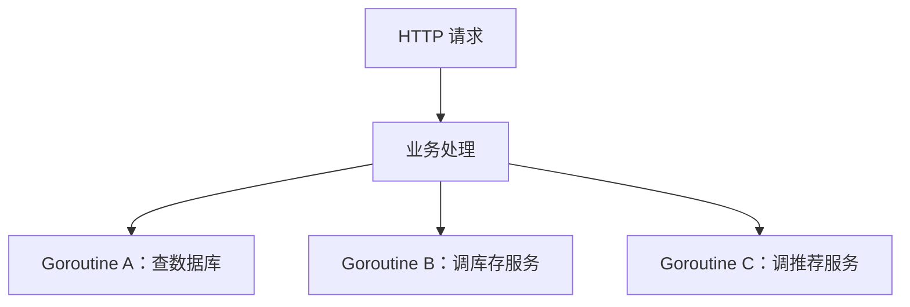

# 01. context


学习 Go 后端基本绕不开 `context`。

你会在很多函数里看到它：

```go
func Query(ctx context.Context, id int64) error
```

`context` 中文常译作“上下文”。在 Go 里，可以先把它理解成**一次任务的上下文信息**：它由代码显式传递，负责携带这次任务的**取消信号、超时时间、截止时间和少量请求级数据**。

`context` 不是真正干活的人。它更像一张跟着调用链往下传的通知单，告诉后面的代码几件事：

1. **这件事最晚什么时候结束**。
2. **这件事是不是已经不用继续做了**。
3. **这次请求上有没有一些需要一起传下去的数据**，比如 `traceID`。

## 可能引起 P0 级事故的 context

为什么一个看起来只是“传参数”的包，会变成 Go 后端里的常规写法？

先看一个很常见的服务端场景。一次 HTTP 请求进来以后，服务端可能会启动好几个 goroutine，它们不是严格按顺序执行，而是一起为这次请求工作：



这些 goroutine 都在为同一个请求工作。它们需要共享一些请求级信息，比如登录态、`traceID`、请求最大处理时间。同时，它们也应该共享同一个退出信号。

如果用户关掉页面，或者调用方已经超时不等了，这些 goroutine 的工作结果就没人要了。这个时候它们应该尽快退出，让系统释放连接、内存、定时器等资源。

问题是，Go 不能直接从外面强杀一个 goroutine。更常见的做法是：goroutine 自己在合适的位置监听一个信号，发现任务取消了，就主动返回。

没有 `context` 时，也可以自己用 `channel + select` 做这件事。但当一个请求衍生出很多 goroutine，而且还要传超时时间、取消信号、请求级数据时，手写这些控制逻辑很快就会变乱。

更严重一点，假设业务高峰期下游服务突然变慢，而当前服务没有设置合理超时，大量 goroutine 就会卡在等待下游返回的地方。goroutine 数量持续上涨，内存占用跟着上涨，请求越积越多，最后服务整体不可用。这种故障继续向上游扩散，就可能变成一次 P0 级事故。

`context` 要解决的就是这类问题：**在一组相关 goroutine 之间，传递取消信号、超时时间、截止时间和少量请求级数据**。

Go 1.7 把 `context` 放进标准库以后，很多标准库和社区库都开始把 `ctx context.Context` 作为参数，比如 `net/http`、`database/sql` 以及各种 RPC、数据库客户端。现在它几乎已经是 Go 里做并发控制和超时控制的标准写法。

下面基于 Go 1.26.5 版本中的 `context.go` 来介绍 `context` 包。

## 先看 Context 接口

源码里，`Context` 是一个接口：

```go
type Context interface {
	// 返回截止时间；如果没有设置截止时间，ok 为 false。
	Deadline() (deadline time.Time, ok bool)

	// 返回一个 channel。
	// context 被取消或超时时，这个 channel 会被关闭。
	Done() <-chan struct{}

	// 返回取消原因。
	// 如果 Done 还没有关闭，Err 返回 nil。
	Err() error

	// 根据 key 查找调用链上的值。
	Value(key any) any
}
```

这四个方法就是整个 `context` 包的骨架。

| 方法 | 可以怎么理解 |
| --- | --- |
| `Deadline()` | 这件事最晚什么时候结束 |
| `Done()` | 返回一个 channel，取消或超时时这个 channel 会关闭 |
| `Err()` | 返回取消原因 |
| `Value(key)` | 根据 key 查找请求级数据 |

最常用的是 `Done()`。

很多代码会这么写：

```go
<-ctx.Done()
```

这行代码最好拆开看：

```go
done := ctx.Done() // 第一步：调用 Done() 方法，拿到一个 channel

<-done             // 第二步：从 channel 接收，等取消信号，可能会阻塞
```

`ctx.Done()` 只是一个普通方法调用，它返回一个 channel。

真正等待取消信号的是 `<-done`。如果这个 channel 还没有关闭，`<-done` 就会阻塞；如果 context 被取消或者超时，这个 channel 会被关闭，等待它的 goroutine 就会醒过来。

所以业务代码里常见的是：

```go
select {
case <-ctx.Done():
	return ctx.Err()
default:
	// 继续执行
}
```

`Err()` 用来解释为什么停下来：

```go
context.Canceled						//手动取消
context.DeadlineExceeded		//超时取消
```

还有一个细节很重要：`Context` 接口里没有 `Cancel()` 方法。也就是说，下游函数拿到 `ctx` 后，只能监听取消，不能取消父任务。谁创建可取消的 context，谁拿到 cancel 函数。

## 先认识几种 context 具体类型

读源码前，先把几个具体类型认一下。

`context` 不是一个大结构体，而是一层一层包出来的。

常见具体类型有这些：

| 类型 | 从哪里来 | 作用 |
| --- | --- | --- |
| `backgroundCtx` | `context.Background()` | 根 context，空的，不会取消、没有超时、没有值 |
| `todoCtx` | `context.TODO()` | 临时占位用的空 context |
| `cancelCtx` | `context.WithCancel(parent)` | 在父 context 外面包一层，增加取消能力 |
| `timerCtx` | `context.WithDeadline` / `context.WithTimeout` | 在 `cancelCtx` 基础上加 deadline 和 timer |
| `valueCtx` | `context.WithValue(parent, key, val)` | 在父 context 外面包一层 key-value |

比如：

```go
ctx := context.Background()
ctx, cancel := context.WithTimeout(ctx, 2*time.Second)
defer cancel()

ctx = context.WithValue(ctx, traceIDKey{}, "trace-001")
```

最后的结构大概是：`valueCtx(traceID) -> timerCtx(2s) -> backgroundCtx`

这几行代码不是在原来的 `ctx` 上改字段，而是每调用一次 `WithXxx`，就创建一个新的 context 具体值，把旧的 context 包进去。

变量 `ctx` 最后指向最外层的 `valueCtx`。`valueCtx` 里面包着 `timerCtx`，`timerCtx` 再包着 `backgroundCtx`。

后面看源码时，一直带着这个图，会轻松很多。

接下来会反复看到几个创建 context 的函数。它们表面上都返回 `Context` 接口，但运行时放进接口里的具体值并不一样：有的是 `backgroundCtx{}` 这样的结构体值，有的是 `*cancelCtx`、`*timerCtx`、`*valueCtx` 这样的指针值。先把这几个入口函数和它们的作用对上，后面读源码就不会散。

| 函数定义 | 作用 | 返回后的具体类型 |
| --- | --- | --- |
| `func Background() Context` | 创建根 context。常用于 `main`、初始化、测试，以及一条调用链的起点。它不会取消、没有 deadline、没有 value。 | `backgroundCtx{}` 结构体值 |
| `func TODO() Context` | 创建一个临时占位 context。适合暂时不知道该传什么 context，或者代码还没改造成接收 `ctx` 的过渡阶段。 | `todoCtx{}` 结构体值 |
| `func WithCancel(parent Context) (ctx Context, cancel CancelFunc)` | 基于父 context 派生一个可以手动取消的子 context。调用返回的 `cancel()` 后，子 context 以及它的后代都会收到取消信号。 | `*cancelCtx` 指针值 |
| `func WithDeadline(parent Context, d time.Time) (Context, CancelFunc)` | 基于父 context 派生一个带截止时间的子 context。到达时间`d` 后自动取消。 | 通常是 `*timerCtx` 指针值 |
| `func WithTimeout(parent Context, timeout time.Duration) (Context, CancelFunc)` | `WithDeadline` 的快捷写法，表示从现在开始最多运行 `timeout` 这么久。 | 本质来自 `WithDeadline`，通常是 `*timerCtx` 指针值 |
| `func WithValue(parent Context, key, val any) Context` | 基于父 context 派生一个携带 key-value 的子 context。适合传 `traceID`、认证信息这类请求级数据。 | `*valueCtx` 指针值 |

## Background 和 TODO

我们经常这样写：

```go
ctx := context.Background()
```

先看源码：

```go
type emptyCtx struct{}

func (emptyCtx) Deadline() (deadline time.Time, ok bool) {
	// 直接返回 time.Time 零值和 false。
	// 表示没有 deadline。
	return
}

func (emptyCtx) Done() <-chan struct{} {
	// 返回 nil，表示这个 context 永远不会被取消。
	return nil
}

func (emptyCtx) Err() error {
	// 没有取消，自然也没有错误。
	return nil
}

func (emptyCtx) Value(key any) any {
	// 空 context 不保存任何值。
	return nil
}

// backgroundCtx 嵌入 emptyCtx，因此拥有 emptyCtx 的四个方法。
type backgroundCtx struct{ emptyCtx }

func (backgroundCtx) String() string {
	return "context.Background"
}

// todoCtx 也嵌入 emptyCtx，能力和 backgroundCtx 基本一样。
type todoCtx struct{ emptyCtx }

func (todoCtx) String() string {
	return "context.TODO"
}

func Background() Context {
	// 返回的是 Context 接口值。
	// 这个接口值的动态类型是 backgroundCtx，
	// 动态值是 backgroundCtx{} 这个结构体值。
	return backgroundCtx{}
}

func TODO() Context {
	// 返回的是 Context 接口值。
	// 这个接口值的动态类型是 todoCtx，
	// 动态值是 todoCtx{} 这个结构体值。
	return todoCtx{}
}
```

`emptyCtx` 实现了 `Context` 接口的四个方法。也就是说，`emptyCtx{}` 这个结构体值可以被当成一个 `context.Context` 使用。

但是它的具体实现几乎什么都不做：

```text
Deadline() 没有截止时间
Done()     返回 nil
Err()      返回 nil
Value()    返回 nil
```

`backgroundCtx` 里面嵌入了 `emptyCtx`：

```go
type backgroundCtx struct{ emptyCtx }
```

如果你学过 Java，第一反应可能会把它看成继承。这里最好先忍一下：**在 Go 里，这个叫结构体嵌入，不叫继承**。嵌入以后，`emptyCtx` 的方法会提升到 `backgroundCtx` 上，所以 `backgroundCtx` 也实现了 `Context` 接口。

因此再回头看源码中的 `Background()` 方法：

```go
func Background() Context {
	return backgroundCtx{}
}
```

这段代码可以这样读：`Background()` 的返回类型是 `Context` 接口；`return backgroundCtx{}` 返回的是一个 `backgroundCtx` 结构体值；由于返回位置需要的是 `Context` 接口，Go 会把这个结构体值赋给一个接口值。这个接口值的动态类型是 `backgroundCtx`，动态值是 `backgroundCtx{}`。

而 `backgroundCtx` 之所以能放进 `Context` 接口里，是因为它嵌入了 `emptyCtx`，拥有了 `emptyCtx` 的四个方法，所以它也实现了 `Context` 接口。

`TODO()` 和 `Background()` 的具体能力差不多：它们都不会主动取消，没有 deadline，也不保存 value。区别主要在语义上。

- `Background()` 表示这里明确需要一个根 context。常见于 `main` 函数、初始化逻辑、测试代码，以及服务端接收到请求时创建整条调用链的起点。
- `TODO()` 表示这里暂时还不知道该传哪个 context，或者当前函数还没有改造成接收 `ctx context.Context` 的形式。它更像一个占位符，提醒后面再补上真正合适的 context。

实际写业务代码时，如果你已经知道这是一条调用链的起点，就用 `Background()`；如果只是迁移代码时临时不知道传什么，可以先用 `TODO()`，但不要把它当成长期方案。

> 还有一个小坑：因为 `Background()` 的 `Done()` 返回 `nil`，所以这样写会永远阻塞：
>
> ```go
> ctx := context.Background()
>
> done := ctx.Done() // done 是 nil
> <-done             // 永远阻塞
> ```
>
> 但在 `select` 里，`nil` channel 对应的分支永远不会被选中：
>
> ```go
> select {
> case <-ctx.Done():
> 	// Background 不会走到这里
> default:
> 	// 会走这里
> }
> ```
>
> `Background()` 自己不会取消。真正的取消能力来自后面的 `WithCancel`、`WithDeadline`、`WithTimeout`。

## WithCancel

`WithCancel` 用来在父 context 外面包一层可取消的 context：

```go
ctx, cancel := context.WithCancel(parent)
defer cancel()
```

源码入口是：

```go
func WithCancel(parent Context) (ctx Context, cancel CancelFunc) {
	// 创建一个 *cancelCtx 指针值，并把它挂到 parent 下面。
	c := withCancel(parent)

	// 返回新的 ctx，以及一个取消函数。
	// 调用 cancel() 时，会把错误设置为 context.Canceled。
	return c, func() { c.cancel(true, Canceled, nil) }
}

func withCancel(parent Context) *cancelCtx {
	if parent == nil {
		panic("cannot create context from nil parent")
	}

	// &cancelCtx{} 会先创建一个 cancelCtx 结构体值，
	// 然后返回指向这个结构体值的指针。
	// 所以 c 的类型是 *cancelCtx。
	c := &cancelCtx{}

	// 建立父子取消关系：parent 取消时，c 也要取消。
	c.propagateCancel(parent, c)
	return c
}
```

这里真正创建的是一个 `cancelCtx` 结构体值，并拿到它的指针：

```go
c := &cancelCtx{}
```

所以 `WithCancel` 最后返回的 `ctx` 是一个 `Context` 接口值。这个接口值的动态类型是 `*cancelCtx`，动态值是一个指向 `cancelCtx` 结构体值的指针。`*cancelCtx` 这个类型实现了 `Context` 接口，所以它可以被当成 `context.Context` 返回。

我们可以继续看`cancelCtx` 的结构体定义如下：

```go
type cancelCtx struct {
	// 嵌入父 context。
	// Deadline、Value 等能力可以继续交给父 context 处理。
	Context

	mu sync.Mutex // 保护下面这些字段

	// 保存取消信号 channel。
	// 第一次调用 Done() 时才创建；第一次 cancel 时关闭。
	done atomic.Value

	// 保存子 context。
	// 父 context 取消时，会遍历 children，把子 context 也取消。
	children map[canceler]struct{}

	// 保存取消原因，比如 context.Canceled。
	err atomic.Value

	// 保存更具体的取消原因，给 Cause(ctx) 使用。
	cause error
}
```

几个字段要看懂：

| 字段 | 作用 |
| --- | --- |
| `Context` | 嵌入父 context，所以 `cancelCtx` 包住了 parent |
| `mu` | 保护并发访问 |
| `done` | 保存取消信号 channel，第一次调用 `Done()` 时才创建 |
| `children` | 保存子 context，父 context 取消时会往下传 |
| `err` | 保存取消原因，比如 `context.Canceled` |
| `cause` | 更具体的取消原因，给 `Cause(ctx)` 用 |

`Done()` 的源码是：

```go
func (c *cancelCtx) Done() <-chan struct{} {
	// 先尝试直接读已有的 done channel。
	d := c.done.Load()
	if d != nil {
		return d.(chan struct{})
	}

	// 还没有创建 done channel，就加锁创建。
	c.mu.Lock()
	defer c.mu.Unlock()

	// 加锁后再检查一次，避免其他 goroutine 已经创建过。
	d = c.done.Load()
	if d == nil {
		// 第一次调用 Done() 时才真正创建 channel。
		d = make(chan struct{})
		c.done.Store(d)
	}
	return d.(chan struct{})
}
```

这段说明一件事：`done` 是懒加载的。也就是说，创建 `cancelCtx` 时并不会立刻创建 channel，只有你第一次调用`done := ctx.Done()`的时候，它才会真的创建channel`make(chan struct{})`。

`Err()` 的源码是：

```go
func (c *cancelCtx) Err() error {
	// An atomic load is ~5x faster than a mutex, which can matter in tight loops.
	if err := c.err.Load(); err != nil {
		// Ensure the done channel has been closed before returning a non-nil error.
		// 如果已经有 err，确保 done channel 已经关闭。
		<-c.Done()
		return err.(error)
	}

	// 还没有取消。
	return nil
}
```

如果还没有取消，`Err()` 返回 `nil`。如果已经取消，返回保存的错误。

真正取消发生在 `cancel` 方法里：

```go
func (c *cancelCtx) cancel(removeFromParent bool, err, cause error) {
	if err == nil {
		panic("context: internal error: missing cancel error")
	}
	if cause == nil {
		// 没有更具体的 cause 时，就用 err 作为 cause。
		cause = err
	}

	c.mu.Lock()
	if c.err.Load() != nil {
		c.mu.Unlock()
		return // already canceled
	}

	// 记录取消原因。
	c.err.Store(err)
	c.cause = cause

	// 关闭 done channel。
	d, _ := c.done.Load().(chan struct{})
	if d == nil {
		// 如果 Done() 从来没被调用过，就直接保存一个已关闭的 channel。
		c.done.Store(closedchan)
	} else {
		close(d)
	}

	// 继续取消所有子 context。
	for child := range c.children {
		// NOTE: acquiring the child's lock while holding parent's lock.
		child.cancel(false, err, cause)
	}

	// 取消后不再需要保存 children。
	c.children = nil
	c.mu.Unlock()

	if removeFromParent {
		// 从父 context 的 children 里移除自己，释放引用。
		removeChild(c.Context, c)
	}
}
```

这段代码做了几件事：

1. 如果已经取消过，直接返回
2. 保存 err 和 cause
3. 关闭 done channel
4. 遍历 children，把子 context 也取消
5. 清空 children
6. 必要时把自己从父 context 的 children 里移除

重点是第三步：关闭 `done` channel。

`context` 不是给每个 goroutine 发一条消息，而是关闭同一个 channel。所有在等 `<-ctx.Done()` 的地方，都会因为 channel 关闭而醒过来。

### 取消是怎么向下传的

`withCancel` 里有一句：

```go
c.propagateCancel(parent, c)
```

这句负责把子 context 和父 context 建立关系。

源码是：

```go
func (c *cancelCtx) propagateCancel(parent Context, child canceler) {
	// 先记住父 context。
	c.Context = parent

	// 取父 context 的 Done channel。
	done := parent.Done()
	if done == nil {
		return // parent is never canceled
	}

	select {
	case <-done:
		// parent is already canceled
		// 如果父 context 已经取消，子 context 立刻取消。
		child.cancel(false, parent.Err(), Cause(parent))
		return
	default:
	}

	if p, ok := parentCancelCtx(parent); ok {
		// parent is a *cancelCtx, or derives from one.
		p.mu.Lock()
		if err := p.err.Load(); err != nil {
			// parent has already been canceled
			child.cancel(false, err.(error), p.cause)
		} else {
			if p.children == nil {
				p.children = make(map[canceler]struct{})
			}
			// 父 context 还没取消，把 child 挂到父 context 下面。
			p.children[child] = struct{}{}
		}
		p.mu.Unlock()
		return
	}

	if a, ok := parent.(afterFuncer); ok {
		// parent implements an AfterFunc method.
		c.mu.Lock()
		stop := a.AfterFunc(func() {
			child.cancel(false, parent.Err(), Cause(parent))
		})
		c.Context = stopCtx{
			Context: parent,
			stop:    stop,
		}
		c.mu.Unlock()
		return
	}

	goroutines.Add(1)
	go func() {
		select {
		case <-parent.Done():
			// 兜底方案：启动 goroutine 监听父 context。
			child.cancel(false, parent.Err(), Cause(parent))
		case <-child.Done():
		}
	}()
}
```

读这段不用每个分支都背下来，先抓主线：

1. 先把 parent 保存到 c.Context
2. 如果 parent.Done() 是 nil，说明父 context 永远不会取消，直接返回
3. 如果 parent 已经取消，child 立刻取消
4. 如果 parent 是 cancelCtx，就把 child 放进 parent.children
5. 如果是特殊 context，就用 AfterFunc 或 goroutine 监听父级取消

平时最常见的是第 2 种和第 4 种。

比如：

```go
root := context.Background()
ctx1, cancel1 := context.WithCancel(root)
ctx2, cancel2 := context.WithCancel(ctx1)
```

结构是：`backgroundCtx -> cancelCtx(ctx1) -> cancelCtx(ctx2)`

如果调用：`cancel1()`，`ctx1` 会取消，`ctx2` 也会跟着取消。

如果调用：`cancel2()`，只取消 `ctx2`，不会影响 `ctx1`。

所以取消方向很好记：父取消，子跟着取消；子取消，父不受影响。

## WithDeadline 和 WithTimeout

`WithTimeout` 是最常用的超时写法：

```go
ctx, cancel := context.WithTimeout(parent, 2*time.Second)
defer cancel()
```

源码里它很薄：

```go
func WithTimeout(parent Context, timeout time.Duration) (Context, CancelFunc) {
	// timeout 是一段持续时间，把它转换成具体截止时间。
	return WithDeadline(parent, time.Now().Add(timeout))
}
```

所以 `WithTimeout(parent, 2*time.Second)` 本质上就是：

```go
WithDeadline(parent, time.Now().Add(2*time.Second))
```

`WithDeadline` 的入口是：

```go
func WithDeadline(parent Context, d time.Time) (Context, CancelFunc) {
	// 普通 WithDeadline 不设置额外 cause。
	return WithDeadlineCause(parent, d, nil)
}
```

真正逻辑在 `WithDeadlineCause`：

```go
func WithDeadlineCause(parent Context, d time.Time, cause error) (Context, CancelFunc) {
	if parent == nil {
		panic("cannot create context from nil parent")
	}

	if cur, ok := parent.Deadline(); ok && cur.Before(d) {
		// The current deadline is already sooner than the new one.
		// 父 context 更早超时，没必要再创建一个更晚的 timer。
		return WithCancel(parent)
	}

	// 创建 timerCtx，记录 deadline。
	c := &timerCtx{
		deadline: d,
	}

	// 建立父子取消关系。
	c.cancelCtx.propagateCancel(parent, c)

	dur := time.Until(d)
	if dur <= 0 {
		// deadline 已经过了，立刻取消。
		c.cancel(true, DeadlineExceeded, cause) // deadline has already passed
		return c, func() { c.cancel(false, Canceled, nil) }
	}

	c.mu.Lock()
	defer c.mu.Unlock()
	if c.err.Load() == nil {
		// 到达 deadline 时自动取消。
		c.timer = time.AfterFunc(dur, func() {
			c.cancel(true, DeadlineExceeded, cause)
		})
	}

	// 手动调用返回的 cancel 时，按普通取消处理。
	return c, func() { c.cancel(true, Canceled, nil) }
}
```

这里涉及到 `timerCtx`结构体，其对应源码如下：

```go
type timerCtx struct {
	// 嵌入 cancelCtx，所以 timerCtx 本身也能取消。
	cancelCtx

	// 到点后触发 cancel。
	timer *time.Timer // Under cancelCtx.mu.

	// 截止时间。
	deadline time.Time
}

func (c *timerCtx) Deadline() (deadline time.Time, ok bool) {
	// timerCtx 有明确的截止时间。
	return c.deadline, true
}

func (c *timerCtx) cancel(removeFromParent bool, err, cause error) {
	// 先执行 cancelCtx 的取消逻辑：关 done、取消 children。
	c.cancelCtx.cancel(false, err, cause)
	if removeFromParent {
		// Remove this timerCtx from its parent cancelCtx's children.
		removeChild(c.cancelCtx.Context, c)
	}

	// 停掉自己的 timer，释放资源。
	c.mu.Lock()
	if c.timer != nil {
		c.timer.Stop()
		c.timer = nil
	}
	c.mu.Unlock()
}
```

`timerCtx` 嵌入了 `cancelCtx`，所以它天然有取消能力。它自己多了两个东西：

- deadline：截止时间
- timer：定时器

创建 `timerCtx` 后，源码会启动一个定时器：

```go
c.timer = time.AfterFunc(dur, func() {
	c.cancel(true, DeadlineExceeded, cause)
})
```

时间一到，它就调用 `cancel`，取消原因是：

```go
context.DeadlineExceeded
```

所以这段代码：

```go
ctx, cancel := context.WithTimeout(context.Background(), time.Second)
defer cancel()

done := ctx.Done()
<-done

fmt.Println(ctx.Err())
```

超时后会输出：

```text
context deadline exceeded
```

有一个源码细节值得留意：

```go
if cur, ok := parent.Deadline(); ok && cur.Before(d) {
	return WithCancel(parent)
}
```

如果父 context 的 deadline 比你新设置的 deadline 更早，源码不会再创建一个更晚的 timer。

比如父 context 1 秒后超时，子 context 设置 5 秒后超时。子 context 根本等不到 5 秒，因为 1 秒后父 context 就会把它取消。所以这里直接退化成 `WithCancel(parent)`。

另外，`WithTimeout` 后面要写 `defer cancel()`。即使没有手动取消，超时也会自动取消，但如果任务提前结束，调用 `cancel()` 可以及时停止 timer，并且把自己从父 context 的 children 里移走。

## WithValue

`WithValue` 用来给调用链挂一组请求级数据：

```go
ctx = context.WithValue(ctx, traceIDKey{}, "trace-001")
```

源码是：

```go
func WithValue(parent Context, key, val any) Context {
	if parent == nil {
		panic("cannot create context from nil parent")
	}
	if key == nil {
		panic("nil key")
	}
	if !reflectlite.TypeOf(key).Comparable() {
		// key 必须可比较，因为查找时会用 == 比较。
		panic("key is not comparable")
	}

	// 返回一个新的 valueCtx，把 parent 包起来。
	return &valueCtx{parent, key, val}
}
```

它返回的是 `valueCtx`：

```go
type valueCtx struct {
	// 嵌入父 context。
	// Done、Deadline、Err 等方法都可以继续交给父 context。
	Context

	// 当前这一层保存的一组 key-value。
	key, val any
}
```

`valueCtx` 也嵌入了父 context，只是自己多存了一组 `key` 和 `val`。

当需要查 key对应的 value 时，其源码是：

```go
func (c *valueCtx) Value(key any) any {
	if c.key == key {
		// 当前层命中，直接返回。
		return c.val
	}

	// 当前层没命中，就去父 context 继续找。
	return value(c.Context, key)
}
```

如果当前这一层 key 匹配，就返回当前层的值；如果不匹配，就去父 context 继续找。

`value` 函数会沿着 context 链一直往上走：

```go
func value(c Context, key any) any {
	for {
		switch ctx := c.(type) {
		case *valueCtx:
			if key == ctx.key {
				// 找到最近的一层 valueCtx。
				return ctx.val
			}
			// 当前层没找到，继续往父 context 找。
			c = ctx.Context
		case *cancelCtx:
			if key == &cancelCtxKey {
				return c
			}
			c = ctx.Context
		case withoutCancelCtx:
			if key == &cancelCtxKey {
				// This implements Cause(ctx) == nil
				// when ctx is created using WithoutCancel.
				return nil
			}
			c = ctx.c
		case *timerCtx:
			if key == &cancelCtxKey {
				return &ctx.cancelCtx
			}
			c = ctx.Context
		case backgroundCtx, todoCtx:
			// 到根节点了，还没找到，返回 nil。
			return nil
		default:
			return c.Value(key)
		}
	}
}
```

比如：

```go
ctx := context.Background()
ctx = context.WithValue(ctx, key1{}, "v1")
ctx = context.WithValue(ctx, key2{}, "v2")
```

结构是：

```text
valueCtx(key2=v2)
  -> valueCtx(key1=v1)
    -> backgroundCtx
```

调用：

```go
ctx.Value(key1{})
```

查找过程是：

```text
先看 valueCtx(key2=v2)，key 不匹配
再看 valueCtx(key1=v1)，key 匹配，返回 v1
```

所以 `Value` 不是从一个大 map 里查，而是沿着链一层层找。

这带来几个结论：

```text
子 context 能读到父 context 的值
父 context 读不到子 context 的值
相同 key 时，离当前 ctx 最近的那层优先
链太长时，Value 查找也会一层层走
```

官方文档也提醒：`WithValue` 只适合传请求级数据，不要拿它代替普通函数参数。

推荐这样写 key：

```go
type traceIDKey struct{}
```

不推荐这样：

```go
context.WithValue(ctx, "traceID", traceID)
```

字符串 key 太容易撞。两个包都用了 `"userID"`，最后查出来是谁的值就很难说清楚。

更完整的写法是给自己的包提供访问函数：

```go
type traceIDKey struct{}

func WithTraceID(ctx context.Context, traceID string) context.Context {
	return context.WithValue(ctx, traceIDKey{}, traceID)
}

func TraceIDFromContext(ctx context.Context) (string, bool) {
	v, ok := ctx.Value(traceIDKey{}).(string)
	return v, ok
}
```

## 一个完整 demo

下面这个 demo 模拟一个很常见的场景：一次请求进入服务端后，业务代码要查询数据库，并且希望给这次请求加上两个能力。

- 第一，给整次查询设置一个最大耗时。这里设置为 `250ms`，超过这个时间就不再继续等。
- 第二，给调用链带上一个 `traceID`。这样下游函数不用额外加参数，也能从 `ctx` 里取到请求标识。

`queryDB` 里故意把一次查询拆成 5 个步骤，每个步骤耗时 `100ms`。如果没有超时控制，5 步全部完成需要大约 `500ms`；但外层 context 只给了 `250ms`，所以这个查询会在中途被取消。

```go
package main

import (
	"context"
	"fmt"
	"time"
)

// traceIDKey 使用自定义空结构体类型，避免和其他包的 key 冲突。
type traceIDKey struct{}

// WithTraceID 基于父 context 派生一个带 traceID 的子 context。
// 底层会创建一层 valueCtx，把 key-value 挂到 context 链上。
func WithTraceID(ctx context.Context, traceID string) context.Context {
	return context.WithValue(ctx, traceIDKey{}, traceID)
}

// TraceIDFromContext 从 context 链上取 traceID。
// 如果当前层找不到，context 会继续向父 context 查找。
func TraceIDFromContext(ctx context.Context) (string, bool) {
	v, ok := ctx.Value(traceIDKey{}).(string)
	return v, ok
}

func main() {
	// Background 是整条 context 链的根节点。
	ctx := context.Background()

	// WithTimeout 在 Background 外面包一层 timerCtx。
	// 250ms 后，这个 context 会自动取消。
	ctx, cancel := context.WithTimeout(ctx, 250*time.Millisecond)
	defer cancel() // 函数结束前释放 timer 等相关资源。

	// WithTraceID 底层使用 WithValue，在 context 外面再包一层 valueCtx。
	ctx = WithTraceID(ctx, "trace-001")

	if err := queryDB(ctx); err != nil {
		fmt.Println("query failed:", err)
		return
	}

	fmt.Println("query success")
}

func queryDB(ctx context.Context) error {
	// 下游函数可以从 ctx 里取到请求级数据。
	if traceID, ok := TraceIDFromContext(ctx); ok {
		fmt.Println("traceID:", traceID)
	}

	for i := 1; i <= 5; i++ {
		select {
		case <-ctx.Done():
			// context 被取消或超时后，Done channel 会关闭。
			// 这里返回 Err，让上层知道失败原因。
			return ctx.Err()
		case <-time.After(100 * time.Millisecond):
			// 模拟数据库查询中的一个步骤。
			fmt.Println("query step:", i)
		}
	}

	return nil
}
```

大概率输出类似这样：

```text
traceID: trace-001
query step: 1
query step: 2
query failed: context deadline exceeded
```

这个输出说明三件事。

- `traceID: trace-001` 说明 `WithValue` 创建的 `valueCtx` 生效了，`queryDB` 可以从 context 链上取到请求级数据。
- `query step: 1` 和 `query step: 2` 说明查询确实执行了一小段时间。每一步大约 `100ms`，两步后已经接近 `200ms`。
- `query failed: context deadline exceeded` 说明 `250ms` 到了以后，`timerCtx` 触发超时取消，`queryDB` 在 `case <-ctx.Done():` 这个分支里返回了 `ctx.Err()`。

这段代码背后的 context 结构是：`valueCtx(traceID=trace-001) -> timerCtx(250ms) -> backgroundCtx`。最外层是 `valueCtx`，负责保存 `traceID`；中间是 `timerCtx`，负责超时取消；最里面是 `backgroundCtx`，作为根 context。

当代码执行到 `case <-ctx.Done():` 时，`ctx` 是最外层的 `valueCtx`。`valueCtx` 自己不负责取消，所以 `Done()` 会沿着嵌入的父 context 往里找，最终用到 `timerCtx` 里的取消信号。`250ms` 到了以后，`timerCtx` 关闭 Done channel，`select` 里的 `<-ctx.Done()` 被唤醒，`queryDB` 返回 `context deadline exceeded`。

这个 demo 对应的完整链路是：先从 `Background()` 创建根 context，再用 `WithTimeout()` 增加超时能力，再用 `WithValue()` 增加请求级数据，最后在下游函数里用 `select` 同时等待“查询步骤完成”和“context 取消信号”。

## 平时怎么用

理解源码以后，平时写业务代码可以按下面几条习惯来。它们不是形式主义，背后都是为了让取消信号、超时时间和请求级数据能稳定地沿着调用链传下去。

1. `Context` 通常放在函数第一个参数，名字叫 `ctx`。这样写是为了让调用链一眼就能看出来：这个函数支持取消、超时和值传递。Go 标准库和大部分社区库也都遵守这个约定。

   ```go
   func QueryUser(ctx context.Context, userID int64) (*User, error) {
   	// ...
   }
   ```

2. 不要把 `Context` 长期存在结构体字段里。`context` 表达的是“一次调用”或“一次请求”的生命周期，而结构体通常比一次请求活得更久。如果把 `ctx` 放进结构体里，很容易出现旧请求的超时、取消信号影响新请求的问题。更推荐把 `ctx` 显式传给每个需要它的方法。

   ```go
   type UserRepo struct {
   	db *sql.DB
   }

   func (r *UserRepo) Find(ctx context.Context, id int64) (*User, error) {
   	// ...
   }
   ```

3. 不要传 `nil` context。很多函数会直接调用 `ctx.Done()`、`ctx.Err()` 或 `ctx.Value()`。如果传的是 `nil`，就可能 panic。暂时不知道传什么时，用 `context.TODO()`；如果明确是根节点，用 `context.Background()`。

   ```go
   // 临时占位：
   ctx := context.TODO()
   ```

   ```go
   // 明确需要根 context：
   ctx := context.Background()
   ```

4. `WithCancel`、`WithDeadline`、`WithTimeout` 返回的 `cancel` 要调用。`cancel()` 不只是“手动取消”。它还会释放当前 context 关联的资源，比如 timer，以及父 context 对子 context 的引用。即使你设置了超时，也应该在任务提前结束时 `defer cancel()`。

   ```go
   ctx, cancel := context.WithTimeout(parent, 2*time.Second)
   defer cancel()
   ```

5. `WithValue` 只放请求级数据，不要当成万能参数包。适合放进 context 的值，一般是跨函数、跨 API 边界都可能需要的请求级信息，比如 `traceID`、`requestID`、认证信息。不适合把普通业务参数塞进去，比如分页参数、开关参数、查询条件。

   ```go
   type traceIDKey struct{}

   ctx = context.WithValue(ctx, traceIDKey{}, "trace-001")
   ```

6. 同一个 `Context` 可以被多个 goroutine 同时使用。官方保证 `Context` 的方法可以被多个 goroutine 同时调用。所以一次请求里启动多个 goroutine 时，可以把同一个 `ctx` 传进去，让它们共享同一份取消信号和请求级数据。

   ```go
   go queryDB(ctx)
   go callRPC(ctx)
   ```

7. 取消不是强杀 goroutine，只是发信号。调用 `cancel()` 或超时以后，context 只会关闭 `Done` channel。goroutine 不会被 Go 运行时强制杀掉，它必须自己在合适的位置监听 `ctx.Done()`，然后主动返回。

   ```go
   select {
   case <-ctx.Done():
   	return ctx.Err()
   case result := <-work:
   	return handle(result)
   }
   ```

## 最后总结

`context` 的源码主线其实很清楚：`Context` 是接口，真正干活的是几个具体类型。

- `backgroundCtx` 和 `todoCtx` 是最基础的空 context。它们不会取消，没有 deadline，也不保存 value。
- `cancelCtx` 在父 context 外面包一层，增加取消能力。它有自己的 `done` channel，也会记录子 context。
- `timerCtx` 在 `cancelCtx` 的基础上再加 deadline 和 timer，所以它既能手动取消，也能到时间后自动取消。
- `valueCtx` 在父 context 外面包一层 key-value，取值时先看当前层，找不到再去父 context 里找。

读源码时可以把“取消”和“取值”分成两条线看：

- 取消更像一棵树。每个可取消的 context 都可能记录自己的子 context，父 context 被取消时，会遍历这些 children，把取消信号继续往下传。所以父 context 取消，子 context 会跟着取消；但子 context 自己取消，不会反过来影响父 context。

- 取值更像一条链。`WithValue` 每调用一次，就在外面包一层 `valueCtx`。调用 `ctx.Value(key)` 时，会从当前这层开始找；当前层找不到，就去父 context 找；一直找到 `backgroundCtx` 或 `todoCtx` 还没有，就返回 `nil`。

所以可以把 `context` 记成一句话：**它是一条由多个小 context 包出来的调用链，同时又通过父子关系传播取消信号**。

## 参考资料

- [context package - pkg.go.dev](https://pkg.go.dev/context)
- [Go Concurrency Patterns: Context](https://go.dev/blog/context)
- [Contexts and structs](https://go.dev/blog/context-and-structs)
- [Go Concurrency Patterns: Pipelines and cancellation](https://go.dev/blog/pipelines)
