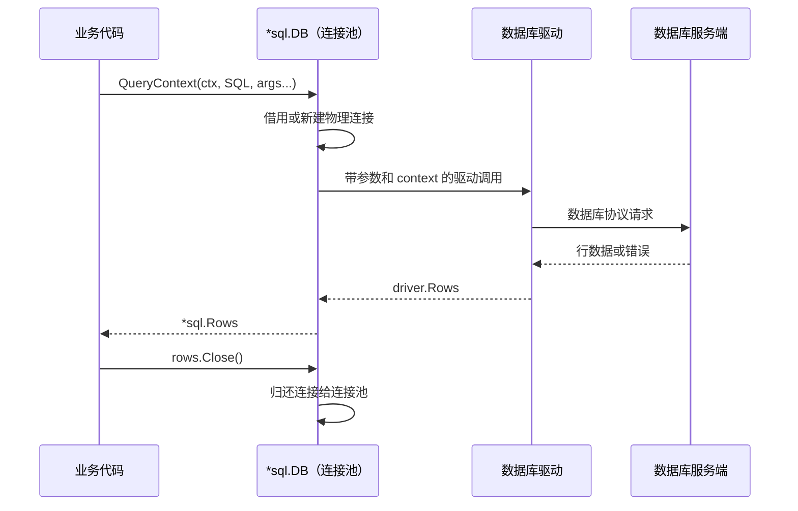

# 04. database/sql：驱动、连接池与事务

## 前言

`database/sql` 不是某一种数据库的客户端，也不是 ORM。它负责把应用的查询请求交给驱动，并管理连接复用、查询结果和事务的生命周期。MySQL、PostgreSQL、SQLite 的协议和方言由各自驱动处理。

先记住三个对象的边界：

- `*sql.DB` 是**可并发使用的连接池**，通常在进程启动时创建、退出时关闭；
- `*sql.Rows` 是一次多行查询持有的结果流，必须关闭；
- `*sql.Tx` 独占池中的一条连接，必须以 `Commit` 或 `Rollback` 结束。

下文用“订单仓储”把它们串起来。SQL 使用 `?` 占位符只是为了让例子易读；实际占位符由所选驱动和数据库方言决定。

## 先看调用边界



应用只依赖 `database/sql` 的公开 API。驱动包在 `init` 中调用 `sql.Register`，将名称关联到一个 `driver.Driver`；因此代码往往以空白导入引入驱动：

```go
import (
	"database/sql"

	_ "example.com/acme-db-driver" // 仅执行驱动的 init，完成驱动注册。
)

func open(dataSourceName string) (*sql.DB, error) {
	// "acme" 必须与该驱动注册时使用的名称一致。
	return sql.Open("acme", dataSourceName)
}
```

`sql.Open` 主要创建 `DB` 这个池句柄，**不保证**已经连上服务端。启动检查要显式调用 `PingContext`。如果驱动支持 `driver.DriverContext`，标准库会用它创建 `driver.Connector`，随后连接时调用 `Connect(ctx)`；这让建连也能响应取消。应用不需要直接使用 `database/sql/driver`，那是驱动作者的接口。

## 初始化：把连接池当成进程级依赖

下面构造函数只表达标准库的职责：接收驱动名和 DSN，不掺入某个数据库的连接参数。

```go
package store

import (
	"context"
	"database/sql"
	"fmt"
	"time"
)

// Open 在程序启动时调用一次。返回的 *sql.DB 可被多个 goroutine 安全共享。
func Open(driverName, dataSourceName string) (*sql.DB, error) {
	db, err := sql.Open(driverName, dataSourceName)
	if err != nil {
		return nil, fmt.Errorf("创建数据库连接池: %w", err)
	}

	// 以下数值只是示例。所有应用实例的 MaxOpenConns 之和必须小于数据库可用连接预算。
	db.SetMaxOpenConns(20)                 // 达到上限后，新的操作会等待连接。
	db.SetMaxIdleConns(5)                  // 留下少量热连接，避免频繁重连。
	db.SetConnMaxIdleTime(5 * time.Minute) // 空闲过久的连接不再复用。
	db.SetConnMaxLifetime(30 * time.Minute) // 定期轮换，避开基础设施主动断开的陈旧连接。

	ctx, cancel := context.WithTimeout(context.Background(), 3*time.Second)
	defer cancel() // 释放定时器资源。
	if err := db.PingContext(ctx); err != nil {
		_ = db.Close() // 失败路径同样释放池中可能已建立的连接。
		return nil, fmt.Errorf("数据库连通性检查失败: %w", err)
	}
	return db, nil
}
```

在 `main` 中把它注入仓储，并在程序退出时关闭一次。不要每个请求都 `Open`，也不要在处理完一个请求后 `Close`；那会丢掉连接复用，并可能让高并发请求不断新建连接。

```go
db, err := store.Open("acme", dsn)
if err != nil {
	return err
}
defer db.Close() // 只在整个进程停止时关闭连接池。
```

### 源码视角：借连接为什么也会超时

Go 1.22 的 `database/sql/sql.go` 中，`QueryContext` 会进入 `db.query`，再通过 `db.conn(ctx, cachedOrNewConn)` 借连接。它大致遵循：优先复用空闲连接；没有空闲连接且未达上限时让驱动创建连接；达到 `MaxOpenConns` 时将调用者放入等待队列。等待期间 `ctx` 到期，查询会在尚未发送 SQL 前返回超时。

因此“请求超时”不等于“SQL 很慢”。先看池统计：

```go
stats := db.Stats()
fmt.Printf("open=%d inUse=%d idle=%d wait=%d waitTime=%s\n",
	stats.OpenConnections, // 当前物理连接总数。
	stats.InUse,           // 正被查询、Rows 或 Tx 持有的连接。
	stats.Idle,            // 可以立即借出的连接。
	stats.WaitCount,       // 因达到连接上限而等待的累计次数。
	stats.WaitDuration,    // 所有等待时间的累计值。
)
```

持续的 `WaitCount` 往往提示：池配置与容量不匹配，或查询、`Rows`、事务持有连接太久。只把上限调大可能把压力转移到数据库服务端。

## 一条完整的读取主线

假设已有一张 `orders` 表，仓储只负责执行 SQL 和转换数据，不决定 HTTP 参数或界面展示。

```go
package store

import (
	"context"
	"database/sql"
	"errors"
	"fmt"
	"time"
)

type Order struct {
	ID        int64
	ProductID int64
	Quantity  int
	Status    string
	CreatedAt time.Time
}

// OrderRepository 依赖抽象的 *sql.DB；它不拥有也不关闭连接池。
type OrderRepository struct {
	db *sql.DB
}

func NewOrderRepository(db *sql.DB) *OrderRepository {
	return &OrderRepository{db: db}
}

// FindByID 返回一笔订单。QueryRowContext 的错误要在 Scan 时检查。
func (r *OrderRepository) FindByID(ctx context.Context, id int64) (Order, error) {
	const query = `
		SELECT id, product_id, quantity, status, created_at
		FROM orders
		WHERE id = ?`

	var order Order
	err := r.db.QueryRowContext(ctx, query, id).Scan(
		&order.ID,        // 按 SELECT 列的顺序逐个接收值。
		&order.ProductID,
		&order.Quantity,
		&order.Status,
		&order.CreatedAt,
	)
	if errors.Is(err, sql.ErrNoRows) {
		return Order{}, fmt.Errorf("订单 %d 不存在: %w", id, err)
	}
	if err != nil {
		return Order{}, fmt.Errorf("查询订单: %w", err)
	}
	return order, nil
}

// ListByStatus 演示多行查询。Rows 必须关闭，才能让连接尽快归还连接池。
func (r *OrderRepository) ListByStatus(ctx context.Context, status string) ([]Order, error) {
	const query = `
		SELECT id, product_id, quantity, status, created_at
		FROM orders
		WHERE status = ?
		ORDER BY id`

	rows, err := r.db.QueryContext(ctx, query, status)
	if err != nil {
		return nil, fmt.Errorf("查询订单列表: %w", err)
	}
	defer rows.Close() // 即使 Scan 或 return 中途失败，也要释放结果流。

	orders := make([]Order, 0)
	for rows.Next() {
		var order Order
		if err := rows.Scan(&order.ID, &order.ProductID, &order.Quantity, &order.Status, &order.CreatedAt); err != nil {
			return nil, fmt.Errorf("读取订单行: %w", err)
		}
		orders = append(orders, order)
	}
	// Next 结束可能是正常 EOF，也可能是网络中断等迭代期错误。
	if err := rows.Err(); err != nil {
		return nil, fmt.Errorf("遍历订单结果: %w", err)
	}
	return orders, nil
}
```

参数必须作为 `QueryContext` / `ExecContext` 的独立参数传入，不能用字符串拼接。这样驱动能正确编码值，输入中的引号也不会改变 SQL 结构。

`Rows.Close` 很重要：源码里的 `Rows` 持有 `releaseConn` 回调，`Close` 会关闭驱动的 rows 并释放连接。读完全部行时标准库通常会自动关闭它，但 `defer rows.Close()` 仍是面对早退和错误路径的可靠写法。

## 写入与受影响行数

更新类语句使用 `ExecContext`，返回的 `sql.Result` 适合取得受影响行数。不要假设“没有执行错误”必然代表更新到了目标记录。

```go
func (r *OrderRepository) MarkPaid(ctx context.Context, id int64) error {
	const query = `UPDATE orders SET status = ? WHERE id = ? AND status = ?`

	result, err := r.db.ExecContext(ctx, query, "paid", id, "pending")
	if err != nil {
		return fmt.Errorf("更新订单状态: %w", err)
	}
	changed, err := result.RowsAffected()
	if err != nil {
		return fmt.Errorf("取得更新行数: %w", err)
	}
	if changed != 1 {
		// 可能是订单不存在，也可能状态已被另一个操作改变；由上层决定如何表达这个业务结果。
		return fmt.Errorf("订单 %d 未处于可支付状态", id)
	}
	return nil
}
```

`LastInsertId` 是否可用及其语义取决于驱动和数据库；如果数据库支持 `INSERT ... RETURNING`，通常更适合用 `QueryRowContext(...).Scan(&id)` 明确取回所需列。

## 事务：同一条连接上的最小原子单元

一次“创建订单并扣库存”必须全部成功或全部失败，因此所有语句都通过同一个 `*sql.Tx` 执行。对事务创建后仍调用 `r.db.ExecContext`，会另借连接，事务就被拆开了。

```go
// CreateOrder 扣减库存并写入订单。调用方应传入带超时的 ctx。
func (r *OrderRepository) CreateOrder(ctx context.Context, productID int64, quantity int) (err error) {
	if quantity <= 0 {
		return fmt.Errorf("数量必须大于 0")
	}

	tx, err := r.db.BeginTx(ctx, nil) // nil 表示采用驱动/数据库的默认隔离级别。
	if err != nil {
		return fmt.Errorf("开始事务: %w", err)
	}
	defer func() {
		// Commit 成功后 Rollback 会返回 sql.ErrTxDone，可安全忽略；
		// 这里仅在函数以错误返回时回滚，覆盖每一个失败分支。
		if err != nil {
			_ = tx.Rollback()
		}
	}()

	result, err := tx.ExecContext(ctx,
		`UPDATE products SET stock = stock - ? WHERE id = ? AND stock >= ?`,
		quantity, productID, quantity, // 条件更新让库存永远不会扣成负数。
	)
	if err != nil {
		return fmt.Errorf("扣减库存: %w", err)
	}
	changed, err := result.RowsAffected()
	if err != nil {
		return fmt.Errorf("读取库存更新结果: %w", err)
	}
	if changed != 1 {
		return fmt.Errorf("商品不存在或库存不足")
	}

	_, err = tx.ExecContext(ctx,
		`INSERT INTO orders (product_id, quantity, status, created_at) VALUES (?, ?, ?, ?)`,
		productID, quantity, "pending", time.Now().UTC(),
	)
	if err != nil {
		return fmt.Errorf("创建订单: %w", err)
	}
	if err = tx.Commit(); err != nil {
		return fmt.Errorf("提交事务: %w", err)
	}
	return nil
}
```

事务要短：不要在 `Tx` 中进行网络调用、等待用户输入或耗时计算。`BeginTx` 的 context 在提交或回滚前被取消时，标准库会回滚事务；仍应尽早返回，并将提交错误当作真实失败处理。

## 使用检查表

- 请求边界创建 `context`，向仓储传递，而不是在仓储里随意换成 `context.Background()`。
- 单行查询检查 `Scan` 的错误；多行查询 `defer rows.Close()` 并检查 `rows.Err()`。
- 用参数绑定传值，不拼接用户输入到 SQL。
- 每个事务只使用 `tx` 执行 SQL，并保证 `Commit` 或 `Rollback` 恰有一个结果。
- 观察 `DB.Stats`、慢查询和数据库连接数，一起判断连接问题。

## 总结

`database/sql` 的难点不在 API 数量，而在对象生命周期：`DB` 长期复用，`Rows` 及时关闭，`Tx` 保持短小且只用同一条连接。理解这条边界后，替换驱动时应用层大多无需变化；数据库方言、DSN 和具体类型映射则应由对应驱动与数据库文档决定。

## 参考资料

- [Go 官方：Managing connections](https://go.dev/doc/database/manage-connections)
- [Go 官方：Executing transactions](https://go.dev/doc/database/execute-transactions)
- [Go 官方：`database/sql` 包文档](https://pkg.go.dev/database/sql)
- [Go 1.22 源码：`database/sql/sql.go`](https://cs.opensource.google/go/go/+/go1.22.10:src/database/sql/sql.go)
