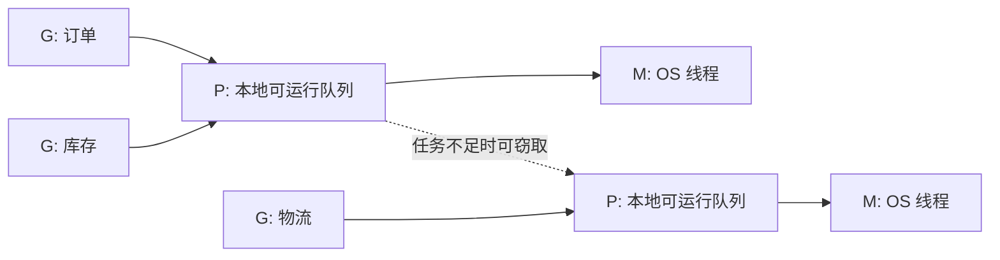

# 01. Goroutine：并发任务的启动、调度与收尾

## 前言

订单页面通常要同时读取订单、库存和物流。它们彼此独立时，串行调用的等待时间接近三段调用时间之和；同时发起后，等待时间通常接近其中最慢的一段。这里需要的是**并发结构**：把能独立推进的工作拆开，再在合适的地方汇合。

goroutine 是 Go 的并发执行单元。`go f()` 看上去只是一个关键字，实际却引入了三个必须回答的问题：谁等待结果、任务在什么条件下停止、多个任务如何安全地共享或交接数据。没有生命周期和资源边界的 goroutine，不是“后台任务”，而是潜在泄漏。

## 并发不等于并行

并发表示多个任务在同一段时间内都能取得进展；即使只有一个逻辑处理器，运行时也能让它们交替执行。并行表示多个任务在同一时刻真的运行在不同 CPU 上。

goroutine 让程序容易表达并发，但不保证立即执行、固定执行次序或一定并行。输出顺序、谁先拿到锁、哪个请求先完成，都不能依赖调度时机。程序正确性必须来自同步关系，而不是某次运行“刚好如此”。

## `go` 语句到底做了什么

语言规范把 `go` 后面的内容定义为一次函数调用。函数值和参数会先按普通调用规则求值，随后新 goroutine 执行该调用；调用方不会等待它的返回值，返回值也会被丢弃。

```go
package main

import (
	"fmt"
	"sync"
)

func printOrder(orderID int, wg *sync.WaitGroup) {
	defer wg.Done() // 每个登记过的任务退出时都必须归还一次计数。
	fmt.Println("处理订单", orderID)
}

func main() {
	var wg sync.WaitGroup

	wg.Add(2) // 必须先登记任务，再启动；不能让 Wait 先观察到零计数。
	go printOrder(1001, &wg)
	go printOrder(1002, &wg)

	wg.Wait() // 等待的是“两个任务均已结束”，不是某种固定输出顺序。
	fmt.Println("全部订单处理完成")
}
```

运行这个程序时，两行“处理订单”的顺序可能变化，但最后一行一定在 `Wait` 返回后打印。若去掉 `Wait`，`main` 返回时进程会退出，其他尚未完成的 goroutine 不会被自动等待或优雅清理。

`time.Sleep` 只能让演示更容易复现，不能表达正确的同步：睡短了任务未完成，睡长了浪费时间，且结果依赖机器负载。等待完成应使用 `WaitGroup`、channel 或其他能表达因果关系的同步手段。

## `sync.WaitGroup`：只解决“何时结束”

`WaitGroup` 内部维护一个任务计数。`Add(n)` 增加计数，`Done()` 等价于 `Add(-1)`，`Wait()` 在计数归零前阻塞。它不传递结果、不聚合错误，也不取消其他 goroutine。

下面的例子同时读取多个商品卡片，返回顺序仍与输入顺序一致：每个 goroutine 只写入自己独占的切片下标，主 goroutine 在 `Wait` 后才读取这些位置。切片长度预先固定，不能在 goroutine 中并发 `append`。

```go
package main

import (
	"context"
	"fmt"
	"sync"
	"time"
)

type Card struct {
	ID   int
	Name string
}

// loadCard 模拟会阻塞的下游调用；真实代码应把 ctx 继续传给 HTTP、SQL 或 RPC 客户端。
func loadCard(ctx context.Context, id int) (Card, error) {
	select {
	case <-time.After(20 * time.Millisecond):
		return Card{ID: id, Name: fmt.Sprintf("商品-%d", id)}, nil
	case <-ctx.Done():
		return Card{}, ctx.Err() // 调用方取消后，任务有机会自行退出。
	}
}

func loadCards(ctx context.Context, ids []int) ([]Card, error) {
	cards := make([]Card, len(ids)) // 固定长度：每个任务只拥有 cards[index]。
	errs := make([]error, len(ids))

	var wg sync.WaitGroup
	for index, id := range ids {
		wg.Add(1)
		go func(index, id int) {
			defer wg.Done()

			card, err := loadCard(ctx, id)
			if err != nil {
				errs[index] = err
				return
			}
			cards[index] = card
		}(index, id) // 显式传参让代码同时兼容较旧 Go 版本，意图也更清晰。
	}

	wg.Wait()
	for index, err := range errs {
		if err != nil {
			return nil, fmt.Errorf("读取商品 %d: %w", ids[index], err)
		}
	}
	return cards, nil
}

func main() {
	cards, err := loadCards(context.Background(), []int{101, 102, 103})
	if err != nil {
		panic(err)
	}
	fmt.Println(cards)
}
```

`WaitGroup` 的文档还给出一条重要的内存模型关系：解除 `Wait` 阻塞的那次 `Done`，先于该 `Wait` 的返回。因此上例在 `Wait` 返回后读取已写好的元素是安全的。这个结论不意味着任意两个 goroutine 都能同时读写同一变量；同一位置的并发访问仍需要锁、channel 或其他同步设计。

### 使用边界

- `WaitGroup` 首次使用后不得复制，函数间传递时传 `*sync.WaitGroup`。
- 计数变成负数会 panic。通常用 `defer wg.Done()`，避免错误分支漏掉它。
- 新一批任务的 `Add` 应在上一轮所有 `Wait` 返回后才开始；尤其不要在计数为零且另一个 goroutine 正在 `Wait` 时新增任务。
- `WaitGroup` 不能限制并发量。面对十万条任务时，它只会等待十万个 goroutine；并发上限应交给 worker pool、信号量或下游连接池设计。

## 取消不是强杀：goroutine 必须自己退出

Go 没有一个安全的“从外部杀掉指定 goroutine”的 API。取消通常通过 `context.Context` 或关闭的 channel 协作完成：发起方通知，执行方在阻塞点或循环中检查信号并返回。

```go
// refreshLoop 会一直运行，直到服务关闭或上游取消。
func refreshLoop(ctx context.Context, refresh func(context.Context) error) {
	ticker := time.NewTicker(time.Minute)
	defer ticker.Stop() // 函数退出时停止定时器，避免无用的定时资源继续存在。

	for {
		select {
		case <-ctx.Done():
			// 仅仅收到取消信号不会自动停止其他函数；这里主动 return 才完成收尾。
			return
		case <-ticker.C:
			_ = refresh(ctx) // refresh 应尊重同一个 ctx，才能把停止意图传到下游。
		}
	}
}
```

启动 goroutine 前，应能写清楚它的退出条件。例如“读取完成”“输入 channel 关闭”“请求取消”“服务关闭”。HTTP handler 中随手启动一个仍持有请求数据的 goroutine 然后返回，通常是错误的：客户端已经收到响应，任务的错误、取消和资源归属都失去了明确边界。

## runtime 如何运行 goroutine

这部分解释实现机制，不能当作语言保证。以 Go 1.22 runtime 为例，调度器常用 **G-M-P** 描述：

- **G（goroutine）**：用户任务的运行时描述，关联栈、执行位置和状态；
- **M（machine）**：runtime 对操作系统线程的抽象；
- **P（processor）**：执行 Go 代码所需的调度资源，维护本地可运行队列等状态。

只有拿到 P 的 M 才能执行普通 Go 代码。P 的数量由 `GOMAXPROCS` 控制，它限制同时执行 Go 代码的线程数量，不限制 goroutine 总数，也不等于进程的全部线程数。



编译器会把 `go f()` 降为对 runtime 创建 goroutine 的调用。runtime 中的 `newproc` / `newproc1` 创建新的 G，随后把它放入可运行队列；新任务通常优先进入当前 P 的本地队列。空闲的 P 会检查全局队列、网络轮询器、定时器以及其他 P 的队列，必要时窃取一部分任务以平衡负载。队列长度、检查顺序和阈值都可能随 Go 版本改变。

goroutine 在 channel、锁、网络 I/O 等 runtime 能识别的等待点会让出执行机会；计算密集型代码也存在运行时抢占机制。不要把“某 goroutine 最多运行多少毫秒”当作业务假设，更不要用 `runtime.Gosched` 代替同步。goroutine 的栈会按需增长和收缩，但它仍有栈、调度元数据和业务对象成本，数量应由压测和下游容量决定。

## 用工具验证并发假设

数据竞争常在测试机上“看似正常”，上线后才暴露。给并发代码补测试，并优先运行 race detector：

```bash
go test -race ./...
```

它能发现许多未同步的共享内存访问，但不能证明业务逻辑没有死锁、泄漏或错误的关闭顺序。需要观察调度和阻塞时，可在测试或程序中使用 `runtime/trace` 生成 trace 文件，再执行：

```bash
go tool trace trace.out
```

重点关注 goroutine 是否长期卡在 channel、锁、网络 I/O 或系统调用上，而不是记住某次运行里的 G、M 编号。

## 常见错误

### 在 `Wait` 后才登记任务

```go
// 错误示例：Wait 可能先看到计数为零而直接返回。
go func() {
	wg.Add(1)
	defer wg.Done()
	work()
}()
wg.Wait()
```

登记和启动应该放在同一段控制流中：先 `Add(1)`，再 `go`。如果任务会动态产生，需另行设计明确的生产结束条件，而不是让 `WaitGroup` 的计数在零值附近竞速。

### 捕获可变循环状态

Go 1.22 起，`for range` 的迭代变量具有每轮独立语义；旧代码和普通变量仍容易因闭包共享可变状态而出错。把任务所需值作为匿名函数参数传入，既避免版本差异，也明确了任务的输入快照。

### 忽略错误后继续等待

`WaitGroup` 不会因一个任务失败而让其他任务停止。若“第一个错误就结束”是需求，需要派生可取消的 `context`，以受控方式收集首个错误，并确保每个发送或接收路径都能退出。

## 总结

goroutine 用 `go` 语句启动，执行顺序和并行度都不应被业务代码假设。`WaitGroup` 适合等待一组已知任务结束，却不负责结果、错误或取消；长生命周期任务则必须通过 `context` 或其他明确信号自行退出。runtime 通过 G-M-P 把大量 goroutine 调度到操作系统线程上，但轻量不等于没有成本。先定义任务的所有权、退出条件和资源上限，再让并发真正带来收益。

## 参考资料

- [Go 语言规范：Go 语句](https://go.dev/ref/spec#Go_statements)
- [sync.WaitGroup 包文档](https://pkg.go.dev/sync#WaitGroup)
- [Go 内存模型](https://go.dev/ref/mem)
- [Go 1.22 runtime：proc.go](https://cs.opensource.google/go/go/+/refs/tags/go1.22.10:src/runtime/proc.go)
