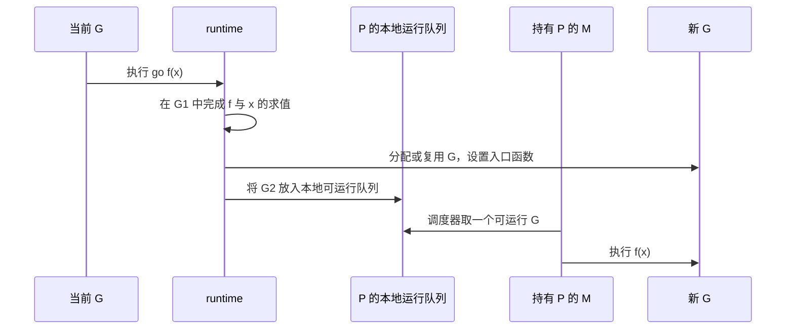

# 01. Goroutine：把独立工作并发地推进

## 前言

一个接口要读取用户资料、订单摘要和优惠券时，这三件事通常互不依赖。按顺序执行，等待时间大约是三次查询的总和；同时发起，再等待全部结果，用户通常只需等待最慢的一次。这样的需求并不稀有：批量处理文件、向多个服务取数、后台消费任务，都在处理多件可以独立向前推进的工作。

goroutine 是 Go 为这种工作组织提供的执行单元。它不是“让程序一定更快”的开关：任务之间仍要同步结果、限制并发量，并在调用方离开时停止。若只会写 `go f()`，很容易得到无法等待、无法取消、悄悄泄漏的后台任务。

这里从一次并发查询开始，先弄清 `go` 到底改变了什么，再用 `WaitGroup` 和 `context` 完成等待与取消，最后阅读 Go 1.26.5 runtime 如何调度 goroutine。阅读时应区分两个词：**并发**是让多项工作交替推进的程序结构；**并行**才是多项工作在多个 CPU 核上同时运行。前者不以多核为前提，后者也不保证业务结果的执行顺序。

## 先看 `go` 语句改变了什么

普通函数调用必须等函数返回：

```go
profile, err := loadProfile(ctx, userID) // 当前 goroutine 在这里等待 I/O 和函数返回。
if err != nil {
	return err
}
_ = profile
```

在函数调用前加上 `go`，调用者不再等待该函数结束：

```go
go refreshCache(ctx) // 启动新的 goroutine；下一行会立刻继续执行。
log.Println("刷新任务已经提交")
```

`go` 后必须是一次函数或方法调用。函数值和参数仍然会在**当前** goroutine 中先求值，然后新 goroutine 才独立开始执行；返回值会被丢弃。因此下面的写法既不能接收错误，也不能得知何时完成：

```go
go saveOrder(ctx, order) // saveOrder 即使返回 error，调用方也看不到。
```

不要用 `time.Sleep` 猜测任务是否结束。睡短了会偶发失败，睡长了会平白增加延迟；正确程序应等待一个明确的完成条件。

## 一个完整示例：并发取数、收集错误、响应取消

下面的程序模拟同时读取三种资料。示例刻意没有共享 map：每个 goroutine 只写自己的结果变量，主 goroutine 在 `Wait` 以后再读取它们。`WaitGroup` 负责“全部完成”，`context` 负责“没必要再做时尽快离开”。

```go
package main

import (
	"context"
	"errors"
	"fmt"
	"sync"
	"time"
)

// profile 是一次查询得到的独立结果。
type profile struct {
	name string
}

// load 模拟一个能感知取消的 I/O 操作。
func load(ctx context.Context, name string, delay time.Duration) (profile, error) {
	select {
	case <-time.After(delay):
		// I/O 完成时返回自己的结果；真实代码可在这里调用数据库或 HTTP 客户端。
		return profile{name: name}, nil
	case <-ctx.Done():
		// 调用方超时或取消后，不再继续等待。
		return profile{}, ctx.Err()
	}
}

func main() {
	// 这个 deadline 代表整次“聚合查询”的预算，而不是单个任务的额外等待时间。
	ctx, cancel := context.WithTimeout(context.Background(), 800*time.Millisecond)
	defer cancel() // 提前返回时也释放 Context 关联的计时器资源。

	var (
		wg      sync.WaitGroup
		user    profile
		coupons profile
		orders  profile
		errs    = make(chan error, 3) // 每个任务最多写一个错误，因此容量等于任务数。
	)

	// run 将“登记任务、启动 goroutine、无论如何 Done”放在一起，避免遗漏 Done。
	run := func(dst *profile, name string, delay time.Duration) {
		wg.Add(1) // Add 必须发生在 goroutine 可能调用 Done 之前。
		go func() {
			defer wg.Done() // 即使下面提前 return，也会把计数减一。

			result, err := load(ctx, name, delay)
			if err != nil {
				errs <- err // 有缓冲，失败任务不必等待主 goroutine 开始收错误。
				return
			}
			*dst = result // 每个任务写不同地址；Wait 后主 goroutine 才读，因而没有竞争。
		}()
	}

	run(&user, "用户资料", 200*time.Millisecond)
	run(&orders, "订单摘要", 350*time.Millisecond)
	run(&coupons, "优惠券", time.Second) // 会超过整体 800ms 预算。

	wg.Wait()   // 等待所有已登记任务退出；它不主动取消任何任务。
	close(errs) // 此时不会再有发送者，主 goroutine 才拥有关闭 errs 的资格。

	for err := range errs {
		// context deadline 是预期的业务结果，其他错误才需要按业务决定如何处理。
		if !errors.Is(err, context.DeadlineExceeded) {
			fmt.Println("查询失败：", err)
		}
	}
	fmt.Printf("user=%+v orders=%+v coupons=%+v\n", user, orders, coupons)
}
```

这个例子故意让优惠券查询超时。它说明了三种责任不能混在一起：`WaitGroup` 只等待，不传结果也不传播失败；`context` 只广播“应停止”，不等待任务退出；`errs` 是应用自定义的错误传递通道。实际项目还应为“一个任务失败是否立即取消全部任务”定义策略，常见做法是 `context.WithCancel` 配合第一个错误调用 `cancel()`。

## `WaitGroup` 的正确边界

`WaitGroup` 是一个任务计数器：`Add(n)` 登记 n 项工作，`Done()` 减一，`Wait()` 阻塞到计数归零。它不关心 goroutine 具体做什么，也不能替代锁来保护共享变量。

```go
var wg sync.WaitGroup

wg.Add(2) // 先登记，避免 Wait 先看到 0 而过早返回。
go func() {
	defer wg.Done() // 用 defer 防止分支 return 时忘记完成登记。
	workA()
}()
go func() {
	defer wg.Done()
	workB()
}()

wg.Wait() // Done 使计数变为 0 后才返回。
```

Go 1.26.5 提供 `wg.Go(func() { ... })`，可将登记、启动和完成通知合在一起；传入函数必须正常返回，不能 panic。传统 `Add`、`go`、`defer Done` 仍值得掌握，因为它在旧代码和需要明确包装逻辑时更常见。

使用时牢记四条规则：

- 第一次从 0 增加任务数必须发生在 `Wait` 之前；不要一边等一边从 0 开始加入新任务。
- 一个 `WaitGroup` 首次使用后不能复制；作为参数通常传 `*sync.WaitGroup`。
- 每次 `Add(1)` 必须恰好配一个 `Done()`，否则会永久等待或触发负计数 panic。
- `Wait` 返回只说明任务已经调用 `Done`。若任务写共享内存，仍要让读写遵守同步边界；若需要返回值，使用 channel、受保护的结构或专门的结果类型。

## goroutine 的生命周期：完成不是唯一的退出方式

`main` 返回时，进程会立即结束；其余 goroutine 不会被自动等待，也不能指望它们执行完整收尾。一个长期 goroutine 至少要能回答三个问题：谁启动它、何时停止它、谁等待它退出。

`context.Context` 是最常用的停止信号。它应从请求或服务根节点向下传递，不能随手换成 `context.Background()`，否则就把上游的取消切断了。循环中每一次可能长期阻塞的发送、接收、I/O 或等待，都要有机会观察 `ctx.Done()`：

```go
func consume(ctx context.Context, jobs <-chan string) error {
	for {
		select {
		case job, ok := <-jobs:
			if !ok {
				return nil // 发送方明确宣布：不会再有任务。
			}
			if err := handle(ctx, job); err != nil {
				return err
			}
		case <-ctx.Done():
			return ctx.Err() // 上游离开后，本 goroutine 也能结束。
		}
	}
```

取消是协作式的：调用 `cancel()` 不会强行杀掉 goroutine，只会关闭 `Done` 通道。函数是否迅速退出，取决于它是否检查该信号、下游 API 是否接受 Context，以及是否被无法中断的调用卡住。

## 为什么要限制并发

“每个任务一个 goroutine”适合少量、短暂且资源独立的任务；它不等于无限制地启动任务。若每个任务都会占用数据库连接、文件描述符或下游 HTTP 配额，持续创建 goroutine 只会把拥塞从入口转移到下游。

简单的并发闸门可以用有缓冲 channel 表示：只有拿到一个位置才启动工作，结束后归还位置。更复杂的生产者—消费者与关闭顺序放在 Channel 一节完整讨论。

```go
limit := make(chan struct{}, 8) // 同一时刻最多允许 8 项工作进入临界资源区。

for _, job := range jobs {
	limit <- struct{}{} // 缓冲满时阻塞，形成背压，而不是无限创建 goroutine。
	go func(job Job) {
		defer func() { <-limit }() // 无论成功失败都归还位置。
		process(job)
	}(job) // 将循环变量作为参数传入，代码意图在所有 Go 版本都清晰。
}
```

并发限制不是固定填一个“看起来合适”的数字。它应基于下游连接池、CPU、内存、请求延迟和压测结果设置，并在过载时配合排队上限、超时或拒绝策略。

## 源码视角：G、M、P 如何让工作运行

语言规范只承诺 `go` 启动独立的并发控制流，不承诺调度顺序。Go 1.26.5 runtime 用常说的 GMP 模型实现这一点：**G** 是 goroutine 的运行时对象，**M** 是操作系统线程，**P** 是执行 Go 代码所需的逻辑处理器与本地运行队列。一个 M 必须持有 P，才能运行用户态 Go 代码。



`runtime/proc.go` 中，编译器为 `go` 语句生成的路径最终会创建新 G，并将它放进可运行队列；调度器再从本地队列、全局队列或其他 P 的队列取得工作。局部队列优先减少争用，工作窃取帮助负载不均的 P 互相分担。这些数据结构是运行时实现细节，业务代码不能依赖“某个 goroutine 必定在哪个线程、何时运行”。

阻塞并不总是占住一个操作系统线程。channel 等待、计时器和许多网络 I/O 会让当前 G 停放，M 可以改去运行其他 G；当 G 可继续执行时再被置为 runnable。长时间纯 CPU 计算、cgo 或某些系统调用仍可能影响调度，因此 CPU 密集型任务同样需要限制规模。

`sync.WaitGroup` 的源码也揭示了它为什么只能做等待：Go 1.26.5 用一个原子 `state` 同时保存任务计数和等待者数量；`Done()` 等价于 `Add(-1)`，计数降到 0 时才通过信号量唤醒所有 `Wait()`。它没有保存错误、结果或取消原因，所以这些能力必须由上层组合出来。

## 容易出错的边界

- 启动 goroutine 后立刻让 `main` 或 HTTP Handler 返回；没有等待与取消策略的后台工作不可靠。
- 把 `time.Sleep` 当同步工具；它只等待时间，不表达任务是否完成。
- 以为 `WaitGroup` 能防数据竞争；使用 `go test -race` 或 `go run -race` 检查共享内存访问。
- 在 goroutine 中写入同一个 map、slice 或计数器却没有同步；并发读写 map 也不安全。
- 把请求 Context 替换成 `Background`；这样客户端断开后下游工作仍可能继续。
- 因为 goroutine 轻量就无限创建；真正先耗尽的往往是内存、连接、队列或下游服务。

## 总结

goroutine 用来让相互独立的工作并发推进，但可靠的并发代码一定同时写清三件事：怎样等待完成、怎样传递结果或错误、怎样在不再需要时停止。`WaitGroup` 解决等待，`context` 解决生命周期，channel 或受保护的数据结构解决交接与共享。

理解这些边界后，下一步才适合用 channel 设计生产者和消费者之间的数据流；否则 `go` 只会把串行代码中的资源和错误问题变成更难复现的并发问题。

## 参考资料

- [Go 语言规范：Go statements](https://go.dev/ref/spec#Go_statements)
- [Effective Go：Goroutines](https://go.dev/doc/effective_go#goroutines)
- [Go 1.26.5 `runtime/proc.go` 源码](https://cs.opensource.google/go/go/+/go1.26.5:src/runtime/proc.go)
- [Go 1.26.5 `sync/waitgroup.go` 源码](https://cs.opensource.google/go/go/+/go1.26.5:src/sync/waitgroup.go)
- [Go 并发模式：Context](https://go.dev/blog/context)
