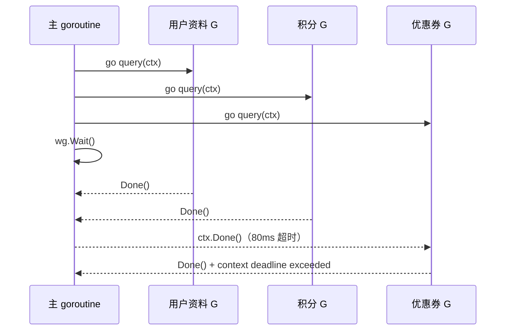

# 01. Goroutine：并发任务的启动、调度与收尾

## 前言

一个页面要同时读取用户资料、积分和优惠券时，三个查询彼此独立。若按顺序调用，总等待时间接近三次调用之和；若同时发起，只需要等待最慢的那一次。goroutine 就是把这种“可以同时推进”的工作写出来的工具。

不过，`go f()` 只负责启动，不负责等待、取消或回收。写 goroutine 前先把问题说完整：**谁等待全部任务结束？调用方放弃后，任务怎样停下来？** 下面用一个带截止时间的资料查询来回答这两个问题。

## `go` 语句承诺了什么

语言规范把 `go` 后面看作一次函数调用：函数值和实参先按普通调用规则求值，再由新的 goroutine 执行调用；发起方不等待它返回，返回值也会被丢弃。

```go
// makeID() 在当前 goroutine 中先执行；它的结果才交给新 goroutine。
go save(makeID())
```

这一区分在资源交接时很重要。例如 `go use(file)` 传入的是当下的 `file` 值；启动后再给变量重新赋值，不会改变已经传入的实参。反过来，若 goroutine 闭包直接读取外部可变对象，谁在什么时候修改它就必须有明确约束。把启动所需的值作为函数参数传入，通常是最清楚的边界。

因此，goroutine 不保证立刻运行，也不保证运行顺序。正确性不能依赖某次打印“恰好先出现”。特别是 `main` 函数返回时，进程会退出，不会等其他 goroutine 做完。

`sync.WaitGroup` 只表达“这一组任务什么时候全部结束”：`Add` 登记数量，任务结束时 `Done` 归还一次，`Wait` 等到计数为零。它不传递结果，也不会取消任务；取消交给 `context.Context`，而任务必须主动检查 `ctx.Done()` 才能响应。

这三个动作可按职责区分：

| 需求 | 这里使用的工具 | 它没有解决什么 |
| --- | --- | --- |
| 启动独立工作 | `go` | 不等待、不取消、不返回结果 |
| 知道所有工作已退出 | `WaitGroup` | 不传值、不选择首个错误 |
| 表达调用方不再等待 | `context` | 不会强行中止不配合的代码 |

这张表也说明为什么它们常常一起出现：启动后的任务需要一个收尾点，而收尾点要能在请求失效时尽快抵达。

选择并发前还要确认任务确实独立：它们不应要求彼此的中间结果，也不应无节制地同时压向同一个有限下游。这里的三个来源可以独立查询，因此并发只缩短等待时间，不改变结果含义。

当任务之间存在先后依赖时，应先把依赖结果传递完成，再启动下一步；不要为了“看起来并发”而破坏数据依赖。

并发结构首先应服务于正确性，延迟改善是建立在正确边界之上的结果。

## 一个完整例子：带截止时间地并发读取资料

把下面内容保存为 `main.go` 后执行 `go run main.go`。第三个查询故意比 80ms 的截止时间慢，用来观察取消如何结束阻塞中的工作。

```go
package main

import (
	"context"
	"fmt"
	"sync"
	"time"
)

// Source 描述一项独立的资料来源。delay 只用于让示例可重复运行。
type Source struct {
	name  string
	delay time.Duration
}

// Record 是每项查询交给调用方的结果。
type Record struct {
	Source string
	Value  string
}

// query 模拟一个会等待下游响应的调用。
// 真实 HTTP、SQL 或 RPC 调用也应接收同一个 ctx，让取消继续向下传递。
func query(ctx context.Context, source Source) (Record, error) {
	select {
	case <-time.After(source.delay):
		// 下游按时返回时，构造该来源的结果。
		return Record{Source: source.name, Value: source.name + " 的数据"}, nil
	case <-ctx.Done():
		// 调用方已取消或超时，不再继续无意义的等待。
		return Record{}, ctx.Err()
	}
}

func loadProfile(ctx context.Context, sources []Source) ([]Record, error) {
	records := make([]Record, len(sources))
	errs := make([]error, len(sources))

	var wg sync.WaitGroup
	for index, source := range sources {
		wg.Add(1) // 先登记，再启动；不能与会看到零计数的 Wait 并发新增任务。

		go func(index int, source Source) {
			defer wg.Done() // 无论查询成功还是因取消返回，都恰好归还一次。

			record, err := query(ctx, source)
			if err != nil {
				errs[index] = err
				return
			}

			// 每个 goroutine 只写自己独占的下标；Wait 后主 goroutine 才读取。
			records[index] = record
		}(index, source) // 显式传参，避免闭包意外依赖下一轮循环变量。
	}

	wg.Wait() // 这里只等待任务结束，不代表它们以某种顺序执行过。
	for index, err := range errs {
		if err != nil {
			return nil, fmt.Errorf("读取 %s: %w", sources[index].name, err)
		}
	}
	return records, nil
}

func main() {
	// cancel 必须调用：即使提前成功，它也会释放 deadline timer 等关联资源。
	ctx, cancel := context.WithTimeout(context.Background(), 80*time.Millisecond)
	defer cancel()

	sources := []Source{
		{name: "用户资料", delay: 20 * time.Millisecond},
		{name: "积分", delay: 45 * time.Millisecond},
		{name: "优惠券", delay: 120 * time.Millisecond}, // 会收到 ctx 的超时信号。
	}

	records, err := loadProfile(ctx, sources)
	if err != nil {
		fmt.Println("加载失败：", err)
		return
	}
	fmt.Println("加载成功：", records)
}
```

运行时通常会看到“加载失败：读取 优惠券: context deadline exceeded”。前两项虽然早已成功，函数仍选择返回整体错误：这是该函数的业务约定，而不是 goroutine 的固定行为。若页面允许部分资料展示，可以把 `Record` 和错误一起返回；关键是把约定写在返回类型和调用处，而不是依赖调度顺序。

逐段看这段代码的生命周期：

1. `main` 创建带 80ms 截止时间的 context，并承诺离开时调用 `cancel`。
2. `loadProfile` 为每个来源预留一个独占结果位置，再在启动前完成 `wg.Add(1)`。
3. 每个查询要么等到自己的响应，要么等到 `ctx.Done()`；无论哪条路径，`defer wg.Done()` 都会执行。
4. 主 goroutine 不通过睡眠猜测结果，而是停在 `wg.Wait()`，直到三个任务都已经离开。
5. 最后才检查错误并读取结果，因此“任务收尾”与“汇总结果”之间有清晰边界。

这个例子刻意等待所有已启动任务退出后再返回，这在需要保证无遗留工作时很合适。另一种设计可能在首个错误发生时立即向其他任务发出取消并继续等待它们收尾；那会增加结果传递协议，应该在需要“首个错误”语义时再引入，而不是让一个入门示例承担所有模式。

示例也没有尝试记录固定的完成顺序。`records` 的顺序来自输入切片的下标；日志的输出顺序则来自调度和响应时间。把这两种顺序分开，读日志时就不会误以为它们是程序保证。

这里不需要互斥锁：三个 goroutine 分别拥有 `records[index]` 与 `errs[index]` 的一个位置，且 `wg.Wait()` 返回前主 goroutine 不读取它们。若改成在 goroutine 中对同一个切片 `append`，就不再是独占写入，需要重新设计同步方式。

`context` 不是强制终止线程的按钮。示例中的 `query` 通过 `select` 监听取消；若真实调用没有使用支持 context 的 API，`cancel()` 只能通知，无法替它把工作“杀掉”。

请求入口通常已经有一个 `ctx`，例如 HTTP 请求的 `r.Context()`。派生的 `WithTimeout` 不应替换掉它，而应以它为父 context：父请求断开时，子 context 也会取消；内部设置的更短截止时间则限制本次聚合的最大等待。这让取消方向始终从调用方流向下游。

这里还有一条常被忽略的同步关系：某个任务调用 `Done` 之前的写入，在对应的 `Wait` 返回后对等待者可见。它只覆盖这一轮“任务完成 → 读取结果”；若主 goroutine 在 `Wait` 前读 `records`，或者两个任务写同一位置，仍然是竞态，应让数据拥有关系或同步关系变得明确。



## 从运行时看：启动不等于马上执行

在本机 Go 1.22.10 的 `runtime/proc.go` 中，注释直接说明编译器会把 `go` 语句转成对 `newproc` 的调用。`newproc` 创建一个处于可运行状态的 G，并用 `runqput` 放入当前 P 的可运行队列；随后 `wakep` 在需要时唤醒执行它的 M。

常见的 GMP 说法可以这样读：**G** 是 goroutine 的执行上下文，**M** 是操作系统线程，**P** 是运行 Go 代码所需的调度资源和本地队列。M 必须持有 P 才能运行 G。调度器会从 P 的本地队列、全局队列或其他 P 的队列取得 G；当 G 因 channel、网络 I/O 等阻塞时，M 可以去运行别的 G。

这解释了两个事实：goroutine 的创建很轻量，且阻塞一个 goroutine 不必占住一个线程；但它不构成业务顺序保证，也不保证 CPU 并行。可同时运行多少 Go 代码还受 `GOMAXPROCS` 和机器资源影响。

并发与并行可简单区分：单核上两个查询在等待 I/O 时交替推进，是并发；多个 P 分别让 M 在不同 CPU 核上运行 Go 代码，才是并行。goroutine 提供的是表达并发的方式，不应把它直接等同于“创建一个新线程”。

`sync/waitgroup.go` 的 `Add` 维护任务计数与等待者数量，`Wait` 在计数非零时休眠，最后一次 `Done` 让等待者继续。这个实现细节支持“结束发生在 Wait 返回之前”的同步关系；它不是用来保护任意共享变量的锁。

可以把一次启动过程按时间拆开：当前 G 先把参数准备好，运行时把新 G 标成 runnable 并排队；某个持有 P 的 M 之后才会取到它执行。若当前 G 立刻到达 `Wait`，它会让出执行机会；这不是“新任务一定先跑”，而是等待点给调度器提供了可切换的机会。

源码路径用于建立直觉即可，不要把内部字段或队列长度当作业务接口。运行时会随 Go 版本调整；应用代码应依赖语言规范、`sync` 和 `context` 文档承诺的行为。

## 容易出错的边界

- 不要用 `time.Sleep` 等 goroutine：它既不能证明任务完成，也会让等待时间依赖机器负载。
- `Add` 应在启动任务前完成；`Done` 用 `defer` 紧贴 goroutine 开头，避免遗漏或重复，计数变成负数会 panic。
- `WaitGroup` 使用后不能复制；一轮 `Wait` 尚未返回时，不要为下一轮任务重新 `Add`。
- `cancel` 应尽快调用，并把 `ctx` 传到真正可能阻塞的 API；仅创建 context 不会自动停止任何工作。
- 循环中启动 goroutine 时，把当前下标和值作为参数传入。即使 Go 1.22 改善了循环变量语义，显式传参仍能把任务拥有的数据写清楚。
- `go` 调用的返回值会被丢弃。需要结果时，要把结果存到具有明确所有权的位置，或交给后续定义的数据传递协议。

## 总结

goroutine 只让任务并发开始；`WaitGroup` 给出明确的收尾点，`context` 给出明确的放弃条件。先建立这两条生命周期边界，再讨论数据怎样在 goroutine 之间流动，程序才不会把“能跑”误当成“能长期运行”。

## 参考资料

- [Go 语言规范：Go 语句](https://go.dev/ref/spec#Go_statements)
- [sync.WaitGroup](https://pkg.go.dev/sync#WaitGroup)
- [context 包](https://pkg.go.dev/context)
- [Go 1.22.10 `runtime/proc.go`](https://cs.opensource.google/go/go/+/go1.22.10:src/runtime/proc.go)
