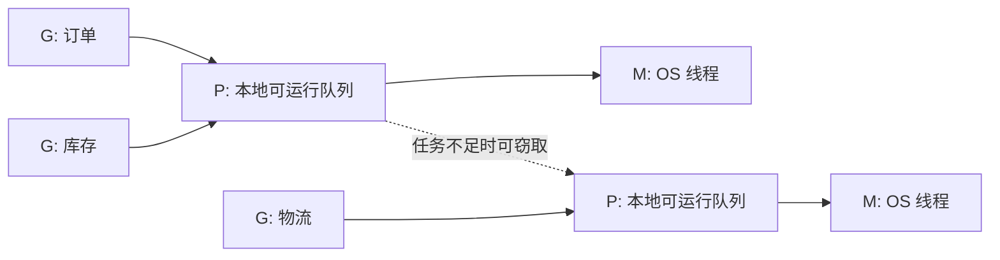
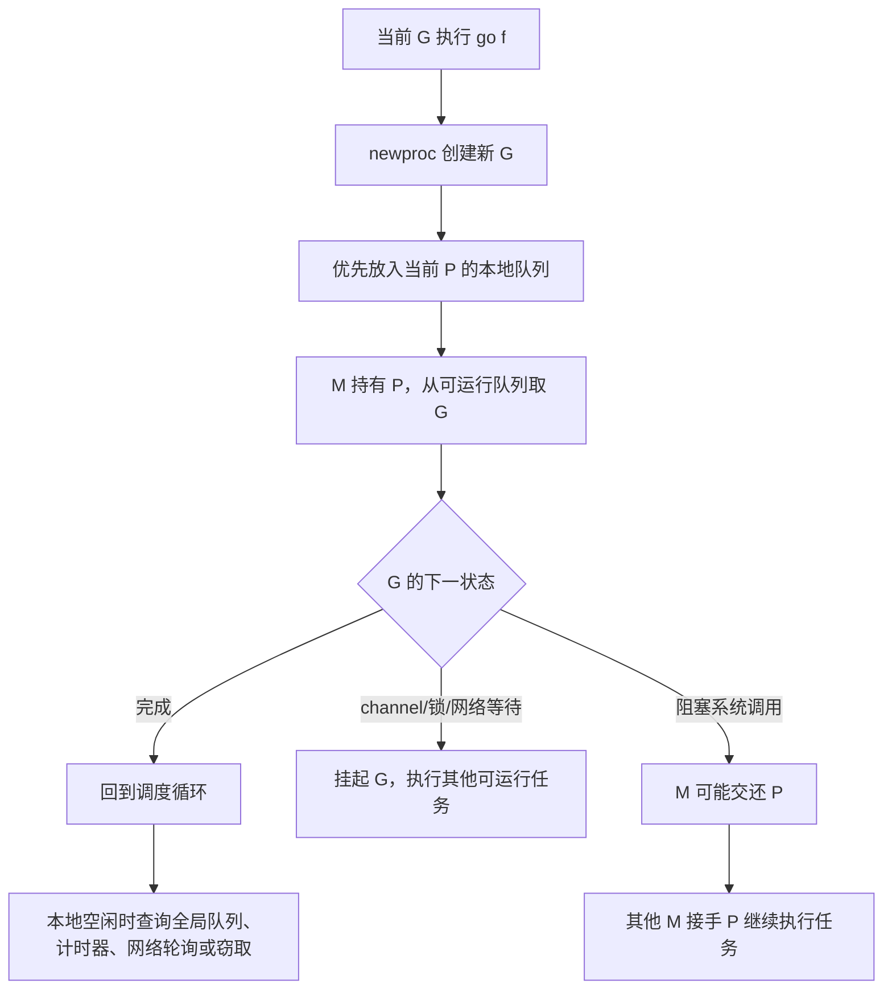

# 01. Goroutine：并发任务的启动、调度与收尾

## 前言

订单页面通常要同时读取订单、库存和物流。它们彼此独立时，串行调用的等待时间接近三段调用时间之和；同时发起后，等待时间通常接近其中最慢的一段。这里需要的是**并发结构**：把能独立推进的工作拆开，再在合适的地方汇合。

goroutine 是 Go 的并发执行单元。`go f()` 看上去只是一个关键字，实际却引入了三个必须回答的问题：谁等待结果、任务在什么条件下停止、多个任务如何安全地共享或交接数据。没有生命周期和资源边界的 goroutine，不是“后台任务”，而是潜在泄漏。

## 并发不等于并行

并发表示多个任务在同一段时间内都能取得进展；即使只有一个逻辑处理器，运行时也能让它们交替执行。并行表示多个任务在同一时刻真的运行在不同 CPU 上。

goroutine 让程序容易表达并发，但不保证立即执行、固定执行次序或一定并行。输出顺序、谁先拿到锁、哪个请求先完成，都不能依赖调度时机。程序正确性必须来自同步关系，而不是某次运行“刚好如此”。

## `go` 语句到底做了什么

语言规范把 `go` 后面的内容定义为一次函数调用。函数值和参数会先按普通调用规则求值，随后新 goroutine 执行该调用；调用方不会等待它的返回值，返回值也会被丢弃。

```go
package main

import (
	"fmt"
	"sync"
)

func printOrder(orderID int, wg *sync.WaitGroup) {
	defer wg.Done() // 每个登记过的任务退出时都必须归还一次计数。
	fmt.Println("处理订单", orderID)
}

func main() {
	var wg sync.WaitGroup

	wg.Add(2) // 必须先登记任务，再启动；不能让 Wait 先观察到零计数。
	go printOrder(1001, &wg)
	go printOrder(1002, &wg)

	wg.Wait() // 等待的是“两个任务均已结束”，不是某种固定输出顺序。
	fmt.Println("全部订单处理完成")
}
```

运行这个程序时，两行“处理订单”的顺序可能变化，但最后一行一定在 `Wait` 返回后打印。若去掉 `Wait`，`main` 返回时进程会退出，其他尚未完成的 goroutine 不会被自动等待或优雅清理。

`time.Sleep` 只能让演示更容易复现，不能表达正确的同步：睡短了任务未完成，睡长了浪费时间，且结果依赖机器负载。等待完成应使用 `WaitGroup`、channel 或其他能表达因果关系的同步手段。

## `sync.WaitGroup`：只解决“何时结束”

`WaitGroup` 内部维护一个任务计数。`Add(n)` 增加计数，`Done()` 等价于 `Add(-1)`，`Wait()` 在计数归零前阻塞。它不传递结果、不聚合错误，也不取消其他 goroutine。

下面的例子同时读取多个商品卡片，返回顺序仍与输入顺序一致：每个 goroutine 只写入自己独占的切片下标，主 goroutine 在 `Wait` 后才读取这些位置。切片长度预先固定，不能在 goroutine 中并发 `append`。

```go
package main

import (
	"context"
	"fmt"
	"sync"
	"time"
)

type Card struct {
	ID   int
	Name string
}

// loadCard 模拟会阻塞的下游调用；真实代码应把 ctx 继续传给 HTTP、SQL 或 RPC 客户端。
func loadCard(ctx context.Context, id int) (Card, error) {
	select {
	case <-time.After(20 * time.Millisecond):
		return Card{ID: id, Name: fmt.Sprintf("商品-%d", id)}, nil
	case <-ctx.Done():
		return Card{}, ctx.Err() // 调用方取消后，任务有机会自行退出。
	}
}

func loadCards(ctx context.Context, ids []int) ([]Card, error) {
	cards := make([]Card, len(ids)) // 固定长度：每个任务只拥有 cards[index]。
	errs := make([]error, len(ids))

	var wg sync.WaitGroup
	for index, id := range ids {
		wg.Add(1)
		go func(index, id int) {
			defer wg.Done()

			card, err := loadCard(ctx, id)
			if err != nil {
				errs[index] = err
				return
			}
			cards[index] = card
		}(index, id) // 显式传参让代码同时兼容较旧 Go 版本，意图也更清晰。
	}

	wg.Wait()
	for index, err := range errs {
		if err != nil {
			return nil, fmt.Errorf("读取商品 %d: %w", ids[index], err)
		}
	}
	return cards, nil
}

func main() {
	cards, err := loadCards(context.Background(), []int{101, 102, 103})
	if err != nil {
		panic(err)
	}
	fmt.Println(cards)
}
```

`WaitGroup` 的文档还给出一条重要的内存模型关系：解除 `Wait` 阻塞的那次 `Done`，先于该 `Wait` 的返回。因此上例在 `Wait` 返回后读取已写好的元素是安全的。这个结论不意味着任意两个 goroutine 都能同时读写同一变量；同一位置的并发访问仍需要锁、channel 或其他同步设计。

### 使用边界

- `WaitGroup` 首次使用后不得复制，函数间传递时传 `*sync.WaitGroup`。
- 计数变成负数会 panic。通常用 `defer wg.Done()`，避免错误分支漏掉它。
- 新一批任务的 `Add` 应在上一轮所有 `Wait` 返回后才开始；尤其不要在计数为零且另一个 goroutine 正在 `Wait` 时新增任务。
- `WaitGroup` 不能限制并发量。面对十万条任务时，它只会等待十万个 goroutine；并发上限应交给 worker pool、信号量或下游连接池设计。

## 取消不是强杀：goroutine 必须自己退出

Go 没有一个安全的“从外部杀掉指定 goroutine”的 API。取消通常通过 `context.Context` 或关闭的 channel 协作完成：发起方通知，执行方在阻塞点或循环中检查信号并返回。

```go
// refreshLoop 会一直运行，直到服务关闭或上游取消。
func refreshLoop(ctx context.Context, refresh func(context.Context) error) {
	ticker := time.NewTicker(time.Minute)
	defer ticker.Stop() // 函数退出时停止定时器，避免无用的定时资源继续存在。

	for {
		select {
		case <-ctx.Done():
			// 仅仅收到取消信号不会自动停止其他函数；这里主动 return 才完成收尾。
			return
		case <-ticker.C:
			_ = refresh(ctx) // refresh 应尊重同一个 ctx，才能把停止意图传到下游。
		}
	}
}
```

启动 goroutine 前，应能写清楚它的退出条件。例如“读取完成”“输入 channel 关闭”“请求取消”“服务关闭”。HTTP handler 中随手启动一个仍持有请求数据的 goroutine 然后返回，通常是错误的：客户端已经收到响应，任务的错误、取消和资源归属都失去了明确边界。

## runtime 如何运行 goroutine

这部分解释实现机制，不能当作语言保证。以 Go 1.22 runtime 为例，调度器常用 **G-M-P** 描述：

- **G（goroutine）**：用户任务的运行时描述，关联栈、执行位置和状态；
- **M（machine）**：runtime 对操作系统线程的抽象；
- **P（processor）**：执行 Go 代码所需的调度资源，维护本地可运行队列等状态。

只有拿到 P 的 M 才能执行普通 Go 代码。P 的数量由 `GOMAXPROCS` 控制，它限制同时执行 Go 代码的线程数量，不限制 goroutine 总数，也不等于进程的全部线程数。



编译器会把 `go f()` 降为对 runtime 创建 goroutine 的调用。runtime 中的 `newproc` / `newproc1` 创建新的 G，随后把它放入可运行队列；新任务通常优先进入当前 P 的本地队列。空闲的 P 会检查全局队列、网络轮询器、定时器以及其他 P 的队列，必要时窃取一部分任务以平衡负载。队列长度、检查顺序和阈值都可能随 Go 版本改变。

goroutine 在 channel、锁、网络 I/O 等 runtime 能识别的等待点会让出执行机会；计算密集型代码也存在运行时抢占机制。不要把“某 goroutine 最多运行多少毫秒”当作业务假设，更不要用 `runtime.Gosched` 代替同步。goroutine 的栈会按需增长和收缩，但它仍有栈、调度元数据和业务对象成本，数量应由压测和下游容量决定。

## 从参考模型到工程判断：并发、并行与线程

并发首先是程序的组织方式：把彼此独立、可能阻塞的任务拆成独立执行流，使它们都能在一段时间内推进。并行则是实际执行状态：多个执行流在同一时刻占用不同的硬件执行资源。

| 术语 | 解决的问题 | 是否要求多核 | 在 Go 中的含义 |
| --- | --- | --- | --- |
| 并发（concurrency） | 如何组织多个待处理任务 | 否 | 多个 goroutine 可以在一个 P 上交替运行 |
| 并行（parallelism） | 如何同时使用多个 CPU | 通常是 | 多个持有 P 的 M 可同时执行 Go 代码 |
| OS 线程 | 内核调度的执行实体 | 否 | runtime 的 M 通常关联一个 OS 线程 |
| goroutine | runtime 调度的用户任务 | 否 | G 被调度到持有 P 的 M 上运行 |

例如，两个下载任务在一核机器上可以在网络等待期间交替推进，这已经是并发；只有它们的 CPU 解码阶段同时运行在多个核上，才是并行。网络 I/O 为主的服务通常受连接、远端延迟和下游配额约束，盲目增大 `GOMAXPROCS` 并不会神奇地增加吞吐。

## `go` 语句的规则：先求值，后并发调用

`go` 后必须是一个函数调用，不能是一个函数值。调用的函数及其参数在启动新 goroutine **之前**按普通调用规则求值；函数的返回值会被忽略。因此，下面代码中的 `nextID()` 发生在当前 goroutine 中，而非未来的 worker 中。

```go
package main

import "fmt"

func nextID() int {

	fmt.Println("当前 goroutine：计算任务参数")
	return 42
}

func handle(id int) {

	fmt.Println("新 goroutine：处理任务", id)
}

func main() {

	// 先执行 nextID()，再让 runtime 安排 handle(42)。
	go handle(nextID())

	// 这里不等待的话，main 返回时 handle 可能还没有机会输出。
	// 示例刻意省略等待，只用来说明参数求值时机。
}
```

以下几条是写代码时更有用的语言规则：

- `go f()` 与普通 `f()` 一样要求 `f` 可调用；`go f` 缺少调用括号，不能编译。
- `go` 调用的返回值没有接收位置；需要结果时让函数写入 channel、受保护的共享结构，或返回给一个包装 goroutine。
- `defer` 属于执行它的 goroutine。子 goroutine 的 `defer` 不会因为父 goroutine 返回而自动运行完。
- goroutine 的开始时刻、完成次序和是否与当前 goroutine 并行都没有语言层面的时序保证。

### 匿名函数：让任务输入成为快照

匿名函数适合把一次性任务、错误处理和 `defer` 放在同一个局部范围。最后的 `()` 很关键：它使匿名函数成为一次调用，满足 `go` 语句的语法。

```go
package main

import (
	"fmt"
	"sync"
)

func main() {

	var wg sync.WaitGroup
	wg.Add(1)

	go func(name string) {
		// defer 绑定到这个新 goroutine；无论后续怎样 return，计数都会归还。
		defer wg.Done()
		fmt.Println("执行一次性任务：", name)
	}("清理过期缓存") // 参数在当前循环/当前调用点取值，传给新函数。

	wg.Wait()
}
```

### 循环启动：不要把可变状态偷偷交给闭包

Go 1.22 为 `for range` 的迭代变量提供每轮独立语义，但项目可能使用旧 Go 版本，且循环外的可变变量仍可能被闭包共享。将输入显式作为参数传入，不依赖版本细节，也让读者立刻知道任务拿到的是启动时快照。

```go
package main

import (
	"fmt"
	"sync"
)

func main() {

	ids := []int{101, 205, 309}
	var wg sync.WaitGroup

	for _, id := range ids {
		wg.Add(1)
		go func(orderID int) {
			defer wg.Done()
			// orderID 是本次调用的参数，不会随外层循环继续变化。
			fmt.Println("处理订单", orderID)
		}(id)
	}

	wg.Wait()
}
```

不要通过输出顺序验证这个例子。正确性来自每个任务得到正确的 `orderID`，而不是 101、205、309 以哪种顺序打印。

## `main` 退出是进程边界，不是等待点

程序从 `main.main` 返回后，runtime 会让进程退出；它不会等待普通 goroutine，也不承诺它们的后续语句或 `defer` 得到执行机会。这个规则使“启动后台 goroutine，然后让 main 返回”特别危险：日志可能没刷完、文件可能没关闭、数据也可能只写了一半。

```go
package main

import (
	"fmt"
	"sync"
)

func main() {

	var wg sync.WaitGroup
	wg.Add(1)

	go func() {
		defer wg.Done()
		defer fmt.Println("worker 的清理动作")
		fmt.Println("worker 正在工作")
	}()

	// 这是显式生命周期边界：只有任务结束，main 才能返回。
	wg.Wait()
	fmt.Println("安全退出")
}
```

服务程序往往以根 `context` 表示进程的生命周期：收到关闭信号后先取消根 context，停止接收新工作，再等待已经开始的可收尾任务。`WaitGroup` 只能实现最后一步的等待；它本身没有“停止”含义。

## `WaitGroup` 的正确协议与替代选择

将 `Add`、`go` 和 `Done` 放在同一控制路径，能让计数的所有权清晰可查：谁登记，谁保证归还。特别是 `Wait` 与“从零计数重新 Add”并发时极易留下竞态；应先结束上一轮，再开始下一轮。

| 需求 | 优先选择 | 为什么 |
| --- | --- | --- |
| 只等固定数量任务结束 | `sync.WaitGroup` | 简单、无结果通道负担 |
| 要传递单个完成信号 | `chan struct{}` | 显式表达一个同步事件 |
| 要流式传递数据 | `chan T` | 传值与背压都在协议中 |
| 第一个错误后希望其余任务停止 | `context` + 错误收集 | `WaitGroup` 不会传播错误或取消 |
| 要限制同时工作的数量 | worker pool / 有界信号量 | `WaitGroup` 不限制并发 |

现代 Go 的 `(*sync.WaitGroup).Go` 可以把“Add、启动和 Done”合成一次调用；但它要求任务不 panic，且旧版本并不具备该方法。教程和公共库若需要兼容广泛版本，仍可使用先 `Add`、后 `go`、函数开头 `defer Done` 的显式写法。

## 调度控制 API：观察与边界

`runtime` 包提供少量调度相关 API，主要用于运行时集成、诊断或教学。它们不是协调业务顺序的替代品。

### `runtime.Gosched`：让出一次，不交出控制权

`runtime.Gosched()` 使当前 goroutine 主动让出处理器，重新变为可运行状态，让调度器有机会运行其他可运行 goroutine。它不阻塞到某个事件发生，也不保证指定 goroutine 会立刻运行。

```go
package main

import (
	"fmt"
	"runtime"
	"sync"
)

func main() {

	var wg sync.WaitGroup
	wg.Add(1)

	go func() {
		defer wg.Done()
		fmt.Println("worker 获得执行机会")
	}()

	// 仅用于演示“让出”；正确等待仍由 wg.Wait() 建立。
	runtime.Gosched()
	fmt.Println("main 继续执行")
	wg.Wait()
}
```

不要用 `Gosched` 修复竞态、等待初始化或试图“保证另一个 goroutine 先跑”。这些需求应使用 channel、锁或 `WaitGroup` 的同步边。

### `runtime.Goexit`：结束当前 goroutine，仍运行 defer

`runtime.Goexit()` 会终止调用它的**当前** goroutine，并按栈展开顺序运行已登记的 `defer`。它不会结束其他 goroutine，也不会产生可由 `recover` 取得的 panic 值；一般业务代码几乎不需要它。

```go
package main

import (
	"fmt"
	"runtime"
	"sync"
)

func main() {

	var wg sync.WaitGroup
	wg.Add(1)
	go func() {
		defer wg.Done()                    // Goexit 仍会执行，因此主 goroutine 不会永远等待。
		defer fmt.Println("外层 defer")
		defer fmt.Println("内层 defer")
		runtime.Goexit()
		fmt.Println("不会执行")
	}()
	wg.Wait()
}
```

若在 main goroutine 调用 `Goexit`，其余任务仍可能失去明确的退出边界；不要把它当作正常的程序退出机制。

### `runtime.GOMAXPROCS`：限制可并行执行 Go 代码的 P 数

`runtime.GOMAXPROCS(n)` 设置并返回旧值；`runtime.GOMAXPROCS(0)` 只查询当前值。它控制 P 的数量，也就是同一时刻可执行用户 Go 代码的 M/P 组合数。它不限制 goroutine 数，不是连接池大小，也不代表进程内线程总数。

```go
package main

import (
	"fmt"
	"runtime"
)

func main() {

	current := runtime.GOMAXPROCS(0)
	fmt.Println("当前可并行执行 Go 代码的 P 数：", current)

	// 生产程序通常保留默认值；只有压测或受控运行环境才考虑调整。
	old := runtime.GOMAXPROCS(2)
	fmt.Println("调整前的值：", old)
}
```

Go 版本、CPU affinity 和容器 cgroup 限额都会影响默认值的推导。历史资料里“永远等于 CPU 核数”的说法并不精确。更重要的是：即使设为 1，多个 goroutine 仍可并发交替；设为大于 1 只是为 CPU 密集任务创造并行条件，未保证提速。

## GMP：把实现细节放在正确的位置

GMP 是理解性能和 trace 的好模型，却不是 Go 语言规范的一部分。语言保证的是 goroutine、channel、同步原语的可观察语义；本节的队列、窃取与抢占路径只是 Go runtime 某版本的实现策略，不能作为业务正确性的前提。

### 一次简化的调度路径



当前 G 新建任务时，runtime 通常偏好当前 P 的本地队列，以降低全局竞争并保留局部性。某个 P 没有工作时，可以从全局可运行队列、网络轮询器、到期定时器或其他 P 的队列寻找任务；从其他 P 取走部分任务的策略称为 work stealing。任务队列容量、取任务比例、检查顺序都可能随版本调整。

阻塞系统调用是 M 与 P 的重要区别：若 OS 线程真的被系统调用卡住，runtime 可将 P 交给另一个可用 M，让其上的可运行 G 不必一起停住。相反，channel 等 runtime 管理的等待通常只会挂起 G，M/P 仍可转去运行别的 G。

### 关于抢占、栈和成本的安全结论

- Go runtime 具备抢占能力，但抢占点与时间阈值是实现细节；不要通过无限计算循环赌调度器何时介入。
- goroutine 栈按需增长和收缩，起始大小也会因版本变化；“每个 goroutine 固定占几 KB”不是容量规划公式。
- 数十万 goroutine 仍可能消耗大量栈、定时器、请求对象、文件描述符和下游连接。并发量应以负载测试、内存曲线、队列延迟和下游限额决定。
- `GODEBUG=schedtrace=1000` 可输出调度摘要，`runtime/trace` 可展示 G/M/P 状态；观察时关注阻塞原因与排队时间，而非某次运行里的编号。

## 用工具验证并发假设

数据竞争常在测试机上“看似正常”，上线后才暴露。给并发代码补测试，并优先运行 race detector：

```bash
go test -race ./...
```

它能发现许多未同步的共享内存访问，但不能证明业务逻辑没有死锁、泄漏或错误的关闭顺序。需要观察调度和阻塞时，可在测试或程序中使用 `runtime/trace` 生成 trace 文件，再执行：

```bash
go tool trace trace.out
```

重点关注 goroutine 是否长期卡在 channel、锁、网络 I/O 或系统调用上，而不是记住某次运行里的 G、M 编号。

## 常见错误

### 在 `Wait` 后才登记任务

```go
// 错误示例：Wait 可能先看到计数为零而直接返回。
go func() {
	wg.Add(1)
	defer wg.Done()
	work()
}()
wg.Wait()
```

登记和启动应该放在同一段控制流中：先 `Add(1)`，再 `go`。如果任务会动态产生，需另行设计明确的生产结束条件，而不是让 `WaitGroup` 的计数在零值附近竞速。

### 捕获可变循环状态

Go 1.22 起，`for range` 的迭代变量具有每轮独立语义；旧代码和普通变量仍容易因闭包共享可变状态而出错。把任务所需值作为匿名函数参数传入，既避免版本差异，也明确了任务的输入快照。

### 忽略错误后继续等待

`WaitGroup` 不会因一个任务失败而让其他任务停止。若“第一个错误就结束”是需求，需要派生可取消的 `context`，以受控方式收集首个错误，并确保每个发送或接收路径都能退出。

## 总结

goroutine 用 `go` 语句启动，执行顺序和并行度都不应被业务代码假设。`WaitGroup` 适合等待一组已知任务结束，却不负责结果、错误或取消；长生命周期任务则必须通过 `context` 或其他明确信号自行退出。runtime 通过 G-M-P 把大量 goroutine 调度到操作系统线程上，但轻量不等于没有成本。先定义任务的所有权、退出条件和资源上限，再让并发真正带来收益。

## 参考资料

- [Go 语言规范：Go 语句](https://go.dev/ref/spec#Go_statements)
- [sync.WaitGroup 包文档](https://pkg.go.dev/sync#WaitGroup)
- [Go 内存模型](https://go.dev/ref/mem)
- [Go 1.22 runtime：proc.go](https://cs.opensource.google/go/go/+/refs/tags/go1.22.10:src/runtime/proc.go)
