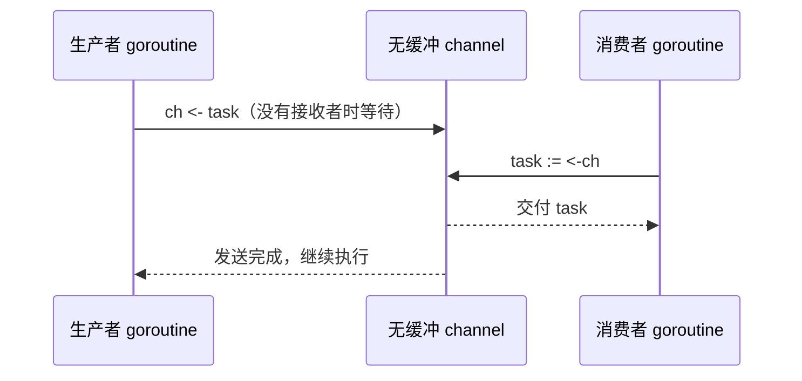
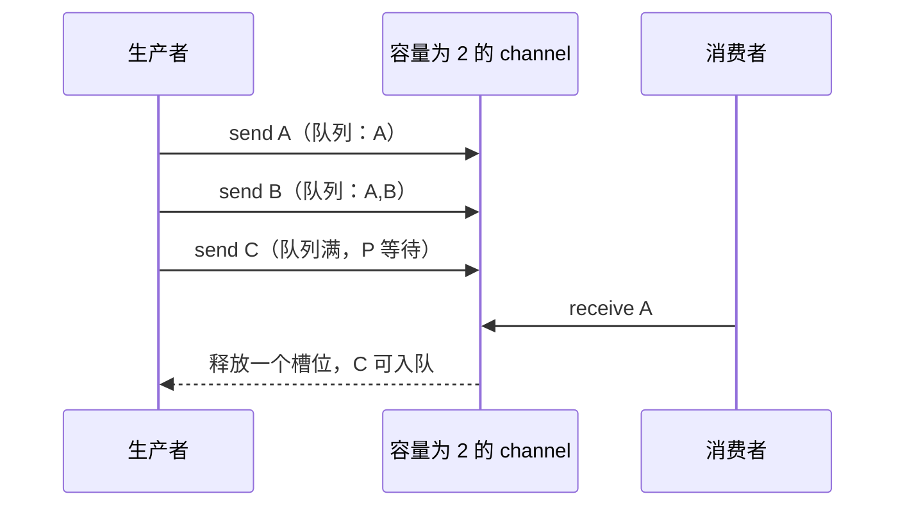

# 02. Channel：Goroutine 之间的数据交接与背压

## 前言

同时执行任务之后，下一件事不是立刻加锁，而是想清楚数据由谁拥有、何时交给谁、何时不再产生。图片处理程序把待处理文件交给 worker，日志采集程序把事件交给写入器，爬虫把 URL 交给下载器：它们都不是“多人一起修改一个变量”，而是在做有边界的数据交接。

channel 把交接本身写进程序：发送者用 `ch <- value` 交出一个值，接收者用 `value := <-ch` 取得它。一次通信既能传递数据，也能形成同步点；缓冲区则让双方可以在有限范围内脱钩。真正容易出错的地方不在语法，而在阻塞、关闭和取消：谁负责关闭、接收方提前离开时谁会卡住、缓冲容量究竟是在解决什么问题。

这份教程从一对生产者和消费者开始，逐步建立无缓冲与有缓冲的模型，再完成一个可取消的流水线，最后进入 Go 1.26.5 的 `hchan` 实现。channel 很适合表达所有权转移和事件流；多个 goroutine 必须频繁读写同一份状态时，互斥锁通常更直接。

## channel 是有类型的通信端点

channel 的元素类型是类型的一部分，使用 `make` 创建：

```go
jobs := make(chan string)      // 容量为 0：无缓冲 channel。
results := make(chan int, 16)  // 容量为 16：可暂存最多 16 个 int。
```

发送与接收使用同一个箭头，方向由值相对 channel 的位置决定：

```go
jobs <- "resize photo" // 值进入 channel：发送。
job := <-jobs          // 值离开 channel：接收。
```

`chan T` 同时可发可收；函数参数应尽可能收窄方向，编译器会替我们阻止方向写反：

```go
func produce(out chan<- int) { // 只能发送，不能从 out 接收。
	out <- 1
	close(out) // 发送方知道何时不会再发送。
}

func consume(in <-chan int) { // 只能接收，不能向 in 发送或关闭它。
	for value := range in {
		fmt.Println(value)
	}
}
```

channel 的零值是 `nil`。向 nil channel 发送或从中接收会永久阻塞，关闭 nil channel 会 panic。它不是“尚未准备好”的普通队列；后面会看到，nil 在 `select` 中有一个有用的动态禁用作用。

## 无缓冲 channel：一次交接，双方会合

`make(chan T)` 等价于容量为 0 的 channel。它没有存放值的地方：发送者必须等接收者到达，接收者也必须等发送者到达。通信完成时，值被直接交给接收方，双方才能继续。



这个特性让 channel 同时成为数据通道和同步点。以下程序不是随机失败，而是必然死锁：唯一的 goroutine 卡在发送处，已经没有接收者能继续运行。

```go
ch := make(chan int)
ch <- 1 // main 在这里等待；没有其他 goroutine 接收。
```

正确的最小交接需要并发的接收方：

```go
package main

import "fmt"

func main() {
	jobs := make(chan string) // 无缓冲：每个任务都要由 worker 当面接走。
	done := make(chan struct{})

	go func() {
		job := <-jobs
		fmt.Println("处理：", job)
		close(done) // worker 是 done 的唯一发送者，因此由它关闭。
	}()

	jobs <- "生成缩略图" // worker 接收前，main 会在这里等待。
	<-done               // 等待“已经处理完”，而不靠睡眠猜测。
}
```

无缓冲并不比有缓冲“更高级”。当生产者不应跑在消费者前面、或者一次通信本来就是一次确认时，它能清晰地表达同步；当生产速度允许短暂领先，才考虑缓冲。

## 有缓冲 channel：有限队列，而不是性能开关

`make(chan T, n)` 创建容量为 n 的 FIFO 缓冲区。缓冲未满时发送无需等接收者；缓冲非空时接收无需等发送者；满时发送阻塞，空时接收阻塞。



容量的本质是允许多大的**在途工作量**。它可以吸收短暂突发，也能把背压传回生产者；容量无限大只会把“消费者太慢”的问题变成内存增长。不要用 `len(ch)` 判断“是否可以安全发送”或“是否已经处理完”，因为观察结果下一刻就可能过期；同步应由发送、接收、关闭或 `select` 本身完成。

## 关闭表达“不会再有值”，不是释放资源

`close(ch)` 的含义只有一个：以后不会再向该 channel 发送值。它不丢弃已缓冲的数据，也不是让 channel 可被回收的必要条件。已关闭 channel 的缓冲值会先被接收完；完全排空后，接收立即返回元素零值和 `ok == false`。

```go
value, ok := <-ch
if !ok {
	// ch 已关闭且已排空；value 是 T 的零值，不能把它当普通数据。
}
```

对于有限数据流，`for range` 更自然：它自动持续接收，直到 channel 关闭并排空。

```go
for job := range jobs {
	process(job)
}
// 只有 jobs 的发送端全部停止并且调用 close(jobs) 后，循环才结束。
```

关闭责任遵循一条实用规则：**由唯一发送者关闭；多个发送者时，由知道“所有发送者都结束”的协调者关闭。** 接收者通常不知道未来是否仍会发送，随意关闭会使发送者 `panic: send on closed channel`。重复关闭也会 panic；从已关闭 channel 接收不会 panic。

| 状态 | 发送 | 接收 | 关闭 |
| --- | --- | --- | --- |
| nil | 永久阻塞 | 永久阻塞 | panic |
| 无缓冲、打开 | 等待接收者 | 等待发送者 | 可以 |
| 有缓冲、未满 | 立即成功 | 空时等待 | 可以 |
| 有缓冲、已满 | 等待接收 | 立即成功 | 可以 |
| 已关闭、有缓冲值 | panic | 继续取得剩余值 | panic |
| 已关闭、已排空 | panic | 立即得到零值，`ok=false` | panic |

## 一个完整示例：可取消的文件流水线

下面的流水线包含三个角色：`list` 产生文件名，多个 `hash` worker 处理文件名，主函数消费结果。每一层只关闭自己负责发送的输出 channel；`context` 让消费者提前失败或服务关闭时，所有被阻塞的发送方都能离开。

```go
package main

import (
	"context"
	"crypto/sha256"
	"fmt"
	"sync"
)

type digest struct {
	path string
	sum  [sha256.Size]byte
}

// list 只负责向 out 发送，因此由它关闭 out。
func list(ctx context.Context, paths []string) <-chan string {
	out := make(chan string)
	go func() {
		defer close(out) // 所有路径已交出，通知下游 for range 可以结束。
		for _, path := range paths {
			select {
			case out <- path:
				// 下游已经接走这个路径，继续生产下一个。
			case <-ctx.Done():
				return // 下游不再需要结果；绝不能继续卡在发送处。
			}
		}
	}()
	return out
}

// hash 启动固定数量 worker；协调 goroutine 在所有 worker 退出后关闭 out。
func hash(ctx context.Context, in <-chan string, workers int) <-chan digest {
	out := make(chan digest)
	var wg sync.WaitGroup
	wg.Add(workers)

	for i := 0; i < workers; i++ {
		go func() {
			defer wg.Done()
			for {
				select {
				case path, ok := <-in:
					if !ok {
						return // 上游关闭：已没有路径，worker 正常退出。
					}
					result := digest{path: path, sum: sha256.Sum256([]byte(path))}
					select {
					case out <- result:
					case <-ctx.Done():
						return // 主流程离开时，不能因 out 无人接收而泄漏。
					}
				case <-ctx.Done():
					return
				}
			}
		}()
	}

	go func() {
		wg.Wait()  // 所有 out 的发送者均已退出。
		close(out) // 所以此刻关闭 out 不会与发送并发。
	}()
	return out
}

func main() {
	ctx, cancel := context.WithCancel(context.Background())
	defer cancel()

	paths := list(ctx, []string{"a.txt", "b.txt", "c.txt"})
	for result := range hash(ctx, paths, 2) {
		fmt.Printf("%s: %x\n", result.path, result.sum[:4])
	}
}
```

这里没有关闭 `in` 的 worker，也没有让 main 关闭 `out`：前者没有发送权，后者不知道 worker 是否还会发送。流水线的关键不是“每个 channel 都 close”，而是每条输出流的拥有者在最后一次发送后 close；每个可能阻塞的发送都同时监听取消。

## Channel 与内存可见性

channel 不只移动值，也提供同步。Go 内存模型规定：一次发送在对应接收完成之前发生；关闭 channel 在接收者观察到关闭之前发生。因而生产者先填充一个对象、再通过 channel 交给消费者时，消费者能够看到发送前的写入。

这不表示对象交出去后仍可由双方随意修改。若发送的是指针、slice、map 或含指针的结构体，channel 只传递引用；所有权不清会重新引入数据竞争。最安全的约定是发送后由接收者独占修改，或者传不可变副本，或者额外用锁保护共享状态。

## 源码视角：`hchan` 如何完成交接

Go 1.26.5 中，非 nil channel 的运行时表示是 `runtime.hchan`。其中 `qcount` 记录当前缓冲值数量，`dataqsiz` 是容量，`buf` 指向环形缓冲区，`sendx` 与 `recvx` 是写入和读出位置；`recvq`、`sendq` 则保存等待接收和等待发送的 goroutine。一个锁保护这些状态。

```go
// Go 1.26.5：runtime/chan.go 中 hchan 的关键字段。
type hchan struct {
	qcount   uint   // 当前缓冲区中的元素数。
	dataqsiz uint   // 环形缓冲区容量；0 表示无缓冲。
	buf      unsafe.Pointer
	closed   uint32
	sendx    uint   // 下次写入缓冲区的位置。
	recvx    uint   // 下次读取缓冲区的位置。
	recvq    waitq  // 因接收而停放的 goroutine。
	sendq    waitq  // 因发送而停放的 goroutine。
	lock     mutex  // 保护上述状态与等待队列。
}
```

发送路径先检查是否已有等待接收者：有则直接把值交给它；没有但缓冲未满时，复制元素到 `buf[sendx]` 并移动环形索引；两者都不满足时，发送 goroutine 会带着待发送元素停放到 `sendq`。接收路径是对称的：优先取等待发送者，其次从缓冲读取，再不行就进入 `recvq`。这就是无缓冲 channel 为什么需要双方会合、有缓冲 channel 为什么会在满时阻塞的直接原因。

关闭时，`closechan` 在持锁状态下把 `closed` 标记为 1，摘下所有等待接收者和发送者，解锁后再唤醒它们。等待接收者获得零值与 `ok=false`；被唤醒的发送者会在恢复时触发“向已关闭 channel 发送”的 panic。源码的这个不对称行为正是“接收关闭可用于广播，发送关闭是错误”的实现基础。

## 容易出错的边界

- 不要用 channel 替代所有锁；共享计数器、缓存 map 等状态通常用 `sync.Mutex` 更清楚。
- 不要由接收方关闭仍可能有发送者的 channel。
- 不要因为看到 `len(ch) < cap(ch)` 就认为下一次发送一定不会阻塞。
- 不要在消费者提前返回时忘记通知上游；上游卡在发送上会形成 goroutine 泄漏。
- 不要把大缓冲当作吞吐优化的万能答案；它只推迟背压并增加在途内存。
- 不要发送后继续无同步地修改同一指针、slice 或 map。

## 总结

channel 适合把“谁产生、谁消费、何时结束”写成明确的数据流。无缓冲 channel 强调交接同步，有缓冲 channel 提供有限队列和背压；关闭是发送端对“不会再有值”的声明，而 `context` 让异常路径也能停止整条数据流。

当程序要同时等待数据到达、取消、超时或多个输入流时，单个 `<-ch` 已不够，需要用 `select` 在多个通信事件中作出一次正确选择。

## 参考资料

- [Go 语言规范：Channel types 与发送语句](https://go.dev/ref/spec#Channel_types)
- [Go 内存模型](https://go.dev/ref/mem)
- [Effective Go：Channels](https://go.dev/doc/effective_go#channels)
- [Go 并发模式：Pipelines and cancellation](https://go.dev/blog/pipelines)
- [Go 1.26.5 `runtime/chan.go` 源码](https://cs.opensource.google/go/go/+/go1.26.5:src/runtime/chan.go)
