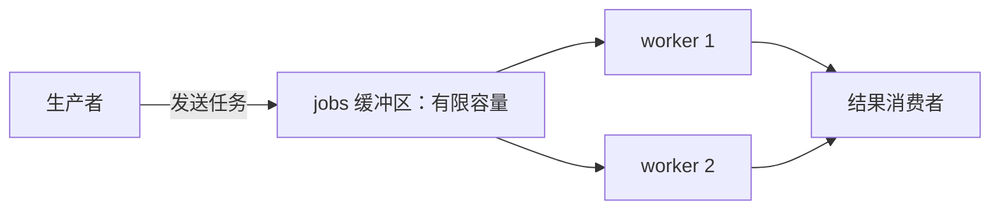

# 02. Channel：Goroutine 之间的数据流与同步

## 前言

goroutine 解决了“谁可以同时做事”，但任务仍需要交接数据、传递结果并通知结束。共享内存配合锁是可靠方案；channel 则把通信放到程序结构中：谁生产、谁消费、数据流在哪里结束，都能从类型和控制流中读出来。

channel 不是“自动异步”的同义词。无缓冲 channel 是发送者和接收者的一次会合；有缓冲 channel 才能保存有限数量的值。缓冲区能改变背压位置，不能消灭背压，更不能替代取消和资源上限。

## 类型、创建与基本操作

channel 有固定元素类型。`chan T` 可以双向通信，`chan<- T` 只能发送，`<-chan T` 只能接收。零值 channel 是 `nil`，应使用 `make` 创建可用 channel。

```go
jobs := make(chan string)       // 等价于 make(chan string, 0)：无缓冲。
results := make(chan int, 8)    // 最多缓存 8 个尚未接收的 int。

jobs <- "order-1001" // 发送：箭头指向 channel。
id := <-results       // 接收：箭头从 channel 指向变量。
_ = id
```

每个通信操作都有明确阻塞语义：

| channel 状态 | 发送 `ch <- v` | 接收 `<-ch` |
| --- | --- | --- |
| 无缓冲，尚无配对方 | 阻塞 | 阻塞 |
| 有缓冲且未满 | 立即写入缓冲区 | - |
| 有缓冲且非空 | - | 立即取出队首值 |
| 有缓冲且已满 / 已空 | 阻塞 / - | - / 阻塞 |
| 已关闭且仍有缓冲值 | panic | 继续取出剩余值 |
| 已关闭且缓冲已空 | panic | 立即得到零值，`ok == false` |
| `nil` | 永远阻塞 | 永远阻塞 |

`len(ch)` 和 `cap(ch)` 可以观察当前缓冲数量与容量，但它们只是瞬时快照。读取 `len` 后，其他 goroutine 可能立刻发送或接收，因此不能把“先看长度、再决定动作”当作同步协议。

## 无缓冲 channel：把交接当作同步点

无缓冲 channel 没有数据队列。一次发送与一次接收必须配对，值才会被交接，双方才能继续。这使它很适合表示“工作已经完成”的通知。

```go
package main

import "fmt"

func main() {
	done := make(chan struct{})

	go func() {
		// 关闭一个只用于通知的 channel 会唤醒所有等待它的接收者。
		// struct{} 不携带数据，也不需要为信号分配实际载荷。
		defer close(done)
		fmt.Println("生成日报")
	}()

	<-done // 等到 goroutine 调用 close(done) 后才继续。
	fmt.Println("日报任务结束")
}
```

下面的发送会死锁，因为当前 goroutine 在发送点等待接收者，而程序中没有其他可运行的接收者：

```go
ch := make(chan int)
ch <- 1 // 不会“先放进去”，而是等待另一个 goroutine 执行 <-ch。
```

这不是 channel 的异常行为，而是协议不完整：每一次可能阻塞的发送，都必须有可达的接收路径或取消路径。

## 有缓冲 channel：有限排队与背压

有缓冲 channel 允许生产者暂时领先消费者；缓冲满后，生产者仍会阻塞。容量应该表达可接受的排队量，例如“最多等待处理 100 个上传任务”，而不是凭感觉设置一个很大的数字。



下面是一个可运行的 worker pool。worker 数限制正在执行的任务数；`jobs` 的容量限制等待队列；取消时，生产和消费两端都能离开，避免 goroutine 因无人接收结果而卡住。

```go
package main

import (
	"context"
	"fmt"
	"sync"
)

type Result struct {
	Job int
	Sum int
}

// worker 只接收任务、发送结果；单向类型把数据流方向固定在函数签名中。
func worker(ctx context.Context, jobs <-chan int, results chan<- Result, wg *sync.WaitGroup) {
	defer wg.Done()
	for {
		select {
		case <-ctx.Done():
			return // 消费者不再需要结果时，worker 不会永远等在 channel 上。
		case job, ok := <-jobs:
			if !ok {
				return // 发送方关闭 jobs 表示不再产生任务。
			}

			result := Result{Job: job, Sum: job * job}
			select {
			case results <- result:
				// 结果成功交给下游。
			case <-ctx.Done():
				return // 结果无人再消费时不能被发送操作永久困住。
			}
		}
	}
}

func squareAll(parent context.Context, inputs []int, workerCount int) ([]Result, error) {
	if workerCount <= 0 {
		return nil, fmt.Errorf("workerCount 必须大于 0")
	}
	ctx, cancel := context.WithCancel(parent)
	defer cancel() // 函数任一路径返回时，通知仍在等待的内部 goroutine 收尾。

	jobs := make(chan int, workerCount)
	results := make(chan Result, workerCount)

	var workers sync.WaitGroup
	workers.Add(workerCount)
	for i := 0; i < workerCount; i++ {
		go worker(ctx, jobs, results, &workers)
	}

	go func() {
		defer close(jobs) // 唯一生产者负责声明“不会再有新任务”。
		for _, input := range inputs {
			select {
			case jobs <- input:
			case <-ctx.Done():
				return
			}
		}
	}()

	go func() {
		workers.Wait()  // 等到所有发送 results 的 worker 退出。
		close(results)  // 此时关闭 results 才不会与发送并发，因而不会 panic。
	}()

	output := make([]Result, 0, len(inputs))
	for result := range results { // results 关闭且排空后自然结束。
		output = append(output, result)
	}
	return output, nil
}

func main() {
	results, err := squareAll(context.Background(), []int{1, 2, 3, 4, 5}, 2)
	if err != nil {
		panic(err)
	}
	fmt.Println(results) // 结果顺序取决于 worker 调度，不应作为业务顺序。
}
```

这里的关闭责任是协议的一部分：任务生产者关闭 `jobs`；协调者确认所有 worker 都不会再发送后关闭 `results`；接收者只消费。多个发送者共享一个 channel 时，任何单独发送者通常都没有资格关闭它。

## `close`、逗号 `ok` 与 `range`

关闭表示“之后不会再发送新值”，不是释放内存。没有引用的 channel 会由垃圾回收器处理；不需要靠 `close` 帮 GC。对有限数据流，接收方需要知道结束，通常由发送方关闭 channel。

```go
value, ok := <-updates
if !ok {
	// 只有 channel 已关闭且缓冲区完全取空时，ok 才为 false。
	return
}
fmt.Println(value)
```

`for range` 是反复使用逗号 `ok` 接收的简洁写法：

```go
for update := range updates {
	// 一直处理正常发送的值；关闭并排空后循环结束。
	apply(update)
}
```

不要把“接收到了元素类型零值”误判为关闭。例如 `0`、`""`、`false` 都可能是正常数据；需要判断结束时必须使用 `ok` 或 `range`。

## channel 也建立内存可见性

channel 不仅运送值，也是同步原语。Go 内存模型规定：一次发送先于与之匹配的接收完成；关闭 channel 先于因该关闭而接收到零值的操作完成。因此可以用 channel 安全发布一个已经初始化的对象：发送前的写入，对接收后读取该对象的 goroutine 可见。

这不代表“把指针放进 channel 后就永远线程安全”。如果发送完成后发送方和接收方继续无同步地修改同一个对象，仍会发生数据竞争。一个实用原则是：交接所有权，或者为后续共享明确加锁。

## 从 runtime 源码理解阻塞与唤醒

下面内容是 Go 1.22 的实现线索，不是稳定 API。runtime 的 `hchan` 结构保存了几个与语义直接对应的字段：环形缓冲区及其数量、发送和接收下标、发送/接收等待队列、关闭标记和保护这些状态的锁。

```go
// runtime/chan.go 的字段含义简化；不要在业务代码依赖或访问这些内部结构。
type hchan struct {
	qcount   uint   // 缓冲区内已有元素数量。
	dataqsiz uint   // 缓冲区容量；0 就是无缓冲 channel。
	sendx    uint   // 下一个写入缓冲区的位置。
	recvx    uint   // 下一个读取缓冲区的位置。
	recvq    waitq  // 因接收而阻塞的 goroutine 队列。
	sendq    waitq  // 因发送而阻塞的 goroutine 队列。
	closed   uint32
	lock     mutex
}
```

发送时，runtime 先检查 channel 是否关闭；若已有等待接收者，可以直接交接元素，绕过缓冲区；若缓冲未满则写入环形缓冲区；否则把当前 goroutine 放入发送等待队列并挂起。接收过程是对称的：优先取等待发送者或缓冲数据，必要时进入接收等待队列。`closechan` 会标记关闭并唤醒等待接收者和发送者；后者恢复执行时会发现关闭并触发“send on closed channel” panic。

这也解释了两个设计事实：无缓冲 channel 是会合点，而不是容量为零的普通队列；“先用 `len` 判断是否会阻塞”天生不可靠，runtime 自己也必须在锁与等待队列保护下完成真正的通信。

## 容易写错的地方

### 向已关闭 channel 发送或重复关闭

这两种情况都会 panic。若关闭操作会从多个路径发生，应重新梳理所有权；确有“一次性广播关闭”需求时，才考虑让单一协调者关闭，或使用 `sync.Once` 包装关闭动作。

### 接收方关闭仍有发送者的 channel

接收方通常不知道发送者是否全部结束。它抢先关闭会让某个发送者 panic。更准确的口号是：**由能证明不会再发送的一方关闭**，而不是机械地说“发送方总是关闭”。

### 缓冲区掩盖了泄漏

把结果 channel 设成很大，可能让测试通过，却只是推迟了“消费者已经返回、发送者继续发结果”的阻塞。要么保证接收方会排空结果，要么让发送操作同时监听取消信号。

## 总结

channel 用类型、阻塞和关闭语义表达 goroutine 之间的数据流。无缓冲 channel 强调发送与接收的同步交接；有缓冲 channel 提供有限队列并把背压留在系统中。关闭是“数据流结束”的声明，必须有明确所有者。设计前先画出生产、消费、取消和关闭四条路径，channel 才会成为简化并发的工具，而不是新的死锁来源。

## 参考资料

- [Go 语言规范：Channel 类型](https://go.dev/ref/spec#Channel_types)
- [Go 语言规范：接收操作](https://go.dev/ref/spec#Receive_operator)
- [Go 内存模型：Channel 通信](https://go.dev/ref/mem)
- [Go 官方：Pipelines and cancellation](https://go.dev/blog/pipelines)
- [Go 1.22 runtime：chan.go](https://cs.opensource.google/go/go/+/refs/tags/go1.22.10:src/runtime/chan.go)
