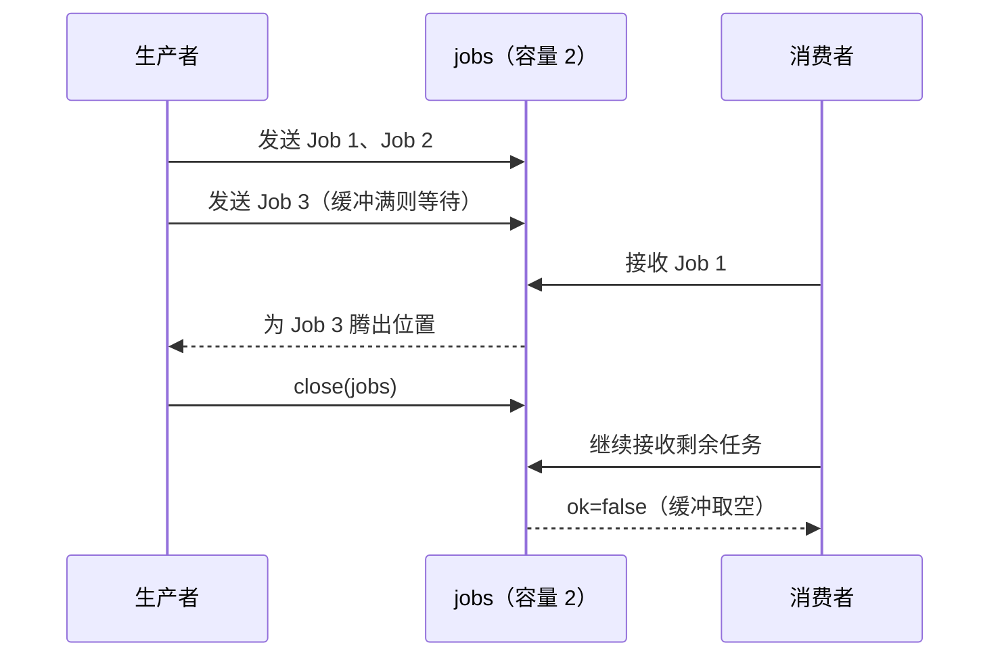

# 02. Channel：Goroutine 之间的数据流与同步

## 前言

goroutine 解决了“谁可以同时做事”，但还需要一个清楚的数据交接点：谁生产、谁接收、谁宣布不会再有数据。channel 把这个协议写进类型和控制流，而不是让多个 goroutine 随意读写一块共享内存。

这里关注一个问题：**怎样让生产者把一串任务交给消费者，并让双方在取消或结束时都能离开？** 答案不在于把缓冲区调大，而在于明确 channel 的阻塞语义和关闭所有权。

## 先建立三个语义

`make(chan T)` 创建无缓冲 channel。发送和接收必须同时到场，值才能交接，因此它也是一个同步点。`make(chan T, n)` 有容量为 `n` 的缓冲区：缓冲未满时发送可以继续，缓冲为空时接收仍会等待；缓冲满后，发送者仍然要等消费者。

| 状态 | 发送 `ch <- v` | 接收 `<-ch` |
| --- | --- | --- |
| 无缓冲、未配对 | 阻塞 | 阻塞 |
| 有缓冲且可放入 / 有值可取 | 立即放入 | 立即取出 |
| 已关闭且缓冲已取空 | panic | 立即返回元素零值，`ok == false` |
| `nil` channel | 永久阻塞 | 永久阻塞 |

关闭不是“清空”：关闭后，缓冲里的值仍会按先入先出被接收。只有发送方才知道“不会再发送”，因此通常也只有发送方关闭 channel；接收方关闭可能让仍在发送的生产者 panic。

无缓冲与有缓冲的选择并不是“哪个更快”。无缓冲适合必须当场交接的信号或值；有缓冲适合允许生产端短暂领先、且能说清最大积压量的队列。容量为 2 在这个例子里意味着“最多两个任务处于已生产但未开始处理的状态”，不是消费者能并行处理两个任务。

从发送方视角，缓冲把等待从“每个值都等接收者”改为“队列满时才等接收者”。因此下游一直变慢时，等待仍然会发生；这是有用的背压，提醒程序不要无限积压内存和工作。

接收关闭状态时的两个返回值尤其关键：

```go
job, ok := <-jobs
// ok 为 true：job 是发送方交付的值（可能来自关闭前的缓冲）。
// ok 为 false：不会再有值，job 只是 Job 的零值，不能继续当任务处理。
```

对只传递结束信号的 channel，常见元素类型是 `struct{}`，因为接收方关心的是“已关闭”而不是一个有效载荷。但只要多个 goroutine 都可能关闭同一 channel，就仍需要先定义唯一关闭者。

channel 的零值是 `nil`，不能直接使用；通常在创建数据流的地方调用 `make`。`chan T` 表示双向端点，可以隐式赋值给方向更窄的 `chan<- T` 或 `<-chan T`。把方向收窄后，调用者不会获得反向操作的编译权限。

方向限制服务于接口设计，不会让原 channel 变成两份对象。生产者和消费者仍在同一个数据流上通信。

例如，`produce` 收到 `chan<- Job` 后仍能关闭它，因为关闭属于发送端的职责；`consume` 收到 `<-chan Job` 后连 `close` 都不能调用。这比依赖团队成员“记得不要关”更容易在编译期发现错误。

## 一个完整例子：生产、消费与有序收尾

保存为 `main.go` 并运行 `go run main.go`。`jobs` 的容量是 2，表示最多允许两个尚未处理的任务排队；把它改成 `make(chan Job)`，程序仍然正确，只是生产者会在每次交接时等待消费者。

```go
package main

import (
	"context"
	"fmt"
	"time"
)

// Job 是生产者交给消费者的数据。只有 channel 传递它的所有权。
type Job struct {
	ID   int
	Name string
}

// produce 是 jobs 的唯一发送方，因此由它在所有任务送出后关闭 jobs。
func produce(ctx context.Context, jobs chan<- Job) {
	defer close(jobs) // close 表示“以后不会再有 Job”，不是要求消费者立刻停止。

	for _, job := range []Job{
		{ID: 1, Name: "生成账单"},
		{ID: 2, Name: "发送通知"},
		{ID: 3, Name: "归档记录"},
	} {
		select {
		case jobs <- job:
			// 交接成功：无缓冲时已有接收者；有缓冲时已占用一个队列位置。
		case <-ctx.Done():
			// 消费者不再需要任务时，不能永远卡在发送点。
			return
		}
	}
}

// consume 只接收，函数签名阻止它误发数据或关闭不属于它的 channel。
func consume(ctx context.Context, jobs <-chan Job) error {
	for {
		select {
		case job, ok := <-jobs:
			if !ok {
				// 发送方已经 close，且此前缓冲的数据也已经取完。
				return nil
			}

			fmt.Printf("开始处理 %d：%s\n", job.ID, job.Name)
			// 模拟实际处理。这里的等待也监听 ctx，才能及时结束。
			select {
			case <-time.After(20 * time.Millisecond):
				fmt.Printf("完成处理 %d\n", job.ID)
			case <-ctx.Done():
				return ctx.Err()
			}

		case <-ctx.Done():
			// jobs 可能暂时为空；取消时不必继续等下一项。
			return ctx.Err()
		}
	}
}

func main() {
	ctx, cancel := context.WithCancel(context.Background())
	defer cancel() // 真实服务中通常由请求结束或关闭流程调用。

	jobs := make(chan Job, 2) // 有界队列，而不是无限缓冲。
	go produce(ctx, jobs)

	if err := consume(ctx, jobs); err != nil {
		fmt.Println("任务未完成：", err)
		return
	}
	fmt.Println("所有任务均已接收并处理完成")
}
```

这个程序的正常收尾顺序是：生产者发送三项并关闭 `jobs`；消费者继续取走缓冲区剩余项；最后一次接收得到 `ok == false` 并返回；`main` 随后结束。若在处理第二项时调用 `cancel()`，消费者从 `ctx.Done()` 返回，生产者也能从发送 `select` 的取消分支离开，并由 `defer close(jobs)` 结束发送流。

这段代码的两条数据路径也应一起读：

1. 正常路径通过 `jobs <- job` 传递任务，`close(jobs)` 宣布输入结束。
2. 取消路径通过 `ctx.Done()` 让发送和接收两端从各自可能阻塞的位置离开。
3. `consume` 只在成功收到一个真实 `Job` 后处理它；`ok == false` 只表示流结束，不是一项空任务。

把 `jobs` 改成无缓冲时，生产者最多走到某次发送便必须与消费者会合；改成更大的容量时，生产者可以更早完成，但消费者仍要逐项处理。两种版本的结束协议完全相同，这正是把容量当作性能与排队参数、而非正确性条件的原因。

`chan<- Job` 与 `<-chan Job` 是方向受限的类型：前者只能发，后者只能收。它们不是额外的运行时对象，却把“谁拥有发送端”写到了函数边界，尤其适合让关闭责任一眼可见。

可以把关闭权限看作所有权规则：创建 `jobs` 的一方把发送端交给 `produce`，并约定 `produce` 是唯一关闭者；`consume` 只拿到接收端，所以只能观察结束。这不是编译器自动推导出的完整所有权系统，而是用类型缩小误用范围的工程约定。

这份约定还避免了一个常见误解：`close(jobs)` 不是“请消费者立即停止”。消费者应该选择是否处理已经缓冲的项目；本例选择全部处理完。若业务要求丢弃积压任务，应使用单独的取消信号并在消费者的 `select` 中优先定义那条策略，而不是希望 close 自动清空队列。

相反，消费者不应为了“通知生产者别再发”而关闭 `jobs`。它只知道自己不想再收，却无法知道生产者是否正处于发送中。把取消放到 `ctx`，可以让两端各自观察同一份停止意图，而不会篡改数据流的结束所有权。

若消费者无需在循环里同时监听取消，上面的接收逻辑可简写为：

```go
// range 会不断接收，直到 jobs 被关闭并且已取完缓冲区中的值。
for job := range jobs {
	process(job)
}
```

这正是 `value, ok := <-jobs` 中 `ok == false` 时退出循环的常用写法。`range` 不会替发送方关闭 channel；若没人关闭它，循环会一直等待。

`range` 与显式的 `ok` 接收并没有高低之分。只需要“读到结束”为止时，`range` 更直接；像示例一样还要同时等待 `ctx.Done()` 时，显式 `select` 更合适。不要在同一个 channel 上混用两套接收循环，除非每个值究竟该由谁处理已经定义清楚。

## 从运行时看：缓冲改变的是等待位置

Go 1.22.10 的 `runtime/chan.go` 用 `hchan` 保存 channel 状态，其中包括缓冲区容量、已存元素数，以及等候发送与接收的队列。发送进入 `chansend`：若已有等待的接收者，可以直接交接；否则缓冲未满时写入环形缓冲区；两者都不满足时，发送 goroutine 停放等待。

接收对应 `chanrecv`：先尝试取等待发送者或缓冲区里的数据；没有数据且未关闭时才等待。`closechan` 会标记关闭并唤醒等待接收者，因此“关闭且取空时接收立刻返回零值和 `false`”是语言语义，不是偶然行为。



运行时细节不改变设计原则：缓冲容量只定义能积压多少项目，不能消除慢消费者带来的背压。容量应当对应可接受的排队量，而不是用大数字掩盖处理速度问题。

无缓冲 channel 也不是“没有队列所以没有成本”。发送者若先到，会进入等待队列；接收者到达时，运行时完成配对并唤醒对方。选择无缓冲的理由应是需要这个会合语义，而不是猜测它一定比缓冲版本快。

在应用层最重要的是先写出协议：值的类型是什么、谁发送、谁接收、什么条件下关闭、取消后两端怎样离开。channel 只是把这份协议落实为阻塞操作，不能替程序补全遗漏的参与者。

还有一个很实际的检查方法：为每一个 `ch <- value` 问“接收者是否一定还会接收”，为每一个 `<-ch` 问“发送者何时保证结束”。若答案依赖“应该来得及”或某个 `Sleep`，协议通常还缺少关闭或取消路径。

发送与接收成功完成时，channel 还提供同步关系：发送在相应接收完成之前发生。这个保证让交接值本身是安全的；但它不替被传递对象建立永久独占，尤其是传指针时，后续谁能修改对象仍需在协议中写明。

不要根据运行时队列的实现假设严格公平或固定唤醒顺序。应用若需要顺序，应把顺序编码在数据和接收逻辑中。

这样协议的正确性就不依赖某次调度恰好发生的先后。

## 容易出错的边界

- 对已关闭的 channel 发送会 panic；用接收端“探测是否关闭”再发送也不可靠，因为状态可能立即变化。
- 从关闭且为空的 channel 接收会得到零值。元素类型的零值本身有效时，必须使用 `value, ok := <-ch` 区分它和真实数据。
- `close` 是发送端的责任。多个发送者时，应先由一个明确的协调者确认全部发送都结束，再关闭一次。
- `nil` channel 的收发都会永久阻塞。它可在 `select` 中临时禁用分支，但未初始化的 channel 往往是 bug。
- `len(ch)` 只是瞬时观测，不能据此判断“现在发送一定不会阻塞”或“接收一定有值”。
- channel 传递的是值；如果传的是指针、map 或 slice，接收后仍可能共享其底层数据，是否允许并发修改要另行约定。

## 总结

channel 的核心不是异步，而是交接和协议：无缓冲时双方会合，有缓冲时允许有限排队；发送方完成后关闭，接收方通过 `ok` 或 `range` 识别结束。取消路径要和正常数据路径一起设计，才不会留下卡住的 goroutine。

## 参考资料

- [Go 语言规范：Channel 类型](https://go.dev/ref/spec#Channel_types)
- [Go 语言规范：接收操作与 close](https://go.dev/ref/spec#Receive_operator)
- [Effective Go：Channels](https://go.dev/doc/effective_go#channels)
- [Go 1.22.10 `runtime/chan.go`](https://cs.opensource.google/go/go/+/go1.22.10:src/runtime/chan.go)
