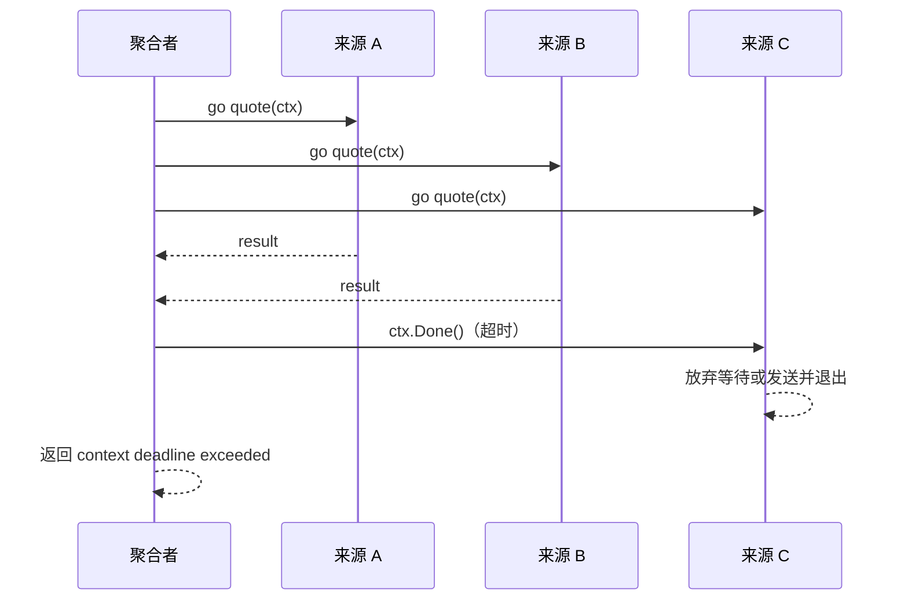

# 03. select：在多个并发事件之间响应

## 前言

同时向几个数据源查询价格时，调用方关心的不止一个事件：任何一个结果可能先返回，整体可能超时，调用方也可能主动取消。只写 `<-results` 只能等结果，取消发生时就无从离开。`select` 把这些可等待事件放在同一个位置，让程序对真正先发生的事件作出响应。

这里解决一个具体问题：**怎样收集多个并发结果，同时保证超时或取消后不会把发送结果的 goroutine 留在原地等待？**

## `select` 的最小规则

每个 `case` 必须是一次 channel 发送或接收。若有一个或多个 case 可以立即通信，规范从它们中均匀伪随机地选一个；所以 case 的书写顺序不是优先级。若都不能进行且没有 `default`，当前 goroutine 阻塞。

```go
select {
case value := <-results:
	use(value)
case <-ctx.Done():
	return ctx.Err()
}
```

进入 `select` 时，case 中 channel 表达式和发送值会按源码顺序各求值一次。不要把昂贵计算或副作用藏在发送 case 右边，以为“没选中就不会执行”：

```go
// buildReport() 进入 select 时就会执行，即使最终选中 ctx.Done()。
select {
case out <- buildReport():
case <-ctx.Done():
}
```

## 一个完整例子：可取消的多源聚合

保存为 `main.go` 后执行 `go run main.go`。第三个来源在 250ms 截止时间内来不及完成，聚合函数返回超时；同一个 `ctx` 会通知仍在等待的来源停止。

```go
package main

import (
	"context"
	"fmt"
	"time"
)

// Source 模拟一个可被 context 取消的下游服务。
type Source struct {
	name  string
	price int
	delay time.Duration
}

type result struct {
	source string
	price  int
	err    error
}

func (s Source) quote(ctx context.Context) (int, error) {
	select {
	case <-time.After(s.delay):
		return s.price, nil
	case <-ctx.Done():
		// 真正的 HTTP 或数据库调用也应使用带 Context 的接口。
		return 0, ctx.Err()
	}
}

func collectQuotes(parent context.Context, sources []Source) ([]result, error) {
	ctx, cancel := context.WithTimeout(parent, 250*time.Millisecond)
	defer cancel() // 提前返回时也通知仍在运行的查询，释放 deadline 相关资源。

	// 每个来源最多发送一个结果。容量足够时，即使接收者先返回，发送者也不会卡住。
	results := make(chan result, len(sources))
	for _, source := range sources {
		go func(source Source) {
			price, err := source.quote(ctx)
			select {
			case results <- result{source: source.name, price: price, err: err}:
				// 正常交付一个结果。
			case <-ctx.Done():
				// 接收者已不再需要结果时，放弃发送而退出。
			}
		}(source) // 把本轮 source 固定给这个 goroutine。
	}

	quotes := make([]result, 0, len(sources))
	for received := 0; received < len(sources); {
		select {
		case item := <-results:
			received++
			if item.err != nil {
				return nil, fmt.Errorf("%s 查询失败: %w", item.source, item.err)
			}
			quotes = append(quotes, item)
		case <-ctx.Done():
			// 不再等尚未返回的来源；defer cancel 会把信号传给它们。
			return nil, ctx.Err()
		}
	}
	return quotes, nil
}

func main() {
	sources := []Source{
		{name: "供应商 A", price: 99, delay: 60 * time.Millisecond},
		{name: "供应商 B", price: 102, delay: 140 * time.Millisecond},
		{name: "供应商 C", price: 95, delay: 400 * time.Millisecond},
	}

	quotes, err := collectQuotes(context.Background(), sources)
	if err != nil {
		fmt.Println("询价结束：", err)
		return
	}
	fmt.Println("全部报价：", quotes)
}
```

结果 channel 没有在这里关闭，因为它只是这个函数内部、每个发送者至多发送一次的汇合点；接收循环有明确的计数退出条件。关闭 channel 的价值是广播“不会再有值”，而这里函数一旦返回，接收动作也结束了。若要用 `range results` 接收，就必须安排一个明确的唯一关闭者。

示例的收尾路径有两条。所有来源及时返回时，循环精确接收 `len(sources)` 个结果并正常返回；截止时间先到时，接收循环从 `ctx.Done()` 返回，`defer cancel()` 让尚未结束的 `quote` 看到取消。发送端也监听同一个信号，所以不会在函数已经离开后无限等待接收者。

容量为来源数是这个“一人一条结果”协议的上界，而不是通用配方。若来源可以不断产生流式结果，应重新定义消费者何时停止、谁关闭结果流以及可接受的积压量，不能沿用这里的计数退出条件。

读代码时可以沿着两种结果推演：A、B 先返回时，它们的结果依次被附加到 `quotes`，顺序由完成时间决定而非 `sources` 的原始顺序；250ms 到达时，聚合者选择取消分支并返回。C 随后从自己的 `quote` 或发送处看到 `ctx.Done()`，不再依赖聚合者继续接收才有机会退出。

## `nil`、关闭和 `default`：三个容易误解的 case

`nil` channel 的收发永远不能进行，因此在 `select` 中等同于临时禁用该 case。关闭且取空的 channel 接收永远可以进行；若留在循环中，它会不断被选中。常见做法是在收到关闭后赋 `nil`：

```go
for updates != nil {
	select {
	case value, ok := <-updates:
		if !ok {
			updates = nil // 禁用该分支，避免关闭 channel 一直就绪。
			continue
		}
		fmt.Println(value)
	}
}
```

`default` 表示“不等待，立刻执行”。它适合尝试性操作，例如非阻塞地检查是否已取消；放在持续循环里却不做等待，会造成忙等并占满 CPU。

```go
select {
case message := <-in:
	handle(message)
default:
	// 当前没有消息；不要在这里无限空转。
}
```

没有任何 case 的 `select {}` 会永久阻塞，通常不该出现在业务代码中。更实用的判断是：每一个 case 都应对应一个明确事件，以及事件发生后这段 goroutine 的去向；`default` 也应有同样明确的用途。

## 从运行时看：选择的是就绪通信，不是时间顺序

编译器把多路通信组织后交给运行时的 `selectgo`（Go 1.22.10 的 `runtime/select.go`）。运行时先为 case 建立随机的轮询次序，检查可立即完成的收发；当多个 case 就绪时，这种随机化对应规范所说的伪随机选择，而不是“第一个 case 赢”。

若没有就绪 case 且没有 `default`，运行时会把当前 goroutine 挂到相关 channel 的等候队列上。任一 channel 发生匹配收发或关闭后，它才被唤醒，再确定被选中的 case。`nil` channel 不会加入等候队列，所以能用变量设为 `nil` 来关闭一个分支。



这里的随机性只适用于多个 case 已就绪时的选择。业务若确实需要优先处理取消，不能靠把 `ctx.Done()` 写在前面；应先以非阻塞方式单独检查取消，再进行主 `select`，并说明这种优先级策略。

因此，`select` 最适合表达“任一事件先发生即可推进”的场景。若业务需要严格按事件时间排序，或必须按固定优先级处理，应该先明确排序或仲裁规则，再选择合适的数据结构和同步协议。

把这种选择规则写清楚，比试图从一次运行结果猜测调度行为可靠得多。

## 容易出错的边界

- 不要依赖 case 的书写顺序。当多个 case 都就绪时，任意一个都可能被选择。
- 超时只让当前等待点离开；要让下游调用停下，必须把同一个 `ctx` 传给支持取消的操作。
- 提前返回时，确保每个发送者都有退出路径：示例用 `ctx.Done()` 和有界结果缓冲共同避免阻塞发送。
- 关闭的 channel 会持续就绪。需要在循环中停止监听它时，将 channel 变量设为 `nil`。
- 带 `default` 的循环很容易忙等；若只是周期性检查，应使用合适的阻塞或调度策略，而不是空转。

## 总结

`select` 解决的是“等待哪一个并发事件”：结果、取消和超时可以在同一个等待点竞争。用 context 把放弃信号传给下游，并为每个发送者设计退出路径，聚合代码才既能等到结果，也能在不再需要结果时干净收尾。

## 参考资料

- [Go 语言规范：select 语句](https://go.dev/ref/spec#Select_statements)
- [context 包](https://pkg.go.dev/context)
- [Effective Go：Channels](https://go.dev/doc/effective_go#channels)
- [Go 1.22.10 `runtime/select.go`](https://cs.opensource.google/go/go/+/go1.22.10:src/runtime/select.go)
