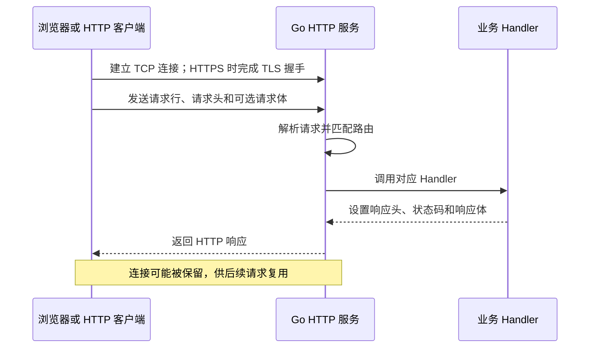
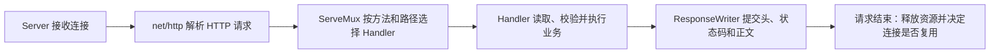

# 01. HTTP 编程：用 net/http 构建可靠服务

## 前言

浏览器打开页面、前端提交表单、服务调用支付接口，看起来是不同的事情，实际都在交换 HTTP 请求和响应。客户端把方法、路径、请求头和可选的请求体发送给服务端；服务端选择处理逻辑，完成校验和业务操作，再返回状态码、响应头和响应体。

Web 框架能减少样板代码，却不会改变这条链路。Gin、Chi、Echo 等框架最终仍要接收 `http.Request`、向 `http.ResponseWriter` 写入结果，并运行在 `http.Server` 管理的连接之上。先理解 `net/http`，遇到“为什么返回 405”“响应头为什么不生效”“客户端连接为什么越来越多”这类问题时，就能判断责任究竟在协议、标准库还是业务代码。

文章使用 Go 1.22 引入的方法路由与路径参数语法。阅读时可以始终跟着这条主线：**请求到达 → 路由选择 Handler → Handler 读取并校验输入 → 写出响应 → 服务端或客户端处理连接生命周期。**

## HTTP 请求与响应

HTTP 是应用层协议。TCP 负责可靠地传输字节；HTTP 规定这些字节如何表示方法、路径、请求头、状态码和正文。HTTPS 则在 HTTP 之下增加 TLS，保护传输内容不被窃听或篡改。

一次普通请求大致会经历下面的过程：



例如，客户端查询带 `go` 标签的文章时，可以发送：

```http
GET /articles?tag=go HTTP/1.1
Host: example.com
Accept: application/json
```

服务端返回的内容可能是：

```http
HTTP/1.1 200 OK
Content-Type: application/json; charset=utf-8

[{"id":1,"title":"理解 HTTP"}]
```

请求中的方法表达意图，路径定位资源，查询参数表达筛选条件，请求头携带元数据，正文承载提交的数据。响应状态码则先说明处理结果，响应体再给出结果或错误详情。

| 场景 | 常用状态码 | 含义 |
| --- | --- | --- |
| 查询成功 | `200 OK` | 响应体通常包含资源数据 |
| 创建成功 | `201 Created` | 新资源已经创建 |
| 请求格式或参数错误 | `400 Bad Request` | 调用方需要修改请求 |
| 未认证 | `401 Unauthorized` | 需要提供有效认证信息 |
| 无权访问 | `403 Forbidden` | 身份已确认，但不允许访问 |
| 资源不存在 | `404 Not Found` | 路径或资源 ID 无效 |
| 方法不匹配 | `405 Method Not Allowed` | 该资源不支持当前方法 |
| 服务端异常 | `500 Internal Server Error` | 具体原因只记录到服务端日志 |

HTTP 本身是无状态的：服务端不会仅因为请求来自同一条连接，就自动记住用户是谁。Cookie、Session 和 Token 是应用层在多个请求之间传递状态的方式；HTTP keep-alive 则只是复用网络连接，两者不要混为一谈。

### 方法、URL 与幂等性

常见方法及其语义如下：

| 方法 | 常见用途 | 是否应只读 | 是否通常幂等 |
| --- | --- | --- |
| `GET` | 查询资源 | 是 | 是 |
| `HEAD` | 只查询响应头 | 是 | 是 |
| `POST` | 创建资源或执行动作 | 否 | 否 |
| `PUT` | 用完整表示替换资源 | 否 | 是 |
| `PATCH` | 局部更新资源 | 否 | 不保证 |
| `DELETE` | 删除资源 | 否 | 通常是 |

幂等表示重复执行相同请求后，资源的最终状态保持一致，不表示每次响应一定完全相同。比如第二次删除同一个资源可能返回 `404`，但资源依然处于“已删除”状态。扣款、发券等不能随意重复的操作，仍要通过幂等键或业务去重保护。

URL 可以拆成 `scheme://host:port/path?query#fragment`。其中 `#fragment` 只供浏览器在本地定位，不会发送给服务端；服务端能读取的是 `r.URL.Path` 和 `r.URL.Query()`。

## `net/http` 的角色划分

`net/http` 已经完成协议解析和网络读写，业务代码不必手动拆 HTTP 报文。常用类型各自只负责一件事：

| 类型 | 职责 |
| --- | --- |
| `http.Request` | 表示已经解析好的请求：方法、URL、头、正文和取消信号 |
| `http.ResponseWriter` | 按顺序构造响应头、状态码和正文 |
| `http.Handler` | 处理一次请求的统一接口 |
| `http.ServeMux` | 根据方法和路径选择 Handler |
| `http.Server` | 监听端口、配置超时并管理服务生命周期 |
| `http.Client` | 发起请求，管理重定向、Cookie 和整体超时 |
| `http.Transport` | 管理客户端连接池、代理、TLS 与传输细节 |

最核心的 Handler 接口只有一个方法：

```go
type Handler interface {
	// ServeHTTP 处理一次请求。
	// w 用于写响应，r 保存本次请求的输入和生命周期。
	ServeHTTP(ResponseWriter, *Request)
}
```

通常不需要手写接口实现。`http.HandlerFunc` 会把签名正确的普通函数适配为 `Handler`，所以 `func(w http.ResponseWriter, r *http.Request)` 可以直接注册为路由处理函数。需要共享数据库、日志器、配置等长期依赖时，再使用结构体 Handler 会更清楚。

## 从最小服务开始

先启动一个只处理 `/hello` 的服务。这个例子故意不引入数据库和 JSON，重点是看清路由、Handler 和 Server 如何协作。

```go
package main

import (
	"fmt"
	"log"
	"net/http"
	"time"
)

func main() {
	// 每个服务显式创建自己的路由表，避免依赖全局 DefaultServeMux。
	mux := http.NewServeMux()
	mux.HandleFunc("GET /hello", hello)

	server := &http.Server{
		Addr:              ":8080",
		Handler:           mux,
		ReadHeaderTimeout: 5 * time.Second,  // 限制慢速请求头。
		IdleTimeout:       60 * time.Second, // 回收长期空闲的 keep-alive 连接。
	}

	log.Println("listen on http://127.0.0.1:8080")
	if err := server.ListenAndServe(); err != nil && err != http.ErrServerClosed {
		log.Fatal(err)
	}
}

func hello(w http.ResponseWriter, r *http.Request) {
	// 响应头必须在首次 WriteHeader 或 Write 之前设置。
	w.Header().Set("Content-Type", "text/plain; charset=utf-8")

	// 首次写正文时，若没有显式设置状态码，标准库会提交 200 OK。
	if _, err := fmt.Fprintln(w, "hello, HTTP"); err != nil {
		// 客户端可能已经断开；此时只记录错误，不能再写一份错误响应。
		log.Printf("write response: %v", err)
	}
}
```

运行 `go run .` 后，使用 `curl -i http://127.0.0.1:8080/hello` 验证。`-i` 会显示完整响应，能看到代码中设置的 `Content-Type` 和隐式产生的 `200 OK`。

### 路由、路径参数与结构体 Handler

从 Go 1.22 开始，`ServeMux` 的模式可写成 `METHOD /path/{name}`。下面三个路由分别表示列出、创建和查询用户：

```go
mux := http.NewServeMux()

// 方法写在模式里，因此 GET /users 与 POST /users 可以有不同处理器。
mux.HandleFunc("GET /users", listUsers)
mux.HandleFunc("POST /users", createUser)

// {id} 匹配一个非空路径段，Handler 内通过 PathValue 读取。
mux.HandleFunc("GET /users/{id}", getUser)

func getUser(w http.ResponseWriter, r *http.Request) {
	id := r.PathValue("id")
	fmt.Fprintf(w, "user id: %s\n", id)
}
```

`GET /users/42` 会进入 `getUser`。路由匹配成功只说明 URL 形状正确，`id` 仍是字符串；是否为正整数、调用者是否有权限，仍必须由业务代码校验。

当路径存在但方法不匹配时，`ServeMux` 会返回 `405 Method Not Allowed` 并设置 `Allow` 响应头；完全没有匹配路径才是 `404 Not Found`。`GET` 模式也可以处理 `HEAD` 请求。

如果一组处理器共享依赖，使用结构体比全局变量更容易测试和维护：

```go
// userHandler 保存跨请求复用的依赖；当前请求数据必须留在方法局部变量中。
type userHandler struct {
	service *userService
	logger  *log.Logger
}

func (h *userHandler) ServeHTTP(w http.ResponseWriter, r *http.Request) {
	h.logger.Printf("method=%s path=%s", r.Method, r.URL.Path)
	// 这里省略业务调用，只演示结构体如何满足 http.Handler。
	w.WriteHeader(http.StatusNoContent)
}

// mux.Handle 接收 Handler，因此结构体指针可以直接注册。
mux.Handle("GET /internal/users", &userHandler{service: service, logger: logger})
```

`http.HandleFunc` 和 `http.ListenAndServe(addr, nil)` 会使用包级的 `http.DefaultServeMux`。它适合极简示例，但真实项目优先显式创建 `http.NewServeMux()`，这样不同服务和测试之间不会共享路由状态。

### 提供静态文件

动态接口之外，`http.FileServer` 可以提供 CSS、JavaScript、图片等受控静态资源：

```go
// 仅公开项目中的 public 目录。
files := http.FileServer(http.Dir("./public"))

// /assets/app.css 会先去掉 /assets/，再读取 ./public/app.css。
mux.Handle("GET /assets/", http.StripPrefix("/assets/", files))
```

不要把机器根目录、配置目录、私钥、源码目录或上传临时目录交给 `FileServer`。生产环境的静态资源通常由 CDN 或反向代理提供，Go 服务专注于动态请求。

## 读取并校验请求输入

真正的 Handler 的主要工作，是将网络输入变成可信的业务参数。所有请求数据都来自外部：路径能匹配不代表 ID 合法，带有 `Content-Type: application/json` 不代表正文一定是 JSON。

`Request` 中最常用的字段如下：

```go
r.Method      // HTTP 方法
r.URL         // 路径和查询参数
r.Header      // 多值请求头，名称不区分大小写
r.Body        // 只能顺序读取的请求体
r.RemoteAddr  // 直接连接到当前服务的地址
r.Context()   // 本次请求的取消和截止时间
```

### 查询参数与请求头

查询参数适合筛选、分页和排序等不属于资源主体的数据。例如 `GET /articles?tag=go&page=2`：

```go
func searchArticles(w http.ResponseWriter, r *http.Request) {
	// 同名参数可以有多个值；Get 只取第一个。
	tag := strings.TrimSpace(r.URL.Query().Get("tag"))
	if tag == "" {
		writeError(w, http.StatusBadRequest, "tag is required")
		return
	}

	// Header.Get 按 HTTP 规则查找，不需要关心大小写。
	requestID := r.Header.Get("X-Request-ID")
	writeJSON(w, http.StatusOK, map[string]string{
		"tag":        tag,
		"request_id": requestID,
	})
}
```

构造 URL 时不要手拼查询字符串。`url.Values` 会处理空格、中文、`&`、`=` 等转义问题：

```go
endpoint, err := url.Parse("https://api.example.com/articles")
if err != nil {
	return err
}

query := endpoint.Query()
query.Set("tag", "Go HTTP")
query.Set("page", "1")
endpoint.RawQuery = query.Encode()
```

`RemoteAddr` 是直接连接当前 Go 服务的一端地址。服务部署在 Nginx、网关或负载均衡器之后时，它通常是代理地址；`X-Forwarded-For` 也可能由普通客户端伪造。只有明确处于可信代理网络、且代理会清理并重建转发头时，应用才应使用这些头获取客户端 IP。

### 接收 JSON

JSON 接口不能只调用一次 `Decode` 就认为输入安全。需要限制请求体、拒绝未知字段、检查正文只有一个 JSON 值，并校验业务字段。

```go
type createArticleInput struct {
	Title string `json:"title"`
}

func decodeCreateArticle(w http.ResponseWriter, r *http.Request) (createArticleInput, bool) {
	// 在读取过程中限制 1 MiB，不能只相信客户端声明的 Content-Length。
	r.Body = http.MaxBytesReader(w, r.Body, 1<<20)
	decoder := json.NewDecoder(r.Body)
	decoder.DisallowUnknownFields() // 把 "titel" 这类拼写错误立即暴露给调用方。

	var input createArticleInput
	if err := decoder.Decode(&input); err != nil {
		var tooLarge *http.MaxBytesError
		if errors.As(err, &tooLarge) {
			writeError(w, http.StatusRequestEntityTooLarge, "request body too large")
		} else {
			writeError(w, http.StatusBadRequest, "invalid JSON")
		}
		return createArticleInput{}, false
	}

	// 拒绝 {..}{..} 这种被拼接的两个 JSON 值。
	if err := decoder.Decode(&struct{}{}); !errors.Is(err, io.EOF) {
		writeError(w, http.StatusBadRequest, "request body must contain one JSON value")
		return createArticleInput{}, false
	}

	input.Title = strings.TrimSpace(input.Title)
	if input.Title == "" {
		writeError(w, http.StatusBadRequest, "title is required")
		return createArticleInput{}, false
	}
	return input, true
}
```

服务端会在请求处理结束后关闭 `r.Body`，Handler 中通常不必再 `defer r.Body.Close()`。这与客户端的 `resp.Body` 不同：客户端必须自己关闭响应体。

### 表单与文件上传

普通 HTML 表单通常使用 `application/x-www-form-urlencoded`。需要严格校验时，显式调用 `ParseForm`，不要用会忽略解析错误的 `FormValue`：

```go
func submitProfile(w http.ResponseWriter, r *http.Request) {
	r.Body = http.MaxBytesReader(w, r.Body, 1<<20)
	if err := r.ParseForm(); err != nil {
		writeError(w, http.StatusBadRequest, "invalid form")
		return
	}

	// PostForm 只读取请求体中的表单字段，不混入 URL 查询参数。
	name := strings.TrimSpace(r.PostForm.Get("name"))
	if name == "" {
		writeError(w, http.StatusBadRequest, "name is required")
		return
	}
	writeJSON(w, http.StatusOK, map[string]string{"name": name})
}
```

文件上传使用 `multipart/form-data`，还要分别设计总大小、单文件大小、允许的 MIME 类型、落盘路径和病毒扫描策略。不要把上传临时目录直接暴露为静态目录。

## 正确构造 HTTP 响应

`ResponseWriter` 是一条正在发送的输出流，不是可以随时修改的普通返回值。正确顺序是：**先设置响应头，再写状态码，最后写正文。**

```go
func writeJSON(w http.ResponseWriter, status int, value any) {
	// Encode 会立刻写正文，因此响应类型必须先设置。
	w.Header().Set("Content-Type", "application/json; charset=utf-8")
	w.WriteHeader(status)

	// 一旦编码开始，响应可能已经部分发送；此时只能记录错误，不能改写为另一份 500 响应。
	if err := json.NewEncoder(w).Encode(value); err != nil {
		log.Printf("encode JSON response: %v", err)
	}
}

func writeError(w http.ResponseWriter, status int, message string) {
	writeJSON(w, status, map[string]string{"error": message})
}
```

首次调用 `WriteHeader` 或 `Write` 后，状态码和普通响应头已经提交，后续再改写通常不会生效。若省略 `WriteHeader`，首次 `Write` 会隐式提交 `200 OK`。这也是所有输入校验都应在输出之前完成的原因。

`http.Error` 适合写简单的纯文本错误：

```go
if err != nil {
	http.Error(w, "invalid request", http.StatusBadRequest)
	return // http.Error 不会自动结束 Handler。
}
```

JSON API 更适合统一使用 `writeError`，让调用方始终能按同一种格式解析错误。`204 No Content` 和 `304 Not Modified` 不应再写普通响应正文。

## 完整示例：一个可测试的文章 API

将路由、JSON 输入、路径参数和响应组织到一起。存储层使用内存 map，只是为了突出 HTTP 的边界；在真实项目中可替换为数据库调用，并继续向下传递 `r.Context()`。

```go
package main

import (
	"context"
	"encoding/json"
	"errors"
	"io"
	"log"
	"net/http"
	"strconv"
	"strings"
	"sync"
)

type article struct {
	ID    int64  `json:"id"`
	Title string `json:"title"`
}

type createArticleInput struct {
	Title string `json:"title"`
}

// articleStore 由多个请求并发访问，因此 map 与 nextID 都由锁保护。
type articleStore struct {
	mu     sync.RWMutex
	nextID int64
	items  map[int64]article
}

func newArticleStore() *articleStore {
	return &articleStore{nextID: 1, items: make(map[int64]article)}
}

func (s *articleStore) create(ctx context.Context, title string) (article, error) {
	// 让存储层接口保留取消语义；替换为数据库时仍可直接传入 ctx。
	if err := ctx.Err(); err != nil {
		return article{}, err
	}
	s.mu.Lock()
	defer s.mu.Unlock()

	created := article{ID: s.nextID, Title: title}
	s.nextID++
	s.items[created.ID] = created
	return created, nil
}

func (s *articleStore) get(ctx context.Context, id int64) (article, bool, error) {
	if err := ctx.Err(); err != nil {
		return article{}, false, err
	}
	s.mu.RLock()
	defer s.mu.RUnlock()
	item, ok := s.items[id]
	return item, ok, nil
}

type api struct {
	store *articleStore
}

func newHandler(store *articleStore) http.Handler {
	a := &api{store: store}
	mux := http.NewServeMux()
	mux.HandleFunc("GET /healthz", a.healthz)
	mux.HandleFunc("POST /articles", a.createArticle)
	mux.HandleFunc("GET /articles/{id}", a.getArticle)
	return mux
}

func (a *api) healthz(w http.ResponseWriter, r *http.Request) {
	writeJSON(w, http.StatusOK, map[string]string{"status": "ok"})
}

func (a *api) createArticle(w http.ResponseWriter, r *http.Request) {
	input, ok := decodeCreateArticle(w, r)
	if !ok {
		return // 解码函数已经写入 400 或 413 响应。
	}

	created, err := a.store.create(r.Context(), input.Title)
	if err != nil {
		writeRequestError(w, err)
		return
	}
	writeJSON(w, http.StatusCreated, created)
}

func (a *api) getArticle(w http.ResponseWriter, r *http.Request) {
	// 路径参数总是字符串，路由匹配成功不代表它是合法业务 ID。
	id, err := strconv.ParseInt(r.PathValue("id"), 10, 64)
	if err != nil || id <= 0 {
		writeError(w, http.StatusBadRequest, "id must be a positive integer")
		return
	}

	found, ok, err := a.store.get(r.Context(), id)
	if err != nil {
		writeRequestError(w, err)
		return
	}
	if !ok {
		writeError(w, http.StatusNotFound, "article not found")
		return
	}
	writeJSON(w, http.StatusOK, found)
}

func writeRequestError(w http.ResponseWriter, err error) {
	if errors.Is(err, context.Canceled) {
		// 客户端通常已离开；停止下游工作即可，无需强行再写响应。
		return
	}
	log.Printf("request failed: %v", err)
	writeError(w, http.StatusInternalServerError, "internal server error")
}
```

将前面的 `decodeCreateArticle`、`writeJSON` 和 `writeError` 放在同一个包中，随后启动服务即可。可用下面的命令验证关键分支：

```bash
# 创建文章：应返回 201。
curl -i -X POST http://127.0.0.1:8080/articles \
  -H 'Content-Type: application/json' \
  -d '{"title":"从 HTTP 开始"}'

# 查询文章：应返回 200。
curl -i http://127.0.0.1:8080/articles/1

# 路径存在但方法不匹配：应返回 405，并带 Allow 响应头。
curl -i -X DELETE http://127.0.0.1:8080/articles/1
```

## 编写 HTTP 客户端

后端服务通常既是服务端，也是客户端：它会调用用户、库存、支付或第三方 API。客户端代码需要区分两类失败：

- `Client.Do` 返回错误，表示 DNS、连接、TLS、超时、取消或重定向等通信失败；
- 服务端返回 `404`、`429`、`500` 时，通常仍会得到非 nil 的 `resp` 和 nil 的 `error`，业务代码必须检查 `StatusCode`。

对于带请求头、超时、认证或非 GET 方法的调用，使用 `NewRequestWithContext` 和长期复用的 `Client`：

```go
func createRemoteArticle(ctx context.Context, client *http.Client, endpoint, title string) (article, error) {
	var body bytes.Buffer
	if err := json.NewEncoder(&body).Encode(createArticleInput{Title: title}); err != nil {
		return article{}, fmt.Errorf("encode request: %w", err)
	}

	// ctx 控制本次调用；调用方取消或超时时，网络等待会一起停止。
	req, err := http.NewRequestWithContext(ctx, http.MethodPost, endpoint+"/articles", &body)
	if err != nil {
		return article{}, fmt.Errorf("build request: %w", err)
	}
	req.Header.Set("Content-Type", "application/json; charset=utf-8")
	req.Header.Set("Accept", "application/json")

	resp, err := client.Do(req)
	if err != nil {
		return article{}, fmt.Errorf("send request: %w", err)
	}
	// 客户端必须关闭响应体。读完或关闭后，HTTP/1.x 连接才有机会回到连接池。
	defer resp.Body.Close()

	if resp.StatusCode != http.StatusCreated {
		return article{}, fmt.Errorf("unexpected HTTP status: %s", resp.Status)
	}

	var created article
	if err := json.NewDecoder(resp.Body).Decode(&created); err != nil {
		return article{}, fmt.Errorf("decode response: %w", err)
	}
	return created, nil
}

func main() {
	// Client 与其底层 Transport 都支持并发使用，应在应用启动时创建并复用。
	client := &http.Client{Timeout: 5 * time.Second}

	ctx, cancel := context.WithTimeout(context.Background(), 3*time.Second)
	defer cancel()
	created, err := createRemoteArticle(ctx, client, "http://127.0.0.1:8080", "客户端创建的文章")
	if err != nil {
		log.Fatal(err)
	}
	log.Printf("created article: %+v", created)
}
```

`Client.Timeout` 是整个请求的上限，包含连接、重定向、等待响应和读取响应体；请求级 `context.WithTimeout` 则更适合表达某次业务调用的时间预算。两者可以同时存在，先到期者会取消请求。

### 配置 Client 与 Transport

`http.Client` 常用配置包括：

| 字段 | 用途 |
| --- | --- |
| `Timeout` | 限制完整请求的总时间 |
| `Transport` | 配置连接池、代理、TLS 和传输超时 |
| `Jar` | 跨请求保存和发送 Cookie |
| `CheckRedirect` | 限制或校验重定向 |

当需要调节连接池时，从默认 Transport 克隆后再做小范围修改，避免丢掉标准库的默认行为：

```go
transport := http.DefaultTransport.(*http.Transport).Clone()

// 全部目标主机合计最多保留 100 条空闲连接。
transport.MaxIdleConns = 100
// 单个目标主机最多保留 20 条空闲连接。
transport.MaxIdleConnsPerHost = 20
// 空闲连接 90 秒后回收。
transport.IdleConnTimeout = 90 * time.Second
// 请求发送完毕后，最多等待 5 秒取得响应头。
transport.ResponseHeaderTimeout = 5 * time.Second

client := &http.Client{
	Transport: transport,
	Timeout:   10 * time.Second,
}
```

不要为每一次请求新建 `Client` 或 `Transport`，否则会丢失连接池并重复 DNS 查询、TCP 握手和 TLS 握手。也不要为了临时绕过证书错误设置 `tls.Config.InsecureSkipVerify = true`；这会关闭服务端身份验证。

## 服务端超时与优雅关闭

最短的 `http.ListenAndServe(":8080", mux)` 很适合验证想法，但公网服务应显式创建 `http.Server`，为网络资源设定边界：

```go
server := &http.Server{
	Addr:              ":8080",
	Handler:           mux,
	ReadHeaderTimeout: 5 * time.Second,  // 读取请求头的上限，防慢速请求头。
	ReadTimeout:       15 * time.Second, // 读取完整请求的上限。
	WriteTimeout:      15 * time.Second, // 向慢客户端写响应的上限。
	IdleTimeout:       60 * time.Second, // 空闲 keep-alive 连接的等待时间。
	MaxHeaderBytes:    1 << 20,          // 请求头的最大字节数。
}
```

这些网络超时不能替代业务取消。`r.Context()` 会在客户端断开、请求取消或 Handler 返回时被取消；调用数据库、RPC 或另一个 HTTP 服务时，要继续传递它，而不是改成 `context.Background()`：

```go
// 客户端离开后，数据库查询也有机会及时停止。
user, err := userRepository.FindByID(r.Context(), id)
```

进程退出时，`Shutdown` 会停止接受新连接、关闭空闲连接，并等待正在处理的请求结束。下面的模式能正确处理 Ctrl+C 与容器常用的 `SIGTERM`：

```go
func serve(server *http.Server) error {
	serverErr := make(chan error, 1)
	go func() {
		serverErr <- server.ListenAndServe()
	}()

	stopCtx, stop := signal.NotifyContext(context.Background(), os.Interrupt, syscall.SIGTERM)
	defer stop()

	select {
	case err := <-serverErr:
		if !errors.Is(err, http.ErrServerClosed) {
			return fmt.Errorf("HTTP server: %w", err)
		}
		return nil
	case <-stopCtx.Done():
		log.Println("shutdown signal received")
	}

	shutdownCtx, cancel := context.WithTimeout(context.Background(), 10*time.Second)
	defer cancel()
	if err := server.Shutdown(shutdownCtx); err != nil {
		return fmt.Errorf("graceful shutdown: %w", err)
	}

	// Shutdown 会让 ListenAndServe 返回 ErrServerClosed，这是正常结果。
	if err := <-serverErr; !errors.Is(err, http.ErrServerClosed) {
		return fmt.Errorf("HTTP server stopped: %w", err)
	}
	return nil
}
```

`Shutdown` 不会自动停止任意后台 goroutine，也不会替应用关闭 WebSocket 等长连接；它们仍需要业务自己定义停止和等待策略。SSE、下载、WebSocket 等长响应也不应直接套用普通接口的 `WriteTimeout`，需要单独设计心跳、截止时间与资源上限。

## 反向代理的边界

反向代理接收客户端请求，将其转发到后端服务，再把后端响应返回给客户端。标准库的 `httputil.ReverseProxy` 适合实现基础代理：

```go
target, err := url.Parse("https://api.example.com")
if err != nil {
<<<<<<< ours
<<<<<<< ours
	log.Fatalf("parse proxy target: %v", err)
=======
	return err
>>>>>>> theirs
=======
	return err
>>>>>>> theirs
}

proxy := &httputil.ReverseProxy{
	Rewrite: func(pr *httputil.ProxyRequest) {
		// 设置后端目标，并由可信代理生成转发头。
		pr.SetURL(target)
		pr.SetXForwarded()
	},
	ErrorHandler: func(w http.ResponseWriter, r *http.Request, err error) {
		log.Printf("upstream request failed: %v", err)
		writeError(w, http.StatusBadGateway, "upstream service unavailable")
	},
}

// /forward/users 会去掉 /forward 前缀后，再交给代理。
mux.Handle("/forward/", http.StripPrefix("/forward", proxy))
```

代理并不等于完整网关。生产环境还要根据业务补充后端超时、认证、请求头清理、限流、重试、负载均衡、服务发现、日志追踪，以及 WebSocket 和流式响应策略。

<<<<<<< ours
<<<<<<< ours
## 运行过程：理解 API 的边界

这里不做逐行源码拆解。日常开发更重要的是理解标准库在 Handler 前后负责了什么，以及这些行为如何约束业务代码。掌握下面这张流程图已经足够：
=======
## 理解标准库的执行过程

阅读源码的目的不是记住 `net/http` 的私有类型或连接循环，而是理解公开 API 的边界。对于日常开发，掌握下面这张流程图已经足够：
>>>>>>> theirs
=======
## 理解标准库的执行过程

阅读源码的目的不是记住 `net/http` 的私有类型或连接循环，而是理解公开 API 的边界。对于日常开发，掌握下面这张流程图已经足够：
>>>>>>> theirs



这条链路能解释四个常见规则：

1. `ResponseWriter` 在第一次写入时会提交响应，因此必须先校验输入，再写状态码和正文；已经写出的 `200` 不能改成 `400`。
2. `Request.Context()` 的生命周期属于这一次请求。Handler 返回后不应让后台 goroutine 继续使用 `r.Body`、`ResponseWriter` 或请求 Context；异步任务应复制已校验的数据，并使用自己可控的 Context。
3. HTTP/1.x 能否复用连接取决于协议边界是否完整。客户端关闭 `resp.Body`、服务端限制和正确读取请求体，都是为了及时释放连接并避免资源长期占用。
4. `ServeMux` 只负责找到 Handler。它可以区分 `404` 与 `405`，却无法判断路径参数是否合法、用户是否有权限，这些仍是 Handler 和业务层的职责。

<<<<<<< ours
<<<<<<< ours
只有排查协议升级、极端性能问题或自定义传输行为时，才需要结合具体问题阅读 `server.go`、`transport.go` 和路由实现；在此之前，逐行追踪实现细节往往只会掩盖更重要的 HTTP 边界。
=======
需要排查协议升级、极端性能问题或自定义传输行为时，再结合具体问题阅读 `server.go`、`transport.go` 和路由实现；在此之前，逐行追踪源码往往只会掩盖更重要的 HTTP 边界。
>>>>>>> theirs
=======
需要排查协议升级、极端性能问题或自定义传输行为时，再结合具体问题阅读 `server.go`、`transport.go` 和路由实现；在此之前，逐行追踪源码往往只会掩盖更重要的 HTTP 边界。
>>>>>>> theirs

## 实战检查清单

- 路由显式使用 `http.NewServeMux()`；方法和路径分开设计。
- 所有路径参数、查询参数、请求头和正文都按不可信输入处理。
- JSON、表单和上传接口设置合适的请求体大小上限。
- 先写响应头和状态码，再写正文；写错误后立即 `return`。
- 对外请求设置超时、检查 `StatusCode`、关闭 `resp.Body`，并复用 `http.Client`。
- 向数据库、RPC 和下游 HTTP 调用传递 `r.Context()`。
- 面向公网的 `http.Server` 配置请求头、读、写和空闲超时。
- 在退出信号到来时调用 `Shutdown`，并单独管理后台任务与长连接。
- 只在可信代理边界内使用 `X-Forwarded-For`、`X-Forwarded-Host` 等转发头。

## 总结

`net/http` 用很少的类型覆盖了完整 HTTP 链路：`Request` 表示输入，`ResponseWriter` 表示输出，`Handler` 承载业务，`ServeMux` 负责路由，`Server` 管理入站连接，`Client` 和 `Transport` 管理出站请求及连接复用。

能够返回 JSON 只是 HTTP 服务的起点。可靠服务还要在输入校验、响应提交、超时、取消、连接复用和优雅退出处明确边界。掌握这些规则后，再使用任意 Go Web 框架时，也能分辨框架替自己完成了哪些工作，以及哪些责任仍必须由应用代码承担。

## 参考资料

- [Go `net/http` 包文档](https://pkg.go.dev/net/http)
- [Go 1.22 Release Notes：增强的 ServeMux 路由](https://go.dev/doc/go1.22)
- [Go `net/http/httputil` 包文档](https://pkg.go.dev/net/http/httputil)
- [RFC 9110：HTTP Semantics](https://www.rfc-editor.org/rfc/rfc9110)
