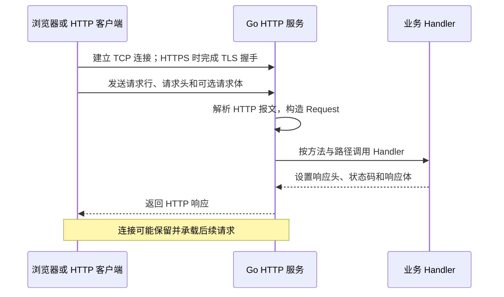
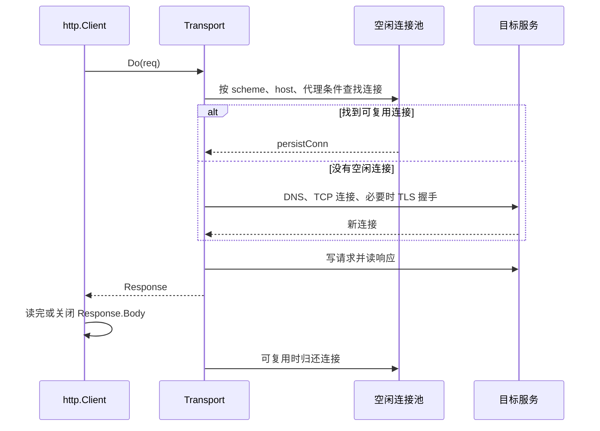

# 01. HTTP 编程：从协议到 net/http 源码

## 前言

HTTP 是应用程序彼此交换信息的一套约定：客户端说明“要什么”，服务端说明“给什么、结果如何”。浏览器访问网页、手机调用接口、服务间 RPC 的 HTTP 网关，底层都在处理请求、响应、连接和超时。

`net/http` 是 Go 对这套约定的标准库实现。在 Go 1.0 正式发布时它已是标准库的一部分；今天很多 Web 框架的最终入口仍是 `http.Handler`。这里以 **Go 1.26.5** 的公开 API 和源码为准：先把 HTTP 报文与客户端/服务端的职责讲清，再把它们映射到 Go 代码，最后阅读标准库如何接收连接、调用 Handler 和复用客户端连接。

阅读时始终抓住同一条链路：**请求从网络进入，变成 `Request`；路由选择 Handler；业务读取输入并写出 `ResponseWriter`；连接随后被复用或关闭。** 这条链路比记住零散函数更重要。

## HTTP 到底在交换什么

HTTP 是应用层协议。TCP（或 QUIC）负责可靠传输字节，HTTP 规定这些字节怎样表示方法、路径、请求头、状态码和正文。HTTPS 则是在 HTTP 与传输层之间增加 TLS，保护传输过程中的机密性和完整性。

一次普通访问的关键步骤如下。



一个请求报文可以先这样读：

```http
GET /articles?tag=go HTTP/1.1
Host: example.com
Accept: application/json

```

- `GET` 是方法，表达这次操作的意图；
- `/articles` 是路径，`tag=go` 是查询参数；
- `Host`、`Accept` 是请求头；
- 空行之后才是可选的请求体。`GET` 通常没有请求体，创建资源的 `POST` 常携带 JSON。

服务端可能返回：

```http
HTTP/1.1 200 OK
Content-Type: application/json; charset=utf-8

[{"id":1,"title":"理解 HTTP"}]
```

状态码描述协议结果，响应体承载业务数据。常见的选择是：

| 场景 | 状态码 | 含义 |
| --- | --- | --- |
| 成功读取资源 | `200 OK` | 响应体通常有资源数据 |
| 成功创建资源 | `201 Created` | 创建结果已产生 |
| 请求参数不合法 | `400 Bad Request` | 客户端应修改请求 |
| 没有登录身份 | `401 Unauthorized` | 需要认证信息 |
| 资源不存在 | `404 Not Found` | 路径或资源 ID 无效 |
| 方法不被该资源支持 | `405 Method Not Allowed` | 应查看 `Allow` 响应头 |
| 服务端未预期失败 | `500 Internal Server Error` | 细节只写服务端日志 |

HTTP 是无状态协议：服务端不会仅因“这是同一个连接”就记住用户登录状态。Cookie、Session、Token 是在请求之间携带状态的额外机制，不是 HTTP 自动保存的状态。

无状态也不意味着每次请求都要新建 TCP 连接。HTTP/1.1 通常通过 keep-alive 在一条连接上顺序处理多个请求；HTTP/2 可以在一条连接中并发传输多个流。连接复用是传输层面的性能优化，登录状态是应用层的业务设计，二者不能混为一谈。正因为连接和 Handler 都会并发使用，任何共享的可变内存都必须由锁、channel 或外部存储保护。

### URL、方法、请求头和正文

一个 URL 可以拆成 `scheme://host:port/path?query#fragment`。例如 `https://api.example.com:8443/articles/42?draft=false#comments` 中，`https` 决定是否使用 TLS，`api.example.com:8443` 决定连接目标，`/articles/42` 是服务端路由使用的路径，`draft=false` 是查询参数；`#comments` 是浏览器本地定位信息，**不会发送给服务端**。因此服务端只能从 `r.URL.Path` 和 `r.URL.Query()` 读取前两类信息。

方法不是“不同名字的函数”。它表达调用者期望的操作语义，代理、缓存、重试机制会据此作出不同决定：

| 方法 | 常见用途 | 是否应只读 | 是否通常幂等 |
| --- | --- | --- | --- |
| `GET` | 查询资源 | 是 | 是 |
| `HEAD` | 只查询响应头 | 是 | 是 |
| `POST` | 创建资源或执行动作 | 否 | 否 |
| `PUT` | 用完整表示替换资源 | 否 | 是 |
| `PATCH` | 局部更新资源 | 否 | 不保证 |
| `DELETE` | 删除资源 | 否 | 通常是 |

“幂等”表示相同请求重复执行后的资源状态相同，不等于响应内容必然相同。例如删除已不存在的资源可能返回 `404`，但资源仍是“已删除”状态。支付、扣库存这类不能随意重试的操作尤其不能仅凭 `POST` 就认为安全，需要额外的幂等键或业务去重。

请求头描述元数据，而请求体承载数据。`Content-Type` 说明正文格式，例如 `application/json`、`application/x-www-form-urlencoded` 或 `multipart/form-data`；`Accept` 表示客户端希望接收的表示形式；`Authorization` 携带认证凭据。请求头和正文都来自外部，不能因为头名或 `Content-Type` 存在就跳过校验。

## 把协议映射到 `net/http`

服务端最常用的类型并不多：

| 类型 | 对应职责 |
| --- | --- |
| `http.Request` | 已解析的请求：方法、URL、头、正文和取消信号 |
| `http.ResponseWriter` | 正在构造的响应：头、状态码、正文 |
| `http.Handler` | 处理一个请求的统一接口 |
| `http.ServeMux` | 按模式选择 Handler 的标准路由器 |
| `http.Server` | 监听连接、配置超时、管理服务端生命周期 |
| `http.Client` | 发起请求、管理重定向和 Cookie |
| `http.Transport` | 客户端连接池、代理、TLS 和传输细节 |

核心接口只有一行：

```go
type Handler interface {
	// ServeHTTP 处理一次请求。
	// w 用于写响应；r 保存这次请求的全部输入和生命周期。
	ServeHTTP(ResponseWriter, *Request)
}
```

普通函数可以成为 Handler，是因为标准库提供了一个很薄的适配器。下面是 Go 1.26.5 `server.go` 的实际实现：

```go
// HandlerFunc 是签名正确的普通函数类型。
type HandlerFunc func(ResponseWriter, *Request)

// ServeHTTP 使 HandlerFunc 满足 Handler 接口。
// 没有隐藏的反射或调度逻辑，只是直接调用函数本身。
func (f HandlerFunc) ServeHTTP(w ResponseWriter, r *Request) {
	f(w, r)
}
```

因此，处理器需要保存数据库、日志器等长期依赖时可使用结构体；只处理一件简单事情时可直接使用 `func(w, r)`。

`ServeMux` 的职责只是“选择哪个 Handler”，不是验证业务参数。当前版本的模式可以写成 `METHOD /path/{name}`：`GET /articles/{id}` 会匹配一个非空路径段，随后通过 `r.PathValue("id")` 得到字符串。更具体的模式优先；路径能匹配而方法不匹配时，`ServeMux` 返回 `405` 并给出 `Allow`，没有任何路径匹配才是 `404`。这些规则让路由表成为接口的第一层边界，但 `id` 是否为正整数、调用者能否访问资源仍必须由业务代码判断。

### 结构体 Handler 与 `DefaultServeMux`

当一组处理器共享数据库、缓存、日志器或配置时，把这些长期依赖放进结构体比使用全局变量更清楚。结构体本身仍会被多个请求并发调用，因此只能保存并发安全的依赖，不能保存“当前请求的用户”之类的临时数据。

```go
// articleHandler 持有进程级依赖，而不是某次请求的数据。
type articleHandler struct {
	store  *articleStore
	logger *log.Logger
}

func (h *articleHandler) ServeHTTP(w http.ResponseWriter, r *http.Request) {
	// 真正的路由通常由 ServeMux 完成；这里仅演示结构体如何成为 Handler。
	h.logger.Printf("method=%s path=%s", r.Method, r.URL.Path)
	writeJSON(w, http.StatusOK, map[string]string{"status": "handled"})
}

// mux.Handle 接收 Handler，因此可直接注册结构体指针。
mux.Handle("GET /articles", &articleHandler{store: store, logger: logger})
```

`http.Handle`、`http.HandleFunc` 会把路由注册到包级全局变量 `http.DefaultServeMux`；`http.ListenAndServe(addr, nil)` 在 handler 为 nil 时也使用它。十行演示很方便，但真实服务优先使用 `http.NewServeMux()` 并显式传给 `Server`：路由不再受其他包或测试影响，也能同时创建多个独立服务。

## 先启动一个最小 HTTP 服务

先只做一件事：访问 `/hello` 时返回文本。显式创建 `ServeMux`，不要让路由落在全局 `DefaultServeMux` 中。

```go
package main

import (
	"fmt"
	"log"
	"net/http"
)

func main() {
	// mux 是这个服务独有的路由表，测试时也可以重新创建一个干净的 mux。
	mux := http.NewServeMux()

	// 模式同时声明方法和路径。只有 GET /hello 会进入 hello。
	mux.HandleFunc("GET /hello", hello)

	// Server 把监听地址和路由器组合起来。这里使用零值超时只为突出最小示例；
	// 面向公网的配置在后文单独给出。
	server := &http.Server{Addr: ":8080", Handler: mux}

	log.Println("listen on http://127.0.0.1:8080")
	// ListenAndServe 会阻塞，持续接受连接并处理请求。
	log.Fatal(server.ListenAndServe())
}

func hello(w http.ResponseWriter, r *http.Request) {
	// 所有普通响应头都必须在首次 WriteHeader 或 Write 之前设置。
	w.Header().Set("Content-Type", "text/plain; charset=utf-8")

	// Fprintln 最终会调用 ResponseWriter.Write。
	// 若尚未设置状态码，首次写入自动提交 200 OK。
	if _, err := fmt.Fprintln(w, "hello, HTTP"); err != nil {
		// 客户端可能已关闭连接；此时不能再尝试写一个错误响应。
		log.Printf("write response: %v", err)
	}
}
```

运行后用 `curl -i http://127.0.0.1:8080/hello` 查看完整响应。`-i` 会显示状态行和响应头，能把代码中的 `Content-Type`、隐式 `200` 与真实报文对应起来。

## 请求输入：路径、查询参数、请求头和 JSON

所有请求数据都来自网络，必须当作不可信输入。路由匹配成功不代表路径参数是数字；存在 `Content-Type` 也不代表请求体真的是合法 JSON。

`Request` 是协议输入在 Go 中的表示：`r.Method` 是方法，`r.URL` 是已解析 URL，`r.Header` 是多值请求头，`r.Body` 是只能顺序读取的流，`r.RemoteAddr` 是直接连接到当前服务的地址，`r.Context()` 则代表这次请求的取消生命周期。不要把 `RemoteAddr` 直接当作真实用户 IP：部署在反向代理后，它通常是代理的地址；也不要无条件信任 `X-Forwarded-For`，普通客户端可以伪造该头。只有网络边界明确、且可信代理会清理并重建转发头时，应用才能使用它。

查询参数适合表达筛选、分页、排序等非资源本体的数据。构造查询参数时不要手拼字符串，因为空格、中文、`&`、`=` 都需要转义：

```go
func articleSearchURL() (string, error) {
	endpoint, err := url.Parse("https://api.example.com/articles")
	if err != nil {
		return "", err // URL 本身不合法时，不应发起请求。
	}

	query := endpoint.Query()
	query.Set("tag", "Go HTTP") // Encode 会处理空格和非 ASCII 字符。
	query.Set("page", "1")
	endpoint.RawQuery = query.Encode()

	// 返回形如：https://api.example.com/articles?page=1&tag=Go+HTTP
	return endpoint.String(), nil
}
```

```go
func search(w http.ResponseWriter, r *http.Request) {
	// URL.Query 返回 url.Values。同名键可以有多个值；Get 只取第一个。
	keyword := strings.TrimSpace(r.URL.Query().Get("q"))
	if keyword == "" {
		http.Error(w, "missing query parameter q", http.StatusBadRequest)
		return // http.Error 不会停止 Handler，必须由调用方结束流程。
	}

	// Header 名称不区分大小写。Get 会按 HTTP 的规则读取它。
	requestID := r.Header.Get("X-Request-ID")

	writeJSON(w, http.StatusOK, map[string]string{
		"q":          keyword,
		"request_id": requestID,
	})
}
```

处理 JSON 时还需要限制大小、拒绝未知字段，并确保正文只有一个 JSON 值。这样既避免无上限占用内存，也能让拼写错误尽早暴露。

```go
type createArticleInput struct {
	Title string `json:"title"`
}

func decodeCreateArticle(w http.ResponseWriter, r *http.Request) (createArticleInput, bool) {
	// 在读取过程中实施 1 MiB 上限；不能只相信客户端的 Content-Length。
	r.Body = http.MaxBytesReader(w, r.Body, 1<<20)

	decoder := json.NewDecoder(r.Body)
	decoder.DisallowUnknownFields() // 例如 "titel" 会被拒绝，而不是静默忽略。

	var input createArticleInput
	if err := decoder.Decode(&input); err != nil {
		var tooLarge *http.MaxBytesError
		if errors.As(err, &tooLarge) {
			writeJSON(w, http.StatusRequestEntityTooLarge, map[string]string{"error": "body too large"})
		} else {
			writeJSON(w, http.StatusBadRequest, map[string]string{"error": "invalid JSON"})
		}
		return createArticleInput{}, false
	}

	// 第一次 Decode 成功不代表正文结束；拒绝两个 JSON 对象拼接的情况。
	if err := decoder.Decode(&struct{}{}); !errors.Is(err, io.EOF) {
		writeJSON(w, http.StatusBadRequest, map[string]string{"error": "body must contain one JSON value"})
		return createArticleInput{}, false
	}

	input.Title = strings.TrimSpace(input.Title)
	if input.Title == "" {
		writeJSON(w, http.StatusBadRequest, map[string]string{"error": "title is required"})
		return createArticleInput{}, false
	}
	return input, true
}
```

服务端会在请求处理结束后关闭 `r.Body`，无需在 Handler 中额外 `defer r.Body.Close()`；这是服务端请求体与客户端响应体的重要区别。

### 表单与文件上传

HTML 表单常用 `application/x-www-form-urlencoded`，文件上传使用 `multipart/form-data`。前者是键值对编码，后者将普通字段和文件分成多个分段。`ParseForm` 会解析 URL 查询参数和普通表单正文，并且会返回错误；`FormValue` 虽方便但会忽略解析错误，因此需要严格验证的接口优先显式调用 `ParseForm`。

```go
func submitProfile(w http.ResponseWriter, r *http.Request) {
	// 表单同样需要先限制正文大小，避免无边界读取。
	r.Body = http.MaxBytesReader(w, r.Body, 1<<20)
	if err := r.ParseForm(); err != nil {
		http.Error(w, "invalid form", http.StatusBadRequest)
		return
	}

	// PostForm 只读取请求体中的表单字段，不混入 URL 查询参数。
	name := strings.TrimSpace(r.PostForm.Get("name"))
	if name == "" {
		http.Error(w, "name is required", http.StatusBadRequest)
		return
	}
	writeJSON(w, http.StatusOK, map[string]string{"name": name})
}
```

文件上传不能仅靠 `ParseForm` 代替大小策略。要根据文件总大小、单文件大小、允许的 MIME 类型、落盘位置和病毒扫描要求单独设计；不要把上传临时目录直接交给静态文件服务。

### 请求体如何知道结束

`r.Body` 是流而不是已经放在内存中的 `[]byte`。HTTP/1.1 常通过 `Content-Length` 表示正文长度；长度未知时可使用分块传输编码（chunked transfer encoding）。这些报文边界由 `net/http` 解析，业务代码只应顺序读取 `r.Body`，不要自己猜测 TCP 的一次 `Read` 对应一个完整 HTTP 请求。

这也解释了两个实践规则：第一，读取不可信正文必须限制大小；第二，尽量在开始写响应前读完所需输入。对 HTTP/1.x 而言，响应已经开始发送后再读取请求体未必可行；即使协议允许，也会令错误处理变得难以保持一致。

## 响应输出：先定头和状态，再写正文

`ResponseWriter` 不是可反复修改的结果对象，而是一条正在发送的字节流。正确顺序是：

1. `Header().Set` 设置响应头；
2. `WriteHeader(status)` 提交状态码和响应头；
3. `Write` 或 `json.Encoder.Encode` 写正文。

```go
func writeJSON(w http.ResponseWriter, status int, value any) {
	// Encode 会立刻写正文，所以 Content-Type 必须先设置。
	w.Header().Set("Content-Type", "application/json; charset=utf-8")

	// 第一次 WriteHeader 决定最终状态码；之后的调用不能修正已经发出的响应。
	w.WriteHeader(status)

	// 编码失败通常发生在响应已部分写出之后，只记录日志，不能改写成另一份 500 响应。
	if err := json.NewEncoder(w).Encode(value); err != nil {
		log.Printf("encode JSON response: %v", err)
	}
}
```

没有调用 `WriteHeader` 时，首次 `Write` 会隐式提交 `200 OK`。因此“先写成功 JSON，再发现错误并写 `400`”不会工作；输入校验必须发生在开始响应之前。

`http.Error` 是写入纯文本错误响应的快捷方法，适合非常简单的服务；JSON API 更适合像 `writeJSON` 一样统一错误结构。无论哪种方式，写错误后都要 `return`，否则后续成功分支仍可能继续向同一响应写数据。对于 `204 No Content` 和 `304 Not Modified`，协议不允许普通响应正文；不要习惯性地再调用 JSON 编码器。

### 静态资源不是“任意目录下载器”

`http.FileServer` 能将受控目录中的 CSS、JavaScript、图片等作为 HTTP 资源提供。它适合开发工具或很简单的站点，但目录范围必须明确：

```go
// 只暴露项目内的 public 目录，而不是机器上的任意路径。
files := http.FileServer(http.Dir("./public"))

// 客户端请求 /assets/app.css 时，先去掉 /assets/，再读取 ./public/app.css。
mux.Handle("GET /assets/", http.StripPrefix("/assets/", files))
```

不要使用 `http.FileServer(http.Dir("/"))`，也不要把配置、私钥、源码、用户上传临时目录放进公开静态目录。生产环境通常由 CDN 或反向代理承担静态文件与缓存，Go 服务更专注于动态接口。

### Cookie、重定向与浏览器同源限制

Cookie 是服务端通过 `Set-Cookie` 响应头请客户端保存的一小段数据。后续请求是否带回 Cookie，取决于域名、路径、过期时间以及 `Secure`、`SameSite` 等属性。Cookie 本身不是认证；登录服务通常把难以猜测的会话标识写入 Cookie，再由服务端查询会话或验证签名。

```go
func signIn(w http.ResponseWriter, r *http.Request) {
	// Value 只放不敏感的会话标识；密码、完整用户资料不应直接放入 Cookie。
	http.SetCookie(w, &http.Cookie{
		Name:     "session_id",
		Value:    "opaque-session-id",
		Path:     "/",          // 整个站点的请求都可携带它。
		HttpOnly: true,         // 浏览器中的 JavaScript 无法读取，降低 XSS 泄露风险。
		Secure:   true,         // 生产环境仅通过 HTTPS 发送；本地 HTTP 调试时需另行处理。
		SameSite: http.SameSiteLaxMode, // 限制跨站请求自动携带的时机，缓解 CSRF 风险。
	})
	writeJSON(w, http.StatusOK, map[string]string{"status": "signed in"})
}
```

重定向是服务端返回 `Location` 头和 3xx 状态码。`303 See Other` 常用于表单 POST 后跳到一个 GET 页面；`307 Temporary Redirect` 和 `308 Permanent Redirect` 要求客户端保留原方法与正文，不能把它们与 `302` 混为一谈。是否跟随重定向是客户端策略，不是服务端能强制保证的行为。

浏览器还执行同源策略：一个网页不能任意读取其他源的响应。CORS 是服务端通过 `Access-Control-Allow-Origin` 等响应头对浏览器授权的机制；它不保护非浏览器客户端，也不能代替身份认证。只为明确的可信前端源设置 CORS，避免盲目返回 `*` 与凭据组合。

## 完整服务端示例：文章 API

下面的程序把路由、路径参数、JSON、请求 Context、超时与优雅关闭放在一起。内存存储只用于聚焦 HTTP 边界；替换为数据库时，应继续把同一个 `ctx` 传给仓储方法。

```go
package main

import (
	"context"
	"encoding/json"
	"errors"
	"io"
	"log"
	"net/http"
	"os"
	"os/signal"
	"strconv"
	"strings"
	"sync"
	"syscall"
	"time"
)

type article struct {
	ID    int64  `json:"id"`
	Title string `json:"title"`
}

type createArticleInput struct {
	Title string `json:"title"`
}

// articleStore 被多个请求同时访问，故 map 和 nextID 都由 mutex 保护。
type articleStore struct {
	mu     sync.RWMutex
	nextID int64
	items  map[int64]article
}

func newArticleStore() *articleStore {
	return &articleStore{nextID: 1, items: make(map[int64]article)}
}

func (s *articleStore) create(ctx context.Context, title string) (article, error) {
	// 内存操作不阻塞，但检查 ctx 使接口与数据库/RPC 仓储保持同样的取消语义。
	if err := ctx.Err(); err != nil {
		return article{}, err
	}
	s.mu.Lock()
	defer s.mu.Unlock()

	a := article{ID: s.nextID, Title: title}
	s.nextID++
	s.items[a.ID] = a
	return a, nil
}

func (s *articleStore) get(ctx context.Context, id int64) (article, bool, error) {
	if err := ctx.Err(); err != nil {
		return article{}, false, err
	}
	s.mu.RLock()
	defer s.mu.RUnlock()
	a, ok := s.items[id]
	return a, ok, nil
}

// api 只保存跨请求复用的依赖。单次请求的数据必须留在方法局部变量中。
type api struct{ store *articleStore }

func newHandler(store *articleStore) http.Handler {
	a := &api{store: store}
	mux := http.NewServeMux()

	// 方法属于路由规则。路径存在但方法不匹配时，ServeMux 会生成 405 和 Allow。
	mux.HandleFunc("POST /articles", a.createArticle)
	mux.HandleFunc("GET /articles/{id}", a.getArticle)
	mux.HandleFunc("GET /healthz", a.healthz)
	return mux
}

func (a *api) healthz(w http.ResponseWriter, r *http.Request) {
	writeJSON(w, http.StatusOK, map[string]string{"status": "ok"})
}

func (a *api) createArticle(w http.ResponseWriter, r *http.Request) {
	input, ok := decodeCreateArticle(w, r)
	if !ok {
		return // 解码函数已给出安全的 400 或 413 响应。
	}

	// 将 r.Context 原样向下传递；客户端取消时下游操作有机会及时停止。
	created, err := a.store.create(r.Context(), input.Title)
	if err != nil {
		writeRequestError(w, err)
		return
	}
	writeJSON(w, http.StatusCreated, created)
}

func (a *api) getArticle(w http.ResponseWriter, r *http.Request) {
	// 路由参数永远是字符串；匹配成功不表示它是合法业务 ID。
	id, err := strconv.ParseInt(r.PathValue("id"), 10, 64)
	if err != nil || id <= 0 {
		writeJSON(w, http.StatusBadRequest, map[string]string{"error": "id must be a positive integer"})
		return
	}

	found, ok, err := a.store.get(r.Context(), id)
	if err != nil {
		writeRequestError(w, err)
		return
	}
	if !ok {
		writeJSON(w, http.StatusNotFound, map[string]string{"error": "article not found"})
		return
	}
	writeJSON(w, http.StatusOK, found)
}

func decodeCreateArticle(w http.ResponseWriter, r *http.Request) (createArticleInput, bool) {
	r.Body = http.MaxBytesReader(w, r.Body, 1<<20)
	decoder := json.NewDecoder(r.Body)
	decoder.DisallowUnknownFields()

	var input createArticleInput
	if err := decoder.Decode(&input); err != nil {
		writeJSON(w, http.StatusBadRequest, map[string]string{"error": "invalid JSON"})
		return createArticleInput{}, false
	}
	if err := decoder.Decode(&struct{}{}); !errors.Is(err, io.EOF) {
		writeJSON(w, http.StatusBadRequest, map[string]string{"error": "body must contain one JSON value"})
		return createArticleInput{}, false
	}
	input.Title = strings.TrimSpace(input.Title)
	if input.Title == "" {
		writeJSON(w, http.StatusBadRequest, map[string]string{"error": "title is required"})
		return createArticleInput{}, false
	}
	return input, true
}

func writeJSON(w http.ResponseWriter, status int, value any) {
	w.Header().Set("Content-Type", "application/json; charset=utf-8")
	w.WriteHeader(status)
	if err := json.NewEncoder(w).Encode(value); err != nil {
		log.Printf("encode response: %v", err)
	}
}

func writeRequestError(w http.ResponseWriter, err error) {
	if errors.Is(err, context.Canceled) {
		// 客户端通常已离开；停止下游工作即可，不必强行再写响应。
		return
	}
	log.Printf("request failed: %v", err)
	writeJSON(w, http.StatusInternalServerError, map[string]string{"error": "internal server error"})
}

func main() {
	server := &http.Server{
		Addr:              ":8080",
		Handler:           newHandler(newArticleStore()),
		ReadHeaderTimeout: 5 * time.Second,  // 防止慢速请求头长期占用连接。
		ReadTimeout:       15 * time.Second, // 限制读取普通完整请求的时间。
		WriteTimeout:      15 * time.Second, // 限制向慢客户端写普通响应的时间。
		IdleTimeout:       60 * time.Second, // keep-alive 连接等待下一请求的时间。
		MaxHeaderBytes:    1 << 20,          // 限制异常大的请求头。
	}

	serverErr := make(chan error, 1)
	go func() { serverErr <- server.ListenAndServe() }()

	// Ctrl+C 与容器常见的 SIGTERM 进入同一条退出路径。
	stopCtx, stop := signal.NotifyContext(context.Background(), os.Interrupt, syscall.SIGTERM)
	defer stop()

	select {
	case err := <-serverErr:
		if !errors.Is(err, http.ErrServerClosed) {
			log.Fatalf("HTTP server failed: %v", err)
		}
		return
	case <-stopCtx.Done():
		log.Println("shutdown signal received")
	}

	// Shutdown 不再接受新连接，并在最多 10 秒内等待已有请求结束。
	shutdownCtx, cancel := context.WithTimeout(context.Background(), 10*time.Second)
	defer cancel()
	if err := server.Shutdown(shutdownCtx); err != nil {
		log.Printf("graceful shutdown: %v", err)
	}

	// Shutdown 触发的 ErrServerClosed 是预期结果；等待它可避免 main 提前退出。
	if err := <-serverErr; !errors.Is(err, http.ErrServerClosed) {
		log.Printf("HTTP server stopped: %v", err)
	}
}
```

启动后可以验证：

```bash
curl -i -X POST http://127.0.0.1:8080/articles \
  -H 'Content-Type: application/json' \
  -d '{"title":"从 HTTP 开始"}'

curl -i http://127.0.0.1:8080/articles/1
curl -i -X DELETE http://127.0.0.1:8080/articles/1
```

最后一条会得到 `405 Method Not Allowed`：路径能匹配，但路由没有注册 `DELETE`。

## 编写 HTTP 客户端：错误、超时与关闭响应体

客户端的规则同样重要：设置超时，始终关闭 `resp.Body`，并把 HTTP 非 2xx 状态和 Go 的 `error` 分开处理。`Client.Do` 的 `error` 表示连接、TLS、取消等通信失败；服务器返回 `404` 或 `500` 时，通常仍会得到一个非 nil 的 `resp` 和 nil 的 `error`。

最简短的 `http.Get`、`http.Post` 适合临时脚本；一旦需要上下文取消、自定义头、非 GET/POST 方法、认证或精确的重定向策略，就应创建 `Request` 后调用 `Client.Do`。`Client.Timeout` 是整个请求的上限，覆盖连接、重定向、等待响应和读取正文；请求级 `context.WithTimeout` 则适合为某个调用设置更短的业务预算。两者可以同时存在，先到期者取消请求。

```go
func createArticle(ctx context.Context, client *http.Client, endpoint, title string) (article, error) {
	// 使用 Encoder 写入 bytes.Buffer，避免手拼 JSON 和转义错误。
	var body bytes.Buffer
	if err := json.NewEncoder(&body).Encode(createArticleInput{Title: title}); err != nil {
		return article{}, fmt.Errorf("encode request: %w", err)
	}

	// ctx 控制这一次请求；调用方取消时，网络等待也会被取消。
	req, err := http.NewRequestWithContext(ctx, http.MethodPost, endpoint+"/articles", &body)
	if err != nil {
		return article{}, fmt.Errorf("build request: %w", err)
	}
	req.Header.Set("Content-Type", "application/json; charset=utf-8")
	req.Header.Set("Accept", "application/json")

	resp, err := client.Do(req)
	if err != nil {
		return article{}, fmt.Errorf("send request: %w", err)
	}
	// 必须关闭。读到 EOF 或关闭后，HTTP/1.x 连接才更可能回到连接池复用。
	defer resp.Body.Close()

	if resp.StatusCode != http.StatusCreated {
		return article{}, fmt.Errorf("unexpected HTTP status: %s", resp.Status)
	}

	var created article
	if err := json.NewDecoder(resp.Body).Decode(&created); err != nil {
		return article{}, fmt.Errorf("decode response: %w", err)
	}
	return created, nil
}

func main() {
	// Client 和 Transport 均可被多个 goroutine 安全复用。
	// Timeout 是从发起到读取完响应体的整体上限，外部服务不宜保持零值。
	client := &http.Client{Timeout: 5 * time.Second}

	ctx, cancel := context.WithTimeout(context.Background(), 3*time.Second)
	defer cancel()
	created, err := createArticle(ctx, client, "http://127.0.0.1:8080", "客户端发送的文章")
	if err != nil {
		log.Fatal(err)
	}
	log.Printf("created article: %+v", created)
}
```

当默认连接池参数不能满足高并发调用时，应克隆默认 `Transport` 再做小范围调整，而不是从空结构体开始丢失默认行为：

```go
transport := http.DefaultTransport.(*http.Transport).Clone()

// 全部目标主机合计最多保留 100 条空闲连接。
transport.MaxIdleConns = 100
// 单个目标主机最多保留 20 条空闲连接。
transport.MaxIdleConnsPerHost = 20
// 空闲连接超过 90 秒后回收。
transport.IdleConnTimeout = 90 * time.Second
// 请求写完后，等待响应头的时间上限。
transport.ResponseHeaderTimeout = 5 * time.Second

client := &http.Client{Transport: transport, Timeout: 10 * time.Second}
```

不要为每一次调用新建 `Client` 或 `Transport`。这样会失去连接池，重复 DNS 查询、TCP 握手和 TLS 握手。

客户端还常遇到两类协议行为。第一，默认 Client 会跟随有限次重定向；安全边界严格时可通过 `CheckRedirect` 限制跳转目标和次数。第二，浏览器会自动管理 Cookie，而 Go 客户端只有配置 `cookiejar.Jar` 后才会跨请求保存并发送 Cookie。Cookie 与登录状态密切相关，不能把“服务端返回了 Set-Cookie”误解为所有客户端都会自动记住它。

```go
func newAPIClient() (*http.Client, error) {
	// Jar 是 Go 客户端的 Cookie 容器；没有它时，收到的 Set-Cookie 不会自动用于后续请求。
	jar, err := cookiejar.New(nil)
	if err != nil {
		return nil, fmt.Errorf("create cookie jar: %w", err)
	}

	return &http.Client{
		Timeout: 10 * time.Second,
		Jar:     jar,
		CheckRedirect: func(next *http.Request, previous []*http.Request) error {
			// 不让异常服务通过无限跳转持续占用调用方资源。
			if len(previous) >= 5 {
				return errors.New("too many redirects")
			}
			// 真实项目可在这里限制只能跳转到受信任域名。
			return nil
		},
	}, nil
}
```

`http.Client` 的四个最常用配置分别是：`Transport` 控制传输和连接池，`Timeout` 限制完整请求，`Jar` 管理 Cookie，`CheckRedirect` 决定重定向策略。它们通常在应用启动时配置一次并长期复用，而不是在业务函数里临时创建。

## 服务端生命周期：超时、Context 与关闭

`http.Server` 的超时不是同一个概念：

| 配置 | 限制对象 | 常见目的 |
| --- | --- | --- |
| `ReadHeaderTimeout` | 读取请求头 | 防慢速请求头攻击 |
| `ReadTimeout` | 读取完整请求 | 防请求体永不结束 |
| `WriteTimeout` | 写响应 | 防慢客户端长期占用资源 |
| `IdleTimeout` | 空闲 keep-alive 连接 | 回收无请求连接 |

这些网络超时不能替代业务取消。服务端的 `r.Context()` 会在客户端离开、请求被取消或 Handler 返回时被取消；调用数据库、RPC、另一个 HTTP 服务时必须继续传递它，而不是改成 `context.Background()`。

`Shutdown(ctx)` 停止接收新连接并等待活动请求结束，但不会替应用停止任意后台 goroutine，也不会关闭被 Hijack 的 WebSocket 连接。长连接需要应用自己注册关闭通知并定义退出协议。

### 客户端 IP 与可信代理

`r.RemoteAddr` 是**直接**连到当前 Go 服务的地址，通常形如 `IP:端口`。服务位于 Nginx、负载均衡器或网关之后时，它通常是代理 IP，而不是用户 IP。只有网络拓扑保证外部流量不能绕过可信代理，并且代理会删除外部传来的转发头、自己重新设置转发头时，才可使用 `X-Forwarded-For` 或 `X-Real-IP`。

```go
func clientIP(r *http.Request, trustProxy bool) string {
	if trustProxy {
		// X-Forwarded-For 可能是“客户端, 代理1, 代理2”。
		// 只有可信代理已重建该头时，第一个值才有意义。
		if forwarded := r.Header.Get("X-Forwarded-For"); forwarded != "" {
			first := strings.TrimSpace(strings.Split(forwarded, ",")[0])
			if net.ParseIP(first) != nil {
				return first
			}
		}
	}

	// 未信任代理时，只返回直接对端地址，避免相信客户端伪造的 header。
	host, _, err := net.SplitHostPort(r.RemoteAddr)
	if err != nil {
		return r.RemoteAddr
	}
	return host
}
```

### 反向代理的职责

反向代理对客户端表现为服务端，对后端服务表现为客户端：接收请求、转发到上游、再将上游响应回传。`httputil.ReverseProxy` 适合理解这一模式或实现小型内部代理；生产网关仍要额外考虑鉴权、上游超时、限流、重试、流式响应和可观测性。

```go
func newDocsProxy() (*httputil.ReverseProxy, error) {
	target, err := url.Parse("https://go.dev")
	if err != nil {
		return nil, fmt.Errorf("parse upstream URL: %w", err)
	}

	return &httputil.ReverseProxy{
		Rewrite: func(pr *httputil.ProxyRequest) {
			// SetURL 改写即将发往上游的 scheme、host 和基础路径。
			pr.SetURL(target)
			// 由代理统一生成 X-Forwarded-*，不要转发客户端伪造的同名值。
			pr.SetXForwarded()
		},
		ErrorHandler: func(w http.ResponseWriter, r *http.Request, err error) {
			log.Printf("upstream request failed: %v", err) // 内部细节只记日志。
			http.Error(w, "upstream unavailable", http.StatusBadGateway)
		},
	}, nil
}

func registerDocsProxy(mux *http.ServeMux) error {
	proxy, err := newDocsProxy()
	if err != nil {
		return err
	}
	// /docs/guide 被去掉 /docs 前缀后，以 /guide 的形式转发到 https://go.dev。
	mux.Handle("GET /docs/", http.StripPrefix("/docs", proxy))
	return nil
}

## 源码视角：标准库怎样把字节交给代码

Go 1.26.5 的服务端实现在 `src/net/http/server.go`，路由实现位于 `routing_tree.go`，客户端传输实现位于 `transport.go`。请求从监听器进入、离开时回到连接池的关键路径如下。

### 1. `ListenAndServe` 只负责建立监听器

`http.ListenAndServe(":8080", h)` 是方便函数。它构造 `Server` 并调用 `Server.ListenAndServe`；后者用 `net.Listen("tcp", addr)` 建立监听器，最后进入 `Server.Serve`。因此端口、TLS、连接状态和优雅关闭等生产配置需要显式创建 `http.Server`，而不是期待 `HandleFunc` 本身管理它们。

服务端的 `Server.Serve` 循环接收连接，并为连接启动 `conn.serve`。HTTP/1.x 的同一连接可依次处理多个请求；HTTP/2 的多路复用则由相应协议实现接管。

```go
// src/net/http/server.go：Server.Serve 的核心循环，已省略临时 Accept 错误的退避。
for {
	rw, err := l.Accept() // 阻塞，直到操作系统交付一个 TCP 连接。
	if err != nil {
		return err
	}

	c := s.newConn(rw)       // 包装原始连接，保存读写缓冲和服务端状态。
	c.setState(c.rwc, StateNew, runHooks)
	go c.serve(ctx)          // 不同连接可并发，因此 Handler 的共享状态必须自行同步。
}
```

每一条连接一个 goroutine，不等于“每一个 Handler 总是一个 goroutine”。HTTP/2 在一条连接中可以并发处理多个请求流；无论协议版本如何，Handler 都必须按可并发调用来设计。`Server` 的 `ConnState` 回调可观察 `StateNew`、`StateActive`、`StateIdle`、`StateClosed` 等变化，适合连接指标，不适合承载业务状态。

### 2. `conn.serve` 负责解析、调用与收尾

`conn.serve` 在循环中读取请求行和头部，构造 `Request` 与内部 `response`，然后才调用 Handler。把它缩成步骤表更容易理解：

| 顺序 | 标准库动作 | 应用层含义 |
| --- | --- | --- |
| 1 | 从连接读取并解析 HTTP 报文 | 不要自行按 TCP 包边界切请求 |
| 2 | 为请求建立可取消 Context | 下游调用必须接收 `r.Context()` |
| 3 | `ServeMux` 选择目标 Handler | 404/405 属于路由层语义 |
| 4 | Handler 写 `ResponseWriter` | 头、状态码、正文只能顺序提交 |
| 5 | 取消请求 Context、刷新响应 | 返回后不可继续使用请求对象的 I/O 部分 |
| 6 | 判断连接能否复用 | 不可复用则关闭，否则等待下一请求 |

完成报文解析后，关键的请求收尾顺序如下：

```go
// src/net/http/server.go：一条 HTTP/1.x 请求的核心收尾顺序。
serverHandler{c.server}.ServeHTTP(w, w.req) // 调用配置的 Handler 或 DefaultServeMux。
w.cancelCtx()                               // Handler 返回后，取消这次请求的 Context。

if c.hijacked() {
	return // 连接所有权已移交给应用，例如 WebSocket 升级场景。
}
w.finishRequest() // 刷新响应并完成本次请求的服务端收尾。
```

这解释了两个边界：`ServeHTTP` 返回后不能继续使用 `ResponseWriter` 或并发读取 `Request.Body`；想做异步任务时，应先复制并校验必要数据，再给任务独立的 Context、错误处理和持久化策略。

### 3. `ServeMux` 不是按注册顺序的 `if` 链

Go 1.26.5 的路由实现位于 `routing_tree.go`。路由树先按 host 分支，再按 method 分支，最后逐段匹配路径；字面路径段比 `{name}` 单段通配符更具体，`{name...}` 多段通配符最宽。这解释了为什么 `GET /articles/latest` 能优先于 `GET /articles/{id}`，也解释了为什么标准库能在“路径存在但方法不匹配”时给出 `405` 和 `Allow`，而不是把它误判为 `404`。

路由树是实现细节，应用不应依赖其节点结构；可靠的使用方式是让模式表达资源和方法，让 Handler 专注输入校验、授权和业务逻辑。模式冲突会在注册阶段 panic，这比运行时随机选中一个 Handler 更早暴露接口设计问题。

### 4. 响应为何只能向前写

响应只能“向前写”的规则也能在源码中看到。下面是 Go 1.26.5 `response.WriteHeader` 的关键判断，省略了协议检查、日志和 header clone：

```go
func (w *response) WriteHeader(code int) {
	if w.wroteHeader {
		// 第一个最终状态码已经交给连接；第二次调用不覆盖原来的结果。
		return
	}

	checkWriteHeaderCode(code) // 非法状态码会触发明确的编程错误。
	w.wroteHeader = true       // 记录“响应头已提交”的不可逆状态。
	w.status = code            // 保存将写入状态行的状态码。
}
```

`response.write` 在发现 `w.wroteHeader` 仍为 false 时会先写入 `StatusOK`，随后才写正文。这正是 `Write` 默认得到 `200`、以及响应头必须在首次写正文前设置的实现原因。业务代码不应依赖 `response` 这个内部类型；应依赖 `ResponseWriter` 文档承诺的写入顺序。

当没有明确 `Content-Length` 时，标准库会根据协议和响应大小决定如何界定正文；HTTP/1.1 可能使用 chunked 编码，HTTP/2 使用帧而非文本 chunk。业务 Handler 不应手动设置 `Transfer-Encoding` 或复制 `Content-Length`，除非确实理解代理、压缩、流式传输后的语义。

### 5. `Shutdown` 如何等待连接离场

`Server.Shutdown` 的源码首先将 `inShutdown` 置为 true，锁住服务端状态并关闭所有 listener，使正在 `Accept` 的循环返回；随后关闭空闲连接，并轮询等待活跃连接转为空闲或关闭。核心骨架如下：

```go
func (s *Server) Shutdown(ctx context.Context) error {
	s.inShutdown.Store(true) // 后续 Serve/ListenAndServe 不再继续提供新服务。

	s.mu.Lock()
	lnerr := s.closeListenersLocked() // 让阻塞中的 Accept 尽快返回。
	s.mu.Unlock()
	// 真实源码使用递增轮询间隔；此处用固定间隔保留核心等待语义。
	timer := time.NewTimer(time.Millisecond)
	defer timer.Stop()

	for {
		if s.closeIdleConns() {
			return lnerr // 没有活跃 HTTP 连接时才真正完成。
		}
		select {
		case <-ctx.Done():
			return ctx.Err() // 调用方决定最长等待时间。
		case <-timer.C:
			timer.Reset(time.Millisecond) // 继续检查：活跃请求可能刚好结束。
		}
	}
}
```

这也是完整示例必须等待 `ListenAndServe` 返回 `ErrServerClosed` 的原因：关闭监听器不等于所有 Handler 都已结束。`Shutdown` 不会替业务取消自建 goroutine，也不会自动等待 Hijack 连接；这些资源的生命周期只能由应用定义。

### 6. `Transport` 怎样得到并归还连接

客户端的连接复用也不是 `Client` 自己完成的，而是由底层 `Transport` 管理。它持有按目标地址分组的 `idleConn`，请求需要连接时先尝试取得空闲连接；请求完成且连接仍可复用时，再将其放回池中。



Go 1.26.5 的 `Transport` 中确实以 `idleConn map[connectMethodKey][]*persistConn` 保存空闲连接。`connectMethodKey` 区分 scheme、目标地址和代理条件，避免错误地把不同目的地的连接混用；`getConn` 先尝试交付空闲连接，不存在时才异步拨号，`persistConn.roundTrip` 协调写请求与读响应，符合条件的连接最终由 `tryPutIdleConn` 放回池中。这就是“长期复用 Client”的直接实现原因。

客户端若没有读到响应体结尾或关闭 `resp.Body`，`Transport` 无法安全判断连接是否已经到达下一条响应的边界，通常就不能归还这条连接。关闭响应体既是资源释放，也是连接池正确性的条件之一。

## 容易出错的边界

- 不要把 `ResponseWriter`、`Request.Body` 交给返回后的 goroutine。
- 不要把 `r.Context()` 替换为 `context.Background()`；这样会切断取消信号。
- 不要在写出正文后再试图改变状态码；先完成输入校验。
- 客户端必须关闭 `resp.Body`，并检查 `StatusCode`；非 2xx 不是自动的 Go error。
- 不要直接信任客户端发送的 `X-Forwarded-For`；只有可信代理清理并重建该头时才可使用。
- 不要把 `http.FileServer(http.Dir("/"))` 之类的宽泛目录暴露到公网。
- `WriteTimeout` 不适合直接套用在 SSE、下载、WebSocket 等长连接；它们需要单独设计心跳、截止时间和资源上限。

## 总结

HTTP 编程的基础是读懂请求和响应；`net/http` 则把它们落成清晰的对象：`Request` 接收输入，`ResponseWriter` 输出结果，`Handler` 执行业务，`ServeMux` 选择路由，`Server` 管理服务端连接，`Client` 与 `Transport` 管理对外调用和连接复用。

可靠的 HTTP 服务不是只有一个能返回 JSON 的 Handler，还要在输入、响应、超时、取消、连接和关闭处划清边界。掌握这条主线后，再使用 Gin、Echo、Chi 等框架时，也能准确判断框架替自己做了什么、哪些 HTTP 责任仍必须由应用承担。

## 参考资料

- [Go 1.26.5 `net/http` 包文档](https://pkg.go.dev/net/http@go1.26.5)
- [Go 1.26.5 `net/http/server.go` 源码](https://cs.opensource.google/go/go/+/go1.26.5:src/net/http/server.go)
- [Go 1.26.5 `net/http/transport.go` 源码](https://cs.opensource.google/go/go/+/go1.26.5:src/net/http/transport.go)
- [RFC 9110：HTTP Semantics](https://www.rfc-editor.org/rfc/rfc9110)
- [Go 1 Release Notes](https://go.dev/doc/go1)
