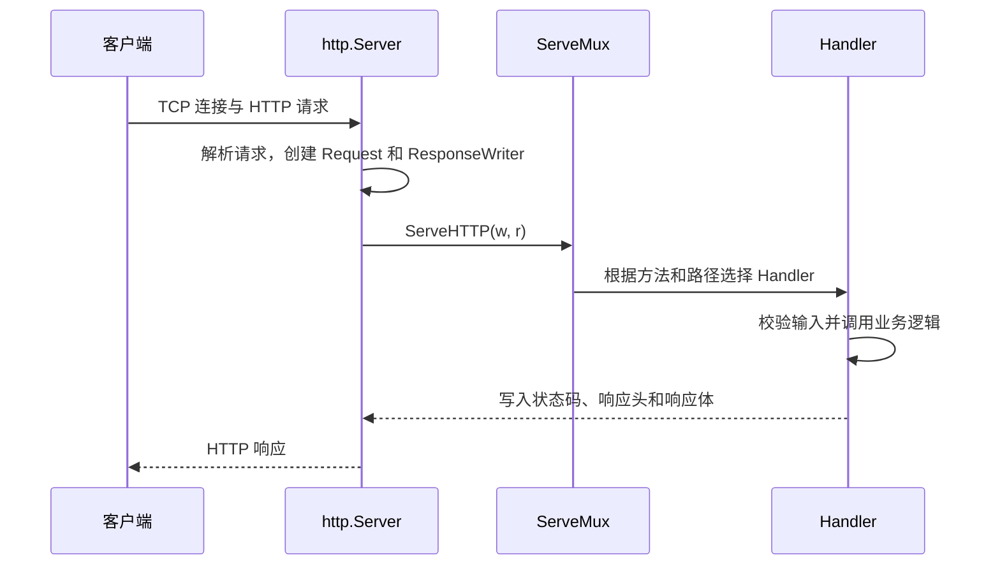

# 01. net/http：从第一个 Handler 到可停止的 HTTP 服务

## 前言

`net/http` 是 Go 标准库的 HTTP 实现：既能作为客户端发起请求，也能在服务端接收连接、解析 HTTP 报文并写回响应。应用代码通常不必处理 TCP 读写和报文格式，只需把业务逻辑组织成 `http.Handler`；路由、请求生命周期和响应提交则由标准库协同完成。

`net/http` 在 **Go 1.0** 正式发布时就已是标准库的一部分。它的接口很小，却足以构成大量 Web 框架的底座：框架可以增加路由、中间件和参数绑定，最终仍会把请求交给一个 `Handler`。这里所有公开 API 的行为和源码解读均以当前稳定版 **Go 1.26.5** 为准，源码位置为 `src/net/http/server.go`。

理解 HTTP 服务，关键不在于罗列 API，而在于看清一条请求的边界：**连接如何抵达 Handler，输入何时应被读取和校验，响应何时不可撤回，以及客户端离开或进程停止时如何结束工作。** 内容沿着这条链路，从最小服务逐步走到可安全停止的 JSON API。

## 先运行一个最小服务

一个 Handler 接收两个参数：`ResponseWriter` 负责响应，`*Request` 承载请求信息。

```go
package main

import (
	"fmt"
	"log"
	"net/http"
)

func hello(w http.ResponseWriter, r *http.Request) {
	// Header 必须在开始写响应前设置；这里明确告诉客户端正文是 UTF-8 文本。
	w.Header().Set("Content-Type", "text/plain; charset=utf-8")

	// 第一次写入正文时，若尚未调用 WriteHeader，net/http 会自动提交 200 OK。
	if _, err := fmt.Fprintln(w, "hello, net/http"); err != nil {
		// 客户端可能已断开；服务端只记录写入失败，不能再尝试写另一份错误响应。
		log.Printf("write response: %v", err)
	}
}

func main() {
	// HandleFunc 把普通函数适配为 http.Handler，并注册到默认路由器。
	http.HandleFunc("GET /hello", hello)

	// ListenAndServe 会一直阻塞，直到监听或服务发生错误。
	log.Fatal(http.ListenAndServe(":8080", nil))
}
```

运行 `go run main.go` 后，执行：

```bash
curl -i http://127.0.0.1:8080/hello
```

这里使用 `http.HandleFunc` 很方便，但它会修改全局的 `http.DefaultServeMux`。真实服务和测试更适合显式创建 `http.NewServeMux()`，把路由依赖放进一个独立对象。

## 一次请求到底经历了什么

HTTP 服务不需要为每个请求手写 TCP 读取和 HTTP 报文解析，这些都由 `http.Server` 完成。应用只在最后接到 `Handler` 调用。



同一个 Handler 可能同时服务多个请求。因此 Handler 结构体适合保存数据库连接池、配置、日志器等长期依赖，却不应把“当前用户”“当前任务”存到普通字段中。请求独有的数据应留在局部变量或 `r.Context()` 里；共享可变状态必须自己同步。

## Handler 与 ServeMux：让路由表表达接口

`http.Handler` 的定义非常小：

```go
type Handler interface {
	ServeHTTP(ResponseWriter, *Request)
}
```

普通函数之所以能直接注册，是因为标准库定义了函数适配器：

```go
// Go 1.26.5：src/net/http/server.go。
// 这是解释实现的源码片段，不是业务代码应依赖的内部约定。
type HandlerFunc func(ResponseWriter, *Request)

func (f HandlerFunc) ServeHTTP(w ResponseWriter, r *Request) {
	f(w, r) // 适配器没有额外魔法，只是调用这个函数。
}
```

Go 1.26.5 中，`ServeMux` 的模式可以写为：

```text
[METHOD ][HOST]/PATH
```

```go
mux := http.NewServeMux()

// GET 同时匹配 HEAD；方法判断由路由完成，Handler 无须重复书写。
mux.HandleFunc("GET /tasks", listTasks)

// {id} 匹配一个非空路径段；取到后仍然必须转换和校验。
mux.HandleFunc("GET /tasks/{id}", getTask)
```

访问 `GET /tasks/42` 时，可用 `r.PathValue("id")` 取到字符串 `"42"`。`ServeMux` 会按“更具体的模式优先”匹配：`GET /tasks/latest` 比 `GET /tasks/{id}` 更具体。路径存在但方法不匹配时，标准库会返回 `405 Method Not Allowed` 并设置 `Allow`；没有匹配路径时才是 `404 Not Found`。

这层路由负责“请求交给谁”，不负责“输入是否符合业务规则”。`{id}` 匹配成功并不代表它一定是数字，更不代表调用者有权限访问该任务。

## ResponseWriter：响应写出后就不能反悔

`ResponseWriter` 的三个常用方法有严格顺序：

1. `Header()` 修改响应头；
2. `WriteHeader(status)` 提交状态码和响应头；
3. `Write(body)` 写响应体；若尚未提交，会隐式提交 `200 OK`。

```go
func writeJSON(w http.ResponseWriter, status int, value any) {
	// 先设置头；Encode 会调用 Write，因此放在后面才有效。
	w.Header().Set("Content-Type", "application/json; charset=utf-8")
	w.WriteHeader(status)

	// 一旦 Encode 已写出部分字节，不能再把响应改成另一份 500 JSON。
	if err := json.NewEncoder(w).Encode(value); err != nil {
		log.Printf("encode JSON response: %v", err)
	}
}
```

标准库的 `response.WriteHeader` 会记录第一次最终状态码；第二次调用不会覆盖它，而是记一条“superfluous WriteHeader”日志。`Write` 在尚未提交时会先调用 `WriteHeader(StatusOK)`。这就是下面两种错误写法不可靠的原因：先 `Encode` 再写 `400`，或业务函数和外层错误处理器都各写一次响应。

服务端通常应先读取并校验所需的 `r.Body`，再开始响应。Go 1.26.5 的 `net/http` 文档也明确提醒：开始写响应后，后续读取请求体未必还能正常工作。

## 一个完整示例：任务 JSON API

下面的程序把路由、JSON 输入、响应、请求 Context、超时和优雅关闭放在同一条请求链里。保存为 `main.go` 后执行 `go run main.go`。

内存存储只是为了聚焦 HTTP 边界；替换成数据库仓储时，仍应让仓储方法接收同一个 `ctx`。

```go
package main

import (
	"context"
	"encoding/json"
	"errors"
	"io"
	"log"
	"net/http"
	"os"
	"os/signal"
	"strconv"
	"strings"
	"sync"
	"syscall"
	"time"
)

// task 是 API 返回的资源。json tag 将对外字段名固定为小写，
// 避免 Go 字段名意外成为接口协议。
type task struct {
	ID        int64  `json:"id"`
	Title     string `json:"title"`
	Completed bool   `json:"completed"`
}

// createTaskInput 只包含此接口允许客户端提交的字段。
// 不直接把内部数据模型用于解码，能避免客户端修改不该修改的字段。
type createTaskInput struct {
	Title string `json:"title"`
}

// taskStore 是跨请求共享的状态，所以用 mutex 保护 map 和自增 ID。
// 生产环境中可以把它替换为数据库仓储，Handler 的调用方式无需变化。
type taskStore struct {
	mu     sync.RWMutex
	nextID int64
	tasks  map[int64]task
}

func newTaskStore() *taskStore {
	return &taskStore{nextID: 1, tasks: make(map[int64]task)}
}

func (s *taskStore) create(ctx context.Context, title string) (task, error) {
	// 内存操作不会阻塞，但先检查 ctx 能让接口与真实 SQL/RPC 仓储保持一致。
	if err := ctx.Err(); err != nil {
		return task{}, err
	}

	s.mu.Lock()
	defer s.mu.Unlock()

	t := task{ID: s.nextID, Title: title}
	s.nextID++
	s.tasks[t.ID] = t
	return t, nil
}

func (s *taskStore) get(ctx context.Context, id int64) (task, bool, error) {
	if err := ctx.Err(); err != nil {
		return task{}, false, err
	}

	s.mu.RLock()
	defer s.mu.RUnlock()
	t, ok := s.tasks[id]
	return t, ok, nil
}

// api 只保存进程级依赖。不要把某次请求的输入或身份保存到这里。
type api struct {
	store *taskStore
}

func newHandler(store *taskStore) http.Handler {
	a := &api{store: store}
	mux := http.NewServeMux()

	// 把方法写进模式：ServeMux 能正确区分 404 和 405，并生成 Allow 响应头。
	mux.HandleFunc("GET /healthz", a.healthz)
	mux.HandleFunc("POST /tasks", a.createTask)
	mux.HandleFunc("GET /tasks/{id}", a.getTask)

	return mux
}

func (a *api) healthz(w http.ResponseWriter, r *http.Request) {
	writeJSON(w, http.StatusOK, map[string]string{"status": "ok"})
}

func (a *api) createTask(w http.ResponseWriter, r *http.Request) {
	input, ok := decodeCreateTask(w, r)
	if !ok {
		return // 解码函数已经写入对调用方可公开的 400 或 413 响应。
	}

	// r.Context 代表这一次 HTTP 请求；绝不能在这里替换成 context.Background()。
	t, err := a.store.create(r.Context(), input.Title)
	if err != nil {
		writeContextError(w, err)
		return
	}
	writeJSON(w, http.StatusCreated, t)
}

func (a *api) getTask(w http.ResponseWriter, r *http.Request) {
	// 路径参数只是字符串，必须验证为正整数后才能进入业务层。
	id, err := strconv.ParseInt(r.PathValue("id"), 10, 64)
	if err != nil || id <= 0 {
		writeError(w, http.StatusBadRequest, "task id must be a positive integer")
		return
	}

	t, found, err := a.store.get(r.Context(), id)
	if err != nil {
		writeContextError(w, err)
		return
	}
	if !found {
		writeError(w, http.StatusNotFound, "task not found")
		return
	}
	writeJSON(w, http.StatusOK, t)
}

func decodeCreateTask(w http.ResponseWriter, r *http.Request) (createTaskInput, bool) {
	// MaxBytesReader 在读取过程中限制 body，不能只相信客户端声明的 Content-Length。
	r.Body = http.MaxBytesReader(w, r.Body, 1<<20) // 最大 1 MiB；按接口合同调整。

	decoder := json.NewDecoder(r.Body)
	decoder.DisallowUnknownFields() // 将 {"titel":"..."} 这类拼写错误明确返回给调用方。

	var input createTaskInput
	if err := decoder.Decode(&input); err != nil {
		var tooLarge *http.MaxBytesError
		if errors.As(err, &tooLarge) {
			writeError(w, http.StatusRequestEntityTooLarge, "request body is too large")
		} else {
			writeError(w, http.StatusBadRequest, "invalid JSON body")
		}
		return createTaskInput{}, false
	}

	// Decode 一次成功不等于 body 里只有一个 JSON 值；拒绝尾随的第二段 JSON。
	if err := decoder.Decode(&struct{}{}); !errors.Is(err, io.EOF) {
		writeError(w, http.StatusBadRequest, "request body must contain one JSON value")
		return createTaskInput{}, false
	}

	input.Title = strings.TrimSpace(input.Title)
	if input.Title == "" {
		writeError(w, http.StatusBadRequest, "title is required")
		return createTaskInput{}, false
	}
	return input, true
}

func writeJSON(w http.ResponseWriter, status int, value any) {
	w.Header().Set("Content-Type", "application/json; charset=utf-8")
	w.WriteHeader(status) // 一定在 Encoder 写 body 之前提交状态码。
	if err := json.NewEncoder(w).Encode(value); err != nil {
		log.Printf("encode response: %v", err)
	}
}

func writeError(w http.ResponseWriter, status int, message string) {
	// 对外只返回稳定、可理解的错误；底层错误细节应写到服务端日志。
	writeJSON(w, status, map[string]string{"error": message})
}

func writeContextError(w http.ResponseWriter, err error) {
	switch {
	case errors.Is(err, context.Canceled):
		// 客户端通常已经离开，不需要再尝试写响应。
		return
	case errors.Is(err, context.DeadlineExceeded):
		writeError(w, http.StatusGatewayTimeout, "request timed out")
	default:
		log.Printf("request failed: %v", err)
		writeError(w, http.StatusInternalServerError, "internal server error")
	}
}

func main() {
	server := &http.Server{
		Addr:              ":8080",
		Handler:           newHandler(newTaskStore()),
		ReadHeaderTimeout: 5 * time.Second,  // 防止慢速请求头长期占用连接。
		ReadTimeout:       15 * time.Second, // 限制读取完整请求的时间；上传接口应单独设计。
		WriteTimeout:      15 * time.Second, // 限制向慢客户端写普通响应的时间。
		IdleTimeout:       60 * time.Second, // keep-alive 连接等待下一请求的最长时间。
		MaxHeaderBytes:    1 << 20,          // 限制请求头，防止异常大头部占用内存。
	}

	serverErr := make(chan error, 1)
	go func() {
		log.Printf("listening on http://127.0.0.1%s", server.Addr)
		serverErr <- server.ListenAndServe()
	}()

	// NotifyContext 将 Ctrl+C 和容器常见的 SIGTERM 转换为可等待的 Context。
	stopContext, stop := signal.NotifyContext(context.Background(), os.Interrupt, syscall.SIGTERM)
	defer stop()

	select {
	case err := <-serverErr:
		// 监听意外失败时直接报告；正常 Shutdown 会返回 ErrServerClosed。
		if !errors.Is(err, http.ErrServerClosed) {
			log.Fatalf("HTTP server failed: %v", err)
		}
		return
	case <-stopContext.Done():
		log.Println("shutdown signal received")
	}

	// Shutdown 停止接收新连接，并等待正在处理的请求到达这里给出的上限。
	shutdownContext, cancel := context.WithTimeout(context.Background(), 10*time.Second)
	defer cancel()
	if err := server.Shutdown(shutdownContext); err != nil {
		log.Printf("graceful shutdown: %v", err)
	}

	// ListenAndServe 因 Shutdown 返回 ErrServerClosed 是预期结果。
	if err := <-serverErr; !errors.Is(err, http.ErrServerClosed) {
		log.Printf("HTTP server stopped: %v", err)
	}
}
```

可以这样验证：

```bash
curl -i http://127.0.0.1:8080/healthz

curl -i -X POST http://127.0.0.1:8080/tasks \
  -H 'Content-Type: application/json' \
  -d '{"title":"阅读 net/http 源码"}'

curl -i http://127.0.0.1:8080/tasks/1
curl -i -X DELETE http://127.0.0.1:8080/tasks/1
```

最后一条请求会得到 `405`，因为路径匹配但没有注册 `DELETE` 方法。这正是把方法放进 `ServeMux` 模式的好处。

## Context、超时与 Shutdown 各解决什么

三者都与“停止”有关，却不是同一件事：

| 机制 | 解决的问题 | 典型位置 |
| --- | --- | --- |
| `r.Context()` | 这次请求是否已取消 | Handler 到数据库、RPC 的调用链 |
| `ReadHeaderTimeout` / `ReadTimeout` / `WriteTimeout` | 连接读写不能无限占用资源 | `http.Server` 配置 |
| `Server.Shutdown(ctx)` | 进程停止时不再接新请求，并等待存量请求 | `main` 的信号处理 |

服务端 Request Context 会在客户端连接关闭、HTTP/2 请求取消或 `ServeHTTP` 返回时被取消。业务函数应把它作为第一个参数继续传递：

```go
// 正确：客户端放弃时，数据库驱动或 RPC 客户端有机会停止工作。
task, err := repository.FindTask(r.Context(), id)

// 错误：丢掉请求的取消信号，服务已不需要结果时下游仍可能继续工作。
task, err := repository.FindTask(context.Background(), id)
```

某项业务需要更短预算时，可从请求 Context 派生，而不是重建根 Context：

```go
ctx, cancel := context.WithTimeout(r.Context(), 800*time.Millisecond)
defer cancel() // 释放派生 Context 关联的定时器资源。

stock, err := inventory.Get(ctx, productID)
```

`Shutdown` 不会替应用强行终止正在运行的 Handler；它先关闭监听器，再等待活跃连接转为可关闭状态，直到传入的 shutdown context 到期。正在执行的数据库、RPC 或自建 goroutine 仍要靠各自收到并尊重的 Context 离开。

## 源码视角：连接、响应与关闭如何收尾

以下片段根据 Go 1.26.5 标签的 `src/net/http/server.go` 摘取并省略无关分支，用于建立实现直觉，不是稳定 API。

`Server.Serve` 在接受连接后创建 `conn`，再让 goroutine 处理这条 HTTP/1.x 连接：

```go
// Go 1.26.5：省略临时 Accept 错误的退避逻辑。
for {
	rw, err := l.Accept() // 阻塞等待操作系统交付连接。
	if err != nil {
		return err
	}

	connCtx := ctx // 这里会成为此连接上请求 Context 的父级之一。
	c := srv.newConn(rw)
	c.setState(c.rwc, StateNew, runHooks)
	go c.serve(connCtx) // 不同连接可并发处理，所以共享依赖必须并发安全。
}
```

请求处理完成后，标准库调用 Handler、取消请求 Context，并完成响应收尾：

```go
// Go 1.26.5：conn.serve 中处理一条请求的关键顺序。
serverHandler{c.server}.ServeHTTP(w, w.req) // 调用业务 Handler。
w.cancelCtx()                               // Handler 返回后，此请求 Context 被取消。
w.finishRequest()                           // 刷新响应、处理连接后续状态。
```

这解释了两条规则：Handler 返回后不能再使用 `ResponseWriter` 或并发读取 `Request.Body`；需要异步处理时，应只复制必要数据，并另行定义它的取消、错误和持久化边界。

`Shutdown` 的关键动作也很克制：标记服务关闭、关闭监听器、循环关闭空闲连接并等待活跃连接结束：

```go
// Go 1.26.5：省略回调和轮询间隔的细节。
func (srv *Server) Shutdown(ctx context.Context) error {
	srv.inShutdown.Store(true)       // 新服务流程开始拒绝请求。
	srv.closeListenersLocked()       // 让 Accept 返回，停止接收新连接。

	for {
		if srv.closeIdleConns() { // 没有活跃连接时完成。
			return nil
		}
		select {
		case <-ctx.Done():
			return ctx.Err() // 超过进程愿意等待的时间。
		case <-timer.C:
		}
	}
}
```

源码路径能说明“谁做了什么”，但不能替代接口文档。应用应依赖 `Handler`、`Request.Context`、`Server` 和 `Shutdown` 的公开承诺，而不是依赖 `conn`、轮询间隔或内部字段。

## 最容易踩的边界

- 不要在每个 Handler 里创建或关闭数据库连接池；进程启动时初始化一次，并作为长期依赖注入。
- 不要把 `ResponseWriter` 交给后台 goroutine。`ServeHTTP` 返回后，它已不再有效。
- 不要在写出响应后再试图改变状态码或返回统一错误；先读完并校验输入，再开始响应。
- 不要把 `r.Context()` 换成 `context.Background()`；这样会切断客户端取消和请求截止时间。
- `WriteTimeout` 不适合直接套到 SSE、WebSocket、大文件下载等长连接场景；这些协议要单独设计心跳、写期限和资源上限。
- `Shutdown` 只能停止新流量并等待，不能自动让任意阻塞操作停止；下游调用需要支持 Context。

## 总结

`net/http` 的服务端核心可以记成四个对象：`Server` 接收连接，`ServeMux` 选择路由，`Request` 携带输入和请求生命周期，`ResponseWriter` 按“头—状态码—响应体”的顺序提交结果。

先用一个明确的 Handler 把请求跑通，再限制输入、传递 `r.Context()`、配置 Server 超时，最后用 `Shutdown` 收尾。理解这条链路后，无论使用标准库还是 Web 框架，都能知道请求实际在哪里进入、停止和返回。

## 参考资料

- [net/http 包文档（Go 1.26.5）](https://pkg.go.dev/net/http@go1.26.5)
- [Go 1 Release Notes：`http` 与 `httputil` 的历史重构](https://go.dev/doc/go1)
- [Go 1.26.5 `net/http/server.go`](https://cs.opensource.google/go/go/+/go1.26.5:src/net/http/server.go)
