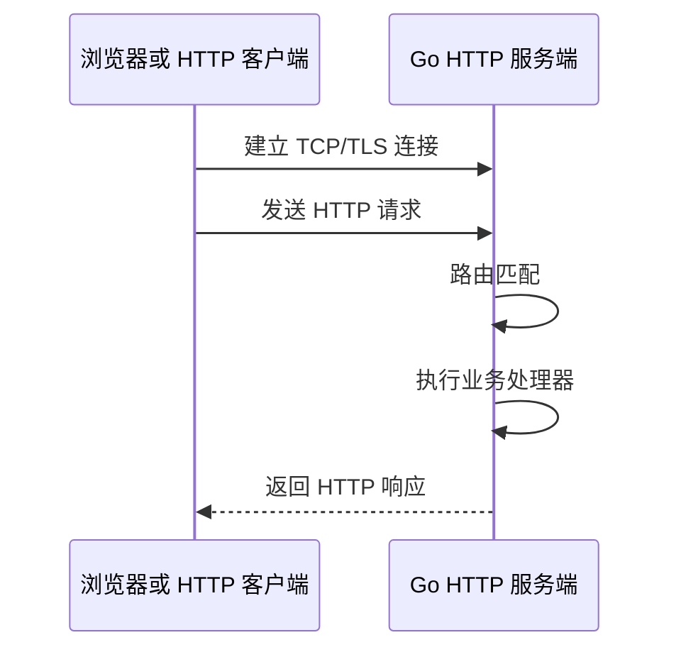
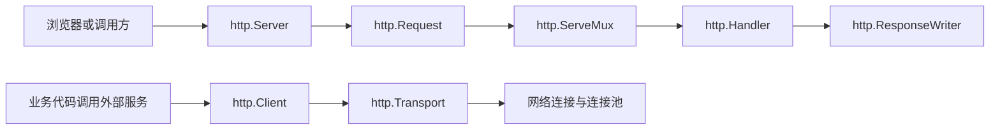

# 01. HTTP 编程

## 前言

HTTP 编程关注的是让程序通过 HTTP 协议接收请求、返回响应，或调用其他 HTTP 服务。Go 标准库的 `net/http` 同时提供服务端和客户端能力，是学习 Go Web 开发的基础。

`net/http` 在 **Go 1.0** 的标准库中就已经存在。Go 1.0 的迁移说明将旧导入路径 `http` 调整为今天使用的 `net/http`；因此，`http.Server`、`http.Client`、`http.Handler` 等核心模型并不是 Go 1.22 才出现的能力。

服务端、客户端、`Handler` 和传统路径路由等基础能力适用于较早的 Go 版本；部分较新的 API 有明确的最低版本要求：

| 功能 | 最低 Go 版本 | 常见使用场景 |
| --- | --- | --- |
| `net/http` 的服务端、客户端、`Handler`、`ServeMux` | Go 1.0 | HTTP 服务与客户端基础能力 |
| `Request.Context()` | Go 1.7 | 传递取消与超时 |
| `Server.Shutdown` | Go 1.8 | 优雅关闭服务 |
| `NewRequestWithContext` | Go 1.13 | 构造带取消信号的客户端请求 |
| `ReverseProxy.Rewrite`、`ProxyRequest` | Go 1.20 | 反向代理示例 |
| `ServeMux` 的方法模式、`{id}` 路径参数、`PathValue` | Go 1.22 | 路由示例 |

项目应以 `go.mod` 声明的 Go 版本为准。`"GET /users/{id}"`、`PathValue` 等方法路由和路径参数写法需要 Go 1.22；在更早版本中，可以通过传统路径模式、`r.Method` 和自行解析路径实现相同的业务需求。

Go 标准库中的 `net/http` 包同时提供了 HTTP 客户端和 HTTP 服务端的完整实现。使用它可以完成以下常见工作：

- 创建 HTTP 或 HTTPS 服务；
- 注册路由并处理动态请求；
- 提供 HTML、CSS、JavaScript、图片等静态资源；
- 接收查询参数、表单数据和 JSON 数据；
- 向其他 HTTP 服务发送 GET、POST 等请求；
- 配置连接池、超时、Cookie 和重定向策略；
- 实现反向代理和服务的优雅关闭。

大多数 Go Web 框架，例如 Gin、Echo 和 Chi，底层都建立在 `net/http` 提供的接口和服务器模型之上。因此，在学习 Web 框架之前，理解 `net/http` 的基本设计非常重要。

## 阅读结构

内容按“HTTP 服务如何从网络连接走到业务 Handler”的因果顺序展开；客户端、代理和关闭流程在服务端主链建立之后介绍。

| 部分 | 核心问题 | 关键对象 |
| --- | --- | --- |
| HTTP 基础与核心类型 | HTTP 请求有哪些输入输出，标准库提供哪些抽象 | `Request`、`ResponseWriter`、`Handler` |
| Handler 与路由 | 函数如何成为 Handler，路由如何注册和匹配 | `HandlerFunc`、`ServeMux` |
| Server 与连接处理 | 谁监听端口、接受连接并把请求交给 Handler | `Server`、`serverHandler`、`net.Listener` |
| 请求与响应 | Handler 如何读取 URL、Header、表单和 JSON，如何写响应 | `Request`、`ResponseWriter` |
| HTTP 客户端 | 如何发请求并复用连接 | `Client`、`Transport` |
| 生产服务能力 | 超时、优雅关闭、反向代理和安全边界 | `Server`、`Shutdown`、`ReverseProxy` |

服务端主链始终可以归结为：

~~~text
启动阶段：创建 Server、构造 Handler 链、注册 ServeMux 路由
请求阶段：Listener -> Server -> serverHandler -> Handler / ServeMux -> ResponseWriter
~~~

## HTTP 请求的基本过程

HTTP 是一种应用层协议。一次典型的 HTTP 通信过程如下：

1. 客户端根据域名查找服务器地址；
2. 客户端与服务器建立网络连接；
3. 如果使用 HTTPS，还需要进行 TLS 握手；
4. 客户端向服务器发送 HTTP 请求；
5. 服务器根据请求路径和请求方法找到对应的处理器；
6. 处理器执行业务逻辑并生成 HTTP 响应；
7. 客户端读取状态码、响应头和响应体；
8. HTTP/1.1 通常会复用底层连接，避免每次请求都重新建立连接。



HTTP 请求通常由以下部分组成：

- 请求方法，例如 `GET`、`POST`、`PUT`、`PATCH`、`DELETE`；
- 请求 URL；
- 请求头；
- 可选的请求体。

HTTP 响应通常由以下部分组成：

- 状态码，例如 `200`、`201`、`400`、`404`、`500`；
- 响应头；
- 可选的响应体。

HTTP 本身是一种无状态的应用层协议。服务端不会因为客户端上一次发送过请求，就自动记住客户端的状态；登录状态通常需要通过 Cookie、Session 或 Token 等机制实现。标准的 HTTP 请求方法。完整替换资源通常使用 `PUT`，部分修改资源通常使用 `PATCH`。

---

## `net/http` 的核心类型

学习 `net/http` 时，首先要理解下面几个核心类型。

| 类型                  | 作用                                   |
| --------------------- | -------------------------------------- |
| `http.Request`        | 表示客户端发送的 HTTP 请求             |
| `http.ResponseWriter` | 用于向客户端写入响应头、状态码和响应体 |
| `http.Handler`        | HTTP 请求处理器的核心接口              |
| `http.HandlerFunc`    | 将普通函数适配成 `http.Handler`        |
| `http.ServeMux`       | 标准库提供的 HTTP 路由器               |
| `http.Server`         | HTTP 服务端及其配置                    |
| `http.Client`         | HTTP 客户端及其配置                    |
| `http.Transport`      | 管理连接池、代理、TLS 和底层网络传输   |

这些类型不是彼此独立的 API，可以把它们分成两条链路理解：



- 左侧链路是**服务端**：`Server` 收到字节流并解析成 `Request`，`ServeMux` 找到 `Handler`，Handler 通过 `ResponseWriter` 返回结果。
- 右侧链路是**客户端**：`Client` 负责一次调用的重定向、Cookie、超时等策略，实际的连接创建、TLS、代理和空闲连接复用由 `Transport` 完成。

最容易混淆的是 `Request` 和 `ResponseWriter`：前者是本次请求的输入，后者是本次响应的输出。它们都只属于一次 Handler 调用；Handler 返回后不能再读取 `r.Body`，也不能继续使用 `w`。服务端源码中的接口注释明确要求 Handler 写完响应后返回，这个返回动作就是“本次请求处理结束”的信号。

其中最核心的是 `http.Handler` 接口：

```go
type Handler interface {
	ServeHTTP(ResponseWriter, *Request)
}
```

只要一个类型实现了下面的方法，它就可以作为 HTTP 请求处理器：

```go
ServeHTTP(http.ResponseWriter, *http.Request)
```

两个参数分别表示：

- `http.ResponseWriter`：用于构造并发送 HTTP 响应；
- `*http.Request`：包含请求方法、URL、请求头、请求体和客户端地址等信息。

---

## 创建基本 HTTP 服务

一个基本的 HTTP 服务通常需要完成三个任务：

1. 注册处理动态请求的处理器；
2. 注册静态资源处理器；
3. 监听端口并接受客户端连接。

假设项目结构如下：

```text
http-demo/
├── main.go
└── static/
    ├── style.css
    ├── app.js
    └── logo.png
```

完整的基础服务端代码如下：

```go
package main

import (
	"fmt"
	"log"
	"net/http"
	"time"
)

func main() {
	// 创建一个独立的路由器。
	//
	// 与直接使用 http.HandleFunc 相比，显式创建 ServeMux
	// 可以避免所有路由都注册到全局的 DefaultServeMux 中，
	// 更适合真实项目和单元测试。
	mux := http.NewServeMux()

	// 这里使用 Go 1.0 起就支持的传统路径模式。
	// 为了让 / 只处理网站根路径，homeHandler 内还会检查路径和方法。
	mux.HandleFunc("/", homeHandler)

	// 创建静态文件处理器。
	//
	// http.Dir("./static") 表示从当前项目的 static 目录中读取文件。
	fileServer := http.FileServer(http.Dir("./static"))

	// 浏览器请求：
	//     /static/style.css
	//
	// StripPrefix 会先删除 URL 中的 "/static/"，
	// FileServer 最终读取的文件路径为：
	//     ./static/style.css
	mux.Handle("/static/", http.StripPrefix("/static/", fileServer))

	// 自定义 HTTP Server。
	//
	// 相比直接调用 http.ListenAndServe，
	// 显式创建 Server 可以配置各种超时和请求头大小限制。
	server := &http.Server{
		Addr:    ":8080",
		Handler: mux,

		// 读取请求头最多允许 5 秒。
		// 这是公网 HTTP 服务非常重要的安全配置。
		ReadHeaderTimeout: 5 * time.Second,

		// 读取完整请求的最大时间。
		ReadTimeout: 10 * time.Second,

		// 写入响应的最大时间。
		WriteTimeout: 10 * time.Second,

		// Keep-Alive 连接空闲时最多保留 60 秒。
		IdleTimeout: 60 * time.Second,

		// 请求头最大为 1 MiB。
		MaxHeaderBytes: 1 << 20,
	}

	log.Printf("HTTP 服务已启动：http://127.0.0.1%s", server.Addr)

	// ListenAndServe 会阻塞当前 goroutine，
	// 持续监听并处理客户端连接。
	//
	// 它正常停止时也会返回一个非 nil 错误，
	// 优雅关闭时需要单独判断 http.ErrServerClosed。
	if err := server.ListenAndServe(); err != nil {
		log.Fatal(err)
	}
}

// homeHandler 处理网站根路径。
func homeHandler(w http.ResponseWriter, r *http.Request) {
	// 传统的 "/" 模式会匹配所有未被更具体路由接住的路径。
	if r.URL.Path != "/" {
		http.NotFound(w, r)
		return
	}
	if r.Method != http.MethodGet {
		http.Error(w, "method not allowed", http.StatusMethodNotAllowed)
		return
	}

	// 响应头必须在 WriteHeader 或 Write 之前设置。
	w.Header().Set("Content-Type", "text/plain; charset=utf-8")

	// 如果没有显式调用 WriteHeader，
	// 第一次调用 Write 或 Fprint 时会自动发送 200 OK。
	_, err := fmt.Fprintln(w, "Welcome to my website!")
	if err != nil {
		log.Printf("写入响应失败：%v", err)
	}
}
```

运行程序：

```bash
go run .
```

访问动态页面：

```text
http://127.0.0.1:8080/
```

访问静态文件：

```text
http://127.0.0.1:8080/static/style.css
```

`http.FileServer` 会把指定文件系统中的内容作为 HTTP 资源提供；`http.StripPrefix` 则会在调用文件处理器之前删除 URL 中指定的前缀。

本地示例使用 `8080` 而不是 `80` 端口，主要有两个原因：

- 在部分操作系统中，监听 `80` 端口可能需要管理员权限；
- `8080` 更适合本地开发，不容易与已有 Web 服务冲突。

---

## `Handler`、`HandlerFunc` 与路由

### 1. 自定义 `Handler`

可以定义一个结构体，并为它实现 `ServeHTTP` 方法：

```go
package main

import (
	"fmt"
	"log"
	"net/http"
)

// MyHandler 实现了 http.Handler 接口。
type MyHandler struct {
	Message string
}

// ServeHTTP 用于处理每一个匹配到该处理器的请求。
func (h *MyHandler) ServeHTTP(w http.ResponseWriter, r *http.Request) {
	w.Header().Set("Content-Type", "text/plain; charset=utf-8")

	_, err := fmt.Fprintf(
		w,
		"请求路径：%s\n返回消息：%s\n",
		r.URL.Path,
		h.Message,
	)
	if err != nil {
		log.Printf("写入响应失败：%v", err)
	}
}

func main() {
	mux := http.NewServeMux()

	// http.Handle 或 mux.Handle 接收的是 http.Handler。
	mux.Handle("/index", &MyHandler{
		Message: "这是自定义 Handler",
	})

	log.Fatal(http.ListenAndServe(":8080", mux))
}
```

这种方式适合处理器需要保存依赖或状态的情况，例如：

- 数据库连接；
- 日志组件；
- 配置对象；
- 缓存客户端；
- 业务服务对象。

例如：

```go
type UserHandler struct {
	userService *UserService
	logger      *log.Logger
}
```

### 2. 使用 `HandlerFunc`

如果处理器不需要保存复杂状态，每次都定义结构体会显得繁琐。此时可以直接使用函数：

```go
func indexHandler(w http.ResponseWriter, r *http.Request) {
	_, _ = fmt.Fprintln(w, "index")
}

func main() {
	mux := http.NewServeMux()

	// HandleFunc 可以直接接收普通处理函数。
	mux.HandleFunc("/index", indexHandler)

	log.Fatal(http.ListenAndServe(":8080", mux))
}
```

`http.HandlerFunc` 本质上是一个适配器类型。下面是 Go 1.26.5 标准库 [`server.go`](https://cs.opensource.google/go/go/+/go1.26.5:src/net/http/server.go;l=2282) 中的原始实现：

```go
type HandlerFunc func(http.ResponseWriter, *http.Request)

// ServeHTTP 只是把接口调用转回原来的函数调用。
func (f HandlerFunc) ServeHTTP(w http.ResponseWriter, r *http.Request) {
	f(w, r)
}
```

这段源码说明 `HandlerFunc` 没有隐藏的调度逻辑：它只是给函数类型补上 `ServeHTTP` 方法，从而满足 `http.Handler` 接口。`mux.HandleFunc("/index", indexHandler)` 注册路由时，标准库会把 `indexHandler` 转成 `HandlerFunc(indexHandler)`；请求到来后，最终仍是直接调用这个普通函数。

### 3. 默认路由 `DefaultServeMux`

下面的代码没有显式创建路由器：

~~~go
http.HandleFunc("/index", indexHandler)
log.Fatal(http.ListenAndServe(":8080", nil))
~~~

它仍然能完成路由分发，是因为 `net/http` 包维护了一个进程级共享的默认路由器：`http.DefaultServeMux`。这里有两件需要区分的事：

1. `http.HandleFunc` 是包级注册函数，它把路由注册到全局的 `DefaultServeMux`；
2. `ListenAndServe` 的第二个参数是 `nil` 时，`http.Server` 会在**处理请求时**回退到 `DefaultServeMux`。

#### `DefaultServeMux` 是一个全局 `ServeMux`

Go 1.26.5 的 `net/http/server.go` 中定义：

~~~go
// DefaultServeMux is the default ServeMux used by Serve.
var DefaultServeMux = &defaultServeMux

var defaultServeMux ServeMux
~~~

`defaultServeMux` 是一个实际的 `ServeMux` 结构体；`DefaultServeMux` 则是指向它的全局指针。它不是另一种路由算法，也不是 HTTP Server 为每个请求临时创建的对象，而是整个进程共享的一张路由表。

~~~text
net/http 的包级全局状态

defaultServeMux   一个 ServeMux 结构体，保存路由规则
       ↑
DefaultServeMux   指向它的 *ServeMux
       ↑
http.Handle / http.HandleFunc
~~~

#### 包级 `http.HandleFunc` 如何写入默认路由器

包级 `http.HandleFunc` 并不自己保存路由。Go 1.26.5 的实现为：

~~~go
func HandleFunc(pattern string, handler func(ResponseWriter, *Request)) {
	if use121 {
		DefaultServeMux.mux121.handleFunc(pattern, handler)
	} else {
		DefaultServeMux.register(pattern, HandlerFunc(handler))
	}
}
~~~

`use121` 是 Go 1.21 路由兼容模式的开关，后文会说明它如何选择新旧路由实现。无论走哪个分支，包级函数的注册目标始终是 `DefaultServeMux`。忽略兼容分支后，上述代码可以理解为：

~~~go
DefaultServeMux.register("/index", HandlerFunc(indexHandler))
~~~

其中 `HandlerFunc` 把普通函数适配为 `http.Handler`。因此，下面两种写法在注册目标上等价：

~~~go
http.HandleFunc("/index", indexHandler)

http.DefaultServeMux.HandleFunc("/index", indexHandler)
~~~

第一种只是省略了全局对象名称。

#### `nil` 在何时回退到 `DefaultServeMux`

`http.ListenAndServe` 的实现只是创建 `http.Server` 并调用同名方法：

~~~go
func ListenAndServe(addr string, handler Handler) error {
	server := &Server{Addr: addr, Handler: handler}
	return server.ListenAndServe()
}
~~~

所以：

~~~go
http.ListenAndServe(":8080", nil)
~~~

等价于：

~~~go
server := &http.Server{
	Addr:    ":8080",
	Handler: nil,
}

server.ListenAndServe()
~~~

这一步只保存 `Handler: nil`，尚未选择路由器。真正的回退发生在 Server 已接收并解析请求之后。标准库内部的 `serverHandler` 从 `Server.Handler` 取出应用 Handler；若该字段为 `nil`，才选择 `DefaultServeMux`：

~~~go
func (sh serverHandler) ServeHTTP(rw ResponseWriter, req *Request) {
	handler := sh.srv.Handler
	if handler == nil {
		handler = DefaultServeMux
	}

	// 实际源码还会单独处理 OPTIONS * 这一特殊协议请求。
	handler.ServeHTTP(rw, req)
}
~~~

完整分发过程如下：

~~~mermaid
flowchart TD
    A[http.HandleFunc 注册 /index] --> B[DefaultServeMux 保存 HandlerFunc]
    C[http.ListenAndServe :8080, nil] --> D[http.Server Handler 为 nil]
    E[客户端请求 GET /index] --> F[serverHandler.ServeHTTP]
    D --> F
    F --> G{Server.Handler 是否为 nil}
    G -->|是| H[DefaultServeMux.ServeHTTP]
    G -->|否| I[显式 Handler.ServeHTTP]
    H --> J[匹配 /index]
    J --> K[indexHandler]
~~~

因此，`nil` 的含义不是“不处理请求”，而是“当前 Server 没有显式指定 Handler，使用全局默认路由器”。

#### 显式 `ServeMux` 与默认 `ServeMux`

真实项目通常优先显式创建路由器：

~~~go
mux := http.NewServeMux()
mux.HandleFunc("/index", indexHandler)

log.Fatal(http.ListenAndServe(":8080", mux))
~~~

此时 `serverHandler` 发现 `Server.Handler` 非 `nil`，会直接调用 `mux.ServeHTTP`，不会触及 `DefaultServeMux`。

| 写法 | 路由注册目标 | Server 最终使用的 Handler |
| --- | --- | --- |
| `http.HandleFunc` + `ListenAndServe(..., nil)` | 全局 `DefaultServeMux` | `DefaultServeMux` |
| `mux.HandleFunc` + `ListenAndServe(..., mux)` | 显式创建的 `mux` | `mux` |
| `http.Server{Handler: handler}` | 由应用决定 | 显式传入的 `handler` |

显式 `ServeMux` 避免了全局路由互相影响，更容易编写测试、创建多个独立 HTTP 服务，并清楚表达服务依赖边界。

---

## 使用 `ServeMux` 定义路由

从 Go 1.22 开始，标准库的 `ServeMux` 支持：

- 根据 HTTP 请求方法匹配；
- 路径通配符；
- 通过 `Request.PathValue` 获取路径参数。

例如：

```go
package main

import (
	"fmt"
	"log"
	"net/http"
)

func main() {
	mux := http.NewServeMux()

	// 只处理 GET /users。
	mux.HandleFunc("GET /users", listUsersHandler)

	// 只处理 POST /users。
	mux.HandleFunc("POST /users", createUserHandler)

	// {id} 是路径参数。
	// 例如：GET /users/1001
	mux.HandleFunc("GET /users/{id}", getUserHandler)

	log.Fatal(http.ListenAndServe(":8080", mux))
}

func listUsersHandler(w http.ResponseWriter, r *http.Request) {
	_, _ = fmt.Fprintln(w, "用户列表")
}

func createUserHandler(w http.ResponseWriter, r *http.Request) {
	w.WriteHeader(http.StatusCreated)
	_, _ = fmt.Fprintln(w, "用户创建成功")
}

func getUserHandler(w http.ResponseWriter, r *http.Request) {
	// 获取路由中的 {id}。
	id := r.PathValue("id")

	_, _ = fmt.Fprintf(w, "查询用户：%s\n", id)
}
```

使用方法路由后，不需要在每个处理器中重复编写：

```go
if r.Method != http.MethodGet {
	http.Error(
		w,
		"method not allowed",
		http.StatusMethodNotAllowed,
	)
	return
}
```

当路径匹配但请求方法不匹配时，`ServeMux` 可以自动返回 `405 Method Not Allowed`，并在 `Allow` 响应头中指出支持的方法。

需要注意，路由模式中的 `GET` 同时可以匹配 `HEAD` 请求；其他请求方法则进行精确匹配。Go 1.21 或更早版本不能使用方法模式和 `{id}` 路径参数，需要在处理器内部手动检查 `r.Method` 并解析路径。

### 从 `ServeMux` 源码理解“注册”和“分发”是两件事

`ServeMux` 同时承担两个职责，但发生在不同阶段：程序启动时保存路由；每个请求到来时查找路由并调用 Handler。把这两个阶段分开，是理解标准库 HTTP 编程的关键。

~~~text
启动阶段：NewServeMux -> Handle / HandleFunc -> 解析并保存 pattern

请求阶段：Server 收到请求 -> ServeMux.ServeHTTP -> 查找 Handler -> Handler.ServeHTTP
~~~

注册期与请求期操作的是同一个 `ServeMux`，但方向相反：前者把 pattern 写入路由表，后者从路由表取出 Handler。下面的图把两条路径并列展示：

~~~mermaid
flowchart LR
    subgraph Register[启动期：注册路由]
        A[Handle / HandleFunc] --> B[HandlerFunc 适配]
        B --> C[registerErr 解析并检查冲突]
        C --> D[tree.addPattern]
        C --> E[index.addPattern]
    end

    subgraph Dispatch[请求期：分发请求]
        F[Server 收到 Request] --> G[ServeMux.ServeHTTP]
        G --> H[findHandler 查询 tree]
        H --> I[得到 Handler 与路径参数]
        I --> J[Handler.ServeHTTP]
    end

    D -.保存路由和 Handler.-> H
~~~

下面的源码片段以 Go 1.26.5 的 `net/http` 为准。不同小版本的私有字段和辅助函数可能调整，但 `Handler`、`ServeMux`、`Server` 组成的公开模型保持稳定。

#### `NewServeMux` 创建的是什么

`NewServeMux` 不会监听端口，也不会启动 goroutine；它只创建一个项目私有的路由器。Go 1.26.5 的核心结构如下：

```go
type ServeMux struct {
	mu sync.RWMutex
	// 注册路由时使用写锁，请求匹配时使用读锁。

	tree routingNode
	// Go 1.22+ 路由规则使用的匹配树。

	index routingIndex
	// 检查 pattern 冲突时使用的索引。

	mux121 serveMux121
	// 仅在启用 Go 1.21 兼容模式时使用的旧路由表。
}

func NewServeMux() *ServeMux {
	return &ServeMux{}
}
```

因此，下面两行是两个层面的操作：

```go
mux := http.NewServeMux()       // 内存中创建路由表
server := &http.Server{Handler: mux} // 指定收到请求后使用该路由表
```

直到 `server.ListenAndServe()` 调用 `net.Listen`，程序才真正开始监听网络端口。

#### `Handle` 与 `HandleFunc`：第二个参数为何不同

`ServeMux` 的两个注册方法，第一个参数都是 pattern，差异只在第二个参数：

```go
func (mux *ServeMux) Handle(pattern string, handler Handler)
func (mux *ServeMux) HandleFunc(pattern string, handler func(ResponseWriter, *Request))
```

| 调用形式 | 接收的对象 | 适用场景 |
| --- | --- | --- |
| `mux.Handle` | 已实现 `http.Handler` 的对象 | 自定义 Handler、文件服务、中间件包装后的处理器 |
| `mux.HandleFunc` | 普通函数 `func(http.ResponseWriter, *http.Request)` | 直接注册函数或 Controller 方法值 |

Go 1.26.5 的实现表明，它们最终都会走统一的注册入口：

```go
func (mux *ServeMux) Handle(pattern string, handler Handler) {
	if use121 {
		mux.mux121.handle(pattern, handler)
		return
	}
	mux.register(pattern, handler)
}

func (mux *ServeMux) HandleFunc(pattern string, handler func(ResponseWriter, *Request)) {
	if use121 {
		mux.mux121.handleFunc(pattern, handler)
		return
	}
	mux.register(pattern, HandlerFunc(handler))
	// 这里把普通函数适配成实现了 Handler 的 HandlerFunc。
}
```

例如，直接处理函数适合 `HandleFunc`：

```go
mux.HandleFunc("GET /users/{id}", getUserHandler)
```

认证中间件的返回值已经是 `http.Handler`，所以应使用 `Handle`：

```go
protected := authenticate(getUserHandler)
// protected 的类型是 http.Handler。
mux.Handle("GET /users/{id}", protected)
```

这里的 `HandlerFunc` 与前文的函数适配器正好连起来：`HandleFunc` 不是另一套路由机制，只是替开发者完成了 `HandlerFunc(handler)` 这一步。

包级 `http.Handle`、`http.HandleFunc` 的逻辑相同，只是注册目标固定为全局对象：

```go
func HandleFunc(pattern string, handler func(ResponseWriter, *Request)) {
	DefaultServeMux.register(pattern, HandlerFunc(handler))
}
```

实际源码同样保留 `use121` 分支；省略它后可以清楚看出本质：包级函数等价于 `http.DefaultServeMux.HandleFunc(...)`。显式创建 `mux := http.NewServeMux()` 则把路由表限制在当前服务实例内。

#### 注册时做什么：解析、冲突检查、写入路由表

新路由规则下，`Handle` 与 `HandleFunc` 都会进入：

```go
func (mux *ServeMux) register(pattern string, handler Handler) {
	if err := mux.registerErr(pattern, handler); err != nil {
		panic(err)
	}
}
```

`registerErr` 会解析 Method、Host、路径段和通配符，检查 `nil` Handler、非法 pattern 与歧义冲突；校验通过后才写入 `tree` 和 `index`。完整过程可以概括为：

```text
mux.HandleFunc("GET /users/{id}", getUserHandler)
        ↓
HandlerFunc(getUserHandler)       将普通函数变成 Handler
        ↓
registerErr                        解析 "GET"、"/users"、"{id}"
        ↓
index.possiblyConflictingPatterns  找到可能冲突的旧 pattern 并精确检查
        ↓
tree.addPattern                    写入请求匹配树和 Handler
        ↓
index.addPattern                   为后续路由注册建立冲突检查索引
```

Go 1.22+ 的 `ServeMux` 在**注册路由时**检查冲突，因此错误通常会在服务启动阶段以 `panic` 暴露，而不是等到某个请求到来才随机选择 Handler。匹配规则是“更具体的 pattern 优先”：

- `GET /posts/latest` 比 `GET /posts/{id}` 更具体；
- `GET /posts/{id}` 比 `/posts/{id}` 更具体，因为它额外限制了请求方法；
- 两个 pattern 有重叠但谁都不比谁更具体时，不能同时注册。

这也是标准库路由与某些“后注册覆盖先注册”路由器的重要区别：不要依赖注册顺序覆盖已有路由。

#### **tree**：请求匹配时使用的决策树

**tree** 的类型是 **routingNode**。它不是简单的 Go map：每一条 pattern 会被解析为 Method、Host 和多个路径段，再依次写入树节点。节点既可以是中间分支，也可以是保存 pattern 和 Handler 的叶子：

~~~go
type routingNode struct {
	pattern *pattern
	handler Handler
	// 只有叶子节点保存完整 pattern 与注册时的 Handler。

	children   mapping[string, *routingNode]
	// 字面量分支，例如 "GET"、"users"、"latest"。

	emptyChild *routingNode
	// 单段通配符分支，例如 {id}。

	multiChild *routingNode
	// 多段通配符分支，例如 {path...}。
}
~~~

注册 GET /users/{id} 后，标准库先得到：

~~~text
method:   "GET"
host:     ""
segments: ["users"（字面量）, "id"（单段通配符）]
~~~

**tree.addPattern** 按 **Host → Method → Path Segment** 写入。省略无关节点后，树是：

~~~text
tree 根节点
└── host: ""
    └── method: "GET"
        └── "users"
            └── emptyChild       // {id}
                └── leaf
                    ├── pattern: GET /users/{id}
                    └── handler: HandlerFunc(getUserHandler)
~~~

请求 GET /users/1001 依次匹配空 Host、GET、users；最后的 1001 进入 emptyChild，同时被收集为通配符值。随后 ServeMux.ServeHTTP 将该值写入 Request 的内部匹配信息，所以 r.PathValue("id") 才会返回 "1001"。

匹配一个路径段时，标准库依次尝试：字面量分支、单段通配符分支、多段通配符分支。这正好实现“更具体优先”。同时注册 GET /users/me 与 GET /users/{id} 时，"me" 保存为字面量 child，{id} 保存为 emptyChild；请求 /users/me 会先命中前者。

#### **children**：小集合用 slice，大集合再转换为 map

字面量子节点的 **children** 并不永远直接使用 Go map。它的类型是标准库内部泛型 **mapping[string, *routingNode]**：

~~~go
type mapping[K comparable, V any] struct {
	s []entry[K, V] // 键较少时顺序存储和查找
	m map[K]V       // 键较多时哈希查找
}

var maxSlice = 8
~~~

子节点不超过 8 个时，mapping.add 追加 slice，mapping.find 顺序查找；加入第 9 个键时，已有 slice 会转换为 map。路由树的大量节点只有少数几个分支，例如 API 根节点下可能只有 users、posts 和 health。这种情况下 slice 避免单独分配 map；分支较多时再转换为 map，降低查找成本。这是小型和大型路由表共用同一实现的自适应优化。

#### **index**：注册时使用的冲突检查索引

**index** 不参与请求匹配，也不保存 Handler。它的作用是：注册新 pattern 时，快速找出可能冲突的旧 pattern，避免每次都扫描全部路由。

~~~go
type routingIndex struct {
	segments map[routingIndexKey][]*pattern
	multis   []*pattern
}

type routingIndexKey struct {
	pos int    // 路径段下标，从 0 开始
	s   string // 字面量；空字符串表示单段通配符
}
~~~

GET /users/{id} 会产生：

~~~text
{pos: 0, s: "users"} -> [GET /users/{id}]
{pos: 1, s: ""}      -> [GET /users/{id}]  // {id}
~~~

之后注册 GET /users/me 时，index 可以从第 0 段 "users" 找到候选，再由 conflictsWith 做精确判断。/users/me 比 /users/{id} 更具体，所以允许共存。以多段通配符结尾的 pattern，例如 /files/{path...}，放进 multis：它可能覆盖的范围很大，不能安全地用单个路径段排除冲突。

因此，两套结构的职责严格分开：

| 结构 | 保存内容 | 使用时机 | 是否保存 Handler |
| --- | --- | --- | --- |
| tree | Host、Method、路径段形成的决策树 | 每个请求到来时 | 是，叶子节点保存 |
| index | 路径段位置到 pattern 候选集合的索引 | 每次注册路由时 | 否，只保存 pattern 指针 |

#### `use121`：为什么所有方法都有新旧分支

Go 1.22 修改了 `ServeMux` 的 pattern 语法和匹配规则。为了让旧程序可临时保持 Go 1.21 行为，标准库保留了旧实现 `servemux121.go`。其中的开关在 `net/http` 包初始化时一次性确定：

```go
var httpmuxgo121 = godebug.New("httpmuxgo121")
var use121 bool

func init() {
	if httpmuxgo121.Value() == "1" {
		use121 = true
		httpmuxgo121.IncNonDefault()
	}
}
```

`httpmuxgo121.Value()` 读取的是 GODEBUG 设置。最常见的兼容启动方式是：

```bash
GODEBUG=httpmuxgo121=1 go run .
```

开关选择过程如下：

```text
go.mod 的 Go 版本、godebug / //go:debug 指令生成默认设置
                         ↓
环境变量 GODEBUG 可显式覆盖默认设置
                         ↓
net/http 包的 init 读取 httpmuxgo121.Value() 一次
                         ↓
          "1" -> use121=true  -> 使用 Go 1.21 兼容路由表 mux121
          其他 -> use121=false -> 使用 Go 1.22+ 路由树 tree/index
```

它不是“调用 `Handle` 时再判断一次环境变量”的动态配置。`init` 已经把结果保存为 `use121`，所以注册和匹配必然使用同一套数据结构；运行中再调用 `os.Setenv` 不会切换实现。使用 `"GET /users/{id}"`、`r.PathValue("id")` 的项目应保持新实现，即不设置 `httpmuxgo121=1`。

#### 请求到来后：`Handler` 只查找，`ServeHTTP` 查找后执行

`ServeMux.Handler` 用于查找但不执行：

```go
func (mux *ServeMux) Handler(r *Request) (h Handler, pattern string) {
	if use121 {
		return mux.mux121.findHandler(r)
	}
	h, p, _, _ := mux.findHandler(r)
	return h, p
}
```

它刻意不修改 `r`，因此不会填充命名路径变量；调用它之后，`r.PathValue("id")` 仍然是空字符串。

HTTP Server 实际调用的是 `ServeMux.ServeHTTP`。省略 `RequestURI == "*"` 的特殊请求处理后，Go 1.26.5 的核心逻辑为：

```go
func (mux *ServeMux) ServeHTTP(w ResponseWriter, r *Request) {
	var h Handler
	if use121 {
		h, _ = mux.mux121.findHandler(r)
	} else {
		h, r.Pattern, r.pat, r.matches = mux.findHandler(r)
		// 保存匹配的 pattern 与路径变量，供 PathValue 使用。
	}
	h.ServeHTTP(w, r)
}
```

这段代码展示了路由器最终的职责边界：`findHandler` 负责按 Method、Host、路径选择 Handler；`ServeHTTP` 再把请求交给它。对 `GET /users/1001`，路径参数在调用 `getUserHandler` 前已经被保存，所以 Handler 内的 `r.PathValue("id")` 才会得到 `"1001"`。

```text
请求：GET /users/1001
        ↓
ServeMux.findHandler
        ↓
HandlerFunc(getUserHandler) + id="1001"
        ↓
getUserHandler.ServeHTTP
        ↓
getUserHandler(w, r) 内调用 r.PathValue("id")
```

当路径存在但方法不匹配时，`findHandler` 会选择标准库的 `405 Method Not Allowed` Handler，并生成 `Allow` 头；没有任何路径匹配时则选择 `404 Not Found` Handler。这些结果同样会作为普通 `Handler` 被 `ServeHTTP` 调用。

---

## 读取请求数据

`http.Request` 保存了客户端请求的主要信息，例如：

```go
r.Method      // 请求方法
r.URL         // 请求 URL
r.Header      // 请求头
r.Body        // 请求体
r.Host        // 客户端请求的 Host
r.RemoteAddr  // 直接与服务器建立连接的网络地址
r.Context()   // 请求上下文
```

### 1. 读取查询参数

假设客户端请求：

```text
GET /search?keyword=golang&page=2
```

服务端可以通过 `r.URL.Query()` 读取参数：

```go
func searchHandler(w http.ResponseWriter, r *http.Request) {
	// Query 返回 url.Values。
	query := r.URL.Query()

	keyword := query.Get("keyword")
	page := query.Get("page")

	if keyword == "" {
		http.Error(
			w,
			"缺少 keyword 参数",
			http.StatusBadRequest,
		)
		return
	}

	_, _ = fmt.Fprintf(
		w,
		"keyword=%s, page=%s\n",
		keyword,
		page,
	)
}
```

`Get` 只返回同名参数中的第一个值。如果需要读取全部值，可以直接访问：

```go
tags := r.URL.Query()["tag"]
```

例如：

```text
/search?tag=go&tag=http
```

得到：

```go
[]string{"go", "http"}
```

### 2. 读取请求头

```go
func headerHandler(w http.ResponseWriter, r *http.Request) {
	authorization := r.Header.Get("Authorization")
	userAgent := r.Header.Get("User-Agent")
	contentType := r.Header.Get("Content-Type")

	log.Printf("Authorization: %s", authorization)
	log.Printf("User-Agent: %s", userAgent)
	log.Printf("Content-Type: %s", contentType)

	w.WriteHeader(http.StatusNoContent)
}
```

HTTP 请求头名称不区分大小写：

```go
r.Header.Get("Content-Type")
r.Header.Get("content-type")
```

这两种写法读取的是同一个请求头。不过 Go 代码通常使用规范化形式：

```go
Content-Type
Authorization
User-Agent
```

---

## 接收表单数据

HTML 表单常用的编码格式是：

```text
application/x-www-form-urlencoded
```

客户端可以使用 `http.PostForm` 发送表单：

```go
package main

import (
	"fmt"
	"io"
	"log"
	"net/http"
	"net/url"
)

func main() {
	// url.Values 用于构造表单字段。
	form := url.Values{}
	form.Set("name", "张三")
	form.Set("email", "zhangsan@example.com")

	resp, err := http.PostForm(
		"http://127.0.0.1:8080/form",
		form,
	)
	if err != nil {
		log.Fatalf("发送表单失败：%v", err)
	}
	defer resp.Body.Close()

	body, err := io.ReadAll(resp.Body)
	if err != nil {
		log.Fatalf("读取响应失败：%v", err)
	}

	fmt.Println("状态码：", resp.StatusCode)
	fmt.Println("响应内容：", string(body))
}
```

服务端处理代码：

```go
func formHandler(w http.ResponseWriter, r *http.Request) {
	// 限制请求体最大为 1 MiB。
	// 防止恶意客户端发送体积过大的请求体。
	r.Body = http.MaxBytesReader(w, r.Body, 1<<20)

	// ParseForm 解析：
	// 1. URL 查询参数；
	// 2. application/x-www-form-urlencoded 请求体。
	if err := r.ParseForm(); err != nil {
		http.Error(w, "表单格式错误或请求体过大", http.StatusBadRequest)
		return
	}

	// PostForm 只包含请求体中的表单字段，
	// 不包含 URL 查询参数。
	name := r.PostForm.Get("name")
	email := r.PostForm.Get("email")

	if name == "" || email == "" {
		http.Error(w, "name 和 email 不能为空", http.StatusBadRequest)
		return
	}

	w.Header().Set("Content-Type", "application/json; charset=utf-8")

	_, _ = fmt.Fprintf(w, `{"name":%q,"email":%q}`, name, email)
}
```

也可以使用：

```go
email := r.FormValue("email")
```

`FormValue` 会自动调用 `ParseForm`，使用起来比较方便，但它会忽略解析过程中产生的错误。在需要严格校验请求数据的接口中，更推荐显式调用：

```go
if err := r.ParseForm(); err != nil {
	// 处理错误
}
```

然后读取：

```go
r.PostForm.Get("email")
```

`FormValue` 的读取优先级依次为 URL 编码表单请求体、URL 查询参数和 multipart 表单，并且只返回第一个值。

## 接收 JSON 数据

在前后端分离项目中，客户端通常会使用 JSON 发送数据：

```json
{
  "name": "张三",
  "email": "zhangsan@example.com"
}
```

服务端可以使用 `encoding/json.Decoder` 将请求体直接解码到结构体。

```go
package main

import (
	"encoding/json"
	"errors"
	"io"
	"log"
	"net/http"
	"strings"
)

// createUserRequest 描述客户端提交的 JSON 结构。
type createUserRequest struct {
	Name  string `json:"name"`
	Email string `json:"email"`
}

func createUserHandler(w http.ResponseWriter, r *http.Request) {
	// 将请求体限制为 1 MiB。
	//
	// MaxBytesReader 专门用于限制 HTTP 请求体，
	// 当客户端读取超过限制时会返回错误。
	r.Body = http.MaxBytesReader(w, r.Body, 1<<20)

	var input createUserRequest

	decoder := json.NewDecoder(r.Body)

	// 如果客户端发送了结构体中不存在的字段，
	// 直接返回错误。
	//
	// 例如发送：
	// {"name":"张三","unknown":"value"}
	decoder.DisallowUnknownFields()

	if err := decoder.Decode(&input); err != nil {
		http.Error(w, "JSON 格式错误", http.StatusBadRequest)
		return
	}

	// 确保请求体中只有一个 JSON 值。
	//
	// 以下请求体是不合法的：
	// {"name":"张三"}{"name":"李四"}
	if err := decoder.Decode(&struct{}{}); !errors.Is(err, io.EOF) {
		http.Error(w, "请求体只能包含一个 JSON 值", http.StatusBadRequest)
		return
	}

	input.Name = strings.TrimSpace(input.Name)
	input.Email = strings.TrimSpace(input.Email)

	if input.Name == "" || input.Email == "" {
		http.Error(w, "name 和 email 不能为空", http.StatusBadRequest)
		return
	}

	// 设置 JSON 响应类型。
	w.Header().Set("Content-Type","application/json; charset=utf-8")

	// 创建成功通常返回 201。
	w.WriteHeader(http.StatusCreated)

	response := map[string]any{
		"id":    1001,
		"name":  input.Name,
		"email": input.Email,
	}

	// Encoder 会直接将 JSON 写入 ResponseWriter。
	if err := json.NewEncoder(w).Encode(response); err != nil {
		log.Printf("写入 JSON 响应失败：%v", err)
	}
}
```

`http.MaxBytesReader` 与 `io.LimitReader` 类似，但它专门用于限制传入的 HTTP 请求体，并在读取超过限制时返回明确错误。

不需要在 Handler 中手动执行：

```go
defer r.Body.Close()
```

因为 `net/http` 服务端会在请求处理结束后关闭请求体。客户端发送请求时的响应体则不同，必须由客户端代码显式关闭。

## 构造 HTTP 响应

服务端通过 `http.ResponseWriter` 返回响应。

### 1. 设置响应头

```go
w.Header().Set("Content-Type", "application/json; charset=utf-8")
```

### 2. 设置状态码

```go
w.WriteHeader(http.StatusCreated)
```

常用状态码包括：

| 常量                             | 状态码 | 含义                   |
| -------------------------------- | ------ | ---------------------- |
| `http.StatusOK`                  | 200    | 请求成功               |
| `http.StatusCreated`             | 201    | 资源创建成功           |
| `http.StatusNoContent`           | 204    | 请求成功，但没有响应体 |
| `http.StatusBadRequest`          | 400    | 客户端请求错误         |
| `http.StatusUnauthorized`        | 401    | 未认证                 |
| `http.StatusForbidden`           | 403    | 没有访问权限           |
| `http.StatusNotFound`            | 404    | 资源不存在             |
| `http.StatusMethodNotAllowed`    | 405    | 请求方法不支持         |
| `http.StatusConflict`            | 409    | 资源状态冲突           |
| `http.StatusInternalServerError` | 500    | 服务端内部错误         |

### 3. 写入响应体

```go
_, _ = w.Write([]byte("hello"))
```

也可以使用：

```go
fmt.Fprintln(w, "hello")
```

或者返回 JSON：

```go
json.NewEncoder(w).Encode(data)
```

需要注意：

```go
w.Header().Set("Content-Type", "application/json")
w.WriteHeader(http.StatusCreated)
json.NewEncoder(w).Encode(data)
```

顺序不能随意交换。第一次调用 `WriteHeader` 或 `Write` 后，响应头通常就已经发送，之后再修改响应头不会生效。

如果不显式调用 `WriteHeader`，第一次写入响应体时会自动发送：

```text
200 OK
```

### 4. 返回错误

可以使用 `http.Error`：

```go
http.Error(w, "请求参数错误", http.StatusBadRequest)
return
```

调用 `http.Error` 后应立即 `return`，避免继续向响应中写入成功数据。官方文档也指出，`http.Error` 不会主动终止当前处理函数，需要由调用者确保后面不再写入响应。

### 从 `ResponseWriter` 源码理解“先设置头，再写正文”

`ResponseWriter` 是接口；普通 HTTP 服务端实际传给 Handler 的实现是内部的 `response`。下面是 Go 1.22.10 [`response.WriteHeader`](https://go.googlesource.com/go/+/go1.22.10/src/net/http/server.go#1149) 的关键原始片段：

```go
func (w *response) WriteHeader(code int) {
	if w.wroteHeader {
		caller := relevantCaller()
		w.conn.server.logf("http: superfluous response.WriteHeader call from %s (%s:%d)",
			caller.Function, path.Base(caller.File), caller.Line)
		return
	}
	checkWriteHeaderCode(code)
	// 中间的 1xx 响应处理省略。
	w.wroteHeader = true
	w.status = code
}
```

这不是伪代码：`wroteHeader` 已经为真时，第二次写最终状态码不会覆盖第一次，标准库会记录一条 “superfluous response.WriteHeader” 日志。`Write` 在尚未写状态码时会先触发 `WriteHeader(http.StatusOK)`。这正是下面两条规则的来源：

1. `w.Header().Set(...)` 必须放在首次 `WriteHeader` 或 `Write` **之前**；否则修改的是已经提交后的内存 map，不会改变普通响应头。
2. 同一个 Handler 只能有一个最终的 `2xx`～`5xx` 状态码；调用 `http.Error` 后继续写“成功”响应，只会得到混乱的输出或日志警告。

源码的写入层还会在未设置 `Content-Type` 时依据最先写入的数据尝试识别类型，并在条件满足时补充 `Content-Length`。这只是兜底行为；JSON、HTML、文件下载等接口仍应主动设置正确的响应头。

## 基本 HTTP 客户端

`net/http` 提供了几个快捷函数：

```go
http.Get()
http.Head()
http.Post()
http.PostForm()
```

这些函数适合简单脚本和教学示例。

### 1. 发送 GET 请求

```go
package main

import (
	"fmt"
	"io"
	"log"
	"net/http"
	"time"
)

func main() {
	// 不直接使用没有超时的默认客户端，
	// 而是显式设置整体请求超时。
	client := &http.Client{Timeout: 5 * time.Second}

	resp, err := client.Get("http://127.0.0.1:8080/")
	if err != nil {
		log.Fatalf("GET 请求失败：%v", err)
	}

	// 客户端必须关闭响应体。
	defer resp.Body.Close()

	// HTTP 404、500 等状态不会被 client.Get
	// 当成 Go error 返回，因此需要自己检查状态码。
	if resp.StatusCode < 200 || resp.StatusCode >= 300 {
		log.Fatalf("服务端返回异常状态：%s", resp.Status)
	}

	// 对于体积可控的小型响应，可以直接读取全部内容。
	body, err := io.ReadAll(resp.Body)
	if err != nil {
		log.Fatalf("读取响应体失败：%v", err)
	}

	fmt.Println("状态：", resp.Status)
	fmt.Println("响应头：", resp.Header)
	fmt.Printf("响应体：%s", body)
}
```

对于来源不可信或者体积未知的响应，不应无限制地将整个响应读入内存，可以限制读取大小：

```go
const maxResponseSize = 1 << 20 // 1 MiB

body, err := io.ReadAll(
	io.LimitReader(resp.Body, maxResponseSize),
)
```

客户端成功收到响应后，必须关闭 `resp.Body`。如果响应体既没有读取到 EOF，也没有被关闭，底层连接可能无法继续被连接池复用。

### 2. 构造带查询参数的 GET 请求

不要通过字符串拼接构造 URL 参数：

```go
// 不推荐
requestURL := "/search?keyword=" + keyword
```

参数中可能包含空格、中文、`&`、`=` 等特殊字符，应使用 `net/url`：

```go
package main

import (
	"fmt"
	"log"
	"net/http"
	"net/url"
	"time"
)

func main() {
	endpoint, err := url.Parse(
		"http://127.0.0.1:8080/search",
	)
	if err != nil {
		log.Fatal(err)
	}

	query := endpoint.Query()
	query.Set("keyword", "Go HTTP 编程")
	query.Set("page", "1")

	// Encode 会自动进行 URL 编码。
	endpoint.RawQuery = query.Encode()

	client := &http.Client{
		Timeout: 5 * time.Second,
	}

	resp, err := client.Get(endpoint.String())
	if err != nil {
		log.Fatal(err)
	}
	defer resp.Body.Close()

	fmt.Println("请求地址：", endpoint.String())
	fmt.Println("响应状态：", resp.Status)
}
```

---

## 发送 POST 请求

### 1. 使用 `http.Post` 发送 JSON

定义数据结构：

```go
type Person struct {
	UserID   string `json:"userId"`
	Username string `json:"username"`
	Age      int    `json:"age"`
	Address  string `json:"address"`
}
```

发送请求：

```go
package main

import (
	"bytes"
	"encoding/json"
	"fmt"
	"io"
	"log"
	"net/http"
	"time"
)

type Person struct {
	UserID   string `json:"userId"`
	Username string `json:"username"`
	Age      int    `json:"age"`
	Address  string `json:"address"`
}

func main() {
	person := Person{
		UserID:   "120",
		Username: "jack",
		Age:      18,
		Address:  "usa",
	}

	// 将结构体编码成 JSON。
	data, err := json.Marshal(person)
	if err != nil {
		log.Fatalf("JSON 编码失败：%v", err)
	}

	client := &http.Client{
		Timeout: 5 * time.Second,
	}

	resp, err := client.Post(
		"http://127.0.0.1:8080/users",
		"application/json; charset=utf-8",
		bytes.NewReader(data),
	)
	if err != nil {
		log.Fatalf("POST 请求失败：%v", err)
	}
	defer resp.Body.Close()

	body, err := io.ReadAll(resp.Body)
	if err != nil {
		log.Fatalf("读取响应失败：%v", err)
	}

	fmt.Println("响应状态：", resp.Status)
	fmt.Println("响应内容：", string(body))
}
```

不应忽略 `json.Marshal` 返回的错误。下面这种写法不推荐：

```go
data, _ := json.Marshal(person)
```

### 2. 使用 `NewRequestWithContext`

当需要设置以下内容时，应使用 `http.NewRequestWithContext`：

- 自定义请求方法；
- 自定义请求头；
- 请求级别超时；
- 请求取消；
- `PUT`、`PATCH`、`DELETE` 请求；
- 更复杂的请求体。

```go
package main

import (
	"bytes"
	"context"
	"encoding/json"
	"io"
	"log"
	"net/http"
	"time"
)

func main() {
	data := map[string]any{
		"username": "jack",
		"age":      18,
	}

	body, err := json.Marshal(data)
	if err != nil {
		log.Fatal(err)
	}

	// 请求最多执行 5 秒。
	ctx, cancel := context.WithTimeout(
		context.Background(),
		5*time.Second,
	)
	defer cancel()

	req, err := http.NewRequestWithContext(
		ctx,
		http.MethodPost,
		"http://127.0.0.1:8080/users",
		bytes.NewReader(body),
	)
	if err != nil {
		log.Fatalf("创建请求失败：%v", err)
	}

	// 设置请求头。
	req.Header.Set(
		"Content-Type",
		"application/json; charset=utf-8",
	)
	req.Header.Set(
		"Accept",
		"application/json",
	)
	req.Header.Set(
		"Authorization",
		"Bearer 123456",
	)

	client := &http.Client{
		Timeout: 10 * time.Second,
	}

	resp, err := client.Do(req)
	if err != nil {
		log.Fatalf("发送请求失败：%v", err)
	}
	defer resp.Body.Close()

	responseBody, err := io.ReadAll(resp.Body)
	if err != nil {
		log.Fatal(err)
	}

	log.Printf(
		"status=%s body=%s",
		resp.Status,
		responseBody,
	)
}
```

`http.Client.Do` 只会在以下情况返回 Go 错误：

- DNS 解析失败；
- 无法建立连接；
- TLS 握手失败；
- 请求超时或被取消；
- 重定向策略返回错误；
- HTTP 协议通信失败。

服务端返回 `400`、`404` 或 `500` 时，`err` 通常仍然是 `nil`，因此业务代码必须检查：

```go
resp.StatusCode
```

官方文档明确说明，非 2xx 状态码本身不会导致 `Client.Do` 返回错误。

## 自定义 `http.Client`

简单示例中可以使用：

```go
http.Get(url)
```

但真实项目通常应创建并长期复用一个自定义客户端：

```go
client := &http.Client{
	Timeout: 10 * time.Second,
}
```

`http.Client` 主要包含四类配置：

| 字段            | 作用                                 |
| --------------- | ------------------------------------ |
| `Transport`     | 配置连接池、代理、TLS 和底层数据传输 |
| `Timeout`       | 配置一次完整请求的总超时时间         |
| `Jar`           | 管理 Cookie                          |
| `CheckRedirect` | 控制重定向策略                       |

### 1. `Timeout`

```go
client := &http.Client{
	Timeout: 10 * time.Second,
}
```

这个超时包含：

- 建立连接；
- 发送请求；
- 重定向；
- 等待响应；
- 读取响应体。

零值表示不设置整体超时，因此不建议面向外部服务的请求完全依赖零值。

### 2. `CheckRedirect`

```go
package main

import (
	"errors"
	"net/http"
	"time"
)

func newHTTPClient() *http.Client {
	return &http.Client{
		Timeout: 10 * time.Second,

		CheckRedirect: func(
			req *http.Request,
			via []*http.Request,
		) error {
			// 最多允许 5 次重定向。
			if len(via) >= 5 {
				return errors.New(
					"重定向次数过多",
				)
			}

			return nil
		},
	}
}
```

如果 `CheckRedirect` 为 `nil`，客户端默认会在连续重定向次数达到一定限制后停止。

### 3. `Jar`

`Jar` 用于管理 Cookie：

```go
import "net/http/cookiejar"

jar, err := cookiejar.New(nil)
if err != nil {
	log.Fatal(err)
}

client := &http.Client{
	Jar:     jar,
	Timeout: 10 * time.Second,
}
```

客户端收到 `Set-Cookie` 后，会将 Cookie 保存到 Jar 中，并在后续符合域名和路径规则的请求中自动携带。

### 4. 长期复用客户端

不推荐每次请求都创建一个新的客户端：

```go
// 不推荐
func request() {
	client := &http.Client{}
	_, _ = client.Get("https://example.com")
}
```

更推荐在应用初始化时创建一个共享客户端：

```go
var apiClient = &http.Client{
	Timeout: 10 * time.Second,
}
```

然后反复使用：

```go
resp, err := apiClient.Do(req)
```

`http.Client` 内部的 Transport 会缓存 TCP 连接，因此客户端应当长期复用。`http.Client` 也可以由多个 goroutine 并发使用。

### 从 `Client` 与 `Transport` 源码看调用分层

`Client.Do` 的公开实现本身只有一层转发。下面是 Go 1.22.10 [`client.go`](https://go.googlesource.com/go/+/go1.22.10/src/net/http/client.go#589) 的原始代码：

```go
func (c *Client) Do(req *Request) (*Response, error) {
	return c.do(req)
}
```

复杂逻辑在未导出的 `c.do` 中；真正值得理解的是职责划分，而不是跟进每一个私有函数：

```text
Client.Do(request)
        ↓
Client：处理重定向、Cookie、总超时等调用策略
        ↓
Transport.RoundTrip(request)
        ↓
Transport：尝试取得空闲连接；没有可用连接时再建立 TCP/TLS 连接
        ↓
读取 HTTP 响应，返回 Response
```

响应成功后，`Transport` 会尝试把可复用连接放入空闲连接池。Go 1.22.10 [`transport.go`](https://go.googlesource.com/go/+/go1.22.10/src/net/http/transport.go#929) 中的开头逻辑如下：

```go
func (t *Transport) tryPutIdleConn(pconn *persistConn) error {
	if t.DisableKeepAlives || t.MaxIdleConnsPerHost < 0 {
		return errKeepAlivesDisabled
	}
	if pconn.isBroken() {
		return errConnBroken
	}
	pconn.markReused()

	t.idleMu.Lock()
	defer t.idleMu.Unlock()
	// 后续代码将连接交给等待中的请求，或加入空闲池。
}
```

其中 `persistConn` 是标准库的内部连接对象，业务代码不会直接使用它；`idleMu` 表明空闲连接池会被并发保护。这就是“复用 `http.Client` / `http.Transport`”的实际含义：不是复用一个响应对象，而是让多个请求共享同一套连接管理器。

连接能否回收与 `resp.Body` 有直接关系。客户端在读完或关闭响应体后，Transport 才能判断连接是否处于可继续使用的完整协议状态。因此，下面两行不是习惯写法，而是连接复用的资源释放动作：

```go
resp, err := client.Do(req)
if err != nil {
	return err
}
defer resp.Body.Close()
```

## 自定义 `http.Transport`

`http.Transport` 负责 HTTP 客户端的底层传输，主要包括：

- TCP 连接创建；
- HTTP Keep-Alive；
- 连接池；
- HTTP 代理；
- TLS 配置；
- 空闲连接回收；
- 压缩；
- HTTP 协议协商。

不建议从空结构体开始配置：

```go
// 一般不推荐完全从零创建。
transport := &http.Transport{}
```

这样可能丢失标准库提供的合理默认值。

推荐复制默认 Transport 后再修改：

```go
package main

import (
	"crypto/tls"
	"net/http"
	"time"
)

func newHTTPClient() *http.Client {
	// 克隆默认 Transport，
	// 保留标准库提供的默认代理、连接和超时配置。
	transport := http.DefaultTransport.
		(*http.Transport).
		Clone()

	// 所有目标主机的最大空闲连接数。
	transport.MaxIdleConns = 100

	// 单个目标主机最多保留的空闲连接数。
	transport.MaxIdleConnsPerHost = 20

	// 空闲连接最多保留 90 秒。
	transport.IdleConnTimeout = 90 * time.Second

	// 完整发送请求后，
	// 等待服务端响应头的最大时间。
	transport.ResponseHeaderTimeout = 5 * time.Second

	// TLS 最低版本。
	transport.TLSClientConfig = &tls.Config{
		MinVersion: tls.VersionTLS12,
	}

	return &http.Client{
		Transport: transport,
		Timeout:   10 * time.Second,
	}
}
```

不要为了“解决证书错误”随意设置：

```go
InsecureSkipVerify: true
```

这会跳过 TLS 证书校验，使客户端容易受到中间人攻击。

`http.Transport` 和 `http.Client` 都支持多个 goroutine 并发使用。为了复用连接池并减少 DNS 查询、TCP 握手和 TLS 握手开销，应长期复用它们，而不是为每一个请求创建新的实例。

---

## 自定义 `http.Server`

最简单的 HTTP 服务只需要一行：

```go
http.ListenAndServe(":8080", nil)
```

但是这种写法：

- 使用全局的 `DefaultServeMux`；
- 无法直接配置服务器超时；
- 不利于优雅关闭；
- 不适合面向公网的生产服务。

真实项目通常会显式创建 `http.Server`：

```go
server := &http.Server{
	Addr:    ":8080",
	Handler: mux,

	ReadHeaderTimeout: 5 * time.Second,
	ReadTimeout:       10 * time.Second,
	WriteTimeout:      10 * time.Second,
	IdleTimeout:       60 * time.Second,

	MaxHeaderBytes: 1 << 20,
}
```

### `Server` 结构体：配置入口与运行时所有者

`http.Server` 是 HTTP 服务端的总配置和运行时管理者。它没有路由树字段，也不认识 Controller、Service 或数据库；它只在请求已被协议层解析后，通过 `Handler` 字段把 `Request` 和 `ResponseWriter` 交给应用层。

Go 1.26.5 的 `Server` 很大，以下源码按职责保留关键字段：

~~~go
type Server struct {
	Addr    string
	Handler Handler
	// Addr 决定监听地址；Handler 决定每个请求最终调用谁。
	// Handler 为 nil 时，标准库使用 DefaultServeMux。

	DisableGeneralOptionsHandler bool
	// 控制 OPTIONS * 这一特殊协议请求是否绕过默认处理。

	TLSConfig    *tls.Config
	Protocols    *Protocols
	TLSNextProto map[string]func(*Server, *tls.Conn, Handler)
	// TLS、ALPN、HTTP/1、HTTP/2 的协议配置。

	ReadTimeout, ReadHeaderTimeout time.Duration
	WriteTimeout, IdleTimeout      time.Duration
	MaxHeaderBytes                  int
	// HTTP 报文读取、响应写入和 Keep-Alive 等网络边界。

	ConnState   func(net.Conn, ConnState)
	ErrorLog    *log.Logger
	BaseContext func(net.Listener) context.Context
	ConnContext func(context.Context, net.Conn) context.Context
	// 连接观测、错误日志以及 Listener/连接级 Context 钩子。

	inShutdown atomic.Bool
	listeners  map[*net.Listener]struct{}
	activeConn map[*conn]struct{}
	// 未导出运行时状态，供 Serve、Close、Shutdown 协调资源。
}
~~~

字段可以归为五类：

| 类别 | 代表字段 | 作用 |
| --- | --- | --- |
| 服务入口 | `Addr`、`Handler` | 在哪里监听、请求交给谁 |
| 协议 | `TLSConfig`、`Protocols`、`TLSNextProto` | TLS、ALPN、HTTP/1 与 HTTP/2 |
| 网络边界 | 超时字段、`MaxHeaderBytes` | 约束连接和 HTTP 读写 |
| 钩子 | `ErrorLog`、`ConnState`、`BaseContext`、`ConnContext` | 监控、日志和上下文 |
| 内部状态 | `inShutdown`、`listeners`、`activeConn` | 服务关闭与连接生命周期 |

应用代码主要配置服务入口和网络边界。最后一类字段不导出：它们不是遗漏的业务配置，而是标准库保证 `Serve`、`Close`、`Shutdown` 能协同工作的内部状态。

常用字段如下。

| 字段                | 作用                                    |
| ------------------- | --------------------------------------- |
| `Addr`              | 监听地址和端口                          |
| `Handler`           | 请求处理器，通常是 `ServeMux`           |
| `ReadHeaderTimeout` | 读取请求头的最长时间                    |
| `ReadTimeout`       | 读取整个请求的最长时间                  |
| `WriteTimeout`      | 写入响应的最长时间                      |
| `IdleTimeout`       | Keep-Alive 连接等待下一个请求的最长时间 |
| `MaxHeaderBytes`    | 请求头最大字节数                        |

对于公网服务，尤其应设置：

```go
ReadHeaderTimeout
IdleTimeout
```

否则慢速客户端可能长期占用连接资源。

`ReadHeaderTimeout` 用于限制读取请求头的最长时间；`ReadTimeout` 用于限制读取整个请求的最长时间；`WriteTimeout` 用于限制写入响应的最长时间；`IdleTimeout` 用于限制 Keep-Alive 连接等待下一个请求的最长时间。

`http.Server` 还提供了一些高级配置字段：

| 字段           | 作用                                 |
| -------------- | ------------------------------------ |
| `TLSConfig`    | TLS 配置                             |
| `ConnState`    | 监听连接状态变化                     |
| `ErrorLog`     | 设置服务端错误日志                   |
| `BaseContext`  | 为监听器创建基础 Context             |
| `ConnContext`  | 为每个连接设置 Context               |
| `TLSNextProto` | 自定义 TLS 协议协商行为              |

这些配置通常用于基础设施、中间件、连接统计或底层协议扩展。普通业务服务不需要把 `http.Server` 的每一个字段都手动填一遍，保持不需要字段的零值即可。

### `Server` 方法族的关系

`Server` 的方法围绕同一个 Listener 集合和活动连接集合协作，并不是互不关联的 API：

| 方法 | 输入 | 作用 | 下一步 |
| --- | --- | --- | --- |
| `ListenAndServe` | 使用 `Server.Addr` | 创建 TCP Listener | 调用 `Serve` |
| `Serve` | 调用方传入的 `net.Listener` | Accept 连接并创建内部 `conn` | 每条连接进入 `c.serve` |
| `ListenAndServeTLS` / `ServeTLS` | 证书或 TLS Listener | 加入 TLS 与 ALPN 协商 | 最终仍进入 Handler 分发 |
| `Shutdown` | `context.Context` | 停止新连接、关闭空闲连接、等待活跃连接 | 依赖 `listeners`、`activeConn` |
| `Close` | 无 | 立即关闭 Listener 和活动连接 | 不等待活跃请求完成 |

~~~text
ListenAndServe
  -> net.Listen("tcp", Server.Addr)
  -> Server.Serve(listener)
       -> listener.Accept()
       -> go conn.serve(...)
            -> serverHandler{server}.ServeHTTP(...)
                 -> Server.Handler.ServeHTTP(...)
~~~

`ListenAndServe` 是 TCP 监听的便捷入口；`Serve` 支持调用方自带 Listener，例如 Unix Socket、测试 Listener 或已经完成 TLS 包装的 Listener。`Shutdown` 执行后 Server 进入关闭状态，不能用同一实例再次启动。

### Server、Listener 与 ServeMux 的职责边界

ServeMux 只处理“已经解析完成的 HTTP 请求应由谁处理”；它不会打开端口、不会接受 TCP 连接。网络监听、连接生命周期、HTTP 报文解析和超时控制都属于 http.Server。

~~~text
http.Server   网络与协议层：监听、连接、读写、超时、优雅关闭
http.ServeMux 应用分发层：按 Method、Host、Path 找到 Handler
http.Handler  请求处理边界：接收 Request，使用 ResponseWriter 写响应
~~~

这三个对象在一次请求中以固定顺序协作：

~~~text
net.Listener.Accept
        ↓
http.Server 解析 HTTP 报文
        ↓
server.Handler.ServeHTTP
        ↓
ServeMux.ServeHTTP
        ↓
路由级中间件与业务 Handler
~~~

#### ListenAndServe 先创建 Listener，再进入 Serve

包级函数 http.ListenAndServe 只是一个便捷封装。它先创建 Server，再调用同名方法：

~~~go
func ListenAndServe(addr string, handler Handler) error {
	server := &Server{Addr: addr, Handler: handler}
	return server.ListenAndServe()
}
~~~

显式创建 Server 后调用 ListenAndServe，Go 1.26.5 的核心逻辑如下：

~~~go
func (s *Server) ListenAndServe() error {
	if s.shuttingDown() {
		return ErrServerClosed
	}

	addr := s.Addr
	if addr == "" {
		addr = ":http"
		// 服务名 http 通常对应 TCP 80 端口。
	}

	ln, err := net.Listen("tcp", addr)
	// 绑定地址并创建 TCP 监听器；端口被占用时在这里返回错误。
	if err != nil {
		return err
	}

	return s.Serve(ln)
	// 将监听器交给 Server 的连接管理与 HTTP 协议处理逻辑。
}
~~~

所以 ListenAndServe 不是一个“ListenAndServe 对象”，而是会阻塞当前 goroutine 的启动方法。要使用 Unix Socket 或已经创建好的 Listener 时，可以直接调用 Server.Serve：

~~~go
ln, err := net.Listen("tcp", ":8080")
if err != nil {
	return err
}
return server.Serve(ln)
~~~

#### Serve 的 Accept 循环：并发首先发生在连接层

Server.Serve 的完整实现还处理临时网络错误退避、HTTP/2 初始化、连接状态上报与优雅关闭。主干逻辑可以抽象为：

~~~go
func (s *Server) Serve(l net.Listener) error {
	for {
		rw, err := l.Accept()
		// 阻塞等待新的 TCP 连接。
		if err != nil {
			if s.shuttingDown() {
				return ErrServerClosed
			}
			if ne, ok := err.(net.Error); ok && ne.Temporary() {
				// 完整源码会对临时错误退避后重试。
				continue
			}
			return err
		}

		c := s.newConn(rw)
		go c.serve(connCtx)
		// 每条 TCP 连接交给独立 goroutine。
	}
}
~~~

并发的第一个单位是**连接**，而不是 Handler 函数。HTTP/1.1 Keep-Alive 可以让一条 TCP 连接顺序承载多个请求；HTTP/2 允许一条连接承载多个并发 stream。因此，业务代码不能把一次请求的状态放进全局变量，也不能假定一个连接只会有一个请求。

连接 goroutine 会读取请求行、Header 与 Body，构造 *http.Request 和 ResponseWriter，然后调用 Server 配置的 Handler。ReadHeaderTimeout、ReadTimeout、WriteTimeout、IdleTimeout 与 MaxHeaderBytes 都在这个网络和协议边界发挥作用；它们不等同于数据库查询或下游 RPC 的业务超时。

#### Server 最终如何选择 Handler

Server.Handler 的类型是 http.Handler，因此它可以接收 ServeMux、自定义 Handler、HandlerFunc，或被中间件包装后的 Handler。标准库内部的 serverHandler 是连接层到应用 Handler 的小型适配器：

~~~go
type serverHandler struct {
	srv *Server
	// 保存当前连接所属的 Server 指针，而不是复制一份 Server。
}
~~~

HTTP/1.1 连接完成请求解析后，conn.serve 的主循环调用：

~~~go
serverHandler{c.server}.ServeHTTP(w, w.req)
// c.server: 当前连接归属的 *Server
// w:        当前请求对应的 ResponseWriter
// w.req:    已完成解析的 *Request
~~~

serverHandler 不保存路由表，也不解析 URL。它只读取 srv.Handler，必要时回退到 DefaultServeMux，然后调用所选 Handler 的 ServeHTTP：

~~~go
func (sh serverHandler) ServeHTTP(rw ResponseWriter, req *Request) {
	handler := sh.srv.Handler
	if handler == nil {
		handler = DefaultServeMux
		// 未显式设置 Handler 时，才使用全局路由器。
	}

	if !sh.srv.DisableGeneralOptionsHandler &&
		req.RequestURI == "*" && req.Method == "OPTIONS" {
		handler = globalOptionsHandler{}
		// HTTP OPTIONS * 的特殊协议处理。
	}

	handler.ServeHTTP(rw, req)
}
~~~

因此下面的配置最终会调用 mux.ServeHTTP：

~~~go
server := &http.Server{
	Addr:    ":8080",
	Handler: mux,
}
~~~

若使用中间件，Server 调用的是最外层 Handler；中间件再决定何时调用内层 Handler：

~~~go
handler := logging(recovery(mux))
// 实际对象关系：logging(recovery(mux))

server := &http.Server{
	Addr:    ":8080",
	Handler: handler,
}
~~~

中间件并不是 net/http 的特殊机制，其本质是 func(http.Handler) http.Handler 的嵌套。认证中间件不调用 next.ServeHTTP 时，路由器已经找到的具体业务 Handler 就不会执行。

#### 一条请求的完整调用路径

~~~text
1. 客户端建立或复用 TCP/TLS 连接，发送 HTTP 字节流。
2. net.Listener.Accept 接收连接；Server 为连接运行 c.serve。
3. c.serve 解析请求，构造 *http.Request 与 ResponseWriter。
4. serverHandler 取得 server.Handler；nil 时回退到 DefaultServeMux。
5. 外层中间件执行，例如 Logger -> Recovery。
6. ServeMux.ServeHTTP 按 Method、Host、Path 查找 Handler。
7. 路由级中间件执行，例如 Auth；成功后调用业务 Handler。
8. 业务 Handler 调用 Service、Repository，并通过 ResponseWriter 写响应。
9. 调用栈返回；Server 按协议关闭或复用连接。
~~~

~~~mermaid
flowchart TD
    A[客户端 HTTP 请求] --> B[net.Listener Accept]
    B --> C[http.Server / c.serve]
    C --> D[serverHandler]
    D --> E[外层中间件 Handler]
    E --> F[ServeMux.ServeHTTP]
    F --> G[路由级中间件]
    G --> H[业务 Handler]
    H --> I[ResponseWriter 写入响应]
~~~

业务代码需要把 Request.Context 向数据库、缓存和下游 HTTP 调用继续传递，并为这些操作设置各自的超时；Server 的网络超时不会自动取消所有业务操作。

## 优雅关闭 HTTP 服务

直接终止 HTTP 服务进程可能导致：

- 正在处理的请求被强制中断；
- 部分响应只发送了一半；
- 数据库事务没有正常结束；
- 日志或缓存没有完成刷新。

`http.Server.Shutdown` 可以实现优雅关闭：

1. 停止接受新连接；
2. 关闭空闲连接；
3. 等待正在处理的请求完成；
4. 超过指定时间后返回超时错误。

优雅关闭不是立刻调用 `os.Exit`，而是让“接收新请求”和“完成已有请求”分开处理：

~~~mermaid
flowchart TD
    A[服务正在监听] --> B{收到 SIGINT / SIGTERM?}
    B -->|否| A
    B -->|是| C[创建带超时的 shutdownContext]
    C --> D[Server.Shutdown]
    D --> E[停止接受新连接]
    E --> F[关闭空闲连接]
    F --> G{活动请求是否在期限内结束?}
    G -->|是| H[Shutdown 返回 nil，进程退出]
    G -->|否| I[Shutdown 返回 context deadline exceeded]
~~~

完整示例：

```go
package main

import (
	"context"
	"errors"
	"fmt"
	"log"
	"net/http"
	"os/signal"
	"syscall"
	"time"
)

func main() {
	mux := http.NewServeMux()

	mux.HandleFunc("GET /{$}", func(
		w http.ResponseWriter,
		r *http.Request,
	) {
		_, _ = fmt.Fprintln(w, "hello")
	})

	server := &http.Server{
		Addr:              ":8080",
		Handler:           mux,
		ReadHeaderTimeout: 5 * time.Second,
		ReadTimeout:       10 * time.Second,
		WriteTimeout:      10 * time.Second,
		IdleTimeout:       60 * time.Second,
	}

	// 用于接收 ListenAndServe 的返回结果。
	errChan := make(chan error, 1)

	go func() {
		log.Printf(
			"HTTP 服务已启动：http://127.0.0.1%s",
			server.Addr,
		)

		// ListenAndServe 会阻塞当前 goroutine。
		errChan <- server.ListenAndServe()
	}()

	// 当程序收到 Ctrl+C、SIGINT 或 SIGTERM 时，
	// ctx 会被取消。
	signalContext, stop := signal.NotifyContext(
		context.Background(),
		syscall.SIGINT,
		syscall.SIGTERM,
	)
	defer stop()

	select {
	case <-signalContext.Done():
		log.Println("收到退出信号，准备关闭服务")

	case err := <-errChan:
		// 主动调用 Shutdown 后，
		// ListenAndServe 会返回 http.ErrServerClosed。
		if !errors.Is(err, http.ErrServerClosed) {
			log.Fatalf(
				"HTTP 服务异常退出：%v",
				err,
			)
		}

		return
	}

	// 最多等待 5 秒，让正在执行的请求完成。
	shutdownContext, cancel := context.WithTimeout(
		context.Background(),
		5*time.Second,
	)
	defer cancel()

	if err := server.Shutdown(shutdownContext); err != nil {
		log.Printf("优雅关闭失败：%v", err)
		return
	}

	log.Println("HTTP 服务已安全关闭")
}
```

调用 `Shutdown` 后，`ListenAndServe` 会立即返回 `http.ErrServerClosed`。程序不能在此时立刻退出，而应继续等待 `Shutdown` 完成。

## 获取客户端 IP 地址

`http.Request.RemoteAddr` 保存了直接与当前 Go 服务建立连接的网络地址，通常格式如下：

```text
192.168.1.100:53820
```

可以使用 `net.SplitHostPort` 去掉端口：

```go
package main

import (
	"net"
	"net/http"
)

func remoteIP(r *http.Request) string {
	host, _, err := net.SplitHostPort(r.RemoteAddr)
	if err != nil {
		// 如果格式不是 host:port，
		// 则退回原始值。
		return r.RemoteAddr
	}

	return host
}
```

但是，当服务部署在反向代理或负载均衡器后面时，`RemoteAddr` 通常得到的是代理服务器地址，而不是真实客户端地址。

代理可能通过以下请求头传递客户端 IP：

```text
X-Forwarded-For
X-Real-IP
```

`X-Forwarded-For` 可能包含多个地址：

```text
203.0.113.10, 10.0.0.8, 10.0.0.9
```

通常最左侧是最初的客户端地址，后面的地址是请求经过的代理节点。

```go
package main

import (
	"net"
	"net/http"
	"strings"
)

// clientIP 返回客户端 IP。
//
// trustProxy 表示当前服务是否位于可信反向代理之后。
// 只有代理层已经清理并重新生成转发请求头时，
// 才能信任 X-Forwarded-For 和 X-Real-IP。
func clientIP(r *http.Request, trustProxy bool) string {
	if trustProxy {
		// 优先读取 X-Forwarded-For。
		if forwardedFor := r.Header.Get("X-Forwarded-For"); forwardedFor != "" {
			// X-Forwarded-For 可能包含多个 IP，
			// 通常取第一个。
			firstIP := strings.TrimSpace(strings.Split(forwardedFor, ",")[0])

			if net.ParseIP(firstIP) != nil {
				return firstIP
			}
		}

		// 部分代理使用 X-Real-IP。
		if realIP := strings.TrimSpace(r.Header.Get("X-Real-IP")); net.ParseIP(realIP) != nil {
			return realIP
		}
	}

	// 无可信代理时，使用直接连接地址。
	host, _, err := net.SplitHostPort(r.RemoteAddr)
	if err != nil {
		return r.RemoteAddr
	}

	return host
}
```

返回 JSON：

```go
func ipHandler(w http.ResponseWriter, r *http.Request) {
	ip := clientIP(r, true)

	w.Header().Set("Content-Type", "application/json; charset=utf-8")
	_ = json.NewEncoder(w).Encode(map[string]string{"ip": ip})
}
```

不能无条件信任客户端直接发送的：

```text
X-Forwarded-For
```

普通客户端完全可以伪造这个请求头。只有在以下情况下才应读取它：

1. 服务确实部署在可信反向代理之后；
2. 外部客户端不能绕过代理直接访问 Go 服务；
3. 代理会删除客户端原有的转发头并重新生成；
4. 应用明确知道哪些代理地址可信。

`RemoteAddr` 由 Go HTTP 服务端在调用 Handler 前设置，通常是 `IP:端口` 形式。

## 使用 `httputil.ReverseProxy` 实现反向代理

反向代理接收客户端请求，将请求转发给后端服务，再把后端响应返回给客户端。

请求流程如下：

```text
客户端
   ↓
Go 反向代理
   ↓
后端 HTTP 服务
   ↓
Go 反向代理
   ↓
客户端
```

`net/http/httputil` 包提供了开箱即用的 `ReverseProxy`。

下面的示例将：

```text
http://127.0.0.1:8080/forward/doc/
```

转发到：

```text
https://go.dev/doc/
package main

import (
	"log"
	"net/http"
	"net/http/httputil"
	"net/url"
	"time"
)

func main() {
	// 解析目标服务地址。
	target, err := url.Parse("https://go.dev")
	if err != nil {
		log.Fatalf("解析目标地址失败：%v", err)
	}

	proxy := &httputil.ReverseProxy{
		// Rewrite 用于修改即将发送给后端的请求。
		Rewrite: func(
			proxyRequest *httputil.ProxyRequest,
		) {
			// 将请求的 Scheme、Host 和基础路径
			// 修改为目标服务地址。
			proxyRequest.SetURL(target)

			// 设置：
			// X-Forwarded-For
			// X-Forwarded-Host
			// X-Forwarded-Proto
			proxyRequest.SetXForwarded()
		},

		// 后端请求失败时返回统一错误。
		ErrorHandler: func(
			w http.ResponseWriter,
			r *http.Request,
			err error,
		) {
			log.Printf("反向代理失败：%v", err)

			http.Error(
				w,
				"upstream service unavailable",
				http.StatusBadGateway,
			)
		},
	}

	mux := http.NewServeMux()

	// 删除 /forward 前缀后再交给代理。
	//
	// /forward/doc/
	// 会变成：
	// /doc/
	mux.Handle(
		"/forward/",
		http.StripPrefix("/forward", proxy),
	)

	server := &http.Server{
		Addr:              ":8080",
		Handler:           mux,
		ReadHeaderTimeout: 5 * time.Second,
		IdleTimeout:       60 * time.Second,
	}

	log.Fatal(server.ListenAndServe())
}
```

旧代码中经常使用：

```go
proxy := httputil.ReverseProxy{
	Director: func(r *http.Request) {
		r.URL.Scheme = "https"
		r.URL.Host = "go.dev"
	}
}
```

当前更推荐使用：

```go
Rewrite func(*httputil.ProxyRequest)
```

`Director` 已被标记为不推荐的新代码入口。使用 `Rewrite` 时，可以通过：

```go
proxyRequest.SetURL(target)
proxyRequest.SetXForwarded()
```

更清晰地设置目标地址和转发请求头。

实现反向代理时还要考虑：

- 后端连接超时；
- 请求体大小限制；
- 身份认证；
- 请求头清理；
- WebSocket 和流式响应；
- 负载均衡；
- 重试策略；
- 限流与熔断；
- 后端服务发现；
- 日志与链路追踪。

标准库的 `ReverseProxy` 适合实现基础反向代理，但完整网关通常还需要增加更多基础设施能力。

---

## 开发中的常见注意事项

### 1. 不要忽略错误

不推荐：

```go
resp, _ := client.Do(req)
data, _ := json.Marshal(value)
```

推荐：

```go
resp, err := client.Do(req)
if err != nil {
	return err
}
```

### 2. 客户端必须关闭响应体

```go
resp, err := client.Do(req)
if err != nil {
	return err
}
defer resp.Body.Close()
```

### 3. 非 2xx 状态不会自动变成 Go 错误

```go
if resp.StatusCode < 200 || resp.StatusCode >= 300 {
	return fmt.Errorf(
		"unexpected status: %s",
		resp.Status,
	)
}
```

### 4. HTTP 客户端应长期复用

不推荐每次请求创建一个新的 `http.Client` 或 `http.Transport`。长期复用可以使用连接池，减少重复建立连接的开销。

### 5. 服务端应设置超时

面向公网的服务不应完全依赖 `http.Server` 的零值超时配置。

至少应考虑：

```go
ReadHeaderTimeout
ReadTimeout
WriteTimeout
IdleTimeout
```

### 6. 限制请求体大小

处理 JSON、表单和文件上传时，应根据业务场景设置请求体上限：

```go
r.Body = http.MaxBytesReader(
	w,
	r.Body,
	1<<20,
)
```

### 7. 不要暴露任意文件目录

下面的代码可能将整个目录暴露给客户端：

```go
http.FileServer(http.Dir("/"))
```

静态文件目录应使用专门的受控目录：

```go
http.FileServer(http.Dir("./static"))
```

不要把配置文件、密钥、源码或上传临时目录直接作为静态目录。

### 8. 使用 Context 处理超时和取消

客户端请求应优先使用：

```go
http.NewRequestWithContext
```

服务端内部调用数据库或其他服务时，应向下传递：

```go
r.Context()
```

例如：

```go
result, err := userService.FindUser(
	r.Context(),
	userID,
)
```

当客户端断开连接、取消请求或处理器返回后，请求 Context 会被取消。

## 总结

Go 的 `net/http` 包采用一套统一而简洁的设计。先在启动阶段注册路由并构造 Handler 链，再在请求阶段由 Server 完成网络处理与请求分发：

~~~text
启动阶段
NewServeMux -> Handle / HandleFunc -> 路由表与中间件 Handler 链

请求阶段
net.Listener -> http.Server -> serverHandler -> ServeMux -> Handler -> ResponseWriter
~~~

服务端开发的核心是：

1. 使用 `ServeMux` 注册路由；
2. 使用 `Handler` 或 `HandlerFunc` 处理请求；
3. 从 `http.Request` 读取参数、请求头和请求体；
4. 通过 `http.ResponseWriter` 返回状态码、响应头和响应体；
5. 使用 `http.FileServer` 提供静态资源；
6. 使用 `http.Server` 配置超时和连接限制；
7. 使用 `Server.Shutdown` 实现优雅关闭。

客户端开发的核心是：

1. 使用 `http.Client` 发送请求；
2. 使用 `NewRequestWithContext` 设置方法、请求头和超时；
3. 检查响应状态码；
4. 读取并关闭 `resp.Body`；
5. 长期复用 `http.Client` 和 `http.Transport`；
6. 根据需要配置 Cookie、重定向、TLS 和连接池。

掌握这些内容后，再学习 Gin 等 Web 框架时，就能够理解路由、中间件、请求上下文、响应写入和服务启动等功能在底层是如何工作的。

## 参考资料

- [Go `net/http` 包文档](https://pkg.go.dev/net/http)
- [Go `net/http/httputil` 包文档](https://pkg.go.dev/net/http/httputil)
- [Go 1 Release Notes：`http` 迁移为 `net/http`](https://go.dev/doc/go1)
- [Go 1.8 Release Notes：`Server.Shutdown` 与服务端超时](https://go.dev/doc/go1.8)
- [Go 1.20 Release Notes：`ReverseProxy.Rewrite`](https://go.dev/doc/go1.20)
- [Go 1.22 Release Notes：增强的 ServeMux 路由](https://go.dev/doc/go1.22)
- [Go 官方博客：Go 1.22 路由增强](https://go.dev/blog/routing-enhancements)
- [Go 官方源码：`net/http/server.go`](https://go.dev/src/net/http/server.go)
- [Go 官方源码：`net/http/client.go`](https://go.dev/src/net/http/client.go)
- [Go 官方源码：`net/http/transport.go`](https://go.dev/src/net/http/transport.go)
- [RFC 9110：HTTP Semantics](https://www.rfc-editor.org/rfc/rfc9110)
