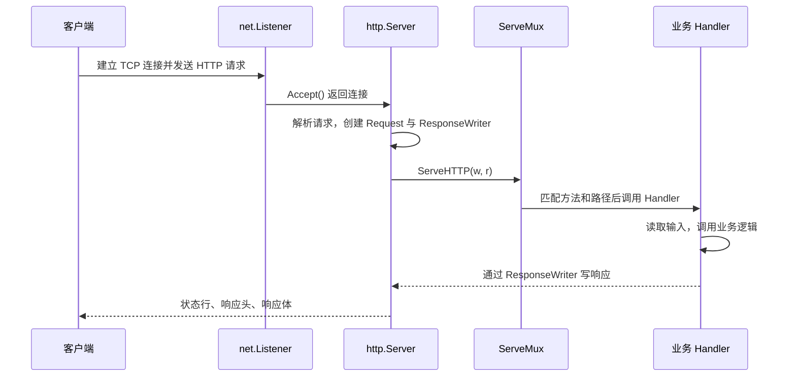

# 01. net/http：构建 HTTP 服务

## 前言

一个 HTTP 服务做的事可以浓缩成一句话：接收请求，交给合适的业务函数，再把响应写回去。`net/http` 的价值在于把这条路径中的网络、协议解析、连接复用和并发细节收在标准库里；应用只需要围绕 `Handler` 编写业务代码。

下面围绕一个很小的任务 API 展开。它不会试图覆盖 Cookie、反向代理、静态文件或 HTTP 客户端，而是把服务端最容易出错的边界讲清楚：路由怎样选中 Handler、请求数据从哪里读、响应什么时候已经发出、取消如何传给下游，以及进程怎样安全停止。

文中的公开 API 以 [net/http 官方文档](https://pkg.go.dev/net/http@go1.22.10) 为准。源码片段核对自 Go 1.22.10；它们用来解释当前实现，**不是应用可以依赖的稳定契约**。

## 请求怎样抵达 Handler

调用 `server.ListenAndServe()` 后，服务端在端口上等待 TCP 连接。对 HTTP/1.x 而言，连接可以被 keep-alive 复用：同一条连接可以连续携带多次请求。标准库读取请求行、请求头和请求体，构造 `*http.Request`，再把它交给配置好的 `Handler`。



`Server` 接受连接的核心循环大致如下：

```go
// Go 1.22.10 的 src/net/http/server.go，省略临时错误重试等细节。
for {
	// Accept 会阻塞，直到操作系统交给它一个新连接。
	rw, err := l.Accept()
	if err != nil {
		return err
	}
	c := srv.newConn(rw)
	go c.serve(connCtx) // 每个 HTTP/1.x 连接由服务端 goroutine 接管。
}
```

这段实现说明两件实际的事：不同连接上的 Handler 可以同时运行，所以共享的可变数据必须同步；不要假定请求会按某个客户端连接串行执行。HTTP/2 还允许同一连接的多个流并发，后一个假定更不成立。源码位置可见 [Server.Serve](https://cs.opensource.google/go/go/+/go1.22.10:src/net/http/server.go)。

应用层的入口只有这个接口：

```go
type Handler interface {
	ServeHTTP(ResponseWriter, *Request)
}
```

结构体 Handler 适合持有数据库连接池、配置等长期依赖；一次请求的数据则应放在局部变量或 `r.Context()` 中。普通函数也能成为 Handler，因为 `HandlerFunc` 只是一个函数适配器：

```go
// Go 1.22.10 的 src/net/http/server.go。
// 这是当前标准库实现的说明，不是额外的框架机制。
type HandlerFunc func(ResponseWriter, *Request)

func (f HandlerFunc) ServeHTTP(w ResponseWriter, r *Request) {
	f(w, r) // 调用函数本身。
}
```

因此 `mux.Handle(handler)` 与 `mux.HandleFunc(function)` 最终都走 `ServeHTTP`。源码可见 [HandlerFunc](https://cs.opensource.google/go/go/+/go1.22.10:src/net/http/server.go;l=2167)。

## 用 ServeMux 把请求路由到业务代码

`http.NewServeMux()` 创建一个独立路由器。相比 `http.HandleFunc` 使用的全局 `http.DefaultServeMux`，独立实例不会让测试或同一进程里的其他服务共享路由状态。

Go 1.22 的模式格式是：

```text
[METHOD ][HOST]/PATH
```

例如 `GET /tasks/{id}` 同时约束方法和路径，`{id}` 表示一个路径段。在处理函数中使用 `r.PathValue("id")` 读取它。路径参数始终是外部输入，仍然要转换和校验，绝不能因为路由匹配成功就当作可信数据。

```go
mux := http.NewServeMux()

// GET 模式也匹配 HEAD；无需在 Handler 内重复判断 r.Method。
mux.HandleFunc("GET /tasks", listTasks)

// {id} 只覆盖一个非空路径段，例如 /tasks/42。
mux.HandleFunc("GET /tasks/{id}", getTask)
```

`ServeMux` 按“更具体的模式优先”选择路由，而不是简单按注册先后。例如 `GET /tasks/latest` 比 `GET /tasks/{id}` 更具体，所以访问 `/tasks/latest` 时会选前者。若路径存在而方法不匹配，Go 1.22 的 `ServeMux` 会生成带 `Allow` 头的 `405 Method Not Allowed`；没有任何路径匹配时才是 `404 Not Found`。

注册阶段会拒绝无法判定优先级的冲突模式。把方法直接写在模式中，路由表本身就是接口的声明，也避免在每个 Handler 中手工写一串 `if r.Method != ...`。方法模式、通配符与 `PathValue` 是 Go 1.22 引入的 API；旧版本应升级或使用相应版本支持的路由方式。详细规则见 [ServeMux 文档](https://pkg.go.dev/net/http@go1.22.10#ServeMux)。

## Request：先限制和校验输入，再进入业务逻辑

`*http.Request` 既是 HTTP 输入的容器，也是请求生命周期的信号：

- `r.Method`、`r.URL`、`r.Header` 分别是方法、目标地址和请求头；它们都是不可信输入。
- `r.Body` 是流，不是预先读入内存的字节数组。JSON API 应限制大小，随后解码和校验。
- `r.Context()` 会在客户端断开、请求被取消或 Handler 返回时被取消。数据库、RPC 等下游调用应接收它，而不是自行换成 `context.Background()`。

处理普通 JSON 请求时，先完整读取和验证所需输入，再开始写响应。这一点很重要：HTTP/1.x 中响应开始后再读请求体可能无法正常工作；更普遍地说，响应一旦提交，错误就很难转换为一致的 JSON 响应。

下面是一个小型、可运行的任务服务。将它保存为 `main.go`，执行 `go run .`，然后用 `curl` 调用即可。内存存储只是为了把注意力放在 HTTP 边界；生产中可把 `taskStore` 的方法换成数据库仓储，并继续把 `ctx` 传下去。

```go
package main

import (
	"context"
	"encoding/json"
	"errors"
	"io"
	"log"
	"net/http"
	"os/signal"
	"strconv"
	"strings"
	"sync"
	"syscall"
	"time"
)

// task 是 API 的输出模型。json tag 明确固定对外字段名，
// 不让 Go 的字段命名规则意外变成接口协议。
type task struct {
	ID        int64  `json:"id"`
	Title     string `json:"title"`
	Completed bool   `json:"completed"`
}

// createTaskInput 只包含创建接口接受的字段；不要把内部模型直接拿来解码。
type createTaskInput struct {
	Title string `json:"title"`
}

// taskStore 是跨请求共享的内存状态，故必须用互斥锁保护。
// 真实服务中，它通常会被数据库仓储替代。
type taskStore struct {
	mu     sync.RWMutex
	nextID int64
	tasks  map[int64]task
}

func newTaskStore() *taskStore {
	return &taskStore{nextID: 1, tasks: make(map[int64]task)}
}

func (s *taskStore) create(ctx context.Context, title string) (task, error) {
	// 此处没有阻塞 I/O，仍先检查 ctx，保持与数据库调用一致的约定。
	if err := ctx.Err(); err != nil {
		return task{}, err
	}

	s.mu.Lock()
	defer s.mu.Unlock()

	t := task{ID: s.nextID, Title: title}
	s.nextID++
	s.tasks[t.ID] = t
	return t, nil
}

func (s *taskStore) get(ctx context.Context, id int64) (task, bool, error) {
	if err := ctx.Err(); err != nil {
		return task{}, false, err
	}

	s.mu.RLock()
	defer s.mu.RUnlock()
	t, ok := s.tasks[id]
	return t, ok, nil
}

// api 只持有长期依赖。每个请求自己的输入应留在方法局部变量中。
type api struct {
	store *taskStore
}

func newHandler(store *taskStore) http.Handler {
	a := &api{store: store}
	mux := http.NewServeMux()

	// 方法属于路由模式，让 ServeMux 统一处理 404、405 和 Allow 响应头。
	mux.HandleFunc("GET /healthz", a.healthz)
	mux.HandleFunc("POST /tasks", a.createTask)
	mux.HandleFunc("GET /tasks/{id}", a.getTask)
	return mux
}

func (a *api) healthz(w http.ResponseWriter, r *http.Request) {
	writeJSON(w, http.StatusOK, map[string]string{"status": "ok"})
}

func (a *api) createTask(w http.ResponseWriter, r *http.Request) {
	input, err := decodeCreateTask(w, r)
	if err != nil {
		return // decodeCreateTask 已输出可公开的 400 或 413 错误。
	}

	// 继续传递 Request Context：客户端取消时，未来的数据库调用也能尽快停止。
	t, err := a.store.create(r.Context(), input.Title)
	if err != nil {
		writeContextError(w, err)
		return
	}
	writeJSON(w, http.StatusCreated, t)
}

func (a *api) getTask(w http.ResponseWriter, r *http.Request) {
	// PathValue 返回字符串；路由匹配不等于它是有效的业务 ID。
	id, err := strconv.ParseInt(r.PathValue("id"), 10, 64)
	if err != nil || id <= 0 {
		writeError(w, http.StatusBadRequest, "task id must be a positive integer")
		return
	}

	t, found, err := a.store.get(r.Context(), id)
	if err != nil {
		writeContextError(w, err)
		return
	}
	if !found {
		writeError(w, http.StatusNotFound, "task not found")
		return
	}
	writeJSON(w, http.StatusOK, t)
}

func decodeCreateTask(w http.ResponseWriter, r *http.Request) (createTaskInput, error) {
	// MaxBytesReader 在读取过程中实施上限，避免 Decoder 无限制占用内存。
	// 服务端会在请求结束时关闭 r.Body；这里不应把它交给后台 goroutine 继续使用。
	r.Body = http.MaxBytesReader(w, r.Body, 1<<20) // 1 MiB，根据接口合同调整。

	decoder := json.NewDecoder(r.Body)
	decoder.DisallowUnknownFields() // 把 "titel" 之类的拼写错误明确暴露给调用方。

	var input createTaskInput
	if err := decoder.Decode(&input); err != nil {
		var tooLarge *http.MaxBytesError
		if errors.As(err, &tooLarge) {
			writeError(w, http.StatusRequestEntityTooLarge, "request body is too large")
		} else {
			writeError(w, http.StatusBadRequest, "request body must be valid JSON")
		}
		return createTaskInput{}, err
	}

	// 第一次 Decode 成功不代表 body 只有一个 JSON 值；拒绝拼接的第二个对象。
	if err := decoder.Decode(&struct{}{}); !errors.Is(err, io.EOF) {
		writeError(w, http.StatusBadRequest, "request body must contain one JSON value")
		return createTaskInput{}, err
	}

	input.Title = strings.TrimSpace(input.Title)
	if input.Title == "" || len(input.Title) > 200 {
		writeError(w, http.StatusBadRequest, "title must contain 1 to 200 characters")
		return createTaskInput{}, errors.New("invalid task title")
	}
	return input, nil
}

// writeJSON 固定所有 JSON 响应的输出顺序，避免不同 Handler 各自处理响应头和错误。
func writeJSON(w http.ResponseWriter, status int, value any) {
	// Header 必须在 WriteHeader 或 Encoder.Encode 之前设置。
	w.Header().Set("Content-Type", "application/json; charset=utf-8")
	w.WriteHeader(status)

	// Encode 会向 w 写 body；此时状态码已提交，编码失败只能记录，不能改写为新的 500。
	if err := json.NewEncoder(w).Encode(value); err != nil {
		log.Printf("encode JSON response: %v", err)
	}
}

func writeError(w http.ResponseWriter, status int, message string) {
	// 只返回稳定、可公开的错误文本；内部异常写日志，不泄露给客户端。
	writeJSON(w, status, map[string]string{"error": message})
}

func writeContextError(w http.ResponseWriter, err error) {
	switch {
	case errors.Is(err, context.Canceled):
		// 客户端通常已离开。停止下游工作即可，没必要强行再写一份响应。
		return
	case errors.Is(err, context.DeadlineExceeded):
		writeError(w, http.StatusGatewayTimeout, "request timed out")
	default:
		log.Printf("unexpected request error: %v", err)
		writeError(w, http.StatusInternalServerError, "internal server error")
	}
}

func main() {
	server := &http.Server{
		Addr:    ":8080",
		Handler: newHandler(newTaskStore()),

		// 这些超时保护的是网络读写，不替代数据库/RPC 自己的 Context 超时。
		ReadHeaderTimeout: 5 * time.Second,  // 防止慢速请求头长期占用连接。
		ReadTimeout:       15 * time.Second, // 限制读取整个普通请求的时间。
		WriteTimeout:      15 * time.Second, // 限制向慢客户端写普通响应的时间。
		IdleTimeout:       60 * time.Second, // keep-alive 连接等待下一请求的最长时间。
		MaxHeaderBytes:    1 << 20,          // 1 MiB；须与网关和业务限制共同评估。
	}

	serverErr := make(chan error, 1)
	go func() {
		log.Printf("listening on http://127.0.0.1%s", server.Addr)
		serverErr <- server.ListenAndServe()
	}()

	// Ctrl+C 与容器发送的 SIGTERM 都进入同一条关闭路径。
	stopContext, stop := signal.NotifyContext(context.Background(), syscall.SIGINT, syscall.SIGTERM)
	defer stop()

	select {
	case <-stopContext.Done():
		log.Println("shutdown signal received")

		// Shutdown 先停止接收新连接，再等待正在执行的 Handler 返回。
		// 给等待过程独立上限，避免部署流程无限卡住。
		shutdownContext, cancel := context.WithTimeout(context.Background(), 10*time.Second)
		defer cancel()
		if err := server.Shutdown(shutdownContext); err != nil {
			log.Printf("graceful shutdown: %v", err)
		}
	case err := <-serverErr:
		if !errors.Is(err, http.ErrServerClosed) {
			log.Fatalf("HTTP server failed: %v", err)
		}
	}
}
```

可以这样验证接口：

```bash
# 创建任务；-i 便于观察 201 和 Content-Type。
curl -i -X POST http://127.0.0.1:8080/tasks \
  -H 'Content-Type: application/json' \
  -d '{"title":"阅读 net/http 文档"}'

# 使用返回的 id 查询任务。
curl -i http://127.0.0.1:8080/tasks/1

# 同一路径用错方法，ServeMux 返回 405，并给出 Allow。
curl -i -X POST http://127.0.0.1:8080/tasks/1
```

## ResponseWriter：响应只能按一个方向写

`http.ResponseWriter` 是正在构造的响应，而不是可随时修改的结果对象。常用方法的顺序是：

1. `w.Header().Set(...)` 设置响应头；
2. `w.WriteHeader(status)` 提交状态码和响应头；
3. `w.Write(...)` 或 `json.Encoder.Encode(...)` 写入响应体。

如果直接调用 `Write`，标准库会隐式提交 `200 OK`。以后再调用 `WriteHeader(400)` 或试图修改普通响应头，客户端也不会看到改变。因此 `writeJSON` 先设置 `Content-Type`、再写状态码、最后编码 body。成功和错误响应都走它，输出行为才一致。

当前 Go 1.22.10 的 `response` 实现用 `wroteHeader` 保护第一次状态码：

```go
// Go 1.22.10 的 src/net/http/server.go，省略日志与协议细节。
func (w *response) WriteHeader(code int) {
	if w.wroteHeader {
		return // 第二次 WriteHeader 不会覆盖已经提交的状态码。
	}
	w.wroteHeader = true
	w.status = code
}

func (w *response) write(...) (n int, err error) {
	if !w.wroteHeader {
		w.WriteHeader(StatusOK) // 第一次写 body 隐式提交 200。
	}
	// 把 body 写入连接缓冲区。
}
```

这是对 Go 1.22.10 源码的解释，并非比 [ResponseWriter 文档](https://pkg.go.dev/net/http@go1.22.10#ResponseWriter) 更强的 API 承诺。对应用而言，可靠规则就是“所有 header 和状态码都在首次写 body 前决定”。

## Server 超时与优雅关闭

`http.ListenAndServe` 很适合十行示例；实际服务通常显式创建 `http.Server`，因为超时和关闭策略属于服务行为的一部分。

示例里的几个超时回答的是不同问题：

- `ReadHeaderTimeout`：客户端迟迟不发完请求头时，连接最多占用多久；
- `ReadTimeout`：读取整个请求最多多久，上传或流式接口需要单独评估；
- `WriteTimeout`：向慢客户端写普通响应最多多久；
- `IdleTimeout`：空闲 keep-alive 连接等待下一个请求多久。

它们不能代替业务超时。一个 Handler 调用数据库或远程服务时，仍应把 `r.Context()` 传给 `QueryContext`、HTTP 客户端请求或 RPC 调用；这样客户端取消和服务关闭信号才可能停止正在等待的下游工作。

`Shutdown(ctx)` 会先关闭监听器，拒绝新连接，然后等待空闲连接与活动请求结束，直到传入的 context 到期。它返回后不应再继续使用原来的 Server。关闭前监听循环通常返回 `http.ErrServerClosed`，这是正常结果，不应当作服务故障。

## 源码视角：Server、Handler 与 ServeMux 如何衔接

公开边界是 `Server.Handler`。没有设置时，服务端使用 `DefaultServeMux`；设置后会把请求交给这个 Handler。Go 1.22.10 的内部适配大意如下：

```go
// Go 1.22.10 的 src/net/http/server.go，简化后的逻辑。
func (sh serverHandler) ServeHTTP(rw ResponseWriter, req *Request) {
	handler := sh.srv.Handler
	if handler == nil {
		handler = DefaultServeMux // 未显式设置时的全局默认路由器。
	}
	handler.ServeHTTP(rw, req)
}
```

这不是稳定契约；其作用是解释为什么显式 `NewServeMux` 并赋给 `Server.Handler` 能避免全局路由。完整实现见 [serverHandler](https://cs.opensource.google/go/go/+/go1.22.10:src/net/http/server.go)。

作为 Handler 的 `ServeMux` 接到请求后，会找出模式与路径参数，再调用目标 Handler：

```go
// Go 1.22.10 的 src/net/http/server.go，省略连接和错误记录细节。
func (mux *ServeMux) ServeHTTP(w ResponseWriter, r *Request) {
	if r.RequestURI == "*" {
		w.Header().Set("Connection", "close")
		Error(w, "Bad Request", StatusBadRequest)
		return
	}
	h, _, _, _ := mux.findHandler(r)
	h.ServeHTTP(w, r)
}
```

`findHandler` 负责 404、405、重定向和模式匹配；业务 Handler 不需要理解路由树的内部结构。此段只描述 Go 1.22.10，未来实现可以变化；日常代码依赖的是 [ServeMux 的公开方法与匹配规则](https://pkg.go.dev/net/http@go1.22.10#ServeMux)。

## 常见边界

- **不要把 `ResponseWriter` 或 `r.Body` 传给返回后的后台 goroutine。** 它们只在当前 `ServeHTTP` 调用期间有效。后台任务应接收已经复制、验证过的数据，并有独立的生命周期。
- **不要把共享请求状态塞进 Handler 字段。** Handler 会并发调用；共享内存用锁、channel 或外部存储协调，请求数据留在局部变量和 context。
- **`r.Context()` 不是任意参数包。** 它适合取消、截止时间和跨 API 边界的请求元数据；明确的业务输入仍应写成函数参数。
- **限制不仅要有读取超时。** `MaxHeaderBytes` 限制头，`MaxBytesReader` 限制 body；业务字段还要限制长度、格式和取值范围。
- **不要在写出 body 后试图“补救”错误。** 先校验、后调用业务、最后集中输出；对已经写出的流式响应，日志和协议设计比二次 `WriteHeader` 更有意义。
- **只对可信代理设置真实客户端地址。** 直接读 `X-Forwarded-For` 不能证明来源；这类头需要由反向代理边界统一处理。

## 总结

`net/http` 的主线很短：`Server` 接受并解析请求，`ServeMux` 选中 `Handler`，Handler 从 `Request` 读取并校验输入，再通过 `ResponseWriter` 按“头、状态、体”的顺序输出。把路由、输入限制、响应写入、Context 传递和关闭策略作为同一条请求路径来设计，服务就有了清晰而可靠的边界。

## 参考资料

- [net/http — Go 1.22.10 API 文档](https://pkg.go.dev/net/http@go1.22.10)
- [net/http Server 源码（Go 1.22.10）](https://cs.opensource.google/go/go/+/go1.22.10:src/net/http/server.go)
- [Go Blog：Routing Enhancements for Go 1.22](https://go.dev/blog/routing-enhancements)
