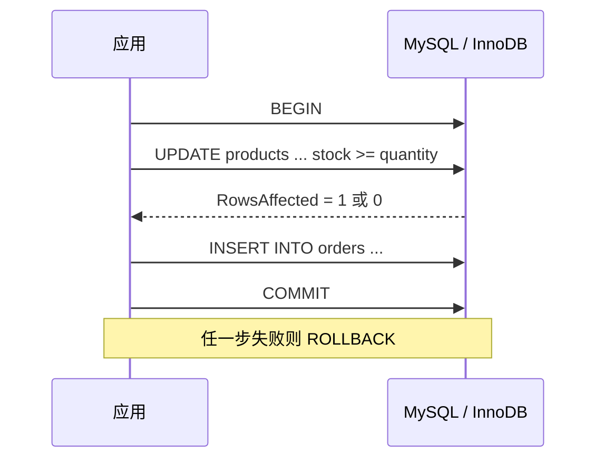

# 01. MySQL：使用 database/sql 和 MySQL 驱动

## 前言

直接写 SQL 的优势是明确：表是什么、条件是什么、事务从哪里开始，都能在代码中看到。代价是必须正确处理 MySQL 的 DSN、时间类型、可空列和执行结果。`database/sql` 的连接池和资源生命周期已有[专门说明](/backend/go/advanced/01-standard-library/04-database-sql/)；这里把注意力放在 MySQL 驱动与一套订单表的实际读写上。

示例依赖官方常用驱动：

```bash
go get github.com/go-sql-driver/mysql
```

`github.com/go-sql-driver/mysql` 实现 MySQL 客户端协议，并以驱动名 `mysql` 注册到 `database/sql`。它不是 ORM：发送的 SQL 仍由应用决定。

## 从 DSN 开始，而不是从字符串拼接开始

DSN 描述用户名、网络地址、默认数据库和连接参数。常见格式如下：

```text
user:password@tcp(127.0.0.1:3306)/order_service?charset=utf8mb4&parseTime=true&loc=Asia%2FShanghai
```

手写 DSN 容易在密码、时区等特殊字符上出错。驱动的 `mysql.Config` 可以把结构化配置格式化为 DSN：

```go
package store

import (
	"context"
	"database/sql"
	"fmt"
	"os"
	"time"

	"github.com/go-sql-driver/mysql"
)

// OpenOrderDB 在进程启动时调用。凭据由环境或密钥系统提供，不能写入仓库。
func OpenOrderDB() (*sql.DB, error) {
	cfg := mysql.Config{
		User:      os.Getenv("MYSQL_USER"),     // 例如 order_app。
		Passwd:    os.Getenv("MYSQL_PASSWORD"), // 不要记录到日志。
		Net:       "tcp",
		Addr:      "127.0.0.1:3306",
		DBName:    "order_service",
		ParseTime: true, // 让 DATE、DATETIME、TIMESTAMP 能扫描到 time.Time。
		Loc:       time.Local, // 必须是团队明确约定的业务时区；示例中采用进程本地时区。
		Params: map[string]string{
			"charset": "utf8mb4", // 客户端、库、表、列应统一字符集策略。
		},
	}

	db, err := sql.Open("mysql", cfg.FormatDSN())
	if err != nil {
		return nil, fmt.Errorf("创建 MySQL 连接池: %w", err)
	}
	// 连接数要按“实例数 × 每实例上限”与 MySQL 的 max_connections 一起规划。
	db.SetMaxOpenConns(20)
	db.SetMaxIdleConns(5)
	db.SetConnMaxLifetime(30 * time.Minute)

	ctx, cancel := context.WithTimeout(context.Background(), 3*time.Second)
	defer cancel()
	if err := db.PingContext(ctx); err != nil {
		_ = db.Close()
		return nil, fmt.Errorf("连接 MySQL: %w", err)
	}
	return db, nil
}
```

几个参数尤其值得确认：

| 设置 | 作用 | 选择原则 |
| --- | --- | --- |
| `charset=utf8mb4` | 连接字符集 | 数据库与表也应采用兼容的字符集和排序规则。 |
| `parseTime=true` | 让驱动把日期时间扫描为 `time.Time` | 若未启用，直接扫描 `DATETIME` 到 `time.Time` 会失败。 |
| `loc` | 解释 `DATE`、`DATETIME` 的位置 | 存储和展示策略要统一；`DATETIME` 本身不存时区。 |
| `timeout` / `readTimeout` / `writeTimeout` | 驱动网络阶段的超时 | 与每个操作的 `context` 超时配合，而不是互相替代。 |

容器内的 `127.0.0.1` 指向当前容器，通常不是宿主机 MySQL。生产环境还应使用 TLS、最小权限账户和密钥管理。完整 DSN 含有密码，错误日志和监控标签都不能输出它。

## 用约束表达订单模型

示例只有商品和订单两张表。应用层检查输入是为了给出友好错误；数据库约束是最后的正确性防线。

```sql
CREATE DATABASE IF NOT EXISTS order_service
  DEFAULT CHARACTER SET utf8mb4;

CREATE TABLE products (
  id BIGINT UNSIGNED NOT NULL AUTO_INCREMENT,
  name VARCHAR(128) NOT NULL,
  stock INT NOT NULL,
  created_at DATETIME NOT NULL,
  PRIMARY KEY (id),
  CONSTRAINT chk_products_stock CHECK (stock >= 0)
) ENGINE=InnoDB DEFAULT CHARSET=utf8mb4;

CREATE TABLE orders (
  id BIGINT UNSIGNED NOT NULL AUTO_INCREMENT,
  product_id BIGINT UNSIGNED NOT NULL,
  quantity INT NOT NULL,
  note VARCHAR(255) NULL,
  status VARCHAR(32) NOT NULL,
  created_at DATETIME NOT NULL,
  PRIMARY KEY (id),
  KEY idx_orders_product_created (product_id, created_at),
  CONSTRAINT fk_orders_product
    FOREIGN KEY (product_id) REFERENCES products(id),
  CONSTRAINT chk_orders_quantity CHECK (quantity > 0)
) ENGINE=InnoDB DEFAULT CHARSET=utf8mb4;
```

外键和事务依赖支持它们的存储引擎，示例明确使用 InnoDB。索引来自访问模式：按 `product_id` 查询并按创建时间排序时，`(product_id, created_at)` 比孤立地为每列都建索引更贴近该查询。是否真的使用索引，要用真实数据上的 `EXPLAIN` 验证。

## 连续示例：创建、读取和更新订单

```go
package store

import (
	"context"
	"database/sql"
	"errors"
	"fmt"
	"time"
)

type Order struct {
	ID        int64
	ProductID int64
	Quantity  int
	Note      *string    // NULL 与空字符串不是同一个值，用指针保留这一区别。
	Status    string
	CreatedAt time.Time  // 前提：DSN 设置了 parseTime=true。
}

type OrderStore struct {
	db *sql.DB
}

func NewOrderStore(db *sql.DB) *OrderStore {
	return &OrderStore{db: db}
}

// Create 只插入订单；库存扣减属于后面的事务场景。
func (s *OrderStore) Create(ctx context.Context, productID int64, quantity int, note *string) (int64, error) {
	if productID <= 0 || quantity <= 0 {
		return 0, fmt.Errorf("商品和数量必须为正数")
	}

	result, err := s.db.ExecContext(ctx, `
		INSERT INTO orders (product_id, quantity, note, status, created_at)
		VALUES (?, ?, ?, ?, ?)`,
		productID,
		quantity,
		note,             // nil 会按驱动规则绑定为 SQL NULL，不是字符串 "NULL"。
		"pending",
		time.Now().UTC(), // 用 UTC 写入是常见约定；读取展示时再转换时区。
	)
	if err != nil {
		return 0, fmt.Errorf("插入订单: %w", err)
	}
	id, err := result.LastInsertId() // MySQL 驱动支持自增列的插入 ID。
	if err != nil {
		return 0, fmt.Errorf("读取订单 ID: %w", err)
	}
	return id, nil
}

func (s *OrderStore) Find(ctx context.Context, id int64) (Order, error) {
	var order Order
	err := s.db.QueryRowContext(ctx, `
		SELECT id, product_id, quantity, note, status, created_at
		FROM orders WHERE id = ?`, id,
	).Scan(&order.ID, &order.ProductID, &order.Quantity, &order.Note, &order.Status, &order.CreatedAt)
	if errors.Is(err, sql.ErrNoRows) {
		return Order{}, fmt.Errorf("订单 %d 不存在: %w", id, err)
	}
	if err != nil {
		return Order{}, fmt.Errorf("读取订单: %w", err)
	}
	return order, nil
}

func (s *OrderStore) ListForProduct(ctx context.Context, productID int64) ([]Order, error) {
	rows, err := s.db.QueryContext(ctx, `
		SELECT id, product_id, quantity, note, status, created_at
		FROM orders WHERE product_id = ? ORDER BY created_at DESC`, productID)
	if err != nil {
		return nil, fmt.Errorf("查询商品订单: %w", err)
	}
	defer rows.Close() // 早退时也要把驱动结果和连接归还给池。

	orders := make([]Order, 0)
	for rows.Next() {
		var order Order
		if err := rows.Scan(&order.ID, &order.ProductID, &order.Quantity, &order.Note, &order.Status, &order.CreatedAt); err != nil {
			return nil, fmt.Errorf("扫描订单: %w", err)
		}
		orders = append(orders, order)
	}
	if err := rows.Err(); err != nil {
		return nil, fmt.Errorf("遍历订单: %w", err)
	}
	return orders, nil
}

func (s *OrderStore) Cancel(ctx context.Context, id int64) error {
	result, err := s.db.ExecContext(ctx,
		`UPDATE orders SET status = ? WHERE id = ? AND status = ?`,
		"cancelled", id, "pending", // 参数绑定不会把值解释为 SQL 语法。
	)
	if err != nil {
		return fmt.Errorf("取消订单: %w", err)
	}
	changed, err := result.RowsAffected()
	if err != nil {
		return fmt.Errorf("读取更新结果: %w", err)
	}
	if changed != 1 {
		return fmt.Errorf("订单不存在或当前状态不能取消")
	}
	return nil
}
```

不要写出 `fmt.Sprintf("... WHERE id = %s", userInput)` 这样的 SQL。占位符把值和 SQL 结构分开，既避免注入，也让驱动按 MySQL 类型规则编码参数。

### `NULL`、空值与时间的选择

数据库 `NULL` 不是 Go 的零值。`note` 可以扫描到 `*string`，也可以使用 `sql.NullString`：

```go
var note sql.NullString
if err := row.Scan(&note); err != nil {
	return err
}
if note.Valid {
	fmt.Println(note.String) // 只有 Valid 时 String 才是数据库中的非 NULL 值。
}
```

当“未填写”和“填写为空”在业务上没有区别时，列定义为 `NOT NULL DEFAULT ''` 会更简单；需要区分时才使用 `NULL`。同理，时间字段先决定语义：`created_at` 是一个瞬间时通常以 UTC 约定存取；生日、营业日这样的“日历值”不该被随意转换时区。

## 事务：扣库存和建订单是一件事

下面的写法不先读库存再写回，而是在一条条件更新中扣减。并发请求里，`stock >= ?` 由数据库在更新时判断，能避免把库存写成负数。

```go
// PlaceOrder 在一个 MySQL/InnoDB 事务里扣库存并创建订单。
func (s *OrderStore) PlaceOrder(ctx context.Context, productID int64, quantity int, note *string) (orderID int64, err error) {
	if productID <= 0 || quantity <= 0 {
		return 0, fmt.Errorf("商品和数量必须为正数")
	}

	tx, err := s.db.BeginTx(ctx, nil)
	if err != nil {
		return 0, fmt.Errorf("开始事务: %w", err)
	}
	defer func() {
		if err != nil {
			_ = tx.Rollback() // 任一失败分支都撤销已完成的扣减。
		}
	}()

	stockResult, err := tx.ExecContext(ctx,
		`UPDATE products SET stock = stock - ? WHERE id = ? AND stock >= ?`,
		quantity, productID, quantity,
	)
	if err != nil {
		return 0, fmt.Errorf("扣减库存: %w", err)
	}
	changed, err := stockResult.RowsAffected()
	if err != nil {
		return 0, fmt.Errorf("读取库存更新结果: %w", err)
	}
	if changed != 1 {
		return 0, fmt.Errorf("商品不存在或库存不足")
	}

	result, err := tx.ExecContext(ctx, `
		INSERT INTO orders (product_id, quantity, note, status, created_at)
		VALUES (?, ?, ?, ?, ?)`,
		productID, quantity, note, "pending", time.Now().UTC(),
	)
	if err != nil {
		return 0, fmt.Errorf("创建订单: %w", err)
	}
	orderID, err = result.LastInsertId()
	if err != nil {
		return 0, fmt.Errorf("读取新订单 ID: %w", err)
	}
	if err = tx.Commit(); err != nil {
		return 0, fmt.Errorf("提交订单: %w", err)
	}
	return orderID, nil
}
```



事务中不能夹杂远程 HTTP 调用或长时间计算；它们会延长持锁和持连接时间。重试、隔离级别和锁等待策略取决于具体业务冲突模型，先通过错误、慢日志和监控识别问题，再有针对性地设计。

## 连接与运行时配置

驱动 README 建议把连接最大生命周期设得短于基础设施或 MySQL 可能关闭连接的时间，以减少拿到陈旧连接的机会。`SetMaxOpenConns` 是应用的总量控制，不是性能按钮；增加前先核对 MySQL `max_connections`、实例数与连接等待。

每次请求都应该把自己的 `context` 传到 `QueryContext`、`ExecContext` 和 `BeginTx`。驱动的 read/write timeout 处理网络 I/O，context 则表达“这次业务操作已经不值得继续等待”；两者应一起设置并通过压测验证。

## 总结

MySQL 数据访问的可靠性，来自几个具体选择：由 `mysql.Config` 生成不泄密的 DSN；用 InnoDB 约束和索引表达数据规则；参数化执行 SQL；明确 `NULL` 和时间语义；把必须同时完成的修改放入一个短事务。`database/sql` 管理连接，MySQL 驱动负责协议，而业务代码仍要对 SQL、结果和事务边界负责。

## 参考资料

- [go-sql-driver/mysql README：DSN 与连接池建议](https://github.com/go-sql-driver/mysql#readme)
- [go-sql-driver/mysql：`Config` API](https://pkg.go.dev/github.com/go-sql-driver/mysql#Config)
- [MySQL 8.4 Reference Manual：InnoDB 事务模型](https://dev.mysql.com/doc/refman/8.4/en/innodb-transaction-model.html)
- [MySQL 8.4 Reference Manual：`EXPLAIN` 输出](https://dev.mysql.com/doc/refman/8.4/en/explain-output.html)
