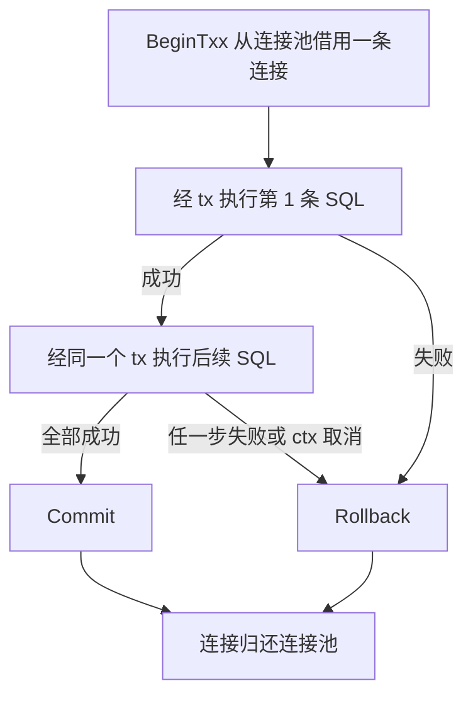
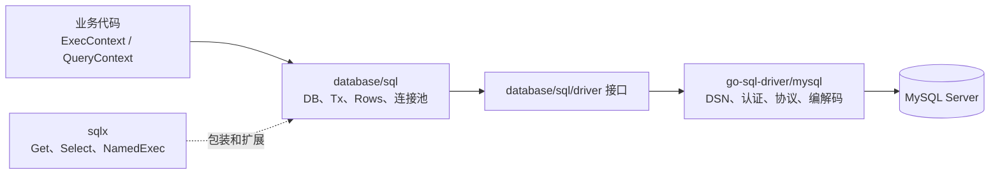
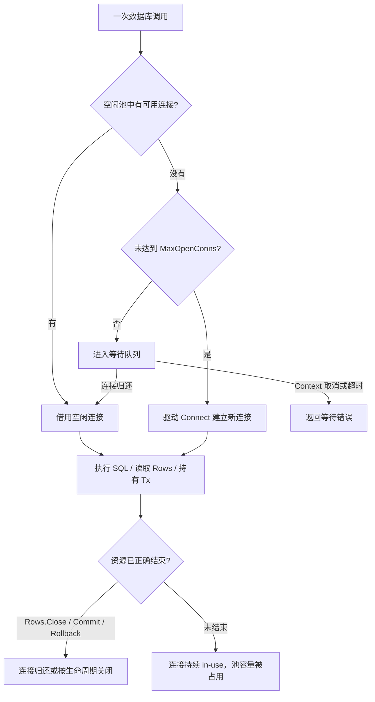
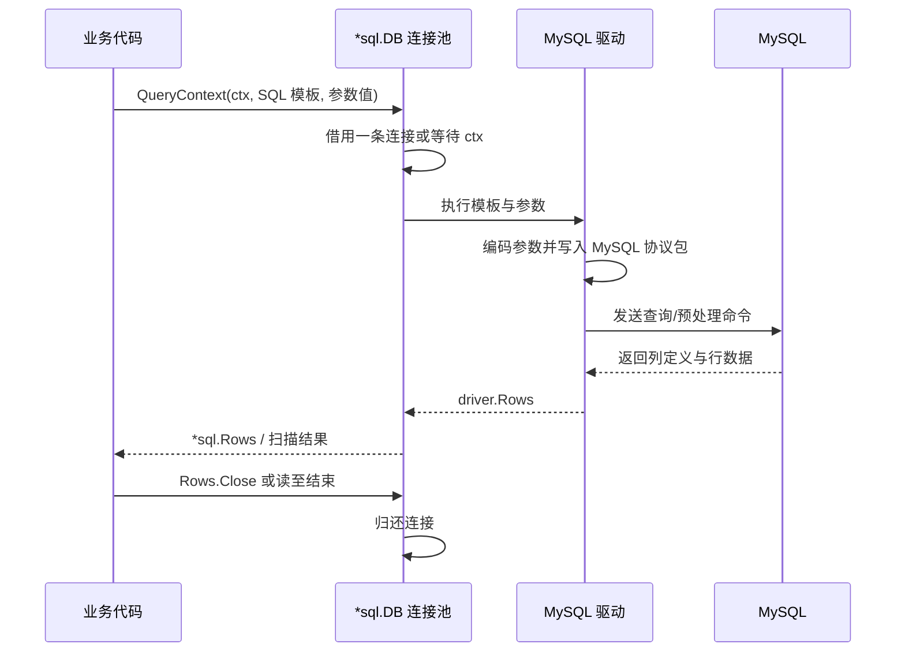
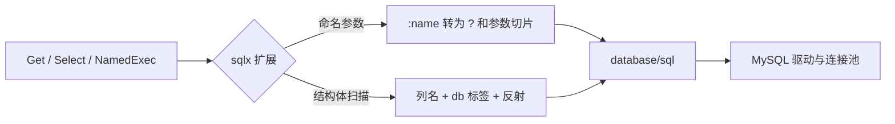

# 01. Go MySQL 数据访问：database/sql 与 sqlx

## 前言

Go 程序访问 MySQL，表面上是在调用 `Exec`、`Query` 或 `Get`；真正决定系统是否可靠的，是 SQL 是否安全、连接池是否被正确复用、结果集是否及时释放，以及事务是否覆盖了应当保持一致的写入。

`database/sql` 提供一套与具体数据库解耦的访问模型：它管理连接池、事务和结果集生命周期；`github.com/go-sql-driver/mysql` 负责将这些调用落实为 MySQL 协议；`github.com/jmoiron/sqlx` 则在不改变底层模型的前提下，减少结构体映射和参数绑定的重复代码。

下面始终围绕 `person` 表完成一次“连接、写入、查询、更新、删除、事务”的闭环。先看 SQL 与参数绑定，再把每个 API 放回 `database/sql` 的连接池和结果集生命周期中理解；这样学习 `sqlx` 时，看到的不是另一套数据库模型，而是在标准库上减少重复代码的一层薄包装。

## 1.1 准备数据库和数据表
首先创建名为 `test` 的数据库，并在其中创建 `person` 和 `place` 两张表。后续 `Person` 使用 Go 的 `string` 接收文本列，因此示例把这三个文本列约束为 `NOT NULL`；如果业务确实允许 SQL `NULL`，接收字段应改为 `sql.NullString`，而不是直接扫描到 `string`。

```sql
-- IF NOT EXISTS 让初始化脚本可以重复执行；不会覆盖已有数据库。
CREATE DATABASE IF NOT EXISTS test;

-- USE 只影响当前 mysql 客户端会话；Go 程序选择哪个库由 DSN 末尾的 /test 决定。
USE test;

CREATE TABLE `person` (
    -- 插入时不传 user_id，MySQL 生成主键；Go 侧从 LastInsertId 读取本次结果。
    `user_id` INT(11) NOT NULL AUTO_INCREMENT,
    -- 与下面 Person 的 string 字段对应，因此不允许 SQL NULL。
    `username` VARCHAR(260) NOT NULL,
    `sex` VARCHAR(260) NOT NULL,
    `email` VARCHAR(260) NOT NULL,
    PRIMARY KEY (`user_id`)
) ENGINE=InnoDB DEFAULT CHARSET=utf8mb4;

CREATE TABLE `place` (
    -- place 仅用于展示列映射；生产表还应明确主键、唯一约束和查询所需索引。
    `country` VARCHAR(200),
    `city` VARCHAR(200),
    `telcode` INT
) ENGINE=InnoDB DEFAULT CHARSET=utf8;
```

其中：

- `CREATE DATABASE` 用于创建数据库；
- `USE test` 表示切换到 `test` 数据库；
- `CREATE TABLE` 用于创建数据表；
- `PRIMARY KEY` 用于指定主键；
- `AUTO_INCREMENT` 表示该字段的值由 MySQL 自动递增；
- `NOT NULL` 表示该字段不允许写入 SQL `NULL`；
- `ENGINE=InnoDB` 表示使用 InnoDB 存储引擎。

创建完成后，可以使用 `DESC` 命令查看数据表结构。

```sql
mysql> DESC person;
+----------+--------------+------+-----+---------+----------------+
| Field    | Type         | Null | Key | Default | Extra          |
+----------+--------------+------+-----+---------+----------------+
| user_id  | int(11)      | NO   | PRI | NULL    | auto_increment |
| username | varchar(260) | NO   |     | NULL    |                |
| sex      | varchar(260) | NO   |     | NULL    |                |
| email    | varchar(260) | NO   |     | NULL    |                |
+----------+--------------+------+-----+---------+----------------+
4 rows in set (0.00 sec)
mysql> DESC place;
+---------+--------------+------+-----+---------+-------+
| Field   | Type         | Null | Key | Default | Extra |
+---------+--------------+------+-----+---------+-------+
| country | varchar(200) | YES  |     | NULL    |       |
| city    | varchar(200) | YES  |     | NULL    |       |
| telcode | int(11)      | YES  |     | NULL    |       |
+---------+--------------+------+-----+---------+-------+
3 rows in set (0.01 sec)
```

## 1.2 安装 MySQL 驱动和 sqlx
进入 Go 项目目录，执行以下命令安装依赖。命令会更新当前 module 的 `go.mod` 与 `go.sum`；这两个文件应随代码一起提交，才能让构建使用确定的依赖版本。

```bash
# 让 database/sql 能够通过 "mysql" 找到 MySQL 协议实现。
go get github.com/go-sql-driver/mysql
# 在 database/sql 的 API 之上增加结构体扫描、命名参数等能力。
go get github.com/jmoiron/sqlx
```

其中，MySQL 驱动通常采用匿名导入方式：

```go
// 空白标识符表示只执行驱动包的初始化代码，不在当前文件中直接使用包名。
// 初始化阶段会把名为 "mysql" 的驱动注册到 database/sql。
import _ "github.com/go-sql-driver/mysql"
```

匿名导入的作用是执行驱动包中的初始化代码，使其向 `database/sql` 注册名为 `mysql` 的数据库驱动。

如果没有导入 MySQL 驱动，即使代码中使用了：

```go
sqlx.Open("mysql", dsn)
```

程序也无法识别名为 `mysql` 的数据库驱动。

## 1.3 连接 MySQL
使用 `sqlx.Open()` 可以创建一个数据库对象：

```go
// 第一个参数必须与驱动注册名一致；第二个参数是驱动专有的 DSN。
// Open 返回的是连接池句柄，此处尚不保证网络、认证和数据库名都可用。
database, err := sqlx.Open(
    "mysql",
    "root:password@tcp(127.0.0.1:3306)/test",
)
```

第一个参数：

```go
"mysql"
```

表示使用 MySQL 驱动。

第二个参数是数据源名称，也称为 DSN，其基本格式如下：

```text
用户名:密码@tcp(数据库地址:端口)/数据库名
```

例如：

```text
root:root@tcp(127.0.0.1:3306)/test
```

各部分含义如下：

| 内容        | 说明                 |
| ----------- | -------------------- |
| `root`      | MySQL 用户名         |
| `root`      | MySQL 密码           |
| `tcp`       | 使用 TCP 协议连接    |
| `127.0.0.1` | MySQL 服务器地址     |
| `3306`      | MySQL 默认端口       |
| `test`      | 需要访问的数据库名称 |

需要注意，`sqlx.Open()` 主要负责初始化数据库对象和连接池，并不一定会立即与数据库建立实际连接。

因此，应用启动阶段应使用带超时的 `PingContext` 检查数据库是否能够正常连接。`Context` 不仅控制网络连接，还能在连接池已满时取消等待。

```go
// 不要让启动探活无限等待；超时也会中断连接池满时的等待。
ctx, cancel := context.WithTimeout(context.Background(), 3*time.Second)
defer cancel()

if err := db.PingContext(ctx); err != nil {
    fmt.Println("connect mysql failed:", err)
    return
}
```

下面定义后续示例共同使用的结构体和数据库连接函数：

```go
package main

import (
    "context"
    "fmt"
    "time"

    _ "github.com/go-sql-driver/mysql"
    "github.com/jmoiron/sqlx"
)

type Person struct {
    // db 标签由 sqlx 的反射映射读取；标准库手动 Scan 并不会使用它。
    UserID   int    `db:"user_id"`
    Username string `db:"username"`
    Sex      string `db:"sex"`
    Email    string `db:"email"`
}

type Place struct {
    Country string `db:"country"`
    City    string `db:"city"`
    TelCode int    `db:"telcode"`
}

func openDB() (*sqlx.DB, error) {
    // *sqlx.DB 内嵌 *sql.DB：这里创建的是一个可并发使用的连接池管理器。
    db, err := sqlx.Open(
        "mysql",
        // parseTime 让 DATETIME/TIMESTAMP 可以扫描到 time.Time；生产 DSN 应来自配置。
        "root:root@tcp(127.0.0.1:3306)/test?charset=utf8mb4&parseTime=true&loc=Local",
    )
    if err != nil {
        return nil, err
    }

    // 连接池大小必须按“单实例并发 × 实例数 < MySQL 可用连接预算”规划。
    db.SetMaxIdleConns(5)
    db.SetMaxOpenConns(20)
    db.SetConnMaxIdleTime(5 * time.Minute)
    db.SetConnMaxLifetime(time.Hour)

    // Open 不一定拨号；PingContext 才会尽早暴露地址、账号、密码和 schema 错误。
    ctx, cancel := context.WithTimeout(context.Background(), 3*time.Second)
    defer cancel()
    if err := db.PingContext(ctx); err != nil {
        _ = db.Close() // 初始化失败时释放可能已创建的空闲连接。
        return nil, err
    }

    return db, nil
}

func main() {
    db, err := openDB()
    if err != nil {
        fmt.Println("open mysql failed:", err)
        return
    }
    // 只在进程退出时关闭连接池；绝不能放到每个 HTTP 请求中。
    defer func() {
        if err := db.Close(); err != nil {
            fmt.Println("close mysql failed:", err)
        }
    }()

    fmt.Println("mysql connection success")
}
```

结构体字段后的 `db` 标签用于指定结构体字段与数据库字段之间的映射关系。

例如：

```go
UserID int `db:"user_id"`
```

表示数据库查询结果中的 `user_id` 字段会被映射到结构体的 `UserID` 字段。

如果数据库字段名和结构体字段名无法由 `sqlx` 自动对应，就应当通过 `db` 标签明确指定映射关系。

另外，`*sqlx.DB` 并不表示一条固定的数据库连接，而是一个数据库连接池。Go 程序通常只需要创建并复用一个数据库对象，不应在每次执行 SQL 时重复创建连接池。

## 1.4 SQL 基础与 SQL 注入
在使用 Go 操作 MySQL 之前，需要先理解一条 SQL 由“结构”和“值”两部分组成：`SELECT`、表名、列名和 `ORDER BY` 构成结构；用户名、ID、日期等是值。驱动只能安全绑定“值”，不能替你决定 SQL 结构。这个边界既解释了参数化查询为何有效，也解释了动态排序为何必须使用白名单。

### 1.4.1 SQL 语句的基本分类
SQL 是操作关系型数据库的语言。常见 SQL 语句可以分为以下几类：

| 分类         | 常见语句                     | 作用                         |
| ------------ | ---------------------------- | ---------------------------- |
| 数据定义语言 | `CREATE`、`ALTER`、`DROP`    | 创建、修改或者删除数据库对象 |
| 数据操作语言 | `INSERT`、`UPDATE`、`DELETE` | 插入、修改或者删除数据       |
| 数据查询语言 | `SELECT`                     | 查询数据                     |
| 事务控制语言 | `COMMIT`、`ROLLBACK`         | 提交或者回滚事务             |

本节主要使用以下四种语句：

```sql
INSERT
SELECT
UPDATE
DELETE
```

它们通常被合称为 CRUD 操作：

- Create：新增数据，对应 `INSERT`；
- Read：读取数据，对应 `SELECT`；
- Update：修改数据，对应 `UPDATE`；
- Delete：删除数据，对应 `DELETE`。

### 1.4.2 SQL 语句的基本组成
以一条查询语句为例：

```sql
SELECT user_id, username, email
FROM person
WHERE user_id = 1
ORDER BY user_id DESC
LIMIT 10;
```

其中：

- `SELECT` 指定需要查询的字段；
- `FROM` 指定查询的数据表；
- `WHERE` 指定筛选条件；
- `ORDER BY` 指定排序方式；
- `DESC` 表示降序排列；
- `LIMIT` 限制返回的数据条数。

SQL 关键字通常不区分大小写，但为了便于阅读，本教程使用大写形式书写 SQL 关键字。

### 1.4.3 什么是 SQL 注入
SQL 注入是指程序直接将外部输入拼接到 SQL 字符串中，导致输入内容被数据库当作 SQL 语法的一部分执行。

下面是一种不安全的查询方式：

```go
// 下面的代码故意错误：username 被拼进 SQL 文本，输入可以改变 WHERE 的语法。
username := userInput

query := "SELECT user_id, username, sex, email " +
    "FROM person WHERE username = '" + username + "'"

// Select 会照原样把 query 交给数据库；它无法知道其中哪一部分来自不可信输入。
err := db.Select(&people, query)
```

如果用户正常输入：

```text
stu001
```

最终生成的 SQL 为：

```sql
SELECT user_id, username, sex, email
FROM person
WHERE username = 'stu001';
```

但是，如果用户输入：

```text
' OR 1=1 -- 
```

拼接后的 SQL 可能变成：

```sql
SELECT user_id, username, sex, email
FROM person
WHERE username = '' OR 1=1 -- ';
```

其中：

```sql
OR 1=1
```

始终成立，而 `--` 会将后面的内容作为注释处理。

这样一来，原本只查询一个用户的语句，就可能返回表中的全部用户。

SQL 注入还可能造成：

- 未授权读取数据；
- 修改或者删除数据；
- 绕过登录验证；
- 泄露敏感信息；
- 破坏数据库结构。

具体危害取决于数据库账号拥有的权限、数据库配置以及程序执行 SQL 的方式。

### 1.4.4 错误做法：直接拼接 SQL
以下写法都存在 SQL 注入风险：

```go
// 三种写法都会把变量直接变成 SQL 字符串的一部分，均不安全。
query := "SELECT * FROM person WHERE username = '" + username + "'"
query := fmt.Sprintf(
    "SELECT * FROM person WHERE username = '%s'",
    username,
)
query := "DELETE FROM person WHERE user_id = " + userID
```

即使使用 `fmt.Sprintf()`，本质上仍然是在将输入内容拼接到 SQL 字符串中，并不能防止 SQL 注入。

### 1.4.5 正确做法：参数化查询
MySQL 驱动使用 `?` 作为参数占位符。

```go
var people []Person

// SQL 模板与参数分开传递：? 仅代表一个“值”的位置，不能代表 SQL 语法。
err := db.Select(
    &people,
    `
    SELECT user_id, username, sex, email
    FROM person
    WHERE username = ?
    `,
    username,
)
```

这里的 SQL 语句和参数值是分开传递的：

```go
// ? 保留在 SQL 模板中，username 作为独立参数传入；这是正确的绑定形式。
db.Select(
    &people,
    "SELECT ... WHERE username = ?",
    username,
)
```

数据库驱动会将 `username` 当作普通数据处理，而不会将其解释为 SQL 语法。

即使用户输入：

```text
' OR 1=1 -- 
```

数据库也只会将这段内容作为需要匹配的用户名，而不会执行其中的 `OR 1=1`。

占位符周围不应手动添加引号。

错误写法：

```go
db.Select(
    &people,
    "SELECT * FROM person WHERE username = '?'",
    username,
)
```

正确写法：

```go
db.Select(
    &people,
    "SELECT * FROM person WHERE username = ?",
    username,
)
```

字符串引号和类型转换应交给数据库驱动处理。

参数化查询适用于所有常见的 CRUD 操作：

```go
// 正确：驱动负责编码字符串、转义特殊字符并按顺序绑定三个参数。
db.Exec(
    "INSERT INTO person(username, sex, email) VALUES (?, ?, ?)",
    username,
    sex,
    email,
)
db.Select(
    &people,
    "SELECT * FROM person WHERE user_id = ?",
    userID,
)
db.Exec(
    "UPDATE person SET username = ? WHERE user_id = ?",
    username,
    userID,
)
db.Exec(
    "DELETE FROM person WHERE user_id = ?",
    userID,
)
```

只要数据值来自变量、请求参数、表单、URL、JSON 或者其他外部输入，就应当通过参数传递，而不是直接拼接到 SQL 中。

### 1.4.6 预处理语句
如果同一条 SQL 需要重复执行，可以显式创建预处理语句：

```go
// Preparex 创建可复用语句对象；连接池会在具体执行时为它准备相应连接上的 statement。
stmt, err := db.Preparex(
    `
    INSERT INTO person(username, sex, email)
    VALUES (?, ?, ?)
    `,
)
if err != nil {
    fmt.Println("prepare failed:", err)
    return
}
// stmt 持有驱动侧资源，函数结束前必须关闭；不要把它遗忘在长期运行的循环中。
defer stmt.Close()

// 每次 Exec 只传不同的值，SQL 的结构始终不变。
_, err = stmt.Exec(
    "stu001",
    "man",
    "stu01@qq.com",
)
if err != nil {
    fmt.Println("insert failed:", err)
    return
}
```

预处理语句通常包含占位符，但不包含具体参数值。创建完成后，可以使用不同的参数重复执行。

需要注意，防止 SQL 注入并不要求每次都显式调用 `Prepare()`。

下面这种参数化写法本身就是正确的：

```go
// 这段 SQL 仍然安全：即使没有显式 Prepare，值与 SQL 模板依旧分离。
db.Exec(
    "DELETE FROM person WHERE user_id = ?",
    userID,
)
```

关键在于 SQL 模板和参数值必须分开传递。显式预处理更适合需要重复执行同一条 SQL 的场景。

### 1.4.7 占位符不能代替表名和字段名
占位符只能表示数据值，不能表示：

- SQL 关键字；
- 表名；
- 字段名；
- 排序方向；
- 完整的 SQL 表达式。

下面的写法是错误的：

```go
// 错误：表名属于 SQL 结构，? 不能替换它；这不是安全的动态表名写法。
db.Select(
    &people,
    "SELECT * FROM ? WHERE user_id = ?",
    tableName,
    userID,
)
```

下面的写法同样不可行：

```go
// 错误：排序字段同样属于 SQL 结构，不能作为参数绑定。
db.Select(
    &people,
    "SELECT * FROM person ORDER BY ?",
    sortField,
)
```

因为表名、字段名和排序方式属于 SQL 语句结构，而不是普通的数据值。

如果确实需要动态指定排序字段，应当使用白名单：

```go
// 将外部值映射为程序写死的 SQL 片段；未命中时使用稳定的默认排序。
allowedSortFields := map[string]string{
    "id":       "user_id",
    "username": "username",
    "email":    "email",
}

sortField, ok := allowedSortFields[userInput]
if !ok {
    sortField = "user_id"
}

// 此处格式化的是白名单中的固定字段名，而不是未经校验的 userInput。
query := fmt.Sprintf(
    `
    SELECT user_id, username, sex, email
    FROM person
    ORDER BY %s
    `,
    sortField,
)

err := db.Select(&people, query)
```

虽然这里使用了 `fmt.Sprintf()`，但是被拼接的内容不是未经检查的原始输入，而是从程序预先定义的白名单中取得的安全字段名。

排序方向也应使用白名单：

```go
// 方向只有两个有限取值；任何其他输入都保持默认 ASC。
sortDirection := "ASC"

if userDirection == "desc" {
    sortDirection = "DESC"
}
```

不能直接这样处理：

```go
// 危险：userDirection 如果来自请求，会直接成为 SQL 结构的一部分。
query := "SELECT * FROM person ORDER BY user_id " + userDirection
```

### 1.4.8 SQL 注入的其他防护措施
参数化查询是防止 SQL 注入的主要措施。此外，还应当配合以下措施：

1. 对外部输入进行类型和格式校验；
2. 数据库账号只授予程序真正需要的权限；
3. 不要在错误响应中向用户暴露完整 SQL 和数据库信息；
4. 动态字段名、表名和排序方式必须使用白名单；
5. 不要将过滤或者替换特殊字符作为主要防护手段；
6. 批量查询、动态条件和 `IN` 查询也应使用安全的参数绑定方式。

例如，用户编号应先解析成整数：

```go
// 类型校验负责业务合法性，例如拒绝 "1 OR 1=1"；它不能替代下方的参数绑定。
userID, err := strconv.Atoi(input)
if err != nil {
    fmt.Println("invalid user id")
    return
}
```

即使已经完成类型校验，执行 SQL 时仍然应当使用占位符：

```go
// 即使 userID 已是 int，也继续使用占位符，使每个 SQL 调用都保持统一的安全边界。
db.Get(
    &person,
    "SELECT * FROM person WHERE user_id = ?",
    userID,
)
```

输入校验负责判断数据是否合法，参数化查询负责防止输入内容改变 SQL 结构，两者作用不同，不能相互替代。

## 1.5 Insert 插入数据
`INSERT` 用于向数据表中插入新的记录。与查询不同，插入通常没有结果集可遍历，因此使用 `Exec`；调用方通过返回的 `sql.Result` 获得“写入是否成功、影响了几行、数据库生成了哪个 ID”。这三个信息分别服务于错误处理、业务判断和后续关联写入。

### 1.5.1 INSERT 基本语法
```sql
INSERT INTO 表名 (字段一, 字段二, 字段三)
VALUES (值一, 值二, 值三);
```

例如：

```sql
-- 指定列名能让字段与值的对应关系稳定；不要依赖表的物理列顺序。
INSERT INTO person (username, sex, email)
VALUES ('stu001', 'man', 'stu01@qq.com');
```

其中：

- `INSERT INTO person` 表示向 `person` 表中插入数据；
- 括号中的内容表示需要写入的字段；
- `VALUES` 后面的内容表示各字段对应的值；
- 字段和值必须按照位置一一对应。

`person` 表中的 `user_id` 字段使用了 `AUTO_INCREMENT`，因此插入数据时可以不提供 `user_id`，MySQL 会自动生成其值。

也可以一次插入多条数据：

```sql
-- 同一条 INSERT 可以写入多行；大量数据仍应按批次控制事务和锁占用时间。
INSERT INTO person (username, sex, email)
VALUES
    ('stu001', 'man', 'stu01@qq.com'),
    ('stu002', 'woman', 'stu02@qq.com');
```

### 1.5.2 使用 Go 插入数据
`INSERT` 不会返回查询结果集，因此可以使用 `Exec()` 方法执行。

```go
package main

import (
    "fmt"

    _ "github.com/go-sql-driver/mysql"
    "github.com/jmoiron/sqlx"
)

func main() {
    // 教学示例在 main 中创建连接池；真实服务应在启动时创建一次并注入业务层。
    db, err := sqlx.Open(
        "mysql",
        "root:root@tcp(127.0.0.1:3306)/test",
    )
    if err != nil {
        fmt.Println("open mysql failed:", err)
        return
    }
    defer db.Close() // main 退出时才关闭整个池，而不是每次 SQL 后关闭。

    // Ping 让 DSN、网络和认证问题在第一条业务 SQL 前暴露。
    if err := db.Ping(); err != nil {
        fmt.Println("connect mysql failed:", err)
        return
    }

    // Exec 不返回 Rows；每一个 ? 按出现顺序绑定后面的独立参数。
    result, err := db.Exec(
        `
        INSERT INTO person(username, sex, email)
        VALUES (?, ?, ?)
        `,
        "stu001",
        "man",
        "stu01@qq.com",
    )
    if err != nil {
        fmt.Println("insert failed:", err)
        return
    }

    // 不要自行推算下一个 ID；从本次写入的 Result 获取驱动报告的生成主键。
    id, err := result.LastInsertId()
    if err != nil {
        fmt.Println("get last insert id failed:", err)
        return
    }

    fmt.Println("insert success:", id)
}
```

SQL 语句中的问号 `?` 是参数占位符：

```sql
INSERT INTO person(username, sex, email)
VALUES (?, ?, ?);
```

实际参数按照顺序传递给 `Exec()`：

```go
"stu001",
"man",
"stu01@qq.com",
```

第一个参数对应第一个 `?`，第二个参数对应第二个 `?`，以此类推。

这种参数化查询方式可以：

- 避免手动处理字符串引号；
- 自动处理不同的数据类型；
- 防止输入内容被解释成 SQL 语法；
- 降低 SQL 注入风险。

不应当使用字符串拼接构造插入语句：

```go
sql := "INSERT INTO person(username) VALUES ('" + username + "')"
```

应当改为：

```go
_, err := db.Exec(
    "INSERT INTO person(username) VALUES (?)",
    username,
)
```

### 1.5.3 Exec 和 sql.Result
`Exec()` 的返回值类型为：

```go
sql.Result
```

可以通过 `LastInsertId()` 获取数据库生成的自增主键：

```go
// Result 的具体实现由驱动提供，调用该方法也可能失败，必须检查 err。
id, err := result.LastInsertId()
```

也可以通过 `RowsAffected()` 获取受影响的行数：

```go
// RowsAffected 适合判断写操作是否命中了预期记录；不同数据库/驱动的计数语义可能不同。
rows, err := result.RowsAffected()
```

示例输出：

```text
insert success: 2
```

这里的 `2` 表示新插入记录的 `user_id`。

## 1.6 Select 查询数据
`SELECT` 用于从数据表中读取数据。查询的关键不是“拿到一个结构体”这么简单：数据库先返回一个可能很大的结果集，调用方必须决定它是单行还是多行、何时停止读取，以及如何把 SQL `NULL` 和列类型安全地映射到 Go 值。`sqlx.Get` 和 `sqlx.Select` 将最常见的两种结果集模式封装好了。

### 1.6.1 SELECT 基本语法
查询指定字段：

```sql
-- 显式列名使返回结构、网络传输和后续索引覆盖的可能性都更可控。
SELECT 字段一, 字段二
FROM 表名;
```

例如：

```sql
SELECT user_id, username, email
FROM person;
```

也可以使用 `*` 查询所有字段：

```sql
SELECT *
FROM person;
```

在实际项目中，一般建议明确写出需要的字段，而不是长期依赖 `SELECT *`。这样可以使查询结果更加清晰，并减少不必要的数据传输。

### 1.6.2 WHERE 查询条件
使用 `WHERE` 可以筛选符合条件的记录：

```sql
SELECT user_id, username, email
FROM person
WHERE user_id = 1;
```

常见条件运算符包括：

| 运算符       | 说明               |
| ------------ | ------------------ |
| `=`          | 等于               |
| `<>` 或 `!=` | 不等于             |
| `>`          | 大于               |
| `<`          | 小于               |
| `>=`         | 大于等于           |
| `<=`         | 小于等于           |
| `AND`        | 多个条件同时成立   |
| `OR`         | 多个条件满足其一   |
| `LIKE`       | 模糊匹配           |
| `IN`         | 匹配指定集合中的值 |

例如：

```sql
SELECT user_id, username
FROM person
WHERE sex = 'man' AND user_id > 1;
```

### 1.6.3 排序和限制数量
常见查询语法如下：

```sql
SELECT 字段
FROM 表名
WHERE 查询条件
ORDER BY 排序字段 ASC 或 DESC
LIMIT 返回数量;
```

例如：

```sql
SELECT user_id, username, email
FROM person
WHERE sex = 'man'
ORDER BY user_id DESC
LIMIT 10;
```

其中：

- `WHERE` 用于筛选数据；
- `ORDER BY` 用于排序；
- `ASC` 表示升序；
- `DESC` 表示降序；
- `LIMIT` 用于限制返回的数据条数。

### 1.6.4 使用 Go 查询多条数据
`sqlx` 提供了 `Select()` 方法，可以查询多条数据并将结果直接映射到结构体切片中。

```go
package main

import (
    "fmt"

    _ "github.com/go-sql-driver/mysql"
    "github.com/jmoiron/sqlx"
)

type Person struct {
    UserID   int    `db:"user_id"`
    Username string `db:"username"`
    Sex      string `db:"sex"`
    Email    string `db:"email"`
}

func main() {
    db, err := sqlx.Open(
        "mysql",
        "root:root@tcp(127.0.0.1:3306)/test",
    )
    if err != nil {
        fmt.Println("open mysql failed:", err)
        return
    }
    defer db.Close()

    if err := db.Ping(); err != nil {
        fmt.Println("connect mysql failed:", err)
        return
    }

    // 必须传切片指针，sqlx 才能把多行扫描结果写回 people。
    var people []Person

    // Select 内部查询 Rows、逐行 StructScan，并在完成后关闭 Rows。
    err = db.Select(
        &people,
        `
        SELECT user_id, username, sex, email
        FROM person
        WHERE user_id = ?
        `,
        1,
    )
    if err != nil {
        fmt.Println("select failed:", err)
        return
    }

    fmt.Println("select success:", people)
}
```

查询条件中的值应当作为独立参数传递：

```go
err := db.Select(
    &people,
    `
    SELECT user_id, username, sex, email
    FROM person
    WHERE user_id = ?
    `,
    userID,
)
```

不应直接拼接：

```go
query := "SELECT * FROM person WHERE user_id = " + userID
```

示例输出：

```text
select success: [{1 stu001 man stu01@qq.com}]
```

`Select()` 的第一个参数必须是用于接收结果的切片指针：

```go
var people []Person

// Select 的第一个参数是“接收结果的切片指针”，不是切片值。
db.Select(&people, ...)
```

这里不能传入：

```go
db.Select(people, ...)
```

因为 `sqlx` 需要通过指针修改切片中的内容。

### 1.6.5 使用 Get 查询单条数据
如果只需要查询一条记录，可以使用 `Get()`：

```go
var person Person

// Get 期望至多一行；列名通过 db 标签映射到 person 的字段。
err := db.Get(
    &person,
    `
    SELECT user_id, username, sex, email
    FROM person
    WHERE user_id = ?
    `,
    1,
)
if errors.Is(err, sql.ErrNoRows) {
    // “没找到”是正常的业务分支，不应和连接失败、语法错误混为一谈。
    fmt.Println("person not found")
    return
}
if err != nil {
    fmt.Println("get person failed:", err)
    return
}

fmt.Println(person)
```

该片段需要额外导入 `database/sql` 和 `errors`：前者提供 `sql.ErrNoRows`，后者用 `errors.Is` 保留被包装错误的判断能力。不要把 `Get` 出错后留下的零值 `person` 当作“未找到”的依据。

`Select()` 和 `Get()` 的主要区别如下：

| 方法       | 接收对象                   | 适用场景     |
| ---------- | -------------------------- | ------------ |
| `Select()` | 切片指针                   | 查询多条数据 |
| `Get()`    | 结构体指针或者基本类型指针 | 查询单条数据 |

查询语句会返回数据行，因此底层通常通过 `Query()`、`QueryRow()` 或对应的 `Context` 方法执行。

## 1.7 Update 更新数据
`UPDATE` 用于修改数据表中已经存在的记录。写操作最需要先确认的是作用范围：`SET` 决定写什么，`WHERE` 决定写到谁。将 ID 与业务条件都写进 `WHERE`，再检查 `RowsAffected`，才能避免“执行成功但更新了错误记录”或“没有记录被修改却被误认为成功”。

### 1.7.1 UPDATE 基本语法
```sql
UPDATE 表名
SET 字段一 = 新值一,
    字段二 = 新值二
WHERE 查询条件;
```

例如：

```sql
-- WHERE 是更新范围的安全边界；去掉它会修改表中每一行。
UPDATE person
SET username = 'stu0003'
WHERE user_id = 1;
```

其中：

- `UPDATE person` 指定要修改的数据表；
- `SET` 指定要修改的字段和值；
- `WHERE` 指定需要修改的记录。

也可以同时修改多个字段：

```sql
UPDATE person
SET username = 'stu0003',
    email = 'stu03@qq.com'
WHERE user_id = 1;
```

需要特别注意，省略 `WHERE` 条件会修改表中的所有记录：

```sql
UPDATE person
SET username = 'stu0003';
```

因此，在执行更新操作前，应确认 `WHERE` 条件是否正确。

### 1.7.2 使用 Go 更新数据
`UPDATE` 不返回查询结果集，因此使用 `Exec()` 执行。

```go
package main

import (
    "fmt"

    _ "github.com/go-sql-driver/mysql"
    "github.com/jmoiron/sqlx"
)

func main() {
    db, err := sqlx.Open(
        "mysql",
        "root:root@tcp(127.0.0.1:3306)/test",
    )
    if err != nil {
        fmt.Println("open mysql failed:", err)
        return
    }
    defer db.Close()

    if err := db.Ping(); err != nil {
        fmt.Println("connect mysql failed:", err)
        return
    }

    // 两个参数与两个 ? 一一对应：第一个写入新用户名，第二个限定目标行。
    result, err := db.Exec(
        `
        UPDATE person
        SET username = ?
        WHERE user_id = ?
        `,
        "stu0003",
        1,
    )
    if err != nil {
        fmt.Println("update failed:", err)
        return
    }

    // 该数字不能孤立地当作“是否存在”的唯一判断：同值更新在 MySQL 中可能得到 0。
    rows, err := result.RowsAffected()
    if err != nil {
        fmt.Println("get affected rows failed:", err)
        return
    }

    fmt.Println("update success:", rows)
}
```

这里的两个参数按照占位符出现的顺序传入：

```go
"stu0003",
1,
```

对应：

```sql
SET username = ?
WHERE user_id = ?
```

使用参数化查询可以防止用户名等外部输入改变 SQL 语句的结构。

### 1.7.3 获取受影响的行数
可以使用 `RowsAffected()` 获取更新操作实际影响的行数：

```go
rows, err := result.RowsAffected()
```

第一次运行时，如果数据确实发生了变化，输出结果可能为：

```text
update success: 1
```

表示有一行数据被修改。

再次执行相同的更新时，由于字段值已经是 `stu0003`，数据没有发生实际变化，输出结果可能为：

```text
update success: 0
```

在默认配置下，这里的返回值通常表示实际发生变化的行数，而不是 SQL 条件匹配到的行数。

## 1.8 Delete 删除数据
`DELETE` 用于删除数据表中的记录。它与 `UPDATE` 共享同一条安全原则：先把删除对象限定在 `WHERE`，再根据业务需要检查受影响行数。生产系统还需要先决定数据是应当物理删除，还是保留审计能力的软删除；这个纯 SQL 示例展示的是物理删除。

### 1.8.1 DELETE 基本语法
```sql
DELETE FROM 表名
WHERE 查询条件;
```

例如：

```sql
-- 仅删除目标主键对应的一行；省略 WHERE 会清空整张表的数据。
DELETE FROM person
WHERE user_id = 1;
```

其中：

- `DELETE FROM person` 表示从 `person` 表中删除数据；
- `WHERE user_id = 1` 表示只删除 `user_id` 等于 `1` 的记录。

需要特别注意，省略 `WHERE` 条件会删除表中的所有数据：

```sql
DELETE FROM person;
```

该语句虽然不会删除数据表本身，但会删除表中的所有记录。

因此，执行删除操作时必须谨慎检查删除条件。

### 1.8.2 使用 Go 删除数据
删除数据同样可以使用 `Exec()`：

```go
package main

import (
    "fmt"

    _ "github.com/go-sql-driver/mysql"
    "github.com/jmoiron/sqlx"
)

func main() {
    db, err := sqlx.Open(
        "mysql",
        "root:root@tcp(127.0.0.1:3306)/test",
    )
    if err != nil {
        fmt.Println("open mysql failed:", err)
        return
    }
    defer db.Close()

    if err := db.Ping(); err != nil {
        fmt.Println("connect mysql failed:", err)
        return
    }

    // 只把 user_id 作为值绑定；不要将请求中的 ID 拼进 SQL 字符串。
    result, err := db.Exec(
        `
        DELETE FROM person
        WHERE user_id = ?
        `,
        1,
    )
    if err != nil {
        fmt.Println("delete failed:", err)
        return
    }

    // 0 表示没有行被删除，业务层可据此决定返回“资源不存在”还是幂等成功。
    rows, err := result.RowsAffected()
    if err != nil {
        fmt.Println("get affected rows failed:", err)
        return
    }

    fmt.Println("delete success:", rows)
}
```

查询条件中的数据应当作为参数传入：

```go
result, err := db.Exec(
    "DELETE FROM person WHERE user_id = ?",
    userID,
)
```

不应直接拼接外部输入：

```go
query := "DELETE FROM person WHERE user_id = " + userID
```

### 1.8.3 获取删除行数
使用 `RowsAffected()` 可以获得被删除的记录数量：

```go
rows, err := result.RowsAffected()
```

如果数据库中存在 `user_id = 1` 的数据，第一次运行结果为：

```text
delete success: 1
```

表示成功删除一行数据。

再次执行相同的删除操作时，由于该记录已经不存在，结果为：

```text
delete success: 0
```

如果不需要获取受影响的行数，也可以忽略 `Exec()` 返回的 `sql.Result`：

```go
// 即使不读取 Result，也必须保留并处理 Exec 的错误。
_, err := db.Exec(
    "DELETE FROM person WHERE user_id = ?",
    1,
)
if err != nil {
    fmt.Println("delete failed:", err)
    return
}
```

## 1.9 MySQL 事务
一条 `INSERT`、`UPDATE` 或 `DELETE` 本身就是独立的数据库语句；当业务动作跨越多条语句时，才需要事务把它们组织成一个不可分割的单元。事务并不等于“代码不会出错”，它保证的是：同一事务中已经执行的数据库修改，要么一起提交，要么在可回滚的范围内一起撤销。

例如，转账操作通常包括：

1. 从一个账户扣除金额；
2. 向另一个账户增加金额。

这两个操作必须同时成功或者同时失败，不能只执行其中一个。这类场景就需要使用事务。

### 1.9.1 事务的 ACID 特性
事务具有以下四个基本特性，通常简称为 ACID：

1. 原子性：事务中的操作要么全部执行成功，要么全部不执行；
2. 一致性：事务执行前后，数据库都应保持符合约束的有效状态；
3. 隔离性：并发事务之间的执行应当相互隔离；
4. 持久性：事务提交后，修改结果应被永久保存。

### 1.9.2 Go 中的事务方法
在 Go 中，事务操作主要涉及以下方法。

开始事务：

```go
// Begin 使用默认隔离级别；服务代码优先使用能携带取消信号的 BeginTxx。
tx, err := db.Begin()
```

提交事务：

```go
// Commit 成功后，事务结束，底层连接才有机会归还给连接池。
err := tx.Commit()
```

回滚事务：

```go
// Rollback 结束事务并撤销尚未提交的修改；它也会归还事务占用的连接。
err := tx.Rollback()
```

使用 `sqlx` 时，也可以调用 `Beginx()` 获得 `*sqlx.Tx`：

```go
// Beginx 只是把标准库 *sql.Tx 包装成带 Get/Select 等方法的 *sqlx.Tx。
tx, err := db.Beginx()
```

### 1.9.3 事务执行流程
事务的基本执行流程如下：



开始事务后，`tx` 被固定到一条物理连接；这也是事务内绝不能混用外层 `db` 的原因。只有调用 `Commit` 后修改才对其他事务可见；出现错误、`Context` 到期或业务主动放弃时，应结束在 `Rollback` 路径。注意：连接的归还并不表示业务一定成功，是否对外返回成功仍要依据 `Commit` 的结果。

### 1.9.4 事务示例
下面在同一个事务中连续插入两条数据。示例使用 `BeginTxx`、`ExecContext` 和集中式回滚兜底；这比在每个错误分支复制一段 `Rollback` 更容易保持正确。

```go
package main

import (
    "context"
    "database/sql"
    "errors"
    "fmt"
    "time"

    _ "github.com/go-sql-driver/mysql"
    "github.com/jmoiron/sqlx"
)

func createPeople(ctx context.Context, db *sqlx.DB) error {
    // BeginTxx 会让 ctx 同时控制“等待连接”和“事务生命周期”。
    tx, err := db.BeginTxx(ctx, nil)
    if err != nil {
        return fmt.Errorf("begin transaction: %w", err)
    }
    // 所有提前 return 都会触发兜底回滚；Commit 后它返回 sql.ErrTxDone，可忽略。
    defer func() {
        if rollbackErr := tx.Rollback(); rollbackErr != nil && !errors.Is(rollbackErr, sql.ErrTxDone) {
            fmt.Println("rollback transaction failed:", rollbackErr)
        }
    }()

    people := []Person{
        {Username: "stu001", Sex: "man", Email: "stu01@qq.com"},
        {Username: "stu002", Sex: "woman", Email: "stu02@qq.com"},
    }

    for _, person := range people {
        // 事务中的每一条 SQL 都必须调用 tx，而不是外层 db。
        result, err := tx.ExecContext(ctx,
            "INSERT INTO person(username, sex, email) VALUES (?, ?, ?)",
            person.Username, person.Sex, person.Email,
        )
        if err != nil {
            return fmt.Errorf("insert %s: %w", person.Username, err)
        }

        // LastInsertId 只描述刚刚这一次 INSERT，不应用它推测其他记录的 ID。
        id, err := result.LastInsertId()
        if err != nil {
            return fmt.Errorf("get inserted id: %w", err)
        }
        fmt.Println("insert success:", id)
    }

    // 只有所有语句成功后才提交；Commit 的错误必须返回给调用方。
    if err := tx.Commit(); err != nil {
        return fmt.Errorf("commit transaction: %w", err)
    }

    return nil
}

func main() {
    db, err := sqlx.Open("mysql", "root:root@tcp(127.0.0.1:3306)/test")
    if err != nil {
        fmt.Println("open mysql failed:", err)
        return
    }
    defer db.Close()

    // 请求超时或进程关闭时，ctx 会让等待中的数据库操作尽快结束。
    ctx, cancel := context.WithTimeout(context.Background(), 5*time.Second)
    defer cancel()
    if err := createPeople(ctx, db); err != nil {
        fmt.Println("create people failed:", err)
    }
}
```

示例输出：

```text
insert success: 2
insert success: 3
transaction committed
```

查看 MySQL 中的数据：

```sql
mysql> SELECT * FROM person;
+---------+----------+------+--------------+
| user_id | username | sex  | email        |
+---------+----------+------+--------------+
|       2 | stu001   | man  | stu01@qq.com |
|       3 | stu001   | man  | stu01@qq.com |
+---------+----------+------+--------------+
2 rows in set (0.00 sec)
```

### 1.9.5 事务中的注意事项
事务开始后，事务中的数据库操作必须通过事务对象 `tx` 执行：

```go
// 正确：tx 持有同一条连接，所有需要原子性的写入都从 tx 发出。
tx.Exec(...)
```

不能在事务中混用原来的数据库对象：

```go
// 错误：db 会自行从池中借连接，这条 UPDATE 不受当前 tx 的提交或回滚控制。
db.Exec(...)
```

下面的写法是错误的：

```go
tx, err := db.Beginx()
if err != nil {
    return
}

tx.Exec("INSERT INTO person ...")

// 这条语句不属于上面的事务。
db.Exec("UPDATE person ...")

tx.Commit()
```

`db.Exec()` 可能从连接池中获取另一条连接，因此它执行的 SQL 不属于当前事务。

如果其中任意一步执行失败，应调用：

```go
// 通常由 defer 集中兜底；它必须在 Begin 成功后立即注册。
tx.Rollback()
```

回滚事务。

只有所有操作均成功时，才调用：

```go
// 仅在全部业务步骤成功后提交，并把 Commit 的错误交给上层处理。
tx.Commit()
```

提交事务。

参数化查询同样适用于事务中的 SQL：

```go
// 事务不会改变参数化规则：外部值仍作为独立参数传给驱动。
tx.Exec(
    "UPDATE person SET username = ? WHERE user_id = ?",
    username,
    userID,
)
```

事务只能保证一组数据库操作按照事务规则执行，并不能替代参数化查询。即使 SQL 在事务中执行，也不能直接拼接外部输入。

## 底层原理补充

这一节把前面的每次 `Open`、`Exec`、`Select` 和 `Transaction` 放回真实调用链中。掌握这条链之后，遇到“为什么 `Open` 成功但查询失败”“为什么连接池会耗尽”“为什么事务里不能用 `db`”等问题，就能从资源归属和调用边界推导答案，而不是背 API。

### `database/sql`、驱动和 MySQL 分别负责什么



标准库刻意不实现任何数据库协议。它只定义了一组驱动接口，例如创建连接、执行语句、读取结果集和开始事务；MySQL 驱动实现这些接口，并负责 TCP 连接、握手认证、命令包、参数编码和行数据解码。`database/sql` 则在所有驱动之上统一提供 `*sql.DB`、`*sql.Tx`、`*sql.Rows` 和 `Context` 语义。

因此，`database/sql` 不是 MySQL 客户端的替代品，`sqlx` 也不是第二个驱动：三者是逐层协作关系。上层越方便，底层资源与 SQL 的约束依旧存在。

### 驱动注册：`sql.Open("mysql", dsn)` 从哪里找到 MySQL

匿名导入 MySQL 驱动时，Go 会执行该包的 `init`。注册动作可概念化为下面的代码；这是为了说明调用关系的简化表示，不是需要在业务项目中重复编写的代码。

```go
func init() {
    // 驱动把“mysql”这个名字与自己的 Driver 实现登记到 database/sql 的全局注册表。
    // 业务代码只导入驱动，不应自行重复 Register。
    sql.Register("mysql", &MySQLDriver{})
}
```

随后 `sql.Open("mysql", dsn)` 先按名称从注册表取出驱动，再用 DSN 构建连接器。较新的驱动可以实现 `driver.DriverContext`：标准库会让驱动先解析一次 DSN，得到能反复创建连接的 `driver.Connector`；连接池需要新连接时再调用 `Connect(ctx)`。这解释了两个容易混淆的事实：`Open` 可以成功，但真正的网络连接、认证或数据库名错误要到 `PingContext` 或第一条 SQL 才出现；同一个 `*sql.DB` 却能在后续需要时建立多条物理连接。

### `*sql.DB` 是池，不是“一条连接”

`*sql.DB` 可被多个 goroutine 并发使用。一次 `ExecContext`、`QueryContext` 或 `BeginTx` 都会向它“借用”一条连接；借用结束后，连接通常回到空闲池等待复用。连接在同一时刻只能服务一个操作，因此“DB 并发安全”不等于“单条 MySQL 连接可以并发执行多条语句”。



标准库内部的连接获取逻辑比下面复杂，还会处理连接过期、清理和等待队列；但关键决策顺序就是“复用空闲连接 → 未达上限则新建 → 已达上限则等待”。

```go
func (db *DB) conn(ctx context.Context) (*driverConn, error) {
    db.mu.Lock() // 保护空闲连接、已打开数量与等待队列。

    if db.hasIdleConnection() {
        conn := db.takeIdleConnection() // 优先复用，避免再次 TCP 握手和认证。
        db.mu.Unlock()
        return conn, nil
    }
    if db.maxOpen > 0 && db.numOpen >= db.maxOpen {
        waiter := db.addWaiter() // 池满时不忙等，而是登记等待者。
        db.mu.Unlock()
        return waiter.wait(ctx)  // ctx 取消时，调用方不会永久卡在连接池前。
    }

    db.numOpen++                 // 先占用名额，避免多个 goroutine 同时突破上限。
    db.mu.Unlock()
    return db.connector.Connect(ctx) // 网络拨号放在锁外，不能阻塞整个连接池。
}
```

`SetMaxOpenConns` 是单个应用实例可以同时打开的上限，不是一个“越大越好”的吞吐开关。它设得过小，慢 SQL、行锁等待或未关闭的 `Rows` 会让调用排队；设得过大，多个应用实例叠加后又可能耗尽 MySQL 的连接预算。`SetMaxIdleConns` 控制能保留多少空闲连接，`SetConnMaxIdleTime` 和 `SetConnMaxLifetime` 用于淘汰长期闲置或过老的连接，避免复用已被网络设备或服务端关闭的会话。

连接池异常时，先区分“池太小”和“连接没有归还”。下面的指标代码可以放到监控采集处，而不是每个请求都打印：

```go
stats := db.Stats()

// InUse 持续接近 MaxOpenConnections，且 WaitCount/WaitDuration 增长，说明调用在等连接。
// 原因可能是池配置小，也可能是慢 SQL、锁等待、未关闭 Rows 或未结束 Tx。
metrics.RecordDBPool(stats.OpenConnections, stats.InUse, stats.Idle, stats.WaitCount)
```

### 一条参数化 SQL 如何到达 MySQL

以 `db.QueryContext(ctx, "SELECT ... WHERE user_id = ?", userID)` 为例，值不会先被拼成 SQL 字符串。标准库把参数转换为驱动能够处理的值，MySQL 驱动再按 MySQL 协议编码和发送；服务端解析 SQL 结构、绑定值、选择执行计划并返回结果包。这样 `userID` 即使包含特殊字符，也只会作为值而不是新的 SQL 语法出现。



驱动可直接实现 `ExecerContext`、`QueryerContext` 等可选接口；如果没有相应能力，`database/sql` 会退回到“预处理语句 → 执行 → 关闭语句”的通用路径。对业务代码来说，安全边界没有变化：SQL 模板与参数值必须分开传入。

查询返回的 `Rows` 是连接池资源的一部分。`sqlx.Select` 在扫描完成后会自动关闭底层 `Rows`，但手动使用 `Queryx`、`QueryContext` 时应立即 `defer rows.Close()`；循环结束后还要检查 `rows.Err()`，因为网络错误可能发生在读取到部分行之后。`QueryRow`/`QueryRowx` 不会立即返回错误，错误会在 `Scan`（或 sqlx 的 `Get`）时显现，所以单行查询必须检查扫描结果。

### 事务为什么必须使用 `tx`

`BeginTx` 会从连接池借一条连接并把事务绑定到它。MySQL 的事务状态属于连接会话：`BEGIN`、后续 SQL、`COMMIT` 或 `ROLLBACK` 必须沿着同一条连接发送。`tx.ExecContext` 满足这个约束；外层 `db.ExecContext` 会重新向池借连接，因而不属于该事务。

这也解释了事务对连接池的影响：一段很长的事务会一直占用一条连接和相关锁。事务中不要发起缓慢的外部 HTTP 调用、等待人工操作或做大量无关计算；将事务边界压缩到真正需要原子性的数据库写入。`BeginTx` 使用的 `Context` 被取消时，标准库会回滚该事务；调用 `Commit` 时也要处理可能的错误。对于重要且可重试的写入，还要设计幂等键，因为网络在提交响应前中断时，客户端未必能仅凭错误判断服务端是否已经提交。

### sqlx 增加了什么，刻意没有改变什么

`sqlx.DB` 内嵌一个 `*sql.DB`；`sqlx.Tx` 内嵌一个 `*sql.Tx`。因此它们共用同一份连接池、同一条事务连接和同一套驱动。sqlx 的工作发生在“构造参数”和“将结果行映射到 Go 值”两个位置：



`Get` 适合一行，`Select` 适合多行。它们拿到 `Rows` 后读取列名，使用 `db:"user_id"` 等标签建立字段映射，再执行扫描。默认模式下，如果查询返回的列在目标结构体中找不到对应字段，sqlx 会报错，这有助于及早发现 `SELECT *`、别名或模型变更造成的映射偏差；不要为了压掉错误而随意调用 `Unsafe()`。

命名参数与切片参数的处理也值得看清：先由 sqlx 展开为“SQL 模板 + 参数切片”，再用数据库对应的占位符风格执行。MySQL 使用 `?`，PostgreSQL 常使用 `$1`、`$2`。下面的代码展示 `IN` 查询的完整顺序；空切片要在进入该段代码前作为业务分支处理，不能生成 `IN ()`。

```go
ids := []int64{10, 20, 30}

// sqlx.In 把一个切片展开为多个值占位符，并返回与占位符数量一致的 args。
query, args, err := sqlx.In(
    "SELECT user_id, username, sex, email FROM person WHERE user_id IN (?)",
    ids,
)
if err != nil {
    return err
}

// In 生成 ? 风格；Rebind 根据当前驱动改写。MySQL 下通常保持不变，便于跨库复用 SQL。
query = db.Rebind(query)

var people []Person
// 仍然走同一个 *sql.DB 连接池；SelectContext 会在扫描后关闭底层 Rows。
if err := db.SelectContext(ctx, &people, query, args...); err != nil {
    return err
}
```

`NamedExec` 与此类似：它依据结构体的 `db` 标签或 map 的键，把 `:username` 等命名参数转换成模板和位置参数。它带来的可读性并不让表名、列名、排序方向变得可绑定；这些 SQL 结构仍必须来自程序定义的白名单。sqlx 同样不会替应用决定索引、锁、隔离级别、事务边界或执行计划。

### 参考资料

- [Go `database/sql` 包文档](https://pkg.go.dev/database/sql)
- [Go `database/sql/driver` 接口文档](https://pkg.go.dev/database/sql/driver)
- [sqlx 项目文档与源码](https://github.com/jmoiron/sqlx)
- [sqlx API 文档](https://pkg.go.dev/github.com/jmoiron/sqlx)

## 总结

`database/sql`、MySQL 驱动和 `sqlx` 分别承担统一模型、协议实现和样板代码减免。理解它们的分工后，就不会把 `Open` 当作单条连接，不会把 sqlx 当作独立连接池，也不会把 ORM 式的便利误解为数据库问题已经被解决。

可靠的数据访问始终守住几条边界：进程内长期复用连接池，并按实例总数规划上限；所有外部值通过占位符绑定，SQL 结构使用白名单；手动读取的 `Rows` 必须关闭并检查迭代错误，单行查询在 `Scan`/`Get` 处处理 `ErrNoRows`；需要共同成功的写入全部经同一个 `tx` 执行，在短事务中明确提交或回滚。这样看待 CRUD，API 只是表达业务的工具，资源生命周期、数据一致性和 SQL 安全才是代码真正需要守住的部分。
