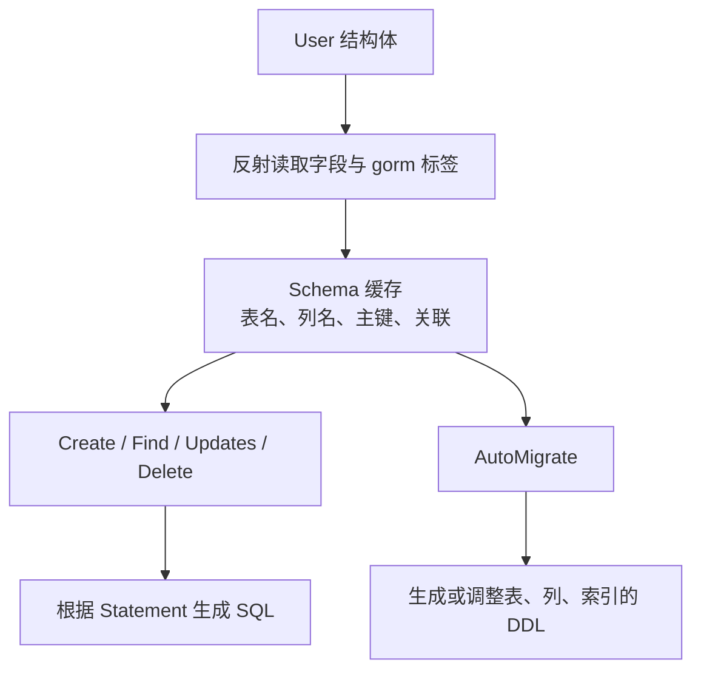
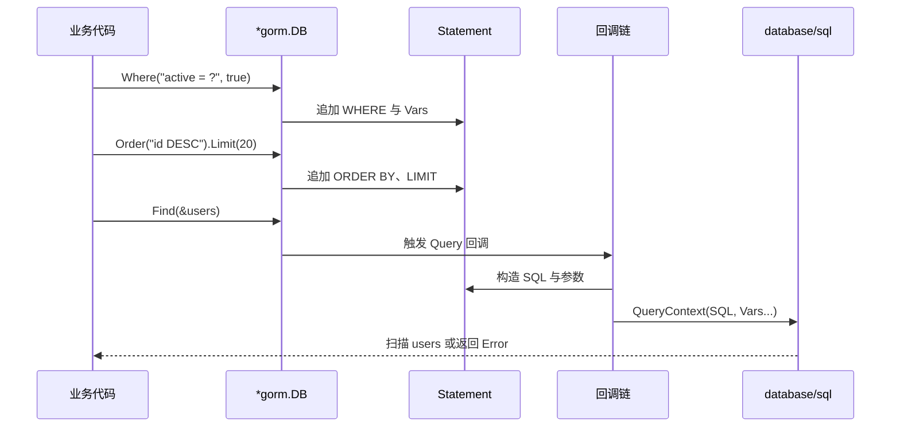

# 2.Go mysql 数据访问：GORM

## 前言

GORM 是 Go 生态中常用的 ORM（Object-Relational Mapping，对象关系映射）库。它把结构体、关联关系和常见数据操作组织成 Go API，让简单的 CRUD 更接近业务语言；但 ORM 不是把 SQL 和数据库问题“隐藏掉”，而是换了一种更结构化的表达方式。

理解 GORM 的关键，是始终看见它下面的那一层：GORM 仍通过 `database/sql` 管理连接并借助 MySQL 驱动与服务器通信。因此，连接池、`Context`、事务边界、索引、锁与 SQL 注入并不会因为使用了 ORM 而自动得到解决；它们仍是应用设计的一部分。

本文先建立模型与连接，再逐步学习迁移、CRUD、条件查询、关联、事务与原生 SQL，并在底层原理部分把链路还原为“GORM → `database/sql` → MySQL 驱动 → MySQL”。示例统一采用传统 API，避免与泛型 API 混用；掌握核心概念后，可继续查阅 [GORM 官方中文文档](https://gorm.io/zh_CN/docs/)。

## 2.1 安装与连接数据库
本节以 MySQL 为例，安装 GORM 和 MySQL 驱动。GORM 的 API 负责组织模型与 SQL，`gorm.io/driver/mysql` 则负责 MySQL 方言和与底层驱动的衔接；两者缺一不可。

```bash
go get gorm.io/gorm
go get gorm.io/driver/mysql
```

下面将数据库初始化封装为一个函数：

```go
package database

import (
    "context"
    "fmt"
    "time"

    "gorm.io/driver/mysql"
    "gorm.io/gorm"
)

func Open(dsn string) (*gorm.DB, error) {
    // mysql.Open 保存方言与 DSN；gorm.Open 构造可复用的 GORM 句柄。
    db, err := gorm.Open(mysql.Open(dsn), &gorm.Config{})
    if err != nil {
        return nil, fmt.Errorf("连接数据库失败：%w", err)
    }

    // GORM 底层使用 database/sql 管理连接池。
    sqlDB, err := db.DB()
    if err != nil {
        return nil, fmt.Errorf("获取底层数据库连接池失败：%w", err)
    }

    // 以下参数作用于真正的 *sql.DB 连接池；它们是“单实例”限制。
    sqlDB.SetMaxIdleConns(10)
    sqlDB.SetMaxOpenConns(30)
    sqlDB.SetConnMaxIdleTime(10 * time.Minute)
    sqlDB.SetConnMaxLifetime(time.Hour)

    // Open 不保证已经连接成功；用有超时的 PingContext 在启动时验证 DSN 和网络。
    ctx, cancel := context.WithTimeout(context.Background(), 3*time.Second)
    defer cancel()

    if err := sqlDB.PingContext(ctx); err != nil {
        _ = sqlDB.Close()
        return nil, fmt.Errorf("数据库连接不可用：%w", err)
    }

    return db, nil
}
```

MySQL DSN 示例：

```text
root:password@tcp(127.0.0.1:3306)/demo?charset=utf8mb4&parseTime=True&loc=Local
```

其中：

- `charset=utf8mb4`：使用完整的 UTF-8 字符集；
- `parseTime=True`：将日期时间字段解析为 `time.Time`；
- `loc=Local`：使用程序运行环境的本地时区。

在生产项目中，用户名、密码和 DSN 不应直接写在源码中，而应通过环境变量或配置中心读取。

`*gorm.DB` 是数据库操作句柄，底层连接由连接池管理。应用通常只在启动时创建一次并在各层之间复用，不应为每个请求重新调用 `gorm.Open`。

程序退出时，可以关闭底层连接池：

```go
// GORM 句柄可在业务层共享；只在进程退出阶段关闭其底层连接池。
sqlDB, err := db.DB()
if err != nil {
    return err
}
defer sqlDB.Close() // 不要在每个请求结束时关闭，否则会反复销毁连接池。
```

## 2.2 定义模型
GORM 使用普通 Go 结构体定义数据模型。模型不是简单的数据传输对象：GORM 会通过反射读取字段与标签，用它们推导表名、列名、主键、索引、软删除规则和关联关系。因此，模型的改动既可能改变查询映射，也可能在 `AutoMigrate` 时影响数据库结构。

```go
package model

import (
    "time"

    "gorm.io/gorm"
)

type User struct {
    // ID 是主键；Create 成功后，数据库生成的 ID 会回填到这里。
    ID        uint           `gorm:"primaryKey"`
    // 这些标签参与 schema 解析，并描述 AutoMigrate 希望创建的约束。
    Name      string         `gorm:"size:64;not null"`
    Email     string         `gorm:"size:128;not null;uniqueIndex"`
    Age       int            `gorm:"not null"`
    Active    bool           `gorm:"not null"`
    CreatedAt time.Time
    UpdatedAt time.Time
    // 包含 DeletedAt 后，普通查询会自动附加 deleted_at IS NULL。
    DeletedAt gorm.DeletedAt `gorm:"index"`
}
```

默认情况下，GORM 遵循约定优于配置的原则：

- `User` 默认映射到 `users` 表；
- `CreatedAt` 映射到 `created_at`；
- 名为 `ID` 的字段默认作为主键；
- `CreatedAt` 和 `UpdatedAt` 会自动维护；
- 模型包含 `gorm.DeletedAt` 时自动启用软删除。

常用标签只需要掌握以下几种：

| 标签                            | 作用                     |
| ------------------------------- | ------------------------ |
| `primaryKey`                    | 设置主键                 |
| `size:64` 或 `type:varchar(64)` | 设置字段大小或数据库类型 |
| `not null`                      | 设置非空约束             |
| `index`                         | 创建普通索引             |
| `uniqueIndex`                   | 创建唯一索引             |
| `column:user_name`              | 指定数据库列名           |

GORM 还提供 `gorm.Model`，其中包含 `ID`、`CreatedAt`、`UpdatedAt` 和 `DeletedAt`。不过显式定义字段通常更清楚，也便于根据项目需要选择主键类型和是否启用软删除。

## 2.3 自动迁移
模型描述了 GORM 如何理解表、列、主键和关联。开发阶段可以使用 `AutoMigrate` 根据模型创建或调整表结构；生产环境则要把它视为一次真实的 schema 变更，而不是无风险的“自动同步”。

```go
// 传入模型指针，GORM 才能解析字段、标签、表名与索引定义。
if err := db.AutoMigrate(&User{}); err != nil {
    return fmt.Errorf("迁移数据表失败：%w", err)
}
```

`AutoMigrate` 会创建不存在的表、字段、索引和部分约束，但不会为了匹配模型而删除不再使用的字段。

它适合以下场景：

- 学习和演示项目；
- 本地开发环境；
- 表结构简单的小型项目。

生产环境中的表结构变更通常需要可审查、可追踪、可回滚的版本化迁移脚本。删除字段、修改历史数据和调整复杂索引时，不应只依赖 `AutoMigrate`。

## 2.4 创建记录
### 2.4.1 创建一条记录
```go
// 传指针后，GORM 才能将 ID、CreatedAt、UpdatedAt 等回填到同一个 user 对象。
user := User{
    Name:   "张三",
    Email:  "zhangsan@example.com",
    Age:    20,
    Active: true,
}

result := db.Create(&user) // Create 是终结方法：此处构造 INSERT 并立即执行。
if result.Error != nil {
    return result.Error
}

fmt.Println("新用户 ID：", user.ID)
```

创建成功后，数据库生成的主键会回填到 `user.ID`。写入前后同一个 `user` 指针承载的是同一份对象状态，因此必须传 `&user`，而不是传值。

### 2.4.2 批量创建
```go
// 传入切片指针可让 GORM 批量执行并把各元素的主键回填到 users 中。
users := []User{
    {
        Name:   "张三",
        Email:  "zhangsan@example.com",
        Age:    20,
        Active: true,
    },
    {
        Name:   "李四",
        Email:  "lisi@example.com",
        Age:    22,
        Active: true,
    },
}

if err := db.Create(&users).Error; err != nil {
    return err
}
```

普通项目先掌握 `Create` 即可。只有一次插入的数据量较大时，才需要进一步了解 `CreateInBatches`。

## 2.5 查询记录
GORM 的查询 API 分为两个阶段：`Where`、`Order`、`Limit` 等链式方法只是在当前会话中累积条件；`First`、`Find`、`Count` 等终结方法才会生成并执行 SQL。先分清这两个阶段，才能正确理解错误出现的位置、Context 的传递点，以及为什么不能随意复用已经附带条件的传统 API 对象。

### 2.5.1 查询单条记录
```go
var user User

// Where 追加参数化条件；First 是终结方法，执行后错误保存在 Error 中。
err := db.
    Where("email = ?", "zhangsan@example.com").
    First(&user).
    Error
```

`First` 用于查询一条记录。没有找到数据时，它会返回 `gorm.ErrRecordNotFound`。

```go
switch {
case errors.Is(err, gorm.ErrRecordNotFound):
    fmt.Println("用户不存在")
case err != nil:
    return err
default:
    fmt.Println(user)
}
```

根据主键查询可以直接写：

```go
// 主键值是独立参数而不是 SQL 片段；若来自请求，先完成类型校验。
if err := db.First(&user, 10).Error; err != nil {
    return err
}
```

当主键来自 HTTP 路径或查询参数时，应先转换成明确的整数类型，不要把未经校验的字符串直接传入查询。

### 2.5.2 查询多条记录
```go
var users []User

// 所有值都通过 ? 传入；Order 使用常量 SQL 片段，因此不会暴露给外部输入。
if err := db.
    Where("age >= ? AND active = ?", 18, true).
    Order("id DESC").
    Find(&users).
    Error; err != nil {
    return err
}
```

`Find` 用于查询多条记录。没有匹配数据时通常返回空切片，不会返回 `gorm.ErrRecordNotFound`。

### 2.5.3 结构体条件与零值
GORM 支持使用结构体作为条件：

```go
// 结构体条件只读取非零字段，实际条件是 name = ? AND age = ?。
db.Where(&User{Name: "张三", Age: 20}).Find(&users)
```

但结构体中的零值默认会被忽略。例如，下面的 `Age: 0` 和 `Active: false` 默认不会进入查询条件：

```go
// Age=0 与 Active=false 是零值，下面代码看起来有条件，实际不会把它们写进 WHERE。
db.Where(&User{
    Age:    0,
    Active: false,
}).Find(&users)
```

需要查询零值时，使用 Map 更直观：

```go
// Map 明确保留零值，适用于“查询 false、0、空字符串”的业务条件。
db.Where(map[string]any{
    "age":    0,
    "active": false,
}).Find(&users)
```

这是使用 GORM 时必须理解的规则：**结构体条件默认忽略零值，Map 条件不会忽略零值。**

## 2.6 链式查询与分页
GORM 通过链式调用逐步构造 SQL。链式写法的价值是把可选条件组装在一起，但也要把“条件构造”和“实际执行”分开看：前半段只修改 Statement，最后一个终结方法才会从连接池借连接并访问 MySQL。

```go
// 从干净的 db 开始一个查询链；每个条件都返回携带新 Statement 的 query。
query := db.Model(&User{})

if keyword != "" {
    // keyword 是值，仍由占位符绑定；不要用 fmt.Sprintf 拼接 LIKE 条件。
    query = query.Where("name LIKE ?", "%"+keyword+"%")
}

if onlyActive {
    query = query.Where("active = ?", true)
}
```

`Where`、`Order`、`Limit` 和 `Offset` 等方法只是在构造查询；调用 `First`、`Find`、`Create`、`Updates`、`Delete` 或 `Count` 等执行方法后，SQL 才会被发送到数据库。

一个常见的分页查询如下：

```go
func ListUsers(
    db *gorm.DB,
    page int,
    pageSize int,
) ([]User, int64, error) {
    // 参数归一化限制 Offset 和返回量，避免负页码或超大页拖垮数据库。
    if page < 1 {
        page = 1
    }
    if pageSize < 1 || pageSize > 100 {
        pageSize = 20
    }

    var total int64
    // Count 与列表查询是两次 SQL；它们之间有并发写入时，total 与当前页允许短暂不一致。
    if err := db.
        Model(&User{}).
        Where("active = ?", true).
        Count(&total).
        Error; err != nil {
        return nil, 0, err
    }

    var users []User
    // 稳定排序是分页的前提；没有 ORDER BY 时，同一页的记录顺序不受保证。
    err := db.
        Where("active = ?", true).
        Order("id DESC").
        Offset((page - 1) * pageSize).
        Limit(pageSize).
        Find(&users).
        Error
    if err != nil {
        return nil, 0, err
    }

    return users, total, nil
}
```

动态排序字段不能直接使用用户输入。正确做法是使用白名单：

```go
// Order 接受 SQL 结构而非值；只允许从白名单取固定片段。
allowedOrders := map[string]string{
    "newest":  "id DESC",
    "oldest":  "id ASC",
    "age_asc": "age ASC",
}

order, ok := allowedOrders[userOrder]
if !ok {
    order = "id DESC"
}

db.Order(order).Find(&users) // Find 是终结方法，触发实际 SELECT。
```

## 2.7 更新记录
更新 API 的隐患主要有两个：遗漏 `WHERE` 导致范围过大，以及零值被结构体更新忽略。下面的代码把目标行、要更新的列和结果检查放在同一处，避免根据“没有报错”就假定写入符合预期。

### 2.7.1 更新单个字段
```go
// Model 指定表，Where 限定目标；Update 触发一条参数化 UPDATE。
result := db.
    Model(&User{}).
    Where("id = ?", userID).
    Update("active", false)

if result.Error != nil {
    return result.Error
}
if result.RowsAffected == 0 {
    return errors.New("用户不存在")
}
```

### 2.7.2 更新多个字段
推荐使用 Map 明确列出需要更新的字段：

```go
// Map 会保留 false、0 与空字符串，适合表达“把字段明确更新成零值”。
result := db.
    Model(&User{}).
    Where("id = ?", userID).
    Updates(map[string]any{
        "name":   "新名字",
        "age":    0,
        "active": false,
    })
```

使用 Map 时，`0`、`false` 和空字符串等零值也会被更新。

使用结构体更新时，GORM 默认只更新非零值：

```go
// 结构体更新默认省略零值，因此该示例只会更新 Name，不会写入 Age 和 Active。
db.Model(&User{}).
    Where("id = ?", userID).
    Updates(User{
        Name:   "新名字",
        Age:    0,
        Active: false,
    })
```

上面的 `Age` 和 `Active` 默认不会被更新。如果确实需要使用结构体更新零值，可以配合 `Select` 明确指定字段：

```go
// Select 显式指定列后，结构体中的零值也会被纳入 UPDATE。
db.Model(&User{}).
    Where("id = ?", userID).
    Select("Name", "Age", "Active").
    Updates(User{
        Name:   "新名字",
        Age:    0,
        Active: false,
    })
```

因此，更新接口中通常更推荐使用 Map 或专门的更新参数结构体，避免零值被意外忽略。

GORM 默认会阻止没有条件的全表更新，并返回 `gorm.ErrMissingWhereClause`。不要为了绕过保护而随意添加 `WHERE 1 = 1`，全表更新应经过明确的业务确认。

## 2.8 删除与软删除
删除之前先区分“对用户不可见”和“从数据库永久移除”。模型中有 `gorm.DeletedAt` 时，普通 `Delete` 是一次 `UPDATE`；只有 `Unscoped` 才会发送物理 `DELETE`。两种操作都应保留明确的筛选条件和错误处理。
根据主键删除记录：

```go
// 因 User 含 DeletedAt，此处更新 deleted_at；userID 作为参数绑定到条件中。
result := db.Delete(&User{}, userID)
if result.Error != nil {
    return result.Error
}
```

由于 `User` 模型包含 `gorm.DeletedAt`，这里执行的是软删除。GORM 实际上会更新 `deleted_at`，普通查询会自动排除已经软删除的数据。

查询包含软删除记录在内的全部数据：

```go
// Unscoped 移除软删除过滤条件，只应出现在明确的数据清理流程中。
db.Unscoped().Find(&users)
```

永久删除：

```go
// 这会真正删除记录，通常需要额外的权限、审计或二次确认。
db.Unscoped().Delete(&User{}, userID)
```

`Unscoped().Delete` 会真正删除数据，通常只应用于明确的数据清理场景。

GORM 同样会阻止没有条件的全表删除。更新和删除操作完成后，应根据业务需要检查 `RowsAffected`，不能只检查 `Error`。

## 2.9 错误处理与请求上下文
GORM 传统 API 将错误保存在返回值的 `Error` 字段中。不要通过 `User{}` 是否全是零值来猜测查询结果：零值可能是合法数据，也可能是扫描尚未发生。错误、是否找到记录和影响行数是三个独立信号，应分别处理。

```go
// 先保存返回的 *gorm.DB，再从 Error 读取这一次终结方法的执行结果。
result := db.Where("email = ?", email).First(&user)
if result.Error != nil {
    return result.Error
}
```

常见处理原则如下：

1. 每次数据库操作后检查 `Error`；
2. 使用 `errors.Is` 判断 `gorm.ErrRecordNotFound`；
3. 更新和删除后根据需要检查 `RowsAffected`；
4. 不要通过结构体字段是否为零值来判断查询是否成功；
5. 为请求设置超时，避免数据库操作无限等待。

在 Web 项目中，应将请求的 `context.Context` 传给 GORM：

```go
func GetUser(ctx context.Context, db *gorm.DB, id uint) (User, error) {
    var user User

    // WithContext 返回会话副本，把请求取消、超时与追踪信息传到本次数据库操作。
    err := db.
        WithContext(ctx).
        First(&user, id).
        Error

    return user, err
}
```

这样，当客户端取消请求或请求超时时，数据库操作也可以随之取消。

## 2.10 事务
当多个数据库操作必须同时成功或同时失败时，应使用事务。这里的关键不是“把两条 SQL 写进一个回调”而是选择正确的并发控制方式：库存扣减与创建订单必须使用同一个 `tx`，并让“库存仍然足够”的判断和扣减发生在同一条 `UPDATE` 中，避免先读后写造成超卖。

下面以“创建订单并扣减库存”为例：

```go
type Product struct {
    // Stock 是会并发变化的业务字段；仅在应用内先读取再扣减并不安全。
    ID    uint `gorm:"primaryKey"`
    Name  string
    Stock int
}

type Order struct {
    // ProductID 建立订单与商品的业务关联；是否在数据库层创建外键由项目 schema 决定。
    ID        uint `gorm:"primaryKey"`
    ProductID uint
    Quantity  int
    CreatedAt time.Time
}
```

```go
func CreateOrder(
    ctx context.Context,
    db *gorm.DB,
    productID uint,
    quantity int,
) error {
    // 在进入事务前拒绝无效业务输入，避免无意义地占用事务连接。
    if quantity <= 0 {
        return errors.New("购买数量必须大于 0")
    }

    // 回调返回 nil 时提交；返回任意错误时 GORM 回滚。事务内只使用 tx。
    return db.WithContext(ctx).Transaction(func(tx *gorm.DB) error {
        // 条件与扣减在同一条 SQL 中完成：stock 不足时不会更新，避免并发超卖。
        result := tx.
            Model(&Product{}).
            Where("id = ? AND stock >= ?", productID, quantity).
            Update("stock", gorm.Expr("stock - ?", quantity))

        if result.Error != nil {
            return result.Error
        }
        if result.RowsAffected == 0 {
            // 这里同时覆盖“商品不存在”和“库存不足”；如需区分，应在同一事务内补充查询。
            return errors.New("商品不存在或库存不足")
        }

        order := Order{
            ProductID: productID,
            Quantity:  quantity,
        }

        // 创建订单也必须使用 tx；外层 db.Create 会脱离当前事务。
        if err := tx.Create(&order).Error; err != nil {
            return err
        }

        return nil
    })
}
```

`Transaction` 的执行规则为：

- 回调返回 `nil`，事务提交；
- 回调返回错误，事务回滚；
- 事务内部必须使用回调参数 `tx`，不能继续使用外部的 `db`。

对于大多数业务代码，优先使用 `Transaction` 回调即可。手动调用 `Begin`、`Commit`、`Rollback` 和保存点属于更复杂的场景，可在需要时查阅官方文档。

## 2.11 关联查询
关联关系是 ORM 的重要能力，但入门阶段先掌握模型定义和 `Preload` 就足够。要注意，预加载不是魔法 Join：GORM 会按照关联元数据额外查询并回填数据。它能避免在循环中“一条用户再查一次订单”的 N+1 问题，却也可能在没有范围控制时一次装载大量行。

假设一个用户拥有多个订单：

```go
type User struct {
    // Orders 的元素类型和外键字段让 GORM 推导一对多关系。
    ID     uint
    Name   string
    Orders []Order
}

type Order struct {
    // UserID 是关联键；生产 schema 还应按查询路径设计索引和约束。
    ID     uint
    UserID uint
    Amount int64
}
```

查询用户并预加载订单：

```go
var user User

// 先查询用户，再批量加载 Orders 并按 UserID 回填；不要在循环中为每个用户单独查询订单。
if err := db.
    Preload("Orders").
    First(&user, userID).
    Error; err != nil {
    return err
}
```

普通 `First` 只查询用户表，`Preload("Orders")` 会额外加载关联订单。

一对一、一对多和多对多关系的标签与约束较多，不应在基础教程中一次全部展开。实际项目遇到具体关系时，再结合官方关联文档学习更有效。

## 2.12 原生 SQL 与 SQL 注入
ORM 不能完全替代 SQL。复杂统计、数据库特有功能或性能敏感查询中，原生 SQL 往往更直接；它仍由同一个连接池与驱动执行，也仍必须遵守参数绑定、超时、结果集关闭和事务边界。选择原生 SQL 不是放弃 GORM，而是选择更适合问题的表达方式。

查询数据可以使用 `Raw`：

```go
type UserSummary struct {
    // 字段名与 SELECT 列名对应；必要时可增加 gorm:"column:..." 标签显式映射。
    Name string
    Age  int
}

var users []UserSummary

// Raw 的 SQL 结构由程序定义，18 是独立绑定的参数值。
err := db.Raw(
    "SELECT name, age FROM users WHERE age >= ?",
    18,
).Scan(&users).Error
```

执行更新或删除语句可以使用 `Exec`：

```go
// Exec 适合不需要 Rows 的原生写入；仍应检查 result.Error 和按需检查 RowsAffected。
result := db.Exec(
    "UPDATE users SET active = ? WHERE last_login_at < ?",
    false,
    deadline,
)
```

无论使用 GORM 查询 API 还是原生 SQL，外部数据都应通过占位符传递：

```go
// 安全：用户输入只是参数值，驱动不会把它解释为 SQL 语法。
db.Where("name = ?", userInput).First(&user)
```

不要将用户输入直接拼接到 SQL 中：

```go
// 危险：fmt.Sprintf 的结果已成为 SQL 文本，绕开了 GORM 的参数绑定。
db.Where(
    fmt.Sprintf("name = '%s'", userInput),
).First(&user)
```

需要特别注意：占位符只能安全绑定“值”，不能代替表名、字段名、排序方向、SQL 函数或完整 SQL 片段。动态排序和动态字段必须通过白名单映射。

GORM 日志中显示的 SQL 主要用于调试，不一定与数据库实际执行时的参数转义形式完全相同，不应将日志 SQL 当作可以直接复制执行的安全语句。

## 2.13 项目实践建议
### 2.13.1 不要把 GORM 当作 SQL 的替代品
使用 GORM 仍然需要理解主键、索引、Join、事务和查询执行计划。ORM 只是帮助生成和组织 SQL，不能自动解决错误的表结构或低效查询。

### 2.13.2 不要为每个请求创建数据库连接
应用启动时初始化一个 `*gorm.DB` 并复用，由底层 `database/sql` 连接池负责管理连接。

### 2.13.3 请求链路中使用 `WithContext`
这样才能让超时、取消和链路追踪作用于数据库操作。

### 2.13.4 开发环境观察 SQL，生产环境控制日志量
排查问题时可以针对某次操作使用：

```go
// Debug 只建议用于本地或短时间排障；SQL 日志可能包含敏感业务参数。
db.Debug().Where("email = ?", email).First(&user)
```

不要在高流量生产环境中长期输出所有 SQL 和参数。

### 2.13.5 生产迁移使用版本化脚本
`AutoMigrate` 适合学习和简单开发，但复杂生产变更应使用迁移工具管理版本和回滚策略。

### 2.13.6 对更新和删除保持谨慎
明确 `WHERE` 条件，检查 `RowsAffected`，并区分软删除与永久删除。

### 2.13.7 复杂查询允许回到原生 SQL
当链式 API 已经让查询变得难以阅读时，使用参数化的原生 SQL 往往更清晰，也更方便分析和优化。

## 2.14 把一次数据操作串成闭环
学习 GORM 不需要记忆全部 API。一次可维护的数据操作应能回答下面几个问题：模型如何映射到表？条件在哪一步形成？哪一个调用真正执行 SQL？连接、事务和取消信号由谁管理？基础阶段应真正掌握以下内容：

- 初始化并复用 `*gorm.DB`，合理配置底层连接池；
- 通过结构体和常用标签定义模型；
- 使用 `Create`、`First`、`Find`、`Updates` 和 `Delete` 完成 CRUD；
- 理解结构体条件和结构体更新会忽略零值；
- 使用 `Where` 占位符传递参数，动态 SQL 结构使用白名单；
- 正确处理 `Error`、`ErrRecordNotFound` 和 `RowsAffected`；
- 使用 `Transaction` 保证多步写操作的数据一致性；
- 根据需要使用 `Preload` 和参数化原生 SQL。

复合主键、复杂迁移器、钩子、锁、优化器提示、逐行扫描和保存点等内容，只有在项目出现对应需求时再学习即可。重要的是，面对任何新 API 都能把它放回“模型解析 → Statement → SQL → 连接池 → MySQL”这条链上判断其影响。

## 底层原理补充

这一部分从 GORM 的职责倒推前面的 API。GORM 的工作是把 Go 中的模型与链式条件组织为 SQL；它不接管 MySQL 协议，也不创建另一套连接池。看懂这个分层，才能知道何时查 GORM 日志，何时看 `DBStats`，何时必须回到执行计划和数据库锁。

### 从 `gorm.Open` 到 MySQL 的完整链路

```mermaid
flowchart LR
    A[业务代码<br/>db.Where(...).First(...)] --> B[GORM 会话<br/>*gorm.DB + Statement]
    B --> C[GORM 回调链<br/>构造 SQL 与 Vars]
    C --> D[MySQL Dialector<br/>方言、占位符、迁移规则]
    D --> E[database/sql<br/>*sql.DB 连接池]
    E --> F[go-sql-driver/mysql<br/>认证、协议、编解码]
    F --> G[(MySQL Server)]
```

`mysql.Open(dsn)` 创建的是 GORM 的 MySQL dialector 配置；`gorm.Open` 再以这个 dialector 创建根 `*gorm.DB`。如果没有传入已有连接，MySQL dialector 会建立底层的 `*sql.DB`；如果传入 `mysql.Config{Conn: sqlDB}`，则会复用你提供的标准库连接池。无论哪种方式，连接池的实际入口仍是 `db.DB()` 返回的 `*sql.DB`。

这带来三个工程结论：应用进程通常只初始化一次根 `*gorm.DB`；连接池参数和 `DBStats` 必须在 `*sql.DB` 上设置和读取；`gorm.Open` 成功不等于数据库一定可达，启动阶段仍应 `PingContext`。GORM 不会绕过 `database/sql`，因此慢 SQL、连接耗尽、网络中断、行锁等待和 MySQL 连接上限都仍然需要按标准库与数据库的方式处理。

### 模型如何被解析为表、列和约束

第一次使用某个模型时，GORM 会通过反射解析结构体字段、`gorm:"..."` 标签、表名约定、主键、关联字段和软删除字段，并把得到的 schema 缓存起来。`User`、`CreatedAt`、`DeletedAt` 之所以具有特殊行为，不是 Go 语言本身认识这些名字，而是 GORM 的 schema 解析器和回调链认识这些约定。



因此，标签的影响有两层：运行时，它决定扫描结果如何映射、软删除条件是否自动加入；迁移时，它影响 GORM 尝试创建的列、索引或约束。标签并不能证明生产库已经符合这些规则。尤其是唯一约束、外键、删除策略和历史数据兼容性，必须通过版本化迁移和数据库审查保证，而不能只依赖结构体看起来“写对了”。

### 链式调用：何时只是积累条件，何时真正执行 SQL

传统 API 的 `Where`、`Select`、`Order`、`Limit`、`Preload` 等是链式方法；它们主要向 `Statement` 增加 Clause、模型和变量。`First`、`Find`、`Create`、`Updates`、`Delete`、`Count`、`Scan` 等是终结方法，会触发对应的回调链，构造 SQL 后访问数据库。



下面的伪代码省略了大量错误处理和插件机制，只保留最重要的数据流：链式方法返回携带 `Statement` 的新会话，终结方法把它交给回调执行。

```go
func (db *DB) Where(query any, args ...any) *DB {
    next := db.getInstance() // 从根 db 派生会话，保存这条查询链自己的状态。
    next.Statement.AddClause(buildWhere(query, args))
    return next              // 这里只积累条件，没有向 MySQL 发送 SQL。
}

func (db *DB) Find(dest any) *DB {
    tx := db.getInstance()
    tx.Statement.Dest = dest // 记录结果要扫描到哪里。
    return tx.callbacks.Query().Execute(tx) // 终结方法触发 SQL 构造、执行与扫描。
}
```

根 `db` 可以安全地被多个请求复用；但传统 API 中，已经调用过链式方法或终结方法而返回的 `*gorm.DB` 可能携带已有条件。把它保存下来再用于两个互不相关的查询，可能把前一次条件带到下一次，形成条件污染。需要复用基础条件时，用 `Session(&gorm.Session{})`、`WithContext` 等新会话方法建立可安全复用的起点：

```go
// Safe session 会在每次后续链式调用时从当前基础条件派生新的 Statement。
activeUsers := db.Where("active = ?", true).Session(&gorm.Session{})

// 两次查询各自只追加自己的年龄条件，不会互相累积。
activeUsers.Where("age >= ?", 18).Find(&adults)
activeUsers.Where("age < ?", 18).Find(&minors)
```

### 回调链如何处理 CRUD 与错误

终结方法会选择相应的回调链：`Create` 处理插入与主键回填，`Query` 处理查询与扫描，`Update` 和 `Delete` 处理写操作。回调链根据 `Statement` 中的 schema、条件、列选择与参数构造 SQL、收集变量，再通过连接池交给驱动。`Debug()` 看到的是这一步生成的调试 SQL；它便于观察结构和参数数量，但不能代替 `EXPLAIN`，也不能把日志中显示的字符串当作已完整转义、可安全复制的生产 SQL。

GORM 默认会将单条创建、更新和删除操作放入事务，以换取写入一致性；这会带来额外开销。是否关闭默认事务必须建立在压测和数据一致性要求之上，而不是为了“看起来更快”全局关闭。多步业务动作仍需要显式 `Transaction`，因为多个独立默认事务不能保证它们一起成功。

错误也沿这条链向上返回。传统 API 将终结方法的错误放进 `result.Error`；零行的 `First`/`Take` 等单记录查询会以 `gorm.ErrRecordNotFound` 表示，而 `Find` 的零行结果通常是空切片且无该错误。`RowsAffected` 是执行后额外的业务信号，不应混同于 `Error`。每一层都应保留错误上下文，避免只返回“数据库失败”而丢掉实际操作。

### `Preload` 如何避免 N+1，又为何仍要控制范围

`Preload("Orders")` 通常不是把所有表硬拼成一条巨大的 Join，而是先查主模型，再收集主键并执行关联查询，最后按外键把关联行回填到结构体。这个批量加载过程避免了“每读一个用户再发一条订单查询”的 N+1 模式。

```mermaid
flowchart LR
    A[查询用户列表] --> B[收集 User.ID]
    B --> C[SELECT ... FROM orders<br/>WHERE user_id IN (...)]
    C --> D[按 Order.UserID 分组]
    D --> E[回填到 User.Orders]
```

它并不自动限制数据量：如果主查询返回 1 万个用户、每个用户又有大量订单，关联查询与内存占用仍可能失控。高流量接口应先限制主查询的分页和排序，按需要选择关联字段与关联条件；深层预加载更要明确是否真的需要。复杂报表或需要精确 Join 语义的场景，使用参数化原生 SQL 往往更清楚。

### `Transaction` 的真正边界

`db.WithContext(ctx).Transaction(func(tx *gorm.DB) error { ... })` 会先从底层 `*sql.DB` 借一条连接并开始事务。回调返回 `nil` 时提交，返回错误或发生 panic 时回滚；事务内的 `tx` 代表这条固定连接。只有通过 `tx` 发出的 SQL 才在同一事务里，混入外层 `db` 的操作会另借连接，无法由这次回滚覆盖。

库存示例中的 `WHERE id = ? AND stock >= ?` 与 `stock = stock - ?` 被放进同一条 `UPDATE`，让条件判断和写入在 MySQL 内原子发生；这比“先 `SELECT stock`，再在 Go 中减一，最后 `UPDATE`”更能避免并发超卖。但事务仍不能自动解决所有问题：隔离级别、锁范围、死锁重试、幂等键、消息投递和外部服务调用的补偿策略，都要由业务设计明确决定。事务应尽量短，只覆盖必须一起成功的数据库写入，不要在其中等待远程 HTTP、人工确认或耗时计算。

### Context、SQL 注入与可观测性的最后一道边界

`WithContext(ctx)` 会将请求的取消和超时传给 GORM 与底层 `database/sql`；传统 API 中它也是创建独立会话的方式。Web 服务应把 `r.Context()` 一路传到 repository，而不是重新创建无关的 `context.Background()`。驱动是否能立即中断已在服务端执行的 SQL 取决于其取消能力，但即使不能立刻中断，Context 也能至少限制调用方等待连接池和结果的时间。

GORM 对 `Where("name = ?", value)`、`Create`、`Updates(map...)` 这类值参数会使用 `database/sql` 的占位符绑定；`Order`、`Select`、`Table`、`Raw`、`Exec`、`Joins` 等接收 SQL 片段的方法不能把外部输入直接放进去。值使用 `?`，SQL 结构使用白名单，这是使用 GORM 和直接使用 `database/sql` 完全相同的安全边界。

排障时把三类证据关联起来：GORM 日志用于确认最终 SQL 形状；`*sql.DB` 的 `DBStats` 用于识别连接池等待；MySQL 的慢查询、`EXPLAIN` 和锁等待信息用于解释服务端为什么慢。只看其中一层，往往会把索引问题误判为 GORM 问题，或把未关闭资源误判为数据库容量问题。

### 参考资料

- [GORM：连接数据库](https://gorm.io/docs/connecting_to_the_database.html)
- [GORM：方法链与会话复用](https://gorm.io/docs/method_chaining.html)
- [GORM：事务](https://gorm.io/docs/transactions.html)
- [GORM：Context](https://gorm.io/docs/context.html)
- [GORM：安全性与 SQL 注入边界](https://gorm.io/docs/security.html)
- [Go `database/sql` 包文档](https://pkg.go.dev/database/sql)

## 总结

GORM 的价值在于模型映射、SQL 构造和常见数据操作的统一表达；它不取代数据库本身的规则。每次 `Create`、`Find`、`Updates` 或 `Preload`，最终仍要经过 `database/sql` 的连接池和 MySQL 驱动，在 MySQL 中执行 SQL、选择索引并处理锁与事务。

实践中，让 GORM 承担模型明确、查询结构稳定的 CRUD；当查询已经比原生 SQL 更难读、需要数据库特有能力或必须精确控制语句时，使用参数化原生 SQL 是正常选择。无论采用哪一种写法，都要检查最终 SQL 与执行计划，传递请求 `Context`，处理 `Error` 与 `RowsAffected`，控制预加载范围，并让同一业务动作中的写入处在清晰、短小且可回滚的事务边界内。这样，ORM 才会成为降低重复劳动的工具，而不是隐藏复杂度的黑盒。
