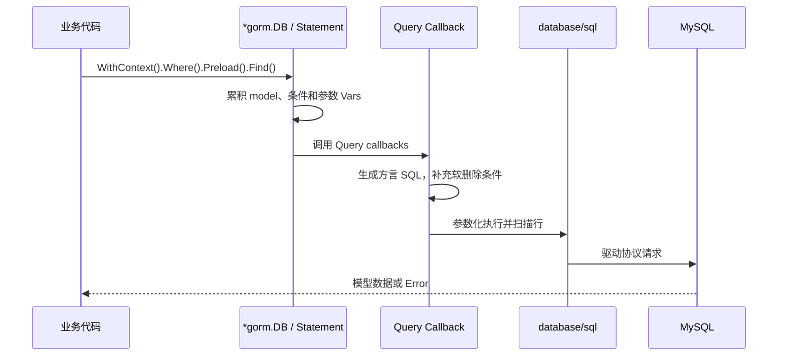

# 03. GORM：模型映射、CRUD 与事务

## 前言

GORM 是把 Go 结构体和关系型数据库之间的重复工作收起来的 ORM：它根据模型与 tag 生成 SQL，绑定参数，并将行扫描回结构体。它适合常规 CRUD 和关联加载；它不会自动替你设计索引、判断迁移风险或定义业务事务。

理解 GORM 的最好方式是把它看成一个 SQL 构造与执行层：链式调用逐步描述查询，`Find`、`Create`、`Updates` 等终结方法才执行。写代码时始终问三个问题：映射出的表和列是什么？零值会不会被忽略？多步修改是否真的在同一事务？

示例使用 MySQL。安装依赖：

```bash
go get gorm.io/gorm
go get gorm.io/driver/mysql
```

底层仍是 `database/sql` 和 MySQL 驱动；DSN、时区、连接池容量的选择参见[MySQL 与 database/sql](/backend/go/frameworks-and-ecosystem/02-data-access/01-mysql-database-sql/)。

## 建立一套明确的模型映射

以下订单模型贯穿全文。显式 tag 让重要约束和索引意图直接可见；普通字段仍采用 GORM 的 snake_case、复数表名约定。

```go
package model

import (
	"time"

	"gorm.io/gorm"
)

type Product struct {
	ID        uint64    `gorm:"primaryKey"`          // 主键列为 id。
	Name      string    `gorm:"size:128;not null"`  // 对迁移表达长度和非空意图。
	Stock     int       `gorm:"not null"`
	CreatedAt time.Time // 默认映射 created_at，创建时由 GORM 写入。
	UpdatedAt time.Time // 更新模型时由 GORM 自动维护。
}

type Order struct {
	ID        uint64         `gorm:"primaryKey"`
	ProductID uint64         `gorm:"not null;index:idx_product_created"`
	Product   Product        `gorm:"foreignKey:ProductID"` // 用于 Preload 的 belongs-to 关联。
	Quantity  int            `gorm:"not null"`
	Note      *string        `gorm:"size:255"` // nil 映射为 SQL NULL，空字符串仍是有效值。
	Status    string         `gorm:"size:32;not null;index"`
	CreatedAt time.Time      `gorm:"index:idx_product_created"`
	UpdatedAt time.Time
	DeletedAt gorm.DeletedAt `gorm:"index"` // 含此字段后，普通查询默认过滤软删除记录。
}
```

默认情况下 `ProductID` 对应 `product_id`，`Order` 对应 `orders`。遗留数据库或缩写规则不清晰时，应通过 `column:` tag、`TableName()` 或自定义 `NamingStrategy` 明确说明，不能依赖读者猜测约定。

`Product` 与 `Order` 的外键约束是否要由迁移生成，是数据库设计决策。即使模型写了关联字段，也不表示数据库一定已有外键或索引；发布前要核对实际 schema。

## 打开 GORM 与底层连接池

`gorm.Open` 返回的是 `*gorm.DB`。连接池配置和关闭都针对它暴露的底层 `*sql.DB`：

```go
package store

import (
	"context"
	"fmt"
	"time"

	"gorm.io/driver/mysql"
	"gorm.io/gorm"
)

func Open(dsn string) (*gorm.DB, error) {
	db, err := gorm.Open(mysql.Open(dsn), &gorm.Config{})
	if err != nil {
		return nil, fmt.Errorf("打开 GORM: %w", err)
	}

	sqlDB, err := db.DB()
	if err != nil {
		return nil, fmt.Errorf("取得底层连接池: %w", err)
	}
	// 这是每个应用实例的池配置，应根据数据库容量和压测调整。
	sqlDB.SetMaxOpenConns(20)
	sqlDB.SetMaxIdleConns(5)
	sqlDB.SetConnMaxLifetime(30 * time.Minute)

	ctx, cancel := context.WithTimeout(context.Background(), 3*time.Second)
	defer cancel()
	if err := sqlDB.PingContext(ctx); err != nil {
		_ = sqlDB.Close()
		return nil, fmt.Errorf("检查数据库连通性: %w", err)
	}
	return db, nil
}
```

应用启动时创建一次并注入服务；退出时调用一次 `sqlDB.Close()`。不要为每个请求 `gorm.Open`。请求的取消信号应通过 `db.WithContext(ctx)` 放到这一次操作链上。

## AutoMigrate 的边界

开发环境里可以据模型创建缺失的表、列和索引：

```go
// 先迁移被引用的 Product，再迁移含关联的 Order，便于阅读依赖关系。
if err := db.AutoMigrate(&model.Product{}, &model.Order{}); err != nil {
	return fmt.Errorf("迁移订单模型: %w", err)
}
```

`AutoMigrate` 适合本地开发、原型和有限的增量变更。它会尝试创建缺失对象或调整某些列，但不会为了让模型“完全一致”而删除历史列。生产变更仍应使用版本化迁移：评估 DDL 锁、数据回填和回滚方案，审核生成的 SQL 后再执行。模型 tag 不是生产 schema 变更的审批记录。

## 源码视角：Statement 到 Callback

GORM 内部的 `Statement` 保存本次操作的模型、表名、条件、变量、context 和 SQL 构造状态。`Where`、`Order`、`Limit` 等链式方法主要是在派生的 `*gorm.DB` 上累积 Statement；执行方法才进入注册好的 callbacks。

```go
// 下面是阅读源码时的简化心智模型，不是供业务代码依赖的结构定义。
type Statement struct {
	Model   any
	Table   string
	Clauses map[string]any // WHERE、ORDER BY、LIMIT 等子句。
	Vars    []any          // 参数值，与 SQL 文本分开保存。
	Context context.Context
}
```

查询路径可概括为：



源码中 `callbacks/query.go` 负责构造查询并调用 `QueryContext`；`callbacks/create.go`、`update.go` 等负责各自操作。这里的结论是实用的：`Where` 本身还没有数据库错误可检查；在 `First`、`Find`、`Create`、`Updates` 返回后检查 `.Error`；用 `WithContext` 才能把取消信号传给底层驱动。不要让业务代码直接修改 `Statement` 或依赖 callback 注册顺序。

## 连续示例：创建与读取订单

仓储把数据库访问集中起来。`Create` 前仍校验业务输入，GORM 的 `not null` 不是用户输入校验器。

```go
package store

import (
	"context"
	"errors"
	"fmt"

	"example.com/order-service/model"
	"gorm.io/gorm"
)

type OrderRepository struct {
	db *gorm.DB
}

func NewOrderRepository(db *gorm.DB) *OrderRepository {
	return &OrderRepository{db: db}
}

func (r *OrderRepository) Create(ctx context.Context, productID uint64, quantity int, note *string) (model.Order, error) {
	if productID == 0 || quantity <= 0 {
		return model.Order{}, fmt.Errorf("商品和数量必须有效")
	}

	order := model.Order{
		ProductID: productID,
		Quantity:  quantity,
		Note:      note,
		Status:    "pending", // 创建时由服务明确写出状态，不依赖数据库偶然默认值。
	}
	if err := r.db.WithContext(ctx).Create(&order).Error; err != nil {
		return model.Order{}, fmt.Errorf("创建订单: %w", err)
	}
	// Create 成功后，GORM 会把数据库生成的主键及自动时间戳回填到 order。
	return order, nil
}

func (r *OrderRepository) FindWithProduct(ctx context.Context, id uint64) (model.Order, error) {
	var order model.Order
	err := r.db.WithContext(ctx).
		Preload("Product"). // 关联加载，不会要求调用者再为 Product 单独循环查询。
		First(&order, id).   // 主键条件由 GORM 参数化生成。
		Error
	if errors.Is(err, gorm.ErrRecordNotFound) {
		return model.Order{}, fmt.Errorf("订单 %d 不存在: %w", id, err)
	}
	if err != nil {
		return model.Order{}, fmt.Errorf("读取订单: %w", err)
	}
	return order, nil
}
```

`Preload("Product")` 的目标是消除 N+1 查询：GORM 会先取订单，再用关联键批量查询商品并回填，而不是每个订单发一次查询。是否用 `Preload` 取决于调用方是否真的需要商品数据；不用就避免多余读取。需要检查 SQL 时可临时写 `db.Debug()`，生产日志则应由受控 logger 管理，避免长期记录敏感参数。

## 更新：先选 API，特别是零值

GORM 的结构体更新默认只更新非零字段。这个规则能方便“只改已填写字段”的表单，却会让 `false`、`0`、`""` 这样的有效目标值被跳过。

```go
// 错误示例：Quantity 为 0 时，结构体 Updates 通常不会生成 quantity = 0。
err := db.Model(&model.Order{ID: orderID}).Updates(model.Order{Quantity: 0}).Error
```

当需要精确把字段设为零值时，使用 `map` 或 `Select`；同时带上条件，防止无意更新全部记录。

```go
func (r *OrderRepository) MarkCancelled(ctx context.Context, id uint64) error {
	result := r.db.WithContext(ctx).
		Model(&model.Order{}).
		Where("id = ? AND status = ?", id, "pending"). // 条件和值均参数化绑定。
		Updates(map[string]any{
			"status": "cancelled", // map 会明确包含指定字段，即使值是零值。
		})
	if result.Error != nil {
		return fmt.Errorf("取消订单: %w", result.Error)
	}
	if result.RowsAffected != 1 {
		return fmt.Errorf("订单不存在或当前状态不能取消")
	}
	return nil
}
```

`Save` 会保存全部字段，且用途与 `Create` 有重叠；在服务端更新路径中，`Model(...).Where(...).Updates(...)` 通常更容易看清更新范围。删除时，含 `gorm.DeletedAt` 的模型默认执行软删除；普通查询自动加 `deleted_at IS NULL`。这是数据保留策略，不是权限策略；恢复、审计或物理删除要有明确业务规则。

## 关联加载不是自动发生的

下面列出某商品的订单并同时加载商品。即使多个订单指向同一商品，仍应只在确实需要关联对象时 preload。

```go
func (r *OrderRepository) ListForProduct(ctx context.Context, productID uint64) ([]model.Order, error) {
	orders := make([]model.Order, 0)
	err := r.db.WithContext(ctx).
		Where("product_id = ?", productID).
		Order("created_at DESC"). // 排序语句来自固定代码，而不是客户端传入的列名。
		Preload("Product").
		Find(&orders).Error
	if err != nil {
		return nil, fmt.Errorf("查询商品订单: %w", err)
	}
	return orders, nil
}
```

GORM 会绑定 `?` 对应的普通值，但 SQL 关键字、列名、`Order` 的字符串不应直接接收不可信输入。若需要用户选择排序字段，应在应用中用白名单映射为固定 SQL 片段。

## 事务：在闭包中只使用 tx

订单创建和库存扣减要么一起成功，要么一起失败。`db.Transaction` 会开始事务，闭包返回 `nil` 时提交，返回错误时回滚。闭包内必须使用传入的 `tx`，不是仓储字段 `r.db`。

```go
func (r *OrderRepository) PlaceOrder(ctx context.Context, productID uint64, quantity int, note *string) (created model.Order, err error) {
	if productID == 0 || quantity <= 0 {
		return model.Order{}, fmt.Errorf("商品和数量必须有效")
	}

	err = r.db.WithContext(ctx).Transaction(func(tx *gorm.DB) error {
		// 条件更新在数据库端保证并发时不会把库存扣成负数。
		result := tx.Model(&model.Product{}).
			Where("id = ? AND stock >= ?", productID, quantity).
			Update("stock", gorm.Expr("stock - ?", quantity))
		if result.Error != nil {
			return fmt.Errorf("扣减库存: %w", result.Error)
		}
		if result.RowsAffected != 1 {
			return fmt.Errorf("商品不存在或库存不足")
		}

		created = model.Order{
			ProductID: productID,
			Quantity:  quantity,
			Note:      note,
			Status:    "pending",
		}
		if err := tx.Create(&created).Error; err != nil {
			return fmt.Errorf("创建订单: %w", err)
		}
		return nil // Transaction 在这里提交。
	})
	if err != nil {
		return model.Order{}, err // Transaction 已经回滚。
	}
	return created, nil
}
```

不要在事务闭包中发 HTTP 请求、等待队列或做大量计算。事务越短，连接和锁被占用的时间越可控。GORM 默认会为单次 create/update/delete 使用事务以保护写入；在显式业务事务中更重要的是把相关操作全部放到同一个 `tx`。

## 总结

GORM 让模型、查询条件和关联读取更紧凑，但不会抹去关系数据库的规则。显式定义关键映射，谨慎使用 `AutoMigrate`，在更新前确认零值语义，按需 `Preload`，并在业务原子操作中只使用同一个 `tx`。最终仍要查看生成 SQL、执行计划和数据库监控，确认 ORM 表达的正是想要执行的事情。

## 参考资料

- [GORM 官方文档：Models](https://gorm.io/docs/models.html)
- [GORM 官方文档：Create](https://gorm.io/docs/create.html)
- [GORM 官方文档：Update](https://gorm.io/docs/update.html)
- [GORM 官方文档：Preload](https://gorm.io/docs/preload.html)
- [GORM 官方文档：Transactions](https://gorm.io/docs/transactions.html)
- [GORM 源码：callbacks](https://github.com/go-gorm/gorm/tree/master/callbacks)
