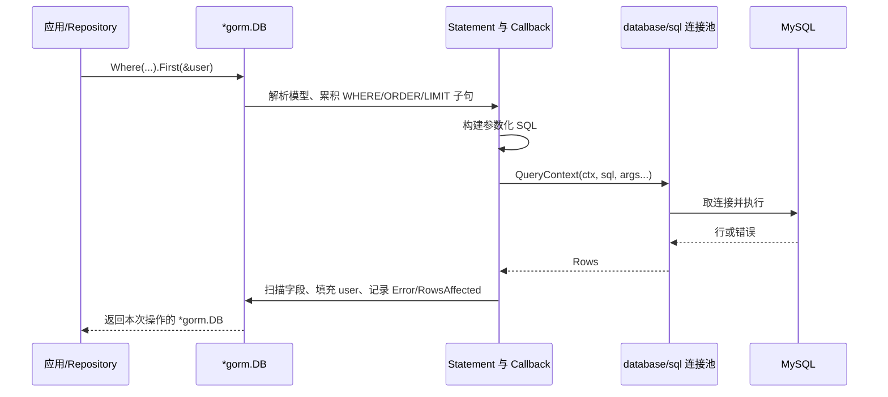
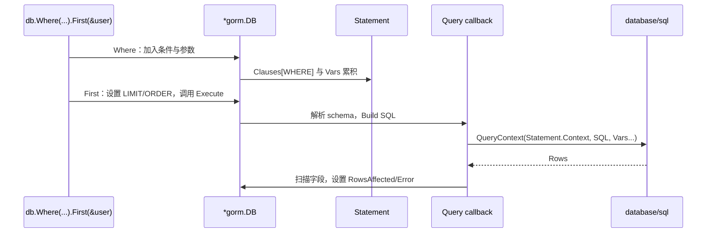

# 03. GORM：从模型映射到可靠的数据访问

## 前言

用户注册、商品查询和订单创建最终都要落到关系型数据库。直接使用 `database/sql` 时，程序负责写 SQL、绑定参数、扫描每一行和管理事务；这些工作很明确，但大量简单 CRUD 会重复出现。GORM 是 Go 生态中常用的 ORM（对象关系映射）库：它把结构体、查询条件和关联关系转换为 SQL，并把结果再填回 Go 值。

ORM 减少样板代码，不会消除数据库本身的复杂性。它不知道哪些字段应该建索引，不会替业务判断“库存不足”，也无法让一个没有条件的更新变得安全。想用好 GORM，必须能回答：模型会映射成什么表，链式调用何时真正执行，零值为什么会被忽略，查询不到数据与数据库出错有何区别，多步写入为什么必须在同一个事务中。

这里以 MySQL 为例，统一使用 GORM v2 的传统 API：它在现有项目中最常见，也能直接看见 `*gorm.DB`、`Error` 与 `RowsAffected`。内容从连接和模型开始，经过 CRUD、关联和事务，最后走读 `Statement`、回调与 SQL 构建过程。所有对外输入仍按 SQL 安全边界处理，读完后应能既写出简单仓储代码，也知道何时回到原生 SQL。

## GORM 在数据访问中的位置

一条典型调用链如下。GORM 不是数据库驱动：MySQL driver 负责与 MySQL 协议通信，`database/sql` 管理连接池，GORM 在其上负责模型解析、SQL 组装、回调和结果映射。



这条分层决定了两项实践：应用只在启动时打开一次 `*gorm.DB` 并复用；连接数、最长生命周期等池配置要通过 `db.DB()` 取得的 `*sql.DB` 设置，而不是每个请求调用一次 `gorm.Open`。

## 连接 MySQL 与管理连接池

安装包：

```bash
go get gorm.io/gorm
go get gorm.io/driver/mysql
```

MySQL DSN 常见形式如下；用户名、密码应来自环境变量或密钥管理系统，不应写进源码。

```text
user:password@tcp(127.0.0.1:3306)/shop?charset=utf8mb4&parseTime=True&loc=Local
```

`charset=utf8mb4` 用于完整 UTF-8，`parseTime=True` 让日期时间扫描为 `time.Time`，`loc` 应与应用的时间策略一致。初始化时既要配置池，也要实际 `PingContext` 验证可用性：

```go
package database

import (
	"context"
	"fmt"
	"time"

	"gorm.io/driver/mysql"
	"gorm.io/gorm"
	"gorm.io/gorm/logger"
)

func Open(dsn string) (*gorm.DB, error) {
	db, err := gorm.Open(mysql.Open(dsn), &gorm.Config{
		// 生产环境通常避免长期输出所有 SQL 参数；日志级别按环境配置。
		Logger: logger.Default.LogMode(logger.Warn),
	})
	if err != nil {
		return nil, fmt.Errorf("打开 GORM：%w", err)
	}

	sqlDB, err := db.DB() // GORM 暴露底层 database/sql 句柄，用它配置连接池。
	if err != nil {
		return nil, fmt.Errorf("取得连接池：%w", err)
	}
	sqlDB.SetMaxOpenConns(30)               // 上限必须与 MySQL 容量和所有应用实例总量协调。
	sqlDB.SetMaxIdleConns(10)               // 保留少量空闲连接，减少短请求反复建连。
	sqlDB.SetConnMaxIdleTime(10 * time.Minute)
	sqlDB.SetConnMaxLifetime(time.Hour)     // 避免连接无限存活，具体值依运行环境决定。

	ctx, cancel := context.WithTimeout(context.Background(), 3*time.Second)
	defer cancel()
	if err := sqlDB.PingContext(ctx); err != nil {
		_ = sqlDB.Close() // 初始化失败时释放已创建的池。
		return nil, fmt.Errorf("检查 MySQL 连接：%w", err)
	}
	return db, nil
}
```

程序关闭时再关闭一次底层池即可。每个 HTTP 请求重新打开数据库既浪费连接建立成本，也会绕开连接池的并发上限。

## 用模型表达表结构与可空性

GORM 使用普通导出字段的结构体作为模型。默认约定是：`User` 映射为 `users`，`ID` 是主键，`CreatedAt` 与 `UpdatedAt` 自动维护，字段名转为 snake_case。显式 tag 应服务于数据库约束和可读性，而不是把每个默认值重复一遍。

```go
type User struct {
	ID uint64 `gorm:"primaryKey"` // 主键；业务也可选择 UUID，但要统一生成策略。

	Email string `gorm:"size:128;not null;uniqueIndex"` // 唯一性必须由数据库约束兜底。
	Name  string `gorm:"size:64;not null"`
	Active bool  `gorm:"not null;default:true"`

	// 指针表示数据库允许 NULL；空字符串与 NULL 在业务语义上不同。
	Nickname *string `gorm:"size:64"`

	CreatedAt time.Time
	UpdatedAt time.Time
	DeletedAt gorm.DeletedAt `gorm:"index"` // 存在该字段时，Delete 默认是软删除。
}
```

`string`、`int`、`bool` 的零值分别是 `""`、`0`、`false`，它们并不等于 SQL `NULL`。需要区分“没有填写”与“填写为空”时，使用指针或 `sql.NullString`、`sql.NullTime`。未导出字段不会被映射。

`AutoMigrate(&User{})` 可以创建缺少的表、列、索引及部分约束，适合本地开发和小型演示：

```go
if err := db.AutoMigrate(&User{}); err != nil {
	return fmt.Errorf("迁移 users：%w", err)
}
```

它不应替代生产迁移方案。删除列、拆表、回填历史数据、在线索引调整都需要可审查、可追踪、能安排发布顺序的版本化迁移脚本。

## CRUD：每次执行都检查错误与影响行数

链式方法如 `Where`、`Order`、`Limit` 逐步描述查询；`Create`、`First`、`Find`、`Updates`、`Delete` 才会触发 SQL 执行。传统 API 将本次操作的错误放在返回值的 `Error`，写操作还提供 `RowsAffected`。

### 创建与单条查询

```go
func CreateUser(ctx context.Context, db *gorm.DB, email, name string) (User, error) {
	user := User{Email: email, Name: name, Active: true}

	result := db.WithContext(ctx).Create(&user)
	if result.Error != nil {
		return User{}, fmt.Errorf("创建用户：%w", result.Error)
	}
	// 成功后 MySQL 生成的自增主键会回填到 user.ID，时间字段也会被填充。
	return user, nil
}

func FindUser(ctx context.Context, db *gorm.DB, id uint64) (User, error) {
	var user User
	err := db.WithContext(ctx).First(&user, id).Error
	switch {
	case errors.Is(err, gorm.ErrRecordNotFound):
		return User{}, fmt.Errorf("用户 %d 不存在", id)
	case err != nil:
		return User{}, fmt.Errorf("查询用户：%w", err)
	default:
		return user, nil
	}
}
```

`First`、`Last`、`Take` 查询不到单条记录时会返回 `gorm.ErrRecordNotFound`；`Find(&slice)` 没有匹配项通常返回空切片和 nil error。不要依赖 `user.ID == 0` 判断查询是否成功，因为零值既可能是合法数据，也会掩盖真正的数据库错误。

### 条件、分页与参数安全

值一律通过 `?` 占位符传递，GORM 会把 SQL 结构与参数分开：

```go
func ListActiveUsers(ctx context.Context, db *gorm.DB, page, size int) ([]User, int64, error) {
	if page < 1 {
		page = 1
	}
	if size < 1 || size > 100 {
		size = 20 // 服务端限制页大小，避免一次读出无界数据。
	}

	base := db.WithContext(ctx).Model(&User{}).Where("active = ?", true)
	var total int64
	if err := base.Count(&total).Error; err != nil {
		return nil, 0, fmt.Errorf("统计用户：%w", err)
	}

	var users []User
	err := base.Order("id DESC").Offset((page - 1) * size).Limit(size).Find(&users).Error
	if err != nil {
		return nil, 0, fmt.Errorf("查询用户列表：%w", err)
	}
	return users, total, nil
}
```

占位符只能绑定**值**，不能安全代替列名、排序方向、表名或完整 SQL 片段。动态排序必须走白名单：

```go
orders := map[string]string{
	"newest": "id DESC",
	"oldest": "id ASC",
	"name":   "name ASC",
}
order, ok := orders[requestedOrder]
if !ok {
	order = orders["newest"]
}
db.Order(order).Find(&users) // order 来自固定映射，而不是未经验证的请求参数。
```

### 零值：条件与更新最常见的意外

结构体作为 `Where` 条件时，GORM 默认忽略零值；下面不会生成 `age = 0` 或 `active = false`：

```go
db.Where(&User{Active: false}).Find(&users) // 容易误读成“查询未激活用户”。
```

要查询零值，用明确条件或 map：

```go
db.Where("active = ?", false).Find(&users)
// 或：db.Where(map[string]any{"active": false}).Find(&users)
```

结构体 `Updates` 也默认忽略零值。HTTP PATCH/更新接口通常更适合使用 map 或专用请求 DTO，只更新经校验且明确出现的字段：

```go
result := db.WithContext(ctx).
	Model(&User{}).
	Where("id = ?", id).
	Updates(map[string]any{
		"name":   "新的显示名",
		"active": false, // map 会保留 false，不会被当成“未提供”。
	})
if result.Error != nil {
	return result.Error
}
if result.RowsAffected == 0 {
	return fmt.Errorf("用户 %d 不存在或内容没有变化", id)
}
```

GORM 默认阻止无条件的批量更新与删除，并返回 `gorm.ErrMissingWhereClause`。不要用 `WHERE 1 = 1` 绕开它；全表操作应当是经过特别审查的运维行为。

### 删除与软删除

带有 `gorm.DeletedAt` 的模型调用 `Delete` 时，GORM 更新 `deleted_at`，普通查询自动排除已删除记录：

```go
result := db.WithContext(ctx).Delete(&User{}, id)
if result.Error != nil {
	return result.Error
}
if result.RowsAffected == 0 {
	return fmt.Errorf("用户 %d 不存在", id)
}
```

`Unscoped()` 会把软删除记录纳入查询，`Unscoped().Delete(...)` 则永久删除。永久删除常常涉及审计、外键和保留策略，不能只是为了“清理数据”而随手调用。

## 关联查询：避免 N+1，也不要过度加载

一名用户有多个订单可以这样表达：

```go
type Order struct {
	ID     uint64 `gorm:"primaryKey"`
	UserID uint64 `gorm:"not null;index"`
	Amount int64  `gorm:"not null"` // 以最小货币单位存储，避免浮点金额。
}

type User struct {
	ID     uint64
	Name   string
	Orders []Order // GORM 根据 UserID 识别 has-many 关联。
}
```

`Preload("Orders")` 会先查用户，再额外查询相关订单，避免在循环内每个用户都查一次订单的 N+1 问题：

```go
var user User
if err := db.WithContext(ctx).
	Preload("Orders", "amount > ?", 0). // 只加载正金额订单，条件仍使用参数绑定。
	First(&user, userID).Error; err != nil {
	return err
}
```

预加载不是默认动作，也不应盲目加载所有关联。列表页只需要用户名时不该把全部订单读入内存；关联数据很大时，独立分页查询往往比一条巨大的 join 更容易控制。先从页面或接口需要的字段出发，再决定模型关系与查询方式。

## 事务：把业务不变量交给同一条数据库连接

创建订单并扣减库存必须“要么都成功，要么都失败”。最稳妥的方式不是先查库存再在内存里减，而是在一个事务中用带条件的更新把检查和扣减合成一次 SQL，并根据影响行数判定是否成功：

```go
type Product struct {
	ID    uint64 `gorm:"primaryKey"`
	Stock int    `gorm:"not null"`
}

type Order struct {
	ID        uint64 `gorm:"primaryKey"`
	ProductID uint64 `gorm:"not null"`
	Quantity  int    `gorm:"not null"`
}

func CreateOrder(ctx context.Context, db *gorm.DB, productID uint64, quantity int) error {
	if quantity <= 0 {
		return errors.New("购买数量必须大于 0")
	}

	return db.WithContext(ctx).Transaction(func(tx *gorm.DB) error {
		// stock >= ? 与 stock - ? 在同一条 UPDATE 中执行，避免“先查后改”的竞争窗口。
		result := tx.Model(&Product{}).
			Where("id = ? AND stock >= ?", productID, quantity).
			Update("stock", gorm.Expr("stock - ?", quantity))
		if result.Error != nil {
			return result.Error // 回调返回错误，GORM 将回滚。
		}
		if result.RowsAffected == 0 {
			return errors.New("商品不存在或库存不足")
		}

		order := Order{ProductID: productID, Quantity: quantity}
		if err := tx.Create(&order).Error; err != nil {
			return err // 同样触发回滚，库存扣减不会单独留下。
		}
		return nil // 只有返回 nil 才提交。
	})
}
```

事务回调内部必须使用参数 `tx`，而不是外层 `db`；后者会从池中取另一条连接，已不属于这次事务。事务应短小，只包含必要的数据库读写，不能在其中等待慢 HTTP 调用、让用户确认或做长时间计算，否则会占用连接和锁。嵌套 `Transaction` 会使用保存点支持局部回滚，但它应是明确设计后的选择，不是把所有函数都包事务的理由。

## 源码视角：链式 API 怎样变成一次 SQL 执行

GORM 的传统 API 之所以能写成 `db.Where(...).Order(...).First(&user)`，不是每个方法立刻访问数据库。`*gorm.DB` 持有 `Statement`、`Error`、`RowsAffected` 等本次操作状态；`Where` 等链式方法会克隆或取得新的操作实例，在 `Statement` 中累积 clause。执行方法才交给对应回调处理器。

```go
// GORM v2：Statement 中与 SQL 构建最相关的字段，省略接口与缓存字段。
type Statement struct {
	*DB
	Table     string
	Model     interface{}
	Clauses   map[string]clause.Clause // WHERE、ORDER BY、LIMIT 等按名称累积。
	Vars      []interface{}            // ? 占位符对应的参数，不直接拼接到 SQL 字符串。
	SQL       strings.Builder          // 最终构建出的 SQL 文本。
	Context   context.Context          // WithContext 写入这里，最终传给 driver。
}
```

以 `First` 为例，它先设置 `LIMIT 1` 和主键顺序，再调用 query callback。callback 的执行过程会解析模型 schema、将 `Statement.Clauses` 按数据库方言构建为 SQL、调用底层 `QueryContext`，最后扫描行数据。`Create`、`Update`、`Delete` 也有各自 callback 链，钩子（如 `BeforeCreate`）正是在这些链路的特定位置执行。



`WithContext(ctx)` 也不是一个独立的“超时开关”：它创建带 Session Context 的操作实例，最终由 callback 将 Context 传入 `database/sql`。这就是为什么每次请求都应从 `r.Context()` 派生并传给 GORM；取消能否真正中止，还取决于驱动和数据库对取消的支持。

阅读源码的结论不是依赖内部字段，而是理解公开 API 的边界：链式调用应按返回的 `*gorm.DB` 继续组合；执行后检查 `Error` 与 `RowsAffected`；参数始终走 `Vars`，动态 SQL 结构仍由应用白名单决定；事务回调拿到的 `tx` 才携带正确连接和 Context。

## 容易出错的边界

- 不要把 ORM 当成 SQL、索引和事务知识的替代品；慢查询先看执行计划和索引。
- 不要为每个请求 `gorm.Open`；复用一个 `*gorm.DB` 与其底层连接池。
- 不要把请求参数拼接到 `Where`、`Order` 或 `Raw` 的 SQL 结构中。
- 不要忽略结构体条件和结构体 `Updates` 的零值规则。
- 不要只检查 `Error` 而忽略更新、删除的 `RowsAffected`。
- 不要在事务中继续使用外层 `db`，也不要把长耗时外部调用放进事务。
- 不要把 `AutoMigrate` 当作复杂生产数据库变更的发布方案。

## 总结

GORM 的价值在于把常规数据访问组织成模型、条件、参数和回调：模型描述表，链式调用描述 SQL，执行方法真正访问数据库，`Error` 与 `RowsAffected` 描述结果，事务回调保证多步写入的一致性。

可靠的 GORM 代码仍以数据库边界为中心：连接池有上限，输入必须参数化，零值要明确表达，关联要按需要加载，事务要守住业务不变量。链式 API 读不清或性能敏感时，回到参数化原生 SQL 是正常且常常更好的选择。

## 参考资料

- [GORM Guides](https://gorm.io/docs/)
- [GORM：声明模型](https://gorm.io/docs/models.html)
- [GORM：错误处理](https://gorm.io/docs/error_handling.html)
- [GORM：更新记录](https://gorm.io/docs/update.html)
- [GORM：事务](https://gorm.io/docs/transactions.html)
- [GORM v2 `statement.go` 源码](https://github.com/go-gorm/gorm/blob/master/statement.go)
- [GORM v2 `callbacks.go` 源码](https://github.com/go-gorm/gorm/blob/master/callbacks.go)
