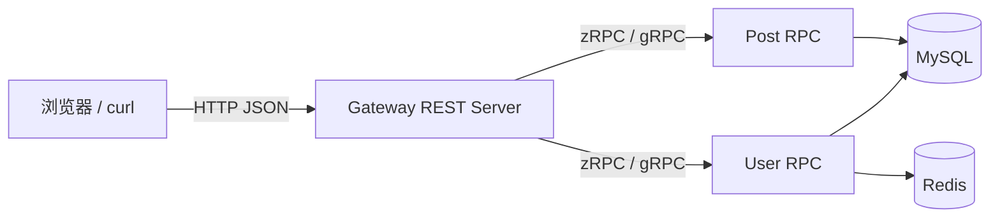
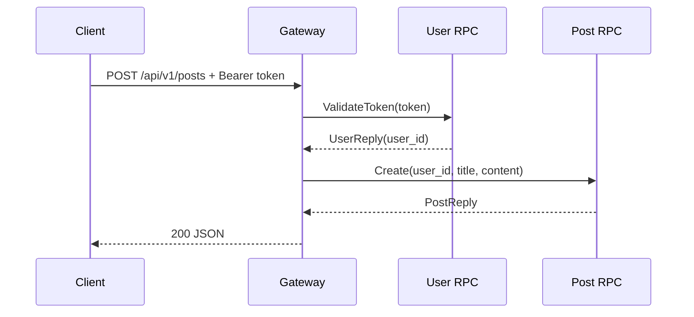
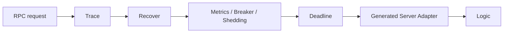

# go-zero：从 API 契约到 REST 与 zRPC 服务

## 前言

go-zero 是 Go 的微服务开发框架及工具链。运行时库 `github.com/zeromicro/go-zero` 提供 REST、RPC、配置、日志、追踪、限流、熔断和过载保护等能力；`goctl` 则依据 API DSL、Protobuf 和数据库 schema 生成结构固定的适配代码。它的价值并不是替代业务设计，而是将重复、易错的传输层与基础设施接线统一起来，让业务代码集中在可测试的用例中。

本文以仓库中的完整示例 [01-go-zero-demo](https://github.com/zzxrepository/gocode-examples/tree/main/go/01-go-zero-demo) 为主线。示例包含外部 REST 网关、用户 RPC 服务、文章 RPC 服务，实现注册、登录、令牌校验与文章 CRUD。源码分析以示例锁定的 **go-zero v1.10.3** 为准：公开 API 的职责相对稳定，内部字段与中间件顺序可能随版本演进，阅读其他版本应跟随调用关系而非行号。

go-zero 建立在标准技术之上，而不是另一套协议栈：REST 服务最后仍由 `net/http` 接收连接，zRPC 建立在 gRPC 和 Protobuf 之上。框架在这些基础能力之上提供了统一的项目组织、启动流程和服务治理模型。

## 阅读路线

| 层次 | 核心问题 | 关键对象 |
| --- | --- | --- |
| 全景 | 为什么需要网关和内部 RPC | 服务边界、数据所有权 |
| 契约 | `.api`、`.proto` 如何驱动代码 | `goctl`、Protobuf |
| HTTP | REST 请求怎样进入业务 | `rest.Server`、Handler、Logic |
| RPC | 服务怎样发布并被调用 | `zrpc`、gRPC、Client |
| 源码 | 路由和中间件如何运行 | `engine`、`patRouter`、interceptor |
| 工程 | 怎样安全地投入生产 | 超时、错误、发现、测试 |



## 一、go-zero 解决的是什么问题

一个小 HTTP 服务只需一个 `http.Handler`。业务拆为多个进程后，还要处理接口契约、内部通信、超时、日志、指标、服务发现、负载均衡、错误恢复和优雅退出。若每个团队重复实现这些横切能力，行为会逐渐不一致，也很难统一排障。

go-zero 将常见能力组织为下列层次：

| 范围 | 主要能力 | 常见入口 |
| --- | --- | --- |
| API 服务 | 路由、绑定、JSON、JWT、HTTP 中间件 | `rest.NewServer` |
| RPC 服务 | gRPC Server / Client、拦截器、发现 | `zrpc.NewServer`、`zrpc.NewClient` |
| 基础设施 | YAML 配置、日志、追踪、指标、熔断、限流 | `core/conf`、`core/logx` |
| 开发工具 | API、RPC、Model 骨架生成 | `goctl` |

框架有治理组件不代表它们全部默认开启，也不代表可以跳过容量设计。启用项由配置决定；数据库超时、错误语义、重试边界、告警和压测仍是应用自身的责任。

### 示例中的服务边界

```text
01-go-zero-demo/
├── gateway/                 外部 HTTP 边界；只做协议适配与编排
├── user/                    用户、密码和会话状态的所有者
├── post/                    文章数据的所有者
├── migrations/              演示 schema
└── scripts/docker-compose.yml
```

网关把 HTTP 请求转换为内部 RPC；用户服务只负责身份与会话；文章服务只负责文章数据。此处最重要的不是目录名，而是依赖方向与数据所有权：业务服务不应依赖 `http.Request`，网关也不应绕过服务边界直接读写别的服务的数据。



go-zero 可以用于单体 REST 服务，并不要求所有项目都拆微服务。只有确实存在独立部署、独立扩缩容、团队边界或故障隔离需要时，服务拆分的通信成本才是合理交换。

## 二、运行完整示例

示例使用 Go 1.26.5、MySQL 和 Redis。根目录 `Makefile` 显式指定本机 Go 工具链，不会改变终端全局版本：

```bash
cd gocode-examples/go/01-go-zero-demo
make docker-up
make run-user
make run-post
make run-gateway
```

服务端口为 User RPC `9181`、Post RPC `9182`、Gateway `8180`。另开终端：

```bash
curl -X POST http://localhost:8180/api/v1/auth/register \
  -H 'Content-Type: application/json' \
  -d '{"email":"demo@example.com","password":"secret"}'

curl -X POST http://localhost:8180/api/v1/auth/login \
  -H 'Content-Type: application/json' \
  -d '{"email":"demo@example.com","password":"secret"}'

curl http://localhost:8180/api/v1/posts
```

将登录得到的 token 作为 `Authorization: Bearer <token>` 发送，就可创建、修改和删除文章。停止容器使用 `make docker-down`；该操作保留数据卷。只有明确需要重置演示数据时才使用带 `-v` 的 Compose 删除操作。

阅读代码最有效的顺序是：先看 `gateway/gateway.api` 与两个 `.proto` 契约，再看三个 `main` 函数，最后追踪 `internal/handler`、`internal/logic` 和 `internal/svc`。这样能够区分“生成的协议适配代码”和“项目写下的业务规则”。

## 三、契约优先：API DSL 与 Protobuf

### 1. `.api` 是外部 HTTP 契约

`gateway/gateway.api` 描述 HTTP 方法、路径以及请求和响应：

```go
type PostRequest { Title string `json:"title"`; Content string `json:"content"` }
type IDRequest { ID int64 `path:"id"` }

@server ( prefix: /api/v1 )
service gateway {
    @handler CreatePost
    post /posts (PostRequest) returns (PostResponse)

    @handler GetPost
    get /posts/:id (IDRequest) returns (PostResponse)
}
```

`type` 生成 Go struct；`path:"id"` 表示字段来自 URL 参数；`@handler` 决定 Handler / Logic 的名字；`@server(prefix: ...)` 为本组路由添加前缀。API DSL 是外部接口的单一事实来源，应和前端、调用方及接口测试一起评审。

```bash
goctl api go --api gateway/gateway.api --dir gateway
```

该命令生成 `internal/types`、`internal/handler`、`internal/logic`、`internal/svc` 与入口骨架。它不会替你定义授权、事务和领域规则。重新生成前应提交现有修改或查看 diff；长期项目更适合把稳定业务规则放入自行维护的包中，让生成的 Logic 保持薄。

### 2. `.proto` 是内部 RPC 契约

`post/post.proto` 用 Protobuf 描述方法和消息：

```proto
syntax = "proto3";

service Post {
  rpc Get(PostIDRequest) returns (PostReply);
  rpc Create(CreateRequest) returns (PostReply);
}

message PostIDRequest { int64 id = 1; }
message CreateRequest { int64 user_id = 1; string title = 2; string content = 3; }
message PostReply { int64 id = 1; int64 user_id = 2; string title = 3; string content = 4; }
```

字段编号是 Protobuf 的线协议标识，不是展示顺序。已发布的编号不能被改作其他含义；新增字段使用新编号，废弃字段应保留编号或使用 `reserved`。`go_package` 必须与模块导入路径匹配。

示例生成步骤分为 Protobuf Go 类型、gRPC stub、go-zero zRPC 适配层：

```bash
goctl rpc protoc post/post.proto \
  --go_out=./post/pb \
  --go-grpc_out=./post/pb \
  --zrpc_out=./post \
  --module github.com/zzxrepository/gocode-examples/go/01-go-zero-demo
```

`post_grpc.pb.go` 来自 gRPC 插件，提供 `PostServer`、`PostClient`；`post/post/post.go` 是 go-zero 的客户端包装；`internal/server/postserver.go` 把 gRPC 方法转发到每个 Logic。

### 3. 哪些代码该改

| 需求 | 首选位置 | 不应直接修改 |
| --- | --- | --- |
| 新 HTTP 路由或字段 | `.api` 后重新生成 | 只改 `routes.go` |
| 新 RPC 方法或字段 | `.proto` 后重新生成 | 手改 `.pb.go` |
| 业务校验、权限、编排 | Logic 或独立业务包 | 生成的 Protobuf 文件 |
| 连接与长期依赖创建 | `ServiceContext` | 在每个请求中新建 client |
| 稳定错误响应 | 项目统一 error handler | 每个 Handler 各写一套 JSON |

## 四、REST 网关：从启动到 Logic

### 1. 启动阶段

`gateway/gateway.go` 的核心只有五步：

```go
var c config.Config
conf.MustLoad(*configFile, &c)
server := rest.MustNewServer(c.RestConf)
defer server.Stop()
ctx := svc.NewServiceContext(c)
handler.RegisterHandlers(server, ctx)
server.Start()
```

配置加载到嵌入 `rest.RestConf` 的项目配置；`MustNewServer` 创建 REST 运行时；`ServiceContext` 一次性创建 RPC Client；生成的 `RegisterHandlers` 注册路由；`Start` 才绑定端口并阻塞。`defer server.Stop()` 用于收尾框架资源，进程信号触发的优雅关闭由框架生命周期机制协调。

嵌入配置表达“复用框架配置，追加应用配置”：

```go
type Config struct { rest.RestConf; UserRpc zrpc.RpcClientConf; PostRpc zrpc.RpcClientConf }
```

对应 YAML：

```yaml
Name: gateway
Host: 0.0.0.0
Port: 8180
UserRpc:
  Endpoints: [127.0.0.1:9181]
PostRpc:
  Endpoints: [127.0.0.1:9182]
```

静态 `Endpoints` 适合本地开发；生产系统通常应改用 etcd 等服务发现，不能将会变化的实例 IP 写进镜像。

### 2. 路由与 Handler

生成的路由注册代码：

```go
server.AddRoutes([]rest.Route{
    {Method: http.MethodPost, Path: "/posts", Handler: CreatePostHandler(serverCtx)},
    {Method: http.MethodGet, Path: "/posts/:id", Handler: GetPostHandler(serverCtx)},
}, rest.WithPrefix("/api/v1"))
```

`rest.Server` 不是 `http.ServeMux` 的别名。它保存内部 `engine` 和实现 `httpx.Router` 的路由器；`AddRoutes` 先保存路由组，`Start` 时再构建中间件链并绑定到路由器。因此，注册路由和开始监听是明确分离的两个阶段。


一个生成 Handler 的职责是协议适配：

```go
func CreatePostHandler(svcCtx *svc.ServiceContext) http.HandlerFunc {
    return func(w http.ResponseWriter, r *http.Request) {
        var req types.PostRequest
        if err := httpx.Parse(r, &req); err != nil { httpx.ErrorCtx(r.Context(), w, err); return }
        resp, err := logic.NewCreatePostLogic(r.Context(), svcCtx).CreatePost(&req)
        if err != nil { httpx.ErrorCtx(r.Context(), w, err); return }
        httpx.OkJsonCtx(r.Context(), w, resp)
    }
}
```

它绑定输入、传递 context、调用用例并写回协议响应。`httpx.Parse` 依据 tag 读取 path、query、form 或 JSON body；`httpx.OkJsonCtx` 统一写 JSON。Handler 不应承载复杂 SQL 或散落的领域规则。

### 3. Logic 与 ServiceContext

Logic 是单个用例的入口：

```go
type CreatePostLogic struct { logx.Logger; ctx context.Context; svcCtx *svc.ServiceContext }

func (l *CreatePostLogic) CreatePost(req *types.PostRequest) (*types.PostResponse, error) {
    user, err := currentUser(l.ctx, l.svcCtx)
    if err != nil { return nil, err }
    post, err := l.svcCtx.Post.Create(l.ctx, &postclient.CreateRequest{UserId: user.UserId, Title: req.Title, Content: req.Content})
    if err != nil { return nil, err }
    return &types.PostResponse{ID: post.Id, UserID: post.UserId, Title: post.Title, Content: post.Content}, nil
}
```

`logx.WithContext(ctx)` 让日志关联请求的 trace 信息；同一个 `ctx` 应持续传到 RPC、SQL 和 Redis，使取消和 deadline 能到达下游。`ServiceContext` 是在启动期装配的长期依赖容器：

```go
func NewServiceContext(c config.Config) *ServiceContext {
    return &ServiceContext{
        Config: c,
        User: userclient.NewUser(zrpc.MustNewClient(c.UserRpc)),
        Post: postclient.NewPost(zrpc.MustNewClient(c.PostRpc)),
    }
}
```

它不是业务逻辑的归宿。小示例直接将部分数据操作放在 `ServiceContext` 中便于观察请求链；实际服务应将 Repository、领域服务或用例服务注入进去，让 Logic 编排接口化依赖，从而在不启动数据库和网络时测试业务规则。

## 五、zRPC：go-zero 对 gRPC 的组织

用户服务和文章服务入口遵循相同模式：

```go
var c config.Config
conf.MustLoad(*configFile, &c)
ctx := svc.NewServiceContext(c)
s := zrpc.MustNewServer(c.RpcServerConf, func(grpcServer *grpc.Server) {
    postpb.RegisterPostServer(grpcServer, server.NewPostServer(ctx))
})
defer s.Stop()
s.Start()
```

`zrpc.MustNewServer` 校验 RPC 配置、创建 RPC 运行时并装配拦截器。回调接收真实的 `*grpc.Server`，标准 gRPC 的 `RegisterPostServer` 因而可以原样使用。`Start` 最终运行 gRPC Server；zRPC 是对 gRPC server、client 和治理能力的封装，而不是一种新的 RPC 协议。

生成的服务端适配器非常薄：

```go
func (s *PostServer) Create(ctx context.Context, in *postpb.CreateRequest) (*postpb.PostReply, error) {
    return logic.NewCreateLogic(ctx, s.svcCtx).Create(in)
}
```

网关中的 `l.svcCtx.Post.Create(...)` 表面是普通接口调用，实际链路为：

```text
Gateway Logic
  -> goctl 生成的 Post client
  -> zrpc.Client（连接、发现、均衡、客户端拦截器）
  -> grpc.ClientConn
  -> HTTP/2 + Protobuf
  -> grpc.Server
  -> PostServer adapter
  -> Post Logic
```

必须将 `context` 一直向下传递。deadline 到期后，客户端会停止等待；服务端的 Logic、SQL 与下游调用也应尽快停止。对没有幂等保证的写操作不能做无条件重试，否则网络超时后可能产生重复写入。

从静态 endpoint 迁到 etcd 时，服务端注册自身，客户端 watcher 获取逻辑服务名对应的实例集合，再选择可用连接。服务发现只解决“如何找到实例”，不解决接口兼容、分布式事务、容量和数据一致性。

## 六、REST 运行时源码：`Server`、`engine` 与路由树

### 1. `rest.Server` 保存什么

go-zero v1.10.3 中，核心结构可以概括为：

```go
type Server struct { ngin *engine; router httpx.Router }
```

`ngin` 不是 Nginx，而是内部 HTTP 引擎。它保存 `RestConf`、待绑定路由、全局中间件、超时、TLS 和自适应过载保护器；`router` 是一个接口，要求路由注册、`ServeHTTP`、404/405 handler 设置等能力。`router.NewRouter()` 创建默认实现。

`NewServer` 的职责是执行 `c.SetUp()`、构造 `newEngine(c)`、构造 router，并应用 `RunOption`。`MustNewServer` 只是把构造错误交给 `logx.Must`，使无效配置在启动期失败。

### 2. 中间件为什么在启动时合成

`AddRoutes` 并不立即为每条 URL 调用 `router.Handle`，而是将路由及选项保存到 `engine.routes`。`Start` 调用 `engine.bindRoutes`；每条路由由 `bindRoute` 构建 `chain.Chain`，最终注册 `chain.ThenFunc(route.Handler)`：

```go
func (ng *engine) bindRoute(fr featuredRoutes, router httpx.Router, route Route) error {
    chn := ng.buildChainWithNativeMiddlewares(fr, route, metrics)
    for _, middleware := range ng.middlewares { chn = chn.Append(convertMiddleware(middleware)) }
    return router.Handle(route.Method, route.Path, chn.ThenFunc(route.Handler))
}
```

请求阶段无需再动态拼装链。按配置，原生链可包含 Trace、日志、Prometheus、最大连接数、熔断、过载保护、超时、Recover、指标、请求体大小限制和解压缩。中间件开关与顺序会影响认证、响应和 trace 传播，升级依赖或修改配置时应回归测试。

### 3. `patRouter` 怎样保存路由

默认路由器的结构为：

```go
type patRouter struct { trees map[string]*search.Tree; notFound http.Handler; notAllowed http.Handler }
```

`trees` 按 HTTP 方法保存搜索树。注册 `GET /api/v1/posts/:id` 时，`Handle` 校验 method 与 `/` 前缀，使用 `path.Clean` 规范化路径，取得或创建 `trees["GET"]`，最后执行 `tree.Add(cleanPath, handler)`。GET 和 POST 因而位于不同树；错误方法可以返回 405 并附带 `Allow`，而不是误报 404。

请求到来后的逻辑：

```text
path.Clean(r.URL.Path)
  -> trees[r.Method].Search(path)
  -> 命中：将 :id 等参数写入派生 request 的 context，执行最终 Handler
  -> 未命中：搜索其他方法的树
       -> 同一路径存在：405 Method Not Allowed
       -> 不存在：404 Not Found
```

匹配到的参数通过 `pathvar.WithVars(r, result.Params)` 写入 request context，而非改写 URL；之后 `httpx.Parse` 按结构体的 `path` tag 读取。该设计保留了标准库的 `*http.Request` 输入模型。

### 4. 终点仍是 `net/http`

路由绑定完成后，`engine.start` 调用内部 `StartHttp`，构造 `http.Server{Addr: ..., Handler: router}` 并监听。因为 `patRouter` 实现了 `ServeHTTP`，它就是标准库 `http.Handler`：

```text
net.Listen TCP
  -> http.Server 接收、解析 HTTP 请求
  -> patRouter.ServeHTTP
  -> 搜索树得到最终 Handler
  -> go-zero 中间件链
  -> 生成的 Handler
  -> Logic
```

go-zero 没有绕开标准库 HTTP；它在 `http.Handler` 上增加了路由、链和服务生命周期约定。标准 `http.Handler` 中间件可用 `rest.ToMiddleware` 接入，但应确认其 Context、错误响应和响应头行为能够与框架链共存。

## 七、RPC 运行时、治理与生产实践

`zrpc.NewServer` 的大致流程是：校验 `RpcServerConf`；创建原生 RPC Server 或带 etcd 发布能力的 Server；创建 metrics；按配置装配 stream / unary interceptor；执行配置初始化；保存注册回调。`RpcServer.Start` 再执行回调，让 gRPC 方法真正注册。

Unary RPC 可按配置加入追踪、panic recovery、统计、Prometheus、熔断、基于 CPU 的自适应过载保护和超时拦截器；stream RPC 使用另一套生命周期适配。它们都是业务 Handler 外层的调用包装：



框架级熔断和过载保护只能减少连锁故障，并不保证业务正确。读取接口可在明确设计后降级；写入接口仍必须设计幂等键、失败语义和补偿。日志不得默认记录密码、Authorization header 或完整个人数据。

### 配置、错误和测试

示例 YAML 的数据库密码和 JWT secret 仅用于本地开发。生产凭据应由部署平台 Secret、环境变量或专用配置系统注入；仓库只存不含真实凭据的模板。`ServiceContext` 启动时 Ping MySQL/Redis 是快速失败策略，优点是依赖不可用立即暴露，代价是临时故障会阻止进程启动。

项目应统一定义稳定业务错误码，并在 HTTP 边缘映射为 400、401、404、409 等状态码；RPC 侧使用相应 gRPC status。不要把 SQL 驱动或 Redis 的原始错误文本直接作为外部 API 契约。

测试至少覆盖三层：

1. Logic 单元测试：注入替身，验证校验、权限和业务分支；
2. 传输层测试：验证 HTTP 绑定、状态码、JSON 与 gRPC status；
3. 集成测试：以 MySQL、Redis 和真实服务验证注册—登录—发文链路。

示例的编译验证命令为：

```bash
cd gocode-examples/go/01-go-zero-demo
make test
```

生产发布前还应分别设置 HTTP、RPC、数据库和下游调用的 deadline；验证追踪、指标、健康检查和优雅退出；审查 API / Protobuf 兼容性；把 schema 迁移作为独立的可回滚发布步骤。

## 参考资料

- [go-zero API DSL 参考](https://go-zero.dev/reference/api-dsl/)
- [go-zero 创建 RPC 服务](https://go-zero.dev/guides/quickstart/rpc-service/)
- [goctl API 命令参考](https://go-zero.dev/reference/cli-guide/api/)
- [go-zero 技术参考](https://go-zero.dev/reference/)

## 总结

go-zero 的主线可以概括为：**用 `.api` 和 `.proto` 定义契约，用 `goctl` 生成传输适配骨架，用 REST Server 和 zRPC Server 将请求送入 Logic，并以统一配置叠加路由、观测和治理能力。**

掌握一个 go-zero 服务时，应先辨认外部与内部契约、生成代码与手写代码的边界、依赖的装配位置、Context/超时/错误的传播路径，以及每个服务的数据所有权。这样 `ServiceContext`、Logic、`rest.Server` 和 zRPC 就不再是模板中的固定名称，而成为可追踪、可测试、可演进的工程边界。
