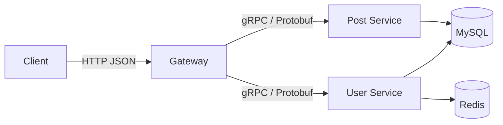
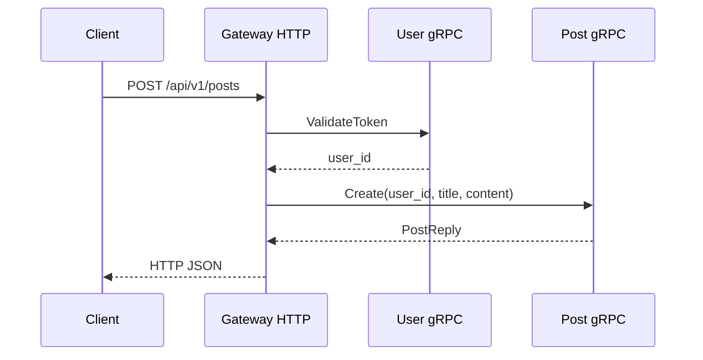
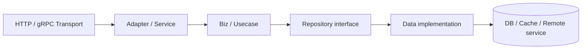
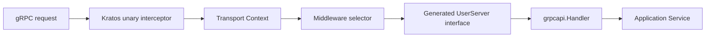
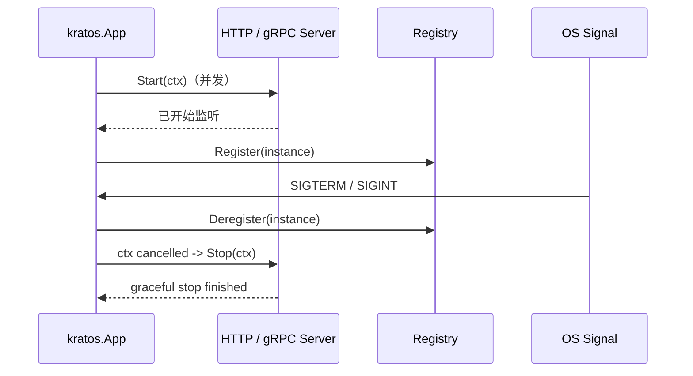

# Kratos：从应用生命周期到分层微服务

## 前言

Kratos 是一套面向 Go 的微服务框架。它的设计重点不是提供一个包罗万象的“业务框架”，而是围绕应用生命周期、传输层、依赖注入、配置、日志、服务发现、错误模型和中间件提供一组可组合的基础组件。HTTP、gRPC、数据库、注册中心和配置来源都可以替换；框架通过接口和选项把它们连接起来。

因此，理解 Kratos 的关键不是记住 `kratos.New` 的参数，而是看清三层关系：`kratos.App` 管理整个进程的启动、注册和退出；`transport/http.Server`、`transport/grpc.Server` 管理一种网络协议；业务代码通过明确的依赖方向与这些传输层隔离。本文以仓库配套项目 [01-kratos-demo](https://github.com/zzxrepository/gocode-examples/tree/main/go/01-kratos-demo) 为参照，源码分析以项目使用的 **Kratos v2.8.4** 为准。

项目演示一个博客网关、用户服务和文章服务。外部客户端访问网关的 REST API，网关通过 gRPC 调用两个后端服务；用户服务拥有账号和会话，文章服务拥有文章数据。它的业务规模很小，但完整展示了 HTTP、gRPC、Protobuf、Context、生命周期和服务边界之间的关系。

## 阅读路线

| 层次 | 需要回答的问题 | 关键对象 |
| --- | --- | --- |
| 全景 | Kratos 在微服务系统中负责什么 | `App`、`transport.Server` |
| 契约 | HTTP / gRPC 如何被定义和适配 | Protobuf、`http.Handler` |
| 使用 | 一个服务怎样创建、启动、停止 | `kratos.New`、`Run` |
| 分层 | 业务代码如何不依赖协议 | service、repository、adapter |
| 源码 | 请求与进程生命周期如何流动 | HTTP Server、gRPC Server、App |
| 工程 | 怎样注入依赖、发现服务和处理错误 | Wire、registry、middleware |



## 一、Kratos 的定位与核心抽象

### 1. Kratos 不是 HTTP 框架的替代品

一个 HTTP 路由器只解决“哪个 URL 调哪个 Handler”。微服务进程还需要处理多协议服务的统一启动、信号退出、优雅停止、服务注册、Endpoint 暴露、日志与中间件。Kratos 在标准库和 gRPC 之上提供这些应用级约定。

| 抽象 | 责任 | 实现例子 |
| --- | --- | --- |
| `transport.Server` | 定义一种可启动、可停止的服务端传输 | HTTP Server、gRPC Server |
| `transport.Transporter` | 提供请求所属协议、操作名、Header 等传输信息 | HTTP request、gRPC call |
| `transport.Endpointer` | 提供可注册给服务发现的访问地址 | HTTP / gRPC Server |
| `kratos.App` | 管理多个 Server 的生命周期 | 一个服务进程 |
| `middleware.Middleware` | 为业务 endpoint 添加横切逻辑 | recovery、logging、auth |

Kratos 的传输抽象使同一个应用可以同时发布 HTTP 和 gRPC。框架本身不强制使用某一个 ORM、注册中心或配置平台；这意味着集成自由度更高，同时也要求项目明确自己的依赖边界。

### 2. 示例的服务边界

```text
01-kratos-demo/
├── gateway/       REST 边界；调用 User / Post gRPC client
├── user-service/  账号、密码、JWT、Redis 会话
├── post-service/  文章 CRUD
├── api/           对外 HTTP 调用说明
├── scripts/       本地基础设施与启动脚本
└── go.work        将三个独立 module 组成开发工作区
```

每个服务拥有自己的 `go.mod`、`configs`、`internal` 和迁移文件。根 `go.work` 只解决本地同时开发多个模块的便利性，不是服务间通信机制。生产中，这些模块可以拆到独立仓库和独立发布流水线。

数据边界同样重要：文章服务保存 `user_id`，但不对用户表建立跨服务外键；需要用户详情时，应通过服务调用或事件同步建立读模型。数据库共享实例可以作为本地开发简化，表的所有权却不能因此变得模糊。

## 二、运行示例并建立请求路径

启动本地 MySQL 和 Redis：

```bash
cd gocode-examples/go/01-kratos-demo
make docker-up
make tidy
make run-all
```

默认地址为 Gateway `:8080`、User gRPC `:8081`、Post gRPC `:8082`。网关健康检查：

```bash
curl http://127.0.0.1:8080/health
```

完整 REST 调用顺序见 `api/http.md`。项目使用 Go 1.26.5；`go.work` 和每个模块的 `go.mod` 都声明了对应的 Go/toolchain 版本。验证全部包可编译：

```bash
make test
```

以创建文章为例，请求在系统中的路径为：



每一跳都传递 `context.Context`。客户端断开、deadline 到期或上游取消时，取消信号应该跟随同一条调用链向下传播；如果某一层改用 `context.Background()`，这一条控制链就被切断了。

## 三、先理解契约：Protobuf 与 HTTP 边界

### 1. RPC 契约

用户服务的 `api/user.proto`：

```proto
syntax = "proto3";

package blog.user.v1;
option go_package = "github.com/zzxrepository/gocode-examples/go/01-kratos-demo/user-service/api;userapi";

service User {
  rpc Register(RegisterRequest) returns (UserReply);
  rpc Login(LoginRequest) returns (TokenReply);
  rpc ValidateToken(TokenRequest) returns (UserReply);
}

message RegisterRequest { string username = 1; string password = 2; }
message UserReply { int64 user_id = 1; string username = 2; }
```

Protobuf 文件是跨服务接口的单一事实来源。`protoc` 生成消息类型、Client 和 Server 接口；服务端实现该接口，调用方使用生成 Client。字段编号决定二进制编码的兼容性：已发布的编号不能被重新解释；新增字段使用新编号；删除字段需要保留编号或声明为 `reserved`。

Kratos 官方脚手架通常在 `.proto` 中添加 `google.api.http` 注解，以同一个 RPC 契约生成 HTTP 路由。这种模式适合外部 HTTP 和内部 gRPC 的资源模型基本一致，例如：

```proto
rpc GetUser(GetUserRequest) returns (UserReply) {
  option (google.api.http) = { get: "/v1/users/{id}" };
}
```

配套项目有意让网关使用标准 `http.ServeMux`，将 HTTP 请求适配为 gRPC 调用，以突出网关的协议边界。两种模式均可使用 Kratos：前者减少重复适配代码，后者更适合外部 REST 模型与内部服务模型差异较大的系统。

### 2. HTTP 是边缘协议，而非领域模型

网关的路由：

```go
func (h *Handler) RegisterRoutes(mux *http.ServeMux) {
    mux.HandleFunc("GET /health", h.health)
    mux.HandleFunc("POST /api/v1/auth/login", h.login)
    mux.HandleFunc("GET /api/v1/posts/{id}", h.getPost)
    mux.HandleFunc("POST /api/v1/posts", h.createPost)
}
```

这里使用的是 Go 1.22+ `ServeMux` 的方法模式与路径参数语法；`r.PathValue("id")` 从已匹配的路由中读取参数。Handler 负责 JSON 解析、Header 读取、HTTP 状态码与 gRPC client 调用。它不应直接执行数据库 SQL，也不应把 HTTP 类型泄漏到后端服务的业务层。

网关调用封装：

```go
func NewUserClient(endpoint string) (*UserClient, error) {
    conn, err := kgrpc.DialInsecure(context.Background(), kgrpc.WithEndpoint(endpoint))
    if err != nil { return nil, err }
    return &UserClient{client: userapi.NewUserClient(conn)}, nil
}

func (c *UserClient) ValidateToken(ctx context.Context, token string) (*userapi.UserReply, error) {
    return c.client.ValidateToken(ctx, &userapi.TokenRequest{Token: token})
}
```

连接在进程启动时建立并复用，业务调用传入当前请求 `ctx`。`DialInsecure` 只适合受控本地环境或已经由其他网络层保护的内部通信；生产环境应配置 TLS 或 mTLS，并结合服务发现、授权和网络策略。

## 四、分层：协议适配、用例与数据访问

Kratos 的官方项目模板通常采用 `server`、`service`、`biz`、`data` 四个模块，并使用 Wire 生成依赖注入代码。名称不是唯一标准，但依赖方向必须稳定：



| 层 | 应承担的职责 | 不应承担的职责 |
| --- | --- | --- |
| Transport / Server | 路由、编解码、传输 metadata | 领域规则、SQL |
| Adapter / Service | Protobuf/HTTP DTO 与用例转换 | 直接依赖多个存储细节 |
| Biz / Usecase | 业务规则、用例编排、事务边界 | 依赖 `http.Request`、`grpc.Server` |
| Repository interface | 描述业务需要的数据能力 | 暴露数据库驱动类型 |
| Data | SQL、Redis、远程调用的具体实现 | 决定 HTTP 状态码 |

配套项目为了便于学习，将 `internal/user/service.go` 明确写成应用服务，Repository 负责 MySQL 与 Redis，`internal/grpcapi/handler.go` 负责 Protobuf adapter：

```go
func (h *Handler) Login(ctx context.Context, req *userapi.LoginRequest) (*userapi.TokenReply, error) {
    result, err := h.service.Login(ctx, model.LoginRequest{Username: req.Username, Password: req.Password})
    if err != nil { return nil, err }
    claims, err := h.service.ValidateToken(ctx, result.Token)
    if err != nil { return nil, err }
    return &userapi.TokenReply{Token: result.Token, UserId: claims.UserID}, nil
}
```

对比之下，`user.Service.Login` 只处理账号验证、令牌签发与会话保存，不知道调用方是 HTTP 还是 gRPC。这使同一用例可以被 gRPC、消息消费或定时任务复用。随着项目扩大，可将该 Service 再拆成 `biz.UserUsecase` 和接口化 Repository；本质仍是让依赖从外层实现指向内层抽象。

## 五、依赖注入：手写装配与 Wire

### 1. 示例的显式装配

`user-service/cmd/main.go` 清楚地展示了依赖图：

```go
db, err := repository.NewMySQL(cfg.MySQLDSN)
rdb, err := repository.NewRedis(cfg.RedisAddr, cfg.RedisPassword, cfg.RedisDB)
userRepo := user.NewRepository(db)
sessionRepo := user.NewSessionRepository(rdb)
userService := user.NewService(userRepo, sessionRepo, cfg.JWTSecret, cfg.JWTExpire)
server := kgrpc.NewServer(kgrpc.Address(cfg.HTTPAddr))
userapi.RegisterUserServer(server, grpcapi.New(userService))
app := kratos.New(kratos.Name("blog.user"), kratos.Server(server))
```

这种写法没有隐藏过程：先构造基础设施，再构造 Repository、业务服务、传输 adapter、协议 Server，最后交给 App 管理。小服务和学习项目非常适合显式装配。

### 2. Wire 的角色

服务变大后，手工 `main` 很容易变成长的依赖构造链。Wire 是 Google 提供的**编译期**依赖注入生成器，不使用反射容器。Provider 是构造函数，Injector 是调用这些 Provider 的生成函数：

```go
var ProviderSet = wire.NewSet(NewData, NewUserRepo, NewUserUsecase, NewUserService)

func wireApp(*conf.Bootstrap, log.Logger) (*kratos.App, func(), error) {
    panic(wire.Build(data.ProviderSet, biz.ProviderSet, service.ProviderSet, newApp))
}
```

执行 `wire` 后生成普通 Go 构造代码。Wire 的价值是检查依赖图并消除重复装配，不是运行时 Service Locator。无论手写还是 Wire，构造函数的输入输出应保持清晰，避免把所有依赖塞进全局变量。

## 六、Kratos HTTP Server 的运行原理

### 1. `khttp.Server` 与标准库的关系

Kratos HTTP Server 结构中嵌入了 `*http.Server`，并维护 Gorilla Mux 路由器、传输 middleware、请求解码器、响应编码器、超时与 listener：

```go
type Server struct {
    *http.Server
    address string
    timeout time.Duration
    middleware matcher.Matcher
    router *mux.Router
    // decoder、encoder、filter、listener 等
}
```

`khttp.NewServer` 的关键步骤是创建 `mux.NewRouter()`，设置默认编解码器，应用 Option，将 router 包装为标准库 Handler：

```go
srv.Server = &http.Server{Handler: FilterChain(srv.filters...)(srv.router), TLSConfig: srv.tlsConf}
```

因此 Kratos HTTP 服务最终同样交给 `net/http.Server` 监听连接；Kratos 在路由器外加入过滤器，在路由匹配后加入 transport middleware 与编码逻辑。

示例中：

```go
server := khttp.NewServer(
    khttp.Address(addr),
    khttp.Middleware(recovery.Recovery(), logging.Server(logger)),
)
server.HandlePrefix("/", handler)
```

`HandlePrefix` 将已有的标准库 `http.Handler` 挂到 Kratos 的 Gorilla Mux 路由树。因此，示例可复用 `http.ServeMux` 写路由，又仍由 Kratos App 统一管理 HTTP 服务、日志和恢复中间件。

### 2. 请求 Context 如何被增强

`khttp.Server.filter` 会从 `req.Context()` 创建带 timeout 的 Context，根据匹配到的 mux route 取得路径模板，并构造 HTTP `Transport`：

```text
GET /posts/42
  -> route template /posts/{id}
  -> Transport{operation: "/posts/{id}", header, request, response}
  -> transport.NewServerContext(ctx, transport)
  -> next.ServeHTTP(w, req.WithContext(...))
```

后续 middleware 或业务代码可通过 transport 包从 Context 获取协议、Operation、Header 等元数据。使用路由模板而非原始 `/posts/42` 记录指标，避免把无限增长的 ID 写成 metrics label，从而控制时间序列基数。

## 七、gRPC Server 与 Middleware 原理

`transport/grpc.Server` 嵌入 `*grpc.Server`，保存 listener、endpoint、middleware matcher、健康检查和原生 gRPC interceptor 配置。`NewServer` 先创建 Kratos 的 unary/stream interceptor，再通过 `grpc.ChainUnaryInterceptor` 与 `grpc.ChainStreamInterceptor` 交给 `grpc.NewServer`：

```go
unaryInts := []grpc.UnaryServerInterceptor{srv.unaryServerInterceptor()}
grpcOpts := []grpc.ServerOption{grpc.ChainUnaryInterceptor(unaryInts...)}
srv.Server = grpc.NewServer(grpcOpts...)
```

其效果是让每次 gRPC 调用先获得 Kratos transport Context、操作名和 deadline，再按 selector 选择应用 middleware，最后调用生成的 Server adapter：



`Start` 使用 `net.Listen` 创建 listener，恢复 gRPC health status，然后调用嵌入 `grpc.Server` 的 `Serve`。`Stop` 先把健康状态置为 shutdown，尝试 `GracefulStop`；如果传入 Context 超时，再强制 `Stop`。这解释了为何优雅关闭必须从 `kratos.App` 发起：不能只靠进程被杀死时执行一个 `defer`。

## 八、`kratos.App`：进程的启动、注册与停止

`App` 是应用生命周期管理器，主要保存 Options、根 Context、取消函数和待注册的 `registry.ServiceInstance`：

```go
type App struct {
    opts options
    ctx context.Context
    cancel context.CancelFunc
    instance *registry.ServiceInstance
}
```

构造时：

```go
app := kratos.New(
    kratos.Name("blog.user"),
    kratos.Logger(logger),
    kratos.Server(grpcServer),
)
```

`Run` 的逻辑按因果顺序为：

1. 根据显式 Endpoint，或每个实现 `transport.Endpointer` 的 Server，构建 `ServiceInstance`；
2. 执行 `beforeStart` hook；
3. 并发启动所有 HTTP / gRPC Server；
4. 等待服务已开始运行后，将实例注册到 registry（若配置）；
5. 执行 `afterStart` hook，并等待 `SIGTERM`、`SIGQUIT`、`SIGINT` 或应用 Context 取消；
6. 收到停止信号时先注销实例，再取消 App Context；
7. 每个 Server 收到取消后在 stop timeout 内执行 `Stop(ctx)`；超时则由具体 Server 强制结束。



服务注册发生在 Server 已开始监听之后，避免注册中心暴露一个尚未可连接的地址；注销发生在停止之前，减少新请求被送到即将退出实例的概率。它不能替代 Kubernetes readiness、负载均衡器摘流和长连接排空策略，生产环境仍须端到端验证。

## 九、错误、发现、可观测性与安全

### 1. 错误应具有稳定语义

业务代码不应将 `sql.ErrNoRows`、Redis 网络错误或密码校验细节原样暴露给客户端。Kratos 提供 `errors.Error` 及 `errors.Reason` 模型，可把领域错误设计为稳定原因码，再由 HTTP / gRPC encoder 映射为协议状态。例如“用户名或密码错误”对外应是统一的未认证/参数错误，而不是泄露“用户不存在”还是“密码不匹配”。

### 2. 服务发现与客户端负载均衡

本地示例使用固定 endpoint，最容易理解：`kgrpc.WithEndpoint(":8081")` 连接指定服务。生产中可以使用 Kratos registry 接口接入 etcd、Consul、Nacos 等实现，Client 通过 resolver 获取逻辑服务名对应的实例集合并负载均衡。注册中心只解决实例发现；超时、重试、熔断、幂等、发布兼容性仍需由调用策略和业务设计共同保证。

### 3. Middleware 的边界

日志、追踪、recovery、认证、限流与指标适合放在 middleware；它们是多个 endpoint 都要遵守的横切规则。用例特有的权限判断、库存扣减或订单状态机不应塞进全局 middleware。示例网关的 IP 限流属于 HTTP 边缘能力，用户服务的登录/注册限流则更接近敏感业务入口的保护；多实例部署时，进程内限流不再是全局限流，需要网关或分布式方案。

### 4. 生产检查清单

- 为 HTTP、gRPC、SQL、Redis 和下游调用分别设置并传播 deadline；
- 使用 TLS/mTLS 保护跨网络的 gRPC；不要在日志中记录 token、密码和敏感 body；
- 将服务的健康、readiness、日志、trace、metrics 与告警一起纳入发布验证；
- 发布 Protobuf 时遵守字段与服务名兼容规则；
- 写操作设计幂等键，重试只用于已证明安全的场景；
- 先摘除服务发现实例，再进行优雅退出与连接排空；
- 使用单元测试覆盖用例，用传输测试验证编解码和错误映射，用集成测试验证完整调用链。

## 参考资料

- [Kratos 设计理念](https://go-kratos.dev/docs/intro/design/)
- [Kratos Transport 概览](https://go-kratos.dev/docs/component/transport/overview/)
- [Kratos HTTP Transport](https://go-kratos.dev/docs/component/transport/http/)
- [Kratos Wire 依赖注入](https://go-kratos.dev/docs/guide/wire/)

## 总结

Kratos 的核心不是某个路由 API，而是一条清晰的运行链：**`kratos.App` 管理进程生命周期，HTTP/gRPC Server 管理协议传输，middleware 管理横切能力，业务用例通过接口与数据实现解耦。** Protobuf 契约将服务端和客户端编译期连接起来，Wire 或显式构造函数将依赖图固定为可阅读、可测试的 Go 代码。

学习 Kratos 时，首先确认每个进程有哪些 Server、其 Endpoint 如何生成、请求如何从 transport adapter 到达业务用例、依赖在哪个组合根创建、以及停止时如何让实例先摘流再优雅关闭。理解这些关系后，Kratos 的 Options、middleware、registry 和 Wire 就不再是孤立的 API，而是同一套微服务运行模型的不同部分。
