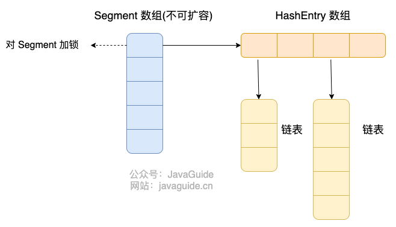
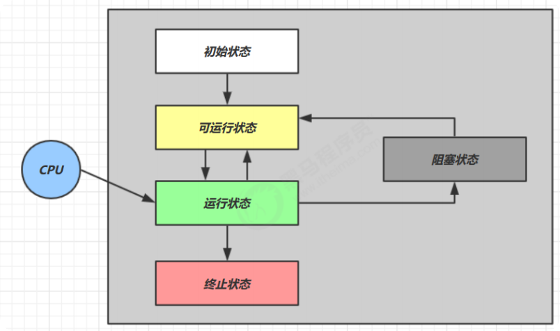
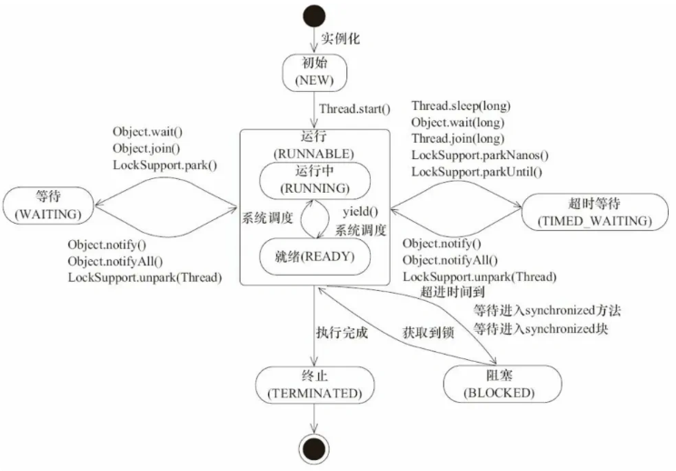
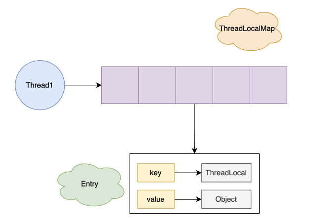
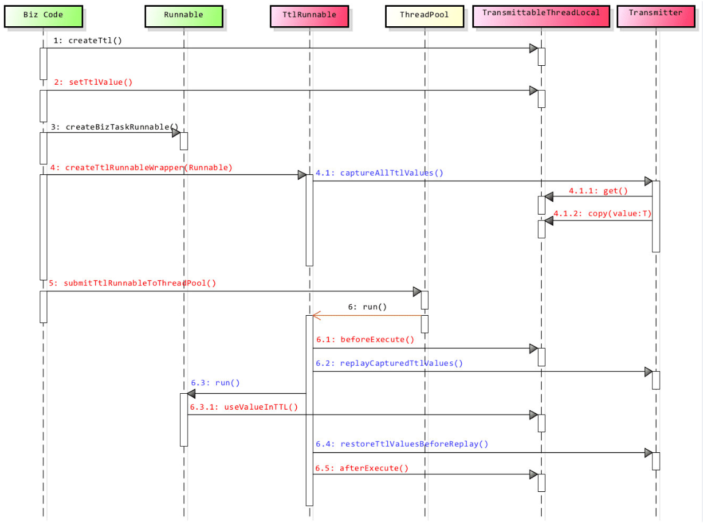
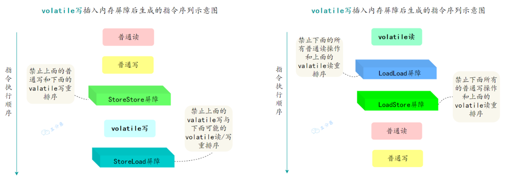
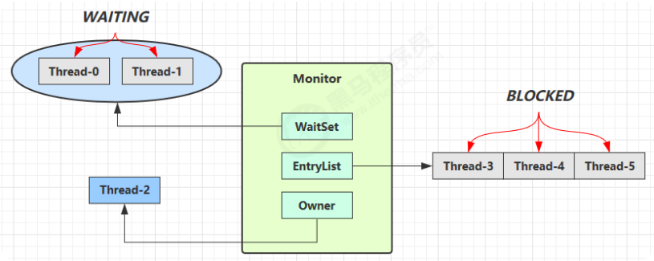
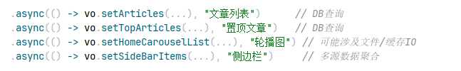

[toc]

# Java 集合与 JUC 面试题

## 集合概述

### 🌟Java 集合概览/说说 List, Set, Queue, Map 四者的区别？


**Java 集合，也叫作容器，主要是由两大接口派生而来：**

- **一个是 `Collection`接口，主要用于存放单一元素，下面又有三个主要的子接口：`List`、`Set` 、 `Queue`。**
  - **List代表有序、可重复的集合，支持通过索引获取元素**。典型代表就是封装了动态数组的ArrayList和封装了链表的LinkedList，还包括Vector，Stack。
    - ArrayList是容量可变的线程不安全列表，其底层使用`Object[]`数组实现。当几何扩容时，会创建更大的数组，并把原数组复制到新数组。ArrayList支持对元素的快速随机访问，但插入与删除速度很慢。
    - LinkedList本质是一个双向链表，与ArrayList相比，其插入和删除速度更快，但随机访问速度更慢。
  - Set代表无序、不可重复的集合。常用的实现有HashSet，LinkedHashSet和TreeSet。
    - HashSet通过HashMap实现，**HashMap的Key即HashSet存储的元素，所有Key都是用相同的Value，一个名为PRESENT的Object类型常量**。使用Key保证元素唯一性，但不保证有序性。由于HashSet是HashMap实现的，因此线程不安全。
    - LinkedHashSet继承自HashSet，通过LinkedHashMap实现，使用双向链表维护元素插入顺序。
    - TreeSet通过TreeMap实现的，添加元素到集合时按照比较规则将其插入合适的位置，保证插入后的集合仍然有序。
  - Queue 代表队列，存储的元素是有序的、可重复的。按特定的排队规则来确定先后顺序。典型代表就是双端队列 ArrayDeque和优先级队列 PriorityQueue。
    - **PriorityQueue**优先级队列，可以按照比较器或元素的自然顺序进行排序。
- **另一个是 `Map` 接口，用于存放键值对的集合，Key 无序且唯一；value 不要求有序，允许重复**。典型代表就是 HashMap，还包括TreeMap、LinkedHashMap、ConcurrentHashMap、HashTable。
  - **HashMap**：基于哈希表实现的键值对集合。底层JDK1.8 之前 HashMap 由数组+链表组成的，数组是 HashMap 的主体，链表则是主要为了解决哈希冲突而存在的（“拉链法”解决冲突）；JDK1.8 以后采用数组+链表+红黑树来实现的，当链表长度大于阈值（默认为 8）且数组长度大于64时，会将链表转化为红黑树，以减少搜索时间。
    - 优点：可以根据键的哈希值快速查找到值，但有可能会发生哈希冲突，并且不保留键值对的插入顺序。
    - `HashMap`是线程不安全的，在多线程环境下，当多个线程同时对`HashMap`进行操作时，可能会导致数据不一致或出现死循环等问题。比如在扩容时，多个线程可能会同时修改哈希表的结构，从而破坏数据的完整性。
  - **LinkedHashMap**：LinkedHashMap 继承自 HashMap，所以它的底层仍然是基于拉链式散列结构，即由数组+链表+红黑树组成，但是**LinkedHashMap 在HashMap的基础上增加了一条双向链表来保持键值对的插入顺序**，使得迭代顺序与插入顺序或访问顺序一致。
    - 由于它继承自`HashMap`，在多线程并发访问时，同样会出现与`HashMap`类似的线程安全问题。
  - **TreeMap**：基于红黑树（自平衡的排序二叉树）实现的有序Map集合，可以按照键的顺序进行排序。它可以对键进行排序，默认按照自然顺序排序，也可以通过指定的比较器进行排序。
    - `TreeMap`是线程不安全的，在多线程环境下，如果多个线程同时对`TreeMap`进行插入、删除等操作，可能会破坏红黑树的结构，导致数据不一致或程序出现异常。
  - **HashTable**：早期 Java 提供的线程安全的`Map`实现，它的实现方式与`HashMap`类似，由数组+链表组成的，数组是 HashTable 的主体，链表则是主要为了解决哈希冲突而存在的。
    - 它通过在方法上使用了`synchronized`关键字来保证线程安全，通过在每个可能修改`Hashtable`状态的方法上加上`synchronized`关键字，使得在同一时刻，只能有一个线程能够访问`Hashtable`的这些方法，从而保证了线程安全。
  - ConcurrentHashMap：
    - JDK 1.8 以前是底层是数据+链表来实现的，使用分段锁来实现线程安全。将数据分成多个段（Segment），每个 Segment 继承自 `ReentrantLock`，在进行插入、删除等操作时，只需要获取相应段的锁，而不是整个`Map`的锁，这样可以允许多个线程同时访问不同的段，提高了并发访问的效率。
    - 在 JDK 1.8 以后底层是Node数组+链表+红黑树实现，并通过 volatile + CAS 或者 synchronized 来保证线程安全的。


#### 集合框架有哪几个常用工具类？

集合框架位于 java.util 包下，提供了两个常用的工具类：

- Collections：提供了一些对集合进行排序、二分查找、同步的静态方法。
- Arrays：提供了一些对数组进行排序、打印、和 List 进行转换的静态方法

#### Collections和Collection的区别

- **Collection是Java集合框架中的一个接口，它是所有集合类的基础接口**。**它定义了一组通用的操作和方法，如添加、删除、遍历等，用于操作和管理一组对象**。Collection接口有许多实现类，如List、Set和Queue等。
- **Collections是Java提供的一个工具类，位于java.util包中**。**它提供了一系列静态方法，专门用于集合的操作处理与常用算法实现**。Collections类中的方法包括排序、查找、替换、反转、随机化等等。这些方法可以对实现了Collection接口的集合进行操作，如List和Set。

#### 数组与集合区别？

数组和集合的区别：

- 数组是固定长度的数据结构，一旦创建长度就无法改变；而集合是动态长度的数据结构，可以根据需要动态增加或减少元素。
- 数组可以包含基本数据类型和对象；而集合只能包含对象。
- 数组可以直接访问元素；而**集合需要通过迭代器或其他方法访问元素**。

#### 哪些是线程安全的容器？ Java中的线程安全的集合是什么？

像 Vector、Hashtable、ConcurrentHashMap、CopyOnWriteArrayList、ConcurrentLinkedQueue、ArrayBlockingQueue、LinkedBlockingQueue 都是线程安全的。

**在 java.util包中的线程安全的类主要2个，其他都是非线程安全的：**

- **Vector**：线程安全的动态数组，其内部方法基本都经过synchronized修饰，如果不需要线程安全，并不建议选择，毕竟同步是有额外开销的。
- **Hashtable**：线程安全的哈希表，HashTable的加锁方法是给每个方法加上 synchronized 关键字，这样锁住的是整个 Table 对象，**不支持 null 键和值**
  - 由于同步导致的性能开销，所以已经很少被推荐使用，如果要保证线程安全的哈希表，可以用ConcurrentHashMap。

**在java.util.concurrent 包提供的都是线程安全的集合：**

**并发List：**

- **CopyOnWriteArrayList**：它是ArrayList的线程安全的变体，其中**所有写操作（add，set等）都通过对底层数组进行全新复制来实现**，允许存储null元素。即当对象进行写操作时，使用了Lock锁做同步处理，内部拷贝了原数组，并在新数组上进行添加操作，最后将新数组替换掉旧数组；若进行的读操作，则直接返回结果，操作过程中不需要进行同步。

**并发 Queue：**

- **ConcurrentLinkedQueue**：是一个适用于高并发场景下的队列，它通过无锁的方式(CAS)，实现了高并发状态下的高性能。通常ConcurrentLinkedQueue 的性能要好于BlockingQueue。
- **BlockingQueue**：与 ConcurrentLinkedQueue 的使用场景不同，BlockingQueue 的主要功能并不是在于提升高并发时的队列性能，而在于简化多线程间的数据共享。BlockingQueue 提供一种读写阻塞等待的机制，即如果消费者速度较快，则 BlockingQueue 则可能被清空，此时消费线程再试图从 BlockingQueue 读取数据时就会被阻塞。反之，如果生产线程较快，则 BlockingQueue 可能会被装满，此时，生产线程再试图向 BlockingQueue 队列装入数据时，便会被阻塞等待。

**并发 Deque：**

- **ConcurrentLinkedDeque**：ConcurrentLinkedDeque是一种基于链接节点的无限并发链表。可以安全地并发执行插入、删除和访问操作。当许多线程同时访问一个公共集合时，ConcurrentLinkedDeque是一个合适的选择。
- **LinkedBlockingDeque**：是一个线程安全的双端队列实现。它的内部使用链表结构，每一个节点都维护了一个前驱节点和一个后驱节点。LinkedBlockingDeque 没有进行读写锁的分离，因此同一时间只能有一个线程对其进行操作

**并发Set：**

- **CopyOnWriteArraySet**：是线程安全的Set实现，它是线程安全的无序的集合，可以将它理解成线程安全的HashSet。有意思的是，CopyOnWriteArraySet和HashSet虽然都继承于共同的父类AbstractSet；但是，HashSet是通过散列表实现的，而CopyOnWriteArraySet则是通过动态数组CopyOnWriteArrayList实现的，并不是散列表。
- **ConcurrentSkipListSet**：是线程安全的有序的集合。底层是使用ConcurrentSkipListMap实现。

**并发Map：**

- **ConcurrentHashMap**：它与 HashTable 的主要区别是二者加锁粒度的不同
  - 在**JDK1.7**，ConcurrentHashMap加的是分段锁，也就是Segment锁，每个Segment 含有整个 table 的一部分，这样不同分段之间的并发操作就互不影响。
  - 在**JDK 1.8** ，它取消了Segment字段，直接在哈希桶元素上加锁，实现对每一行进行加锁，进一步减小了并发冲突的概率。对于put操作，如果Key对应的数组元素为null，则通过CAS操作（Compare and Swap）将其设置为当前值。如果Key对应的数组元素（也即链表表头或者树的根元素）不为null，则对该元素使用 synchronized 关键字申请锁，然后进行操作。如果该 put 操作使得当前链表长度超过一定阈值，则将该链表转换为红黑树，从而提高寻址效率。

- **ConcurrentSkipListMap**：实现了一个基于SkipList（跳表）算法的可排序的并发集合，SkipList是一种可以在对数预期时间内完成搜索、插入、删除等操作的数据结构，通过维护多个指向其他元素的“跳跃”链接来实现高效查找。

#### Collection继承了哪些接口？

Collection 继承了`Iterable`接口，这意味着所有实现 Collection 接口的类都必须实现 `iterator()` 方法，之后就可以使用增强型`for`循环遍历集合中的元素了。

### 集合框架底层数据结构总结

先来看一下 `Collection` 接口下面的集合。

- List

  - `ArrayList`：`Object[]` 数组。

  - `Vector`：`Object[]` 数组。

  - `LinkedList`：双向链表(JDK1.6 之前为循环链表，JDK1.7 取消了循环)。

- Set

  - `HashSet`: 基于 `HashMap` 实现的，底层采用 `HashMap` 来保存元素。

  - `LinkedHashSet`: `LinkedHashSet` 是 `HashSet` 的子类，并且其内部是通过 `LinkedHashMap` 来实现的。

  - `TreeSet`: 红黑树(自平衡的排序二叉树)。

- Queue

  - `PriorityQueue`: `Object[]` 数组来实现小顶堆。

  - `DelayQueue`:`PriorityQueue`。

  - `ArrayDeque`: 可扩容动态双向数组。

再来看看 `Map` 接口下面的集合。

- `HashMap`：JDK1.8 之前 `HashMap` 由数组+链表组成的，数组是 `HashMap` 的主体，链表则是主要为了解决哈希冲突而存在的（“拉链法”解决冲突）；JDK1.8 以后在解决哈希冲突时有了较大的变化，当链表长度大于阈值（默认为 8）（将链表转换成红黑树前会判断，如果当前数组的长度小于 64，那么会选择先进行数组扩容，而不是转换为红黑树）时，将链表转化为红黑树，以减少搜索时间。
- `LinkedHashMap`：`LinkedHashMap` 继承自 `HashMap`，所以它的底层仍然是基于拉链式散列结构即由数组和链表或红黑树组成。另外，`LinkedHashMap` 在上面结构的基础上，增加了一条双向链表，使得上面的结构可以保持键值对的插入顺序。同时通过对链表进行相应的操作，实现了访问顺序相关逻辑。
- `Hashtable`：数组+链表组成的，数组是 `Hashtable` 的主体，链表则是主要为了解决哈希冲突而存在的。
- `TreeMap`：红黑树（自平衡的排序二叉树）。

### 如何选用集合?

- **存储单一元素还是键值对元素**
- **集合中元素是有序还是无序的**
- **集合中元素有重复的还是不可以有重复的**
- **是否需要线程安全**

比如：

- 我们需要根据键值获取到元素值时就选用 `Map` 接口下的集合，需要排序时选择 `TreeMap`,不需要排序时就选择 `HashMap`,需要保证线程安全就选用 `ConcurrentHashMap`。
- 我们只需要存放元素值时，就选择实现`Collection` 接口的集合，需要保证元素唯一时选择实现 `Set` 接口的集合比如 `TreeSet` 或 `HashSet`，不需要就选择实现 `List` 接口的比如 `ArrayList` 或 `LinkedList`，然后再根据实现这些接口的集合的特点来选用。

### 集合遍历的方法有哪些？

在Java中，集合的遍历方法主要有以下6种方法：

- **普通 for 循环：** 可以使用带有索引的普通 for 循环来遍历 List。可以在遍历过程中修改元素，只要修改的索引不超出`List`的范围即可。

  ```java
  List<String> list = new ArrayList<>();
  list.add("A");
  list.add("B");
  list.add("C");

  for (int i = 0; i < list.size(); i++) {
      String element = list.get(i);
      System.out.println(element);
  }
  ```

- **增强 for 循环（for-each循环）：** 用于循环访问数组或集合中的元素。一般不建议在`foreach`循环中直接修改正在遍历的`List`元素，因为这可能会导致意外的结果或`ConcurrentModificationException`异常。在`foreach`循环中修改元素可能会破坏迭代器的内部状态，因为`foreach`循环底层是基于迭代器实现的，在遍历过程中修改集合结构，会导致迭代器的预期结构和实际结构不一致。

  ```java
  List<String> list = new ArrayList<>();
  list.add("A");
  list.add("B");
  list.add("C");

  for (String element : list) {
      System.out.println(element);
  }
  ```

- **Iterator 迭代器：** 可以使用迭代器来遍历集合，特别适用于需要删除元素的情况。可以使用迭代器的`remove`方法来删除元素，但如果要修改元素的值，需要通过迭代器的`set`方法来进行，而不是直接通过`List`的`set`方法，否则也可能会抛出`ConcurrentModificationException`异常。

  ```java
  List<String> list = new ArrayList<>();
  list.add("A");
  list.add("B");
  list.add("C");

  Iterator<String> iterator = list.iterator();
  while(iterator.hasNext()) {
      String element = iterator.next();
      System.out.println(element);
  }
  ```

- **ListIterator 列表迭代器：** ListIterator是迭代器的子类，可以双向访问列表并在迭代过程中修改元素。

  ```java
  List<String> list = new ArrayList<>();
  list.add("A");
  list.add("B");
  list.add("C");

  ListIterator<String> listIterator= list.listIterator();
  while(listIterator.hasNext()) {
      String element = listIterator.next();
      System.out.println(element);
  }
  ```

- **使用 forEach 方法：** Java 8引入了 forEach 方法，可以对集合进行快速遍历。

  ```java
  List<String> list = new ArrayList<>();
  list.add("A");
  list.add("B");
  list.add("C");

  list.forEach(element -> System.out.println(element));
  ```

- **Stream API：** Java 8的Stream API提供了丰富的功能，可以对集合进行函数式操作，如过滤、映射等。

  ```java
  List<String> list = new ArrayList<>();
  list.add("A");
  list.add("B");
  list.add("C");

  list.stream().forEach(element -> System.out.println(element));
  ```

这些是常用的集合遍历方法，根据情况选择合适的方法来遍历和操作集合

对于线程安全的`List`，如`CopyOnWriteArrayList`，由于其采用了写时复制的机制，在遍历的同时可以进行修改操作，不会抛出`ConcurrentModificationException`异常，但可能会读取到旧的数据，因为修改操作是在新的副本上进行的。

### Comparator和Comparable的区别

 `Comparator` 接口和`Comparable` 接口都是 Java 中用于排序的接口，主要区别在于：

- `Comparator`接口实际上是出自 `java.util` 包，它有一个`compare(Object obj1, Object obj2)`方法用来排序，通常会结合`Collections.sort`或者`Arrays.sort()`来使用
- `Comparable`接口实际上是出自`java.lang`包，它有一个 `compareTo(Object obj)`方法用来排序。

一般我们需要对一个集合使用自定义排序时，我们就要重写`compare()`方法或`compareTo()`方法。

当我们需要对某一个集合实现两种排序方式，比如一个 `song` 对象中的歌名和歌手名分别采用一种排序方法的话，我们可以重写`Comparable`接口中的`compareTo()`方法和使用自制的`Comparator`方法或者以两个 `Comparator` 来实现歌名排序和歌星名排序，第二种代表我们只能使用两个参数版的 `Collections.sort()`。

#### Comparator定制排序

```java
ArrayList<Integer> arrayList = new ArrayList<Integer>();
arrayList.add(-1);
arrayList.add(3);
arrayList.add(-5);
arrayList.add(7);
System.out.println("原始数组:");
System.out.println(arrayList);

// void sort(List list),按自然排序的升序排序
Collections.sort(arrayList);
System.out.println("Collections.sort(arrayList):");
System.out.println(arrayList);
// 定制排序的用法
Collections.sort(arrayList, new Comparator<Integer>() {
    @Override
    public int compare(Integer o1, Integer o2) {
        return o2.compareTo(o1);
    }
});
System.out.println("定制排序后：");
System.out.println(arrayList);
```

Output:

```java
原始数组:
[-1, 3, 3, -5, 7, 4, -9, -7]
Collections.reverse(arrayList):
[-7, -9, 4, 7, -5, 3, 3, -1]
Collections.sort(arrayList):
[-9, -7, -5, -1, 3, 3, 4, 7]
定制排序后：
[7, 4, 3, 3, -1, -5, -7, -9]
```

#### 重写 compareTo 方法实现按年龄来排序

```java
// person对象没有实现Comparable接口，所以必须实现，这样才不会出错，才可以使treemap中的数据按顺序排列
// 前面一个例子的String类已经默认实现了Comparable接口，详细可以查看String类的API文档，另外其他
// 像Integer类等都已经实现了Comparable接口，所以不需要另外实现了
public  class Person implements Comparable<Person> {
    private String name;
    private int age;

    public Person(String name, int age) {
        super();
        this.name = name;
        this.age = age;
    }

    public String getName() {
        return name;
    }

    public void setName(String name) {
        this.name = name;
    }

    public int getAge() {
        return age;
    }

    public void setAge(int age) {
        this.age = age;
    }

    /**
     * T重写compareTo方法实现按年龄来排序
     */
    @Override
    public int compareTo(Person o) {
        if (this.age > o.getAge()) {
            return 1;
        }
        if (this.age < o.getAge()) {
            return -1;
        }
        return 0;
    }
}
```

## List

### 为什么要使用ArrayList集合？ArrayList 和数组的区别？

在实际开发过程中，我们经常会遇到数据类型多样且数量不确定的情况，而数组的长度固定和只能存储单一数据类型的元素限制使得它在处理动态或复杂数据结构时显得不够灵活。

ArrayList是Java集合框架的一部分，相比于数组可以提供一种更灵活、更高效的方式来存储和管理多个数据对象：

- **大小可变**：`ArrayList`会根据实际存储的元素动态地扩容或缩容，无需指定大小；数组被创建之后就不能改变它的长度了。
- **支持泛型**：**`ArrayList` 通过使用泛型可以在编译期检查类型安全，减少运行时错误**；数组则不可以。
- **存储元素类型**：`ArrayList` 中只能存储对象，对于基本类型数据，需要使用其对应的包装类（如 Integer、Double 等）；数组可以直接存储基本类型数据，也可以存储对象。
- **丰富的API**：`ArrayList` 支持插入、删除、遍历等常见操作，并且提供了丰富的 API 操作方法，比如 `add()`、`remove()`等；数组长度固定，只能按照下标访问其中的元素，不具备动态添加、删除元素的能力。

### ArrayList 和 Vector 的区别?

- `ArrayList` 是 `List` 的主要实现类，底层使用 `Object[]`存储，适用于频繁的查找工作，线程不安全 。
- `Vector` 是 `List` 的古老实现类，底层使用`Object[]` 存储，线程安全。

### Vector 和 Stack 的区别?

- `Vector` 和 `Stack` 两者都是线程安全的，都是使用 `synchronized` 关键字进行同步处理。
- `Stack` 继承自 `Vector`，是一个后进先出的栈，而 `Vector` 是一个列表。

随着 Java 并发编程的发展，`Vector` 和 `Stack` 已经被淘汰，推荐使用并发集合类（例如 `ConcurrentHashMap`、`CopyOnWriteArrayList` 等）或者手动实现线程安全的方法来提供安全的多线程操作支持。

### ArrayList 插入和删除元素的时间复杂度？

对于插入：

- 头部插入：由于需要将所有元素都依次向后移动一个位置，因此时间复杂度是 O(n)。
- 尾部插入：当 `ArrayList` 的容量未达到极限时，往列表末尾插入元素的时间复杂度是 O(1)，因为它只需要在数组末尾添加一个元素即可；当容量已达到极限并且需要扩容时，则需要执行一次 O(n) 的操作将原数组复制到新的更大的数组中，然后再执行 O(1) 的操作添加元素。
- 指定位置插入：需要将目标位置之后的所有元素都向后移动一个位置，然后再把新元素放入指定位置。这个过程需要移动平均 n/2 个元素，因此时间复杂度为 O(n)。

对于删除：

- 头部删除：由于需要将所有元素依次向前移动一个位置，因此时间复杂度是 O(n)。
- 尾部删除：当删除的元素位于列表末尾时，时间复杂度为 O(1)。
- 指定位置删除：需要将目标元素之后的所有元素向前移动一个位置以填补被删除的空白位置，因此需要移动平均 n/2 个元素，时间复杂度为 O(n)。

### LinkedList 插入和删除元素的时间复杂度？

- 头部插入/删除：只需要修改头结点的指针即可完成插入/删除操作，因此时间复杂度为 O(1)。
- 尾部插入/删除：只需要修改尾结点的指针即可完成插入/删除操作，因此时间复杂度为 O(1)。
- 指定位置插入/删除：需要先移动到指定位置，再修改指定节点的指针完成插入/删除，不过由于有头尾指针，可以从较近的指针出发，因此需要遍历平均 n/4 个元素，时间复杂度为 O(n)。

### 🌟LinkedList为什么不能实现RandomAccess接口？

**`RandomAccess` 是一个标记接口，用来表明实现该接口的类支持随机访问，即可以通过索引快速访问元素，并不是说实现了 `RandomAccess` 接口才具有快速随机访问功能的**。

`ArrayList` 实现了 `RandomAccess` 接口， 而 `LinkedList` 没有实现。为什么呢？我觉得还是和底层数据结构有关！

- `ArrayList` 底层数据结构是数组，数组天然支持随机访问，时间复杂度为 O(1)，所以称为快速随机访问。
-  **`LinkedList` 底层数据结构是链表，内存地址不连续，只能通过指针来定位，因此需要遍历到特定位置才能访问特定位置的元素，所以不支持快速随机访问。所以不能实现 `RandomAccess` 接口。**

### 🌟ArrayList 与 LinkedList 区别?

- **底层数据结构**： `ArrayList` 底层使用的是 **`Object[]` 数组**；`LinkedList` 底层使用的是 **双向链表** 数据结构（JDK1.6 之前为循环链表，JDK1.7 取消了循环）
- **是否线程安全**：`ArrayList` 和 `LinkedList` 都是线程不安全的。

- **插入和删除是否受元素位置的影响：**
  - `ArrayList` 采用数组存储，所以插入和删除元素的时间复杂度受元素位置的影响。 比如：执行`add(E e)`方法的时候， `ArrayList` 会默认在将指定的元素追加到此列表的末尾，这种情况时间复杂度就是 O(1)。但是如果要在指定位置 i 插入和删除元素的话（`add(int index, E element)`），时间复杂度就为 O(n)。因为在进行上述操作的时候集合中第 i 和第 i 个元素之后的(n-i)个元素都要执行向后位/向前移一位的操作。
  - `LinkedList` 采用链表存储，所以在头尾插入或者删除元素不受元素位置的影响（`add(E e)`、`addFirst(E e)`、`addLast(E e)`、`removeFirst()`、 `removeLast()`），时间复杂度为 O(1)，如果是要在指定位置 `i` 插入和删除元素的话（`add(int index, E element)`，`remove(Object o)`,`remove(int index)`）， 时间复杂度为 O(n) ，因为需要先移动到指定位置再插入和删除。
- **是否支持快速随机访问：** `LinkedList` 不支持高效的随机元素访问，而 `ArrayList`（实现了 `RandomAccess` 接口） 支持。快速随机访问就是通过元素的序号快速获取元素对象(对应于`get(int index)`方法)。
- **内存空间占用：** ArrayList 是基于数组的，是一块连续的内存空间，所以它的内存占用是比较紧凑的；但如果涉及到扩容，就会重新分配内存，空间是原来的 1.5 倍；LinkedList 是基于链表的，每个节点都有一个指向下一个节点和上一个节点的引用，于是每个节点占用的内存空间比 ArrayList 稍微大一点。
- **使用场景**：ArrayList适用于频繁随机访问和尾部的插入删除操作，而LinkedList适用于频繁的中间插入删除操作和不需要随机访问的场景。

我们在项目中一般是不会使用到 `LinkedList` 的，需要用到 `LinkedList` 的场景几乎都可以使用 `ArrayList` 来代替，并且，性能通常会更好！

另外，不要下意识地认为 `LinkedList` 作为链表就最适合元素增删的场景。我在上面也说了，`LinkedList` 仅仅在头尾插入或者删除元素的时候时间复杂度近似 O(1)，其他情况增删元素的平均时间复杂度都是 O(n) 。

#### RandomAccess 接口

```java
public interface RandomAccess {
}
```

**查看源码我们发现实际上 `RandomAccess` 接口中什么都没有定义。所以，在我看来 `RandomAccess` 接口不过是一个标识罢了。标识什么？ 标识实现这个接口的类具有随机访问功能。**

在 `binarySearch()` 方法中，它要判断传入的 list 是否 `RandomAccess` 的实例，如果是，调用`indexedBinarySearch()`方法，如果不是，那么调用`iteratorBinarySearch()`方法

```java
public static <T> int binarySearch(List<? extends Comparable<? super T>> list, T key) {
    if (list instanceof RandomAccess || list.size()<BINARYSEARCH_THRESHOLD)
        return Collections.indexedBinarySearch(list, key);
    else
        return Collections.iteratorBinarySearch(list, key);
}
```

#### 数组和链表有什么区别？

- 数组在内存中占用的是一块连续的存储空间，因此我们可以通过数组下标快速访问任意元素。数组在创建时必须指定大小，一旦分配内存，数组的大小就固定了。
- 链表的元素存储在于内存中的任意位置，每个节点通过指针指向下一个节点。

> 1. [Java 面试指南（付费）](https://javabetter.cn/zhishixingqiu/mianshi.html)收录的京东同学 10 后端实习一面的原题：ArrayList 和 LinkedList 的时间复杂度
> 2. [Java 面试指南（付费）](https://javabetter.cn/zhishixingqiu/mianshi.html)收录的小米暑期实习同学 E 一面面试原题：你了解哪些集合？
> 3. [Java 面试指南（付费）](https://javabetter.cn/zhishixingqiu/mianshi.html)收录的小米面经同学 F 面试原题：ArrayList和LinkedList的区别和使用场景
> 4. [Java 面试指南（付费）](https://javabetter.cn/zhishixingqiu/mianshi.html)收录的比亚迪面经同学 12 Java 技术面试原题：数组和链表的区别
> 5. [Java 面试指南（付费）](https://javabetter.cn/zhishixingqiu/mianshi.html)收录的快手同学 2 一面面试原题：ArrayList和LinkedList区别
> 6. [Java 面试指南（付费）](https://javabetter.cn/zhishixingqiu/mianshi.html)收录的得物面经同学 9 面试题目原题：集合里面的arraylist和linkedlist的区别是什么？有何优缺点？

### 🌟CopyOnWriteArrayList实现原理了解吗？

**CopyOnWriteArrayList** 是 Java 集合框架中 `List` 接口的一个线程安全实现，特别适用于读多写少的场景。

**它通过写时复制机制来确保线程安全性，当需要对 `CopyOnWriteArrayList` 进行添加或者删除等写操作时，首先会创建底层数组的一个副本，在这个副本上进行所有更改，最后将原数组引用指向新数组。这种方式允许读操作可以完全无锁地并发执行，因为它们总是看到的是某个时间点上的快照。**这与传统的同步集合（如 `Vector` 或同步包装器 `Collections.synchronizedList`）不同，传统同步集合在执行任何修改操作时都会锁住整个列表，从而影响性能。

CopyOnWriteArrayList通过写时复制实现了**读写分离**：读操作是无锁的，并发度高；而写操作则通过互斥锁`ReentrantLock`来实现，确保同一时刻只有一个线程能够执行写操作。


**线程安全实现细节：**

1. **底层数据结构**：使用一个用 `volatile` 修饰的`array`数组来保存数据，**确保数组对象的可见性**。这意味着一旦数组被修改，其他线程能够立即看到变化。

   ```java
   private transient volatile Object[] array;
   ```

2. **写操作加锁**：在执行写操作时，首先获取`ReentrantLock`独占锁来保证线程安全，**然后复制当前数组，在副本上完成修改后再替换原数组引用，最后释放锁**。这样保证了写操作之间的互斥，避免了竞态条件。

   ```java
   public boolean add(E e) {
       final ReentrantLock lock = this.lock;
       lock.lock();
       try {
           Object[] elements = getArray();
           int len = elements.length;
           Object[] newElements = Arrays.copyOf(elements, len + 1);
           newElements[len] = e;
           setArray(newElements);
           return true;
       } finally {
           lock.unlock();
       }
   }
   ```

3. **读操作无需加锁**：由于读取的数据是从 `volatile` 修饰的数组中获得的最新快照，因此读操作不需要加锁，极大地提高了读取效率。

   ```java
   public E get(int index) {
       return get(getArray(), index);
   }
   ```

**应用场景：** 读多写少和一致性要求不高的场景

- **读多写少**：由于其写操作涉及到数组复制，当数组很大，开销较大，写操作的性能会受到影响，因此最适合应用于读操作远多于写操作的场景。
- **一致性要求不高**：由于读取的是数组某一时刻的快照，所以可能读到旧数据，适合对数据一致性要求不是非常严格的场合。

总之，`CopyOnWriteArrayList` 提供了一种高效处理并发读取和偶尔写入的解决方案，尤其适用于那些读操作远远超过写操作的应用场景。然而，对于频繁更新的数据集，这种实现方式可能会导致性能问题。

> 1. [Java 面试指南（付费）](https://javabetter.cn/zhishixingqiu/mianshi.html)收录的腾讯云智面经同学 16 一面面试原题：ConcurrentHashMap、CopyOnWriteArrayList 的实现原理？
> 2. [Java 面试指南（付费）](https://javabetter.cn/zhishixingqiu/mianshi.html)收录的腾讯面经同学 26 暑期实习微信支付面试原题：说一说常用的并发容器

### 🌟说说集合中的fail-fast是什么

**fail-fast快速失败的思想即针对可能发生的异常提前表明故障并停止运行，通过尽早的发现和停止错误，降低故障系统级联的风险。** 例如：在使用迭代器遍历集合对象时，如果一个线程正在遍历集合，而另一个线程同时对该集合进行了修改（如添加、删除元素），这时通常会抛出 `ConcurrentModificationException` 异常，这种机制被称为快速失败。

在`java.util`包下的大部分集合都是快速失败机制的，也就是说不支持线程安全的，为了能够**提前发现并发操作导致线程安全风险**，**这些集合类内部通过维护一个`modCount`记录修改的次数**，**迭代期间通过比对预期修改次数`expectedModCount`和`modCount`是否一致来判断是否存在并发操作**，从而实现快速失败，避免执行非必要的复杂代码或进入不确定状态。

对应的我们给出下面这样一段在示例，我们首先插入`100`个操作元素，一个线程迭代元素，一个线程删除元素，最终输出结果如愿抛出`ConcurrentModificationException`：

- 我们在初始化时插入了`100`个元素，此时对应的修改`modCount`次数为`100`，随后线程 2 在线程 1 迭代期间进行元素删除操作，此时对应的`modCount`就变为`101`。
- 线程 1 在随后`foreach`第 2 轮循环发现`modCount` 为`101`，与预期的`expectedModCount(值为100因为初始化插入了元素100个)`不等，判定为并发操作异常，于是便快速失败，抛出`ConcurrentModificationException`


对此我们也给出`for`循环底层迭代器获取下一个元素时的`next`方法，可以看到其内部的`checkForComodification`具有针对修改次数比对的逻辑：

```java
 public E next() {
     //检查是否存在并发修改
     checkForComodification();
     //......
     //返回下一个元素
     return (E) elementData[lastRet = i];
}

final void checkForComodification() {
    //当前循环遍历次数和预期修改次数不一致时，就会抛出ConcurrentModificationException
    if (modCount != expectedModCount)
        throw new ConcurrentModificationException();
}
```

### 🌟说说集合中的fail-safe 是什么

**`fail-safe`安全失败的含义即使面对意外情况也能恢复并继续运行，这使得它特别适用于不确定或者不稳定的环境。采用安全失败机制的集合容器，在遍历时不是直接在集合内容上访问，而是先复制原有集合内容，在拷贝的集合上进行遍历。** 由于迭代时是对原集合的**拷贝进行遍历**，所以在遍历过程中对原集合所作的修改并不能被迭代器检测到，所以不会触发ConcurrentModificationException。

基于拷贝内容的优点是避免了ConcurrentModificationException，但同样地，迭代器并不能访问到修改后的内容，即：迭代器遍历的是开始遍历那一刻拿到的集合拷贝，在遍历期间原集合发生的修改迭代器是不知道的。

**java.util.concurrent 包下的容器都是安全失败，可以在多线程下并发使用，并发修改**。最经典的实现就是`CopyOnWriteArrayList`的实现，通过写时复制的思想保证在进行修改操作时复制出一份快照，基于这份快照完成添加或者删除操作后，将`CopyOnWriteArrayList`底层的数组引用指向这个新的数组空间，由此避免迭代时被并发修改所干扰所导致并发操作安全问题，当然这种做法也存缺点即进行遍历操作时无法获得实时结果


### 🌟ArrayList底层总结

- `ArrayList` 的底层是`Object[]`数组，与 Java 中的数组相比，它的容量能动态增长。在添加大量元素前，应用程序可以使用`ensureCapacity`操作来增加 `ArrayList` 实例的容量。这可以减少递增式再分配的数量。
- `ArrayList` 继承于 `AbstractList` ，实现了 `List`, `RandomAccess`, `Cloneable`, `Serializable` 这些接口。
- `ArrayList`实现了`List`接口，表明它是一个列表，因此支持添加、删除、查找等操作，并且可以通过下标进行访问。

- `ArrayList` 实现了`RandomAccess` 接口，这是一个标志接口，表明实现这个接口的 `List` 集合是支持 **快速随机访问** 的。在 `ArrayList` 中，我们即可以通过元素的序号快速获取元素对象，这就是快速随机访问。

- `ArrayList` 实现了`Cloneable` 接口，表明它具有拷贝能力，可以进行深拷贝或浅拷贝操作。

- `ArrayList` 实现了`Serializable` 接口，表明它可以进行序列化操作，也就是可以将对象转换为字节流进行持久化存储或网络传输，非常方便。

####  ArrayList线程安全吗？把ArrayList变成线程安全有哪些方法？

不是线程安全的，ArrayList变成线程安全的方式有：

- 使用Collections类的synchronizedList方法将ArrayList包装成线程安全的List：

  ```java
  List<String> synchronizedList = Collections.synchronizedList(arrayList);
  ```

- **使用CopyOnWriteArrayList类代替ArrayList，它是一个线程安全的List实现：**

  ```java
  CopyOnWriteArrayList<String> copyOnWriteArrayList = new CopyOnWriteArrayList<>(arrayList);
  ```

- 使用Vector类代替ArrayList，Vector是线程安全的List实现（不建议）：

  ```java
  Vector<String> vector = new Vector<>(arrayList);
  ```

#### 为什么ArrayList不是线程安全的，具体来说是哪里不安全？

ArrayList 在高并发场景下的线程不安全，**主要源于其`add`方法的非原子性实现**，可能导致三类问题：元素为 null值、索引越界异常、实际 size 与添加次数不符。

其`add`方法核心逻辑分三步：**检查并扩容数组、将元素放入`size`位置、执行`size++`**。由于这三步未加同步锁，多线程并发操作时会引发冲突：

- **部分值为 null**：线程 1 与线程 2 同时判断无需扩容（如 size=9，容量 = 10），线程 1 先将元素放入索引 9 但未执行`size++`，线程 2 随即也向索引 9 放入元素并覆盖，最终两者先后执行`size++`导致索引 10 处无值（为 null）。
- **索引越界异常**：线程 1 完成元素放入并执行`size++`（size 变为 10），此时线程 2 仍基于之前的判断（size=9）尝试向索引 10 放入元素，而数组容量仅为 10（最大索引 9），导致越界。
- **size与添加次数不符**：`size++`是 "读取 - 加 1 - 写入" 的非原子操作，若两线程同时读取到相同 size 值，各自加 1 后写入会覆盖彼此结果，导致实际 size 比预期少 1，与总添加次数不一致。

`ArrayList`中`add`增加元素的代码如下：

```java
public boolean add(E e) {
    ensureCapacityInternal(size + 1);  // Increments modCount!!
    elementData[size++] = e;
    return true;
}
```

#### ArrayList 可以添加 null 值吗？

`ArrayList` 中可以存储任何类型的对象，包括 `null` 值。不过，不建议向`ArrayList` 中添加 `null` 值， `null` 值无意义，会让代码难以维护比如忘记做判空处理就会导致空指针异常。

示例代码：

```java
ArrayList<String> listOfStrings = new ArrayList<>();
listOfStrings.add(null);
listOfStrings.add("java");
System.out.println(listOfStrings);
```

输出：

```java
[null, java]
```

#### 🌟ArrayList扩容机制分析

- **核心步骤：**

  1. **创建ArrayList对象的时候，虚拟机会在底层利用空参构造创建了一个默认长度为0的数组**

     - **ArrayList类的两个重要成员变量**

       - **elementDate：数组名，数组类型为`Object[]`**

       - **size：数组大小，这个变量有两层含义**

         **①：元素的个数，也就是集合的长度**

         **②：下一个元素的存入位置**

     

  2. **添加第一个元素时，底层会创建一个新的长度为10的数组，添加完毕后，size++**

     - 图解：

       

  **扩容时机一：**

  3. **当存满时候，会创建一个新的数组，新数组的长度，是原来的1.5倍，也就是长度为15；再把所有的元素，全拷贝到新数组中；如果继续添加数据，这个长度为15的数组也满了，那么下次还会继续扩容，还是1.5倍**

  **扩容时机二：**

  4. **一次性添加多个数据，扩容1.5倍不够，怎么办呀？：如果一次添加多个元素，1.5倍放不下，那么新创建数组的长度以实际为准。**
   - **举个例子：在一开始，如果默认的长度为10的数组已经装满了，在装满的情况下，我一次性要添加100个数据很显然，10扩容1.5倍，变成15，还是不够，怎么办？：此时新数组的长度，就以实际情况为准，就是110**

5. **添加多个元素图解：**


#### `System.arraycopy()` 和 `Arrays.copyOf()`方法

阅读源码的话，我们就会发现 `ArrayList` 中大量调用了这两个方法。比如：我们上面讲的扩容操作以及`add(int index, E element)`、`toArray()` 等方法中都用到了该方法！**看两者源代码可以发现 `Arrays.copyOf()`内部实际调用了 `System.arraycopy()` 方法**

**区别：**

- **`System.arraycopy()` 需要目标数组，将原数组拷贝到你自己定义的数组里或者原数组，而且可以选择拷贝的起点和长度以及放入新数组中的位置 。**
- **`Arrays.copyOf()` 是系统自动在内部新建一个数组，并返回该数组，然后调用`System.arraycopy()` 方法进行拷贝。**

```java
// 我们发现 arraycopy 是一个 native 方法,接下来我们解释一下各个参数的具体意义
/**
 *   复制数组
 * @param src 源数组
 * @param srcPos 源数组中的起始位置
 * @param dest 目标数组
 * @param destPos 目标数组中的起始位置
 * @param length 要复制的数组元素的数量
*/
public static native void arraycopy(Object src,  int  srcPos, Object dest, int destPos, int length);


public static int[] copyOf(int[] original, int newLength) {
    // 申请一个新的数组
    int[] copy = new int[newLength];
    // 调用System.arraycopy,将源数组中的数据进行拷贝,并返回新的数组
    System.arraycopy(original, 0, copy, 0,
                     Math.min(original.length, newLength));
    return copy;
}
```

#### ArrayList 怎么序列化的知道吗？

ArrayList 通过重写 `writeObject`/`readObject` 手动序列化，只把实际元素（而不是整个底层数组）持久化。

- **在 `writeObject` 里先写容量，再循环写每个非 null 元素；**
- **反序列化时 `readObject` 按同样的顺序读回并重建数组，这样既省空间又保证逻辑一致。**

> Java 的默认序列化机制会遍历对象的所有非 static、非 transient 字段并依次写出。ArrayList 把 elementData 声明为 `transient Object[] elementData`，于是默认机制直接忽略这个字段；如果 ArrayList 不重写 `writeObject/readObject`，反序列化得到的 elementData 就是 null。所以 ArrayList 才要自己写这两个方法来手动保存和恢复数组里真正的元素。

#### 为什么 ArrayList 不直接序列化元素数组呢？

因为数组里往往有大量未使用的空槽（容量大于实际元素数），直接序列化会浪费空间；同时数组可能包含未初始化的 null，反序列化时难以区分“有效 null”与“空槽 null”。

```java
private void writeObject(java.io.ObjectOutputStream s) throws java.io.IOException {
    // 将当前 ArrayList 的结构进行序列化
    int expectedModCount = modCount;
    s.defaultWriteObject(); // 序列化非 transient 字段
    // 序列化数组的大小
    s.writeInt(size);
    // 序列化每个元素
    for (int i = 0; i < size; i++) {
        s.writeObject(elementData[i]);
    }
    // 检查是否在序列化期间发生了并发修改
    if (modCount != expectedModCount) {
        throw new ConcurrentModificationException();
    }
}
```

### LinkedList底层总结

- `LinkedList` 是一个基于双向链表实现的集合类。不过，我们在项目中一般是不会使用到 `LinkedList` 的，需要用到 `LinkedList` 的场景几乎都可以使用 `ArrayList` 来代替，并且，性能通常会更好！


- `LinkedList` 实现了以下接口：
  - `List` : 表明它是一个列表，支持添加、删除、查找等操作，并且可以通过下标进行访问。
  - `Deque` ：继承自 `Queue` 接口，具有双端队列的特性，支持从两端插入和删除元素，方便实现栈和队列等数据结构。
  - `Cloneable` ：表明它具有拷贝能力，可以进行深拷贝或浅拷贝操作。
  - `Serializable` : 表明它可以进行序列化操作，也就是可以将对象转换为字节流进行持久化存储或网络传输，非常方便。

`LinkedList` 的类定义如下：

```java
public class LinkedList<E> extends AbstractSequentialList<E> implements List<E>, Deque<E>, Cloneable, java.io.Serializable{
  //...
}
```

`LinkedList` 继承了 `AbstractSequentialList` ，而 `AbstractSequentialList` 又继承于 `AbstractList` 。

阅读过 `ArrayList` 的源码我们就知道，`ArrayList` 同样继承了 `AbstractList` ， 所以 `LinkedList` 会有大部分方法和 `ArrayList` 相似。

## Map

### 如何对map进行快速遍历？

- 使用`for-each`循环和`entrySet()`方法：这是一种较为常见和简洁的遍历方式，它可以同时获取`Map`中的键和值。

```java
import java.util.HashMap;
import java.util.Map;

public class MapTraversalExample {
    public static void main(String[] args) {
        Map<String, Integer> map = new HashMap<>();
        map.put("key1", 1);
        map.put("key2", 2);
        map.put("key3", 3);

        // 使用for-each循环和entrySet()遍历Map
        for (Map.Entry<String, Integer> entry : map.entrySet()) {
            System.out.println("Key: " + entry.getKey() + ", Value: " + entry.getValue());
        }
    }
}
```

- 使用`for-each`循环和`keySet()`方法：如果只需要遍历`Map`中的键，可以使用`keySet()`方法，这种方式相对简单，性能也较好。

```java
import java.util.HashMap;
import java.util.Map;

public class MapTraversalExample {
    public static void main(String[] args) {
        Map<String, Integer> map = new HashMap<>();
        map.put("key1", 1);
        map.put("key2", 2);
        map.put("key3", 3);

        // 使用for-each循环和keySet()遍历Map的键
        for (String key : map.keySet()) {
            System.out.println("Key: " + key + ", Value: " + map.get(key));
        }
    }
}
```

- 使用迭代器：通过获取Map的entrySet()或keySet()的迭代器，也可以实现对Map的遍历，这种方式在需要删除元素等操作时比较有用。

```java
import java.util.HashMap;
import java.util.Iterator;
import java.util.Map;
import java.util.Map.Entry;

public class MapTraversalExample {
    public static void main(String[] args) {
        Map<String, Integer> map = new HashMap<>();
        map.put("key1", 1);
        map.put("key2", 2);
        map.put("key3", 3);

        // 使用迭代器遍历Map
        Iterator<Entry<String, Integer>> iterator = map.entrySet().iterator();
        while (iterator.hasNext()) {
            Entry<String, Integer> entry = iterator.next();
            System.out.println("Key: " + entry.getKey() + ", Value: " + entry.getValue());
        }
    }
}
```

- 使用 Lambda 表达式和forEach()方法：在 Java 8 及以上版本中，可以使用 Lambda 表达式和`forEach()`方法来遍历`Map`，这种方式更加简洁和函数式。

```java
import java.util.HashMap;
import java.util.Map;

public class MapTraversalExample {
    public static void main(String[] args) {
        Map<String, Integer> map = new HashMap<>();
        map.put("key1", 1);
        map.put("key2", 2);
        map.put("key3", 3);

        // 使用Lambda表达式和forEach()方法遍历Map
        map.forEach((key, value) -> System.out.println("Key: " + key + ", Value: " + value));
    }
}
```

- 使用Stream API：Java 8 引入的`Stream API`也可以用于遍历`Map`，可以将`Map`转换为流，然后进行各种操作。

```java
import java.util.HashMap;
import java.util.Map;
import java.util.stream.Collectors;

public class MapTraversalExample {
    public static void main(String[] args) {
        Map<String, Integer> map = new HashMap<>();
        map.put("key1", 1);
        map.put("key2", 2);
        map.put("key3", 3);

        // 使用Stream API遍历Map
        map.entrySet().stream()
          .forEach(entry -> System.out.println("Key: " + entry.getKey() + ", Value: " + entry.getValue()));

        // 还可以进行其他操作，如过滤、映射等
        Map<String, Integer> filteredMap = map.entrySet().stream()
                                            .filter(entry -> entry.getValue() > 1)
                                            .collect(Collectors.toMap(Map.Entry::getKey, Map.Entry::getValue));
        System.out.println(filteredMap);
    }
}
```

### 🌟HashMap简介

HashMap 主要用来存放键值对，它基于哈希表的Map接口实现，是常用的Java集合之一，是线程不安全的。

**`HashMap` 可以存储 null 的 key 和 value，但 null 作为键只能有一个，null 作为值可以有多个。**

JDK1.8 之前 HashMap 由 数组+链表 组成的，数组是 HashMap 的主体，链表则是主要为了解决哈希冲突而存在的（拉链法解决冲突）。

JDK1.8 以后的 `HashMap` 在解决哈希冲突时有了较大的变化，当链表长度大于等于阈值（默认为 8）（将链表转换成红黑树前会判断，如果当前数组的长度小于 64，那么会选择先进行数组扩容，而不是转换为红黑树）时，将链表转化为红黑树，以减少搜索时间。

HashMap默认的初始容量`capacity`是 16，随着元素的不断添加，HashMap就需要进行扩容，扩容的阈值`threshold`是`capacity * loadFactor`（其中capacity 为容量，loadFactor 为负载因子，默认为 0.75）。扩容后的数组大小是原来的 2 倍，然后把原来的元素重新计算哈希值，放到新的数组中。并且， `HashMap` 总是使用 2 的幂作为哈希表的大小。

- **loadFactor 负载因子**：loadFactor 负载因子是控制数组存放数据的疏密程度，loadFactor 越趋近于 1，那么 数组中存放的数据(entry)也就越多，也就越密，也就是会让链表的长度增加，loadFactor 越小，也就是趋近于 0，数组中存放的数据(entry)也就越少，也就越稀疏。**loadFactor 太大导致查找元素效率低，太小导致数组的利用率低，存放的数据会很分散。loadFactor 的默认值为 0.75f 是官方给出的一个比较好的临界值**。

- **threshold**：**threshold = capacity \* loadFactor**，**当 Size>threshold**的时候，那么就要考虑对数组的扩增了，也就是说，这个的意思就是 **衡量数组是否需要扩增的一个标准**。

### 🌟HashMap底层数据结构分析

#### JDK1.8 之前

JDK1.8 之前 HashMap 底层是 **数组和链表** 结合在一起使用也就是 **链表散列**。

HashMap会利用key的`hashCode()`（是一个32 位的 int 类型数值）经过扰动函数处理过后（通过多次位运算（如右移和异或）打乱哈希值的高位）得到最终的哈希值；然后和数组长度取模判断当前元素存放的位置（底层是通过和数组长度-1进行与运算得到的），也就是哈希索引，如果当前位置存在元素的话，就判断该元素与要存入的元素的hash值以及key是否相同，如果相同的话，直接覆盖，如果不同的话，就通过拉链法解决冲突。

- **所谓扰动函数指的就是 HashMap 的hash方法，扰动函数是用来优化哈希值的分布**。通过对原始的 `hashCode()` 进行额外处理，扰动函数可以减小由于糟糕的 `hashCode()` 实现导致的碰撞，从而提高数据的分布均匀性。

  ```java
  final int hash(Object k) {
      int h = hashSeed;
      if (0 != h && k instanceof String) {
          return sun.misc.Hashing.stringHash32((String) k);
      }
      h ^= k.hashCode();
      h ^= (h >>> 20) ^ (h >>> 12);
      return h ^ (h >>> 7) ^ (h >>> 4);
  }

  static int indexFor(int h, int length) {
          return h & (length-1);
  }
  ```

- 所谓 **“拉链法”** 就是：将链表和数组相结合。**也就是说创建一个链表数组，数组中每一格就是一个链表。若遇到哈希冲突，则将冲突的值加到链表中即可。**


#### JDK1.8 之后

JDK 8 的 HashMap 底层采用 **数组 + 链表 + 红黑树** 的混合结构，相比 JDK 7 在解决哈希冲突、性能优化等方面有显著改进：

- **在哈希扰动算法上进行了优化**：让 hash 值的高 16 位和低 16 位进行了异或运算，让高位的信息也能参与到低位的计算中，这样可以极大程度上减少哈希碰撞。

  ```java
  static final int hash(Object key) {
      int h;
      return (key == null) ? 0 : (h = key.hashCode()) ^ (h >>> 16);
  }
  ```

- 当链表长度大于阈值（默认为 8）时，且数组长度大于或者等于 64 的情况下，会将链表转换成红黑树，以减少搜索时间；否则，就是只是执行 `resize()` 方法对数组扩容。
  - **改进原因**：如果多个键映射到了同一个哈希值，链表会变得很长，在最坏的情况下，当所有的键都映射到同一个桶中时，查找的时间复杂度会变成O(n)，而红黑树的时间复杂度是 O(logn)，红黑树是一种折中的方案，查找、插入、删除的时间复杂度都是 `O(log n)`。
- **扩容的时机由插入时判断改为插入后判断**，这样可以避免在每次插入时都进行不必要的扩容检查，因为有可能插入后不需要扩容。
- **链表的插入方式由头插法改为了尾插法**。头插法在扩容后容易改变原来链表的顺序。


#### 为什么要用红黑树，而不用二叉树或者平衡二叉树？

- 二叉树是最基本的树结构，每个节点最多有两个子节点，但是二叉树容易出现极端情况，比如插入的数据是有序的，**那么二叉树就会退化成链表，查询效率就会变成 O(n)。**
- **平衡二叉树追求的是一种完全平衡状态：它要求任何结点的左右子树的高度差不会超过1**。这种设计保证了极佳的查找效率；缺点是这个要求实在是太严了，导致每次进行插入或者删除节点的时候，几乎都会破坏平衡树的第二个规则，因此需要频繁的通过**左旋**和**右旋**来进行调整，来维持树的平衡，维护成本更高。
- **红黑树不追求这种完全平衡状态，而是追求一种弱平衡状态：红黑树要求整个树最长路径不会超过最短路径的 2 倍**。这样设计虽然牺牲了一部分查找的性能，但是能够换取一部分维持树平衡状态的成本。
  - 与平衡树不同的是，红黑树在插入、删除等操作，**不会像平衡树那样，频繁着破坏红黑树的规则，所以不需要频繁着调整**，这也是我们为什么大多数情况下使用红黑树的原因。


### 为什么hash函数能减少哈希冲突？

首先介绍一下索引计算的本质：HashMap 的索引通过**哈希值与数组长度-1进行与运算（`h & (n-1)`） （n 为数组容量）**，本质是取哈希值h的低位，当n较小时（如默认容量 16），仅依赖低位会导致不同对象的哈希值低位重复，引发冲突。

然后再具体来说是怎么减少哈希冲突的：

通过将Key的32为哈希值的高16位与低16进行异或运算（`h ^ (h >>> 16)`），使高位特征影响低位结果，这相当于让原本未参与索引计算的高位数据参与随机化过程，降低低位分布的规律性，从而减少冲突概率。这种设计既利用了高位的全局特征，又保留了低位的局部特征。

### 你对红黑树了解多少？

**红黑树是一种自平衡的二叉查找树：**

1. 每个节点要么是红色，要么是黑色；
2. 根节点永远是黑色；
3. 所有的叶子节点都是是黑色的（下图中的 NULL 节点）；
4. 红色节点的子节点一定是黑色的；
5. 从任一节点到其每个叶子的所有简单路径都包含相同数目的黑色节点。


#### 红黑树怎么保持平衡的？

**旋转和染色**

①、通过左旋和右旋来调整树的结构，避免某一侧过深。


②、染⾊，修复红黑规则，从而保证树的高度不会失衡。


> 1. [Java 面试指南（付费）](https://javabetter.cn/zhishixingqiu/mianshi.html)收录的携程面经同学 1 Java 后端技术一面面试原题：HashMap 为什么用红黑树，链表转数条件，红黑树插入删除规则

### 🌟HashMap的put流程

**JDK1.8 put方法流程：**

首先是哈希寻址，当调用`put(key, value)`时，会先通过`hash`方法计算键的哈希值（经过扰动函数减少冲突），**再通过`hash & (n-1)`计算数组索引**（若当前数组未初始化（如首次添加元素），会先进行扩容初始化）。

**若计算出的索引位置为没有元素，则直接创建新节点插入。**

**如果计算出的索引位置有元素，则需要处理哈希冲突：**会将计算出的索引位置的元素和要插入的key比较

- 如果key相同就直接覆盖；
- **如果key不相同，就判断p是否是一个树节点：**
  - 如果是一个树节点就调用`e = ((TreeNode<K,V>)p).putTreeVal(this, tab, hash, key, value)`将元素添加进入红黑树
  - 如果不是，则遍历链表，在遍历过程中：如果找到相同的key就直接覆盖；如果没找到就插入链表的尾部，插入完成后如果链表长度大于等于 8，且数组的长度大于64，则将链表转换为红黑树。

插入完新元素后，检查是否需要扩容，如果当前元素个数大于阈值容量（`capacity * loadFactor`），则进行扩容，扩容后的数组大小是原来的 2 倍；并且重新计算每个节点的索引，进行数据重新分布。

**JDK1.7 put 方法流程的区别：**

- **链表插入方式**：如果定位到的数组位置没有元素 就直接插入；如果定位到的数组位置有元素，遍历以这个元素为头结点的链表，依次和插入的 key 比较，如果 key 相同就直接覆盖，不同就采用头插法插入元素。


**HashMap提供了 put方法用于添加元素，该方法又会调用putVal方法，JDK1.8 put方法源码如下：**

```java
public V put(K key, V value) {
        return putVal(hash(key), key, value, false, true);
}

final V putVal(int hash, K key, V value, boolean onlyIfAbsent, boolean evict) {
    Node<K,V>[] tab; Node<K,V> p; int n, i;
    // 如果 table 为空，先进行初始化
    if ((tab = table) == null || (n = tab.length) == 0)
        n = (tab = resize()).length;

    // 计算索引位置，并找到对应的桶
    if ((p = tab[i = (n - 1) & hash]) == null)
        tab[i] = newNode(hash, key, value, null); // 如果桶为空，直接插入
    else {
        Node<K,V> e; K k;
        // 检查第一个节点是否匹配
        if (p.hash == hash && ((k = p.key) == key || (key != null && key.equals(k))))
            e = p; // 覆盖
        // 如果是树节点，放入树中
        else if (p instanceof TreeNode)
            e = ((TreeNode<K,V>)p).putTreeVal(this, tab, hash, key, value);
        // 如果是链表，遍历插入到尾部
        else {
            for (int binCount = 0; ; ++binCount) {
                if ((e = p.next) == null) {
                    p.next = newNode(hash, key, value, null);
                    // 如果链表长度达到阈值，转换为红黑树
                    if (binCount >= TREEIFY_THRESHOLD - 1)
                        treeifyBin(tab, hash);
                    break;
                }
                if (e.hash == hash && ((k = e.key) == key || (key != null && key.equals(k))))
                    break; // 覆盖
                p = e;
            }
        }
        if (e != null) { // 如果找到匹配的 key，则覆盖旧值
            V oldValue = e.value;
            if (!onlyIfAbsent || oldValue == null)
                e.value = value;
            afterNodeAccess(e);
            return oldValue;
        }
    }
    ++modCount; // 修改计数器
    if (++size > threshold)
        resize(); // 检查是否需要扩容
    afterNodeInsertion(evict);
    return null;
}
```

> 1. [Java 面试指南（付费）](https://javabetter.cn/zhishixingqiu/mianshi.html)收录的快手面经同学 1 部门主站技术部面试原题：HashMap 的 put 过程
> 2. [Java 面试指南（付费）](https://javabetter.cn/zhishixingqiu/mianshi.html)收录的百度面经同学 1 文心一言 25 实习 Java 后端面试原题：hashmap 的底层实现原理、put()方法实现流程、扩容机制？
> 3. [Java 面试指南（付费）](https://javabetter.cn/zhishixingqiu/mianshi.html)收录的快手同学 2 一面面试原题：HashMap存放元素流程

### 🌟HashMap的get流程？

> 通过哈希值定位索引 → 定位桶 → 检查第一个节点 → 遍历链表或红黑树查找 → 返回结果。

首先通过通过hash方法计算的key的哈希值

然后判断数组是否为空，如果为空，则直接返回；

如果不为空，则计算出的索引位置；

然后判断该索引位置的第一个元素的key和要查找的key是否相等，如果相等，则直接返回；

如果不相等，则判断第一个阶段是否为树节点，如果是，则查找红黑树，如果不是则遍历查找链表，最后返回结果。


### 🌟为什么 HashMap 的容量是2的幂次方？

**为了快速定位元素在底层数组中的下标**。**因为n-1（n 为数组的大小，也就是 HashMap 底层数组的容量）正好相当于一个“低位掩码”，并且低位掩码全是1，然后将哈希值和地位掩码进行与运算，可以快速定位元素的下标**。换句话说，& 操作的结果就是将哈希值的高位全部归零，只保留低位值。

#### 对数组长度取模定位数组下标，这块有没有优化策略？

**HashMap 的策略是将取模运算 `hash % table.length` 优化为位运算 `hash & (length - 1)`。** 在计算机中，位运算的速度要远高于取余运算，因为计算机本质上就是二进制嘛。

#### 说说什么是取模运算？

**在 Java 中，通常使用 % 运算符来表示取余，用 `Math.floorMod()` 来表示取模。**

- 当操作数都是正数的话，取模运算和取余运算的结果是一样的；
- 只有操作数出现负数的情况下，结果才会不同，**取模运算的商向负无穷靠近；取余运算的商向 0 靠近**。这是导致它们两个在处理有负数情况下，结果不同的根本原因。

当数组的长度是 2 的 n 次幂时，取模运算/取余运算可以用位运算来代替，效率更高，毕竟计算机本身只认二进制。

比如说，7 对 3 取余，和 7 对 3 取模，结果都是 1。因为两者都是基于除法运算的，7 / 3 的商是 2，余数是 1。

对于 HashMap 来说，它需要通过 `hash % table.length` 来确定元素在数组中的位置。

> 1. [Java 面试指南（付费）](https://javabetter.cn/zhishixingqiu/mianshi.html)收录的小米春招同学 K 一面面试原题：为什么是 2 次幂 到什么时候开始扩容 扩容机制流程
> 2. [Java 面试指南（付费）](https://javabetter.cn/zhishixingqiu/mianshi.html)收录的支付宝面经同学 2 春招技术一面面试原题：hashCode 对数组长度取模定位数组下标，这块有没有优化策略？

### 🌟如果初始化HashMap，传一个 17 的容量，它会怎么处理？

HashMap 会将容量调整到大于等于 17 的最小的 2 的幂次方，也就是 32。**这是因为哈希表的大小最好是 2 的 N 次幂，这样可以通过 `(n - 1) & hash` 高效计算出索引值。**


**源码解释：**

在 HashMap 的初始化构造方法中，有这样⼀段代码：

```java
public HashMap(int initialCapacity, float loadFactor) {
    ...
    this.loadFactor = loadFactor;
    this.threshold = tableSizeFor(initialCapacity);
}
```

阀值 threshold 会通过⽅法` tableSizeFor()` 进⾏计算。

```java
static final int tableSizeFor(int cap) {
    int n = cap - 1;
    n |= n >>> 1;
    n |= n >>> 2;
    n |= n >>> 4;
    n |= n >>> 8;
    n |= n >>> 16;
    return (n < 0) ? 1 : (n >= MAXIMUM_CAPACITY) ? MAXIMUM_CAPACITY : n + 1;
}
```

①、`int n = cap - 1;` 避免刚好是 2 的幂次方时，容量直接翻倍。

②、接下来通过不断右移（`>>>`）并与自身进行或运算（`|=`），将 n 的二进制表示中的所有低位设置为 1。

- `n |= n >>> 1;` 将最高位的 1 扩展到下一位。
- `n |= n >>> 2;` 扩展到后两位。
- 依此类推，直到 `n |= n >>> 16;`，扩展到后十六位，这样从最高位的 1 到最低位，就都变成了 1。

③、如果 n 小于 0，说明 cap 是负数，直接返回 1。

如果 n 大于或等于 MAXIMUM_CAPACITY（通常是230），则返回 MAXIMUM_CAPACITY。

否则，返回 n + 1，这是因为 n 的所有低位都是 1，所以 n + 1 就是大于 cap 的最小的 2 的幂次方。

#### 初始化 HashMap 的时候需要传入容量吗？

如果预先知道 Map 将存储大量键值对，提前指定一个足够大的初始容量**可以减少因扩容导致的重哈希操作。**

因为每次扩容时，HashMap 需要将现有的元素插入到新的数组中，这个过程相对耗时，尤其是当 Map 中已有大量数据时。

当然了，过大的初始容量会浪费内存，特别是当实际存储的元素远少于初始容量时。如果不指定初始容量，HashMap 将使用默认的初始容量 16。

> 1. [Java 面试指南（付费）](https://javabetter.cn/zhishixingqiu/mianshi.html)收录的奇安信面经同学 1 Java 技术一面面试原题：map 集合在使用时候一般都需要写容量值？为什么要写？扩容机制？

####  往HashMap存20个元素，会扩容几次？

当插入 20 个元素时，HashMap 的扩容过程如下：

**初始容量**：16

- 插入第 1 到第 12 个元素时，不需要扩容。
- 插入第 13 个元素时，达到负载因子限制，需要扩容。此时，HashMap 的容量从 16 扩容到 32。

**扩容后的容量**：32

- 插入第 14 到第 24 个元素时，不需要扩容。

因此，总共会进行一次扩容。

### 🌟哈希函数的构造方法有哪些？

**几种常见的哈希函数构造方法：**

- **除留取余法**：`H(key)=key%p(p<=N)`，关键字除以一个不大于哈希表长度的正整数 p，所得余数为地址，当然 HashMap 里进行了优化改造，效率更高，散列也更均衡。
- **直接定址法**：直接以关键字 `key` 的线性变换作为存储地址，公式为 `H(key) = a*key + b`（`a`、`b` 为常数）。
- **数字分析法**：分析关键字的结构特征，抽取分布均匀的若干位（如手机号后4位）作为哈希地址。
- **平方取中法**：将关键字平方后取中间几位作为哈希值（如 `key=1234`，平方得 `1522756`，取中段 `227`）。
- **折叠法**：将长关键字分割为等长子段（末段可不等长），叠加求和后取后几位作为地址。
- **随机数法**：`H(key) = random(key)`，以关键字为种子生成随机数作为地址。

### 🌟解决哈希冲突有哪些方法？

- **链地址法（拉链法）**：将哈希表中每个槽位（桶）设计为一个链表（或树结构）。当多个键映射到同一槽位时，冲突的元素直接追加到该槽位的链表中。HashMap 采用的正是拉链法。

- **开放定址法**：所有元素直接存储在数组中，冲突时按规则探测下一个空槽位。根据探测规则分为：
  - 线性探测法：冲突后按顺序检查下一个槽位（`i+1, i+2, ...`），直到找到空位

  - 二次探测法：冲突后按平方偏移量探测（`i+1², i-1², i+2², i-2², ...`），减少聚集效应

  - 双重哈希法：冲突时使用第二个哈希函数计算步长（如 `step = h2(key)`），按步长跳跃探测

- 再哈希法：预先定义一组哈希函数（`h1, h2, ..., hk`）。冲突时依次尝试下一个哈希函数，直到找到空槽

- 公共溢出区法：额外维护一个独立存储区（溢出表）。主表冲突的元素全部存入溢出区，主表槽位记录指向溢出区的指针

#### 怎么判断 key 相等呢？

依赖于`key`的`equals()`方法和`hashCode()`方法。

```java
if (e.hash == hash && ((k = e.key) == key || (key != null && key.equals(k))))
```

- 首先使用`key`的`hashCode()`方法计算`key`的哈希码，比较两个key的哈希码是否相同。
- 如果哈希码相同，会通过两种方式判断这个key是否相同：
  - 第一种是通过`==`检查传入的 `key` 和哈希表条目中的key( `e.key` )是否是同一个对象（即是否引用相同）。
  - 第二种是`HashMap`还会调用`key`的`equals()`方法进行精确比较。只有当`equals()`方法返回`true`时，两个`key`才被认为是完全相同的。

> 1. [Java 面试指南（付费）](https://javabetter.cn/zhishixingqiu/mianshi.html)收录的支付宝面经同学 2 春招技术一面面试原题：HashMap 怎么解决冲突？怎么判断 key 相等？

### 🌟为什么 HashMap 链表转红黑树的阈值为 8 而红黑树转链表的阈值为6？

**链表转红黑树的阈值为 8 的原因**：

- 首先8是一个**概率统计值**，在理想情况下，哈希冲突的概率符合**泊松分布**。当负载因子为 0.75 时，链表长度为 8 的概率极低（约 0.00000006）。当链表长度为 8 时，概率几乎可以忽略不计。因此，**阈值设为 8 是一种“兜底策略”**，用于应对极端哈希冲突场景。
- 第二个是**时间与空间的权衡：** 红黑树的查找时间复杂度为 `O(log n)`，而链表为 `O(n)`。当链表过长（如 8）时，树化可以显著提升查找效率。但红黑树节点的内存开销是链表节点的 **2 倍**（树节点需要存储父节点、左右子节点等信息），因此树化是“空间换时间”的策略，仅在必要时触发。

**红黑树转链表的阈值为 6 的原因**

- 一方面，**设置成6，可以避免频繁树化和退化**：如果退化阈值也设为 8，当节点数在 7~8 之间波动时（例如插入或删除操作），会导致链表与红黑树的**频繁转换**，产生额外的性能开销。
  - **举例**：假设当前节点数为 8（树化），删除一个节点后变为 7（需退化），再插入一个节点又变为 8（需树化），如此反复切换，浪费资源。
- 另一方面，**设置成6相当于是一个缓冲区**：阈值设置为 6 和 8 之间留出 **2 个缓冲点**（8 - 6 = 2），**确保只有当节点数显著减少时（从 8 降到 6 以下），才会触发退化操作**。避免因微小波动导致结构频繁变化，保证稳定性。

### 为什么选择 0.75 作为 HashMap 的默认负载因子呢？

**这是一个经验值**。如果设置得太低，如 0.5，会浪费空间；如果设置得太高，如 0.9，会增加哈希冲突。

0.75 是 JDK 作者经过大量验证后得出的最优解，能够最大限度减少 rehash 的次数。

> 1. [Java 面试指南（付费）](https://javabetter.cn/zhishixingqiu/mianshi.html)收录的小米春招同学 K 一面面试原题：为什么是 2 次幂 到什么时候开始扩容 扩容机制流程

### 🌟HashMap的扩容机制了解吗？

当键值对数量超过阈值（`容量*负载因子`）时候，会发生哈希扩容。

扩容时，HashMap 会创建一个新的数组，新数组的长度是原来的两倍，然后遍历旧哈希表中的元素，将其重新分配到新的哈希表中：

- 如果当前桶中只有一个元素，那么直接通过键的哈希值与数组大小取模锁定新的索引位置：`e.hash & (newCap - 1)`。
- **如果当前桶是红黑树**，那么会调用 `split()` 方法将红黑树分裂成两个子树，以保证树的平衡。如果子树的节点数小于等于6，则将子树转化成链表。
- **如果当前桶是链表**，会通过旧键的哈希值与旧的数组大小取模 `(e.hash & oldCap) == 0` 来作为判断条件：
  - **如果条件为真，元素保留在原索引的位置**；
  - **否则元素移动到原索引 + 旧数组大小的位置**。

举例说明，假设旧数组大小是16，那么oldCap对应的值是10000，小于16的哈希值和16进行与运算都是0，那么这些值都不需要进行与运算；大于16的只需要移动到16-32这些对应的索引上面去。

#### JDK7扩容的时候有什么问题？

**JDK 7 在扩容的时候使用头插法来重新插入链表节点，这样会导致链表无法保持原有的顺序。**

详细解释一下。

**JDK7是通过哈希值与数组大小-1 进行与运算重新确定元素下标的，并且在发生哈希冲突的时候JDK7时采用头插法向链表中插入元素，这样使得链表中元素的相对顺序与插入顺序不一致。**

```java
static int indexFor(int h, int length) {
    return h & (length-1);
}
```


#### JDK 8 是怎么解决这个问题的？

**JDK 8 改用了尾插法，并且当哈希值与原数组容量做与运算的结果为0时，即 `(e.hash & oldCap) == 0` ，元素保留在原索引的位置；否则元素移动到原索引 + 旧数组大小的位置。这样可以避免重新计算所有元素的哈希值及索引，只需检查高位的某一位，就可以快速确定新位置。**

由于扩容时，数组长度会翻倍，例如：16 → 32， 因此，新数组的索引范围是原索引范围的两倍。

原索引 `index = (n - 1) & hash`，扩容后的新索引就是 `index = (2n - 1) & hash`。

**也就是说，如果 `(e.hash & oldCap) == 0`，元素在新数组中的位置与旧位置相同；否则，元素在新数组中的位置是旧位置 + 旧数组大小。**


#### 扩容的时候每个节点都要进行位运算吗？

不需要。HashMap 会通过 `(e.hash & oldCap)` 来判断节点是否需要移动，0 的话保留原索引；1 才需要移动到新索引（原索引 + oldCap）。

这样就避免了hashCode的重新计算和索引位置的计算，大大提升了扩容的性能。

所以，哪怕有几十万条数据，可能只有一半的数据才需要移动到新位置。另外，位运算的计算速度非常快，因此，尽管扩容操作涉及到遍历整个哈希表并对每个节点进行判断，但这部分操作的计算成本是相对较低的。

> 1. [Java 面试指南（付费）](https://javabetter.cn/zhishixingqiu/mianshi.html)收录的小米春招同学 K 一面面试原题：为什么是 2 次幂 到什么时候开始扩容 扩容机制流程
> 2. [Java 面试指南（付费）](https://javabetter.cn/zhishixingqiu/mianshi.html)收录的小米暑期实习同学 E 一面面试原题：说说 HashMap 的扩容机制，1.8 扩容具体实现
> 3. [Java 面试指南（付费）](https://javabetter.cn/zhishixingqiu/mianshi.html)收录的奇安信面经同学 1 Java 技术一面面试原题：map 集合在使用时候一般都需要写容量值？为什么要写？扩容机制？
> 4. [Java 面试指南（付费）](https://javabetter.cn/zhishixingqiu/mianshi.html)收录的百度面经同学 1 文心一言 25 实习 Java 后端面试原题：hashmap 的底层实现原理、put()方法实现流程、扩容机制？

> 1. [Java 面试指南（付费）](https://javabetter.cn/zhishixingqiu/mianshi.html)收录的美团同学 2 优选物流调度技术 2 面面试原题：HashMap 的内部结构，1.7 和 1.8 的区别，有什么改进

### 你能自己设计实现一个HashMap吗？

> 这道题**快手**常考。红黑树版咱们多半是写不出来的，但是数组+链表版还是问题不大。

可以，整体的设计思路：

- 第一步，实现一个 hash 函数，对键的 hashCode 进行扰动
- 第二步，实现一个拉链法的方法来解决哈希冲突
- 第三步，扩容后，重新计算哈希值，将元素放到新的数组中


### 🌟HashMap是线程安全的吗？

HashMap 不是线程安全的，主要有以下几个问题：

①、多线程下扩容会死循环。**JDK7 中的 HashMap 使用的是头插法来处理链表，在多线程环境下扩容会出现环形链表，造成死循环。不过，JDK 8 时通过尾插法修复了这个问题，扩容时会保持链表原来的顺序。**

- 多线程并发时，比如线程 A 处理节点 e1 后暂停，线程 B 已完整转移 e1、e2 并形成 e2→e1 的新链表；线程 A 恢复后继续处理 e2，此时会误将 e2 的 next 指向新链表头部 e2，形成 e2→e2 的环形链表。后续遍历该链表时，会因节点永远指向自身而陷入死循环。


②、丢失修改：多线程在进行 put 元素的时候，如果计算出来的索引位置是相同的，那会造成前一个 key 被后一个 key 覆盖，从而导致元素的丢失。此问题在JDK 1.7和 JDK 1.8 中都存在。

③、**put 和 get 并发时，可能导致 get 为 null**。**线程 1 执行 put 时，因为元素个数超出阈值而扩容，线程 2 此时执行 get，就有可能出现这个问题**。因为线程 1 执行完 table = newTab 之后，线程 2 中的 table 已经发生了改变，比如说索引 3 的键值对移动到了索引 7 的位置，此时线程 2 去 get 索引 3 的元素就 get 不到了。

> 1. [Java 面试指南（付费）](https://javabetter.cn/zhishixingqiu/mianshi.html)收录的华为 OD 原题：HashMap 是线程安全的吗？
> 2. [Java 面试指南（付费）](https://javabetter.cn/zhishixingqiu/mianshi.html)收录的华为面经同学 8 技术二面面试原题：HashMap 是线程安全的吗？
> 3. [Java 面试指南（付费）](https://javabetter.cn/zhishixingqiu/mianshi.html)收录的字节跳动面经同学 9 飞书后端技术一面面试原题：HashMap 为什么不安全，如何改进，以及 ConcurrentHashMap
> 4. [Java 面试指南（付费）](https://javabetter.cn/zhishixingqiu/mianshi.html)收录的腾讯云智面经同学 16 一面面试原题：HashMap 的底层实现，它为什么是线程不安全的？
> 5. [Java 面试指南（付费）](https://javabetter.cn/zhishixingqiu/mianshi.html)收录的京东同学 4 云实习面试原题：hashmap是会死锁的, 你知道吗
> 6. [Java 面试指南（付费）](https://javabetter.cn/zhishixingqiu/mianshi.html)收录的比亚迪面经同学 12 Java 技术面试原题：map的同步和非同步
> 7. [Java 面试指南（付费）](https://javabetter.cn/zhishixingqiu/mianshi.html)收录的 OPPO 面经同学 1 面试原题：为什么HashMap不是线程安全的？

### 🌟怎么解决 HashMap 线程不安全的问题？

①、在早期的 JDK 版本中，可以用 Hashtable 来保证线程安全。Hashtable 在方法上加了synchronized 关键字。

②、可以通过 `Collections.synchronizedMap` 方法返回一个线程安全的 Map，**内部是通过 synchronized 对象锁来保证线程安全的**，比在方法上直接加 synchronized 关键字更轻量级。

③、更优雅的解决方案是使用并发工具包下的 ConcurrentHashMap，使用了CAS+synchronized关键字来保证线程安全。

> 1. [Java 面试指南（付费）](https://javabetter.cn/zhishixingqiu/mianshi.html)收录的小米春招同学 K 一面面试原题：有哪些线程安全的 map，ConcurrentHashMap 怎么保证线程安全的，为什么比 hashTable 效率好
> 2. [Java 面试指南（付费）](https://javabetter.cn/zhishixingqiu/mianshi.html)收录的华为面经同学 8 技术二面面试原题：Java 中的线程安全的集合是什么？
> 3. [Java 面试指南（付费）](https://javabetter.cn/zhishixingqiu/mianshi.html)收录的字节跳动面经同学 9 飞书后端技术一面面试原题：HashMap 为什么不安全，如何改进，以及 ConcurrentHashMap
> 4. [Java 面试指南（付费）](https://javabetter.cn/zhishixingqiu/mianshi.html)收录的腾讯云智面经同学 16 一面面试原题：知道哪些线程安全的集合类型？
> 5. [Java 面试指南（付费）](https://javabetter.cn/zhishixingqiu/mianshi.html)收录的招商银行面经同学 6 招银网络科技面试原题：线程不安全的集合变成线程安全的方法？
> 6. [Java 面试指南（付费）](https://javabetter.cn/zhishixingqiu/mianshi.html)收录的京东面经同学 8 面试原题：hashMap和hashTable的区别
> 7. [Java 面试指南（付费）](https://javabetter.cn/zhishixingqiu/mianshi.html)收录的 OPPO 面经同学 1 面试原题：和ConcurrentHashMap的差异
> 8. [Java 面试指南（付费）](https://javabetter.cn/zhishixingqiu/mianshi.html)收录的腾讯面经同学 27 云后台技术一面面试原题：HashTable了解吗？Hashmap能保证并发安全吗？ConcurrentHashMap是怎么保证的？
> 9. [Java 面试指南（付费）](https://javabetter.cn/zhishixingqiu/mianshi.html)收录的字节跳动面经同学19番茄小说一面面试原题：Hashtable与HashMap

### HashTable底层实现原理是什么？

- Hashtable的底层数据结构主要是**数组+链表**，数组是主体，链表是解决hash冲突存在的。
- HashTable是线程安全的，Hashtable保证线程安全的方式是在**所有公共方法均采用synchronized关键字来保证其线程安全**，当一个线程访问同步方法，另一个线程也访问的时候，就会陷入阻塞或者轮询的状态，所以效率比较低。


### HashTable和ConcurrentHashMap有什么区别

**底层数据结构：**

- HashTable采用的是**数组+链表**，数组是主体，**链表是解决hash冲突存在的**。
- jdk7之前的ConcurrentHashMap底层采用的是**分段的数组+链表**实现，jdk8之后采用的是**Node数组+链表+红黑树；**

**实现线程安全的方式：**

- HashTable是在所有的方法都加了锁来保证线程安全，在任何时刻只允许一个线程访问整个 Map，当一个线程访问同步方法，另一个线程也访问的时候，就会陷入阻塞或者轮询的状态，效率非常的低下。
- ConcurrentHashMap：
  - jdk8以前，ConcurrentHashMap采用分段锁，**对整个数组进行了分段分割**，每个段使用一个 **可重入锁（ReentrantLock）** 保护，这样每一把锁只锁容器里的一部分数据，多线程访问不同数据段里的数据，就不会存在锁竞争，提高了并发访问
  - jdk8以后，直接采用数组+链表/红黑树，不在分割为多个Segment，并发控制使用CAS和synchronized操作，更加提高了速度。

### 为什么ConcurrentHashMap比Hashtable效率高

Hashtable是在所有的方法都加了锁来保证线程安全，在任何时刻只允许一个线程访问整个 Map，当一个线程访问同步方法，另一个线程也访问的时候，就会陷入阻塞或者轮询的状态，效率非常的低下。比如 get 和 put 方法，是直接在方法上加的 synchronized 关键字：

```java
public synchronized V put(K key, V value) {
    if (value == null) throw new NullPointerException();
    int hash = key.hashCode();
    int index = (hash & 0x7FFFFFFF) % table.length;
    ...
    return oldValue;
}
```

而 ConcurrentHashMap 在 JDK 8 中是采用 CAS + synchronized 实现的，仅在必要时加锁。

比如说 put 的时候优先使用 CAS 尝试插入，如果失败再使用 synchronized 代码块加锁。

get 的时候是完全无锁的，因为 value 是volatile 变量修饰的，保证了内存可见性。

```java
public V get(Object key) {
    int hash = spread(key.hashCode());
    Node<K,V>[] tab = table;
    int index = (tab.length - 1) & hash;
    Node<K,V> e = tabAt(tab, index);

    if (e != null) {
        do {
            if (e.hash == hash && (e.key == key || (key != null && key.equals(e.key)))) {
                return e.value;  // 读取 volatile 变量，保证可见性
            }
        } while ((e = e.next) != null);
    }
    return null;
}
```

### 🌟说一下HashMap、Hashtable、ConcurrentMap的区别？

- HashMap线程不安全，效率高一点，可以存储null的key和value，null的key只能有一个，null的value可以有多个。默认初始容量为16，每次扩充变为原来2倍。**创建时如果给定了初始容量，则扩充为2的幂次方大小**。底层数据结构为数组+链表+红黑树，插入元素后如果链表长度大于阈值（默认为8），先判断数组长度是否小于64，如果小于，则扩充数组，反之将链表转化为红黑树，以减少搜索时间。
- HashTable线程安全，效率低一点，其内部方法基本都经过synchronized修饰，不可以有null的key和value。默认初始容量为11，每次扩容变为原来的2n+1。**创建时给定了初始容量，会直接用给定的大小**。底层数据结构为数组+链表。它基本被淘汰了，要保证线程安全可以用ConcurrentHashMap。
- ConcurrentHashMap是Java中的一个线程安全的哈希表实现，它可以在多线程环境下并发地进行读写操作，而不需要像传统的HashTable那样在读写时加锁。
  - JDK8之前：ConcurrentHashMap的实现原理主要基于分段锁和CAS操作。它将整个哈希表分成了多Segment（段），每个Segment都类似于一个小的HashMap，它拥有自己的数组和一个独立的锁。在ConcurrentHashMap中，读操作不需要锁，可以直接对Segment进行读取，而写操作则只需要锁定对应的Segment，而不是整个哈希表，这样可以大大提高并发性能。


### 讲讲LinkedHashMap怎么实现有序的？

**LinkedHashMap 在 HashMap 的基础上维护了一个双向链表，通过 before 和 after 标识前置节点和后置节点，**从而实现迭代的顺序与插入的顺序或访问顺序一致。


### 讲讲TreeMap怎么实现有序的？

TreeMap 通过key的比较器来决定元素的顺序，如果没有指定比较器，那么key必须实现Comparable接口。`TreeMap` 通过 `private final Comparator<? super K> comparator` 字段实现了对 **自定义排序规则** 的支持。

TreeMap 的底层是红黑树，红黑树是一种自平衡的二叉查找树，每个节点都大于其左子树中的任何节点，小于其右子节点树种的任何节点。插入或者删除元素时通过旋转和染色来保持树的平衡。查找的时候从根节点开始，利用二叉查找树的特点，逐步向左子树或者右子树递归查找，直到找到目标元素。


### 🌟TreeMap和HashMap的区别

①、HashMap 是基于数组+链表+红黑树实现的，put 元素的时候会先计算 key 的哈希值，然后通过哈希值计算出元素在数组中的存放下标，然后将元素插入到指定的位置，如果发生哈希冲突，会使用链表来解决，如果链表长度大于 8，会转换为红黑树。

②、TreeMap是基于红黑树实现的，put元素的时候会先判断根节点是否为空，如果为空，直接插入到根节点，如果不为空，会通过 key 的比较器来判断元素应该插入到左子树还是右子树。

**适用场景：**

HashMap 在没有发生哈希冲突的情况下查找效率是 `O(1)`，适用于查找操作比较频繁的场景。

TreeMap 的查找效率是 `O(logn)`，并且保证了元素的顺序，因此适用于需要大量范围查找或者有序遍历的场景。

> 1. [Java 面试指南（付费）](https://javabetter.cn/zhishixingqiu/mianshi.html)收录的美团面经同学 16 暑期实习一面面试原题：知道哪些集合，讲讲 HashMap 和 TreeMap 的区别，讲讲两者应用场景的区别
> 2. [Java 面试指南（付费）](https://javabetter.cn/zhishixingqiu/mianshi.html)收录的快手同学 2 一面面试原题：HashMap和TreeMap区别

## 🌟ConcurrentHashMap源码分析

ConcurrentHashMap是 HashMap 的线程安全版本。

JDK 7 采用的是分段锁，整个Map集合会被分为若干段，每个段都可以独立加锁。不同的线程可以同时操作不同的段，从而实现并发。

JDK 8 使用了一种更加细粒度的锁（桶锁），再配合 CAS + synchronized 代码块控制并发写入，以最大程度减少锁的竞争。

对于读操作，ConcurrentHashMap 使用了 volatile 变量来保证内存可见性。

对于写操作，ConcurrentHashMap 优先使用 CAS 尝试插入，如果成功就直接返回；否则使用 synchronized 代码块进行加锁处理。

### 1. ConcurrentHashMap 1.7

#### 1.1 JDK 7 中 ConcurrentHashMap 的实现原理？

在 JDK 1.7 中ConcurrentHashMap底层数据结构使用的是数组+数组+链表的形式实现的：

- 整个集合是由一个Segment类型的数组构成，每个Segment继承了可重入锁ReentrantLock。

- 每个Segment里包含一个HashEntry数组`HashEntry<K, V>[] table`，类似一个HashMap，每个段的内部可以进行扩容。

- HashEntry是一个链表结构的元素，用于存储键值对数据。

  ```java
  static final class Segment<K,V> extends ReentrantLock {
      transient volatile HashEntry<K,V>[] table;//保证了可见性
      transient int count;
  }

  static final class HashEntry<K,V> {
      final int hash;
      final K key;
      volatile V value;//保证了可见性
      final HashEntry<K,V> next;
  }
  ```



`ConcurrentHashMap` 采用**分段锁设计**保证线程安全，将数据分成多个Segment进行存储，然后每个Segment继承了可重入锁ReentrantLock。当线程访问特定段中的数据时，仅对该段加锁，不同的线程可以同时操作不同的段，从而实现并发。这种机制显著降低了锁粒度，使得多线程操作不同段的数据时无需竞争锁，从而实现高并发性能。

但是 `Segment` 的个数一旦**初始化就不能改变**，默认 `Segment` 的个数是 16 个，你也可以认为 `ConcurrentHashMap` 默认支持最多 16 个线程并发。

#### 1.2 初始化

通过 `ConcurrentHashMap` 的无参构造探寻 `ConcurrentHashMap` 的初始化流程。

```java
    /**
     * Creates a new, empty map with a default initial capacity (16),
     * load factor (0.75) and concurrencyLevel (16).
     */
    public ConcurrentHashMap() {
        this(DEFAULT_INITIAL_CAPACITY, DEFAULT_LOAD_FACTOR, DEFAULT_CONCURRENCY_LEVEL);
    }
```

无参构造中调用了有参构造，传入了三个参数的默认值，他们的值是。

```java
    /**
     * 默认初始化容量
     */
    static final int DEFAULT_INITIAL_CAPACITY = 16;

    /**
     * 默认负载因子
     */
    static final float DEFAULT_LOAD_FACTOR = 0.75f;

    /**
     * 默认并发级别
     */
    static final int DEFAULT_CONCURRENCY_LEVEL = 16;
```

接着看下这个有参构造函数的内部实现逻辑。

```java
@SuppressWarnings("unchecked")
public ConcurrentHashMap(int initialCapacity,float loadFactor, int concurrencyLevel) {
    // 参数校验
    if (!(loadFactor > 0) || initialCapacity < 0 || concurrencyLevel <= 0)
        throw new IllegalArgumentException();
    // 校验并发级别大小，大于 1<<16，重置为 65536
    if (concurrencyLevel > MAX_SEGMENTS)
        concurrencyLevel = MAX_SEGMENTS;
    // Find power-of-two sizes best matching arguments
    // 2的多少次方
    int sshift = 0;
    int ssize = 1;
    // 这个循环可以找到 concurrencyLevel 之上最近的 2的次方值
    while (ssize < concurrencyLevel) {
        ++sshift;
        ssize <<= 1;
    }
    // 记录段偏移量
    this.segmentShift = 32 - sshift;
    // 记录段掩码
    this.segmentMask = ssize - 1;
    // 设置容量
    if (initialCapacity > MAXIMUM_CAPACITY)
        initialCapacity = MAXIMUM_CAPACITY;
    // c = 容量 / ssize ，默认 16 / 16 = 1，这里是计算每个 Segment 中的类似于 HashMap 的容量
    int c = initialCapacity / ssize;
    if (c * ssize < initialCapacity)
        ++c;
    int cap = MIN_SEGMENT_TABLE_CAPACITY;
    //Segment 中的类似于 HashMap 的容量至少是2或者2的倍数
    while (cap < c)
        cap <<= 1;
    // create segments and segments[0]
    // 创建 Segment 数组，设置 segments[0]
    Segment<K,V> s0 = new Segment<K,V>(loadFactor, (int)(cap * loadFactor),
                         (HashEntry<K,V>[])new HashEntry[cap]);
    Segment<K,V>[] ss = (Segment<K,V>[])new Segment[ssize];
    UNSAFE.putOrderedObject(ss, SBASE, s0); // ordered write of segments[0]
    this.segments = ss;
}
```

总结一下在 Java 7 中 ConcurrentHashMap 的初始化逻辑。

1. 必要参数校验。
2. 校验并发级别 `concurrencyLevel` 大小，如果大于最大值，重置为最大值。无参构造**默认值是 16.**
3. 寻找并发级别 `concurrencyLevel` 之上最近的 **2 的幂次方**值，作为初始化容量大小，**默认是 16**。
4. 记录 `segmentShift` 偏移量，这个值为【容量 = 2 的 N 次方】中的 N，在后面 Put 时计算位置时会用到。**默认是 32 - sshift = 28**.
5. 记录 `segmentMask`，默认是 ssize - 1 = 16 -1 = 15.
6. **初始化 `segments[0]`**，**默认大小为 2**，**负载因子 0.75**，**扩容阀值是 2\*0.75=1.5**，插入第二个值时才会进行扩容。

#### 1.3 说一下 JDK 7 中 ConcurrentHashMap 的 put 流程？

put 流程和 HashMap 非常类似，只不过是先定位到具体的段，再通过 ReentrantLock 去操作而已。一共可以分为 4 个步骤：

第一步，首先根据key的HashCode通过hash函数，定位到具体的段，段如果是空就先初始化；

第二步，**接着使用 ReentrantLock 进行加锁，如果加锁失败就自旋，自旋超过次数就阻塞，保证一定能获取到锁；**

第三步，遍历段中的键值对HashEntry，key 相同直接替换，key 不存在就插入。

第四步，释放锁。


接着上面的初始化参数继续查看 put 方法源码。

```java
/**
 * Maps the specified key to the specified value in this table.
 * Neither the key nor the value can be null.
 *
 * <p> The value can be retrieved by calling the <tt>get</tt> method
 * with a key that is equal to the original key.
 *
 * @param key key with which the specified value is to be associated
 * @param value value to be associated with the specified key
 * @return the previous value associated with <tt>key</tt>, or
 *         <tt>null</tt> if there was no mapping for <tt>key</tt>
 * @throws NullPointerException if the specified key or value is null
 */
public V put(K key, V value) {
    Segment<K,V> s;
    if (value == null)
        throw new NullPointerException();
    int hash = hash(key);
    // hash 值无符号右移 28位（初始化时获得），然后与 segmentMask=15 做与运算
    // 其实也就是把高4位与segmentMask（1111）做与运算
    int j = (hash >>> segmentShift) & segmentMask;
    if ((s = (Segment<K,V>)UNSAFE.getObject          // nonvolatile; recheck
         (segments, (j << SSHIFT) + SBASE)) == null) //  in ensureSegment
        // 如果查找到的 Segment 为空，初始化
        s = ensureSegment(j);
    return s.put(key, hash, value, false);
}

/**
 * Returns the segment for the given index, creating it and
 * recording in segment table (via CAS) if not already present.
 *
 * @param k the index
 * @return the segment
 */
@SuppressWarnings("unchecked")
private Segment<K,V> ensureSegment(int k) {
    final Segment<K,V>[] ss = this.segments;
    long u = (k << SSHIFT) + SBASE; // raw offset
    Segment<K,V> seg;
    // 判断 u 位置的 Segment 是否为null
    if ((seg = (Segment<K,V>)UNSAFE.getObjectVolatile(ss, u)) == null) {
        Segment<K,V> proto = ss[0]; // use segment 0 as prototype
        // 获取0号 segment 里的 HashEntry<K,V> 初始化长度
        int cap = proto.table.length;
        // 获取0号 segment 里的 hash 表里的扩容负载因子，所有的 segment 的 loadFactor 是相同的
        float lf = proto.loadFactor;
        // 计算扩容阀值
        int threshold = (int)(cap * lf);
        // 创建一个 cap 容量的 HashEntry 数组
        HashEntry<K,V>[] tab = (HashEntry<K,V>[])new HashEntry[cap];
        if ((seg = (Segment<K,V>)UNSAFE.getObjectVolatile(ss, u)) == null) { // recheck
            // 再次检查 u 位置的 Segment 是否为null，因为这时可能有其他线程进行了操作
            Segment<K,V> s = new Segment<K,V>(lf, threshold, tab);
            // 自旋检查 u 位置的 Segment 是否为null
            while ((seg = (Segment<K,V>)UNSAFE.getObjectVolatile(ss, u))
                   == null) {
                // 使用CAS 赋值，只会成功一次
                if (UNSAFE.compareAndSwapObject(ss, u, null, seg = s))
                    break;
            }
        }
    }
    return seg;
}
```

上面的源码分析了 `ConcurrentHashMap` 在 put 一个数据时的处理流程，下面梳理下具体流程。

1. 计算要 put 的 key 的位置，获取指定位置的 `Segment`。

2. 如果指定位置的 `Segment` 为空，则初始化这个 `Segment`.

   **初始化 Segment 流程：**

   1. 检查计算得到的位置的 `Segment` 是否为 null.
   2. 为 null 继续初始化，使用 `Segment[0]` 的容量和负载因子创建一个 `HashEntry` 数组。
   3. 再次检查计算得到的指定位置的 `Segment` 是否为 null.
   4. 使用创建的 `HashEntry` 数组初始化这个 Segment.
   5. 自旋判断计算得到的指定位置的 `Segment` 是否为 null，使用 CAS 在这个位置赋值为 `Segment`.

3. `Segment.put` 插入 key,value 值。

上面探究了获取 `Segment` 段和初始化 `Segment` 段的操作。最后一行的 `Segment` 的 put 方法还没有查看，继续分析。

```java
final V put(K key, int hash, V value, boolean onlyIfAbsent) {
    // 获取 ReentrantLock 独占锁，获取不到，scanAndLockForPut 获取。
    HashEntry<K,V> node = tryLock() ? null : scanAndLockForPut(key, hash, value);
    V oldValue;
    try {
        HashEntry<K,V>[] tab = table;
        // 计算要put的数据位置
        int index = (tab.length - 1) & hash;
        // CAS 获取 index 坐标的值
        HashEntry<K,V> first = entryAt(tab, index);
        for (HashEntry<K,V> e = first;;) {
            if (e != null) {
                // 检查是否 key 已经存在，如果存在，则遍历链表寻找位置，找到后替换 value
                K k;
                if ((k = e.key) == key ||
                    (e.hash == hash && key.equals(k))) {
                    oldValue = e.value;
                    if (!onlyIfAbsent) {
                        e.value = value;
                        ++modCount;
                    }
                    break;
                }
                e = e.next;
            }
            else {
                // first 有值没说明 index 位置已经有值了，有冲突，链表头插法。
                if (node != null)
                    node.setNext(first);
                else
                    node = new HashEntry<K,V>(hash, key, value, first);
                int c = count + 1;
                // 容量大于扩容阀值，小于最大容量，进行扩容
                if (c > threshold && tab.length < MAXIMUM_CAPACITY)
                    rehash(node);
                else
                    // index 位置赋值 node，node 可能是一个元素，也可能是一个链表的表头
                    setEntryAt(tab, index, node);
                ++modCount;
                count = c;
                oldValue = null;
                break;
            }
        }
    } finally {
        unlock();
    }
    return oldValue;
}
```

由于 `Segment` 继承了 `ReentrantLock`，所以 `Segment` 内部可以很方便的获取锁，put 流程就用到了这个功能。

1. `tryLock()` 获取锁，获取不到使用 **`scanAndLockForPut`** 方法继续获取。

2. 计算 put 的数据要放入的 index 位置，然后获取这个位置上的 `HashEntry` 。

3. 遍历 put 新元素，为什么要遍历？因为这里获取的 `HashEntry` 可能是一个空元素，也可能是链表已存在，所以要区别对待。

   如果这个位置上的 **`HashEntry` 不存在**：

   1. 如果当前容量大于扩容阀值，小于最大容量，**进行扩容**。
   2. 直接头插法插入。

   如果这个位置上的 **`HashEntry` 存在**：

   1. 判断链表当前元素 key 和 hash 值是否和要 put 的 key 和 hash 值一致。一致则替换值
   2. 不一致，获取链表下一个节点，直到发现相同进行值替换，或者链表表里完毕没有相同的。
      1. 如果当前容量大于扩容阀值，小于最大容量，**进行扩容**。
      2. 直接链表头插法插入。

4. 如果要插入的位置之前已经存在，替换后返回旧值，否则返回 null.

这里面的第一步中的 `scanAndLockForPut` 操作这里没有介绍，这个方法做的操作就是不断的自旋 `tryLock()` 获取锁。当自旋次数大于指定次数时，使用 `lock()` 阻塞获取锁。在自旋时顺表获取下 hash 位置的 `HashEntry`。

```java
private HashEntry<K,V> scanAndLockForPut(K key, int hash, V value) {
    HashEntry<K,V> first = entryForHash(this, hash);
    HashEntry<K,V> e = first;
    HashEntry<K,V> node = null;
    int retries = -1; // negative while locating node
    // 自旋获取锁
    while (!tryLock()) {
        HashEntry<K,V> f; // to recheck first below
        if (retries < 0) {
            if (e == null) {
                if (node == null) // speculatively create node
                    node = new HashEntry<K,V>(hash, key, value, null);
                retries = 0;
            }
            else if (key.equals(e.key))
                retries = 0;
            else
                e = e.next;
        }
        else if (++retries > MAX_SCAN_RETRIES) {
            // 自旋达到指定次数后，阻塞等到只到获取到锁
            lock();
            break;
        }
        else if ((retries & 1) == 0 &&
                 (f = entryForHash(this, hash)) != first) {
            e = first = f; // re-traverse if entry changed
            retries = -1;
        }
    }
    return node;
}
```

#### 1.4 扩容 rehash

`ConcurrentHashMap` 的扩容只会扩容到原来的两倍。老数组里的数据移动到新的数组时，位置要么不变，要么变为 `index+ oldSize`，参数里的 node 会在扩容之后使用链表**头插法**插入到指定位置。

```java
private void rehash(HashEntry<K,V> node) {
    HashEntry<K,V>[] oldTable = table;
    // 老容量
    int oldCapacity = oldTable.length;
    // 新容量，扩大两倍
    int newCapacity = oldCapacity << 1;
    // 新的扩容阀值
    threshold = (int)(newCapacity * loadFactor);
    // 创建新的数组
    HashEntry<K,V>[] newTable = (HashEntry<K,V>[]) new HashEntry[newCapacity];
    // 新的掩码，默认2扩容后是4，-1是3，二进制就是11。
    int sizeMask = newCapacity - 1;
    for (int i = 0; i < oldCapacity ; i++) {
        // 遍历老数组
        HashEntry<K,V> e = oldTable[i];
        if (e != null) {
            HashEntry<K,V> next = e.next;
            // 计算新的位置，新的位置只可能是不变或者是老的位置+老的容量。
            int idx = e.hash & sizeMask;
            if (next == null)   //  Single node on list
                // 如果当前位置还不是链表，只是一个元素，直接赋值
                newTable[idx] = e;
            else { // Reuse consecutive sequence at same slot
                // 如果是链表了
                HashEntry<K,V> lastRun = e;
                int lastIdx = idx;
                // 新的位置只可能是不变或者是老的位置+老的容量。
                // 遍历结束后，lastRun 后面的元素位置都是相同的
                for (HashEntry<K,V> last = next; last != null; last = last.next) {
                    int k = last.hash & sizeMask;
                    if (k != lastIdx) {
                        lastIdx = k;
                        lastRun = last;
                    }
                }
                // ，lastRun 后面的元素位置都是相同的，直接作为链表赋值到新位置。
                newTable[lastIdx] = lastRun;
                // Clone remaining nodes
                for (HashEntry<K,V> p = e; p != lastRun; p = p.next) {
                    // 遍历剩余元素，头插法到指定 k 位置。
                    V v = p.value;
                    int h = p.hash;
                    int k = h & sizeMask;
                    HashEntry<K,V> n = newTable[k];
                    newTable[k] = new HashEntry<K,V>(h, p.key, v, n);
                }
            }
        }
    }
    // 头插法插入新的节点
    int nodeIndex = node.hash & sizeMask; // add the new node
    node.setNext(newTable[nodeIndex]);
    newTable[nodeIndex] = node;
    table = newTable;
}
```

有些同学可能会对最后的两个 for 循环有疑惑，这里第一个 for 是为了寻找这样一个节点，这个节点后面的所有 next 节点的新位置都是相同的。然后把这个作为一个链表赋值到新位置。第二个 for 循环是为了把剩余的元素通过头插法插入到指定位置链表。这样实现的原因可能是基于概率统计，有深入研究的同学可以发表下意见。

内部第二个 `for` 循环中使用了 `new HashEntry<K,V>(h, p.key, v, n)` 创建了一个新的 `HashEntry`，而不是复用之前的，是因为如果复用之前的，那么会导致正在遍历（如正在执行 `get` 方法）的线程由于指针的修改无法遍历下去。正如注释中所说的：

> 当它们不再被可能正在并发遍历表的任何读取线程引用时，被替换的节点将被垃圾回收。
>
> The nodes they replace will be garbage collectable as soon as they are no longer referenced by any reader thread that may be in the midst of concurrently traversing table

为什么需要再使用一个 `for` 循环找到 `lastRun` ，其实是为了减少对象创建的次数，正如注解中所说的：

> 从统计上看，在默认的阈值下，当表容量加倍时，只有大约六分之一的节点需要被克隆。
>
> Statistically, at the default threshold, only about one-sixth of them need cloning when a table doubles.

#### 1.5 说一下 JDK 7 中 ConcurrentHashMap 的 get 流程？

JDK 7 ConcurrentHashMap 基于 “分段锁（Segment）” 实现线程安全，其 get 流程逻辑简洁且无需加锁，核心分两步：

1. **定位目标 Segment（段）**：先通过 key 的哈希值计算出对应的 Segment 索引，找到该 key 所在的 Segment（每个 Segment 本质是一个小的 HashMap，独立加锁）；
2. **遍历 Segment 找目标值**：在定位到的 Segment 内部，再次通过 key 的哈希值计算其在 Segment 内部数组的索引，接着遍历该索引下的链表（或数组元素），对比 key 相等后直接返回对应的 value。

整个过程无需加锁，因为 ConcurrentHashMap 中存储`value`的变量被`volatile` 修饰，`volatile` 关键字保证了多线程下 value 的可见性，即一个线程修改 value 后，其他线程能立即读取到最新值，无需通过锁来保障读取的准确性。

**源代码如下：**

```java
public V get(Object key) {
    Segment<K,V> s; // manually integrate access methods to reduce overhead
    HashEntry<K,V>[] tab;
    int h = hash(key);
    long u = (((h >>> segmentShift) & segmentMask) << SSHIFT) + SBASE;
    // 计算得到 key 的存放位置
    if ((s = (Segment<K,V>)UNSAFE.getObjectVolatile(segments, u)) != null && (tab = s.table) != null) {
        for (HashEntry<K,V> e = (HashEntry<K,V>) UNSAFE.getObjectVolatile
                 (tab, ((long)(((tab.length - 1) & h)) << TSHIFT) + TBASE);
             e != null; e = e.next) {
            // 如果是链表，遍历查找到相同 key 的 value。
            K k;
            if ((k = e.key) == key || (e.hash == h && key.equals(k)))
                return e.value;
        }
    }
    return null;
}
```

### 2. ConcurrentHashMap 1.8

#### 2.1 说一下 JDK 8 中 ConcurrentHashMap 的实现原理？

在 JDK7中，ConcurrentHashMap 虽然是线程安全的，但因为它的底层实现是**Segment 数组 + HashEntry 数组 + 链表**的形式，所以在数据比较多的情况下访问是很慢的，因为要遍历整个链表；**而 JDK8则使用了Node数组 + 链表+红黑树的方式优化了 ConcurrentHashMap 的实现，当冲突链表达到一定长度时，链表会转换成红黑树，以提高哈希冲突时的查询效率，从之前的 O(n) 优化到了 O(logn) 的时间复杂度。**

除此之外，JDK 8 中的 ConcurrentHashMap 取消了 Segment 分段锁，**采用基于CAS无锁操作和基于synchronized的桶锁结合起来，实现了更细粒度的并发控制**。每个桶先通过 CAS 独立尝试更新，只有失败时才退化为 synchronized 加锁，从而显著减少锁竞争并提升并发性能，相较 JDK 7 有了大幅改进。

**具体实现结构如下图：**


**JDK 1.8 ConcurrentHashMap 主要通过synchronized关键字+CAS机制来实现的线程安全的**。

**具体来说，添加元素时首先会判断容器是否为空：**

- 如果容器为空则使用CAS （乐观锁）来初始化容器。
- 如果容器不为空，则根据存储的元素计算目标位置的索引是否为空。
  - 如果根据存储的元素计算目标位置的索引的元素为空，则利用**CAS（乐观锁）**设置该节点；
  - 如果根据存储的元素计算目标位置的索引的元素不为空，则使用**synchronized（悲观锁）**锁住目标索引对应的桶的头节点对象 ，然后遍历桶中的数据，并替换或新增节点到桶中，最后再判断是否需要转为红黑树，这样就能保证并发访问时的线程安全了。

如果把上面的执行用一句话归纳的话，**就相当于是ConcurrentHashMap通过对桶的头结点加锁来保证线程安全的，锁的粒度相比 Segment 来说更小了，发生冲突和加锁的频率降低了，并发操作的性能就提高了。**

#### 2.2 初始化 initTable

```java
/**
 * Initializes table, using the size recorded in sizeCtl.
 */
private final Node<K,V>[] initTable() {
    Node<K,V>[] tab; int sc;
    while ((tab = table) == null || tab.length == 0) {
        //　如果 sizeCtl < 0 ,说明另外的线程执行CAS 成功，正在进行初始化。
        if ((sc = sizeCtl) < 0)
            // 让出 CPU 使用权
            Thread.yield(); // lost initialization race; just spin
        else if (U.compareAndSwapInt(this, SIZECTL, sc, -1)) {
            try {
                if ((tab = table) == null || tab.length == 0) {
                    int n = (sc > 0) ? sc : DEFAULT_CAPACITY;
                    @SuppressWarnings("unchecked")
                    Node<K,V>[] nt = (Node<K,V>[])new Node<?,?>[n];
                    table = tab = nt;
                    sc = n - (n >>> 2);
                }
            } finally {
                sizeCtl = sc;
            }
            break;
        }
    }
    return tab;
}
```

从源码中可以发现 `ConcurrentHashMap` 的初始化是通过**自旋和CAS** 操作完成的。里面需要注意的是变量 `sizeCtl` （sizeControl 的缩写），它的值决定着当前的初始化状态。

- `-1`说明正在初始化，其他线程需要自旋等待。
- `-N`说明 table 正在进行扩容，高 16 位表示扩容的标识戳，低 16 位减 1 为正在进行扩容的线程数
- `0`表示 table 初始化大小，如果 table 没有初始化。
- `>0` 表示 table 扩容的阈值，如果 table 已经初始化。

#### 2.3 说一下 JDK 8 中 ConcurrentHashMap 的 put 流程？

第一步，首先计算 key哈希值经过hash方法扰动之后得到哈希值。

第二步：检测数组是否初始化，如果没有初始化，调用初始化方法，**采用的自旋+CAS的方式初始化，以确保只有一个线程在初始化数组。**

第二步，如果数组已经初始化了，然后根据哈希值它在数组中的桶位置，**如果目标桶位置为空，尝试通过CAS 操作直接将节点插入此位置**。一旦 CAS 操作未能成功插入节点，说明目标桶位置不为空，则需要进入下一步处理流程。

第三步：如果目标桶位置不为空，首先检查该位置节点的哈希值是否为特殊标记`MOVED`，这标志着当前表正在进行扩容操作。此时应调用`helpTransfer`方法协助完成扩容过程。

第四步，如果目标桶位置不为空，且没有在扩容，则使用 synchronized**对该桶的**「**头节点对象**」**加锁**，来保证数据写入操作的一致性和安全性。

- 如果是链表（`f.hash >= 0`），遍历链表，查找是否存在相同键的节点。如果存在，则更新其值；如果不存在，则在链表末尾添加新节点。
- 如果是红黑树（`f`是`TreeBin`实例），调用`putTreeVal`方法在红黑树中插入新节点。

第五步：在插入节点后，检查链表的长度是否大于等于8，如果成立，将链表转换为红黑树。

第六步：在节点插入完成后，通过`addCount(1L, binCount)`方法**增加ConcurrentHashMap中的元素个数，并检查是否需要进行扩容操作**。


**put源码如下：**

```java
public V put(K key, V value) {
    return putVal(key, value, false);
}

/** Implementation for put and putIfAbsent */
final V putVal(K key, V value, boolean onlyIfAbsent) {
    // key 和 value 不能为空
    if (key == null || value == null) throw new NullPointerException();
    int hash = spread(key.hashCode());
    int binCount = 0;
    for (Node<K,V>[] tab = table;;) {
        // f = 目标位置元素
        Node<K,V> f; int n, i, fh;// fh 后面存放目标位置的元素 hash 值
        if (tab == null || (n = tab.length) == 0)
            // 数组桶为空，初始化数组桶（自旋+CAS)
            tab = initTable();
        else if ((f = tabAt(tab, i = (n - 1) & hash)) == null) {
            // 桶内为空，CAS 放入，不加锁，成功了就直接 break 跳出
            if (casTabAt(tab, i, null,new Node<K,V>(hash, key, value, null)))
                break;  // no lock when adding to empty bin
        }
        else if ((fh = f.hash) == MOVED)
            tab = helpTransfer(tab, f);
        else {
            V oldVal = null;
            // 使用 synchronized 加锁加入节点
            synchronized (f) {
                if (tabAt(tab, i) == f) {
                    // 说明是链表
                    if (fh >= 0) {
                        binCount = 1;
                        // 循环加入新的或者覆盖节点
                        for (Node<K,V> e = f;; ++binCount) {
                            K ek;
                            if (e.hash == hash &&
                                ((ek = e.key) == key ||
                                 (ek != null && key.equals(ek)))) {
                                oldVal = e.val;
                                if (!onlyIfAbsent)
                                    e.val = value;
                                break;
                            }
                            Node<K,V> pred = e;
                            if ((e = e.next) == null) {
                                pred.next = new Node<K,V>(hash, key,
                                                          value, null);
                                break;
                            }
                        }
                    }
                    else if (f instanceof TreeBin) {
                        // 红黑树
                        Node<K,V> p;
                        binCount = 2;
                        if ((p = ((TreeBin<K,V>)f).putTreeVal(hash, key,
                                                       value)) != null) {
                            oldVal = p.val;
                            if (!onlyIfAbsent)
                                p.val = value;
                        }
                    }
                }
            }
            if (binCount != 0) {
                if (binCount >= TREEIFY_THRESHOLD)
                    treeifyBin(tab, i);
                if (oldVal != null)
                    return oldVal;
                break;
            }
        }
    }
    addCount(1L, binCount);
    return null;
}
```

#### 1.4 说一下 JDK 8 中 ConcurrentHashMap 的 get 流程？

get 过程：

1. 根据 key 的 hash 值计算出要访问的桶；
2. 如果桶位置的头节点的哈希值与给定 key 的哈希值匹配且键相等，则直接返回这个头节点所对应的值；
3. **若头节点的哈希值小于0，这表明该节点是一个特殊节点，可能是树节点或者正在迁移的节点等，就调用`find`方法来进行查找操作。**
4. **如果上述两种情况都不满足，即该桶中存储的是链表结构的节点，那么就沿着链表依次遍历各个节点，查找与给定 key 相匹配的节点，若找到则返回对应的值；若遍历完整个链表都未找到相匹配的键，则返回 null。**

**源码：**

```java
public V get(Object key) {
    Node<K,V>[] tab; Node<K,V> e, p; int n, eh; K ek;
    // key 所在的 hash 位置
    int h = spread(key.hashCode());
    if ((tab = table) != null && (n = tab.length) > 0 &&
        (e = tabAt(tab, (n - 1) & h)) != null) {
        // 如果指定位置元素存在，头结点hash值相同
        if ((eh = e.hash) == h) {
            if ((ek = e.key) == key || (ek != null && key.equals(ek)))
                // key hash 值相等，key值相同，直接返回元素 value
                return e.val;
        }
        else if (eh < 0)
            // 头结点hash值小于0，说明正在扩容或者是红黑树，find查找
            return (p = e.find(h, key)) != null ? p.val : null;
        while ((e = e.next) != null) {
            // 是链表，遍历查找
            if (e.hash == h &&
                ((ek = e.key) == key || (ek != null && key.equals(ek))))
                return e.val;
        }
    }
    return null;
}
```

### 3. 总结

Java7 中 `ConcurrentHashMap` 使用的分段锁，也就是每一个 Segment 上同时只有一个线程可以操作，每一个 `Segment` 都是一个类似 `HashMap` 数组的结构，它可以扩容，它的冲突会转化为链表。但是 `Segment` 的个数一但初始化就不能改变。

Java8 中的 `ConcurrentHashMap` 使用的 `Synchronized` 锁加 CAS 的机制。结构也由 Java7 中的 **`Segment` 数组 + `HashEntry` 数组 + 链表** 进化成了 **Node 数组 + 链表 / 红黑树**，Node 是类似于一个 HashEntry 的结构。它的冲突再达到一定大小时会转化成红黑树，在冲突小于一定数量时又退回链表。

有些同学可能对 `Synchronized` 的性能存在疑问，其实 `Synchronized` 锁自从引入锁升级策略后，性能不再是问题，有兴趣的同学可以自己了解下 `Synchronized` 的**锁升级**。

#### JDK 1.7 和 JDK 1.8 的 ConcurrentHashMap 实现有什么不同？

- **线程安全实现方式**：JDK 1.7 采用 `Segment` 分段锁来保证安全， `Segment` 是继承自 `ReentrantLock`。JDK1.8 放弃了 `Segment` 分段锁的设计，采用 `Node + CAS + synchronized` 保证线程安全，锁粒度更细，`synchronized` 只锁定当前链表或红黑二叉树的首节点。
- **Hash 碰撞解决方法** : JDK 1.7 采用拉链法，JDK1.8 采用拉链法结合红黑树（链表长度超过一定阈值时，将链表转换为红黑树）。
- **并发度：JDK 1.7 最大并发度是 Segment 的个数，默认是 16。JDK 1.8 最大并发度是 Node 数组的大小，并发度更大。**

#### 说一下ConcurrentHashMap 对 HashMap 的改进？

第一个：首先是 hash 的计算方法上，ConcurrentHashMap 的 spread 方法接收一个已经计算好的 hashCode，然后将这个哈希码的高 16 位与自身进行异或运算，**然后比 HashMap 的 hash计算方法多了一个 `& HASH_BITS` 的操作**。这里的 HASH_BITS 是一个常数，值为 0x7fffffff，它确保结果是一个非负整数。

```java
//ConcurrentHashMap
static final int spread(int h) {
    return (h ^ (h >>> 16)) & HASH_BITS;
}
//HashMap
static final int hash(Object key) {
    int h;
    return (key == null) ? 0 : (h = key.hashCode()) ^ (h >>> 16);
}
```

第二个：**ConcurrentHashMap 对节点 Node 做了进一步的封装**，比如说用 Forwarding Node 来表示正在进行扩容的节点。

```java
static final class ForwardingNode<K,V> extends Node<K,V> {
    final Node<K,V>[] nextTable;
    ForwardingNode(Node<K,V>[] tab) {
        super(MOVED, null, null, null);
        this.nextTable = tab;
    }
}
```

**第三个：最后就是 put 方法，通过 CAS + synchronized 代码块来进行并发写入。**

#### 分段锁怎么加锁的？

在 ConcurrentHashMap 中，将整个数据结构分为多个 Segment，每个 Segment 都类似于一个小的 HashMap，每个 Segment 都有自己的锁，不同 Segment 之间的操作互不影响，从而提高并发性能。

在 ConcurrentHashMap 中，对于插入、更新、删除等操作，需要先定位到具体的 Segment，然后再在该 Segment 上加锁，而不是像传统的 HashMap 一样对整个数据结构加锁。这样可以使得不同 Segment 之间的操作并行进行，提高了并发性能。

#### 已经用了synchronized，为什么还要用CAS呢？

ConcurrentHashMap使用这两种手段来保证线程安全主要是一种权衡的考虑，在某些操作中使用synchronized，还是使用CAS，**主要是根据锁竞争程度来判断的。**

具体来说：

- 当根据哈希值取模计算出的哈希槽为空时（无元素占用），优先用 CAS 完成值的设置。因为 HashMap 的 hash 值经过多轮扰动，哈希碰撞概率极低，此时多线程争抢同一空槽的可能性小，CAS 凭借 “比较 - 交换” 的硬件级指令，能快速完成赋值，无需经历 `synchronized` 加锁、线程阻塞 / 唤醒的重量级开销，且自旋次数极少，性能优势明显。
- 而当发生 hash 碰撞（hash 槽已有元素，需操作链表或红黑树）时，则切换为 `synchronized` 锁。**一方面，碰撞本身意味着该槽位存在竞争，说明可能有多个线程操作同一链表或者树；另一方面，后续操作是多步流程（如遍历链表、插入节点、红黑树调整等），而CAS 仅能保证 单步操作的原子性，无法覆盖多步流程的线程安全，而 `synchronized` 能通过锁独占，确保整个多步操作的原子性，避免数据混乱。**

#### ConcurrentHashMap用了悲观锁还是乐观锁?

悲观锁和乐观锁都有用到。

**具体来说，添加元素时首先会判断容器是否为空：**

- 如果为空则使用CAS （乐观锁）来初始化容器。
- 如果容器不为空，则根据存储的元素计算目标位置的索引是否为空。
  - 如果根据存储的元素计算目标位置的索引的元素为空，则利用**CAS（乐观锁）**设置该节点；
  - 如果根据存储的元素计算目标位置的索引的元素不为空，则使用**synchronized（悲观锁）**锁住当前桶 ，然后遍历桶中的数据，并替换或新增节点到桶中，最后再判断是否需要转为红黑树，这样就能保证并发访问时的线程安全了。

#### ConcurrentHashMap 怎么保证可见性？

ConcurrentHashMap 中的 Node 节点中，**value 和 next 都是 volatile 的**，这样就可以保证对 value 或 next 的更新会被其他线程立即看到。

```java
static class Node<K,V> implements Map.Entry<K,V> {
    final int hash;
    final K key;
    volatile V value;
    volatile Node<K,V> next;
}
```

## Set

### 无序性和不可重复性的含义是什么

- 无序性不等于随机性 ，无序性是指存储的数据在底层数组中并非按照数组索引的顺序添加 ，而是根据数据的哈希值决定的。
- 不可重复性是指添加的元素按照 `equals()` 判断时 ，返回 false，需要同时重写 `equals()` 方法和 `hashCode()` 方法。

### Set集合有什么特点？如何实现key无重复的？

- **set集合特点**：Set集合中的元素是唯一的，不会出现重复的元素。
- **set实现原理**：Set集合通过内部的数据结构（如哈希表、红黑树等）来实现key的无重复。当向Set集合中插入元素时，会先根据元素的hashCode值来确定元素的存储位置，然后再通过equals方法来判断是否已经存在相同的元素，如果存在则不会再次插入，保证了元素的唯一性。

### 比较 HashSet、LinkedHashSet 和 TreeSet 三者的异同

相同点：

- `HashSet`、`LinkedHashSet` 和 `TreeSet` 都是 `Set` 接口的实现类，都能保证元素唯一，并且都不是线程安全的。

不同点：

- `HashSet`、`LinkedHashSet` 和 `TreeSet` 的主要区别在于底层数据结构不同。
  - `HashSet` 的底层数据结构是哈希表（基于 `HashMap` 实现）。
  - `LinkedHashSet` 的底层数据结构是双重链表和哈希表实现的，元素的插入和取出顺序满足 FIFO。
  - `TreeSet` 底层数据结构是红黑树，元素是有序的，排序的方式有自然排序和定制排序。
- 底层数据结构不同又导致这三者的应用场景不同。
  - `HashSet` 用于不需要保证元素插入和取出顺序的场景。
  - `LinkedHashSet` 用于保证元素的插入和取出顺序满足 FIFO 的场景。
  - `TreeSet` 用于支持对元素自定义排序规则的场景。

### 讲讲 HashSet的底层实现？

HashSet 是由 HashMap 实现的，只不过值由一个固定的Object对象填充，而键用于操作。

```java
public class HashSet<E> extends AbstractSet<E> implements Set<E>, Cloneable, java.io.Serializable {
    static final long serialVersionUID = -5024744406713321676L;
    private transient HashMap<E,Object> map;
    // Dummy value to associate with an Object in the backing Map
    private static final Object PRESENT = new Object();
    // ……
}
```

实际开发中，HashSet 并不常用，比如，如果我们需要按照顺序存储一组元素，那么 ArrayList 和 LinkedList 更适合；如果我们需要存储键值对并根据键进行查找，那么 HashMap 可能更适合。

HashSet 主要用于去重，比如，我们需要统计一篇文章中有多少个不重复的单词，就可以使用 HashSet 来实现。

HashSet 会自动去重，因为它是用 HashMap 实现的，HashMap 的键是唯一的，相同键会覆盖掉原来的键，于是第二次 add 一个相同键的元素会直接覆盖掉第一次的键。


#### HashSet 和 ArrayList 的区别

- ArrayList 是基于动态数组实现的，HashSet 是基于 HashMap 实现的。
- ArrayList 允许重复元素和 null 值，可以有多个相同的元素；HashSet 保证每个元素唯一，不允许重复元素，基于元素的 hashCode 和 equals 方法来确定元素的唯一性。
- ArrayList 保持元素的插入顺序，可以通过索引访问元素；HashSet 不保证元素的顺序，元素的存储顺序依赖于哈希算法，并且可能随着元素的添加或删除而改变。

#### HashSet 怎么判断元素重复，重复了是否 put

HashSet 会自动去重，因为它是用 HashMap 实现的，HashMap 的键是唯一的，相同键会覆盖掉原来的键，于是第二次 add 一个相同键的元素会直接覆盖掉第一次的键。HashSet 的 add 方法是底层是通过调用 HashMap 的 put 方法实现的：

```java
public boolean add(E e) {
    return map.put(e, PRESENT)==null;
}
```

所以 HashSet 判断元素重复的逻辑底层依然是 HashMap 的底层逻辑：


## Queue

### 简单介绍一下队列

Java 中的队列主要通过Queue接口和并发包下的 BlockingQueue 两个接口来实现。

- 优先级队列 PriorityQueue 实现了Queue接口，是一个无界队列，它的元素按照自然顺序排序或者 Comparator 比较器进行排序。
- 双端队列 ArrayDeque 也实现了 Queue 接口，底层是一个基于`Objects []`的数组，可以在两端插入和删除元素的队列。
- LinkedList 实现了 Queue 接口的子类 Deque，所以也可以当做双端队列来使用。

### Queue 与 Deque 的区别

**`Queue` 是单端队列，只能从一端插入元素，另一端删除元素，实现上一般遵循 先进先出（FIFO） 规则。**

`Queue` 扩展了 `Collection` 的接口，根据 **因为容量问题而导致操作失败后处理方式的不同** 可以分为两类方法: 一种在操作失败后会抛出异常，另一种则会返回特殊值。

| `Queue` 接口 | 抛出异常  | 返回特殊值 |
| ------------ | --------- | ---------- |
| 插入队尾     | add(E e)  | offer(E e) |
| 删除队首     | remove()  | poll()     |
| 查询队首元素 | element() | peek()     |

**`Deque` 是双端队列，在队列的两端均可以插入或删除元素。**

`Deque` 扩展了 `Queue` 的接口，增加了在队首和队尾进行插入和删除的方法，同样根据失败后处理方式的不同分为两类：

| `Deque` 接口 | 抛出异常      | 返回特殊值      |
| ------------ | ------------- | --------------- |
| 插入队首     | addFirst(E e) | offerFirst(E e) |
| 插入队尾     | addLast(E e)  | offerLast(E e)  |
| 删除队首     | removeFirst() | pollFirst()     |
| 删除队尾     | removeLast()  | pollLast()      |
| 查询队首元素 | getFirst()    | peekFirst()     |
| 查询队尾元素 | getLast()     | peekLast()      |

事实上，`Deque` 还提供有 `push()` 和 `pop()` 等其他方法，可用于模拟栈。

### ArrayDeque 与 LinkedList 的区别

`ArrayDeque` 和 `LinkedList` 都实现了 `Deque` 接口，两者都具有队列的功能，但两者有什么区别呢？

- **`ArrayDeque` 是基于可变长的数组和双指针来实现，而 `LinkedList` 则通过链表来实现。**
- `ArrayDeque` 不支持存储 `NULL` 数据，但 `LinkedList` 支持。
- `ArrayDeque` 是在 JDK1.6 才被引入的，而`LinkedList` 早在 JDK1.2 时就已经存在。
- `ArrayDeque` 插入时可能存在扩容过程, 不过均摊后的插入操作依然为 O(1)。虽然 `LinkedList` 不需要扩容，但是每次插入数据时均需要申请新的堆空间，均摊性能相比更慢。

**从性能的角度上，选用 `ArrayDeque` 来实现队列要比 `LinkedList` 更好。此外，`ArrayDeque` 也可以用于实现栈。**

### 说一说 PriorityQueue

`PriorityQueue` 是在 JDK1.5 中被引入的, 其与 `Queue` 的区别在于元素出队顺序是与优先级相关的，即总是优先级最高的元素先出队。

这里列举其相关的一些要点：

- **`PriorityQueue` 利用了二叉堆的数据结构来实现的，底层使用可变长的数组来存储数据**
- `PriorityQueue` 通过堆元素的上浮和下沉，实现了在 O(logn) 的时间复杂度内插入元素和删除堆顶元素。
- `PriorityQueue` 是线程不安全的，且不支持存储 `NULL` 和 `non-comparable` 的对象。
- **`PriorityQueue` 默认是小顶堆，但可以接收一个 `Comparator` 作为构造参数，从而来自定义元素优先级的先后。**

`PriorityQueue` 在面试中可能更多的会出现在手撕算法的时候，典型例题包括堆排序、求第 K 大的数、带权图的遍历等，所以需要会熟练使用才行。

### 🌟什么是阻塞队列BlockingQueue？

`BlockingQueue`（阻塞队列）是JUC包中用于线程安全的队列接口，继承自 `Queue` 接口，它通过阻塞机制实现 **“生产者-消费者”模型** 的线程协作：**当队列为空时**，消费者线程会被阻塞，直到队列中有元素可取；**当队列已满时**，生产者线程会被阻塞，直到队列有空间可放入新元素。

```java
public interface BlockingQueue<E> extends Queue<E> {
  // ...
}
```


### 🌟阻塞队列实现类有哪些？

BlockingQueue 的实现类有很多，常用的有五种，分别是有界队列 ArrayBlockingQueue；无界队列 LinkedBlockingQueue；优先级队列 PriorityBlockingQueue；延迟队列 DelayQueue；同步队列 SynchronousQueue。

具体来说：

- **`ArrayBlockingQueue`**：**基于数组实现的有界阻塞队列**，创建时需指定固定容量，支持**公平锁**和**非公平锁**机制。适用于需要明确控制队列容量的场景，例如限制资源上限的生产者 - 消费者模型。

  - 作为有界的先进先出阻塞队列，底层是数组结构，适合固定大小的线程池。
  - 示例代码：`ArrayBlockingQueue<Integer> blockingQueue = new ArrayBlockingQueue<Integer>(10, true);`

- **`LinkedBlockingQueue`**：**基于链表实现的可选有界阻塞队列**，默认容量为 `Integer.MAX_VALUE`（即接近无界），若需有界队列可在创建时显式指定容量。仅支持**非公平锁**，因其链表结构的高吞吐量特性，常用于高并发的消息队列或任务缓存。

  - 底层采用链表结构，不指定大小时默认容量为 `Integer.MAX_VALUE`，几乎相当于无界队列。
  - 实战应用：技术派实战项目中，就使用了 LinkedBlockingQueue 来配置 RabbitMQ 的消息队列。

- **`PriorityBlockingQueue`**：**无界优先级阻塞队列**，元素必须实现 `Comparable` 接口或通过构造函数传入 `Comparator` 进行排序。不允许插入 `null` 元素，适用于需要按优先级处理任务的场景（如任务调度系统）。

  - 作为支持优先级排序的无界阻塞队列，任务会按照其自然顺序或指定的 Comparator 排序。
  - 适用场景：需要按照给定优先级处理任务的场景，比如优先处理紧急任务。

- **`DelayQueue`**：**延迟无界阻塞队列**，底层基于 `PriorityQueue` 构建，天生具备线程安全特性。

  - 使用时，队列中的元素必须实现 `Delayed` 接口以定义具体延迟时间，且只有当元素的延迟时间完全到期后，才能被从队列中取出进行处理。
  - 适用场景：各类延迟任务场景，例如缓存数据的过期清理、定时任务的自动触发，以及订单下单后 15 分钟内未支付的自动取消等业务需求。
  - 框架应用：Executors 中的 `newScheduledThreadPool()` 就使用了 DelayQueue 来实现延迟执行，核心源码如下：

  ```java
  public ScheduledThreadPoolExecutor(int corePoolSize) {
      super(corePoolSize, Integer.MAX_VALUE, 0, NANOSECONDS,
              new DelayedWorkQueue());
  }
  ```

- **`SynchronousQueue`**：**无存储能力的同步阻塞队列**，其容量为 0。插入操作必须等待对应的删除操作完成，反之亦然。适用于线程间直接传递数据的场景（如线程池的任务分配），强调高效的一对一数据交换。

  - 核心特点：每个插入操作必须等待另一个线程的移除操作，任何一个移除操作也必须等待另一个线程的插入操作。
  - 框架应用：`Executors.newCachedThreadPool()` 就使用了 SynchronousQueue，该线程池会根据需要创建新线程，若有空闲线程则重复使用，线程空闲 60 秒后会被回收，核心源码如下：

  ```java
  public static ExecutorService newCachedThreadPool() {
      return new ThreadPoolExecutor(0, Integer.MAX_VALUE,
                                      60L, TimeUnit.SECONDS,
                                      new SynchronousQueue<Runnable>());
  }
  ```

### 🌟阻塞队列是如何实现的？

阻塞队列使用`ReentrantLock+Condition`来确保并发安全。

以 ArrayBlockingQueue 为例，它内部维护了一个数组，使用两个指针分别指向队头和队尾。

put 的时候先用ReentrantLock加锁，然后判断队列是否已满，如果已满就阻塞等待，否则插入元素。

```java
final ReentrantLock lock;
private final Condition notEmpty;
private final Condition notFull;

public void put(E e) throws InterruptedException {
    final ReentrantLock lock = this.lock;
    lock.lockInterruptibly(); // 🔹 加锁，确保线程安全
    try {
        while (count == items.length) { // 🔹 队列满，阻塞
            notFull.await();
        }
        enqueue(e); // 🔹 插入元素
    } finally {
        lock.unlock(); // 🔹 释放锁
    }
}
```

### ArrayBlockingQueue 和 LinkedBlockingQueue 有什么区别？

`ArrayBlockingQueue` 和 `LinkedBlockingQueue` 是 Java 并发包中常用的两种阻塞队列实现，它们都是线程安全的。不过，不过它们之间也存在下面这些区别：

- 底层实现：`ArrayBlockingQueue` 基于数组实现，而 `LinkedBlockingQueue` 基于链表实现。
- 是否有界：`ArrayBlockingQueue` 是有界队列，必须在创建时指定容量大小。`LinkedBlockingQueue` 创建时可以不指定容量大小，默认是`Integer.MAX_VALUE`，也就是无界的。但也可以指定队列大小，从而成为有界的。
- 锁是否分离： `ArrayBlockingQueue`中的锁是没有分离的，即生产和消费用的是同一个锁；`LinkedBlockingQueue`中的锁是分离的，即生产用的是`putLock`，消费是`takeLock`，这样可以防止生产者和消费者线程之间的锁争夺。
- 内存占用：`ArrayBlockingQueue` 需要提前分配数组内存，而 `LinkedBlockingQueue` 则是动态分配链表节点内存。这意味着，`ArrayBlockingQueue` 在创建时就会占用一定的内存空间，且往往申请的内存比实际所用的内存更大，而`LinkedBlockingQueue` 则是根据元素的增加而逐渐占用内存空间。

# JUC

## 基础

### 🌟并行跟并发有什么区别？

- **并行：指多任务在多核 CPU 上同时执行，多个任务在同一时刻真正地并行运行**。它依赖多核处理器来实现，可以让不同的程序在不同的处理器上同时运行，微观上同时执行多条指令，实现物理上的多个进程同时进行。
- **并发：指多任务在同一时间段内通过时间片轮转等方式在单核 CPU 上交替执行**。宏观上表现为同时进行，微观上同一时刻只有一个任务在执行。虽然看似并行，但实际是通过快速切换实现的。


### 🌟说说进程、线程和协程

- **进程：是操作系统进行资源分配的基本单位（最小单元），它拥有自己的独立内存空间和资源，可以理解成我们在电脑上启动的一个个应用。**
    - 每个进程都有独立的内存空间和资源，不与其他进程共享，因此其稳定性和安全性相对较高，但同时上下文切换的开销也较大，因为需要保存和恢复整个进程的状态。
        - 内存空间包括：代码段、数据段、堆、栈等；
        - 资源包括：句柄（文件句柄、网络句柄、线程句柄）、环境变量、CPU时间片
- **线程：是进程内的一个独立执行单元，是CPU调度和执行的基本单位。**
    - 多个线程共享所属进程的内存空间和资源，每个线程有自己的程序计数器、寄存器和栈空间。然而，由于多个线程共享内存空间，因此存在数据竞争和线程安全的问题，需要通过同步和互斥机制来解决。
    - 线程的上下文切换开销较小，因为只需要保存和恢复线程的上下文，而不是整个进程的状态。
    - 在 JVM 中，多个线程共享进程的**堆**和**方法区**，每个线程有自己的**程序计数器**、**虚拟机栈**和**本地方法栈**，成本比进程小。
- 协程：**是一种用户态的轻量级线程，其调度完全由用户程序控制，而不需要内核的参与**。然后Java 自身是不支持协程的。
    - 协程拥有自己的寄存器上下文和栈，但与其他协程共享堆内存。
    - 协程的切换开销非常小，只需要保存和恢复协程的上下文，而无需进行内核级的上下文切换，这使得协程在处理大量并发任务时具有非常高的效率。
    - 然而，协程需要程序员显式地进行调度和管理，相对于线程和进程来说，其编程模型更为复杂。

#### 线程和进程的区别是什么？

- **本质区别**：进程是操作系统资源分配的基本单位；而线程是任务调度和执行的基本单位
- **资源分配上**：进程是独立的资源分配单位，因此系统在运行的时候会为每个进程分配独立的内存空间和资源；线程共享所属进程的资源。
- **包含关系**：一个进程可以包含一个或多个线程，没有线程的进程是单线程的。
- **在开销上**：每个进程都有独立的代码段和数据段（程序上下文），程序之间的切换会有较大的开销；线程可以看做轻量级的进程，同一类线程共享代码段和数据段，每个线程都有自己独立的运行栈和程序计数器（PC），线程之间切换的开销小
- **通信方式**：进程间通信需要通过特定机制，如管道、消息队列、信号量等，相对复杂；同一进程内的线程间通信简单，直接共享内存；
- **稳定性方面**：进程中的子进程崩溃，并不会影响其他进程；进程中某个线程如果崩溃了，可能会导致整个进程都崩溃。

> 1. [Java 面试指南（付费）](https://javabetter.cn/zhishixingqiu/mianshi.html)收录的字节跳动商业化一面的原题：进程和线程区别，线程共享内存和进程共享内存的区别
> 2. [Java 面试指南（付费）](https://javabetter.cn/zhishixingqiu/mianshi.html)收录的小米春招同学 K 一面面试原题：协程和线程和进程的区别
> 3. [Java 面试指南（付费）](https://javabetter.cn/zhishixingqiu/mianshi.html)收录的字节跳动面经同学 1 Java 后端技术一面面试原题：线程和进程有什么区别？
> 4. [Java 面试指南（付费）](https://javabetter.cn/zhishixingqiu/mianshi.html)收录的华为 OD 面经同学 1 一面面试原题：对于多线程编程的了解?
> 5. [Java 面试指南（付费）](https://javabetter.cn/zhishixingqiu/mianshi.html)收录的美团面经同学 2 Java 后端技术一面面试原题：进程和线程的区别？
> 6. [Java 面试指南（付费）](https://javabetter.cn/zhishixingqiu/mianshi.html)收录的华为面经同学 9 Java 通用软件开发一面面试原题：进程和线程的区别
> 7. [Java 面试指南（付费）](https://javabetter.cn/zhishixingqiu/mianshi.html)收录的 小公司面经合集好未来测开面经同学 3 测开一面面试原题：进程和线程的区别
> 8. [Java 面试指南（付费）](https://javabetter.cn/zhishixingqiu/mianshi.html)收录的招商银行面经同学 6 招银网络科技面试原题：进程和线程的区别？
> 9. [Java 面试指南（付费）](https://javabetter.cn/zhishixingqiu/mianshi.html)收录的用友面试原题：线程和进程的区别
> 10. [Java 面试指南（付费）](https://javabetter.cn/zhishixingqiu/mianshi.html)收录的vivo 面经同学 10 技术一面面试原题：线程的概念，线程有哪些状态
> 11. [Java 面试指南（付费）](https://javabetter.cn/zhishixingqiu/mianshi.html)收录的海康威视同学 4面试原题：对协程的了解，为什么协程比线程还有更低的资源消耗

####  java里面的线程和操作系统的线程一样吗？

在 Windows 和 Linux 等主流操作系统中，Java 线程采用的是一对一的线程模型，也就是一个 Java 线程对应一个系统内核线程。**Java 底层会调用pthread_create来创建线程**。

线程模型是用户线程和内核线程之间的关联方式，常见的线程模型有这三种：

1. 一对一（一个用户线程对应一个内核线程）
2. 多对一（多个用户线程映射到一个内核线程）
3. 多对多（多个用户线程映射到多个内核线程）


#### 为什么进程崩溃不会对其他进程产生很大影响

主要是因为：

- **进程隔离性**：**每个进程都有自己独立的内存空间**，当一个进程崩溃时，其内存空间会被操作系统回收，不会影响其他进程的内存空间。这种进程间的隔离性保证了一个进程崩溃不会直接影响其他进程的执行。
- **进程独立性**：**每个进程都是独立运行的，它们之间不会共享资源**，如文件、网络连接等。因此，一个进程的崩溃通常不会对其他进程的资源产生影响。

### 🌟说说线程有几种创建方式？

创建线程有很多种方式，我用过的大致有五种：继承`Thread`类、实现`Runnable`接口、实现`Callable`接口、使用线程池、使用`CompletableFuture`类

不过，这些方式其实并没有真正创建出线程。准确点来说，这些都属于是在 Java 代码中使用多线程的方法。

严格来说，Java 就只有一种方式可以创建线程，那就是通过`new Thread().start()`创建。不管是哪种方式，最终还是依赖于`new Thread().start()`。

**第一种需要继承Thread类，重写父类 Thread 的 `run()` 方法，并且调用 `start()` 方法启动线程。**

这种方法的

- 优点：编写简单，如果需要访问当前线程，无需使用Thread.currentThread ()方法，直接使用this，即可获得当前线程

- 缺点是，如果 ThreadTask 已经继承了另外一个类，就不能再继承 Thread 类了，因为 Java 不支持多重继承。

**第二种需要重写 Runnable 接口的 `run()` 方法，并将实现类的对象作为参数传递给Thread对象的构造方法，最后调用 `start()` 方法启动线程。**

```java
class RunnableTask implements Runnable {
    public void run() {
        System.out.println("看完二哥的 Java 进阶之路，上岸了!");
    }

    public static void main(String[] args) {
        RunnableTask task = new RunnableTask();
        Thread thread = new Thread(task);
        thread.start();
    }
}
```

这种方法的

- 优点是可以避免 Java 的单继承限制，并且更符合面向对象的编程思想，因为 Runnable 接口将任务代码和线程控制的代码解耦了。
- 缺点：编程稍微复杂，如果需要访问当前线程，必须使用Thread.currentThread()方法。

**第三种需要重写`Callable`接口的 `call()` 方法，然后创建FutureTask对象，参数为Callable实现类的对象；紧接着创建Thread对象，参数为FutureTask对象，最后调用 `start()` 方法启动线程。（因为Thread类的构造器只接受Runnable参数，而FutureTask实现了Runnable接口。）**

```java
class CallableTask implements Callable<String> {
    public String call() {
        return "看完二哥的 Java 进阶之路，上岸了!";
    }

    public static void main(String[] args) throws ExecutionException, InterruptedException {
        CallableTask task = new CallableTask();
        FutureTask<String> futureTask = new FutureTask<>(task);
        Thread thread = new Thread(futureTask);
        thread.start();
        System.out.println(futureTask.get());
    }
}
```

这种方法的

- 优点是还可以继承其它类；可以获取线程的执行结果，因为call()方法可以有返回值并且可以抛出异常；这种方式下，多个线程可以共享一个target对象，非常适合多线程处理同一份资源的情形。
- 编程稍微复杂，如果需要访问当前线程，必须调用Thread.currentThread()方法。

**第四种是使用线程池（比如Executor框架），从Java 5开始引入的java.util.concurrent.ExecutorService和相关类提供了线程池的支持，这是一种更高效的线程管理方式，避免了频繁创建和销毁线程的开销。可以通过Executors类的静态方法创建不同类型的线程池。**

具体实现：重写 Runnable 接口的 `run()` 方法，并将实现类的对象提交给线程池

```java
class Task implements Runnable {
    @Override
    public void run() {
        // 线程执行的代码
    }
}

public static void main(String[] args) {
    ExecutorService executor = Executors.newFixedThreadPool(10);  // 创建固定大小的线程池
    for (int i = 0; i < 100; i++) {
        executor.submit(new Task());  // 提交任务到线程池执行
    }
    executor.shutdown();  // 关闭线程池
}
```

采用线程池方式：

- 优点：线程池可以重用预先创建的线程，避免了线程创建和销毁的开销，显著提高了程序的性能。对于需要快速响应的并发请求，线程池可以迅速提供线程来处理任务，减少等待时间。并且，线程池能够有效控制运行的线程数量，防止因创建过多线程导致的系统资源耗尽（如内存溢出）。通过合理配置线程池大小，可以最大化CPU利用率和系统吞吐量。
- 缺点：程池增加了程序的复杂度，特别是当涉及线程池参数调整和故障排查时。错误的配置可能导致死锁、资源耗尽等问题，这些问题的诊断和修复可能较为复杂。

第五种使用CompletableFuture类

### 使用多线程时需要注意哪些问题？使用多线程可能带来什么问题?

并发编程的目的就是为了能提高程序的执行效率进而提高程序的运行速度，但是并发编程并不总是能提高程序运行速度的，而且并发编程可能会遇到很多问题，比如：**线程不安全、死锁、内存泄漏等等。**

### 🌟如何理解线程安全的？

**线程安全是指一段代码或方法在被多个线程同时访问时，能够正确处理共享数据，不会因并发操作导致数据不一致或者脏读等问题。其核心在于通过控制并发访问的三个关键要素（原子性、可见性、有序性）来保证程序的正确性**。

**线程安全的三大核心要素：**

**①、原子性**：一个操作要么完全执行，要么完全不执行，不会出现中间状态。在Java中使用了atomic包（这个包提供了一些支持原子操作的类，这些类可以在多线程环境下保证操作的原子性）和synchronized关键字来确保原子性；

```java
AtomicInteger count = new AtomicInteger(0);
count.incrementAndGet(); // 原子操作
```

**②、可见性**：当一个线程修改共享变量后，其他线程能够立即看到最新的值。在Java中使用了synchronized和volatile这两个关键字确保可见性；

```java
private volatile String itwanger = "沉默王二";
```

**③、有序性**：程序的执行顺序需符合预期，避免因指令重排序或线程调度导致的逻辑错误或者死锁、饥饿等问题。在Java中通过 `synchronized` 的 `happens-before` 原则保证有序性。

> 1. [Java 面试指南（付费）](https://javabetter.cn/zhishixingqiu/mianshi.html)收录的华为 OD 面经同学 1 一面面试原题：对于多线程编程的了解?
> 2. [Java 面试指南（付费）](https://javabetter.cn/zhishixingqiu/mianshi.html)收录的快手面经同学 1 部门主站技术部面试原题：你对线程安全的理解是什么？

### 保证数据的一致性有哪些方案呢？

- **事务管理**：使用数据库事务来确保一组数据库操作要么全部成功提交，要么全部失败回滚。通过ACID（原子性、一致性、隔离性、持久性）属性，数据库事务可以保证数据的一致性。
- **锁机制**：使用锁来实现对共享资源的互斥访问。在 Java 中，可以使用 synchronized 关键字、ReentrantLock 或其他锁机制来控制并发访问，从而避免并发操作导致数据不一致。
- **版本控制**：通过乐观锁的方式，在更新数据时记录数据的版本信息，从而避免同时对同一数据进行修改，进而保证数据的一致性。

### 怎么保证线程安全？七种

线程安全是指在并发环境下，多个线程访问共享资源时，程序能够正确地执行，而不会出现数据不一致的问题。

方式1：volatile 关键字，通过volatile 关键字保证变量的内存可见性。

方式2：synchronized关键字，为了保证线程安全，可以使用synchronized关键字对方法加锁，对代码块加锁，确保同一时刻只有一个线程可以访问这些代码。

方法3：ReentrantLock类，如果需要更细粒度的锁，可以使用ReentrantLock并发重入锁等。

方法4：原子类，对于简单的原子变量操作，还可以使用Atomic 原子类。

方法5：线程局部变量，`ThreadLocal`类可以为每个线程提供独立的变量副本，这样每个线程都拥有自己的变量，消除了竞争条件。

方法6：并发集合，对于需要并发容器的地方，可以使用`java.util.concurrent`包中的线程安全的集合，比如ConcurrentHashMap、CopyOnWriteArrayList等

方法7：JUC工具类，使用`java.util.concurrent`包中的一些工具类可以用于控制线程间的同步和协作。例如：`Semaphore`和`CyclicBarrier`等。

#### 说一个线程安全的使用场景？

**单例模式是线程安全设计的经典应用场景，其核心目标是确保一个类在内存中只有一个实例，并提供全局访问点。在多线程环境下，若未正确处理并发问题，可能导致实例被多次创建，破坏单例约束。**

饿汉式是一种比较直接的实现方式，它通过在类加载时就立即初始化单例对象来保证线程安全。

```java
class Singleton {
    private static final Singleton instance = new Singleton();

    private Singleton() {
    }

    public static Singleton getInstance() {
        return instance;
    }
}
```

懒汉式单例则在第一次使用时初始化单例对象，这种方式需要使用双重检查锁定来确保线程安全，volatile关键字用来保证可见性，synchronized关键字用来保证同步。

```java
class LazySingleton {
    private static volatile LazySingleton instance;

    private LazySingleton() {}

    public static LazySingleton getInstance() {
        if (instance == null) { // 第一次检查
            synchronized (LazySingleton.class) {
                if (instance == null) { // 第二次检查
                    instance = new LazySingleton();
                }
            }
        }
        return instance;
    }
}
```

### 怎么启动线程 ？

启动线程的通过Thread类的**start()**。

```java
//创建两个线程，用start启动线程
MyThread myThread1 = new MyThread();
MyThread myThread2 = new MyThread();
myThread1.start();
myThread2.start();
```

#### 一个 8G 内存的系统最多能创建多少个线程?

理论上大约 8000 个。

创建线程的时候，至少需要分配一个虚拟机栈，在 64 位操作系统中，默认大小为 1M，因此一个线程大约需要 1M 的内存。

但 JVM、操作系统本身的运行就要占一定的内存空间，所以实际上可以创建的线程数远比 8000 少。

详细解释一下。

可以通过 `java -XX:+PrintFlagsFinal -version | grep ThreadStackSize` 命令查看 JVM 栈的默认大小。

其中 ThreadStackSize 参数的单位是字节，也就是说默认的 JVM 栈大小是 1024 KB，也就是 1M。

#### 启动一个 Java 程序，你能说说里面有哪些线程吗？

当 Java 应用启动时，操作系统先创建 JVM 进程；随后 JVM 立刻拉起若干“系统线程”来支撑运行时的核心服务。**首先出现的是 Main 主线程，它由 JVM 生成并承载你的 `public static void main` 入口方法，之后所有业务逻辑都基于这条线程或它衍生的线程继续执行。**

紧接着，虚拟机会启动一组常驻的后台线程来维系内存管理与信号处理：

- **Reference Handler** 引用处理器线程：负责监控软引用、弱引用和虚引用队列，一旦检测到相关对象已被标记为可回收，就将对应引用入队供应用层清理。
- **Finalizer** 终结器线程：在对象即将被垃圾回收前调用其 `finalize()` 方法，用于执行特定的资源释放操作。
- **Signal Dispatcher** 信号调度线程：专门接收并分派来自操作系统的信号（如 `SIGINT`、`SIGTERM`），确保 JVM 能够按规范响应中断、终止等事件。
- **Monitor Ctrl‑Break** 监视器线程：主要出现在调试或 IDE 环境，用于在开发过程中监控和管理程序执行或者处理中断。

除了这四个公共服务线程，还包括：

- **垃圾回收（GC）线程**也是随 JVM 初始化而常驻的后台工作者，负责并发或并行地回收堆中不再被引用的对象；GC 策略不同，线程数量也会随之变化。
- **编译器线程**（通常称作 JIT 或 C2 编译线程）：它们在检测到“热点方法”后会把字节码即时编译为本地机器码并写入 CodeCache，以换取后续执行的更高吞吐率。

### 用户线程与守护线程了解吗？

在 Java 中，线程分为**用户线程**和**守护线程**。

- 用户线程负责执行业务逻辑，最典型的便是 `main` 方法所在的线程

- 守护线程的作用是在后台为用户线程提供支撑服务。如垃圾回收（GC）、引用处理、即时编译（JIT）和信号分发等

启动 JVM 时，系统会先创建 `main` 线程作为用户线程，随后自动拉起一系列守护线程来维护运行时环境。

**它们的最大区别体现在生命周期管理**：只要任意用户线程仍在运行， JVM 进程就不会结束；一旦最后一个用户线程终止，JVM 便会立即退出，而不会等待守护线程完成清理。这意味着守护线程始终依附于用户线程的存活周期，本身不决定进程寿命。

### 🌟调用start方法时会执行run方法，那怎么不直接调用run方法？

调用 `start()` 会创建一个新的线程，并异步执行 `run()` 方法中的代码，这种方式是**通知JVM去调用底层的线程调度机制来启动新线程**。调用 `start()` 后，线程进入就绪状态，等待操作系统调度；一旦调度执行，线程会执行其 `run()` 方法中的代码。

直接调用 `run()` 方法只是一个普通的同步方法调用，所有代码都在当前线程中执行，不会创建新线程。没有新的线程创建，也就达不到多线程并发的目的。


### 🌟线程有哪些常用的调度方法？

Java线程有六种调度方法：启动(start)、等待（wait/join）、唤醒（notify/notifyAll）、让出优先权（yield）、中断（interrupt）、休眠（sleep）

比如说：start 方法用于启动线程进入就绪状态，等待操作系统调度执行；sleep 方法用于让当前线程休眠一段时间；wait 方法会让当前线程等待；notify 会唤醒一个等待的线程。


#### 说说wait方法和notify方法？

- 当线程 A 调用**共享对象**的 `wait()` 方法时，线程 A 会被阻塞挂起，直到：

    - 线程 B 调用了共享对象的 `notify()` 方法或者 `notifyAll()` 方法；

    - 其他线程调用线程 A 的 `interrupt()` 方法，导致线程 A 抛出 InterruptedException 异常。


- 线程 A 调用共享对象的 `wait(timeout)`方法后，没有在指定的 timeout 时间内被其它线程唤醒，那么这个方法会因为超时而返回。
- 当线程 A 调用共享对象的 `notify()` 方法后，会唤醒一个在这个共享对象上调用 wait 系列方法被挂起的线程。**共享对象上可能会有多个线程在等待，具体唤醒哪个线程是随机的。**
- 如果调用的是`notifyAll()`方法，会唤醒所有在这个共享变量上调用 wait 系列方法而被挂起的线程。

```java
class Demo {
    // “共享对象”（锁）：所有线程都拿到同一个 lock
    private final Object lock = new Object();

    // 线程 A
    void doWait() throws InterruptedException {
        synchronized (lock) {
            while (!condition()) {
                lock.wait();   // 释放 lock，等待被唤醒
            }
            // … 处理 …
        }
    }

    // 线程 B
    void doNotify() {
        synchronized (lock) {
            updateState();
            lock.notify();     // 唤醒在 lock 上等待的一个线程
        }
    }
}

```

####  notify 和 notifyAll 的区别?

同样是唤醒等待的线程，同样最多只有一个线程能获得锁，同样不能控制哪个线程获得锁。

区别在于：

- notify：唤醒一个线程，其他线程依然处于wait的等待唤醒状态，如果被唤醒的线程结束时没调用notify，其他线程就永远没人去唤醒，只能等待超时，或者被中断
- notifyAll：所有线程退出wait的状态，开始竞争锁，但只有一个线程能抢到，这个线程执行完后，其他线程又会有一个幸运儿脱颖而出得到锁

####  notify选择哪个线程进行唤醒?

notify在源码的注释中说到notify选择唤醒的线程是任意的，但是依赖于具体实现的jvm。

JVM有很多实现，比较流行的就是hotspot，hotspot对notofy()的实现并不是我们以为的随机唤醒,，而是“先进先出”的顺序唤醒。

#### 说说 sleep 方法？

当线程 A 调用了 Thread 的 sleep 方法后，会让当前线程从 运行状态Running 进入 阻塞Timed Waiting 状态，当前线程会暂时让出指定时间的执行权，**即会主动让出CPU时间片，但是不会释放持有的锁**。指定的睡眠时间到了后该方法会正常返回，接着参与 CPU 调度，获取到 CPU 资源后可以继续执行。

- 其它线程可以调用该线程的`interrupt`方法打断正在睡眠的线程，这时`sleep`方法会抛出 InterruptedException

- 睡眠结束后的线程未必会立刻得到执行
- 建议用 TimeUnit 的 sleep 代替 Thread 的 sleep 来获得更好的可读性

#### 说说yield方法？

**`yield()` 方法的目的是建议当前线程让出CPU使用权，从运行状态running回到就绪状态runable**。然而，线程调度器可能会选择忽略这一建议，继续运行当前线程而不切换到其他线程。因此，尽管调用了 `yield()`，并不能保证当前线程一定会暂停或让出 CPU 资源。

#### 说说interrupt方法和stop方法

- **`interrupt()` 方法用于通知线程停止，但不会直接终止线程，而是需要线程中有自行处理中断标志的代码。**

常与 `isInterrupted()` 或 `Thread.interrupted()` 配合使用。

```java
Thread thread = new Thread(() -> {
    while (!Thread.currentThread().isInterrupted()) {
        System.out.println("Running");
    }
    System.out.println("Interrupted");
});
thread.start();
thread.interrupt(); // 中断线程
```

- **`stop` 方法用来强制停止线程，目前已经处于废弃状态，因为stop方法可能会在不一致的状态下释放锁，破坏对象的一致性。**

#### 说说wait和sleep的区别？

- **`wait()`属于 Object 类的方法，通常在同步代码块或者同步方法中调用，因为要提前获取锁对象，否则会抛出 `IllegalMonitorStateException` 异常；该方法会让获得对象锁的线程进入等待状态，它会释放持有对象的锁。**

- sleep属于Thread类的方法，会让当前线程休眠，不需要获取对象锁，可以在任何地方被调用；它在休眠期间仍然会持有这个锁。

详细解释下。

①、所属类不同

- `wait()` 方法专属于 `Object` 类。
- `sleep()` 方法专属于 `Thread` 类。

②、锁行为不同

- 如果一个线程在持有某个对象锁时调用了 sleep 方法，它在睡眠期间仍然会持有这个锁。
- 当线程执行 wait 方法时，它会释放持有的对象锁，因此其他线程也有机会获取该对象的锁。

③、使用条件不同

- `sleep()` 方法可以在任何地方被调用。
- `wait()` 方法必须在同步代码块或同步方法中被调用，这是因为调用 `wait()` 方法的**前提是当前线程必须持有对象的锁**。

④、唤醒方式不同

- 调用 sleep 方法后，线程会进入 TIMED_WAITING 状态，即在指定的时间内暂停执行。当指定的时间结束后，线程会自动恢复到 RUNNABLE 状态，等待 CPU 调度再次执行。
- 调用 wait 方法后，线程会进入 WAITING 状态，直到有其他线程在同一对象上调用 notify 或 notifyAll 方法，线程才会从 WAITING 状态转变为 RUNNABLE 状态，准备再次获得 CPU 的执行权；否则进入阻塞BLOCKED状态。

### 🌟线程有几种状态？

五种状态是从 **操作系统** 层面来描述的，有初始、可运行、运行、阻塞和终止。线程在运行过程中会根据状态的变化在这些阶段之间切换。



- 【初始状态】仅是在语言层面创建了线程对象，还未与操作系统线程关联。
- 【可运行状态】（就绪状态）指该线程已经被创建（与操作系统线程关联），可以由 CPU 调度执行。
- 【运行状态】指改线程获取了 CPU 时间片运行中的状态。
    - 当 CPU 时间片用完，会从【运行状态】转换至【可运行状态】，会导致线程的上下文切换
- 【阻塞状态】
    - 如果调用了阻塞 API，如 BIO 读写文件，这时该线程实际不会用到 CPU，会导致线程上下文切换，进入【阻塞状态】
    - 等 BIO 操作完毕，会由操作系统唤醒阻塞的线程，转换至【可运行状态】
    - 与【可运行状态】的区别是，对【阻塞状态】的线程来说只要它们一直不唤醒，调度器就一直不会考虑调度它们
- 【终止状态】表示线程已经执行完毕，生命周期已经结束，不会再转换为其它状态

六种状态是从 **Java API** 层面来描述的，根据 Thread.State 枚举，分为六种状态

- NEW 线程刚被创建，但是还没有调用 start() 方法
- RUNNABLE 当调用了 start() 方法之后，注意，**Java API** 层面的 RUNNABLE 状态涵盖了 **操作系统** 层面的【可运行状态】、【运行状态】和【阻塞状态】（例如：由于BIO导致的线程阻塞，在 Java 里无法区分，仍然认为是可运行）
- BLOCKED ， WAITING ， TIMED_WAITING 都是 **Java API** 层面对【阻塞状态】的细分，后面会在状态转换一节详述
- TERMINATED 当线程代码运行结束

Java线程在其生命周期中会经历以下六种状态：

1. **NEW（新建）**：线程被创建但尚未启动。这意味着调用了`Thread`类的构造函数创建了一个线程对象，但还没有调用`start()`方法。
2. **RUNNABLE（可运行）**：线程已启动，正在或者准备运行。调用线程的 `start()` 方法后，线程进入可运行状态。在这一状态下，线程可能正在执行代码或等待操作系统调度执行。
3. **BLOCKED（阻塞）**：线程处于阻塞状态，**通常是因为它正在等待获取一个监视器锁以进入同步块或方法**。当线程试图进入由 `synchronized` 修饰的代码块或方法时，如果锁被其他线程持有，则线程会进入阻塞状态，直到获取到锁为止。（进入EntryList队列）
4. **WAITING（等待）**：线程无限期等待另一个线程执行特定动作（如通过`wait()`、`join()`等方法），直到其他线程显示唤醒它。
5. **TIMED_WAITING（计时等待）**：类似于WAITING状态，但该状态下的等待是有时间限制的（例如通过`sleep(long millis)`、`wait(long timeout)`等方法），超时后会自动返回可运行状态。
6. **TERMINATED（终止）**：线程已完成执行，有可能是线程的**`run()`方法正常退出**或**发生了未捕获的异常终止了执行**。一旦线程终止，它的生命周期结束，不能再被重新启动。



#### BLOCKED和WAITING有啥区别

BLOCKED和WAITING两个状态最大的区别有两个：

- BLOCKED是锁竞争失败后被动触发的状态，WAITING是人为的主动触发的状态；
- BLOCKED的唤醒时自动触发的，而WAITING状态是必须要通过特定的方法来主动唤醒。

区别如下：

- **触发条件**:
    - 线程进入BLOCKED状态通常是因为**当前线程试图获取一个对象的锁（monitor lock），但该锁已经被另一个线程持有**。这通常发生在尝试进入synchronized修饰的代码块或方法时，如果锁已被占用，则线程将被阻塞直到锁可用。
    - 线程进入WAITING状态是因为它正在等待另一个线程执行某些操作，例如调用Object.wait()方法、Thread.join()方法或LockSupport.park()方法。在这种状态下，线程将不会消耗CPU资源，并且不会参与锁的竞争。

- **唤醒机制**:
    - 当一个线程被阻塞等待锁时，一旦锁被释放，该线程将有机会重新尝试获取锁。如果锁此时被该线程获取，那么线程可以从BLOCKED状态变为RUNNABLE状态。
    - 线程在WAITING状态中需要被显式唤醒。例如，如果线程调用了Object.wait()，那么它必须等待另一个线程调用同一对象上的`Object.notify()`或`Object.notifyAll()`方法才能被唤醒。

### 如何停止一个线程？

在 Java 中，停止线程的正确方式是 **通过协作式的逻辑控制线程终止**，而非强制暴力终止（如已废弃的 `Thread.stop()`）。以下是实现安全停止线程的多种方法：

线程停止的正确实践，如下表格：

| **方法**            | **适用场景**                    | **注意事项**                                   |
| ------------------- | ------------------------------- | ---------------------------------------------- |
| **循环检测标志位**  | 简单无阻塞的逻辑                | 确保标志位使用 `volatile` 或通过锁保证可见性   |
| **中断机制**        | 可中断的阻塞操作                | 正确处理 `InterruptedException` 并恢复中断标志 |
| **Future.cancel()** | 线程池管理任务                  | 需要线程池任务支持中断处理机制                 |
| **资源关闭**        | 不可中断的阻塞操作（如Sockets） | 显式关闭资源触发异常，结合中断状态判断回滚     |

**第一种方式：通过共享标志位主动终止**。定义一个 可见的 状态变量，由主线程控制其值，工作线程循环检测该变量以决定是否退出。

```java
public class SafeStopWithFlag implements Runnable {
    // 使用 volatile 保证可见性
    private volatile boolean running = true;

    @Override
    public void run() {
        while (running) {
            try {
                // 处理任务逻辑
                System.out.println("Thread is running...");
                Thread.sleep(1000);
            } catch (InterruptedException e) {
                // 捕获中断异常后设置 running=false
                running = false;
                Thread.currentThread().interrupt(); // 重新设置中断标志
            }
        }
        System.out.println("Thread terminated safely.");
    }

    // 停止线程的方法（由外部调用）
    public void stop() {
        running = false;
    }
}
```

调用方式：

```java
SafeStopWithFlag task = new SafeStopWithFlag();
Thread thread = new Thread(task);
thread.start();
// 某个时刻调用停止
Thread.sleep(3000);
task.stop();
```

**第二种方式使用线程中断机制**。通过 `Thread.interrupt()` 触发线程中断状态，结合中断检测逻辑实现安全停止。

```java
public class InterruptExample implements Runnable {
    @Override
    public void run() {
        while (!Thread.currentThread().isInterrupted()) {
            try {
                System.out.println("Working...");
                Thread.sleep(1000);
            } catch (InterruptedException e) {
                // 当阻塞时被中断，抛出异常并清除中断状态
                System.out.println("Interrupted during sleep!");
                Thread.currentThread().interrupt(); // 重新设置中断标志
            }
        }
        System.out.println("Thread terminated by interrupt.");
    }
}
```

调用方式：

```plain
Thread thread = new Thread(new InterruptExample());
thread.start();
// 中断线程
Thread.sleep(3000);
thread.interrupt();
```

- `interrupt()` 不会立刻终止线程，只是设置中断标志位。
- 线程需手动检查中断状态（`isInterrupted()`）或触发可中断操作（如`sleep()`，`wait()`，`join()`)响应中断。
- 阻塞操作中收到中断请求时，会抛出 `InterruptedException` 并清除中断状态。

**第三种方式通过 `Future` 取消任务**。使用线程池提交任务，并通过 `Future.cancel()` 停止线程，依赖中断机制。

```java
public class FutureCancelDemo {
    public static void main(String[] args) {
        ExecutorService executor = Executors.newSingleThreadExecutor();
        Future<?> future = executor.submit(() -> {
            while (!Thread.currentThread().isInterrupted()) {
                System.out.println("Task running...");
                try {
                    Thread.sleep(1000);
                } catch (InterruptedException e) {
                    System.out.println("Task interrupted.");
                    Thread.currentThread().interrupt();
                }
            }
        });

        try {
            Thread.sleep(3000);
            future.cancel(true); // true表示尝试中断任务线程
        } catch (InterruptedException e) {
            Thread.currentThread().interrupt();
        } finally {
            executor.shutdown();
        }
    }
}
```

**第四种方式处理不可中断的阻塞操作**。某些 I/O 或同步操作（如 `Socket.accept()`、`Lock.lock()`）无法通过中断直接响应。此时需结合资源关闭操作。比如，关闭 Socket 释放阻塞。

```java
public class SocketHandler implements Runnable {
    private ServerSocket serverSocket;

    public SocketHandler(ServerSocket serverSocket) {
        this.serverSocket = serverSocket;
    }

    @Override
    public void run() {
        try {
            // serverSocket.accept()阻塞时无法响应中断
            while (!Thread.currentThread().isInterrupted()) {
                Socket socket = serverSocket.accept();
                // 处理连接...
            }
        } catch (IOException e) {
            if (Thread.currentThread().isInterrupted()) {
                System.out.println("Thread stopped by interrupt.");
            }
        }
    }

    // 特殊关闭方法（销毁资源）
    public void stop() {
        try {
            serverSocket.close(); // 关闭资源使accept()抛出异常
        } catch (IOException e) {
            System.out.println("Error closing socket: " + e);
        }
    }
}
```

调用方式：调用 `stop()` 方法关闭资源以解除阻塞。

避免使用以下已废弃方法：

- `Thread.stop()`：暴力终止，可能导致状态不一致。
- `Thread.suspend()`/`resume()`：易导致死锁。

### 中断标志位

在 Java 中，Thread 的中断标志位是一个布尔值，用于表示线程是否被中断，每个线程都有一个中断标志位，可以通过以下方法进行操作：

- **中断线程**：thread.interrupt() 方法会将线程的中断标志位设置为 true。
- **检查中断状态**：Thread.isInterrupted() 方法用于检查线程的中断标志位是否为 true，而不会清除标志位。
- **清除中断状态**：静态方法 Thread.interrupted() 会检查当前线程的中断标志位，并清除标志位（即重置为 false）。

中断标志位的作用是用于线程间通信，通常用于通知线程应该停止执行，线程可以通过定期检查中断标志位来决定是否需要终止执行。

###  调用interrupt()方法是如何让线程抛出异常的?

每个线程都一个与之关联的布尔属性来表示其中断状态，中断状态的初始值为false，当一个线程被其它线程调用`Thread.interrupt()`方法中断时，会根据实际情况做出响应：

- 如果该线程正在执行低级别的可中断方法（如`Thread.sleep()`、`Thread.join()`或`Object.wait()`），则会解除阻塞并**抛出`InterruptedException`异常**。
- 否则`Thread.interrupt()`仅设置线程的中断状态为true，在该被中断的线程中稍后可通过轮询中断状态来决定是否要停止当前正在执行的任务。

### 线程间是如何进行通信的？

**原则上可以通过消息传递和共享内存两种方法来实现，而Java 采用的是基于共享内存的并发模型：共享变量存储在主内存中，而每个线程的私有本地内存存储的是这个共享变量的副本。**

这个模型被称为 Java 内存模型，简写为 JMM，它决定了一个线程对共享变量的写入，何时对另外一个线程可见。为了便于理解和描述线程与主内存之间的交互行为，JMM 引入了“本地内存”这一抽象概念。需要注意的是，“本地内存”并不是实际存在的物理存储，而是用于帮助解释各线程工作内存与主内存之间交互过程的一种理论工具。

线程 A 与线程 B 之间如果要通信，需要经历 2 个步骤：

- 线程 A 把本地内存 A 中的共享变量副本刷新到主内存中。
- 线程 B 到主内存中读取线程 A 刷新过的共享变量，再同步到自己的共享变量副本中。


### 线程间有哪些通信方式？四种

线程之间传递信息的方式大概有四种，比如说使用 volatile 和 synchronized 关键字共享对象、使用 `wait()` 和 `notify()` 方法实现生产者-消费者模式、使用 Exchanger 进行数据交换、使用 Condition 实现线程间的协调等。

#### 1. volatile 和 synchronized关键字实现（共享内存+同步机制）

共享内存是最基本的线程间通信方式。多个线程可以通过 volatile 和 synchronized 关键字访问和修改同一个对象，从而实现信息的传递。

- `volatile` 关键字用于保证变量的可见性，即当一个变量被声明为 `volatile` 时，它会保证对该变量的写操作会立即刷新到主内存中，而读操作会从主内存中读取最新的值。
- `synchronized`关键字可以修饰方法或者同步代码块，确保多个线程在同一个时刻只有一个线程在执行方法或代码块。

#### 2.等待和通知机制

1、Object 类的 wait()、notify() 和 notifyAll() 方法。这是 Java 中最基础的线程间通信方式，基于对象的监视器（锁）机制。

- `wait()`：使当前线程进入等待状态，直到其他线程调用该对象的 `notify()` 或 `notifyAll()` 方法。
- `notify()`：唤醒在此对象监视器上等待的单个线程。
- `notifyAll()`：唤醒在此对象监视器上等待的所有线程。

一个线程调用共享对象的 `wait()` 方法时，它会进入该对象的等待池，释放已经持有的锁，进入等待状态，当另一个线程调用 `notify()` 方法时，它会唤醒在该对象等待池中等待的一个线程，使其进入锁池，等待获取锁。

```java
class SharedObject {
    public synchronized void consumerMethod() throws InterruptedException {
        while (/* 条件不满足 */) {
            wait();
        }
        // 执行相应操作
    }

    public synchronized void producerMethod() {
        // 执行相应操作
        notify(); // 或者 notifyAll()
    }
}
```

2、`Lock` 和 `Condition` 接口。`Lock` 接口提供了比 `synchronized` 更灵活的锁机制，`Condition` 接口则配合 `Lock` 实现线程间的等待 / 通知机制。

- `await()`：使当前线程进入等待状态，直到被其他线程唤醒。类似于 `wait()` 方法，负责阻塞线程。
- `signal()`：唤醒一个等待在该 `Condition` 上的线程。类似于 `notify()` 方法，负责通知线程。
- `signalAll()`：唤醒所有等待在该 `Condition` 上的线程。类似于 `notifyAll()` 方法，负责通知线程。

```java
import java.util.concurrent.locks.Condition;
import java.util.concurrent.locks.Lock;
import java.util.concurrent.locks.ReentrantLock;

class SharedResource {
    private final Lock lock = new ReentrantLock();
    private final Condition condition = lock.newCondition();

    public void consumer() throws InterruptedException {
        lock.lock();
        try {
            while (/* 条件不满足 */) {
                condition.await();
            }
            // 执行相应操作
        } finally {
            lock.unlock();
        }
    }

    public void producer() {
        lock.lock();
        try {
            // 执行相应操作
            condition.signal(); // 或者 signalAll()
        } finally {
            lock.unlock();
        }
    }
}
```

#### 3.并发工具类

`CountDownLatch` 是一个同步辅助类，它允许一个或多个线程等待其他线程完成操作。（王者荣耀举例）

- `CountDownLatch(int count)`：构造函数，指定需要等待的线程数量。
- `countDown()`：减少计数器的值。
- `await()`：使当前线程等待，直到计数器的值为 0。

```java
import java.util.concurrent.CountDownLatch;

public class CountDownLatchExample {
    public static void main(String[] args) throws InterruptedException {
        int threadCount = 3;
        CountDownLatch latch = new CountDownLatch(threadCount);

        for (int i = 0; i < threadCount; i++) {
            new Thread(() -> {
                try {
                    // 执行任务
                    System.out.println(Thread.currentThread().getName() + " 完成任务");
                } finally {
                    latch.countDown();
                }
            }).start();
        }

        latch.await();
        System.out.println("所有线程任务完成");
    }
}
```

`CyclicBarrier` 是一个同步辅助类，它允许一组线程相互等待，直到所有线程都到达某个公共屏障点。

- `CyclicBarrier(int parties, Runnable barrierAction)`：构造函数，指定参与的线程数量和所有线程到达屏障点后要执行的操作。
- `await()`：使当前线程等待，直到所有线程都到达屏障点。

```java
import java.util.concurrent.CyclicBarrier;

public class CyclicBarrierExample {
    public static void main(String[] args) {
        int threadCount = 3;
        CyclicBarrier barrier = new CyclicBarrier(threadCount, () -> {
            System.out.println("所有线程都到达屏障点");
        });

        for (int i = 0; i < threadCount; i++) {
            new Thread(() -> {
                try {
                    // 执行任务
                    System.out.println(Thread.currentThread().getName() + " 到达屏障点");
                    barrier.await();
                    // 继续执行后续任务
                } catch (Exception e) {
                    e.printStackTrace();
                }
            }).start();
        }
    }
}
```

`Semaphore` 是一个计数信号量，它可以控制同时访问共享资源的线程数量。

- `Semaphore(int permits)`：构造函数，指定信号量的初始许可数量。
- `acquire()`：获取一个许可，如果没有可用许可则阻塞。
- `release()`：释放一个许可。

```java
import java.util.concurrent.Semaphore;

public class SemaphoreExample {
    public static void main(String[] args) {
        int permitCount = 2;
        Semaphore semaphore = new Semaphore(permitCount);

        for (int i = 0; i < 5; i++) {
            new Thread(() -> {
                try {
                    semaphore.acquire();
                    System.out.println(Thread.currentThread().getName() + " 获得许可");
                    // 执行任务
                    Thread.sleep(1000);
                } catch (InterruptedException e) {
                    e.printStackTrace();
                } finally {
                    semaphore.release();
                    System.out.println(Thread.currentThread().getName() + " 释放许可");
                }
            }).start();
        }
    }
}
```

#### 4. Exchanger 的使用方式

Exchanger 是一个同步点，可以在两个线程之间交换数据。一个线程调用 `exchange()` 方法，将数据传递给另一个线程，同时接收另一个线程的数据。

```java
class Main {
    public static void main(String[] args) {
        Exchanger<String> exchanger = new Exchanger<>();

        Thread thread1 = new Thread(() -> {
            try {
                String message = "Message from thread1";
                String response = exchanger.exchange(message);
                System.out.println("Thread1 received: " + response);
            } catch (InterruptedException e) {
                Thread.currentThread().interrupt();
            }
        });

        Thread thread2 = new Thread(() -> {
            try {
                String message = "Message from thread2";
                String response = exchanger.exchange(message);
                System.out.println("Thread2 received: " + response);
            } catch (InterruptedException e) {
                Thread.currentThread().interrupt();
            }
        });

        thread1.start();
        thread2.start();
    }
}
```

## ThreadLocal

### 🌟ThreadLocal 是什么？

**ThreadLocal是一种用于实现线程专属局部变量的类，当你创建一个 `ThreadLocal` 变量时，每个访问该变量的线程都会拥有一个独立的副本，从而实现线程隔离。** 线程可以通过 `get()` 方法获取自己线程的本地副本，或通过 `set()` 方法修改该副本的值，从而避免了线程安全问题。


### 🌟ThreadLocal怎么实现的呢？

`ThreadLocal` 核心机制实现依赖于其静态内部类**ThreadLocalMap**。每个线程（`Thread`）通过维护一个私有的 `ThreadLocalMap` 对象实例，`ThreadLocalMap`其内部本质是维护了一个Entry数组，每个Entry代表一个完整的对象，key 为ThreadLocal实例本身，采用弱引用实现，value 为想要实现线程隔离的对象，采用强引用实现，这样就相当于为每个线程维护了一个变量副本。

- 通过 ThreadLocal 的 set 方法将对象存入 ThreadLocalMap 中。
- 通过 ThreadLocal 的 get 方法从 ThreadLocalMap 中取出对象。
- 通过 ThreadLocal 的 remove 方法从 ThreadLocalMap 中移除与该`ThreadLocal`对象关联的条目
- ThreadLocalMap 的大小由 ThreadLocal 对象的多少决定。



其中的引用关系链就是：

- ThreadLocal实例化后强引用指向一个 ThreadLocal 对象。
- 每个线程Thread 强引用其内部的 ThreadLocalMap 实例。
- ThreadLocalMap 的Entry数组元素强引用对应的 Entry 对象。
- Entry 的 key 是对 ThreadLocal 对象的弱引用。
- Entry 的 value 是对线程局部变量的强引用。


### ThreadLocalMap 的源码看过吗？

ThreadLocalMap 底层是一个简单的基于线性探测的哈希表，每个元素是一个 Entry 对象，Entry 对象继承了WeakReference，key 是弱引用ThreadLocal实例对象，value 是线程的局部变量。弱引用的好处是当内存不足时，JVM 会回收 ThreadLocal 对象，并且将其对应的 Entry.value 设置为 null，这样可以在很大程度上避免内存泄漏。

```java
static class ThreadLocalMap {
    static class Entry extends WeakReference<ThreadLocal<?>> {
        Object value;

        Entry(ThreadLocal<?> k, Object v) {
            super(k);  // 这里的 Key 是 WeakReference
            value = v;
        }
    }

    private Entry[] table;  // 存储 ThreadLocal 变量的数组
    private int size;       // 当前 Entry 数量
    private int threshold;  // 触发扩容的阈值
}
```


当调用 `ThreadLocal.set(value)` 时，会将 value 存入 ThreadLocalMap。

```java
public void set(T value) {
    Thread t = Thread.currentThread();
    ThreadLocalMap map = getMap(t);
    if (map != null) {
        map.set(this, value);
    } else {
        createMap(t, value);
    }
}
```

`set()` 方法是 ThreadLocalMap 的核心方法，通过 key 的哈希码与数组长度取模，计算出 key 在数组中的位置，这一点和 HashMap 的实现类似。

```java
private void set(ThreadLocal<?> key, Object value) {
    Entry[] tab = table;
    int len = tab.length;
    int i = key.threadLocalHashCode & (len - 1); // 计算索引

    for (Entry e = tab[i]; e != null; e = tab[nextIndex(i, len)]) {
        ThreadLocal<?> k = e.get();
        if (k == key) { // 如果 key 已存在，更新 value
            e.value = value;
            return;
        }
        if (k == null) { // Key 为 null，清理无效 Entry
            replaceStaleEntry(key, value, i);
            return;
        }
    }

    tab[i] = new Entry(key, value); // 直接插入 Entry
    size++;
    if (size >= threshold) {
        rehash();
    }
}
```

`threadLocalHashCode` 的计算非常巧妙。每次创建一个 `ThreadLocal` 对象时，都会使用 `ThreadLocal` 中定义的一个 `AtomicInteger` 类型，获取当前值并加上常量 `HASH_INCREMENT`（值为 `0x61c88647`）。这个常量与斐波那契数列（即黄金分割数）有关，目的是让哈希码在 2 的 n 次方大小的数组（即 `Entry[] table`）中均匀分布，从而尽量减少哈希冲突。

```java
private final int threadLocalHashCode = nextHashCode();

private static int nextHashCode() {
    return nextHashCode.getAndAdd(HASH_INCREMENT);
}
//AtomicInteger是一个提供原子操作的Integer类，通过线程安全的方式操作加减,适合高并发情况下的使用
private static AtomicInteger nextHashCode =  new AtomicInteger();
//特殊的hash值
private static final int HASH_INCREMENT = 0x61c88647;
```

当调用 `ThreadLocal.get()` 时，会调用 ThreadLocalMap 的 `getEntry()` 方法，根据 key 的哈希码找到对应的线程局部变量。

```java
private Entry getEntry(ThreadLocal<?> key) {
    int i = key.threadLocalHashCode & (table.length - 1);
    Entry e = table[i];

    if (e != null && e.get() == key) { // 如果 key 存在，直接返回
        return e;
    } else {
        return getEntryAfterMiss(key, i, e); // 继续查找
    }
}
```

当调用 `ThreadLocal.remove()` 时，会调用 ThreadLocalMap 的 `remove()` 方法，根据 key 的哈希码找到对应的线程局部变量，将其清除，防止内存泄漏。

```java
private void remove(ThreadLocal<?> key) {
    Entry[] tab = table;
    int len = tab.length;
    int i = key.threadLocalHashCode & (len - 1);

    for (Entry e = tab[i]; e != null; e = tab[nextIndex(i, len)]) {
        if (e.get() == key) {
            e.clear(); // 清除 WeakReference
            e.value = null; // 释放 Value
            expungeStaleEntries();
            return;
        }
    }
}
```

#### ThreadLocalMap 怎么解决 Hash 冲突的？

**开放定址法中的线性探测法**

如果计算得到的槽位 i 已经被占用，ThreadLocalMap 会采用开放地址法中的线性探测来寻找下一个空闲槽位：

如果 i 位置被占用，尝试 i+1。

如果 i+1 也被占用，继续探测 i+2，直到找到一个空位。

如果到达数组末尾，则回到数组头部，继续寻找空位。

```java
private static int nextIndex(int i, int len) {
    return ((i + 1 < len) ? i + 1 : 0);
}
```

**开放定址法**要求所有的元素都存放在哈希表的同一数组中，且每当发生冲突时，会按照某种规则探测数组中的其他位置，直到找到一个空位为止。

开放定址法是一种 **哈希冲突解决策略**。当两个元素在哈希表中碰撞（即哈希值相同）时，开放定址法会寻找表中其他空位置来存放元素，而不是使用链表等额外数据结构来解决冲突。

线性探测法是开放定址法的一种具体实现方式

#### 为什么要用线性探测法而不是HashMap的拉链法来解决哈希冲突？

**ThreadLocalMap 设计的目的是存储线程私有数据，每个线程上通常只有少数几个 `ThreadLocal` 变量，因此不会有大量的 Key，所以采用线性探测更节省空间。**

拉链法还需要单独维护一个链表，甚至红黑树，不适合 ThreadLocal 这种场景。

#### ThreadLocalMap扩容机制了解吗？

**ThreadLocalMap 采用的是“先清理再扩容”的策略：**

**初始容量是16，在添加元素的时候首先会判断数组中的当前条目数有没有超过一个阈值，这个阈值是数组长度的2/3；当超过这个阈值就会触发扩容，rehash()方法，扩容的时候，首先会清理垃圾回收的Key，再判断一次当前数组中的条目数，有没有超过这个阈值的3/4，如果超过了就进行扩容，扩容的时候数组长度翻倍，并重新计算索引，如果发生哈希冲突，采用线性探测法来解决。**


与 HashMap 不同，ThreadLocalMap 并不会直接在元素数量达到阈值时立即扩容，而是先清理被 GC 回收的 key，然后在填充率达到四分之三时进行扩容。

```java
private void rehash() {
    // 清理被 GC 回收的 key
    expungeStaleEntries();

    //扩容
    if (size >= threshold - threshold / 4)
        resize();
}
```

清理过程会遍历整个数组，将 key 为 null 的 Entry 清除。

```java
private void expungeStaleEntries() {
    Entry[] tab = table;
    int len = tab.length;
    for (int j = 0; j < len; j++) {
        Entry e = tab[j];
        // 如果 key 为 null，清理 Entry
        if (e != null && e.get() == null)
            expungeStaleEntry(j);
    }
}
```

阈值 threshold 的默认值是数组长度的三分之二。

```java
private void setThreshold(int len) {
    threshold = len * 2 / 3;
}
```

扩容时，会将数组长度翻倍，然后重新计算每个 Entry 的位置，采用线性探测法来寻找新的空位，然后将 Entry 放入新的数组中。

```java
private void resize() {
    Entry[] oldTab = table;
    int oldLen = oldTab.length;
    // 扩容为原来的两倍
    int newLen = oldLen * 2;
    Entry[] newTab = new Entry[newLen];

    int count = 0;
    // 遍历老数组
    for (int j = 0; j < oldLen; ++j) {
        Entry e = oldTab[j];
        if (e != null) {
            ThreadLocal<?> k = e.get();
            if (k == null) {
                e.value = null; // 释放 Value，防止内存泄漏
            } else {
                // 重新计算位置
                int h = k.threadLocalHashCode & (newLen - 1);
                while (newTab[h] != null) {
                    // 线性探测寻找新位置
                    h = nextIndex(h, newLen);
                }
                // 放入新数组
                newTab[h] = e;
                count++;
            }
        }
    }
    table = newTab;
    size = count;
    threshold = newLen * 2 / 3; // 重新计算扩容阈值
}
```

### 🌟ThreadLocal优点与应用

`ThreadLocal` 的核心优势在于 **线程隔离** 和 **降低代码耦合度（避免显式参数传递）**。

- **线程隔离**：`ThreadLocal`为每个线程提供了独立的变量副本，这意味着线程之间不会相互影响，避免了共享变量引起的线程不安全问题。
  - **提升性能**：由于ThreadLocal实现了变量的线程独占，避免了线程间的同步开销，所以在大量线程并发执行时，相比传统的锁机制不需要同步处理，它可以提供更好的性能。

- **降低代码耦合度**：可以在同一个线程内的多个方法或类之间传递上下文数据，不需要在方法间传递参数，降低代码之间的耦合度，使代码更加清晰和模块化。

应用场景：

- 需要为每个线程提供独立数据副本的场景（如用户上下文、数据库连接）
    - **用户上下文信息管理**：在 Web 应用中，用户发起请求时，需要将用户信息（如用户 ID、角色、权限等）传递到整个请求处理流程中。使用 `ThreadLocal` 存储用户信息，避免在方法之间显式传递参数。在权限校验、日志记录、订单处理等场景中直接从 `ThreadLocal` 获取用户信息。
    - **数据库连接管理**：在事务管理或数据库操作中，需要为每个线程提供独立的数据库连接。使用 `ThreadLocal` 缓存数据库连接，避免频繁创建和关闭连接。确保同一事务中的数据库操作使用同一个连接。

- 需要跟踪线程私有信息（如性能指标、分布式链路 ID）
    - **分布式链路追踪**：在分布式系统中，每个请求需要唯一的 `TraceID` 来追踪调用链。将 `TraceID` 存储在 `ThreadLocal` 中，方便在日志、监控等组件中使用。避免通过参数传递 `TraceID`，简化代码逻辑。

#### 你在工作中用到过ThreadLocal吗？

有用到过，用来存储用户信息。

技术派实战项目是典型的 MVC 架构，登录后的用户每次访问接口，都会在请求头中携带一个 token，在控制层可以根据这个 token，解析出用户的基本信息。

假如在服务层和持久层也要用到用户信息，就可以在控制层拦截请求把用户信息存入 ThreadLocal。


这样我们在任何一个地方，都可以取出 ThreadLocal 中存的用户信息。


很多其它场景的 cookie、session 等等数据隔离都可以通过 ThreadLocal 去实现。


当一个线程结束时，其`ThreadLocalMap`也会随之销毁，但是`ThreadLocal`对象本身不会立即被垃圾回收，直到没有其他引用指向它为止。

因此，在使用`ThreadLocal`时需要注意，**如果不显式调用`remove()`方法，或者线程结束时未正确清理`ThreadLocal`变量，可能会导致内存泄漏，因为`ThreadLocalMap`会持续持有`ThreadLocal`变量的引用，即使这些变量不再被其他地方引用。**

### 🌟ThreadLocal 内存泄露是怎么回事？使用ThreadLocal可能存在的问题

线程内部的 `ThreadLocalMap` 生命周期与线程保持一致，`ThreadLocalMap` 中的 key 是 `ThreadLocal` 的弱引用 (`WeakReference<ThreadLocal<?>>`)。 这意味着，如果 `ThreadLocal` 实例不再被任何强引用指向，垃圾回收器会在下次 GC 时回收该实例，导致 `ThreadLocalMap` 中对应的 key 变为 `null`。然而，由于 `ThreadLocalMap.Entry` 中的 value 是对目标对象的强引用，即使 Key 已被回收，Value 仍会被 `ThreadLocalMap.Entry`强引用存在，导致该对象无法被释放，最终引发内存泄漏。

也就是说，内存泄漏的发生需要同时满足两个条件：

1. `ThreadLocal` 实例不再被强引用；
2. 线程持续存活，导致 `ThreadLocalMap` 长期存在，比如在线程池复用的场景下

虽然 `ThreadLocalMap` 在 `get()`, `set()` 和 `remove()` 操作时会尝试清理 key 为 null 的 entry对象，但这种清理机制是被动的，并不完全可靠。因此，实际应用中需在使用完 `ThreadLocal` 变量后，主动调用 `remove()` 方法清除数据，避免因线程复用导致的资源残留问题。

#### 那怎么解决内存泄漏问题呢？

1. 在使用完 `ThreadLocal` 后，务必调用 `remove()` 方法。 这是最安全和最推荐的做法。 `remove()` 方法会从 `ThreadLocalMap` 中显式地移除对应的 entry，彻底解决内存泄漏的风险。 即使将 `ThreadLocal` 定义为 `static final`，也强烈建议在每次使用后调用 `remove()`。
2. 在线程池等线程复用的场景下，使用 `try-finally` 块可以确保即使发生异常，`remove()` 方法也一定会被执行。

```java
try {
    threadLocal.set(value);
    // 执行业务操作
} finally {
    threadLocal.remove(); // 确保能够执行清理
}
```

`remove()` 方法会将当前线程的 ThreadLocalMap 中的所有 key 为 null 的 Entry 全部清除，这样就能避免内存泄漏问题。

```java
private void remove(ThreadLocal<?> key) {
    Entry[] tab = table;
    int len = tab.length;
    // 计算 key 的 hash 值
    int i = key.threadLocalHashCode & (len-1);
    // 遍历数组，找到 key 为 null 的 Entry
    for (Entry e = tab[i];
            e != null;
            e = tab[i = nextIndex(i, len)]) {
        if (e.get() == key) {
            // 将 key 为 null 的 Entry 清除
            e.clear();
            expungeStaleEntry(i);
            return;
        }
    }
}

public void clear() {
    this.referent = null;
}
```

#### 那为什么key要设计成弱引用？

弱引用的好处是，当内存不足的时候，JVM 能够及时回收掉弱引用的对象。

当垃圾回收器发现 `ThreadLocal` 没有强引用指向它时，它就会回收这个 `ThreadLocal` 对象。而因为 `ThreadLocalMap` 中是弱引用指向 `ThreadLocal`，所以此时 `WeakReference` 会变成 `null`，对应的 `key` 也会变为 `null`。这时，`ThreadLocalMap` 中的 **键** 变成了 `null`。

当下次调用 `ThreadLocalMap` 的 `set()`、`get()` 或 `remove()` 方法时，如果发现某个Entry的 `key` 为 `null`，它会自动将该条目的 `value` 置为 `null`，从而清除掉与之关联的数据，这样就避免了内存泄漏。

这就意味着，如果你忘记调用 `remove()` 来移除 `ThreadLocal` 对应的值，JVM 会在下次访问时自动清理掉已经回收的 `ThreadLocal` 对应的条目。


#### 你了解哪些 ThreadLocal 的改进方案？

在 JDK 20 Early-Access Build 28 版本中，出现了 ThreadLocal 的改进方案，即 `ScopedValue`。

还有 Netty 中的 FastThreadLocal，它是 Netty 对 ThreadLocal 的优化，内部维护了一个索引常量 index，每次创建 FastThreadLocal 中都会自动+1，用来取代 hash 冲突带来的损耗，用空间换时间。

```java
private final int index;

public FastThreadLocal() {
    index = InternalThreadLocalMap.nextVariableIndex();
}
public static int nextVariableIndex() {
    int index = nextIndex.getAndIncrement();
    if (index < 0) {
        nextIndex.decrementAndGet();
    }
    return index;
}
```

以及阿里的 TransmittableThreadLocal，不仅实现了子线程可以继承父线程 ThreadLocal 的功能，并且还可以跨线程池传递值。

```java
TransmittableThreadLocal<String> context = new TransmittableThreadLocal<>();

// 在父线程中设置
context.set("value-set-in-parent");

// 在子线程中可以读取，值是"value-set-in-parent"
String value = context.get();
```

> 1. [Java 面试指南（付费）](https://javabetter.cn/zhishixingqiu/mianshi.html)收录的滴滴同学 2 技术二面的原题：ThreadLocal 有哪些问题，为什么使用线程池会存在复用问题
> 2. [Java 面试指南（付费）](https://javabetter.cn/zhishixingqiu/mianshi.html)收录的腾讯面经同学 22 暑期实习一面面试原题：ThreadLocal 什么情况下会内存泄漏
> 3. [Java 面试指南（付费）](https://javabetter.cn/zhishixingqiu/mianshi.html)收录的字节跳动面经同学 1 Java 后端技术一面面试原题：使用 ThreadLocal 有什么问题吗？如何解决？
> 4. [Java 面试指南（付费）](https://javabetter.cn/zhishixingqiu/mianshi.html)收录的快手面经同学 1 部门主站技术部面试原题：ThreadLocal 有什么缺陷？你了解哪些 ThreadLocal 的改进方案？
> 5. [Java 面试指南（付费）](https://javabetter.cn/zhishixingqiu/mianshi.html)收录的携程面经同学 1 Java 后端技术一面面试原题：ThreadLocal，（作用，演进，软指针，删除过程）
> 6. [Java 面试指南（付费）](https://javabetter.cn/zhishixingqiu/mianshi.html)收录的美团同学 9 一面面试原题：threadlocal他会出现什么问题？出现内存泄漏怎么解决？

### ⭐️如何跨线程传递 ThreadLocal 的值？

由于 `ThreadLocal` 的变量值存放在 `Thread` 里，而父子线程属于不同的 `Thread` 的。因此在异步场景下，父子线程的 `ThreadLocal` 值无法进行传递。

如果想要在异步场景下传递 `ThreadLocal` 值，有两种解决方案：

- `InheritableThreadLocal` ：`InheritableThreadLocal` 是 JDK 团队提供的工具类，继承自 `ThreadLocal` 。当使用 `InheritableThreadLocal` 时，**子线程在创建的时候会拷贝父线程的InheritableThreadLocal 变量**。但是无法支持线程池场景下的 `ThreadLocal` 值传递。
- `TransmittableThreadLocal` ： `TransmittableThreadLocal` （简称 TTL） 是阿里巴巴开源的工具类，继承并加强了`InheritableThreadLocal`类，可以在线程池的场景下支持 `ThreadLocal` 值传递。

#### InheritableThreadLocal 原理

**`InheritableThreadLocal` 的值存储在哪里？**

在 `Thread` 类中添加了一个新的 `ThreadLocalMap` ，命名为 `inheritableThreadLocals` ，该变量用于存储需要跨线程传递的 `ThreadLocal` 值。

```java
public class Thread {
    /* 普通 ThreadLocal 变量存储的地方 */
    ThreadLocal.ThreadLocalMap threadLocals = null;

    /* InheritableThreadLocal 变量存储的地方 */
    ThreadLocal.ThreadLocalMap inheritableThreadLocals = null;
}
```

**如何完成 `ThreadLocal` 值的传递？**

普通 ThreadLocal 变量存储在 threadLocals 中，不会被子线程继承。

InheritableThreadLocal 变量存储在 inheritableThreadLocals（也是ThreadLocalMap类型变量）中，当 `new Thread()` 创建一个子线程时，子线程的构造方法会调用一个`init()`方法，Thread 的 `init()` 方法会检查父线程是否有 inheritableThreadLocals，如果有，就会拷贝 InheritableThreadLocal 变量到子线程程即可。

```java
// Thread 的构造方法会调用 init() 方法
private void init(/* ... */) {
	// 1、获取父线程
    Thread parent = currentThread();
    // 2、将父线程的 inheritableThreadLocals 赋值给子线程
    if (inheritThreadLocals && parent.inheritableThreadLocals != null)
        this.inheritableThreadLocals =
            ThreadLocal.createInheritedMap(parent.inheritableThreadLocals);
}
```

#### TransmittableThreadLocal原理

在 JDK 原生实现中，`ThreadLocal` 的值只能随线程本身而存在，无法在线程池复用的线程之间自然传递。**阿里巴巴开源的 TransmittableThreadLocal（TTL） 通过“装饰器模式”为现有线程池做非侵入式增强，实现了 ThreadLocal 在线程池场景下的安全继承，且无需修改 JDK 源码。**

核心改造集中在两点：

- **自定义可传递线程/任务**：TTL 定义了一套包装器（如 `TtlRunnable`、`TtlCallable`），在其 `run()` / `call()` 中，先备份并注入父线程的 `ThreadLocal` 值，再执行业务逻辑，最后恢复现场，保证线程复用时上下文一致。

- **线程池装饰**：通过对 `Executor` / `ExecutorService` 进行包装，TTL 在 `execute()`、`submit()` 等入口自动把原始任务封装成上述可传递任务，而不是直接交给线程池的原生线程执行，从而完成 `ThreadLocal` 上下文的捕获与传递。


底层原理：TransmittableThreadLocal（TTL）的底层核心是解决线程池复用线程时 ThreadLocal 上下文传递的问题，其原理基于 “值快照捕获 - 执行时注入 - 执行后恢复” 的机制：它继承自 ThreadLocal，内部通过维护线程本地变量的映射关系，在任务提交到线程池时（如用 TtlRunnable 包装任务），自动捕获当前线程的 TTL 值作为 “快照”；当线程池中的线程执行该任务前，TTL 会将快照中的值注入到执行线程的 TTL 变量中，确保任务能获取到正确的上下文；任务执行完毕后，再恢复执行线程原本的 TTL 值，避免线程复用时上下文串扰。通过这种对任务的包装拦截和值的生命周期管理，TTL 实现了线程池场景下 ThreadLocal 值的可靠传递，弥补了普通 ThreadLocal 在线程复用场景下的上下文丢失问题。

> https://juejin.cn/post/6998552093795549191



## Java 内存模型

### 🌟说一下你对 Java 内存模型的理解？

Java 内存模型是 Java 虚拟机规范中定义的一个抽象模型，用来描述多线程环境中共享变量的内存可见性：共享变量存储在主内存中，每个线程都有一个私有的本地内存，存储了共享变量的副本。

- 当一个线程更改了本地内存中共享变量的副本，它需要 JVM 刷新到主内存中，以确保其他线程可以看到这些更改。
- 当一个线程需要读取共享变量时，它一般会从本地内存中读取。如果本地内存中的副本是过时的，JVM 会将主内存中的共享变量最新值刷新到本地内存中。


#### 为什么线程要用自己的内存？

- 线程从主内存拷贝变量到工作内存，**可以减少CPU访问RAM的开销**。

- 每个线程都有自己的变量副本，可以避免多个线程同时修改共享变量导致的数据冲突。

> 1. [Java 面试指南（付费）](https://javabetter.cn/zhishixingqiu/mianshi.html)收录的帆软同学 3 Java 后端一面的原题：为什么线程要用自己的内存
> 2. [Java 面试指南（付费）](https://javabetter.cn/zhishixingqiu/mianshi.html)收录的比亚迪面经同学 3 Java 技术一面面试原题：说一下 JMM
> 3. [Java 面试指南（付费）](https://javabetter.cn/zhishixingqiu/mianshi.html)收录的去哪儿面经同学 1 技术二面面试原题：说说 JMM 模型
> 4. [Java 面试指南（付费）](https://javabetter.cn/zhishixingqiu/mianshi.html)收录的美团面经同学 3 Java 后端技术一面面试原题：jmm 内存模型 栈 方法区存放的是什么
> 5. [Java 面试指南（付费）](https://javabetter.cn/zhishixingqiu/mianshi.html)收录的快手面经同学 1 部门主站技术部面试原题：讲一下JVM的内存模型？
> 6. [Java 面试指南（付费）](https://javabetter.cn/zhishixingqiu/mianshi.html)收录的腾讯面经同学 29 Java 后端一面原题：讲一下JVM的内存模型？

### 🌟说说你对原子性、可见性、有序性的理解？

**简要回答：**

原子性保证操作不可中断；可见性保证变量修改后线程能看到最新值；有序性保证代码执行顺序一致，可以通过 volatile、synchronized 和 CAS 机制来保证这些特性。

**详细回答：**

**原子性**要求一个操作是不可分割的，要么全部执行成功，要么完全不执行。

举个例子：就比如说 `count++` 就不是一个原子操作，它包括读取 count 的值、加 1、写回 count 三个步骤，所以需要加锁或者使用`AtomicInteger`代替 int 来保证原子性。

**可见性**要求一个线程对共享变量的修改，能够被其他线程及时看见。解决办法就是通过 volatile 关键字来保证可见性。

**有序性**是指程序的执行顺序是否按照代码编写的顺序执行。在单线程环境下，代码能够准确无误地按照编写顺序执行；但在多线程环境下，CPU 和编译器可能会进行指令重排，代码的执行顺序因此会发生变化。

我通过下面的代码解释一下：

```java
int a = 0, b = 0;
boolean flag = false;

void thread1() {
    a = 1;
    flag = true; // 可能会被 CPU 优化，先执行
}

void thread2() {
    if (flag) {
        System.out.println(a); // 可能打印 0，而不是 1
    }
}
```

由于指令重排，`flag = true` 可能会在 `a = 1` 之前执行，导致 `thread2()` 读取 `flag=true` 后，a 仍然是 0，出现不符合代码逻辑的情况。

#### i++是原子操作吗？

它包括三个步骤：

1. 从内存中读取 i 的值。
2. 对 i 进行加 1 操作。
3. 将新的值写回内存。

### 说说什么是指令重排？

**指令重排是指 CPU 或编译器为了提高程序的执行效率，改变代码执行顺序的一种优化技术。**

从 Java 源代码到最终执行的指令序列，会经历 3 种重排序：编译器优化重排序（编译器重排序）、指令级并行重排序（处理器重排序）、内存系统重排序（处理器重排序），但是重排序要满足下面 2 个条件才能进行：

- 在单线程环境下不能改变程序运行的结果。
- 存在数据依赖关系的不允许重排序。

**所以重排序不会对单线程有影响，只会破坏多线程的执行语义。**

我们看这个例子，A和C之间存在数据依赖关系，同时B和C之间也存在数据依赖关系。因此在最终执行的指令序列中，C不能被重排序到A和B的前面，如果C排到A和B的前面，那么程序的结果将会被改变。但A和B之间没有数据依赖关系，编译器和处理器可以重排序A和B之间的执行顺序。


### 单例模型既然已经用了synchronized，为什么还要在加volatile？

使用 `synchronized` 和 `volatile` 一起，可以创建一个既线程安全又能正确初始化的单例模式，避免了多线程环境下的各种潜在问题。这是一种比较完善的线程安全的单例模式实现方式，尤其适用于高并发环境。

```java
public class Singleton {
    private static volatile Singleton instance;

    private Singleton() {}

    public static Singleton getInstance() {
        if (instance == null) {
            synchronized (Singleton.class) {
                if (instance == null) {
                    instance = new Singleton();
                }
            }
        }
        return instance;
    }
}
```

`synchronized` 关键字用于确保在多线程环境下，只有一个线程能够进入同步块，避免多个线程同时创建多个单例对象，保证了创建过程的线程安全性。

`volatile` 确保了对象引用的可见性和创建过程的有序性，避免了由于指令重排序而导致的错误。

`instance = new Singleton();` 这行代码并不是一个原子操作，它实际上可以分解为以下几个步骤：

- 分配内存空间。
- 实例化对象。
- 将对象引用赋值给 `instance`。

由于 Java 内存模型允许编译器和处理器对指令进行重排序，在没有 `volatile` 的情况下，可能会出现重排序，例如先将对象引用赋值给 `instance`，但对象的实例化操作尚未完成。

这样，其他线程在检查 `instance == null` 时，会认为单例已经创建，从而得到一个未完全初始化的对象，导致错误。

`volatile` 可以保证变量的可见性和禁止指令重排序。它确保对 `instance` 的修改对所有线程都是可见的，并且保证了上述三个步骤按顺序执行，避免了在单例创建过程中因指令重排序而导致的问题。

#### 指令重排可能会导致双重检查锁失效

**比如下面的单例模式代码：**

```java
public class Singleton {
    private static Singleton instance;

    public static Singleton getInstance() {
        if (instance == null) { // 第一次检查
            synchronized (Singleton.class) {
                if (instance == null) { // 第二次检查
                    instance = new Singleton(); // 可能发生指令重排
                }
            }
        }
        return instance;
    }
}
```

在 JMM（Java 内存模型）下，**对象实例化并非原子操作**，通常可拆分为三步：

1. **分配内存**：为 `Singleton` 对象划出堆空间；
2. **调用构造方法**：在这块空间里执行初始化逻辑；
3. **设置引用**：将堆地址写入 `instance` 变量，使其对其他线程可见。

编译器或 CPU 可能出于指令并行度优化的考虑，将步骤 2 和 3 **重排**（即 3 → 2）：

```java
线程 A
  1. 分配内存
  3. instance = 地址      // 引用已写回主内存
  2. 调用构造方法         // 仍在执行
```

此时若 **线程 B** 进入 `getInstance()`：

```java
if (instance == null)  // 读取到“非 null” -> 认为对象已就绪
    ...                // 跳过同步块，直接使用 instance
```

线程 B 拿到的其实是 **“半成品”**，即其成员字段还停留在**默认值**，任何依赖这些字段的操作都可能触发 NPE 或业务错误。正因为 DCL 把判断语句放在同步块外部，一旦发生重排就会击穿第二次检查的安全网，**失去并发保障**。


正确的方式是给 instance 变量加上 `volatile` 关键字，禁止指令重排。

### Happens-Before 了解吗？

**Happens-Before 是 Java 内存模型定义的一种保证线程间可见性和有序性的规则。**

如果操作 A Happens-Before 操作 B，那么，操作 A 的结果对操作 B 可见，操作 A 在时间上先于操作 B 执行。

换句话说，如果 A Happens-Before B，那么 A 的修改必须对 B 可见，并且 B 不能重排序到 A 之前。

#### 你知道哪些 Happens-Before 规则？

JMM 规定了 6 种 Happens-Before 规则，满足这些规则的操作不会被重排序，并且保证了数据的可见性。

**①、程序顺序规则：单线程中代码按顺序执行，一个线程中的每个操作，hb于该线程中的任意后续操作。**

**②、监视器锁规则：对一个锁的解锁，hb于随后对这个锁的加锁。**

**③、volatile变量规则：写 volatile 变量 Happens-Before 读 volatile。**

**④、传递性规则：A Happens-Before B 且 B Happens-Before C，则 A Happens-Before C。例如 a = 1 先于 b = 2，b = 2 先于 c = 3，则 a = 1 先于 c = 3。**

⑤、线程启动规则：线程 A 执行操作 `ThreadB.start()`，那么 A 线程的 `ThreadB.start()` 操作 happens-before 于线程 B 中的任意操作。

⑥、线程终止规则：线程的所有操作 Happens-Before `Thread.join()`；例如 `t.join();` 之后，主线程一定能看到 t 的修改。

### as-if-serial 了解吗？

**As-If-Serial的意思是不管怎么重排序，单线程程序的执行结果不能被改变。为了遵循As-If-Serial语义，编译器和处理器不会对存在数据依赖关系的操作做重排序，因为这种重排序会改变执行结果。**

它只适用于单线程，多线程环境仍然可能发生指令重排，需要 volatile 和 synchronized 等机制来保证有序性。

来解释说明一下。

```java
double pi = 3.14;   // A
double r = 1.0;   // B
double area = pi * r * r;   // C
```

C 依赖于 A，同时 C 也依赖着 B。

因此在最终执行的指令序列中，C 不能被重排序到 A 或者 B 的前面，否则就会出现错误。

但 A 和 B 之间没有依赖关系，因此编译器和处理器可以重排序 A 和 B 之间的执行顺序。

**Happens-Before 规则保证了多线程环境下的有序性，防止指令重排导致的并发问题。As-If-Serial 规则保证了单线程代码不会因优化而执行错误。**

### voliatle关键字有什么作用？

第一，保证变量的可见性。当一个变量被声明为volatile时：

- 当对这个变量执行写操作时，JMM会把该线程对应的本地内存的共享变量值刷新到主内存中；
- 当对这个变量执行读操作时，JMM会把该线程对应的本地内存置为无效，强制线程从主内存中读取该变量的值。这样确保了多线程环境下对该变量的可见性。

第二，保证变量的有序性。底层是通过在特定位置插入内存屏障（Memory Barrier）**禁止编译器和处理器对特定读写操作的指令重排序**。其核心机制分为 **写操作** 和 **读操作** 两部分：

- 写屏障：
    - 在对 `volatile` 变量执行写操作之前，JVM 会插入一个`StoreStore`屏障，用于**禁止上面的普通写操作与下面的 `volatile` 写操作发生重排序**。
        - 作用：确保 `volatile` 写之前的所有普通写操作对其他线程是可见的。
    - 在对 `volatile` 变量执行写操作之后，会插入一个 **StoreLoad 屏障**。这个屏障的作用是**禁止上面的volatile写操作与下面的的volatile读/写操作发生重排序**
        - 作用：确保当前线程在 `volatile` 写之后的操作**不会被提前执行**，从而**保证其他线程可以立即看到最新的写入结果**。

- 读屏障：
    - 在对 `volatile` 变量执行读操作之后，JVM 会插入一个 **LoadLoad 屏障**，该屏障用于**禁止下面的所有普通读操作和上面的 `volatile` 读操作重排序**。
        - 作用：确保在读取 `volatile` 变量之后，随后读取的变量不会提前执行。
    - 同样在 `volatile` 读操作之后，还会插入一个 LoadStore 屏障，用于**禁止下面的所有普通写操作和上面的 `volatile` 读操作重排序**。
        - 作用：确保 `volatile` 读之后的写操作不会被提前，从而维护正确的执行顺序。



#### volatile可以保证线程安全吗？

volatile关键字可以保证可见性，但不能保证原子性，因此不能完全保证线程安全。volatile关键字用于修饰变量，当一个线程修改了volatile修饰的变量的值，其他线程能够立即看到最新的值，从而避免了线程之间的数据不一致的问题。

但是，volatile并不能解决多线程并发下的复合操作问题，比如i++这种操作不是原子操作，如果多个线程同时对i进行自增操作，volatile不能保证线程安全。对于复合操作，需要使用synchronized关键字或者Lock来保证原子性和线程安全。

#### volatile 和 synchronized 的区别？

volatile 关键字是一种轻量级的同步机制，用于修饰变量，确保该变量的更新操作对所有线程是可见的，即一旦某个线程修改了 volatile 变量，其他线程会立即看到最新的值。

- volatile解决了变量在多线程环境下的访问共享资源时的可见性和有序性问题，确保了变量的修改对其他线程是可见的。

synchronized 关键字是一种排他性的同步机制，用于修饰方法或代码块，确保同一时刻只有一个线程能够执行该方法或代码块，从而实现共享资源的互斥访问。可以保证可见性和原子性。

- synchronized解决了多线程访问共享资源时可能出现的竞态条件和数据不一致的问题，保证了线程安全性。

#### volatile 加在基本类型和对象上的区别？

当 `volatile` 用于基本数据类型时，能确保该变量的读写操作是直接从主内存中读取或写入的。

```java
private volatile int count = 0;
```

当 `volatile` 用于引用类型时，能确保引用本身的可见性，即确保引用指向的对象地址是最新的。

**但是，`volatile` 并不能保证引用对象内部状态的线程安全。**

```java
private volatile SomeObject obj = new SomeObject();
```

虽然 `volatile` 确保了 `obj` 引用的可见性，但对 `obj` 引用的 `new SomeObject()` 对象并不受 `volatile` 保护。

如果需要保证引用对象内部状态的线程安全，需要使用 `synchronized` 或 `ReentrantLock` 等锁机制。

> 1. [Java 面试指南（付费）](https://javabetter.cn/zhishixingqiu/mianshi.html)收录的腾讯云智面经同学 16 一面面试原题：手写单例的过程中提到了 synchronized 和 volatile，顺便问了这两个的实现原理
> 2. [Java 面试指南（付费）](https://javabetter.cn/zhishixingqiu/mianshi.html)收录的携程面经同学 1 Java 后端技术一面面试原题：volatile 如何保证可见性（cup 缓存和主缓存）
> 3. [Java 面试指南（付费）](https://javabetter.cn/zhishixingqiu/mianshi.html)收录的 360 面经同学 3 Java 后端技术一面面试原题：volatile 关键字，说说别的你知道的关键字
> 4. [Java 面试指南（付费）](https://javabetter.cn/zhishixingqiu/mianshi.html)收录的快手面经同学 5 面试原题：synchronized 和 volatile 的区别
> 5. [Java 面试指南（付费）](https://javabetter.cn/zhishixingqiu/mianshi.html)收录的小米面经同学 F 面试原题：volatile 保证了什么（问了具体的内存屏障），volatile 加在基本类型和对象上的区别
> 6. [Java 面试指南（付费）](https://javabetter.cn/zhishixingqiu/mianshi.html)收录的美团面经同学 15 点评后端技术面试原题：问了一下volatile，讲了一下JMM和volatile怎么实现有序性和可见性
> 7. [Java 面试指南（付费）](https://javabetter.cn/zhishixingqiu/mianshi.html)收录的理想汽车面经同学 2 一面面试原题：了解volatile吗？追问：在汇编语言层面是如何实现的？

## 锁

### Java中有哪些常用的锁，在什么场景下使用？

Java中的锁是用于管理多线程并发访问共享资源的关键机制。锁可以确保在任意给定时间内只有一个线程可以访问特定的资源，从而避免数据竞争和不一致性。Java提供了多种锁机制，可以分为以下几类：

- **悲观锁**：悲观锁（Pessimistic Locking）通常指在访问数据前就锁定资源，假设最坏的情况，即数据很可能被其他线程修改。`synchronized`和`ReentrantLock`都是悲观锁的例子。
    - **内置锁（synchronized）**：Java中的`synchronized`关键字是内置锁机制的基础，可以用于方法或代码块。当一个线程进入`synchronized`代码块或方法时，它会获取关联对象的锁；当线程离开该代码块或方法时，锁会被释放。如果其他线程尝试获取同一个对象的锁，它们将被阻塞，直到锁被释放。其中，syncronized加锁时有无锁、偏向锁、轻量级锁和重量级锁几个级别。偏向锁用于当一个线程进入同步块时，如果没有任何其他线程竞争，就会使用偏向锁，以减少锁的开销。轻量级锁使用线程栈上的数据结构，避免了操作系统级别的锁。重量级锁则涉及操作系统级的互斥锁。
    - **ReentrantLock**：`java.util.concurrent.locks.ReentrantLock`是一个显式的锁类，提供了比`synchronized`更高级的功能，如可中断的锁等待、定时锁等待、公平锁选项等。`ReentrantLock`使用`lock()`和`unlock()`方法来获取和释放锁。其中，公平锁按照线程请求锁的顺序来分配锁，保证了锁分配的公平性，但可能增加锁的等待时间。非公平锁不保证锁分配的顺序，可以减少锁的竞争，提高性能，但可能造成某些线程的饥饿。
    - **读写锁（ReadWriteLock）**：`java.util.concurrent.locks.ReadWriteLock`接口定义了一种锁，允许多个读取者同时访问共享资源，但只允许一个写入者。**读写锁通常用于读取远多于写入的情况，以提高并发性。**

- **乐观锁（Optimistic Locking）**：通常不锁定资源，而是在更新数据时检查数据是否已被其他线程修改。乐观锁常使用版本号或时间戳来实现。
    - **自旋锁**：自旋锁是一种锁机制，线程在等待锁时会持续循环检查锁是否可用，而不是放弃CPU并阻塞。通常可以使用CAS来实现。**这在锁等待时间很短的情况下可以提高性能，但过度自旋会浪费CPU资源。**


### 悲观锁和乐观锁的区别？

- **悲观锁：对并发冲突持 “悲观” 态度，认为每次操作共享资源时一定会发生竞争。因此，在访问资源前通过加锁的方式独占资源，阻止其他线程同时操作共享资源，直到当前操作完成并释放锁，以此保证数据一致性。**
  - 实现原理：
    - **Java 层面**：通过强制互斥实现，如`synchronized`关键字、`ReentrantLock`等。线程获取锁后独占资源，其他线程需阻塞等待锁释放。
    - **数据库层面**：通过行级锁、表级锁实现，如 InnoDB 的行锁（`SELECT ... FOR UPDATE`）。锁定目标数据行后，其他事务无法修改该行，直到当前事务提交 / 回滚释放锁。

  - 使用场景：悲观锁通过加锁来保证数据的一致性，适用于写多的场景，通过加锁来避免冲突。

- **乐观锁： 对并发冲突持 “乐观” 态度，认为每次操作共享资源时冲突很少发生。因此，访问资源时不主动加锁，而是在更新数据阶段通过CAS原子操作或者版本控制等方式检查数据是否被修改，若未被修改则执行更新；若已被修改则重试（重试前重新读取最新数据）。**
  - 实现原理：乐观锁核心机制依赖 “比较 - 替换”（CAS，Compare and Swap）原子操作或 “版本控制”（版本号、时间戳）。
    - CAS 操作：直接对比内存值与预期值，一致则替换为新值（如 Java `java.util.concurrent.atomic`包下的`AtomicInteger`）；
    - 版本控制：数据库表新增 “版本号” 字段，更新时检查版本号是否与读取时一致，一致则更新并自增版本号（如`UPDATE table SET ..., version=version+1 WHERE id=? AND version=?`）。
  - 使用场景：乐观锁适用于读多写少的场景，可以减少锁的竞争，从而提高并发性能。


#### 乐观锁发现有线程过来修改数据，怎么办？

可以重新读取数据，然后再尝试更新，直到成功为止或达到最大重试次数。

```
读取数据 -> 尝试更新 -> 成功（返回成功）
               |
               -> 失败 -> 重试 -> 达到最大次数 -> 返回失败
```

#### Java中想实现乐观锁有哪些方式？

1. **CAS（Compare and Swap）操作：** CAS 是乐观锁的基础。Java 提供了 java.util.concurrent.atomic 包，包含各种原子变量类（如 AtomicInteger、AtomicLong），这些类使用 CAS 操作实现了线程安全的原子操作，可以用来实现乐观锁。
2. **版本号控制**：增加一个版本号字段记录数据更新时候的版本，每次更新时递增版本号。在更新数据时，同时比较版本号，若当前版本号和更新前获取的版本号一致，则更新成功，否则失败。
3. **时间戳**：使用时间戳记录数据的更新时间，在更新数据时，在比较时间戳，如果当前时间戳大于数据的时间戳，则说明数据已经被其他线程更新，更新失败。

### synchronized 用过吗？

synchronized 在 JDK 1.6 之后，进行了锁优化，增加了偏向锁、轻量级锁，大大提升了 synchronized 的性能。

#### synchronized 上锁的对象是什么？

- synchronized 用在普通方法上时，上锁的是执行这个方法的对象。

- synchronized 用在静态方法上时，上锁的是这个类的 Class 对象。

- synchronized 用在代码块上时，上锁的是括号中指定的对象，比如说当前对象 this。

    ```java
    public void increment() {
        synchronized (this) {
            this.count++;
        }
    }
    ```

> 1. [Java 面试指南（付费）](https://javabetter.cn/zhishixingqiu/mianshi.html)收录的 360 面经同学 3 Java 后端技术一面面试原题：说说别的你知道的关键字，比如 synchronized

#### synchronized锁静态方法和普通方法区别？

锁的对象不同：

- **普通方法**：锁的是当前对象实例（`this`）。同一对象实例的 `synchronized` 普通方法，同一时间只能被一个线程访问；不同对象实例间互不影响，可被不同线程同时访问各自的同步普通方法。
- **静态方法**：锁的是当前类的 `Class` 对象。由于类的 `Class` 对象全局唯一，无论多少个对象实例，该静态同步方法同一时间只能被一个线程访问。

作用范围不同：

- **普通方法**：仅对同一对象实例的同步方法调用互斥，不同对象实例的同步普通方法可并行执行。
- **静态方法**：对整个类的所有实例的该静态方法调用都互斥，一个线程进入静态同步方法，其他线程无法进入同一类任何实例的该方法。

多实例场景影响不同：

- **普通方法**：多线程访问不同对象实例的同步普通方法时，可同时执行。
- **静态方法**：不管有多少对象实例，同一时间仅一个线程能执行该静态同步方法。

### 🌟synchronized 的实现原理了解吗？

synchronized使用的时候不用手动去加锁lock 和 解锁unlock，JVM 会自动加锁和解锁。synchronized 的底层依赖 JVM 内部的 Monitor监视器机制来实现线程同步， Monitor监视器机制在底层**依赖操作系统的互斥锁（Mutex Lock）实现**。

**synchronized 加锁代码块时，JVM 会通过 `monitorenter`、`monitorexit` 两个指令来实现同步：**

- **`monitorenter`：** 当线程执行到同步代码块入口处，该指令尝试获取指定对象（即锁对象）关联的监视器`monitor` 的所有权（加锁）。
- **`monitorexit`：** 当线程退出（无论是正常退出还是通过异常退出）同步代码块时，该指令释放与之关联对象的监视器 `monitor` 所有权（解锁）。

使用 `javap -c -s -v -l synchronizedDemo.class` 反编译 synchronized 代码块时，就能看到这两个指令。


上面的字节码中包含一个 `monitorenter` 指令以及两个 `monitorexit` 指令，这是为了保证锁在同步代码块代码正常执行以及出现异常的这两种情况下都能被正确释放。

synchronized 修饰普通方法时，JVM 会通过 `ACC_synchronized` 访问标志来辨别一个方法是否声明为同步方法，从而执行相应的同步调用。


如果是实例方法，JVM 会尝试获取实例对象的锁。如果是静态方法，JVM 会尝试获取当前 class 的锁。

**总结：**

`synchronized` 同步语句块的实现使用的是 `monitorenter` 和 `monitorexit` 指令，其中 `monitorenter` 指令指向同步代码块的开始位置，`monitorexit` 指令则指明同步代码块的结束位置。

`synchronized` 修饰的方法并没有 `monitorenter` 指令和 `monitorexit` 指令，取而代之的是 `ACC_SYNCHRONIZED` 标识，该标识指明了该方法是一个同步方法。

**不过，两者的本质都是对对象监视器 monitor 的获取。**

#### 你对 Monitor 了解多少？Monitor原理

Monitor 被翻译为**监视器**或**管程**，是 JVM 内置的同步机制，每个 Java 对象都可以关联一个 Monitor 对象，如果使用 synchronized 给对象上锁（重量级）之后，该对象头的MarkWord 中就被设置指向 Monitor 对象的指针

在 Hotspot 虚拟机中，Monitor 由 ObjectMonitor类实现，结构如下：

```c++
ObjectMonitor() {
    _count     = 0;    // 当前线程已获得锁的重入次数
    _owner     = NULL; // 指向持有该 Monitor 的线程；为 NULL 表示无线程持锁
    _WaitSet   = NULL; // 调用 wait() 后释放锁并进入的等待队列
    _cxq       = NULL; // Contention Queue：新近进入 Monitor、尚未排队的阻塞线程
    _EntryList = NULL; // 等待获取锁（BLOCKED 状态）的线程竞争队列
}
```

- _count：记录当前线程获取锁的次数（可重入锁），每次成功加锁 `_count + 1`，释放锁 `_count - 1`。
- _owner：**记录当前持有 ObjectMonitor 的线程指针，初始值为 null，表示没有线程持有锁。线程成功获取锁后，该值更新为线程 ID，释放锁后重置为 null。**
- _WaitSet：等待队列，**调用 `wait()` 方法后，线程会释放锁，并加入 _WaitSet，进入 WAITING 状态，等待 `notify()` 唤醒。**
- _cxq：阻塞队列（Contention Queue）。刚进入 Monitor 但尚未进入竞争阶段的线程会被挂到此处，随后再移入 `_EntryList`。
- _EntryList：竞争队列，**所有等待获取锁的线程（BLOCKED 状态）会进入 `_EntryList`，等待锁释放后竞争执行权。**

结构示意图：

```shell
 +----------------------+
 |  ObjectMonitor         |
 |  ----------------      |
 |  _owner = Thread-2     |  // 当前持有锁的线程
 |  _count = 1            |  // 线程获取锁的次数
 |  _WaitSet -> T0,T1     |  // 执行 wait() 的线程
 |  _EntryList -> T3,T4,T5|  // 竞争锁的线程
 |  _cxq -> T6,T7         |  // 新进入的线程
 +----------------------+
```



- 刚开始 Monitor 中 Owner 为 null
- 当 Thread-2 执行 synchronized(obj) 就会将 Monitor 的所有者 Owner 置为 Thread-2，Monitor中只能有一个 Owner
- 在 Thread-2 上锁的过程中，如果 Thread-3，Thread-4，Thread-5 也来执行 synchronized(obj)，就会进入EntryList BLOCKED
- Thread-2 执行完同步代码块的内容，然后唤醒 EntryList 中等待的线程来竞争锁，竞争的时是非公平的
- 图中 WaitSet 中的 Thread-0，Thread-1 是之前获得过锁，但条件不满足进入 WAITING 状态的线程

**注意：**

- synchronized 必须是进入同一个对象的 monitor 才有上述的效果
- 不加 synchronized 的对象不会关联监视器，不遵从以上规则

> 每个对象在内存中都有一个对象头——Mark Word，用于存储锁的状态，以及 Monitor 对象的指针。synchronized 依赖对象头的 MarkWord 进行状态管理，支持无锁、偏向锁、轻量级锁，以及重量级锁。
>
> 

#### synchronized底层会不会牵扯到os层面呢？

会，synchronized 升级为重量级锁时，依赖于操作系统的互斥量（mutex）来实现，mutex 用于保证任何给定时间内，只有一个线程可以执行某一段特定的代码段。

> 1. [Java 面试指南（付费）](https://javabetter.cn/zhishixingqiu/mianshi.html)收录的去哪儿面经同学 1 技术二面面试原题：synchronized 底层，会不会牵扯到 os 层面

#### synchronized 怎么保证可见性？

通过两步操作来保证可见性：

- 加锁时，线程必须从主内存读取最新数据。
- 释放锁时，线程必须将修改的数据刷回主内存，这样其他线程获取锁后，就能看到最新的数据。

```shell
线程 A                  线程 B
  ┌────────────────────┐
  │ synchronized(lock) │
  │    x = 1;         │  // 1. 线程 A 修改变量 x
  └────────────────────┘
        ↓ 释放锁
  （JVM 强制刷新 x 到主内存）

        （线程 B 获取锁）
  ┌────────────────────┐
  │ synchronized(lock) │
  │    print(x);      │  // 2. 线程 B 读取最新 x=1
  └────────────────────┘
```

#### synchronized 怎么保证有序性？

synchronized 通过 JVM 指令 monitorenter 和 monitorexit，来确保加锁代码块内的指令不会被重排。

### 怎么理解可重入锁？

可重入锁是指同一个线程在获取了锁之后，可以再次重复获取该锁而不会被阻塞，或者造成死锁等其他问题。

底层都是通过：每个锁与一个线程 ID 和锁的状态（`status`）相关联来实现锁的可重入。

**可重入锁的核心原理是给锁关联一个 “重入计数器” 和 “当前持有锁的线程” 标识**：当同一线程首次获取锁时，计数器设为 1，同时记录持有线程；若该线程未释放锁却再次申请同一锁，计数器仅加 1（无需重新竞争）；线程每次释放锁时计数器减 1，直到计数器归 0，才真正释放锁，允许其他线程获取。比如 Java 中的 synchronized 和 ReentrantLock 都是可重入锁，靠这种计数机制避免线程自己锁死自己，同时保证锁的独占性。

#### synchronized 怎么实现可重入的

- https://blog.csdn.net/DBC_121/article/details/105453101

**synchronized 之所以支持可重入，是因为 Java 的对象头包含了一个 Mark Word，用于存储对象的状态，包括锁信息。**

当一个线程获取对象锁时，JVM 会将该线程的 ID 写入 Mark Word，并将锁计数器设为 1。

如果同一个线程尝试再次获取已经持有的锁，JVM 会检查 Mark Word 中的线程 ID。如果 ID 匹配，表示的是同一个线程，锁计数器递增，允许线程重入。

每当线程退出同步块时，锁计数器递减，直到计数器为零时，锁才会被释放并清除线程ID信息。

**偏向锁可重入：**

当同一线程在持有偏向锁的情况下再次请求该锁时，JVM 会检查 `Mark Word` 中存储的线程 ID。如果该线程 ID 与当前锁的线程 ID 匹配，说明是同一线程在重入该锁，JVM 会递增 `Mark Word` 中的计数器值。这一操作通过更新 `Mark Word` 的内部标志来完成，而不直接显式存储一个 `count` 字段。

在 **偏向锁** 状态下，锁的计数并不以 `count` 字段的形式显式存储，而是通过 `Mark Word` 内部机制管理的。通过 `Mark Word` 中存储的线程 ID 和锁状态

**轻量级锁通过 在持锁线程的每个栈帧中压入一条锁记录 （Lock Record） 来支持可重入**

- 当线程首次进入同步块时，它会在当前栈帧中压入一条 Lock Record，里面保存了锁对象引用以及原始 Mark Word（Displaced Mark Word）。随后，虚拟机通过 CAS 尝试把对象头的 Mark Word 替换为指向这条 Lock Record 的指针，并把低两位改成 `00`，表示处于轻量级锁定状态。
- 同一线程再次进入同一同步块时，此时通过 CAS 会发现对象头已经指向本线程栈中的数据，虚拟机据此认定该线程已持锁，直接完成重入而无需修改对象头，再创建一条新的 Lock Record 并压栈。
- 线程离开同步块时，虚拟机先弹出栈顶的 Lock Record。如果弹栈后仍有同一对象的 Lock Record 留在栈中，说明只是退出了一层重入，锁依旧归线程所有；直到最后一条 Lock Record 被弹出时，线程才会用 CAS 把对象头恢复成最初的 Displaced Mark Word，从而彻底释放锁。
- 如果在恢复对象头的 CAS 过程中发现失败（通常因为其他线程竞争而导致对象头被修改），轻量级锁就会“膨胀”为重量级锁：对象头改写为指向 ObjectMonitor，后续竞争由内部的互斥量（mutex）协调。

**重量级锁可重入的的原理**

轻量级锁发生竞争时会“膨胀”为重量级锁，此时对象头的 Mark Word 被改写为指向一个 **ObjectMonitor** 对象。监视器Monitor内部最核心的两个字段是 `_owner` 和 `_count`：`_owner` 记录当前持锁线程的指针，`_count` 保存同一线程重复进入（重入）该 Monitor 的次数。

当线程第一次进入同步块并发现 Monitor 为空，它通过一次 CAS 尝试把 `_owner` 从 `nullptr` 设置为自己的线程指针，若成功则得到锁，并将 `_count` 置 0。随后，线程便可以在临界区执行而无需任何操作系统调用。

如果此线程在持锁期间再次进入同一同步块，CAS 会检测到 `_owner` 已经等于当前线程指针。JVM 直接把 `_count` 加 1，而不再进行系统调用或队列切换——这就是重量级锁的可重入实现方式，也是它不会发生自旋死锁的原因。

线程退出同步块时，JVM 先检查 `_count`：若该值大于 0，只是减少一次重入深度，将其减 1 即可，Monitor 仍然归当前线程所有；只有当 `_count` 减到 0 时，JVM 才会清空 `_owner` 并唤醒等待队列里的其它线程，让下一位竞争者尝试再次 CAS 获取所有权。

#### ReentrantLock怎么实现可重入锁

ReentrantLock实现可重入锁的机制是基于线程持有锁的计数器。

- 当一个线程第一次获取锁时，计数器会加1，表示该线程持有了锁。在此之后，如果同一个线程再次获取锁，计数器会再次加1。每次线程成功获取锁时，都会将计数器加1。
- 当线程释放锁时，计数器会相应地减1。只有当计数器减到0时，锁才会完全释放，其他线程才有机会获取锁。

这种计数器的设计使得同一个线程可以多次获取同一个锁，而不会造成死锁或其他问题。每次获取锁时，计数器加1；每次释放锁时，计数器减1。只有当计数器减到0时，锁才会完全释放。

ReentrantLock通过这种计数器的方式，实现了可重入锁的机制。它允许同一个线程多次获取同一个锁，并且能够正确地处理锁的获取和释放，避免了死锁和其他并发问题。

### 🌟synchronized 锁升级了解吗？

JDK 1.6 的时候，为了提升 synchronized 的性能，引入了锁升级机制，从低开销的锁逐步升级到高开销的锁，以最大程度减少锁的竞争。

无竞争时，JVM 会启用零开销的 **偏向锁**，完全不触发 CAS；出现轻度竞争后切换为 **轻量级锁**，线程先做少量 CAS 自旋（默认上限约 10 次）以避免阻塞；若自旋仍失败，则将锁膨胀为 **重量级锁**，线程挂入 ObjectMonitor 队列并进入阻塞状态。


具体的锁升级的过程是：**无锁->偏向锁->轻量级锁->重量级锁**。

- **无锁**：这是没有开启偏向锁的时候的状态，在JDK1.6之后偏向锁的默认开启的，但是有一个偏向延迟，需要在JVM启动之后的多少秒之后才能开启，这个可以通过JVM参数进行设置，同时是否开启偏向锁也可以通过JVM参数设置。
- **偏向锁**：这个是在偏向锁开启之后的锁的状态，如果还没有一个线程拿到这个锁的话，这个状态叫做匿名偏向，当一个线程拿到偏向锁的时候，下次想要竞争锁只需要拿线程ID跟MarkWord当中存储的线程ID进行比较，如果线程ID相同则直接获取锁（相当于锁偏向于这个线程），不需要进行CAS操作和将线程挂起的操作。
- **轻量级锁**：在这个状态下线程主要是通过CAS操作实现的。将对象的MarkWord存储到线程的虚拟机栈上，然后通过CAS将对象的MarkWord的内容设置为指向Displaced Mark Word的指针，如果设置成功则获取锁。在线程出临界区的时候，也需要使用CAS，如果使用CAS替换成功则同步成功，如果失败表示有其他线程在获取锁，那么就需要在释放锁之后将被挂起的线程唤醒。
- **重量级锁**：当有两个以上的线程获取锁的时候轻量级锁就会升级为重量级锁，因为CAS如果没有成功的话始终都在自旋，进行while循环操作，这是非常消耗CPU的，但是在升级为重量级锁之后，线程会被操作系统调度然后挂起，这可以节约CPU资源。

线程A进入 synchronized 开始抢锁，JVM 会判断当前是否是偏向锁的状态，如果是就会根据 Mark Word 中存储的线程 ID 来判断，当前线程A是否就是持有偏向锁的线程。如果是，则忽略 check，线程A直接执行临界区内的代码。

但如果 Mark Word 里的线程不是线程 A，就会通过自旋尝试获取锁，如果获取到了，就将 Mark Word 中的线程 ID 改为自己的;如果竞争失败，就会立马撤销偏向锁，膨胀为轻量级锁。

后续的竞争线程都会通过自旋来尝试获取锁，如果自旋成功那么锁的状态仍然是轻量级锁。然而如果竞争失败，锁会膨胀为重量级锁，后续等待的竞争的线程都会被阻塞。

#### 了解synchronized四种锁状态吗？

①、无锁状态，对象未被锁定，Mark Word 存储对象的哈希码等信息。

②、偏向锁，当第一个线程第一次获取锁时，会进入偏向模式。Mark Word 会记录线程 ID，后续同一线程再次获取锁时，可以直接进入 synchronized 加锁的代码，无需额外加锁。

③、轻量级锁，当多个线程在不同时段获取同一把锁，即不存在锁竞争的情况时，JVM 会采用轻量级锁来避免线程阻塞。未持有锁的线程通过CAS 自旋等待锁释放。

当线程进入 synchronized 加锁的代码时，如果对象的锁状态为偏向锁，也就是锁类型为“01”，偏向锁标记为“0”的状态。

然后采用 CAS 自旋的方式，尝试将对象头中的 Mark Word 替换为指向 Lock Record 的指针，并将 Lock Record 中的 owner 指针指向对象的 Mark Word。


如果这个替换动作成功了，线程就拥有了该对象的锁，对象头 Mark Word 的锁标志位会更新为“00”，表示对象处于轻量级锁状态。

④、重量级锁，如果自旋超过一定的次数，或者一个线程持有锁，一个自旋，又有第三个线程进入 synchronized 加锁的代码时，轻量级锁就会升级为重量级锁。

此时，对象头的锁类型会更新为“10”，Mark Word 会存储指向 Monitor 对象的指针，其他等待锁的线程都会进入阻塞状态。

#### synchronized 做了哪些优化？

在 JDK 1.6 之前，JVM 实现 synchronized 时主要依赖调用 ObjectMonitor 的 enter/exit 方法，即直接使用底层操作系统互斥量，因此被称为“重量级锁”，开销较大。

在 Java 6 之后， `synchronized` 引入了大量的优化如自旋锁、适应性自旋锁、锁消除、锁粗化、偏向锁、轻量级锁等技术来减少锁操作的开销，这些优化让 `synchronized` 锁的效率提升了很多（JDK18 中，偏向锁已经被彻底废弃，前面已经提到过了）。

锁主要存在四种状态，依次是：无锁状态、偏向锁状态、轻量级锁状态、重量级锁状态，他们会随着竞争的激烈而逐渐升级。注意锁可以升级不可降级，这种策略是为了提高获得锁和释放锁的效率。

随着 JDK 版本的更新，synchronized 的性能得到了极大的优化：

**①、偏向锁**：同一个线程可以多次获取同一把锁，无需重复加锁。

**②、轻量级锁**：当没有线程竞争时，通过 CAS 自旋机制等待锁，避免直接进入阻塞。

**③、锁消除**：JIT可以在运行时进行代码分析，如果发现某些锁操作不可能被多个线程同时访问，就会对这些锁进行消除，从而减少上锁开销。

④、**锁膨胀/锁粗化**：synchronized 从无锁升级到偏向锁，再到轻量级锁，最后到重量级锁的过程，它叫做锁膨胀也叫做锁升级。JDK 1.6 之前，synchronized 是重量级锁，也就是说 synchronized 在释放和获取锁时都会从用户态转换成内核态，而转换的效率是比较低的。但有了锁膨胀机制之后，synchronized 的状态就多了无锁、偏向锁以及轻量级锁了，这时候在进行并发操作时，大部分的场景都不需要用户态到内核态的转换了，这样就大幅的提升了 synchronized 的性能。

#### 请详细说说锁升级的过程？

知道一点，但不深入的回答：


①、偏向锁：当一个线程第一次获取锁时，JVM 会在对象头的 Mark Word 记录这个线程 ID，下次进入 synchronized 时，如果还是同一个线程，可以直接执行，无需额外加锁。

②、轻量级锁：当多个线程尝试获取锁但不是同一个时段，偏向锁会升级为轻量级锁，等待锁的线程通过 CAS 自旋避免进入阻塞状态。

③、重量级锁：如果自旋失败，锁会升级为重量级锁，等待锁的线程会进入阻塞状态，等待监视器 Monitor 进行调度。

详细解释一下：

**①、从无锁到偏向锁：**

当一个线程首次访问同步代码时，如果此对象处于无锁状态且偏向锁未被禁用，JVM 会将该对象头的锁标记改为偏向锁状态，并记录当前线程 ID。此时，对象头中的 Mark Word 中存储了持有偏向锁的线程 ID。

如果另一个线程尝试获取这个已被偏向的锁，JVM 会检查当前持有偏向锁的线程是否活跃。如果持有偏向锁的线程不活跃，可以将锁偏向给新的线程；否则撤销偏向锁，升级为轻量级锁。

**②、偏向锁的轻量级锁：**

进行偏向锁撤销时，会遍历堆栈的所有锁记录，暂停拥有偏向锁的线程，并检查锁对象。如果这个过程中发现有其他线程试图获取这个锁，JVM 会撤销偏向锁，并将锁升级为轻量级锁。

当有两个或以上线程竞争同一个偏向锁时，偏向锁模式不再有效，此时偏向锁会被撤销，对象的锁状态会升级为轻量级锁。

**③、轻量级锁到重量级锁：**

轻量级锁通过自旋来等待锁释放。如果自旋超过预定次数（自旋次数是可调的，并且是自适应的，失败次数多自旋次数就少），表明锁竞争激烈。

当自旋多次失败，或者有线程在等待队列中等待相同的轻量级锁时，轻量级锁会升级为重量级锁。在这种情况下，JVM 会在操作系统层面创建一个互斥锁——Mutex，所有进一步尝试获取该锁的线程将会被阻塞，直到锁被释放。

> 1. [Java 面试指南（付费）](https://javabetter.cn/zhishixingqiu/mianshi.html)收录的小米春招同学 K 一面面试原题：synchronized 锁升级过程
> 2. [Java 面试指南（付费）](https://javabetter.cn/zhishixingqiu/mianshi.html)收录的农业银行同学 1 面试原题：Java 的锁的优化
> 3. [Java 面试指南（付费）](https://javabetter.cn/zhishixingqiu/mianshi.html)收录的去哪儿面经同学 1 技术二面面试原题：锁升级，synchronized 底层，会不会牵扯到 os 层面
> 4. [Java 面试指南（付费）](https://javabetter.cn/zhishixingqiu/mianshi.html)收录的快手同学 2 一面面试原题：锁升级的过程？

### 🌟synchronized 和 ReentrantLock 的区别了解吗？6点

**简单回答：**

`synchronized` 是 Java 内置关键字，通过隐式加锁和自动释放实现同步，适合简单场景；

`ReentrantLock` 是显式锁，需手动调用 `lock()` 和 `unlock()`，支持可中断、超时、公平锁等高级特性，适合复杂并发控制需求

**详细回答：**

**synchronized 和 ReentrantLock 都是 Java 中提供的可重入锁**

- **用法不同**：synchronized 可用来修饰普通方法、静态方法和代码块，而 ReentrantLock 只能用在代码块上。

- **底层实现不同**：synchronized由 JVM 内部的 Monitor 机制实现，ReentrantLock基于 AQS 实现。

- **锁类型不同**：synchronized 属于非公平锁，而 ReentrantLock 既可以是公平锁也可以是非公平锁。

- **获取锁和释放锁方式不同**：synchronized 会自动加锁和释放锁，当进入 synchronized 修饰的代码块之后会自动加锁，当离开 synchronized 的代码段之后会自动释放锁。而 ReentrantLock 需要手动加锁和释放锁

- **唤醒通知条件队列的方式不同**：`synchronized` 仅能通过 `wait` 和 `notify` 实现单一条件的线程等待和唤醒，即只能单路通知；`ReentrantLock` 支持创建多个 `Condition` 实例，从而能够根据不同的条件精确地控制线程的等待和唤醒操作，实现多路选择通知。

    ```java
    ReentrantLock lock = new ReentrantLock();
    Condition condition = lock.newCondition();
    ```

- **响应中断不同**：ReentrantLock 可以响应中断，通过 `lock.lockInterruptibly()` 来实现，可以解决死锁的问题，而 synchronized 不能响应中断。

    ```java
    ReentrantLock lock = new ReentrantLock();
    try {
        lock.lockInterruptibly();
    } catch (InterruptedException e) {
        // 处理中断异常
    }
    ```

#### 并发量大的情况下，使用 synchronized 还是 ReentrantLock？

我更倾向于 ReentrantLock，因为：

- ReentrantLock 提供了超时和公平锁等特性，可以应对更复杂的并发场景。
- ReentrantLock 允许更细粒度的锁控制，能有效减少锁竞争。
- ReentrantLock 支持条件变量 Condition，可以实现比 synchronized 更友好的线程间通信机制。

### Lock接口了解吗？

Lock 是 JUC 中的一个接口，最常用的实现类包括可重入锁 ReentrantLock、读写锁 ReentrantReadWriteLock 等。

### ReentrantLock 的 lock() 方法实现逻辑了解吗？

lock 方法的具体实现由 ReentrantLock 内部的 Sync 类来实现，涉及到线程的自旋、阻塞队列、CAS、AQS 等。


lock 方法会首先尝试通过 CAS 来获取锁。如果当前锁没有被持有，会将锁状态设置为 1，表示锁已被占用。否则，会将当前线程加入到 AQS 的等待队列中。

```java
final void lock() {
    if (compareAndSetState(0, 1))  // 尝试直接获取锁
        setExclusiveOwnerThread(Thread.currentThread());
    else
        acquire(1);  // 如果获取失败，进入AQS队列等待
}
```

> 1. [Java 面试指南（付费）](https://javabetter.cn/zhishixingqiu/mianshi.html)收录的小米春招同学 K 一面面试原题：synchronized 和 lock 区别
> 2. [Java 面试指南（付费）](https://javabetter.cn/zhishixingqiu/mianshi.html)收录的小米面经同学 F 面试原题：synchronized 和 ReentrantLock 区别和场景
> 3. [Java 面试指南（付费）](https://javabetter.cn/zhishixingqiu/mianshi.html)收录的得物面经同学 8 一面面试原题：在并发量特别高的情况下是使用 synchronized 还是 ReentrantLock
> 4. [Java 面试指南（付费）](https://javabetter.cn/zhishixingqiu/mianshi.html)收录的拼多多面经同学 4 技术一面面试原题：java多线程，同步与互斥
> 5. [Java 面试指南（付费）](https://javabetter.cn/zhishixingqiu/mianshi.html)收录的快手同学 2 一面面试原题：Lock了解吗？Lock.lock()的具体实现逻辑？
> 6. [Java 面试指南（付费）](https://javabetter.cn/zhishixingqiu/mianshi.html)收录的理想汽车面经同学 2 一面面试原题：synchronized VS ReentrantLock VS CAS

### AQS 了解多少？

AQS是Java中的一个抽象类，可以称做抽象队列同步器，它提供了一个用于构建锁、同步器、协作工具类的通用框架，为 ReentrantLock 等类提供底层支持。

例如 **可重入锁**（`ReentrantLock`）、**信号量**（`Semaphore`）和 **倒计时器**（`CountDownLatch`）。通过封装底层的线程同步机制，AQS 将复杂的线程管理逻辑隐藏起来，使开发者只需专注于具体的同步逻辑。

简单来说，AQS 是一个抽象类，为同步器提供了通用的 **执行框架**。它定义了 **资源获取和释放的通用流程**，而具体的资源获取逻辑则由具体同步器通过重写模板方法来实现。

 `AQS`主要完成的任务：

- 同步状态（比如说计数器）的原子性管理；
- 线程的阻塞和解除阻塞；
- 队列的管理。

AQS 核心机制通过维护一个`volatile`修饰的共享变量 `state` 和一个先进先出的线程等待队列实现同步控制。当资源空闲时，当前线程可直接获取锁并修改 `state`，通过CAS完成对`state`值的修改；若资源被占用，线程会被封装成节点加入 **CLH 队列的改进版双向链表**等待。当锁释放时，AQS 会从队列中唤醒下一个线程尝试获取锁，确保公平性和高效调度。


#### AQS 的源码阅读过吗？

有研究过。

第一，状态state 由 volatile修饰的整型变量，用于保证多线程之间的可见性

- 因此修改state的方法都需要保证线程安全，比如getState、setState以及compareAndSetState操作来读取和更新这个状态。这些方法都依赖于unsafe类。

- 这里state的具体含义，会根据具体实现类的不同而不同：比如在Semapore里，他表示剩余许可证的数量；在CountDownLatch里，它表示还需要倒数的数量；在ReentrantLock中，state用来表示“锁”的占有情况，包括可重入计数，当state的值为0的时候，标识该Lock不被任何线程所占有。

```java
private volatile int state;
```

第二，先进先出的双端等待队列是其通过内部自定义的静态内部类Node来实现的，每个 Node 包含了等待状态、前后节点、线程的引用等。

- 这个队列用来存放“等待的线程”，AQS就是“排队管理器”，当多个线程争用同一把锁时，必须有排队机制将那些没能拿到锁的线程串在一起。当锁释放时，锁管理器就会挑选一个合适的线程来占有这个刚刚释放的锁。

```java
static final class Node {
    static final int CANCELLED =  1;
    static final int SIGNAL    = -1;
    static final int CONDITION = -2;
    static final int PROPAGATE = -3;

    volatile Node prev;

    volatile Node next;

    volatile Thread thread;
}
```

第三，底层包含四个核心方法用来获取锁和释放锁：

- `acquire`：获取锁，失败进入等待队列；
- `release`：释放锁，唤醒等待队列中的线程；
- `acquireShared`：共享模式获取锁；
- `releaseShared`：共享模式释放锁。

实现类需要自己去重写释放锁和获取锁的方法，并且含义各不相同

- 获取锁的方法：获取操作会以来state变量，经常会阻塞（比如获取不到锁的时候）。在Semaphore中，获取就是acquire方法，作用是获取一个许可证； 而在CountDownLatch里面，获取就是await方法，作用是等待，直到倒数结束；
- 释放锁的方法：在Semaphore中，释放就是release方法，作用是释放一个许可证； 在CountDownLatch里面，获取就是countDown方法，作用是将倒数的数减一；

AQS 支持两种同步方式：

- 独占模式下：每次只能有一个线程持有锁，例如 ReentrantLock。
- 共享模式下：多个线程可以同时获取锁，例如 Semaphore 和 CountDownLatch。

详解CLH队列：

AQS 使用一个 CLH 队列来维护等待线程，是一种基于链表的自旋锁（CLH 是三个作者 Craig、Landin 和 Hagersten 的首字母缩写）。


在 CLH 中，当一个线程尝试获取锁失败后，会被添加到队列的尾部并自旋，等待前一个节点的线程释放锁。


CLH 的优点是，假设有 100 个线程在等待锁，锁释放之后，只会通知队列中的第一个线程去竞争锁。避免同时唤醒大量线程，浪费 CPU 资源。

> 1. [Java 面试指南（付费）](https://javabetter.cn/zhishixingqiu/mianshi.html)收录的微众银行同学 1 Java 后端一面的原题：聊一聊 AQS
> 2. [Java 面试指南（付费）](https://javabetter.cn/zhishixingqiu/mianshi.html)收录的荣耀面经同学 4 面试原题：说一些你自己熟悉的技术(说了AQS，锁)

### 如何用 AQS 实现一个可重入的公平锁？

AQS 实现一个可重入的公平锁的详细步骤：

1. **继承 AbstractQueuedSynchronizer**：创建一个内部类继承自 `AbstractQueuedSynchronizer`，重写 `tryAcquire`、`tryRelease`、`isHeldExclusively` 等方法，这些方法将用于实现锁的获取、释放和判断锁是否被当前线程持有。
2. **实现可重入逻辑**：在 `tryAcquire` 方法中，检查当前线程是否已经持有锁，如果是，则增加锁的持有次数（通过 `state` 变量）；如果不是，尝试使用 CAS操作来获取锁。
3. **实现公平性**：在 `tryAcquire` 方法中，按照队列顺序来获取锁，即先检查等待队列中是否有线程在等待，如果有，当前线程必须进入队列等待，而不是直接竞争锁。
4. **创建锁的外部类**：创建一个外部类，内部持有 `AbstractQueuedSynchronizer` 的子类对象，并提供 `lock` 和 `unlock` 方法，这些方法将调用 `AbstractQueuedSynchronizer` 子类中的方法。

```java
import java.util.concurrent.locks.AbstractQueuedSynchronizer;

public class FairReentrantLock {

    private static class Sync extends AbstractQueuedSynchronizer {

        // 判断锁是否被当前线程持有
        protected boolean isHeldExclusively() {
            return getExclusiveOwnerThread() == Thread.currentThread();
        }

        // 尝试获取锁
        protected boolean tryAcquire(int acquires) {
            final Thread current = Thread.currentThread();
            int c = getState();
            if (c == 0) {
                // 公平性检查：检查队列中是否有前驱节点，如果有，则当前线程不能获取锁
                if (!hasQueuedPredecessors() && compareAndSetState(0, acquires)) {
                    setExclusiveOwnerThread(current);
                    return true;
                }
            } else if (current == getExclusiveOwnerThread()) {
                // 可重入逻辑：如果是当前线程持有锁，则增加持有次数
                int nextc = c + acquires;
                if (nextc < 0) {
                    throw new Error("Maximum lock count exceeded");
                }
                setState(nextc);
                return true;
            }
            return false;
        }

        // 尝试释放锁
        protected boolean tryRelease(int releases) {
            int c = getState() - releases;
            if (Thread.currentThread()!= getExclusiveOwnerThread()) {
                throw new IllegalMonitorStateException();
            }
            boolean free = false;
            if (c == 0) {
                free = true;
                setExclusiveOwnerThread(null);
            }
            setState(c);
            return free;
        }

        // 提供一个条件变量，用于实现更复杂的同步需求，这里只是简单实现
        ConditionObject newCondition() {
            return new ConditionObject();
        }
    }

    private final Sync sync = new Sync();

    // 加锁方法
    public void lock() {
        sync.acquire(1);
    }

    // 解锁方法
    public void unlock() {
        sync.release(1);
    }

    // 判断当前线程是否持有锁
    public boolean isLocked() {
        return sync.isHeldExclusively();
    }

    // 提供一个条件变量，用于实现更复杂的同步需求，这里只是简单实现
    public Condition newCondition() {
        return sync.newCondition();
    }
}
```

代码解释：

**内部类 Sync**：

- `isHeldExclusively`：使用 `getExclusiveOwnerThread` 方法检查当前锁是否被当前线程持有。
- `tryAcquire`：
    - 首先获取当前锁的状态 `c`。
    - 如果 `c` 为 0，表示锁未被持有，此时进行公平性检查，通过 `hasQueuedPredecessors` 检查是否有前驱节点在等待队列中。如果没有，使用 `compareAndSetState` 尝试将状态设置为 `acquires`（通常为 1），并设置当前线程为锁的持有线程。
    - 如果 `c` 不为 0，说明锁已被持有，检查是否为当前线程持有。如果是，增加锁的持有次数（可重入），但要防止溢出。
- `tryRelease`：
    - 先将状态减 `releases`（通常为 1）。
    - 检查当前线程是否为锁的持有线程，如果不是，抛出异常。
    - 如果状态减为 0，说明锁被完全释放，将持有线程设为 `null`。
- `newCondition`：创建一个 `ConditionObject` 用于更复杂的同步操作，如等待 / 通知机制。

**外部类 FairReentrantLock**：

- `lock` 方法：调用 `sync.acquire(1)` 尝试获取锁。
- `unlock` 方法：调用 `sync.release(1)` 释放锁。
- `isLocked` 方法：调用 `sync.isHeldExclusively` 判断锁是否被当前线程持有。
- `newCondition` 方法：调用 `sync.newCondition` 提供条件变量。

### 说说 ReentrantLock 的实现原理？

ReentrantLock是基于 AQS 实现的可重入排他锁，使用 CAS 尝试获取锁，失败的话，会进入 CLH 阻塞队列，支持公平锁、非公平锁，可以中断、超时等待。

第一步：内部通过一个计数器 state 来跟踪锁的状态和持有次数。当线程调用 `lock()` 方法获取锁时，ReentrantLock 会检查 state 的值，如果为 0，通过 CAS 修改为 1，表示成功加锁。否则根据当前线程的公平性策略，加入到等待队列中。

第二步：线程首次获取锁时，state 值设为 1；如果同一个线程再次获取锁时，state 加 1；每释放一次锁，state 减 1。

第三步：当线程调用 `unlock()` 方法时，ReentrantLock 会将持有锁的 state 减 1，如果 `state = 0`，则释放锁，并唤醒等待队列中的线程来竞争锁。


```java
class CounterWithLock {
    private int count = 0;
    private final Lock lock = new ReentrantLock();

    public void increment() {
        lock.lock();  // 获取锁
        try {
            count++;
        } finally {
            lock.unlock();  // 释放锁
        }
    }

    public int getCount() {
        return count;
    }
}
```

> 1. [Java 面试指南（付费）](https://javabetter.cn/zhishixingqiu/mianshi.html)收录的小米春招同学 K 一面面试原题：公平锁和非公平锁 lock 怎么现实一个非公平锁
> 2. [Java 面试指南（付费）](https://javabetter.cn/zhishixingqiu/mianshi.html)收录的oppo 面经同学 8 后端开发秋招一面面试原题：讲讲ReentrantLock

### ReentrantLock 怎么创建公平锁与非公平锁？

在创建 ReentrantLock 的时候，传递参数true，就可以创建一个公平锁；如果不传递参数，或者传递参数false，就可以创建一个非公平锁。

- 在非公平锁模式下，锁可能会授予刚刚请求它的线程，而不考虑等待时间。
- 当切换到公平锁模式下，锁会授予等待时间最长的线程。

```java
ReentrantLock lock = new ReentrantLock(true);
// true 代表公平锁，false 代表非公平锁
public ReentrantLock(boolean fair) {
    sync = fair ? new FairSync() : new NonfairSync();
}
```

#### 非公平锁和公平锁有什么不同？

两句话回答：

公平锁意味着在多个线程竞争锁时，获取锁的顺序与线程请求锁的顺序相同，即先来先服务。

- 公平锁的优点在于各个线程公平平等，每个线程等待一段时间后，都有执行的机会
- 缺点就在于整体执行速度更慢，吞吐量更小。

非公平锁不保证线程获取锁的顺序，当锁被释放时，任何请求锁的线程都有机会获取锁，而不是按照请求的顺序。

- 非公平锁的优势就在于整体执行速度更快，吞吐量更大
- 缺点是可能产生线程饥饿问题，也就是说如果一直有线程插队，那么在等待队列中的线程可能长时间得不到运行。

#### 非公平锁吞吐量为什么比公平锁大？

- **公平锁执行流程**：获取锁时，先将线程自己添加到等待队列的队尾并休眠，当某线程用完锁之后，会去唤醒等待队列中队首的线程尝试去获取锁，锁的使用顺序也就是队列中的先后顺序，**在整个过程中，线程会从运行状态切换到休眠状态，再从休眠状态恢复成运行状态，但线程每次休眠和恢复都需要从用户态转换成内核态，而这个状态的转换是比较慢的，所以公平锁的执行速度会比较慢**。
- **非公平锁执行流程**：当线程获取锁时，会先通过 CAS 尝试获取锁，如果获取成功就直接拥有锁，如果获取锁失败才会进入等待队列，等待下次尝试获取锁。这样做的好处是，获取锁不用遵循先到先得的规则，**从而避免了线程休眠和恢复的操作**，这样就加速了程序的执行效率。

#### 公平锁与非公平锁的实现逻辑了解吗？

公平锁的核心逻辑在 AQS 的 `hasQueuedPredecessors()` 方法中，该方法用于判断当前线程前面是否有等待的线程。

- 如果队列前面有等待线程，当前线程就不能抢占锁，必须按照队列顺序排队。
- 如果队列前面没有线程，或者当前线程是队列头部的线程，就可以获取锁。

我们来看一下公平锁与非公平锁的加锁方法的源码。

公平锁的锁获取源码如下：

```java
protected final boolean tryAcquire(int acquires) {

    final Thread current = Thread.currentThread();
    int c = getState();

    if (c == 0) {

        if (!hasQueuedPredecessors() && //这里判断了 hasQueuedPredecessors()
                compareAndSetState(0, acquires)) {

            setExclusiveOwnerThread(current);

            return true;
        }

    } else if (current == getExclusiveOwnerThread()) {

        int nextc = c + acquires;

        if (nextc < 0) {
            throw new Error("Maximum lock count exceeded");
        }
        setState(nextc);
        return true;

    }
    return false;
}
```

非公平锁的锁获取源码如下：

```java
final boolean nonfairTryAcquire(int acquires) {

    final Thread current = Thread.currentThread();
    int c = getState();

    if (c == 0) {

        if (compareAndSetState(0, acquires)) { //这里没有判断      hasQueuedPredecessors()

            setExclusiveOwnerThread(current);

            return true;
        }
    }

    else if (current == getExclusiveOwnerThread()) {

        int nextc = c + acquires;

        if (nextc < 0) // overflow

        throw new Error("Maximum lock count exceeded");

        setState(nextc);

        return true;
    }

    return false;
}
```

通过对比，我们可以明显的看出公平锁与非公平锁的 lock() 方法唯一的区别就在于公平锁在获取锁时多了一个限制条件：hasQueuedPredecessors() 为 false，这个方法就是判断在等待队列中是否已经有线程在排队了。

这也就是公平锁和非公平锁的核心区别，如果是公平锁，那么一旦已经有线程在排队了，当前线程就不再尝试获取锁；对于非公平锁而言，无论是否已经有线程在排队，都会尝试获取一下锁，获取不到的话，再去排队。这里有一个特例需要我们注意，针对 tryLock() 方法，它不遵守设定的公平原则。

例如，当有线程执行 tryLock() 方法的时候，一旦有线程释放了锁，那么这个正在 tryLock 的线程就能获取到锁，即使设置的是公平锁模式，即使在它之前已经有其他正在等待队列中等待的线程，简单地说就是 tryLock 可以插队。

看它的源码就会发现：

```java
public boolean tryLock() {

    return sync.nonfairTryAcquire(1);

}
```

这里调用的就是 nonfairTryAcquire()，表明了是不公平的，和锁本身是否是公平锁无关。综上所述，公平锁就是会按照多个线程申请锁的顺序来获取锁，从而实现公平的特性。

非公平锁加锁时不考虑排队等待情况，直接尝试获取锁，所以存在后申请却先获得锁的情况，但由此也提高了整体的效率。

> 1. [Java 面试指南（付费）](https://javabetter.cn/zhishixingqiu/mianshi.html)收录的快手面经同学 7 Java 后端技术一面面试原题：介绍一下公平锁与非公平锁
> 2. [Java 面试指南（付费）](https://javabetter.cn/zhishixingqiu/mianshi.html)收录的小米春招同学 K 一面面试原题：公平锁和非公平锁 lock 怎么实现一个非公平锁

### ReentrantLock源码解读

ReentrantLock类内部总共存在Sync、NonfairSync、FairSync三个类，NonfairSync与FairSync类继承自Sync类，Sync类继承自AbstractQueuedSynchronizer抽象类。


### CAS （Compare-And-Set）详解

**CAS 是一种基于乐观锁思想的原子操作机制**，核心逻辑是：在更新变量时，先比较变量的当前值与预期值是否一致；若一致则更新为新值，若不一致则说明变量已被其他线程修改，当前操作失败（可选择重试或放弃）。

CAS 操作涉及三个关键值：

- **V（Variable）**：需要被更新的目标变量
- **E（Expected）**：线程预期的变量当前值（即线程认为变量 "应该是什么"）
- **N（New）**：准备设置的新值（即线程希望变量 "变成什么"）

操作流程可概括为：

1. 检查目标变量 V 的当前值是否等于预期值 E；
2. 若相等，将 V 的值原子性地更新为 N；
3. 若不相等，说明 V 已被其他线程修改，当前操作失败。

这个比较和替换的操作需要是原子的，不可中断的。**Java 中的 CAS 是由Unsafe类实现的。**

CAS 操作需三个核心参数：共享变量的内存地址、预期的旧值、要更新的新值 —— 底层通过`sun.misc.Unsafe`类的 native 方法（如`compareAndSwapInt`）直接操作内存，仅当内存中变量的实际值与预期旧值一致时，才将其更新为新值，整个过程是原子性的；基于 CAS 的典型实现如`java.util.concurrent.atomic`包下的`AtomicInteger`（用于原子更新 int 类型变量）、`AtomicReference`（用于原子更新对象类型变量）

JUC包下的AtomicInteger类的compareAndSet就是一个CAS方法：它调用的是 Unsafe 的 compareAndSwapInt。

```java
public class SafeCounter {
    // 原子整数作为计数器，初始值 0
    private final AtomicInteger count = new AtomicInteger(0);
    public int increment() {
        while (true) {
            // 1. 先获取当前值作为预期值（核心：动态读取旧值）
            int expect = count.get();
            // 2. 基于旧值计算新值（业务逻辑：+1）
            int update = expect + 1;
            // 3. 执行 CAS：若当前值仍为 expect，则更新为 update
            boolean success = count.compareAndSet(expect, update);
            if (success) {
                // 4. 成功后返回旧值（实际项目中可能返回新值，根据需求而定）
                return expect;
            }
            // 5. 失败则循环重试（重新获取最新值，再次尝试）
            // （此处可根据需求添加重试次数限制，避免无限自旋）
        }
    }
}
```

#### 怎么保证 CAS 的原子性？

CAS 操作的原子性由 **CPU 硬件指令** 直接保障，CPU 会发出一个`LOCK`前缀指令进行总线锁定，阻止其他处理器对内存地址进行操作，直到当前指令执行完成。

```
lock cmpxchg [esi], eax  ; 比较 esi 地址中的值与 eax，如果相等则替换
```

### CAS 有什么问题？

CAS 存在三个经典问题：ABA 问题、自旋开销大、只能保证一个共享变量的原子操作

- **ABA问题**：指的是在CAS更新的过程中，当读取到的值是A，然后准备赋值的时候仍然是A，但是实际上有可能A的值被改成了B，然后又被改回了A，这个CAS更新的漏洞就叫做ABA，只是ABA的问题大部分场景下都不影响并发的最终效果。
    - 可以使用版本号/时间戳的方式来解决 ABA 问题，Java 的 AtomicStampedReference 就增加了版本号标识，它会同时检查引用值和 stamp 是否都相等。
- **自选开销大**：CAS更新数据失败会不断自旋重试，如果长时间不成功，会给CPU带来很大的开销。
    - 可以加一个自旋次数的限制，超过一定次数，就切换到 synchronized 挂起线程。
- **只能保证一个共享变量的原子操作**：只对一个共享变量操作可以保证原子性，但是多个则不行，多个可以通过AtomicReference来处理。
    - 可以将多个变量封装为一个对象，使用 AtomicReference 进行 CAS 更新，或者使用锁synchronized实现。

####  为什么不能所有的锁都用CAS？

CAS操作是基于循环重试的机制，如果CAS操作一直未能成功，线程会一直自旋重试，占用CPU资源。在高并发情况下，大量线程自旋会导致CPU资源浪费。

### CAS 和 AQS 有什么关系？

CAS 和 AQS 两者的区别：

- CAS 是一种乐观锁机制，它包含三个操作数：内存位置（V）、预期值（A）和新值（B）。CAS 操作的逻辑是，如果内存位置 V 的值等于预期值 A，则将其更新为新值 B，否则不做任何操作。整个过程是原子性的，通常由硬件指令支持，如在现代处理器上，`cmpxchg` 指令可以实现 CAS 操作。
- AQS 是一个用于构建锁和同步器的框架，许多同步器如 `ReentrantLock`、`Semaphore`、`CountDownLatch` 等都是基于 AQS 构建的。AQS 使用一个 `volatile` 的整数变量 `state` 来表示同步状态，通过内置的 `FIFO` 队列来管理等待线程。它提供了一些基本的操作，如 `acquire`（获取资源）和 `release`（释放资源），这些操作会修改 `state` 的值，并根据 `state` 的值来判断线程是否可以获取或释放资源。AQS 的 `acquire` 操作通常会先尝试获取资源，如果失败，线程将被添加到等待队列中，并阻塞等待。`release` 操作会释放资源，并唤醒等待队列中的线程。

CAS 和 AQS 两者的联系：

- **CAS 为 AQS 提供原子操作支持**：AQS 内部使用 CAS 操作来更新 `state` 变量，以实现线程安全的状态修改。在 `acquire` 操作中，当线程尝试获取资源时，会使用 CAS 操作尝试将 `state` 从一个值更新为另一个值，如果更新失败，说明资源已被占用，线程会进入等待队列。在 `release` 操作中，当线程释放资源时，也会使用 CAS 操作将 `state` 恢复到相应的值，以保证状态更新的原子性。

### Java 有哪些保证原子性的方法？

比如说以 Atomic 开头的原子类，synchronized 关键字，ReentrantLock 锁等。


### 原子操作类了解多少？

原子操作类是基于 CAS + volatile 实现的，底层依赖于 Unsafe 类，最常用的有 AtomicInteger、AtomicLong、AtomicReference 等。


像 AtomicIntegerArray 这种以 Array 结尾的，还可以原子更新数组里的元素。

```
class AtomicArrayExample {
    public static void main(String[] args) {
        AtomicIntegerArray atomicArray = new AtomicIntegerArray(new int[]{1, 2, 3});

        atomicArray.incrementAndGet(1); // 对索引 1 进行自增
        System.out.println(atomicArray.get(1)); // 输出 3
    }
}
```

像 AtomicStampedReference 还可以通过版本号的方式解决 CAS 中的 ABA 问题。

```
class AtomicStampedReferenceExample {
    public static void main(String[] args) {
        AtomicStampedReference<Integer> ref = new AtomicStampedReference<>(100, 1);

        int stamp = ref.getStamp(); // 获取版本号
        ref.compareAndSet(100, 200, stamp, stamp + 1); // A → B
        ref.compareAndSet(200, 100, ref.getStamp(), ref.getStamp() + 1); // B → A
    }
}
```

### AtomicInteger 的源码读过吗？

有读过。AtomicInteger 是基于 volatile 和 CAS 实现的，底层依赖于 Unsafe 类，核心方法包括 getAndIncrement、compareAndSet 等。

```
public final int getAndIncrement() {
    return unsafe.getAndAddInt(this, valueOffset, 1);
}
```

### 🌟什么是死锁？

当两个或多个并发线程（或进程）各自持有对方所需的资源（如锁），又互相等待对方释放资源，最终均无法继续运行而陷入无限期阻塞的僵局，就是死锁。

### 🌟死锁发生的四个条件

产生死锁需要同时满足四个必要条件：

- **互斥条件**：资源不能被多个线程所共享，即一次只能由一个线程使用。如果一个线程已经占用了一个资源，其他请求该资源的线程必须等待，直到资源被释放。
- **持有并等待条件**：一个线程已经至少持有一个资源，并且还在等待获取其他线程持有的资源。在此期间，该线程不会释放已经持有的资源。
- **不可剥夺条件**：已经分配给线程的资源不能被强制剥夺，必须等待只有该资源的线程自己释放。
- **环路等待条件**：存在一个线程集合 P1,P2,...,Pn，其中 P1 等待 P2 持有的资源，P2 等待 P3 持有的资源，依此类推，直到 Pn 等待 P1 持有的资源，形成一个进程等待环。简单来说，就是多个进程互相等待对方持有的资源，彼此僵持不下，构成了环形链。

例如，线程 A 持有资源 R1 并试图获取资源 R2，而线程 B 持有资源 R2 并试图获取资源 R1，此时两个线程相互等待对方释放资源，从而导致死锁。

### 🌟如何避免死锁呢？

避免死锁只需破坏四个必要条件中的任意一个，其中最常见且可行的是**通过资源有序分配法打破环路等待条件**。

**破坏互斥条件**：通常难以实现，因为很多资源就是只能被一个线程占用，例如锁。

**破坏持有并等待条件**：可以让一个线程一次请求其所需要的所有资源；如果线程发现无法获取某个资源，可以先释放已经持有的资源，重新尝试申请。

**消除不可剥夺条件**：占用部分资源的线程进一步申请其他资源时，如果申请不到，可以主动释放它占有的资源，这样不可剥夺这个条件就破坏掉了。

**消除环路等待条件**：可以通过按序申请资源来预防。所谓按序申请，是指资源是有线性顺序的，申请的时候可以先申请资源序号小的，再申请资源序号大的，这样线性化后就不存在环路了。所有线程都按照固定的顺序来申请资源。例如，先申请 R1 再申请 R2。

### 死锁问题怎么排查呢？

首先从系统级别上排查，比如说在 Linux 生产环境中，可以先使用 `top` `ps` 等命令查看进程状态，看看是否有进程占用了过多的资源。

接着，使用 JDK 自带的一些性能监控工具进行排查，比如说 使用 `jps -l` 查看当前进程，然后使用 `jstack 进程号` 查看当前进程的线程堆栈信息，看看是否有线程在等待锁资源。

也可以使用一些可视化的性能监控工具，比如说 JConsole、VisualVM 等，查看线程的运行状态、锁的竞争情况等。


我们来通过实际代码说明一下：

```java
class DeadLockDemo {
    private static final Object lock1 = new Object();
    private static final Object lock2 = new Object();

    public static void main(String[] args) {
        new Thread(() -> {
            synchronized (lock1) {
                System.out.println("线程1获取到了锁1");
                try {
                    Thread.sleep(1000);
                } catch (InterruptedException e) {
                    e.printStackTrace();
                }
                synchronized (lock2) {
                    System.out.println("线程1获取到了锁2");
                }
            }
        }).start();

        new Thread(() -> {
            synchronized (lock2) {
                System.out.println("线程2获取到了锁2");
                try {
                    Thread.sleep(1000);
                } catch (InterruptedException e) {
                    e.printStackTrace();
                }
                synchronized (lock1) {
                    System.out.println("线程2获取到了锁1");
                }
            }
        }).start();
    }
}
```

创建两个线程，每个线程都试图按照不同的顺序获取两个锁（lock1 和 lock2）。

锁的获取顺序不一致很容易导致死锁。运行这段代码，会发现两个线程都无法继续执行，进入了死锁状态。


运行 `jstack pid` 命令，可以看到死锁的线程信息。


编码时，尽量使用 `tryLock()` 代替 `lock()`，`tryLock()` 可以设置超时时间，避免线程一直等待。

同时，尽量避免一个线程同时获取多个锁，如果需要多个锁，可以按照固定的顺序获取。

> 1. [Java 面试指南（付费）](https://javabetter.cn/zhishixingqiu/mianshi.html)收录的科大讯飞非凡计划研发类面经原题：发生死锁怎么排查？

### 讲一下银行家算法

系统发生死锁是很正常的，我们需要主动去预防死锁，即进行有序的资源分配，使用**银行家算法**。

**银行家算法是最有代表性的避免死锁的算法**。

为什么叫银行家算法呢？就是这个算法的逻辑**很像银行放贷的逻辑，也就是尽可能避免坏账的出现**。

银行家算法的业务逻辑如下。

- **不负荷执行**：一个进程的最大需求量不超过系统拥有的总资源数，才会被接纳执行。
- **可分期**：一个进程可以分期请求资源，但总请求数不可超过最大需求量。
- **推迟分配**：当系统现有资源数小于进程需求时，对进程的需求可以延迟分配，但总让进程在有限时间内获取资源。

听起来有点绕，我们还是举个例子来说明。

假如系统中有三类互斥资源 R1、R2、R3，可用资源数分别是 9、8、5，在指定时刻有 P1、P2、P3、P4 和 P5 这五个进程，这些进程的对三类互斥资源的最大需求量和已分配资源数如下表所示，那么系统如何先后运行这五个进程，不会发生死锁问题？

| 进程 | 最大需求量（分别为R1 R2 R3） | 已分配资源数（分别为R1 R2 R3） |
| ---- | ---------------------------- | ------------------------------ |
| P1   | 6 5 2                        | 1 2 1                          |
| P2   | 2 2 1                        | 2 1 1                          |
| P3   | 8 1 1                        | 2 1 0                          |
| P4   | 1 2 1                        | 1 2 0                          |
| P5   | 3 4 4                        | 1 1 3                          |

------

第一步：分析

首先分析首次需求的资源，**系统剩余可用资源数分别是 2、1、0**，各进程需要的资源数如下表所示。

资源 R1 的剩余可用资源数 = 9 - 1 - 2 - 2 - 1 - 1 = 2。

资源 R2 的剩余可用资源数 = 8 - 2 - 1 - 1 - 2 - 1 = 1。

资源 R3 的剩余可用资源数 = 5 - 1 - 1 - 0 - 0 - 3 = 0。

| 进程 | 最大需求量 | 已分配资源数 | 首次分配需要的资源数 |
| ---- | ---------- | ------------ | -------------------- |
| P1   | 6 5 2      | 1 2 1        | 5 3 1                |
| P2   | 2 2 1      | 2 1 1        | 0 1 0                |
| P3   | 8 1 1      | 2 1 0        | 6 0 1                |
| P4   | 1 2 1      | 1 2 0        | 0 0 1                |
| P5   | 3 4 4      | 1 1 3        | 2 3 1                |

根据银行家算法**不负荷**原则【一个进程的最大需求量不超过系统拥有的总资源数，才会被接纳执行】，优先给进程 P2 执行，因为剩余的 0 1 0 资源够让 P2 执行。

第二步：执行 P2

P2 执行之后，释放了刚刚放入的 2 1 0 资源，而且可以释放已分配的 2 1 1 资源，所以此时的资源剩余量。

资源 R1 的剩余可用资源数 = 原资源数 - 执行 P2 消耗数 + P2 执行完释放的资源数 = 2 - 0 +（2 + 0） = 4。

资源 R2 的剩余可用资源数 = 原资源数 - 执行 P2 消耗数 + P2 执行完释放的资源数 = 1 - 1 + （1 + 1） = 2。

资源 R3 的剩余可用资源数 = 原资源数 - 执行 P2 消耗数 + P2 执行完释放的资源数 = 0 - 0 +（0 + 1） = 1。

**执行完成 P2 后，操作系统剩余可用资源数为 4 2 1**。

| 进程 | 最大需求量 | 已分配资源数 | 第二次分配需要的资源数 |
| ---- | ---------- | ------------ | ---------------------- |
| P1   | 6 5 2      | 1 2 1        | 5 3 1                  |
| P2   | 完成       | 完成         | 完成                   |
| P3   | 8 1 1      | 2 1 0        | 6 0 1                  |
| P4   | 1 2 1      | 1 2 0        | 0 0 1                  |
| P5   | 3 4 4      | 1 1 3        | 2 3 1                  |

------

第三步：执行 P4

此时操作系统剩余可用资源数为 4 2 1，只能执行进程 P4，因为其他进程资源不够。

P4 执行之后，释放了刚刚放入的 0 0 1 资源，而且可以释放已分配的 1 2 1 资源，所以此时的资源剩余量。

资源 R1 的剩余可用资源数 = 原资源数 - 执行 P4 消耗数 + P4 执行完释放的资源数 = 4 - 0 +（1 + 0） = 5。

资源 R2 的剩余可用资源数 = 原资源数 - 执行 P4 消耗数 + P4 执行完释放的资源数 = 2 - 0 + （2 + 0） = 4。

资源 R3 的剩余可用资源数 = 原资源数 - 执行 P4 消耗数 + P4 执行完释放的资源数 = 1 - 1 +（1 + 1） = 2。

**执行完成 P4 后，操作系统剩余可用资源数为 5 4 2**。

| 进程 | 最大需求量 | 已分配资源数 | 第三次分配需要的资源数 |
| ---- | ---------- | ------------ | ---------------------- |
| P1   | 6 5 2      | 1 2 1        | 5 3 1                  |
| P2   | 完成       | 完成         | 完成                   |
| P3   | 8 1 1      | 2 1 0        | 6 0 1                  |
| P4   | 完成       | 完成         | 完成                   |
| P5   | 3 4 4      | 1 1 3        | 2 3 1                  |

------

第四步：执行 P5

此时操作系统剩余可用资源数为 5 4 2，只能执行进程 P5，因为其他进程资源不够。

P5 执行之后，释放了刚刚放入的 2 3 1 资源，而且可以释放已分配的 1 1 3 资源，所以此时的资源剩余量。

资源 R1 的剩余可用资源数 = 原资源数 - 执行 P5 消耗数 + P5 执行完释放的资源数 = 5 - 2 +（1 + 2） = 6。

资源 R2 的剩余可用资源数 = 原资源数 - 执行 P5 消耗数 + P5 执行完释放的资源数 = 4 - 3 + （1 + 3） = 5。

资源 R3 的剩余可用资源数 = 原资源数 - 执行 P5 消耗数 + P5 执行完释放的资源数 = 2 - 1 +（3 + 1） = 5。

**执行完成 P5 后，操作系统剩余可用资源数为 6 5 5**。

| 进程 | 最大需求量 | 已分配资源数 | 第三次分配需要的资源数 |
| ---- | ---------- | ------------ | ---------------------- |
| P1   | 6 5 2      | 1 2 1        | 5 3 1                  |
| P2   | 完成       | 完成         | 完成                   |
| P3   | 8 1 1      | 2 1 0        | 6 0 1                  |
| P4   | 完成       | 完成         | 完成                   |
| P5   | 完成       | 完成         | 完成                   |

------

第五步：执行 P1 或者 P3

此时操作系统剩余可用资源数为 6 5 5，可以执行 P1 或 P3。

所以安全执行顺序为 **p2 => p4 => p5 => p1 => p3** 或 **p2 => p4 => p5 => p3 => p1**。


或


银行家算法总结

银行家算法的核心思想，就是在**分配给进程资源前，首先判断这个进程的安全性**，也就是预执行，判断分配后是否产生死锁现象。如果系统当前资源能满足其执行，则尝试分配，如果不满足则让该进程等待。

**通过不断检查剩余可用资源是否满足某个进程的最大需求，如果可以则加入安全序列，并把该进程当前持有的资源回收；不断重复这个过程，看最后能否实现让所有进程都加入安全序列。**安全序列一定不会发生死锁，但没有死锁不一定是安全序列。

### 活锁和饥饿锁了解吗？

- **饥饿** ：是指某个线程因为资源饥饿，长期无法获得所需的资源，从而无法向前推进。
  - 如同一个人因为饥饿而无法成长，它通常是因为高优先级线程频繁抢占资源，导致低优先级线程长时间等待。
- **活锁** ：是指处于活锁线程组中的线程状态可以改变，但整个线程组却无法整体推进。
  - 例如两个人过一条很窄的小桥，为了互相礼让，总是让到同一边，导致都无法过桥。虽状态改变，但任务难推进。

**两者的区别** ：饥饿是单个线程因资源饥饿无法推进；活锁则是线程组状态改变，整体任务却停滞。

### 为什么并发执行线程要加锁？

并发执行线程需要加锁主要是为了保护共享数据，**防止出现竞态条件而导致的数据不一致的问题**。

- 竞态条件是指当多个线程同时访问和操作同一块数据时，最终结果依赖于线程的执行顺序，这可能导致数据的不一致性。
- 通过加锁，我们可以确保在任何时刻只有一个线程能够访问共享数据，从而避免"竞态条件"，确保数据的一致性和完整性。

### 聊聊线程同步和互斥？

同步，意味着线程之间要密切合作，按照一定的顺序来执行任务。比如说，线程 A 先执行，线程 B 再执行。

互斥，意味着线程之间要抢占资源，同一时间只能有一个线程访问共享资源。比如说，线程 A 在访问共享资源时，线程 B 不能访问。

同步关注的是线程之间的协作，互斥关注的是线程之间的竞争。

#### 如何实现同步和互斥？

可以使用 synchronized 关键字或者 Lock 接口的实现类，如 ReentrantLock 来给资源加锁。

锁在操作系统层面的意思是 Mutex，某个线程进入临界区后，也就是获取到锁后，其他线程不能再进入临界区，要阻塞等待持有锁的线程离开临界区。


#### 除了用synchronized，还有什么方法可以实现线程同步？

- **使用`ReentrantLock`类**：`ReentrantLock`是一个可重入的互斥锁，相比`synchronized`提供了更灵活的锁定和解锁操作。它还支持公平锁和非公平锁，以及可以响应中断的锁获取操作。
- **使用`volatile`关键字**：虽然`volatile`不是一种锁机制，但它可以确保变量的可见性。当一个变量被声明为`volatile`后，线程将直接从主内存中读取该变量的值，这样就能保证线程间变量的可见性。但它不具备原子性。
- **使用`Atomic`类**：Java提供了一系列的原子类，例如`AtomicInteger`、`AtomicLong`、`AtomicReference`等，用于实现对单个变量的原子操作，这些类在实现细节上利用了CAS（Compare-And-Swap）算法，可以用来实现无锁的线程安全。

#### 锁要解决哪些问题？

第一，谁可以拿到锁，可以是类对象，可以是当前的 this 对象，也可以是任何其他新建的对象。

```java
synchronized (this) {
    // 临界区
}
```

第二，抢占锁的规则，能不能抢占多次，自己能不能反复抢。

第三，抢不到怎么办，自旋？阻塞？或者超时放弃？

第四，锁被释放了还在等待锁的线程怎么办？是通知所有线程一起抢或者只告诉一个线程抢？

#### 互斥和同步在时间上有要求吗？

有。互斥的核心是保证同一时刻只有一个线程能访问共享资源。同步强调的是线程之间的执行顺序，特别是在多个线程需要依赖于彼此的执行结果时。

> 1. [Java 面试指南（付费）](https://javabetter.cn/zhishixingqiu/mianshi.html)收录的科大讯飞非凡计划研发类面经原题：聊聊线程同步
> 2. [Java 面试指南（付费）](https://javabetter.cn/zhishixingqiu/mianshi.html)收录的拼多多面经同学 4 技术一面面试原题：java多线程，同步与互斥，互斥和同步在时间上有要求吗？
> 3. [Java 面试指南（付费）](https://javabetter.cn/zhishixingqiu/mianshi.html)收录的海康威视同学 4面试原题：自旋锁是什么，自旋锁会一直等待吗？自旋锁的劣势是什么？

### 自旋锁是什么？应用在哪些场景？

- 自旋锁是一种锁机制，当线程尝试获取锁时，若锁已被其他线程占用，线程不会立即进入阻塞状态，而是会以 “自旋”（即循环等待）的方式进入 “忙等待” 状态，持续不断地尝试获取锁，直至最终成功拿到锁。
  - 默认情况下，自旋锁会一直等待，直到获取到锁为止。在实际开发中，需要设置自旋次数或者超时时间。如果超过阈值，线程可以放弃锁或者进入阻塞状态。
  - 自旋锁的优点是可以避免线程切换带来的开销，缺点是如果锁被占用时间过长，会导致线程空转，浪费 CPU 资源。

- **其底层是通过 CPU 提供的 `CAS` 函数（*Compare And Swap*），在「用户态」完成加锁和解锁操作，不会主动产生线程上下文切换，所以相比互斥锁来说，会快一些，开销也小一些。加锁过程包含两个步骤：先查看锁的状态，若锁空闲，则设置为当前线程持有。CAS 将这两步合并为一条硬件级原子指令，确保操作不可分割，要么一次性执行完两个步骤，要么两个步骤都不执行。**
  - 举例说明：把锁设为变量 `lock`，用整数 0 表示锁空闲，整数 `pid` 表示线程 ID。此时，`CAS(lock, 0, pid)` 对应自旋锁的加锁操作，而 `CAS(lock, pid, 0)` 则是解锁操作。
- 注意事项：
  - **单核 CPU 限制**：在单核 CPU 上，自旋锁的使用需依赖抢占式调度器。否则，自旋的线程会一直占用 CPU，永不释放，导致其他线程无法运行。
  - **长时间锁定风险**：如果被锁代码执行时间过长，自旋线程会持续占用 CPU 资源，造成资源浪费，此时互斥锁可能是更好的选择。
- 应用场景：
  - **多核系统环境**：在多核系统下，自旋锁优势明显。因为它不会主动引发线程上下文切换，且一般不会导致线程切换，特别适合异步、协程等基于用户态切换的编程模式。
  - **锁持有时间短的操作/场景**：当被锁代码执行时间很短时，自旋锁是理想选择。因为若使用互斥锁，线程切换的开销可能远超代码执行时间，而自旋锁可避免线程切换带来的开销，提升效率。`ReentrantLock`的`tryLock`方法就用到了自旋锁。
- **与互斥锁的区别：自旋锁和互斥锁在使用层面相似，但实现原理不同。加锁失败时，互斥锁通过线程切换应对，而自旋锁则采用忙等待策略。**
- **如果你能确定被锁住的代码执行时间很短，就不应该用互斥锁，而应该选用自旋锁，否则使用互斥锁。**

## 并发工具类

###  juc包下你常用的类？Java 并发工具你知道哪些？

线程池相关：

- `ThreadPoolExecutor`：最核心的线程池类，用于创建和管理线程池，通过它可以灵活地配置线程池的参数，如核心线程数、最大线程数、任务队列等，以满足不同的并发处理需求。

- `Executors`：线程池工厂类，提供了一系列静态方法来创建不同类型的线程池，如`newFixedThreadPool`（创建固定线程数的线程池）、`newCachedThreadPool`（创建可缓存线程池）、`newSingleThreadExecutor`（创建单线程线程池）等，方便开发者快速创建线程池。

- **Future 和 Callable**：Callable 是一个类似于 `Runnable` 的接口，但它可以返回结果，并且可以抛出异常。Future 用于表示一个异步计算的结果，可以通过它来获取 `Callable` 任务的执行结果或取消任务。代码如下：

    ```java
    import java.util.concurrent.Callable;
    import java.util.concurrent.ExecutorService;
    import java.util.concurrent.Executors;
    import java.util.concurrent.Future;

    public class FutureCallableExample {
        public static void main(String[] args) throws Exception {
            ExecutorService executorService = Executors.newSingleThreadExecutor();

            Callable<Integer> callable = () -> {
                System.out.println(Thread.currentThread().getName() + " 开始执行 Callable 任务");
                Thread.sleep(2000);  // 模拟耗时操作
                return 42;  // 返回结果
            };

            Future<Integer> future = executorService.submit(callable);
            System.out.println("主线程继续执行其他任务");

            try {
                Integer result = future.get();  // 等待 Callable 任务完成并获取结果
                System.out.println("Callable 任务的结果: " + result);
            } catch (Exception e) {
                e.printStackTrace();
            }

            executorService.shutdown();
        }
    }
    ```


并发集合类：

- `ConcurrentHashMap`：是一个线程安全的哈希映射表，用于在多线程环境下高效地存储和访问键值对。它通过CAS+synchronized实现了更细粒度的桶锁，提高了并发性能，在高并发场景下比传统的`Hashtable`性能更好。它允许多个线程同时进行读操作，在一定程度上支持并发的修改操作，避免了 `HashMap` 在多线程环境下需要使用 `synchronized` 或 `Collections.synchronizedMap()` 进行同步的性能问题。代码如下：

    ```java
    import java.util.concurrent.ConcurrentHashMap;

    public class ConcurrentHashMapExample {
        public static void main(String[] args) {
            ConcurrentHashMap<String, Integer> map = new ConcurrentHashMap<>();
            map.put("key1", 1);
            map.put("key2", 2);

            // 并发读操作
            map.forEach((key, value) -> System.out.println(key + ": " + value));

            // 并发写操作
            map.computeIfAbsent("key3", k -> 3);
        }
    }
    ```

- `CopyOnWriteArrayList`：线程安全的列表，在对列表进行修改操作时，会创建一个新的底层数组，将修改操作应用到新数组上，而读操作仍然可以在旧数组上进行，从而实现了读写分离，提高了并发读的性能，适用于读多写少的场景。

同步工具类：

- `CountDownLatch`：允许一个或多个线程等待其他一组线程完成操作后再继续执行。它通过一个计数器来实现，计数器初始化为线程的数量，每个线程完成任务后调用`countDown()`方法将计数器减一，当计数器为零时，等待的线程可以继续执行。可以把它想象成一个倒计时器，当倒计时结束（计数器为 0）时，等待的事件就会发生。常用于多个线程完成各自任务后，再进行汇总或下一步操作的场景。示例代码：

    ```java
    import java.util.concurrent.CountDownLatch;

    public class CountDownLatchExample {
        public static void main(String[] args) throws InterruptedException {
            int numberOfThreads = 3;
            CountDownLatch latch = new CountDownLatch(numberOfThreads);

            // 创建并启动三个工作线程
            for (int i = 0; i < numberOfThreads; i++) {
                new Thread(() -> {
                    System.out.println(Thread.currentThread().getName() + " 正在工作");
                    try {
                        Thread.sleep(1000);  // 模拟工作时间
                    } catch (InterruptedException e) {
                        e.printStackTrace();
                    }
                    latch.countDown();  // 完成工作，计数器减一
                    System.out.println(Thread.currentThread().getName() + " 完成工作");
                }).start();
            }

            System.out.println("主线程等待工作线程完成");
            latch.await();  // 主线程等待，直到计数器为 0
            System.out.println("所有工作线程已完成，主线程继续执行");
        }
    }
    ```

- `CyclicBarrier`：CyclicBarrier允许一组线程互相等待，直到到达一个公共的屏障点，再一起继续执行。与`CountDownLatch`不同的是，`CyclicBarrier`可以重复使用，当所有线程都通过屏障后，计数器会重置，可以再次用于下一轮的等待。适用于多个线程需要协同工作，在某个阶段完成后再一起进入下一个阶段的场景。

    ```java
    import java.util.concurrent.CyclicBarrier;

    public class CyclicBarrierExample {
        public static void main(String[] args) {
            int numberOfThreads = 3;
            CyclicBarrier barrier = new CyclicBarrier(numberOfThreads, () -> {
                System.out.println("所有线程都到达了屏障，继续执行后续操作");
            });

            for (int i = 0; i < numberOfThreads; i++) {
                new Thread(() -> {
                    try {
                        System.out.println(Thread.currentThread().getName() + " 正在运行");
                        Thread.sleep(1000);  // 模拟运行时间
                        barrier.await();  // 等待其他线程
                        System.out.println(Thread.currentThread().getName() + " 已经通过屏障");
                    } catch (Exception e) {
                        e.printStackTrace();
                    }
                }).start();
            }
        }
    }
    ```

- `Semaphore`：Semaphore 是一个计数信号量，用于控制同时访问某个共享资源的线程数量。它维护了一个许可计数器，线程在访问资源前需要通过 `acquire()` 方法获取许可，如果有可用许可，则获取成功并将许可计数器减一；否则线程将被阻塞，直到有其他线程使用 `release()` 方法释放许可。常用于限制对某些资源（如数据库连接池、文件操作等）的并发访问量。代码如下：

    ```java
    import java.util.concurrent.Semaphore;

    public class SemaphoreExample {
        public static void main(String[] args) {
            Semaphore semaphore = new Semaphore(2);  // 允许 2 个线程同时访问

            for (int i = 0; i < 5; i++) {
                new Thread(() -> {
                    try {
                        semaphore.acquire();  // 获取许可
                        System.out.println(Thread.currentThread().getName() + " 获得了许可");
                        Thread.sleep(2000);  // 模拟资源使用
                        System.out.println(Thread.currentThread().getName() + " 释放了许可");
                        semaphore.release();  // 释放许可
                    } catch (InterruptedException e) {
                        e.printStackTrace();
                    }
                }).start();
            }
        }
    }
    ```

原子类：

- `AtomicInteger`：原子整数类，提供了对整数类型的原子操作，如自增、自减、比较并交换等。通过硬件级别的原子指令来保证操作的原子性和线程安全性，避免了使用锁带来的性能开销，在多线程环境下对整数进行计数、状态标记等操作非常方便。
- `AtomicReference`：原子引用类，用于对对象引用进行原子操作。可以保证在多线程环境下，对对象的更新操作是原子性的，即要么全部成功，要么全部失败，不会出现数据不一致的情况。常用于实现无锁数据结构或需要对对象进行原子更新的场景。

### CountDownLatch 了解吗？

推荐阅读：[Semaphore、Exchanger、CountDownLatch、CyclicBarrier、Phaser，一网打尽](https://javabetter.cn/thread/CountDownLatch.html)

CountDownLatch 是 Java 并发包（`java.util.concurrent`）中的一个同步工具类，用于协调多个线程之间的同步，确保主线程在多个子线程完成任务后继续执行。其核心机制是通过一个倒数的计数器来实现线程间的协作。常用于多线程任务的分阶段控制或主线程等待多个子线程就绪的场景。

**拿王者荣耀进行举例**

**核心原理：**

- **初始化计数器**：创建 `CountDownLatch` 时指定一个初始计数值（如 `N`）。
- **等待线程阻塞**：调用 `await()` 的线程会被阻塞，直到计数器变为 0。
- **任务完成通知**：其他线程完成任务后调用 `countDown()`，使计数器减 1。
- **唤醒等待线程**：当计数器减到 0 时，所有等待的线程会被唤醒。

```java
class CountDownLatchExample {
    public static void main(String[] args) throws InterruptedException {
        int threadCount = 3;
        CountDownLatch latch = new CountDownLatch(threadCount);

        for (int i = 0; i < threadCount; i++) {
            new Thread(() -> {
                try {
                    Thread.sleep((long) (Math.random() * 1000)); // 模拟任务执行
                    System.out.println(Thread.currentThread().getName() + " 执行完毕");
                } catch (InterruptedException e) {
                    e.printStackTrace();
                } finally {
                    latch.countDown(); // 线程完成后，计数器 -1
                }
            }).start();
        }

        latch.await(); // 主线程等待
        System.out.println("所有子线程执行完毕，主线程继续执行");
    }
}
```

> 1. [Java 面试指南（付费）](https://javabetter.cn/zhishixingqiu/mianshi.html)收录的顺丰科技同学 1 面试原题：并发编程 CountDownLatch 和消息队列

### CyclicBarrier 了解吗？

CyclicBarrier 的字面意思是可循环使用的屏障，用于多个线程相互等待，直到所有线程都到达屏障后再同时执行。


在使用的时候，我们需要先初始化一个 CyclicBarrier 对象，指定一个屏障值 N，表示需要等待的线程数量。

然后每个线程执行 `await()` 方法，表示自己已经到达屏障，等待其他线程，此时屏障值会减 1。

当所有线程都到达屏障后，也就是屏障值为 0 时，所有线程会继续执行。

```java
class CyclicBarrierExample {
    private static final int THREAD_COUNT = 3;
    private static final CyclicBarrier barrier = new CyclicBarrier(THREAD_COUNT);

    public static void main(String[] args) {
        for (int i = 0; i < THREAD_COUNT; i++) {
            new Thread(() -> {
                try {
                    System.out.println(Thread.currentThread().getName() + " 到达屏障");
                    barrier.await(); // 线程阻塞，直到所有线程都到达
                    System.out.println(Thread.currentThread().getName() + " 继续执行");
                } catch (InterruptedException | BrokenBarrierException e) {
                    e.printStackTrace();
                }
            }).start();
        }
    }
}
```

### CyclicBarrier 和 CountDownLatch 有什么区别？

CyclicBarrier 让所有线程相互等待，全部到达后再继续；CountDownLatch 让主线程等待所有子线程执行完再继续。

| 对比项         | CyclicBarrier                                      | CountDownLatch                                     |
| -------------- | -------------------------------------------------- | -------------------------------------------------- |
| 主要用途       | 让所有线程相互等待，全部到达后再继续               | 让主线程等待所有子线程执行完                       |
| 可重用性       | ✅ 可重复使用，每次屏障打开后自动重置               | ❌ 不可重复使用，计数器归零后不能恢复               |
| 是否可执行回调 | ✅ 可以，所有线程到达屏障后可执行 barrierAction     | ❌ 不能                                             |
| 线程等待情况   | 所有线程互相等待，一个线程未到达，其他线程都会阻塞 | 主线程等待所有子线程完成，子线程执行完后可继续运行 |
| 适用场景       | 线程相互依赖，需要同步执行                         | 主线程等待子线程完成                               |
| 示例场景       | 计算任务拆分，所有线程都到达后才能继续             | 主线程等多个任务初始化完成                         |

### Semaphore 了解吗？

Semaphore是一个计数信号量，用于控制同时访问某个资源的线程数量，类似限流器，确保最多只有指定数量的线程能够访问某个资源，超过的必须等待。


拿停车场来举例。

停车场的车位是有限的，如果有空位，显示牌需要显示剩余的车位，车辆就可以驶入；否则就会显示数字 0，新来的车辆就得排队等待。

如果有车离开，显示牌重新显示闲置的车位数量，等待的车辆按序驶入停车场。


在使用 Semaphore 时，首先需要初始化一个 Semaphore 对象，指定许可证数量，表示最多允许多少个线程同时访问资源。

然后在每个线程访问资源前，调用 `acquire()` 方法获取许可证，如果没有可用许可证，则阻塞等待。

需要注意的是，访问完资源后，要调用 `release()` 方法释放许可证。

```java
class SemaphoreExample {
    private static final int THREAD_COUNT = 5;
    private static final Semaphore semaphore = new Semaphore(2); // 最多允许 2 个线程访问

    public static void main(String[] args) {
        for (int i = 0; i < THREAD_COUNT; i++) {
            new Thread(() -> {
                try {
                    semaphore.acquire(); // 获取许可（如果没有可用许可，则阻塞）
                    System.out.println(Thread.currentThread().getName() + " 访问资源...");
                    Thread.sleep(2000); // 模拟任务执行
                } catch (InterruptedException e) {
                    e.printStackTrace();
                } finally {
                    semaphore.release(); // 释放许可
                }
            }).start();
        }
    }
}
```

Semaphore 可以用于流量控制，比如数据库连接池、网络连接池等。

假如有这样一个需求，要读取几万个文件的数据，因为都是 IO 密集型任务，我们可以启动几十个线程并发地读取。

但是在读到内存后，需要存储到数据库，而数据库连接数是有限的，比如说只有 10 个，那我们就必须控制线程的数量，保证同时只有 10 个线程在使用数据库连接。

这个时候，就可以使用 Semaphore 来做流量控制：

```java
class SemaphoreTest {
    private static final int THREAD_COUNT = 30;
    private static ExecutorService threadPool = Executors.newFixedThreadPool(THREAD_COUNT);
    private static Semaphore s = new Semaphore(10);

    public static void main(String[] args) {
        for (int i = 0; i < THREAD_COUNT; i++) {
            threadPool.execute(new Runnable() {
                @Override
                public void run() {
                    try {
                        s.acquire();
                        System.out.println("save data");
                        s.release();
                    } catch (InterruptedException e) {
                    }
                }
            });
        }
        threadPool.shutdown();
    }
}
```

### Exchanger 了解吗？

Exchanger——交换者，用于在两个线程之间进行数据交换。


支持双向数据交换，比如说线程 A 调用 `exchange(dataA)`，线程 B 调用 `exchange(dataB)`，它们会在同步点交换数据，即 A 得到 B 的数据，B 得到 A 的数据。

如果一个线程先调用 `exchange()`，它会阻塞等待，直到另一个线程也调用 `exchange()`。

使用 Exchanger 的时候，需要先创建一个 Exchanger 对象，然后在两个线程中调用 `exchange()` 方法，就可以进行数据交换了。

```java
class ExchangerExample {
    private static final Exchanger<String> exchanger = new Exchanger<>();

    public static void main(String[] args) {
        new Thread(() -> {
            try {
                String threadAData = "数据 A";
                System.out.println("线程 A 交换前的数据：" + threadAData);
                String received = exchanger.exchange(threadAData);
                System.out.println("线程 A 收到的数据：" + received);
            } catch (InterruptedException e) {
                e.printStackTrace();
            }
        }).start();

        new Thread(() -> {
            try {
                String threadBData = "数据 B";
                System.out.println("线程 B 交换前的数据：" + threadBData);
                String received = exchanger.exchange(threadBData);
                System.out.println("线程 B 收到的数据：" + received);
            } catch (InterruptedException e) {
                e.printStackTrace();
            }
        }).start();
    }
}
```

Exchanger 可以用于遗传算法，也可以用于校对工作，比如我们将纸制银行流水通过人工的方式录入到电子银行时，为了避免错误，可以录入两遍，然后通过 Exchanger 来校对两次录入的结果。

```java
class ExchangerTest {
    private static final Exchanger<String> exgr = new Exchanger<String>();
    private static ExecutorService threadPool = Executors.newFixedThreadPool(2);

    public static void main(String[] args) {
        threadPool.execute(new Runnable() {
            @Override
            public void run() {
                try {
                    String A = "银行流水A"; // A录入银行流水数据
                    exgr.exchange(A);
                } catch (InterruptedException e) {
                }
            }
        });
        threadPool.execute(new Runnable() {
            @Override
            public void run() {
                try {
                    String B = "银行流水B"; // B录入银行流水数据
                    String A = exgr.exchange("B");
                    System.out.println("A和B数据是否一致：" + A.equals(B) + "，A录入的是："
                            + A + "，B录入是：" + B);
                } catch (InterruptedException e) {
                }
            }
        });
        threadPool.shutdown();
    }
}
```

## 线程池

### 🌟什么是线程池以及为什么要使用线程池？

线程的创建和销毁需要消耗系统资源（如 CPU 时间、内存），如果在短时间内有大量任务需要处理（比如高并发场景），频繁创建 / 销毁线程会导致系统资源浪费严重、响应速度变慢（线程创建需要时间）、或者可能因线程数量失控导致内存溢出或系统崩溃。

线程池（Thread Pool）本质上是一种**管理和复用线程的机制**。它预先创建一定数量的线程并维护在 “池” 中待命，当有任务需要执行时，直接从池中取出空闲线程处理任务；任务完成后，线程不会被销毁，而是返回池中等待下一次使用。这种机制避免了频繁创建和销毁线程带来的资源开销，能够有效提高系统性能、资源利用率以及运行稳定性。

#### 为什么需要线程池？

- **减少资源开销**：线程的创建和销毁是昂贵的操作（涉及系统调用、内核资源分配/回收等），如果每个任务都新建线程，频繁的创建和销毁会严重影响性能，线程池通过**复用已有线程**，避免了这种重复开销。

- **提升响应速度**：当有任务到来时，线程池里已经有空闲线程可以立即执行，减少了等待线程创建的时间。

- **控制并发数量**：如果不加限制，系统可能因为线程数量过多而耗尽内存或 CPU，上下文切换开销也会变大，而线程池能限制最大并发数，避免“线程爆炸”。

- **方便管理**：线程池通常提供了任务队列、拒绝策略、线程存活时间等配置，可以统一管理线程生命周期，还可以监控线程的运行情况。

在 Java 中，`ThreadPoolExecutor`是线程池的核心实现，它通过核心线程数、最大线程数、任务队列和拒绝策略来控制线程的创建和执行。

### 你在项目中有用到线程池吗？

在第一个技术博客论坛项目当中， 我就封装了一个异步工具类 AsyncUtil，内置了可配置的线程池，基于 ThreadPoolExecutor，适用于 IO 密集型任务。

在首页加载场景中（如 IndexRecommendHelper.buildIndexVo()），同时发起多个独立IO操作：



其中 corePoolSize 为 CPU 核心数的两倍，因为技术派中的大多数任务都是 IO 密集型的，maxPoolSize 设置为 50，是一个比较理想的值，尤其是在本地环境中；阻塞队列为 SynchronousQueue，意味着任务被创建后可以直接提交给等待的线程处理。


> 1. [Java 面试指南（付费）](https://javabetter.cn/zhishixingqiu/mianshi.html)收录的携程面经同学 10 Java 暑期实习一面面试原题：讲一讲你对线程池的理解，并讲一讲使用的场景
> 2. [Java 面试指南（付费）](https://javabetter.cn/zhishixingqiu/mianshi.html)收录的美团面经同学 4 一面面试原题：平时怎么使用多线程

### 🌟说一下线程池的工作原理？排队办理业务进行类比

可以简单总结为：

任务提交 → 核心线程执行 → 任务队列缓存 → 非核心线程执行 → 拒绝策略处理。

第一步：首先创建线程池，通过调用线程池的`submit()` 提交任务，线程池开始准备执行任务。

```java
ExecutorService threadPool = Executors.newFixedThreadPool(5);
threadPool.submit(() -> {
    System.out.println(Thread.currentThread().getName() + "\t" + "办理业务");
});
```

- 如果正在运行的线程数量小于 corePoolSize，那么线程池会创建一个新的核心线程来执行这个任务；
- 如果正在运行的线程数量大于或等于 corePoolSize，那么线程池会将这个任务放入等待队列；
- 如果等待队列满了，而且正在运行的线程数量小于 maximumPoolSize，那么线程池会创建新的非核心线程线程来执行这个任务；
- 如果等待队列满了，而且正在运行的线程数量大于或等于 maximumPoolSize，那么线程池会执行拒绝策略。

第二步，线程执行完毕后，线程并不会立即销毁，而是继续保持在池中等待下一个任务。

第三步，当非核心线程的空闲时间超出指定时间，且当前线程数量大于核心线程数时，线程会被回收。

> 1. [Java 面试指南（付费）](https://javabetter.cn/zhishixingqiu/mianshi.html)收录的美团面经同学 16 暑期实习一面面试原题：线程池核心参数，线程池工作模型
> 2. [Java 面试指南（付费）](https://javabetter.cn/zhishixingqiu/mianshi.html)收录的快手面经同学 1 部门主站技术部面试原题：向线程池中提交任务的过程？
> 3. [Java 面试指南（付费）](https://javabetter.cn/zhishixingqiu/mianshi.html)收录的招商银行面经同学 6 招银网络科技面试原题：JUC 并发编程中的 ThreadPoolExecutor 的拒绝策略什么时候发生？
> 4. [Java 面试指南（付费）](https://javabetter.cn/zhishixingqiu/mianshi.html)收录的京东面经同学 9 面试原题：线程池的工作原理？

### 🌟线程池的主要参数有哪些？

线程池有 7 个参数，需要重点关注的有核心线程数、最大线程数、等待队列、拒绝策略。

**①、corePoolSize**：核心线程数，长期存活，执行任务的主力。

**②、maximumPoolSize**：线程池允许的最大线程数。

**③、workQueue**：等待队列，存储等待执行的任务。

**④、handler**：拒绝策略，任务超载时的处理方式。也就是线程数达到 maximumPoolSize，任务队列也满了的时候，就会触发拒绝策略。

**⑤、threadFactory**：线程工厂，用于创建线程，可自定义线程名。

**⑥、keepAliveTime**：非核心线程的存活时间，空闲时间超过该值就销毁。

**⑦、unit**：keepAliveTime 参数的时间单位：

- TimeUnit.DAYS; 天
- TimeUnit.HOURS; 小时
- TimeUnit.MINUTES; 分钟
- TimeUnit.SECONDS; 秒
- TimeUnit.MILLISECONDS; 毫秒
- TimeUnit.MICROSECONDS; 微秒
- TimeUnit.NANOSECONDS; 纳秒

#### 能简单说一下参数之间的关系吗？

一句话：任务优先使用核心线程执行，满了进入等待队列，队列满了启用非核心线程备用，线程池达到最大线程数量后触发拒绝策略，非核心线程的空闲时间超过存活时间就被回收。

### 🌟线程池的拒绝策略有哪些？五种

当线程池无法接受新的任务时，也就是线程数达到 maximumPoolSize，任务队列也满了的时候，就会触发拒绝策略。

有五种：

- AbortPolicy：默认的拒绝策略，会抛 RejectedExecutionException 异常。  “我们系统瘫痪了”
- CallerRunsPolicy：让提交任务的线程自己来执行这个任务，也就是调用 execute 方法的线程。“谁叫你来办的你找谁去”
- DiscardOldestPolicy：等待队列会丢弃队列中最老的一个任务，也就是队列中等待最久的任务，然后尝试重新提交被拒绝的任务。“看你比较急，去队里加个塞”
- DiscardPolicy：丢弃被拒绝的任务，不做任何处理也不抛出异常。“今天没办法，不行你看改一天”
- 如果默认策略不能满足需求，可以通过实现 RejectedExecutionHandler 接口来定义自己的淘汰策略。例如：记录被拒绝任务的日志。

```java
class CustomRejectedHandler {
    public static void main(String[] args) {
        // 自定义拒绝策略
        RejectedExecutionHandler rejectedHandler = (r, executor) -> {
            System.out.println("Task " + r.toString() + " rejected. Queue size: "
                               + executor.getQueue().size());
        };

        // 自定义线程池
        ThreadPoolExecutor executor = new ThreadPoolExecutor(
            2,                      // 核心线程数
            4,                      // 最大线程数
            10,                     // 空闲线程存活时间
            TimeUnit.SECONDS,
            new ArrayBlockingQueue<>(2),  // 阻塞队列容量
            Executors.defaultThreadFactory(),
            rejectedHandler          // 自定义拒绝策略
        );

        for (int i = 0; i < 10; i++) {
            final int taskNumber = i;
            executor.execute(() -> {
                System.out.println("Executing task " + taskNumber);
                try {
                    Thread.sleep(1000); // 模拟任务耗时
                } catch (InterruptedException e) {
                    e.printStackTrace();
                }
            });
        }

        executor.shutdown();
    }
}
```


### 线程池提交 execute 和 submit 有什么区别？

execute 方法没有返回值，适用于不关心结果和异常的简单任务。

```java
threadsPool.execute(new Runnable() {
    @Override public void run() {
        System.out.println("execute() 方法提交的任务");
    }
});
```

submit 有返回值，适用于需要获取结果或处理异常的场景。

```java
Future<Object> future = executor.submit(harReturnValuetask);
try { Object s = future.get(); }
catch (InterruptedException e | ExecutionException e) {
    // 处理无法执行任务异常
} finally {
    // 关闭线程池 executor.shutdown();
}
```

### 能说一下线程池有几种状态吗？

有 5 种状态，它们的转换遵循严格的状态流转规则，不同状态控制着线程池的任务调度和关闭行为。

状态由 RUNNING → SHUTDOWN → STOP → TIDYING → TERMINATED 依次流转。


**RUNNING** 状态的线程池可以接收新任务，并处理阻塞队列中的任务；

**SHUTDOWN** 状态的线程池不会接收新任务，但会处理阻塞队列中的任务；

**STOP** 状态的线程池不会接收新任务，也不会处理阻塞队列中的任务，并且会尝试中断正在执行的任务；

**TIDYING** 状态表示所有任务已经终止；

**TERMINATED** 状态表示线程池完全关闭，所有线程销毁。

| 状态       | 状态码 | 是否接收新任务 | 是否执行队列中的任务 | 是否中断正在执行的任务 |
| ---------- | ------ | -------------- | -------------------- | ---------------------- |
| RUNNING    | 111    | ✅ 是           | ✅ 是                 | ❌ 否                   |
| SHUTDOWN   | 000    | ❌ 否           | ✅ 是                 | ❌ 否                   |
| STOP       | 001    | ❌ 否           | ❌ 否                 | ✅ 是                   |
| TIDYING    | 010    | ❌ 否           | ❌ 否                 | ❌ 否                   |
| TERMINATED | 011    | ❌ 否           | ❌ 否                 | ❌ 否                   |

### 怎么关闭线程池？

可以调用线程池的`shutdown`或`shutdownNow`方法来关闭线程池。

方法1：**shutdown 不会立即停止线程池，而是等待所有任务执行完毕后再关闭线程池。shutdown使用之后会将线程池的状态置为SHUTDOWN，正在执行的任务会继续执行下去，没有被执行的则中断**。此时，则不能再往线程池中添加任何任务，否则将会抛出 RejectedExecutionException 异常

```java
ExecutorService executor = Executors.newFixedThreadPool(3);
executor.execute(() -> System.out.println("Task 1"));
executor.execute(() -> System.out.println("Task 2"));

executor.shutdown(); // 不会立刻关闭，而是等待所有任务执行完毕
```

方法2：**shutdownNow 会尝试通过一系列动作来停止线程池，包括停止接收外部提交的任务、忽略队列里等待的任务、尝试将正在跑的任务 interrupt 中断。shutdownNow 使用之后会将线程池的状态置为STOP**，并试图停止所有正在执行的线程，不再处理还在池队列中等待的任务，当然，它会返回那些未执行的任务。 它试图终止线程的方法是通过调用 Thread.interrupt() 方法来实现的，但是这种方法的作用有限，如果线程中没有sleep 、wait、Condition、定时锁等应用, interrupt()方法是无法中断当前的线程的。所以，ShutdownNow()并不代表线程池就一定立即就能退出，它可能必须要等待所有正在执行的任务都执行完成了才能退出。

需要注意的是，shutdownNow 不会真正终止正在运行的任务，只是给任务线程发送 interrupt 信号，任务是否能真正终止取决于线程是否响应 InterruptedException。

```java
ExecutorService executor = Executors.newFixedThreadPool(3);
executor.execute(() -> {
    try {
        Thread.sleep(5000); // 模拟长时间运行任务
        System.out.println("Task executed");
    } catch (InterruptedException e) {
        System.out.println("任务被中断");
    }
});

List<Runnable> unexecutedTasks = executor.shutdownNow(); // 立即关闭线程池
System.out.println("未执行的任务数: " + unexecutedTasks.size());
```

### 线程池的线程数应该怎么配置？

首先，我会分析线程池中执行的任务类型是 CPU 密集型还是 IO 密集型？

①、对于 CPU 密集型任务，目的是尽量减少线程上下文切换，以优化 CPU 使用率。**一般来说，核心线程数设置为处理器的核心数或核心数加一是较理想的选择。**

> +1 是为了以备不时之需，如果某线程因等待系统资源而阻塞时，可以有多余的线程顶上去，不至于影响整体性能。

这种任务消耗的主要是 CPU 资源，可以将线程数设置为 N（CPU 核心数）+1。比 CPU 核心数多出来的一个线程是为了防止线程偶发的缺页中断，或者其它原因导致的任务暂停而带来的影响。一旦任务暂停，CPU 就会处于空闲状态，而在这种情况下多出来的一个线程就可以充分利用 CPU 的空闲时间。

②、对于 IO 密集型任务，由于线程经常处于等待状态，等待 IO 操作完成，所以可以设置更多的线程来提高并发，在Java并发编程时间中是有一个理论上的计算公式的，当时在开发中很难得到一个确切的值。所以在实际应用中有一个大致估算的值：**CPU 核心数的两倍**（或更高，具体看IO等待时间）

这种任务应用起来，系统会用大部分的时间来处理 I/O 交互，而线程在处理 I/O 的时间段内不会占用 CPU 来处理，这时就可以将 CPU 交出给其它线程使用。因此在 I/O 密集型任务的应用中，我们可以多配置一些线程，具体的计算方法是 2N。

> 核心数可以通过 Java 的`Runtime.getRuntime().availableProcessors()`方法获取。

最后，我会根据业务需求和系统资源来调整线程池的其他参数，比如最大线程数、任务队列容量、非核心线程的空闲存活时间等。

```java
ThreadPoolExecutor executor = new ThreadPoolExecutor(
    cores, // 核心线程数设置为CPU核心数
    cores * 2, // 最大线程数为核心数的两倍
    60L, TimeUnit.SECONDS, // 非核心线程的空闲存活时间
    new LinkedBlockingQueue<>(100) // 任务队列容量
);
```

场景一：电商场景，特点瞬时高并发、任务处理时间短，线程池的配置可设置如下：

```java
new ThreadPoolExecutor(
    16,                     // corePoolSize = 16（假设8核CPU × 2）
    32,                     // maximumPoolSize = 32（突发流量扩容）
    10, TimeUnit.SECONDS,   // 非核心线程空闲10秒回收
    new SynchronousQueue<>(), // 不缓存任务，直接扩容线程
    new AbortPolicy()       // 直接拒绝，避免系统过载
);
```

说明：

- 使用`SynchronousQueue`确保任务直达线程，避免队列延迟。
- 拒绝策略快速失败，前端返回“活动火爆”提示，结合降级策略（如缓存预热）。

场景二：后台数据处理服务，特点稳定流量、任务处理时间长（秒级）、允许一定延迟，线程池的配置可设置如下：

```java
new ThreadPoolExecutor(
    8,                      // corePoolSize = 8（8核CPU）
    8,                      // maximumPoolSize = 8（禁止扩容，避免资源耗尽）
    0, TimeUnit.SECONDS,    // 不回收线程
    new ArrayBlockingQueue<>(1000), // 有界队列，容量1000
    new CallerRunsPolicy()  // 队列满后由调用线程执行
);
```

说明：

- 固定线程数避免资源波动，队列缓冲任务，拒绝策略兜底。
- 配合监控告警（如队列使用率>80%触发扩容）。

场景三：微服务HTTP请求处理，特点IO密集型、依赖下游服务响应时间，线程池的配置可设置如下：

```java
new ThreadPoolExecutor(
    16,                     // corePoolSize = 16（8核 × 2）
    64,                     // maximumPoolSize = 64（应对慢下游）
    60, TimeUnit.SECONDS,   // 非核心线程空闲60秒回收
    new LinkedBlockingQueue<>(200), // 有界队列容量200
    new CustomRetryPolicy() // 自定义拒绝策略（重试或降级）
);
```

说明：

- 根据下游RT（响应时间）调整线程数，队列防止瞬时峰值。
- 自定义拒绝策略将任务暂存Redis，异步重试。

#### 如何判断是 CPU 密集任务还是 IO 密集任务？

CPU 密集型简单理解就是利用 CPU 计算能力的任务比如你在内存中对大量数据进行排序。但凡涉及到网络读取，文件读取这类都是 IO 密集型，这类任务的特点是 CPU 计算耗费时间相比于等待 IO 操作完成的时间来说很少，大部分时间都花在了等待 IO 操作完成上。

#### 如何知道你设置的线程数多了还是少了？

可以通过监控和调试来判断线程数是多还是少。

通过 top 命令观察 CPU 的使用率，如果 CPU 使用率较低，可能是线程数过少；如果 CPU 使用率接近 100%，但吞吐量未提升，可能是线程数过多。

然后再通过 VisualVM 或 Arthas 分析线程运行情况，查看线程的状态、等待时间、运行时间等信息。

也可以使用 jstack 命令查看线程堆栈信息，查看线程是否处于阻塞状态。

```shell
jstack <Java 进程 ID> | grep -A 20 "BLOCKED" // 查看阻塞线程
```

如果有大量的 BLOCKED 线程，说明线程数可能过多，竞争比较激烈。

> 1. [Java 面试指南（付费）](https://javabetter.cn/zhishixingqiu/mianshi.html)收录的字节跳动同学 7 Java 后端实习一面的原题：线程池核心线程数你是怎么规划的，过程是怎么考量的？
> 2. [Java 面试指南（付费）](https://javabetter.cn/zhishixingqiu/mianshi.html)收录的哔哩哔哩同学 1 二面面试原题：聊聊你对线程池各个参数的理解；如何知道你设置的线程数多了还是少了？

### **核心线程数设置为0可不可以？**

可以，当核心线程数为0的时候，会创建一个非核心线程进行执行。

从下面的源码也可以看到，当核心线程数为 0 时，来了一个任务之后，会先将任务添加到任务队列，同时也会判断当前工作的线程数是否为 0，如果为 0，则会创建线程来执行线程池的任务。

### 有哪几种常见的线程池？

不管是`FixedThreadPool`、`CachedThreadPool`，还是 `SingleThreadExecutor` 和 `ScheduledThreadPoolExecutor`，它们本质上都是 ThreadPoolExecutor 的不同配置。

主要有四种：

固定大小的线程池 `Executors.newFixedThreadPool(int nThreads);`：

- 它的核心线程数和最大线程数是一样的，所以可以把它看作是固定线程数的线程池，它的特点是线程池中的线程数除了初始阶段需要从 0 开始增加外，之后的线程数量就是固定的，就算任务数超过线程数，线程池也不会再创建更多的线程来处理任务，而是会把超出线程处理能力的任务放到任务队列中进行等待。而且就算任务队列满了，到了本该继续增加线程数的时候，由于它的最大线程数和核心线程数是一样的，所以也无法再增加新的线程了。
- 适合用于任务数量确定，且对线程数有明确要求的场景。例如，IO 密集型任务、数据库连接池等。

单线程线程池 `Executors.newSingleThreadExecutor();`：

- 它会使用唯一的线程去执行任务，原理和 FixedThreadPool 是一样的，只不过这里线程只有一个，如果线程在执行任务的过程中发生异常，线程池也会重新创建一个线程来执行后续的任务。
- 这种线程池由于只有一个线程，所以适用于需要按顺序执行任务的场景，而前几种线程池不一定能够保障任务的执行顺序等于被提交的顺序，因为它们是多线程并行执行的。例如，日志记录、文件处理等。

缓存线程池 `Executors.newCachedThreadPool();`：

- 它的特点在于线程数是几乎可以无限增加的（实际最大可以达到 Integer.MAX_VALUE，为 2^31-1，这个数非常大，所以基本不可能达到），而当线程闲置时还可以对线程进行回收。也就是说该线程池的线程数量不是固定不变的，当然它也有一个用于存储提交任务的队列，但这个队列是 SynchronousQueue，队列的容量为0，实际不存储任何任务，它只负责对任务进行中转和传递，所以效率比较高。

- 适用于短时间内任务量波动较大的场景。例如，短时间内有大量的文件处理任务或网络请求。

定时任务线程池 `Executors.newScheduledThreadPool(int corePoolSize);`：

- 可以设置定期的执行任务，它支持定时或周期性执行任务，比如每隔 10 秒钟执行一次任务，我通过这个实现类设置定期执行任务的策略。

- 适用于需要定时执行任务的场景。例如，定时发送邮件、定时备份数据等。

#### 说说固定大小线程池的原理？

线程池大小是固定的，`corePoolSize == maximumPoolSize`，默认使用 LinkedBlockingQueue 作为阻塞队列，适用于任务量稳定的场景，如数据库连接池、RPC 处理等。

```java
new ThreadPoolExecutor(4, 4, 0L, TimeUnit.MILLISECONDS, new LinkedBlockingQueue<>());
```

新任务提交时，如果线程池有空闲线程，直接执行；如果没有，任务进入 LinkedBlockingQueue 等待。缺点是任务队列默认无界，可能导致任务堆积，甚至 OOM。


#### 说说缓存线程池的原理？

线程池大小不固定，`corePoolSize = 0`，`maximumPoolSize = Integer.MAX_VALUE`。空闲线程超过 60 秒会被销毁，使用 SynchronousQueue 作为阻塞队列，适用于短时间内有大量任务的场景。

```java
new ThreadPoolExecutor(0, Integer.MAX_VALUE, 60L, TimeUnit.SECONDS, new SynchronousQueue<>());
```

提交任务时，如果线程池没有空闲线程，直接新建线程执行任务；如果有，复用线程执行任务。线程空闲 60 秒后销毁，减少资源占用。缺点是线程数没有上限，在高并发情况下可能导致 OOM。


#### 说说单线程线程池的原理？

线程池只有 1 个线程，保证任务按提交顺序执行，使用 LinkedBlockingQueue 作为阻塞队列，适用于需要按顺序执行任务的场景。

```
new ThreadPoolExecutor(1, 1, 0L, TimeUnit.MILLISECONDS, new LinkedBlockingQueue<>());
```

始终只创建 1 个线程，新任务必须等待前一个任务完成后才能执行，其他任务都被放入 LinkedBlockingQueue 排队执行。缺点是无法并行处理任务。


#### 说说定时任务线程池的原理？

定时任务线程池的大小可配置，支持定时 & 周期性任务执行，使用 DelayedWorkQueue 作为阻塞队列，适用于周期性执行任务的场景。

```java
public ScheduledThreadPoolExecutor(int corePoolSize) {
    super(corePoolSize, Integer.MAX_VALUE, 0, NANOSECONDS, new DelayedWorkQueue());
}
```

执行定时任务时，`schedule()` 方法可以将任务延迟一定时间后执行一次；`scheduleAtFixedRate()` 方法可以将任务延迟一定时间后以固定频率执行；`scheduleWithFixedDelay()` 方法可以将任务延迟一定时间后以固定延迟执行。


缺点是，如果任务执行时间 `>` 设定时间间隔，scheduleAtFixedRate 可能会导致任务堆积。


#### 使用无界队列的线程池会出现什么问题？

如果线程获取一个任务后，任务的执行时间比较长，会导致队列的任务越积越多，导致内存使用不断飙升，最终出现 OOM。

###  线程池一般是怎么用的？

《阿里巴巴 Java 开发手册》中提到，禁止使用Java 中的 Executors 类定义了一些快捷的工具方法来创建线程池，而应该手动`new ThreadPoolExecutor()`来创建线程池。这一条规则的背后，是大量血淋淋的生产事故，最典型的就是 newFixedThreadPool 和 newCachedThreadPool，可能因为资源耗尽导致 OOM 问题。

所以，不建议使用 Executors 提供的两种快捷的线程池，原因如下：

- **我们需要根据自己的场景、并发情况来评估线程池的几个核心参数，包括核心线程数、最大线程数、线程回收策略、工作队列的类型，以及拒绝策略，确保线程池的工作行为符合需求，一般都需要设置有界的工作队列和可控的线程数。**
- 任何时候，都应该为自定义线程池指定有意义的名称，以方便排查问题。当出现线程数量暴增、线程死锁、线程占用大量 CPU、线程执行出现异常等问题时，我们往往会抓取线程栈。此时，有意义的线程名称，就可以方便我们定位问题。

除了建议手动声明线程池以外，我还建议用一些监控手段来观察线程池的状态。线程池这个组件往往会表现得任劳任怨、默默无闻，除非是出现了拒绝策略，否则压力再大都不会抛出一个异常。如果我们能提前观察到线程池队列的积压，或者线程数量的快速膨胀，往往可以提早发现并解决问题

### 提交给线程池中的任务可以被撤回吗？

可以，当向线程池提交任务时，会得到一个`Future`对象，这个`Future`对象提供了几种方法来管理任务的执行，包括取消任务。

取消任务的主要方法是`Future`接口中的`cancel(boolean mayInterruptIfRunning)`方法：这个方法尝试取消执行的任务，参数`mayInterruptIfRunning`指示是否允许中断正在执行的任务。如果设置为`true`，则表示如果任务已经开始执行，那么允许中断任务；如果设置为`false`，任务已经开始执行则不会被中断。

```java
public interface Future<V> {
    // 是否取消线程的执行
    boolean cancel(boolean mayInterruptIfRunning);
    // 线程是否被取消
    boolean isCancelled();
    //线程是否执行完毕
    boolean isDone();
    // 立即获得线程返回的结果
    V get() throws InterruptedException, ExecutionException;
    // 延时时间后再获得线程返回的结果
    V get(long timeout, TimeUnit unit) throws InterruptedException, ExecutionException, TimeoutException;
}
```

取消线程池中任务的方式，代码如下，通过 future 对象的 cancel(boolean) 函数来定向取消特定的任务。

```java
public static void main(String[] args) {
    ExecutorService service = Executors.newSingleThreadExecutor();
    Future future = service.submit(new TheradDemo());

    try {
        // 可能抛出异常
        future.get();
    } catch (InterruptedException e) {
        e.printStackTrace();
    } catch (ExecutionException e) {
        e.printStackTrace();
    }finally {
        //终止任务的执行
        future.cancel(true);
    }
 }
```

### 线程池异常怎么处理知道吗？

常见的处理方式有：

- 使用 try-catch 捕获
- 使用 Future 获取异常
- 自定义ThreadPoolExecutor 重写 afterExecute 方法
- 使用 UncaughtExceptionHandler 捕获异常。


①、try-catch 是最简单的方法。

```java
executor.execute(() -> {
    try {
        System.out.println("任务开始");
        int result = 1 / 0; // 除零异常
    } catch (Exception e) {
        System.err.println("捕获异常：" + e.getMessage());
    }
});
```

②、使用 Future 获取异常。

```java
Future<Object> future = executor.submit(() -> {
    System.out.println("任务开始");
    int result = 1 / 0; // 除零异常
    return result;
});

try {
    future.get();
} catch (InterruptedException | ExecutionException e) {
    System.err.println("捕获异常：" + e.getMessage());
}
```

③、自定义 ThreadPoolExecutor 重写 afterExecute 方法。

```java
ThreadPoolExecutor executor = new ThreadPoolExecutor(2, 2, 0L, TimeUnit.MILLISECONDS, new LinkedBlockingQueue<Runnable>()) {
    @Override
    protected void afterExecute(Runnable r, Throwable t) {
        super.afterExecute(r, t);
        if (t != null) {
            System.err.println("捕获异常：" + t.getMessage());
        }
    }
};

executor.execute(() -> {
    System.out.println("任务开始");
    int result = 1 / 0; // 除零异常
});
```

④、使用 UncaughtExceptionHandler 捕获异常。

```java
ThreadPoolExecutor executor = new ThreadPoolExecutor(2, 2, 0L, TimeUnit.MILLISECONDS, new LinkedBlockingQueue<Runnable>());
executor.setRejectedExecutionHandler(new ThreadPoolExecutor.AbortPolicy());
executor.setThreadFactory(new ThreadFactory() {
    @Override
    public Thread newThread(Runnable r) {
        Thread thread = new Thread(r);
        thread.setUncaughtExceptionHandler(new Thread.UncaughtExceptionHandler() {
            @Override
            public void uncaughtException(Thread t, Throwable e) {
                System.err.println("捕获异常：" + e.getMessage());
            }
        });
        return thread;
    }
});

executor.execute(() -> {
    System.out.println("任务开始");
    int result = 1 / 0; // 除零异常
});
```

如果项目使用 `execute()`，不关心任务返回值，建议使用 UncaughtExceptionHandler：

```java
thread.setUncaughtExceptionHandler((t, e) ->
    System.err.println("线程 " + t.getName() + " 捕获到异常：" + e.getMessage()));
```

如果项目使用 `submit()`，关心任务返回值，建议使用 Future：

```java
Future<?> future = executor.submit(task);
try {
    future.get();
} catch (ExecutionException e) {
    System.err.println("捕获异常：" + e.getCause());
}
```

如果想要全局捕获所有任务异常，建议重写 afterExecute 方法：

```java
class MyThreadPoolExecutor extends ThreadPoolExecutor {
    @Override
    protected void afterExecute(Runnable r, Throwable t) {
        if (t == null && r instanceof Future<?>) {
            try { ((Future<?>) r).get(); } catch (Exception e) { System.err.println("任务异常：" + e.getCause()); }
        }
    }
}
```

### 线程池如何实现参数的动态修改？

线程池提供的 setter 方法就可以在运行时动态修改参数，比如说 setCorePoolSize 可以用来修改核心线程数、setMaximumPoolSize 可以用来修改最大线程数。


需要注意的是，调用 `setCorePoolSize()` 时如果新的核心线程数比原来的大，线程池会创建新的线程；如果更小，线程池不会立即销毁多余的线程，除非有空闲线程超过 keepAliveTime。

当然了，还可以利用 Nacos 配置中心，或者实现自定义的线程池，监听参数变化去动态调整参数。


### 线程池在使用的时候需要注意什么？

我认为有 3 个比较重要的关注点：

- 第一个，选择合适的线程池大小。**过小**的线程池可能会导致任务一直在排队；**过大**的线程池可能会导致大家都在竞争 CPU 资源，增加上下文切换的开销

- 第二个，选择合适的任务队列。使用有界队列可以避免资源耗尽的风险，但是可能会导致任务被拒绝；使用无界队列虽然可以避免任务被拒绝，但是可能会导致内存耗尽。比如在使用 LinkedBlockingQueue 的时候，可以传入参数来限制队列中任务的数量，这样就不会出现 OOM。

- 第三个，尽量使用自定义的线程池，而不是使用 Executors 创建的线程池。因为 newFixedThreadPool 线程池由于使用了 LinkedBlockingQueue，队列的容量默认无限大，任务过多时会导致内存溢出；newCachedThreadPool 线程池由于核心线程数无限大，当任务过多的时候会导致创建大量的线程，导致服务器负载过高宕机。

> 1. [Java 面试指南（付费）](https://javabetter.cn/zhishixingqiu/mianshi.html)收录的滴滴同学 2 技术二面的原题：线程池在使用的时候需要注意什么

### 线程池执行中断电了应该怎么处理？

**线程池本身只能在内存中进行任务调度，并不会持久化，一旦断电，线程池里的所有任务和状态都会丢失。**

我会考虑以下几个方面：

第一，持久化任务。可以将任务持久化到数据库或者消息队列中，等恢复后再重新执行。

第二，任务幂等性，需要保证任务是幂等的，也就是无论执行多少次，结果都一致。

第三，恢复策略。当系统重启时，应该有一个恢复流程：检测上次是否有未完成的任务，将这些任务重新加载到线程池中执行，确保断电前的工作能够恢复。
