# JDBC 数据库连接技术

## 6.1 基础篇

### 6.1.1 引言

#### 6.1.1.1 数据的存储

> 我们在开发Java程序时，数据都是存储在内存中，属于临时存储，当程序停止或重启时，内存中的数据就丢失了！我们为了解决数据的长期存储问题，有如下解决方案：
>
> 1. 数据通过I/O流技术，存储在本地磁盘中，解决了持久化问题，但是没有结构和逻辑，不方便管理和维护。
> 2. 通过关系型数据库，将数据按照特定的格式交由数据库管理系统维护。关系型数据库是通过库和表分隔不同的数据，表中数据存储的方式是行和列，区分相同格式不同值的数据。

|                        数据库存储数据                        |
| :----------------------------------------------------------: |
| 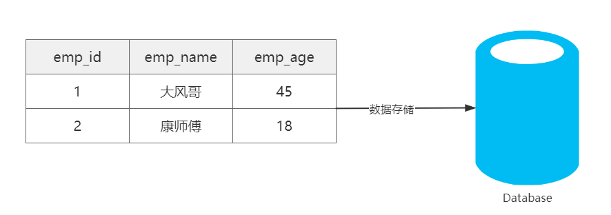 |

#### 6.1.1.2 数据的操作

> 数据存储在数据库，仅仅解决了我们数据存储的问题，但当我们程序运行时，需要读取数据，以及对数据做增删改的操作，那么我们如何通过Java程序对数据库中的数据做增删改查呢？

|                      Java程序读取数据库                      |
| :----------------------------------------------------------: |
| 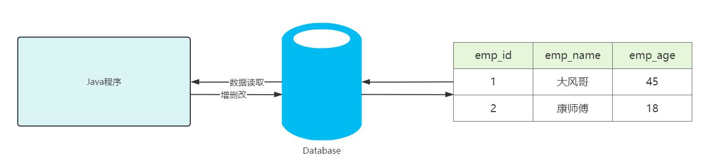 |


### 6.1.2 JDBC

#### 6.1.2.1 JDBC的概念

- JDBC：Java Database Connectivity，意为Java数据库连接。
- JDBC是Java提供的一组独立于任何数据库管理系统的API。
- Java提供接口规范，由各个数据库厂商提供接口的实现，厂商提供的实现类封装成jar文件，也就是我们俗称的数据库驱动jar包。
- 学习JDBC，充分体现了面向接口编程的好处，程序员只关心标准和规范，而无需关注实现过程。

|                       JDBC简单执行过程                       |
| :----------------------------------------------------------: |
| 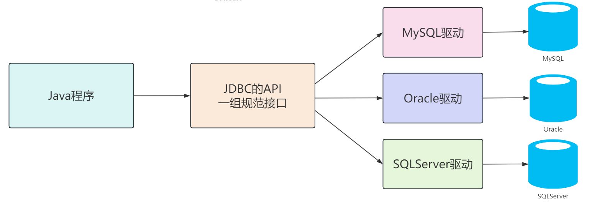 |

> 我们开发的同一套Java代码是无法操作不同的关系型数据库，因为每一个关系型数据库的底层实现细节都不一样。如果这样，问题就很大了，在公司中可以在开发阶段使用的是MySQL数据库，而上线时公司最终选用oracle数据库，我们就需要对代码进行大批量修改，这显然并不是我们想看到的。我们要做到的是同一套Java代码操作不同的关系型数据库，而此时sun公司就指定了一套标准接口（JDBC），JDBC中定义了所有操作关系型数据库的规则。众所周知接口是无法直接使用的，我们需要使用接口的实现类，而这套实现类（称之为：驱动）就由各自的数据库厂商给出。

#### 6.1.2.2 JDBC的核心组成

- **接口规范：**
  - 为了项目代码的可移植性，可维护性，SUN公司从最初就制定了Java程序连接各种数据库的统一接口规范。这样的话，不管是连接哪一种DBMS软件，Java代码可以保持一致性。
  - 接口存储在java.sql和javax.sql包下。
- **实现规范：**
  - 因为各个数据库厂商的DBMS软件各有不同，那么各自的内部如何通过SQL实现增、删、改、查等操作管理数据，只有这个数据库厂商自己更清楚，因此把接口规范的实现交给各个数据库厂商自己实现。
  - 厂商将实现内容和过程封装成jar文件，我们程序员只需要将jar文件引入到项目中集成即可，就可以开发调用实现过程操作数据库了。

- **JDBC本质：**
  - 官方（sun公司）定义的一套操作所有关系型数据库的规则，即接口
  - 各个数据库厂商去实现这套接口，提供数据库驱动jar包
  - 我们可以使用这套接口（JDBC）编程，真正执行的代码是驱动jar包中的实现类

- **JDBC好处：**
  - 各数据库厂商使用相同的接口，Java代码不需要针对不同数据库分别开发
  - 可随时替换底层数据库，访问数据库的Java代码基本不变

### 三、JDBC快速入门

#### 3.1 JDBC搭建步骤

1. 准备数据库。
2. 官网下载数据库连接驱动jar包。[https://downloads.mysql.com/archives/c-j/]()
3. 创建Java项目，在项目下创建lib文件夹，将下载的驱动jar包复制到文件夹里。
4. 选中lib文件夹右键->Add as Library，与项目集成。
5. 编写代码


#### 3.2 代码实现

##### 3.2.1 数据库

```sql
CREATE DATABASE atguigu;

use atguigu;

create table t_emp
(
    emp_id     int auto_increment comment '员工编号' primary key,
    emp_name   varchar(100)  not null comment '员工姓名',
    emp_salary double(10, 5) not null comment '员工薪资',
    emp_age    int           not null comment '员工年龄'
);

insert into t_emp (emp_name,emp_salary,emp_age)
values  ('andy', 777.77, 32),
        ('大风哥', 666.66, 41),
        ('康师傅',111, 23),
        ('Gavin',123, 26),
        ('小鱼儿', 123, 28);
```


##### 3.2.2 Java代码

```java
package com.atguigu;

import java.sql.*;

public class JdbcQuick {
    public static void main(String[] args) throws ClassNotFoundException， SQLException {
        //1.注册驱动
        Class.forName("com.mysql.cj.jdbc.Driver");

        //2.获取数据库连接
        Connection connection = DriverManager.getConnection("jdbc:mysql://localhost:3306/atguigu", "root", "atguigu");

        //3.创建Statement对象
        PreparedStatement preparedStatement = connection.prepareStatement("select emp_id,emp_name,emp_salary,emp_age from t_emp");

        //4.编写SQL语句并执行，获取结果
        ResultSet resultSet = preparedStatement.executeQuery();


        //5.处理结果
        while (resultSet.next()) {
            int empId = resultSet.getInt("emp_id");
            String empName = resultSet.getString("emp_name");
            String empSalary = resultSet.getString("emp_salary");
            int empAge = resultSet.getInt("emp_age");
            System.out.println(empId + "\t" + empName + "\t" + empSalary + "\t" + empAge);
        }

        //6.释放资源(先开后关原则)
        resultSet.close();
        preparedStatement.close();
        connection.close();

    }
}

```


#### 3.3 步骤总结

1. 注册驱动【依赖的驱动类，进行安装】
2. 获取连接【Connection建立连接】
3. 创建发送SQL语句对象【Connection创建发送SQL语句的Statement】
4. 发送SQL语句，并获取返回结果【Statement 发送sql语句到数据库并且取得返回结果】
5. 结果集解析【结果集解析，将查询结果解析出来】
6. 资源关闭【释放ResultSet、Statement 、Connection】


## 2，JDBC快速入门

先来看看通过Java操作数据库的流程

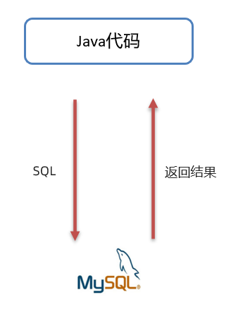

第一步：编写Java代码

第二步：Java代码将SQL发送到MySQL服务端

第三步：MySQL服务端接收到SQL语句并执行该SQL语句

第四步：将SQL语句执行的结果返回给Java代码

### 2.1  编写代码步骤

* 创建工程，导入驱动jar包

  

* 注册驱动

  ```sql
  Class.forName("com.mysql.jdbc.Driver");
  ```

* 获取连接

  ```sql
  Connection conn = DriverManager.getConnection(url, username, password);
  ```

  Java代码需要发送SQL给MySQL服务端，就需要先建立连接

* 定义SQL语句

  ```sql
  String sql =  “update…” ;
  ```

* 获取执行SQL对象

  执行SQL语句需要SQL执行对象，而这个执行对象就是Statement对象

  ```sql
  Statement stmt = conn.createStatement();
  ```

* 执行SQL

  ```sql
  stmt.executeUpdate(sql);
  ```

* 处理返回结果

* 释放资源


### 四、核心API理解

#### 4.1 注册驱动

- ```java
  Class.forName("com.mysql.cj.jdbc.Driver");
  ```

- 在 Java 中，当使用 JDBC（Java Database Connectivity）连接数据库时，需要加载数据库特定的驱动程序，以便与数据库进行通信。加载驱动程序的目的是为了注册驱动程序，使得 JDBC API 能够识别并与特定的数据库进行交互。

- 从JDK6开始，不再需要显式地调用 `Class.forName()` 来加载 JDBC 驱动程序，只要在类路径中集成了对应的jar文件，会自动在初始化时注册驱动程序。


#### 4.2 Connection

- Connection接口是JDBC API的重要接口，用于建立与数据库的通信通道。换而言之，Connection对象不为空，则代表一次数据库连接。
- 在建立连接时，需要指定数据库URL、用户名、密码参数。
  - URL：jdbc:mysql://localhost:3306/atguigu
    - jdbc:mysql://IP地址:端口号/数据库名称?参数键值对1&参数键值对2
- `Connection` 接口还负责管理事务，`Connection` 接口提供了 `commit` 和 `rollback` 方法，用于提交事务和回滚事务。
- 可以创建 `Statement` 对象，用于执行 SQL 语句并与数据库进行交互。
- 在使用JDBC技术时，必须要先获取Connection对象，在使用完毕后，要释放资源，避免资源占用浪费及泄漏。


#### 4.3 Statement

- `Statement` 接口用于执行 SQL 语句并与数据库进行交互。它是 JDBC API 中的一个重要接口。通过 `Statement` 对象，可以向数据库发送 SQL 语句并获取执行结果。
- 结果可以是一个或多个结果。
  - 增删改：受影响行数单个结果。
  - 查询：单行单列、多行多列、单行多列等结果。
- 但是`Statement` 接口在执行SQL语句时，会产生`SQL注入攻击问题`:
  - 当使用 `Statement` 执行动态构建的 SQL 查询时，往往需要将查询条件与 SQL 语句拼接在一起，直接将参数和SQL语句一并生成，让SQL的查询条件始终为true得到结果。


#### 4.4 PreparedStatement

- `PreparedStatement`是 `Statement` 接口的子接口，用于执行`预编译`的 SQL 查询，作用如下：
  - 预编译SQL语句：在创建PreparedStatement时，就会预编译SQL语句，也就是SQL语句已经固定。
  - 防止SQL注入：`PreparedStatement` 支持参数化查询，将数据作为参数传递到SQL语句中，采用?占位符的方式，将传入的参数用一对单引号包裹起来''，无论传递什么都作为值。有效防止传入关键字或值导致SQL注入问题。
  - 性能提升：PreparedStatement是预编译SQL语句，同一SQL语句多次执行的情况下，可以复用，不必每次重新编译和解析。
- 后续的学习我们都是基于PreparedStatement进行实现，更安全、效率更高！


#### 4.5 ResultSet

- `ResultSet`是 JDBC API 中的一个接口，用于表示从数据库中`执行查询语句所返回的结果集`。它提供了一种用于遍历和访问查询结果的方式。
- 遍历结果：ResultSet可以使用 `next()` 方法将游标移动到结果集的下一行，逐行遍历数据库查询的结果，返回值为boolean类型，true代表有下一行结果，false则代表没有。
- 获取单列结果：可以通过getXxx的方法获取单列的数据，该方法为重载方法，支持索引和列名进行获取。


### 五、基于PreparedStatement实现CRUD

#### 5.1 查询单行单列

```java
	@Test
    public void querySingleRowAndColumn() throws SQLException {
        //1.注册驱动
//        Class.forName("com.mysql.cj.jdbc.Driver");

        //2.获取数据库连接
        Connection connection = DriverManager.getConnection("jdbc:mysql://localhost:3306/atguigu", "root","atguigu");

        //3.创建PreparedStatement对象，并预编译SQL语句
        PreparedStatement preparedStatement = connection.prepareStatement("select count(*) as count from t_emp");

        //4.执行SQL语句，获取结果
        ResultSet resultSet = preparedStatement.executeQuery();

        //5.处理结果
        while (resultSet.next()){
            int count = resultSet.getInt("count");
            System.out.println("count = " + count);
        }

        //6.释放资源(先开后关原则)
        resultSet.close();
        preparedStatement.close();
        connection.close();

    }
```


#### 5.2 查询单行多列

```java
	@Test
    public void querySingleRow() throws SQLException {
        //1.注册驱动
//        Class.forName("com.mysql.cj.jdbc.Driver");

        //2.获取数据库连接
        Connection connection = DriverManager.getConnection("jdbc:mysql://localhost:3306/atguigu","root","atguigu");

        //3.创建PreparedStatement对象，并预编译SQL语句，使用?占位符
        PreparedStatement preparedStatement = connection.prepareStatement("select emp_id,emp_name,emp_salary,emp_age from t_emp where emp_id = ?");

        //4.为占位符赋值，索引从1开始，执行SQL语句，获取结果
        preparedStatement.setInt(1,1);
        ResultSet resultSet = preparedStatement.executeQuery();

        //5.处理结果
        while (resultSet.next()){
            int empId = resultSet.getInt("emp_id");
            String empName = resultSet.getString("emp_name");
            String empSalary = resultSet.getString("emp_salary");
            int empAge = resultSet.getInt("emp_age");
            System.out.println(empId+"\t"+empName+"\t"+empSalary+"\t"+empAge);
        }

        //6.释放资源(先开后关原则)
        resultSet.close();
        preparedStatement.close();
        connection.close();

    }
```


#### 5.3 查询多行多列

```java
	@Test
    public void queryMoreRow() throws SQLException {
        //1.注册驱动
//        Class.forName("com.mysql.cj.jdbc.Driver");

        //2.获取数据库连接
        Connection connection = DriverManager.getConnection("jdbc:mysql://localhost:3306/atguigu","root","atguigu");

        //3.创建Statement对象
        PreparedStatement preparedStatement = connection.prepareStatement("select emp_id,emp_name,emp_salary,emp_age from t_emp");

        //4.编写SQL语句并执行，获取结果
        ResultSet resultSet = preparedStatement.executeQuery();


        //5.处理结果
        while (resultSet.next()){
            int empId = resultSet.getInt("emp_id");
            String empName = resultSet.getString("emp_name");
            String empSalary = resultSet.getString("emp_salary");
            int empAge = resultSet.getInt("emp_age");
            System.out.println(empId+"\t"+empName+"\t"+empSalary+"\t"+empAge);
        }

        //6.释放资源(先开后关原则)
        resultSet.close();
        preparedStatement.close();
        connection.close();

    }
```


#### 5.4 新增

```java
	@Test
    public void insert() throws SQLException {
        //1.注册驱动
//        Class.forName("com.mysql.cj.jdbc.Driver");

        //2.获取数据库连接
        Connection connection = DriverManager.getConnection("jdbc:mysql://localhost:3306/atguigu","root", "atguigu");

        //3.创建Statement对象
        PreparedStatement preparedStatement = connection.prepareStatement("insert into t_emp (emp_name,emp_salary,emp_age)values  (?, ?,?)");

        //4.为占位符赋值，索引从1开始，编写SQL语句并执行，获取结果
        preparedStatement.setString(1,"rose");
        preparedStatement.setDouble(2,666.66);
        preparedStatement.setDouble(3,28);
        int result = preparedStatement.executeUpdate();

        //5.处理结果
        if(result>0){
            System.out.println("添加成功");
        }else{
            System.out.println("添加失败");
        }

        //6.释放资源(先开后关原则)
        preparedStatement.close();
        connection.close();

    }
```


#### 5.5 修改

```java
	@Test
    public void update() throws SQLException {
        //1.注册驱动
//        Class.forName("com.mysql.cj.jdbc.Driver");

        //2.获取数据库连接
        Connection connection = DriverManager.getConnection("jdbc:mysql://localhost:3306/atguigu", "root", "atguigu");

        //3.创建Statement对象
        PreparedStatement preparedStatement = connection.prepareStatement("update t_emp set emp_salary = ? where emp_id = ?");

        //4.为占位符赋值，索引从1开始，编写SQL语句并执行，获取结果
        preparedStatement.setDouble(1,888.88);
        preparedStatement.setDouble(2,8);
        int result = preparedStatement.executeUpdate();

        //5.处理结果
        if(result>0){
            System.out.println("修改成功");
        }else{
            System.out.println("修改失败");
        }

        //6.释放资源(先开后关原则)
        preparedStatement.close();
        connection.close();

    }
```


#### 5.6 删除

```java
	@Test
    public void delete() throws SQLException {
        //1.注册驱动
//        Class.forName("com.mysql.cj.jdbc.Driver");

        //2.获取数据库连接
        Connection connection = DriverManager.getConnection("jdbc:mysql://localhost:3306/atguigu", "root", "atguigu");

        //3.创建Statement对象
        PreparedStatement preparedStatement = connection.prepareStatement("delete from t_emp where emp_id = ?");

        //4.为占位符赋值，索引从1开始，编写SQL语句并执行，获取结果
        preparedStatement.setInt(1,8);
        int result = preparedStatement.executeUpdate();

        //5.处理结果
        if(result>0){
            System.out.println("删除成功");
        }else{
            System.out.println("删除失败");
        }

        //6.释放资源(先开后关原则)
        preparedStatement.close();
        connection.close();

    }
```


### 六、常见问题

#### 6.1 资源的管理

> 在使用JDBC的相关资源时，比如Connection、PreparedStatement、ResultSet，使用完毕后，要及时关闭这些资源以释放数据库服务器资源和避免内存泄漏是很重要的。


#### 6.2 SQL语句问题

> java.sql.SQLSyntaxErrorException：SQL语句错误异常，一般有几种可能：
>
> 1. SQL语句有错误，检查SQL语句！建议SQL语句在SQL工具中测试后再复制到Java程序中！
> 2. 连接数据库的URL中，数据库名称编写错误，也会报该异常！
>
> 


#### 6.3 SQL语句未设置参数问题

> java.sql.SQLException：No value specified for parameter 1
>
> 在使用预编译SQL语句时，如果有?占位符，要为每一个占位符赋值，否则报该错误！
>
> 


#### 6.4 用户名或密码错误问题

> 连接数据库时，如果用户名或密码输入错误，也会报SQLException，容易混淆！所以一定要看清楚异常后面的原因描述
>
> 


#### 6.5 通信异常

> 在连接数据库的URL中，如果IP或端口写错了，会报如下异常：
>
> com.mysql.cj.jdbc.exceptions.CommunicationsException: Communications link failure
>
> 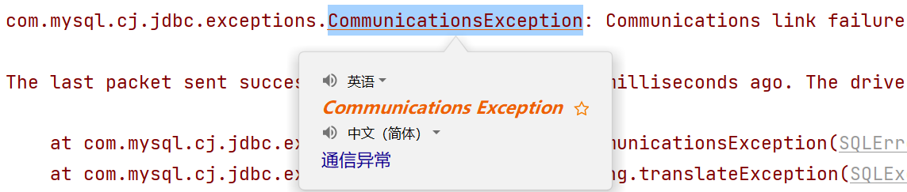


## 进阶篇

### 七、JDBC扩展

#### 7.1 实体类和ORM

> - 在使用JDBC操作数据库时，我们会发现数据都是零散的，明明在数据库中是一行完整的数据，到了Java中变成了一个一个的变量，不利于维护和管理。而我们Java是面向对象的，一个表对应的是一个类，一行数据就对应的是Java中的一个对象，一个列对应的是对象的属性，所以我们要把数据存储在一个载体里，这个载体就是实体类！
> - ORM（Object Relational Mapping）思想，**对象到关系数据库的映射**，作用是在编程中，把面向对象的概念跟数据库中表的概念对应起来，以面向对象的角度操作数据库中的数据，即一张表对应一个类，一行数据对应一个对象，一个列对应一个属性！
> - 当下JDBC中这种过程我们称其为手动ORM。后续我们也会学习ORM框架，比如MyBatis、JPA等。

```java
package com.atguigu.pojo;
//类名和数据库名对应，但是表名一般缩写，类名要全写！
public class Employee {
    private Integer empId;//emp_id = empId 数据库中列名用下划线分隔，属性名用驼峰！
    private String empName;//emp_name = empName
    private Double empSalary;//emp_salary = empSalary
    private Integer empAge;//emp_age = empAge

    //省略get、set、无参、有参、toString方法。
}
```

封装代码：

```java
	@Test
    public void querySingleRow() throws SQLException {
        //1.注册驱动
//        Class.forName("com.mysql.cj.jdbc.Driver");

        //2.获取数据库连接
        Connection connection = DriverManager.getConnection("jdbc:mysql://localhost:3306/atguigu", "root","atguigu");

        //3.创建PreparedStatement对象，并预编译SQL语句，使用?占位符
        PreparedStatement preparedStatement = connection.prepareStatement("select emp_id,emp_name,emp_salary,emp_age from t_emp where emp_id = ?");

        //4.为占位符赋值，索引从1开始，执行SQL语句，获取结果
        preparedStatement.setInt(1, 1);
        ResultSet resultSet = preparedStatement.executeQuery();
	      //预先创建实体类变量
        Employee employee = null;
        //5.处理结果
        while (resultSet.next()) {
            int empId = resultSet.getInt("emp_id");
            String empName = resultSet.getString("emp_name");
            Double empSalary = Double.valueOf(resultSet.getString("emp_salary"));
            int empAge = resultSet.getInt("emp_age");
	//当结果集中有数据，再进行对象的创建
            employee = new Employee(empId,empName,empSalary,empAge);
        }

        System.out.println("employee = " + employee);

        //6.释放资源(先开后关原则)
        resultSet.close();
        preparedStatement.close();
        connection.close();

    }
```


#### 7.2 主键回显

- 在数据中，执行新增操作时，主键列为自动增长，可以在表中直观的看到，但是在Java程序中，我们执行完新增后，只能得到受影响行数，无法得知当前新增数据的主键值。在Java程序中获取数据库中插入新数据后的主键值，并赋值给Java对象，此操作为主键回显。

- 代码实现：

  - ```java
	@Test
       public void testReturnPK() throws SQLException {
           //1.注册驱动
    //        Class.forName("com.mysql.cj.jdbc.Driver");

            //2.获取数据库连接
            Connection connection = DriverManager.getConnection("jdbc:mysql://localhost:3306/atguigu", "root", "atguigu");

            //3.创建preparedStatement对象，传入需要主键回显参数Statement.RETURN_GENERATED_KEYS
            PreparedStatement preparedStatement = connection.prepareStatement("insert into t_emp (emp_name, emp_salary, emp_age)values  (?, ?,?)",Statement.RETURN_GENERATED_KEYS);

            //4.编写SQL语句并执行，获取结果
            Employee employee = new Employee(null,"rose",666.66,28);
            preparedStatement.setString(1,employee.getEmpName());
            preparedStatement.setDouble(2,employee.getEmpSalary());
            preparedStatement.setDouble(3,employee.getEmpAge());
            int result = preparedStatement.executeUpdate();

            //5.处理结果
            if(result>0){
                System.out.println("添加成功");
            }else{
                System.out.println("添加失败");
            }

            //6.获取生成的主键列值，返回的是resultSet，在结果集中获取主键列值
            ResultSet resultSet = preparedStatement.getGeneratedKeys();
            if (resultSet.next()){
                int empId = resultSet.getInt(1);
                employee.setEmpId(empId);
            }

	System.out.println(employee.toString());

            //7.释放资源(先开后关原则)
            resultSet.close();
            preparedStatement.close();
            connection.close();

        }
    ```


#### 7.3 批量操作

- 插入多条数据时，一条一条发送给数据库执行，效率低下！

- 通过批量操作，可以提升多次操作效率！

- 代码实现：

  - ```java
	@Test
        public void testBatch() throws Exception {
            //1.注册驱动
    //        Class.forName("com.mysql.cj.jdbc.Driver");

            //2.获取连接
            Connection connection = DriverManager.getConnection("jdbc:mysql:///atguigu?rewriteBatchedStatements=true", "root", "atguigu");

            //3.编写SQL语句
            /*
                注意：1、必须在连接数据库的URL后面追加?rewriteBatchedStatements=true，允许批量操作
                    2、新增SQL必须用values。且语句最后不要追加;结束
                    3、调用addBatch()方法，将SQL语句进行批量添加操作
                    4、统一执行批量操作，调用executeBatch()
             */
            String sql = "insert into t_emp (emp_name,emp_salary,emp_age) values (?,?,?)";

            //4.创建预编译的PreparedStatement，传入SQL语句
            PreparedStatement preparedStatement = connection.prepareStatement(sql);

            //获取当前行代码执行的时间。毫秒值
            long start = System.currentTimeMillis();
            for(int i = 0;i<10000;i++){
                //5.为占位符赋值
                preparedStatement.setString(1, "marry"+i);
                preparedStatement.setDouble(2, 100.0+i);
                preparedStatement.setInt(3, 20+i);

                preparedStatement.addBatch();
            }

            //执行批量操作
            preparedStatement.executeBatch();

            long end = System.currentTimeMillis();

            System.out.println("消耗时间："+(end - start));

            preparedStatement.close();
            connection.close();
        }
    ```


### 八、连接池

#### 8.1 现有问题

> - 每次操作数据库都要获取新连接，使用完毕后就close释放，频繁的创建和销毁造成资源浪费。
> - 连接的数量无法把控，对服务器来说压力巨大。


#### 8.2 连接池

> 连接池就是数据库连接对象的缓冲区，通过配置，由连接池负责创建连接、管理连接、释放连接等操作。
>
> 预先创建数据库连接放入连接池，用户在请求时，通过池直接获取连接，使用完毕后，将连接放回池中，避免了频繁的创建和销毁，同时解决了创建的效率。
>
> 当池中无连接可用，且未达到上限时，连接池会新建连接。
>
> 池中连接达到上限，用户请求会等待，可以设置超时时间。


#### 8.3 常见连接池

JDBC 的数据库连接池使用 javax.sql.DataSource接口进行规范，所有的第三方连接池都实现此接口，自行添加具体实现！也就是说，所有连接池获取连接的和回收连接方法都一样，不同的只有性能和扩展功能!

- DBCP 是Apache提供的数据库连接池，速度相对C3P0较快，但自身存在一些BUG。
- C3P0 是一个开源组织提供的一个数据库连接池，速度相对较慢，稳定性还可以。
- Proxool 是sourceforge下的一个开源项目数据库连接池，有监控连接池状态的功能， 稳定性较c3p0差一点
- **Druid 是阿里提供的数据库连接池，是集DBCP 、C3P0 、Proxool 优点于一身的数据库连接池，性能、扩展性、易用性都更好，功能丰富**。
- **Hikari（ひかり[shi ga li]） 取自日语，是光的意思，是SpringBoot2.x之后内置的一款连接池，基于 BoneCP （已经放弃维护，推荐该连接池）做了不少的改进和优化，口号是快速、简单、可靠。**

|                     主流连接池的功能对比                     |
| :----------------------------------------------------------: |
| 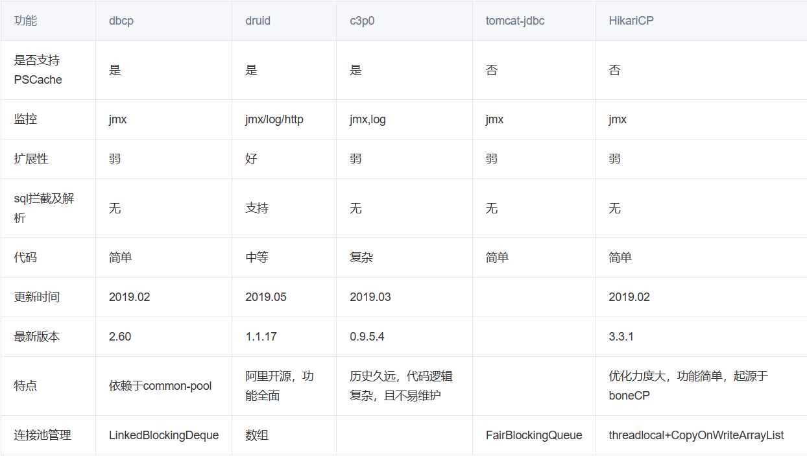 |

|                   mock性能数据（单位：ms）                   |
| :----------------------------------------------------------: |
| 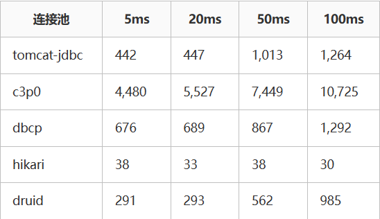 |

|                   mysql性能数据 (单位：ms)                   |
| :----------------------------------------------------------: |
| 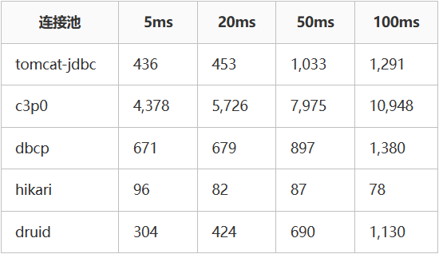 |


#### 8.4 Druid连接池使用

- 使用步骤：

  - 引入jar包。
  - 编码。

- 代码实现：

  - 硬编码方式（了解）：

    - ```java
      @Test
          public void testHardCodeDruid() throws SQLException {
              /*
                  硬编码：将连接池的配置信息和Java代码耦合在一起。
                  1、创建DruidDataSource连接池对象。
                  2、设置连接池的配置信息【必须 | 非必须】
                  3、通过连接池获取连接对象
                  4、回收连接【不是释放连接，而是将连接归还给连接池，给其他线程进行复用】
               */

              //1.创建DruidDataSource连接池对象。
              DruidDataSource druidDataSource = new DruidDataSource();

              //2.设置连接池的配置信息【必须 | 非必须】
              //2.1 必须设置的配置
              druidDataSource.setDriverClassName("com.mysql.cj.jdbc.Driver");
              druidDataSource.setUrl("jdbc:mysql:///atguigu");
              druidDataSource.setUsername("root");
              druidDataSource.setPassword("atguigu");

              //2.2 非必须设置的配置
              druidDataSource.setInitialSize(10);
              druidDataSource.setMaxActive(20);

              //3.通过连接池获取连接对象
              Connection connection = druidDataSource.getConnection();
              System.out.println(connection);

              //基于connection进行CRUD

              //4.回收连接
              connection.close();
          }
      ```

  - 软编码方式（推荐）：

    - 在项目目录下创建resources文件夹，标识该文件夹为资源目录，创建db.properties配置文件，将连接信息定义在该文件中。

      - ```properties
        # druid连接池需要的配置参数，key固定命名
        driverClassName=com.mysql.cj.jdbc.Driver
        url=jdbc:mysql:///atguigu
        username=root
        password=atguigu
        initialSize=10
        maxActive=20
        ```

    - Java代码：

      - ```java
        @Test
            public void testResourcesDruid() throws Exception {
                //1.创建Properties集合，用于存储外部配置文件的key和value值。
                Properties properties = new Properties();

                //2.读取外部配置文件，获取输入流，加载到Properties集合里。
                InputStream inputStream = DruidTest.class.getClassLoader().getResourceAsStream("db.properties");
                properties.load(inputStream);

                //3.基于Properties集合构建DruidDataSource连接池
                DataSource dataSource = DruidDataSourceFactory.createDataSource(properties);

                //4.通过连接池获取连接对象
                Connection connection = dataSource.getConnection();
                System.out.println(connection);

                //5.开发CRUD

                //6.回收连接
                connection.close();
            }
        ```


#### 8.5 Druid其他配置【了解】

| 配置                          | **缺省** | **说明**                                                     |
| ----------------------------- | -------- | ------------------------------------------------------------ |
| name                          |          | 配置这个属性的意义在于，如果存在多个数据源，监控的时候可以通过名字来区分开来。 如果没有配置，将会生成一个名字，格式是：”DataSource-” + System.identityHashCode(this) |
| jdbcUrl                       |          | 连接数据库的url，不同数据库不一样。例如：mysql : jdbc:mysql://10.20.153.104:3306/druid2 oracle : jdbc:oracle:thin:@10.20.149.85:1521:ocnauto |
| username                      |          | 连接数据库的用户名                                           |
| password                      |          | 连接数据库的密码。如果你不希望密码直接写在配置文件中，可以使用ConfigFilter。详细看这里：<https://github.com/alibaba/druid/wiki/%E4%BD%BF%E7%94%A8ConfigFilter> |
| driverClassName               |          | 根据url自动识别 这一项可配可不配，如果不配置druid会根据url自动识别dbType，然后选择相应的driverClassName(建议配置下) |
| initialSize                   | 0        | 初始化时建立物理连接的个数。初始化发生在显示调用init方法，或者第一次getConnection时 |
| maxActive                     | 8        | 最大连接池数量                                               |
| maxIdle                       | 8        | 已经不再使用，配置了也没效果                                 |
| minIdle                       |          | 最小连接池数量                                               |
| maxWait                       |          | 获取连接时最大等待时间，单位毫秒。配置了maxWait之后，缺省启用公平锁，并发效率会有所下降，如果需要可以通过配置useUnfairLock属性为true使用非公平锁。 |
| poolPreparedStatements        | false    | 是否缓存preparedStatement，也就是PSCache。PSCache对支持游标的数据库性能提升巨大，比如说oracle。在mysql下建议关闭。 |
| maxOpenPreparedStatements     | -1       | 要启用PSCache，必须配置大于0，当大于0时，poolPreparedStatements自动触发修改为true。在Druid中，不会存在Oracle下PSCache占用内存过多的问题，可以把这个数值配置大一些，比如说100 |
| validationQuery               |          | 用来检测连接是否有效的sql，要求是一个查询语句。如果validationQuery为null，testOnBorrow、testOnReturn、testWhileIdle都不会其作用。 |
| testOnBorrow                  | true     | 申请连接时执行validationQuery检测连接是否有效，做了这个配置会降低性能。 |
| testOnReturn                  | false    | 归还连接时执行validationQuery检测连接是否有效，做了这个配置会降低性能 |
| testWhileIdle                 | false    | 建议配置为true，不影响性能，并且保证安全性。申请连接的时候检测，如果空闲时间大于timeBetweenEvictionRunsMillis，执行validationQuery检测连接是否有效。 |
| timeBetweenEvictionRunsMillis |          | 有两个含义： 1)Destroy线程会检测连接的间隔时间2)testWhileIdle的判断依据，详细看testWhileIdle属性的说明 |
| numTestsPerEvictionRun        |          | 不再使用，一个DruidDataSource只支持一个EvictionRun           |
| minEvictableIdleTimeMillis    |          |                                                              |
| connectionInitSqls            |          | 物理连接初始化的时候执行的sql                                |
| exceptionSorter               |          | 根据dbType自动识别 当数据库抛出一些不可恢复的异常时，抛弃连接 |
| filters                       |          | 属性类型是字符串，通过别名的方式配置扩展插件，常用的插件有： 监控统计用的filter:stat日志用的filter:log4j防御sql注入的filter:wall |
| proxyFilters                  |          | 类型是List，如果同时配置了filters和proxyFilters，是组合关系，并非替换关系 |


#### 8.6 HikariCP连接池使用

- 使用步骤：

  - 引入jar包

  - 硬编码方式：

    - ```java
      @Test
      public void testHardCodeHikari() throws SQLException {
          /*
           硬编码：将连接池的配置信息和Java代码耦合在一起。
           1、创建HikariDataSource连接池对象
           2、设置连接池的配置信息【必须 ｜ 非必须】
           3、通过连接池获取连接对象
           4、回收连接
           */
          //1.创建HikariDataSource连接池对象
          HikariDataSource hikariDataSource = new HikariDataSource();

          //2.设置连接池的配置信息【必须 ｜ 非必须】
          //2.1必须设置的配置
          hikariDataSource.setDriverClassName("com.mysql.cj.jdbc.Driver");
          hikariDataSource.setJdbcUrl("jdbc:mysql:///atguigu");
          hikariDataSource.setUsername("root");
          hikariDataSource.setPassword("atguigu");

          //2.2 非必须设置的配置
          hikariDataSource.setMinimumIdle(10);
          hikariDataSource.setMaximumPoolSize(20);

          //3.通过连接池获取连接对象
          Connection connection = hikariDataSource.getConnection();

          System.out.println(connection);

          //回收连接
          connection.close();
      }
      ```

  - 软编码方式：

    - 在项目下创建resources/hikari.properties配置文件

      - ```properties
        driverClassName=com.mysql.cj.jdbc.Driver
        jdbcUrl=jdbc:mysql:///atguigu
        username=root
        password=atguigu
        minimumIdle=10
        maximumPoolSize=20
        ```

    - 编写代码：

      - ```java
	@Test
	public void testResourcesHikari()throws Exception{
                 //1.创建Properties集合，用于存储外部配置文件的key和value值。
                Properties properties = new Properties();

                //2.读取外部配置文件，获取输入流，加载到Properties集合里。
                InputStream inputStream = HikariTest.class.getClassLoader().getResourceAsStream("db.properties");
                properties.load(inputStream);

                // 3.创建Hikari连接池配置对象，将Properties集合传进去
                HikariConfig hikariConfig = new HikariConfig(properties);

                // 4. 基于Hikari配置对象，构建连接池
                HikariDataSource hikariDataSource = new HikariDataSource(hikariConfig);

                // 5. 获取连接
                Connection connection = hikariDataSource.getConnection();
                System.out.println("connection = " + connection);

                //6.回收连接
                connection.close();
            }
        }
        ```

#### 8.7 HikariCP其他配置【了解】

| 属性                | 默认值       | 说明                                                         |
| ------------------- | ------------ | ------------------------------------------------------------ |
| isAutoCommit        | true         | 自动提交从池中返回的连接                                     |
| connectionTimeout   | 30000        | 等待来自池的连接的最大毫秒数                                 |
| maxLifetime         | 1800000      | 池中连接最长生命周期如果不等于0且小于30秒则会被重置回30分钟  |
| minimumIdle         | 10           | 池中维护的最小空闲连接数 minIdle<0或者minIdle>maxPoolSize，则被重置为maxPoolSize |
| maximumPoolSize     | 10           | 池中最大连接数，包括闲置和使用中的连接                       |
| metricRegistry      | null         | 连接池的用户定义名称，主要出现在日志记录和JMX管理控制台中以识别池和池配置 |
| healthCheckRegistry | null         | 报告当前健康信息                                             |
| poolName            | HikariPool-1 | 连接池的用户定义名称，主要出现在日志记录和JMX管理控制台中以识别池和池配置 |
| idleTimeout         |              | 是允许连接在连接池中空闲的最长时间                           |


## 高级篇

### 九、JDBC优化及工具类封装

#### 9.1 现有问题

> 我们在使用JDBC的过程中，发现部分代码存在冗余的问题：
>
> - 创建连接池。
> - 获取连接。
> - 连接的回收。


#### 9.2 JDBC工具类封装V1.0

- resources/db.properties配置文件：

  - ```properties
    # druid连接池需要的配置参数，key固定命名
    driverClassName=com.mysql.cj.jdbc.Driver
    username=root
    password=atguigu
    url=jdbc:mysql:///atguigu
    ```

- 工具类代码：

  - ```java
    import com.alibaba.druid.pool.DruidDataSourceFactory;

    import javax.sql.DataSource;
    import java.sql.Connection;
    import java.sql.SQLException;
    import java.util.Properties;
    /**
    *	JDBC工具类（V1.0）：
    *		1、维护一个连接池对象。
    *		2、对外提供在连接池中获取连接的方法
    *		3、对外提供回收连接的方法
    *	注意：工具类仅对外提供共性的功能代码，所以方法均为静态方法！
    */
    public class JDBCTools {
        //创建连接池引用，因为要提供给当前项目全局使用，所以创建为静态的。
        private static DataSource dataSource;
        //在项目启动时，即创建连接池对象，赋值给dataSource
        static{
            try {
                Properties properties = new Properties();
                InputStream inputStream =  JDBCTools.getClass().getClassLoader().getSystemResourceAsStream("db.properties");
                properties.load(inputStream);
                dataSource = DruidDataSourceFactory.createDataSource(properties);
            } catch (Exception e) {
                e.printStackTrace();
            }
        }
	//对外提供获取连接的静态方法！
        public static Connection getConnection() throws SQLException {
            return ds.getConnection();
        }
	//对外提供回收连接的静态方法
        public static void release(Connection conn) throws SQLException {
            conn.close();//还给连接池
        }
    }
    ```

- 注意：此种封装方式，无法保证单个请求连接的线程，多次操作数据库时，连接是同一个，无法保证事务！


#### 9.3 ThreadLocal

> JDK 1.2的版本中就提供java.lang.ThreadLocal，为解决多线程程序的并发问题提供了一种新的思路。使用这个工具类可以很简洁地编写出优美的多线程程序。通常用来在在多线程中管理共享数据库连接、Session等。
>
> ThreadLocal用于保存某个线程共享变量，原因是在Java中，每一个线程对象中都有一个ThreadLocalMap<ThreadLocal， Object>，其key就是一个ThreadLocal，而Object即为该线程的共享变量。
>
> 而这个map是通过ThreadLocal的set和get方法操作的。对于同一个static ThreadLocal，不同线程只能从中get，set，remove自己的变量，而不会影响其他线程的变量。
>
> - 在进行对象跨层传递的时候，使用ThreadLocal可以避免多次传递，打破层次间的约束。
> - 线程间数据隔离。
> - 进行事务操作，用于存储线程事务信息。
> - 数据库连接，`Session`会话管理。
>
> 1、ThreadLocal对象.get: 获取ThreadLocal中当前线程共享变量的值。
>
> 2、ThreadLocal对象.set: 设置ThreadLocal中当前线程共享变量的值。
>
> 3、ThreadLocal对象.remove: 移除ThreadLocal中当前线程共享变量的值。


#### 9.4 JDBC工具类封装V2.0

> 在V1.0的版本基础上，我们将连接对象放在每个线程的ThreadLocal中，保证从头到尾当前线程操作的是同一连接对象。

代码实现：

```java
package com.atguigu.senior.util;

import com.alibaba.druid.pool.DruidDataSourceFactory;

import javax.sql.DataSource;
import java.io.InputStream;
import java.sql.Connection;
import java.sql.SQLException;
import java.util.Properties;
/**
 *  JDBC工具类（V2.0）：
 *      1、维护一个连接池对象、维护了一个线程绑定变量的ThreadLocal对象
 *      2、对外提供在ThreadLocal中获取连接的方法
 *      3、对外提供回收连接的方法，回收过程中，将要回收的连接从ThreadLocal中移除！
 *  注意：工具类仅对外提供共性的功能代码，所以方法均为静态方法！
 *  注意：使用ThreadLocal就是为了一个线程在多次数据库操作过程中，使用的是同一个连接！
 */
public class JDBCUtilV2 {
    //创建连接池引用，因为要提供给当前项目的全局使用，所以创建为静态的。
    private static DataSource dataSource;
    private static ThreadLocal<Connection> threadLocal = new ThreadLocal<>();

    //在项目启动时，即创建连接池对象，赋值给dataSource
    static {
        try {
            Properties properties = new Properties();
            InputStream inputStream = JDBCUtil.class.getClassLoader().getResourceAsStream("db.properties");
            properties.load(inputStream);

            dataSource = DruidDataSourceFactory.createDataSource(properties);
        } catch (Exception e) {
            throw new RuntimeException(e);
        }
    }
    //对外提供在连接池中获取连接的方法
    public static Connection getConnection(){
        try {
            //在ThreadLocal中获取Connection、
            Connection connection = threadLocal.get();
            //threadLocal里没有存储Connection，也就是第一次获取
            if (connection == null) {
                //在连接池中获取一个连接，存储在threadLocal里。
                connection = dataSource.getConnection();
                threadLocal.set(connection);
            }
            return connection;

        } catch (SQLException e) {
            throw new RuntimeException(e);
        }
    }
    //对外提供回收连接的方法
    public static void release(){
        try {
            Connection connection = threadLocal.get();
            if(connection!=null){
                //从threadLocal中移除当前已经存储的Connection对象
                threadLocal.remove();
                //如果开启了事务的手动提交，操作完毕后，归还给连接池之前，要将事务的自动提交改为true
                connection.setAutoCommit(true);
                //将Connection对象归还给连接池
                connection.close();
            }
        } catch (SQLException e) {
            throw new RuntimeException(e);
        }
    }

}

```


### 十、DAO封装及BaseDAO工具类

#### 10.1 DAO概念

> DAO：Data Access Object，数据访问对象。
>
> Java是面向对象语言，数据在Java中通常以对象的形式存在。一张表对应一个实体类，一张表的操作对应一个DAO对象！
>
> 在Java操作数据库时，我们会将对同一张表的增删改查操作统一维护起来，维护的这个类就是DAO层。
>
> DAO层只关注对数据库的操作，供业务层Service调用，将职责划分清楚！


#### 10.1 BaseDAO概念

> 基本上每一个数据表都应该有一个对应的DAO接口及其实现类，发现对所有表的操作（增、删、改、查）代码重复度很高，所以可以抽取公共代码，给这些DAO的实现类可以抽取一个公共的父类，复用增删改查的基本操作，我们称为BaseDAO。


#### 10.2 BaseDAO搭建

```java
public abstract class BaseDAO {
    /*
    通用的增、删、改的方法
    String sql：sql
    Object... args：给sql中的?设置的值列表，可以是0~n
     */
    protected int update(String sql,Object... args) throws SQLException {
//        创建PreparedStatement对象，对sql预编译
        Connection connection = JDBCTools.getConnection();
        PreparedStatement ps = connection.prepareStatement(sql);
        //设置?占位符的值
        if(args != null && args.length>0){
            for(int i=0; i<args.length; i++) {
                ps.setObject(i+1,args[i]);//?的编号从1开始，不是从0开始，数组的下标是从0开始
            }
        }

        //执行sql
        int len = ps.executeUpdate();
        ps.close();
        //这里检查下是否开启事务，开启不关闭连接，业务方法关闭!
        //connection.getAutoCommit()为false，不要在这里回收connection，由开启事务的地方回收
        //connection.getAutoCommit()为true，正常回收连接
        //没有开启事务的话，直接回收关闭即可!
        if (connection.getAutoCommit()) {
            //回收
            JDBCTools.release();
        }
        return len;
    }

    /*
    通用的查询多个Javabean对象的方法，例如：多个员工对象，多个部门对象等
    这里的clazz接收的是T类型的Class对象，
    如果查询员工信息，clazz代表Employee.class，
    如果查询部门信息，clazz代表Department.class，
    返回List<T> list
     */
    protected <T> ArrayList<T> query(Class<T> clazz,String sql,Object... args) throws Exception {
        //        创建PreparedStatement对象，对sql预编译
        Connection connection = JDBCTools.getConnection();
        PreparedStatement ps = connection.prepareStatement(sql);
        //设置?的值
        if(args != null && args.length>0){
            for(int i=0; i<args.length; i++) {
                ps.setObject(i+1, args[i]);//?的编号从1开始，不是从0开始，数组的下标是从0开始
            }
        }

        ArrayList<T> list = new ArrayList<>();
        ResultSet res = ps.executeQuery();

        /*
        获取结果集的元数据对象。
        元数据对象中有该结果集一共有几列、列名称是什么等信息
         */
        ResultSetMetaData metaData = res.getMetaData();
        int columnCount = metaData.getColumnCount();//获取结果集列数

        //遍历结果集ResultSet，把查询结果中的一条一条记录，变成一个一个T 对象，放到list中。
        while(res.next()){
            //循环一次代表有一行，代表有一个T对象
            T t = clazz.newInstance();//要求这个类型必须有公共的无参构造

            //把这条记录的每一个单元格的值取出来，设置到t对象对应的属性中。
            for(int i=1; i<=columnCount; i++){
                //for循环一次，代表取某一行的1个单元格的值
                Object value = res.getObject(i);

                //这个值应该是t对象的某个属性值
                //获取该属性对应的Field对象
                //String columnName = metaData.getColumnName(i);//获取第i列的字段名
                //这里再取别名可能没办法对应上
                String columnName = metaData.getColumnLabel(i);//获取第i列的字段名或字段的别名
                Field field = clazz.getDeclaredField(columnName);
                field.setAccessible(true);//这么做可以操作private的属性

                field.set(t,value);
            }

            list.add(t);
        }

        res.close();
        ps.close();
        //这里检查下是否开启事务，开启不关闭连接，业务方法关闭!
        //没有开启事务的话，直接回收关闭即可!
        if (connection.getAutoCommit()) {
            //回收
            JDBCTools.release();
        }
        return list;
    }

    protected <T> T queryBean(Class<T> clazz,String sql, Object... args) throws Exception {
        ArrayList<T> list = query(clazz, sql,args);
        if(list == null || list.size() == 0){
            return null;
        }
        return list.get(0);
    }
}
```


#### 10.3 BaseDAO的应用

##### 10.3.1 创建员工DAO接口

```java
package com.atguigu.senior.dao;

import com.atguigu.senior.pojo.Employee;

import java.util.List;

/**
 * EmployeeDao这个类对应的是t_emp这张表的增删改查的操作
 */
public interface EmployeeDao {
    /**
     * 数据库对应的查询所有的操作
     * @return 表中所有的数据
     */
    List<Employee> selectAll();

    /**
     * 数据库对应的根据empId查询单个员工数据操作
     * @param empId 主键列
     * @return 一个员工对象（一行数据）
     */
    Employee selectByEmpId(Integer empId);

    /**
     * 数据库对应的新增一条员工数据
     * @param employee ORM思想中的一个员工对象
     * @return 受影响的行数
     */
    int insert(Employee employee);

    /**
     * 数据库对应的修改一条员工数据
     * @param employee ORM思想中的一个员工对象
     * @return 受影响的行数
     */
    int update(Employee employee);

    /**
     * 数据库对应的根据empId删除一条员工数据
     * @param empId 主键列
     * @return 受影响的行数
     */
    int delete(Integer empId);
}

```


##### 10.3.2 创建员工DAO接口实现类

```java
package com.atguigu.senior.dao.impl;

import com.atguigu.senior.dao.BaseDAO;
import com.atguigu.senior.dao.EmployeeDao;
import com.atguigu.senior.pojo.Employee;

import java.util.List;

public class EmployeeDaoImpl extends BaseDAO implements EmployeeDao {
    @Override
    public List<Employee> selectAll() {
        try {
            String sql = "SELECT emp_id empId,emp_name empName,emp_salary empSalary,emp_age empAge FROM t_emp";
            return executeQuery(Employee.class,sql,null);
        } catch (Exception e) {
            throw new RuntimeException(e);
        }
    }

    @Override
    public Employee selectByEmpId(Integer empId) {
        try {
            String sql = "SELECT emp_id empId,emp_name empName,emp_salary empSalary,emp_age empAge FROM t_emp where emp_id = ?";
            return executeQueryBean(Employee.class,sql,empId);
        } catch (Exception e) {
            throw new RuntimeException(e);
        }
    }

    @Override
    public int insert(Employee employee) {
        try {
            String sql = "INSERT INTO t_emp(emp_name,emp_salary,emp_age) VALUES (?,?,?)";
            return executeUpdate(sql,employee.getEmpName(),employee.getEmpSalary(),employee.getEmpAge());
        } catch (Exception e) {
            throw new RuntimeException(e);
        }
    }

    @Override
    public int update(Employee employee) {
        try {
            String sql = "UPDATE t_emp SET emp_salary = ? WHERE emp_id = ?";
            return executeUpdate(sql,employee.getEmpSalary(),employee.getEmpId());
        } catch (Exception e) {
            throw new RuntimeException(e);
        }
    }

    @Override
    public int delete(Integer empId) {
        try {
            String sql = "delete from t_emp where emp_id = ?";
            return executeUpdate(sql,empId);
        } catch (Exception e) {
            throw new RuntimeException(e);
        }
    }
}

```


### 十一、事务

#### 11.1 事务回顾

- 数据库事务就是一种SQL语句执行的缓存机制，不会单条执行完毕就更新数据库数据，最终根据缓存内的多条语句执行结果统一判定!   一个事务内所有语句都成功及事务成功，我们可以触发commit提交事务来结束事务，更新数据!   一个事务内任意一条语句失败，即为事务失败，我们可以触发rollback回滚结束事务，数据回到事务之前状态!
- 一个业务涉及多条修改数据库语句!   例如:
  -  经典的转账案例，转账业务(A账户减钱和B账户加钱，要一起成功)
  -  批量删除(涉及多个删除)
  -  批量添加(涉及多个插入)
- 事务的特性：
  1. 原子性（Atomicity）原子性是指事务是一个不可分割的工作单位，事务中的操作要么都发生，  要么都不发生。
  2. 一致性（Consistency）事务必须使数据库从一个一致性状态变换到另外一个一致性状态。
  3. 隔离性（Isolation）事务的隔离性是指一个事务的执行不能被其他事务干扰，  即一个事务内部的操作及使用的数据对并发的其他事务是隔离的，并发执行的各个事务之间不能互相干扰。
  4. 持久性（Durability）持久性是指一个事务一旦被提交，它对数据库中数据的改变就是永久性的，  接下来的其他操作和数据库故障不应该对其有任何影响
- 事务的提交方式：
  - 自动提交：每条语句自动存储一个事务中，执行成功自动提交，执行失败自动回滚!
  - 手动提交:  手动开启事务，添加语句，手动提交或者手动回滚即可!


#### 11.2 JDBC中事务实现

- 关键代码：

  - ```java
    try{
        connection.setAutoCommit(false); //关闭自动提交了
        //connection.setAutoCommit(false)也就类型于SET autocommit = off

        //注意，只要当前connection对象，进行数据库操作，都不会自动提交事务
        //数据库动作!
        //prepareStatement - 单一的数据库动作 c r u d
        //connection - 操作事务

        //所有操作执行正确，提交事务！
        connection.commit();
      }catch(Execption e){
        //出现异常，则回滚事务！
        connection.rollback();
      }
    ```


#### 11.3  JDBC事务代码实现

- 准备数据库表：

  - ```sql
    -- 继续在atguigu的库中创建银行表
    CREATE TABLE t_bank(
       id INT PRIMARY KEY AUTO_INCREMENT COMMENT '账号主键',
       account VARCHAR(20) NOT NULL UNIQUE COMMENT '账号',
       money  INT UNSIGNED COMMENT '金额，不能为负值') ;

    INSERT INTO t_bank(account,money) VALUES
      ('zhangsan',1000),('lisi',1000);

    ```

- DAO接口代码：

  - ```java
    public interface BankDao{
        int addMoney(Integer id,Integer money);

        int subMoney(Integer id,Integer money);
    }
    ```

- DAO实现类代码：

  - ```java
    public class BankDaoImpl  extends BaseDao implements BankDao{
        public int addMoney(Integer id,Integer money){
            try {
                String sql = "update t_bank set money = money + ? where id = ? ";
                return executeUpdate(sql,money,id);
            } catch (SQLException e) {
                throw new RuntimeException(e);
            }
        }

       public int subMoney(Integer id,Integer money){
            try {
                String sql = "update t_bank set money = money - ? where id = ? ";
                return executeUpdate(sql,money,id);
            } catch (SQLException e) {
                throw new RuntimeException(e);
            }
        }
    }
    ```

- 测试代码：

  - ```java
    @Test
       public void testTransaction(){
           BankDao bankDao = new BankDaoImpl();
           Connection connection=null;
           try {
               //1.获取连接，将连接的事务提交改为手动提交
               connection = JDBCUtilV2.getConnection();
               connection.setAutoCommit(false);//开启事务，当前连接的自动提交关闭。改为手动提交！

               //2.操作减钱
               bankDao.subMoney(1,100);

               int i = 10 / 0;

               //3.操作加钱
               bankDao.addMoney(2,100);

               //4.前置的多次dao操作，没有异常，提交事务！
               connection.commit();
           } catch (Exception e) {
               try {
                   connection.rollback();
               } catch (Exception ex) {
                   throw new RuntimeException(ex);
               }
           }finally {
               JDBCUtilV2.release();
           }
       }
    ```

**注意：**

> 当开启事务后，切记一定要根据代码执行结果来决定是否提交或回滚！否则数据库看不到数据的操作结果！


## 3，JDBC API详解

### 3.1  DriverManager

DriverManager（驱动管理类）作用：

* 注册驱动

  

  registerDriver方法是用于注册驱动的，但是我们之前做的入门案例并不是这样写的。而是如下实现

  ```sql
  Class.forName("com.mysql.jdbc.Driver");
  ```

  我们查询MySQL提供的Driver类，看它是如何实现的，源码如下：

  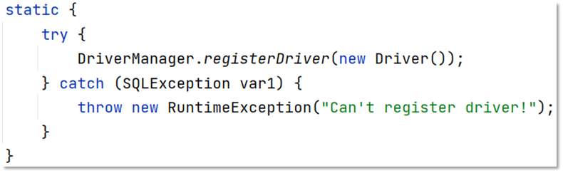

  在该类中的静态代码块中已经执行了 `DriverManager` 对象的 `registerDriver()` 方法进行驱动的注册了，那么我们只需要加载 `Driver` 类，该静态代码块就会执行。而 `Class.forName("com.mysql.jdbc.Driver");` 就可以加载 `Driver` 类。

  > ==提示：==
  >
  > * MySQL 5之后的驱动包，可以省略注册驱动的步骤
  > * 自动加载jar包中META-INF/services/java.sql.Driver文件中的驱动类

* 获取数据库连接

  

  参数说明：

  * url ： 连接路径

    > 语法：jdbc:mysql://ip地址(域名):端口号/数据库名称?参数键值对1&参数键值对2…
    >
    > 示例：jdbc:mysql://127.0.0.1:3306/db1
    >
    > ==细节：==
    >
    > * 如果连接的是本机mysql服务器，并且mysql服务默认端口是3306，则url可以简写为：jdbc:mysql:///数据库名称?参数键值对
    >
    > * 配置 useSSL=false 参数，禁用安全连接方式，解决警告提示

  * user ：用户名
  * poassword ：密码

### 3.2  Connection

Connection（数据库连接对象）作用：

* 获取执行 SQL 的对象
* 管理事务

#### 3.2.1  获取执行对象

* 普通执行SQL对象

  ```sql
  Statement createStatement()
  ```

  入门案例中就是通过该方法获取的执行对象。

* 预编译SQL的执行SQL对象：防止SQL注入

  ```sql
  PreparedStatement  prepareStatement(sql)
  ```

  通过这种方式获取的 `PreparedStatement` SQL语句执行对象是我们一会重点要进行讲解的，它可以防止SQL注入。

* 执行存储过程的对象

  ```sql
  CallableStatement prepareCall(sql)
  ```

  通过这种方式获取的 `CallableStatement` 执行对象是用来执行存储过程的，而存储过程在MySQL中不常用，所以这个我们将不进行讲解。

#### 3.2.2  事务管理

先回顾一下MySQL事务管理的操作：

* 开启事务 ： BEGIN; 或者 START TRANSACTION;
* 提交事务 ： COMMIT;
* 回滚事务 ： ROLLBACK;

> MySQL默认是自动提交事务

接下来学习JDBC事务管理的方法。

Connection几口中定义了3个对应的方法：

* 开启事务

  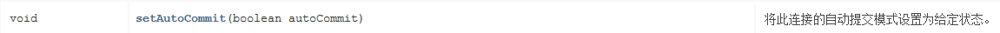

  参与autoCommit 表示是否自动提交事务，true表示自动提交事务，false表示手动提交事务。而开启事务需要将该参数设为为false。

* 提交事务

  

* 回滚事务

  

具体代码实现如下：

```sql
/**
 * JDBC API 详解：Connection
 */
public class JDBCDemo3_Connection {

    public static void main(String[] args) throws Exception {
        //1. 注册驱动
        //Class.forName("com.mysql.jdbc.Driver");
        //2. 获取连接：如果连接的是本机mysql并且端口是默认的 3306 可以简化书写
        String url = "jdbc:mysql:///db1?useSSL=false";
        String username = "root";
        String password = "1234";
        Connection conn = DriverManager.getConnection(url, username, password);
        //3. 定义sql
        String sql1 = "update account set money = 3000 where id = 1";
        String sql2 = "update account set money = 3000 where id = 2";
        //4. 获取执行sql的对象 Statement
        Statement stmt = conn.createStatement();

        try {
            // ============开启事务==========
            conn.setAutoCommit(false);
            //5. 执行sql
            int count1 = stmt.executeUpdate(sql1);//受影响的行数
            //6. 处理结果
            System.out.println(count1);
            int i = 3/0;
            //5. 执行sql
            int count2 = stmt.executeUpdate(sql2);//受影响的行数
            //6. 处理结果
            System.out.println(count2);

            // ============提交事务==========
            //程序运行到此处，说明没有出现任何问题，则需求提交事务
            conn.commit();
        } catch (Exception e) {
            // ============回滚事务==========
            //程序在出现异常时会执行到这个地方，此时就需要回滚事务
            conn.rollback();
            e.printStackTrace();
        }

        //7. 释放资源
        stmt.close();
        conn.close();
    }
}
```

### 3.3  Statement

#### 3.3.1  概述

Statement对象的作用就是用来执行SQL语句。而针对不同类型的SQL语句使用的方法也不一样。

* 执行DDL、DML语句

  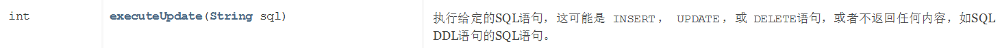

* 执行DQL语句

  

  该方法涉及到了 `ResultSet` 对象，而这个对象我们还没有学习，一会再重点讲解。


#### 3.3.2  代码实现

* 执行DML语句

  ```java
  /**
    * 执行DML语句
    * @throws Exception
    */
  @Test
  public void testDML() throws  Exception {
      //1. 注册驱动
      //Class.forName("com.mysql.jdbc.Driver");
      //2. 获取连接：如果连接的是本机mysql并且端口是默认的 3306 可以简化书写
      String url = "jdbc:mysql:///db1?useSSL=false";
      String username = "root";
      String password = "1234";
      Connection conn = DriverManager.getConnection(url, username, password);
      //3. 定义sql
      String sql = "update account set money = 3000 where id = 1";
      //4. 获取执行sql的对象 Statement
      Statement stmt = conn.createStatement();
      //5. 执行sql
      int count = stmt.executeUpdate(sql);//执行完DML语句，受影响的行数
      //6. 处理结果
      //System.out.println(count);
      if(count > 0){
          System.out.println("修改成功~");
      }else{
          System.out.println("修改失败~");
      }
      //7. 释放资源
      stmt.close();
      conn.close();
  }
  ```

* 执行DDL语句

  ```java
  /**
    * 执行DDL语句
    * @throws Exception
    */
  @Test
  public void testDDL() throws  Exception {
      //1. 注册驱动
      //Class.forName("com.mysql.jdbc.Driver");
      //2. 获取连接：如果连接的是本机mysql并且端口是默认的 3306 可以简化书写
      String url = "jdbc:mysql:///db1?useSSL=false";
      String username = "root";
      String password = "1234";
      Connection conn = DriverManager.getConnection(url, username, password);
      //3. 定义sql
      String sql = "drop database db2";
      //4. 获取执行sql的对象 Statement
      Statement stmt = conn.createStatement();
      //5. 执行sql
      int count = stmt.executeUpdate(sql);//执行完DDL语句，可能是0
      //6. 处理结果
      System.out.println(count);

      //7. 释放资源
      stmt.close();
      conn.close();
  }
  ```

  > 注意：
  >
  > * 以后开发很少使用java代码操作DDL语句

### 3.4  ResultSet

#### 3.4.1  概述

ResultSet（结果集对象）作用：

* ==封装了SQL查询语句的结果。==

而执行了DQL语句后就会返回该对象，对应执行DQL语句的方法如下：

```sql
ResultSet  executeQuery(sql)：执行DQL 语句，返回 ResultSet 对象
```

那么我们就需要从 `ResultSet` 对象中获取我们想要的数据。`ResultSet` 对象提供了操作查询结果数据的方法，如下：

> boolean  next()
> * 将光标从当前位置向前移动一行
> * 判断当前行是否为有效行
>
> 方法返回值说明：
>
> * true  ： 有效航，当前行有数据
> * false ： 无效行，当前行没有数据

> xxx  getXxx(参数)：获取数据
>
> * xxx : 数据类型；如： int getInt(参数) ；String getString(参数)
> * 参数
>   * int类型的参数：列的编号，从1开始
>   * String类型的参数： 列的名称

如下图为执行SQL语句后的结果

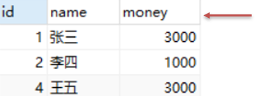

一开始光标指定于第一行前，如图所示红色箭头指向于表头行。当我们调用了 `next()` 方法后，光标就下移到第一行数据，并且方法返回true，此时就可以通过 `getInt("id")` 获取当前行id字段的值，也可以通过 `getString("name")` 获取当前行name字段的值。如果想获取下一行的数据，继续调用 `next()`  方法，以此类推。

#### 3.4.2  代码实现

```java
/**
  * 执行DQL
  * @throws Exception
  */
@Test
public void testResultSet() throws  Exception {
    //1. 注册驱动
    //Class.forName("com.mysql.jdbc.Driver");
    //2. 获取连接：如果连接的是本机mysql并且端口是默认的 3306 可以简化书写
    String url = "jdbc:mysql:///db1?useSSL=false";
    String username = "root";
    String password = "1234";
    Connection conn = DriverManager.getConnection(url, username, password);
    //3. 定义sql
    String sql = "select * from account";
    //4. 获取statement对象
    Statement stmt = conn.createStatement();
    //5. 执行sql
    ResultSet rs = stmt.executeQuery(sql);
    //6. 处理结果， 遍历rs中的所有数据
    /* // 6.1 光标向下移动一行，并且判断当前行是否有数据
        while (rs.next()){
            //6.2 获取数据  getXxx()
            int id = rs.getInt(1);
            String name = rs.getString(2);
            double money = rs.getDouble(3);

            System.out.println(id);
            System.out.println(name);
            System.out.println(money);

            System.out.println("--------------");

        }*/
    // 6.1 光标向下移动一行，并且判断当前行是否有数据
    while (rs.next()){
        //6.2 获取数据  getXxx()
        int id = rs.getInt("id");
        String name = rs.getString("name");
        double money = rs.getDouble("money");

        System.out.println(id);
        System.out.println(name);
        System.out.println(money);

        System.out.println("--------------");
    }

    //7. 释放资源
    rs.close();
    stmt.close();
    conn.close();
}
```

### 3.5  案例

* 需求：查询account账户表数据，封装为Account对象中，并且存储到ArrayList集合中

  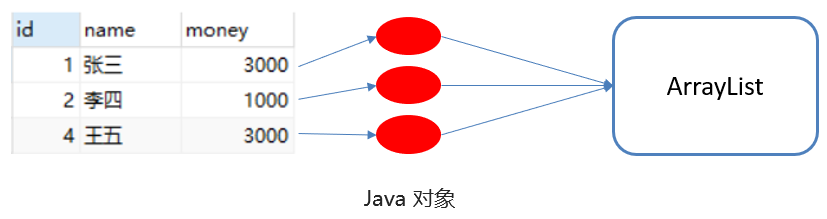

* 代码实现

  ```java
  /**
    * 查询account账户表数据，封装为Account对象中，并且存储到ArrayList集合中
    * 1. 定义实体类Account
    * 2. 查询数据，封装到Account对象中
    * 3. 将Account对象存入ArrayList集合中
    */
  @Test
  public void testResultSet2() throws  Exception {
      //1. 注册驱动
      //Class.forName("com.mysql.jdbc.Driver");
      //2. 获取连接：如果连接的是本机mysql并且端口是默认的 3306 可以简化书写
      String url = "jdbc:mysql:///db1?useSSL=false";
      String username = "root";
      String password = "1234";
      Connection conn = DriverManager.getConnection(url, username, password);

      //3. 定义sql
      String sql = "select * from account";

      //4. 获取statement对象
      Statement stmt = conn.createStatement();

      //5. 执行sql
      ResultSet rs = stmt.executeQuery(sql);

      // 创建集合
      List<Account> list = new ArrayList<>();

      // 6.1 光标向下移动一行，并且判断当前行是否有数据
      while (rs.next()){
          Account account = new Account();

          //6.2 获取数据  getXxx()
          int id = rs.getInt("id");
          String name = rs.getString("name");
          double money = rs.getDouble("money");

          //赋值
          account.setId(id);
          account.setName(name);
          account.setMoney(money);

          // 存入集合
          list.add(account);
      }

      System.out.println(list);

      //7. 释放资源
      rs.close();
      stmt.close();
      conn.close();
  }
  ```


### 3.6  PreparedStatement

> PreparedStatement作用：
>
> * 预编译SQL语句并执行：预防SQL注入问题

对上面的作用中SQL注入问题大家肯定不理解。那我们先对SQL注入进行说明.

#### 3.6.1  SQL注入

> SQL注入是通过操作输入来修改事先定义好的SQL语句，用以达到执行代码对服务器进行攻击的方法。

在今天资料下的 `day03-JDBC\资料\2. sql注入演示` 中修改 `application.properties` 文件中的用户名和密码，文件内容如下：

```properties
spring.datasource.driver-class-name=com.mysql.cj.jdbc.Driver
spring.datasource.url=jdbc:mysql://localhost:3306/test?useSSL=false&useUnicode=true&characterEncoding=UTF-8
spring.datasource.username=root
spring.datasource.password=1234
```

在MySQL中创建名为 `test` 的数据库

```sql
create database test;
```

在命令提示符中运行今天资料下的 `day03-JDBC\资料\2. sql注入演示\sql.jar` 这个jar包。

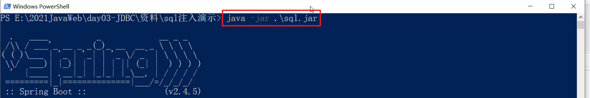

此时我们就能在数据库中看到user表

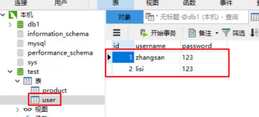

接下来在浏览器的地址栏输入 `localhost:8080/login.html` 就能看到如下页面


我们就可以在如上图中输入用户名和密码进行登陆。用户名和密码输入正确就登陆成功，跳转到首页。用户名和密码输入错误则给出错误提示，如下图


但是我可以通过输入一些特殊的字符登陆到首页。

用户名随意写，密码写成 `' or '1' ='1`


这就是SQL注入漏洞，也是很危险的。当然现在市面上的系统都不会存在这种问题了，所以大家也不要尝试用这种方式去试其他的系统。

那么该如何解决呢？这里就可以将SQL执行对象 `Statement` 换成 `PreparedStatement` 对象。

#### 3.6.2  代码模拟SQL注入问题

```java
@Test
public void testLogin() throws  Exception {
    //2. 获取连接：如果连接的是本机mysql并且端口是默认的 3306 可以简化书写
    String url = "jdbc:mysql:///db1?useSSL=false";
    String username = "root";
    String password = "1234";
    Connection conn = DriverManager.getConnection(url, username, password);

    // 接收用户输入 用户名和密码
    String name = "sjdljfld";
    String pwd = "' or '1' = '1";
    String sql = "select * from tb_user where username = '"+name+"' and password = '"+pwd+"'";
    // 获取stmt对象
    Statement stmt = conn.createStatement();
    // 执行sql
    ResultSet rs = stmt.executeQuery(sql);
    // 判断登录是否成功
    if(rs.next()){
        System.out.println("登录成功~");
    }else{
        System.out.println("登录失败~");
    }

    //7. 释放资源
    rs.close();
    stmt.close();
    conn.close();
}
```

上面代码是将用户名和密码拼接到sql语句中，拼接后的sql语句如下

```sql
select * from tb_user where username = 'sjdljfld' and password = ''or '1' = '1'
```

从上面语句可以看出条件 `username = 'sjdljfld' and password = ''` 不管是否满足，而 `or` 后面的 `'1' = '1'` 是始终满足的，最终条件是成立的，就可以正常的进行登陆了。

接下来我们来学习PreparedStatement对象.

#### 3.6.3  PreparedStatement概述

> PreparedStatement作用：
>
> * 预编译SQL语句并执行：预防SQL注入问题

* 获取 PreparedStatement 对象

  ```java
  // SQL语句中的参数值，使用？占位符替代
  String sql = "select * from user where username = ? and password = ?";
  // 通过Connection对象获取，并传入对应的sql语句
  PreparedStatement pstmt = conn.prepareStatement(sql);
  ```

* 设置参数值

  上面的sql语句中参数使用 ? 进行占位，在之前之前肯定要设置这些 ?  的值。

  > PreparedStatement对象：setXxx(参数1，参数2)：给 ? 赋值
  >
  > * Xxx：数据类型 ； 如 setInt (参数1，参数2)
  >
  > * 参数：
  >
  >   * 参数1： ？的位置编号，从1 开始
  >
  >   * 参数2： ？的值

* 执行SQL语句

  > executeUpdate();  执行DDL语句和DML语句
  >
  > executeQuery();  执行DQL语句
  >
  > ==注意：==
  >
  > * 调用这两个方法时不需要传递SQL语句，因为获取SQL语句执行对象时已经对SQL语句进行预编译了。

#### 3.6.4  使用PreparedStatement改进

```java
 @Test
public void testPreparedStatement() throws  Exception {
    //2. 获取连接：如果连接的是本机mysql并且端口是默认的 3306 可以简化书写
    String url = "jdbc:mysql:///db1?useSSL=false";
    String username = "root";
    String password = "1234";
    Connection conn = DriverManager.getConnection(url, username, password);

    // 接收用户输入 用户名和密码
    String name = "zhangsan";
    String pwd = "' or '1' = '1";

    // 定义sql
    String sql = "select * from tb_user where username = ? and password = ?";
    // 获取pstmt对象
    PreparedStatement pstmt = conn.prepareStatement(sql);
    // 设置？的值
    pstmt.setString(1,name);
    pstmt.setString(2,pwd);
    // 执行sql
    ResultSet rs = pstmt.executeQuery();
    // 判断登录是否成功
    if(rs.next()){
        System.out.println("登录成功~");
    }else{
        System.out.println("登录失败~");
    }
    //7. 释放资源
    rs.close();
    pstmt.close();
    conn.close();
}
```

执行上面语句就可以发现不会出现SQL注入漏洞问题了。那么PreparedStatement又是如何解决的呢？它是将特殊字符进行了转义，转义的SQL如下：

```sql
select * from tb_user where username = 'sjdljfld' and password = '\'or \'1\' = \'1'
```


#### 3.6.5  PreparedStatement原理

> PreparedStatement 好处：
>
> * 预编译SQL，性能更高
> * 防止SQL注入：==将敏感字符进行转义==

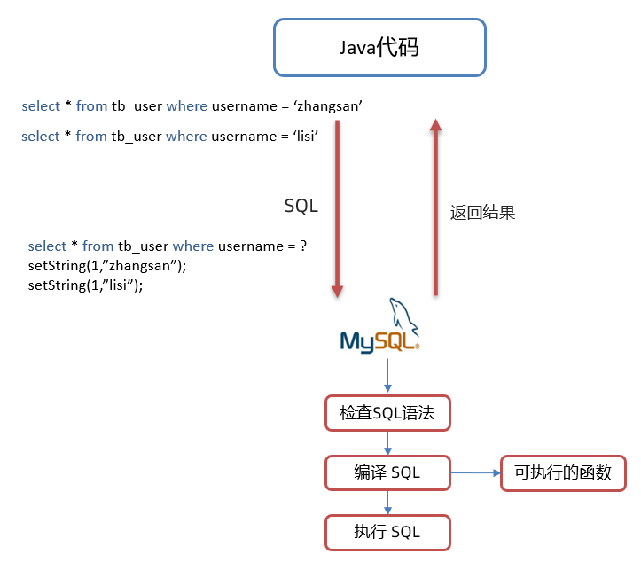

Java代码操作数据库流程如图所示：

* 将sql语句发送到MySQL服务器端

* MySQL服务端会对sql语句进行如下操作

  * 检查SQL语句

    检查SQL语句的语法是否正确。

  * 编译SQL语句。将SQL语句编译成可执行的函数。

    检查SQL和编译SQL花费的时间比执行SQL的时间还要长。如果我们只是重新设置参数，那么检查SQL语句和编译SQL语句将不需要重复执行。这样就提高了性能。

  * 执行SQL语句

接下来我们通过查询日志来看一下原理。

* 开启预编译功能

  在代码中编写url时需要加上以下参数。而我们之前根本就没有开启预编译功能，只是解决了SQL注入漏洞。

  ```sql
  useServerPrepStmts=true
  ```

* 配置MySQL执行日志（重启mysql服务后生效）

  在mysql配置文件（my.ini）中添加如下配置

  ```
  log-output=FILE
  general-log=1
  general_log_file="D:\mysql.log"
  slow-query-log=1
  slow_query_log_file="D:\mysql_slow.log"
  long_query_time=2
  ```

* java测试代码如下：

  ```java
   /**
     * PreparedStatement原理
     * @throws Exception
     */
  @Test
  public void testPreparedStatement2() throws  Exception {

      //2. 获取连接：如果连接的是本机mysql并且端口是默认的 3306 可以简化书写
      // useServerPrepStmts=true 参数开启预编译功能
      String url = "jdbc:mysql:///db1?useSSL=false&useServerPrepStmts=true";
      String username = "root";
      String password = "1234";
      Connection conn = DriverManager.getConnection(url, username, password);

      // 接收用户输入 用户名和密码
      String name = "zhangsan";
      String pwd = "' or '1' = '1";

      // 定义sql
      String sql = "select * from tb_user where username = ? and password = ?";

      // 获取pstmt对象
      PreparedStatement pstmt = conn.prepareStatement(sql);

      Thread.sleep(10000);
      // 设置？的值
      pstmt.setString(1,name);
      pstmt.setString(2,pwd);
      ResultSet rs = null;
      // 执行sql
      rs = pstmt.executeQuery();

      // 设置？的值
      pstmt.setString(1,"aaa");
      pstmt.setString(2,"bbb");
      // 执行sql
      rs = pstmt.executeQuery();

      // 判断登录是否成功
      if(rs.next()){
          System.out.println("登录成功~");
      }else{
          System.out.println("登录失败~");
      }

      //7. 释放资源
      rs.close();
      pstmt.close();
      conn.close();
  }
  ```


* 执行SQL语句，查看 `D:\mysql.log` 日志如下:

  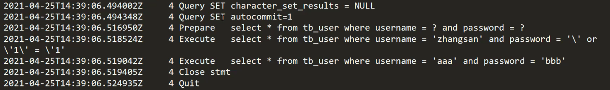

  上图中第三行中的 `Prepare` 是对SQL语句进行预编译。第四行和第五行是执行了两次SQL语句，而第二次执行前并没有对SQL进行预编译。

> ==小结：==
>
> * 在获取PreparedStatement对象时，将sql语句发送给mysql服务器进行检查，编译（这些步骤很耗时）
> * 执行时就不用再进行这些步骤了，速度更快
> * 如果sql模板一样，则只需要进行一次检查、编译

## 4，数据库连接池

### 4.1  数据库连接池简介

> * 数据库连接池是个容器，负责分配、管理数据库连接(Connection)
>
> * 它允许应用程序重复使用一个现有的数据库连接，而不是再重新建立一个；
>
> * 释放空闲时间超过最大空闲时间的数据库连接来避免因为没有释放数据库连接而引起的数据库连接遗漏
> * 好处
>   * 资源重用
>   * 提升系统响应速度
>   * 避免数据库连接遗漏

之前我们代码中使用连接是没有使用都创建一个Connection对象，使用完毕就会将其销毁。这样重复创建销毁的过程是特别耗费计算机的性能的及消耗时间的。

而数据库使用了数据库连接池后，就能达到Connection对象的复用，如下图

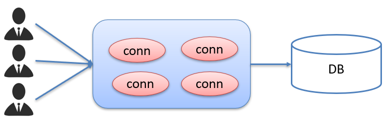

连接池是在一开始就创建好了一些连接（Connection）对象存储起来。用户需要连接数据库时，不需要自己创建连接，而只需要从连接池中获取一个连接进行使用，使用完毕后再将连接对象归还给连接池；这样就可以起到资源重用，也节省了频繁创建连接销毁连接所花费的时间，从而提升了系统响应的速度。

### 4.2  数据库连接池实现

* 标准接口：==DataSource==

  官方(SUN) 提供的数据库连接池标准接口，由第三方组织实现此接口。该接口提供了获取连接的功能：

  ```java
  Connection getConnection()
  ```

  那么以后就不需要通过 `DriverManager` 对象获取 `Connection` 对象，而是通过连接池（DataSource）获取 `Connection` 对象。

* 常见的数据库连接池

  * DBCP
  * C3P0
  * Druid

  我们现在使用更多的是Druid，它的性能比其他两个会好一些。

* Druid（德鲁伊）

  * Druid连接池是阿里巴巴开源的数据库连接池项目

  * 功能强大，性能优秀，是Java语言最好的数据库连接池之一

### 4.3  Driud使用

> * 导入jar包 druid-1.1.12.jar
> * 定义配置文件
> * 加载配置文件
> * 获取数据库连接池对象
> * 获取连接

现在通过代码实现，首先需要先将druid的jar包放到项目下的lib下并添加为库文件

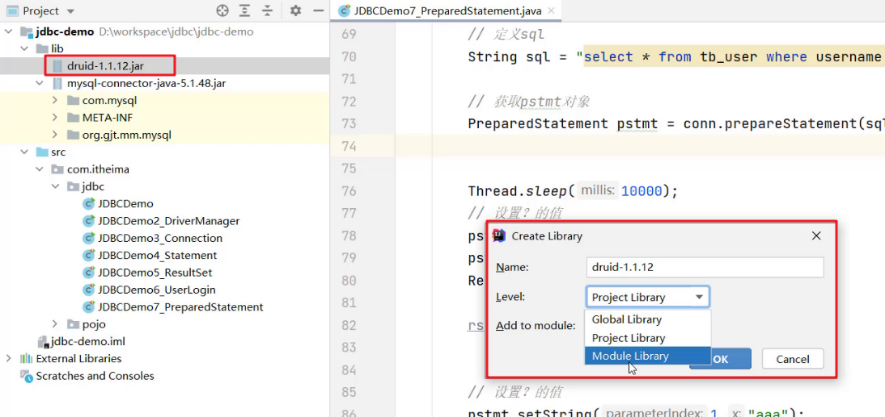

项目结构如下：

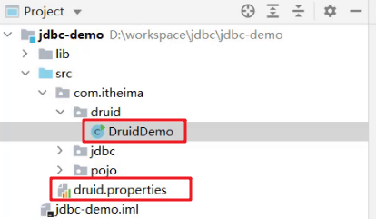

编写配置文件如下：

```properties
driverClassName=com.mysql.jdbc.Driver
url=jdbc:mysql:///db1?useSSL=false&useServerPrepStmts=true
username=root
password=1234
# 初始化连接数量
initialSize=5
# 最大连接数
maxActive=10
# 最大等待时间
maxWait=3000
```

使用druid的代码如下：

```java
/**
 * Druid数据库连接池演示
 */
public class DruidDemo {

    public static void main(String[] args) throws Exception {
        //1.导入jar包
        //2.定义配置文件
        //3. 加载配置文件
        Properties prop = new Properties();
        prop.load(new FileInputStream("jdbc-demo/src/druid.properties"));
        //4. 获取连接池对象
        DataSource dataSource = DruidDataSourceFactory.createDataSource(prop);

        //5. 获取数据库连接 Connection
        Connection connection = dataSource.getConnection();
        System.out.println(connection); //获取到了连接后就可以继续做其他操作了

        //System.out.println(System.getProperty("user.dir"));
    }
}
```
