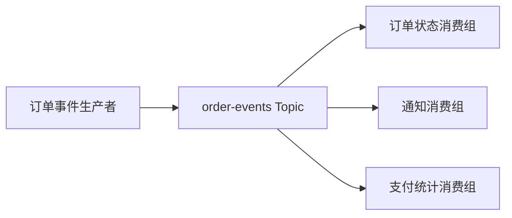

# Kafka 快速入门

## 前言

订单支付完成后，订单查询、通知和统计通常需要分别处理这一事实。生产者将订单事件写入 Kafka，各业务使用不同消费者组独立消费，避免把所有处理串在一个请求中。

本实验发送三笔订单，每笔依次产生 `OrderCreated` 和 `OrderPaid` 两条事件。一次运行应收到六条记录，其中支付金额合计 3000 分。Go 和 Java 使用相同 JSON 协议、UTF-8 Key 和 CRC32 分区规则，可以交叉生产和消费。

## Kafka 中的几个对象

- **Broker**：接收、持久化并提供消息读取的服务节点。
- **Topic**：事件的逻辑分类，例如 `orders.c01`。
- **Partition**：Topic 内的有序日志；顺序只在分区内成立。
- **Offset**：记录在分区内的位置，不是全局消息编号，也不一定连续。
- **Producer**：向 Topic 写记录的客户端。
- **Consumer Group**：共同处理一份订阅的消费者集合。不同组独立消费；经典消费组内一个分区在同一时刻分配给一个成员。
- **Controller**：管理集群元数据。Kafka 4.x 使用 KRaft，Controller 通过 Raft 仲裁维护元数据，不再使用 ZooKeeper。



读取消息不会删除消息。Kafka 根据保留时间、大小或压缩策略清理数据，消费组另行记录读取进度。

## 环境与版本

| 组件 | 实验基准 |
| --- | --- |
| Kafka Broker | 4.3.1，KRaft |
| Go | 1.25.0 或更高 |
| Go 客户端 | IBM Sarama 1.60.0 |
| Java 示例 | JDK 17 或更高，Maven 3.9.x |
| Java 客户端 | kafka-clients 4.3.1 |
| 可选管理页面 | Kafbat UI |

Java 的编译目标为 17；运行脚本在 macOS 上可使用 Homebrew OpenJDK。Go 脚本仅为子进程启用自动工具链、官方模块代理和校验，不写入全局 `go env`；首次运行需要网络。设置 `KAFKA_GO_PROXY` 可覆盖模块代理。

版本号需要区分三个层次：Broker 版本、客户端依赖版本和客户端声明的协议能力。Sarama 示例使用其支持的 `V4_0_0_0` 协议常量连接 4.3.1 Broker，并不把 Broker 版本机械填入一个不存在的常量。

### macOS Homebrew 环境

```bash
# 未安装时执行；已安装且有数据时无需重新初始化。
brew install kafka

# 后台运行，不登记登录自动启动。
brew services run kafka

# 查询成功代表能够完成 Kafka 协议请求。
kafka-topics --bootstrap-server 127.0.0.1:9092 --list
```

Homebrew 可直接调用 `kafka-topics`。官方压缩包中的对应入口是 `bin/kafka-topics.sh`，差异来自安装包装，不是 Kafka 4.x 删除了 `.sh`。

### 官方压缩包环境

在已解压的 Kafka 4.3.1 目录中，仅对全新的数据目录初始化一次：

```bash
# 创建集群标识并初始化一个独立 KRaft 节点。
KAFKA_CLUSTER_ID="$(bin/kafka-storage.sh random-uuid)"
bin/kafka-storage.sh format --standalone \
  -t "$KAFKA_CLUSTER_ID" -c config/server.properties

# 前台启动；另开终端运行客户端。
bin/kafka-server-start.sh config/server.properties
```

已有集群直接使用原配置和原数据目录启动，不重复格式化。基础实验只需要一个节点；三节点容错实验使用独立配置。

## 事件协议

```json
{
  "schema_version": 1,
  "event_id": "order-1-2",
  "order_id": "order-1",
  "type": "OrderPaid",
  "order_version": 2,
  "amount_cents": 1000,
  "occurred_at": "2026-09-26T12:00:00Z"
}
```

`event_id` 标识同一个业务事件，重试时保持不变；`order_id` 标识订单并作为消息 Key；`order_version` 表达订单状态版本，创建为 1，支付或取消为 2；`schema_version` 表达协议版本。两种版本号不能混用。

示例自动生成创建、支付事件，协议同时允许取消事件。`occurred_at` 是带时区的事件发生时间；金额使用整数分，避免不同语言浮点计算产生差异。生成器用于实验，真实服务应持久保存事件 ID，而不能在每次重试时重新生成。

## 独立运行

在示例仓库根目录选择任意一种语言，然后进入该章目录。两个项目不引用其他章节的源码。

```bash
# Go
cd message-queue/kafka/go/01-quickstart-demo

# Java：在仓库根目录的另一个终端执行
# cd message-queue/kafka/java/01-quickstart-demo
```

进入项目后，两种语言使用相同参数：

```bash
# 每次完整实验使用新 Topic，避免历史数据影响数量断言。
export KAFKA_TOPIC="orders.c01.$(date +%s)"
export KAFKA_GROUP="$KAFKA_TOPIC-reader"

./run.sh init --partitions 3 --replicas 1
./run.sh produce --orders 3 --prefix order
./run.sh consume --max 6 --timeout 30s
./run.sh inspect
```

`init` 创建 Topic，已存在时不会擅自修改分区或副本；`produce` 每笔订单发送两条消息；`consume` 成功处理六条后退出，未在期限内收到足够消息会报错；`inspect` 显示 Leader、副本、ISR 和日志起止位置。

输出中的 `ACK` 是 Broker 确认，包含分区与 Offset；`EVENT` 是消费结果；最后出现 `CONSUMED 6`。不同订单可能出现在不同分区，因此跨订单的打印顺序不固定，同一订单应先创建再支付。

终端等价命令如下，适合观察客户端与命令行互通：

```bash
kafka-topics --bootstrap-server 127.0.0.1:9092 \
  --describe --topic "$KAFKA_TOPIC"

kafka-console-consumer --bootstrap-server 127.0.0.1:9092 \
  --topic "$KAFKA_TOPIC" --from-beginning --max-messages 6 \
  --formatter-property print.key=true --formatter-property print.partition=true --formatter-property print.offset=true
```

`Replicas: 1`、`Isr: 1` 表示 Broker ID 列表，不能解释成副本数量。`ReplicationFactor` 才是每个分区的总副本数。

## Go 与 Java 互通

两个终端设置相同的 `KAFKA_TOPIC`。用 Go 的 `produce` 写入，用 Java 的 `consume --group java-reader` 读取；反向实验使用另一新 Topic。客户端都使用 `CRC32(UTF-8 order_id) % 分区数`，避免 Java 和 Sarama 默认分区算法不同造成同一订单落到不同分区。

相同 Key 不会替多个并行生产者定义业务先后顺序，也不能在扩分区后自动维持历史映射。真实业务仍要控制同一订单事件的发送顺序。

管理页面可以查看 Topic、分区、消息 Key 和消费组位点。Kafka 服务本身没有内置 Web 控制台，UI 是单独运行的客户端。

## 验证与停止

```bash
python3 scripts/smoke.py
```

脚本使用随机测试 Topic，检查六条记录、订单内顺序和金额，结束后只删除本脚本创建的 Topic。设置 `KEEP_TEST_TOPICS=1` 可保留实验数据。

消费者遇到格式错误会停止并保留未处理位置，不会把错误消息静默跳过。停止 Homebrew 服务使用 `brew services stop kafka`；停止前台服务使用 `Ctrl+C`。停止服务与删除消息是两件不同的事。

## 完整示例

- [Go + Sarama](https://github.com/zzxrepository/gocode-examples/tree/3c68a4c19fdc89a392400a0350e7a334018aad90/message-queue/kafka/go/01-quickstart-demo)
- [Java 官方客户端](https://github.com/zzxrepository/gocode-examples/tree/3c68a4c19fdc89a392400a0350e7a334018aad90/message-queue/kafka/java/01-quickstart-demo)

两个目录均包含完整源码、独立依赖文件、运行脚本和测试入口。命令在所选 demo 目录执行；运行其他 demo 时重新进入对应目录。

## 总结

一次完整消息链路包含创建 Topic、生产确认、消费处理和消费位置提交。Key 决定分区，分区提供局部顺序，消费者组提供独立订阅进度。能明确观察这几个对象，才有条件进一步讨论并行度和可靠性。

## 参考资料

- [Apache Kafka 4.3：quickstart](https://kafka.apache.org/43/getting-started/quickstart/)
- [IBM Sarama 1.60.0](https://pkg.go.dev/github.com/IBM/sarama@v1.60.0)

> 本文沿用 [dunwu 的 Kafka 教程](https://dunwu.github.io/bigdata-tutorial/kafka/) 的主题结构，按 Kafka 4.3.1 重写技术说明并补充订单实验。改编文档继续采用 [CC BY-SA 4.0](https://creativecommons.org/licenses/by-sa/4.0/)；完整代码及验证结果以所链接的示例提交为准。
