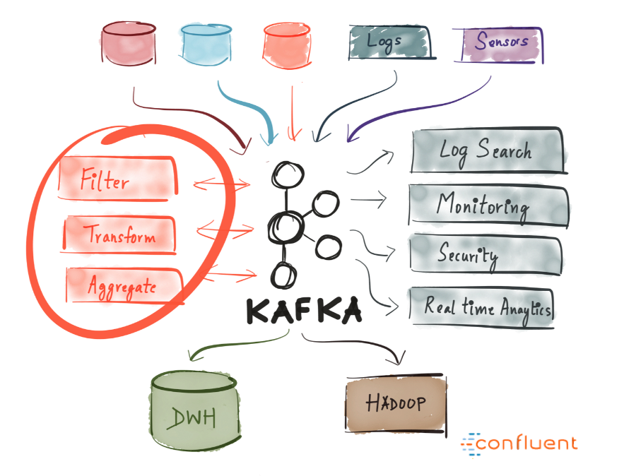

# Kafka 快速入门

> 原作者：[dunwu（钝悟）](https://github.com/dunwu) · [原文](https://dunwu.github.io/bigdata-tutorial/kafka/Kafka%E5%BF%AB%E9%80%9F%E5%85%A5%E9%97%A8.html) · [CC BY-SA 4.0](https://creativecommons.org/licenses/by-sa/4.0/)。本页基于原文修订，保留章节结构与配图；2026-09-29 更新 Kafka 4.3 / KRaft 命令，将客户端示例改为 Go。改编内容继续使用 CC BY-SA 4.0。
>
> **版本说明：** 服务端以 Kafka 4.3.1、JDK 17+、单节点 KRaft 为例；Go 客户端使用 IBM Sarama v1.61.0，需要 Go 1.26.0+。本地示例连接 `localhost:9092`，未启用认证。Kafka 4.x 已移除 ZooKeeper 模式，无需启动 ZooKeeper。

> **Apache Kafka 是一款开源的消息引擎系统，也是一个分布式流计算平台，此外，还可以作为数据存储**。

## 1. Kafka 简介

> **Apache Kafka 是一款开源的消息引擎系统，也是一个分布式流计算平台，此外，还可以作为数据存储**。



### 1.1. Kafka 的功能

Kafka 的核心功能如下：

- **消息引擎** - Kafka 可以作为一个消息引擎系统。
- **流处理** - Kafka 可以作为一个分布式流处理平台。
- **存储** - Kafka 可以作为一个安全的分布式存储。

### 1.2. Kafka 的特性

Kafka 的设计目标：

- **高性能**
  - **分区、分段、索引**：基于分区机制提供并发处理能力。分段、索引提升了数据读写的查询效率。
  - **顺序读写**：使用顺序读写提升磁盘 IO 性能。
  - **零拷贝**：利用零拷贝技术，提升网络 I/O 效率。
  - **页缓存**：利用操作系统的 PageCache 来缓存数据（典型的利用空间换时间）
  - **批量读写**：批量读写可以有效提升网络 I/O 效率。
  - **数据压缩**：Kafka 支持数据压缩，可以有效提升网络 I/O 效率。
  - **pull 模式**：Kafka 架构基于 pull 模式，可以自主控制消费策略，提升传输效率。
- **高可用**
  - **持久化**：消息写入分区日志并按保留策略保存；写入通常先经过操作系统页缓存，消息确认、刷盘与副本复制共同影响故障时的数据可靠性。
  - **副本机制**：Kafka 的 Broker 集群支持副本机制，可以通过冗余，来保证其整体的可用性。
  - **选举 Leader**：Kafka 4.x 使用 KRaft 控制器仲裁组管理集群元数据；活动 Controller 负责分区 Leader 选举等管理工作，不再依赖 ZooKeeper。
- **伸缩性**
  - **分区**：Kafka 的分区机制使得其具有良好的伸缩性。

### 1.3. Kafka 术语

- **消息**：Kafka 的数据单元被称为消息。消息由字节数组组成。
- **批次**：批次就是一组消息，这些消息属于同一个主题和分区。
- **主题（Topic）**：Kafka 消息通过主题进行分类。主题就类似数据库的表。
  - 不同主题的消息是物理隔离的；
  - 同一个主题的消息保存在一个或多个 Broker 上。但用户只需指定消息的 Topic 即可生产或消费数据而不必关心数据存于何处。
  - 主题有一个或多个分区。
- **分区（Partition）**：分区是按追加顺序保存消息的日志，编号从 0 开始。同一分区内有序，不同分区之间没有全局顺序。分区提供存储扩展和并行消费能力，副本提供数据冗余；消息也可能因保留策略或日志压缩而被清理。
- **消息偏移量（Offset）**：消息在某个分区内的位置，随追加递增；不同分区分别计数，清理后不重新编号，也不保证连续。消费组提交的 offset 通常表示“下次应读取的位置”，不是累计消费条数。
- **生产者（Producer）**：生产者是向主题发布新消息的 Kafka 客户端。生产者可以将数据发布到所选择的主题中。生产者负责将记录分配到主题中的哪一个分区中。
- **消费者（Consumer）**：消费者从主题读取消息，通过消费位置和已提交的偏移量记录进度；消费不会直接删除 Broker 上的消息。
- **消费者群组（Consumer Group）**：多个消费者共同构成的一个群组，同时消费多个分区以实现高并发。
  - 常规消费组使用 `group.id` 标识；同组分担分区，不同组独立消费同一份数据。手动指定分区的消费者也可以不加入消费组，并不存在所有客户端统一共用的“默认组”。
  - 常规消费组中，一个消费者可以消费多个分区。
  - 常规消费组中，同一个分区在同一时刻只分配给一个消费者；消费者数量超过分区数时，会有实例空闲。Kafka 4.x 的 Share Group 是另一种消费机制，不适用这条分配规则。
- **再均衡（Rebalance）**：消费者加入、退出、故障，或订阅主题的分区发生变化时，消费组重新分配分区的过程。分区再均衡是 Kafka 消费者端实现高可用的重要手段。
- **Broker** - 一个独立的 Kafka 服务器被称为 Broker。Broker 接收消息并将其追加到分区日志；生产者通常向目标分区的 Leader 发送消息，消费者通过拉取请求读取可见的消息。事务消息是否可见还取决于消费者的隔离级别。
- **副本（Replica）**：Kafka 中同一条消息能够被拷贝到多个地方以提供数据冗余，这些地方就是所谓的副本。副本还分为领导者副本和追随者副本，各自有不同的角色划分。副本是在分区层级下的，即每个分区可配置多个副本实现高可用。

### 1.4. Kafka 发行版本

Kafka 主要有以下发行与部署形式：

- **Apache Kafka**：社区维护的开源发行版，可自行部署 Broker、Controller 和配套工具。
- **Confluent Platform / Confluent Cloud**：基于 Kafka 生态提供平台组件或托管服务；组件的许可、功能和费用需分别确认。
- **其他发行版与云托管 Kafka**：例如 Cloudera 的相关平台及云厂商的托管服务。旧资料中的 CDH/HDP 属于历史产品体系，不应直接作为新环境的安装指引。

### 1.5. Kafka 重大版本

以下是理解旧资料时常见的历史节点，不是建议安装的版本清单：

- 0.8
  - 正式引入了副本机制
- 0.9
  - 增加了基础的安全认证 / 权限功能
  - 新版本 Producer API 在这个版本中算比较稳定
- 0.10
  - 引入了 Kafka Streams
  - 修复了一个可能导致 Producer 性能降低的 Bug
  - 使用新版本 Consumer API
- 0.11
  - 提供幂等性 Producer API 以及事务
  - 对 Kafka 消息格式做了重构
- 1.0 和 2.0
  - Kafka Streams 的改进
- 3.x
  - KRaft 逐步成熟，支持从 ZooKeeper 模式迁移到 KRaft
- 4.x
  - 移除 ZooKeeper 模式，Broker 和工具要求 Java 17+
  - 消费协议等能力继续演进；本地练习固定使用 4.3.1，避免混用旧版脚本与配置

## 2. Kafka 服务端使用入门

### 2.1. 步骤一、获取 Kafka

从 [Apache 下载页](https://kafka.apache.org/downloads/) 获取 Kafka 4.3.1 的二进制包，解压到本地。`2.13` 是发行包使用的 Scala 版本，不影响 Go 客户端使用。

```bash
# 以下命令在安装包所在目录执行
tar -xzf kafka_2.13-4.3.1.tgz
cd kafka_2.13-4.3.1
```

后续 `bin/*.sh` 命令均在这个解压目录运行。命令块不含终端提示符 `$`，可以直接复制。Mac 默认 zsh 如果不能粘贴 `#` 注释，先执行 `setopt interactivecomments`。

**macOS 已通过 Homebrew 安装的情况**：无需再下载一份 Kafka。Homebrew 将命令加入 PATH，名称不带 `.sh`，也不用加 `bin/`：

| 发行包命令 | Homebrew 对应命令 |
| --- | --- |
| `bin/kafka-topics.sh` | `kafka-topics` |
| `bin/kafka-console-producer.sh` | `kafka-console-producer` |
| `bin/kafka-console-consumer.sh` | `kafka-console-consumer` |
| `bin/kafka-consumer-groups.sh` | `kafka-consumer-groups` |
| `bin/kafka-storage.sh` | `kafka-storage` |

例如 `bin/kafka-topics.sh --version` 对应 `kafka-topics --version`。两种安装方式选一种即可。

### 2.2. 步骤二、启动 Kafka 环境

Kafka 4.3 要求本机安装 **JDK 17 或更高版本**。先执行 `java -version`，并确认 `JAVA_HOME` 指向兼容的 JDK；客户端改成 Go 后，Kafka 服务端仍然需要 Java。

**发行包首次启动**：使用 KRaft，无需 ZooKeeper。在同一个终端依次执行：

```bash
# 生成集群 ID；只用于初始化这套新环境
KAFKA_CLUSTER_ID="$(bin/kafka-storage.sh random-uuid)"

# 首次格式化数据目录；--standalone 初始化单节点 Controller 仲裁组
# 已经初始化并保存数据的环境，后续启动跳过这一步
bin/kafka-storage.sh format --standalone \
  -t "$KAFKA_CLUSTER_ID" \
  -c config/server.properties

# 前台启动；这个终端需要保持运行，Ctrl+C 停止
bin/kafka-server-start.sh config/server.properties
```

这里的单节点同时承担 Broker 和 Controller 角色，仅用于入门练习。生产环境需规划多节点、副本和访问控制。

**Homebrew 已安装并初始化的环境**直接执行：

```bash
# 启动 Kafka；run 不注册登录自启
brew services run kafka

# 检查服务状态，以及客户端是否能连接
brew services list
kafka-topics --bootstrap-server localhost:9092 --list
```

不要同时启动发行包与 Homebrew 两套服务占用同一个 `9092` 端口。Homebrew 配置可通过 `$(brew --prefix)/etc/kafka/server.properties` 找到；已初始化的环境不要重新执行格式化。

### 2.3. 步骤三、创建一个 TOPIC 并存储您的事件

Kafka 是一个分布式事件流处理平台，它可以让您通过各种机制读、写、存储并处理事件（events，也被称为记录或消息）。

示例事件包括付款交易、手机的地理位置更新、运输订单，以及传感器测量等。这些事件被组织并存储在主题（Topic）中。主题是逻辑分类，实际消息保存在主题的分区日志里。

因此，在您写入第一个事件之前，先创建一个 Topic。另开终端，在 Kafka 解压目录执行：

```bash
# --partitions 3：创建 0、1、2 三个分区，便于观察并行消费
# --replication-factor 1：每个分区只有一份副本，适用于单 Broker 练习
bin/kafka-topics.sh --bootstrap-server localhost:9092 \
  --create --topic quickstart-events \
  --partitions 3 --replication-factor 1

# 查看分区数量、每个分区的 Leader 和副本
bin/kafka-topics.sh --bootstrap-server localhost:9092 \
  --describe --topic quickstart-events
```

如果 Topic 已存在，先用 `--describe` 确认分区数，不必重复创建。以下是全新单节点环境的示意输出，Topic ID 与 Broker ID 以实际结果为准：

```text
Topic: quickstart-events  PartitionCount: 3  ReplicationFactor: 1
Topic: quickstart-events  Partition: 0  Leader: 1  Replicas: 1  Isr: 1
Topic: quickstart-events  Partition: 1  Leader: 1  Replicas: 1  Isr: 1
Topic: quickstart-events  Partition: 2  Leader: 1  Replicas: 1  Isr: 1
```

`Leader: 1` 指 Broker ID 为 1，`Replicas: 1` 表示副本位于 Broker 1；副本**数量**看 `ReplicationFactor`。三行分区可以都位于同一个 Broker，不代表已经启动了三台服务器。

### 2.4. 步骤四、向 Topic 写入 Event

Kafka 客户端和 Broker 通过网络读写 Event。消息写入后，由保留时间、保留大小或日志压缩等策略决定保存方式；消费者读完不会立刻删除消息。

执行下面的命令进入生产者终端，每输入一行并回车就发送一条消息：

```bash
# parse.key=true：每行同时读取 Key 和 Value
# key.separator=:：第一个冒号前是 Key，后面是完整 Value
# Kafka 4.3 使用 --reader-property；旧 --property 已标记弃用
bin/kafka-console-producer.sh --bootstrap-server localhost:9092 \
  --topic quickstart-events \
  --reader-property parse.key=true \
  --reader-property key.separator=:
```

启动后输入下面两行（这是消息内容，不是 Shell 命令）：

```text
order-1001:{"orderId":1001,"status":"created"}
order-1001:{"orderId":1001,"status":"paid"}
```

这两条消息的 Key 都是 `order-1001`，Value 是对应的 JSON。默认 Java 分区策略下，同一个 Topic 的同一个 Key 在分区数量不变时会落到同一个分区。**有 Key 不等于手动指定了分区号**；这个命令没有直接选择分区的 `--partition` 参数。指定分区的 Go 写法见 3.3 节。

不需要 Key 时，去掉两个 `--reader-property` 参数即可，每行完整内容会作为 Value。使用 `Ctrl+C` 退出生产者。

### 2.5. 步骤五、读 Event

另开终端，以一个明确的消费组读取消息，并显示分区、offset、Key 和 Value：

```bash
# --group：消费组名；同组实例分担分区，不同组独立读取
# --from-beginning：没有有效已提交位移时，从最早保留的消息开始
bin/kafka-console-consumer.sh --bootstrap-server localhost:9092 \
  --topic quickstart-events --group quickstart-console-group \
  --from-beginning \
  --formatter-property print.partition=true \
  --formatter-property print.offset=true \
  --formatter-property print.key=true \
  --formatter-property print.value=true
```

Kafka 4.3 用 `--formatter-property` 设置输出格式，旧的 `--property` 已弃用。输出类似下面这样，分区号与 offset 以实际结果为准：

```text
Partition:1  Offset:0  order-1001  {"orderId":1001,"status":"created"}
Partition:1  Offset:1  order-1001  {"orderId":1001,"status":"paid"}
```

消费者会持续等待新消息，按 `Ctrl+C` 正常退出。重新启动**同一个组**会从已提交的进度继续；`--from-beginning` 不会强制覆盖这个组已有的有效位移。想重新观察历史消息，可以换一个新的组名，例如 `quickstart-console-replay`。

保持第一个消费者运行，在另一个终端运行同样的命令，就会得到同组的第二个消费者。三个分区会在两个实例间重新分配。只发送同一个 Key 的消息时，可能只有负责那个分区的实例有输出，这是正常现象。

```bash
# 查看组内各分区的已提交位置、末尾位置和积压
bin/kafka-consumer-groups.sh --bootstrap-server localhost:9092 \
  --describe --group quickstart-console-group
```

`CURRENT-OFFSET` 是组已提交的下一条读取位置，`LOG-END-OFFSET` 是分区末尾位置，`LAG` 通常是两者之差。例如 `2 / 2 / 0` 表示当时已追平；这不证明下游业务必然成功，也不是 Topic 中只剩 0 条消息。位移提交有时间间隔，刚打印完消息时可能暂未更新。

### 2.6. 步骤六、通过 KAFKA CONNECT 将数据作为事件流导入/导出

您可能有大量数据，存储在传统的关系数据库或消息队列系统中，并且有许多使用这些系统的应用程序。 通过 [Kafka Connect](https://kafka.apache.org/documentation/#connect)，您可以将来自外部系统的数据持续地导入到 Kafka 中，反之亦然。 因此，将已有系统与 Kafka 集成非常容易。为了使此过程更加容易，有数百种此类连接器可供使用。

需要了解有关如何将数据导入和导出 Kafka 的更多信息，可以参考：[Kafka Connect section](https://kafka.apache.org/documentation/#connect) 章节。

### 2.7. 步骤七、使用 Kafka Streams 处理事件

一旦将数据作为 Event 存储在 Kafka 中，就可以使用 [Kafka Streams](https://kafka.apache.org/43/streams/) 的 Java / Scala 客户端构建流处理程序：从输入 Topic 消费，转换或聚合，再将结果写入输出 Topic。它支持有状态处理、窗口、Join 和恰好一次处理等能力。

**Kafka Streams 是 JVM 客户端库，没有同名的官方 Go API。** Go 可以通过消费者、业务处理函数和生产者实现“读取 → 处理 → 写回”，但不能把普通 Go 消费程序直接称为 Kafka Streams。

例如原来的单词统计，在 Go 中可以先写成如下处理函数（需要 `import "strings"`）：

```go
// 统计单条输入文本中的单词出现次数；调用方负责从 Kafka 读取文本。
func countWords(text string) map[string]int {
    counts := make(map[string]int)
    for _, word := range strings.Fields(strings.ToLower(text)) {
        counts[word]++
    }
    return counts
}
```

调用 `countWords("hello kafka hello")` 得到 `hello=2、kafka=1`，随后可将结果编码为 JSON 发往输出 Topic。这个函数只是无外部状态的单条消息处理示例，**不等价于原 Kafka Streams 的跨消息累计计数**；全局计数还需要考虑按词重分区、状态存储、故障恢复与重复消费。Go 的生产、消费 API 示例见第 3 节。

### 2.8. 步骤八、终止 Kafka 环境

1. 使用 `Ctrl+C` 停止生产者和消费者客户端，让客户端完成退出清理。
2. 发行包前台运行的 Kafka，在服务端终端按 `Ctrl+C`；Homebrew 启动的服务执行 `brew services stop kafka`。
3. KRaft 环境没有 ZooKeeper 服务，不需要执行旧版的 ZooKeeper 停止命令。

停止服务会保留消息与消费进度。需要重新练习时可以新建 Topic 或换一个消费组。清理数据属于重置环境，应先停止 Kafka 并确认 `log.dirs` / `metadata.log.dir` 的实际路径，不要照搬旧教程中删除 `/tmp/kafka-logs`、`/tmp/zookeeper` 的命令。

## 3. Kafka Go 客户端使用入门

### 3.1. 引入 Go 依赖

使用社区 Go 客户端 [IBM Sarama](https://github.com/IBM/sarama)，不是 Maven 的 `kafka-clients`。这里固定 `v1.61.0` 便于复现，该版本的 `go.mod` 要求 **Go 1.26.0+**；先通过 `go version` 检查。客户端版本与 Broker 版本是两套版本号，不要求数字相同。

```bash
# 在独立练习目录创建模块，避免修改现有业务项目的依赖
mkdir kafka-go-quickstart
cd kafka-go-quickstart
go mod init example.com/kafka-go-quickstart

# 下载固定版本；要求兼容的 Go 工具链
go get github.com/IBM/sarama@v1.61.0

# 每个示例放一个目录，避免同一包内出现多个 main 函数
mkdir producer consumer partition-consumer
```

如果本机 Go 较旧，可安装符合要求的版本；支持自动工具链的 Go 也可以先在当前终端执行 `export GOTOOLCHAIN=auto`，再运行上述命令，让 `go get` 与后续 `go run` 使用兼容工具链。新开终端也要设置，前提是网络能够下载和校验工具链；若配置了 `GOSUMDB=off`，自动工具链下载会因无法校验而失败。无需为这些 Go 示例安装 Maven。

### 3.2. Kafka 核心 API

原有的五类 API 可以按用途理解，但不代表都存在对应的官方 Go 实现：

- **Producer API**：发布消息。Sarama 提供同步生产者 `NewSyncProducer` 和异步生产者 `NewAsyncProducer`。
- **Consumer API**：读取消息。Sarama 提供 `NewConsumerGroup` 自动分配分区，也支持 `ConsumePartition` 手动读取分区。
- **Streams API**：Kafka Streams 的 JVM 流处理库；Go 普通消费程序不自动具备其状态管理和恰好一次语义。
- **Connector API**：Kafka Connect 的连接器扩展体系，常用于数据库等外部系统与 Kafka 之间的数据同步；不是 Go 生产者的一种调用模式。
- **Admin API**：管理 Topic、分区、消费组等，Sarama 提供 `NewClusterAdmin`。

### 3.3. 发送消息

#### 发送并忽略返回

只把消息交给异步生产者，不等待当前消息的结果，形式如下。这里的 `producer` 是已初始化的 `sarama.AsyncProducer`，不是完整程序：

```go
producer.Input() <- &sarama.ProducerMessage{
    Topic: "quickstart-events",
    Key:   sarama.StringEncoder("order-1001"),
    Value: sarama.StringEncoder(`{"orderId":1001,"status":"created"}`),
}
```

这只说明消息进入客户端发送流程，**不代表 Broker 已确认保存**。即使业务调用方不等待，也必须安排后台读取 `Errors()`；如果开启了 `Return.Successes`，还必须读取 `Successes()`。忽略这些通道可能阻塞生产者，不能把它当作可靠的“发完就不管”。

#### 同步发送

使用 `sarama.SyncProducer.SendMessage`，等待发送结果并获取真实的分区和 offset：

```go
partition, offset, err := producer.SendMessage(message)
if err != nil {
    return fmt.Errorf("发送消息失败: %w", err)
}
log.Printf("发送成功: topic=%s partition=%d offset=%d", message.Topic, partition, offset)
```

这里的 `partition` 是发送结果，不是输入参数。确认级别由 `RequiredAcks` 配置决定。

#### 异步发送

Sarama 通过结果通道通知成功或失败，不使用 Java 的 `Callback` 接口。下面是可放入 Go 文件的辅助函数，需要导入 `github.com/IBM/sarama`；`onResult` 是调用方提供的回调：

```go
func sendAsync(brokers []string, msg *sarama.ProducerMessage,
    onResult func(*sarama.ProducerMessage, error)) error {
    cfg := sarama.NewConfig()
    cfg.Version = sarama.V4_3_0_0
    cfg.Producer.RequiredAcks = sarama.WaitForAll
    cfg.Producer.Return.Successes = true
    cfg.Producer.Return.Errors = true

    producer, err := sarama.NewAsyncProducer(brokers, cfg)
    if err != nil {
        return err
    }

    // 从提交消息开始，就并行读取结果；不能等 Close 后才读通道。
    done := make(chan struct{})
    var sendErr error
    go func() {
        defer close(done)
        successes, failures := producer.Successes(), producer.Errors()
        for successes != nil || failures != nil {
            select {
            case result, ok := <-successes:
                if !ok {
                    successes = nil
                    continue
                }
                onResult(result, nil)
            case failure, ok := <-failures:
                if !ok {
                    failures = nil
                    continue
                }
                sendErr = failure.Err
                onResult(failure.Msg, failure.Err)
            }
        }
    }()

    producer.Input() <- msg
    // 不再提交新消息，让客户端发完已有消息并关闭结果通道。
    producer.AsyncClose()
    <-done
    return sendErr
}
```

该函数为演示退出过程，最终会等待结果回调完成；实际业务可复用长生命周期生产者，连续向 `Input()` 提交多条消息。回调需非空且及时返回，避免阻塞发送结果处理。

#### 发送消息示例

将下面的完整代码保存为 `producer/main.go`。默认按 Key 选择分区，也可以用 `-partition` 明确指定分区：

```go
package main

import (
    "flag"
    "fmt"
    "log"
    "strings"

    "github.com/IBM/sarama"
)

func main() {
    if err := run(); err != nil {
        log.Fatal(err)
    }
}

func run() error {
    brokers := flag.String("brokers", "localhost:9092", "Broker 地址，多个用逗号分隔")
    topic := flag.String("topic", "quickstart-events", "目标 Topic")
    key := flag.String("key", "order-1001", "消息 Key")
    value := flag.String("value", `{"orderId":1001,"status":"created"}`, "消息正文")
    partition := flag.Int("partition", -1, "-1 按 Key 路由；非负数指定分区号")
    flag.Parse()
    if *partition < -1 || *partition > 2147483647 {
        return fmt.Errorf("partition 必须为 -1 或有效的非负 int32")
    }

    cfg := sarama.NewConfig()
    cfg.Version = sarama.V4_3_0_0 // 按 4.3 协议与示例 Broker 通信
    cfg.Producer.RequiredAcks = sarama.WaitForAll // 等待 ISR 确认；单副本仍只有一份数据
    cfg.Producer.Return.Successes = true        // 同步生产者必须开启
    cfg.Producer.Retry.Max = 3
    cfg.Producer.Partitioner = sarama.NewHashPartitioner
    if *partition >= 0 {
        // 手动分区必须同时切换分区器，不能只给消息的 Partition 字段赋值。
        cfg.Producer.Partitioner = sarama.NewManualPartitioner
    }

    producer, err := sarama.NewSyncProducer(strings.Split(*brokers, ","), cfg)
    if err != nil {
        return fmt.Errorf("创建生产者: %w", err)
    }
    defer func() {
        if err := producer.Close(); err != nil {
            log.Printf("关闭生产者: %v", err)
        }
    }()

    message := &sarama.ProducerMessage{
        Topic: *topic,
        Key:   sarama.StringEncoder(*key),
        Value: sarama.StringEncoder(*value),
    }
    if *partition >= 0 {
        message.Partition = int32(*partition)
    }
    actualPartition, offset, err := producer.SendMessage(message)
    if err != nil {
        return fmt.Errorf("发送消息: %w", err)
    }
    log.Printf("发送成功: topic=%s partition=%d offset=%d key=%s value=%s",
        *topic, actualPartition, offset, *key, *value)
    return nil
}
```

在 `kafka-go-quickstart` 模块目录执行，确保 Kafka 已启动且 Topic 已创建：

```bash
# 按 Key 哈希选择分区，输出实际的 partition 与 offset
go run ./producer

# 明确发往分区 1；要求 Topic 至少有两个分区
go run ./producer -partition 1 -key order-1002 \
  -value '{"orderId":1002,"status":"created"}'
```

Sarama 的 `NewHashPartitioner` 使用 FNV-1a，与 Java 客户端默认的 Key 哈希算法不同；相同 Key 在同一个客户端策略下能稳定路由，不代表跨语言默认策略会选中相同编号。扩大分区数也可能改变 Key 的落点。该示例未启用幂等生产，重试可能造成重复消息；不要把 `acks=all` 当成去重或端到端恰好一次保证。

### 3.4. 消费消息流程

#### 消费流程

使用消费组时，具体步骤如下：

1. 创建消费者组客户端，指定 Broker 地址和组名。
2. 订阅 Topic，由消费组协调分配分区。**订阅主题和指定组名是配合使用的，不是二选一。**
3. 持续读取分配到的分区消息，业务处理成功后标记消费位置。
4. 按配置提交位移；收到退出信号时停止消费并关闭客户端。

将下面的完整代码保存为 `consumer/main.go`：

```go
package main

import (
    "context"
    "flag"
    "fmt"
    "log"
    "os"
    "os/signal"
    "strings"
    "syscall"
    "time"

    "github.com/IBM/sarama"
)

type handler struct{}

func (handler) Setup(session sarama.ConsumerGroupSession) error {
    log.Printf("本实例分配到的分区: %v", session.Claims())
    return nil
}
func (handler) Cleanup(sarama.ConsumerGroupSession) error { return nil }

func (handler) ConsumeClaim(session sarama.ConsumerGroupSession, claim sarama.ConsumerGroupClaim) error {
    for {
        select {
        case <-session.Context().Done():
            return nil // 再均衡或退出时，及时交还分区
        case msg, ok := <-claim.Messages():
            if !ok {
                return nil
            }
            // 用打印模拟业务处理；真实业务应处理成功后再标记。
            log.Printf("topic=%s partition=%d offset=%d key=%s value=%s",
                msg.Topic, msg.Partition, msg.Offset, msg.Key, msg.Value)
            session.MarkMessage(msg, "") // 标记 msg.Offset+1；不等于立即提交到 Broker
        }
    }
}

func main() {
    if err := run(); err != nil {
        log.Fatal(err)
    }
}

func run() error {
    brokers := flag.String("brokers", "localhost:9092", "Broker 地址，多个用逗号分隔")
    topic := flag.String("topic", "quickstart-events", "订阅 Topic")
    groupID := flag.String("group", "quickstart-go-group", "消费组名")
    flag.Parse()

    ctx, stop := signal.NotifyContext(context.Background(), os.Interrupt, syscall.SIGTERM)
    defer stop()
    cfg := sarama.NewConfig()
    cfg.Version = sarama.V4_3_0_0
    cfg.Consumer.Return.Errors = true
    cfg.Consumer.Offsets.Initial = sarama.OffsetOldest // 仅在没有有效提交位移时生效
    cfg.Consumer.Offsets.AutoCommit.Enable = true
    cfg.Consumer.Offsets.AutoCommit.Interval = time.Second

    group, err := sarama.NewConsumerGroup(strings.Split(*brokers, ","), *groupID, cfg)
    if err != nil {
        return fmt.Errorf("创建消费组: %w", err)
    }
    defer func() {
        if err := group.Close(); err != nil {
            log.Printf("关闭消费组: %v", err)
        }
    }()
    go func() {
        for err := range group.Errors() {
            log.Printf("消费组错误: %v", err)
        }
    }()

    // 一次 Consume 对应一个消费会话；再均衡后要继续调用。
    for ctx.Err() == nil {
        if err := group.Consume(ctx, []string{*topic}, handler{}); err != nil {
            if ctx.Err() != nil {
                return nil
            }
            return fmt.Errorf("消费消息: %w", err)
        }
    }
    return nil
}
```

运行并观察消费组：

```bash
# 终端 A：启动第一个消费者；首次使用这个组会读取保留的历史消息
go run ./consumer -group quickstart-go-group

# 终端 B：同组再启动一个实例，与 A 分担分区
go run ./consumer -group quickstart-go-group

# 终端 C：不同组，拥有独立进度，可以再次读到同一批消息
go run ./consumer -group quickstart-go-other
```

每个终端都要进入模块目录后执行。查看启动日志中的“本实例分配到的分区”，再向不同分区发送消息，就能观察同组分工。每个分区的 `ConsumeClaim` 可以并发运行，示例没有在处理器中共享可变状态。

`MarkMessage` 只标记处理完成，后台定期提交位移；进程若在处理后、提交前崩溃，重启可能重复读取，因此业务处理仍应考虑幂等。`Ctrl+C` 会触发退出和清理，但不能保证网络故障时提交一定成功。

#### 消费消息方式

常用方式分为**消费组自动分配分区**与**手动指定分区**：

- 消费组模式：指定组名并订阅 Topic，客户端参与再均衡，由组协调分担分区。
- 手动分区模式：直接指定 Topic、分区和起始 offset，不参与消费组的自动分配；以下 Sarama 低层消费者也不会替你保存消费组位移。

（1）订阅主题方式

上面的完整示例使用：

```go
// group 是已创建的 sarama.ConsumerGroup，ctx 用于控制退出。
err := group.Consume(ctx, []string{"quickstart-events"}, handler{})
```

（2）独立消费者模式

将下面的完整代码保存为 `partition-consumer/main.go`，用于读取指定分区：

```go
package main

import (
    "context"
    "flag"
    "fmt"
    "log"
    "os"
    "os/signal"
    "strings"
    "syscall"

    "github.com/IBM/sarama"
)

func main() {
    if err := run(); err != nil {
        log.Fatal(err)
    }
}

func run() error {
    brokers := flag.String("brokers", "localhost:9092", "Broker 地址，多个用逗号分隔")
    topic := flag.String("topic", "quickstart-events", "目标 Topic")
    partition := flag.Int("partition", 1, "要读取的分区号")
    flag.Parse()
    if *partition < 0 || *partition > 2147483647 {
        return fmt.Errorf("partition 必须为有效的非负 int32")
    }
    ctx, stop := signal.NotifyContext(context.Background(), os.Interrupt, syscall.SIGTERM)
    defer stop()
    cfg := sarama.NewConfig()
    cfg.Version = sarama.V4_3_0_0
    cfg.Consumer.Return.Errors = true
    consumer, err := sarama.NewConsumer(strings.Split(*brokers, ","), cfg)
    if err != nil {
        return err
    }
    defer consumer.Close()

    // OffsetOldest：从这个分区当前保留的最早位置读；也可以传入有效的具体 offset。
    pc, err := consumer.ConsumePartition(*topic, int32(*partition), sarama.OffsetOldest)
    if err != nil {
        return err
    }
    defer pc.Close() // 后注册的 defer 先执行：先关分区消费者，再关上层客户端
    for {
        select {
        case <-ctx.Done():
            return nil
        case msg, ok := <-pc.Messages():
            if !ok {
                return nil
            }
            log.Printf("partition=%d offset=%d key=%s value=%s",
                msg.Partition, msg.Offset, msg.Key, msg.Value)
        case err, ok := <-pc.Errors():
            if !ok {
                return nil
            }
            return err
        }
    }
}
```

```bash
# 只读分区 1，能验证上面 -partition 1 发送的消息；Ctrl+C 退出
go run ./partition-consumer -partition 1
```

该程序每次启动都从最早保留位置读取。它没有加入 `quickstart-go-group`，也不会推进这个消费组的位移；适合分区观察与排障，不是消费组实例的替代品。

## 4. 参考资料

- **官方**
  - [Kafka 官网](http://kafka.apache.org/)
  - [Kafka Github](https://github.com/apache/kafka)
  - [Kafka 官方文档](https://kafka.apache.org/documentation/)
  - [Kafka 4.3 快速入门](https://kafka.apache.org/43/getting-started/quickstart/)
  - [KRaft 与 ZooKeeper 差异](https://kafka.apache.org/43/getting-started/zk2kraft/)
  - [Kafka Streams](https://kafka.apache.org/43/streams/)
- **Go 客户端**
  - [IBM Sarama API 文档](https://pkg.go.dev/github.com/IBM/sarama)
  - [Sarama v1.61.0 发布说明](https://github.com/IBM/sarama/releases/tag/v1.61.0)
  - [Sarama v1.61.0 Go 版本要求](https://github.com/IBM/sarama/blob/v1.61.0/go.mod)
- **书籍**
  - [《Kafka 权威指南》](https://item.jd.com/12270295.html)
- **教程**
  - [Kafka 中文文档](https://github.com/apachecn/kafka-doc-zh)
  - [Kafka 核心技术与实战](https://time.geekbang.org/column/intro/100029201)
- **文章**
  - [Thorough Introduction to Apache Kafka](https://hackernoon.com/thorough-introduction-to-apache-kafka-6fbf2989bbc1)
  - [Kafka(03) Kafka 介绍](http://www.heartthinkdo.com/?p=2006#233)
