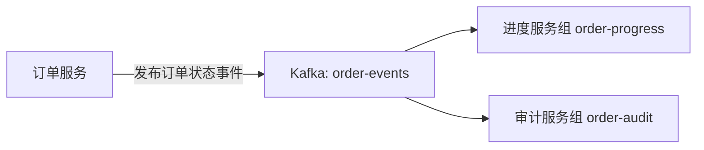
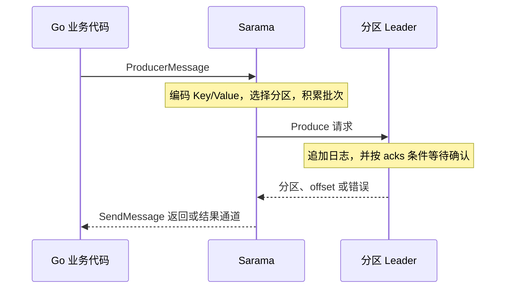
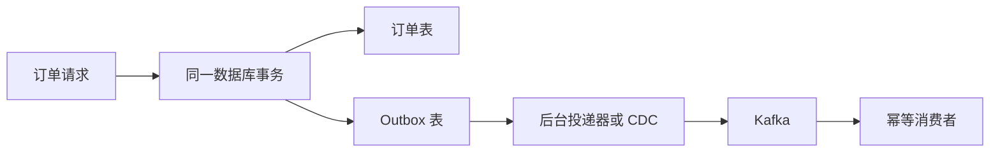

# Go 集成 Kafka：用 Sarama 从订单事件走到可靠消费

## 前言

订单服务已经把订单写进数据库，页面却一直转圈。查日志发现，订单本身没有问题，是下游的通知服务迟迟没有响应。

把通知调用改成 goroutine，页面似乎快了。但服务刚重启，那些还在内存里等着执行的通知任务就消失了。再加一个定时任务补偿，又开始遇到重复通知、处理顺序和排查困难。

这类问题的共同点是：**一件业务事实已经发生，多个系统需要知道它，而它们不必在同一个请求里完成工作。**

Kafka 能把这些事实保存下来，让不同应用按自己的速度读取。不过，“能发送一条消息”只是开始。什么时候算发送成功？两个消费者会不会拿到同一条？处理完却没提交进度，会发生什么？所谓幂等和事务，到底保护了哪一步？

我们用订单创建、支付、取消这条事件流把这些问题连起来。每一阶段都包含可运行命令、需要观察的结果，以及结果背后的机制。最终项目使用 Go 和 IBM Sarama，涵盖生产者、分区读取、消费者组、位移提交、失败恢复与事务可见性。

阅读前只需要掌握 Go 的结构体、错误处理、goroutine、channel 和 context。通过 curl 调用订单 HTTP 接口，Kafka 消费者独立运行。实验不需要数据库：订单暂存在 API 进程内存中，下游处理打印日志。持久化与数据库一致性会作为明确的工程边界单独讨论。

## 1. 从订单服务的边界开始

### 1.1 哪些事情值得变成事件

假设订单系统有两个下游：

- 进度服务：接收订单变化，更新用户看到的订单状态。
- 审计服务：保存订单发生过哪些变化，以便排查和追踪。

它们都关心订单事件，但处理速度、故障情况和扩容方式不一样。生产者只需要把事件发布到 Kafka，不需要知道下游启动了几个实例。



这里的事件表达已经发生的事实，例如 `created` 和 `paid`。它不是“请支付”命令，也不能把“订单创建”直接当成支付成功。这样的命名让消费者能据事件本身作出判断。

异步化改变的是等待关系：订单请求不必等待审计处理结束。但它同时带来可见的延迟、积压、重复投递和最终一致性。对于必须立即拿到结果的库存预占或支付授权，仍应根据业务约束设计同步调用、预留或事务流程。

### 1.2 六条消息足够做很多实验

订单可以通过 HTTP 接口逐条产生。事务实验另外提供下面这组六条固定状态样例：

| 提交次序 | 订单 | 状态 | 金额，单位分 |
| --- | --- | --- | ---: |
| 1 | order-1001 | created | 1200 |
| 2 | order-1002 | created | 2300 |
| 3 | order-1003 | created | 3500 |
| 4 | order-1001 | paid | 1200 |
| 5 | order-1002 | paid | 2300 |
| 6 | order-1003 | cancelled | 3500 |

同一订单必须先创建，再进入支付或取消状态。不同订单之间没有全局排序要求。这个区别会决定 Key 的选择、分区方式和消费者的并发边界。

订单 HTTP 接口使用“订单号:状态”作为这个简单状态机的事件 ID：同一订单只能创建一次，随后支付或取消。事务批次使用随机批次号生成新的事件 ID，因此再次请求事务接口是在生成新实验事件。真实业务若允许反复进入同一状态，应使用独立、持久化的事件 ID，重试时复用它，不能照搬“订单号:状态”的简化规则。

## 2. 先建立一个准确的 Kafka 模型

### 2.1 Topic、Partition 与 Broker 各负责什么

可以把 Topic 理解为事件类别，把 Partition 理解为该类别中的一份追加日志。Broker 是保存这些日志并响应网络请求的服务节点。

```text
Topic: order-events
  Partition 0: [offset 0] [offset 1] [offset 2] ...
  Partition 1: [offset 0] [offset 1] ...
  Partition 2: [offset 0] [offset 1] [offset 2] ...
```

三个 `offset 0` 都合法，因为 offset 只在一个分区内有意义。一条记录的位置由 **Topic、Partition、Offset** 共同确定。它不是订单 ID，也不是整个 Topic 的连续行号。

| 术语 | 在订单实验中的具体含义 |
| --- | --- |
| Event / Record / Message | 一条订单状态记录，传输时是字节 |
| Producer | 将订单事件写入 Kafka 的 Go 代码 |
| Topic | `order-events`，承载这类事件 |
| Partition | 决定有序日志、并发处理和数据分布的单位 |
| Offset | 分区内的位置；递增，但不应假设永远连续 |
| Broker | 本地监听 `127.0.0.1:9092` 的 Kafka 服务 |
| Batch | 同一 Topic、同一分区中的一组待发送记录 |
| Consumer | 读取并处理订单事件的 Go 进程 |
| Consumer Group | 共同完成一份消费工作的消费者集合 |
| Replica / Leader / Follower | 分区的副本及复制角色，与消费者组不是一回事 |

消息被消费后，不会因为某个消费者读过就立即删除。保留策略按时间、大小或日志压缩规则管理数据。不同消费者组因此可以独立读取和重放同一批记录。这个行为使 Kafka 同时具备事件传输和日志存储的用途。[Kafka 概念介绍](https://kafka.apache.org/43/getting-started/introduction/)

### 2.2 并发和冗余是两件事

三个分区、一个副本，表示三份不同的数据日志，每份只有一份拷贝。一个分区、三个副本，表示一份逻辑日志在三个节点上复制。

分区让工作可以分开，副本帮助数据在故障中存活。增加分区不会自动增加副本；在一台机器上创建三个分区，也不会获得三台机器的容灾能力。

生产者通常把消息写给分区 Leader，Follower 复制 Leader 的日志。ISR 是与 Leader 保持足够同步的副本集合，后面的 `acks=all` 与这个集合有关。

### 2.3 为什么 Kafka 能处理大量数据

理解性能可以沿着一条记录的路径看：分区日志主要追加写，操作系统页缓存减少重复磁盘访问，批量传输摊薄请求成本，压缩减少字节量，多个分区分散工作，消费者主动拉取以控制读取节奏。适用的传输路径还可以使用零拷贝来减少数据复制。

这些机制不能推导出任何机器都能达到固定的“百万吞吐”或“毫秒延迟”。消息大小、确认级别、副本、压缩、硬件和下游处理能力都会改变结果。六条消息用于验证语义，不是性能基准。[Kafka 设计说明](https://kafka.apache.org/43/design/design/)

## 3. 准备一个能确认状态的本地环境

### 3.1 实验版本和客户端选择

| 组件 | 本项目使用方式 |
| --- | --- |
| Kafka | 在本地 Kafka 4.3.1 上验证，KRaft 模式 |
| Go | 模块要求 Go 1.25.0 或更新版本 |
| 客户端 | `github.com/IBM/sarama v1.60.0` |
| 连接 | `127.0.0.1:9092`，本地 PLAINTEXT |
| Topic | 三分区、一副本，用于学习 |
| 消费组协议 | 项目使用 Sarama 的经典消费者组流程和 Range 分配策略 |

Sarama 的导入路径使用 `github.com/IBM/sarama`。旧资料中的 `github.com/Shopify/sarama` 不应与它混用。依赖版本在项目的 `go.mod` 和 `go.sum` 中固定，避免复制示例时得到不同 API。[Sarama 项目](https://github.com/IBM/sarama)

Kafka 4.x 使用 KRaft 管理集群元数据，不再采用 ZooKeeper 模式。旧教程的“先启动 ZooKeeper”属于旧部署方式。KRaft 控制器负责集群元数据共识，Broker 负责消息服务；本地开发可以组合角色，生产部署需要另外考虑控制器与 Broker 拓扑。

### 3.2 已经安装 Kafka，就先验证它

Homebrew 安装的命令通常没有 `.sh` 后缀：

```bash
kafka-topics --bootstrap-server 127.0.0.1:9092 --list
```

官方压缩包中的同类命令通常是 `bin/kafka-topics.sh`。后面的例子采用 Homebrew 名称；使用压缩包时替换命令路径即可。

能看到 Topic 列表，说明客户端已完成实际 Kafka 请求，比检查端口监听更进一步。不要为了跑教程重新格式化已经有数据的集群。

尚未部署时，可以按照 [Kafka 4.3 官方快速入门](https://kafka.apache.org/43/getting-started/quickstart/) 下载发行包、使用该版本要求的 Java 环境，在一个全新的数据目录中生成 Cluster ID、格式化 KRaft 存储并启动服务。格式化是初始化步骤，不是每次重启的步骤。也可以使用官方容器镜像，需同时配置容器端口与客户端可访问的广播地址。

无论怎样部署，必须弄清两个地址：`listeners` 决定 Broker 监听哪里，`advertised.listeners` 决定告诉客户端连接哪里。Go 在宿主机上运行时，Broker 返回一个只能在 Docker 网络里解析的名称，会出现“引导连接成功，发送却失败”的现象。

### 3.3 先用命令行看见一条记录

为了不把纯文本送进后面的 JSON 消费者，命令行实验使用独立 Topic：

```bash
kafka-topics --bootstrap-server 127.0.0.1:9092 \
  --create --if-not-exists --topic order-cli-lab \
  --partitions 1 --replication-factor 1

kafka-topics --bootstrap-server 127.0.0.1:9092 \
  --describe --topic order-cli-lab

kafka-console-producer --bootstrap-server 127.0.0.1:9092 \
  --topic order-cli-lab
```

输入 `order-1001 created` 后回车。一行就是一条消息，按 Ctrl+C 结束生产者，再读取：

```bash
kafka-console-consumer --bootstrap-server 127.0.0.1:9092 \
  --topic order-cli-lab --from-beginning --max-messages 1 \
  --property print.partition=true --property print.offset=true
```

`--describe` 输出中的 Leader、Replicas、Isr 是 Broker ID；控制台中的 offset 是消息位置。完成这个实验后，网络、Broker、Topic、写入、读取都已经有了具体对应。

## 4. 获取项目，用 curl 完成第一笔订单

### 4.1 一个实验入口对应一份发送代码

完整源码：[Sarama 订单事件实验项目](https://github.com/zzxrepository/gocode-examples/tree/32c6aea5d11b0e8934233c907aa5fc9b3287af8f/message-queue/kafka/go/01-sarama-order-demo)。业务请求通过 HTTP 路由选择发送示例，每个发送示例有独立的代码文件；消费服务另起进程。

```text
01-sarama-order-demo/
├── cmd/
│   ├── api/main.go                  HTTP 服务启动与退出
│   ├── consumer/main.go             消费者组进程
│   ├── partition-reader/main.go     指定分区读取实验
│   └── init-topic/main.go           创建实验 Topic
├── configs/local.yaml              HTTP 与 Kafka 配置
├── internal/
│   ├── router/router.go            URL 与控制器绑定
│   ├── controller/                 请求解码、响应与事务实验入口
│   ├── service/order_service.go    订单规则、事件组装、内存状态
│   ├── model/                      订单与订单事件结构
│   ├── config/config.go            YAML 解析、校验、Sarama 配置转换
│   ├── messaging/
│   │   ├── message.go              通用 Record 与 ProducerMessage 转换
│   │   ├── sync_producer.go        同步发送 demo
│   │   ├── async_producer.go       异步发送 demo
│   │   ├── callback_producer.go    异步回调 demo
│   │   └── transaction_producer.go 事务发送 demo
│   └── consumer/group.go           消费组与处理器
├── integration/                    真实 Kafka 集成测试
├── go.mod / go.sum
├── run.sh
└── README.md
```

一次请求沿着 `router → controller → service → messaging → Kafka` 前进。router 只绑定入口；controller 处理 HTTP；service 检查订单状态并组装事件；messaging 负责传输字节，不理解订单业务。文件名没有框架强制标准，清晰的职责比统一叫 controller 或 handler 更重要。

### 4.2 bootstrap.servers 在哪里

`configs/local.yaml` 包含可修改的应用配置：

```yaml
http:
  address: "127.0.0.1:18080"
kafka:
  bootstrap_servers:
    - "127.0.0.1:9092"
  topic: "order-events"
  client_id: "order-demo"
  producer:
    required_acks: "all"
    retry_max: 3
    idempotent: true
    compression: "none"
  consumer:
    group_id: "order-progress"
    initial_offset: "oldest"
    auto_commit: false
```

Java 客户端把引导地址放进 `bootstrap.servers` 配置；Sarama 将地址列表作为构造函数的第一个参数：

```go
producer, err := sarama.NewSyncProducer(cfg.Kafka.BootstrapServers, kafkaCfg)
```

YAML 的 `bootstrap_servers` 是应用自己约定的字段名，加载后传给 Sarama，功能对应 Java 的 `bootstrap.servers`。它不会因为没有写在 `sarama.Config` 里就消失。

配置加载器拒绝未知字段，并调用 Sarama 的 `Validate` 校验组合。例如保留幂等却把 `required_acks` 改成 `"0"`，应该在启动时报告错误，而不是静默降级。订单 API 额外要求 `required_acks: "all"`，保持成功响应的确认语义。

### 4.3 启动三个必要部分

```bash
git clone https://github.com/zzxrepository/gocode-examples.git
git -C gocode-examples checkout 32c6aea5d11b0e8934233c907aa5fc9b3287af8f
cd gocode-examples/message-queue/kafka/go/01-sarama-order-demo

# 创建三分区、一副本 Topic。已存在时保留数据。
sh run.sh ./cmd/init-topic

# 终端 A：启动 HTTP 服务。
sh run.sh ./cmd/api
```

另开终端，在同一项目目录启动消费者：

```bash
# 终端 B：持续消费，Ctrl+C 退出。
sh run.sh ./cmd/consumer
```

`run.sh` 只为本次 `go run` 设置自动工具链下载、模块代理和校验，不修改全局 Go 环境。已有 Go 1.25+ 且模块环境正常时，可以直接运行 `go run ./cmd/api`。API 默认只监听本机地址。

### 4.4 同步下单、支付、查询

在终端 C 执行：

```bash
curl -i -X POST http://127.0.0.1:18080/demo/sync/orders \
  -H 'Content-Type: application/json' \
  -d '{"order_id":"sync-1001","amount_cents":1200}'

curl -i -X POST http://127.0.0.1:18080/demo/sync/orders/sync-1001/pay

curl -sS http://127.0.0.1:18080/demo/sync/orders/sync-1001
```

首次创建返回 HTTP 201，支付返回 HTTP 200，查询应得到 `status: "paid"`。API 日志包含发送成功的分区和 offset，消费者应看到这个订单的 `created`、`paid` 两条事件。

取消使用另一笔新订单：创建 `sync-1002` 后请求 `POST /demo/sync/orders/sync-1002/cancel`。已支付订单再取消返回 409；重复创建同一订单返回 409；不存在的订单返回 404；非法参数返回 400；同步事件发布未确认返回 503。

503 并不证明消息一定没有进入 Kafka。例如 Broker 已写入，但确认在网络上丢失，应用看到的就是结果不确定。项目保持本地状态不前进，后续重试仍需复用事件 ID，并由真实下游执行幂等处理。

### 4.5 对照三个 demo 路由

| 入口 | 发送实现 | 创建成功的 HTTP 含义 |
| --- | --- | --- |
| `POST /demo/sync/orders` | `sync_producer.go` | 201：已得到 Broker 确认 |
| `POST /demo/async/orders` | `async_producer.go` | 202：已交给 Sarama 输入通道 |
| `POST /demo/callback/orders` | `callback_producer.go` | 202：已受理；逐条结果从回调日志观察 |

三种前缀都支持查询、支付和取消。它们拥有各自的内存订单集合，请使用不同订单号并在同一路由前缀下完成生命周期。它们是比较发送行为的独立实验，不是让同一业务订单在三个服务之间切换。

每个生产者在 API 启动时创建并复用。同步、异步与回调场景分别持有实例，是为了对比配置和代码路径；普通服务通常只选择符合需求的一种路径，不需要照搬三套实例。

内存订单会在 API 重启时丢失，Kafka 消息和消费组位移不会因此消失。异步路径中本地订单状态只代表请求已受理，不代表 Kafka 已保存或下游已处理。项目没有把这个边界包装成持久可靠的订单系统。

### 4.6 重复实验时隔离消息和位移

复制 `configs/local.yaml` 为 `configs/lab.yaml`，把 `topic` 改为一个新的名字，例如 `order-lab-20260928`。初始化、API 和消费者都使用同一文件：

```bash
sh run.sh ./cmd/init-topic -config configs/lab.yaml
sh run.sh ./cmd/api -config configs/lab.yaml
sh run.sh ./cmd/consumer -config configs/lab.yaml -group order-lab-progress
```

新 Topic 隔离消息，新 Group ID 隔离进度。`client_id` 用于识别客户端，不负责重置消费位置。已有 Topic 不会由初始化命令重建；要验证三个分区，先用 `kafka-topics --describe` 确认。

## 5. 把业务事实变成消息

### 5.1 订单号和事件号为什么要分开

项目中的数据结构是：

```go
type OrderEvent struct {
    EventID     string `json:"event_id"`
    Version     int    `json:"version"`
    OrderID     string `json:"order_id"`
    Status      string `json:"status"`
    AmountCents int64  `json:"amount_cents"`
}
```

`order_id` 表示哪一笔订单，`event_id` 表示哪一次业务事实。同一订单的创建和支付是两个事件，因此消费者不能简单地“这个订单见过就全部忽略”。

`version` 给后续结构演进留下识别入口；新增字段、修改字段语义和删除字段的兼容代价并不相同。金额使用整数分，避免把浮点舍入问题带进实验。

### 5.2 序列化发生在客户端

订单服务先把领域事件序列化，再交给通用传输接口：

```go
value, err := json.Marshal(event)
if err != nil {
    return model.Order{}, err
}
err = s.publisher.Publish(ctx, messaging.Record{
    Key: order.ID, Value: value, EventID: event.EventID,
})
```

`Record` 不含订单专属字段：

```go
type Record struct {
    Key     string
    Value   []byte
    EventID string
}
```

底层把它转换为 `sarama.ProducerMessage`：Topic 来自配置，Key 使用 `StringEncoder`，Value 使用 `ByteEncoder`。Kafka 只传输字节，不理解 Go 结构体。

事件 ID 还放入 `ProducerMessage.Metadata`，供本进程回调关联日志；该 Metadata 不会发往 Kafka。业务事件 ID 在 JSON 里也有一份，下游根据消息体读取。需要传递链路信息时，应另行约定 Kafka Headers 或消息体字段。

JSON 便于观察。消息量和 schema 管理需求提高后，可以评估 Protobuf、Avro 等形式；选择时同时考虑演进、跨语言兼容和诊断成本，不能只比较序列化速度。

### 5.3 反序列化也不等于业务合法

消费者先执行 `json.Unmarshal`，再检查版本、事件 ID、订单号、Key 与订单号的一致性、金额及状态取值。合法 JSON 也可能是一条无法处理的业务记录。

坏消息的处理策略是项目的一部分：本实验返回错误并停止实例，不标记该消息。这样便于观察失败恢复，但也意味着同一条坏消息会阻塞所在分区，需要修复、隔离或人工处置。直接打印错误然后继续标记后续位移，会把“失败”变成“被跳过”。

### 5.4 增加支付、用户事件时，要不要再写一套发送代码

事件类型由业务含义决定，传输方式由 Kafka 客户端决定。新增 `UserRegistered` 不需要重新实现同步发送、错误收集和连接关闭。它只需要自己的数据结构与编码逻辑，最终仍交给同一个 `Record` 传输接口。

业务事件也不必全部挤进一个拥有几十个可选字段的大结构体。订单状态变化、支付成功和用户注册的数据含义不同，可以分别建模：

```go
// 这是多业务事件的设计示意，当前订单实验没有引入这些额外业务。
type PaymentSucceeded struct {
    OrderID       string `json:"order_id"`
    TransactionID string `json:"transaction_id"`
    Channel       string `json:"channel"`
    AmountCents   int64  `json:"amount_cents"`
}

type UserRegistered struct {
    UserID string `json:"user_id"`
}

type Event[T any] struct {
    ID      string    `json:"id"`
    Type    string    `json:"type"`
    Version int       `json:"version"`
    Source  string    `json:"source"`
    Time    time.Time `json:"time"`
    Data    T         `json:"data"`
}
```

这是“统一上下文、独立业务载荷”的一种表达。`Event[PaymentSucceeded]` 复用公共字段，同时保持支付数据的类型检查。若多个状态始终采用同一 schema，使用一个 `OrderStatusChanged` 搭配明确状态字段也合理；是否拆结构体，应看业务约束和演进方式，而不是看到一种状态就复制一个文件。

消费端可以先读取包含 `json.RawMessage` 的公共信封，再依据事件类型和版本交给已注册处理器。处理器表让业务扩展不必修改一个越来越大的分支函数。未知版本、解码失败、没有处理器等情况必须有明确策略，不能默默确认并丢弃。

也可以按 Topic 为不同业务分别注册处理器。**事件类型、Topic、消费者组、HTTP 路由是四个不同维度**：一个 Topic 可以承载同一业务域的多个事件类型，一个事件类型也可能被多个组独立消费；HTTP 路由只是这个实验触发发送的入口。

公开生态中，CloudEvents 将事件上下文与业务数据分开；Watermill 的通用 Message 使用 UUID、Metadata、Payload，Router 负责把消息交给业务 Handler。它们展示了可复用的边界，不能据此推断所有企业使用同一套规范。[CloudEvents 1.0.2](https://github.com/cloudevents/spec/blob/v1.0.2/cloudevents/spec.md)、[Watermill Message](https://watermill.io/docs/message/)、[Watermill Router](https://watermill.io/docs/messages-router/)

上面的自定义 `Event[T]` 只是设计示意，不是完整的 CloudEvents 实现。若需要与其他平台互操作，应遵循标准的字段、编码和 Kafka 协议绑定，或采用官方 SDK。

## 6. 生产者：先分清提交与确认

### 6.1 一次发送在后台经历什么



生产者先向引导 Broker 获取元数据，知道 Topic 有哪些分区、Leader 在哪里，再把消息发给目标 Broker。配置中的 `bootstrap_servers` 是集群发现入口，不是让每一条消息都经过固定代理。部署多个 Broker 时，可以给出多个入口以容忍某个入口不可用。

客户端会在连接、元数据刷新、Leader 变化等过程中管理网络连接。生产者应按应用生命周期复用，避免每处理一个 HTTP 请求就重新创建。Sarama 自己管理 Broker 连接和后台发送；是否需要多个生产者实例，应由隔离需求、事务 ID 和测量结果决定，不能直接套用数据库连接池模式。

连接也可能因为服务端空闲超时、网络中断或客户端主动 Close 而结束。Java 的 `connections.max.idle.ms` 是其客户端配置，不能原样塞进 Sarama；Go 的网络超时、连接保活及 Broker 的空闲连接策略应分别核对。元数据缓存与网络连接都可能更新，因此不要把一次启动时连通当成后续请求永远可达的保证。

### 6.2 配置要能够解释，而不是复制一整页

项目把以下配置转换放在 `internal/config/config.go` 的 `Sarama` 方法中：

```go
cfg := sarama.NewConfig()
cfg.Version = sarama.V4_0_0_0
cfg.Producer.RequiredAcks = sarama.WaitForAll
cfg.Producer.Retry.Max = 3
cfg.Producer.Idempotent = true
cfg.Net.MaxOpenRequests = 1
cfg.Producer.Partitioner = sarama.NewHashPartitioner
cfg.Producer.Return.Successes = true
cfg.Producer.Return.Errors = true
```

这里的 `Version` 是客户端采用的协议能力配置，不需要精确等于 Broker 的补丁版本。项目使用 Kafka 4.0 协议配置连接本地 4.3.1 Broker。

`Return.Successes` 的意思是让 Sarama 返回成功结果，不是让 Kafka 提高确认强度。后者由 `RequiredAcks` 控制。两个字段经常一起出现，却解决不同问题。同步生产者内部也依赖成功结果，所以同样要求启用该配置。

幂等生产者需要配合确认、重试和在途请求限制。这里按固定 Sarama 版本使用 `WaitForAll`、非零重试和 `MaxOpenRequests=1`。不要把 Java 客户端某个版本允许的在途请求数直接照搬过来。[Sarama 配置定义与校验](https://github.com/IBM/sarama/blob/v1.60.0/config.go)

### 6.3 同步发送：让结果紧跟业务代码

```bash
curl -i -X POST http://127.0.0.1:18080/demo/sync/orders \
  -H 'Content-Type: application/json' \
  -d '{"order_id":"sync-2001","amount_cents":2300}'
```

`SyncPublisher.Publish` 的核心逻辑如下；实例在 API 启动时创建，在服务退出时关闭：

```go
partition, offset, err := producer.SendMessage(msg)
if err != nil {
    return fmt.Errorf("发送 key=%v: %w", msg.Key, err)
}
fmt.Printf("sync ok key=%v partition=%d offset=%d\n",
    msg.Key, partition, offset)
```

在当前 `acks=all` 配置下，成功返回表示这次写入满足 Broker 的确认条件。它不代表进度服务已经更新，也不代表通知已经发送。

逐条同步发送容易理解，错误也容易接回调用链。代价是当前 goroutine 每次都等待确认；是否能满足业务吞吐，要测量。同步 API 不是“不会丢消息”的同义词，异步 API 也不是“不可靠”的同义词。

### 6.4 异步发送：把等待放到结果处理逻辑中

```bash
curl -i -X POST http://127.0.0.1:18080/demo/async/orders \
  -H 'Content-Type: application/json' \
  -d '{"order_id":"async-2001","amount_cents":2300}'
```

发送语句变成：

```go
select {
case <-ctx.Done():
    // 停止继续提交，随后走关闭流程。
case producer.Input() <- msg:
    fmt.Printf("queued key=%v\n", msg.Key)
}
```

此时 `queued` 只说明客户端接收了消息。它可能还没有组批，没有发到网络，更没有得到 Broker 确认。由于 channel 和内部缓冲存在背压，异步提交也可能等待；“异步”不意味着每次调用都绝不阻塞。

`AsyncPublisher` 关闭逐条成功回传，但保留 `Errors()`，并在退出前等全部消息处理完成。它对应“调用方不逐条等待结果”的学习目标，同时避免把忽略错误当作推荐写法。

### 6.5 异步回调：Sarama 用 channel 表达结果

```bash
curl -i -X POST http://127.0.0.1:18080/demo/callback/orders \
  -H 'Content-Type: application/json' \
  -d '{"order_id":"callback-2001","amount_cents":2300}'
```

Java 常用回调对象接收结果；Sarama 通过两个通道表达：

| 通道 | 结果 | 能做什么 |
| --- | --- | --- |
| `Successes()` | 成功的 `ProducerMessage`，含分区和 offset | 记录发送结果、度量延迟、关联业务请求 |
| `Errors()` | 含消息和错误的 `ProducerError` | 分类失败、告警、决定补偿 |

项目在提交前就启动结果收集 goroutine。收集循环的关键结构如下，具体日志和错误收集见 `callback_producer.go`：

```go
successes, failures := producer.Successes(), producer.Errors()
for successes != nil || failures != nil {
    select {
    case msg, ok := <-successes:
        if !ok {
            successes = nil
            continue
        }
        eventID := msg.Metadata.(string)
        fmt.Printf("event=%s partition=%d offset=%d\n",
            eventID, msg.Partition, msg.Offset)
    case failure, ok := <-failures:
        if !ok {
            failures = nil
            continue
        }
        // 完整实现记录失败，并让 Close 返回首个错误。
        fmt.Printf("send failed: %v\n", failure.Err)
    }
}
```

将已关闭通道置为 `nil`，可以让 `select` 不再选中它。否则对关闭通道的读取会立即返回，循环可能空转。

更关键的是，开启了哪个结果通道，就必须持续消费哪个通道。提交完所有消息才开始读结果，可能在大批量发送时互相等待。用六条消息偶尔跑通，不能证明这种写法正确。[Sarama 异步生产者接口约定](https://github.com/IBM/sarama/blob/v1.60.0/async_producer.go)

### 6.6 关闭过程也是发送流程的一部分

同步生产者调用 `Close()`。异步路径在停止提交后调用 `AsyncClose()`，继续读取结果，直到成功和错误通道都关闭。项目通过 `done` channel 等待收集结束；出现错误时返回首个发送错误。回调发生在 HTTP 202 返回之后，不能再修改那个响应。日志只提供观察能力，持久化的发送状态、补偿与结果查询需要另外设计。

不要在 `AsyncClose()` 后立刻退出，也不要用固定 `Sleep(1s)` 猜测缓冲是否发送完。退出快慢取决于尚未完成的请求、重试与网络状态。

Ctrl+C 通过 `signal.NotifyContext` 通知代码停止工作。Sarama 的构造和 `SendMessage` 本身没有这里的 context 参数，仍由网络超时和重试约束，取消不保证瞬间打断正在进行的同步调用。生产服务还需要给整个停机流程设置总预算。

## 7. 分区、顺序、批次和压缩如何连在一起

### 7.1 用订单号做 Key，究竟保证了什么

```bash
sh run.sh ./cmd/partition-reader -partition 0 -offset -2
```

分区读取器持续观察一个指定分区，按 Ctrl+C 结束。分区参数可以换成 1 或 2。它不加入消费者组，不提交组位移；`-offset -2` 从最早保留位置开始，`-offset -1` 从当前末尾开始，非负整数表示具体起点。

根据 API 发送日志找到 `sync-1001` 所在分区，再用读取器查看该订单的 `created` 与 `paid`。应看到分区相同、前者 offset 更小。这个结论有前提：分区数和分区器保持不变，Key 编码一致，生产顺序明确，消费者在分区内按顺序处理。

如果两个生产者同时为同一订单发送状态，Kafka 记录的是最终到达日志的顺序，不会根据业务时间自动恢复因果关系。如果处理端收到后随意启动 goroutine，也可能后到的事件先完成。

同一个 Key 可能与别的 Key 哈希到同一分区；本地实验中 `order-1001` 与 `order-1002` 就可以出现在同一分区。三个分区不意味着三笔订单一定一人一个分区。

### 7.2 常见分区策略的用途

| 策略 | Sarama 入口 | 适用点与代价 |
| --- | --- | --- |
| Key 哈希 | `NewHashPartitioner` | 按订单、用户等业务实体保持路由稳定 |
| 轮询 | `NewRoundRobinPartitioner` | 分散记录，不能再依赖同 Key 固定分区 |
| 随机 | `NewRandomPartitioner` | 简单分布，没有业务实体顺序保证 |
| 手动 | `NewManualPartitioner` | 显式设置 `ProducerMessage.Partition`，适合受控实验 |
| 自定义 | 实现 `sarama.Partitioner` | 特殊路由，但要处理热点、非法分区和扩容影响 |

手动分区需要同时配置分区器，不能只给 `Partition` 字段赋值就假设它覆盖哈希策略。项目的失败恢复测试用手动分区，把六条消息写入分区 0，使失败位置可预测。

自定义分区器实现两个方法：`Partition(message, numPartitions)` 返回目标分区，`RequiresConsistency()` 说明是否需要使用一致的分区集合。若同 Key 必须固定路由，不能在目标分区不可写时随意转投其他分区。返回值必须处于 `[0, numPartitions)`，还要考虑没有分区、Key 编码失败等错误。

扩容分区会改变常见哈希取模的映射；已有记录不会自动搬家。对历史和新消息的实体顺序有要求时，扩分区需要迁移方案。跨语言系统还必须统一哈希算法和 Key 编码；Sarama 默认哈希不等于 Java 客户端默认哈希。[Sarama 分区器实现](https://github.com/IBM/sarama/blob/v1.60.0/partitioner.go)

### 7.3 为什么批量对吞吐很重要

一条 100 字节消息也要支付请求、网络往返和 Broker 处理的固定成本。把同一分区的多条记录放到批次里，可以把这些成本摊开。

可以在异步生产者构造配置中设置 `Producer.Flush.Frequency = 100 * time.Millisecond`，观察消息积累成批次的行为。项目默认沿用 Sarama 的尽快发送策略，不为每个 HTTP 请求额外强制等待 100ms。等待越久，通常越容易形成较大的批次，但单条延迟也可能提高。消息很少时仍需要时间触发，不能只等待一个永远凑不齐的数量门槛。

分区太多也可能让每个分区的小流量批次变碎。增加分区并非无条件提高性能，还会增加元数据、文件和调度成本。

### 7.4 压缩的是记录批次，读到的仍是 JSON

把 `configs/local.yaml` 的 `compression` 从 `"none"` 改为 `"gzip"`，重启 API，然后向回调接口创建一笔新订单。消费者可以继续运行，不需要改动 JSON 解码逻辑。

配置转换会设置 `Producer.Compression = sarama.CompressionGZIP`。消费者正常解码后仍看到原来的 JSON，不需要业务代码自行调用 gzip 解压。

现代 Kafka 记录批次的头部带有压缩及校验信息；Kafka 0.11 引入的记录批次格式也是幂等与事务机制的重要基础。旧消息格式与现代批次格式的内部布局不同，不能把所有版本都理解为“每条消息各自压缩一次”。[Kafka 消息格式](https://kafka.apache.org/43/implementation/message-format/)

生产者压缩、Broker 保存并转发压缩批次、消费者解压是常见路径。如果 Broker 强制使用另一种压缩算法，可能发生重新压缩；旧版本间的消息格式转换也曾带来额外转换成本。对于现代 Kafka，应先对照所用版本的协议与存储支持，不要把旧版兼容路径视为必经步骤。

GZIP、Snappy、LZ4、Zstd 在 CPU、压缩比与延迟之间各有取舍。没有脱离数据分布和机器条件的固定排名。网络或磁盘是瓶颈时压缩可能很有效；CPU 已经紧张时，需要实测净收益。

## 8. 消费者：从读取分区走到共同工作

### 8.1 Kafka 的 pull 模式在 Go 中是什么样子

消费者主动向 Broker 获取数据，Broker 不会因为消息到达就直接调用业务函数。在 Java 中常看到 `poll()`；Sarama 在内部进行网络获取，业务代码从 channel 接收消息。

`Fetch.Min` 和 `MaxWaitTime` 可以一起理解：希望积累一定字节量再返回，但不能无限等待。较大批次可能提高效率，也会增加低流量时的等待。业务代码处理太慢，客户端缓冲最终会产生背压，不能靠无限扩大的 channel 消除下游瓶颈。

### 8.2 独立分区消费者负责什么

`cmd/partition-reader/main.go` 使用的核心 API 是：

```go
pc, err := consumer.ConsumePartition(topic, partition, startOffset)
```

它直接读取一个指定分区，起点可以是明确 offset、`OffsetOldest` 或 `OffsetNewest`。`NewConsumer` 不会自动替你把所有分区分配到多个进程，也不负责消费组位移。

只写死分区 0，会漏掉其他分区。自行遍历分区、每个分区启动 goroutine，可以在单进程内并行读取；但跨进程的分工、故障接管和进度存储也都需要自行设计。对业务服务，消费者组通常更合适。

这个独立读取器不会把分区读到末尾视为自动退出，而是继续等待新消息。默认使用 `ReadCommitted`，也不会误把控制记录占据的 offset 当作必须收到的业务记录。

### 8.3 组内分工，组间各读一份

同一个 Group ID 表示多个实例共同完成一份工作。在本项目采用的经典消费者组模型中，同一分区在同一时刻分配给组内一个成员。一个成员可以负责多个分区，多出来的成员可能空闲。

```text
order-events: P0  P1  P2

order-progress 组：实例 A 负责 P0、P1；实例 B 负责 P2
order-audit    组：实例 C 负责 P0、P1、P2
```

上图只是可能的分配，不应依赖具体成员一定拿到某个分区。进度组和审计组各自有完整的消费进度；如果误用相同 Group ID，它们会分走彼此的消息。

这也是消息队列式分工和发布订阅式广播在 Kafka 中的统一方式：同组分工，不同组独立读取。Kafka 新版的 share group 是另一种消费模型，不能把它的行为混入这个经典消费者组实验。

### 8.4 三个接口方法表达一个 session 的生命周期

`orderGroupHandler` 实现 `sarama.ConsumerGroupHandler`：

| 方法 | 调用时机 | 项目中的行为 |
| --- | --- | --- |
| `Setup` | 分配完成、开始消费前 | 打印本次 claims |
| `ConsumeClaim` | 每个分区 claim 的处理循环 | 反序列化、处理、标记、提交 |
| `Cleanup` | 当前 session 的 claim 退出后 | 打印释放的 claims |

Sarama 已经为各 claim 并发调用 `ConsumeClaim`。该方法内部保持顺序循环，跨分区自然可以并行。把它再次套进后台 goroutine 再立刻返回，会破坏 session 生命周期。

核心处理顺序如下：

```go
if err := h.handle(session.Context(), msg); err != nil {
    // 完整实现记录错误并取消实例；失败消息不标记。
    return err
}
session.MarkMessage(msg, "")
if h.manualCommit {
    session.Commit()
}
```

真正的实现还检查 session 取消和消息 channel 关闭。业务请求应该接收 `session.Context()`，确保失去分区所有权时能及时停止。多个 claim 会并发访问 handler 中的共享状态，若加入内存统计或缓存，需要同步保护。

外层必须反复调用 `group.Consume(ctx, topics, handler)`。一次 Consume 对应一次 session；再均衡结束后，需要重新调用才能按新分配继续工作。程序还必须持续读取 `group.Errors()`，并在关闭时等待错误收集结束。[Sarama 消费组生命周期](https://github.com/IBM/sarama/blob/v1.60.0/consumer_group.go)

### 8.5 亲眼观察两个组与两个实例

先建一个新 Topic，再分别在三个终端启动：

```bash
# 终端 A
sh run.sh ./cmd/consumer -group order-progress -client-id progress-a

# 终端 B
sh run.sh ./cmd/consumer -group order-progress -client-id progress-b

# 终端 C
sh run.sh ./cmd/consumer -group order-audit -client-id audit-a
```

另一个终端通过同步路由创建一笔新订单再支付。进度组 A、B 的处理日志合起来对应这两条事件；审计组 C 独立处理两条。成员加入退出期间可能出现再均衡及重复处理，因此不能把一次屏幕输出当作恰好一次保证。

启动第二个进度实例时，观察 `released` 与新的 `assigned`。停止其中一个后，再发送一批事件，存活实例应接管工作。实例数超过三个时，对这个三分区 Topic 而言，至少一个成员没有分区可分。

## 9. 位移提交：把“读到了”与“做完了”分开

### 9.1 三个位置不能混为一谈

以分区 0 为例：客户端可能已经取到 offset 12，业务只完成到 10，而 Kafka 中提交的下一位置还是 9。

| 位置 | 谁维护 | 表示什么 |
| --- | --- | --- |
| 已获取位置 | 客户端拉取逻辑 | 数据已经进入客户端，不等于业务完成 |
| 已处理并标记的位置 | 应用与 Sarama | 哪些记录可以推进消费进度 |
| 已提交位置 | 组协调者与内部位移日志 | 重启或接管时从哪里恢复 |

如果最后处理的是 offset 10，应该提交 **11**，意思是下一条要读 11。`session.MarkMessage(msg, "")` 内部按 `msg.Offset + 1` 标记。使用 `MarkOffset` 时需要自己遵守这个约定。

现代消费者组位移保存在内部 Topic `__consumer_offsets` 中，名称是两个前导下划线。它按消费组、Topic、分区记录位置。历史上的 ZooKeeper 位移管理属于旧客户端机制；使用 KRaft 不代表业务组位移改成保存在控制器配置文件中。

### 9.2 两种失败窗口决定处理语义

```text
先提交 → 再处理 → 处理前崩溃：这条消息可能不再交给该组。
先处理 → 再提交 → 提交前崩溃：这条消息可能再次被交给该组。
```

本项目选择第二种顺序，为重复处理留下空间，而不主动跳过处理失败的消息。这是业务系统常用的至少一次处理基础，但还需要满足持久化、保留期和故障恢复等条件。

提交 offset 20 不只是确认“20 附近某条做完了”，它意味着此前位置都不再需要从 Kafka 恢复。如果同分区中的 offset 18 还没完成，就不能因为 19 先完成而提交 20。异步工作池必须追踪连续完成区间，不能简单地提交已完成记录的最大值。

### 9.3 手动提交和自动提交各控制哪一步

默认配置关闭自动提交：

```go
cfg.Consumer.Offsets.AutoCommit.Enable = false
// 处理成功后：
session.MarkMessage(msg, "")
session.Commit()
```

逐条提交便于观察，但增加请求和等待成本。`Commit()` 是阻塞提交 API，**没有 error 返回值**；不能伪造 `if err := session.Commit(); ...`。项目通过 `Consumer.Return.Errors=true` 和持续读取 `group.Errors()` 接收异步暴露的错误，不能仅凭业务日志声称提交成功。

复制配置为 `configs/auto-commit.yaml`，把 `consumer.auto_commit` 改成 `true`，再启动：

```bash
sh run.sh ./cmd/consumer -config configs/auto-commit.yaml -group order-auto
```

业务仍在处理成功后调用 `MarkMessage`，Sarama 定时提交已标记的位置。自动提交不意味着 Sarama 理解业务结果，也不意味着这里的写法会自动确认每条刚从 channel 取到的记录。项目固定版本的默认提交间隔为一秒，可通过 `Consumer.Offsets.AutoCommit.Interval` 配置。

Java 的 `commitSync`、`commitAsync`、回调及轮询机制不能逐字翻译成 Sarama。对应用来说，关键是知道已处理的连续边界、提交动作的完成条件和失败反馈路径。[Sarama 位移管理实现](https://github.com/IBM/sarama/blob/v1.60.0/offset_manager.go)

### 9.4 为什么重试旧的异步提交可能让进度倒退

假设先发出“提交 100”，随后发出“提交 200”。第二个成功，第一个超时。如果无条件重试第一个请求，就可能把持久进度重新写回 100。

采用异步提交时，要让回调与提交代次或序列关联，确保旧请求不会覆盖更新的进度。常见设计是在运行中按批次提交，退出或交接前同步收尾。无论采用什么策略，都不能在再均衡结束、已经失去分区所有权之后继续使用旧 session 标记进度。

本实验没有自行实现 Java 式的异步提交包装，而是提供逐条 Commit 与 Sarama 定时提交两种路径，保持提交顺序可以解释和验证。

### 9.5 用命令行确认已提交的位置

```bash
kafka-consumer-groups --bootstrap-server 127.0.0.1:9092 \
  --describe --group order-progress
```

重点看 `CURRENT-OFFSET`、`LOG-END-OFFSET` 与 `LAG`。普通消息实验中，消费完成的分区应接近末尾；没有有效位移的分区可能显示 `-`，不必把空分区当作故障。

`LAG` 是位置差值，是排查积压的线索。事务控制记录、过滤、日志清理等因素会让它不等于“业务待办精确条数”，也不代表最老事件等待了多久。生产监控通常还需要事件年龄和实际处理延迟。

### 9.6 oldest、newest 与重放

配置中的 `initial_offset: "oldest"` 设置的是没有有效组位移时的起点，不会覆盖已有提交。`initial_offset: "newest"` 则跳过启动时已有的历史，开始等待新记录。

如果先生产再启动一个全新的 `newest` 消费组，看不到已有的历史消息是正常行为。要完整重放，最简单的实验方式是换一个 Group ID：

```bash
sh run.sh ./cmd/consumer -group "order-replay-$(date +%s)" -duration 10s
```

需要重置原组时，应先停掉该组所有实例，查看计划再执行：

```bash
kafka-consumer-groups --bootstrap-server 127.0.0.1:9092 \
  --group order-progress --topic order-events \
  --reset-offsets --to-earliest --dry-run

# 核对计划后，把 --dry-run 改为 --execute 才会修改组位移。
```

指定起点还有底层 `ConsumePartition`、`MarkOffset`、`ResetOffset` 等 API，但它们承担不同职责。标记待提交位置不等于立即改变已运行的分区读取循环。需要按时间定位时可以用 `client.GetOffset(topic, partition, timestampMillis)` 查找位置，再以明确的起点启动读取。

如果业务把处理结果和消费位置保存在同一数据库事务里，恢复时也可以从数据库位置读取。这要求应用正确管理分区所有权、交接与数据库事务；单独调用一次 seek 或 reset 并不能创造事务原子性。

## 10. 再均衡：分区的所有权会变化

### 10.1 为什么会发生 Rebalance

一个进度实例加入、离开或失去心跳，组内分工就可能需要调整。订阅集合或分区数量变化也可能触发调整。这个重新分配过程就是 Rebalance。

它不是错误本身，而是故障接管和扩缩容的一部分。问题在于发生得过于频繁，或交接期间业务没有停止，造成重复处理、提交失败和长时间停顿。

项目采用的经典组流程可以分成几步：发现 Group Coordinator，加入消费组，协商分配策略，执行分区分配，获得自己的 claims，再开始消费。协调者是 Broker 上负责该组成员与位移管理的角色，不是业务进程，也不是某个消费者永远担任的“中心服务”。经典协议中的组 leader 成员参与分配，协调者负责组织流程。

客户端通过 `FindCoordinator` 等协议发现协调者。协调者与 `__consumer_offsets` 中负责该组的分区有关，应用不用自己计算并硬编码某台 Broker 地址。

### 10.2 Range、RoundRobin 与减少交接

Range 倾向于按 Topic 将连续分区段分给成员；RoundRobin 在可分配范围内轮流安排分区。多个 Topic、订阅不一致时，它们的均衡表现也会不同。

Sticky 类策略尝试在均衡和保留既有分配之间取舍。Cooperative 协议则可以减少一次性撤销所有分区的影响，但需要组内客户端和策略兼容，不能只修改一个实例就假设整组已经切换。

Kafka 4.x 还支持更新的消费者再均衡协议，与经典协议的客户端职责和配置不完全相同。本项目明确使用经典组流程，不把旧资料中的“每次再均衡必然让所有版本的消费者全停”当成跨版本定律。[Kafka 消费者再均衡协议](https://kafka.apache.org/43/operations/consumer-rebalance-protocol/)

### 10.3 心跳、session 超时和处理耗时

在当前 Sarama 配置中，重点看：

- `Consumer.Group.Heartbeat.Interval`：发送心跳的间隔。
- `Consumer.Group.Session.Timeout`：协调者判断成员失联的时间范围。
- `Consumer.Group.Rebalance.Timeout`：交接 session 的时间预算。
- `Consumer.MaxProcessingTime`：Sarama 向应用交付消息的处理等待相关设置，不等同于 Java 的 `max.poll.interval.ms`。

项目固定版本默认心跳间隔三秒、session 超时十秒、再均衡超时六十秒。它们是理解配置的起点，不是适用于所有网络与业务的推荐值。心跳间隔应明显小于 session 超时，并满足 Broker 对超时的约束。

Sarama 有后台心跳逻辑，不能简单声称“业务不调用 poll 就不会发心跳”。但长时间 CPU 饱和、GC 停顿、网络抖动，仍会影响心跳和处理。业务忽略 `session.Context()`，也可能迟迟不释放分区。

实验中用 `-delay 2s` 模拟慢业务，再启动第二个实例或停止当前实例。观察 session 的变化，并注意：调大超时可以减少误判，却会延长真实故障的接管时间。应结合处理耗时分布与停机预算调整。

### 10.4 订阅多个 Topic 和匹配新 Topic

`group.Consume(ctx, []string{"order-events", "payment-events"}, handler)` 可以订阅明确的 Topic 列表。Java 示例中的正则订阅，不应直接改成 Sarama 列表里的 `"order.*"` 并期待自动匹配。

应用若要动态发现匹配的 Topic，需要明确元数据刷新、过滤、更新订阅列表及重建 session 的方案，或者采用支持对应能力的上层库。Topic 新增也可能带来再均衡；它不是一个只影响运维、不影响消费的操作。

## 11. 可靠性：明确每一层能承诺什么

### 11.1 acks 决定什么条件下确认写入

| 配置 | Sarama 值 | 主要含义 |
| --- | --- | --- |
| `acks=0` | `NoResponse` | 不等待 Broker 的 Produce 确认，无法依靠该确认判断结果 |
| `acks=1` | `WaitForLocal` | Leader 按相应条件确认，Follower 可能还没复制 |
| `acks=all` / `-1` | `WaitForAll` | 等待 ISR 范围内满足要求的复制确认 |

`all` 不表示所有配置副本不管状态如何都必须在线，也不代表下游业务处理完成。它需要和 `min.insync.replicas`、副本数、Leader 选举策略一起理解。

例如生产 Topic 配三个副本、最小 ISR 为二，在满足相应集群条件时，写入要求至少保留足够的同步副本。同步副本不足时拒绝写入，是用可用性换取更明确的复制约束。这个配置不能直接搬到单节点一副本实验：把最小 ISR 设成二，只会让实验写不进去。[Kafka Topic 配置](https://kafka.apache.org/43/configuration/topic-configs/)

确认写入也不应被解释为每条消息都已经单独执行磁盘 fsync。可靠性是复制、存储与故障模型共同形成的保证，单个生产者开关无法涵盖全部风险。

### 11.2 发送失败为什么有时会带来重复

生产者发送一条消息，Broker 已经追加日志，但响应在网络上丢失。生产者只能看到超时，如果重发，就可能写入两次。

Sarama 已有内部重试。应用再无条件套一个多次 `SendMessage` 循环，可能把内部重试次数成倍放大，也可能把结果未知的请求当成新消息重发。应先分类：临时网络或 Leader 切换可以有限重试；消息过大、认证失败、错误 schema 等需要修正输入或配置。

重试设计需要上限、退避、取消和结果追踪。只有错误日志而没有补偿或告警，不能算完整的可靠投递流程。

### 11.3 生产者幂等为何不等于业务去重

幂等的直观含义是：同一操作重复发生时，最终效果等同于只做一次。但必须问清楚，谁认为这是“同一操作”。

Kafka 幂等生产者使用 Producer ID、epoch，以及各分区的序列信息识别协议层重复，防止重试把同一批记录重复追加。Producer ID 的初始化通过相关协议请求与 Broker 完成；事务生产者还涉及事务 ID 对应的协调与旧实例隔离，应用不应自行维护这些序号。

`Producer.Idempotent=true` 不会检查 JSON 中的 `event_id` 是否出现过。再次调用发布接口，即使 Key 和 Value 完全相同，也可能是新的合法记录。API 进程重启后重新执行订单请求，更不能期待 Producer ID 替业务识别重试。[Sarama 事务与生产者状态实现](https://github.com/IBM/sarama/blob/v1.60.0/transaction_manager.go)

业务去重需要自己的持久化约束，例如在同一个数据库事务中：

```text
插入 processed_events(event_id)，有唯一约束
    → 已存在：确认这是已经完成的事件，避免重复副作用
    → 新插入：更新订单状态
提交数据库事务
随后标记并提交 Kafka 位移
```

“去重记录”和“业务更新”必须一起提交。先记去重标志，再失败于业务更新，可能导致重试被误判为已经成功。对于支付等外部接口，还需要对方支持业务幂等键或补偿方案。

### 11.4 亲手制造一次消费失败

为隔离实验，先用新 Topic 和新组。在同步接口创建并支付一笔订单后，启动：

```bash
sh run.sh ./cmd/consumer -config configs/lab.yaml \
  -group order-failure-lab -fail-status paid
```

消费者会处理 `created`，遇到 `paid` 返回错误并退出。去掉失败参数，用同一组重启：

```bash
sh run.sh ./cmd/consumer -config configs/lab.yaml \
  -group order-failure-lab -duration 10s
```

之前失败的支付事件应再次被处理。不同分区可能已经推进到不同位置，因此不要要求屏幕上所有记录都从头重放。

项目选择遇错停机，是为了把不跳过失败记录的原则写清楚。生产系统可以按错误类型设置有限本地重试，或进入重试 Topic、死信 Topic，但这些方式会改变顺序和提交边界。将失败记录送到死信 Topic 后，只有在该转存已经可靠完成时，才有依据推进原位移。

### 11.5 订单数据库与 Kafka 的双写窗口

HTTP 示例把订单保存在内存里，持有一把互斥锁完成状态检查、发布和本地更新，方便保住单进程内的事件顺序。它会限制不同订单的并发能力，而且不构成持久事务。

换成数据库后，无论先提交数据库还是先发 Kafka，都会出现另一步失败的窗口。单纯把两行代码前后交换不能消除它。

常见的持久设计是 Transactional Outbox：



订单变化与待投递事件先一起入库，后台可靠投递，失败可重试。后台在发送成功但尚未更新投递状态时崩溃，仍可能重复发送，因此 Outbox 通常仍需要下游幂等。项目不引入数据库实现它，但这个边界决定了教程代码离真实订单系统还差什么。[Debezium Outbox Event Router](https://debezium.io/documentation/reference/stable/transformations/outbox-event-router.html)

## 12. Kafka 事务：让一组写入统一可见

### 12.1 从一个可观察的问题开始

如果一次业务计算要向多个分区写入结果，写完一半就失败，下游可能看到不完整的结果。Kafka 事务允许把一组 Kafka 写入纳入同一个提交或中止决定。

它解决的是 Kafka 范围内的原子提交与消费可见性。消费者逐条获取记录，并不因此获得数据库式的跨分区查询快照；Kafka 事务也不会把你的 MySQL 事务、HTTP 调用或邮件发送一起回滚。

### 12.2 事务生产者的生命周期

事务路径复用幂等配置，并设置 `Producer.Transaction.ID`。该 ID 应对同一个逻辑生产者保持稳定，在同时活跃的生产者之间唯一，用于恢复与隔离旧实例。

本地 API 为事务实验使用 `client_id + "-http-txn"`，并串行执行请求。多实例部署不能保留所有实例都相同的默认 client ID；需要稳定的实例身份与事务 ID 分配方案。

| 操作 | Sarama API | 作用 |
| --- | --- | --- |
| 初始化 | 创建配置了事务 ID 的生产者 | 与 Broker 建立所需的生产者与事务状态 |
| 开始 | `BeginTxn()` | 开启一笔事务 |
| 发送 | `SendMessage()` / 异步 Input | 向事务中加入记录 |
| 带入消费进度 | `AddOffsetsToTxn` 及相关 API | 把输入组位移纳入事务 |
| 提交 | `CommitTxn()` | 请求提交事务 |
| 中止 | `AbortTxn()` | 请求中止事务 |

没有必要在 Sarama 中照抄 Java 的 `initTransactions()` 方法名。完整发送代码位于 `transaction_producer.go`，其主线是 `BeginTxn → SendMessage → CommitTxn`；显式中止实验则调用 `AbortTxn`。

异常处理必须区分可中止错误、致命错误和结果未知。项目不在提交失败时自动把整批数据当作新事务重发；致命错误直接退出。相同事务 ID 刚结束一笔事务时，初始化可能短暂返回并发事务错误，项目只对这个初始化条件做有限等待重试，不重放业务批次。

### 12.3 两个独立路由观察提交与中止

建议将 API 和消费者切到一个全新的实验 Topic。启动默认的 committed 消费者，再执行：

```bash
# 发送六条样例记录，然后中止事务。
curl -i -X POST http://127.0.0.1:18080/demo/transaction/abort

# 再生成六条新的样例记录，并提交事务。
curl -i -X POST http://127.0.0.1:18080/demo/transaction/commit
```

响应分别含有 `"aborted": true` 与 `"aborted": false`。默认消费者只能读到第二个事务的六条业务记录。换一个全新的组并允许未提交隔离读取：

```bash
sh run.sh ./cmd/consumer -config configs/lab.yaml \
  -group order-txn-inspect -read-uncommitted -duration 10s
```

在只有上述两笔事务的新 Topic 中，它可以读到十二条业务记录，包括已中止事务中的记录。中止不是把日志中的字节立即物理删除，而是通过事务状态影响可见性。

`ReadCommitted` 也能读取普通非事务记录。它不会把 Topic 变成只能存事务消息的容器。仍未结束的事务还可能约束可见位置，使消费者暂时不能越过 Last Stable Offset；因此读不到最新记录时，也要检查是否存在长时间悬而未决的事务。[Kafka 事务协议](https://kafka.apache.org/43/operations/transaction-protocol/)

### 12.4 消费—转换—生产，为什么还要提交输入位移

假设从 `order-events` 消费支付事件，计算后写入 `payment-summary`。只把输出放进事务，输入位移仍在另一个请求里提交，就还存在“输出已提交，但输入位移没提交”的窗口。重启后会再次处理输入。

完整的 consume-transform-produce 设计需要把输出记录和输入组的下一位置放进同一 Kafka 事务：

```text
读取输入（ReadCommitted，关闭自动提交）
    → BeginTxn
    → 写入输出 Topic
    → 将输入 offset+1 加入当前事务
    → CommitTxn
```

它与项目中普通消费者的 `MarkMessage → Commit` 路径不能混用。需要事务管理的位移，不应同时被普通自动或手动提交推进。

对于会再均衡的消费者组，还要保护组代次和成员身份。固定 Sarama 版本提供 `AddOffsetsToTxnWithGroupMetadata`、`AddMessageToTxnWithGroupMetadata` 等 API，用于携带对应的组元数据；只传 Group ID，不能自动获得完整的过期成员隔离。处理器失去 session 时必须停止事务工作，不能继续使用旧所有权。

上述流程是架构说明，项目可运行事务 demo 演示的是“只有生产操作”的提交与中止，没有伪装成已实现完整 EOS 流处理器。只有消费操作而副作用发生在外部数据库时，应让数据库结果与去重或恢复位置保持原子性；Kafka 事务无法替外部系统完成这一步。[Sarama 事务 API](https://github.com/IBM/sarama/blob/v1.60.0/sync_producer.go)

## 13. 把配置放回它实际控制的位置

### 13.1 生产者参数对照

Java 配置名帮助理解概念，Sarama 字段才是 Go 代码实际使用的接口。有些只是近似对应，有些没有直接对应关系。

| Java 或通用概念 | Sarama / 项目位置 | 注意点 |
| --- | --- | --- |
| `bootstrap.servers` | YAML `bootstrap_servers` → 构造函数参数 | 引导地址，不是固定发送节点 |
| `key.serializer` / `value.serializer` | Encoder 与业务序列化 | Go 没有同名字符串配置 |
| `acks` | `Producer.RequiredAcks` | 与 Return.Successes 无关 |
| `retries` | `Producer.Retry.Max` | 仍须分类不可恢复错误 |
| `compression.type` | `Producer.Compression` | 同时受 Broker 配置和协议能力影响 |
| `batch.size` / 批量阈值 | `Producer.Flush.Bytes`、`Flush.Messages` 等 | 不是所有 Java 阈值的精确一一对应 |
| `linger.ms` / 等待组批 | `Producer.Flush.Frequency` | 以 Go duration 表达等待 |
| `client.id` | `ClientID` | 观测标识，不是 Group ID |
| `max.in.flight.requests.per.connection` | `Net.MaxOpenRequests` | 会影响重试顺序及幂等约束 |
| 副本确认等待 | `Producer.Timeout` | 不等于应用请求的总时间预算 |
| 网络等待 | `Net.DialTimeout` / `ReadTimeout` / `WriteTimeout` | 单次网络阶段超时，重试会延长总时间 |
| 元数据获取等待 | `Metadata.Timeout` | Leader 发现失败时有界返回 |
| `max.block.ms` | 无单个等价配置 | Input 可用 select/context；同步调用受自身超时限制 |
| `buffer.memory` | 无精确等价的统一内存开关 | channel、批次和重试缓冲都可能占内存 |
| 消息、请求大小 | `Producer.MaxMessageBytes`、`sarama.MaxRequestSize` | 与 Broker、Topic 上限协同；后者是包级变量 |
| Socket 收发缓冲 | 取决于客户端网络实现与操作系统 | 不要创造不存在的 Java 同名字段 |

旧资料中的 `timeout.ms`、`metadata.fetch.timeout.ms` 等名称也可能已经演进。检查当前客户端字段和版本，不应只根据名字相似就做机械替换。

### 13.2 消费者参数对照

| 通用配置 | Sarama / 项目位置 | 要回答的问题 |
| --- | --- | --- |
| `group.id` | YAML `consumer.group_id` / `NewConsumerGroup` 参数 | 谁共同完成一份消费工作 |
| `auto.offset.reset` | `Consumer.Offsets.Initial` | 没有有效提交位置时从哪里开始 |
| `enable.auto.commit` | `Consumer.Offsets.AutoCommit.Enable` | 谁触发提交已标记位置 |
| `auto.commit.interval.ms` | `Consumer.Offsets.AutoCommit.Interval` | 自动提交频率 |
| `fetch.min.bytes` | `Consumer.Fetch.Min` | 希望 Broker 累积多少数据 |
| `fetch.max.wait.ms` | `Consumer.MaxWaitTime` | 数据不足时最多等待多久 |
| 分区拉取大小 | `Consumer.Fetch.Default` / `Fetch.Max` | 初始及上限相关控制，需查当前实现 |
| `fetch.max.bytes` | 本版本 `Consumer.Fetch.MaxBytes` | Fetch 响应的总体大小相关约束 |
| `session.timeout.ms` | `Consumer.Group.Session.Timeout` | 多久未见心跳可判断失联 |
| `heartbeat.interval.ms` | `Consumer.Group.Heartbeat.Interval` | 多久发送一次心跳 |
| 分配策略 | `Consumer.Group.Rebalance.GroupStrategies` | 如何分配分区 |
| `isolation.level` | `Consumer.IsolationLevel` | 是否过滤未提交或已中止事务 |
| `max.poll.records` / `max.poll.interval.ms` | 没有等价的应用 poll 循环 | 不应直接套到 Sarama channel 模型 |

YAML 只暴露了这个项目真正需要调整的部分，其他值在 `internal/config/config.go` 中明确配置或沿用固定版本默认值。业务项目不需要把客户端所有参数都复制进自己的配置文件；过多可调项会扩大理解和运维成本。

## 14. 从跑通走向可维护

### 14.1 先观察，再调整并发

当消息变多，先确认瓶颈在哪里：生产确认慢、Broker 复制慢，还是数据库处理慢。把消费者实例从二个增加到十个，无法突破三分区的分工边界；把所有分区丢进一个无序工作池，则可能破坏订单内的顺序。

按业务 Key 排序时，可以选择“分区内串行、分区间并行”。要进一步并行，需设计 Key 级执行队列与连续位移跟踪，并评估复杂度是否值得。

长生命周期生产者可以复用连接。同步生产者本身允许并发调用，但事务生产者同时处理多个独立业务事务需要额外序列化或分配实例，不能把并发安全等同于“不同请求的事务不会混在一起”。

### 14.2 日志与指标分别回答什么

日志适合追踪某一条事件，指标适合看整体趋势。建议至少记录事件 ID、业务 Key、Topic、Partition、Offset、Group ID、Client ID、处理结果和耗时，避免在日志中无差别写入敏感载荷。

| 观察项 | 帮助发现的问题 |
| --- | --- |
| 生产成功率、错误类型、确认延迟 | 网络、复制、限额或消息格式问题 |
| 消费处理速率与耗时分布 | 下游慢、热点 Key、长尾任务 |
| 组 lag 与最老事件年龄 | 积压规模与业务延迟 |
| Rebalance 次数和持续时间 | 成员抖动、停机不及时 |
| ISR 变化、未充分复制分区 | Broker 或副本健康问题 |
| 重复事件、重试和死信数量 | 应用幂等与失败恢复质量 |

Sarama 提供客户端指标注册机制，Broker 可通过 JMX 等方式暴露运行指标。可以再接 Prometheus 和结构化日志系统。项目只输出必要日志并验证行为，没有宣称已经内置 Prometheus 面板或完整告警。[Kafka 监控说明](https://kafka.apache.org/43/operations/monitoring/)

### 14.3 优雅退出需要按依赖倒序完成

API 收到退出信号后，先停止接收 HTTP 请求，等待已有请求结束，再关闭生产者并排空异步结果。否则还有请求在发布时，生产者已经被关掉。

消费者收到退出信号后，取消 session，停止取新消息，让支持取消的业务调用结束，完成可提交位置的收尾，再关闭组。应用不应该在业务函数里调用 `os.Exit`，绕过这些清理步骤。

关闭不是绝对无损承诺。进程被强制终止、机器掉电、停机预算耗尽，仍可能发生重复处理或未确认发送。持久化投递与幂等才是面对这些情况的长期机制。

### 14.4 按现象定位，而不是反复重启

| 现象 | 优先检查 |
| --- | --- |
| TCP 连接被拒绝 | Broker 是否启动、地址与端口是否正确 |
| 引导连接成功，发送失败 | `advertised.listeners` 返回的地址能否从客户端访问 |
| Topic 不存在 | 初始化和 API 是否读了同一个配置文件 |
| 单机写入提示 ISR 不足 | 副本数、`min.insync.replicas` 是否匹配本地环境 |
| 收到 HTTP 202，消费者没消息 | 看异步错误日志；202 只确认接收请求 |
| HTTP 409 | 示例内存中已存在订单，或状态转换不合法 |
| 消费组启动却不读历史 | 已提交位移、initial_offset、Topic、组名和事务隔离级别 |
| 只看到部分消息 | 是否只读了一个分区，或与另一个实例共用 Group ID |
| 异步生产者卡住 | 启用的 Successes / Errors 是否持续读取 |
| 经常重复消费 | 提交是否成功、是否频繁重放、是否有业务幂等 |
| 经常 Rebalance | 成员重启、心跳、网络、GC、处理器退出及分区变更 |
| 事务生产者被 fenced | 活跃实例是否误用了同一个事务 ID |
| API 启动端口被占 | 修改 YAML 的 HTTP address，curl 地址一并更新 |

本地默认使用 18080，避免与常见的 Kafka 管理 UI 8080 端口冲突。TLS、SASL 和 ACL 需要按目标集群配置；本机 PLAINTEXT 示例不代表可以把未认证接口直接暴露到公网。

## 15. Kafka 的其他能力放在哪里

### 15.1 五类 API 的职责

| API | 典型工作 | 在订单场景中的位置 |
| --- | --- | --- |
| Producer | 写事件 | Go 订单服务发布变化 |
| Consumer | 读事件 | Go 进度或审计服务处理 |
| Admin | 管理、查询集群对象 | 初始化 Topic、检查组位移 |
| Connect | 在外部系统与 Kafka 之间搬运数据 | 从数据库 CDC 导入或写出到搜索系统 |
| Streams | 持续转换、聚合、关联事件流 | 支付金额窗口统计等流计算 |

Sarama 覆盖生产、消费与管理相关能力，不会因为引入它就同时拥有 Kafka Streams 的状态存储、窗口和恢复机制。

### 15.2 Connect 与 Streams 的分工

Kafka Connect 是连接外部系统的数据集成框架，通常运行独立 worker，通过 source connector 导入，通过 sink connector 导出。不是在每个 Go 服务里手写一个 Connector 类，也不是安装 Kafka 就自动具备所有数据库连接器。[Kafka Connect](https://kafka.apache.org/43/kafka-connect/overview/)

Kafka Streams 是 Java 生态中的客户端流处理库，提供转换、聚合、窗口、连接和状态管理等能力。用 Sarama 消费后在 map 里累计金额，只能算一个自建处理逻辑，不能直接获得 Streams 的容错与恢复语义。Go 服务可以通过 Topic 与 Streams 或其他流处理系统协作。[Kafka Streams](https://kafka.apache.org/43/streams/introduction/)

例如订单事件进入实时统计系统后，可以按事件时间统计每分钟支付金额。需要进一步回答迟到事件、窗口关闭、状态恢复和重复事件处理，这些都超出了单纯的发送与接收。

### 15.3 读旧资料时辨认技术年代

历史版本中的副本、安全认证、Streams、幂等和事务，逐步形成了今天的能力组合。0.8 时代的重要变化包括复制，0.9 扩展安全和新消费者能力，0.10 引入 Streams，0.11 引入幂等、事务与新的记录批次格式。后来版本继续演进，4.x 已进入无 ZooKeeper 的 KRaft 阶段。

这些版本号用于理解资料背景，不是建议今天安装相应旧版本。社区发行版、商业发行版和托管服务还可能在运维工具、连接器、权限、升级节奏及计费上不同；历史文章中的 CDH/HDP 等发行组合也不能直接当作当前选型清单。

学习时先确认三个版本：Broker、客户端库、协议配置。再确认示例假设的组协议、默认参数和部署模式。这样才能区分普遍原理与某个版本的实现细节。

## 16. 验证、练习与实验边界

### 16.1 执行自动验证

在项目根目录执行：

```bash
export GOTOOLCHAIN=auto
export GOPROXY=https://proxy.golang.org,direct
export GOSUMDB=sum.golang.org

go test ./...
go vet ./...
KAFKA_TEST_BROKER=127.0.0.1:9092 \
  go test -race -v -count=1 -timeout 3m ./...
```

未设置 `KAFKA_TEST_BROKER` 时跳过需要 Broker 的集成测试。开启后，测试创建独立 Topic 和消费组，只清理本次测试创建的资源，不清空已有实验数据。

测试覆盖 HTTP 路由到真实 Kafka 的三种发送方式、GZIP 消息读回、参数和状态错误、异步超限错误回收、消费组提交与重启续读、不同组独立消费、处理失败不跳过记录，以及事务提交／中止在两种隔离级别下的可见性。

这些验证不包含多 Broker 故障切换、真实支付副作用、数据库 Outbox、跨系统恰好一次和生产压测。它们验证的是示例承诺的具体行为。

### 16.2 用预测结果检验理解

| 动手操作 | 先预测，再观察 |
| --- | --- |
| 同一个订单先创建后支付 | 是否落在同一分区，offset 如何变化 |
| 两个进度实例使用同组 | 它们是各自收到全部，还是分工 |
| 审计实例改为另一个组 | 为什么能再读一份历史 |
| 重启同组消费者 | 为什么默认 oldest 也不强制重放 |
| 刻意让 paid 处理失败 | 重启后应从哪个位置恢复 |
| 异步路径接收超限消息 | HTTP 已受理和最终发送失败能否同时成立 |
| 中止一个事务 | committed 和 uncommitted 消费者分别看到什么 |
| 给某个处理函数增加延迟 | lag、处理耗时和 Rebalance 有何关系 |

能从日志里说出“哪一分区、哪一个组、哪一步完成了”，比只记住配置名更有帮助。

### 16.3 停止与清理

先停止 HTTP API 和消费者。按部署方式停止 Kafka：前台运行使用 Ctrl+C，后台服务使用对应服务管理命令。当前 4.x 实验不需要再停止一个并不存在的 ZooKeeper 进程。

确认实验数据不再需要后，可以删除具体实验 Topic：

```bash
kafka-topics --bootstrap-server 127.0.0.1:9092 \
  --delete --topic order-cli-lab
```

其他实验 Topic 和组按自己创建的名称清理，不要为了重做一次教程直接删除整个 Kafka 数据目录。

## 总结

订单请求经过路由和业务校验，变成带有业务 Key 的字节记录；生产者按分区批量发送，确认方式与重试决定写入反馈；消费者组分配分区，处理器完成业务后标记并提交下一位置。只要其中一步被混淆，就可能出现“接口成功但没送到”“明明处理过又处理一次”或“某些状态永远没有执行”的现象。

同步、异步和回调改变的是等待与反馈方式。分区决定顺序与并发边界。幂等生产者处理协议重试，业务去重处理重复副作用。Kafka 事务把 Kafka 写入及相应输入位移纳入统一提交，但不替外部数据库和接口完成事务。

完整项目的价值在于能够复现这些边界：从 curl 下单开始，到 Broker 的分区和 offset，再到消费者的处理日志与已提交位置，每一步都能看到和验证。扩展其他业务事件时，保留这条清晰的数据路径，复用传输层，让各业务维护自己的 schema 和处理规则。

## 参考资料

- [Go + Kafka 实战指南](https://developer.volcengine.com/articles/7621809593413206067)：业务场景与 Go 集成的入门参考。
- [Kafka 快速入门](https://dunwu.github.io/bigdata-tutorial/kafka/Kafka快速入门.html)、[Kafka 生产者](https://dunwu.github.io/bigdata-tutorial/kafka/Kafka生产者.html)、[Kafka 消费者](https://dunwu.github.io/bigdata-tutorial/kafka/Kafka消费者.html)：学习主题参考；具体 API、配置及版本行为以文中对应的官方资料和固定版本源码为准。
- [Kafka 4.3 文档](https://kafka.apache.org/43/)、[Sarama v1.60.0](https://github.com/IBM/sarama/tree/v1.60.0)：实验使用的服务端知识与 Go 客户端接口依据。

示例代码、命令与预期行为以本项目的固定版本实现和集成测试为准。
