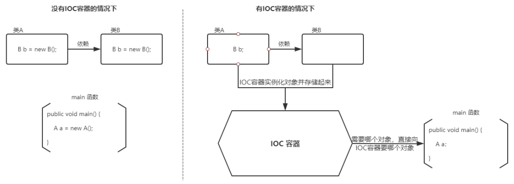
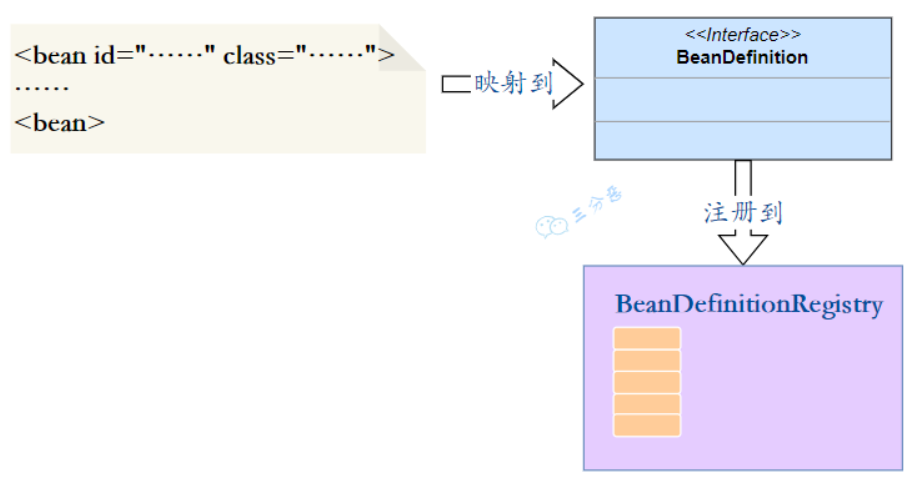
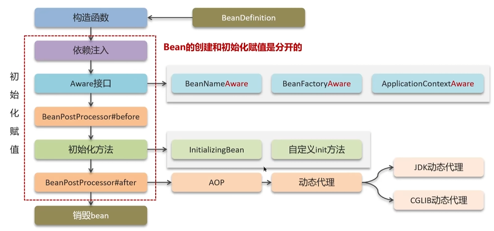
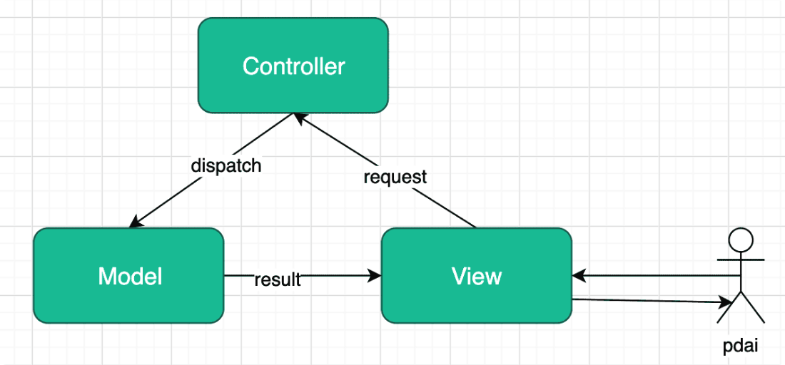
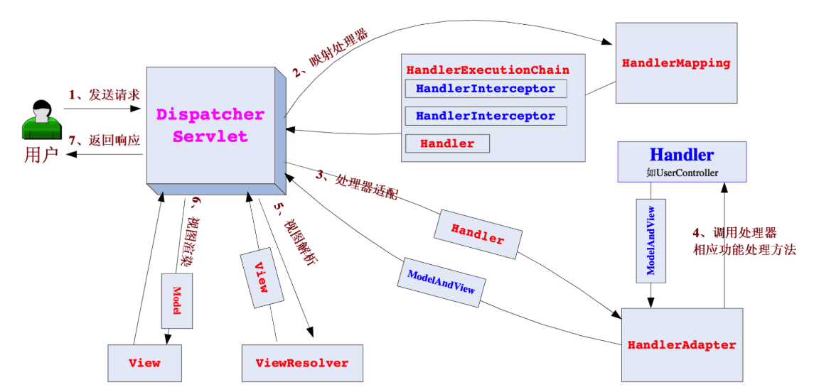
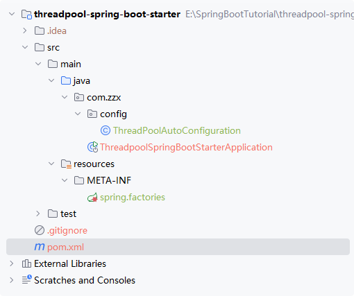
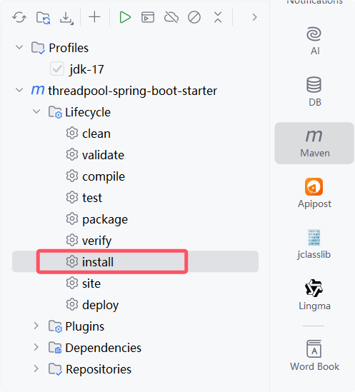
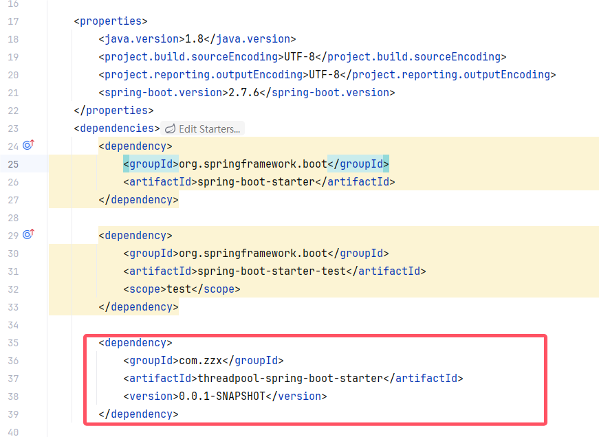
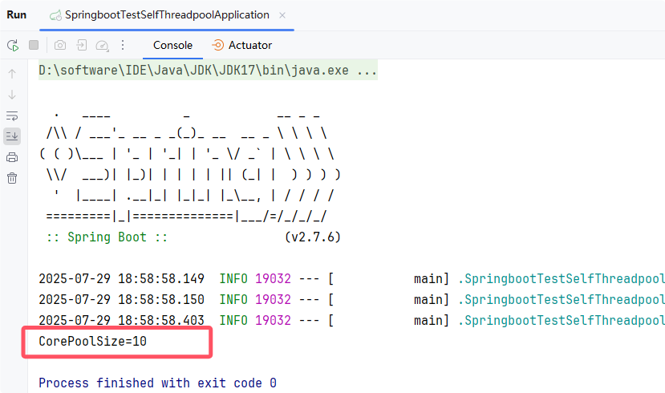

[toc]


# Spring 面试题

## Spring基础

### 🌟什么是Spring框架？

Spring 框架是一款开源的轻量级 Java 开发框架，它通过集成了丰富的功能模块，这些模块能为 Java 开发（尤其是 Web 开发）提供便捷支持。

比如说 Spring 支持 IoC（Inversion of Control:控制反转） 和 AOP(Aspect-Oriented Programming:面向切面编程)、可以很方便地对数据库进行访问、可以很方便地集成第三方组件（电子邮件，任务，调度，缓存等等）、对单元测试支持比较好、支持 RESTful Java 应用程序的开发。

Spring 最核心的思想就是不重新造轮子，开箱即用，提高开发效率。

#### Spring特性的理解

Spring它提供了一些重要的特性，帮助开发者构建高效、灵活和可扩展的应用程序：

1. **支持IoC**：Spring 的核心是控制反转（IoC）容器，它通过依赖注入（DI）管理应用程序中的对象的生命周期和它们的依赖关系。开发者不需要自己手动创建和管理对象，Spring 容器会自动处理对象的创建、依赖注入和生命周期管理。通过这种方式，Spring 实现了高内聚、低耦合的设计，使得组件之间的依赖关系清晰且易于维护。
2. **支持AOP 编程**：Spring 提供了面向切面编程（AOP）的支持，允许开发者在应用程序的业务逻辑中插入“切面”，例如权限控制、日志记录、事务管理等。这使得应用程序的核心业务代码与跨领域的功能（如监控、审计等）分离，从而提高了代码的可重用性和模块化。
3. **支持声明式事务**：Spring 提供了声明式事务管理功能，允许开发者通过注解或 XML 配置来管理事务，而无需编写繁琐的事务管理代码。Spring 会自动处理事务的开始、提交和回滚，从而简化了事务管理，减少了重复代码，使得业务逻辑更加清晰和简洁。
4. **支持快捷测试**：Spring 支持 JUnit 测试，并提供了集成测试的功能。通过注解，开发者可以方便地在测试环境中加载 Spring 上下文，测试应用程序的不同组件和功能，而不需要手动配置和初始化应用上下文。这使得单元测试和集成测试的编写变得更加高效和简洁。
5. **还支持快速集成功能**：Spring 提供了强大的集成功能，能够方便地与各种流行的开源框架（如 Struts、Hibernate、MyBatis、Quartz 等）进行集成。Spring 不排斥其他框架，反而提供了标准化的接口和支持，简化了与第三方框架的集成过程。这种开放的集成能力使得 Spring 成为许多 Java 开发项目的首选框架。
6. **复杂 API 模板封装**：Spring 提供了多种模板类，封装了常见的 Java企业级开发的API（如 JDBC、远程调用`RestTemplate`等），使得这些 API 的使用变得更加简洁和高效。比如，Spring 提供的 `JdbcTemplate` 类简化了 JDBC 的操作，减少了编写重复代码的需要。通过这些模板，开发者可以更快速地实现业务功能，降低了开发的复杂性。

总的来说，Spring 提供了一种灵活、可扩展的方式来管理和组织 Java 应用程序的各个方面，帮助开发者更专注于业务逻辑的实现，并减少了冗余的配置和代码，从而提高了开发效率和系统的可维护性。


### 🌟什么是IOC和DI

**IoC（控制反转） 是一种设计思想，这个思想的核心就是由容器来控制对象的生命周期和对象之间的依赖关系，控制对象生命周期的不再是引用它的对象，而是容器，这就叫控制反转（Inversion of Control）**



#### 为什么要使用 IoC 呢？

使用 IoC 的核心目的，是解决传统 Java 开发中对象依赖难维护、代码耦合度高的问题，让开发更简单、维护更轻松。

传统开发里，若 A 类需要用 B 类的功能，必须在 A 中手动 `new B()` 创建对象， 这会让 A 和 B 紧紧绑定，一旦 B 的创建逻辑变了（比如加了构造参数），所有用 `new B()` 的地方都要改，既麻烦又容易出错，**还得花大量精力关注 怎么创建对象，而非核心业务**。

> 具体举例来说：比如订单服务类（A）要调用数据库操作类（B）查数据，传统方式下 A 得写`new B()`创建 B 对象。要是后来 B 需要用户名、密码才能初始化（构造器改成`B("admin","123")`），所有用`new B()`的类都得逐个改成带参数的创建方式。哪怕系统里有几十个类依赖 B，也得一个个改，既费时间又容易漏改，开发者还得分心处理对象创建，没法专注在订单查询的核心业务上。

有了 IoC 后，IoC 容器就像个 “对象工厂”，**我们只需通过注解（如 `@Component`）或配置，告诉容器需要哪些对象，它会自动创建并存起来（底层类似一个 `Map` 存储对象）**。要是 A 需要 B，无需 A 手动创建（new），只需通过依赖注入的方式（比如用 @Autowired 声明需求），IoC 容器就会自动找到 B 对象并传递给 A，让 A 直接使用。

这样一来，A 完全不用管 B 是怎么来的，就算 B 变了，A 也不用改，彻底解耦了对象依赖。开发者不用再纠结对象创建细节，能专心写业务逻辑，代码维护起来也更灵活、更省心。

#### 什么是依赖注入DI？

IOC 是一种设计思想，依赖注入DI是实现 IOC 的具体方式，比如说利用注入机制（如构造器注入、Setter方法注入，还有字段注入）将依赖传递给目标对象。

### 🌟什么是AOP？

**AOP（Aspect-Oriented Programming，面向切面编程）是一种编程范式，是对面向对象编程（OOP）的补充与扩展，是为了解决横切关注点与业务逻辑的耦合问题。**AOP 的核心思想就是把这些横切关注点从业务逻辑中剥离出来，通过 “模块化” 的方式单独封装，实现 “关注点分离”。这样可以减少系统里的重复代码，降低业务模块和通用功能的耦合度，让开发者更专注于核心业务逻辑，不用在每个业务方法里反复写日志、事务等通用代码。

所谓 “横切关注点”，指的是日志记录、事务管理、权限控制、性能监控这类功能，它们和核心业务无关，却会被多个业务模块所共同调用。

这种封装主要靠三个核心机制实现：

- 首先定义 “切面（Aspect）”，把横切关注点（比如日志功能）做成独立模块；
- 然后用 “切点（Pointcut）” 定位到需要增强的业务方法（比如所有订单相关的方法）；
- 最后通过 “通知（Advice）” 说明增强逻辑的执行时机（比如在业务方法执行前打印日志、执行后提交事务）。

Spring AOP 就是基于动态代理的，如果要代理的对象，实现了某个接口，那么 Spring AOP 会使用动态代理，去创建代理对象，而对于没有实现接口的对象，就无法使用 JDK Proxy 去进行代理了，这时候 Spring AOP 会使用 Cglib 生成一个被代理对象的子类来作为代理。


在 Spring 框架中，IOC 和 AOP 结合使用，可以更好地实现代码的模块化和分层管理。例如：

- 通过 IOC 容器管理对象的依赖关系，然后通过 AOP 将横切关注点统一切入到需要的业务逻辑中。
- 使用 IOC 容器管理 Service 层和 DAO 层的依赖关系，然后通过 AOP 在 Service 层实现事务管理、日志记录等横切功能，使得业务逻辑更加清晰和可维护。

### Spring 包含的模块有哪些？


各模块详解：

**Core Container：** Spring 框架的核心模块，也可以说是基础模块，主要提供 IoC 依赖注入功能的支持。Spring 其他所有的功能基本都需要依赖于该模块，我们从上面那张 Spring 各个模块的依赖关系图就可以看出来。

- **spring-core**：Spring 框架基本的核心工具类。
- **spring-beans**：提供对 bean 的创建、配置和管理等功能的支持。
- **spring-context**：提供对国际化、事件传播、资源加载等功能的支持。
- **spring-expression**：提供对表达式语言（Spring Expression Language） SpEL 的支持，只依赖于 core 模块，不依赖于其他模块，可以单独使用。

**AOP：**面向切面编程（AOP）是 Spring 的一项重要特性，允许开发者通过切面技术，将横切关注点（如日志记录、安全、事务管理等）从业务逻辑中分离出来，从而提高代码的模块化和可维护性。该模块包含：

- **spring-aspects**：与 AspectJ 框架的集成模块，为 AOP 提供功能扩展。

- **spring-aop**：核心 AOP 模块，提供面向切面的编程功能，支持动态代理和注解驱动的 AOP。
- **spring-instrument**：提供了为 JVM 添加代理（agent）的功能。 具体来讲，它为 Tomcat 提供了一个织入代理，能够为 Tomcat 传递类文 件，就像这些文件是被类加载器加载的一样。没有理解也没关系，这个模块的使用场景非常有限。

**Data Access/Integration**：数据访问与集成模块，该模块提供了一系列功能强大的模块来简化与数据库及外部系统的集成，支持事务管理、ORM框架集成、消息传递等。包含以下模块：

- **spring-jdbc**：提供了对数据库访问的抽象 JDBC。不同的数据库都有自己独立的 API 用于操作数据库，而 Java 程序只需要和 JDBC API 交互，这样就屏蔽了数据库的影响。
- **spring-tx**：提供对事务的支持。
- **spring-orm**：提供对 Hibernate、JPA、iBatis 等 ORM 框架的支持。
- **spring-oxm**：提供一个抽象层支撑 OXM(Object-to-XML-Mapping)，例如：JAXB、Castor、XMLBeans、JiBX 和 XStream 等。
- **spring-jms** : 消息服务。自 Spring Framework 4.1 以后，它还提供了对 spring-messaging 模块的继承。

**Web模块：**Spring Web 模块包含了与Web开发相关的功能，包括传统的 Servlet 编程和现代的响应式编程。

- **spring-web**：对 Web 功能的实现提供一些最基础的支持。核心模块有：
- **spring-webmvc**：提供对 Spring MVC 的实现。
- **spring-websocket**：提供了对 WebSocket 的支持，WebSocket 可以让客户端和服务端进行双向通信。
- **spring-webflux**：提供对 WebFlux 的支持。WebFlux 是 Spring Framework 5.0 中引入的新的响应式框架。与 Spring MVC 不同，它不需要 Servlet API，是完全异步。

**Messaging消息模块**

- **spring-messaging**是从Spring 4.0 引入的新模块，旨在为应用提供消息传递功能，包括处理消息传输的基础设施，适用于现代化的微服务架构中。

**Spring Test模块**

- Spring 团队提倡测试驱动开发（TDD）。有了控制反转 (IoC)的帮助，单元测试和集成测试变得更简单。
- Spring 的测试模块对 JUnit（单元测试框架）、TestNG（类似 JUnit）、Mockito（主要用来 Mock 对象）、PowerMock（解决 Mockito 的问题比如无法模拟 final, static， private 方法）等等常用的测试框架支持的都比较好。

### 🌟Spring、Spring MVC、Spring Boot 之间什么关系?

- Spring 框架是一款开源的轻量级 Java 开发框架，它集成了很多模块，其中最重要的是 spring-core模块，主要提供IOC和DI功能的支持 ， Spring 中的其他模块（比如 Spring MVC）的功能实现基本都需要依赖于该模块。
  - 目前最新的 5.x 版本中 Web 模块的 Portlet 组件已经被废弃掉，同时增加了用于异步响应式处理的 WebFlux 组件。

- Spring MVC 是 Spring 中的一个很重要的模块，主要赋予 Spring 快速构建基于MVC架构的 Web 程序的能力。
  - MVC架构是模型(Model)、视图(View)、控制器(Controller)的简写，其核心思想是通过将业务逻辑、数据、显示分离来组织代码。

- Spring Boot则是它建立在 Spring 基础上，解决了传统 Spring 开发中配置繁琐的问题，它通过 “自动配置” 和 “ starters 依赖”，让我们无需手动编写大量配置，就能快速搭建 Spring 应用（包括基于 Spring MVC 的 Web 项目），还内置了 Web 服务器，实现 “开箱即用”。

> 传统 Spring 开发的配置繁琐，体现在哪怕是基础功能都需要手动编写大量重复且细节化的配置：
>
> - 比如想让 Spring 管理对象，得在 XML 里逐个定义 `<bean>` 标签，指定类路径、初始化参数（如数据库连接池的 url、用户名、密码），甚至要手动配置依赖关系（用 `<property>` 标签注入）；
> - 想启用注解（如 @Service @Autowired），必须在配置文件里加 `<context:component-scan>` 指定扫描包路径，再加 `<context:annotation-config>` 开启注解支持，少一步就会导致注解失效。
>
> 这些配置不仅量大，**还高度依赖开发者对标签规则的记忆，比如参数名写错、路径填错、版本不兼容，都会导致项目启动失败，而开发者往往要花大量时间排查配置问题，而非专注业务逻辑**。
>
> 传统 Spring 开发中，仅配置一个数据库连接池并让 Service 依赖它，就需要写大量重复配置，代码示例如下：
>
> 1. 先定义业务类（Service 和 Dao）
>
> ```java
> // Dao 层：依赖数据库连接池
> public class UserDao {
>     private DataSource dataSource; // 需要注入连接池
>
>     // Setter 方法用于 XML 配置注入
>     public void setDataSource(DataSource dataSource) {
>         this.dataSource = dataSource;
>     }
> }
>
> // Service 层：依赖 Dao
> public class UserService {
>     private UserDao userDao; // 需要注入 UserDao
>
>     // Setter 方法用于 XML 配置注入
>     public void setUserDao(UserDao userDao) {
>         this.userDao = userDao;
>     }
> }
> ```
>
> 2. 必须写 XML 配置文件（applicationContext.xml）
>
> ```xml
> <!-- 1. 配置数据库连接池（细节参数必须手动写） -->
> <bean id="dataSource" class="com.alibaba.druid.pool.DruidDataSource">
>     <property name="url" value="jdbc:mysql://localhost:3306/test"/> <!-- 手动填URL -->
>     <property name="username" value="root"/> <!-- 手动填用户名 -->
>     <property name="password" value="123456"/> <!-- 手动填密码 -->
>     <property name="initialSize" value="5"/> <!-- 手动配置初始化连接数 -->
>     <property name="maxActive" value="20"/> <!-- 手动配置最大连接数 -->
> </bean>
>
> <!-- 2. 配置 UserDao，并注入连接池（手动指定依赖） -->
> <bean id="userDao" class="com.example.UserDao">
>     <property name="dataSource" ref="dataSource"/> <!-- 必须手动关联 dataSource -->
> </bean>
>
> <!-- 3. 配置 UserService，并注入 UserDao（手动指定依赖） -->
> <bean id="userService" class="com.example.UserService">
>     <property name="userDao" ref="userDao"/> <!-- 必须手动关联 userDao -->
> </bean>
>
> <!-- 4. 若想用注解（如 @Autowired），还得加这两行配置 -->
> <context:component-scan base-package="com.example"/> <!-- 手动指定扫描包 -->
> <context:annotation-config/> <!-- 手动开启注解支持 -->
> ```
>
> **问题体现：**
>
> - 每个对象（连接池、Dao、Service）都要在 XML 里写 `<bean>` 标签，属性越多，配置越长；
> - 依赖关系（如 Service 依赖 Dao）必须手动用 `<property>` 关联，漏写或 ref 写错就会注入失败；
> - 连接池的 URL、用户名等参数硬编码在 XML 里，改环境就得改配置文件；
> - 若项目有 100 个 Bean，就要写 100 个 `<bean>` 标签，维护成本极高。
>
> 而 Spring Boot 只需在配置文件里写 `spring.datasource.url=...` 等参数，再用 `@Service` `@Autowired` 注解，就能自动完成所有对象创建和依赖注入，无需手动写 XML。

#### spring的容器、web容器、springmvc的容器之间的区别？

Spring容器是 Spring 框架的核心部分，**负责管理应用程序中的对象生命周期和依赖注入**。

Web 容器（也称 Servlet 容器）**是指用于运行 Java Web 应用程序的服务器环境**，支持 Servlet、JSP 等 Web 组件。常见的 Web 容器包括 Apache Tomcat、Jetty等。

Spring MVC容器是 Spring 框架的一部分，专门用于处理 Web 请求，基于MVC（Model-View-Controller）设计模式。

> 1. [Java 面试指南（付费）](https://javabetter.cn/zhishixingqiu/mianshi.html)收录的滴滴同学 2 技术二面的原题：SpringBoot 和 SpringMVC 的区别
> 2. [Java 面试指南（付费）](https://javabetter.cn/zhishixingqiu/mianshi.html)收录的京东面经同学 5 Java 后端技术一面面试原题：SpringBoot与SpringMVC区别（不会）

#### Spring Boot 和 Spring 有什么区别？

Spring Boot 是 Spring Framework 的一个扩展，简化 Spring 应用的配置和部署过程，提供了大量的自动配置选项，以及运行时环境的内嵌 Web 服务器，这样就可以帮助开发者更快速地开发一个 SpringMVC 的 Web 项目，提高生产效率。

| 特性           | Spring Framework                      | Spring Boot                                   |
| -------------- | ------------------------------------- | --------------------------------------------- |
| **目的**       | 提供企业级的开发工具和库              | 简化 Spring 应用的开发、配置和部署            |
| **配置方式**   | 主要通过 XML 和注解等手动配置         | 提供开箱即用的自动配置                        |
| **启动和运行** | 需要打成 war 包到 Tomcat 等容器下运行 | 已嵌入 Tomcat 等容器，打包成 JAR 文件直接运行 |
| **依赖管理**   | 手动添加和管理依赖                    | 使用 `spring-boot-starter` 简化依赖管理       |

> 1. [Java 面试指南（付费）](https://javabetter.cn/zhishixingqiu/mianshi.html)收录的小米同学 F 面试原题：Spring Boot 和 Spring 的区别
> 2. [Java 面试指南（付费）](https://javabetter.cn/zhishixingqiu/mianshi.html)收录的 OPPO 面经同学 1 面试原题：说一下Spring和Springboot之间有什么差异？

### Spring可扩展的点

- https://www.cnblogs.com/alvinscript/p/16992622.html

### Spring 有哪些常用注解呢？

Spring 提供了大量的注解来简化 Java 应用的开发和配置，**主要用于往容器注入Bean、依赖注入、AOP、事务控制、 Web 开发等。**

#### Spring常用注解

| 注解                                                   | 说明                                                         |
| ------------------------------------------------------ | ------------------------------------------------------------ |
| `@Component`、`@Controller`、`@Service`、`@Repository` | 使用在类上用于实例化Bean的注解<br>  `@Component`：**标识一个类为 Spring 组件**，使其能够被 Spring 容器自动扫描和管理。<br/> `@Service`：**标识一个业务逻辑组件**（服务层）。比如 `@Service("userService")`，这里的 userService 就是 Bean 的名称。<br/> `@Repository`：**标识一个数据访问组件**（持久层）。 |
| `@Autowired`                                           | 使用在字段上用于根据类型来进行依赖注入的注解                 |
| `@Value`                                               | 用于注入来自配置文件中的值，或者通过表达式注入其他值         |
| `@Qualifier`                                           | 结合`@Autowired`一起使用用于根据名称进行依赖注入             |
| `@Scope`                                               | 标注Bean的作用范围                                           |
| `@Configuration`                                       | 指定当前类是一个Spring配置类，当创建容器时会从该类加载注解   |
| `@ComponentScan`                                       | 用于指定Spring在初始化容器时要扫描的包                       |
| `@Bean`                                                | 使用方法上，标注该方法的返回值存储到Spring容器中             |
| `@Import`                                              | 用于`Import`导入的类会被Spring加载到IOC容器中                |
| `@Aspect`、`@Before`、`@After`、`@Around`、`@Pointcut` | 用于切面编程(AOP)                                            |
| `@Transactional`                                       | 用于声明一个方法需要事务支持                                 |

#### SpringMVC常用注解

| 注解              | 说明                                                         |
| ----------------- | ------------------------------------------------------------ |
| `@RequestBody`    | 用于实现接收http请求的json数据，将json转为java对象。         |
| `@ResponseBody`   | 用于实现将controller方法返回对象转化为json对象响应给客户端。 |
| `@RestController` | 是`@Controller` 和 `@ResponseBody` 的结合体，返回 JSON 数据时使用。 |
| `@RequestMapping` | **用于映射请求URL路径，可以定义在类上和方法上**。用于类上，则表示类中的所有方法以该路径作为父路径<br>  `@GetMapping`：只能用于处理 GET 请求 `@PostMapping`：只能用于处理 POST 请求 `@DeleteMapping`：只能用于处理 DELETE 请求 |
| `@RequestParam`   | **用于指定接收请求参数的名称**。比如 `@RequestParam(name = "key") String key`，这里的 key 就是请求参数。 |
| `@PathVariable`   | 用于接收请求路径中的请求参数，传递给方法的形参。比如 `@RequestMapping(“/hello/{name}”)`，这里的 name 就是路径参数。 |
| `@RequestHeader`  | 获取指定的请求头数据                                         |

#### SpringBoot常用注解

| 注解                           | 说明                                                         |
| ------------------------------ | ------------------------------------------------------------ |
| `@SpringBootApplication`       | SpringBoot应用的启动类注解，它是一个组合注解，包含下面三个注解 |
| `@SpringBootConfiguration`     | 组合了`@Configuration`注解，实现配置文件的功能，表明该启动类是一个配置类。 |
| `@EnableAutoConfiguration`     | 用于开启SpringBoot自动装配的功能，是实现SpringBoot自动装配的核心注解。 |
| `@ComponentScan`（spring中的） | 用于扫描Spring组件。                                         |

> 1. [Java 面试指南（付费）](https://javabetter.cn/zhishixingqiu/mianshi.html)收录的微众银行同学 1 Java 后端一面的原题：说说 Spring 常见的注解？

## Spring IoC

### 🌟说一下 Spring IoC 的实现机制吗？

Spring IoC（控制反转）的实现机制可概括为 “**解析配置→管理 Bean 定义→创建与缓存 Bean→按需提供 Bean**” 的核心流程，本质是通过容器接管 Bean 的创建、依赖注入和生命周期管理，替代传统手动 new 对象的方式。

具体实现逻辑结合其核心组件与流程如下：

首先，**Spring IoC 会通过一个资源加载器`ResourceLoader`加载并解析所有 Bean 的配置**（无论是 XML 文件、注解（如 @Component、@Bean）还是配置类），转化为统一的 BeanDefinition 对象（包含 Bean 的类路径、依赖关系、作用域等元信息），形成 Bean 定义映射（如 Map<String, BeanDefinition>）；

接着，**通过 BeanFactory（IoC 容器核心）初始化 Bean 注册器（如示例中的 BeanRegister），注册器内部维护单例 Bean 缓存池**，基于ConcurrentHashMap容器实现，用于存储已创建的单例 Bean，避免重复创建；

然后是**Bean 的创建与缓存**：当调用 getBean (beanName) 获取 Bean 时，容器会先从注册器的缓存池查询，若存在则直接返回；**若不存在，则根据 BeanDefinition 中的类路径，通过反射机制实例化 Bean**（示例中通过 beanDefinition.getBeanClass ().newInstance () 实现），创建完成后将单例 Bean 存入缓存池，确保后续获取时直接复用；

最后，容器会按需处理 Bean 的依赖注入（如自动装配 @Autowired 标注的属性），并管理 Bean 的生命周期（如初始化、销毁），最终向调用者提供可直接使用的 Bean 实例。

整个过程中，IoC 容器扮演 “工厂” 角色：BeanDefinition 是 “生产规格”，反射是 “生产工具”，缓存池是 “产品库房”，通过这套机制实现了 Bean 创建权的反转，降低了组件间耦合度，而示例中的 mini 版 IoC（BeanFactory+ResourceLoader+BeanRegister）正是这一核心逻辑的简化体现。

**我们简单地实现一个 mini 版的 Spring IoC：**


**Bean 定义：** Bean 通过一个配置文件定义，把它解析成一个类型。

- beans.properties：这里直接用了最方便解析的 properties，这里直接用一个`<key,value>`类型的配置来代表 Bean 的定义，其中 key 是 beanName，value 是 class

  ```properties
  userDao:cn.fighter3.bean.UserDao
  ```

- BeanDefinition.java：bean 定义类，配置文件中 bean 定义对应的实体

  ```java
  public class BeanDefinition {

      private String beanName;

      private Class beanClass;
       //省略getter、setter
   }
  ```

- ResourceLoader.java：资源加载器，用来完成配置文件中配置的加载

  ```java
  public class ResourceLoader {

      public static Map<String, BeanDefinition> getResource() {
          Map<String, BeanDefinition> beanDefinitionMap = new HashMap<>(16);
          Properties properties = new Properties();
          try {
              InputStream inputStream = ResourceLoader.class.getResourceAsStream("/beans.properties");
              properties.load(inputStream);
              Iterator<String> it = properties.stringPropertyNames().iterator();
              while (it.hasNext()) {
                  String key = it.next();
                  String className = properties.getProperty(key);
                  BeanDefinition beanDefinition = new BeanDefinition();
                  beanDefinition.setBeanName(key);
                  Class clazz = Class.forName(className);
                  beanDefinition.setBeanClass(clazz);
                  beanDefinitionMap.put(key, beanDefinition);
              }
              inputStream.close();
          } catch (IOException | ClassNotFoundException e) {
              e.printStackTrace();
          }
          return beanDefinitionMap;
      }

  }
  ```

- BeanRegister.java：对象注册器，这里用于单例 bean 的缓存，我们大幅简化，默认所有 bean 都是单例的。可以看到所谓单例注册，也很简单，不过是往 HashMap 里存对象。

  ```java
  public class BeanRegister {

      //单例Bean缓存
      private Map<String, Object> singletonMap = new HashMap<>(32);

      /**
       * 获取单例Bean
       *
       * @param beanName bean名称
       * @return
       */
      public Object getSingletonBean(String beanName) {
          return singletonMap.get(beanName);
      }

      /**
       * 注册单例bean
       *
       * @param beanName
       * @param bean
       */
      public void registerSingletonBean(String beanName, Object bean) {
          if (singletonMap.containsKey(beanName)) {
              return;
          }
          singletonMap.put(beanName, bean);
      }

  }
  ```

- **BeanFactory.java**：对象工厂，我们最**核心**的一个类，在它初始化的时候，创建了 bean 注册器，完成了资源的加载；获取 bean 的时候，先从单例缓存中取，如果没有取到，就通过反射创建并注册一个 bean

  ```java
  public class BeanFactory {
      private Map<String, BeanDefinition> beanDefinitionMap;
      private BeanRegister beanRegister;

      public BeanFactory() {
          //创建bean注册器
          beanRegister = new BeanRegister();
          //加载资源
          beanDefinitionMap = new ResourceLoader().getResource();
      }

      public Object getBean(String beanName) {
          // 1. 先查缓存，有就直接返回（单例）
          Object bean = beanRegister.getSingletonBean(beanName);
          if (bean != null) {
              return bean;
          }
          // 2. 缓存没有，就创建 Bean（创建时会注入依赖）
          BeanDefinition beanDef = beanDefinitionMap.get(beanName);
          if (beanDef == null) {
              throw new RuntimeException("没找到 Bean：" + beanName);
          }
          return createBean(beanDef);
      }

      private Object createBean(BeanDefinition beanDef) {
          try {
              // 第一步：创建当前 Bean 的实例（比如 new UserDao()）
              Object bean = beanDef.getBeanClass().newInstance();

              // 第二步：注入依赖！（这是之前省略的核心逻辑）
              injectDependencies(bean, beanDef);

              // 第三步：把创建好的 Bean 存入缓存（单例）
              beanRegister.registerSingletonBean(beanDef.getBeanName(), bean);

              return bean;
          } catch (Exception e) {
              e.printStackTrace();
              return null;
          }
      }

      // 新增：给当前 Bean 注入依赖的方法
      private void injectDependencies(Object bean, BeanDefinition beanDef) throws Exception {
          // 1. 获取当前 Bean 所有的依赖（比如 UserDao 依赖 "dataSource"）
          Map<String, String> dependencies = beanDef.getDependencies();
          if (dependencies.isEmpty()) {
              return; // 没依赖就直接返回
          }

          // 2. 遍历每个依赖，注入到当前 Bean 中
          for (Map.Entry<String, String> depEntry : dependencies.entrySet()) {
              String attrName = depEntry.getKey(); // 当前 Bean 的属性名（比如 UserDao 的 "dataSource"）
              String depBeanName = depEntry.getValue(); // 依赖的 Bean 名（比如 "dataSource"）

              // 3. 递归调用 getBean，获取依赖的 Bean（比如先创建并获取 DataSource）
              Object depBean = getBean(depBeanName);

              // 4. 通过反射调用 Setter 方法，注入依赖（比如 UserDao.setDataSource(depBean)）
              // 4.1 拼接 Setter 方法名：属性名首字母大写 + set（比如 dataSource → setDataSource）
              String setterMethodName = "set" + attrName.substring(0, 1).toUpperCase() + attrName.substring(1);
              // 4.2 获取 Setter 方法（参数类型是依赖 Bean 的类）
              Class<?> depBeanClass = depBean.getClass();
              Method setterMethod = bean.getClass().getMethod(setterMethodName, depBeanClass);
              // 4.3 调用 Setter 方法注入
              setterMethod.invoke(bean, depBean);
          }
      }
  }
  ```


- 测试

  - UserDao.java：我们的 Bean 类，很简单

    ```java
    public class UserDao {

        public void queryUserInfo(){
            System.out.println("A good man.");
        }
    }
    ```

  - 单元测试

    ```java
    public class ApiTest {
        @Test
      public void test_BeanFactory() {
            //1.创建bean工厂(同时完成了加载资源、创建注册单例bean注册器的操作)
            BeanFactory beanFactory = new BeanFactory();

            //2.第一次获取bean（通过反射创建bean，缓存bean）
            UserDao userDao1 = (UserDao) beanFactory.getBean("userDao");
            userDao1.queryUserInfo();

            //3.第二次获取bean（从缓存中获取bean）
            UserDao userDao2 = (UserDao) beanFactory.getBean("userDao");
            userDao2.queryUserInfo();
        }
    }
    ```

  - 运行结果

    ```java
    A good man.
    A good man.

至此，我们一个乞丐+破船版的 Spring 就完成了，代码也比较完整，有条件的可以跑一下。

### 🌟说说BeanFactory和ApplicationContext?

- BeanFactory是Spring IoC容器的顶层接口，提供了基本的 IoC 功能，核心负责 Bean 的创建、管理与基础依赖注入，**使用懒加载的方式，只有获取这个 Bean 的时候，才会去创建。**
- ApplicationContext是BeanFactory的子接口，继承核心能力的同时，**新增了事件发布机制、AOP、JDBC 等功能，使用饿加载的方式，容器启动的时候就会创建所有的单例 Bean。**


#### 详细说说BeanFactory

BeanFactory 位于整个 Spring IoC 容器的顶端，ApplicationContext 算是 BeanFactory 的子接口。

它最主要的方法就是 `getBean()`，这个方法负责从容器中返回特定名称或者类型的Bean实例。

来看一个 XMLBeanFactory（已过时） 获取 bean 的例子：

```java
class HelloWorldApp{
   public static void main(String[] args) {
      BeanFactory factory = new XmlBeanFactory (new ClassPathResource("beans.xml"));
      HelloWorld obj = (HelloWorld) factory.getBean("itwanger");
      obj.getMessage();
   }
}
```

#### 请详细说说 ApplicationContext

**ApplicationContext 继承了HierachicalBeanFactory 和ListableBeanFactory 接口，算是 BeanFactory 的自动挡版本，是 Spring 应用的默认方式。**

**ApplicationContext 会在启动时预先创建和配置所有的单例 bean**，并支持如 JDBC、ORM 框架的集成，内置面向切面编程（AOP）的支持，可以配置声明式事务管理等。

这是 ApplicationContext 的使用例子：

```java
class MainApp {
    public static void main(String[] args) {
        // 使用 AppConfig 配置类初始化 ApplicationContext
        ApplicationContext context = new AnnotationConfigApplicationContext(AppConfig.class);

        // 从 ApplicationContext 获取 messageService 的 bean
        MessageService service = context.getBean(MessageService.class);

        // 使用 bean
        service.printMessage();
    }
}
```

通过 AnnotationConfigApplicationContext 类，我们可以使用 Java 配置类来初始化 ApplicationContext，这样就可以使用 Java 代码来配置 Spring 容器。

```java
@Configuration
@ComponentScan(basePackages = "com.github.paicoding.forum.test.javabetter.spring1") // 替换为你的包名
public class AppConfig {
}
```

> 1. [Java 面试指南（付费）](https://javabetter.cn/zhishixingqiu/mianshi.html)收录的美团同学 2 优选物流调度技术 2 面面试原题：BeanFactory和ApplicationContext

### 🌟Spring容器里存的是什么？

Spring 容器中存储的核心内容是**Bean 对象及其元数据信息**，具体可分为两部分：

- 一方面是**Bean 的元数据（BeanDefinition）**：相当于是描述Bean信息的 “说明书”，会记录 Bean 的关键配置信息，比如 Bean 的类路径、作用域（单例 / 多例）、依赖的其它Bean、初始化方法、销毁方法等配置信息。
- 另一方面是**实例化后的 Bean 对象**：是我们在应用程序中可直接使用的核心组件（如 Service、Dao、Controller 等）。

容器启动时，会通过资源加载器（如 ResourceLoader）读取Bean对象的配置信息（比如：XML配置文件、注解如 `@Component`/`@Bean` 等）并转化为统一的 `BeanDefinition` 对象并存储（存储在Map中），Bean实例化的时候会再根据这些元数据创建、初始化 Bean 对象，完成依赖注入后，将单例 Bean 存入缓存（如 `singletonObjects` 集合），多例 Bean 则在每次请求时创建并暂存，供程序按需获取。

简单来说，Spring 容器既存 “成品”（Bean 对象），也存 “蓝图”（BeanDefinition），通过二者配合实现对 Bean 全生命周期的管理。

### 🌟Spring容器启动阶段会干什么吗？

Spring IoC容器工作的过程，其实可以划分为两个阶段：**容器启动阶段**和**Bean实例化阶段**。

**其中容器启动阶段的核心任务是完成 Bean 信息的解析与注册，具体流程如下：**

- 首先会通过资源加载器（如 ResourceLoader）读取配置信息，无论是 XML 配置文件、`@Component`注解、Jav，还是其他形式的配置元数据（Configuration MetaData），都会被统一加载。

- 接着，容器会借助`BeanDefinitionReader`等工具类，对加载的配置信息进行解析：**提取  Bean 的类名、作用域（`singleton`/`prototype`）、依赖关系、初始化方法、销毁方法等**，将其转换为统一的`BeanDefinition`对象（每个 Bean 对应一个`BeanDefinition`）。
- 最后，容器会将解析完成的`BeanDefinition`，通过`BeanDefinitionRegistry`（接口）的规范方法，注册到其实现类（如`DefaultListableBeanFactory`）中，这些实现类内部会用 Map集合存储`BeanDefinition`，既实现元数据统一管理。
- 至此，容器启动阶段结束。此时容器中已保存了所有 Bean 的定义信息，但尚未创建具体的 Bean 实例，为后续的 Bean 实例化阶段做好了准备。



#### Bean的注册

- **目的**：将 Bean 的元信息（如**类名、作用域、依赖关系等**）记录到 Spring 容器中，为后续的实例化和依赖注入做准备。
- **关键步骤**：
  1. 元信息解析：通过注解（如 `@Component`、`@Bean`）、XML 配置（如 `<bean>` 标签）或 Java 配置类（如 `@Configuration`）定义 Bean 的元信息。
  2. 生成 `BeanDefinition`：Spring 会将这些元信息转换为 `BeanDefinition` 对象，其中包含 Bean 的类名、作用域（`singleton`/`prototype`）、依赖关系、初始化方法、销毁方法等信息。
  3. 注册到容器：容器会将解析完成的`BeanDefinition`，通过`BeanDefinitionRegistry`（接口）的规范方法，注册到其实现类（如`DefaultListableBeanFactory`）中，这些实现类内部会用 Map集合存储`BeanDefinition`，既实现元数据统一管理，供后续使用。

### 🌟说说Spring的Bean实例化方式

Spring 提供了4种不同的方式来实例化Bean，以满足不同场景下的需求：

- **构造方法实例化**：这是最常用的方式。当类被 `@Component`（或 `@Service`、`@Repository` 等）标注时，Spring 会通过类的构造器创建 Bean 实例。支持无参构造（默认，JVM 自动生成或显式定义）和带参构造（可同时注入依赖）：

  - 无参构造：适用于无依赖的简单 Bean，Spring 直接调用无参构造器创建实例。
  - 带参构造：适用于有依赖的场景，Spring 会从容器中查找匹配的依赖 Bean，通过构造方法传入并完成注入（单参构造可省略`@Autowired`,Spring 4.3 + 特性，多参构造需显式添加`@Autowired`指定）。

  ```java
  @Component
  public class ExampleBean {
      private DependencyBean dependency;

      // 示例 1：标准构造函数注入（无需 @Autowired）
      public ExampleBean(DependencyBean dependency) {
          this.dependency = dependency;
      }

      // 示例 2：显式声明 @Autowired（多参数构造函数时必需）
      @Autowired
      public ExampleBean(DependencyBean dependency, AnotherDependency another) {
          this.dependency = dependency;
      }
  }
  ```

- **静态工厂方法实例化**：通过调用**静态工厂类的静态方法**创建 Bean 实例，Bean 的实例由某个类的**静态方法**创建，而非 Spring 直接调用构造方法。静态方法的返回值即为目标 Bean 实例，适合通过静态方法控制实例创建逻辑（如单例、缓存）。

  ```java
  public class ClientServiceFactory {
      // 静态缓存：确保单例（工厂自行控制实例生命周期）
      private static final ClientService INSTANCE = new ClientService();

      // 私有构造：防止外部直接new工厂类
      private ClientServiceFactory() {}

      // 静态工厂方法：返回目标Bean实例
      public static ClientService createClientService() {
          return INSTANCE; // 可在此处添加复杂初始化逻辑（如参数校验、配置加载）
      }
  }

  // 目标Bean类（无需任何注解，由工厂创建）
  public class ClientService {
      // 业务方法
      public void doService() {
          System.out.println("ClientService 执行业务逻辑");
      }
  }

- **实例工厂方法实例化**：与静态工厂不同，Bean 的实例由某个**工厂实例**（而非工厂类）的非静态方法创建。需先实例化工厂 Bean，再调用其非静态方法生成目标 Bean，适合工厂本身需要依赖注入（有状态）的场景。。

  ```java
  // 工厂类：本身需要依赖（需Spring实例化）
  public class ServiceLocator {
      // 工厂的依赖（由Spring注入）
      private ConfigBean configBean;

      // 带参构造：注入工厂的依赖
      @Autowired
      public ServiceLocator(ConfigBean configBean) {
          this.configBean = configBean;
      }

      // 非静态工厂方法：创建目标Bean（依赖工厂的配置）
      public ClientService createClientService() {
          ClientService clientService = new ClientService();
          // 利用工厂的依赖配置目标Bean
          clientService.setConfig(configBean.getServiceConfig());
          return clientService;
      }
  }

  // 工厂的依赖类
  @Component
  public class ConfigBean {
      public String getServiceConfig() {
          return "prod_config"; // 模拟配置读取
      }
  }

  // 目标Bean类
  public class ClientService {
      private String config;

      // Setter（用于工厂配置）
      public void setConfig(String config) {
          this.config = config;
      }
  }
  ```

- FactoryBean接口实例化：`FactoryBean` 是 Spring 提供的**特殊接口**，实现该接口的类会被 Spring 视为Bean 工厂，容器中注册的是 `FactoryBean` 实例，但获取时返回的是创建的目标 Bean（`getObject()` 方法）。适合复杂 Bean 的初始化（如数据源、MyBatis 的 `SqlSessionFactory`）。

  ```java
  // 自定义FactoryBean：创建Tool类型的Bean
  @Component // 注册FactoryBean本身为Spring Bean
  public class ToolFactoryBean implements FactoryBean<Tool> {
      // FactoryBean的配置参数（可通过配置注入）
      private int toolId;

      // 1. 自定义目标Bean的初始化逻辑
      @Override
      public Tool getObject() throws Exception {
          // 复杂初始化：如读取配置、调用第三方API、多步骤构造
          Tool tool = new Tool();
          tool.setId(toolId);
          tool.init(); // 调用Bean的初始化方法
          return tool;
      }

      // 2. 指定目标Bean的类型
      @Override
      public Class<?> getObjectType() {
          return Tool.class;
      }

      // 3. 控制目标Bean是否为单例（默认true）
      @Override
      public boolean isSingleton() {
          return true; // 单例：容器中只保留一个Tool实例
      }

      // Setter：注入配置参数（如通过XML或@Value注入）
      public void setToolId(int toolId) {
          this.toolId = toolId;
      }
  }

  // 目标Bean类
  public class Tool {
      private int id;

      // 自定义初始化方法
      public void init() {
          System.out.println("Tool初始化，id：" + id);
      }

      // Setter
      public void setId(int id) {
          this.id = id;
      }
  }
  ```

#### FactoryBean和BeanFactory区别

- **FactoryBean 是 Spring 中一种特殊的接口，实现类可以重写getObject() 工厂方法来自定义逻辑创建Bean，是一种能够生产其他 Bean 的 Bean**。FactoryBean 在容器启动时被创建，而在实际使用时则是通过调用 getObject() 方法来得到其所生产的 Bean。因此，FactoryBean 可以自定义任何所需的初始化逻辑，生产出一些定制化的 bean。一般情况下，**整合第三方框架，都是通过定义FactoryBean实现**！！！

- **BeanFactory**是Spring IoC容器的顶层接口，它定义了容器的基本行为，例如：配置文件的加载和解析、管理bean的生命周期、bean的装配和依赖注入等。BeanFactory 接口提供了访问 bean 的方式，例如 getBean() 方法获取指定的 bean 实例。它可以从不同的来源（例如 Mysql 数据库、XML 文件、Java 配置类等）获取 bean 定义，并将其转换为 bean 实例。同时，BeanFactory 还包含很多子类（例如，ApplicationContext 接口）提供了额外的强大功能。

总的来说，FactoryBean 和 BeanFactory 的区别主要在于前者是用于创建 bean 的接口，它提供了更加灵活的初始化定制功能，而后者是用于管理 bean 的框架基础接口，提供了基本的容器功能和 bean 生命周期管理。

### 🌟你是怎么理解Bean的？（Bean的注册阶段）

Bean 是指由 Spring IoC 容器管理的对象，其完整生命周期均由容器空值，包括创建、初始化、依赖注入、使用及销毁。

Bean 的声明注册主要有三种方式：**注解方式**、**XML 配置**、**Java 配置类**。

①、**注解方式（当前主流）**：通过`@Component`及其衍生注解（`@Service`、`@Repository`、`@Controller`等）标记类，Spring 会自动扫描并将这些类注册为 Bean。其中，`@Component`是通用注解，其他衍生注解则分别对应业务层、数据访问层、控制层等特定场景，既实现注册又体现业务分层。

②、**XML 配置（传统方式）**：通过 XML 配置文件的`<bean>`标签声明 Bean，Spring 加载配置文件时解析并注册。不过这种方式因配置繁琐，在 Spring Boot 项目中已很少使用，更多见于老项目维护。

③、**Java 配置类创建 Bean**：通过`@Configuration`标记配置类，在类中用`@Bean`注解标记方法，方法的返回值会被注册为 Bean。这种方式适合无法直接添加`@Component`注解的场景（如第三方库类）：

```java
@Configuration // 标记此类为Spring配置类
public class AppConfig {
    // @Bean标记方法：返回的UserService实例会被注册为Bean，默认Bean名与方法名一致（可通过@Bean(name="xxx")自定义）
    @Bean
    public UserService userService() {
        // 可在此处灵活设置实例属性、传入构造参数等
        return new UserService();
    }
}
```

#### @Component 和 @Bean 的区别

`@Component`是**类级别注解**，用于标记自定义业务类，Spring 会通过组件扫描自动发现并将其注册到容器中，无需手动控制实例化过程。

`@Bean`是**方法级别注解**，用于显式声明 Bean。**当需要注册第三方库的类（无法添加`@Component`），或需自定义实例化逻辑时，可通过`@Bean`将方法返回的实例注册到容器中**。（实例化工厂方法实例化Bean）

- 假设项目中使用了 Redis，需要将 Spring Data Redis 提供的`RedisTemplate`注册为 Bean。由于`RedisTemplate`是第三方库（spring-data-redis）中的类，我们无法修改其源码添加`@Component`注解，此时必须通过`@Bean`显式注册。

### 🌟Bean 的生命周期



从源码的角度分析Bean的生命周期大致分为以下几个阶段：

- **Bean定义注册**：通过注解（如@Component、@Bean）、配置类或者XML定义Bean元信息，Spring解析它们并生成BeanDefinition对象，存储在DefaultListableBeanFactory的Map集合中。
- **实例化**：Spring容器根据 `BeanDefinition` 获取 Bean 的定义信息，并通过反射机制（如调用构造方法或工厂方法）动态创建 Bean 实例。在这个阶段，Bean只是一个空的 Java 对象，还未设置任何属性。（实例化方式存在四种方式）
- **依赖注入**：Spring 通过依赖注入将配置中定义的属性值或其他依赖的Bean注入到当前 Bean 中，**完成属性填充**。
- **执行Aware接口回调**，即处理实现了`Aware`接口的Bean。
  - 如果Bean实现了BeanNameAware接口的话，Spring将Bean的Id传递给setBeanName()方法
  - 如果Bean实现了BeanFactoryAware接口的话，Spring将调用setBeanFactory()方法，将BeanFactory容器实例传入
  - 如果Bean实现了ApplicationContextAware接口的话，Spring将调用Bean的setApplicationContext()方法，将bean所在应用上下文引用传入进来。


- **执行`BeanPostProcessor`的前置处理器方法**（如果Bean实现了BeanPostProcessor接口，Spring就将调用他们的postProcessBeforeInitialization()方法）
- **执行初始化方法**：
  - 首先调用`@PostConstruct`注解标记的方法
  - 接着触发实现`InitializingBean`接口的设置属性方法`afterPropertiesSet`
  - **最后执行自定义初始化方法**（**通过反射执行XML或@Bean(initMethod="...")指定的方法**）

- **执行`BeanPostProcessor`的后置处理器方法**（如果Bean 实现了BeanPostProcessor接口，Spring就将调用他们的postProcessAfterInitialization()方法）
  - 典型应用为AbstractAutoProxyCreator创建AOP代理对象，返回的可能是原始Bean的代理对象。
- **可用状态**：执行完后置处理器方法之后，Bean 处于就绪状态，应用程序可直接调用其方法或访问其属性。此时的被Bean存入一级缓存中，可被依赖注入或通过context.getBean()获取
- **销毁**：最后是销毁Bean，释放资源。Spring 容器销毁时，
  - 首先调用 `@PreDestroy` 注解修饰的销毁方法
  - 然后是调用实现了 `DisposableBean` 接口的 `destroy()` 方法
  - 最后是调用XML/Java 配置的 `destroy-method` 自定义销毁方法，最终完成资源释放和实例清理工作。

#### 🌟AOP启用时是如何生成代理对象的？

**AbstractAutoProxyCreator** 是 Spring 框架 AOP 模块的内置核心类，作为`BeanPostProcessor`接口的实现类，它会遵循 Spring 容器的核心机制，只要某个类实现了`BeanPostProcessor`且被注册到容器中，就会对所有由容器管理的 Bean 的初始化过程进行拦截；

当项目中启用 Spring AOP 功能（如引入`spring-aop`依赖或配置`@EnableAspectJAutoProxy`）时，Spring 会自动将 AbstractAutoProxyCreator 或其更具体的子类（如处理 AspectJ 注解的`AnnotationAwareAspectJAutoProxyCreator`）注册为容器中的`BeanPostProcessor`，这就意味着：所有由 Spring 容器管理的 Bean，在完成自身初始化（执行完`@PostConstruct`、`InitializingBean`等自定义初始化方法）后，都会触发 AbstractAutoProxyCreator 的`postProcessAfterInitialization`方法；

不过需要明确的是，AbstractAutoProxyCreator 虽会对所有 Bean 执行该方法，但并非所有 Bean 都会被处理为代理对象，只有当 Bean 的类、方法符合 AOP 切入点规则（如`@Pointcut`定义的匹配表达式）且存在对应的增强逻辑（如`@Before`、`@After`等通知）时，它才会通过 JDK 动态代理（针对接口类）或 CGLIB 代理（针对非接口类）为原始 Bean 创建织入了增强逻辑的代理对象，而不符合规则的 Bean 则会被原样返回，不做代理处理。

#### 请在一个已有的 Spring Boot 项目中通过单元测试的形式来展示 Spring Bean 的生命周期？

第一步，创建一个 LifecycleDemoBean 类：

```java
public class LifecycleDemoBean implements InitializingBean, DisposableBean {

    // 使用@Value注解注入属性值，这里演示了如何从配置文件中读取值
    // 如果配置文件中没有定义lifecycle.demo.bean.name，则使用默认值"default name"
    @Value("${lifecycle.demo.bean.name:default name}")
    private String name;

    // 构造方法：在Bean实例化时调用
    public LifecycleDemoBean() {
        System.out.println("LifecycleDemoBean: 实例化");
    }

    // 属性赋值：Spring通过反射调用setter方法为Bean的属性注入值
    public void setName(String name) {
        System.out.println("LifecycleDemoBean: 属性赋值");
        this.name = name;
    }

    // 使用@PostConstruct注解的方法：在Bean的属性赋值完成后调用，用于执行初始化逻辑
    @PostConstruct
    public void postConstruct() {
        System.out.println("LifecycleDemoBean: @PostConstruct（初始化）");
    }

    // 实现InitializingBean接口：afterPropertiesSet方法在@PostConstruct注解的方法之后调用
    // 用于执行更多的初始化逻辑
    @Override
    public void afterPropertiesSet() throws Exception {
        System.out.println("LifecycleDemoBean: afterPropertiesSet（InitializingBean）");
    }

    // 自定义初始化方法：在XML配置或Java配置中指定，执行特定的初始化逻辑
    public void customInit() {
        System.out.println("LifecycleDemoBean: customInit（自定义初始化方法）");
    }

    // 使用@PreDestroy注解的方法：在容器销毁Bean之前调用，用于执行清理工作
    @PreDestroy
    public void preDestroy() {
        System.out.println("LifecycleDemoBean: @PreDestroy（销毁前）");
    }

    // 实现DisposableBean接口：destroy方法在@PreDestroy注解的方法之后调用
    // 用于执行清理资源等销毁逻辑
    @Override
    public void destroy() throws Exception {
        System.out.println("LifecycleDemoBean: destroy（DisposableBean）");
    }

    // 自定义销毁方法：在XML配置或Java配置中指定，执行特定的清理逻辑
    public void customDestroy() {
        System.out.println("LifecycleDemoBean: customDestroy（自定义销毁方法）");
    }
}
```

**①、实例化**

实例化是创建 Bean 实例的过程，即在内存中为 Bean 对象分配空间。这一步是通过调用 Bean 的构造方法完成的。

```java
public LifecycleDemoBean() {
    System.out.println("LifecycleDemoBean: 实例化");
}
```

在这里，当 Spring 创建 LifecycleDemoBean 的实例时，会调用其无参数的构造方法，这个过程就是实例化。

**②、属性赋值**

在实例化之后，Spring 将根据 Bean 定义中的配置信息，通过反射机制为 Bean 的属性赋值。

```java
@Value("${lifecycle.demo.bean.name:default name}")
private String name;

public void setName(String name) {
    System.out.println("LifecycleDemoBean: 属性赋值");
    this.name = name;
}
```

`@Value`注解和 setter 方法体现了属性赋值的过程。`@Value`注解让 Spring 注入配置值（或默认值），setter 方法则是属性赋值的具体操作。

**③、初始化**

初始化阶段允许执行自定义的初始化逻辑，比如检查必要的属性是否已经设置、开启资源等。Spring 提供了多种方式来配置初始化逻辑。

1、使用 `@PostConstruct` 注解的方法

```java
@PostConstruct
public void postConstruct() {
    System.out.println("LifecycleDemoBean: @PostConstruct（初始化）");
}
```

`@PostConstruct`注解的方法在 Bean 的所有属性都被赋值后，且用户自定义的初始化方法之前调用。

2、实现 `InitializingBean` 接口的 `afterPropertiesSet` 方法

```java
@Override
public void afterPropertiesSet() throws Exception {
    System.out.println("LifecycleDemoBean: afterPropertiesSet（InitializingBean）");
}
```

afterPropertiesSet 方法提供了另一种初始化 Bean 的方式，也是在所有属性赋值后调用。

3、自定义初始化方法

```java
public void customInit() {
    System.out.println("LifecycleDemoBean: customInit（自定义初始化方法）");
}
```

需要在配置类中指定初始化方法：

```java
@Bean(initMethod = "customInit")
public LifecycleDemoBean lifecycleDemoBean() {
    return new LifecycleDemoBean();
}
```

**④、销毁**

销毁阶段允许执行自定义的销毁逻辑，比如释放资源。类似于初始化阶段，Spring 也提供了多种方式来配置销毁逻辑。

1、使用 `@PreDestroy` 注解的方法

```java
@PreDestroy
public void preDestroy() {
    System.out.println("LifecycleDemoBean: @PreDestroy（销毁前）");
}
```

`@PreDestroy`注解的方法在 Bean 被销毁前调用。

2、实现 `DisposableBean` 接口的 `destroy` 方法

```java
@Override
public void destroy() throws Exception {
    System.out.println("LifecycleDemoBean: destroy（DisposableBean）");
}
```

destroy 方法提供了另一种销毁 Bean 的方式，也是在 Bean 被销毁前调用。

3、自定义销毁方法

```java
public void customDestroy() {
    System.out.println("LifecycleDemoBean: customDestroy（自定义销毁方法）");
}
```

需要在配置类中指定销毁方法：

```java
@Bean(destroyMethod = "customDestroy")
public LifecycleDemoBean lifecycleDemoBean() {
    return new LifecycleDemoBean();
}
```

第二步，注册 Bean 并指定自定义初始化方法和销毁方法：

```java
@Configuration
public class LifecycleDemoConfig {

    @Bean(initMethod = "customInit", destroyMethod = "customDestroy")
    public LifecycleDemoBean lifecycleDemoBean() {
        return new LifecycleDemoBean();
    }
}
```

第三步，编写单元测试：

```java
@SpringBootTest
public class LifecycleDemoTest {

    @Autowired
    private ApplicationContext context;

    @Test
    public void testBeanLifecycle() {
        System.out.println("获取LifecycleDemoBean实例...");
        LifecycleDemoBean bean = context.getBean(LifecycleDemoBean.class);
    }
}
```

运行单元测试，查看控制台输出：

```java
LifecycleDemoBean: 实例化
LifecycleDemoBean: @PostConstruct（初始化）
LifecycleDemoBean: afterPropertiesSet（InitializingBean）
LifecycleDemoBean: customInit（自定义初始化方法）
获取LifecycleDemoBean实例...
LifecycleDemoBean: @PreDestroy（销毁前）
LifecycleDemoBean: destroy（DisposableBean）
LifecycleDemoBean: customDestroy（自定义销毁方法）
```

#### Aware 类型的接口有什么作用？

通过实现 Aware 接口，**Bean 可以获取 Spring 容器的相关信息**，如 BeanFactory、ApplicationContext 等。

常见 Aware 接口有：

| 接口                    | 作用                                                         |
| ----------------------- | ------------------------------------------------------------ |
| BeanNameAware           | 获取当前 Bean 的名称。                                       |
| BeanFactoryAware        | 获取当前 Bean 所在的 BeanFactory 实例，可以直接操作容器。    |
| ApplicationContextAware | 获取当前 Bean 所在的 ApplicationContext 实例。               |
| EnvironmentAware        | 获取 Environment 对象，用于获取配置文件中的属性或环境变量。  |
| ServletContextAware     | 在 Web 环境下获取 ServletContext 实例，访问 Web 应用上下文。 |
| ResourceLoaderAware     | 获取 ResourceLoader 对象，用于加载资源文件（如类路径文件或 URL）。 |

> 1. [Java 面试指南（付费）](https://javabetter.cn/zhishixingqiu/mianshi.html)收录的小米 25 届日常实习一面原题：说说 Bean 的生命周期
> 2. [Java 面试指南（付费）](https://javabetter.cn/zhishixingqiu/mianshi.html)收录的百度面经同学 1 文心一言 25 实习 Java 后端面试原题：Spring中bean生命周期
> 3. [Java 面试指南（付费）](https://javabetter.cn/zhishixingqiu/mianshi.html)收录的8 后端开发秋招一面面试原题：讲一下Spring Bean的生命周期
> 4. [Java 面试指南（付费）](https://javabetter.cn/zhishixingqiu/mianshi.html)收录的同学 1 贝壳找房后端技术一面面试原题：bean生命周期
> 5. [Java 面试指南（付费）](https://javabetter.cn/zhishixingqiu/mianshi.html)收录的快手同学 4 一面原题：介绍下Bean的生命周期？Aware类型接口的作用？如果配置了init-method和destroy-method，Spring会在什么时候调用其配置的方法？

#### 在Spring中，在bean加载/销毁前后，如果想实现某些逻辑，可以怎么做

在Spring框架中，如果你希望在Bean加载（即实例化、属性赋值、初始化等过程完成后）或销毁前后执行某些逻辑，你可以使用Spring的生命周期回调接口或注解。这些接口和注解允许你定义在Bean生命周期的关键点执行的代码。

> 使用init-method和destroy-method

在XML配置中，你可以通过init-method和destroy-method属性来指定Bean初始化后和销毁前需要调用的方法。

```xml
<bean id="myBean" class="com.example.MyBeanClass"
      init-method="init" destroy-method="destroy"/>
```

然后，在你的Bean类中实现这些方法：

```java
public class MyBeanClass {

    public void init() {
        // 初始化逻辑
    }

    public void destroy() {
        // 销毁逻辑
    }
}
```

> 实现InitializingBean和DisposableBean接口

你的Bean类可以实现org.springframework.beans.factory.InitializingBean和org.springframework.beans.factory.DisposableBean接口，并分别实现afterPropertiesSet和destroy方法。

```java
import org.springframework.beans.factory.DisposableBean;
import org.springframework.beans.factory.InitializingBean;

public class MyBeanClass implements InitializingBean, DisposableBean {

    @Override
    public void afterPropertiesSet() throws Exception {
        // 初始化逻辑
    }

    @Override
    public void destroy() throws Exception {
        // 销毁逻辑
    }
}
```

> 使用@PostConstruct和@PreDestroy注解

```java
import javax.annotation.PostConstruct;
import javax.annotation.PreDestroy;

public class MyBeanClass {

    @PostConstruct
    public void init() {
        // 初始化逻辑
    }

    @PreDestroy
    public void destroy() {
        // 销毁逻辑
    }
}
```

> 使用@Bean注解的initMethod和destroyMethod属性

在基于Java的配置中，你还可以在@Bean注解中指定initMethod和destroyMethod属性。

```java
@Configuration
public class AppConfig {

    @Bean(initMethod = "init", destroyMethod = "destroy")
    public MyBeanClass myBean() {
        return new MyBeanClass();
    }
}
```

### 🌟依赖注入了解吗？

在传统编程中，当一个类需要使用另一个类的对象时，通常会在该类内部通过`new`关键字来创建依赖对象，这使得类与类之间的耦合度较高。

**依赖注入则是将对象的生命周期和依赖关系的管理交给 Spring 容器来完成，类只需要声明自己所依赖的对象，容器会在运行时将这些依赖对象注入到类中，从而降低了类与类之间的耦合度，提高了代码的可维护性和可测试性。**

### 🌟怎么实现依赖注入的？

**具体到Spring中，常见的依赖注入的实现方式，比如构造器注入、Setter方法注入，还有字段注入。**

- **构造器注入（在创建 Bean 时直接注入依赖）：**通过构造函数传递依赖对象，保证对象初始化时依赖已就绪。在 Spring 4.3 及更高版本中，如果一个类只有一个构造方法，Spring 会自动使用该构造方法进行依赖注入，无需使用 `@Autowired` 注解。

```java
@Service
public class UserService {
    private final UserRepository userRepository;

    // 构造器注入（Spring 4.3+ 自动识别单构造器，无需显式@Autowired）
    public UserService(UserRepository userRepository) {
        this.userRepository = userRepository;
    }
}
```

- **Setter 方法注入：**通过 Setter 方法设置依赖，灵活性高，但依赖可能未完全初始化。

```java
public class PaymentService {
    private PaymentGateway gateway;

    @Autowired
    public void setGateway(PaymentGateway gateway) {
        this.gateway = gateway;
    }
}
```

- **字段注入：**通过将注解（如 `@Autowired` 或 `@Resource`）直接应用于类的字段上来实现依赖注入。

```java
@Service
public class OrderService {
    @Autowired  // 或 @Resource
    private MyService myService;  // 依赖注入通过字段进行
}
```

#### 为什么 IDEA 不推荐使用 @Autowired 注解注入 Bean？

当使用 `@Autowired` 注解注入 Bean 时，IDEA 会提示“Field injection is not recommended”。

这是**因为字段注入的方式**：

- **不能像构造方法那样使用 final 注入不可变对象**。因为 `@Autowired` 注解默认会通过反射来给字段赋值。这个过程通常发生在构造函数执行后，且不能保证在字段注入时对象是不可变的。因此，不能像构造方法那样强制依赖关系不被修改。
- **隐藏了依赖关系**，调用者可以看到构造方法注入或者 setter 注入，但无法看到私有字段的注入。通过反射机制将依赖注入到私有字段中，依赖关系没有明确显式地在构造方法或 setter 中列出，导致调用者无法直接看到该类的依赖项。

#### @Autowired 和 @Resource 注解的区别？

- `@Autowired` 是 Spring 提供的注解，按类型（byType）注入。Spring 会根据字段类型 `ProductService` 来注入一个类型为 `ProductService` 的 Bean。
- `@Resource` 是 Java EE 提供的注解，按名称（byName）注入。`@Resource` 会根据字段名 `productService` 查找一个名为 `productService` 的 Bean，并将其注入。

虽然 IDEA 不推荐使用 `@Autowired`，但对 `@Resource` 注解却没有任何提示。这是因为 `@Resource` 属于 Java EE 标准的注解，如果使用其他 IOC 容器而不是 Spring 也是可以兼容的。

#### 提到了byType，如果两个类型一致的发生了冲突，应该怎么处理

当容器中存在多个相同类型的 bean，编译器会提示 `Could not autowire. There is more than one bean of 'UserRepository2' type.`

```java
@Component
public class UserRepository21 implements UserRepository2 {}

@Component
public class UserRepository22 implements UserRepository2 {}

@Component
public class UserService2 {
    @Autowired
    private UserRepository2 userRepository; // 冲突
}
```

这时候，就可以配合 `@Qualifier` 注解来指定具体的 bean 名称：

```java
@Component("userRepository21")
public class UserRepository21 implements UserRepository2 {
}
@Component("userRepository22")
public class UserRepository22 implements UserRepository2 {
}
@Autowired
@Qualifier("userRepository22")
private UserRepository2 userRepository22;
```

或者使用 `@Resource` 注解按名称进行注入，指定 name 属性。

```java
@Resource(name = "userRepository21")
private UserRepository2 userRepository21;
```

> 1. [Java 面试指南（付费）](https://javabetter.cn/zhishixingqiu/mianshi.html)收录的京东面经同学 9 面试原题：依赖注入的时候，直接Autowired比较直接，为什么推荐构造方法注入呢

#### @Autowired 的实现原理？

实现@Autowired 的关键是：**AutowiredAnnotationBeanPostProcessor**

在 Bean 的初始化阶段，会通过 Bean 后置处理器来进行一些前置和后置的处理。

实现@Autowired 的功能，也是通过后置处理器来完成的。这个后置处理器就是 AutowiredAnnotationBeanPostProcessor。

- Spring 在创建 bean 的过程中，最终会调用到 doCreateBean()方法，在 doCreateBean()方法中会调用 populateBean()方法，来为 bean 进行属性填充，完成自动装配等工作。
- 在 populateBean()方法中一共调用了两次后置处理器，第一次是为了判断是否需要属性填充，如果不需要进行属性填充，那么就会直接进行 return，如果需要进行属性填充，那么方法就会继续向下执行，后面会进行第二次后置处理器的调用，这个时候，就会调用到 AutowiredAnnotationBeanPostProcessor 的 postProcessPropertyValues()方法，在该方法中就会进行@Autowired 注解的解析，然后实现自动装配。

```java
/**
* 属性赋值
**/
protected void populateBean(String beanName, RootBeanDefinition mbd, @Nullable BeanWrapper bw) {
          //…………
          if (hasInstAwareBpps) {
              if (pvs == null) {
                  pvs = mbd.getPropertyValues();
              }

              PropertyValues pvsToUse;
              for(Iterator var9 = this.getBeanPostProcessorCache().instantiationAware.iterator(); var9.hasNext(); pvs = pvsToUse) {
                  InstantiationAwareBeanPostProcessor bp = (InstantiationAwareBeanPostProcessor)var9.next();
                  pvsToUse = bp.postProcessProperties((PropertyValues)pvs, bw.getWrappedInstance(), beanName);
                  if (pvsToUse == null) {
                      if (filteredPds == null) {
                          filteredPds = this.filterPropertyDescriptorsForDependencyCheck(bw, mbd.allowCaching);
                      }
                      //执行后处理器，填充属性，完成自动装配
                      //调用InstantiationAwareBeanPostProcessor的postProcessPropertyValues()方法
                      pvsToUse = bp.postProcessPropertyValues((PropertyValues)pvs, filteredPds, bw.getWrappedInstance(), beanName);
                      if (pvsToUse == null) {
                          return;
                      }
                  }
              }
          }
         //…………
  }
```

- postProcessorPropertyValues()方法的源码如下，在该方法中，会先调用 findAutowiringMetadata()方法解析出 bean 中带有@Autowired 注解、@Inject 和@Value 注解的属性和方法。然后调用 metadata.inject()方法，进行属性填充。

```java
  public PropertyValues postProcessProperties(PropertyValues pvs, Object bean, String beanName) {
      //@Autowired注解、@Inject和@Value注解的属性和方法
      InjectionMetadata metadata = this.findAutowiringMetadata(beanName, bean.getClass(), pvs);

      try {
          //属性填充
          metadata.inject(bean, beanName, pvs);
          return pvs;
      } catch (BeanCreationException var6) {
          throw var6;
      } catch (Throwable var7) {
          throw new BeanCreationException(beanName, "Injection of autowired dependencies failed", var7);
      }
  }
```

#### Bean注入和xml注入最终得到了相同的效果，它们在底层是怎样做的

在Spring框架中，**基于注解的Bean注入（如`@Autowired`、`@Resource`）和基于XML的依赖注入**虽然在配置方式上不同，但在底层最终都通过Spring容器的统一机制实现依赖注入。它们的核心流程可以归纳为以下步骤：

| **阶段**               | **注解注入**                                                 | **XML注入**                                                  |
| :--------------------- | :----------------------------------------------------------- | :----------------------------------------------------------- |
| **配置解析**           | 通过注解处理器扫描类路径，解析`@Component`、`@Autowired`等注解。 | 解析XML文件中的`<bean>`、`<property>`、`<constructor-arg>`标签。 |
| **生成BeanDefinition** | 将注解信息转换为`AnnotatedBeanDefinition`。                  | 将XML配置转换为`GenericBeanDefinition`。                     |
| **依赖注入**           | 由`AutowiredAnnotationBeanPostProcessor`等后处理器处理。     | 在BeanDefinition中直接记录属性或构造器参数，由容器直接注入。 |
| **最终结果**           | 生成完整的Bean实例，完成依赖注入。                           | 生成完整的Bean实例，完成依赖注入。                           |

> XML 注入

使用 XML 文件进行 Bean 注入时，Spring 在启动时会读取 XML 配置文件，以下是其底层步骤：

- **Bean 定义解析**：Spring 容器通过 `XmlBeanDefinitionReader` 类解析 XML 配置文件，读取其中的 `<bean>` 标签以获取 Bean 的定义信息。
- **注册 Bean 定义**：解析后的 Bean 信息被注册到 `BeanDefinitionRegistry`（如 `DefaultListableBeanFactory`）中，包括 Bean 的类、作用域、依赖关系、初始化和销毁方法等。
- **实例化和依赖注入：当应用程序请求某个 Bean 时，Spring 容器会根据已经注册的 Bean 定义：**
  - **首先，使用反射机制创建该 Bean 的实例。**
  - **然后，根据 Bean 定义中的配置，通过 setter 方法、构造函数或方法注入所需的依赖 Bean。**

> 注解注入

使用注解进行 Bean 注入时，Spring 的处理过程如下：

- **类路径扫描**：当 Spring 容器启动时，它首先会进行类路径扫描，查找带有特定注解（如 `@Component`、`@Service`、`@Repository` 和 `@Controller`）的类。
- **注册 Bean 定义**：找到的类会被注册到 `BeanDefinitionRegistry` 中，Spring 容器将为其生成 Bean 定义信息。这通常通过 `AnnotatedBeanDefinitionReader` 类来实现。
- **依赖注入**：与 XML 注入类似，Spring 在实例化 Bean 时，也会检查字段上是否有 `@Autowired`、`@Inject` 或 `@Resource` 注解。如果有，Spring 会根据注解的信息进行依赖注入。

尽管使用的方式不同，但 XML 注入和注解注入在底层的实现机制是相似的，主要体现在以下几个方面：

1. **BeanDefinition**：无论是 XML 还是注解，最终都会生成 `BeanDefinition` 对象，并存储在同一个 `BeanDefinitionRegistry` 中。
2. 后处理器：
   - Spring 提供了多个 Bean 后处理器（如 `AutowiredAnnotationBeanPostProcessor`），用于处理注解（如 `@Autowired`）的依赖注入。
   - 对于 XML，Spring 也有相应的后处理器来处理 XML 配置的依赖注入。
3. **依赖查找**：在依赖注入时，Spring 容器会通过 `ApplicationContext` 中的 BeanFactory 方法来查找和注入依赖，无论是通过 XML 还是注解，都会调用类似的查找方法。

### 什么是Spring自动装配？

Spring 自动装配是 IoC 容器的核心能力之一：Spring IoC 容器负责管理所有 Bean 的配置信息，还能通过 Java 反射机制获取 Bean 实现类的细节（如构造方法结构、属性定义等）；基于这些信息，容器可按特定规则自动为 Bean 注入依赖，无需开发者通过 XML 标签或代码显式配置依赖关系，大幅简化依赖管理。

要使用自动装配，可在 XML 配置的`<bean>`元素中通过`autowire="<自动装配类型>"`属性，指定容器的自动装配规则。

### Spring 提供了哪几种自动装配类型？

Spring 提供 4 种核心自动装配类型，具体规则如下：

- **byName（按名称匹配）**：根据 Bean 的属性名匹配容器中的 Bean。例如，若`Boss`类有一个名为`car`的属性，容器会自动查找 id / 名称为`car`的 Bean，并将其注入到`Boss`的`car`属性中（要求属性名与目标 Bean 名完全一致）。
- **byType（按类型匹配）**：根据 Bean 的属性类型匹配容器中的 Bean。例如，若`Boss`类有一个`Car`类型的属性，容器会自动查找`Car`类型的 Bean 并注入；需注意，容器中该类型的 Bean 必须唯一，否则会因匹配歧义报错。
- **constructor（按构造函数匹配）**：针对构造函数注入的`byType`变种。例如，若`Boss`有一个含`Car`类型入参的构造函数，容器会查找`Car`类型的 Bean 作为构造函数参数注入；若找不到匹配类型的 Bean，会直接抛出异常。
- **autodetect（自动探测）**：通过 Bean 的 “自省机制” 自动选择装配方式。容器会先检查 Bean 是否有默认构造函数（无参构造）：有则采用`byType`装配，没有则采用`constructor`装配（仅 Spring 3.0 前支持，后续版本已废弃）。

### 🌟Bean的作用域有哪些?

**在 Spring 中，Bean 的作用域可通过`@Scope`注解（或 XML 配置）定义，作用域能直接控制 Bean 在容器中的实例化方式与生命周期。**

除了最基础的单例和多例，Spring 还支持请求（Request）、会话（Session）等作用域，这些主要适用于 Web 应用的特定场景。

- **单例（默认）**：容器中每个 Bean 仅存在一个实例，在整个应用生命周期内共享，所有请求获取到的都是同一个实例。
- **多例（Prototype）**：每次从容器获取时都会创建新实例，实例间状态独立不共享，适用于需要独立数据的场景。
- **请求作用域（request）**：仅在 Web 应用中有效，每个 HTTP 请求会创建一个新实例，生命周期与请求一致，适用于存储请求级局部数据。
- **会话作用域（session）**：仅在 Web 应用中有效，每个用户会话内共享一个实例，生命周期与用户会话一致，适合存储登录信息等会话相关数据。

### 🌟Spring 中的单例 Bean是线程安全的吗？

Spring Bean 的默认作用域是单例（Singleton），这意味着 Spring 容器中只会存在一个 Bean 实例，并且该实例会被多个线程共享。

- 如果单例 Bean 是无状态的，也就是没有可修改成员变量，那么这个单例 Bean 是线程安全的。比如 Spring MVC 中的 Controller、Service、Dao 等，基本上都是无状态的。

- 但如果 Bean 的内部状态是可变的，即由可修改的成员变量，且没有进行同步处理，就可能出现线程安全问题。

  ```java
  @Service
  public class CounterService {

      // 可变成员变量（有状态）
      private int count = 0;

      // 递增计数的方法
      public void increment() {
          // 多线程并发修改时，可能出现计数错误
          count++;
      }

      public int getCount() {
          return count;
      }
  }
  ```

### 🌟单例 Bean 线程安全问题怎么解决呢？4种

第一，使用局部变量，因为局部变量是线程安全的，因为每个线程都有自己的局部变量副本。尽量使用局部变量而不是共享的成员变量。

```java
public class MyService {
    public void process() {
        int localVar = 0;
        // 使用局部变量进行操作
    }
}
```

第二，尽量使用无状态的 Bean，即不在 Bean 中保存任何可变的状态信息。

```java
public class MyStatelessService {
    public void process() {
        // 无状态处理
    }
}
```

第三，如果 Bean 中确实需要保存可变状态，需通过同步机制或线程安全工具类确保访问安全：

- 可通过 synchronized 关键字或 ReentrantLock 类显式加锁，保证共享状态操作的原子性；
- 可将成员变量存储到 ThreadLocal 中，它会为每个线程维护独立的变量副本，实现多线程下的变量隔离；
- 可使用线程安全工具类，如 AtomicInteger、ConcurrentHashMap、CopyOnWriteArrayList 等，这些类底层通过锁或 CAS 机制天然支持线程安全。

```java
//1.同步方法 / 代码块（synchronized 或 Lock）
public class MyService {
    private int sharedVar;

    public synchronized void increment() {
        sharedVar++;
    }
}
//2.使用 ThreadLocal（线程隔离变量）
public class MyService {
    private ThreadLocal<Integer> localVar = ThreadLocal.withInitial(() -> 0);

    public void process() {
        localVar.set(localVar.get() + 1);
    }
}
//3.采用线程安全工具类
public class MyService {
    private ConcurrentHashMap<String, String> map = new ConcurrentHashMap<>();

    public void putValue(String key, String value) {
        map.put(key, value);
    }
}
```

第四，将 Bean 的作用域定义为多例模式，该方式每次请求都会创建一个新的实例，因此不存在线程安全问题。

```java
@Component
@Scope("prototype")
public class MyService {
    // 实例变量
}
```

### 🌟说说循环依赖?

Spring 中 Bean 的循环依赖：**指 Bean 间存在依赖闭环（如 A 依赖 B、B 依赖 A，或 C 依赖自身），若不处理，单例 Bean 会陷入创建与依赖的死循环，无法完成初始化。**

需注意：仅单例 Bean 的循环依赖可被 Spring 通过三级缓存解决；多例 Bean 若循环依赖，Spring 会直接抛异常（避免 “创建 A 需 B→创建 B 需 A” 的无限实例化）。

```java
@Service
public class ServiceA {

    // ServiceA依赖ServiceB
    @Autowired
    private ServiceB serviceB;

    public void doSomething() {
        System.out.println("ServiceA执行方法，调用ServiceB的方法");
        serviceB.act();
    }
}

@Service
public class ServiceB {

    // ServiceB依赖ServiceA，形成循环依赖
    @Autowired
    private ServiceA serviceA;

    public void act() {
        System.out.println("ServiceB执行方法，调用ServiceA的方法");
        // 这里可以调用serviceA的方法，形成闭环调用链
    }
}
```

#### Spring 可以解决哪些情况的循环依赖？

- AB 均采用构造器注入，不支持
- AB 均采用 setter 注入，支持
- AB 均采用属性自动注入，支持
- A 中注入的 B 为 setter 注入，B 中注入的 A 为构造器注入，支持
- B 中注入的 A 为 setter 注入，A 中注入的 B 为构造器注入，不支持

第四种可以，第五种不可以的原因是 Spring 在创建 Bean 时默认会根据自然排序进行创建，所以 A 会先于 B 进行创建。

简单总结下，当循环依赖的实例都采用 setter 方法注入时，Spring 支持，都采用构造器注入的时候，不支持；构造器注入和 setter 注入同时存在的时候，看天。

> 1. [Java 面试指南（付费）](https://javabetter.cn/zhishixingqiu/mianshi.html)收录的小米 25 届日常实习一面原题：如何解决循环依赖？

### 🌟Spring三级缓存中存放什么？

Spring 通过三级缓存机制解决单例 Bean 的循环依赖问题，三级缓存均为`DefaultSingletonBeanRegistry`类中的 Map 结构，分别存放不同状态的 Bean 相关对象：

- **一级缓存（singletonObjects）**：存放**完全初始化完成的单例 Bean**。这些 Bean 已完成实例化、依赖注入、初始化（如`@PostConstruct`、`afterPropertiesSet`）等所有流程，是可以直接被使用的成熟实例，键为 Bean 名称，值为 Bean 实例。
- **二级缓存（earlySingletonObjects）**：存放**已实例化但未完全初始化的早期 Bean 引用**。这些 Bean 通过构造方法创建了实例，但尚未完成依赖注入和初始化步骤，仅作为循环依赖时的临时引用，避免重复创建，键为 Bean 名称，值为早期实例。
- **三级缓存（singletonFactories）**：存放**对象工厂（ObjectFactory）**。当 Bean 实例化后，Spring 会将其包装为 ObjectFactory 存入此处，工厂的作用是在发生循环依赖时，提前暴露 Bean 的早期引用（可能是原始实例或 AOP 代理对象），键为 Bean 名称，值为可生成早期引用的工厂对象。


### 🌟Spring三级缓存怎么解决循环依赖？

**简单来说：**

当 Bean A 依赖 Bean B、Bean B 又依赖 Bean A 时，Spring 会先将 A 的工厂存入三级缓存，B 创建时需依赖 A，便通过 A 的工厂获取早期引用并存入二级缓存，待 A 后续完成初始化后，最终放入一级缓存，从而打破循环依赖。

**具体来说：**

若 A、B 类存在循环依赖（A 依赖 B，B 依赖 A），具体步骤如下：

① 假设 A 先启动初始化流程，A 完成实例化后，Spring 将其对象工厂存入三级缓存，以此提前暴露 A 的引用入口（此时 A 尚未完成属性注入和初始化）。

② 当 A 进入属性注入阶段时，发现依赖 B 且 B 尚未创建，于是暂停 A 的初始化，转而触发 B 的实例化流程。

③ B 实例化后进入属性注入阶段，发现依赖 A，便依次从一级到三级缓存查询 A：

- 最终通过三级缓存中的 A 对象工厂获取到 A 的早期引用；

- 同时将 A 从三级缓存移至二级缓存（避免重复生成），并删除三级缓存中的 A 对象工厂；

- B 完成属性注入和初始化后，被存入一级缓存。

④ A 恢复初始化流程，从一级缓存中获取到 B 的完整实例并完成依赖注入，随后完成自身初始化；

- 此时 A 从二级缓存移至一级缓存，并删除二级缓存中的 A。

⑤ 最终，一级缓存中存放着均已完成实例化和初始化的 A、B 完整实例。

#### 🌟二级缓存为什么不能解决循环依赖？

二级缓存不能解决循环依赖，核心原因是它**无法处理有“代理对象生成” 场景下的 Bean 实例一致性问题**。

若只有二级缓存：提前暴露时只能存入**普通的未代理 Bean 实例**。后续 Bean 初始化过程中，若通过 BeanPostProcessor 后置处理器生成了一个代理对象，会面临两个无法解决的问题：要么用代理对象覆盖二级缓存中的普通 Bean，导致此前已从二级缓存获取到普通 Bean 的地方（比如循环依赖中的另一方），与后续获取到代理 Bean 的地方拿到的实例不一致；要么不覆盖，最终使用的仍是未代理的普通 Bean，不符合代理需求。

而三级缓存的设计恰好解决了这个问题：它存入的不是具体 Bean 实例，而是**生成 Bean 的匿名内部类（工厂对象）**。当需要获取 Bean 时，这个工厂会根据场景动态生成代理对象或返回普通 Bean—— 无论是否需要代理，最终拿到的都是同一个实例，保证了一致性。


#### 构造方法出现了循环依赖怎么解决？

在 Spring 框架中，解决构造方法循环依赖可使用 @Lazy 注解，在注入依赖时添加该注解，能让依赖对象延迟到首次被使用时才实例化，而非在构造阶段就创建，以此打破对象创建时的循环依赖链条，通过延迟初始化避免相互等待的问题。

```java
// BeanA：构造器参数BeanB加@Lazy
@Component
public class BeanA {
    private final BeanB beanB;

    // 关键：在依赖的BeanB参数上添加@Lazy，注入代理对象
    public BeanA(@Lazy BeanB beanB) {
        this.beanB = beanB;
        System.out.println("BeanA构造器执行");
    }
}

// BeanB：构造器依赖BeanA（无需额外操作）
@Component
public class BeanB {
    private final BeanA beanA;

    public BeanB(BeanA beanA) {
        this.beanA = beanA;
        System.out.println("BeanB构造器执行");
    }
}
```

## Spring AOP

### 🌟什么是AOP

**AOP（Aspect-Oriented Programming，面向切面编程）是一种编程范式，是对面向对象编程（OOP）的补充与扩展，是为了解决横切关注点与业务逻辑的耦合问题。AOP 的核心思想就是把这些横切关注点从业务逻辑中剥离出来**，通过 “模块化” 的方式单独封装，实现 “关注点分离”。

- **横切关注点指的是那些与核心业务无关，却会被多个业务模块所共同调用功能（日志记录、事务管理、权限控制、性能监控这类功能）。**

**目的**：**这样可以减少系统里的重复代码，降低业务模块和通用功能的耦合度，让开发者更专注于核心业务逻辑**，不用在每个业务方法里反复写日志、事务等通用代码。Spring框架的AOP实现正是这一范式的典型应用，**使开发者能够在不侵入业务代码的前提下，灵活地为程序添加通用能力。**

**AOP封装横切关注点主要靠三个核心机制实现：**

- 切面（Aspect）：切点和通知的结合，表示在哪些连接点执行什么样的通知逻辑；
- 切点（Pointcut）：用于定位到需要增强的业务方法；
- 通知（Advice）：说明增强逻辑的执行时机（比如在业务方法执行前打印日志、执行后提交事务）。

#### AOP编程涉及到的一些专业术语

| **术语**                 | **含义**                                                     | **理解**                                                     |
| :----------------------- | :----------------------------------------------------------- | :----------------------------------------------------------- |
| **目标 (Target)**        | 被通知的对象，通常是业务逻辑的实现，是我们希望增强的对象。   | 业务逻辑本身，Spring AOP 通过代理模式实现，目标对象是被代理的对象。 |
| **代理 (Proxy)**         | 向目标对象应用通知后创建的代理对象，用于拦截目标对象的方法调用。 | Spring AOP 使用的代理对象，负责拦截目标对象的方法调用并执行通知逻辑。 |
| **切面 (Aspect)**        | 切点和通知的结合，表示在哪些连接点执行什么样的通知逻辑。     | 切面就是通知和切入点的结合，定义了“在哪些地方干什么”。       |
| **连接点 (JoinPoint)**   | 目标对象的类中定义的所有方法，都是潜在的拦截点。             | Spring 允许你用通知的地方，方法的前前后后（包括抛出异常）。  |
| **切点 (Pointcut)**      | 从连接点中选择特定的点，用于定义哪些连接点会被通知拦截。     | 指定通知到哪个方法，说明“在哪干”。                           |
| **通知 (Advice)**        | 拦截到连接点后执行的逻辑，分为前置、后置、异常、最终、环绕通知五类。 | 我们要实现的功能，如日志记录、性能统计、事务处理等，说明“什么时候要干什么”。 |
| **织入 (Weaving)**       | 将通知应用到目标对象，生成代理对象的过程。可以在编译期、类装载期或运行期完成。 | 切点定义了哪些连接点会得到通知，织入是将通知逻辑插入到目标对象的过程。 |
| **引入 (Introduction)**  | 在运行期为类动态添加方法和字段。                             | 引入是在一个接口/类的基础上引入新的接口或功能，增强类的能力。 |
| **AOP 代理 (AOP Proxy)** | Spring AOP 使用的代理对象，可以是 JDK 动态代理或 CGLIB 代理。 | 通过代理对目标对象应用切面，代理对象负责拦截目标对象的方法调用并执行通知逻辑。 |

#### 切面织入有哪几种方式？

①编译期织入：切面在目标类编译时被织入。

②类加载期织入：切面在目标类加载到 JVM 时被织入。需要特殊的类加载器，它可以在目标类被引入应用之前增强该目标类的字节码。

③运行期织入：切面在应用运行的某个时刻被织入。一般情况下，在织入切面时，AOP 容器会为目标对象动态地创建一个代理对象。

Spring AOP 采用运行期织入，而 AspectJ 可以在编译期织入和类加载时织入。

> **形象的解释：织入就像电影特效**
>
> 想象一下，您正在制作一部电影。电影的原始拍摄内容（目标对象）已经完成，但您希望在后期制作中添加一些特效（切面逻辑），比如爆炸、魔法效果等。这些特效并不是原始拍摄的一部分，但它们可以增强电影的视觉效果。

#### AOP常见注解

- 在配置 AOP 切面之前，我们需要了解下 `aspectj` 相关注解的作用：

  - **@Aspect**：声明该类为一个注解类；

  - **@Pointcut**：定义一个切点，后面跟随一个表达式，表达式可以定义为切某个注解，也可以切某个 package 下的方法；

- 切点定义好后，就是围绕这个切点做文章了：

  - **@Before**: 在切点之前，织入相关代码；

  - **@After**: 在切点之后，织入相关代码;

  - **@AfterReturning**: 在切点返回内容后，织入相关代码，一般用于对返回值做些加工处理的场景；

  - **@AfterThrowing**: 用来处理当织入的代码抛出异常后的逻辑处理;

  - **@Around**: 环绕，可以在切入点前后织入代码，并且可以自由的控制何时执行切点；

#### AOP 有哪些环绕方式？AOP 常见的通知类型有哪些？

AOP 一般有 **5 种**环绕方式：

- 前置通知 (@Before)：目标对象的方法调用之前触发
- 后置通知 (@After)：目标对象的方法调用之后触发
- 返回通知 (@AfterReturning)：目标对象的方法调用完成，在返回结果值之后触发
- 异常通知 (@AfterThrowing)：目标对象的方法运行中抛出 / 触发异常后触发。AfterReturning 和 AfterThrowing 两者互斥。如果方法调用成功无异常，则会有返回值；如果方法抛出了异常，则不会有返回值。
- 环绕通知 (@Around)：编程式控制目标对象的方法调用。环绕通知是所有通知类型中可操作范围最大的一种，因为它可以直接拿到目标对象，以及要执行的方法，所以环绕通知可以任意的在目标对象的方法调用前后搞事，甚至不调用目标对象的方法

#### AspectJ 是什么？

AspectJ 是一个实现AOP范式的框架，它可以做很多 Spring AOP 干不了的事情，比如说支持编译期和类加载时织入切面，并且提供更复杂的切点表达式和通知类型。

#### Spring AOP 发生在什么时候？

Spring AOP 基于运行时代理机制，是在运行时通过动态代理生成的，而不是在编译时或类加载时生成的。

在 Spring 容器初始化 Bean 的过程中，Spring AOP 会检查 Bean 是否需要应用切面。如果需要，Spring 会为该 Bean 创建一个代理对象，并在代理对象中织入切面逻辑。这一过程发生在 Spring 容器的后处理器（BeanPostProcessor）阶段。

#### 简单总结一下 AOP

AOP，也就是面向切面编程，是一种编程范式，旨在提高代码的模块化。比如说可以将日志记录、事务管理等分离出来，来提高代码的可重用性。

AOP 的核心概念包括切面（Aspect）、连接点（Join Point）、通知（Advice）、切点（Pointcut）和织入（Weaving）等。

① 像日志打印、事务管理等都可以抽离为切面，可以声明在类的方法上。像 `@Transactional` 注解，就是一个典型的 AOP 应用，它就是通过 AOP 来实现事务管理的。我们只需要在方法上添加 `@Transactional` 注解，Spring 就会在方法执行前后添加事务管理的逻辑。

② Spring AOP 是基于代理的，它默认使用 JDK 动态代理和 CGLIB 代理来实现 AOP。

③ Spring AOP 的织入方式是运行时织入，而 AspectJ 支持编译时织入、类加载时织入。

#### AOP和 OOP 的关系？

AOP 和 OOP 是互补的编程思想：

- OOP 通过类和对象封装数据和行为，专注于核心业务逻辑。
- AOP 提供了解决横切关注点（如日志、权限、事务等）的机制，将这些逻辑集中管理。

### 多个切面的执行顺序如何控制？

**1、通常使用`@Order` 注解直接定义切面顺序**

```java
// 值越小优先级越高
@Order(3)
@Component
@Aspect
public class LoggingAspect{
```

**2、实现`Ordered` 接口重写 `getOrder` 方法。**

```java
@Component
@Aspect
public class LoggingAspect implements Ordered {

    // ....

    @Override
    public int getOrder() {
        // 返回值越小优先级越高
        return 1;
    }
}
```

### 🌟动态代理和静态代理的区别

- 代理是一种常用的设计模式，**代理的核心目的是在不修改目标对象逻辑的前提下，通过引入代理类对目标对象的逻辑进行增强（访问进行控制（如权限校验）、功能增强（如日志记录、事务管理）或扩展），同时解耦调用方与目标对象，降低直接依赖**。代理类和委托类都要实现相同的接口，因为代理真正调用的是委托类的方法。

- 区别：

  - 静态代理：由程序员手动创建或者是由特定工具创建，在代码编译时就确定了被代理的类是一个静态代理，静态代理通常只代理一个类

    ```java
    // 接口
    interface UserService {
        void saveUser();
    }

    // 目标类
    class UserServiceImpl implements UserService {
        public void saveUser() {
            System.out.println("保存用户");
        }
    }

    // 静态代理类（手动编写）
    class UserServiceProxy implements UserService {
        private UserService target;

        public UserServiceProxy(UserService target) {
            this.target = target;
        }

        public void saveUser() {
            System.out.println("执行前增强"); // 增强逻辑
            target.saveUser();               // 调用目标方法
            System.out.println("执行后增强"); // 增强逻辑
        }
    }
    ```

  - 动态代理：在代码运行期间，运用反射机制动态创建生成，动态代理代理的是一个接口下的多个实现类。

    ```java
    // 接口和目标类同上（略）

    // 动态代理处理器
    class MyInvocationHandler implements InvocationHandler {
        private Object target;

        public MyInvocationHandler(Object target) {
            this.target = target;
        }

        public Object invoke(Object proxy, Method method, Object[] args) throws Throwable {
            System.out.println("执行前增强"); // 增强逻辑
            Object result = method.invoke(target, args); // 调用目标方法
            System.out.println("执行后增强"); // 增强逻辑
            return result;
        }
    }

    // 使用动态代理
    UserService proxy = (UserService) Proxy.newProxyInstance(
        UserServiceImpl.class.getClassLoader(),
        new Class[]{UserService.class},
        new MyInvocationHandler(new UserServiceImpl())
    );
    proxy.saveUser(); // 输出：增强 + 保存用户
    ```

### 🌟说说 JDK 动态代理和 CGLIB 代理？

AOP 是通过动态代理实现的，代理方式有两种：JDK 动态代理和 CGLIB 代理。

**①、JDK 动态代理是基于接口的代理，只能代理实现了接口的类。** 使用 JDK 动态代理时，Spring AOP 会创建一个代理对象，该代理对象实现了目标对象所实现的接口，并在方法调用前后插入横切逻辑。

- 优点：只需依赖 JDK 自带的 `java.lang.reflect.Proxy` 类，不需要额外的库；
- 缺点：只能代理接口，不能代理类本身。

**②、CGLIB 动态代理是基于继承的代理，可以代理没有实现接口的类。**使用 CGLIB 动态代理时，**Spring AOP 会生成目标类的子类，并在方法调用前后插入横切逻辑。**

- 优点：可以代理没有实现接口的类，灵活性更高；
- 缺点：需要依赖 CGLIB 库，**创建代理对象的开销相对较大**。

**JDK 动态代理示例代码：**

```java
public interface Service {
    void perform();
}

public class ServiceImpl implements Service {
    public void perform() {
        System.out.println("Performing service...");
    }
}

public class ServiceInvocationHandler implements InvocationHandler {
    private Object target;

    public ServiceInvocationHandler(Object target) {
        this.target = target;
    }

    @Override
    public Object invoke(Object proxy, Method method, Object[] args) throws Throwable {
        System.out.println("Before method");
        Object result = method.invoke(target, args);
        System.out.println("After method");
        return result;
    }
}

public class Main {
    public static void main(String[] args) {
        Service service = new ServiceImpl();
        Service proxy = (Service) Proxy.newProxyInstance(
            service.getClass().getClassLoader(),
            service.getClass().getInterfaces(),
            new ServiceInvocationHandler(service)
        );
        proxy.perform();
    }
}
```

**CGLIB 动态代理示例代码：**

```java
public class Service {
    public void perform() {
        System.out.println("Performing service...");
    }
}

public class ServiceInterceptor implements MethodInterceptor {
    @Override
    public Object intercept(Object obj, Method method, Object[] args, MethodProxy proxy) throws Throwable {
        System.out.println("Before method");
        Object result = proxy.invokeSuper(obj, args);
        System.out.println("After method");
        return result;
    }
}

public class Main {
    public static void main(String[] args) {
        Enhancer enhancer = new Enhancer();
        enhancer.setSuperclass(Service.class);
        enhancer.setCallback(new ServiceInterceptor());

        Service proxy = (Service) enhancer.create();
        proxy.perform();
    }
}
```

#### 选择 CGLIB 还是 JDK 动态代理？

- 如果目标对象没有实现任何接口，则只能使用 CGLIB 代理。如果目标对象实现了接口，通常首选 JDK 动态代理。
- 虽然 CGLIB **在代理类的生成过程中可能消耗更多资源，但在运行时具有较高的性能**。对于性能敏感且代理对象创建频率不高的场景，可以考虑使用 CGLIB。
- JDK 动态代理是 Java 原生支持的，不需要额外引入库。而 CGLIB 需要将 CGLIB 库作为依赖加入项目中。

### 说说 Spring AOP 和 AspectJ AOP 区别?

1. **实现机制**：
   - **Spring AOP** 是基于 **运行时增强** 的动态代理技术，依赖于 Spring 容器。如果目标对象实现了接口，Spring AOP 使用 **JDK 动态代理**；如果没有实现接口，则使用 **Cglib** 生成目标对象的子类作为代理。
   - **AspectJ AOP** 是基于 **编译时增强** 的**字节码操作技术，通过修改字节码实现静态织入**。AspectJ 可以单独使用，也可以与 Spring 集成。
2. **织入时机**：
   - Spring AOP 是运行时动态织入。
   - AspectJ 支持多种织入时机：
     - **编译期织入**：在编译时修改字节码。如类 A 使用 AspectJ 添加了一个属性，类 B 引用了它，这个场景就需要编译期的时候就进行织入，否则没法编译类 B。
     - **编译后织入**：对已生成的 `.class` 文件或 `.jar` 包进行增强。
     - **类加载后织入**：在类加载时动态增强。
3. **性能对比**：
   - Spring AOP 是动态代理，运行时会增加方法调用的栈深度，性能稍逊于 AspectJ。
   - AspectJ 是静态织入，运行时没有额外开销，性能更优，尤其在切面较多时表现更好。
4. **功能对比**：
   - Spring AOP 功能相对简单，主要解决企业级开发中常见的方法织入问题。
   - AspectJ 功能更强大，支持更丰富的切点表达式和织入方式，适合复杂的 AOP 场景。
5. **使用场景**：
   - 如果切面逻辑简单且数量较少，Spring AOP 足够使用。
   - 如果切面逻辑复杂或数量较多，建议使用 Aspect
6. **集成关系**：
   - Spring AOP 已经集成了 AspectJ，开发者可以在 Spring 中同时使用两者。

整体对比如下：


### 说说AOP的动态代理和反射的区别？

- 动态代理：**通过生成代理类来拦截方法调用**，动态代理使用反射来调用被代理的方法，通常用于 AOP 实现。
- 反射：用于检查和操作类的方法和字段，动态调用方法或访问字段。反射是 Java 提供的内置机制，直接操作类对象。

### AOP的使用场景有哪些？日志记录、事务管理、权限控制、性能监控

AOP 的使用场景有很多，比如说**日志记录、事务管理、权限控制、性能监控**等。

我们在技术派实战项目中主要利用 AOP 来打印接口的入参和出参日志、执行时间，方便后期 bug 溯源和性能调优。

第一步，自定义注解作为切点

```java
@Target({ElementType.METHOD, ElementType.TYPE})
@Retention(RetentionPolicy.RUNTIME)
@Documented
public @interface MdcDot {
    String bizCode() default "";
}
```

第二步，配置 AOP 切面：

- `@Aspect`：标识切面
- `@Pointcut`：设置切点，这里以自定义注解为切点
- `@Around`：环绕切点，打印方法签名和执行时间


第三步，在使用的地方加上自定义注解


第四步，当接口被调用时，就可以看到对应的执行日志。

```java
2023-06-16 11:06:13,008 [http-nio-8080-exec-3] INFO |00000000.1686884772947.468581113|101|c.g.p.
```

### Spring统一异常处理怎么做？

**异常处理是应用程序开发中不可或缺的一部分。在 Spring中，统一异常处理能够提升应用的稳定性与一致性。为了实现这一点，Spring 提供了几种常见的异常处理方式：**

- **使用 `@ExceptionHandler` 注解**：`@ExceptionHandler` 是 Spring 提供的局部异常处理注解，**仅作用于当前控制器类（Controller）**，用于处理该控制器中方法抛出的指定类型异常。
  - 特点：然而，这种方式的局限性在于它仅能在当前控制器内部处理异常，无法实现全局异常处理。因此，若在每个控制器中都重复定义异常处理方法，这可能导致代码冗余和维护困难。因此，在大型项目中，不推荐单独使用 `@ExceptionHandler` 来处理异常。
  - 实现方式：在控制器类中定义一个异常处理方法，用 `@ExceptionHandler` 标注并指定要处理的异常类型，方法返回值可为视图名、`ModelAndView` 或 JSON（配合 `@ResponseBody`）。
- **结合 `@ControllerAdvice` 和 `@ExceptionHandler` 注解进行全局异常处理（推荐）**：`@ControllerAdvice` 是一个增强型注解，可标注在类上，使其成为**全局异常处理类**，配合 `@ExceptionHandler` 可处理所有控制器（或指定包下的控制器）抛出的异常，实现异常处理逻辑的集中管理。
  - `@ControllerAdvice` 和 `@ExceptionHandler` 是 Spring 3.2 引入的功能，能够提供更加灵活的全局异常处理机制。`@ControllerAdvice` 允许我们集中定义异常处理逻辑，而 `@ExceptionHandler` 注解用于捕获具体的异常类型。
  - 实现方式：
    1. 定义全局异常处理类，用 `@ControllerAdvice` 标注（若为前后端分离项目，可使用 `@RestControllerAdvice`，它是 `@ControllerAdvice` + `@ResponseBody` 的组合，直接返回 JSON）。
    2. 在类中定义多个 `@ExceptionHandler` 方法，分别处理不同类型的异常（如自定义业务异常、系统异常、参数校验异常等）。

- **实现 `HandlerExceptionResolver` 接口**：`HandlerExceptionResolver` 是 Spring 提供的异常解析器接口，通过实现该接口可自定义异常处理逻辑。这种方式允许我们实现全局的异常捕获，但处理逻辑稍显复杂，因此更适合需要完全自定义异常处理的场景。
  - 实现方式：
    1. 实现 `HandlerExceptionResolver` 接口，重写 `resolveException` 方法。
    2. 在方法中判断异常类型，处理后返回 `ModelAndView`（视图）或 `null`（表示继续由其他解析器处理）。

**在这三种方式中，推荐使用 `@ControllerAdvice` 和 `@ExceptionHandler` 的结合方式进行全局异常处理，这种方式能够有效提升应用的可维护性。**

#### `@ControllerAdvice` 和 `@ExceptionHandler` 的工作原理

通过将 `@ControllerAdvice` 与 `@ExceptionHandler` 结合使用，Spring 提供了一种优雅的全局异常处理方式。以下是一些关键点：

- `@ControllerAdvice` 注解的作用是定义一个全局的异常处理器类，可以捕获整个应用中抛出的异常。
- `@ExceptionHandler` 注解用于标记一个方法用于处理特定类型的异常。每个异常类型会对应一个处理方法，可以返回自定义的错误信息和 HTTP 状态码。

当 `Controller` 层的方法抛出异常时，Spring 会自动寻找被 `@ExceptionHandler` 注解修饰的方法进行处理。这种机制是通过 AOP 实现的，Spring 会通过 `ExceptionHandlerMethodResolver` 类中的 `getMappedMethod` 方法来决定哪个方法来处理具体的异常。`getMappedMethod` 方法会查找与异常类型匹配的处理方法，并根据匹配度选择最合适的一个。

`getMappedMethod` 方法源码分析：**从源代码可以看出，`getMappedMethod()` 方法会首先找到所有可以匹配的处理方法，并按照匹配程度进行排序，最后选择匹配度最高的方法进行异常处理。**

```java
@Nullable
private Method getMappedMethod(Class<? extends Throwable> exceptionType) {
    List<Class<? extends Throwable>> matches = new ArrayList<>();
    // 找到可以处理的所有异常信息，mappedMethods 中存放了异常和处理异常的方法的对应关系
    for (Class<? extends Throwable> mappedException : this.mappedMethods.keySet()) {
        if (mappedException.isAssignableFrom(exceptionType)) {
            matches.add(mappedException);
        }
    }
    // 如果有匹配的方法
    if (!matches.isEmpty()) {
        // 按照匹配程度从小到大排序
        matches.sort(new ExceptionDepthComparator(exceptionType));
        // 返回匹配度最高的处理方法
        return this.mappedMethods.get(matches.get(0));
    } else {
        return null;
    }
}
```

## Spring事务八股

Spring 事务的本质其实就是数据库对事务的支持，没有数据库的事务支持，Spring 是无法提供事务功能的。Spring 只提供统一事务管理接口，具体实现都是由各数据库自己实现，数据库事务的提交和回滚是通过数据库自己的事务机制实现。

### 🌟Spring事务管理

在 Spring 中，事务管理可以分为两大类：声明式事务管理和编程式事务管理。

#### 介绍一下编程式事务管理？

编程式事务可以使用TransactionTemplate和PlatformTransactionManager来实现，需要显式执行事务。允许我们在代码中直接控制事务的边界，通过编程方式明确指定事务的开始、提交和回滚。

在下面的代码中，**我们使用了 TransactionTemplate 来实现编程式事务，通过execute方法来执行事务**，这样就可以在方法内部实现事务的控制。

```java
public class AccountService {
    private TransactionTemplate transactionTemplate;

    public void setTransactionTemplate(TransactionTemplate transactionTemplate) {
        this.transactionTemplate = transactionTemplate;
    }

    public void transfer(final String out, final String in, final Double money) {
        transactionTemplate.execute(new TransactionCallbackWithoutResult() {
            @Override
            protected void doInTransactionWithoutResult(TransactionStatus status) {
                // 转出
                accountDao.outMoney(out, money);
                // 转入
                accountDao.inMoney(in, money);
            }
        });
    }
}
```

#### 介绍一下声明式事务管理？

声明式事务其本质是通过AOP功能，将事务处理的功能织入到拦截的方法中，也就是在目标方法开始之前启动一个事务，在目标方法执行完之后根据执行情况提交或者回滚事务。

相比较编程式事务，优点是不需要在业务逻辑代码中掺杂事务管理的代码，Spring推荐通过@Transactional注解的方式来实现声明式事务管理，也是日常开发中最常用的。

不足的地方是，**声明式事务管理最细粒度只能作用到方法级别，无法像编程式事务那样可以作用到代码块级别。**

```java
@Service
public class AccountService {
    @Autowired
    private AccountDao accountDao;

    @Transactional
    public void transfer(String out, String in, Double money) {
        // 转出
        accountDao.outMoney(out, money);
        // 转入
        accountDao.inMoney(in, money);
    }
}
```

#### 说说两者的区别？

- **编程式事务管理**：需要在代码中显式调用事务管理的 API 来控制事务的边界，比较灵活，但是代码侵入性较强，不够优雅。
- **声明式事务管理**：这种方式使用 Spring 的 AOP 来声明事务，将事务管理代码从业务代码中分离出来。优点是代码简洁，易于维护。但缺点是不够灵活，只能在预定义的方法上使用事务。

#### 声明式事务使用在protected和private方法上会生效吗？

在 Spring 中，`@Transactional` 注解在 protected 或 private 方法上不会生效，因为 Spring 的事务实现依赖 AOP来实现的，AOP底层依赖于JDK 动态代理或和CGLIB 代理，而这两种代理机制默认只能能对 public 方法进行代理增强；只有通过 Spring 容器的代理调用的 public 方法上的 `@Transactional` 注解，才能被正常识别并生效。

> 编程式事务不受方法访问修饰符（protected、private 等）的限制。因为编程式事务是通过显式编写代码（如使用 `TransactionTemplate` 或直接调用 `PlatformTransactionManager` 的 API）来控制事务边界，不依赖 Spring AOP 代理对方法的增强，所以无论方法是 public、protected 还是 private，只要事务控制逻辑被正确执行（比如在方法内调用 `transactionTemplate.execute(...)`），事务就能正常生效（包括提交、回滚等操作）。

### 🌟Spring事务隔离级别？

好，事务的隔离级别定义了一个事务可能受其他并发事务影响的程度。SQL 标准定义了四个隔离级别，Spring 都支持，并且提供了对应的机制来配置它们，定义在 **TransactionDefinition** 接口中。

①、ISOLATION_DEFAULT：使用数据库默认的隔离级别，MySQL 默认的是可重复读，Oracle 默认的读已提交。

②、ISOLATION_READ_UNCOMMITTED：读未提交，允许事务读取未被其他事务提交的更改。这是隔离级别最低的设置，可能会导致“脏读”问题。

③、ISOLATION_READ_COMMITTED：读已提交，确保事务只能读取已经被其他事务提交的更改。这可以防止“脏读”，但仍然可能发生“不可重复读”和“幻读”问题。

④、ISOLATION_REPEATABLE_READ：可重复读，确保在一个事务内多次读取一个字段可以读取相同的值，即在这个事务内，其他事务无法更改这个字段，从而避免了“不可重复读”，但仍可能发生“幻读”问题。

⑤、ISOLATION_SERIALIZABLE：串行化，这是最高的隔离级别，它完全隔离了事务，确保事务序列化执行，以此来避免“脏读”、“不可重复读”和“幻读”问题，但性能影响也最大。

### Spring 的事务传播机制？

事务的传播机制**定义了方法在被另一个事务方法调用时的事务行为**，这些行为**定义了事务的边界和事务上下文如何在方法调用链中传播**。

7种事务传播机制/行为：

1. **REQUIRED**：默认机制。如果当前存在事务，则加入该事务；如果当前没有事务，则创建一个新的事务。

   - 如果多个 `ServiceX#methodX()` 都工作在事务环境下，且程序中存在这样的调用链 `Service1#method1()->Service2#method2()->Service3#method3()`，那么这 3 个服务类的 3 个方法都通过 Spring 的事务传播机制工作在同一个事务中。
   - 这是**同步方法调用**，因为整个调用链都运行在发起调用的**同一个线程**中（除非手动开启新线程，如之前例子中的 `new Thread(...)`）。

2. **SUPPORTS**：支持当前事务。若无事务，以非事务方式执行操作。

   ```java
   public List<ProductDTO> listProducts() {   // 没有 @Transactional
       return productService.queryAll();      // SUPPORTS
   }

   @Service
   @Transactional(propagation = Propagation.SUPPORTS)
   public class ProductService {
       public List<ProductDTO> queryAll() {
           // SELECT * FROM product ...
       }
   }

   ```

3. **MANDATORY**：必须使用当前事务。若无事务，抛出异常。

4. **REQUIRED_NEW**：始终新建事务。若存在事务，挂起当前事务。

5. **NOT_SUPPORTED**：以非事务方式执行操作，如果当前存在事务，就把当前事务挂起。举例：记录操作日志，不希望和订单一起回滚，执行完毕之后，再恢复外层事务

   ```java
   // 写订单，要求主逻辑失败则回滚 ↓
   @Transactional
   public void placeOrder(OrderDTO order) {
       orderMapper.insert(order);//如果 insert 抛异常，订单回滚，但日志仍已成功落库。
       // 记录操作日志，不希望和订单一起回滚
       logService.writeOperateLog(order);  // NOT_SUPPORTED
   }

   @Service
   @Transactional(propagation = Propagation.NOT_SUPPORTED)
   public class LogService {
       public void writeOperateLog(OrderDTO order){ ... }
   }

   ```

6. **NEVER** ：以非事务方式执行，如果当前存在事务，则抛出异常。

7. **NESTED**：若存在事务，在事务内嵌套执行；若无事务，行为等同于 `REQUIRED`。

事务传播机制是使用ThreadLocal实现的，所以，如果调用的方法是在新线程中，事务传播会失效。

```java
@Transactional
public void parentMethod() {
    new Thread(() -> childMethod()).start();
}

public void childMethod() {
    // 这里的操作将不会在 parentMethod 的事务范围内执行
}
```

### 声明式事务底层原理

**Spring 的声明式事务管理是通过 AOP（面向切面编程）和动态代理机制实现的。**

第一步，**在 Bean 初始化阶段创建代理对象**：

Spring 容器在初始化单例 Bean 的时候，会遍历所有的 BeanPostProcessor 实现类，并执行其 postProcessAfterInitialization 后置处理器方法。

在执行 postProcessAfterInitialization 方法时会遍历容器中所有的切面，查找与当前 Bean 匹配的切面，这里会获取事务的属性切面，也就是 `@Transactional` 注解及其属性值。

然后根据得到的切面创建一个代理对象，默认使用 JDK 动态代理创建代理，如果目标类是接口，则使用 JDK 动态代理，否则使用 Cglib。

第二步，**在执行目标方法时进行事务增强操作**：

当通过代理对象调用 Bean 方法的时候，会触发对应的 AOP 增强拦截器，声明式事务是一种环绕增强，对应接口为`MethodInterceptor`，事务增强对该接口的实现为`TransactionInterceptor`，类图如下：


事务拦截器`TransactionInterceptor`在`invoke`方法中，通过调用父类`TransactionAspectSupport`的`invokeWithinTransaction`方法进行事务处理，包括开启事务、事务提交、异常回滚等。

### 说说 Spring 的事务底层原理？

Spring事务的底层原理是基于数据库和Spring AOP实现的，其核心是通过封装数据库的事务操作，结合AOP对目标方法进行事务控制。底层依赖于数据库SQL语句如begin commit rollback或者连接对象的方法，spring底层最终依赖数据库的这些原生操作（提交、回滚），结合AOP实现对目标方法的事务控制。

Spring通过AOP实现对方法的环绕增强，在方法执行前开启事务，执行后根据是否出现异常决定提交或回滚，从而实现声明式事务，主要有如下三步：

1.方法执行前：开启事务

AOP拦截，然后通过PlatformTransactionManager获取事务，底层从数据源获取数据库连接，将连接的autoCommit设置为false，然后将连接与当前线程绑定，确保同一事务内所有操作使用同一个链接

2.执行目标操作

3.方法执行后进行提交或者回滚：无异常就通过线程绑定的connection调用commit，然后释放连接。有异常则回滚。

> 1. [Java 面试指南（付费）](https://javabetter.cn/zhishixingqiu/mianshi.html)收录的京东同学 10 后端实习一面的原题：Spring 事务怎么实现的

### 🌟声明式事务在哪些情况下会失效？

Spring Boot通过Spring框架的事务管理模块来支持事务操作。事务管理在Spring Boot中通常是通过 @Transactional 注解来实现的。事务可能会失效的一些常见情况包括以下五种：

- **非 public 修饰的方法上使用`@Transactional`会失效**。原因是：Spring 的事务管理基于 AOP 代理实现，而 AOP 代理在处理事务时，会通过拦截器检查方法的访问修饰符。默认情况下，只有 public 方法会被代理拦截并应用事务配置；非 public（如 protected、private）方法的`@Transactional`注解会被忽略，因为代理机制不会为这些方法生成事务增强逻辑。
- **事务传播行为设置错误会导致失效**。原因是：`@Transactional`的`propagation`属性定义了事务的传播规则，若配置不符合业务需求，会使方法脱离事务环境。例如：使用`SUPPORTS`时，若当前没有事务则以非事务方式执行（若业务必须在事务中运行则会失效）；使用`NOT_SUPPORTED`时，会强制以非事务方式执行（即使当前有事务也会挂起）；使用`NEVER`时，若当前存在事务会直接抛异常（若业务需要在事务中执行则会失效）。这些错误配置会导致方法无法按预期在事务中运行。
- **事务回滚属性设置错误会导致失效**。原因是：Spring 默认只对 “未检查异常”（继承自`RuntimeException`的异常）和`Error`触发事务回滚，对 “已检查异常”（如`IOException`）不回滚。若业务中需要对自定义异常（如`MyException`）回滚，必须通过`rollbackFor`显式指定，例如`@Transactional(propagation= Propagation.REQUIRED,rollbackFor= MyException.class)`。如果漏配`rollbackFor`或指定错误（如未包含自定义异常），当自定义异常抛出时，Spring 不会触发回滚，事务自然失效。
- **方法内部捕获异常却未重新抛出会导致失效**。原因是：Spring 通过感知方法抛出的未捕获异常来决定是否回滚事务。如果在方法中用`try-catch`捕获了异常，且没有重新抛出（如`catch`块中仅打印日志而不`throw e`），Spring 会认为方法执行正常，不会触发事务回滚，导致异常发生时事务无法正确回滚。
- **同一类中通过`this`调用带`@Transactional`的方法会失效**。原因是：Spring 事务依赖代理对象工作 —— 只有通过 Spring 容器生成的代理对象调用方法时，AOP 拦截器才能感知到`@Transactional`注解并应用事务逻辑。而同一类中用`this`调用（如`this.methodB()`）时，调用的是原始对象的方法，未经过代理对象，AOP 拦截器无法介入，因此`methodB()`上的`@Transactional`注解不会生效。

## Spring MVC

### 什么是MVC？

- **MVC英文是Model View Controller，是模型(model)－视图(view)－控制器(controller)的缩写，一种软件设计规范。其核心思想是通过将业务逻辑、数据、显示分离来组织代码，这样在改进和个性化定制界面及用户交互的同时，不需要重新编写业务逻辑**。MVC被独特的发展起来用于映射传统的输入、处理和输出功能在一个逻辑的图形化用户界面的结构中。
  - **Model**（模型）是应用程序中用于处理应用程序数据逻辑的部分。通常模型对象负责在数据库中存取数据。
  - **View**（视图）是应用程序中处理数据显示的部分。通常视图是依据模型数据创建的。
  - **Controller**（控制器）是应用程序中处理用户交互的部分。通常控制器负责从视图读取数据，控制用户输入，并向模型发送数据。




### 说说自己对于 SpringMVC 了解?

Spring MVC是一种基于Java实现的MVC设计模式的、请求驱动类型的、轻量级Web框架，其核心目标就是提升JavaWeb的开发效率和简洁性。

- MVC架构模式将Web层的不同职责进行解耦，从而提高了代码的可维护性和可扩展性
- 请求驱动意味着框架依赖于请求-响应模型，帮助开发者简化Web应用的开发过程。

**Spring MVC** 是 **Spring Framework** 的一个模块，它已经被整合进 **Spring Web Flow** 中。

**Spring MVC 时代**

随着 Spring 轻量级开发框架的流行，Spring 生态圈出现了 Spring MVC 框架， Spring MVC 是当前最优秀的 MVC 框架。相比于 Struts2 ， Spring MVC 使用更加简单和方便，开发效率更高，并且 Spring MVC 运行速度更快。

MVC 是一种设计模式，Spring MVC 是一款很优秀的 MVC 框架。Spring MVC 可以帮助我们进行更简洁的 Web 层的开发，并且它天生与 Spring 框架集成。Spring MVC 下我们一般把后端项目分为 Service 层（处理业务）、Dao 层（数据库操作）、Entity 层（实体类）、Controller 层(控制层，返回数据给前台页面)。

### Spring MVC 的核心组件有哪些？

记住了下面这些组件，也就记住了 SpringMVC 的工作原理。

- **`DispatcherServlet`**：**前置控制器**，负责接收请求、分发，并给予客户端响应。
- **`HandlerMapping`**：**处理器映射器**，根据 URL 去匹配查找能处理请求的 `Handler` ，并会将请求涉及到的拦截器和 `Handler` 一起封装。
  - **HandlerExecutionChain**：处理器执行链，包括两部分内容：Handler 和 HandlerInterceptor（系统会有一个默认的 HandlerInterceptor，如果需要额外设置拦截，可以添加拦截器）。
  - **HandlerInterceptor**：处理器拦截器，是一个接口，如果需要完成一些拦截处理，可以实现该接口。
- **`HandlerAdapter`**：**处理器适配器**，根据 `HandlerMapping` 找到的 `Handler` ，适配执行对应的 `Handler`；
- **`Handler`**：**处理器**，处理实际的请求，处理完后返回一个 ModelAndView 对象，其中包含模型数据和逻辑视图名
- **`ViewResolver`**：**视图解析器**，根据**请求处理器**返回的逻辑视图，解析并渲染真正的视图，并传递给 `DispatcherServlet` 响应客户端

### 🌟SpringMVC 工作原理/工作流程了解吗

#### SpringMVC的标准工作流程



**SpringMVC工作原理：**

1. **前置控制器**：首先客户端发送请求，前置控制器`DispatcherServlet`拦截请求。
2. **处理器映射**：**前置控制器`DispatcherServlet` 根据请求信息交给处理器映射器 `HandlerMapping`，`HandlerMapping` 根据 请求中的URL 去匹配查找能处理的 `Handler`**（也就是我们平常说的 `Controller` 控制器） ，并会将请求涉及到的拦截器和 `Handler` 一起封装成一个`HandlerExecutionChain`对象（包含一 个请求处理器Handler对象、多个HandlerInterceptor 拦截器）返回给前置控制器。
3. **处理器适配器**：前置控制器`DispatcherServlet` 会根据处理器（`Handler`）的类型来选择合适的处理器适配器 `HandlerAdapter`，该适配器会调用处理器 `Handler` 中相应功能的处理方法，执行具体的请求处理逻辑。
   - 例如：SimpleControllerHandlerAdapter适配器实现@Controller接口的处理器；RequestMappingHandlerAdapter处理@RequestMapping注解方法
4. **处理器**：处理器Handler完成对用户请求的处理后，会返回一个 `ModelAndView` 对象给前置控制器`DispatcherServlet`。`ModelAndView` 包含了数据模型以及相应的逻辑视图的信息。**Model**：包含请求返回的数据（如：用户数据、表单数据等）；**View**：是一个逻辑视图名称（如 `home.jsp` 或 `userProfile`）
5. **视图解析器**：前端控制器DispatcherServlet接收到ModelAndView对象交给视图解析器ViewResolver，视图解析器ViewResolver会将ModelAndView对象的逻辑视图解析成实际的视图`View`（如 JSP 文件、Thymeleaf 模板等）返回给前置控制器。
6. **渲染视图**：前置控制器DispatcherServlet会把视图解析器ViewResolver返回的实际视图`View`来进行渲染，就是将模型填充到数据页面，得到物理视图。
7. **响应结果**：最后，前置控制器`DispatcherServlet` 会将渲染后的物理视图（如 HTML 页面）通过 HTTP 响应返回给客户端。

#### SpringMVC Restful 风格的接口的流程是什么样的呢？

上述流程是传统开发模式（JSP，Thymeleaf 等）的工作原理。然而现在主流的开发方式是前后端分离，这种情况下 Spring MVC 的 `View` 概念发生了一些变化。由于 `View` 通常由前端框架（Vue, React 等）来处理，后端不再负责渲染页面，而是只负责提供数据，因此：

- 前后端分离时，**后端通常不再返回具体的视图，而是返回纯数据（通常是 JSON 格式），由前端负责渲染和展示**。在前后端分离的情况下，步骤 5.6.7会略有不同，**后端通常只需要处理数据，并将 JSON 格式的数据返回给前端就可以了，而不是返回完整的视图页面**。
- `View` 的部分在前后端分离的场景下往往不需要设置，Spring MVC 的控制器方法只需要返回数据，不再返回 `ModelAndView`，而是直接返回数据，Spring 会自动将其转换为 JSON 格式。相应的，`ViewResolver` 也将不再被使用。

我们都知道 Restful 接口，响应格式是JSON，主要通过以下两个注解来实现

- 使用 `@RestController` 注解代替传统的 `@Controller` 注解，这样所有方法默认会返回 JSON 格式的数据，而不是试图解析视图。
- 如果你使用的是 `@Controller`，可以结合 `@ResponseBody` 注解来返回 JSON。

Restful风格接口的SpringMVC的请求处理流程整体上和标准的SpringMVC工作流程，但是细节上有一些不同：

- **请求适配器与处理器执行**：前端控制器通过 处理器适配器`HandlerAdapter` 调用相应的处理器（Handler）。但是，此时的处理器被封装成 一个类`ServletInvocableHandlerMethod`，而 `HandlerAdapter` 会调用类中的 `invokeAndHandle` 方法来处理具体的请求逻辑。
- **处理返回值**：在处理器执行完请求处理后，`HandlerAdapter` 会调用 `HandlerMethodReturnValueHandler` 来处理返回值，主要流程如下：
  - 调用 `RequestResponseBodyMethodProcessor`，并创建一个 `ServletServerHttpResponse` 实例（这是对原生 `ServerHttpResponse` 的封装）。
  - 使用 `HttpMessageConverter` 的 `write` 方法，将返回值写入 `ServletServerHttpResponse` 的 `OutputStream` 输出流。
  - **在写入返回值时，`HttpMessageConverter` 使用 `JsonGenerator`（默认是 Jackson 框架）对数据进行 JSON 序列化**。
- **视图处理**：执行完请求后，返回的 `ModelAndView` 为 `null`，并且 `ServletServerHttpResponse` 已经写入了响应数据。因此，SpringMVC不再需要处理视图（View），直接将响应数据发送给客户端。


### 什么是Handler？

**Handler（处理器）简单说就是「实际处理请求的组件」，它不是特指某一种类，而是所有能处理请求的对象的统称**。比如我们最常用的 `@Controller` 注解的类（里面带 `@RequestMapping` 的方法就是具体处理逻辑），或是实现了 `HttpRequestHandler` 接口的类（通过 `handleRequest` 方法处理请求），甚至是早期的 `Controller` 接口实现类，都可以称为 `Handler`。

不同的 `Handler` 处理请求的方式可能完全不同：有的用注解指定方法，有的通过接口规定的方法，签名和逻辑都可能不一样。

#### **为什么需要 HandlerAdapter（处理器适配器）**？

处理器适配器HandlerAdapter 的主要职责就是调用 Handler 的方法来处理请求，并且适配不同类型的处理器Handler。HandlerAdapter 确保 DispatcherServlet 可以以统一的方式调用不同类型的处理器，无需关心具体的执行细节。

> 因为 `Handler` 有很多种形式，而前端控制器 `DispatcherServlet` 作为「总指挥」，需要调用 `Handler` 处理请求，但它不能直接知道每种 `Handler` 该怎么调用（比如不知道该调哪个方法、参数怎么传）。
>
> `HandlerAdapter` 它会根据 `Handler` 的类型，适配出统一的调用方式，让 `DispatcherServlet` 只需通过 `HandlerAdapter` 就能触发 `Handler` 的处理逻辑，不用关心 `Handler` 具体是哪种实现。
>
> 比如，针对 `@Controller` 类，`RequestMappingHandlerAdapter` 会解析 `@RequestMapping` 找到对应的方法并调用；针对 `HttpRequestHandler` 实现类，`HttpRequestHandlerAdapter` 会直接调用它的 `handleRequest` 方法。这样一来，`DispatcherServlet` 就能统一处理所有类型的 `Handler`，框架也能灵活支持更多种类的处理器，不用因为新增一种 `Handler` 就修改 `DispatcherServlet` 的逻辑。
>
> 简单总结：`Handler` 是「干活的人」（处理请求），`HandlerAdapter` 是「让干活的人能被总指挥调用的中间协调者」（解决不同 `Handler` 的调用兼容问题）。

### 服务器处理并发请求有哪几种方式？

- 单线程web服务器方式：web服务器一次处理一个请求，结束后读取并处理下一个请求，性能比较低，一次只能处理一个请求。
- 多进程/多线程web服务器：web服务器生成多个进程或线程并行处理多个用户请求，进程或线程可以按需或事先生成。有的web服务器应用程序为每个用户请求生成一个单独的进程或线程来进行响应，不过，一旦并发请求数量达到成千上万时，多个同时运行的进程或线程将会消耗大量的系统资源。（即每个进程只能响应一个请求，并且一个进程对应一个线程）
- I/O多路复用web服务器：web服务器可以I/O多路复用，达到只用一个线程就能监听和处理多个客户端的 i/o 事件。
- 多路复用多线程web服务器：将多进程和多路复用的功能结合起来形成的web服务器架构，其避免了让一个进程服务于过多的用户请求，并能充分利用多CPU主机所提供的计算能力。（这种架构可以理解为有多个进程，并且一个进程又生成多个线程，每个线程处理一个请求）

## SpringBoot

### 说一下SpringBoot及其优点？

Spring Boot 是基于 Spring 框架的开源工具，旨在简化应用程序的开发和配置。它提供了大量的默认配置，通过“约定大于配置”的理念，使开发者能够快速搭建 Spring 项目架构，减少繁琐的配置工作。

传统的 Spring 开发需要大量的 XML 配置和第三方依赖，还要手动将依赖放到 classpath 下。而 Spring Boot 通过引入 Starter 和注解，简化了这些过程，开发者只需要做最少的配置，就能构建起一个完整的项目。

Spring Boot 的优点包括：

- **内嵌容器**：Spring Boot 自带 Tomcat、Jetty 和 Undertow 等容器，可以直接通过运行 JAR 文件启动项目。
- **自动装配**：通过自动配置，Spring Boot 会根据项目中引入的依赖自动配置相应的组件，避免繁琐的手动配置。
- **开发工具支持**：Spring Boot 提供了 Actuator 和 DevTools，支持实时调试和项目监控，提高开发效率。

### 🌟什么是SpringBoot自动装配？

**自动装配机制是SpringBoot核心特性之一，自动装配就是通过注解和配置文件简化了配置过程，减少了Spring中手动编写大量XML配置的需求。** 尽管 Spring 框架自带了自动装配功能，Spring Boot 在此基础上通过 SPI（Service Provider Interface）机制进行了优化。它会扫描项目中的 `META-INF/spring.factories` 文件，并根据文件中的配置将相关的类加载到 Spring 容器中。这一过程大大简化了与第三方库的集成。

举例来说，以 MyBatis 为例：在没有 Spring Boot 的情况下，除了引入依赖外，还需要在 XML 中手动配置数据源、SqlSessionFactory 和 Mapper 文件位置等信息，才能启动应用；Spring Boot 则通过引入相应的 Starter 依赖，并使用少量注解和配置，自动完成这些设置。

**自动装配的实现方式：**

1. 通过 `@EnableAutoConfiguration` 注解，Spring Boot 会自动根据项目中引入的依赖进行自动配置。
2. 通过配置文件（如 `application.properties` 或 `application.yml`）可以灵活配置应用程序的属性，比如数据库连接、JPA 设置等。

### 🌟SpringBoot自动装配的原理总结

在 Spring Boot 项目的启动类上，通常会使用 `@SpringBootApplication` 注解。

该注解实际上是对三个注解的封装：`@SpringBootConfiguration`：用于标记该类为 Spring Boot 配置类；`@ComponentScan`：用于启用组件扫描，自动扫描并注册 Spring 容器中的组件；`@EnableAutoConfiguration` 是自动装配功能核心注解。

- 该`@EnableAutoConfiguration`注解上有个`@Import`注解，通过 `@Import` 注解导入**自动配置导入选择器**类 `AutoConfigurationImportSelector`。
- **该选择器类会使用 一个`SpringFactoriesLoader.loadFactoryNames()` 方法，该方法会读取项目及其引用的 JAR 包中的 `META-INF/spring.factories` 文件，并加载其中配置的自动配置类**。
- **这些配置类中的 `Bean` 会根据条件注解（如 `@ConditionalOnClass`）来判断是否需要导入到 Spring 容器中。**


### SpringBoot启动时如何找到`@SpringBootApplication`注解？

**Spring Boot能够在启动时找到主类上的`@SpringBootApplication`注解，主要是通过Java的反射机制和类加载机制，并结合Spring框架的一系列内部处理流程实现的。**

- 当 Spring Boot 程序启动时，程序会执行主类中的 `main` 方法， `main` 方法会调用 `SpringApplication.run()`，传递主类和命令行参数给该方法。
- `SpringApplication.run()` 方法会进一步调用另一个 `run()` 方法，这个`run()`方法会创建一个 `SpringApplication` 实例，并调用`SpringApplication`对象的`run()`方法。
- **在 `SpringApplication` 对象的 `run()` 方法内部，会触发 `refreshContext()` 方法。该方法负责获取配置类并解析其中的注解，尤其是 `@SpringBootApplication` 注解。在此过程中，Spring Boot 利用 Java 的反射机制检查传递给 `run()` 方法的主类上的注解。**

### 🌟SpringBoot默认的包扫描路径是什么？

**Spring Boot 的默认包扫描路径是 启动类 `@SpringBootApplication` 注解所在的包及其子包。默认情况下，Spring Boot 会自动扫描启动类所在包及其所有子包下的组件，并将符合条件的类注册到 Spring 容器中。**

**`@SpringBootApplication` 是一个组合注解，内部包含了 `@ComponentScan` 注解。`@ComponentScan` 默认会扫描启动类所在的包及其子包中的所有带有组件注解（如 `@Component`、`@Service`、`@Controller`、`@Repository`）的类。**

**如果希望自定义包扫描路径，可以通过在 `@SpringBootApplication` 注解中使用 `@ComponentScan` 注解，手动指定要扫描的包路径**，通过这种方式，可以灵活地控制 Spring Boot 应用的包扫描范围，确保只加载所需的组件。

```java
@SpringBootApplication
@ComponentScan(basePackages = {"com.github.paicoding.forum"})
public class QuickForumApplication {
    public static void main(String[] args) {
        SpringApplication.run(QuickForumApplication.class, args);
    }
}
```

在这种情况下，Spring Boot 将只扫描 `com.github.paicoding.forum` 包及其子包中的组件，而不会扫描默认路径下的其他包。

### SpringBoot Starter的原理

SpringBoot Starter 通过一组预定义的依赖，简化了项目的构建过程。每个 Starter 都包含了一组相关的库和配置，可以帮助开发者快速集成常用功能。

例如，`spring-boot-starter-web` 包含了 Spring MVC、Tomcat 和 Jackson 等库，当开发者引入该 Starter 后，Spring Boot 会自动配置所需的组件，开发者无需手动配置这些组件。

**自动配置机制**是 Spring Boot Starter 的核心特性之一，它通过扫描类路径中的类和资源文件，自动创建和配置所需的 Bean。例如，`spring-boot-starter-web` 引入后，Spring Boot 会自动配置 Spring MVC 和 Tomcat，无需开发者手动进行配置。

通过使用 Spring Boot Starter 和自动配置机制，开发者可以专注于业务逻辑的开发，而不需要关心底层框架的复杂配置。

### SpringBoot的自动装配原理详细分析

下面是毛毛张创建的一个启动类，下面将从这个启动来作为入口详细分析SpringBoot的自动装配原理：

```java
package com.zzx;

import org.springframework.boot.SpringApplication;
import org.springframework.boot.autoconfigure.SpringBootApplication;

@SpringBootApplication
public class SpringbootStarterDemoApplication {

    public static void main(String[] args) {
        SpringApplication.run(SpringbootStarterDemoApplication.class, args);
    }

}
```

#### @SpringBootApplication注解

`@SpringBootApplication` 是Spring Boot 的核心注解，通常用于主类中，作为项目启动入口的标识。它是一个复合注解，实际上包含了三个注解：

- `@SpringBootConfiguration`：该注解继承自 `@Configuration`，该注解的作用是标识该类为配置类，相当于传统 Spring 项目中的配置文件。
- `@ComponentScan`：该注解的作用是自动扫描当前类所在包及其子包中的所有组件类（如带有 `@Component`、`@Service`、`@Controller`、`@Repository` 等注解的类），并将它们注册为 Spring Bean。（这也是为什么有时我们把启动类放错位置，而导致无法扫描到某些包的原因）
- `@EnableAutoConfiguration`：该注解是Spring Boot 自动装配的核心注解，它通过启用自动装配功能，告诉 Spring Boot 根据项目中 `pom.xml` 文件中所添加的依赖，自动配置相关的组件。比如，当引入 `spring-boot-starter-web` 依赖时，Spring Boot 会自动配置 Tomcat 作为内嵌容器，并配置 Spring MVC，无需开发者手动进行这些配置。

因此，使用 `@SpringBootApplication` 注解标注的类，既启用了自动装配，又指定了配置类，并自动扫描当前包及其子包中的组件。

`@EnableAutoConfiguration` 是实现自动装配的重要注解，我们以这个注解入手。

#### @EnableAutoConfiguration实现自动装配的核心注解

`@EnableAutoConfiguration` 是实现自动装配的核心注解。该注解通过 `@Import()` 注解将 **`AutoConfigurationImportSelector` 类** 导入到 Spring 容器中（`AutoConfigurationImportSelector` 类实现了 `ImportSelector` 接口，负责收集并导入需要的自动装配配置类）。

`AutoConfigurationImportSelector` 类中的 **`selectImports()` 方法** 用于选择并返回需要注入的配置类，而该方法实际调用了 **`getAutoConfigurationEntry()` 方法**，这是实现自动装配的关键步骤

**相关源码：**

```java
@Target({ElementType.TYPE})  // 该注解作用于类或接口
@Retention(RetentionPolicy.RUNTIME)  // 注解在运行时可用
@Documented  // 该注解会出现在 JavaDoc 中
@Inherited  // 允许子类继承该注解
@AutoConfigurationPackage  // 自动配置包
@Import({AutoConfigurationImportSelector.class})  // 导入AutoConfigurationImportSelector类
public @interface EnableAutoConfiguration {

    // 定义一个常量，用于覆盖启用自动配置的属性
    String ENABLED_OVERRIDE_PROPERTY = "spring.boot.enableautoconfiguration";

    // 可选属性，用于指定排除的类
    Class<?>[] exclude() default {};

    // 可选属性，用于指定排除的类名
    String[] excludeName() default {};
}
```

我们现在重点分析下`AutoConfigurationImportSelector` 类到底做了什么？

#### AutoConfigurationImportSelector加载自动装配类

`AutoConfigurationImportSelector`类的继承体系如下：

```java
public interface DeferredImportSelector extends ImportSelector {

}
public interface ImportSelector {
    String[] selectImports(AnnotationMetadata var1);
}
public class AutoConfigurationImportSelector implements DeferredImportSelector, BeanClassLoaderAware, ResourceLoaderAware, BeanFactoryAware, EnvironmentAware, Ordered {

}
```

可以看出，`AutoConfigurationImportSelector` 类实现了 `ImportSelector` 接口，从而实现了该接口中的 `selectImports` 方法。该方法的主要功能是**获取所有符合条件的类的全限定类名，这些类将被加载到 IoC 容器中，用于自动装配配置类的导入**

```java
private static final String[] NO_IMPORTS = new String[0];

public String[] selectImports(AnnotationMetadata annotationMetadata) {
        // <1>.判断自动装配开关是否打开
        if (!this.isEnabled(annotationMetadata)) {
            return NO_IMPORTS;
        } else {
          //<2>.获取所有需要装配的bean
            AutoConfigurationMetadata autoConfigurationMetadata = AutoConfigurationMetadataLoader.loadMetadata(this.beanClassLoader);
            AutoConfigurationImportSelector.AutoConfigurationEntry autoConfigurationEntry = this.getAutoConfigurationEntry(autoConfigurationMetadata, annotationMetadata);
            return StringUtils.toStringArray(autoConfigurationEntry.getConfigurations());
        }
    }
```

这里我们需要重点关注一下`getAutoConfigurationEntry()`方法，这个方法主要负责加载自动配置类的。该方法调用链如下：


@EnableAutoConfiguration上面加载了一个类，AutoConfigurationImportSelector类，该类会调方法getCandidateConfigurations()拿到配置


进入loadFactoryNames()方法，获取资源，并且完成资源文件spring-factories的读取


也就是说通过类加载classLoader，去加载`META-INF`下的`spring-factories`文件


并且加载系统中“META-INF/spring-factories”


那么， **FACTORIES_RESOURCE_LOCATION** 中主要有什么呢？

以上面的 **DataSource** 为例


可以看到，在spring-factories中配置了自动装配类


这个**自动装配类**会被读取到内存中


不光是这个依赖下的`META-INF/spring.factories`被读取到，所有 Spring Boot Starter 下的`META-INF/spring.factories`都会被读取到。

所以，你可以清楚滴看到， druid 数据库连接池的 Spring Boot Starter 就创建了`META-INF/spring.factories`文件。如果，我们自己要创建一个 Spring Boot Starter，这一步是必不可少的。

这个类本质上就是**配置类**，贴了注解@bean，也就是说这里会创建Datasource。

这个方法，返回的是一个DruidDataSoureWrapper


注解@ConfigurationProperties，作用是把配置文件中，前缀是Spring.datasource.druid的，注入到该对象。最后，框架拿到数据库的连接信息（账号密码等四要素），才能帮我们创建出Datasource。


特别地，贴了注解@ConditionalOnMissingBean（条件注解），代表着当前上下文中不存在该对象时，才会实例化一个Bean


Spring Boot 提供了一系列条件注解，可以用来控制 Bean 的实例化，只有在特定条件满足时，才会实例化相应的 Bean。以下是常用的条件注解：

- **`@ConditionalOnBean`**：只有在容器中存在指定的 Bean 时，才会实例化当前 Bean。
- **`@ConditionalOnMissingBean`**：只有在容器中没有指定的 Bean 时，才会实例化当前 Bean。
- **`@ConditionalOnSingleCandidate`**：当容器中只有一个指定 Bean，或者有多个但指定了首选 Bean 时，才会实例化当前 Bean。
- **`@ConditionalOnClass`**：只有在类路径中存在指定的类时，才会实例化当前 Bean。
- **`@ConditionalOnMissingClass`**：只有在类路径中不存在指定的类时，才会实例化当前 Bean。
- **`@ConditionalOnProperty`**：只有在指定的属性存在且具有指定的值时，才会实例化当前 Bean。
- **`@ConditionalOnResource`**：只有在类路径中存在指定的资源时，才会实例化当前 Bean。
- **`@ConditionalOnExpression`**：根据 SpEL（Spring Expression Language）表达式的结果来判断是否实例化 Bean，表达式为 true 时实例化 Bean。
- **`@ConditionalOnJava`**：根据 Java 版本来判断是否实例化 Bean。
- **`@ConditionalOnJndi`**：只有在 JNDI（Java Naming and Directory Interface）中存在指定位置的资源时，才会实例化当前 Bean。
- **`@ConditionalOnNotWebApplication`**：只有当当前应用不是 Web 应用时，才会实例化当前 Bean。
- **`@ConditionalOnWebApplication`**：只有当当前应用是 Web 应用时，才会实例化当前 Bean。

### 🌟自定义一个SpringBoot Starter？

下面毛毛张通过自定义一个SpringBoot Starter实现自定义线程池。

第一步：创建`threadpool-spring-boot-starter`工程，下面完整项目目录及文件



第二步：引入Spring Boot相关依赖

```xml
<?xml version="1.0" encoding="UTF-8"?>
<project xmlns="http://maven.apache.org/POM/4.0.0" xmlns:xsi="http://www.w3.org/2001/XMLSchema-instance"
         xsi:schemaLocation="http://maven.apache.org/POM/4.0.0 https://maven.apache.org/xsd/maven-4.0.0.xsd">
    <modelVersion>4.0.0</modelVersion>
    <groupId>com.zzx</groupId>
    <artifactId>threadpool-spring-boot-starter</artifactId>
    <version>0.0.1-SNAPSHOT</version>
    <name>threadpool-spring-boot-starter</name>
    <description>threadpool-spring-boot-starter</description>

    <parent>
        <groupId>org.springframework.boot</groupId>
        <artifactId>spring-boot-parent</artifactId>
        <version>2.7.6</version>
    </parent>

    <properties>
        <java.version>1.8</java.version>
        <project.build.sourceEncoding>UTF-8</project.build.sourceEncoding>
        <project.reporting.outputEncoding>UTF-8</project.reporting.outputEncoding>
        <spring-boot.version>2.7.6</spring-boot.version>
    </properties>
    <dependencies>
        <dependency>
            <groupId>org.springframework.boot</groupId>
            <artifactId>spring-boot-starter</artifactId>
        </dependency>

        <dependency>
            <groupId>org.springframework.boot</groupId>
            <artifactId>spring-boot-starter-test</artifactId>
            <scope>test</scope>
        </dependency>
    </dependencies>
    <dependencyManagement>
        <dependencies>
            <dependency>
                <groupId>org.springframework.boot</groupId>
                <artifactId>spring-boot-dependencies</artifactId>
                <version>${spring-boot.version}</version>
                <type>pom</type>
                <scope>import</scope>
            </dependency>
        </dependencies>
    </dependencyManagement>

    <build>
        <plugins>
            <plugin>
                <groupId>org.apache.maven.plugins</groupId>
                <artifactId>maven-compiler-plugin</artifactId>
                <version>3.8.1</version>
                <configuration>
                    <source>1.8</source>
                    <target>1.8</target>
                    <encoding>UTF-8</encoding>
                </configuration>
            </plugin>
            <plugin>
                <groupId>org.springframework.boot</groupId>
                <artifactId>spring-boot-maven-plugin</artifThreadPoolAutoConfigurationThreadPoolAutoConfigurationctId>
                <version>${spring-boot.version}</version>
                <configuration>
                    <mainClass>com.zzx.ThreadpoolSpringBootStarterApplication</mainClass>
                    <skip>true</skip>
                </configuration>
                <executions>
                    <execution>
                        <id>repackage</id>
                        <goals>
                            <goal>repackage</goal>
                        </goals>
                    </execution>
                </executions>
            </plugin>
        </plugins>
    </build>

</project>

```

第三步：创建一个配置类`ThreadPoolAutoConfiguration`，采用实例化工厂方式实例化一个Bean。

```java
package com.zzx.config;


import org.springframework.boot.autoconfigure.condition.ConditionalOnClass;
import org.springframework.context.annotation.Bean;
import org.springframework.context.annotation.Configuration;

import java.util.concurrent.ArrayBlockingQueue;
import java.util.concurrent.ThreadPoolExecutor;
import java.util.concurrent.TimeUnit;

@Configuration
public class ThreadPoolAutoConfiguration {

    @Bean
    @ConditionalOnClass(ThreadPoolExecutor.class)// 需要项目中存在ThreadPoolExecutor类，由于该类为JDK自带，所以一定成立
    public ThreadPoolExecutor MyThreadPool() {
        return new ThreadPoolExecutor(10, 10, 10, TimeUnit.SECONDS, new ArrayBlockingQueue<>(100));
    }
}
```

第四步：在`threadpool-spring-boot-starter`工程的 resources 包下创建`META-INF/spring.factories`文件，在文件中指定自动配置类的路径。

```java
org.springframework.boot.autoconfigure.EnableAutoConfiguration=\
  com.zzx.config.ThreadPoolAutoConfiguration
```

第五步：通过 Maven 插件打包，**使用 `mvn clean install` 命令打包并安装 JAR 文件到本地 Maven 仓库**



第六步：新建一个工程用于测试，在新工程的中引入这个依赖，如下图所示：



第七步：在新工程中编写启动类。

```java
package com.zzx;

import org.springframework.beans.factory.annotation.Autowired;
import org.springframework.boot.CommandLineRunner;
import org.springframework.boot.SpringApplication;
import org.springframework.boot.autoconfigure.SpringBootApplication;

import java.util.concurrent.ThreadPoolExecutor;

@SpringBootApplication
public class SpringbootTestSelfThreadpoolApplication implements CommandLineRunner {
    @Autowired
    private ThreadPoolExecutor myThreadPool;  // 注入线程池

    public static void main(String[] args) {
        SpringApplication.run(SpringbootTestSelfThreadpoolApplication.class, args);
    }

    @Override
    public void run(String... args) throws Exception {
        // 你可以在这里使用线程池，例如：
        System.out.println("CorePoolSize=" + myThreadPool.getCorePoolSize());
    }
}
```

输出结果：



## 补充

### SpringTask了解吗？

**SpringTask 是 Spring 框架提供的一个轻量级的任务调度框架，它允许我们开发者通过简单的注解来配置和管理定时任务。**

①、`@Scheduled`：最常用的注解，用于标记方法为计划任务的执行点。技术派实战项目中，就使用该注解来定时刷新 sitemap.xml：

```java
@Scheduled(cron = "0 15 5 * * ?")
public void autoRefreshCache() {
    log.info("开始刷新sitemap.xml的url地址，避免出现数据不一致问题!");
    refreshSitemap();
    log.info("刷新完成！");
}
```

`@Scheduled` 注解支持多种调度选项，如 fixedRate、fixedDelay 和 cron 表达式。

②、`@EnableScheduling`：一般放在启动类上，用于开启定时任务的支持。

#### 用SpringTask资源占用太高，有什么其他的方式解决？

**第一，使用消息队列**，如 RabbitMQ、RocketMQ 等，将任务放到消息队列中，然后由消费者异步处理这些任务。

①、在订单创建时，将订单超时检查任务放入消息队列，并设置延迟时间（即订单超时时间）。

```java
@Service
public class OrderService {
    @Autowired
    private RabbitTemplate rabbitTemplate;

    public void createOrder(Order order) {
        // 创建订单逻辑
        // ...

        // 发送延迟消息
        rabbitTemplate.convertAndSend("orderExchange", "orderTimeoutQueue", order, message -> {
            message.getMessageProperties().setExpiration("600000"); // 设置延迟时间（10分钟）
            return message;
        });
    }
}
```

②、使用消费者从队列中消费消息，当消费到超时任务时，执行订单超时处理逻辑。

```java
@Service
public class OrderTimeoutConsumer {

    @RabbitListener(queues = "orderTimeoutQueue")
    public void handleOrderTimeout(Order order) {
        // 处理订单超时逻辑
        // ...
    }
}
```

**第二，使用数据库调度器（如 Quartz）**。

①、创建一个 Quartz 任务类，处理订单超时逻辑。

```java
public class OrderTimeoutJob implements Job {
    @Override
    public void execute(JobExecutionContext context) throws JobExecutionException {
        // 获取订单信息
        Order order = (Order) context.getJobDetail().getJobDataMap().get("order");

        // 处理订单超时逻辑
        // ...
    }
}
```


```java
@Service
public class OrderService {
    @Autowired
    private Scheduler scheduler;

    public void createOrder(Order order) {
        // 创建订单逻辑
        // ...

        // 调度 Quartz 任务
        JobDetail jobDetail = JobBuilder.newJob(OrderTimeoutJob.class)
                .usingJobData("order", order)
                .build();

        Trigger trigger = TriggerBuilder.newTrigger()
                .startAt(new Date(System.currentTimeMillis() + 600000)) // 设置触发时间（10分钟后）
                .build();

        try {
            scheduler.scheduleJob(jobDetail, trigger);
        } catch (SchedulerException e) {
            e.printStackTrace();
        }
    }
}
```

> 1. [Java 面试指南（付费）](https://javabetter.cn/zhishixingqiu/mianshi.html)收录的微众银行同学 1 Java 后端一面的原题：SpringTask 了解吗？
> 2. [Java 面试指南（付费）](https://javabetter.cn/zhishixingqiu/mianshi.html)收录的阿里面经同学 1 闲鱼后端一面的原题：订单超时，用springtask资源占用太高，有什么其他的方式解决?

### Spring Cache 了解吗？

Spring Cache 是 Spring 框架提供的一个缓存抽象，它通过统一的接口来支持多种缓存实现（如 Redis、Caffeine 等）。

它通过注解（如 `@Cacheable`、`@CachePut`、`@CacheEvict`）来实现缓存管理，极大简化了代码实现。

- @Cacheable：缓存方法的返回值。
- @CachePut：用于更新缓存，每次调用方法都会将结果重新写入缓存。
- @CacheEvict：用于删除缓存。

使用示例：


#### Spring Cache 和 Redis 有什么区别？

**Spring Cache** 是 Spring 框架提供的一个缓存抽象，它通过注解来实现缓存管理，支持多种缓存实现（如 Redis、Caffeine 等）。

**Redis** 是一个分布式的缓存中间件，支持多种数据类型（如 String、Hash、List、Set、ZSet），还支持持久化、集群、主从复制等。

Spring Cache 适合用于单机、轻量级和短时缓存场景，能够通过注解轻松控制缓存管理。

Redis 是一种分布式缓存解决方案，支持多种数据结构和高并发访问，适合分布式系统和高并发场景，可以提供数据持久化和多种淘汰策略。

在实际开发中，Spring Cache 和 Redis 可以结合使用，Spring Cache 提供管理缓存的注解，而 Redis 则作为分布式缓存的实现，提供共享缓存支持。

#### 有了 Redis 为什么还需要 Spring Cache？

虽然 Redis 非常强大，但 Spring Cache 提供了一层缓存抽象，简化了缓存的管理。我们可以直接在方法上通过注解来实现缓存逻辑，减少了手动操作 Redis 的代码量。

Spring Cache 还能灵活切换底层缓存实现。此外，Spring Cache 支持事务性缓存和条件缓存，便于在复杂场景中确保数据一致性。

#### 说说Spring Cache 的底层原理？

Spring Cache 是基于 AOP 和缓存抽象层实现的。它通过 AOP 拦截被 @Cacheable、@CachePut 和 @CacheEvict 注解的方法，在方法调用前后自动执行缓存逻辑。


其提供的 CacheManager 和 Cache 等接口，不依赖具体的缓存实现，因此可以灵活地集成 Redis、Caffeine 等多种缓存。

- ConcurrentMapCacheManager：基于 Java ConcurrentMap 的本地缓存实现。
- RedisCacheManager：基于 Redis 的分布式缓存实现。
- CaffeineCacheManager：基于 Caffeine 的缓存实现。

> 1. [Java 面试指南（付费）](https://javabetter.cn/zhishixingqiu/mianshi.html)收录的美团同学 9 一面面试原题：介绍一下springcache 和redis？Spring cache和redis之间的各应用在什么场景？有了redis为什么还要用springcahe？springcache 底层原理，基于什么实现的？

# Mybatis

## 基础

### 什么是JDBC

**JDBC（Java Database Connectivity）是 Java 语言操作数据库的标准 API，定义于`java.sql`包中**。

它为 Java 程序提供了一套统一操作数据库的接口，使开发者能够便捷地访问各类关系型数据库（如 MySQL、Oracle 等），**实现数据库连接、SQL 语句执行、结果集处理等核心操作**，是 Java 与数据库交互的基础技术。

`Statement` 和 `PreparedStatement` 均属于 **JDBC（Java Database Connectivity）标准 API** 的核心接口，是 Java 程序与数据库交互的基础工具，定义在 `java.sql` 包中。它们的主要作用是通过 Java 代码执行 SQL 语句，是 JDBC 操作数据库的核心组件。

### Statement 与 PreparedStatement 的区别

**`Statement`和`PreparedStatement`均为 JDBC 标准 API 的核心接口，同样定义在`java.sql`包中，是 Java 程序与数据库交互的基础工具，主要作用是通过 Java 代码执行 SQL 语句，是 JDBC 操作数据库的核心组件。**

`Statement`和`PreparedStatement`作为 JDBC 中用于执行 SQL 语句的接口，核心区别主要体现在以下方面：

- **编译时机与执行效率**

  - `Statement`每次调用方法执行SQL语句时，**都需在数据库端重新编译后再执行**，适用于仅需一次性执行的 SQL 语句。

  - `PreparedStatement`代表预编译的 SQL 语句对象，**在创建时就会将 SQL 语句发送到数据库进行预编译**，后续可通过设置参数值多次高效执行该语句，**减少了数据库重复编译的开销**，尤其在重复执行 SQL 操作时性能优势明显。

- **是否支持参数化查询**

  - `Statement`不支持参数化查询，若需在 SQL 语句中插入变量，通常需通过字符串拼接实现，这会显著增加 SQL 注入攻击的风险。

  - `PreparedStatement`支持参数化查询，可在`SQL`语句中使用问号（`?`）作为参数占位符，通过`setXxx`方法（如`setString`、`setInt`）设置参数，能有效防止 SQL 注入，安全性更高。

综上，`PreparedStatement`相比`Statement`具有更优的性能和更高的安全性，是执行 SQL 语句的首选方式，尤其在处理包含用户输入的动态查询时更为适用。

### JDBC连接数据库步骤/JDBC的执行步骤

Java 数据库连接（JDBC）是一个用于执行 SQL 语句的 Java API，它为多种关系数据库提供了统一访问的机制。使用Java JDBC连接数据库的一般步骤如下：

1. **加载数据库驱动程序**：在使用JDBC连接数据库之前，需要加载相应的数据库驱动程序。可以通过 Class.forName("com.mysql.jdbc.Driver") 来加载MySQL数据库的驱动程序。不同数据库的驱动类名会有所不同，例如 MySQL 的驱动类为`com.mysql.cj.jdbc.Driver`。

2. **建立数据库连接**：使用`DriverManager`类的`getConnection()`方法来连接数据库，传入数据库 URL、用户名和密码，建立与数据库的连接，返回`Connection`对象。

3. **创建执行 SQL 的对象**：通过`Connection`对象创建`Statement`、`PreparedStatement`或`CallableStatement`对象，用于执行 SQL 语句：

   - `Statement`：适用于静态 SQL 语句（无参数）。
   - `PreparedStatement`：预编译 SQL 语句，适用于带参数的 SQL（更安全，可防止 SQL 注入）。
   - `CallableStatement`：用于执行存储过程。

   ```java
   // 创建Statement（静态SQL）
   Statement stmt = conn.createStatement();

   // 创建PreparedStatement（带参数的SQL）
   PreparedStatement pstmt = conn.prepareStatement("SELECT * FROM tableName WHERE column = ?");
   pstmt.setString(1, "value"); // 为参数赋值
   ```

4. **执行 SQL 查询或更新操作**：通过上面创建的执行SQL对象调用对应的方法执行查询或者更新的SQL语句，具体来说：

   - 执行查询（SELECT）：使用`executeQuery()`，返回`ResultSet`对象（包含查询结果）。
   - 执行更新（INSERT/UPDATE/DELETE）：使用`executeUpdate()`，返回整数（表示受影响的行数）。

5. **处理查询结果**：如果是 SELECT 查询操作，通过 ResultSet 对象来处理查询结果。可以使用 ResultSet 的 next() 方法遍历查询结果集，然后通过 getXXX() 方法获取各个字段的值。

6. **关闭连接**：在完成数据库操作后，需要逐级关闭数据库连接相关对象，即先关闭 ResultSet，再关闭Statement，最后关闭Connection。实际开发中推荐使用**try-with-resources**（自动关闭资源），简化代码并确保资源释放：

   ```java
   // 传统方式：手动关闭
   if (rs != null) rs.close();
   if (stmt != null) stmt.close();
   if (conn != null) conn.close();

   // 推荐：try-with-resources（自动关闭实现AutoCloseable的资源）
   try (Connection conn = DriverManager.getConnection(...);
        PreparedStatement pstmt = conn.prepareStatement(...);
        ResultSet rs = pstmt.executeQuery()) {
       // 执行操作...
   } catch (SQLException e) {
       e.printStackTrace();
   }
   ```

完整示例代码：

```java
import java.sql.*;

public class JDBCTest {
    public static void main(String[] args) {
        // 使用try-with-resources自动关闭资源
        try (// 1. 加载驱动（MySQL 8.0+可省略，驱动会自动注册）
             // 2. 建立连接
             Connection conn = DriverManager.getConnection(
                 "jdbc:mysql://localhost:3306/mydb", "root", "123456");
             // 3. 创建PreparedStatement
             PreparedStatement pstmt = conn.prepareStatement("SELECT name, age FROM user WHERE id = ?")) {

            // 为参数赋值
            pstmt.setInt(1, 1);

            // 4. 执行查询
            try (ResultSet rs = pstmt.executeQuery()) {
                // 5. 处理结果
                while (rs.next()) {
                    String name = rs.getString("name");
                    int age = rs.getInt("age");
                    System.out.println("姓名：" + name + "，年龄：" + age);
                }
            }
        } catch (SQLException e) {
            e.printStackTrace();
        }
    }
}
```

补充说明：

- 实际开发中，常使用 Spring JdbcTemplate 等模板库，或 MyBatis、Hibernate 等 ORM 框架，简化 JDBC 的重复代码（如资源管理、SQL 参数绑定等）。
- 不同数据库的驱动和 URL 格式略有差异（如 Oracle 驱动为`oracle.jdbc.driver.OracleDriver`，URL 为`jdbc:oracle:thin:@localhost:1521:dbname`），需根据具体数据库调整。

#### 创建连接拿到的是什么对象？

在 JDBC 的执行步骤中，创建连接后拿到的对象是`java.sql.Connection`对象。这个对象是 JDBC API 中用于表示数据库连接的接口，它提供了执行 SQL 语句、管理事务等一系列操作的方法。

`Connection`对象代表了应用程序和数据库的一个连接会话。

通过调用`DriverManager.getConnection()`方法并传入数据库的 URL、用户名和密码等信息来获得这个对象。

一旦获得`Connection`对象，就可以使用它来创建执行 SQL 语句的`Statement`、`PreparedStatement`和`CallableStatement`对象，以及管理事务等。

### 介绍一下MyBatis

- **Mybatis 是一个ORM（半自动对象关系映射）框架，它内部封装了 JDBC，开发时只需要关注 SQL 语句本身，不需要花费精力去处理加载驱动、创建连接、创建 statement 等繁杂的过程。程序员直接编写原生态 sql，可以严格控制 sql 执行性能，灵活度高。**
- MyBatis 可以使用 XML 或注解来配置和映射原生信息，将Java对象映射成数据库中的记录，避免了几乎所有的 JDBC 代码和手动设置参数以及获取结果集。

**再说一下缺点**

- SQL 语句的编写工作量较大，尤其当字段多、关联表多时，对开发人员编写 SQL 语句的功底有一定要求
- SQL 语句依赖于数据库，导致数据库移植性差，不能随意更换数据库

MyBatis 作为持久层框架，其底层核心逻辑是对 JDBC 的封装和简化，**Statement 和 PreparedStatement 是 MyBatis 执行 SQL 的 “底层实现依赖”**。具体关系如下：

- **MyBatis 对 JDBC 的封装**：开发者使用 MyBatis 时，无需手动创建`Statement`或`PreparedStatement`对象、处理连接、关闭资源等底层操作，这些工作由 MyBatis 内部自动完成。但 MyBatis 最终仍会通过 JDBC 的这两个接口与数据库交互。

- **MyBatis 的占位符与 PreparedStatement/Statement 的对应**：MyBatis 的两种占位符（`#{} `和 `${}`），本质上决定了底层使用`PreparedStatement`还是`Statement`：

  - 当使用 `#{} `时：MyBatis 会将 SQL 转换为预编译语句，底层使用 `PreparedStatement`，通过`?`占位符接收参数（参数化查询），自动防止 SQL 注入。

  - 当使用 `${}` 时：MyBatis 会直接拼接参数到 SQL 中，底层使用 `Statement` 执行拼接后的 SQL（无预编译），因此存在 SQL 注入风险。

简单说：`Statement` 和 `PreparedStatement` 是 JDBC 的 “原生工具”，而 MyBatis 是基于这些工具的 “高级封装框架”，通过简化 API 和自动化处理，让开发者更便捷地使用 JDBC 的功能（同时保留了对底层执行方式的控制，如通过占位符选择`PreparedStatement`或`Statement`）。

#### 对象关系映射ORM 是什么?

- ORM（Object Relational Mapping），对象关系映射，**是一种为了解决关系型数据库数据与简单 Java 对象（POJO）的映射关系的技术**。简单来说，ORM 是通过**使用描述对象和数据库之间映射的元数据**，将程序中的对象自动持久化到关系型数据库中。


#### 为什么说 Mybatis 是半自动 ORM 映射工具？它与全自动的区别在哪里？

- Hibernate 属于全自动 ORM 映射工具，使用 Hibernate 查询关联对象或者关联集合对象时，可以根据对象关系模型自动完成数据库操作，开发者无需手动编写复杂的 SQL 语句，所以它是全自动的。
- 而 Mybatis 在查询关联对象或关联集合对象时，需要手动编写 SQL 来完成，所以，被称之为半自动 ORM 映射工具。

### Hibernate 和 MyBatis的区别

**相同点**

- 都是对 jdbc 的封装，都是应用于持久层的框架。

**不同点**

1）映射关系

- MyBatis 是一个半自动映射的框架，配置 Java 对象与 sql 语句执行结果的对应关系，多表关联关系配置简单
- Hibernate 是一个全表映射的框架，配置 Java 对象与数据库表的对应关系，多表关联关系配置复杂

2）**SQL 优化和移植性**

- Hibernate 对 SQL 语句封装，提供了日志、缓存、级联（级联比 MyBatis 强大）等特性，此外还提供 HQL（Hibernate Query Language）操作数据库，数据库无关性支持好，但会多消耗性能。如果项目需要支持多种数据库，代码开发量少，但 SQL 语句优化困难。
- MyBatis 需要手动编写 SQL，支持动态 SQL、处理列表、动态生成表名、支持存储过程。开发工作量相对大些。直接使用 SQL 语句操作数据库，不支持数据库无关性，但 sql 语句优化容易。

3）**MyBatis 和 Hibernate 的适用场景不同**

- Hibernate 是标准的 ORM 框架，SQL 编写量较少，但不够灵活，适合于需求相对稳定，中小型的软件项目，比如：办公自动化系统
- MyBatis 是半 ORM 框架，需要编写较多 SQL，但是比较灵活，适合于需求变化频繁，快速迭代的项目，比如：电商网站

### MybatisPlus和Mybatis的区别

MybatisPlus是一个基于MyBatis的增强工具库，旨在简化开发并提高效率。以下是MybatisPlus和MyBatis之间的一些主要区别：

- **CRUD操作**：MybatisPlus通过继承BaseMapper接口，提供了一系列内置的快捷方法，使得CRUD操作更加简单，无需编写重复的SQL语句。
- **代码生成器**：MybatisPlus提供了代码生成器功能，可以根据数据库表结构自动生成实体类、Mapper接口以及XML映射文件，减少了手动编写的工作量。
- **通用方法封装**：MybatisPlus封装了许多常用的方法，如条件构造器、排序、分页查询等，简化了开发过程，提高了开发效率。
- **分页插件**：MybatisPlus内置了分页插件，支持各种数据库的分页查询，开发者可以轻松实现分页功能，而在传统的MyBatis中，需要开发者自己手动实现分页逻辑。
- **多租户支持**：MybatisPlus提供了多租户的支持，可以轻松实现多租户数据隔离的功能。
- **注解支持**：MybatisPlus引入了更多的注解支持，使得开发者可以通过注解来配置实体与数据库表之间的映射关系，减少了XML配置文件的编写。

### 什么是 SQL 注入？

SQL 注入是一种常见的数据库安全漏洞，本质是**应用程序未对用户输入做安全处理，直接将输入内容拼接到 SQL 查询语句中，导致攻击者可通过构造恶意输入 “篡改 SQL 逻辑”，进而执行非预期的数据库操作**。

简单来说：**当应用把用户输入（如登录框、搜索框内容）直接当作 SQL 的一部分**时，攻击者能利用引号、分号等特殊字符，让原本的查询逻辑 “跑偏”，比如绕开登录验证、查看敏感数据，甚至删除数据库表。

**举个例子：**

1. **学生查询场景**：假设有一段拼接 SQL 的代码：

   ```java
   studentId = getRequestString("studentId");
   lookupStudent = "SELECT * FROM students WHERE studentId = " + studentId
   ```

   - 正常输入`117`时，SQL 为：`SELECT * FROM students WHERE studentId = 117`（仅查询 ID=117 的学生）。
   - 恶意输入`117 OR 1=1`时，SQL 变为：`SELECT * FROM students WHERE studentId = 117 OR 1=1`。由于`1=1`恒为真，查询会返回**所有学生信息**。

2. **登录验证场景**：登录验证的 SQL 原本是：`SELECT * FROM users WHERE username='用户输入' AND password='用户输入'`。若攻击者在密码框输入`' OR '1'='1`，拼接后 SQL 变为：`SELECT * FROM users WHERE username='zhangsan' AND password='' OR '1'='1'`。由于`'1'='1'`恒为真，逻辑从 “用户名和密码都正确才登录” 变成 “无需正确密码即可登录”，攻击者借此非法进入系统。

### 如何防止 SQL 注入？

- **使用参数化查询（最关键）：不直接将用户输入拼入 SQL，而是用占位符（如`?`）代替，用户输入仅作为纯数据传递给数据库，不会被解析为 SQL 逻辑。**

  - **在 Java 中使用`PreparedStatement`**：**这里的`?`是参数占位符，无论用户输入何种内容（包括特殊字符或恶意 SQL 片段），都会被当作参数值处理，无法篡改原始 SQL 结构**。

    ```java
    String query = "SELECT * FROM users WHERE username = ?";
    PreparedStatement pstmt = connection.prepareStatement(query);
    pstmt.setString(1, userName);  // userName是用户输入，仅作为参数值
    ResultSet rs = pstmt.executeQuery();
    ```

  - **在 ORM 框架中也遵循这一原则，比如 MyBatis 中使用`#{}`占位符，会自动进行参数化处理**：若`userName`传入`9;DROP TABLE SYS_USER;`，SQL 会被处理为：`SELECT * FROM users WHERE username = '9;DROP TABLE SYS_USER;'`，恶意代码不会被执行。

    ```xml
    <select id="selectUser" resultType="User">
      SELECT * FROM users WHERE username = #{userName}
    </select>
    ```

- **输入验证与过滤**：

  - **对用户输入做 “合法性检查”**：比如用户名仅允许字母、数字、下划线，过滤掉`'`、`;`、`OR`等可能触发注入的特殊字符。

  - **特殊字符处理**：通过数据库提供的转义函数（如 MySQL 的`mysql_real_escape_string`），将特殊字符转义为普通字符，避免影响 SQL 逻辑。
  - **恶意内容拦截**：通过规则检测并拦截包含`OR '1'='1`、`UNION SELECT`、`DROP TABLE`等典型注入特征的输入，直接拒绝可疑请求。

- **限制数据库权限：**给应用程序使用的数据库账号 “最小权限”：比如仅授予 “查询用户表” 的权限，禁止 “删除表”“修改表结构” 等高危操作。即便发生注入，攻击者也无法执行`DROP TABLE`等破坏性操作。

### MyBatis 中`#{}`和`${}`的区别？

简单来说，`#{}` 是预编译处理，`${}` 是字符串替换。

两者的核心差异在于是否会触发 SQL 注入，本质是 “预编译处理” 与 “字符串直接替换” 的区别：

- **`#{}`会触发Mybatis预编译处理（安全，推荐）**：具体来说，SQL执行前，MyBatis 会将`#{}`替换为`?`（占位符），生成预编译 SQL语句（如`SELECT * FROM users WHERE id = ?`）；执行时通过`PreparedStatement`的`set`方法赋值，参数值仅作为纯数据被数据库接收，因此不会被解析为 SQL 逻辑，**可防止 SQL 注入**，适合传递参数值。

  ```xml
  <select id="selectUser" resultType="User">
    SELECT * FROM users WHERE id = #{id}
  </select>
  ```

- **`${}`采用字符串直接替换方式（有风险）**：具体来说，MyBatis 会在 SQL 执行前将参数值直接拼入语句中（如`SELECT * FROM users WHERE id = 1`），不经过预编译处理，参数值会被当作 SQL 语法的一部分解析。若参数含恶意内容（如`1 or 1=1`），会直接篡改 SQL 逻辑（变成`SELECT * FROM users WHERE id = 1 or 1=1`），**因此存在 SQL 注入风险**。

  - 仅用于无法预编译的场景（如动态表名、排序字段），且必须提前对参数进行严格的合法性校验（如白名单过滤）：

    ```java
    <select id="selectUsersByOrder" resultType="User">
      SELECT * FROM users ORDER BY ${columnName} ASC  <!-- 需确保columnName合法 -->
    </select>
    ```

### 模糊查询 like 语句该怎么写?


- 1 ’`%${question}%`’ 可能引起 SQL 注入，不推荐
- 2 `"%"#{question}"%"` 注意：因为`#{…}`解析成 sql 语句时候，会在变量外侧自动加单引号’ '，所以这里 % 需要使用双引号" "，不能使用单引号 ’ '，不然会查不到任何结果。
- 3 `CONCAT('%',#{question},'%')` 使用 CONCAT()函数，（推荐 ✨）
- 4 使用 bind 标签（不推荐）

```
<select id="listUserLikeUsername" resultType="com.jourwon.pojo.User">
&emsp;&emsp;<bind name="pattern" value="'%' + username + '%'" />
&emsp;&emsp;select id,sex,age,username,password from person where username LIKE #{pattern}
</select>
```

###  与传统的JDBC相比，MyBatis的优点？

- 基于 SQL 语句编程，相当灵活，不会对应用程序或者数据库的现有设计造成任 何影响，SQL 写在 XML 里，解除 sql 与程序代码的耦合，便于统一管理；提供 XML 标签，支持编写动态 SQL 语句，并可重用。
- 与 JDBC 相比，减少了 50%以上的代码量，消除了 JDBC 大量冗余的代码，不 需要手动开关连接；
- 很好的与各种数据库兼容，因为 MyBatis 使用 JDBC 来连接数据库，所以只要 JDBC 支持的数据库 MyBatis 都支持。
- 能够与 Spring 很好的集成，开发效率高
- 提供映射标签，支持对象与数据库的 ORM 字段关系映射；提供对象关系映射 标签，支持对象关系组件维护。

#### JDBC编程有哪些不足之处，MyBatis 是如何解决的？

JDBC编程的不足

- 1、数据连接创建、释放频繁造成系统资源浪费从而影响系统性能，在 mybatis-config.xml 中配置数据链接池，使用连接池统一管理数据库连接。
- 2、sql 语句写在代码中造成代码不易维护，将 sql 语句配置在 XXXXmapper.xml 文件中与 java 代码分离。
- 3、向 sql 语句传参数麻烦，因为 sql 语句的 where 条件不一定，可能多也可能少，占位符需要和参数一一对应。Mybatis 自动将 java 对象映射至 sql 语句。
- 4、对结果集解析麻烦，sql 变化导致解析代码变化，且解析前需要遍历，如果能将数据库记录封装成 pojo 对象解析比较方便。Mybatis 自动将 sql 执行结果映射至 java 对象。


### MyBatis在哪方面做的比较好？

MyBatis 在 **SQL 灵活性**、**动态 SQL 支持**、**结果集映射**和**与 Spring 整合**方面表现卓越，尤其适合重视 SQL 可控性的项目。

- SQL 与代码解耦，灵活可控：MyBatis 允许开发者直接编写和优化 SQL，相比全自动 ORM（如 Hibernate），MyBatis 让开发者明确知道每条 SQL 的执行逻辑，便于性能调优。

```java
<!-- 示例：XML 中定义 SQL -->
<select id="findUserWithRole" resultMap="userRoleMap">
    SELECT u.*, r.role_name
    FROM user u
    LEFT JOIN user_role ur ON u.id = ur.user_id
    LEFT JOIN role r ON ur.role_id = r.id
    WHERE u.id = #{userId}
</select>
```

- 动态 SQL 的强大支持：比如可以动态拼接SQL，通过 `<if>`, `<choose>`, `<foreach>` 等标签动态生成 SQL，避免 Java 代码中繁琐的字符串拼接。

```java
<select id="searchUsers" resultType="User">
    SELECT * FROM user
    <where>
        <if test="name != null">AND name LIKE #{name}</if>
        <if test="status != null">AND status = #{status}</if>
    </where>
</select>
```

- 自动映射与自定义映射结合：自动将查询结果字段名与对象属性名匹配（如驼峰转换）。

```java
<resultMap id="userRoleMap" type="User">
    <id property="id" column="user_id"/>
    <result property="name" column="user_name"/>
    <collection property="roles" ofType="Role">
        <result property="roleName" column="role_name"/>
    </collection>
</resultMap>
```

- 插件扩展机制：可编写插件拦截 SQL 执行过程，实现分页、性能监控、SQL 改写等通用逻辑。

```java
@Intercepts({
    @Signature(type=Executor.class, method="query", args={...})
})
public class PaginationPlugin implements Interceptor {
    // 实现分页逻辑
}
```

- 与 Spring 生态无缝集成：通过 `@MapperScan` 快速扫描 Mapper 接口，结合 Spring 事务管理，配置简洁高效。

```java
@Configuration
@MapperScan("com.example.mapper")
public class MyBatisConfig {
    // 数据源和 SqlSessionFactory 配置
}
```

### MyBatis 使用过程

MyBatis 基本使用的过程大概可以分为这么几步：


- 1）创建 SqlSessionFactory

可以从配置或者直接编码来创建 SqlSessionFactory

```java
String resource = "org/mybatis/example/mybatis-config.xml";
InputStream inputStream = Resources.getResourceAsStream(resource);
SqlSessionFactory sqlSessionFactory = new SqlSessionFactoryBuilder().build(inputStream);
```

- 2）通过 SqlSessionFactory 创建 SqlSession

SqlSession（会话）可以理解为程序和数据库之间的桥梁

```java
SqlSession session = sqlSessionFactory.openSession();
```

- 3）通过 sqlsession 执行数据库操作

可以通过 SqlSession 实例来直接执行已映射的 SQL 语句：

```java
Blog blog = (Blog)session.selectOne("org.mybatis.example.BlogMapper.selectBlog", 101);
```

更常用的方式是先获取 Mapper(映射)，然后再执行 SQL 语句：

```java
BlogMapper mapper = session.getMapper(BlogMapper.class);
Blog blog = mapper.selectBlog(101);
```

- 4）调用 session.commit()提交事务

如果是更新、删除语句，我们还需要提交一下事务。

- 5）调用 session.close()关闭会话

最后一定要记得关闭会话。

### MyBatis 生命周期

上面提到了几个 MyBatis 的组件，一般说的 MyBatis 生命周期就是这些组件的生命周期。

- SqlSessionFactoryBuilder

一旦创建了 SqlSessionFactory，就不再需要它了。 因此 SqlSessionFactoryBuilder 实例的生命周期只存在于方法的内部。

- SqlSessionFactory

SqlSessionFactory 是用来创建 SqlSession 的，相当于一个数据库连接池，每次创建 SqlSessionFactory 都会使用数据库资源，多次创建和销毁是对资源的浪费。所以 SqlSessionFactory 是应用级的生命周期，而且应该是单例的。

- SqlSession

SqlSession 相当于 JDBC 中的 Connection，SqlSession 的实例不是线程安全的，因此是不能被共享的，所以它的最佳的生命周期是一次请求或一个方法。

- Mapper

映射器是一些绑定映射语句的接口。映射器接口的实例是从 SqlSession 中获得的，它的生命周期在 sqlsession 事务方法之内，一般会控制在方法级。


当然，万物皆可集成 Spring，MyBatis 通常也是和 Spring 集成使用，Spring 可以帮助我们创建线程安全的、基于事务的 SqlSession 和映射器，并将它们直接注入到我们的 bean 中，我们不需要关心它们的创建过程和生命周期，那就是另外的故事了。

-
