# 计算机网络

## 基础

### 🌟计算机网络体系结构

计算机网络体系结构通过将复杂的网络通信分解成不同的层次，来标准化交互的过程，常见的模型包括 OSI 七层模型、TCP/IP 四层模型和五层体系结构。

- **OSI七层网络模型是理论上的网络通信模型，由国际标准化组织（ISO）提出，用于描述和标准化各种计算机网络的功能和过程。**
- **TCP/IP 四层网络模型是实际应用层面上的网络通信模型，是互联网通信的核心**，定义了一系列协议和标准，确保设备间可以可靠地进行数据传输。
- 五层结构是为了方便理解和记忆，五层体系结构是对 OSI 和 TCP/IP 的折衷，它保留了 TCP/IP 的实用性，同时提供了比四层模型更细致的分层，便于教学和理解网络的各个方面。


#### 详细说说OSI七层模型？

- **应用层**：直接面向最终用户或应用程序，负责定义各种网络应用协议与数据格式，让软件能够借助网络完成具体业务功能。应用层只需要关注于为用户提供应用功能，比如 HTTP、FTP、Telnet、DNS、SMTP等。
- **表示层**：它负责数据的转换、压缩和加密，确保从一个系统发送的信息可以被另一个系统的应用层读取。例如，确保数据从一种编码格式转换为另一种，如 ASCII 到 EBCDIC。
- **会话层**：负责用户的会话管理，包括建立、维护和终止会话。例如，建立会话令牌以实现两个节点间的会话传递。
- **传输层**：在通信双方的进程之间建立端到端的逻辑连接，提供可靠（TCP）或尽力而为（UDP）的数据传输服务。
- **网络层**：负责在多个网络之间进行数据传输，确保数据能够在复杂的网络结构中找到从源到目的地的最佳路径。
- **数据链路层**：在相邻节点的物理链路间提供可靠传输，将网络层数据封装为 “帧”，处理介质访问（如以太网的冲突检测）、 MAC 寻址和差错检测。
- **物理层**：负责物理媒介（如网线、光纤、无线信号）上原始比特流的传输，定义物理接口标准与信号传输规则。

#### 说说 TCP/IP 四层模型？

- **应用层（Application Layer）：直接面向最终用户或应用程序，负责定义各种网络应用协议与数据格式，让软件能够借助网络完成具体业务功能**。应用层只需要关注于为用户提供应用功能，比如 HTTP、FTP、Telnet、DNS、SMTP等。

- **传输层（Transport Layer）**：**在通信双方的进程之间建立端到端的逻辑连接，提供可靠（TCP）或尽力而为（UDP）的数据传输服务**，并承担分段/重组、流量控制与差错检测等职责，从而保证上层应用获得期望的传输质量。

- **网络层：负责在多网互连的整体范围内进行网络的寻址与路由，核心功能是把传输层交来的报文段封装成分组（IP 数据报），选择合适路径把它们送达目标主机**，实现主机到主机的跳转、转发和拥塞控制。在 TCP/IP 体系结构中，由于网络层使用 IP 协议，因此分组也叫 IP 数据报，简称数据报。

- **网络接口层（Network Access Layer）：或者叫链路层（Link Layer），负责把网络层的数据包（例如IP数据报）封装成物理介质可传输的帧（以太网、Wi-Fi、PPP 等），并处理介质访问、MAC寻址和差错检测，完成数据在物理网络中的实际传输，确保同一条物理链路上的点对点/广播通信可靠进行。**

> **应用层是工作在操作系统中的用户态，传输层及以下则工作在内核态。**

#### TCP/IP网络结构中的数据包的名称

HTTP 的传输单位则是消息或报文（message）、TCP 层的传输单位是段（segment）、IP 层的传输单位是包（packet）、网络接口层的传输单位是帧（frame）。**但这些名词并没有什么本质的区分，可以统称为数据包。**


#### 说说五层体系结构？

- 应用层：作为网络服务和最终用户之间的接口。它提供了一系列供应用程序使用的协议，如 HTTP（网页）、FTP（文件传输）、SMTP（邮件传输）等。使用户的应用程序可以访问网络服务。
- 传输层：在通信双方的进程之间建立端到端的逻辑连接，提供可靠（TCP）或尽力而为（UDP）的数据传输服务。主要协议包括 TCP 和 UDP。
- 网络层：负责数据包从源地址到目的地的传输和路由选择，包括跨越多个网络（即互联网），它使用逻辑地址（如 IP 地址）来唯一标识设备。路由器是网络层设备。
- 数据链路层：负责相邻节点（如主机与交换机、交换机与路由器）之间的物理链路的通信，确保数据在物理链路上可靠、高效传输。将网络层的分组封装为 “帧”，处理帧同步、MAC 地址寻址与链路差错检测，交换机、网桥是该层的典型设备。
- 物理层：负责在物理传输媒介上实现原始比特流（0/1 信号）的传输，定义物理接口标准（如网线 RJ45 接口、光纤 LC 接口）与信号传输规则。常见传输载体包括电缆、光纤、无线电频谱，网络适配器（网卡）也工作在该层。

#### 讲一下计算机网络的概念？

计算机网络是指将多台计算机通过通信设备互联起来，实现资源共享和信息传递的系统。

### 计算机网络中常见的协议

**应用层常见协议**：

- **HTTP（Hypertext Transfer Protocol，超文本传输协议）**：**基于 TCP 协议，是一种用于传输超文本和多媒体内容的协议，主要是为 Web 浏览器与 Web 服务器之间的通信而设计的**。当我们使用浏览器浏览网页的时候，我们网页就是通过 HTTP 请求进行加载的。
- **SMTP（Simple Mail Transfer Protocol，简单邮件发送协议）**：基于 TCP 协议，是一种用于发送电子邮件的协议。注意 ⚠️：SMTP 协议只负责邮件的发送，而不是接收。要从邮件服务器接收邮件，需要使用 POP3 或 IMAP 协议。
- **POP3/IMAP（邮件接收协议）**：基于 TCP 协议，两者都是负责邮件接收的协议。IMAP 协议是比 POP3 更新的协议，它在功能和性能上都更加强大。IMAP 支持邮件搜索、标记、分类、归档等高级功能，而且可以在多个设备之间同步邮件状态。几乎所有现代电子邮件客户端和服务器都支持 IMAP。
- **FTP（File Transfer Protocol，文件传输协议）** : 基于 TCP 协议，是一种用于在计算机之间传输文件的协议，可以屏蔽操作系统和文件存储方式。注意 ⚠️：FTP 是一种不安全的协议，因为它在传输过程中不会对数据进行加密。建议在传输敏感数据时使用更安全的协议，如 SFTP。
- **Telnet（远程登陆协议）**：基于 TCP 协议，用于通过一个终端登陆到其他服务器。Telnet 协议的最大缺点之一是所有数据（包括用户名和密码）均以明文形式发送，这有潜在的安全风险。这就是为什么如今很少使用 Telnet，而是使用一种称为 SSH 的非常安全的网络传输协议的主要原因。
- **SSH（Secure Shell Protocol，安全的网络传输协议）**：基于 TCP 协议，通过加密和认证机制实现安全的访问和文件传输等业务
- **RTP（Real-time Transport Protocol，实时传输协议）**：通常基于 UDP 协议，但也支持 TCP 协议。它提供了端到端的实时传输数据的功能，但不包含资源预留存、不保证实时传输质量，这些功能由 WebRTC 实现。
- **DNS（Domain Name System，域名管理系统）**: 基于 UDP 协议，用于解决域名和 IP 地址的映射问题。

**传输层常见协议**：

- **TCP（Transmission Control Protocol，传输控制协议 ）**：提供 **面向连接** 的，**可靠** 的数据传输服务。
- **UDP（User Datagram Protocol，用户数据协议）**：提供 **无连接** 的，**尽最大努力** 的数据传输服务（不保证数据传输的可靠性），简单高效。

**网络层常见协议**：

- **IP（Internet Protocol，网际协议）**：TCP/IP 协议中最重要的协议之一，**主要作用是定义数据包的格式以及对数据包进行寻址和路由，以便它们可以跨网络传播并到达正确的目的地**。目前 IP 协议主要分为两种，一种是过去的 IPv4，另一种是较新的 IPv6，目前这两种协议都在使用，但后者已经被提议来取代前者。
- **ARP（Address Resolution Protocol，地址解析协议）**：**ARP 协议解决的是网络层IP地址和数据链路层的MAC地址之间的转换问题**。因为一个 IP 数据报在物理上传输的过程中，总是需要知道**下一跳（物理上的下一个目的地）该去往何处**，**但 IP 地址属于逻辑地址，而 MAC 地址才是物理地址**，ARP 协议解决了 IP 地址转 MAC 地址的一些问题。
- **ICMP（Internet Control Message Protocol，互联网控制报文协议）：一种用于传输网络状态和错误消息的协议，常用于网络诊断和故障排除**。例如，Ping 工具就使用了 ICMP 协议来测试网络连通性。
- **NAT（Network Address Translation，网络地址转换协议）**：NAT 协议的应用场景如同它的名称——网络地址转换，应用于内部网到外部网的地址转换过程中。具体地说，在一个小的子网（局域网，LAN）内，各主机使用的是同一个 LAN 下的 IP 地址，但在该 LAN 以外，在广域网（WAN）中，需要一个统一的 IP 地址来标识该 LAN 在整个 Internet 上的位置。
- **OSPF（Open Shortest Path First，开放式最短路径优先）** ）：一种内部网关协议（Interior Gateway Protocol，IGP），也是广泛使用的一种动态路由协议，基于链路状态算法，考虑了链路的带宽、延迟等因素来选择最佳路径。
- **RIP(Routing Information Protocol，路由信息协议）**：一种内部网关协议（Interior Gateway Protocol，IGP），也是一种动态路由协议，基于距离向量算法，使用固定的跳数作为度量标准，选择跳数最少的路径作为最佳路径。
- **BGP（Border Gateway Protocol，边界网关协议）**：一种用来在路由选择域之间交换网络层可达性信息（Network Layer Reachability Information，NLRI）的路由选择协议，具有高度的灵活性和可扩展性。

**网络接口层常见技术：** 差错检测技术、多路访问协议（信道复用技术）、CSMA/CD 协议、MAC 协议、以太网技术

### 常见端口及对应的服务

| 端口 |          服务          |
| :--: | :--------------------: |
|  21  |  FTP（文件传输协议）   |
|  22  |          SSH           |
|  23  | Telnet（远程登陆服务） |
|  53  |    DNS域名解析服务     |
|  80  | HTTP（超文本传输协议） |
| 443  |         HTTPS          |
| 1080 |        Sockets         |
| 3306 |    MySQL默认端口号     |

### 数据在各层之间是怎么传输的呢？

发送时，数据从应用层一路向下经过传输层、网络层和链路层，每到一层都被加上该层首部后才由网卡发出；接收时，网卡收到的帧先交给链路层，再逐层向上拆去首部，最终把请求报文交给应用层。也就是“发送端自顶向下封装，接收端自底向上拆封”

- 发送方的应用进程向接收方的应用进程传送数据
- 应用程序先将数据交给本主机的应用层，应用层加上本层的控制信息 H5 就变成了下一层的数据单元
- 传输层收到这个数据单元后，加上本层的控制信息 H4，再交给网络层，成为网络层的数据单元
- 到了数据链路层，控制信息被分成两部分，分别加到本层数据单元的首部（H2）和尾部（T2）
- 最后的物理层，进行比特流的传输


### 🌟从浏览器地址栏输入url到显示网页的过程？

> 只用说黑体字就行

这个过程包括多个步骤，涵盖了 解析URL、DNS 解析、TCP 连接、发送 HTTP 请求、服务器处理请求并返回 HTTP 响应、浏览器处理响应并渲染页面等多个环节。

1. **浏览器解析 URL 并做基本合法性检查**：浏览器先解析协议（HTTP/HTTPS）、主机名、端口和资源路径，校验是否包含非法字符并进行必要的转义。如果协议或主机名不合法，就把整串内容当搜索关键字提交给默认搜索引擎。
2. **查找本地资源与DNS解析**：
   1. 浏览器先查自己的缓存（强缓存、协商缓存）是否已存有目标资源；若命中可直接使用并跳过后续网络步骤。
   2. 如果资源未命中缓存，浏览器会发起 DNS 请求，首先查询浏览器本地缓存、操作系统缓存（包括 hosts 文件）、路由器缓存和 ISP DNS 缓存。若都未命中，**浏览器将向 DNS 服务器发起请求，逐级查询直到获得目标域名服务器的 IP 地址**，并缓存该信息以供后续使用。
3. **确定下一跳的 MAC 地址**：当浏览器得到 IP 地址后，数据传输还需要知道目的主机 MAC 地址，因为应用层下发数据给传输层，TCP 协议会指定源端口号和目的端口号，然后下发给网络层；网络层会将本机地址作为源地址，获取的 IP 地址作为目的地址，然后将请求数据下发给数据链路层；数据链路层的发送需要加入通信双方的 MAC 地址，本机的 MAC 地址作为源 MAC 地址，目的 MAC 地址需要分情况处理。**通过将 IP 地址与本机的子网掩码相结合，可以判断是否与请求主机在同一个子网里，如果在同一个子网里，可以使用 ARP 协议获取到目的主机的 MAC 地址；如果不在一个子网里，那么请求应该转发给网关，由它代为转发，此时同样可以通过 ARP 协议来获取网关的 MAC 地址，此时目的主机的 MAC 地址应该为网关的地址。**
4. **客户端和服务器建立 TCP连接（三次握手）**：客户端向服务器发送 SYN 包；服务器回 SYN‑ACK；客户端再回 ACK，连接建立。若采用 HTTPS， TCP 连接建立完成后立即进入 **TLS 四次握手**（协商加密套件、交换随机数和证书、生成对称密钥），确保后续数据加密传输。
5. **浏览器发送HTTP请求**：**连接建立后，浏览器按 HTTP 规范生成请求报文（请求行、请求头、请求体），然后将请求发送到服务器**。对复用型协议（HTTP/2、HTTP/3）会在一条或多条流上并行发起多个请求。
6. **服务器处理请求并返回HTTP响应**：服务器收到请求后，根据请求的资源路径，经过后端处理，生成 HTTP 响应，HTTP响应消息包括状态行、响应头和响应体。
7. **浏览器接收响应并渲染页面**：（了解就行，不用说出来）浏览器接收到服务器返回的 HTTP 响应数据后，开始解析响应体中的 HTML 内容；然后构建 DOM 树、解析 CSS 和 JavaScript 文件等，最终渲染页面。
8. **关闭或复用连接**：如果使用 HTTP/1.1 且 Connection: close，浏览器在资源加载完毕后通过 **TCP 四次挥手**释放连接；若使用 Keep‑Alive、HTTP/2 或 QUIC，连接可能被复用以供后续请求，直至空闲超时才关闭。

从浏览器地址栏输入url到显示网页的过程涉及到的协议：

- DNS协议：获取域名对应的目标服务器IP
- TCP协议：与服务端建立连接和断开连接，提供 **面向连接** 的、**可靠**的数据传输服务。
- IP协议：使用TCP协议，网络层需要使用IP协议
- ARP协议：路由器在与服务器通信时，需要将IP地址转化成MAC地址，需要使用ARP协议
- OSPF协议：IP数据包在路由器之间路由选择需要使用OPSF协议
- HTTP协议：TCP连接建立完成之后，使用HTTP协议传递HTTP报文

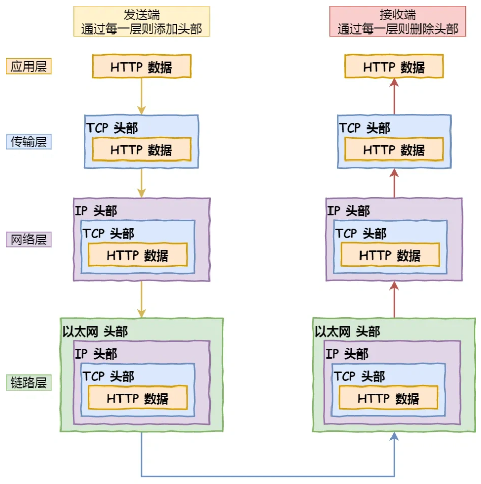

### 🌟HTTP 请求的过程与原理？

HTTP 是基于 TCP/IP 协议的应用层协议，它使用 TCP 作为传输层协议，通过建立 TCP 连接来传输数据。

HTTP 遵循标准的客户端-服务器模型，即「请求 - 应答」的模式：客户端发出建立连接的请求，然后等待服务器返回的响应，这个过程是同步的，也就是说，客户端在发送请求后必须等待服务器的响应，在等待响应的过程中，客户端不会发送其他请求。

具体过程：

- 在浏览器输入 URL 后，浏览器首先会通过 DNS 解析获取到服务器的 IP 地址，然后与服务器建立 TCP 连接。
- TCP 连接建立后，浏览器会向服务器发送 HTTP 请求。
- 服务器收到请求后，会根据请求的信息处理请求。
- 处理完请求后，服务器会返回一个 HTTP 响应给浏览器。
- 浏览器收到响应后，会根据响应的信息渲染页面。
- 然后，浏览器和服务器断开TCP连接或者复用连接。


### 怎么抓包

平常使用最多的就是浏览器自带的Network面板了，**可以看到请求的时间、请求的信息，以及响应信息**，更专业的有 Wireshark、Fiddler、Charles 等工具。

## HTTP

**HTTP是HyperText Transfer Protocol的缩写，中文名称叫超文本传输协议，它是一个在计算机世界里专门在「两点」之间「传输」文字、图片、音频、视频等「超文本」数据的「约定和规范」。**

### 说说HTTP常用的状态码及其含义？

HTTP 状态码用于表示服务器对请求的处理结果，可以分为 5 种：

- 1xx 类状态码属于提示信息，表示服务器收到请求需要进一步操作。

  - 100 Continue：服务器已收完请求头，客户端可继续发送请求体；
  - 101 Switching Protocols：应客户端 Upgrade 请求，服务器将切换协议

- 2xx 类状态码表示服务器成功处理了客户端的请求。
  - **「200 OK」**是最常见的成功状态码，表示一切正常。如果是非 `HEAD` 请求，服务器返回的响应头都会有Body数据。
  - 「**204 No Content**」也是常见的成功状态码，与 200 OK 基本相同，但响应头没有 body 数据。
  - 「**206 Partial Content**」是应用于 HTTP 分块下载或断点续传，表示响应返回的 body 数据并不是资源的全部，而是其中的一部分，也是服务器处理成功的状态。

- 3xx 类状态码表示重定向：客户端请求的资源发生了变动，需要客户端用新的URL重新发送请求获取资源。
  - 301（Moved Permanently）永久重定向：表示资源已永久迁移至新URL，旧URL应被废弃，并在`Location`字段中指定新URL。浏览器和搜索引擎会更新缓存，后续请求直接访问新URL。
  - **302（Found / Moved Temporarily）临时重定向**：表示资源**暂时**从其他URL提供，在`Location`字段中指定新URL，未来可能恢复原URL，但浏览器和搜索引擎不会缓存跳转关系。
  - 304（Not Modified，也称**缓存重定向**）：不具有跳转的含义，表示资源未修改，重定向已存在的缓冲文件，也就是告诉客户端可以继续使用缓存资源，用于缓存控制。

- 4xx 类状态码表示客户端发送报文错误，服务器无法处理。
  - 400 Bad Request：表示客户端请求的报文有错误，但只是个笼统的错误。
  - 403 Forbidden：表示服务器禁止访问资源，并不是客户端的请求出错。
  - 404 Not Found：无法找到此页面，或者访问的资源不存在
  - 405：请求的方法类型不支持；

- 5xx 类状态码表示客户端请求报文正确，但是**服务器处理时内部发生了错误**，属于服务器端的错误码。
  - 500 Internal Server Error：表示服务器内部出错，与 400 类型，是个笼统通用的错误码，服务器具体发生了什么错误，我们并不知道。
  - 501 Not Implemented：表示客户端请求的功能还不支持，类似“即将开业，敬请期待”的意思。
  - 503 Service Unavailable：表示服务器当前很忙，暂时无法响应客户端，类似“网络服务正忙，请稍后重试”的意思。

  - **502 Bad Gateway：作为网关或者代理工作的服务器尝试执行请求时，从上游服务器接收到无效的响应。**
  - **504 Gateway Time-out：作为网关或者代理工作的服务器尝试执行请求时，未能及时从上游服务器收到响应。**


> **举一个例子，假设 nginx 是代理服务器，收到客户端的请求后，将请求转发到后端服务器（tomcat 等）。**
>
> - **当 nginx 收到了无效的响应时，就返回502。**
> - **当 nginx 超过自己配置的超时时间，还没有收到请求时，就返回504错误。**

### HTTP 有哪些请求方式？

HTTP 协议定义了多种请求方式，用以指示请求的目的。常见的请求方式有 GET、POST、DELETE、PUT。

- **GET：用于向服务器获取指定的资源。应该只用于获取数据，并且是幂等的，即多次执行相同的 GET 请求应该返回相同的结果，并且不会改变资源的状态。**
- **HEAD：类似于 GET 请求，但只返回资源的头部信息，用于获取资源的元数据而不获取实际内容。可以用于检查资源是否存在，验证资源的更新时间等。**
- **POST：用于向服务器提交数据的请求，如提交表单或上传文件等，可能会创建新的资源或修改现有资源。数据被包含在请求体中。**
- **DELETE：用于请求删除服务器指定的资源。**
- **PUT：用于修改服务器指定的资源。如果指定的资源不存在，创建一个新资源。**
- **OPTIONS：预检请求，用于获取服务器支持的 HTTP 请求方法。通常用于跨域请求中的预检请求（CORS）。**
- CONNECT：建立一个到目标资源的隧道（通常用于 SSL/TLS 代理），用于在客户端和服务器之间进行加密的隧道传输。
- TRACE：回显服务器收到的请求，主要用于测试或诊断。但由于安全风险（可能暴露敏感信息），很多服务器会禁用 TRACE 请求。

> 在正确实现的条件下，GET、HEAD、PUT 和 DELETE 等方法都是幂等的，而 POST 方法不是

#### HTTP 的 GET 方法可以实现写操作吗?

**可以但是不推荐，因为 GET 请求的参数会直接暴露在 URL 中，这种特性极易被攻击者利用，从而引发严重安全风险。其中最典型的就是跨站请求伪造（CSRF）攻击，可能导致用户的敏感操作被恶意触发、数据被非授权篡改等问题，对系统安全性和用户数据隐私造成威胁。**

#### GET 的长度限制是多少？

**HTTP 的 GET 方法通过 URL 携带数据；URL 本身无长度上限，真正的限制来自浏览器对整条 URL（而非仅查询参数）的最大可解析长度。**

例如 IE 浏览器对 URL 的最大限制是 2000 多个字符，大概 2kb 左右，像 Chrome、Firefox 等浏览器支持的 URL 字符数更多，其中 FireFox 中 URL 的最大长度限制是 65536 个字符，**Chrome 则是 8192 个字符**。

#### 说⼀下 GET 和 POST 的区别？

传参方式不同：

- GET 请求主要用于从服务器获取指定的资源，请求携带数据的位置一般是写在 URL 中，URL 规定只能支持 ASCII，所以 GET 请求的参数只允许ASCII字符 ，而且浏览器会对 URL 的长度有限制（HTTP协议本身对 URL长度并没有做任何规定）
- POST 请求用于向服务器提交数据的请求，请求携带数据的位置一般是写在报文请求体中，请求体中的数据可以是任意格式的数据，只要客户端与服务端协商好即可，而且浏览器不会对请求体大小做限制，适合提交大量或敏感的数据

幂等性不同：

- GET请求是安全且幂等的，因为它是「只读」操作，无论操作多少次，每次的结果都是相同的，因此服务器上的数据都是安全的。
- POST 请求不是幂等的，可能会修改服务器上的资源，因此是不安全的。

可被缓存不同：

- 浏览器可以对 GET 请求的数据做缓存。

- 浏览器一般不会缓存 POST 请求，也不能把 POST 请求保存为书签。

### 说一下 HTTP 的报文结构？

HTTP 的报文结构分为：请求报文和响应报文

- 请求报文由请求行、请求头、空行和请求体组成，请求体是可选的。
- 响应报文由状态行、响应头、空行和响应体组成。

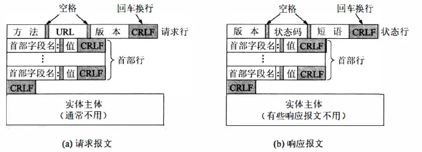

#### 说下 HTTP 的请求报文结构？

请求报文由请求行、请求头、空行和请求体组成。如下所示：

①、请求行包括请求方法、请求目标(URL或URI)和 HTTP 协议版本。例如：`GET /index.html HTTP/1.1`。

②、请求头包含请求的附加信息，如客户端想要接收的内容类型、浏览器类型、请求内容的范围等。例如：

- **`Host: www.javabetter.cn`，表示请求的主机名（域名）**
- **`Accept: text/html`，表示客户端可以接收的媒体类型**
- **`Range`：用于指定请求内容的范围，如断点续传时表示请求的字节范围。**
- `Accept-Encoding: gzip, deflate`：说明客户端可以接受哪些压缩格式的数据
- `User-Agent: Mozilla/5.0`，表示客户端的浏览器类型

③、请求头部和请求体之间有一个空行，表示请求头部结束。

④、请求体是可选的，通常用于POST请求等需要传输数据的情况。

```http
GET /index.html HTTP/1.1
Host: www.javabetter.cn
Accept: text/html
User-Agent: Mozilla/5.0 (Windows NT 10.0; Win64; x64) AppleWebKit/537.36 (KHTML, like Gecko) Chrome/58.0.3029.110 Safari/537.3
```

#### 说下 HTTP 响应报文结构？

响应报文由状态行、响应头、空行和响应体组成。如下所示：

①、状态行：包括 HTTP 协议的版本、状态码（如 200、404）和状态消息（如 OK、NotFound）。例如：`HTTP/1.0 200 OK`。

②、响应头：包含响应的附加信息，**如服务器类型、内容类型、内容长度、资源过期时间等**。也是键值对，例如：

- **`Content-Type: text/plain`，表示响应的内容类型**
- **`Content-Length: 137582`，表示响应的内容长度**
- `Expires: Thu, 05 Dec 1997 16:00:00 GMT`，表示资源的过期时间
- `Last-Modified: Wed, 5 August 1996 15:55:28 GMT`，表示资源的最后修改时间
- `Server: Apache 0.84`，表示服务器类型
- `Content-Encoding: gzip` ：表示响应的数据使用了什么压缩格式

③、空行：表示响应头部结束。

④、响应体：响应的具体内容，如 HTML 页面、JSON等。不是所有的响应都有消息正文，如 204 No Content 状态码的响应。

```http
HTTP/1.0 200 OK
Content-Type: text/plain
Content-Length: 137582
Expires: Thu, 05 Dec 1997 16:00:00 GMT
Last-Modified: Wed, 5 August 1996 15:55:28 GMT
Server: Apache 0.84
<html>
  <body>沉默王二很天真</body>
</html>
```

### URI 和 URL 有什么区别?

- URI：统一资源标识符(Uniform Resource Identifier)，标识的是 Web 上每一种可用的资源（如 HTML 文档、图像、视频片段、程序等），用于**唯一标识**互联网中某一资源的字符串，**它的核心功能是提供资源的身份证明**，类似于身份证号或书名ISBN。
- URL：统一资源定位符（Uniform Resource Location），它是 URI 的子集，**用于明确定位并访问资源的字符串（路径）**，它的核心功能是提供资源的路径。典型格式为：`协议://主机名:端口/路径?查询参数#片段`，例如： `https://www.example.com:443/search?q=URI#section2`

它们的主要区别在于，URL 除了提供了资源的标识，还提供了资源访问的方式，可用于指导直接获取资源。这么比喻，URI 像是身份证号，可以唯一标识一个人，而 URL 更像一个通信地址，可以通过 URL 找到这个人——人类住址协议://地球/中国/北京市/海淀区/xx 职业技术学院/14 号宿舍楼/525 号寝/张三.男。


### 说下 HTTP 1.0、1.1、2.0、3.0的区别？

**HTTP 1.0** 默认是短连接，HTTP 1.1 默认是长连接，HTTP 2.0 采用的**多路复用**。

#### 说下 HTTP1.0

- **无状态协议**：HTTP 1.0 是无状态的，每个请求之间相互独立，服务器不保存任何请求的状态信息。
- **非持久连接**：默认情况下，在每个 HTTP 请求/响应对之后，连接会被关闭，属于短连接。这意味着对于同一个网站的每个资源请求，如 HTML 页面上的图片和脚本，都需要建立一个新的 TCP 连接。

#### 说下 HTTP1.1

- **持久连接**：HTTP 1.1 引入了持久连接（也称为 HTTP keep-alive），默认情况下不会立即关闭连接，可以在一个连接上发送多个请求和响应，极大减轻了 TCP 连接的开销。HTTP/1.1 版本的默认连接都是长连接，但为了兼容老版本的 HTTP，需要指定 `Connection` 首部字段的值为 `Keep-Alive`。
- **管道网络传输**：HTTP 1.1 支持客户端在同一个TCP连接里可以在前一个请求的响应到达之前发送下一个请求，以提高传输效率。**但是服务器必须按照接收请求的顺序发送对这些管道化请求的响应。HTTP/1.1 管道可以解决请求的队头阻塞，但是没有解决响应的队头阻塞。实际上 HTTP/1.1 管道化技术不是默认开启，而且浏览器基本都没有支持。**

#### 说下 HTTP2.0

- **二进制协议**：**HTTP 2.0 使用二进制而不是文本格式来传输数据，解析更加高效**。头信息和数据体都是二进制，并且统称为帧（frame）：**头信息帧（Headers Frame）和数据帧（Data Frame）**。这样虽然对人不友好，但是对计算机非常友好，因为计算机只懂二进制，那么收到报文后，无需再将明文的报文转成二进制，而是直接解析二进制报文，这**增加了数据传输的效率**。
- **多路复用**：在同一个 TCP 连接上可以**并发传输多个 HTTP 请求/响应**，解决了 HTTP 1.x 的队头阻塞问题。
- **头部压缩**：HTTP 协议不带状态，所以每次请求都必须附上所有信息。HTTP 2.0 引入了头部压缩机制，可以使用 gzip 或 compress 压缩后再发送，减少了冗余头部信息的带宽消耗。HTTP/2 会**压缩头**（Header），如果你同时发出多个请求，他们的头是一样的或是相似的，那么，协议会帮你**消除重复的部分**。这就是所谓的 HPACK 算法：在客户端和服务器同时维护一张头信息表，所有字段都会存入这个表，生成一个索引号，以后就不发送同样字段了，只发送索引号，这样就**提高速度**了。
- **服务端推送**：HTTP/2 还在一定程度上改善了传统的「请求 - 应答」工作模式，服务器可以主动向客户端推送资源，而不需要客户端明确请求。

#### 说一下HTTP/3.0

HTTP/3.0 则基于 QUIC 协议，QUIC其实是Quick UDP Internet Connections的缩写，直译为快速UDP互联网连接。

- **彻底消除队头阻塞**：虽然 HTTP/2.0 在逻辑上支持多路复用，但底层依旧依赖 TCP，但在实际传输的过程中，数据还是要一帧一帧的发送和接收，一旦某个流的数据包丢失，整个连接上的后续帧都会被阻塞。QUIC 基于 UDP 实现多路复用，各个流的数据包独立发送与重传，真正做到了互不干扰。
- **更迅速的加密握手**：**QUIC 在连接建立阶段就完成了 TLS 加密协商**，将安全层和传输层合并，通常只需 1 RTT（往返时延）即可完成加密握手，大幅缩短了首次请求的延迟。

#### 目前使用最广泛的是哪个HTTP版本？HTTP1.1


> 1. [Java 面试指南（付费）](https://javabetter.cn/zhishixingqiu/mianshi.html)收录的华为面经同学 8 技术二面面试原题：HTTP 2.0 和 3.0 的区别
> 2. [Java 面试指南（付费）](https://javabetter.cn/zhishixingqiu/mianshi.html)收录的字节跳动面经同学 1 技术二面面试原题：目前使用最广泛的是哪个HTTP版本？

### HTTP 长连接了解吗？

**在 HTTP 中，长连接是指客户端和服务器之间在一次 HTTP 通信完成后，只要任意一端没有明确提出断开连接，则保持 TCP 连接状态，这种机制可以减少了频繁建立和关闭连接的开销。当然，如果某个 HTTP 长连接超过一定时间没有任何数据交互，服务端就会主动断开这个连接。**

在 HTTP/1.0 中，**可在请求或响应头中添加 `Connection: keep-alive`字段来启用长连接**；而在 HTTP/1.1 中，持久连接（Persistent Connection）默认开启，只有在指定 `Connection: close` 时才会关闭。开启了 HTTP Keep-Alive 机制后， 连接就不会中断，而是保持连接。当客户端发送另一个请求时，它会使用同一个连接，一直持续到客户端或服务器端提出断开连接。


> 1. [Java 面试指南（付费）](https://javabetter.cn/zhishixingqiu/mianshi.html)收录的腾讯面经同学 27 云后台技术一面面试原题：HTTP怎么保持长连接呢？

### HTTP1.1怎么对请求做拆包，具体来说怎么拆的？

在HTTP/1.1中，请求的拆包是通过"Content-Length"头字段来进行的，该字段指示了请求正文的长度，服务器可以根据该长度来正确接收和解析请求。

具体来说：

- 当客户端发送一个HTTP请求时，会在请求头中添加"Content-Length"字段，该字段的值表示请求正文的字节数。
- 服务器在接收到请求后，会根据"Content-Length"字段的值来确定请求的长度，并从请求中读取相应数量的字节，直到读取完整个请求内容。

**这种基于"Content-Length"字段的拆包机制可以确保服务器正确接收到完整的请求，避免了请求的丢失或截断问题。**


### HTTP断点重传是什么？

**断点续传是HTTP/1.1协议支持的特性，实现断点续传的功能，需要客户端记录下当前的下载进度，并在需要续传的时候通知服务端本次需要下载的内容片段。**


一个最简单的断点续传流程如下：

1. 客户端开始下载一个1024K的文件，服务端发送Accept-Ranges: bytes来告诉客户端，其支持带Range的请求
2. 假如客户端下载了其中512K时候网络突然断开了，过了一会网络可以了，客户端再下载时候，需要在HTTP头中申明本次需要续传的片段：`Range:bytes=512000-`，这个头通知服务端从文件的512K位置开始传输文件，直到文件内容结束
3. 服务端收到断点续传请求，从文件的512K位置开始传输，并且在HTTP头中增加：Content-Range:bytes 512000-/1024000,Content-Length: 512000。并且此时服务端返回的HTTP状态码应该是206 Partial Content。如果客户端传递过来的Range超过资源的大小,则响应416 Requested Range Not Satisfiable

通过上面流程可以看出：断点续传中4个HTTP头不可少的，**分别是Range头、Content-Range头、Accept-Ranges头、Content-Length头**。其中第一个Range头是客户端发过来的，后面3个头需要服务端发送给客户端。下面是它们的说明：

- **Accept-Ranges: bytes：**这个值声明了可被接受的每一个范围请求, 大多数情况下是字节数 bytes
- **Range: bytes=开始位置-结束位置：**Range是浏览器告知服务器所需分部分内容范围的消息头。
- `Content-Length`：表示发送的响应的正文的字节数

### 说说 HTTP 与 HTTPS 有哪些区别？四点

- HTTPS 是 HTTP 的增强版，在 HTTP 的基础上加入了 SSL/TLS 协议，确保数据在传输过程中是加密的。
  - HTTP 是超文本传输协议，信息是明文传输，存在安全风险的问题。HTTPS 则解决 HTTP 不安全的缺陷，在 TCP 和 HTTP 网络层之间加入了 SSL/TLS 安全协议，使得报文能够加密传输。
- HTTP 的默认端⼝号是 80，URL 以`http://`开头；HTTPS 的默认端⼝号是 443，URL 以`https://`开头。
- HTTP 连接建立相对简单， TCP 三次握手之后便可进行 HTTP 的报文传输；而 HTTPS 在 TCP 三次握手之后，还需进行 SSL/TLS 的握手过程，才可进入加密报文传输。
- HTTPS 协议需要向权威的数字证书认证机构（CA）申请数字证书，来保证服务器的身份是可信的。


### 为什么 HTTP 不安全？

 **HTTP 本身不具备任何加密、完整性校验或身份认证机制**，所有请求和响应都以明文形式在网络中传输，因此极易被第三方窃听、篡改或伪造，从而导致敏感信息泄露、数据篡改甚至中间人攻击。

### 为何要使用HTTPS？

HTTPS 在 HTTP 与 TCP 之间加入了 SSL/TLS 层，通过信息加密、校验机制和数字证书三大手段，全面抵御窃听、篡改和伪造风险，确保数据在传输过程中的机密性、完整性和服务器身份的可信性。

- 信息加密是指HTTPS使用**混合加密**的方式实现信息的**机密性**，解决了窃听的风险。
  - 非对称加密：服务器向客户端发送公钥，然后客户端用公钥加密自己的随机密钥，也就是会话密钥，发送给服务器，服务器用私钥解密，得到会话密钥。
  - 对称加密：双方用会话密钥加密通信内容。
- **摘要算法**（哈希函数）的方式来实现**完整性**，它能够为数据生成独一无二的「指纹」，指纹用于校验数据的完整性，解决了篡改的风险。
- 将服务器公钥放入到**数字证书**中，解决了冒充的风险，实现了服务器身份的**可信性**。客户端会通过数字证书来验证服务器的身份，数字证书由 CA 签发，包含了服务器的公钥、证书的颁发机构、证书的有效期等。


> 1. [Java 面试指南（付费）](https://javabetter.cn/zhishixingqiu/mianshi.html)收录的比亚迪面经同学 3 Java 技术一面面试原题：说一下 HTTP 的结构和 HTTPS 的原理
> 2. [Java 面试指南（付费）](https://javabetter.cn/zhishixingqiu/mianshi.html)收录的的腾讯面经同学 26 暑期实习微信支付面试原题：https的加密技术
> 3. [Java 面试指南（付费）](https://javabetter.cn/zhishixingqiu/mianshi.html)收录的美团面经同学 3 Java 后端技术一面面试原题：https相比http有什么区别 对称加密和非对称加密 ca证书验证
> 4. [Java 面试指南（付费）](https://javabetter.cn/zhishixingqiu/mianshi.html)收录的腾讯面经同学 27 云后台技术一面面试原题：HTTPS是什么？他解决了HTTP什么问题？
> 5. [Java 面试指南（付费）](https://javabetter.cn/zhishixingqiu/mianshi.html)收录的虾皮面经同学 13 一面面试原题：https使用过吗 怎么保证安全

### HTTPS是怎么建立连接的？HTTPS握手过程说一下

**HTTPS 的连接建立在 SSL/TLS 握手之上，其过程可以分为两个阶段：握手阶段和数据传输阶段。**

**传统的 TLS 握手基本都是使用 RSA 算法来实现密钥交换的，在将 TLS 证书部署服务端时，证书文件其实就是服务端的公钥，会在 TLS 握手阶段传递给客户端，而服务端的私钥则一直留在服务端，一定要确保私钥不能被窃取。**

在 RSA 密钥协商算法中，客户端会生成随机密钥，并使用服务端的公钥加密后再传给服务端。根据非对称加密算法，公钥加密的消息仅能通过私钥解密，这样服务端解密后，双方就得到了相同的密钥，再用它加密应用消息。

下面说一下详细的步骤：

①、**客户端向服务器发起加密通信请求**，也就是 ClientHello 请求。在这一步，客户端主要向服务器发送以下信息：

- **客户端支持的 TLS 协议版本**，如 TLS 1.2 版本。
- **客户端生产的随机数**（Client Random），后面用于生成「会话秘钥」条件之一。
- **客户端支持的密码套件列表**，如 RSA 加密算法。

②、**服务器接收到请求后，向客户端发出响应**，也就是 SeverHello。服务器回应的内容有如下内容：

- **确认 TLS 协议版本**，如果浏览器不支持，则关闭加密通信。
- **服务器生产的随机数**（Server Random），也是后面用于生产「会话秘钥」条件之一。
- **确认的密码套件列表**，如 RSA 加密算法。
- **服务器的数字证书**，包含了公钥、颁发机构等信息。

③、**客户端收到服务器的响应后，首先通过浏览器或者操作系统中的 CA 公钥，确认服务器的数字证书的真实性**。如果证书没有问题，客户端会**从数字证书中取出服务器的公钥**，**然后使用它加密报文，向服务器发送如下信息**：

- 一个随机数（pre-master key），称为预主密钥，该随机数会被服务器公钥加密。**这个随机数是整个握手阶段的第三个随机数，会发给服务端，所以这个随机数客户端和服务端都是一样的。**
- 加密通信算法改变通知，表示随后的信息都将用「会话秘钥」加密通信。
- 客户端握手结束通知，表示客户端的握手阶段已经结束。这一项同时把之前所有内容的发生的数据做个摘要，用来供服务端校验。

**服务器和客户端有了这三个随机数（Client Random、Server Random、pre-master key），接着就用双方协商的加密算法，各自生成本次通信的「会话秘钥」**。

④、**服务器收到客户端的第三个随机数（pre-master key）之后，通过协商的加密算法，计算出本次通信的「会话秘钥」**。然后，向客户端发送最后的信息：

- 加密通信算法改变通知，表示随后的信息都将用「会话秘钥」加密通信。
- 服务器握手结束通知，表示服务器的握手阶段已经结束。这一项同时把之前所有内容的发生的数据做个摘要，用来供客户端校验。

**至此，整个 TLS 的握手阶段全部结束。**

⑤、接下来，客户端与服务器进入加密通信，就完全是使用普通的 HTTP 协议，只不过用「会话秘钥」加密内容。

如果通信内容被截取，但由于没有会话密钥，所以无法解密。当通信结束后，连接会被关闭，会话密钥也会被销毁，下次通信会重新生成一个会话密钥。


> 补充：证书颁发机构（CA）用自身私钥加密服务器证书的哈希值，生成**数字签名**，客户端收到 Server Hello 后，客户端（浏览器）会用内置的 CA 公钥解密签名。

#### 对称加密与非对称加密有什么区别？

**对称加密**：指加密和解密使用同一密钥，优点是运算速度较快，缺点是如何安全将密钥传输给另一方。常见的对称加密算法有：DES、AES 等。

**非对称加密**：指的是加密和解密使用不同的密钥（即公钥和私钥）。公钥与私钥是成对存在的，如果用公钥对数据进行加密，只有对应的私钥才能解密。常见的非对称加密算法有RSA。

#### AES 和 RSA算法有什么区别？

- **AES**：采用对称加密的方式，其秘钥长度最长只有 256 个比特，加密和解密速度较快，易于硬件实现。由于是对称加密，通信双方在进行数据传输前需要获知加密密钥。
- **RSA**：采用非对称加密的方式，采用公钥进行加密，私钥解密的形式。其私钥长度一般较长，由于需要大数的乘幂求模等运算，其运算速度较慢，不合适大量数据文件加密。

#### HTTPS 会加密 URL 吗？

**HTTPS 通过 SSL/TLS 协议确保了客户端与服务器之间交换的数据被加密，这包括 HTTP 头部和正文。而 URL 是 HTTP 头部的一部分，因此这部分信息也是加密的，但因为涉及到 SSL 握手的过程，所以域名信息会被暴露出来**。

另外，完整的 URL 可能在 Web 服务器的日志中记录，这些日志可能是明文的。还有，URL 在浏览器历史记录中也是可见的。**因此，敏感信息永远不应该通过 URL 传递，即使是在使用 HTTPS 的情况下**。

#### HTTPS 是如何防范中间人的攻击？

中间人攻击（Man-in-the-Middle, MITM）是一种常见的网络安全威胁，攻击者可以在通信的两端插入自己，以窃取通信双方的信息，**核心原因是利用客户端和服务端缺乏相互认证机制，攻击者冒充服务器与客户端建立连接，冒充双方进行通信**。但得益于 HTTPS 的**加密和身份校验机制**，使得攻击者难以达到目的。一方面，**攻击者无法获取服务器的私钥**，导致无法正确解密客户端发送的加密数据；另一方面，**客户端严格的证书验证流程**，使得有漏洞或虚假的证书无处遁形，从而为安全通信保驾护航。

HTTPS 主要通过以下方式来防范中间人攻击：

- **加密机制** ：在 HTTPS 握手阶段，会运用非对称加密算法协商出对称加密密钥（会话密钥），此密钥用于后续通信数据的加密。由于攻击者难以获取到正确的密钥，即便截获加密数据，也很难成功解密，从而保护了数据的机密性。
- **身份校验机制** ：服务器需向权威的证书颁发机构（CA）申请数字证书，该证书内含服务器公钥等关键信息。当客户端与服务器建立连接时，服务器会将证书发送给客户端。客户端会对证书进行全面验证，包括检查证书是否在有效期内、颁发机构是否可信等。若验证无误，客户端将使用证书中的公钥加密通信数据并发送给服务器，服务器再利用对应的私钥进行解密。中间人攻击者很难伪造出得到 CA 签发的合法证书，所以其冒充服务器的行为很容易被客户端识破。一旦证书验证存在问题或失败，客户端会及时发出警告，甚至直接中止连接，有效阻止了中间人攻击的继续进行。

#### HTTPS怎么保证建立的信道是安全的？

主要通过 SSL/TLS 协议的多层次安全机制：

- **首先在握手阶段**，客户端和服务器使用得是非对称加密，生成的会话密钥只有服务器的私钥才能解密，而私钥只有服务器持有。
- **其次在数据传输阶段**，即使攻击者拦截了通信数据，没有会话密钥也无法解密。

#### HTTPS 能抓包吗？

可以，HTTPS 可以抓包，但因为通信内容是加密的，需要解密后才能查看。其原理是通过一个中间人，伪造服务器证书，并取得客户端的信任，然后将客户端的请求转发给服务器，将服务器的响应转发给客户端，完成中间人攻击。

常用的抓包工具有 Wireshark、Fiddler、Charles 等。

### 客户端怎么去校验证书的合法性？

首先，所有的证书都是由 CA 机构签发的，CA 机构是一个受信任的第三方机构，它会对证书的申请者进行身份验证，然后签发证书。CA 就像是网络世界的公安局，具有极高的可信度。

CA 签发证书的过程是非常严格的：

- 首先，CA 会把持有者的公钥、所有者、有效期、颁发者、用途等信息打成⼀个包，然后对这些信息进⾏ Hash 计算（摘要算法），得到⼀个 Hash 值；
- 然后 CA 会使⽤⾃⼰的私钥将该 Hash 值加密，⽣成数字签名Certificate Signature；
- 最后将数字签名Certificate Signature 添加在⽂件证书上，形成数字证书。

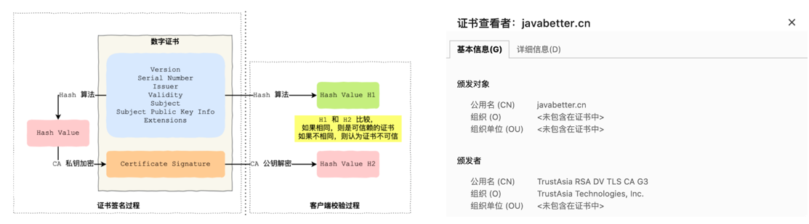

客户端（通常是浏览器，通常会集成 CA 的公钥信息）在校验证书的合法性时，主要通过以下步骤来校验证书的合法性。

- 浏览器会读取证书的所有者、有效期、颁发者、用途等信息，先校验网站域名是否一致，然后校验证书的有效期是否过期；
- 浏览器开始查找内置的 CA，与服务器返回证书中的颁发者进行对比，确认是否为合法机构；
- 如果是，从内部植入的 CA 公钥解密证书Certificate 的 签名Signature的内容，得到⼀个 Hash 值 H2；
- 使⽤同样的 Hash 算法获取证书的 Hash 值 H1，⽐较 H1 和 H2，如果值相同，则为可信赖的证书，否则告警。

**假如在 HTTPS 的通信过程中，中间人篡改了证书，但由于他没有 CA 机构的私钥，所以无法生成正确的 Signature，因此就无法通过校验。**

> 1. [Java 面试指南（付费）](https://javabetter.cn/zhishixingqiu/mianshi.html)收录的得物面经同学 1 面试原题：HTTPS，中间人伪造证书怎么办，伪造证书机构

### HTTP进行TCP连接之后，在什么情况下会中断？

- 当服务端或者客户端执行close系统调用的时候，会发送FIN报文，就会进行四次挥手的过程。
- 当发送方发送了数据之后，接收方超过一段时间没有响应ACK报文，发送方重传数据达到最大次数的时候，就会断开TCP连接。
- 当HTTP长时间没有进行请求和响应的时候，超过一定的时间，就会释放连接。

### 什么是Socket？

- TCP/IP（Transmission Control Protocol/Internet Protocol）即传输控制协议/网间协议，是一个工业标准的协议集，它是为广域网（WANs）设计的。UDP（User Data Protocol，用户数据报协议）是与TCP相对应的协议，它是属于TCP/IP协议族中的一种。下图展示了TCP/IP协议簇之间的关系：

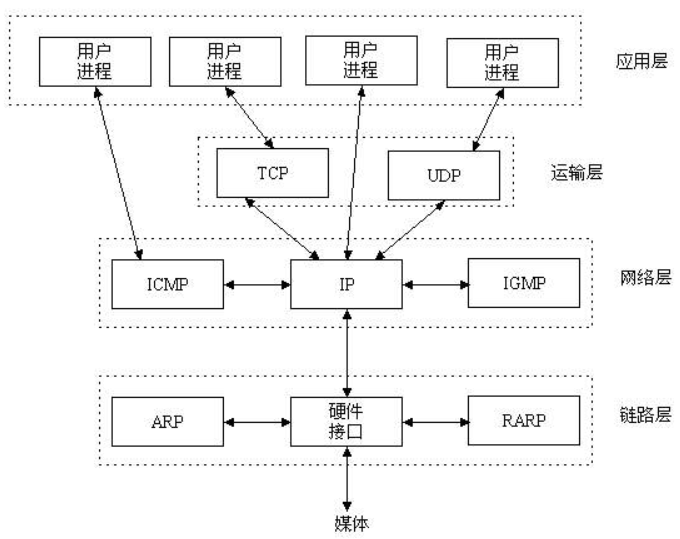

- **Socket是应用层与TCP/IP协议族通信的中间软件抽象层，它是一组接口，通过封装底层网络协议的复杂性操作**（如 TCP 的三次握手、数据分段校验、丢包重传等细节），**提供一组简洁的编程接口**（如 `socket()` 创建连接端点、`connect()` 发起请求、`send()/recv()` 收发数据、`bind()/listen()/accept()` 实现服务端监听与连接），**使开发者无需深入理解协议实现细节，即可高效完成跨主机的网络通信**。在设计模式中，Socket其实就是一个门面模式，它把复杂的TCP/IP协议族隐藏在Socket接口后面，对用户来说，一组简单的接口就是全部，让Socket去组织数据，以符合指定的协议。

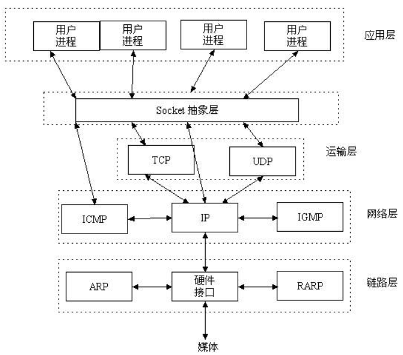

- **TCP Socket 通信的基本流程**：
  - 先从服务器端说起，服务器端首先调用 `socket()` 创建套接字，然后通过 `bind()` 将其绑定到指定端口，接着调用 `listen()` 开始监听，进入被动连接状态，并在此时使用 `accept()` 阻塞等待客户端发起连接；
  - 与此同时，客户端也调用 `socket()` 创建套接字，再通过 `connect()` 向服务器发起三次握手连接请求，若 `connect()` 成功返回，客户端与服务器端的连接即告建立。
  - 随后客户端通过 `send()` 或 `write()` 向服务器发送数据请求，服务器端在 `accept()` 返回的新套接字上调用 `recv()` 或 `read()` 接收并处理请求，处理完毕后再用 `send()` 将响应数据发送回客户端，客户端通过 `recv()` 读取响应内容；
  - 最后，双方各自调用 `close()` 关闭套接字，一次完整的交互便宣告结束。

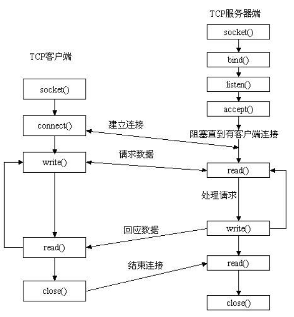

- https://blog.csdn.net/weixin_39258979/article/details/80835555

### HTTP、SOCKET和TCP的区别

- HTTP是一种用于传输超文本数据的应用层协议，定义了客户端和服务器之间交换数据的格式和规则，常用于在客户端和服务器之间传输和显示Web页面。
- Socket是应用层与TCP/IP协议族通信的**中间软件抽象层，它提供了一组网络通信的接口**，可实现不同计算机之间的数据交换。
- TCP是一种面向连接的、可靠的传输层协议，负责在通信的两端之间建立可靠的数据传输连接。

它们在网络通信中扮演不同的角色和层次。

## TCP

### 说一下 TCP报文格式？

**TCP 报文段主要由报文段头部（Header）和数据两部分组成，其中头部包含了确保数据可靠传输所需的各种控制信息**，比如说序列号、确认应答号、窗口大小、校验和等。


- **源端口号**（Source Port）：16 位（2 个字节），用于标识发送端的应用程序，**浏览器监听的端口（通常是随机生成的）**。
- **目标端口号**（Destination Port）：也是 16 位，用于标识接收端的应用程序。 **Web 服务器监听的端口（HTTP 默认端口号是 `80`， HTTPS 默认端口号是 `443`）**
- **序列号**（Sequence Number）：32 位，用于标识 TCP 发送的数据字节流中的每个字节的顺序。在连接建立时，计算机会生成一个随机初始序列号，通过 SYN 包传递给接收端，之后每发送一次数据，序列号就会根据发送的字节数递增，**确保数据按顺序接收，解决网络包乱序问题。**
- **确认应答号**（Acknowledgment Number）：32 位，当 ACK 标志被设置时，**它表示接收端期望收到的下一个数据的序列号**。发送端收到确认后，意味着所有序列号小于该应答号的数据已经被成功接收，**从而帮助解决丢包问题。**
- **数据偏移**（Data Offset）：4 位，表示 TCP 报文头部的长度，用于指示数据开始的位置。
- **保留**（Reserved）：6 位，为将来使用预留，目前必须置为 0。
- **控制位**（Flags）：共 6 位，包括 URG（紧急指针字段是否有效）、**ACK（确认应答字段是否有效）**、PSH（提示接收端应该尽快将这个报文段交给应用层）、**RST（重置连接）、SYN（同步序号，用于建立连接）、FIN（结束发送数据）**。
  - *ACK*：该位为 1 时，「确认应答」的字段变为有效，TCP 规定除了最初建立连接时的 SYN 包之外该位必须设置为 1 。
  - *SYN*：该位为 1 时，**表示希望建立连接**，并在其「序列号」的字段进行序列号初始值的设定。
  - *FIN*：该位为 1 时，**表示今后不会再有数据发送，希望断开连接**。当通信结束希望断开连接时，通信双方的主机之间就可以相互交换 FIN 位为 1 的 TCP 段。
  - *RST*：该位为 1 时，表示 TCP 连接中出现异常必须强制断开连接。
- **窗口大小**（Window）：16 位，用于流量控制，表示接收端还能接收的数据的字节数（基于接收缓冲区的大小）。
- **校验和**（Checksum）：16 位，覆盖整个 TCP 报文段（包括 TCP 头部、数据和一个伪头部）的校验和，用于检测数据在传输过程中的任何变化。
- **紧急指针**（Urgent Pointer）：16 位，只有当 URG 控制位被设置时才有效，指出在报文段中有紧急数据的位置。

### 🌟TCP的三次握手过程

TCP（传输控制协议）的三次握手是一种用于在两个主机之间建立可靠连接的过程。它在数据传输开始前完成时序同步，**目的是确认双方具备互相发送和接收数据的能力**，从而为后续通信提供保障。


一开始，客户端和服务端都处于 `CLOSE` 状态，先是服务端主动监听某个端口，处于 `LISTEN` 状态：

①、**第一次握手（客户端）是客户端首先向服务器发送一个TCP报文段，表示希望和服务器建立连接**，并告知服务器自己的初始序列号。客户端进入SYN_SENT 状态。这个报文段的头部中，SYN 位被设置为 1，表明这是一个连接请求；同时，客户端会生成一个随机的初始序列号（Sequence Number），假设为 x，发送给服务器。

②、**第二次握手是服务器在收到客户端的连接请求后，如果同意建立连接，它会发送一个应答 TCP 报文段给客户端**，并通知客户端自己的初始序列号。服务器进入 SYN_RCVD 状态。在这个报文段中，SYN 位和 ACK 位都被设置为 1；服务器也会生成一个随机的初始序列号，假设为 y，并将客户端的序列号加 1（即 x+1）作为确认应答号（Acknowledgment Number），发送给客户端。

**③、第三次握手是当客户端收到服务端的应答后，又向服务器发送一个确认应答报文，进行最终确认，至此完成三次握手，建立连接。客户端进入 ESTABLISHED 状态，当服务器接收到这个包时，也进入 ESTABLISHED 状态。**。这个 TCP 报文段的 ACK 位被设置为 1，确认号被设置为服务器序列号加 1（即 y+1），而自己的序列号是 x+1。这次报文可以携带客户端到服务端的数据。

从上面的过程可以发现**第三次握手是可以携带数据的，前两次握手是不可以携带数据的**，这也是面试常问的题。

#### 说说 SYN 的概念？

**SYN 是 TCP 协议中用于建立连接的标志位，其全称为 Synchronize Sequence Numbers，即同步序列编号**。该标志位出现在TCP三次握手过程中，客户端向服务器发送的第一个报文段会将SYN标志位置为1，同时携带一个初始序列号，这一过程开启了双方序列号的同步之旅，并为后续稳定、有序的数据传输奠定了基础。**它具备多方面的重要作用：**

- **SYN能确保双方的序列号实现同步，使后续的数据可以按照正确的顺序进行传输**，接收方能依据序列号去除重复数据，并按序接收数据包，同时发送方也可通过ACK报文中的序列号了解哪些数据已被对方成功接收。在 TCP 通信中，通信双方都需要维护一个序列号，序列号对于可靠传输起着关键作用。
- **可以有效避免旧的报文段被错误地识别为新连接的一部分**，从而保障了通信的准确性和可靠性。

#### TCP第三次握手可以携带数据吗？

第三次握手是可以携带数据的，因为客户端已经处于 ESTABLISHED 状态，对于客户端来说，它已经建立连接成功，并且确认服务端的接收和发送能力是正常的。

第一次握手不能携带数据是出于安全的考虑，因为如果允许携带数据，攻击者每次在 SYN 报文中携带大量数据，就会导致服务端消耗更多的时间和空间去处理这些报文，会造成 CPU 和内存的消耗。

### TCP 握手为什么是三次，为什么不能是两次？不能是四次？

TCP三次握手可以建立一个可靠的连接。这一过程的目的是确保双方都知道对方已准备好进行通信，并同步双方的序列号，从而保持数据包的顺序和完整性。

TCP 建立连接时，通过三次握手**能防止历史连接的建立，能帮助双方同步初始化序列号，能减少双方不必要的资源开销**。

三次握手的原因：

- **三次握手才可以阻止旧的重复连接初始化造成混乱（主要原因）**：因为在网络拥堵的情况下，SYN 报文还被网络阻塞了，服务并没有收到，因此客户端会重新生成一个SYN报文发送给服务端；旧的SYN报文比新的SYN报文早到达了服务器，那么此时服务端就会回一个 SYN + ACK 报文给客户端；客户端收到后，发现自己期望收到的确认号不一致，于是就会回 RST 报文；服务端收到 RST 报文后，就会释放连接；后续最新的 SYN 抵达了服务端后，客户端与服务端就可以正常的完成三次握手了。
  - **在两次握手的情况下，服务端没有中间状态给客户端来阻止历史连接，导致服务端可能建立一个历史连接，造成资源浪费**。
- **三次握手才可以同步双方的初始序列号**，序列号能够保证数据包不重复、不丢弃和按序传输。
  - 两次握手只保证了一方的初始序列号能被对方成功接收，没办法保证双方的初始序列号都能被确认接收。
  - 四次握手其实也能够可靠的同步双方的初始化序号，**但为了减少网络往返次数，提升连接建立效率，第二步和第三步可以优化成一步，所以就成了「三次握手」**。
- **三次握手才可以避免资源浪费**：如果只有「两次握手」，当客户端发生的 SYN 报文在网络中阻塞，客户端没有接收到 ACK 报文，就会重新发送 SYN ，**由于没有第三次握手，服务端不清楚客户端是否收到了自己回复的** **ACK** **报文，所以服务端每收到一个** **SYN** **就只能先主动建立一个连接**。如果客户端发送的 SYN 报文在网络中阻塞了，重复发送多次 SYN 报文，那么服务端在收到请求后就会**建立多个冗余的无效链接，造成不必要的资源浪费。**

#### 为什么 TCP 握手不能是两次？（把上面记住就行）

- 无法防止历史连接的建立，会造成双方资源的浪费：在两次握手的情况下，**服务端在收到 SYN 报文后就进入 ESTABLISHED 状态**，意味着这时可以给对方发送数据，但是**客户端此时还没有进入 ESTABLISHED 状态**，假设这次是历史连接，客户端判断到此次连接为历史连接，那么就会回 RST 报文来断开连接；而服务端在第一次握手的时候就进入 ESTABLISHED 状态，所以它可以发送数据的，但是它并不知道这个是历史连接，它只有在收到 RST 报文后，才会断开连接。
  - 两次握手建立 TCP 连接的场景下，服务端在向客户端发送数据前，并没有阻止掉历史连接，导致服务端建立了一个历史连接，又白白发送了数据，妥妥地浪费了服务端的资源。**三次握手之所以引入第三次 ACK，就是要让服务器在发送任何数据前，先收到客户端对自己 SYN-ACK 的确认，彻底排除历史连接，保证双方真正同步进入 ESTABLISHED，从而避免资源浪费。**


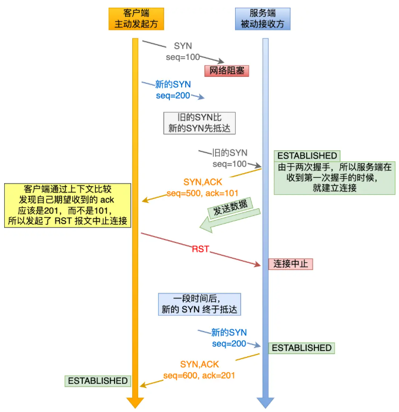

- **无法可靠的同步双方序列号**：两次握手只保证了一方的初始序列号能被对方成功接收，没办法保证双方的初始序列号都能被确认接收。

### 三次握手中每一次没收到报文会发生什么情况？

- 第一次握手服务端未收到 SYN 报文：导致客户端由于一段时间内没有收到服务端发来的确认报文，客户端会在等待一段时间后会重新发送 SYN 报文，如果仍然没有回应，会重复这个过程，直到发送次数超过最大重传次数限制，就会返回连接建立失败。


- 第二次握手客户端未收到服务端响应的 ACK 报文：
  - 客户端会继续重传SYN报文，直到超过最大重传次数的限制，再等待一段时间（时间为上一次超时时间的 2 倍），如果还是没能收到服务端的第二次握手（SYN-ACK 报文），那么客户端就会断开连接；
  - 服务端由于迟迟没有收到ACK报文，会重传携带SYN-ACK的报文，直到超过最大重传次数的限制，再等待一段时间（时间为上一次超时时间的 2 倍），如果还是没能收到客户端的第三次握手（ACK 报文），那么服务端就会断开连接。


- 第三次握手服务端未收到客户端发送过来的 ACK 报文，就会触发超时重传机制，重传 SYN-ACK 报文，直到收到第三次握手，或者达到最大重传次数。


> **ACK 报文是不会有重传的，当 ACK 丢失了，就由对方重传对应的报文**

#### 假设客户端重传了 SYN 报文，服务端这边又收到重复的 SYN 报文怎么办？

服务端会继续发送第二次握手报文。需要注意的是，这两次SYN报文的序列号都是一样的。

因为服务端在接收到第一次SYN后会记录这个连接的四元组以及相应的SYN，然后生成自己的SYN，并发送SYN-ACK，因为当服务端再次收到SYN报文的时候，服务端会重新进行比对SYN，发现重复，服务端会判断客户端没有收到自己的SYN-ACK报文，会重新进入第二次握手，发送SYN-ACK报文

#### 第二次握手传回了 ACK，为什么还要传回 SYN？

在 TCP 三次握手的第二步，服务器端需要同时发送两个标志位：

- **ACK**是用来确认服务端收到了客户端的 SYN 报文，告知客户端它的序列号已经被接收并认可。
- **SYN**是携带服务器端的初始序列号，告诉客户端服务端的后续数据通信应从哪个序号开始，为后续可靠传输建立序号基础。

### 第一次握手，客户端发送SYN报后，服务端回复ACK报文，那这个过程中服务端内部做了哪些工作？

TCP 进入三次握手前，服务端会从 **CLOSED** 状态变为 **LISTEN** 状态同时在内部创建了两个队列：半连接队列（SYN 队列）和全连接队列（ACCEPT 队列）。

服务端收到客户端发起的 SYN 请求后，**内核会把该连接存储到半连接队列**，并向客户端响应 SYN+ACK，接着客户端会返回 ACK，服务端收到第三次握手的 ACK 后，**内核会把连接从半连接队列移除，然后创建新的完全的连接，并将其添加到全连接队列(Accept队列)，等待进程调用 accept 函数时把连接从全连接队列里取出来。**

不管是半连接队列还是全连接队列，都有最大长度限制，超过限制时，内核会直接丢弃，或返回 RST 包。


### 三次握手和 accept 是什么关系？ accept 做了哪些事情？

TCP完成三次握手后，连接会被保存到内核的全连接队列，**当调用accept函数就是从全连接队列里面把连接取出来给用户程序使用。**

### 了解 TCP 半连接状态吗？

TCP 半连接指的是在 TCP 三次握手过程中，服务器接收到了客户端的 SYN 包，但还没有完成第三次握手，此时的连接处于一种未完全建立的状态。

如果服务器回复了 SYN-ACK，但客户端还没有回复 ACK，该连接将一直保留在半连接队列中，直到超时或被拒绝。

#### 说说半连接队列？

顾名思义，半连接队列存放的是三次握手未完成的连接，全连接队列存放的是完成三次握手的连接。

- TCP 三次握手时，客户端发送 SYN 到服务端，服务端收到之后，便回复 **ACK 和 SYN**，状态由 **LISTEN 变为 SYN_RCVD**，此时这个连接就被推入了 **SYN 队列**，即半连接队列。
- 当客户端回复 ACK, 服务端接收后，三次握手就完成了。这时连接会等待被具体的应用取走，在被取走之前，它被推入 ACCEPT 队列，即全连接队列。

#### 什么是泛洪攻击/SYN Flood ？服务端接收到大量SYN包会发生什么事情？

**泛洪攻击，又称 SYN Flood，也是一种典型的 DDos 攻击，也可以被称为TCP 半连接服务拒绝（half-open）攻击**。有可能会导致TCP 半连接队列打满，这样**当 TCP 半连接队列满了，后续再在收到 SYN 报文就会丢弃**，导致客户端无法和服务端建立连接。

具体来说，**攻击者在短时间内伪造大量不同的源 IP，并向目标服务器不断发送 SYN 报文**；服务器在收到每个 SYN 后都会回复 SYN-ACK，并在半连接队列中为该尚未完成三次握手的连接分配资源，**但由于源 IP 被伪造，服务器永远收不到客户端的最后一个 ACK**，**导致这些半连接长时间占据队列空间**。**当半连接队列被填满后**，服务器将无法接受新的连接请求，正常用户也就无法与服务器完成三次握手，从而造成拒绝服务。


#### 泛洪攻击有什么应对方案？

**主要有：增大 TCP 半连接队列长度、减少 SYN+ACK超时重传次数、开启SYN Cookies 功能 和 开启SYN Proxy 防火墙等。**

- **减少 SYN+ACK 重传次数**：当服务端受到 SYN 攻击时，就会有大量处于 SYN_REVC 状态的 TCP 连接，处于这个状态的 TCP 会重传 SYN+ACK ，当重传超过次数达到上限后，就会断开连接。那么针对 SYN 攻击的场景，我们可以减少 SYN-ACK 的重传次数，如果重发次数达到该参数上限仍未收到 ACK，内核就会关闭这个半连接，以加快处于 SYN_REVC 状态的 TCP 连接断开。
- **开启SYN Cookie功能**：
  - 服务器在收到客户端的 SYN 报文时，不再将该请求放入半连接队列，而是根据客户端的 IP、端口和初始序列号等信息，以及服务器端的秘密值，计算哈希生成一个 Cookie，并将其嵌入到返回的 SYN‑ACK 报文的序列号字段中；
  - 只有在收到客户端带有正确 Cookie 的 ACK 后，服务器才校验其合法性，匹配成功后再在 Accept 队列中分配资源并完成三次握手，否则直接丢弃，彻底避免伪造 SYN 请求填满队列。
  - 应用程序随后通过调用 `accept()` 接口，从 Accept 队列中获取已验证的连接。


- **开启SYN Proxy 防火墙**：它充当客户端和服务器之间的中介代理，当接收到客户端的 SYN 时，防火墙先与客户端完成一轮“三次握手”，确认请求真实有效后，再由防火墙向后端服务器发起新的 SYN 请求；只有在这两段握手都成功后，才在服务器端正式建立连接，保证服务器始终只面对合法的 TCP 连接请求。

### 🌟TCP 四次挥手的过程？

TCP 连接的断开过程被形象地概括为四次挥手：


**第一次挥手**：客户端主动调用关闭连接的函数，客户端向服务器发送一个FIN结束报文，表示客户端没有数据要发送了，但仍然可以接收数据。客户端进入 FIN-WAIT-1 状态。

- 当客户端（主动关闭方）调用 close 函数后，就会向服务端发送 FIN 报文，试图与服务端断开连接，此时客户端的连接进入到 `FIN_WAIT_1` 状态。正常情况下，如果能及时收到服务端（被动关闭方）的 ACK，则会很快变为 `FIN_WAIT2`状态。

**第二次挥手**：服务器接收到 FIN 报文后，向客户端发送一个 ACK 报文，确认已接收到客户端的 FIN 请求。服务器进入 CLOSE-WAIT 状态，客户端进入 FIN-WAIT-2 状态。

- 当服务端（被动关闭方）收到客户端（主动关闭方）的 FIN 报文后，内核会自动回复 ACK，同时连接处于 `CLOSE_WAIT` 状态，顾名思义，它表示等待应用进程调用 close 函数关闭连接。此时，内核是没有权利替代进程关闭连接，必须由进程主动调用 close 函数来触发服务端发送 FIN 报文。

**第三次挥手**：等服务器端处理完数据之后，服务器会再向客户端发送一个 FIN 报文，表示服务器也没有数据要发送了。服务器进入 LAST-ACK 状态。

- 服务端处于 CLOSE_WAIT 状态时，调用了 close 函数，内核就会发出 FIN 报文，同时连接进入 LAST_ACK 状态，等待客户端返回 ACK 来确认连接关闭。

**第四次挥手**：客户端接收到 FIN 报文后，向服务器发送一个 ACK 报文，确认已接收到服务器的 FIN 请求。客户端进入 TIME-WAIT 状态，等待一段时间以确保服务器接收到 ACK 报文。服务器接收到 ACK 报文后进入 CLOSED 状态。客户端在经过 2MSL 时间之后也进入 CLOSED 状态。

### TCP 挥手为什么需要四次呢？

**TCP 是全双工通信，可以双向传输数据**：一方在数据传送结束后发出连接释放的通知，待对方确认后进入半关闭状态；当另一方也没有数据再发送的时候，则发出连接释放通知，对方确认后就完全关闭了 TCP 连接。

1. 第一次挥手：客户端表示数据发送完成了，准备关闭，你确认一下。
2. 第二次挥手：服务端回话说 ok，我马上处理完数据，稍等。
3. 第三次挥手：服务端表示处理完了，可以关闭了。
4. 第四次挥手：客户端说好，进入 TIME_WAIT 状态，确保服务端关闭连接后，自己再关闭连接。

> 1. [Java 面试指南（付费）](https://javabetter.cn/zhishixingqiu/mianshi.html)收录的同学 30 腾讯音乐面试原题：tcp 的挥手为什么是四次，而不是三次呢？

### 为什么四次握手中间两次不能变成一次？

服务器收到客户端的 FIN 报文时，内核会马上回一个 ACK 应答报文，**但是服务端应用程序可能还有数据要发送，所以并不能马上发送 FIN 报文，而是将发送 FIN 报文的控制权交给服务端应用程序**：

- 如果服务端应用程序有数据要发送的话，就发完数据后，才调用关闭连接的函数；
- 如果服务端应用程序没有数据要发送的话，可以直接调用关闭连接的函数，

从上面过程可知，是否要发送第三次挥手的控制权不在内核，而是在被动关闭方的应用程序，因为应用程序可能还有数据要发送，由应用程序决定什么时候调用关闭连接的函数，当调用了关闭连接的函数，内核就会发送 FIN 报文了，所以服务端的 ACK 和 FIN 一般都会分开发送。

### 第二次和第三次挥手能合并嘛

当被动关闭方在 TCP 挥手过程中，「**没有数据要发送」并且「开启了 TCP 延迟确认机制」，那么第二和第三次挥手就会合并传输，这样就出现了三次挥手。**

### TCP四次挥手每一次挥手丢失了会发生什么？

- 第一次挥手丢失了：如果第一次挥手丢失了，那么客户端迟迟收不到被动方的 ACK 的话，**也就会触发超时重传机制，重传 FIN 报文**，当超过重发次数，就不再发送 FIN 报文，则会在等待一段时间（时间为上一次超时时间的 2 倍），如果还是没能收到第二次挥手，那么直接进入到 `close` 状态。

- 第二次挥手丢失了：ACK 报文是不会重传的，所以如果服务端的第二次挥手丢失了，客户端就会触发超时重传机制，重传 FIN 报文，直到收到服务端的第二次挥手，或者达到最大的重传次数。
- 第三次挥手丢失了：
  - 第三次挥手丢失了，服务端会重传第三次挥手报文，当重传次数达到了最大限制时，再等待一段时间（时间为上一次超时时间的 2 倍），如果还是没能收到客户端的第四次挥手（ACK报文），那么服务端就会断开连接。
  - 客户端因为是通过close函数关闭连接的，处于FIN_WAIT_2状态是有时长限制的，如果 tcp_fin_timeout 时间内还是没能收到服务端的第三次挥手（FIN 报文），那么客户端就会断开连接。
- 第四次挥手丢失了：
  - 第四次挥手丢失了，服务端会重传第三次挥手报文，当重传次数达到了最大限制时，再等待一段时间（时间为上一次超时时间的 2 倍），如果还是没能收到客户端的第四次挥手（ACK报文），那么服务端就会断开连接。
  - 客户端在收到第三次挥手后，就会进入 TIME_WAIT 状态，开启时长为 2MSL 的定时器，如果途中再次收到第三次挥手（FIN 报文）后，就会重置定时器，当等待 2MSL 时长后，客户端就会断开连接。

### 第三次挥手一直没发，会发生什么？

当主动关闭方收到 ACK 报文后，会处于 FIN_WAIT2 状态，就表示主动关闭方的发送通道已经关闭，接下来将等待对方发送 FIN 报文，关闭对方的发送通道。

- 如果连接是用 shutdown 函数关闭的，由于 shutdown 可选择性关闭发送或接收方向（而非完全终止连接），连接可能长期处于 FIN_WAIT2 状态 —— 因为此时它仍可能保留发送或接收数据的能力，需等待对方完成数据交互后发送 FIN。

- 但对于用 close 函数关闭的孤儿连接（即主动关闭方发送 FIN 并收到 ACK 后，始终未收到对方 FIN 的连接），由于此时主动关闭方已无法发送数据但仍可接收数据，这种状态不宜长期持续，而 tcp_fin_timeout 参数正用于控制该状态的持续时长，默认值为 60 秒：若 60 秒内仍未收到对方的 FIN 报文，连接会被强制关闭以释放资源。

### 第二次和第三次挥手之间，主动断开的那端能干什么

如果主动断开的一方，是**调用了 shutdown 函数来关闭连接**，并且只选择了关闭发送能力且**没有关闭接收能力的话**，那么主动断开的一方在第二次和第三次挥手之间**还可以接收数据**。


### TCP 四次挥手过程中，为什么需要等待 2MSL（报文段最长寿命）, 才进入 CLOSED 关闭状态？

MSL 是 Maximum Segment Lifetime，报⽂最⼤⽣存时间，**它是任何报⽂在⽹络上存在的最⻓时间**，通常为 30 秒到 2 分钟，超过这个时间报⽂将被丢弃。

可以看到 2MSL时长 这其实是相当于至少允许报文丢失一次。比如，若 ACK 在一个 MSL 内丢失，这样被动方重发的 FIN 会在第 2 个 MSL 内到达，TIME_WAIT 状态的连接可以应对。

具体来说：

在第四次挥手时，客户端发送给服务端的 ACK 有可能丢失，如果服务端因为某些原因而没有收到 ACK 的话，服务端就会重发 FIN，如果客户端在`2*MSL`的时间内收到了 FIN，就会重新发送 ACK 并再次等待 2MSL，防止服务端没有收到 ACK 而不断重发 FIN。

等待2MSL是因为⽹络中可能存在来⾃发送⽅的数据包，当这些发送⽅的数据包被接收⽅处理后⼜会向对⽅发送响应，所以⼀来⼀回需要等待 **2** 倍的时间。比如，如果被动关闭方没有收到主动断开连接方的最后的 ACK 报文，就会触发超时重发 FIN 报文，另一方接收到 FIN 后，会重发 ACK 给被动关闭方， 一来一去正好 2 个 MSL。

### TIME-WAIT状态有什么意义？

TIME-WAIT 状态主要发生在客户端与服务器通信的第四次挥手过程中，当客户端在发送 ACK 确认对方的 FIN 报文后，便会进入 TIME-WAIT 状态。

**其存在的意义有以下两方面：保证连接正确关闭、防止旧连接数据包干扰新连接**

- **保证连接正确关闭**：在 TIME-WAIT 状态下，客户端可以重新发送 ACK 确认报文，从而确保服务器接收到该确认并正常关闭连接。
  - 如果不设置这一状态，客户端发送的最后一个 ACK 报文段可能会丢失，导致处于 LAST-ACK 状态的服务器收不到确认，进而超时重传 FIN+ACK 报文段。而客户端在 TIME-WAIT 状态中，能在2倍的MSL时间内收到服务器重传的 FIN+ACK 报文段，接着重传确认报文并重新启动 2MSL 计时器。最终，客户端和服务器都能正常进入到 CLOSED 状态。

- **防止旧连接数据包干扰新连接**：客户端在发送完最后一个 ACK 报文段后，经过 2MSL 时间，使得本连接持续时间内所产生的所有报文段都从网络中消失，从而保证下一个连接中不会出现旧的连接请求报文段。

### TIME_WAIT状态过多会导致什么问题？怎么解决？

如果服务器有处于 TIME-WAIT 状态的 TCP，则说明是由服务器⽅主动发起的断开请求。

**TIME_WAIT 状态过多会导致以下问题：**

- 第⼀是内存资源占⽤；

- 第⼆是对端⼝资源的占⽤，⼀个 TCP 连接⾄少消耗⼀个本地端⼝；

**TIME_WAIT 状态过多会的原因：**

- **HTTP没有使用长连接**：这样在完成一次 HTTP 请求/处理后，就会关闭连接；**请求和响应的双方都可以主动关闭 TCP 连接。**不过，**根据大多数 Web 服务的实现，不管哪一方禁用了 HTTP Keep-Alive，都是由服务端主动关闭连接**，那么此时服务端上就会出现 TIME_WAIT 状态的连接。
  - 解决方案：客户端和服务器都需要开启长连接，可以使用长连接的方式来减少 TCP 的连接和断开。
  - **从 HTTP/1.1 开始， 就默认是开启了 Keep-Alive**，现在大多数浏览器都默认是使用 HTTP/1.1，所以 Keep-Alive 都是默认打开的。一旦客户端和服务端达成协议，那么长连接就建立好了。
- **HTTP长连接超时**：如果有大量的客户端建立完 TCP 连接后，很长一段时间没有发送数据，那么大概率就是因为 HTTP 长连接超时，导致服务端主动关闭连接，产生大量处于 TIME_WAIT 状态的连接。
  - 可以往网络问题的方向排查，比如是否是因为网络问题，导致客户端发送的数据一直没有被服务端接收到，以至于 HTTP 长连接超时。
- **HTTP长连接的请求数量达到上限**：Web 服务端通常会有个参数，来定义一条 HTTP 长连接上最大能处理的请求数量，当超过最大限制时，就会主动关闭连接。
  - 针对这个场景下，解决的方式也很简单，调大 nginx 的 keepalive_requests 参数就行：keepalive_requests 参数的默认值是 100 ，意味着每个 HTTP 长连接最多只能跑 100 次请求，这个参数往往被大多数人忽略，因为当 QPS (每秒请求数) 不是很高时，默认值 100 凑合够用。但是，**对于一些 QPS 比较高的场景，比如超过 10000 QPS，甚至达到 30000 , 50000 甚至更高，如果 keepalive_requests 参数值是 100，这时候就 nginx 就会很频繁地关闭连接，那么此时服务端上就会出大量的 TIME_WAIT 状态**。

### CLOSE-WAIT 状态有什么意义？

CLOSE-WAIT 状态就是为了**保证服务端在关闭连接之前将待发送的数据处理完**。因为服务端收到客户端关闭连接的请求并确认之后，就会进入 CLOSE-WAIT 状态，但是此时服务端可能还有一些数据没有传输完成，因此不能立即关闭连接。

### 保活计时器有什么用？

**TCP 的保活计时器主要作用是检测 TCP 连接是否仍然有效**。以下是其具体工作原理及作用：

- **工作原理** ：当服务器端收到客户端的数据时，会重新设置保活计时器，通常设置为 2 小时。若 2 小时后服务器未收到客户端的数据，便会发送一个探测报文段给客户端，之后每隔 75 秒发送一次。若连续发送 10 次探测报文段后仍未收到客户端的响应，服务器端就认为客户端出了故障，并关闭该连接。
- **作用** ：在客户端与服务器建立 TCP 连接后，若客户端出现故障，服务器端会一直处于等待状态，浪费资源，保活计时器通过发送探测报文段来检测客户端是否存活，避免服务器白白等待，及时释放资源。

需要注意的是，TCP 保活机制默认是关闭的，需手动配置启用，且其探测间隔较长，不适合实时性要求高的场景。在实际应用中，可以手动进行设置调整。

### 🌟说说 TCP 和 UDP 的区别？7点

**简单说：**

TCP 在数据传输前需建立连接，传输结束要断开连接，相关过程分别是 “三次握手” 与 “四次挥手”。

UDP 则无连接，发送数据前无需建立连接，发送完也不需断开，数据以数据报形式发送。

换句话说，TCP 是面向连接、可靠的传输层协议，依靠确认机制、重发机制等保障数据可靠传输。UDP 是无连接、不可靠的传输层协议，数据包存在丢失、重复、乱序的可能。

详细说：

- **是否面向连接**：TCP 是面向连接的传输层协议，数据传输前要通过三次握手建立连接，数据传输完成后要通过四次握手释放连接。UDP 无连接的传输层协议，传输数据前不需要建立连接，直接把数据包发送出去。
- **是否是可靠传输**：
  - TCP 提供可靠的数据传输服务。它通过序列号、确认应答 (ACK)、超时重传、流量控制、拥塞控制等一系列机制，来确保数据能够无差错、不丢失、不重复且按顺序地到达目的地。
  - UDP 是尽最大努力交付，但不保证数据一定能到达，也不保证到达的顺序，更不会自动重传。收到报文后，接收方也不会主动发确认。但是我们可以基于 UDP 传输协议实现一个可靠的传输协议，比如 QUIC 协议

- **通信方式**：TCP 只支持点对点 (Point-to-Point) 的单播通信。UDP 支持一对一 (单播)、一对多 (多播/Multicast) 和一对所有 (广播/Broadcast) 的通信方式。
- **首部/资源开销**：TCP 的头部至少需要 20 字节，如果包含选项字段，最多可达 60 字节。UDP 的头部非常简单，固定只有 8 字节。
- **数据传输形式**：
  - TCP 是面向字节流 (Byte Stream) 的协议：应用程序交付给 TCP 的数据会被视为连续的字节流，TCP 可根据网络状况（如 MSS 大小）对字节流进行拆分（发送时）或合并（接收时），不保留应用层消息的边界（需应用层自行定义消息分隔符）。
  - UDP 是面向报文 (Message Oriented) 的协议：应用程序交付的数据包（报文）会被 UDP 完整封装发送，既不拆分也不合并，严格保留应用层消息的边界（接收方收到的数据包与发送方发送的完全一致）。

- **分片机制**：
  - TCP 的分片发生在传输层，以 “最大报文段长度（MSS）” 为单位：若应用层数据超过 MSS，TCP 会在发送端将数据拆分为多个 TCP 段，每个段包含独立的序列号；接收端 TCP 会根据序列号重组完整数据，若某段丢失，仅需重传该丢失段，效率更高。
  - UDP 的分片发生在 IP 层，以 “最大传输单元（MTU）” 为单位：若 UDP 数据报长度超过 MTU，IP 层会将其拆分为多个 IP 分片；接收端需在 IP 层重组所有分片后才能交付给 UDP，若任一分片丢失，整个数据报都会失效，需应用层自行处理重传。

- **传输效率**：TCP 因为需要建立连接、发送确认、处理重传等，其开销较大，传输效率相对较低。UDP 结构简单，没有复杂的控制机制，开销小，传输效率更高，速度更快。

#### 说说 TCP 和 UDP 的应用场景？

- **TCP：** 适用于那些对数据准确性要求高于数据传输速度的场合。例如：网页浏览、电子邮件、文件传输（FTP）、远程控制、数据库链接。
- **UDP：** 适用于对速度要求高、可以容忍一定数据丢失的场合。例如：QQ 聊天、在线视频、网络语音电话、广播通信。容忍一定的数据丢失。

#### 你会如何设计QQ中的网络协议？

- 登陆功能采用TCP + SSL/TLS 协议来实现，因为要保障账号和密码的安全性。 TCP 协议是一种可靠的传输协议，能够保证数据的完整性，而 SSL/TLS 能够对通信进行加密，保证数据的安全性。
- 消息传递的实时性，如语音视频通话等，可以选择UDP 协议。UDP 的传输速度更快，对于实时性服务来说，速度是最重要的。

#### 如何保证消息的不丢失？

- 对于 TCP 协议来说，如果数据包在传输过程中丢失，TCP 协议会自动进行重传。

- 对于 UDP 协议来说，我们可以通过应用层的重传机制来保证消息的不丢失。当接收方收到消息后，返回一个确认信息给发送方，如果发送方在一定时间内没有收到确认信息，就重新发送消息。同时，每个消息都附带一个唯一的序列号，接收方根据序列号判断是否有消息丢失，如果发现序列号不连续，就可以要求发送方重新发送。这样还可以防止消息重复。当然了，消息持久化也很重要，可以将消息保存在服务器或者本地的数据库中，即使在网络中断或者其他异常情况下，也能从数据库中恢复消息。

> 1. [Java 面试指南（付费）](https://javabetter.cn/zhishixingqiu/mianshi.html)收录的华为一面原题：说下 TCP 和 UDP 的区别？
> 2. [Java 面试指南（付费）](https://javabetter.cn/zhishixingqiu/mianshi.html)收录的奇安信面经同学 1 Java 技术一面面试原题：tcp 和 udp 的区别？QQ 用的协议？它如何保证消息的不丢失？
> 3. [Java 面试指南（付费）](https://javabetter.cn/zhishixingqiu/mianshi.html)收录的招商银行面经同学 6 招银网络科技面试原题：UDP和TCP的区别？
> 4. [Java 面试指南（付费）](https://javabetter.cn/zhishixingqiu/mianshi.html)收录的得物面经同学 9 面试题目原题：介绍一下计网里面的tcp和udp协议

### 🌟TCP 为什么可靠？7条

**TCP 首先通过三次握手来保证连接的可靠性（连接管理），然后通过校验和、序列号、确认应答、超时重传、流量控制、拥塞控制等机制来保证数据的可靠传输。**

**①、连接管理：首先通过三次握手来保证连接的可靠性**

②、**校验和**：TCP 报文段包括一个校验和字段，用于检测报文段在传输过程中的变化。如果接收方检测到校验和错误，就会丢弃这个报文段。


③、**序列号**：TCP 将数据分成多个小段，每段数据都有唯一的序列号：能够保证可靠性，既能防止数据丢失，又能避免数据重复；能够保证有序性，按照序列号顺序进行数据包还原；能够提高效率，基于序列号可实现多次发送，一次确认。


④、**确认应答**：接收方接收数据之后，会回传ACK报文，报文中带有此次确认的序列号，用于告知发送方此次接收数据的情况。在指定时间后，若发送端仍未收到确认应答，就会启动超时重传。

⑤、**超时重传**：超时重传主要有两种场景：

- 数据包丢失：在指定时间后，若发送端仍未收到确认应答，就会启动超时重传，向接收端重新发送数据包。
- 确认包丢失：当接收端收到重复数据(通过序列号进行识别)时将其丢弃，并重新回传ACK报文。

⑥、**流量控制**：接收方会发送窗口大小告诉发送方它的接收能力。发送方会根据窗口大小调整发送速度，避免网络拥塞。

接收端处理数据的速度是有限的，如果发送方发送数据的速度过快，就会导致接收端的缓冲区溢出，进而导致丢包。为了避免上述情况的发生，TCP支持根据接收端的处理能力，来决定发送端的发送速度。这就是流量控制。流量控制是通过在TCP报文段首部维护一个滑动窗口来实现的。

⑦、**拥塞控制**：TCP 会采用慢启动的策略，一开始发的少，然后逐步增加，当检测到网络拥塞时，发送端会减少数据发送。在网络拥塞缓解后，传输速率也会自动恢复。拥塞控制是通过发送端维护一个拥塞窗口来实现的。可以得出，发送端的发送速度，受限于滑动窗口和拥塞窗口中的最小值。拥塞控制方法分为：慢开始，拥塞避免、快重传和快恢复。

> 1. [Java 面试指南（付费）](https://javabetter.cn/zhishixingqiu/mianshi.html)收录的虾皮面经同学 13 一面面试原题：tcp为什么是可靠的
> 2. [Java 面试指南（付费）](https://javabetter.cn/zhishixingqiu/mianshi.html)收录的同学 30 腾讯音乐面试原题：那个Tcp 是如何保证这个安全传输的呢？

### 🌟说说TCP的粘包和拆包？

**由于TCP 是面向字节流的传输协议，只负责把连续字节送达，不主动划分 “数据包” 边界，对应用层的消息的边界一无所知**，若应用层未做特殊处理，接收方就可能无法正确识别发送方的 “单个消息”，从而出现 “粘包” 或 “拆包”。

- 发送方**多次发送的 “独立小消息”**，在接收方被合并成 “一个连续的字节块” 接收，导致多个消息的边界模糊，无法区分，这种现象就是 “粘包”。
- 发送方**一次发送的 “大消息”**，因超过 TCP 或网络的传输限制，被 TCP 拆分成多个 “小 TCP 段” 传输，接收方需要多次读取才能拼接出完整的原始消息，这种现象就是 “拆包”。


- **产生粘包和拆包的原因**：
  - **粘包原因**
    - **TCP 的 Nagle 算法优化**：为减少网络小数据包数量（降低网络开销），TCP 会默认开启 Nagle 算法 —— 当发送方连续发送多个 “小字节数据”（如每次发 10 字节）时，TCP 会暂存这些数据，等待一定时间或积累到足够大小后，合并成一个 TCP 段发送，导致接收方一次收到多个消息的合并数据。
      - **发送数据小于发送缓冲区** ：要发送的数据小于 TCP 发送缓冲区的大小，TCP 会将多次写入缓冲区的数据一次发送出去，从而发生粘包。
    - **接收方缓冲区未及时读取** ：接收数据端的应用层没有及时读取接收缓冲区中的数据，会导致数据堆积，进而产生粘包。

  - **拆包原因**
    - **发送数据超过发送缓冲区剩余空间** ：要发送的数据大于 TCP 发送缓冲区剩余空间大小，会将数据拆分成多个包发送。
    - **发送数据超过TCP最大报文段长度MSS** ：若发送方一次发送的数据超过 MSS，TCP 会自动将其拆分为多个不超过 MSS 的 TCP 段，分开发送。MSS 是 TCP 段的最大数据部分长度（= 网络层 MTU 最大传输单元 - IP 头部长度 - TCP 头部长度，默认通常为 1460 字节）。

- **解决 TCP 粘包和拆包的方法**：
  - **在数据尾部增加特殊字符进行分割** ：我们可以在两个用户消息之间插入一个特殊的字符串，接收方在接收数据时，读到了这个特殊字符，就认为已经读完一个完整的消息。**比如HTTP 协议通过设置回车符、换行符作为 HTTP header 的边界，通过 Content-Length 字段作为 HTTP body 的边界，这两个方式都是为了解决“粘包”的问题**。需注意，作为边界点的特殊字符若在消息内容里出现，要进行转义，避免被接收方当作消息的边界点解析到无效数据。

  - **自定义消息结构** ：自定义一个消息结构，由包头和数据组成，其中包头是固定大小的，且包头里有一个字段来声明紧随其后的数据有多大。例如定义一个消息结构体，先用 4 个字节大小的变量表示数据长度，真正的数据则在后面。接收方接收到包头大小后，解析包头内容，便可知道数据的长度，然后继续读取数据，直到读满数据长度，即可组装成一个完整的用户消息来处理。

  - **发送端将每个数据包封装为固定长度** ：这种方式是规定每个用户消息的长度是固定的，例如规定一个消息的长度是 64 个字节，当接收方接满 64 个字节，就认为这是一个完整且有效的消息。不过这种方式灵活性不高，实际中很少用。

### 了解 Nagle 算法和延迟确认吗？

> **Nagle 算法和延迟确认是干什么的？**

当我们 TCP 报⽂承载的数据⾮常⼩的时候，例如⼏个字节，那么整个⽹络的效率是很低的，因为每个 TCP 报⽂中都会有 20 个字节的 TCP 头部，也会有 20 个字节的 IP 头部，⽽数据只有⼏个字节，所以在整个报⽂中有效数据占有的比例就会⾮常低。这就好像快递员开着⼤货⻋送⼀个⼩包裹⼀样浪费。

那么就出现了常⻅的两种策略，来减少⼩报⽂的传输，分别是：

- Nagle算法
- 延迟确认


> **Nagle 算法**

Nagle 算法：**任意时刻，最多只能有一个未被确认的小段**。所谓 “小段”，指的是小于 MSS 尺寸的数据块，所谓 “未被确认”，是指一个数据块发送出去后，没有收到对方发送的 ACK 确认该数据已收到。

Nagle 算法的策略：

- 没有已发送未确认报⽂时，⽴刻发送数据。
- 存在未确认报⽂时，直到「没有已发送未确认报⽂」或「数据⻓度达到 MSS ⼤⼩」时，再发送数据。

只要没满⾜上⾯条件中的⼀条，发送⽅⼀直在囤积数据，直到满⾜上⾯的发送条件。

> **延迟确认**

事实上当没有携带数据的 ACK，它的⽹络效率也是很低的，因为它也有 40 个字节的 IP 头 和 TCP 头，但却没有携带数据报⽂。

为了解决 ACK 传输效率低问题，所以就衍⽣出了 **TCP** 延迟确认。

TCP 延迟确认的策略：

- 当有响应数据要发送时，ACK 会随着响应数据⼀起⽴刻发送给对⽅
- 当没有响应数据要发送时，ACK 将会延迟⼀段时间，以等待是否有响应数据可以⼀起发送
- 如果在延迟等待发送 ACK 期间，对⽅的第⼆个数据报⽂⼜到达了，这时就会⽴刻发送 ACK

一般情况下，**Nagle 算法和延迟确认**不能一起使用，**Nagle 算法**意味着延迟发，**延迟确认**意味着延迟接收，两个凑在一起就会造成更大的延迟，会产生性能问题。

### 🌟说说TCP的滑动窗口？

TCP 发送一个数据，如果需要收到确认应答，才会发送下一个数据，这样效率会比较低。

为了解决这个问题，TCP 引入了**窗口**，它是操作系统开辟的一个缓存空间。窗口大小的值表示无需等待确认应答，却还可以继续发送数据的最大值。

TCP 头部有个字段叫window，也即那个 **16 位的窗口大小**，它告诉对方本端的 TCP 接收缓冲区还能容纳多少字节的数据（发送窗口和接收窗口用字节作为单位），这样对方就可以控制发送数据的速度，从而达到**流量控制**的目的。

**TCP 滑动窗口分为两种：发送窗口和接收窗口**

**发送端的滑动窗口**包含四大部分，如下：

- 已发送且已收到 ACK 确认
- 已发送但未收到 ACK 确认
- 未发送但可以发送
- 未发送也不可以发送


- 深蓝色框里就是发送窗口。
- SND.WND: 表示发送窗口的大小, 上图虚线框的格子数是 10 个，即发送窗口大小是 10。
- SND.NXT：下一个发送的位置，它指向未发送但可以发送的第一个字节的序列号。
- SND.UNA：一个绝对指针，它指向的是已发送但未确认的第一个字节的序列号。

接收方的滑动窗口包含三大部分，如下：

- 已成功接收并确认
- 未收到数据但可以接收
- 未收到数据并不可以接收的数据


- 蓝色框内，就是接收窗口。
- REV.WND: 表示接收窗口的大小, 上图虚线框的格子就是 9 个。
- REV.NXT: 下一个接收的位置，它指向未收到但可以接收的第一个字节的序列号。

### 🌟说说 TCP 的流量控制？

TCP 提供了一种机制，可以让发送端根据接收端的实际接收能力控制发送的数据量，这就是**流量控制**，TCP 通过**滑动窗口**来实现流量控制的，我们看下简要流程：

- 首先双方三次握手，初始化各自的窗口大小，均为 400 个字节。


- 假如当前发送方给接收方发送了 200 个字节，那么，发送方的`SND.NXT`会右移 200 个字节，也就是说当前的可用窗口减少了 200 个字节。
- 接受方收到后，放到缓冲队列里面，REV.WND =400-200=200 字节，所以 win=200 字节返回给发送方。接收方会在 ACK 的报文首部带上缩小后的滑动窗口 200 字节
- 发送方又发送 200 字节过来，200 字节到达，继续放到缓冲队列。不过这时候，由于大量负载的原因，接受方处理不了这么多字节，只能处理 100 字节，剩余的 100 字节继续放到缓冲队列。这时候，REV.WND = 400-200-100=100 字节，即 win=100 返回发送方。
- 发送方继续发送 100 字节过来，这时候，接收窗口 win 变为 0。
- 发送方停止发送，开启一个定时任务，每隔一段时间，就去询问接受方，直到 win 大于 0，才继续开始发送。

### 🌟说说 TCP 的拥塞控制？

#### 什么是拥塞控制？

**流量控制是为了避免发送⽅的数据填满接收⽅的缓存，却无法对整个网络的负载情况做出调节**。由于网络资源（如设备间的链路带宽、中间路由器的转发端口与缓存）是多台主机共享的，当多台主机同时发送大量数据时，这些数据需要通过同一段链路（如局域网出口、骨干网链路）或依赖同一台路由器转发，总数据量就可能超过链路的承载上限，或耗尽路由器的缓存与转发能力，此时便会出现网络拥堵（Congestion），一旦发生拥塞，继续发送的数据包不仅会造成更高的延时和丢包率，还会触发 TCP 的重传机制，进而进一步加重网络负担，形成恶性循环。

**因此，TCP 引入了拥塞控制机制：通过为发送方维护一个拥塞窗口（cwnd），用来表示发送方向网络发送的数据的量的上限，当网络出现拥塞时，TCP 会主动缩小该窗口以降低发送速率，避免发送方的数据充斥整个网络，并动态调节待发送的数据量。**

#### 什么是拥塞窗⼝？和发送窗⼝有什么关系呢？

- 拥塞窗⼝ **cwnd**是发送⽅维护的⼀个的状态变量，它会根据⽹络的拥塞程度动态变化的。
  - 拥塞窗⼝ cwnd 变化的规则：只要⽹络中没有出现拥塞， cwnd 就会增⼤；但⽹络中出现了拥塞， cwnd 就减少；


- 发送窗⼝ swnd 和接收窗⼝ rwnd 是约等于的关系，那么由于加⼊了拥塞窗⼝的概念后，此时发送窗⼝的值是 swnd = min(cwnd, rwnd)，也就是拥塞窗⼝和接收窗⼝中的最⼩值。

> 补充：
>
> - 初始时，接收窗口的大小约等于接收方缓存的总大小（因为连接刚建立时接收缓存无暂存数据，空闲空间即缓存总容量），但发送窗口的初始大小由拥塞窗口（cwnd）与接收窗口（rwnd）的最小值决定
> - 拥塞窗口 cwnd 的计数单位）通常以TCP 报文段（Segment）的数量为核心单位。TCP 传输数据的基本单元是报文段（每个报文段包含 TCP 头部 + 应用层数据），其数据部分的最大长度由 MSS（最大报文段长度，默认通常为 1460 字节左右）限制。因此，拥塞窗口为N，对应的实际字节量约为 N × MSS（需扣除 TCP 头部字节，但核心数据量按 MSS 估算）。
>   - 比如慢启动阶段拥塞窗口cwnd 从 1 开始指数增长，指的是初始只能发 1 个报文段（约 1460 字节数据），收到确认后能发 2 个（约 2920 字节），再确认后能发 4 个（约 5840 字节）

#### 拥塞控制有哪些常用算法？

拥塞控制主要有这几种常用算法：

- 慢启动
- 拥塞避免
- 拥塞发生
- 快速恢复

**简单来说：**

TCP 通过动态调整拥塞窗口（cwnd）来实现拥塞控制，主要包括四个阶段：

- **TCP刚建立连接时，采用慢启动算法**，即当发送的数据包没出现丢包，每收到一个ACK，cwnd 以指数方式增长，直到达到慢启动阈值（ssthresh）；

- 接着进入**拥塞避免阶段**，每经过一个RTT（往返时间），拥塞窗口cwnd大小改为线性增长，平稳利用贷款，减少网络压力；
- 当检测到丢包时，说明网络可能拥堵，分两种情况处理：
  - 若**超时重传**，即超过 RTO 未收到 ACK，将慢启动阈值ssthresh 设为当前 拥塞窗口cwnd 的一半，cwnd 重置为 1 重新慢启动。
  - 若收到**3 个重复 ACK**（说明中间包丢失但后续包已到），触发快速重传，同时将慢启动阈值ssthresh 设为当前 cwnd 的一半，cwnd 直接设为 ssthresh 后进入快速恢复，拥塞窗口cwnd以线性增长继续发送，避免过度降低速率。

**详细来说：**

> 慢启动算法

- **慢启动算法：TCP 建立连接完成后，为探测网络拥塞程度，不是一开始发送大量数据，而是从较小数据量开始，由小到大逐渐增加拥塞窗口（cwnd）大小。若发送的数据未出现丢包，每收到一个 ACK，就将拥塞窗口 cwnd 大小以指数增长，初始大小为1（单位：MSS）；若出现丢包，拥塞窗口cwnd 减半，进入拥塞避免阶段。** 可以看出慢启动算法，发包的个数是**指数性的增长**。

- 举例说明：假定拥塞窗口 cwnd 和发送窗口 swnd 相等

  - 连接建⽴完成后，⼀开始初始化 cwnd = 1 ，表示可以传⼀个 MSS ⼤⼩的数据。

  - 当收到⼀个 ACK 确认应答后，cwnd 增加 1，于是⼀次能够发送 2 个

  - 当收到 2 个的 ACK 确认应答后， cwnd 增加 2，于是就可以⽐之前多发 2 个，所以这⼀次能够发送 4 个

  - 当这 4 个的 ACK 确认到来的时候，每个确认 cwnd 增加 1， 4 个确认 cwnd 增加 4，于是就可以⽐之前多发 4 个，所以这⼀次能够发送 8 个。


- 为了防止 cwnd 增长过大引起网络拥塞，还需设置一个**慢启动阀值 ssthresh**（slow start threshold）状态变量。
  - 当 cwnd < ssthresh 时，使用慢启动算法。
  - 当 **cwnd >= ssthresh** 时，进入了**拥塞避免**算法。

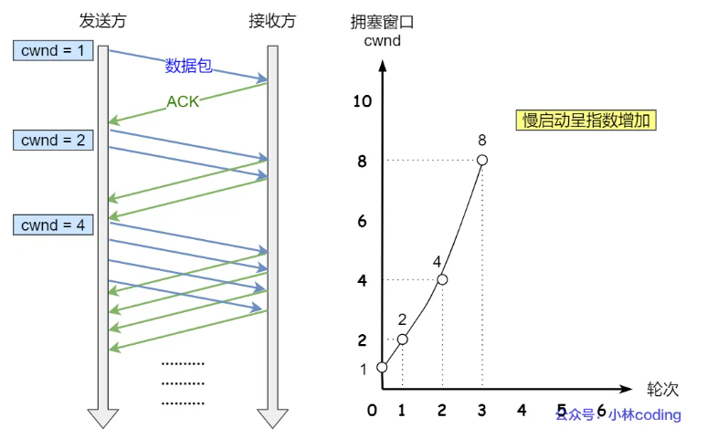


> 拥塞避免算法

前面说道，当拥塞窗口 cwnd 「超过」慢启动门限 ssthresh 就会进入拥塞避免算法。

一般来说，慢启动阀值 ssthresh 是 65535 字节，那么进入拥塞避免算法后，它的规则是当拥塞窗口`cwnd`到达**慢启动阀值**后：

- 每收到一个 ACK 时，cwnd 增加 `1/cwnd`，即`cwnd = cwnd + 1/cwnd`
- 当每过一个 RTT 时，cwnd = cwnd + 1

接上前面的慢启动的栗子，现假定 ssthresh 为 8：

- 当 8 个 ACK 应答确认到来时，每个确认增加 1/8，8 个 ACK 确认 cwnd 一共增加 1，于是这一次能够发送 9 个 MSS 大小的数据，变成了**线性增长。**

此时拥塞避免算法就是将原本慢启动算法的指数增长变成了线性增长，还是增长阶段，但是增长速度缓慢了一些。

就这么一直增长着后，网络就会慢慢进入了拥塞的状况了，于是就会出现丢包现象，这时就需要对丢失的数据包进行重传。

当触发了重传机制，也就进入了「拥塞发生算法」。


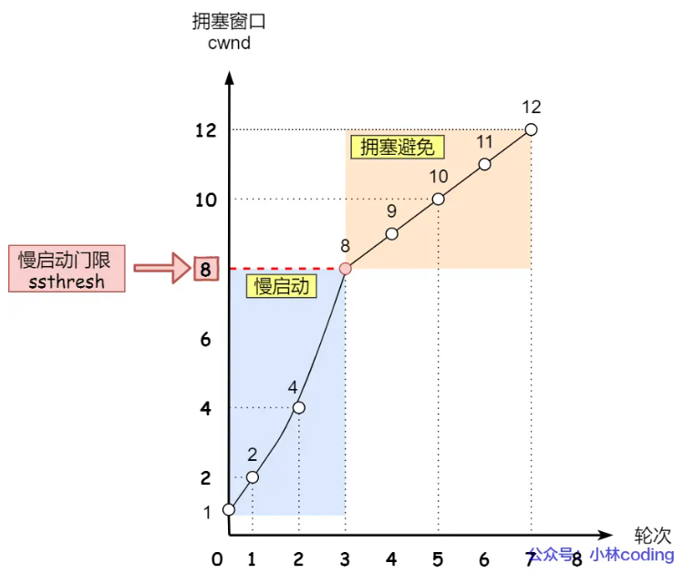

> 拥塞发生

当网络出现拥塞导致数据包重传时，TCP 主要采用以下两种机制：

**超时重传**

- **工作原理** ：当发送方在 RTO（重传超时时间）内未收到接收方的确认应答（ACK），则认为发生丢包，触发超时重传。
- **拥塞控制算法** ：
  - 将慢启动阀值`sshthresh`设置为当前拥塞窗口`cwnd`的一半（`sshthresh = cwnd / 2`）
  - 将`cwnd`重置为 1
  - 重新开始慢启动。
- 这种方式相当于发送数据量突然大幅减少，类似于“回到解放前”，过于激进，容易造成网络卡顿。

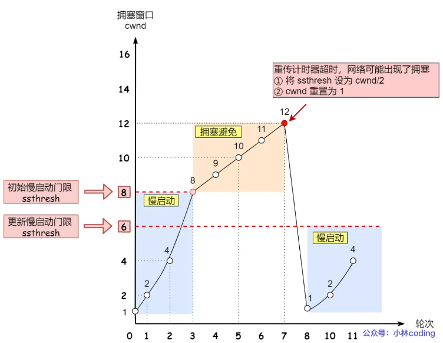

**快速重传**

- **工作原理** ：当接收方发现丢了一个中间包的时候，会发送三次重复的 ACK（对前一个包的 ACK）。发送方收到三个重复的 ACK 后，立即重传丢失的数据包，而无需等待 RTO 超时再重传。
- **拥塞控制算法** ：认为丢包情况不严重，只需调整发送策略。
  - 将拥塞窗口大小设置为原来的一半（`cwnd = cwnd / 2`）
  - 慢启动阀值设为当前拥塞窗口大小（`ssthresh = cwnd`），
  - 然后进入快速恢复算法阶段。
- **这种方式相比 RTO 超时重传更为温和，对网络的冲击也较小。**

> 快速恢复

快速重传和快速恢复算法一般同时使用。快速恢复算法认为，还能收到 3 个重复 ACK 说明网络也不那么糟糕，所以没有必要像 RTO 超时那么强烈。

正如前面所说，进入快速恢复之前，cwnd 和 sshthresh 已被更新：

- cwnd = cwnd /2
- sshthresh = cwnd

然后，进⼊快速恢复算法如下：

- 拥塞窗口 cwnd = ssthresh + 3 （ 3 的意思是确认有 3 个数据包被收到了）；
- 重传丢失的数据包；
- 如果再收到重复的 ACK，那么拥塞窗口就加1：cwnd = cwnd + 1
- 如果收到新数据的 ACK 后，把 cwnd 设置为第一步中的 ssthresh 的值，原因是该 ACK 确认了新的数据，说明从 duplicated ACK 时的数据都已收到，该恢复过程已经结束，可以回到恢复之前的状态了，也即再次进入拥塞避免状态；

也就是没有像「超时重传」一夜回到解放前，而是还在比较高的值，后续呈线性增长。

快速恢复算法的变化过程如下图：

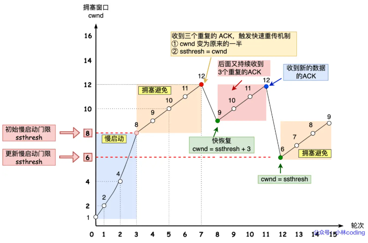

> 1. [Java 面试指南（付费）](https://javabetter.cn/zhishixingqiu/mianshi.html)收录的京东面经同学 5 Java 后端技术一面面试原题：tcp拥塞控制

### 🌟说说 TCP 的重传机制？

超时重传机制的作用是确保在网络传输中如果某些数据包丢失或没有及时到达的话，TCP 能够重新发送这些数据包，以保证数据完整性。

超时重传机制的原理是在**发送某个数据后开启一个计时器，如果在一定时间内没有得到发送数据报的 ACK 报文，就重新发送数据，直到发送成功为止**。

重传包括**超时重传、快速重传、带选择确认的重传（SACK）和重复 SACK 四种**。

#### 超时时间应该设置为多少呢？

TCP 中的重传超时时间（RTO，Retransmission Timeout）不是一个固定的值，而是动态计算的，目的是为了适应不同的网络条件。

RTO 有个标准方法的计算公式，叫 **Jacobson / Karels 算法**。

①、计算 SRTT（Smoothed RTT，平滑往返时间），以避免单次测量中的抖动影响重传时间。

```
SRTT = (1 - α) * SRTT + α * RTT
```

其中，α 是一个常量，通常取值为 0.125（即1/8），表示新测量值对平滑RTT的影响比例。

RTT，也就是 Round-Trip Time，往返时间，即数据包从发送到接收到确认的时间。TCP 会对每个数据包的 RTT 进行测量，并不断更新这个值。


②、计算 RTTVAR (RTT Variation，表示RTT的变化量，用于衡量RTT的波动)

```
RTTVAR = (1 - β) * RTTVAR + β * (|RTT - SRTT|)
```

β 通常取值为 0.25（即1/4），表示对RTTVAR更新的权重。

③、最后，得出最终的 RTO

```
RTO = SRTT + max(G, 4 x RTTVAR)
```

G 是一个小的常量偏移量，用来防止RTO过小。一般来说，G 的值通常是1毫秒。

一般来说，RTO 略微大于 RTT，效果是最佳的。

- 如果 RTO 设置很大，可能等了很久都没有重发。
- 如果 RTO 设置很小，那很可能数据还没有丢失，就开始重发了。

超时重传不是十分完美的重传方案，它有这些缺点：

- 当报文丢失时，需要等待一定的超时周期，才开始重传。
- 当报文丢失时，在等待超时的过程中，可能会出现这种情况：后面的报文已经被接收端接收了但却迟迟得不到确认，发送端会认为也丢失了，从而引起不必要的重传。
- 并且，对于 TCP 来说，如果发生一次超时重传，下次的时间间隔就会加倍。

#### 什么是快速重传？

TCP 还有另外⼀种快速重传（**Fast Retransmit**）机制，它不以时间为驱动，⽽是以数据驱动重传。它是基于接收端的反馈信息来引发重传的。

可以用它来解决超时重发的时间等待问题，快速重传流程如下：


在上图，发送⽅发出了 1，2，3，4，5 份数据：

- 第⼀份 Seq1 先送到了，于是就 Ack 回 2；
- 结果 Seq2 因为某些原因没收到，Seq3 到达了，于是还是 Ack 回 2；
- 后⾯的 Seq4 和 Seq5 都到了，但还是 Ack 回 2，因为 Seq2 还是没有收到；
- 发送端收到了三个 **Ack = 2** 的确认，知道了 **Seq2** 还没有收到，就会在定时器过期之前，重传丢失的 **Seq2**。
- 最后，收到了 Seq2，此时因为 Seq3，Seq4，Seq5 都收到了，于是 Ack 回 6 。

快速重传机制只解决了⼀个问题，就是超时时间的问题，但是它依然⾯临着另外⼀个问题。就是重传的时候，是重传之前的⼀个，还是重传所有的问题。

⽐如对于上⾯的例⼦，是重传 Seq2 呢？还是重传 Seq2、Seq3、Seq4、Seq5 呢？因为发送端并不清楚这连续的三个 Ack 2 是谁传回来的。

根据 TCP 不同的实现，以上两种情况都是有可能的。可⻅，这是⼀把双刃剑。

为了解决不知道该重传哪些 TCP 报⽂，于是就有 SACK ⽅法。

#### 什么是带选择确认的重传（SACK）

为了解决应该重传多少个包的问题? TCP 提供了**带选择确认的重传**（即 SACK，Selective Acknowledgment）。

**SACK 机制**就是，在快速重传的基础上，接收方返回最近收到报文段的序列号范围，这样发送方就知道接收方哪些数据包是没收到的。这样就很清楚应该重传哪些数据包。


如上图中，发送⽅收到了三次同样的 ACK 确认报⽂，于是就会触发快速重发机制，通过 SACK 信息发现只有 200~299 这段数据丢失，则重发时，就只选择了这个 TCP 段进⾏重发。

#### 什么是重复SACK（D-SACK）

D-SACK，英文是 Duplicate SACK，是在 SACK 的基础上做了一些扩展，主要用来告诉发送方，有哪些数据包，自己重复接受了。

DSACK 的目的是帮助发送方判断，是否发生了包失序、ACK 丢失、包重复或伪重传。让 TCP 可以更好的做网络流控。

例如，ACK 丢包导致的数据包重复：


- 接收⽅发给发送⽅的两个 ACK 确认应答都丢失了，所以发送⽅超时后，重传第⼀个数据包（3000 ~3499）

- 于是接收⽅发现数据是重复收到的，于是回了⼀个 **SACK = 3000~3500**，告诉「发送⽅」 3000~3500 的数据早已被接收了，因为 ACK 都到了 4000 了，已经意味着 4000 之前的所有数据都已收到，所以这个 SACK 就代表着 D-SACK 。这样发送⽅就知道了，数据没有丢，是接收⽅的 ACK 确认报⽂丢了。

> 1. [二哥编程星球](https://javabetter.cn/zhishixingqiu/)球友[枕云眠美团 AI 面试原题](https://t.zsxq.com/BaHOh)：解释一下TCP的超时重传机制

### 一个TCP连接可以发送多少次HTTP请求?

一个 TCP 连接可以发送多少次 HTTP 请求，取决于 HTTP 协议的版本。

- 在 HTTP/1.0 中，每个 HTTP 请求-响应使用一个单独的 TCP 连接。这意味着每次发送 HTTP 请求都需要建立一个新的 TCP 连接。

- HTTP/1.1 引入了持久连接（Persistent Connection），默认情况下允许在一个 TCP 连接上发送多个 HTTP 请求。通过使用 `Connection: keep-alive` 头部实现，保持连接打开状态，直到明确关闭为止。这极大地提高了效率，因为无需为每个请求都建立新的连接。此外，HTTP/1.1 支持请求管道化（Pipelining），允许客户端在收到前一个响应之前发送多个请求。

- HTTP/2 进一步优化了连接复用，允许在单个 TCP 连接上同时发送多个请求和响应，这些请求和响应被分割成帧并通过流传输。HTTP/2 的多路复用（Multiplexing）机制显著提高了并发性能和资源利用效率。

> 1. [Java 面试指南（付费）](https://javabetter.cn/zhishixingqiu/mianshi.html)收录的字节跳动面经同学 1 技术二面面试原题：一个TCP连接可以发送多少次HTTP请求?

### TCP接收数据时的内存拷贝流程和涉及的层次

1. **网卡通过 DMA（直接内存访问）把收到的网络数据包直接写入内核态的 `sk_buff` 缓冲区。** 这里没有 CPU 拷贝，数据直接进入内核空间。
2. **网络层处理（IP 层）和传输层处理（TCP 层）**
   - IP 层和 TCP 层对 `sk_buff` 进行解析和处理，TCP 层对数据做序列号检查、重排序、丢包重传管理等。
   - 这期间一般不涉及数据拷贝，`sk_buff` 结构里的数据缓冲区直接被使用。
3. **TCP 层将接收到的数据交给应用层时的拷贝**：当应用程序调用 `recv()` 或类似系统调用从内核读取数据时，内核会把内核缓冲区中已经按序到达并确认的数据拷贝到用户空间的缓冲区中。这通常是 **接收过程中的唯一一次数据拷贝（内核态到用户态）**

现代操作系统和网卡支持的 **零拷贝接收技术（如 TCP zero-copy、XDP、DPDK）**，可以避免最后一步拷贝，直接把数据映射到用户空间，提高性能，但传统 Linux TCP 栈默认是有一次内核态到用户态拷贝的。

### Linux发送网络数据的时候，涉及几次内存拷贝操作？

在 Linux 上，使用 TCP 发送网络数据时，主要涉及 **三次** 数据拷贝：

- 第一次，调用发送数据的系统调用的时候，内核会申请一个内核态的 sk_buff 内存，将用户待发送的数据拷贝到 sk_buff 内存，并将其加入到发送缓冲区。
- 第二次，在使用 TCP 传输协议的情况下，从传输层进入网络层的时候，每一个 sk_buff 都会被克隆一个新的副本出来。副本 sk_buff 会被送往网络层，等它发送完的时候就会释放掉，然后原始的 sk_buff 还保留在传输层，目的是为了实现 TCP 的可靠传输，等收到这个数据包的 ACK 时，才会释放原始的 sk_buff 。
- 第三次，当 IP 层发现 sk_buff 大于 MTU 时才需要进行内存拷贝，此时会再申请额外的 sk_buff，并将原来的 sk_buff 拷贝为多个小的 sk_buff。

## UDP

**UDP 问的不会特别多，基本上是被拿来和 TCP 作比较的。**

### UDP报文格式

UDP 不提供复杂的控制机制，利用 IP 提供面向「无连接」的通信服务。

UDP 协议真的非常简，头部只有 `8` 个字节（64 位），UDP 的头部格式如下：

- 目标和源端口：主要是告诉 UDP 协议应该把报文发给哪个进程。
- 包长度：该字段保存了 UDP 首部的长度跟数据的长度之和。
- 校验和：校验和是为了提供可靠的 UDP 首部和数据而设计，防止收到在网络传输中受损的 UDP 包。


### UDP 协议为什么不可靠？

**UDP 在传输数据之前不需要先建立连接，远地主机的传输层在接收到 UDP 报文后，不需要确认，提供不可靠交付。总结就以下四点：**

- 不保证消息交付：不确认，不重传，无超时
- 不保证交付顺序：不设置包序号，不重排，不会发生队首阻塞
- 不跟踪连接状态：不必建立连接或重启状态机
- 不进行拥塞控制：不内置客户端或网络反馈机制

### 怎么用UDP实现HTTP？

UDP 是不可靠传输的，但基于 UDP 的 **QUIC 协议** 可以实现类似 TCP 的可靠性传输，在HTTP3就用了QUIC协议。

- 连接迁移：QUIC支持在网络变化时快速迁移连接，例如从WiFi切换到移动数据网络，以保持连接的可靠性。
- 重传机制：QUIC使用重传机制来确保丢失的数据包能够被重新发送，从而提高数据传输的可靠性。
- 前向纠错：QUIC可以使用前向纠错技术，在接收端修复部分丢失的数据，降低重传的需求，提高可靠性和传输效率。
- 拥塞控制：QUIC内置了拥塞控制机制，可以根据网络状况动态调整数据传输速率，以避免网络拥塞和丢包，提高可靠性。

### 为什么 QQ 采用 UDP 协议？

- 首先，QQ 并不是完全基于 UDP 实现。比如在使用 QQ 进行文件传输等活动的时候，就会使用 TCP 作为可靠传输的保证。
- 使用 UDP 进行交互通信的好处在于，延迟较短，对数据丢失的处理比较简单。同时，TCP 是一个全双工协议，需要建立连接，所以网络开销也会相对大。
- 如果使用 QQ 语音和 QQ 视频的话，UDP 的优势就更为突出了，首先延迟较小。最重要的一点是不可靠传输，这意味着如果数据丢失的话，不会有重传。因为用户一般来说可以接受图像稍微模糊一点，声音稍微不清晰一点，但是如果在几秒钟以后再出现之前丢失的画面和声音，这恐怕是很难接受的。
- 由于 QQ 的服务器设计容量是海量级的应用，一台服务器要同时容纳十几万的并发连接，因此服务器端只有采用 UDP 协议与客户端进行通讯才能保证这种超大规模的服务

简单总结一下：UDP 协议是无连接方式的协议，它的效率高，速度快，占资源少，对服务器的压力比较小。但是其传输机制为不可靠传送，必须依靠辅助的算法来完成传输控制。QQ 采用的通信协议以 UDP 为主，辅以 TCP 协议。


## DNS

### DNS的全称了解么？

DNS的全称是Domain Name System（域名系统），它是互联网中用于将域名转换为对应IP地址的分布式数据库系统。DNS扮演着重要的角色，使得人们可以通过易记的域名访问互联网资源，而无需记住复杂的IP地址。

DNS 中的域名都是用**句点**来分隔的，比如`www.server.com`，这里的句点代表了不同层次之间的**界限**。在域名中，**越靠右**的位置表示其层级**越高**。

实际上域名最后还有一个点，比如 `www.server.com.`，这个最后的一个点代表根域名。也就是，`.`根域是在最顶层，它的下一层就是`.com`顶级域，再下面是`server.com`二级域。

所以域名的层级关系类似一个树状结构：

- **根 DNS 服务器（`.`）**
- **顶级域 DNS 服务器（`.com`）**
- **权威 DNS 服务器（`server.com`）**

根域的 DNS 服务器信息保存在互联网中所有的 DNS 服务器中，任何 DNS 服务器就都可以找到并访问根域 DNS 服务器。因此，客户端只要能够找到任意一台 DNS 服务器，就可以通过它找到根域 DNS 服务器，然后再一路顺藤摸瓜找到位于下层的某台目标 DNS 服务器。


### DNS 域名解析的工作流程？

- 当用户在地址栏输入域名时，浏览器会先在**浏览器缓存、操作系统缓存以及 hosts 文件** 中查找该域名对应的 IP，如果没有命中，就构造一条 DNS 查询报文。
- **浏览器将查询报文发送给本地 DNS 解析器（起着代理的作用）**；若本地 DNS 已缓存该域名的 IP，则立即将结果返回给浏览器，流程结束。
- 如果本地 DNS 没有相应记录，它会询问 `.` 根域名服务器。根服务器不会直接返回 IP，而是返回相应顶级域（如 `.cn`）的顶级域名服务器地址。
- 本地 DNS 收到顶级域名服务器地址后，向其发起查询，得到负责目标域（如 `mmzhang.cn`）的权威域名服务器地址。
- 随后，本地 DNS 向权威域名服务器查询，获得最终 IP 地址并将结果缓存下来。权威域名服务器通常由域名注册机构直接管理，`mmzhang.cn`是在阿里云上注册的，所以阿里云会提供对应的 DNS 解析服务，将域名和阿里云服务器绑定起来。
- **本地 DNS 把获得的 IP 返回给浏览器。浏览器据此与目标服务器建立 TCP 连接，发起 HTTP 请求，最终收到并呈现网页内容。**


### DNS的底层使用TCP还是UDP？

DNS 基于UDP协议实现，DNS使用UDP协议进行**域名解析和数据传输**。**因为基于UDP实现DNS能够提供低延迟、简单快速、轻量级的特性，更适合DNS这种需要快速响应的域名解析服务。** 尽管 UDP 存在丢包和数据包损坏的风险，但在 DNS 的设计中，这些风险是可以被容忍的。DNS 使用了一些机制来提高可靠性，例如查询超时重传、请求重试、缓存等，以确保数据传输的可靠性和正确性。

- **低延迟：** UDP是一种无连接的协议，不需要在数据传输前建立连接，因此可以减少传输时延，适合DNS这种需要快速响应的应用场景。
- **简单快速：** UDP相比于TCP更简单，没有TCP的连接管理和流量控制机制，传输效率更高，适合DNS这种需要快速传输数据的场景。
- **轻量级**：UDP头部较小，占用较少的网络资源，对于小型请求和响应来说更加轻量级，适合DNS这种频繁且短小的数据交换。

### DNS劫持了解吗？如何应对？

- DNS 劫持：即域名劫持，是一种网络攻击，它通过修改 DNS 服务器的解析结果，使用户访问的域名指向错误的 IP 地址，从而导致用户无法访问正常的网站，或者被引导到恶意的网站。DNS 劫持有时也被称为 DNS 重定向、DNS 欺骗或 DNS 污染。

- 解决方案：

  - 直接通过 IP 地址访问网站，避开DNS域名解析，从而避免域名劫持。

  - 域名劫持往往只能在特定的网络范围内进行，范围外的 DNS 服务器能够返回正常的 IP 地址，可以通过网络设置让DNS指向正常的域名服务器以实现对目标网址的正常访问，例如计算机首选 DNS 服务器的地址固定为 8.8.8.8。

## WebSocket

### 什么是 WebSocket?

WebSocket 是一种基于TCP连接的全双工通信协议，即客户端和服务器可以同时发送和接收数据。WebSocket 协议本质上是应用层的协议，用于弥补 HTTP 协议在持久通信能力上的不足。客户端和服务器仅需一次握手，两者之间就直接可以创建持久性的连接，并进行双向数据传输。

WebSocket 协议在 2008 年诞生，2011 年成为国际标准，几乎所有主流较新版本的浏览器都支持该协议。不过，WebSocket 不是只能在基于浏览器的应用程序中使用，很多编程语言、框架和服务器都提供了 WebSocket 支持。

**WebSocket 的常见应用场景：视频弹幕、实时消息推送、实时游戏对战、多用户协同编辑、社交聊天**

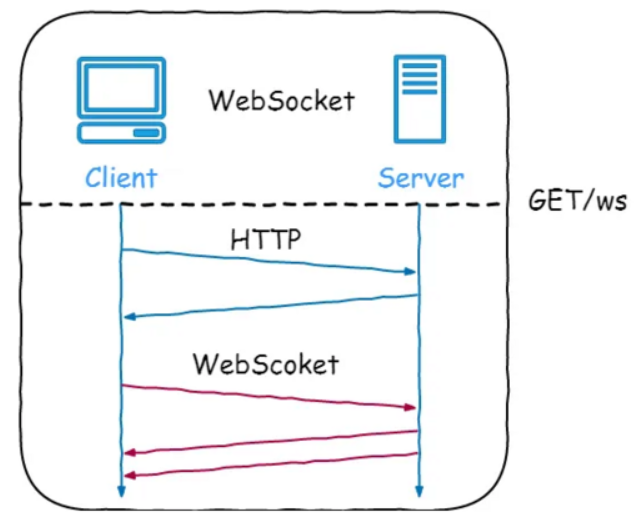

### WebSocket的工作过程是什么样的？

WebSocket 的工作过程可以分为以下几个步骤：

1. 客户端向服务器发送一个 HTTP 请求，请求头中包含 `Upgrade: websocket` 和 `Sec-WebSocket-Key` 等字段，表示要求升级协议为 WebSocket；
2. 服务器收到这个请求后，会进行升级协议的操作，如果支持 WebSocket，它将回复一个 HTTP 101 状态码，响应头中包含 ，`Connection: Upgrade`和 `Sec-WebSocket-Accept: xxx` 等字段、表示成功升级到 WebSocket 协议。
3. 客户端和服务器之间建立了一个 WebSocket 连接，可以进行双向的数据传输。数据以帧（frames）的形式进行传送，WebSocket 的每条消息可能会被切分成多个数据帧（最小单位）。发送端会将消息切割成多个帧发送给接收端，接收端接收消息帧，并将关联的帧重新组装成完整的消息。
4. 客户端或服务器可以主动发送一个关闭帧，表示要断开连接。另一方收到后，也会回复一个关闭帧，然后双方关闭 TCP 连接。

另外，建立 WebSocket 连接之后，通过心跳机制来保持 WebSocket 连接的稳定性和活跃性。

### WebSocket 和 HTTP 有什么区别？

WebSocket 和 HTTP 两者都是基于 TCP 的应用层协议，都可以在网络中传输数据。

下面是二者的主要区别：

- WebSocket 是一种双向实时通信协议，而 HTTP 是一种单向通信协议。并且，HTTP 协议下的通信只能由客户端发起，服务器无法主动通知客户端。
- WebSocket 使用`ws://`或`wss://`（使用 SSL/TLS 加密后的协议，类似于 HTTP 和 HTTPS 的关系） 作为协议前缀，HTTP 使用`http://`或`https://`作为协议前缀。
- WebSocket 可以支持扩展，用户可以扩展协议，实现部分自定义的子协议，如支持压缩、加密等。
- WebSocket 通信数据格式比较轻量，用于协议控制的数据包头部相对较小，网络开销小，而 HTTP 通信每次都要携带完整的头部，网络开销较大（HTTP/2.0 使用二进制帧进行数据传输，还支持头部压缩，减少了网络开销）。

### WebSocket与HTTP长连接有什么区别？

- **全双工和半双工**：TCP 协议本身是**全双工**的，但我们最常用的 HTTP/1.1，虽然是基于 TCP 的协议，但它是**半双工**的，对于大部分需要服务器主动推送数据到客户端的场景，都不太友好，因此我们需要使用支持全双工的 WebSocket 协议。
- **应用场景区别**：在 HTTP/1.1 里，只要客户端不问，服务端就不答，基于这样的特点，对于登录页面这样的简单场景，可以使用**定时轮询或者长轮询**的方式实现**服务器推送**(comet)的效果。对于客户端和服务端之间需要频繁交互的复杂场景，比如网页游戏，都可以考虑使用 WebSocket 协议。

### WebSocket 与短轮询、长轮询的区别

这三种方式，都是为了解决**客户端如何及时获取服务器最新数据，实现实时更新**的问题。它们的实现方式和效率、实时性差异较大。

**1.短轮询（Short Polling）**

- **原理**：客户端每隔固定时间（如 5 秒）发起一次 HTTP 请求，询问服务器是否有新数据。服务器收到请求后立即响应。
- **优点**：实现简单，兼容性好，直接用常规 HTTP 请求即可。
- 缺点：
  - **实时性一般**：消息可能在两次轮询间到达，用户需等到下次请求才知晓。
  - **资源浪费大**：反复建立/关闭连接，且大多数请求收到的都是“无新消息”，极大增加服务器和网络压力。

**2.长轮询（Long Polling）**

- **原理**：客户端发起请求后，若服务器暂时无新数据，则会保持连接，直到有新数据或超时才响应。客户端收到响应后立即发起下一次请求，实现“伪实时”。
- 优点：
  - **实时性较好**：一旦有新数据可立即推送，无需等待下次定时请求。
  - **空响应减少**：减少了无效的空响应，提升了效率。
- 缺点：
  - **服务器资源占用高**：需长时间维护大量连接，消耗服务器线程/连接数。
  - **资源浪费大**：每次响应后仍需重新建立连接，且依然基于 HTTP 单向请求-响应机制。

**3. WebSocket**

- **原理**：客户端与服务器通过一次 HTTP Upgrade 握手后，建立一条持久的 TCP 连接。之后，双方可以随时、主动地发送数据，实现真正的全双工、低延迟通信。
- 优点：
  - **实时性强**：数据可即时双向收发，延迟极低。
  - **资源效率高**：连接持续，无需反复建立/关闭，减少资源消耗。
  - **功能强大**：支持服务端主动推送消息、客户端主动发起通信。
- 缺点：
  - **使用限制**：需要服务器和客户端都支持 WebSocket 协议。对连接管理有一定要求（如心跳保活、断线重连等）。
  - **实现麻烦**：实现起来比短轮询和长轮询要更麻烦一些。

### WebSocket和SSE有什么区别？

SSE (Server-Sent Events) 和 WebSocket 都是用来实现服务器向浏览器实时推送消息的技术，让网页内容能自动更新，而不需要用户手动刷新。虽然目标相似，但它们在工作方式和适用场景上有几个关键区别：

1. 通信方式:
   - **SSE:** **单向通信**，只有服务器能向客户端（浏览器）发送数据，客户端不能通过同一个连接向服务器发送数据（需要发起新的 HTTP 请求）。
   - **WebSocket:** **双向通信 (全双工)**，客户端和服务器可以随时互相发送消息，实现真正的实时交互。
2. 底层协议:
   - **SSE:** 基于**标准的 HTTP/HTTPS 协议**。它本质上是一个“长连接”的 HTTP 请求，服务器保持连接打开并持续发送事件流。不需要特殊的服务器或协议支持，现有的 HTTP 基础设施就能用。
   - **WebSocket:** 使用**独立的 ws:// 或 wss:// 协议**。它需要通过一个特定的 HTTP "Upgrade" 请求来建立连接，并且服务器需要明确支持 WebSocket 协议来处理连接和消息帧。
3. 实现复杂度和成本:
   - **SSE:** **实现相对简单**，主要在服务器端处理，并且浏览器端有标准的 EventSource API，使用方便，开发和维护成本较低。
   - **WebSocket:** **稍微复杂一些**，需要服务器端专门处理 WebSocket 连接和协议，客户端也需要使用 WebSocket API。如果需要考虑兼容性、心跳、重连等，开发成本会更高。
4. 断线重连:
   - **SSE:** **浏览器原生支持**。EventSource API 提供了自动断线重连的机制。
   - **WebSocket:** **需要手动实现**。开发者需要自己编写逻辑来检测断线并进行重连尝试。
5. 数据类型:
   - **SSE:** **主要设计用来传输文本** (UTF-8 编码)。如果需要传输二进制数据，需要先进行 Base64 等编码转换成文本。
   - **WebSocket:** **原生支持传输文本和二进制数据**，无需额外编码。

为了提供更好的用户体验和利用其简单、高效、基于标准 HTTP 的特性，**Server-Sent Events (SSE) 是目前大型语言模型 API（如 OpenAI、DeepSeek 等）实现流式响应的常用甚至可以说是标准的技术选择**。我们可以发送一个请求并打开浏览器控制台验证一下：以 DeepSeek 为例，如果响应头应里包含了 `text/event-stream`，说明使用的确实是SSE，并且，响应数据也确实是持续分块传输。

## 网络安全

### 说说有哪些安全攻击？

网络安全攻击主要分为两种类型，**被动攻击**和**主动攻击**：


- **被动攻击**：是指攻击者从网络上窃听他人的通信内容，通常把这类攻击称为截获，被动攻击主要有两种形式：消息内容泄露攻击和流量分析攻击。由于攻击者没有修改数据，使得这种攻击很难被检测到。
- **主动攻击**：直接对现有的数据和服务造成影响，常见的主动攻击类型有：
  - **篡改**：攻击者故意篡改网络上发送的报文，甚至把完全伪造的报文传送给接收方。
  - **恶意程序**：恶意程序种类繁多，包括计算机病毒、计算机蠕虫、特洛伊木马、后门入侵、流氓软件等等。
  - **拒绝服务 Dos**：攻击者向服务器不停地发送分组，使服务器无法提供正常服务。

### 什么是 CSRF 攻击？如何避免？

CSRF（跨站请求伪造）是一种攻击手段，攻击者通过诱导用户执行恶意操作，从而获取用户数据或执行恶意代码。CSRF攻击通常通过伪造一个合法的HTTP请求来实现，这个请求看起来是合法的，但实际上是为了执行一个攻击者控制的操作。


解决CSRF攻击的方法主要有以下几种：

1. 会话验证：在服务器端维护并验证会话标识（如 session ID），确保每次请求携带的会话标识与当前有效会话一致，从根本上阻止伪造会话请求。
2. Token 校验：对敏感操作请求，生成并下发唯一且随机的 CSRF Token（通常通过隐藏字段或请求头传递）；服务器端在处理请求时校验该 Token，若缺失或不匹配即拒绝执行。
3. 多重验证：除了会话验证和 Token 验证，还可以引入验证码、数字签名、双因素认证等额外手段，提升攻击者模拟合法请求的难度。
4. 防止跨站请求：通过设置CSP（内容安全策略）来防止跨站请求，限制网页中可执行的脚本源，减少攻击者诱导用户执行恶意操作的可能性。
5. 避免使用自动提交表单：禁用默认的自动提交功能，要求用户在提交表单前确认操作，防止攻击者诱导用户在未经授权的情况下提交表单。
6. Referer/Origin 校验：在服务器端检查请求头中的 Referer 或 Origin 字段，确保请求源自本域名或信任的域名，若来源异常则拒绝请求。

### 什么是 DoS、DDoS、DRDoS 攻击？


- **DOS**(Denial of Service)：中文是拒绝服务, 一切能引起拒绝 行为的攻击都被称为 DOS 攻击。最常见的 DoS 攻击就有**计算机网络宽带攻击**、**连通性攻击**。
- **DDoS**(Distributed Denial of Service)：中文是分布式拒绝服务，是指处于不同位置的多个攻击者同时向一个或几个目标发动攻击，或者一个攻击者控制了位于不同位置的多台机器，并利用这些机器对受害者同时实施攻击。
  - 主要形式有流量攻击和资源耗尽攻击，常见的 DDoS 攻击有：**SYN Flood、Ping of Death、ACK Flood、UDP Flood** 等。


- **DRDoS**(Distributed Reflection Denial of Service)：中文是分布式反射拒绝服务，该方式靠的是发送大量带有被害者 IP 地址的数据包给攻击主机，然后攻击主机对 IP 地址源做出大量回应，从而形成拒绝服务攻击。

### 如何防范 DDoS?

- 针对 DDoS 中的流量攻击，最直接的方法是增加带宽，理论上只要带宽大于攻击流量就可以了，但是这种方法成本非常高。在有充足带宽的前提下，我们应该尽量提升路由器、网卡、交换机等硬件设施的配置。

- 针对资源耗尽攻击，我们可以升级主机服务器硬件，在网络带宽得到保证的前提下，使得服务器能够有效对抗海量的 SYN 攻击包。我们也可以安装专业的抗 DDoS 防火墙，从而对抗 SYN Flood 等流量型攻击。瓷碗，负载均衡，CDN 等技术都能有效对抗 DDos 攻击。

## IP

IP 在 TCP/IP 参考模型中处于第三层，也就是**网络层**。

网络层的主要作用是：**实现主机与主机之间的通信，也叫点对点（end to end）通信。**

IP的作用是在复杂的网络环境中将数据包发送给最终目的的主机

### （了解）IP报文格式

 IP 报文头部的格式：在 IP 协议里面需要有**源地址 IP** 和 **目标地址 IP**：

- 源地址IP，即是客户端输出的 IP 地址；
- 目标地址，即通过 DNS 域名解析得到的 W
    - eb 服务器 IP。


因为 HTTP 是经过 TCP 传输的，所以在 IP 包头的**协议号**，要填写为 `06`（十六进制），表示协议为 TCP。


### （了解）假设客户端有多个网卡，就会有多个 IP 地址，那 IP 头部的源地址应该选择哪个 IP 呢？

当存在多个网卡时，在填写源地址 IP 时，就需要判断到底应该填写哪个地址。这个判断相当于在多块网卡中判断应该使用哪个一块网卡来发送包。

这个时候就需要根据**路由表**规则，来判断哪一个网卡作为源地址 IP。

在 Linux 操作系统，我们可以使用 `route -n` 命令查看当前系统的路由表。


举个例子，根据上面的路由表，我们假设 Web 服务器的目标地址是 `192.168.10.200`。

1. 首先先和第一条目的子网掩码（`Genmask`）进行 **与运算**，得到结果为 `192.168.10.0`，但是第一个条目的 `Destination` 是 `192.168.3.0`，两者不一致所以匹配失败。
2. 再与第二条目的子网掩码进行 **与运算**，得到的结果为 `192.168.10.0`，与第二条目的 `Destination 192.168.10.0` 匹配成功，所以将使用 `eth1` 网卡的 IP 地址作为 IP 包头的源地址。

那么假设 Web 服务器的目标地址是 `10.100.20.100`，那么依然依照上面的路由表规则判断，判断后的结果是和第三条目匹配。

第三条目比较特殊，它目标地址和子网掩码都是 `0.0.0.0`，这表示**默认网关**，如果其他所有条目都无法匹配，就会自动匹配这一行。并且后续就把包发给路由器，`Gateway` 即是路由器的 IP 地址。

### IP 协议的定义和作用？

IP 协议（Internet Protocol）用于在计算机网络之间传输数据包，它定义了数据包的格式和处理规则，确保数据能够从一个设备传输到另一个设备，可能跨越多个中间网络设备（如路由器）。


#### IP 协议有哪些作用？

①、**寻址**：每个连接到网络的设备都有一个唯一的 IP 地址。IP 协议使用这些地址来标识数据包的源地址和目的地址，确保数据包能够准确地传输到目标设备。

②、**路由**：IP 协议负责决定数据包在网络传输中的路径。比如说路由器使用路由表和 IP 地址信息来确定数据包的最佳传输路径。

③、**分片和重组**：当数据包过大无法在某个网络上传输时，IP 协议会将数据包分成更小的片段进行传输。接收端会根据头部信息将这些片段重新组装成完整的数据包。

#### 举一个实际的例子来说明？

假设有两个设备 A 和 B 通过互联网通信，A 的 IP 地址是 192.168.1.1，B 的 IP 地址是 203.0.113.5。数据包的传输过程如下：

①、设备 A 发送数据包：

- 设备 A 创建一个 IP 数据包，设置源地址为 192.168.1.1，目的地址为 203.0.113.5，将要传输的数据放入数据部分。
- 数据包封装后，通过本地网络发送到路由器。

②、路由器转发数据包：

- 路由器根据路由表查找目的地址 203.0.113.5，确定数据包的传输路径。
- 数据包可能经过多个中间路由器，每个路由器都根据路由表选择下一跳，最终到达目标设备的网络。

③、设备 B 接收数据包：

- 设备 B 接收数据包，读取 IP 头部信息，验证数据包的完整性。
- 并数据部分取出，交给上层协议处理（如 TCP 或 UDP）。

> 1. [Java 面试指南（付费）](https://javabetter.cn/zhishixingqiu/mianshi.html)收录的华为面经同学 12 暑期实习一面面试原题：说说IP协议

### IP 地址有哪些分类？

一个 IP 地址在整个互联网范围内是惟一的，一般可以这么认为，IP 地址 = {<网络号>，<主机号>}。

1. **网络号**：它标志主机所连接的网络地址表示属于互联网的哪一个网络。
2. **主机号**：它标志主机地址表示其属于该网络中的哪一台主机。

IP 地址分为 A，B，C，D，E 五大类：

- A 类地址 (1~126)：以 0 开头，网络号占前 8 位，主机号占后面 24 位。
- B 类地址 (128~191)：以 10 开头，网络号占前 16 位，主机号占后面 16 位。
- C 类地址 (192~223)：以 110 开头，网络号占前 24 位，主机号占后面 8 位。
- D 类地址 (224~239)：以 1110 开头，保留为多播地址。
- E 类地址 (240~255)：以 1111 开头，保留位为将来使用


### 域名和 IP 的关系？一个 IP 可以对应多个域名吗？

**IP 地址** ：在一个网络中具有唯一性，其作用是像身份证号一样，用来精准地标识每一个处于该网络上的设备。

**域名** ：在一个网络中同样保持唯一，类似于人的名字或绰号，便于人们记忆和称呼。

可以将这种关系类比为：一个人可以有多个不同的绰号（如同多个域名），朋友们可以用任意一个绰号来叫他，但身份证号（相当于 IP 地址）是独一无二的。不过，绰号可能存在重复情况，当这个人不在场时，别人叫他的绰号，可能其他人会回应。

在实际的网络映射关系中：

- 一个域名可以对应多个 IP 地址，这种情况在 DNS 实施负载均衡时较为常见。不过，在用户具体访问的那一刻，该域名只能指向一个确定的 IP 地址。
- 一个 IP 地址却能够对应多个域名，呈现出一对多的对应关系。比如在同一个 IP 地址下，通过不同的域名可以访问到不同的网站服务，这是搭建虚拟主机等场景中会运用到的原理。

### IPV4 地址不够如何解决？

我们知道，IP 地址有 32 位，可以标记 2 的 32 次方个地址，听起来很多，但是全球的网络设备数量已经远远超过这个数字，所以 IPV4 地址已经不够用了，那怎么解决呢？


- DHCP：动态主机配置协议，动态分配 IP 地址，只给接入网络的设备分配 IP 地址，因此同一个 MAC 地址的设备，每次接入互联网时，得到的 IP 地址不一定是相同的，该协议使得空闲的 IP 地址可以得到充分利用。
- CIDR：无类别域间路由。CIDR 消除了传统的 A 类、B 类、C 类地址以及划分子网的概念，因而更加有效地分配 IPv4 的地址空间，但无法从根本上解决地址耗尽的问题。
- NAT：网络地址转换协议，我们知道属于不同局域网的主机可以使用相同的 IP 地址，从而一定程度上缓解了 IP 资源枯竭的问题，然而主机在局域网中使用的 IP 地址是不能在公网中使用的，当局域网主机想要与公网主机进行通信时，NAT 方法可以将该主机 IP 地址转换为全球 IP 地址。该协议能够有效解决 IP 地址不足的问题。
- IPv6：作为接替 IPv4 的下一代互联网协议，其可以实现 2 的 128 次方个地址，而这个数量级，即使给地球上每一粒沙子都分配一个 IP 地址也够用，该协议能够从根本上解决 IPv4 地址不够用的问题。

### 说下 ARP 协议的工作过程？

ARP（Address Resolution Protocol，地址解析协议）是网络通信中的一种协议，主要目的是将网络层的 IP 地址解析为数据链路层的 MAC 地址。

①、ARP 请求

当主机 A 要发送数据给主机 B 时，首先会在自己的 ARP 缓存中查找主机 B 的 MAC 地址。

如果没有找到，主机 A 会向网络中广播一个 ARP 请求数据包，请求网络中的所有主机告诉它们的 MAC 地址；这个请求包含了请求设备和目标设备的 IP 和 MAC 地址。

②、ARP 应答

网络中的所有主机都会收到这个 ARP 请求，但只有主机 B 会回复 ARP 应答，告诉主机 A 自己的 MAC 地址。

并且主机 B 会将主机 A 的 IP 和 MAC 地址映射关系缓存到自己的 ARP 缓存中，以便下次通信时直接使用。

③、更新 ARP 缓存

主机 A 收到主机 B 的 ARP 应答后，也会将主机 B 的 IP 和 MAC 地址映射关系缓存到自己的 ARP 缓存中。


> 1. [Java 面试指南（付费）](https://javabetter.cn/zhishixingqiu/mianshi.html)收录的快手面经同学 7 Java 后端技术一面面试原题：说一下 ARP 协议的过程

### 为什么既有 IP 地址，又有 MAC 地址？

> **MAC 地址和 IP 地址都有什么作用？**

- MAC 地址是数据链路层和物理层使用的地址，是写在网卡上的物理地址，用来定义网络设备的位置，不可变更。
- IP 地址是网络层和以上各层使用的地址，是一种逻辑地址。IP 地址用来区别网络上的计算机。

> **为什么有了 MAC 地址还需要 IP 地址？**

如果我们只使用 MAC 地址进行寻址的话，我们需要路由器记住每个 MAC 地址属于哪个子网，不然一次路由器收到数据包都要满世界寻找目的 MAC 地址。而我们知道 MAC 地址的长度为 48 位，也就是最多共有 2 的 48 次方个 MAC 地址，这就意味着每个路由器需要 256T 的内存，显然是不现实的。

和 MAC 地址不同，IP 地址是和地域相关的，在一个子网中的设备，我们给其分配的 IP 地址前缀都是一样的，这样路由器就能根据 IP 地址的前缀知道这个设备属于哪个子网，剩下的寻址就交给子网内部实现，从而大大减少了路由器所需要的内存。

> **为什么有了 IP 地址还需要 MAC 地址？**

- 只有当设备连入网络时，才能根据他进入了哪个子网来为其分配 IP 地址，在设备还没有 IP 地址的时候，或者在分配 IP 的过程中。我们需要 MAC 地址来区分不同的设备。
- IP 地址可以比作为地址，MAC 地址为收件人，在一次通信过程中，两者是缺一不可的。

### ICMP 协议的功能？

ICMP（Internet Control Message Protocol，互联网控制消息协议）是一种网络层的无连接协议，主要用于传输网络状态和错误消息的协议，对网络安全有着极为重要的意义。常用于网络诊断和故障排除，以下是其具体功能：

- **网络诊断** ：我们日常使用较多的 ping 工具就是基于 ICMP 的，通过 ping 某个 IP 地址，可以确认 IP 包是否成功送达目标地址，进而判断网络连接是否正常以及网络的响应时间等。
- **错误报告** ：当 IP 数据包因各种原因无法访问目标、IP 路由器无法按当前传输速率转发数据包等情况时，会自动发送 ICMP 消息。例如，目的主机或网络不可达时，ICMP 就会生成相应消息告知发送方。
- **信息查询** ：ICMP 可用于交换一些网络的相关信息，如网络掩码请求与应答等，帮助网络中的设备了解彼此的网络配置情况。
- **改善网络设置** ：它还能报告发送过程中 IP 包被废弃的原因，为网络管理员提供有价值的信息，以便对网络进行优化和调整。

在 IP 通信中，如果某个 IP 包因某种原因未能达到目标地址，ICMP 就会负责通知具体原因。


如上图例子，主机 `A` 向主机 `B` 发送了数据包，由于某种原因，途中的路由器 `2` 未能发现主机 `B` 的存在，这时，路由器 `2` 就会向主机 `A` 发送一个 `ICMP` 目标不可达数据包，说明发往主机 `B` 的包未能成功。

ICMP 的这种通知消息会使用 `IP` 进行发送 。

因此，从路由器 `2` 返回的 ICMP 包会按照往常的路由控制先经过路由器 `1` 再转发给主机 `A` 。收到该 ICMP 包的主机 `A` 则分解 ICMP 的首部和数据域以后得知具体发生问题的原因。

> ICMP 类型

ICMP 大致可以分为两大类：

- 一类是用于诊断的查询消息，也就是「**查询报文类型**」
- 另一类是通知出错原因的错误消息，也就是「**差错报文类型**」


### 说下 ping 的原理？

**ping，Packet Internet Groper，一个网络工具，主要用来测试网络连接的可达性和延迟。**

Ping 的过程主要基于 ICMP（Internet Control Message Protocol，互联网控制消息协议）实现，其基本过程包括：

①、当执行 Ping 命令，如`ping www.mmzhang.cn`，Ping 首先解析域名获取 IP 地址，然后向目标 IP 发送一个 ICMP Echo Request 消息。

②、当目标 IP 收到 ICMP Echo Request 消息后，它会生成一个 ICMP Echo Reply 消息并返回，即 Ping 响应消息。

③、发起 Ping 命令的设备接收到 ICMP Echo Reply 消息后，计算并显示从发送 Echo Request 到接收到 Echo Reply 的时间（通常称为往返时间 RTT，Round-Trip Time），以及可能的丢包情况。

Ping 通常会发送多个请求，以便提供平均响应时间和丢包率等信息，以便我们了解网络连接的质量。

> 1. [Java 面试指南（付费）](https://javabetter.cn/zhishixingqiu/mianshi.html)收录的快手面经同学 7 Java 后端技术一面面试原题：说一下 Ping 的过程

## 场景题

### 服务器ping不通但是http能请求成功，会出现这种情况吗？什么原因造成的?

有可能服务器的防火墙禁止 icmp 协议，但是 tcp 协议没有禁止，就会出现服务器 ping 不通，但是 http 能请求成果。因为ping 走的是 icmp 协议，http 走的是 tcp 协议。

### 怎么利用多线程来下载一个数据呢？

可以采取分块下载的策略：

首先，通过HEAD请求获取文件的总大小。

然后根据文件大小和线程数，将文件进行切割，每个线程负责下载一个特定范围的数据。**可以通过设置 HTTP 请求头的 Range 字段指定下载的字节区间**。例如，`Range: bytes=0-1023` 表示下载文件的前 1024 字节。

最后启动多线程下载。

> 若只需前 10 个字节，则无需拆分线程，直接发送 `Range: bytes=0-9` 的单次请求即可。

### 网页非常慢转圈圈的时候，要定位问题需要从哪些角度？

最直接的办法就是抓包，排查的思路大概有：

1. 先确定是服务端的问题，还是客户端的问题。先确认浏览器是否可以访问其他网站，如果不可以，说明客户端网络自身的问题，然后检查客户端网络配置（连接wifi正不正常，有没有插网线）；如果可以正常其他网页，说明客户端网络是可以正常上网的。
2. 如果客户端网络没问题，就抓包确认 DNS 是否解析出了 IP 地址，如果没有解析出来，说明域名写错了，如果解析出了 IP 地址，抓包确认有没有和服务端建立三次握手，如果能成功建立三次握手，并且发出了 HTTP 请求，但是就是没有显示页面，可以查看服务端返回的响应码：
   - 如果是404错误码，检查输入的url是否正确；
   - 如果是500，说明服务器此时有问题；
   - 如果是200，F12看看前端代码有问题导致浏览器没有渲染出页面。
3. 如果客户端网络是正常的，但是访问速度很慢，导致很久才显示出来。这时候要看客户端的网口流量是否太大的了，导致tcp发生丢包之类的问题。

总之就是一层一层有没有插网线，网络配置是否正确、DNS有没有解析出 IP地址、TCP有没有三次握手、HTTP返回的响应码是什么。

### 服务端正常启动了，但是客户端请求不到有哪些原因?如何排查?

如果客户端请求的接口没有响应，排查的方式：

- 检查接口IP地址是否正确，ping一下接口地址。
- 检查被测接口端口号是否正确，可以在本机Telnet接口的IP和端口号，检查端口号能否连通
- 检查服务器的防火墙是否关闭，如果是以为安全或者权限问题不能关闭，需要找运维进行策略配置，开放对应的IP和端口。
- 检查你的客户端（浏览器、[测试工具 (opens new window)](https://so.csdn.net/so/search?q=测试工具&spm=1001.2101.3001.7020)），是否设置了网络代理，网络代理可以造成请求失败。

如果客户端的请求有响应，但是返回了错误状态码，那么根据错误码做对应的排查：

- 400：客户端请求错误，比如请求参数格式错误
- 401：未授权，比如请求header里，缺乏必要的信息头。（token，auth等）
- 403：禁止，常见原因是因为用户的账号没有对应的URL权限，还有就是项目中所用的中间件，不允许远程连接（Tomcat）
- 404：资源未找到，导致这种情况的原因很多，比如URL地址不正确
- 500：服务器内部错误，出现这种情况，说明服务器内部报错了 ，需要登录服务器，检查错误日志，根具体的提示信息在进行排查
- 502/503/504（错误的网关、服务器无法获得、网关超时）：如果单次调用接口就报该错误，说明后端服务器配置有问题或者服务不可用，挂掉了；如果是并发压测时出现的，说明后端压力太大，出现异常，此问题一般是后端出现了响应时间过长或者是无响应造成的
