# 计算机网络概述

## 第1章：概述

### 1.1 因特网概述

#### 1.1.1 网络、互连网(互联网)和因特网

- 网络(network)：由若干节点(Node)和连接这些节点的链路(Link)组成

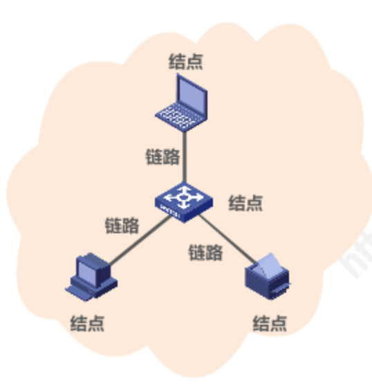

- 多个网络还可以通过路由器互连起来，这样就构成了一个覆盖范围更大的网络，即互联网(或互连网)
    因此，互联网是`网络的网络(NetwrokofNetworks)`

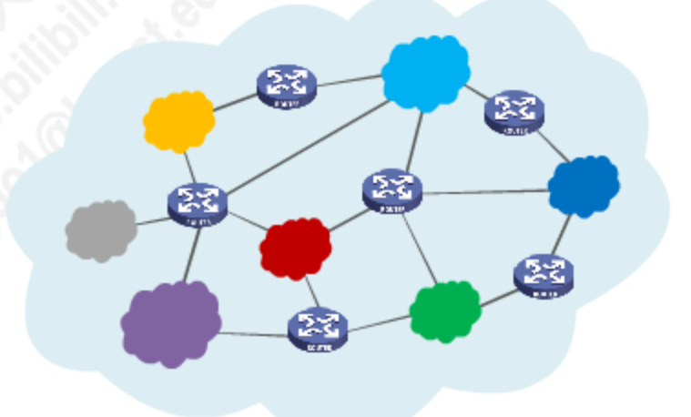

- 因特网(Internet)是世界上最大的互连网络(用户数以亿计，互连的网络数以百万计)。

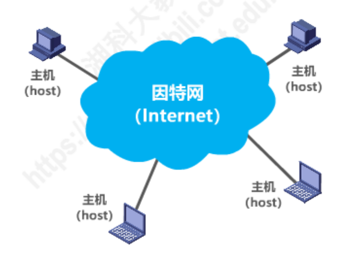

- internet与lnternet的区别
    - internet(互联网或互连网)是一个通用名词，它泛指由多个计算机网络互连而成的网络。在这些网络之间的通信协议可以是任意的。
    - Internet(因特网)则是一个专用名词，它指当前全球最大的、开放的、由众多网络相互连接而成的特定计算机网络，它采用TCP/IP协议族作为通信的规则，其前身是美国的ARPANET。

#### 1.1.2 因特网发展的三个发展阶段

- 图解：

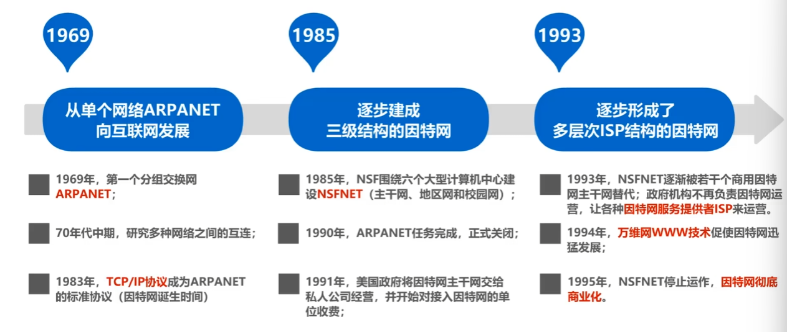

- 因特网服务提供者ISP(Internet Service Provider)

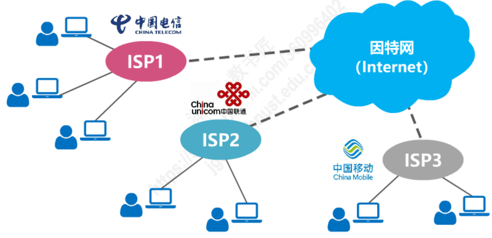

- 基于ISP的三层结构的因特网：

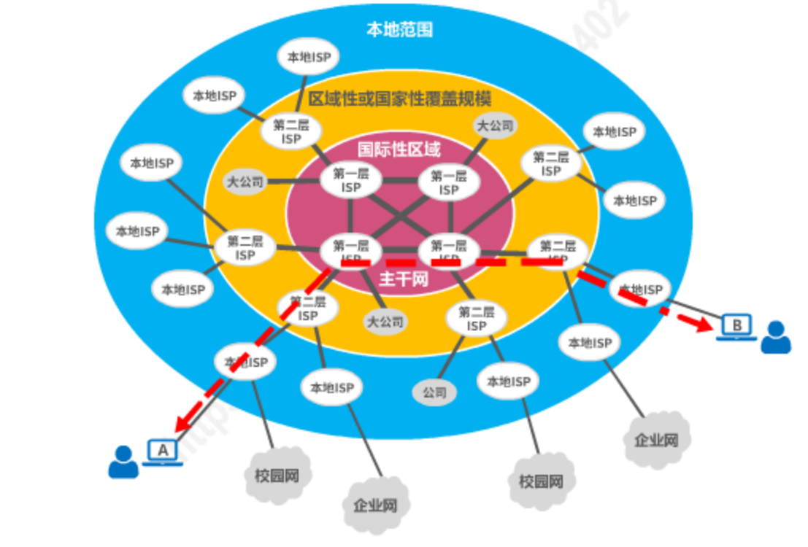

#### 1.1.3 因特网的标准化工作

- 因特网的标准化工作对因特网的发展起到了非常重要的作用。
- 因特网在制定其标准上的一个很大的特点是面向公众
    - 因特网所有的RFC(Request For Comments)技术文档都可从因特网上免费下载;
        (http://www.ietf.org/rfc.html)
    - 任何人都可以随时用电子邮件发表对某个文档的意见或建议。
- **因特网协会ISOC**是一个国际性组织，它负责对因特网进行全面管理，以及在世界范围内促进其发展和使用。
    - 因特网体系结构委员会IAB，负责管理因特网有关协议的开发;
    - 门因特网工程部IETF，负责研究中短期工程问题，主要针对协议的开发和标准化;
    - 门因特网研究部IRTF，从事理论方面的研究和开发一些需要长期考虑的问题。

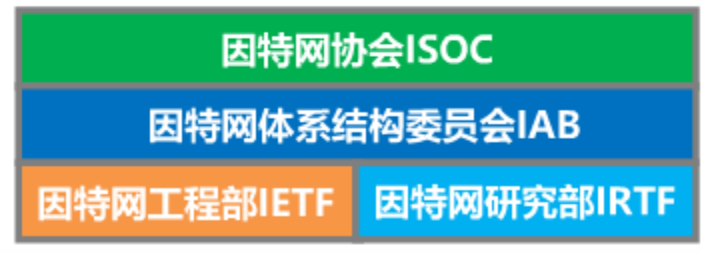

- 制订因特网的正式标准要经过以下4个阶段：
    - (1)因特网草案(在这个阶段还不是RFC文档)
    - (2)建议标准(从这个阶段开始就成为RFC文档)
    - (3)草案标准
    - (4)因特网标准

#### 1.1.4 因特网的组成

- 边缘部分：由所有连接在因特网上的主机组成。这部分是用户直接使用的，用来进行通信(传送数据、音频或视频)和资源共享
- 核心部分：由大量网络和连接这些网络的路由器组成。这部分是为边缘部分提供服务的(提供连通性和交换)。

- 图解：

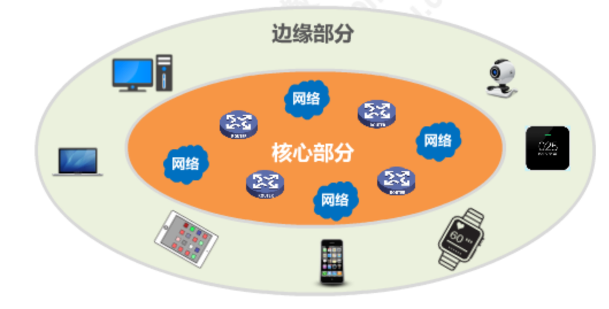

### 1.2 交换方式

- 电路交换(Circuit switching)
- 分组交换(Packet Switching)
- 报文交换(Message Switching)

#### 1.2.1 电路交换

- 电话交换机接通电话线的方式称为电路交换;
- 从通信资源的分配角度来看，交换(Switching)就是按照某种方式动态地分配传输线路的资源

- 电路交换的三个步骤:
    - 建立连接(分配通信资源)
    - 通话(一直占用通信资源)
    - 释放连接(归还通信资源)

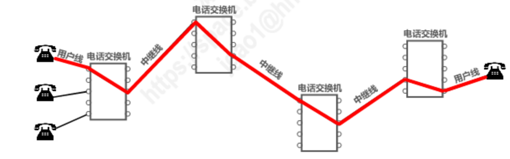

- 缺点：当使用电路交换来传送计算机数据时，其线路的传输效率往往很低

#### 1.2.3 分组交换

### 1.3 计算机网络的定义与分类

#### 1.3.1 计算机网络的定义

- 计算机网络的精确定义并未统一
- 计算机网络的最简单的定义是：一些互相连接的、自治的计算机的集合
    - 互连：是指计算机之间可以通过有线或无线的方式进行数据通信;
    - 自治：是指独立的计算机，它有自己的硬件和软件，可以单独运行使用;
    - 集合：至少需要两台计算机；

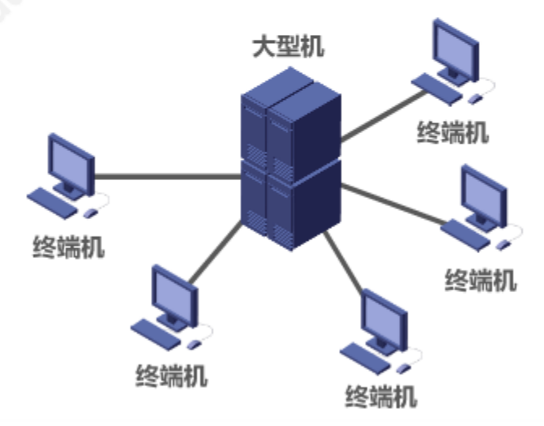

- 计算机网络的较好的定义是：计算机网络主要是由一些通用的、可编程的硬件互连而成的，而这些硬件并非专门用来实现某一特定目的(例如，传送数据或视频信号)。这些可编程的硬件能够用来传送多种不同类型的数据，并能支持广泛的和日益增长的应用，
    - 计算机网络所连接的硬件，并不限于一般的计算机，而是包括了智能手机等智能硬件。
    - 计算机网络并非专门用来传送数据，而是能够支持很多种的应用(包括今后可能出现的各种应用)。

#### 1.3.2 计算机网络的分类

- 按交换技术分类
    - 电路交换网络
    - 报文交换网络
    - 分组交换网络
- 按使用者分类
    - 公用网
    - 专用网
- 按传输介质分类
    - 有线网络
    - 无线网络
- 按覆盖范围分类
    - 广域网WAN
    - 城域网MAN
    - 局域网LAN
    - 个域网PAN
- 按拓扑结构分类
    - 总线型网络
    - 星型网络
    - 环形网络
    - 网状型网络

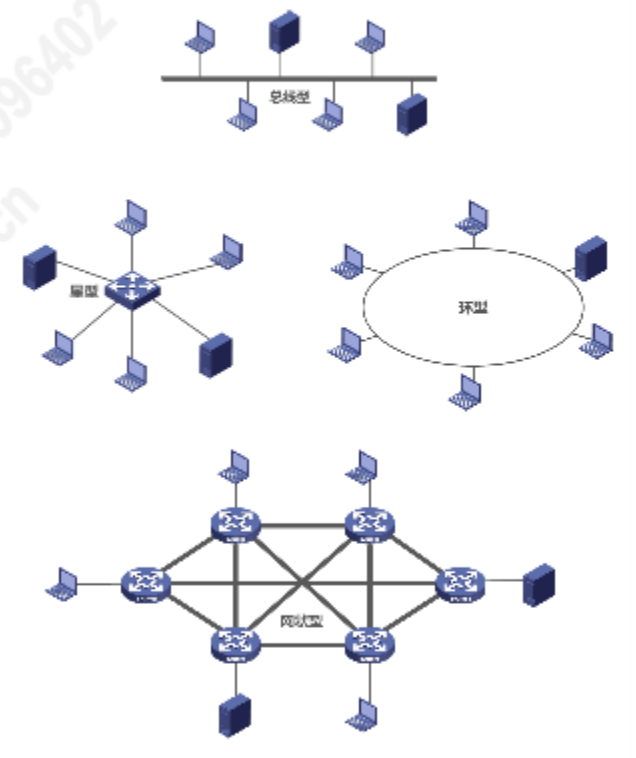

### 1.4 计算机网络的性能指标

- 性能指标可以从不同的方面来度量计算机网络的性能。
- 常用的计算机网络的性能指标有以下8个：
    - 速率
    - 带宽
    - 吞吐量
    - 时延
    - 时延带宽积
    - 往返时间
    - 利用率
    - 丢包率

## 第2章：物理层

## 第3章：数据链路层

## 第4章：网络层

## 第5章：运输层

## 第6章：应用层
