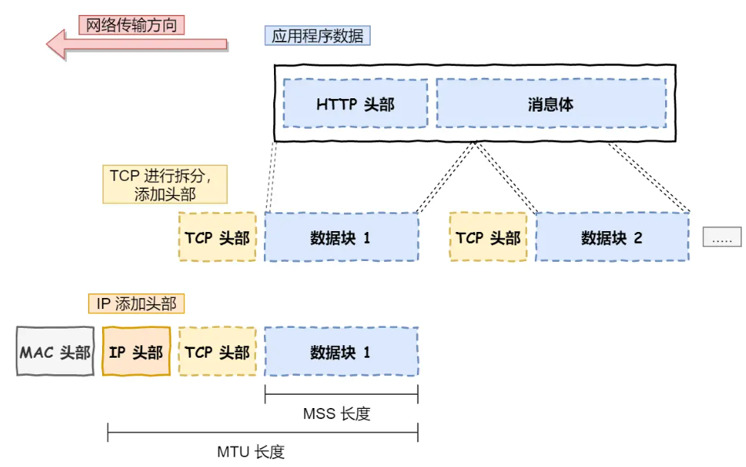
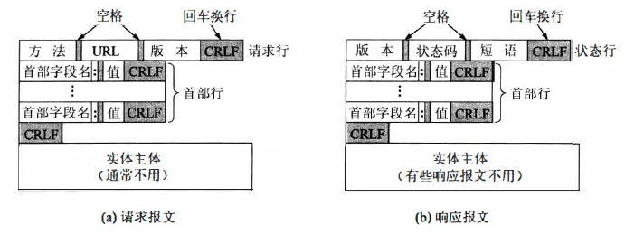
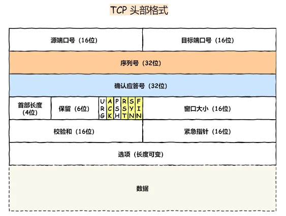

# 计算机网络补充知识

## 数据在网络层之间是如何传输的？

对于同一台设备上的进程间通信，有很多种方式，比如有管道、消息队列、共享内存、信号等方式，而对于不同设备上的进程间通信，就需要网络通信，而设备是多样性的，所以要兼容多种多样的设备，就协商出了一套**通用的网络协议**

当两台设备上的应用需要通信时，应用程序会先把待发送的数据交给本地主机的**应用层**。应用层根据所用协议（如 HTTP）为数据添加协议头，生成**应用层报文**，然后将该报文递交给**传输层**继续封装和传输。

传输层会将应用层的报文作为数据部分，再加上TCP报头组装成IP报文，报头中包含了源端口和目的端口。如果应用层的HTTP报文很大的话，传输层会把HTTP报文进行分块，如果HTTP报文的大小超过 MSS（TCP 最大报文段长度） ，就要将HTTP报文分块，这样即使中途有一个分块丢失或损坏了，只需要重新发送这一个分块，而不用重新发送整个HTTP报文。传输层会将TCP报文传递给网络层。

网络层最常使用的是 IP 协议（*Internet Protocol*），IP 协议会将传输层的报文作为数据部分，再加上 IP 包头组装成 IP 报文，如果 IP 报文大小超过 MTU（以太网中一般为 1500 字节）就会**再次进行分片**，得到一个即将发送到网络的 IP 报文，此时IP报文里面有源IP地址和目的IP地址，可以通过IP地址获取网络号和主机号。网络层负责将数据从一个设备传输到另一个设备，路由器工作在这一层，但是在一台电脑里，“网络层”指的是操作系统内核中的 **IP 协议栈**（在 TCP/IP 里叫 Internet 层），它不是硬件，而是一段内核代码，负责给每个数据报加上源/目的 IP 地址、决定下一跳、处理分片/重组以及递减 TTL 并重新计算校验和。网络层将IP报文交给网络接口层。

**网络接口层**（*Link Layer*）在 IP 头部的前面加上 MAC 头部，并封装成数据帧（Data frame）交给网卡。

网络包只是存放在内存中的一串二进制数字信息，没有办法直接发送给对方。因此，我们需要将**数字信息转换为电信号**，才能在网线上传输，也就是说，这才是真正的数据发送过程。负责执行这一操作的是**网卡**，要控制网卡还需要靠**网卡驱动程序**。网卡驱动获取网络包之后，会将其**复制**到网卡内的缓存区中，接着会在其**开头加上报头和起始帧分界符，在末尾加上用于检测错误的帧校验序列**。

- 起始帧分界符是一个用来表示包起始位置的标记
- 末尾的 `FCS`（帧校验序列）用来检查包传输过程是否有损坏

最后网卡会将包转为电信号，通过网线发送出去。

从网线发送出去的电信号，首先会被交换机给接收，交换机里的模块进行接收，接下来交换机里的模块将电信号转换为数字信号。然后通过包末尾的 `FCS` 校验错误，如果没问题则放到缓冲区。

> 这部分操作基本和计算机的网卡相同，但交换机的工作方式和网卡不同。交换机的设计是将网络包**原样**转发到目的地。交换机工作在 MAC 层，也称为**二层网络设备**。计算机的网卡本身具有 MAC 地址，并通过核对收到的包的接收方 MAC 地址判断是不是发给自己的，如果不是发给自己的则丢弃；相对地，交换机的端口不核对接收方 MAC 地址，而是直接接收所有的包并存放到缓冲区中。因此，和网卡不同，**交换机的端口不具有 MAC 地址**。

将包存入缓冲区后，接下来需要查询一下这个包的接收方 MAC 地址是否已经在 MAC 地址表中有记录了。交换机的 MAC 地址表主要包含两个信息：一个是设备的 MAC 地址；另一个是该设备连接在交换机的哪个端口上。

举个例子，如果收到的包的接收方 MAC 地址为 `00-02-B3-1C-9C-F9`，则与图中表中的第 3 行匹配，根据端口列的信息，可知这个地址位于 `3` 号端口上，然后就可以通过交换电路将包发送到相应的端口了。

所以，**交换机根据 MAC 地址表查找 MAC 地址，然后将信号发送到相应的端口**。

网络包经过交换机之后，现在到达了**路由器**，路由器中的模块会将电信号转成数字信号，然后通过包末尾的 `FCS` 进行错误校验。如果没问题则检查 MAC 头部中的**接收方 MAC 地址**，看看是不是发给自己的包，如果是就放到接收缓冲区中，否则就丢弃这个包。总的来说，路由器的端口都具有 MAC 地址，只接收与自身地址匹配的包，遇到不匹配的包则直接丢弃。

完成包接收操作之后，路由器就会**去掉**包开头的 MAC 头部。

**MAC 头部的作用就是将包送达路由器**，其中的接收方 MAC 地址就是路由器端口的 MAC 地址。因此，当包到达路由器之后，MAC 头部的任务就完成了，于是 MAC 头部就会**被丢弃**。

接下来，路由器会根据 MAC 头部后方的 `IP` 头部中的内容进行包的转发操作。

转发操作分为几个阶段，首先是查询**路由表**判断转发目标。

具体的工作流程根据上图，举个例子。

假设地址为 `10.10.1.101` 的计算机要向地址为 `192.168.1.100` 的服务器发送一个包，这个包先到达图中的路由器。

判断转发目标的第一步，就是根据包的接收方 IP 地址查询路由表中的目标地址栏，以找到相匹配的记录。

路由匹配和前面讲的一样，每个条目的子网掩码和 `192.168.1.100` IP 做 **& 与运算**后，得到的结果与对应条目的目标地址进行匹配，如果匹配就会作为候选转发目标，如果不匹配就继续与下个条目进行路由匹配。

如第二条目的子网掩码 `255.255.255.0` 与 `192.168.1.100` IP 做 **& 与运算**后，得到结果是 `192.168.1.0` ，这与第二条目的目标地址 `192.168.1.0` 匹配，该第二条目记录就会被作为转发目标。

实在找不到匹配路由时，就会选择**默认路由**，路由表中子网掩码为 `0.0.0.0` 的记录表示「默认路由」。

> 这一步转发的工作原理和交换机类似，也是通过查表判断包转发的目标。不过在具体的操作过程上，路由器和交换机是有区别的。
>
> - 因为**路由器**是基于 IP 设计的，俗称**三层**网络设备，路由器的各个端口都具有 MAC 地址和 IP 地址。路由器的端口具有 MAC 地址，因此它就能够成为以太网的发送方和接收方；同时还具有 IP 地址，从这个意义上来说，它和计算机的网卡是一样的。
> - 而**交换机**是基于以太网设计的，俗称**二层**网络设备，交换机的端口不具有 MAC 地址。
>
> 在家用场景里，厂商常把二层交换功能和三层路由功能做进同一台盒子里出售，并且统称为“无线路由器”。其实，它只是同时嵌入了一个小型交换机模块和一个路由转发模块
>
> 路由器基本原理：当转发包时，首先路由器端口会接收发给自己的以太网包，然后**路由表**查询转发目标，再由相应的端口作为发送方将以太网包发送出去。

接下来就会进入包的**发送操作**。

首先，我们需要根据**路由表的网关列**判断对方的地址。

- 如果网关是一个 IP 地址，则这个IP 地址就是我们要转发到的目标地址，**还未抵达终点**，还需继续需要路由器转发。
- 如果网关为空，则 IP 头部中的接收方 IP 地址就是要转发到的目标地址，也是就终于找到 IP 包头里的目标地址了，说明**已抵达终点**。

知道对方的 IP 地址之后，接下来需要通过 `ARP` 协议根据 IP 地址查询 MAC 地址，并将查询的结果作为接收方 MAC 地址。

路由器也有 ARP 缓存，因此首先会在 ARP 缓存中查询，如果找不到则发送 ARP 查询请求。

接下来是发送方 MAC 地址字段，这里填写输出端口的 MAC 地址。还有一个以太类型字段，填写 `0800` （十六进制）表示 IP 协议。

网络包完成后，接下来会将其转换成电信号并通过端口发送出去。这一步的工作过程和计算机也是相同的。

发送出去的网络包会通过**交换机**到达下一个路由器。由于接收方 MAC 地址就是下一个路由器的地址，所以交换机会根据这一地址将包传输到下一个路由器。

接下来，下一个路由器会将包转发给再下一个路由器，经过层层转发之后，网络包就到达了最终的目的地。在网络包传输的过程中，**源 IP 和目标 IP 始终是不会变的，一直变化的是 MAC 地址**，因为需要 MAC 地址在以太网内进行**两个设备**之间的包传输。

数据包抵达服务器后，服务器会先扒开数据包的 MAC 头部，查看是否和服务器自己的 MAC 地址符合，符合就将包收起来。接着继续扒开数据包的 IP 头，发现 IP 地址符合，根据 IP 头中协议项，知道自己上层是 TCP 协议。于是，扒开 TCP 的头，里面有序列号，需要看一看这个序列包是不是我想要的，如果是就放入缓存中然后返回一个 ACK，如果不是就丢弃。TCP头部里面还有端口号， HTTP 的服务器正在监听这个端口号。于是，服务器自然就知道是 HTTP 进程想要这个包，于是就将包发给 HTTP 进程。服务器的 HTTP 进程看到，原来这个请求是要访问一个页面，于是就把这个网页封装在 HTTP 响应报文里。HTTP 响应报文也需要穿上 TCP、IP、MAC 头部，不过这次是源地址是服务器 IP 地址，目的地址是客户端 IP 地址。

穿好头部衣服后，从网卡出去，交由交换机转发到出城的路由器，路由器就把响应数据包发到了下一个路由器，就这样跳啊跳。

最后跳到了客户端的城门把守的路由器，路由器扒开 IP 头部发现是要找城内的人，于是又把包发给了城内的交换机，再由交换机转发到客户端。

客户端收到了服务器的响应数据包后，同样也非常的高兴，客户能拆快递了！

于是，客户端开始扒皮，把收到的数据包的皮扒剩 HTTP 响应报文后，交给浏览器去渲染页面，一份特别的数据包快递，就这样显示出来了！

最后，客户端要离开了，向服务器发起了 TCP 四次挥手，至此双方的连接就断开了。

----

IP 头部中的接收方 IP 地址表示网络包的目的地，通过这个地址我们就可以判断要将包发到哪里，但在以太网的世界中，这个思路是行不通的。

什么是以太网呢？电脑上的以太网接口，Wi-Fi接口，以太网交换机、路由器上的千兆，万兆以太网口，还有网线，它们都是以太网的组成部分。以太网就是一种在「局域网」内，把附近的设备连接起来，使它们之间可以进行通讯的技术。

以太网在判断网络包目的地时和 IP 的方式不同，因此必须采用相匹配的方式才能在以太网中将包发往目的地，而 MAC 头部就是干这个用的，所以，在以太网进行通讯要用到 MAC 地址。

MAC 头部是以太网使用的头部，它包含了接收方和发送方的 MAC 地址等信息，我们可以通过 ARP 协议获取对方的 MAC 地址。

所以说，网络接口层主要为网络层提供「链路级别」传输的服务，负责在以太网、WiFi 这样的底层网络上发送原始数据包，工作在网卡这个层次，使用 MAC 地址来标识网络上的设备。

----

如果 HTTP 请求消息比较长，超过了 `MSS` 的长度，这时 TCP 就需要把 HTTP 的数据拆解成一块块的数据发送，而不是一次性发送所有数据。

- `MTU`：一个网络包的最大长度，以太网中一般为 `1500` 字节。
- `MSS`：除去 IP 和 TCP 头部之后，一个网络包所能容纳的 TCP 数据的最大长度。

数据会被以 `MSS` 的长度为单位进行拆分，拆分出来的每一块数据都会被放进单独的网络包中。也就是在每个被拆分的数据加上 TCP 头信息，然后交给 IP 模块来发送数据。

----

电脑连上 Wi‑Fi 后，双方各掌握一对地址信息：

- **电脑得到路由器的地址**
  - **IP 地址**：DHCP 分配时告诉电脑“默认网关 IP”；
  - **MAC 地址**：第一次真正发包前通过 ARP 解析出来并缓存。
- **路由器记录电脑的地址**
  - **MAC 地址**：在 Wi‑Fi 关联阶段就登记在 AP 的关联表；
  - **IP 地址**：路由器里的 DHCP 服务器把分配给电脑的 IP 与其 MAC 一起写入租约表。

所以——电脑知道“路由器的 IP+MAC”，路由器知道“电脑的 IP+MAC”。

----

HTTP报文格式：

TCP报文段格式：

----

如果交换机中，当 MAC 地址表找不到指定的 MAC 地址会怎么样？

地址表中找不到指定的 MAC 地址。这可能是因为具有该地址的设备还没有向交换机发送过包，或者这个设备一段时间没有工作导致地址被从地址表中删除了。

这种情况下，交换机无法判断应该把包转发到哪个端口，只能将包转发到除了源端口之外的所有端口上，无论该设备连接在哪个端口上都能收到这个包。

这样做不会产生什么问题，因为以太网的设计本来就是将包发送到整个网络的，然后**只有相应的接收者才接收包，而其他设备则会忽略这个包**。

有人会说：“这样做会发送多余的包，会不会造成网络拥塞呢？”

其实完全不用过于担心，因为发送了包之后目标设备会作出响应，只要返回了响应包，交换机就可以将它的地址写入 MAC 地址表，下次也就不需要把包发到所有端口了。

局域网中每秒可以传输上千个包，多出一两个包并无大碍。

此外，如果接收方 MAC 地址是一个**广播地址**，那么交换机会将包发送到除源端口之外的所有端口。

以下两个属于广播地址：

- MAC 地址中的 `FF:FF:FF:FF:FF:FF`
- IP 地址中的 `255.255.255.255`

----

“笔记本的是自带交换机的吗？交换机现在我还不知道是什么”

笔记本不是交换机，交换机通常是2个网口以上。现在家里的路由器其实有了交换机的功能了。交换机可以简单理解成一个设备，三台电脑网线接到这个设备，这三台电脑就可以互相通信了，交换机嘛，交换数据这么理解就可以。

----

“如果知道你电脑的mac地址，我可以直接给你发消息吗？”

Mac地址只能是两个设备之间传递时使用的，如果你要从大老远给我发消息，是离不开 IP 的。

----

“请问公网服务器的 Mac 地址是在什么时机通过什么方式获取到的？我看 arp 获取Mac地址只能获取到内网机器的 Mac 地址吧？”

在发送数据包时，如果目标主机不是本地局域网，填入的MAC地址是路由器，也就是把数据包转发给路由器，路由器一直转发下一个路由器，直到转发到目标主机的路由器，发现 IP 地址是自己局域网内的主机，就会 arp 请求获取目标主机的 MAC 地址，从而转发到这个服务器主机。

转发的过程中，源IP地址和目标IP地址是不会变的（前提：没有使用 NAT 网络的），源 MAC 地址和目标 MAC 地址是会变化的。

## 如何理解 TCP 是面向字节流的协议

之所以会说 TCP 是面向字节流的协议，UDP 是面向报文的协议，是因为操作系统对 TCP 和 UDP 协议的**发送方的机制不同**，也就是问题原因在发送方。

- 当用户消息通过 UDP 协议传输时，**操作系统不会对消息进行拆分**，在组装好 UDP 头部后就交给网络层来处理，所以发出去的 UDP 报文中的数据部分就是完整的用户消息，也就是**每个 UDP 报文就是一个用户消息的边界**，这样接收方在接收到 UDP 报文后，读一个 UDP 报文就能读取到完整的用户消息。
- 当用户消息通过 TCP 协议传输时，**消息可能会被操作系统分组成多个的 TCP 报文**，也就是一个完整的用户消息被拆分成多个 TCP 报文进行传输。因此，**我们不能认为一个用户消息对应一个 TCP 报文，正因为这样，所以 TCP 是面向字节流的协议**。当两个消息的某个部分内容被分到同一个 TCP 报文时，就是我们常说的 TCP 粘包问题，这时接收方不知道消息的边界的话，是无法读出有效的消息。要解决这个问题，要交给**应用程序**。

## HTTP 缓存技术

### HTTP 缓存有哪些实现方式？

对于一些具有重复性的 HTTP 请求，比如每次请求得到的数据都一样的，我们可以把这对「请求-响应」的数据都**缓存在本地**，那么下次就直接读取本地的数据，不必在通过网络获取服务器的响应了，这样的话 HTTP/1.1 的性能肯定肉眼可见的提升。

所以，避免发送 HTTP 请求的方法就是通过**缓存技术**，HTTP 设计者早在之前就考虑到了这点，因此 HTTP 协议的头部有不少是针对缓存的字段。

HTTP 缓存有两种实现方式，分别是**强制缓存和协商缓存**。

### 什么是强制缓存？

强缓存指的是只要浏览器判断缓存没有过期，则直接使用浏览器的本地缓存，决定是否使用缓存的主动性在于浏览器这边。

如下图中，返回的是 200 状态码，但在 size 项中标识的是 from disk cache，就是使用了强制缓存。

强缓存是利用下面这两个 HTTP 响应头部（Response Header）字段实现的，它们都用来表示资源在客户端缓存的有效期：

- `Cache-Control`， 是一个相对时间；
- `Expires`，是一个绝对时间；

如果 HTTP 响应头部同时有 Cache-Control 和 Expires 字段的话，**Cache-Control 的优先级高于 Expires** 。

Cache-control 选项更多一些，设置更加精细，所以建议使用 Cache-Control 来实现强缓存。具体的实现流程如下：

- 当浏览器第一次请求访问服务器资源时，服务器会在返回这个资源的同时，在 Response 头部加上 Cache-Control，Cache-Control 中设置了过期时间大小；
- 浏览器再次请求访问服务器中的该资源时，会先**通过请求资源的时间与 Cache-Control 中设置的过期时间大小，来计算出该资源是否过期**，如果没有，则使用该缓存，否则重新请求服务器；
- 服务器再次收到请求后，会再次更新 Response 头部的 Cache-Control。

### 什么是协商缓存？

当我们在浏览器使用开发者工具的时候，你可能会看到过某些请求的响应码是 `304`，这个是告诉浏览器可以使用本地缓存的资源，通常这种通过服务端告知客户端是否可以使用缓存的方式被称为协商缓存。

上图就是一个协商缓存的过程，所以**协商缓存就是与服务端协商之后，通过协商结果来判断是否使用本地缓存**。

协商缓存可以基于两种头部来实现。

第一种：请求头部中的 `If-Modified-Since` 字段与响应头部中的 `Last-Modified` 字段实现，这两个字段的意思是：

- 响应头部中的 `Last-Modified`：标示这个响应资源的最后修改时间；
- 请求头部中的 `If-Modified-Since`：当资源过期了，发现响应头中具有 Last-Modified 声明，则再次发起请求的时候带上 Last-Modified 的时间，服务器收到请求后发现有 If-Modified-Since 则与被请求资源的最后修改时间进行对比（Last-Modified），如果最后修改时间较新（大），说明资源又被改过，则返回最新资源，HTTP 200 OK；如果最后修改时间较旧（小），说明资源无新修改，响应 HTTP 304 走缓存。

第二种：请求头部中的 `If-None-Match` 字段与响应头部中的 `ETag` 字段，这两个字段的意思是：

- 响应头部中 `Etag`：唯一标识响应资源；
- 请求头部中的 `If-None-Match`：当资源过期时，浏览器发现响应头里有 Etag，则再次向服务器发起请求时，会将请求头 If-None-Match 值设置为 Etag 的值。服务器收到请求后进行比对，如果资源没有变化返回 304，如果资源变化了返回 200。

第一种实现方式是基于时间实现的，第二种实现方式是基于一个唯一标识实现的，相对来说后者可以更加准确地判断文件内容是否被修改，避免由于时间篡改导致的不可靠问题。

如果在第一次请求资源的时候，服务端返回的 HTTP 响应头部同时有 Etag 和 Last-Modified 字段，那么客户端再下一次请求的时候，如果带上了 ETag 和 Last-Modified 字段信息给服务端，**这时 Etag 的优先级更高**，也就是服务端先会判断 Etag 是否变化了，如果 Etag 有变化就不用在判断 Last-Modified 了，如果 Etag 没有变化，然后再看 Last-Modified。

**为什么 ETag 的优先级更高？**这是因为 ETag 主要能解决 Last-Modified 几个比较难以解决的问题：

1. 在没有修改文件内容情况下文件的最后修改时间可能也会改变，这会导致客户端认为这文件被改动了，从而重新请求；
2. 可能有些文件是在秒级以内修改的，`If-Modified-Since` 能检查到的粒度是秒级的，使用 Etag就能够保证这种需求下客户端在 1 秒内能刷新多次；
3. 有些服务器不能精确获取文件的最后修改时间。

注意，**协商缓存这两个字段都需要配合强制缓存中 Cache-Control 字段来使用，只有在未能命中强制缓存的时候，才能发起带有协商缓存字段的请求**。

下图是强制缓存和协商缓存的工作流程：

当使用 ETag 字段实现的协商缓存的过程：

- 当浏览器第一次请求访问服务器资源时，服务器会在返回这个资源的同时，在 Response 头部加上 ETag 唯一标识，这个唯一标识的值是根据当前请求的资源生成的；

- 当浏览器再次请求访问服务器中的该资源时，首先会先检查强制缓存是否过期：

  - 如果没有过期，则直接使用本地缓存；
  - 如果缓存过期了，会在 Request 头部加上 If-None-Match 字段，该字段的值就是 ETag 唯一标识；

- 服务器再次收到请求后，

  会根据请求中的 If-None-Match 值与当前请求的资源生成的唯一标识进行比较：

  - **如果值相等，则返回 304 Not Modified，不会返回资源**；
  - 如果不相等，则返回 200 状态码和返回资源，并在 Response 头部加上新的 ETag 唯一标识；

- 如果浏览器收到 304 的请求响应状态码，则会从本地缓存中加载资源，否则更新资源。

### HTTPS 解决了 HTTP 的哪些问题？

HTTP 由于是明文传输，所以安全上存在以下三个风险：

- **窃听风险**，比如通信链路上可以获取通信内容，用户号容易没。
- **篡改风险**，比如强制植入垃圾广告，视觉污染，用户眼容易瞎。
- **冒充风险**，比如冒充淘宝网站，用户钱容易没。

HTTP**S** 在 HTTP 与 TCP 层之间加入了 `SSL/TLS` 协议，可以很好的解决了上述的风险：

- **信息加密**：交互信息无法被窃取，但你的号会因为「自身忘记」账号而没。
- **校验机制**：无法篡改通信内容，篡改了就不能正常显示，但百度「竞价排名」依然可以搜索垃圾广告。
- **身份证书**：证明淘宝是真的淘宝网，但你的钱还是会因为「剁手」而没。

可见，只要自身不做「恶」，SSL/TLS 协议是能保证通信是安全的。

> HTTPS 是如何解决上面的三个风险的？

- **混合加密**的方式实现信息的**机密性**，解决了窃听的风险。
- **摘要算法**的方式来实现**完整性**，它能够为数据生成独一无二的「指纹」，指纹用于校验数据的完整性，解决了篡改的风险。
- 将服务器公钥放入到**数字证书**中，解决了冒充的风险。

*1. 混合加密*

通过**混合加密**的方式可以保证信息的**机密性**，解决了窃听的风险。

HTTPS 采用的是**对称加密**和**非对称加密**结合的「混合加密」方式：

- 在通信建立前采用**非对称加密**的方式交换「会话秘钥」，后续就不再使用非对称加密。
- 在通信过程中全部使用**对称加密**的「会话秘钥」的方式加密明文数据。

采用「混合加密」的方式的原因：

- **对称加密**只使用一个密钥，运算速度快，密钥必须保密，无法做到安全的密钥交换。
- **非对称加密**使用两个密钥：公钥和私钥，公钥可以任意分发而私钥保密，解决了密钥交换问题但速度慢。

*2. 摘要算法 + 数字签名*

为了保证传输的内容不被篡改，我们需要对内容计算出一个「指纹」，然后同内容一起传输给对方。

对方收到后，先是对内容也计算出一个「指纹」，然后跟发送方发送的「指纹」做一个比较，如果「指纹」相同，说明内容没有被篡改，否则就可以判断出内容被篡改了。

那么，在计算机里会**用摘要算法（哈希函数）来计算出内容的哈希值**，也就是内容的「指纹」，这个**哈希值是唯一的，且无法通过哈希值推导出内容**。

通过哈希算法可以确保内容不会被篡改，**但是并不能保证「内容 + 哈希值」不会被中间人替换，因为这里缺少对客户端收到的消息是否来源于服务端的证明**。

举个例子，你想向老师请假，一般来说是要求由家长写一份请假理由并签名，老师才能允许你请假。

但是你有模仿你爸爸字迹的能力，你用你爸爸的字迹写了一份请假理由然后签上你爸爸的名字，老师一看到这个请假条，查看字迹和签名，就误以为是你爸爸写的，就会允许你请假。

那作为老师，要如何避免这种情况发生呢？现实生活中的，可以通过电话或视频来确认是否是由父母发出的请假，但是计算机里可没有这种操作。

那为了避免这种情况，计算机里会用**非对称加密算法**来解决，共有两个密钥：

- 一个是公钥，这个是可以公开给所有人的；
- 一个是私钥，这个必须由本人管理，不可泄露。

这两个密钥可以**双向加解密**的，比如可以用公钥加密内容，然后用私钥解密，也可以用私钥加密内容，公钥解密内容。

流程的不同，意味着目的也不相同：

- **公钥加密，私钥解密**。这个目的是为了**保证内容传输的安全，即数字加密**，因为被公钥加密的内容，其他人是无法解密的，只有持有私钥的人，才能解密出实际的内容；
- **私钥加密，公钥解密**。这个目的是为了**保证消息不会被冒充，即身份认证**，因为私钥是不可泄露的，如果公钥能正常解密出私钥加密的内容，就能证明这个消息是来源于持有私钥身份的人发送的。

一般我们不会用非对称加密来加密实际的传输内容，因为非对称加密的计算比较耗费性能的。

所以非对称加密的用途主要在于**通过「私钥加密，公钥解密」的方式，来确认消息的身份**，我们常说的**数字签名算法**，就是用的是这种方式，不过私钥加密内容不是内容本身，而是**对内容的哈希值加密**。

私钥是由服务端保管，然后服务端会向客户端颁发对应的公钥。如果客户端收到的信息，能被公钥解密，就说明该消息是由服务器发送的。

引入了数字签名算法后，你就无法模仿你爸爸的字迹来请假了，你爸爸手上持有着私钥，你老师持有着公钥。

这样只有用你爸爸手上的私钥才对请假条进行「签名」，老师通过公钥看能不能解出这个「签名」，如果能解出并且确认内容的完整性，就能证明是由你爸爸发起的请假条，这样老师才允许你请假，否则老师就不认。

*3. 数字证书*

前面我们知道：

- 可以通过哈希算法来保证消息的完整性；
- 可以通过数字签名来保证消息的来源可靠性（能确认消息是由持有私钥的一方发送的）；

但是这还远远不够，**还缺少身份验证的环节**，万一公钥是被伪造的呢？

还是拿请假的例子，虽然你爸爸持有私钥，老师通过是否能用公钥解密来确认这个请假条是不是来源你父亲的。

但是我们还可以自己伪造出一对公私钥啊！

你找了个夜晚，偷偷把老师桌面上和你爸爸配对的公钥，换成了你的公钥，那么下次你在请假的时候，你继续模仿你爸爸的字迹写了个请假条，然后用你的私钥做个了「数字签名」。

但是老师并不知道自己的公钥被你替换过了，所以他还是按照往常一样用公钥解密，由于这个公钥和你的私钥是配对的，老师当然能用这个被替换的公钥解密出来，并且确认了内容的完整性，于是老师就会以为是你父亲写的请假条，又允许你请假了。

好家伙，为了一个请假，真的是斗智斗勇。

后面你的老师和父亲发现了你伪造公私钥的事情后，决定重新商量一个对策来应对你这个臭家伙。

正所谓魔高一丈，道高一尺。

既然伪造公私钥那么随意，所以你爸把他的公钥注册到**警察局**，警察局用他们自己的私钥对你父亲的公钥做了个数字签名，然后把你爸爸的「个人信息 + 公钥 + 数字签名」打包成一个**数字证书，也就是说这个数字证书包含你爸爸的公钥。**

这样，你爸爸如果因为家里确实有事要向老师帮你请假的时候，不仅会用自己的私钥对内容进行签名，还会把数字证书给到老师。

老师拿到了数字证书后，**首先会去警察局验证这个数字证书是否合法**，因为数字证书里有警察局的数字签名，警察局要验证证书合法性的时候，用自己的公钥解密，如果能解密成功，就说明这个数字证书是在警察局注册过的，就认为该数字证书是合法的，然后就会把数字证书里头的公钥（你爸爸的）给到老师。

**由于通过警察局验证了数字证书是合法的，那么就能证明这个公钥就是你父亲的**，于是老师就可以安心的用这个公钥解密出请假条，如果能解密出，就证明是你爸爸写的请假条。

正是通过了一个权威的机构来证明你爸爸的身份，所以你的伪造公私钥这个小伎俩就没用了。

在计算机里，这个权威的机构就是 CA （数字证书认证机构），将服务器公钥放在数字证书（由数字证书认证机构颁发）中，只要证书是可信的，公钥就是可信的。

数字证书的工作流程，我也画了一张图，方便大家理解：

通过数字证书的方式保证服务器公钥的身份，解决冒充的风险。
