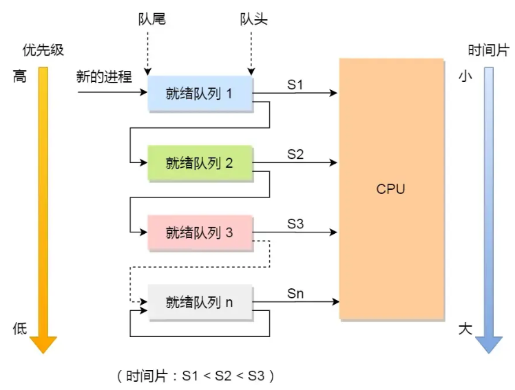
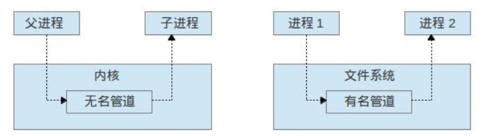

# 操作系统

## 基础

### 🌟什么是操作系统？

操作系统是计算机系统中管理硬件和软件资源的中间层系统，屏蔽了底层硬件的复杂性，并为用户提供了便捷的交互方式（图形化界面、命令行界面、手势触碰、快捷键）。

### 🌟操作系统主要有哪些功能？

从资源管理的角度来看，操作系统有 6 大功能：

1. **进程和线程的管理**：进程的创建、撤销、阻塞、唤醒，进程间的通信等。
2. **存储管理**：内存和外存（磁盘等）的分配和管理等。
3. **文件管理**：文件的读、写、创建及删除等。
4. **网络管理**：网络是计算机系统中连接不同计算机的方式，操作系统需要管理计算机网络的配置、连接、通信和安全等，以提供高效可靠的网络服务。
5. **安全管理**：用户的身份认证、访问控制、文件加密等，以防止非法用户对系统资源的访问和操作。
6. **设备管理**：完成设备（输入输出设备和外部存储设备等）的请求或释放，以及设备启动等功能。

## 操作系统结构

### 什么是内核？

内核是一个计算机程序，它是操作系统的核心，提供了操作系统最核心的能力，可以控制操作系统中所有的内容。

### 🌟什么是用户空间和内核空间？

在计算机系统中，内存可以分为两大区域：用户空间（User Space）和内核空间（Kernel Space）。

- **⽤户空间是操作系统为应用程序（如用户运行的进程）分配的内存区域，该空间中的进程不能直接访问硬件或内核数据结构**，只能通过系统调用与内核通信。
- **内核空间是操作系统内核代码及其运行时数据结构所处的内存区域，运行于此的内核程序拥有对系统所有硬件与软件资源的完全访问权限****，并依托这一权限实现进程管理、存储管理、文件管理、网络管理等核心系统功能。

### 🌟什么是用户态和内核态？

内核态和用户态是操作系统中的两种运行模式。

- 用户态：程序在用户空间运行时处于用户态，权限较低，CPU只能执行部分指令集，无法直接访问硬件资源，主要用于运行用户程序。

- 内核态：程序在内核空间运行时处于内核态，拥有最高权限，可直接访问所有硬件和系统资源，主要用于操作系统内核的运行。
  - 内核态的底层操作主要包括：内存管理、进程管理、设备驱动程序控制、系统调用等。这些操作涉及到操作系统的核心功能，需要较高的权限来执行。

### 🌟为什么要分为用户态和内核态？

这种划分有助于保证操作系统的安全性、稳定性和易维护性。

- 安全性：通过对权限的划分，用户程序无法直接访问硬件资源，从而**避免了恶意程序对系统资源的破坏**。
- 稳定性：用户态程序出现问题时，不会影响到整个系统，**避免了程序故障导致系统崩溃的风险**。
- 易维护性：内核态和用户态的划分使得操作系统内核与用户程序之间有了明确的边界，有利于系统的模块化和方便维护。

### 🌟用户态和内核态是如何切换的？

**当应用程序执行系统调用时，CPU 将从用户态切换到内核态，进入内核空间执行相应的内核代码，然后再切换回用户态。**

**系统调用是应用程序请求操作系统内核提供服务的接口，如文件操作（如 open、read、write）、进程控制（如 fork、exec）、内存管理（如 mmap）等。**

## 进程和线程

### 🌟说说进程、线程和协程

- **进程：是程序的一次运行实例，它是操作系统进行资源分配的基本单位（最小单元），它拥有自己的独立内存空间和资源，可以理解成我们在电脑上启动的一个个应用。**
  - 每个进程都有独立的内存空间和资源，不与其他进程共享，因此其稳定性和安全性相对较高，但同时上下文切换的开销也较大，因为需要保存和恢复整个进程的状态。
    - 内存空间包括：代码段、数据段、堆、栈等；
    - 资源包括：句柄（文件句柄、网络句柄、线程句柄）、环境变量、CPU时间片
- **线程：是进程内的一个独立执行单元，是操作系统进行CPU调度和执行的基本单位。**
  - 多个线程共享所属进程的内存空间和资源，每个线程有自己的程序计数器、寄存器和栈空间。然而，由于多个线程共享内存空间，因此存在数据竞争和线程安全的问题，需要通过同步和互斥机制来解决。
  - 线程的上下文切换开销较小，因为只需要保存和恢复线程的上下文，而不是整个进程的状态。
  - 在 JVM 中，多个线程共享进程的**堆**和**方法区**，每个线程有自己的**程序计数器**、**虚拟机栈**和**本地方法栈**，成本比进程小。
- 协程：**是一种用户态的轻量级线程，其调度完全由用户程序控制，而不需要内核的参与**。然后Java 自身是不支持协程的。
  - 协程拥有自己的寄存器上下文和栈，但与其他协程共享堆内存。
  - 协程的切换开销非常小，只需要保存和恢复协程的上下文，而无需进行内核级的上下文切换，这使得协程在处理大量并发任务时具有非常高的效率。
  - 然而，协程需要程序员显式地进行调度和管理，相对于线程和进程来说，其编程模型更为复杂。

**进程（process）**是程序的一次运行实例，也是操作系统进行资源分配和隔离的重要单位。一个进程通常拥有独立的虚拟地址空间、文件描述符和其他系统资源。

**线程（thread）同一个进程可以包含多个线程，这些线程共享进程的地址空间和大部分资源，因此线程之间交换数据较方便，但也更容易发生数据竞争。

二者的关系可以概括为：

- 一个程序运行后通常对应一个或多个进程；
- 一个进程可以创建多个线程；
- 同一进程中的线程共享进程资源；
- 多个线程可以并发执行，在多核 CPU 上还可能并行执行。

#### 线程和进程的区别是什么？

- **本质区别**：进程是操作系统资源分配的基本单位；而线程是CPU调度和执行的基本单位
- **资源分配上**：进程是独立的资源分配单位，因此系统在运行的时候会为每个进程分配独立的内存空间和资源；线程共享所属进程的资源。
- **包含关系**：一个进程可以包含一个或多个线程，没有线程的进程是单线程的。
- **在开销上**：每个进程都有独立的代码段和数据段（程序上下文），程序之间的切换会有较大的开销；线程可以看做轻量级的进程，同一类线程共享代码段和数据段，每个线程都有自己独立的运行栈和程序计数器（PC），线程之间切换的开销小。
- **通信方式**：进程间通信需要通过特定机制，如管道、消息队列、信号量等，相对复杂；同一进程内的线程间通信简单，直接共享内存。
- **稳定性方面**：进程中的子进程崩溃，并不会影响其他进程；进程中某个线程如果崩溃了，可能会导致整个进程都崩溃。

### 为什么进程之下还要设计线程？

进程之下设计线程，是为了解决单进程和多进程在处理并发任务时的不足：单进程中各功能模块无法并发执行，会导致任务（如视频播放）执行不连贯、资源利用效率低；多进程虽能实现并发，但进程间通信复杂且维护开销大（如创建、终止、切换时的资源分配与回收成本高）。而线程作为进程内的执行单元，既能支持各模块并发运行，又共享进程的地址空间，既解决了单进程的效率问题，又避免了多进程的通信与开销难题，因此成为更高效的并发处理方案。

我们举个例子，假设你要编写一个视频播放器软件，那么该软件功能的核心模块有三个：

- 从视频文件当中读取数据；
- 对读取的数据进行解压缩；
- 把解压缩后的视频数据播放出来；

对于单进程的实现方式，我想大家都会是以下这个方式：

对于单进程的这种方式，存在以下问题：

- 播放出来的画面和声音会不连贯，因为当 CPU 能力不够强的时候，Read 的时候可能进程就等在这了，这样就会导致等半天才进行数据解压和播放；
- 各个函数之间不是并发执行，影响资源的使用效率；

那改进成多进程的方式：

对于多进程的这种方式，依然会存在问题：

- 进程之间如何通信，共享数据？
- 维护进程的系统开销较大，如创建进程时，分配资源、建立 PCB；终止进程时，回收资源、撤销 PCB；进程切换时，保存当前进程的状态信息；

那到底如何解决呢？需要有一种新的实体，满足以下特性：

- 实体之间可以并发运行；
- 实体之间共享相同的地址空间；

这个新的实体，就是**线程(** ***Thread*** **)**，线程之间可以并发运行且共享相同的地址空间。

### 🌟什么是进程上下文切换？

- **进程上下文切换是操作系统在多任务处理时，将 CPU 从一个进程切换到另一个进程的过程。它通过保存当前进程状态并加载另一个进程状态实现，使多个进程能共享CPU资源。**

#### 进程上下文切换流程

进程上下文切换通常包含以下几个步骤：
- **保存当前进程的上下文 ：操作系统将当前进程的 CPU 执行状态（内核堆栈、寄存器值、程序计数器等）及资源状态（如虚拟内存映射信息）保存至该进程的 PCB（进程控制块）中。**
- **选择下一个待执行的进程** ：操作系统将执行权切换到调度器（Scheduler），调度程序依据调度算法（如优先级调度、时间片轮转等）从就绪队列中选中下一个待执行的进程。
- **恢复目标进程的上下文** ：从要恢复运行的进程中的进程控制块PCB中取出上下文信息，加载到 CPU 寄存器中，使目标进程接管 CPU 继续执行。
- **切换至目标进程** ：完成上下文加载后，CPU 正式切换到目标进程，使其接续执行。

#### 进程上下文切换是切换什么呢？

- 进程由操作系统内核管理和调度，因此所有上下文切换动作都必须在内核态（操作系统权限级别）下执行，不能在用户态（普通进程权限级别）完成。

- **进程的上下文切换不仅包含了虚拟内存映射信息、用户栈、全局变量等用户空间资源，还包括了内核堆栈、寄存器值、程序计数器等内核空间的执行状态。** 这些需要切换的上下文信息通常存储在进程的 PCB（进程控制块）中：当操作系统需要调度其他进程执行时，会从目标进程的 PCB 中取出已保存的上下文，加载到 CPU 中，使该进程能够无缝接续之前的执行状态继续运行。

- 进程的上下文开销是很关键的，我们希望它的开销越小越好，这样可以使得进程可以把更多时间花费在执行程序上，而不是耗费在上下文切换。

#### CPU上下文切换

大多数操作系统都是多任务，通常支持大于 CPU 数量的任务同时运行。实际上，这些任务并不是同时运行的，只是因为系统在很短的时间内，让各个任务分别在 CPU 运行，于是就造成同时运行的错觉。

任务是交给 CPU 运行的，那么在每个任务运行前，CPU 需要知道任务从哪里加载，又从哪里开始运行。

所以，操作系统需要事先帮 CPU 设置好 **CPU 寄存器和程序计数器**。

CPU 寄存器是 CPU 内部一个容量小，但是速度极快的内存（缓存）。我举个例子，寄存器像是你的口袋，内存像你的书包，硬盘则是你家里的柜子，如果你的东西存放到口袋，那肯定是比你从书包或家里柜子取出来要快的多。

再来，程序计数器则是用来存储 CPU 正在执行的指令位置、或者即将执行的下一条指令位置。

所以说，CPU 寄存器和程序计数器是 CPU 在运行任何任务前，所必须依赖的环境，这些环境就叫做 **CPU 上下文**。

既然知道了什么是 CPU 上下文，那理解 CPU 上下文切换就不难了。

CPU 上下文切换就是先把前一个任务的 CPU 上下文（CPU 寄存器和程序计数器）保存起来，然后加载新任务的上下文到这些寄存器和程序计数器，最后再跳转到程序计数器所指的新位置，运行新任务。

系统内核会存储保持下来的上下文信息，当此任务再次被分配给 CPU 运行时，CPU 会重新加载这些上下文，这样就能保证任务原来的状态不受影响，让任务看起来还是连续运行.

上面说到所谓的「任务」，主要包含进程、线程和中断。所以，可以根据任务的不同，把 CPU 上下文切换分成：**进程上下文切换、线程上下文切换和中断上下文切换**。

### 🌟什么是线程上下文切换（Thread Context Switch）？

- **线程上下文切换是指 CPU 从一个线程切换到另一个线程执行时的过程。在线程切换的过程中，CPU 需要保存当前线程的执行状态，并加载下一个线程的上下文。**

  - 当两个线程不是属于同⼀个进程，则切换的过程就跟进程上下⽂切换⼀样；

  - **当两个线程是属于同一个进程，因为虚拟内存是共享的，所以在切换时，虚拟内存这些资源就保持不动，只需要切换线程的私有数据、寄存器等不共享的数据** 。所以，线程的上下文切换相比进程，开销要小很多。

- **线程上下文切换的原因**：CPU 在同一时刻只能执行一个线程，为了实现多线程并发执行，需要不断地在多个线程之间切换。为了让用户感觉多个线程是在同时执行的， CPU 资源的分配采用了时间片轮转的方式，线程在时间片内占用 CPU 执行任务。当线程使用完时间片后，就会让出 CPU 让其他线程占用。

- **Java线程上下文切换的时机：**

  - 线程的 cpu 时间片用完。

  - 垃圾回收。

  - 有更高优先级的线程需要运行。

  - 线程自己调用了 sleep、yield、wait、join、park、synchronized、lock 等方法。

- **Java线程上下文切换的过程** ：当线程上下文切换发生时，需要由操作系统保存当前线程的状态，包括程序计数器、虚拟机栈中每个栈帧的信息（如局部变量、操作数栈、返回地址等），并恢复另一个线程的状态。

#### 线程切换详细过程是怎么样的？

线程切换的详细过程可以分为以下几个步骤：

- 保存当前线程的上下文：操作系统将当前线程的 CPU 执行状态（寄存器值、程序计数器、栈指针等）保存至该线程的 TCB（线程控制块）中，无需保存共享资源信息，因线程共享进程资源。
- 选择下一个待执行的线程：操作系统将执行权切换到调度器（Scheduler），调度器根据调度算法从就绪队列中选择下一个待执行的线程。
- 恢复目标线程的上下文：调度器会从选中线程的线程控制块TCB中取出已保存的上下文信息，将其加载到 CPU 寄存器中，进而还原该线程的执行位置与状态，完成上下文恢复。
- 切换至目标线程：完成上下文加载后，CPU 正式切换到目标线程，使其接续执行。

#### 线程上下文保存在哪里？

上下文信息的保存通常由操作系统负责管理，具体保存在哪里取决于操作系统的实现方式。一般情况下，上下文信息会保存在线程控制块（Thread Control Block，TCB）中。

TCB是操作系统用于管理线程的数据结构，包含了线程的状态、寄存器的值、堆栈信息等。当发生线程切换时，操作系统会通过切换TCB来保存和恢复线程的上下文信息。

#### 线程可以被多核调度吗？

线程**可以**被多核调度。多核处理器为并行执行多个线程提供了硬件支持。每个核心可以独立执行一个线程，这意味着多个线程可以同时在不同的核心上并行运行。操作系统的任务调度器负责管理和调度线程到各个核心上执行。

### 🌟进程切换和线程切换的区别？

- **进程切换** ：进程切换时，系统需要保存当前进程的 CPU 上下文信息（包括虚拟内存映射信息、寄存器值、程序计数器、内核堆栈等），并将这些信息存储在进程控制块（PCB）中。同时，还需要更新内存管理单元（MMU）的页表，以切换到目标进程的地址空间。由于进程有独立的地址空间和资源，切换过程复杂且开销大。
- **线程切换** ：在同一个进程内进行线程切换时，只需保存和恢复线程的 CPU 上下文（如寄存器、程序计数器和栈指针），无需切换地址空间或更新页表。线程共享进程的资源和地址空间，因此切换速度快，系统开销小。

#### 线程切换为什么比进程切换快，节省了什么资源？

- **线程切换比进程切换快的原因** ：线程切换只需处理线程独有的少量信息，如寄存器和程序计数器，无需像进程切换那样处理整个地址空间及相关资源。这避免了保存和恢复大量进程上下文信息的开销，也无需更新内存映射，从而节省了时间和系统资源。

### 进程有哪些状态？

一个完整的进程状态的变迁如下图：

当然，进程主要包含以下五种基本状态：

- 创建状态（*New*）：进程正在被创建时的状态，此时系统为进程分配资源，初始化相关数据结构等。
- 就绪状态（*Ready*）：进程具备运行条件，但由于其他进程处于运行状态而暂时停止运行，处于等待分配CPU的状态。

- 运⾏状态（*Runing*）：该时刻进程占用 CPU，正在执行指令。
- 阻塞状态（*Blocked*）：进程正在等待某一事件发生（如等待输入 / 输出操作的完成）而暂时停止运行，即使给它 CPU 控制权，也无法运行。
- 结束状态（*Exit*）：进程运行结束或因错误等原因被终止，正在从系统中消失时的状态。

再来详细说明一下进程的状态变迁：

- *NULL -> 创建状态*：一个新进程被创建时，首先会处于创建状态，这是它的第一个状态。
- *创建状态 -> 就绪状态*：当进程被创建完成并初始化后，一切就绪准备运行时，会变为就绪状态，这个过程通常很快。
- *就绪态 -> 运行状态*：处于就绪状态的进程被操作系统的进程调度器选中后，就分配给 CPU 正式运行该进程；
- *运行状态 -> 结束状态*：当进程已经运行完成或因出错等原因被操作系统终止时，会变为结束状态。
- *运行状态 -> 就绪状态*：处于运行状态的进程在运行过程中，由于分配给它的运行时间片用完，操作系统会把该进程变为就绪态，接着从就绪态选中另外一个进程运行。
- *运行状态 -> 阻塞状态*：当进程请求某个事件且必须等待时，例如请求 I/O 事件，会从运行状态变为阻塞状态。
- *阻塞状态 -> 就绪状态*：当进程要等待的事件完成时，它从阻塞状态变到就绪状态；

### 什么是僵尸进程和孤儿进程？

- **僵尸进程是已完成且处于终止状态，但在进程表中却仍然存在的进程。**
  - 僵尸进程一般发生在具有父子关系的进程中：这是因为子进程退出时，其进程描述符不会立即释放，只有当父进程通过 wait() 或 waitpid() 函数获取其退出信息后，该描述符才会被释放；而僵尸进程的产生，正是由于子进程退出后，父进程并未调用这两个函数，导致子进程的进程描述符持续保存在系统中。

- **孤儿进程是父进程提前退出（如崩溃、被手动终止），但它创建的子进程仍在正常运行的进程。**
  - 孤儿进程将被 init 进程 (进程 ID 为 1 的进程) 所收养，并由 init 进程对它们完成状态收集工作，所以孤儿进程不会对系统造成危害。

### 🌟进程有哪些调度算法？7种

进程调度是操作系统中的核心功能之一，它负责决定哪些进程在何时使用 CPU。这一决定基于系统中的进程调度算法。

- **先来先服务（First Come First Severd, FCFS）调度算法**
- **最短作业优先（Shortest Job First, SJF）调度算法**
- **最短剩余时间优先（SRT）调度算法**
- **高响应比优先 （Highest Response Ratio Next, HRRN）调度算法**
- **时间片轮转（Round Robin, RR）调度算法**
- **最高优先级（Highest Priority First，HPF）调度算法**
- **多级反馈队列（Multilevel Feedback Queue）调度算法**

①、**先来先服务**：这是一种简单直观的调度算法。它的基本原理是：**进程按请求CPU的先后顺序进行调度，每次从就绪队列中选取最早进入队列的那个进程，然后让其持续运行，直至该进程主动退出或因被阻塞而无法继续执行，此时才重新从队列中挑选下一个排在最前的进程继续运行。**

从表面来看，这种策略体现了一种公平性，然而其存在明显的弊端。一旦先运行的作业执行时间较长，后续较短的作业就不得不等待许久，导致短作业的完成效率受到极大影响，这显然对短作业是不利的。总体而言，FCFS 对长作业较为有利，更适合应用于 CPU 繁忙型作业的系统环境，在 I/O 繁忙型作业的系统中则不太适用，容易引发 “饥饿” 现象。

②、**短作业优先**：**该算法的核心在于，从就绪队列中挑选预计运行时间最短的进程予以优先执行**。这样的设计，有着减少平均等待时间与响应时间的优势，也能够提升系统吞吐量，使系统在单位时间内处理更多的作业。

不过，它也存在明显的局限性。一方面，精准预估进程的执行时间并非易事；另一方面，倘若短作业持续不断地被调度执行，长作业则可能不断遭到推迟。在极端情况下，比如就绪队列中短作业数量众多，长作业就会一直被挤压到队列后方，周转时间被大幅拉长，处于长期等待却难以得到运行机会的不利境地。

③、**最短剩余时间优先**：这是短作业优先的一种改进形式，它是抢占式的。其基本原理是：如果一个新进程的预计执行时间比当前运行进程的剩余时间短，调度器将暂停当前的进程，并切换到新进程。这种方法也可以最小化平均等待时间，但同样面临预测执行时间的困难。

④、**高响应比优先调度算法**：前面的「先来先服务调度算法」和「最短作业优先调度算法」都没有很好的权衡短作业和长作业。那么，**高响应比优先 （Highest Response Ratio Next, HRRN）调度算法**主要是权衡了短作业和长作业。**每次进行进程调度时，先计算「响应比优先级」，然后把「响应比优先级」最高的进程投入运行**，「响应比优先级」的计算公式：

从上面的公式，可以发现：

- 如果两个进程的「等待时间」相同时，「要求的服务时间」越短，「响应比」就越高，这样短作业的进程容易被选中运行；
- 如果两个进程「要求的服务时间」相同时，「等待时间」越长，「响应比」就越高，这就兼顾到了长作业进程，因为进程的响应比可以随时间等待的增加而提高，当其等待时间足够长时，其响应比便可以升到很高，从而获得运行的机会；

⑤、**最高优先级调度算法**：该算法核心在于为每个进程分配优先级，并首先将 CPU 分配给优先级最高的进程。优先级调度分为非抢占式和抢占式两种：

- **非抢占式** ：一旦进程开始执行，会一直运行至完成或被阻塞，即使有更高优先级进程就绪，也需等待当前进程运行完后，再选择优先级高的进程。
- **抢占式** ：若有更高优先级进程就绪，当前运行的低优先级进程会被中断，CPU 调度给高优先级进程运行。

**进程优先级又分为静态和动态两种：**

- **静态优先级** ：在进程创建时确定，且在整个运行过程中保持不变。例如，根据进程的类型、紧急程度等预先设定优先级。
- **动态优先级** ：根据进程的运行状态和时间动态调整。比如，随着进程运行时间的增加，适当降低其优先级；而随着进程在就绪队列中等待时间的增加，相应提高其优先级，这样可以避免进程长期等待得不到运行。

然而，该算法存在一个较为明显的缺点：可能导致低优先级进程出现 “饥饿” 现象，即低优先级进程因长期无法获得 CPU 资源而无法运行，影响系统的整体性能和公平性。

⑥、**时间片轮转调度**：该算法是一种经典且广泛应用的调度策略，它以公平性为核心目标，通过给每个进程分配固定的时间段（称为时间片）来实现。

在时间片轮转算法中，每个进程被分配一个时间片，在该时间段内可使用 CPU 运行。运行期间：

- 如果时间片用完，进程仍在运行，将被释放 CPU 并移至队列末尾，CPU 切换到下一个进程。
- 若进程在时间片结束前自行阻塞或完成，则立即释放 CPU 并进行切换。

时间片长度是算法的关键参数：

- 过短会增加进程切换频率，降低 CPU 效率；
- 过长则可能延迟对短作业的响应，影响公平性。

通常将时间片设置为 20ms 至 50ms，这在减少切换开销和提高短作业响应速度之间取得良好平衡，使该算法尤其适用于共享系统，能确保每个进程公平地获得 CPU 使用机会。

⑦、**多级反馈队列调度算法**：是「时间片轮转算法」和「最高优先级算法」的综合和发展。

顾名思义：

- 「多级」表示有多个队列，每个队列优先级从高到低，同时优先级越高时间片越短。
- 「反馈」表示如果有新的进程加入优先级高的队列时，立刻停止当前正在运行的进程，转而去运行优先级高的队列；

来看看，它是如何工作的：

- 设置了多个队列，赋予每个队列不同的优先级，每个**队列优先级从高到低**，同时**优先级越高时间片越短**；
- 新的进程会被放入到第一级队列的末尾，按先来先服务的原则排队等待被调度，如果在第一级队列规定的时间片没运行完成，则将其转入到第二级队列的末尾，以此类推，直至完成；
- 当较高优先级的队列为空，才调度较低优先级的队列中的进程运行。如果进程运行时，有新进程进入较高优先级的队列，则停止当前运行的进程并将其移入到原队列末尾，接着让较高优先级的进程运行；

可以发现，对于短作业可能可以在第一级队列很快被处理完。

对于长作业，如果在第一级队列处理不完，可以移入下次队列等待被执行，虽然等待的时间变长了，但是运行时间也会更长了，所以该算法很好的**兼顾了长短作业，同时有较好的响应时间。**

**举例说明：**

一个进程需要执行100 个时间片，如果采用时间片轮转调度算法，那么需要交互 100 次。多级队列就是为这种需要连续执行多个时间片的进程考虑，它设置了多个队列，每个队列的时间片大小不同，比如 2,4,6,8······。进程在第一个队列没执行完，就会被移到下一个队列。这种方式下，之前的进程只需要交换 7 次就可以了。每个队列优先权不一样，最上面的队列优先权最高。因此只有上一个队列没有进程在排队，才能调度当前队列上的进程。

> 1. [Java 面试指南（付费）](https://javabetter.cn/zhishixingqiu/mianshi.html)收录的华为面经同学 9 Java 通用软件开发一面面试原题：进程的调度方式

### 🌟进程间通信有哪些方式？6种

**进程间通信的方式有 6 种，管道、信号、消息队列、共享内存、信号量和套接字。**

#### 简单说说管道

管道是 Linux 中用于进程间通信的一种机制，主要有两种方式：匿名管道和命名管道。

**无论是匿名管道还是命名管道，进程写入的数据都是缓存在内核中的，另一进程读取数据时也是从内核获取，且通信数据都遵循先进先出（FIFO）原则，不支持像 `lseek` 这类的文件定位操作。**

可以形象地理解，管道就像不同进程之间的传话筒，一方写入数据，另一方读取数据，数据单向流动。不过，管道存在效率低的缺点，不太适合进程间频繁地交换数据。

- **匿名管道**：是一种在父子进程或者兄弟进程之间进行通信的机制，只能用于具有亲缘关系的进程间通信，通常通过 `pipe` 系统调用创建。
  - 它没有名字标识，只存在于内存中，没有在文件系统中存储。
  - 匿名管道的生命周期随着进程的创建而建立，随着进程的终止而消失。
  - Shell 命令中的「|」竖线就是匿名管道的应用，通信的数据是无格式的流且大小受限，通信方式是单向的，若要双向通信，需创建两个管道。
- **命名管道**：是一种允许无亲缘关系的进程进行通信的机制，基于文件系统，通过在文件系统中创建一个特殊类型的文件（类型为 p 的设备文件）来实现，无关进程可通过此文件进行通信。

#### 简单说说信号

**信号是进程间及内核与进程间的异步通信机制，它不传递复杂数据，仅向接收进程传递 “特定事件发生” 的提示，核心用于处理异步事件。**

其主要作用包括：内核可通过信号向用户空间进程告知系统事件（如进程运行异常、用户触发的中断指令等），进程间也可借助信号传递简单控制信息；接收进程无需持续等待信号，收到后会暂停当前任务、响应信号对应的事件，实现异步处理。

信号的来源较为多样

- 从硬件层面来看，像按下键盘的 Ctrl + C 组合键
- 从软件层面来说，比如使用 kill 命令等，都可能触发信号。

一旦信号产生，进程主要存在三种应对策略：

- 其一，执行默认操作；

- 其二，捕捉信号，自行进行针对性处理；

- 其三，直接忽略信号。

不过，有两个信号比较特殊，SIGKILL 和 SIGSTOP，应用进程无法对它们进行捕捉或是忽略操作。这是出于系统管理等实际需求考虑，以便我们能在任何时刻顺利结束或者暂停某个特定的进程。

例如，`kill -9 1050`这条指令，就是向 PID（进程标识号）为 1050 的进程发送 SIGKILL 信号。

这里顺带普及一下 Linux 中常用的信号：

- SIGHUP：当我们退出终端（Terminal）时，由该终端启动的所有进程都会接收到这个信号，默认动作为终止进程。
- SIGINT：程序终止（interrupt）信号。按 `Ctrl+C` 时发出，大家应该在操作终端时有过这种操作。
- SIGQUIT：和 SIGINT 类似，按 `Ctrl+\` 键将发出该信号。它会产生核心转储文件，将内存映像和程序运行时的状态记录下来。
- SIGKILL：强制杀死进程，本信号不能被阻塞和忽略。
- SIGTERM：与 SIGKILL 不同的是该信号可以被阻塞和处理。通常用来要求程序自己正常退出。

#### 简单说说消息队列

**消息队列克服了管道通信的数据是无格式的字节流的问题，消息队列实际上是保存在内核的「消息链表」**，消息队列的消息体是可以用户自定义的数据类型，发送数据时，会被分成一个一个独立的消息体，当然接收数据时，也要与发送方发送的消息体的数据类型保持一致，这样才能保证读取的数据是正确的。

消息队列通信的速度不是最及时的，毕竟**每次数据的写入和读取都需要经过用户态与内核态之间的拷贝过程。**

缺点：消息体有一个最大长度的限制，不适合比较大的数据传输；存在用户态与内核态之间的数据拷贝开销。

#### 简单说说共享内存

共享内存机制允许多个进程共享同一内存区域，当一个进程在共享内存中写入数据时，其他进程能够立即读取到这些内容。

它之所以被称为最快的进程间通信方式，是因为其专门针对其他传统进程间通信方式运行效率低的问题而设计。

共享内存巧妙地避免了消息队列通信中用户态与内核态之间频繁的数据拷贝过程，从而大大降低了通信开销。它直接分配一块共享空间，各个进程可以直接访问该空间，就如同访问自身进程内存空间一般便捷高效，无需陷入内核态或进行系统调用，因此在通信速度上独占鳌头。

缺点：当多进程竞争同一个共享资源时，会造成数据错乱的问题。

#### 简单说说信号量

**信号量类似于红灯停（信号量为零），绿灯行（信号量非零），其本质是一个计数器，用于控制对共享资源的访问数量**。它能够确保共享资源的安全访问，防止多个进程同时访问导致数据混乱。

信号量主要通过两个原子操作来控制其值：

- **P 操作（wait，减操作）**：当进程试图获取资源时，执行 P 操作。如果信号量的值大于 0，表示有可用资源，信号量的值减 1，进程继续执行；若信号量的值为 0，表示资源已被占满，进程将进入等待状态，直到信号量的值大于 0。
- **V 操作（signal，加操作）**：当进程释放资源时，执行 V 操作，信号量的值加 1。若有其他进程因等待该资源而被阻塞，将唤醒其中一个进程。

信号量不仅可以实现对共享资源的互斥访问，还能用于进程间的同步。在 Java 中，`java.util.concurrent.Semaphore` 类实现了信号量的功能，可用于控制对共享资源的访问数量。

#### 简单说说套接字Socket

套接字Socket通信机制它不仅能实现不同主机间的进程通信，也可用于本地主机进程通信。

常见的通信方式有三种：

- 基于 TCP 协议的通信，可靠且面向连接，确保数据有序传输，适用于对数据可靠性要求高的场景；
- 基于 UDP 协议的通信，无连接且轻量级，数据以数据报形式发送，不保证顺序与可靠性，适合实时性要求高但对少量数据丢失不太敏感的场景；
- 还有本地进程间通信方式，服务于本地主机内不同进程的高效沟通。

这与 Java 中的 Socket 有相似之处，它在网络通信中扮演着端点的角色，如同通信的 “管道” 两端，使得不同机器上运行的进程能够实现双向通信，像客户端与服务器之间通过 Socket 建立连接后，就能像朋友书信往来一样，互相发送、接收数据，完成各种复杂的网络交互任务，从而让分布在世界各地的计算机能够互联互通，构建起庞大的互联网应用生态。

### 信号和信号量有什么区别？

**核心区别**：信号主要用于异步事件通知，而信号量用于同步互斥，协调对共享资源的访问。

- **信号**：是一种异步事件通知机制，用于告知接收进程发生了特定事件。它可用于进程间通信，也能向同一线程发送通知。信号处理较为复杂，常用于处理中断、硬件异常等异步事件。
- **信号量**：是一种用于进程间通信的同步互斥机制，尤其在多线程环境下，可协调进程对公共资源的访问，确保资源被合理使用。它通过维护一个计数器来控制对共享资源的访问数量，常用于实现资源的互斥访问和进程间的同步操作。

### 🌟共享内存怎么实现的？

**共享内存通过将一段虚拟地址空间映射到同一块物理内存上来实现，多个进程可以将这段虚拟地址空间映射到自己的地址空间中。**当一个进程向共享内存写入数据时，其他进程能够立即访问到这些数据，无需进行数据拷贝，从而极大提高了进程间通信的效率。

### 多线程比单线程的优势，劣势？

- 多线程相比单线程的**优势**：提高程序的运行效率，可以充分利用多核处理器的资源，同时处理多个任务，加快程序的执行速度。
- 多线程相比单线程的**劣势**：
  - **一是存在数据竞争问题**：多线程并发访问共享数据时，容易出现数据不一致的情况，因此需通过锁机制（如互斥锁）保证线程安全，但这会额外增加加锁、解锁的性能开销，同时若锁使用不当（如循环等待多个锁），还可能引发死锁，导致线程永久阻塞；
  - **二是系统资源消耗更高**：每个线程都需独立占用线程栈、寄存器等内存资源，且线程切换时需保存、恢复上下文，会额外占用 CPU 处理时间，整体资源开销明显大于单线程。

### 多线程是不是越多越好，太多会有什么问题？

多线程不一定越多越好，过多的线程可能会导致一些问题。

- 切换开销：线程的创建和切换会消耗系统资源，包括内存和CPU。如果创建太多线程，会占用大量的系统资源，导致系统负载过高，某个线程崩溃后，可能会导致进程崩溃。
- 死锁的问题：过多的线程可能会导致竞争条件和死锁。竞争条件指的是多个线程同时访问和修改共享资源，如果没有合适的同步机制，可能会导致数据不一致或错误的结果。而死锁则是指多个线程相互等待对方释放资源，导致程序无法继续执行。

### 🌟线程间通讯有什么方式？

Linux系统提供了五种用于线程通信的方式：**互斥锁、条件变量、自旋锁、信号量、读写锁**。

- **互斥锁（Mutex）**：互斥量(mutex)从本质上说是一把锁，在访问共享资源前对互斥量进行加锁，在访问完成后释放互斥量上的锁。对互斥量进行加锁以后，任何其他试图再次对互斥锁加锁的线程将会阻塞直到当前线程释放该互斥锁。
  - 如果释放互斥锁时有多个线程阻塞，所有在该互斥锁上的阻塞线程都会变成可运行状态，第一个变为运行状态的线程可以对互斥锁加锁，其他线程将会看到互斥锁依然被锁住，只能回去再次等待它重新变为可用。

- **条件变量（Condition Variables）**：条件变量(cond)是在多线程程序中用来实现"等待-->唤醒"逻辑常用的方法。条件变量利用线程间共享的全局变量进行同步的一种机制，主要包括两个动作：一个线程等待"条件变量的条件成立"而挂起；另一个线程使“条件成立”。
  - 为了防止竞争，条件变量的使用总是和一个互斥锁结合在一起。线程在改变条件状态前必须首先锁住互斥量，函数pthread_cond_wait把自己放到等待条件的线程列表上，然后对互斥锁解锁(这两个操作是原子操作)。在函数返回时，互斥量再次被锁住。

- **自旋锁（Spinlock）**：自旋锁通过 CPU 提供的 CAS 函数（*Compare And Swap*），在「用户态」完成加锁和解锁操作，不会主动产生线程上下文切换，所以相比互斥锁来说，会快一些，开销也小一些。一般加锁的过程，包含两个步骤：第一步，查看锁的状态，如果锁是空闲的，则执行第二步；第二步，将锁设置为当前线程持有；使用自旋锁的时候，当发生多线程竞争锁的情况，加锁失败的线程会「忙等待」，直到它拿到锁。
  - CAS 函数就把这两个步骤合并成一条硬件级指令，形成**原子指令**，这样就保证了这两个步骤是不可分割的，要么一次性执行完两个步骤，要么两个步骤都不执行。这里的「忙等待」可以用 while 循环等待实现，不过最好是使用 CPU 提供的 PAUSE 指令来实现「忙等待」，因为可以减少循环等待时的耗电量。

- **信号量（Semaphores）**：信号量可以是命名的（有名信号量）或无名的（仅限于当前进程内的线程），用于控制对资源的访问次数。通常**信号量表示资源的数量**，对应的变量是一个整型（sem）变量。另外，还有**两个原子操作的系统调用函数来控制信号量的**，分别是：*P 操作*：将 sem 减 1，相减后，如果 sem < 0，则进程/线程进入阻塞等待，否则继续，表明 P 操作可能会阻塞；*V 操作*：将 sem 加 1，相加后，如果 sem <= 0，唤醒一个等待中的进程/线程，表明 V 操作不会阻塞；
- **读写锁（Read-Write Locks）**：读写锁从字面意思我们也可以知道，它由「读锁」和「写锁」两部分构成，如果只读取共享资源用「读锁」加锁，如果要修改共享资源则用「写锁」加锁。所以，**读写锁适用于能明确区分读操作和写操作的场景**。
  - 读写锁的工作原理是：当「写锁」没有被线程持有时，多个线程能够并发地持有读锁，这大大提高了共享资源的访问效率，因为「读锁」是用于读取共享资源的场景，所以多个线程同时持有读锁也不会破坏共享资源的数据。但是，一旦「写锁」被线程持有后，读线程的获取读锁的操作会被阻塞，而且其他写线程的获取写锁的操作也会被阻塞。所以说，写锁是独占锁，因为任何时刻只能有一个线程持有写锁，类似互斥锁和自旋锁，而读锁是共享锁，因为读锁可以被多个线程同时持有。知道了读写锁的工作原理后，我们可以发现，**读写锁在读多写少的场景，能发挥出优势**。

### 除了互斥锁你还知道什么锁？分别应用于什么场景？

还有条件变量、自旋锁、信号量、读写锁。

1. 条件变量：条件变量用于线程间的同步和通信。它通常与互斥锁一起使用，线程可以通过条件变量等待某个条件满足，当条件满足时，其他线程可以通过条件变量发送信号通知等待线程。
2. 自旋锁：自旋锁是一种忙等待锁，线程在获取锁时不会进入阻塞状态，而是循环忙等待直到获取到锁。适用于临界区很小且锁的持有时间很短的场景，避免线程频繁切换带来的开销。
3. 信号量：信号量是一种计数器，用于控制对共享资源的访问。它可以用来限制同时访问资源的线程数量，或者用于线程间的同步。
4. 读写锁：读写锁允许多个线程同时读取共享资源，但只允许一个线程进行写操作。适用于读操作频繁、写操作较少的场景，可以提高并发性能。

### 线程有哪些实现方式？

主要有三种线程的实现⽅式：

- **内核态线程实现**：在内核空间实现的线程，由内核直接管理线程。

- **⽤户态线程实现**：在⽤户空间实现线程，不需要内核的参与，内核对线程无感知。

- **混合线程实现**：现代操作系统基本都是将两种方式结合起来使用。用户态的执行系统负责进程内部线程在非阻塞时的切换；内核态的操作系统负责阻塞线程的切换。即我们同时实现内核态和用户态线程管理。其中内核态线程数量较少，而用户态线程数量较多。每个内核态线程可以服务一个或多个用户态线程。

### 线程间如何同步？

线程间同步主要是为了解决多线程操作共享资源时可能出现的数据不一致问题。无论线程的执行顺序如何交错，同步机制都能确保最终结果的正确性。操作系统层面提供了多种线程同步方式，常见的有互斥锁和信号量等。

在线程同步中，一个关键概念是**临界区**，它指的是访问共享资源的代码片段。为了保证数据的安全性和一致性，临界区的执行需要互斥，即在任意时刻只能有一个线程处于临界区内。这种互斥机制同样适用于进程间的共享资源访问。

同步的实现方式有：

**互斥锁（Mutex）** 通过加锁和解锁操作来实现线程或进程的互斥访问。原理是：当一个线程想要进入临界区时，必须先进行加锁操作。如果加锁成功，线程可以进入临界区；在完成对共享资源的访问后，线程需要执行解锁操作以释放资源。加锁和解锁操作可以针对临界区对象本身，也可以是一个简单的互斥量（如用0表示无锁，1表示加锁）。 **根据锁的实现方式不同，可以分为忙等待锁和无忙等待锁：**

- **忙等待锁（自旋锁）**：当线程尝试获取锁而锁已被占用时，线程不会进入休眠或阻塞状态，而是不断循环检查锁的状态，直到锁可用。这种方式的优点是避免了线程上下文切换的开销，但缺点是会消耗CPU资源。
- **无忙等待锁**：若线程无法获取锁，它会主动让出CPU，进入阻塞或休眠状态，等待锁被释放后被唤醒并重新尝试获取锁。这种锁可以减少CPU资源的浪费。

**信号量（Semaphore）** 是操作系统提供的一种协调共享资源访问的方法。它通常用于表示可用资源的数量，通过一个整型变量（sem）来记录。信号量配合两个原子操作的系统调用函数来控制对共享资源的访问：

- **P操作（wait）**：当线程想要进入临界区时执行P操作。如果信号量的值大于0，信号量减1，线程进入临界区；否则，线程会被阻塞，等待信号量大于0。
- **V操作（signal）**：当线程退出临界区时执行V操作，信号量加1，从而释放一个被阻塞的线程，使其有机会进入临界区。

以上是线程间同步的两种常见方式，通过合理选择和使用同步机制，可以有效地保证多线程环境下共享资源的安全访问和程序的正确执行。

## 内存管理

### 操作系统内存管理：虚拟内存与物理内存

我们所写的程序不会直接与物理内存打交道，操作系统设计了虚拟内存，每个进程都有自己的独立的虚拟内存。

- **物理内存是指计算机中实际存在的硬件级内存，是计算机用来存储正在运行的程序与数据的核心内存资源**。无论是操作系统本身，还是各类应用程序，最终都必须依赖物理内存才能正常运行。我们平时常说的 8G、16G、64G 内存条，指的就是物理内存。
- **虚拟内存是操作系统提供的一种内存管理技术，它使得应用程序认为自己有连续的、独立的内存空间，而实际上，这个虚拟内存可能部分存储在物理内存上，部分存储在磁盘（如硬盘的交换分区或页面文件） 中**。虚拟内存的核心在于借助硬件和操作系统的配合，为各进程供应独立完整的虚拟地址空间，以此应对物理内存不足问题。

  - 每个进程都有专属虚拟地址空间，其采用逻辑地址，与物理内存地址不同，需经地址转换才能映射到物理内存。

  - 操作系统通过 **页表（Page Table）** 将虚拟地址映射到物理地址，程序访问虚拟地址时，CPU 依据页表定位对应物理地址。

  - 操作系统将虚拟内存划分为多个 **页（Pages）** ，每页可映射到物理内存页面，若物理内存不足，不常用的页会被暂存到磁盘交换区（Swap），此过程称作页交换（Paging）。

- **虚拟内存带来的好处**：

  - 第一，虚拟内存可以使得进程的运行内存超过物理内存大小，因为程序运行符合局部性原理，CPU 访问内存会有很明显的重复访问的倾向性，对于那些没有被经常使用到的内存，我们可以把它换出到物理内存之外，比如硬盘上的 swap 区域。

  - 第二，由于每个进程都有自己的页表，所以每个进程的虚拟内存空间就是相互独立的。进程也没有办法访问其他进程的页表，所以这些页表是私有的，这就解决了多进程之间地址冲突的问题。

  - 第三，页表里的页表项中除了物理地址之外，还有一些标记属性的比特，比如控制一个页的读写权限，标记该页是否存在等。在内存访问方面，操作系统提供了更好的安全性。

**Linux 是通过对内存分页的方式来管理内存，即将虚拟内存和物理内存空间分割为连续并且固定尺寸的内存空间，称作 页（Page）**  在 Linux 下，每一页的大小为 4KB。虚拟地址与物理地址通过 **页表** 映射，页表存储于内存，由**内存管理单元（MMU）**负责将虚拟内存地址转换为物理地址，如下图：

> 1. [Java 面试指南（付费）](https://javabetter.cn/zhishixingqiu/mianshi.html)收录的深信服面经同学 3 Java 后端线下一面面试原题：指针是存在虚拟内存中，问物理内存和虚拟内存的区别

### 什么是内存分段及段表？

**程序由多个逻辑分段组成，常见的有代码分段、数据分段、栈段、堆段等，不同分段具有不同属性，通过分段（Segmentation）形式将它们分离出来。**

**在分段机制下，虚拟地址由 段号 和 段内偏移量 两部分组成，虚拟地址与物理地址通过段表进行映射，段表主要包含 段号、段基地址、段的界限 等信息。**

以下是虚拟地址、段表、物理地址的映射示意图：

段表在虚拟地址与物理地址映射中起关键作用。分段机制将程序虚拟地址分成多个段，每个段在段表中对应一项。

我们来看一个映射，以访问段 3 中偏移量 500 的虚拟地址为例，查找段表中段 3 的段基地址（如基地址为 7000），然后将段基地址 7000 与偏移量 500 相加，计算得到物理地址 7500，其映射过程如下图（图片解析问题同前）

### 什么是内存分页及页表？

- 内存分页是一种将整个虚拟内存和物理内存空间切割成一段段固定尺寸大小的技术，这样一个连续且尺寸固定的内存空间被称为 **页**（Page）。在 Linux 下，每一页的大小为 4KB。

- **页表是存储在内存中的数据结构，用于记录虚拟页和物理页的对应关系。**

- **内存管理单元（MMU）会根据页表将虚拟内存中的虚拟地址转换成物理内存中的物理地址**，如下图：

在分页机制下，虚拟地址分为两部分：页号和页内偏移。页号作为页表的索引，页表中包含物理页所在物理内存的基地址，将该基地址与页内偏移组合，就能得到物理内存地址，如下图：

**当程序访问分页系统中内存数据需要两次的内存访问 ：第一步是从内存中访问页表，找到指定的物理页号，加上页内偏移得到实际物理地址；第二步就是根据第一步得到的物理地址访问内存取出数据**。

当进程访问虚拟地址时，若 CPU 通过 MMU 查询进程页表，**发现页表中无此虚拟地址的页表项（虚拟地址非法），或 有页表项但标记物理页不在内存（虚拟地址合法但物理页缺失），会触发缺页异常：**

- 若虚拟地址非法：系统进入内核空间后，直接终止进程（如抛出段错误），不会分配物理内存；
- 若虚拟地址合法：系统进入内核空间，先通过 “分配空闲物理页” 或 “页面置换” 腾出物理内存，再从硬盘交换分区加载缺失的物理页数据到内存，更新进程页表（建立虚拟地址与新物理页的映射），最后返回用户空间，让进程重新执行触发异常的指令，恢复运行。

内存分页由于内存空间都是预先划分好的，不会像内存分段一样在段与段之间产生间隙，也就不会有外部碎片。但内存分页机制分配内存的最小单位是一页，即使程序不足一页大小，最少也只能分配一个页，所以会有内部碎片现象。

总结一下，对于一个内存地址转换，有三个步骤：把虚拟内存地址切分成页号和偏移量；根据页号从页表里面查询对应的物理页号；直接拿物理页号加上偏移量，就得到了物理内存地址。

### 分页和分段有什么区别？

- 段是信息的逻辑单位，它是根据用户的需要划分的，因此段对用户是可见的 ；页是信息的物理单位，是为了管理主存的方便而划分的，对用户是透明的。
- 段的大小不固定，由它所完成的功能决定；页的大小固定，由系统决定
- 段向用户提供二维地址空间；页向用户提供的是一维地址空间
- 段是信息的逻辑单位，便于存储保护和信息的共享，页的保护和共享受到限制。

### 虚拟地址是怎么转化到物理地址的？

以上内存分页及页表的机制，实际上就是虚拟地址转化为物理地址的基础。具体来说，虚拟地址转化为物理地址是通过内存管理单元（Memory Management Unit，MMU）来完成的。MMU 是计算机系统中的硬件组件，负责虚拟地址和物理地址之间的转换。

在虚拟地址转换的过程中，通常会使用页表（Page Table）来进行映射。页表是一种数据结构，它将虚拟地址空间划分为固定大小的页（Page），对应于物理内存中的页框（Page Frame）。每个页表项（Page Table Entry）记录了虚拟页和物理页的对应关系。

当程序访问一个虚拟地址时，MMU 会将虚拟地址分解为页号和页内偏移量。然后，MMU 查找页表，根据页号找到对应的页表项，页表项中包含了物理页的地址或页框号。最后，MMU 将物理页的地址与页内偏移量组合，得到对应的物理地址。在这个过程中，还可能涉及到多级页表、TLB（Translation Lookaside Buffer）缓存等机制，以提高地址转换的效率。

### 多级页表知道吗？

多级页表（Multilevel Page Table）是一种内存管理技术，用于在虚拟内存系统中高效地管理和转换虚拟地址到物理地址。它通过分层结构减少页表所需的内存开销，以解决单级页表在大地址空间中的效率问题。

在虚拟内存系统中，虚拟地址需要转换为物理地址。页表是实现这种转换的关键数据结构。对于 32 位系统，一个进程的地址空间可以达到 4 GB，如果使用单级页表，每个页表条目（PTE）占用 4 字节，则需要 4 MB 的内存来存储页表。然而，许多进程只使用其中的一小部分地址空间，导致单级页表的内存浪费。

多级页表通过将单级页表拆分为多个层级，减少了内存浪费。以两级页表为例：

- 一级页表（页目录）：存储二级页表的地址。每个页目录条目（PDE）指向一个二级页表。
- 二级页表（页表）：存储实际的页框地址。每个页表条目（PTE）指向一个物理页框。

虚拟地址分为多个部分，每一部分用于索引相应层级的页表。例如，对于一个 32 位地址和 4 KB 页大小的两级页表：

- 高 10 位：一级页表索引（页目录索引）。
- 中 10 位：二级页表索引（页表索引）。
- 低 12 位：页内偏移。

> 1. [Java 面试指南（付费）](https://javabetter.cn/zhishixingqiu/mianshi.html)收录的得物面经同学 1 面试原题：多级页表

### 什么是交换空间？

操作系统把物理内存(Physical RAM)分成一块一块的小内存，每一块内存被称为页(page)。当内存资源不足时，Linux 把某些页的内容转移至磁盘上的一块空间上，以释放内存空间。磁盘上的那块空间叫做交换空间(swap space)，而这一过程被称为交换(swapping)。物理内存和交换空间的总容量就是虚拟内存的可用容量。

用途：

- 物理内存不足时一些不常用的页可以被交换出去，腾给系统。
- 程序启动时很多内存页被用来初始化，之后便不再需要，可以交换出去。

### 程序的内存布局是怎么样的？

通过这张图你可以看到，用户空间内存，从**低到高**分别是 6 种不同的内存段：

- 代码段，包括二进制可执行代码；
- 数据段，包括已初始化的静态常量和全局变量；
- BSS 段，包括未初始化的静态变量和全局变量；
- 堆段，包括动态分配的内存，从低地址开始向上增长；
- 文件映射段，包括动态库、共享内存等；
- 栈段，包括局部变量和函数调用的上下文等。栈的大小是固定的，一般是 `8 MB`。当然系统也提供了参数，以便我们自定义大小；

上图中的内存布局可以看到，代码段下面还有一段内存空间的（灰色部分），这一块区域是「保留区」，之所以要有保留区这是因为在大多数的系统里，我们认为比较小数值的地址不是一个合法地址，例如，我们通常在 C 的代码里会将无效的指针赋值为 NULL。因此，这里会出现一段不可访问的内存保留区，防止程序因为出现 bug，导致读或写了一些小内存地址的数据，而使得程序跑飞。

在这 7 个内存段中，堆和文件映射段的内存是动态分配的。比如说，使用 C 标准库的 `malloc()` 或者 `mmap()` ，就可以分别在堆和文件映射段动态分配内存。

### 堆和栈的区别？

- **分配方式**：
  - 堆是动态分配内存，由程序员手动申请和释放内存，通常用于存储动态数据结构和对象。
  - 栈是静态分配内存，由编译器自动分配和释放内存，用于存储函数的局部变量和函数调用信息。

- **内存管理**：
  - 堆需要程序员手动管理内存的分配和释放，如果管理不当可能会导致内存泄漏或内存溢出。
  - 栈由编译器自动管理内存，遵循后进先出的原则，变量的生命周期由其作用域决定，函数调用时分配内存，函数返回时释放内存。

- **大小和速度**：
  - 堆通常比栈大，内存空间较大，动态分配和释放内存需要时间开销。
  - 栈大小有限，通常比较小，内存分配和释放速度较快，因为是编译器自动管理。

### `fork()`会复制哪些东西？

- fork 阶段会复制父进程的页表（虚拟内存）
- fork 之后，如果发生了写时复制，就会复制物理内存

### 介绍写时复制`copy on write`

主进程在执行 fork 的时候，操作系统会把主进程的「**页表**」复制一份给子进程，这个页表记录着虚拟地址和物理地址映射关系，而不会复制物理内存，也就是说，两者的虚拟空间不同，但其对应的物理空间是同一个。

这样一来，子进程就共享了父进程的物理内存数据了，这样能够**节约物理内存资源**，并且父子进程的页表对应的页表项的属性会标记该物理内存的权限为**只读**。

不过，当父进程或者子进程在向这个内存发起写操作时，CPU 就会触发**写保护中断**，这个写保护中断是由于违反权限导致的，然后操作系统会在「写保护中断处理函数」里进行**物理内存的复制**，并重新设置其内存映射关系，将父子进程的内存读写权限设置为**可读写**，最后才会对内存进行写操作，这个过程被称为「**写时复制(Copy On Write)**」。

写时复制顾名思义，**在发生写操作的时候，操作系统才会去复制物理内存**，这样是为了防止 fork 创建子进程时，由于物理内存数据的复制时间过长而导致父进程长时间阻塞的问题。

#### copy on write节省了什么资源？

节省了物理内存的资源，因为 fork 的时候，子进程不需要复制父进程的物理内存，避免了不必要的内存复制开销，子进程只需要复制父进程的页表，这时候父子进程的页表指向的都是共享的物理内存。

只有当父子进程任何有一方对这片共享的物理内存发生了修改操作，才会触发写时复制机制，这时候才会复制发生修改操作的物理内存。

### 操作系统内存不足的时候会发生什么？

应用程序通过`malloc`函数申请内存的时候，实际上申请的是虚拟内存，此时并不会分配物理内存。

当应用程序读写了这块虚拟内存，CPU 就会去访问这个虚拟内存， 这时会发现这个虚拟内存没有映射到物理内存， CPU 就会产生**缺页中断**，进程会从用户态切换到内核态，并将缺页中断交给内核的缺页中断函数（Page Fault Handler）处理。

缺页中断处理函数会看是否有空闲的物理内存，如果有，就直接分配物理内存，并建立虚拟内存与物理内存之间的映射关系。

如果没有空闲的物理内存，那么内核就会开始进行**回收内存**的工作，回收的方式主要是两种：后台内存回收和直接内存回收。

- **后台内存回收**（kswapd）：在物理内存紧张的时候，会唤醒 kswapd 内核线程来回收内存，这个回收内存的过程**异步**的，不会阻塞进程的执行。
- **直接内存回收**（direct reclaim）：如果后台异步回收跟不上进程内存申请的速度，就会开始直接回收，这个回收内存的过程是**同步**的，会阻塞进程的执行。

如果直接内存回收后，空闲的物理内存仍然无法满足此次物理内存的申请，那么内核就会**触发 OOM （Out of Memory）Killer机制**。

OOM Killer 机制会根据算法选择一个占用物理内存较高的进程，然后将其杀死，以便释放内存资源，如果物理内存依然不足，OOM Killer 会继续杀死占用物理内存较高的进程，直到释放足够的内存位置。

申请物理内存的过程如下图：

#### 系统内存紧张的时候，就会进行回收内存的工作，那具体哪些内存是可以被回收的呢？

主要有两类内存可以被回收，而且它们的回收方式也不同。

- **文件页**（File-backed Page）：内核缓存的磁盘数据（Buffer）和内核缓存的文件数据（Cache）都叫作文件页。大部分文件页，都可以直接释放内存，以后有需要时，再从磁盘重新读取就可以了。而那些被应用程序修改过，并且暂时还没写入磁盘的数据（也就是脏页），就得先写入磁盘，然后才能进行内存释放。所以，**回收干净页的方式是直接释放内存，回收脏页的方式是先写回磁盘后再释放内存**。
- **匿名页**（Anonymous Page）：这部分内存没有实际载体，不像文件缓存有硬盘文件这样一个载体，比如堆、栈数据等。这部分内存很可能还要再次被访问，所以不能直接释放内存，它们**回收的方式是通过 Linux 的 Swap 机制**，Swap 会把不常访问的内存先写到磁盘中，然后释放这些内存，给其他更需要的进程使用。再次访问这些内存时，重新从磁盘读入内存就可以了。

文件页和匿名页的回收都是**基于LRU算法**，也就是优先回收不常访问的内存。LRU 回收算法，实际上维护着 active 和 inactive 两个双向链表，其中：

- **active_list** 活跃内存页链表，这里存放的是最近被访问过（活跃）的内存页；
- **inactive_list** 不活跃内存页链表，这里存放的是很少被访问（非活跃）的内存页；

越接近链表尾部，就表示内存页越不常访问。这样，在回收内存时，系统就可以根据活跃程度，优先回收不活跃的内存。

### 页面置换算法有哪些？

页面置换算法的功能是，**当出现缺页异常，需调入新页面；而内存已满时，选择被置换的物理页面**，也就是说选择一个物理页面换出到磁盘，然后把需要访问的页面换入到物理页。

那其算法目标则是，尽可能减少页面的换入换出的次数，即最小化缺页中断的次数，常见的页面置换算法有如下几种：

- 最佳页面置换算法（*OPT*）
- 先进先出置换算法（*FIFO*）
- 最近最久未使用的置换算法（*LRU*）
- 时钟页面置换算法（*Lock*）
- 最不常用置换算法（*LFU*）

①、**最佳⻚⾯置换算法**

基本思路是，**置换在「未来」最长时间不访问的页面**。所以，该算法实现需要计算内存中每个逻辑页面的「下一次」访问时间，然后比较，选择未来最长时间不访问的页面。

我们举个例子，假设一开始有 3 个空闲的物理页，然后有请求的页面序列，那它的置换过程如下图：

在这个请求的页面序列中，缺页共发生了 `7` 次（空闲页换入 3 次 + 最优页面置换 4 次），页面置换共发生了 `4` 次。

最佳页面置换算法属于理论上的理想算法，它能够保证最低的缺页率。然而在实际应用中，程序访问页面是动态的，我们无法获知每个页面在 “下一次” 访问前的确切等待时间，致使 OPT 算法通常难以实现。

尽管如此，最佳页面置换算法仍具有重要意义，它主要用于衡量其他页面置换算法的效率。若某个算法的效率越接近最佳页面置换算法的效率，那么就说明该算法是高效的。

②、**先进先出置换算法**

**基本思路是，优先选择最早驻留在内存中的页面进行置换**。FIFO 算法维护一个队列，新来的页面加入队尾，当发生页面置换时，队头的页面（即最早进入内存的页面）被移出。

还是以前面的请求的页面序列作为例子，假设使用先进先出置换算法，则过程如下图：

在这个请求的页面序列中，缺页共发生了 `10` 次，页面置换共发生了 `7` 次，跟最佳页面置换算法比较起来，性能明显差了很多。

③、**最近最久未使⽤的置换算法**

该算法的基本思路是，发生缺页时，**选择最长时间没有被访问的页面进行置换**，该算法假设已经很久没有使用的页面很有可能在未来较长的一段时间内仍然不会被使用。

这种算法近似最优置换算法，最优置换算法是通过「未来」的使用情况来推测要淘汰的页面，而 LRU 则是通过「历史」的使用情况来推测要淘汰的页面。

还是以前面的请求的页面序列作为例子，假设使用最近最久未使用的置换算法，则过程如下图：

在这个请求的页面序列中，缺页共发生了 `9` 次，页面置换共发生了 `6` 次，跟先进先出置换算法比较起来，性能提高了一些。

虽然 LRU 在理论上是可以实现的，但代价很高。为了完全实现 LRU，需要在内存中维护一个所有页面的链表，最近最多使用的页面在表头，最近最少使用的页面在表尾。

困难的是，在每次访问内存时都必须要更新「整个链表」。在链表中找到一个页面，删除它，然后把它移动到表头是一个非常费时的操作。

所以，LRU 虽然看上去不错，但是由于开销比较大，实际应用中比较少使用。

④、**时钟页面置换算法**

时钟页面置换算法是LRU近似的一种近似，又是对 FIFO 的一种改进。

该算法的思路是，把所有的页面都保存在一个类似钟面的「环形链表」中，一个表针指向最老的页面。

当发生缺页中断时，算法首先检查表针指向的页面：

- 如果它的访问位是 0 就淘汰该页面，并把新的页面插入这个位置，然后把表针前移一个位置；
- 如果访问位是 1 就清除访问位，并把表针前移一个位置，重复这个过程直到找到了一个访问位为 0 的页面为止；

时钟页面置换算法的工作流程图：

了解了这个算法的工作方式，就明白为什么它被称为时钟（*Clock*）算法了。

**⑤、最不常⽤置换算法**

该算法依据页面被访问的频率决定置换顺序，访问次数最少的页面在缺页中断时会被优先置换。

**具体实现方式**：对每个页面设置一个“访问计数器”，每当一个页面被访问时，该页面的访问计数器就累加1。在发生缺页中断时，会置换计数器值最小的那个页面。

虽然该算法看似可以通过为每个页面增加一个计数器来实现，但在实际操作系统中，我们需要综合考虑效率和硬件成本。增加一个计数器必然会提高硬件成本。此外，若要对计数器查找访问次数最小的页面，当链表长度很大时，查找链表本身会非常耗时，从而导致效率低下。

然而，LFU算法只考虑了频率问题，没有考虑时间因素。例如，有些页面在过去时间里访问频率很高，但现在已经不再被访问，而当前频繁访问的页面可能由于访问次数不高，在发生缺页中断时，就会误伤这些刚开始频繁访问的页面。

不过，针对该问题，还是有解决办法的。可以通过定期减少页面的访问次数来解决。例如，当发生时间中断时，将过去时间访问的页面的访问次数除以2。这样，随着时间的推移，以前高访问次数的页面会逐渐减少，从而加大其被置换的概率。

> 1. [Java 面试指南（付费）](https://javabetter.cn/zhishixingqiu/mianshi.html)收录的字节跳动面经同学 9 飞书后端技术一面面试原题：操作系统缺页中断，页面置换算法

### malloc 1KB和1MB 有什么区别？

malloc() 并不是系统调用，而是 C 库里的函数，用于动态分配内存。

malloc() 源码里默认定义了一个阈值：

- 如果用户分配的内存小于 128 KB，则通过 brk() 申请内存；
- 如果用户分配的内存大于 128 KB，则通过 mmap() 申请内存；

注意，不同的 glibc 版本定义的阈值也是不同的。

### 介绍一下brk，mmap

**malloc 申请内存的时候，会有两种方式向操作系统申请堆内存。**

- **方式一：通过 brk() 系统调用从堆分配内存**
- **方式二：通过 mmap() 系统调用在文件映射区域分配内存；**

方式一：实现的方式很简单，就是通过 brk() 函数将「堆顶」指针向高地址移动，获得新的内存空间。如下图：

方式二：通过 mmap() 系统调用中「私有匿名映射」的方式，在文件映射区分配一块内存，也就是从文件映射区“偷”了一块内存。如下图：

## 文件

### 🌟硬链接和软链接有什么区别？

有时候我们希望给某个文件取个别名，那么在 Linux 中可以通过**硬链接（Hard Link）** 和**软链接（Symbolic Link）** 的方式来实现，它们都是比较特殊的文件，但是实现方式也是不相同的。

- 硬链接是原文件的 “另一个名字”，共享原文件的inode，即**多个目录项中的「索引节点」指向一个文件**，也就是指向同一个 inode，但是 inode 是不可能跨越文件系统的，每个文件系统都有各自的 inode 数据结构和列表，所以**硬链接是不可用于跨文件系统的**。由于多个目录项都是指向一个 inode，那么**只有删除文件的所有硬链接以及源文件时，系统才会彻底删除该文件。**

- 软链接相当于重新创建一个文件，这个文件有**独立的 inode**，但是这个**文件的内容是另外一个文件的路径**，所以访问软链接的时候，实际上相当于访问到了另外一个文件，所以**软链接是可以跨文件系统的**，甚至**目标文件被删除了，链接文件还是在的，只不过指向的文件找不到了而已。**

## 中断

### 🌟什么是中断？

**中断是指CPU停下当前的工作任务，去处理其他事情，处理完后回来继续执行刚才的任务**。

### 🌟中断的作用是什么？

中断使得计算机系统具备应对处理突发事件的能力，提高了CPU的工作效率，如果没有中断系统，CPU就只能按照原来的程序编写的先后顺序，对各个外设进行轮询的工作方式，轮询方法貌似公平，但实际工作效率却很低，却不能及时响应紧急事件。

### 🌟中断的类型有哪些？

中断按事件来源分类，可分为**外部中断**和**内部中断**。其中，中断事件来自 CPU 外部的称为外部中断，来自 CPU 内部的称为内部中断。

- **外部中断**：中断事件来源于 CPU 外部，由硬件设备直接产生，因此又被称为**硬件中断（hardware interrupt）**。计算机中的网卡、声卡、显卡、硬盘、打印机等外部设备，均能产生外部中断信号。外部设备的中断信号通过 CPU 的两根专用引脚（INTR 和 NMI）传递给 CPU，据此外部中断可进一步分为**可屏蔽中断**和**不可屏蔽中断**两类：

  - **可屏蔽中断**：通过**INTR 线**向 CPU 请求的中断，主要来自硬盘、打印机、网卡等常规外部设备。此类中断不影响系统核心运行，CPU 可通过设置 “中断屏蔽寄存器（IF 位）” 选择暂时屏蔽（即不立即处理），因此称为 “可屏蔽”。
  - **不可屏蔽中断**：通过**NMI 线**向 CPU 请求的中断，常见场景包括电源掉电、硬件线路故障等。这类中断对应严重威胁系统运行的致命问题，即使尝试屏蔽也无实际意义（系统已无法正常运行），因此称为 “不可屏蔽”。

- **内部中断**：中断事件来源于 CPU 内部，按事件的性质可分为**软中断**和**异常**两类，且均不受 eflags 寄存器 IF 位（中断屏蔽位）的影响：

  - **软中断**：由软件主动发起的中断，核心用途是实现**系统调用（system call）**。当程序需要访问操作系统内核资源（如读写文件、分配内存）时，会通过预设的中断指令触发软中断，进而调用内核服务。

  - **异常**：指令执行期间 CPU 内部检测到的意外错误事件，与不可屏蔽中断的区别在于：不可屏蔽中断由外部硬件致命问题引发（如断电），而异常由内部指令执行错误引发（如除 0、越界访问），部分异常可通过处理程序修复。根据错误的严重程度和处理逻辑，异常可进一步细分为陷阱、故障、终止三类：

    - **陷阱**：预先安排的有意异常，由程序中的陷阱指令触发。CPU 执行到陷阱指令后，会调用特定处理程序，处理完成后返回至陷阱指令的下一条指令继续执行。
      - 示例：C 语言`printf`函数的底层的实现，包含`int 0x80`指令（即陷阱指令），通过 0x80 号中断向操作系统发起 “输出数据” 的系统调用。

    - **故障**：指令执行过程中（未执行结束前）检测到的意外事件。触发后调用故障处理程序，若问题可修复（如缺页），则返回至引发故障的指令重新执行；若无法修复，则直接报错。
      - 示例：缺页异常是当 CPU 引用的虚拟地址对应的物理页未在主存中时，会触发故障。缺页处理程序会将缺失的物理页从磁盘调入主存，修复后重新执行原指令即可正常运行。
    - **终止**：指令执行中发生的**致命且不可修复的错误**（多为硬件故障），导致程序无法继续运行。终止处理程序不会将控制返回给原程序，而是直接终止程序并释放资源。

### 🌟讲讲中断的流程

中断是计算机系统中一种机制，用于在处理器执行指令时暂停当前任务，并转而执行其他任务或处理特定事件。

以下是中断的基本流程：

- **发生中断**：当外部设备或者软件程序需要处理器的注意或者响应时，会发出中断信号。处理器在接收到中断信号后，会停止当前执行的指令，保存当前执行现场，并跳转到中断处理程序执行。
- **中断响应**：处理器接收到中断信号后，会根据中断向量表找到对应的中断处理程序的入口地址。 处理器会保存当前执行现场（如程序计数器、寄存器状态等），以便在中断处理完成后能够恢复执行。
- **中断处理**：处理器跳转到中断处理程序的入口地址开始执行中断处理程序。中断处理程序会根据中断类型进行相应的处理，可能涉及到保存现场、处理中断事件、执行特定任务等。

### 🌟什么是缺页中断？

缺页中断（Page Fault）是虚拟内存管理的一个重要概念，它是指当一个程序访问的页（页面）不在物理内存中时，就会发生缺页中断，此时操作系统需要从磁盘上的交换区（或页面文件）中将缺失的页调入内存。
