[toc]


# Redis 面试题

## Java中的IO流

### Java中IO流分为几种?

Java IO 流的划分可以根据多个维度进行，包括数据流的方向（输入或输出）、处理的数据单位（字节或字符）和流的功能等进行划分。

从数据流向划分：

- 输入流：从外部设备（如文件、网络）读取数据到程序中，以 InputStream 和 Reader 为基类
- 输出流：从程序将数据写入到外部设备，以 OutputStream 和 Writer 为基类

从处理数据单位划分：

- 字节流：以字节（8 位）为单位处理数据，适合所有类型文件（如图片、视频、二进制文件等），基类是 InputStream 和 OutputStream
- 字符流：以字符（16 位 Unicode）为单位处理数据，专为文本文件设计，能处理字符编码转换，基类是 Reader 和 Writer

从流的功能划分：

- 节点流：直接连接数据源（如文件、数组、管道等），直接操作数据，如 FileInputStream、FileWriter、ByteArrayInputStream 等
- 处理流（包装流）：不直接连接数据源，而是包装其他流以增强功能，如缓冲流（BufferedInputStream）、转换流（InputStreamReader）、对象流（ObjectInputStream）等

### 如何预防Java缓冲区溢出？

Java 缓冲区溢出主要是由于向缓冲区写入的数据超过其能够存储的数据量。可以采用这些措施来避免：

①、**合理设置缓冲区大小**：在创建缓冲区时，应根据实际需求合理设置缓冲区的大小，避免创建过大或过小的缓冲区。

②、**控制写入数据量**：在向缓冲区写入数据时，应该控制写入的数据量，确保不会超过缓冲区的容量。Java 的 ByteBuffer 类提供了`remaining()`方法，可以获取缓冲区中剩余的可写入数据量。

### IO流为什么要分为字节流和字符流呢？

**其实字符流是由 Java 虚拟机将字节转换得到的**，**问题就出在这个过程还比较耗时，并且，如果我们不知道编码类型就很容易出现乱码问题**。

所以， I/O 流就干脆提供了一个直接操作字符的接口，方便我们平时对字符进行流操作。如果音频文件、图片等媒体文件用字节流比较好，如果涉及到字符的话使用字符流比较好。

#### 文本存储是字节流还是字符流，视频文件呢？

在计算机中，文本和视频都是按照字节存储的，只是如果是文本文件的话，我们可以通过字符流的形式去读取，这样更方面的我们进行直接处理。

比如说我们需要在一个大文本文件中查找某个字符串，可以直接通过字符流来读取判断。

处理视频文件时，通常使用字节流（如 Java 中的`FileInputStream`、`FileOutputStream`）来读取或写入数据，并且会尽量使用缓冲流（如`BufferedInputStream`、`BufferedOutputStream`）来提高读写效率。

因此，无论是文本文件还是视频文件，它们在物理存储层面都是以字节流的形式存在，区别在于，我们如何通过Java代码来解释和处理这些字节流：作为编码后的字符，还是作为二进制数据。

### Java中BIO、NIO、AIO之间的区别？

Java 中常见的 I/O 模型有三种：BIO、NIO 和 AIO，它们分别对应不同的 I/O 模型和编程方式。

#### BIO（Blocking IO）

BIO 是传统的 `java.io` 包，采用阻塞式 I/O 模型。**每当线程执行 I/O 操作时，数据准备阶段和数据拷贝阶段都会被阻塞，无法继续处理其他任务，直到 I/O 操作完成**。在这种模型下，每个连接通常需要创建一个独立的线程来处理读写操作。对于基于字节流或字符流的文件操作、以及基于 `Socket` 和 `ServerSocket` 的网络通信，BIO 模型都适用。然而，当并发连接数增多时，线程的创建和管理开销会显著增加，因此适用于连接数较少且连接时间较长的场景。


- **优点**：代码简单直观，易于理解和使用。
- **缺点**：效率低，扩展性差，尤其在高并发场景中容易成为性能瓶颈。

阻塞I/O（BIO）是传统的I/O模型，通常用于基于字节流或字符流（如 `FileInputStream`、`BufferedReader`）的文件读写和基于 `Socket`、`ServerSocket` 的网络通信。

- **数据准备阶段**：当线程发起 I/O 操作（如读取文件或网络数据）时，数据并非立即就能被程序访问。例如读取网络数据时，数据需要先从外部设备（如网卡）传输到操作系统内核的缓冲区中；读取本地文件时，数据需要从磁盘加载到内核缓存。**这个等待数据到达内核缓冲区的过程，就是数据准备阶段。**
- **数据拷贝阶段：当数据已准备好（即已存入内核缓冲区），还需要从内核空间的缓冲区复制到用户空间的程序缓冲区（如 Java 中的字节数组），这个内核到用户空间的数据复制过程，就是 "数据拷贝阶段"。**

#### NIO（Non-blocking I/O）

**Java 1.4 引入的 `java.nio` 包，提供了同步非阻塞 I/O 能力，并通过 `Selector` 实现了 I/O 多路复用（注意和下面的网络编程的NIO予以区别）**。在 NIO 中，线程在等待 I/O 操作时不会被挂起，而是可以继续执行其他任务。通过轮询或 I/O 多路复用机制，单个线程可以不断检查多个通道（Channel）上的事件是否就绪，从而实现高效的多任务并发处理。

**Java中NIO的实现的依赖于三个核心组件**：

- **Channel**：负责数据的读写操作。
- **Buffer**：提供内存缓冲，用于数据的存储和传输。
- **Selector**：通过多路复用机制监听多个 Channel 的就绪事件，允许单个线程高效管理成百上千个连接。

**Java中NIO实现原理**：`Selector`通过 I/O 多路复用机制一次性监控所有 Channel 的状态。当某个 Channel 变为可读或可写时，Selector 会立即通知线程，此时线程可以立即从该 Channel 读取数据到 Buffer，或将数据从 Buffer 写入 Channel；若数据尚未到达，线程不会停下来等待，而是继续处理其他任务。这种方式无需反复轮询或阻塞，从而显著减少了线程数量和上下文切换的开销。

自 JDK 1.4 推出以来，NIO 提供了更高效的文件读写方案（基于 `RandomAccessFile`、`FileChannel` 和 `ByteBuffer`），并为网络通信提供了基于 `SocketChannel` 和 `ServerSocketChannel` 的解决方案。尽管在文件操作中，NIO 性能提升有限，但在网络编程中，其 I/O 多路复用和缓冲区技术大幅减少了线程切换与等待开销，使服务器能够处理大量并发连接，在高并发场景下展现卓越的吞吐和扩展能力。


#### AIO

在 Java 中，AIO是从 Java 7 开始引入的，属于 `java.nio.channels` 包，**采用异步非阻塞 I/O 模型**。在 AIO 中，线程发起 I/O 请求后无需阻塞或等待操作完成，而是可以继续执行其他任务；当 I/O 操作完成时，操作系统会通过回调函数异步通知线程，使得线程能够处理结果。这种方式极大提高了并发能力和系统效率，减少了线程的阻塞时间，AIO 适用于连接数多且连接时间较长的场景。

- **优点**：进一步提升了系统的并发能力和效率，减少线程的阻塞，适合高并发、大规模的服务器应用。
- **缺点**：编程和调试相对复杂，需要理解和处理异步回调。

在Java中，AIO 通过 `AsynchronousFileChannel`、`AsynchronousSocketChannel` 等异步通道实现，下面是 Java 中异步文件读取的示例：

```java
AsynchronousFileChannel fileChannel = AsynchronousFileChannel.open(Paths.get("test.txt"), StandardOpenOption.READ);
ByteBuffer buffer = ByteBuffer.allocate(1024);
Future<Integer> result = fileChannel.read(buffer, 0);
while (!result.isDone()) {
    // do something while waiting for the I/O operation to complete
}
```

在这个过程中，用户进程发起读取请求后不需要等待，而是继续执行其他任务，直到 I/O 操作完成后，系统会异步通知线程。

### 什么是用户空间和内核空间？

在计算机系统中，内存可以分为两大区域：内核空间（Kernel Space）和用户空间（User Space）。每个区域具有不同的功能和访问权限。

- **用户空间（User Space）**：这是操作系统为用户应用程序（如Redis、MySQL等）分配的内存区域。
  - 程序在该区域运行时，不能直接访问硬件或操作系统的核心数据结构。为了访问内核空间的资源，用户空间的程序必须通过系统调用与内核进行交互。
- **内核空间（Kernel Space）**：这是操作系统内核及其核心数据结构所在的内存区域，内核在此执行对系统资源的管理。
  - 内核空间的代码拥有对系统资源的完全访问权限，例如进程管理、内存管理、文件系统和设备驱动等。内核空间的操作主要由操作系统内核进行，它具有较高的权限，能直接控制硬件和资源。


#### 为什么需要用户空间和内核空间？

这种划分有助于保证操作系统的安全性、稳定性和易维护性。

- **安全性**：通过划分用户空间和内核空间，操作系统可以防止用户程序直接访问硬件资源，避免恶意程序破坏系统资源。
- **稳定性**：如果用户程序发生崩溃，它只会影响该程序，而不会导致整个系统崩溃。这样可以提高系统的稳定性。
- **隔离性**：内核空间和用户空间的划分确保了操作系统内核和用户应用程序之间的隔离，从而促进了系统模块化和易于维护。

#### 用户空间与内核空间的划分

为了防止用户应用程序直接干预系统资源，操作系统将内存划分为**用户空间**和**内核空间**：

- 用户空间通常用于运行用户应用程序；
- 内核空间则用于操作系统内核的执行。

每个程序都无法直接访问物理内存，而是通过**虚拟内存**进行间接访问。虚拟内存的访问是通过**寻址空间**来完成的，即每个程序都有一个虚拟地址映射到物理内存。

在32位系统中，虚拟地址的寻址范围是$2^{32}$个字节，即4GB。在Linux中，通常有3GB的内存分配给用户空间，1GB分配给内核空间。这样，通过分配不同的内存区域，操作系统可以有效地隔离用户程序与内核的操作，防止程序错误或恶意操作对内核造成影响。

操作系统对不同的资源访问设置了权限等级。在Linux系统中，权限分为两个等级：**Ring0（内核态）和Ring3（用户态）**。用户程序只能在用户空间运行，并且只能执行受限命令，不能直接访问内核资源。内核空间则可以执行特权命令，访问和控制所有硬件资源。

当应用程序需要访问内核空间的特权资源时，必须通过系统调用来触发用户态与内核态的切换。例如，当应用程序需要读取磁盘数据时，它会向内核请求访问数据，内核会处理硬件交互并将数据返回给用户程序。

### 什么是用户态和内核态？用户态和内核态的区别？

内核态和用户态是操作系统中的两种运行模式：

- **用户态（User Mode）**：当程序运行在用户空间时，处于用户态。在此模式下，程序无法直接访问硬件资源，只能执行有限的指令集，权限较低。用户态主要用于运行应用程序。
- **内核态（Kernel Mode）**：当程序运行在内核空间时，处于内核态。内核态拥有最高权限，可以访问所有系统资源，包括硬件设备、内存、文件系统等。操作系统内核的核心功能（如进程调度、内存管理）在此模式下运行。

### 用户态和内核态是如何切换的？

当应用程序需要进行系统级操作（如读写文件、创建进程等），它会通过**系统调用**请求操作系统内核的服务。这时，CPU会从用户态切换到内核态，执行完相关的内核代码后，再切换回用户态，继续执行应用程序的代码。

**系统调用**是应用程序请求操作系统内核提供服务的接口，如文件操作（如 open、read、write）、进程控制（如 fork、exec）、内存管理（如 mmap）等。当用户空间的应用程序需要执行文件读写、内存分配、进程管理等操作时，它必须通过系统调用进入内核空间，执行相应的内核代码后，再返回用户空间继续运行。这种机制为内核空间和用户空间之间提供了必要的桥梁。


> 补充说明：为了让用户应用能够访问计算机资源，操作系统需要通过对外暴露的**接口（系统调用）**来实现与内核的交互。然而，内核本身也是一种应用程序，它同样需要内存、CPU等设备资源，而用户应用也会消耗这些资源。如果不对用户应用的资源访问进行有效限制，可能会导致资源冲突，甚至使系统无法正常运行。因此，必须将用户空间和**内核空间**进行有效隔离。

### 缓冲区与数据交换

为了提高I/O操作效率，Linux系统在**用户空间**和**内核空间**之间设置了缓冲区。在进行数据写入时，应用程序将数据从用户缓冲区拷贝到内核缓冲区，然后由内核将数据写入硬盘；而读取操作则是从硬盘读取数据到内核缓冲区，再将数据从内核缓冲区拷贝到用户缓冲区。数据拷贝和交换的过程引入了延迟，从而影响系统的性能。为了减少这些延迟并提高整体性能，Linux系统采用了多种**I/O模型**和优化的**缓冲区机制**。


## IO模型

### 有哪些常见的IO模型?

**在《UNIX网络编程》一书中，总结了五种常见的I/O模型，这些模型通过不同的方式优化数据交换过程，以减少延迟和提高系统效率：**

- 阻塞IO（Blocking IO）模型：模型：应用程序发起 I/O 操作后会被阻塞，直到操作完全完成（包括数据从内核缓冲区拷贝到用户空间）才返回结果。
    - 适用于对实时性要求不高、并发量较小的场景（如简单的命令行工具）。

- 非阻塞I/O模型（Nonblocking IO）：应用程序发起 I/O 操作后立即返回（即使数据未准备好也不会阻塞），但需要在应用层主动轮询 I/O 函数（如`recvfrom`）来检查操作是否就绪。若未就绪，内核会返回特定错误（如`EAGAIN`），应用程序需反复尝试。
    - 适合于单个 I/O 操作需要频繁试探、且不希望阻塞其他逻辑的场景，但单独使用时效率较低，很少直接用于高并发场景。

- I/O多路复用模型（IO Multiplexing）：通过 select、poll、epoll 等系统调用，让应用程序可以同时监控多个 I/O 对象（如 socket）。当其中任意一个 I/O 对象就绪（如数据到达内核缓冲区）时，内核会通知应用程序处理。
    - 适合于需要同时处理多个I/O操作的场景，比如高并发的服务端程序。

- 信号驱动I/O模型（Signal Driven IO）：应用程序预先注册信号处理函数，发起 I/O 操作后即可继续执行其他任务；当 I/O 数据准备就绪（已从外部设备写入内核缓冲区）时，操作系统会发送 SIGIO 信号通知应用程序。应用程序收到信号后，仍需主动调用 I/O 函数（如`read`）将数据从内核缓冲区拷贝到用户空间。
    - 适合于需要异步感知 I/O 就绪状态的场景，可减少轮询开销。

- 异步I/O模型（Asynchronous IO）：应用程序发起 I/O 操作后立即返回，后续所有操作（包括数据从外部设备到内核缓冲区、再从内核缓冲区到用户空间的拷贝）均由内核完成；当整个 I/O 流程彻底结束后，内核会通过回调或信号通知应用程序。
    - 适合于需要大量并发连接和高性能的场景，能够减少系统调用次数，提高系统效率。


IO操作是同步还是异步，关键看数据在内核空间与用户空间的拷贝过程（数据读写的IO操作），就是阶段二是同步还是异步：


### 阻塞IO模型（BIO）

在阻塞I/O模型中，应用程序无法直接读取磁盘数据。当应用程序发起读取请求时，它需要通过内核来等待数据的加载。这个过程包含两个阶段：

1. **数据准备阶段**：应用程序通过调用 `read`或者`recvfrom` 等命令向内核发起读取请求，尝试从内核获取数据。如果内核没有数据可用或者数据尚未准备好，它会一直等待数据从硬件（例如磁盘或网卡）加载到内核缓冲区。**在此阶段，应用程序会被阻塞，无法继续执行其他任务。**
2. **数据拷贝阶段**：数据加载到内核缓冲区后，从内核将其拷贝到用户缓冲区。**当拷贝过程正在进行时，应用程序仍然处于阻塞状态，直到拷贝完成，用户进程才会解除阻塞，继续后续操作。**


### 非阻塞IO模型（NIO）

在非阻塞I/O模型中，应用程序发起读取请求时不会被阻塞等待数据的准备，而是立即返回。如果数据尚未准备好，应用程序不会处于阻塞状态，但需要不断地轮询内核，检查数据是否已经准备好。具体来说：

- **数据准备阶段**：应用程序通过调用 `read` 或 `recvfrom` 等命令向内核发起读取请求。如果数据尚未准备好，内核不会阻塞进程，而是立即返回错误或空值。此时，用户进程处于非阻塞状态，但需要不断地进行轮询内核，直到数据准备好。

- **数据拷贝阶段**：当数据准备好并加载到内核缓冲区后，内核将数据拷贝到用户缓冲区。在拷贝过程中，用户进程会被阻塞，直到数据完成拷贝。

可以看到，非阻塞I/O模型中，用户进程在 **数据准备阶段** 是非阻塞的，而在 **数据拷贝阶段** 是阻塞的。尽管是非阻塞的，性能并没有得到显著提升，且由于轮询机制，会导致CPU空转，从而使CPU使用率暴增。


### IO多路复用模型

**在处理输入输出（I/O）时，无论是使用阻塞 I/O 还是非阻塞 I/O，应用程序通常需要通过 `recvfrom` 调用来获取数据**。它们之间的主要区别在于当没有数据可读时的行为：

- **阻塞 I/O**：在没有数据时，调用 `recvfrom` 会导致应用程序被阻塞，直到数据到达。此时，CPU 处于等待状态，无法执行其他任务。
- **非阻塞 I/O**：在没有数据时，调用 `recvfrom` 会立即返回，且不阻塞应用程序。虽然 CPU 不会停滞，但仍需持续轮询来检查数据是否可读，导致 CPU 资源的浪费。

**在这两种情况下，应用程序都无法高效利用 CPU 资源，尤其在单线程模型下，I/O 事件需要依次处理**。如果正在处理的事件尚未就绪（例如数据不可读或不可写），线程会被阻塞，所有其他 I/O 操作都必须等待，从而导致性能下降。

**为了提高效率，I/O 多路复用技术应运而生，允许一个线程同时监听多个 I/O 事件。当某个事件就绪时，操作系统会通知应用程序，从而避免无效的等待。** 那么多路复用模型是如何知知道内核数据是否就绪的问题呢？这个问题的解决的依赖于文件描述符的提出。

> **文件描述符（File Descriptor，FD）**：在 Linux 系统中，一切都是文件，包括常规文件、设备文件和网络套接字（socket）。每个文件都有一个唯一的文件描述符（FD），它是一个从 0 开始的无符号整数。I/O 多路复用技术通过监听多个 FD 来避免在等待数据时浪费 CPU 资源。

**I/O 多路复用技术的核心在于利用单个线程或进程同时监听多个文件描述符FD，当某个文件描述符FD可读或可写时，内核会通知用户进程，从而避免无效的等待，充分利用 CPU 资源。这种机制有效避免了因创建大量线程而引发的频繁上下文切换问题，从而显著提升了系统性能和资源利用率。**

传统的 `recvfrom` 调用被替代为 `select` 函数。`select` 会将需要监听的数据交给内核，由内核检查这些数据是否就绪。当数据就绪时，内核会通知应用程序，应用程序再进行数据读取和处理。如果多个 FD 的数据都没有准备好，用户进程会进入等待状态，直到某个 FD 就绪。

**具体来说：**

- **数据准备阶段**：用户进程调用 `select`，指定要监听的 FD 集合。内核监听这些 FD，当任何一个 FD 可读时，会通知用户进程。如果没有 FD 可读，进程会阻塞并等待，直到某个 FD 就绪。
- **数据拷贝阶段**：用户进程检查已就绪的 FD，并调用 `recvfrom` 获取数据。数据从内核缓冲区拷贝到用户空间，用户进程随后处理数据。通过这种方式，I/O 多路复用确保在读取数据时数据一定存在，从而提高了效率，相比于传统的阻塞 I/O 和非阻塞 I/O，性能得到了显著提升。

通过这种方式，I/O 多路复用确保在读取数据时数据一定存在，从而提高了效率，相比于传统的阻塞 I/O 和非阻塞 I/O，性能得到了显著提升。

但需要注意的是，无论是 **阻塞 I/O**、**非阻塞 I/O**，还是 **I/O 多路复用**，这些都是同步调用。原因在于，在 `read` 或 `recvfrom` 调用时，内核必须将数据从内核空间拷贝到用户空间，这一过程是同步的，即用户进程需要等待数据拷贝完成。因此，如果内核的拷贝效率较低，`read` 调用就可能在同步过程中等待较长时间，从而影响整体性能。


#### 常见的 I/O 多路复用实现方式

 I/O 多路复用有三种实现机制：**select**、**poll** 和 **epoll**。这三种技术由内核提供，用于支持单一系统调用来获取多个事件的通知，允许进程在一个线程中同时监控多个连接（文件描述符）。

在工作原理上，所有连接（文件描述符）首先被传递给内核，内核会返回那些已经产生事件的连接，进程可以在用户态中处理这些连接所对应的请求。

以下是三种实现方式的简要介绍：

- **select**：`select` 通过监听多个文件描述符，检查哪些文件描述符变为就绪状态。一旦数据准备好，`select` 会通知用户进程。但`select` 需要遍历所有文件描述符，这在文件描述符数量较多时，性能较低。
- **poll**：`poll` 与 `select` 类似，但支持更多的文件描述符。`poll` 没有文件描述符数量的限制，但其性能依旧受限于遍历文件描述符的过程。
- **epoll**：`epoll` 是 Linux 特有的高效实现，它通过在数据就绪时直接通知用户进程已就绪的文件描述符，避免了 `select` 和 `poll` 中必须遍历所有文件描述符的过程，显著提高了性能，尤其在处理大量并发连接时。

**差异对比：**

- **select 和 poll**：这两种方式在监听的数据准备好之后，会将所有被监听的文件描述符（FD）一起返回给用户进程。用户进程需要遍历这些FD，逐个确认哪些已经准备好，增加了性能开销。
  - **缺点**：`select` 和 `poll` 仅通知用户进程有 FD 就绪，但不会告诉具体是哪个 FD，必须由用户进程逐个遍历这些 FD 来确认。
- **epoll**：与 `select` 和 `poll` 不同，`epoll` 在内核准备好数据之后，会将已准备好的数据直接传递给用户进程，免去了遍历的步骤。
  - **优点**：`epoll` 在通知用户进程 FD 就绪的同时，会将已就绪的 FD 写入用户空间，大大减少了性能开销。

#### I/O 多路复用-select模式

`select` 实现多路复用的流程如下：

1. 用户程序在用户空间将已打开的 **文件描述符**（无论是套接字、文件、管道等）放入一个 **文件描述符集合**（`fd_set`）中。
   - `select`使用固定长度的`BitsMap`，表示文件描述符集合`fd_set`，而且所支持的文件描述符的个数是有限制的，在 Linux 系统中，由内核中的 `FD_SETSIZE`限制， 默认最大值为 1024，只能监听 0~1023 的文件描述符。
2. 然后，用户程序调用 `select` 函数，将该文件描述符集合 `fd_set`  **拷贝** 到内核空间。
3. 内核会检查这些文件描述符，判断是否有事件（如可读、可写、异常等）发生。内核通过 **遍历** 文件描述符集合 `fd_set` 中的每个文件描述符，找出已准备好的文件描述符，并标记其状态（可读或可写等）。
4. 最后，内核将修改后的整个文件描述符集合 `fd_set`  **拷贝** 回用户空间，用户程序在收到返回的集合后，再次遍历并处理已准备好的文件描述符，执行相应的读写操作。

这种方式需要 **两次遍历 文件描述符集合**：第一次在内核态，第二次在用户态；**同时需要 两次拷贝 文件描述符集合**：从用户空间到内核空间，再从内核空间回到用户空间。

**select模式的缺点：**

1. **性能开销**：每次调用 `select`，都需要将整个 `fd_set` 从用户空间拷贝到内核空间，操作完成后再将其拷贝回用户空间。若 `fd_set` 集合非常大（如在百万连接的情况下），即使只有少数连接活跃，频繁的数据拷贝仍会造成显著的性能损失。
2. **遍历开销**：`select` 无法直接知道具体哪个文件描述符（FD）就绪，因此每次调用时，内核必须遍历整个 `fd_set` 集合，检查每个 FD 是否准备好进行操作。在 FD 数量非常大的情况下，即使大多数 FD 没有事件发生，内核也需要遍历它们，这增加了系统开销并降低了效率。
3. **文件描述符数量限制**：由于 `select` 使用固定大小的 `fd_set`，监听的文件描述符数量受到限制。在 Linux 中，`FD_SETSIZE` 默认为 1024，无法监听超过 1023 个 FD。如果需要更多的文件描述符，必须修改内核或重新编译内核，增加了使用的复杂性。
4. **重复设置监听集合**：每次调用 `select` 之前，用户都需要重新设置监听集合，这导致了重复工作并影响效率。

**相关源码：**


#### I/O 多路复用-poll模式

`poll` 模式相较于 `select` 的主要改进在于，**不再使用固定大小的 BitsMap 来存储文件描述符**，**而是采用了动态数组结构，并且通过链表方式组织文件描述符集合**，这打破了 `select` 的文件描述符个数限制（`select` 限制了最大监听文件描述符数为 1024）。然而，`poll` 仍然会受到系统文件描述符的限制。

- 虽然`poll`模式对`select`模式做了上述改进，但是`poll` 和 `select` 在本质上没有太大区别，**两者都采用「线性结构」存储进程关注的文件描述符集合**，这意味着它们都需要遍历集合以找到可读或可写的文件描述符，且时间复杂度为 O(n)。
- `poll` 同样需要在用户态和内核态之间传递文件描述符集合，因此随着并发数的增加，这种方式的性能损耗也会显著增长，所以性能提升不明显。

**poll模式工作原理：**

* 创建一个 `pollfd` 数组，用于存储需要关注的文件描述符（FD）信息，数组大小由用户自定义。
* 调用 `poll` 函数，将 `pollfd` 数组拷贝到内核空间。内核将其转为链表存储，理论上没有数量限制。
* 内核遍历文件描述符集合，判断每个文件描述符是否就绪（是否可以读或写）。
* 在数据就绪或超时后，内核将更新后的 `pollfd` 数组拷贝回用户空间，并返回就绪的文件描述符数量。
* 用户程序判断返回值 `n` 是否大于 0，如果大于 0，则遍历 `pollfd` 数组，找到已就绪的文件描述符进行操作。

**相关源码：**


#### I/O 多路复用-epoll模式

> epoll 模式的工作原理通过三个核心函数协同实现：
>
> - 首先用`epoll_create`创建一个含红黑树（管理注册的文件描述符 FD）和就绪链表（记录就绪 FD）的 epoll 对象；
> - 再通过`epoll_ctl`向该对象注册、修改或删除 FD 及监听事件，将 FD 存入红黑树并关联事件信息，当 FD 事件就绪时，其事件信息会被放入就绪链表（FD 仍留在红黑树）；
>   - 当客户端发送数据（或发起连接）时：
>     1. 数据先到达网卡，网卡会触发 **硬件中断**，通知内核 “有数据来了”；
>     2. 内核中断处理程序会识别出数据对应的 FD（比如客户端 socket 的 FD），并标记该 FD 为 “就绪”；
>     3. 内核会自动将这个 “就绪 FD 的事件信息”（如事件类型、关联的 FD）**直接加入 epoll 的就绪链表**（这个过程是内核内部的异步操作，无需用户态干预）。
> - 最后`epoll_wait`在用户态阻塞等待，内核监控红黑树中 FD，就绪事件进入链表后，`epoll_wait`将链表中事件复制到用户态的`events`数组并返回数量，用户态据此获取就绪 FD 并处理。
>   - epoll 对事件的 “内核→用户态” 复制是 **“批量一次性完成”**，而非 “来一个复制一个”，效率极高：
>     1. 当内核将多个就绪事件加入 “就绪链表” 后，这些事件会暂时保存在内核态的链表中，不立即复制到用户态；
>     2. 直到用户态调用 `epoll_wait` 时，内核才会 **一次性将链表中所有就绪事件** 批量复制到用户态预先分配的 `events` 数组中（内存块级别的复制，速度极快）；
>     3. 复制完成后，`epoll_wait` 返回就绪事件的数量，用户态直接遍历 `events` 数组即可处理所有就绪事件。

`epoll` 模式的工作原理主要依赖于三个核心函数：`epoll_create`、`epoll_ctl` 和 `epoll_wait`。下面详细说明每个函数的作用及其协同工作原理：

1. **`epoll_create`**：首先，调用 `epoll_create()` 函数创建一个 epoll 对象（`epfd`），该对象用于管理文件描述符，通过 `epoll_create` 创建的 epoll 对象将成为事件处理的核心，能够高效管理大量的文件描述符。内部包含以下数据结构：
   - **红黑树**：用于存储和管理注册的文件描述符（FD），每个 FD 对应一个监听事件。
   - **就绪链表**：用于记录已准备好（就绪）的 文件描述符（FD）。

2. **`epoll_ctl`**：接下来，通过 `epoll_ctl` 向 epoll 实例注册、修改或删除监听事件。**调用 `epoll_ctl` 时：待监听的文件描述符（FD）添加到epoll内部的红黑树中；同时，为每个 FD 设置一个回调函数，当 FD 对应的事件就绪时，回调函数会被触发，且该 FD 会被从红黑树转移到就绪链表中。**
   - 这样，内核能够高效管理多个文件描述符并对其进行事件监听。

3. **`epoll_wait`**：最后，调用 `epoll_wait` 进行事件等待。
   - 在用户态，`epoll_wait` 会创建一个空的 `events` 数组用于存储返回的就绪事件，并进入阻塞等待状态；与此同时，内核持续监控红黑树中注册的文件描述符（FD），当某个 FD 数据就绪时，此前通过`epoll_ctl`设置的回调函数会立即将该 FD 移入就绪链表。
   - 当阻塞状态解除（无论是检测到就绪事件还是超时），`epoll_wait`会立即检查就绪链表，若存在就绪事件，便将链表中的事件数据复制到用户态的`events`数组中，并返回就绪事件的数量；用户态收到响应后，从 `events` 数组中获取就绪的 FD 节点，并调用相应方法完成读取数据。


epoll 通过两个⽅⾯，优化了select/poll的问题，提高了I/O事件处理效率。

- 第⼀点，epoll 在内核⾥使⽤**红⿊树来跟踪进程所有待检测的⽂件描述字**，把需要监控的 socket 通过 epoll_ctl() 函数加⼊内核中的红⿊树⾥，红⿊树是个⾼效的数据结构，增删查⼀般时间复杂度是 O(logn) ，通过对这棵⿊红树进⾏操作，这样就不需要像 select/poll 每次操作时都传⼊整个 socket 集合，只需要传⼊⼀个待检测的 socket，**减少了内核和⽤户空间⼤量的数据拷⻉和内存分配**。

- 第⼆点， epoll 使⽤事件驱动的机制，内核⾥**维护了⼀个链表来记录就绪事件**，当某个 socket 有事件发⽣时，通过回调函数，内核会将其加⼊到这个就绪事件列表中，当⽤户调⽤ epoll_wait() 函数时，只会返回有事件发⽣的⽂件描述符的个数，不需要像 select/poll 那样轮询扫描整个 socket 集合，⼤⼤提⾼了检测的效率。

从下图你可以看到 epoll 相关的接口作用：


**底层源码：**

```java
int s = socket(AF_INET, SOCK_STREAM, 0);
bind(s, ...);
listen(s, ...)

int epfd = epoll_create(...);
epoll_ctl(epfd, ...); //将所有需要监听的socket添加到epfd中

while(1) {
    int n = epoll_wait(...);
    for(接收到数据的socket){
        //处理
    }
}
```


#### epoll中的LT（水平触发）和ET（边缘触发）和有何区别？

当FD有数据可读时，我们调用epoll_wait（或者select、poll）可以得到通知。但是事件通知的模式有两种：

* 水平触发（level-triggered，LT）：使用水平触发模式时，当被监控的文件描述符（例如 Socket）上有可读事件发生时，**服务器端会不断从 `epoll_wait` 中被唤醒，直到内核缓冲区中的数据被完全读取**。换句话说，只要事件条件满足（比如内核中有数据需要读），事件会不断地被传递给用户空间，直到操作完成。
  - 在水平触发模式下，当内核通知文件描述符可读写时，可以继续检测其状态，看是否仍然满足可读或可写条件。因此，在收到通知后，不需要一次性执行所有的读写操作，可以在多次读取过程中处理数据。
* 边缘触发（edge-triggered，ET）：使用边缘触发模式时，当被监控的文件描述符（例如 Socket）上有可读事件发生时，**服务器端只会从 `epoll_wait` 中被唤醒一次**，即使进程没有调用 `read` 函数从内核读取数据，也只会触发一次通知。因此，程序需要确保一次性将内核缓冲区中的数据读取完毕。
  * 在边缘触发模式下，I/O 事件发生时只会通知一次，因此我们必须尽可能地读取或写入数据，以避免错过任何 I/O 操作。由于无法知道每次通知时能读取多少数据，因此需要循环进行读写操作。如果文件描述符是阻塞的，当没有数据可读时，进程会在读写函数处阻塞，程序将无法继续执行。因此，**边缘触发模式通常与非阻塞 I/O 搭配使用**，这样程序会继续执行 I/O 操作，直到系统调用（如 `read` 和 `write`）返回错误，错误码为 `EAGAIN` 或 `EWOULDBLOCK`，表示没有数据可读或写。

**一般来说，边缘触发的效率比水平触发的效率要高，因为边缘触发可以减少 epoll_wait 的系统调用次数，系统调用也是有一定的开销的的，毕竟也存在上下文的切换。**

#### 基于epoll的服务器端流程

- 创建 epoll 实例：服务器启动后，调用`epoll_create`函数创建一个 epoll 实例。这个实例内部包含两个重要数据结构：
  - **红黑树（初始为空）**：以`rb_root`为根节点，用于高效记录需要被监听的文件描述符（FD）。红黑树具有平衡二叉树的特性，插入、删除和查找操作的时间复杂度都较低，能快速定位到特定的 FD。
  - **链表（初始为空）**：`list_head`用于存放已经就绪的 FD。当被监听的 FD 状态发生变化（如数据可读、可写等）时，对应的 FD 会被添加到这个链表中。

- **添加监听数据与设置回调**：利用`epoll_ctl`函数，将需要监听的数据（即对应的文件描述符）添加到红黑树`rb_root`中。同时，为红黑树中的每个节点设置回调函数。当被监听的数据准备完成（例如，网络套接字有数据可读、可写等），回调函数就会被触发，其作用是将对应的 FD 添加到`list_head`链表中。不过，此时数据准备的处理尚未全部完成。
- **等待与处理事件**：调用`epoll_wait`函数，该函数会校验是否有数据准备完毕。因为数据一旦准备就绪，就会通过回调函数被添加到`list_head`链表中。在等待过程中，`epoll_wait`可以设置一个超时时间：
  - **超时无数据**：如果等待时间达到设定的超时时间，且`list_head`链表中没有数据，`epoll_wait`函数返回，表示没有数据准备就绪。
  - 有数据就绪：若有数据准备就绪，`epoll_wait`函数会返回，接着进一步判断当前发生的是什么事件：
    - **建立连接事件**：当事件为建立连接事件时，意味着有新的客户端请求连接。此时，服务器调用`accept()`函数接受客户端的 socket 连接请求，获取建立连接的 socket，从而完成客户端与服务器之间的连接建立。
    - **其他事件**：对于其他事件（如读、写事件等），则在对应的客户端套接字上进行数据的读取或写入操作。


在整个过程中，`ssfd`代表监听套接字。当监听套接字可读时，这表明有新的连接请求等待处理，本质上是在通知服务端有新客户端想要连接，服务器需要调用`accept()`函数来处理新连接。

而真正的业务数据读写操作，是在调用`accept()`函数从队列取出连接，拿到客户端套接字（client socket）之后进行的。例如，在流程图中的 “读取请求数据” 和 “写出响应” 操作，使用的就是`accept()`函数返回的客户端文件描述符（FD）。

#### IO多路复用总结

select模式存在的三个问题：

* 能监听的FD最大不超过1024
* 每次select都需要把所有要监听的FD都拷贝到内核空间
* 每次都要遍历所有FD来判断就绪状态

poll模式的问题：

* poll利用链表解决了select中监听FD上限的问题，但依然要遍历所有FD，如果监听较多，性能会下降

epoll模式中如何解决这些问题的？

* 基于epoll实例中的红黑树保存要监听的FD，理论上无上限，而且增删改查效率都非常高
* 每个FD只需要执行一次epoll_ctl添加到红黑树，以后每次epoll_wait无需传递任何参数，无需重复拷贝FD到内核空间
* 利用ep_poll_callback机制来监听FD状态，内核会将就绪的FD直接拷贝到用户空间的指定位置，用户进程无需遍历所有FD就能知道就绪的FD是谁，因此性能不会随监听的FD数量增多而下降

### 信号驱动IO

信号驱动 I/O 是一种通过与内核建立 `SIGIO` 信号关联，并设置相应回调函数的机制。当内核检测到某个文件描述符（FD）就绪时，会发送 `SIGIO` 信号通知用户进程。这样，用户进程可以在等待数据的同时执行其他任务，无需阻塞等待。具体来说：

- **数据准备阶段**：用户进程调用 `sigaction` 注册信号处理函数，并由内核开始监听指定的 FD。此时，用户进程无需阻塞等待数据准备完成，可以继续执行其他任务。当内核检测到数据就绪时，会发送 `SIGIO` 信号通知用户进程。

- **数据处理阶段**：当用户进程接收到 `SIGIO` 信号后，触发信号处理函数，进程调用 `recvfrom` 等函数读取数据。数据从内核缓冲区拷贝到用户空间后，用户进程进行数据处理。

尽管信号驱动 I/O 可以避免阻塞等待，但在有大量 I/O 操作时，信号会迅速积累。如果信号处理函数不能及时处理这些信号，可能会导致信号队列溢出。此外，频繁的信号交互可能影响性能，尤其在高并发场景下，频繁的内核和用户空间交互会降低整体效率。


### 异步IO（AIO）

在异步 I/O 模型中，用户进程在两个阶段始都是非阻塞状态

- **数据准备阶段**：用户进程发起请求，立即返回。内核在后台准备数据，用户进程无需等待。
- **数据拷贝阶段**：数据从内核空间拷贝到用户空间，整个过程自动完成，用户进程不需要阻塞等待。

具体来说：

1. **发起请求**：用户进程在发起异步 I/O 请求后（例如 `aio_read`），立即返回并继续执行其他任务，无需等待内核完成数据的准备。
2. **内核处理**：在用户进程发起请求后，内核会在后台独立处理数据准备的工作，直到数据准备完毕。此时，用户进程仍然可以执行其他任务，而不需要干预内核的处理过程。
3. **数据拷贝与通知**：当数据准备好并从内核空间拷贝到用户空间后，内核通过信号通知用户进程。此时，I/O 操作才算完成。

与传统的同步 I/O 或非阻塞 I/O 模型不同，异步 I/O 将所有的操作由内核自动处理，无需用户进程干预，避免了阻塞和低效的轮询，从而大大提高了性能。


### redis，nginx，netty 是依赖什么做的这么高性能？

主要是依赖**Reactor 模式**实现了高性能网络模式，**这个是在IO多路复用接口基础上实现的了网络模型**。Reactor 翻译过来的意思是「反应堆」，这里的反应指的是「**对事件反应**」，也就是**来了一个事件，Reactor 就有相对应的反应/响应**。

Reactor 模式主要由 Reactor 和处理资源池这两个核心部分组成，它俩负责的事情如下：

- Reactor 负责监听和分发事件，事件类型包含连接事件、读写事件；
- 处理资源池负责处理事件，如 read -> 业务逻辑 -> send；

Reactor 模式是灵活多变的，可以应对不同的业务场景，灵活在于：

- Reactor 的数量可以只有一个，也可以有多个；
- 处理资源池可以是单个进程 / 线程，也可以是多个进程 /线程；

#### Redis

Redis 6.0 之前使用的 Reactor 模型就是单 Reactor 单进程模式。单 Reactor 单进程的方案因为全部工作都在同一个进程内完成，所以实现起来比较简单，不需要考虑进程间通信，也不用担心多进程竞争。


但是，这种方案存在 2 个缺点：

- 第一个缺点，因为只有一个进程，**无法充分利用 多核 CPU 的性能**；
- 第二个缺点，Handler 对象在业务处理时，整个进程是无法处理其他连接的事件的，**如果业务处理耗时比较长，那么就造成响应的延迟**；

所以，单 Reactor 单进程的方案**不适用计算机密集型的场景，只适用于业务处理非常快速的场景**。

Redis 是由C语言实现的，在 Redis 6.0 版本之前采用的正是「单 Reactor 单进程」的方案，因为 Redis 业务处理主要是在内存中完成，操作的速度是很快的，性能瓶颈不在 CPU 上，所以 Redis 对于命令的处理是单进程的方案。

#### Nginx

Nginx 是多 Reactor 多进程方案，不过方案与标准的多 Reactor 多进程有些差异。

具体差异表现在主进程中仅仅用来初始化 socket，并没有创建 mainReactor 来 accept 连接，而是由子进程的 Reactor 来 accept 连接，通过锁来控制一次只有一个子进程进行 accept（防止出现惊群现象），子进程 accept 新连接后就放到自己的 Reactor 进行处理，不会再分配给其他子进程。

#### Netty

Netty 的 I/O 模型是基于非阻塞 I/O 实现的，底层依赖的是 NIO 框架的多路复用器 Selector。采用 epoll 模式后，只需要一个线程负责 Selector 的轮询。当有数据处于就绪状态后，需要一个事件分发器（Event Dispather），它负责将读写事件分发给对应的读写事件处理器（Event Handler）。事件分发器有两种设计模式：Reactor（采用同步 I/O）和 Proactor（采用异步 I/O）。Netty 是采用了多 Reactor 多线程方案，如下图：


**多 Reactor 多线程的方案优势：**

- 主线程和子线程分工明确，主线程只负责接收新连接，子线程负责完成后续的业务处理。
- 主线程和子线程的交互很简单，主线程只需要把新连接传给子线程，子线程无须返回数据，直接就可以在子线程将处理结果发送给客户端。

**Reactor 与 Proactor 模式的比较**：

- **Reactor 是非阻塞同步网络模式，感知的是就绪可读写事件**。在每次感知到有事件发生（比如可读就绪事件）后，就需要应用进程主动调用 read 方法来完成数据的读取，也就是要应用进程主动将 socket 接收缓存中的数据读到应用进程内存中，这个过程是同步的，读取完数据后应用进程才能处理数据。
  - 因此适用于事件驱动的 I/O 操作，能够有效地处理多个并发连接。长时间的 I/O 操作可能会导致线程阻塞，但通常通过异步 I/O 或多线程处理来解决性能问题。
- **Proactor 是异步网络模式， 感知的是已完成的读写事件**。在发起异步读写请求时，需要传入数据缓冲区的地址（用来存放结果数据）等信息，这样系统内核才可以自动帮我们把数据的读写工作完成，这里的读写工作全程由操作系统来做，并不需要像 Reactor 那样还需要应用进程主动发起 read/write 来读写数据，操作系统完成读写工作后，就会通知应用进程直接处理数据。
  - 适用于完全异步的 I/O 操作，能够有效提高大流量、复杂 I/O 操作的性能，如视频流处理等。然而其实现较为复杂，Netty 本身并不直接实现 Proactor 模式，而是基于 Reactor 模式实现。


目前，主流的事件驱动模型依赖于 `select` 或 `epoll`，Netty 支持多种底层机制，如 Windows 下的 IOCP（I/O Completion Ports）以及 Linux 上的 `epoll`。

### 零拷贝了解吗？

传统的 IO 读写其实就是 read + write 的操作，整个过程会分为如下几步

- 用户调用 read()方法，开始读取数据，此时发生一次上下文从用户态到内核态的切换，也就是图示的切换 1
- 将磁盘数据通过 DMA 拷贝到内核缓存区（①从磁盘复制数据到内核态内存）
- 将内核缓存区的数据拷贝到用户缓冲区，这样用户，也就是我们写的代码就能拿到文件的数据（②从内核态内存复制到用户态内存）
- read()方法返回，此时就会从内核态切换到用户态，也就是图示的切换 2
- 当我们拿到数据之后，就可以调用 write()方法，此时上下文会从用户态切换到内核态，即图示切换 3
- CPU 将用户缓冲区的数据拷贝到 Socket 缓冲区（③然后从用户态内存复制到网络驱动的内核态内存）
- 将 Socket 缓冲区数据拷贝至网卡（④最后是从网络驱动的内核态内存复制到网卡中进行传输DMA）
- write()方法返回，上下文重新从内核态切换到用户态，即图示切换 4

这个过程中，共涉及4次数据拷贝和上下文切换，其中2次数据拷贝由DMA完成（发生在**内存**里的缓冲区和对应的**硬件设备**之间）；另外2次数据拷贝由CPU完成，发生在内核态和用户态之间。


为了提升 I/O 性能，就需要**减少用户态与内核态的上下文切换**和**内存拷贝的次数**，就需要就用到零拷贝的技术，零拷贝技术实现主要有两种：mmap和sendfile

#### mmap

mmap（内存映射，memory map）是一种将文件或其他对象直接映射到进程地址空间的技术。它通过建立文件磁盘地址与进程虚拟地址空间中某段虚拟地址的一一对应关系，让进程可以像访问内存一样操作文件数据。

与传统 IO 不同，**基于 mmap 的 IO 操作模式可简化为「mmap + write」：用`mmap()`系统调用替代传统的`read`操作，其底层则是会直接将内核缓冲区的数据「映射」到用户空间，使操作系统内核与用户空间无需再进行数据拷贝 ，即内核缓冲区与应用缓冲区实现了共享，由此省去了传统 IO 中「从内核缓冲区到用户缓冲区」的一次 CPU 拷贝**。基于此上述架构图可变为：


基于 mmap 的 IO 操作流程：

1. 当用户调用`mmap()`时，发生第一次上下文切换（用户态→内核态），内核完成内存映射后，数据从磁盘拷贝至内核缓冲区，随后`mmap()`返回，发生第二次上下文切换（内核态→用户态）；
2. 当用户调用`write()`时，发生第三次上下文切换（用户态→内核态），内核将已映射的内核缓冲区数据拷贝至 Socket 缓冲区，`write()`返回时发生第四次上下文切换（内核态→用户态）。

整个过程共产生 4 次上下文切换，以及 3 次 IO 拷贝（磁盘→内核缓冲区的 DMA 拷贝、内核缓冲区→Socket 缓冲区的 CPU 拷贝、Socket 缓冲区→网卡的 DMA 拷贝）。

在 Java 中，mmap 机制通过`MappedByteBuffer`实现，通过`MappedByteBuffer`，程序可直接操作内存映射区域，实现高效的文件读写，示例代码如下：

```java
FileChannel fileChannel = new RandomAccessFile("test.txt", "rw").getChannel();
MappedByteBuffer mappedByteBuffer = fileChannel.map(FileChannel.MapMode.READ_WRITE, 0, fileChannel.size());
```

#### sendfile

`sendfile()` 是 Linux 内核 2.1 及后续版本中引入的系统调用，专门用于高效传输文件内容，其核心优势是通过优化传统文件传输流程，**减少上下文切换和数据拷贝的开销**。

- 减少上下文切换：`sendfile()` 将「读磁盘 + 写网络」的操作合并为一次系统调用，仅需 2 次上下文切换（调用时从用户态进入内核态，返回时从内核态回到用户态），显著降低了切换开销。
- 减少数据拷贝：`sendfile()` 省去了「用户缓冲区」的中间环节，直接在内核中完成数据传递，减少了 2 次 CPU 拷贝。不过具体拷贝次数会因内核版本优化略有差异：
  - 早期版本（如 Linux 2.1）：数据流程为「磁盘（DMA 拷贝）→ 内核缓冲区 → Socket 缓冲区（CPU 拷贝）→ 网卡（DMA 拷贝）」，共 3 次拷贝（1 次 CPU 拷贝 + 2 次 DMA 拷贝）。
  - 后续优化（如 Linux 2.4 及以上，如下图）：通过「零拷贝」技术，内核缓冲区与 Socket 缓冲区无需 CPU 拷贝，而是通过共享数据描述符直接传递，流程简化为「磁盘（DMA 拷贝）→ 内核缓冲区 → 网卡（DMA 拷贝）」，仅 2 次 DMA 拷贝，完全无需 CPU 参与。


Java 通过 `FileChannel` 的 `transferTo()` 方法封装了 `sendfile()` 的功能，示例如下：

```java
FileChannel channel = FileChannel.open(Paths.get("./test.txt"), StandardOpenOption.WRITE, StandardOpenOption.CREATE);
//调用transferTo方法向目标数据传输
channel.transferTo(position, len, target);
```

上述代码中并未涉及文件的读写操作，而是直接将文件数据传输到target目标缓冲区。这意味着sendfile无法获取文件的具体内容；而mmap则不同，它允许修改内核缓冲区中的数据。因此，若需修改文件内容后再传输，只有mmap能满足这一需求。

总体来看，零拷贝技术能将文件传输性能提升至少一倍以上，因此被 Kafka、RocketMQ 等众多开源项目采用以提升 IO 效率。其核心原理是通过减少 CPU 的拷贝次数和上下文切换次数，实现文件的高效读写操作。具体到 RocketMQ，其内部主要借助基于 mmap 实现的零拷贝技术（即调用相关 API）进行文件读写，这也是 RocketMQ 具备高性能的一个重要原因。

# Redis八股

## 认识Redis

### 什么是Redis?

Redis是一种基于键值对的 NoSQL 数据库，其中值value支持String(字符串)、Hash(哈希)、 List (列表)、Set(集合)、Zset(有序集合)、Bitmaps（位图）、HyperLogLog（基数统计）、GEO（地理信息）、Stream（流）等九种数据结构来支持不同的业务场景，并且对数据类型的操作都是**原子性**的，因为执行命令由单线程负责的，不存在并发竞争的问题。

因为Redis 是基于内存的非关系型数据库，所以它的读写性能非常出色，常用于**缓存，消息队列、分布式锁等场景**。

Redis 还可以将内存数据持久化到硬盘上，这样在发生类似断电或者机器故障的时候，内存中的数据并不会“丢失”。

除此之外，Redis 还提供了键过期、发布订阅、事务、流水线、Lua 脚本、持久化、多种集群方案（主从复制模式、哨兵模式、切片机群模式）、发布/订阅模式、内存淘汰机制、过期删除机制等等，是互联网技术领域中使用最广泛的缓存中间件。

### Redis和MySQL的区别？

- MySQL 是一款开源的关系型数据库，基于磁盘存储数据，通过 SQL（结构化查询语言）进行管理，**尤其适用于需要事务支持和复杂查询的场景**。
- Redis 是一款非关系型（NoSQL）数据库，数据存储于内存中，读写性能优异，是目前应用最广泛的缓存中间件。

### NoSQL和SQL的区别与选择？

SQL数据库，指关系型数据库，存储结构化数据，这些数据逻辑上以行列二维表的形式存在，每一列代表数据的一种属性，每一行代表一个数据实体。 主要代表：SQL Server，Oracle，MySQL(开源)，PostgreSQL(开源)。

NoSQL泛指非关系型数据库 ，在逻辑上提供了不同于二维表的存储方式，主要针对的是键值、文档以及图形类型数据存储。并且，NoSQL 数据库天生支持分布式，数据冗余和数据分片等特性，旨在提供可扩展的高可用高性能数据存储解决方案。主要代表：MongoDB，Redis。

**选择 SQL vs NoSQL，考虑以下因素。**

> ACID vs BASE

关系型数据库支持 ACID 即原子性，一致性，隔离性和持久性。相对而言，NoSQL 采用更宽松的模型 BASE ， 即基本可用，软状态和最终一致性。

从实用的角度出发，我们需要考虑对于面对的应用场景，ACID 是否是必须的。比如银行应用就必须保证 ACID，否则一笔钱可能被使用两次；又比如社交软件不必保证 ACID，因为一条状态的更新对于所有用户读取先后时间有数秒不同并不影响使用。

对于需要保证 ACID 的应用，我们可以优先考虑 SQL。反之则可以优先考虑 NoSQL。

> 扩展性对比

NoSQL数据之间无关系，这样就非常容易扩展，也无形之间，在架构的层面上带来了可扩展的能力。比如 redis 自带主从复制模式、哨兵模式、切片集群模式。

相反关系型数据库的数据之间存在关联性，水平扩展较难 ，需要解决跨服务器 JOIN，分布式事务等问题。

#### NoSQL数据库有什么优势？

NoSQL 数据库非常适合许多现代应用程序，例如移动、Web 和游戏等应用程序，它们需要灵活、可扩展、高性能和功能强大的数据库以提供卓越的用户体验。

- **灵活性：** NoSQL 数据库通常提供灵活的架构，以实现更快速、更多的迭代开发。灵活的数据模型使 NoSQL 数据库成为半结构化和非结构化数据的理想之选。
- **可扩展性：** NoSQL 数据库通常被设计为通过使用分布式硬件集群来横向扩展，而不是通过添加昂贵和强大的服务器来纵向扩展。
- **高性能：** NoSQL 数据库针对特定的数据模型和访问模式进行了优化，这与尝试使用关系数据库完成类似功能相比可实现更高的性能。
- **强大的功能：** NoSQL 数据库提供功能强大的 API 和数据类型，专门针对其各自的数据模型而构建。

|              | SQL 数据库                                                   | NoSQL 数据库                                                 |
| ------------ | ------------------------------------------------------------ | ------------------------------------------------------------ |
| 数据存储模型 | 结构化存储，具有固定行和列的表格                             | 非结构化存储。文档：JSON 文档，键值：键值对，宽列：包含行和动态列的表，图：节点和边 |
| 发展历程     | 开发于 1970 年代，重点是减少数据重复                         | 开发于 2000 年代后期，重点是提升可扩展性，减少大规模数据的存储成本 |
| 例子         | Oracle、MySQL、Microsoft SQL Server、PostgreSQL              | 文档：MongoDB、CouchDB，键值：Redis、DynamoDB，宽列：Cassandra、 HBase，图表：Neo4j、 Amazon Neptune、Giraph |
| ACID 属性    | 提供原子性、一致性、隔离性和持久性 (ACID) 属性               | 通常不支持 ACID 事务，为了可扩展、高性能进行了权衡，少部分支持比如 MongoDB 。不过，MongoDB 对 ACID 事务 的支持和 MySQL 还是有所区别的。 |
| 性能         | 性能通常取决于磁盘子系统。要获得最佳性能，通常需要优化查询、索引和表结构。 | 性能通常由底层硬件集群大小、网络延迟以及调用应用程序来决定。 |
| 扩展         | 垂直（使用性能更强大的服务器进行扩展）、读写分离、分库分表   | 横向（增加服务器的方式横向扩展，通常是基于分片机制）         |
| 用途         | 普通企业级的项目的数据存储                                   | 用途广泛比如图数据库支持分析和遍历连接数据之间的关系、键值数据库可以处理大量数据扩展和极高的状态变化 |
| 查询语法     | 结构化查询语言 (SQL)                                         | 数据访问语法可能因数据库而异                                 |

### Redis 和 Memcached 有什么区别？

很多人都说用 Redis 作为缓存，但是 Memcached 也是基于内存的数据库，为什么不选择它作为缓存呢？

Redis 与 Memcached **共同点**：

1. 都是基于内存的数据库，一般都用来当做缓存使用。
2. 都有过期策略。
3. 两者的性能都非常高。

Redis 与 Memcached **区别**：

- Redis 支持的数据类型更丰富（String、Hash、List、Set、ZSet），而 Memcached 只支持最简单的 key-value 数据类型；
- Redis 支持数据的持久化，可以将内存中的数据保持在磁盘中，重启的时候可以再次加载进行使用，而 Memcached 没有持久化功能，数据全部存在内存之中，Memcached 重启或者挂掉后，数据就没了；
- Redis 原生支持集群模式，Memcached 没有原生的集群模式，需要依靠客户端来实现往集群中分片写入数据；
- Redis 支持发布-订阅模型、Lua 脚本、事务等功能，而 Memcached 不支持；

### 为什么用 Redis 作为 MySQL 的缓存？

Redis 被选为 MySQL 缓存的主要原因是其**高性能**和**高并发**特性。

- **高性能**：Redis 存储在内存中，相较于 MySQL 从硬盘读取数据，访问速度极快。将 MySQL 中频繁访问的数据缓存到 Redis 中，可以显著提高数据访问速度，减少数据库负担。

- **高并发**：Redis 每秒处理的请求次数（QPS）远超 MySQL，单机 QPS 可达 10 万，而 MySQL 的 QPS 很难突破 1 万。因此，Redis 可以承载远高于 MySQL 的请求量，将一部分查询请求转移到缓存中，减轻 MySQL 的压力。


> - 高性能的核心是 **“处理效率”**，即系统处理 “单个请求 / 操作” 的速度，以及 “单位资源（CPU / 内存 / IO）能处理的请求量”。它描述的是系统 “内部处理能力”，重点解决 “请求处理慢、资源浪费” 的问题。
>
> - 高并发的核心是 **“并发量”**，即系统在同一时间能稳定处理的**并行请求 / 操作数量 **。它描述的是系统 “应对峰值流量” 的能力，重点解决 “多请求同时涌入时不宕机、不超时” 的问题。

### Redis单节点+MySQL单节点能有多大的并发量？

- 如果缓存命中的话，4 核心 8g 内存的配置，redis 可以支撑 10w 的QPS
- 如果缓存没有命中的话，4 核心 8g 内存的配置，mysql 只能支持 5000 左右的QPS

### Redis支持并发操作吗？

- **单个命令的原子性**：Redis 的每个命令都是原子性的，意味着每次执行的命令要么完全成功，要么完全不执行，这保证了操作的一致性。因此，在单个命令层面，Redis 是支持并发操作的。
- **事务支持**：Redis 通过事务机制来支持多个操作的原子性。使用 `MULTI`、`EXEC`、`DISCARD` 和 `WATCH` 命令，用户可以将多个命令放入一个事务中执行，确保一组操作要么全部成功，要么全部失败，从而保证一致性。

虽然 Redis 是单线程模型，但通过这些机制，它能够处理高并发的操作，确保数据的正确性和一致性。

### Redis比MySQL要快？

- **内存存储**：Redis 是基于内存存储的 NoSQL 数据库，而 MySQL 是基于磁盘存储的关系型数据库。由于内存存储速度快，Redis 能够更快地读取和写入数据，而无需像 MySQL 那样频繁进行磁盘 I/O 操作。
- **简单数据结构**：Redis 是基于键值对存储数据的，支持简单的数据结构（字符串、哈希、列表、集合、有序集合）。相比之下，MySQL 需要定义表结构、索引等复杂的关系型数据结构，因此在某些场景下 Redis 的数据操作更为简单高效，比如 Redis 用哈希表查询， 只需要O(1)时间复杂度，而MySQL引擎的底层实现是B+树，时间复杂度是O(logn)
- **线程模型**：**Redis 采用单线程模型可以避免了多线程之间的竞争，省去了多线程切换带来的时间和性能上的开销**，而且也不会导致死锁问题。

### 常见命令

①、操作字符串的命令有：

- `SET key value`：设置键 key 的值为 value。
- `GET key`：获取键 key 的值。
- `DEL key`：删除键 key。
- `INCR key`：将键 key 存储的数值增一。
- `DECR key`：将键 key 存储的数值减一。

②、操作列表的命令有：

- `LPUSH key value`：将一个值插入到列表 key 的头部。
- `RPUSH key value`：将一个值插入到列表 key 的尾部。
- `LPOP key`：移除并返回列表 key 的头元素。
- `RPOP key`：移除并返回列表 key 的尾元素。
- `LRANGE key start stop`：获取列表 key 中指定范围内的元素。

③、操作哈希的命令有：

- `HSET key field value`：向键为 key 的哈希表中设置字段 field 的值为 value。
- `HGET key field`：获取键为 key 的哈希表中字段 field 的值。
- `HGETALL key`：获取键为 key 的哈希表中所有的字段和值。
- `HDEL key field`：删除键为 key 的哈希表中的一个或多个字段。

④、操作集合的命令有：

- `SADD key member`：向集合 key 添加一个元素。
- `SREM key member`：从集合 key 中移除一个元素。
- `SMEMBERS key`：返回集合 key 中的所有元素。

⑤、操作有序集合的命令有：

- `ZADD key score member`：向有序集合 key 添加一个成员，或更新其分数。
- `ZRANGE key start stop [WITHSCORES]`：按照索引区间返回有序集合 key 中的成员，可选 WITHSCORES 参数返回分数。
- `ZREVRANGE key start stop [WITHSCORES]`：返回有序集合 key 中，指定区间内的成员，按分数递减。
- `ZREM key member`：移除有序集合 key 中的一个或多个成员。

#### sadd命令的时间复杂度是多少？

`SADD` 命令用于向指定的 Set 中添加一个或多个成员。如果指定的 Set 不存在，Redis 会自动创建一个新的 Set。**时间复杂度为 O(M)**，其中 M 是要添加的成员数量。

#### INCR命令了解吗？

**`INCR` 命令是 Redis 中的原子操作**，用于将存储在指定 key 中的数值加 1，例如，执行`SET counter 10`后紧接着执行`INCR counter`。由于 Redis 的单线程模型，确保了每个命令的原子性，`INCR` 操作会在没有其他命令干扰的情况下完全执行。

### 说一下setnx命令和set nx命令？

#### `SETNX`命令

- **定义**：`SETNX`是 "SET if Not Exists" 的缩写，是 Redis 早期提供的独立命令。

- **语法**：`SETNX key value`

- **功能**：仅当`key`不存在时，才将`key`的值设为`value`；若`key`已存在，则不做任何操作。

- 返回值：

  - 1：表示设置成功（`key`原本不存在）
  - 0：表示设置失败（`key`已存在）

- 特点：

  - 不支持直接设置过期时间，若需过期时间需额外调用`EXPIRE`命令
  - 操作单一，仅能实现 "不存在则设置" 的逻辑

- 示例：

  ```redis
  127.0.0.1:6379> SETNX user:1 "alice"  # 键不存在，设置成功
  (integer) 1
  127.0.0.1:6379> SETNX user:1 "bob"    # 键已存在，设置失败
  (integer) 0
  ```

#### `SET NX`命令

- **定义**：`NX`是`SET`命令的扩展选项（Redis 2.6.12 + 支持），表示 "Only set the key if it does NOT exist"。

- **语法**：`SET key value NX [EX seconds|PX milliseconds]`

- 功能：与`SETNX`核心功能一致（键不存在时设置值），但支持额外参数：

  - `EX`：指定秒级过期时间
  - `PX`：指定毫秒级过期时间

- 返回值：

  - `OK`：表示设置成功（`key`不存在）
  - `(nil)`：表示设置失败（`key`已存在）

- 特点：

  - 支持原子性设置过期时间（一步操作完成设置值和过期时间）
  - 功能更灵活，可组合多种参数

- 示例：

  ```redis
  127.0.0.1:6379> SET user:2 "charlie" NX EX 30  # 键不存在，设置值并指定30秒过期
  OK
  127.0.0.1:6379> SET user:2 "david" NX          # 键已存在，设置失败
  (nil)
  ```

## Redis 缓存设计

### 🌟缓存雪崩、缓存击穿、缓存穿透了解吗？

缓存穿透、缓存击穿和缓存雪崩是指在使用 Redis 做缓存时可能遇到的三种高并发场景下的问题。


#### 什么是缓存雪崩？

缓存雪崩是指在某一个时间点，**由于大量的缓存数据同时过期或缓存服务器突然宕机了**，导致所有的请求都落到了数据库上（比如 MySQL），从而导致数据库的压力骤增，**严重的会造成数据库宕机，从而形成一系列连锁反应，造成整个系统崩溃**，这就是**缓存雪崩**的问题。

#### 如何解决缓存雪崩呢？

##### 1.大量数据同时过期

针对大量数据同时过期而引发的缓存雪崩问题，常见的应对方法有下面这几种：

- 均匀设置过期时间：我们可以在对缓存数据设置过期时间时，**给这些数据的过期时间加上一个随机数**，这样就保证数据不会在同一时间过期。
- 互斥锁：**当业务线程在处理用户请求时，如果发现访问的数据不在 Redis 里，就加个互斥锁**，保证同一时间内只有一个请求来构建缓存**（从数据库读取数据，再将数据更新到 Redis 里），当缓存构建完成后，再释放锁。**未能获取互斥锁的请求，要么等待锁释放后重新读取缓存，要么就返回空值或者默认值**。

    - 实现互斥锁的时候，最好设置**超时时间**，不然第一个请求拿到了锁，然后这个请求发生了某种意外而一直阻塞，一直不释放锁，这时其他请求也一直拿不到锁，整个系统就会出现无响应的现象。

- 让缓存“永久有效”，并将更新缓存的工作交由后台线程定时更新：事实上，缓存数据不设置有效期，并不是意味着数据一直能在内存里，因为**当系统内存紧张的时候，会触发Redis内存淘汰机制**，而在缓存被“淘汰”到下一次后台定时更新缓存的这段时间内，业务线程读取缓存失败就返回空值，业务的视角就以为是数据丢失了。为了解决这个问题有两种方式：

    - 第一种方式：**后台线程不仅负责定时更新缓存，而且也负责频繁地检测缓存是否有效，如果检测到缓存失效了，就要马上从数据库读取数据，并更新到缓存**。
        - 这种方式的检测时间间隔不能太长，太长也导致用户获取的数据是一个空值而不是真正的数据，所以检测的间隔最好是毫秒级的，但是总归是有个间隔时间，用户体验一般。


      - 第二种方式：**在业务线程发现缓存数据失效后（缓存数据被淘汰），通过消息队列发送一条消息通知后台线程更新缓存，后台线程收到消息后，在更新缓存前可以判断缓存是否存在，存在就不执行更新缓存操作；不存在就读取数据库数据，并将数据加载到缓存**。这种方式相比第一种方式缓存的更新会更及时，用户体验也比较好。
        - 在业务刚上线的时候，我们最好提前把数据缓起来，而不是等待用户访问才来触发缓存构建，这就是所谓的**缓存预热**，后台更新缓存的机制刚好也适合干这个事情。


##### 2.Redis 故障宕机

针对 Redis 故障宕机而引发的缓存雪崩问题，常见的应对方法有下面这几种：

- 构建 Redis 缓存高可靠集群：我们可以通过**主从节点的方式构建 Redis 缓存高可靠集群**，采用分布式缓存而不是单一缓存服务器，可以降低单点故障的风险。即使某个缓存节点发生故障，其他节点仍然可以提供服务，从而避免对数据库的大量直接访问。
- 服务熔断或请求限流机制：
    - 我们可以启动**服务熔断**机制，**暂停业务应用对缓存服务的访问，直接返回错误**，不用再继续访问数据库，从而降低对数据库的访问压力，保证数据库系统的正常运行，然后等到 Redis 恢复正常后，再允许业务应用访问缓存服务。服务熔断机制是保护数据库的正常运行，但是暂停了业务应用访问缓存服系统，全部业务都无法正常工作。
    - 为了减少对业务的影响，我们可以启用**请求限流**机制，**只将少部分请求发送到数据库进行处理，再多的请求就在入口直接拒绝服务**，等到 Redis 恢复正常并把缓存预热完后，再解除请求限流的机制。

- 缓存降级：对于关键数据，除了在主缓存中存储，还可以在**备用缓存**中保存一份，**当主缓存不可用时，可以快速切换到备用缓存**，确保系统的稳定性和可用性，这个过程称为**缓存降级**，意味着系统在失去优先级高的资源时仍能继续提供服务。

在**技术派实战项目**中，我们采用了多级缓存的策略，其中就包括使用本地缓存 Guava Cache 和 Caffeine 来作为二级缓存，在 Redis 出现问题时，系统会自动切换到本地缓存，尝试从本地缓存读取数据。

```java
LoadingCache<String, UserPermissions> permissionsCache = Caffeine.newBuilder()
    .maximumSize(1000)
    .expireAfterWrite(10, TimeUnit.MINUTES)
    .build(this::loadPermissionsFromRedis);

public UserPermissions loadPermissionsFromRedis(String userId) {
    try {
        return redisClient.getPermissions(userId);
    } catch (Exception ex) {
        // Redis 异常处理，尝试从本地缓存获取
        return permissionsCache.getIfPresent(userId);
    }
}
```

#### 什么是缓存击穿？

如果缓存中的**某个热点数据（被频繁地访问的数据）过期**了，此时大量的请求访问了该热点数据，就无法从缓存中读取，直接访问数据库，数据库很容易就被高并发的请求冲垮，这就是**缓存击穿**的问题。**可以发现缓存击穿跟缓存雪崩很相似，你可以认为缓存击穿是缓存雪崩的一个子集。**

**应对缓存击穿可以采取前面说到两种方案：**

- **互斥锁方案：当业务线程在处理请求时，如果发现访问的数据不在 Redis 里，就加个互斥锁，保证同一时间只有一个业务线程更新缓存，未能获取互斥锁的请求，要么等待锁释放后重新读取缓存，要么就返回空值或者默认值**。⽐如请求查询 A，发现缓存中没有，对 A 这个 key 加锁，同时去数据库查询数据，写⼊缓存，再返回给⽤户，这样后⾯的请求就可以从缓存中拿到数据了。

- **不给热点数据设置过期时间，由后台异步更新缓存**，或者在热点数据准备要过期前，提前通知后台线程更新缓存以及重新设置过期时间，防⽌此类现象。

- **提前预热**（推荐）：针对热点数据提前预热，将其存入缓存中并设置合理的过期时间比如秒杀场景下的数据在秒杀结束之前不过期。


#### 什么是缓存穿透？

缓存穿透是大量请求访问的数据，**既不在缓存中，也不在数据库中**，导致数据库的压力骤增。

缓存穿透意味着缓存失去了减轻数据压力的意义，缓存穿透可能有两种原因：

1. **自身业务代码问题**，**业务误操作**导致缓存中的数据和数据库中的数据**都被误删除**了，所以导致缓存和数据库中都没有数据；
2. **黑客恶意攻击**，故意大量访问某些读取不存在数据的业务；

**应对缓存穿透的方案，常见的方案有三种：**

- **第一种方案是限制非法的请求**：当有大量恶意请求访问不存在的数据的时候，也会发生缓存穿透，因此在 API 入口处我们要判断求请求参数是否合理，请求参数是否含有非法值、请求字段是否存在，如果判断出是恶意请求就直接返回错误，避免进一步访问缓存和数据库；对于异常频繁的访问行为，还可以采取黑名单机制，例如将异常 IP 列入黑名单。
- **第二种方案是缓存空值或者默认值**：当我们线上业务发现缓存穿透的现象时，可以针对查询的数据，**将该空结果（如 null 或 {}）缓存起来，并设置一个合理的过期时间**，这样后续请求就可以从缓存中读取到空值或者默认值，返回给应用，而不会继续查询数据库。

- **第三种方案，通过布隆过滤器存储所有可能存在的合法数据的键，当请求到达时，先通过布隆过滤器判断该键是否存在：**
    - 如果布隆过滤器认为该键不存在，直接返回空，不会查询数据库。
    - 如果布隆过滤器认为该键可能存在，则查询缓存和数据库。

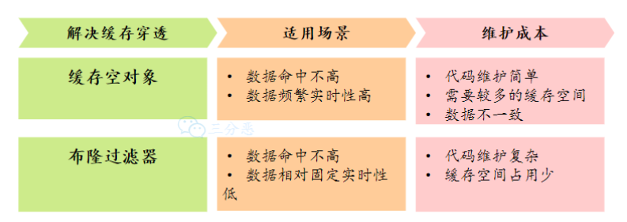

#### 总结

缓存异常会面临的三个问题：缓存雪崩、击穿和穿透。

- **缓存雪崩和缓存击穿主要原因是数据不在缓存中，而导致大量请求访问了数据库，数据库压力骤增**，容易引发一系列连锁反应，导致系统奔溃。不过，一旦数据被重新加载回缓存，应用又可以从缓存快速读取数据，不再继续访问数据库，数据库的压力也会瞬间降下来。因此，缓存雪崩和缓存击穿应对的方案比较类似。
- **缓存穿透主要原因是数据既不在缓存也不在数据库中**。因此，缓存穿透与缓存雪崩、击穿应对的方案不太一样。


### 能说说布隆过滤器吗？

布隆过滤器是一种空间效率极高的概率型数据结构，用于快速检查一个元素是否存在于一个集合中。

**原理**：布隆过滤器由「初始值都为 0 的，长度为M的位图数组」和「 N 个哈希函数」两部分组成。当我们在写入数据库数据时，在布隆过滤器里做个标记，这样下次查询数据是否在数据库时，只需要查询布隆过滤器，如果查询到数据没有被标记，说明不在数据库中。

布隆过滤器会通过 3 个操作完成标记：

- 第一步，使用 N 个哈希函数分别对数据做哈希计算，**得到 N 个哈希值**；
- 第二步，将第一步得到的 N 个**哈希值对位图数组的长度取模**，得到每个哈希值在位图数组的对应位置。
- 第三步，将**每个哈希值在位图数组的对应位置的值设置为 1**；

**查询布隆过滤器说数据存在，并不一定证明数据库中存在这个数据，但是查询到数据不存在，数据库中一定就不存在这个数据**。**原因是因为布隆过滤器是基于哈希函数实现查找的**，高效查找的同时**存在哈希冲突的可能性**，比如数据 x 和数据 y 可能都落在相同位置上，而事实上，可能数据库中并不存在数据 y，存在误判的情况。

- 优点是空间效率和查询时间都远远超过一般的算法
- 缺点是存在误判和删除困难。

布隆过滤器的误判率取决于以下几个因素：

1. 位数组的大小（m）：位数组的大小决定了可以存储的标志位数量。如果位数组过小，那么哈希碰撞的几率就会增加，从而导致更高的误判率。
2. 哈希函数的数量（k）：哈希函数的数量决定了每个元素在位数组中标记的位数。哈希函数越多，碰撞的概率也会相应变化。如果哈希函数太少，则过滤器很快会变得不精确；如果太多，误判率也会升高，效率下降。
3. 存入的元素数量（n）：存入的元素越多，哈希碰撞的几率越大，从而导致更高的误判率。

#### 布隆过滤器支持删除吗？

布隆过滤器其实并不支持删除元素，因为多个元素可能哈希到一个布隆过滤器的同一个位置，如果直接删除该位置的元素，则会影响其他元素的判断。

#### 布隆过滤器的优点？

1. **内存效率高**：布隆过滤器只需要存储每个元素的哈希值，而不需要存储元素本身，因此内存占用非常小。
2. **查询速度快**：布隆过滤器只需要将元素通过多个哈希函数映射到位数组，并检查位状态即可。它不需要哈希表那样的复杂键值操作，时间复杂度接近常数时间，速度非常快。

#### 为什么不能用哈希表而是用布隆过滤器？

布隆过滤器是一种基于位数组和多个哈希函数的概率型数据结构，**适合在内存资源有限、数据量大且能容忍一定误判的场景下使用**。

- 布隆过滤器的内存开销非常小，能快速判断一个元素是否存在。虽然它存在误判，但不会漏报，因此在防止缓存穿透、黑名单过滤和推荐系统去重等场景中广泛使用。

- **哈希表虽然可以精准判断元素存在与否**，**但需要存储实际数据，内存开销大**，不适合大规模数据存储。

### 如何设计一个缓存策略，可以动态缓存热点数据呢？

由于数据存储受限，系统并不是将所有数据都需要存放到缓存中的，而**只是将其中一部分热点数据缓存起来**，所以我们要设计一个热点数据动态缓存的策略。

热点数据动态缓存的策略总体思路：**通过数据最新访问时间来做排名，并过滤掉不常访问的数据，只留下经常访问的数据**。

以电商平台场景中的例子，现在要求只缓存用户经常访问的 Top 1000 的商品。具体细节如下：

- 先通过缓存系统做一个**排序队列**（比如存放 1000 个商品），**系统会根据商品的访问时间，更新队列信息，越是最近访问的商品排名越靠前**；
- 同时系统会定期过滤掉队列中排名最后的 200 个商品，然后再从数据库中随机读取出 200 个商品加入队列中；
- 这样当请求每次到达的时候，**会先从队列中获取商品 ID，如果命中，就根据 ID 再从另一个缓存数据结构中读取实际的商品信息**，并返回。

在 Redis 中可以用 zadd 方法和 zrange 方法来完成排序队列和获取 200 个商品的操作。

### 缓存更新策略？

- https://www.cnblogs.com/coderacademy/p/18137480

常见的缓存更新策略共有3种：

- Cache Aside（旁路缓存）策略。在实际开发中，Redis 和 MySQL 的更新策略用的是 Cache Aside，下面两种策略应用不了。
- Read/Write Through（读穿 / 写穿）策略；
- Write Back（写回）策略；

#### Cache Aside（旁路缓存）策略

Cache Aside（旁路缓存）策略是最常用的，应用程序直接与「数据库、缓存」交互，并负责对缓存的维护，该策略又可以细分为「读策略」和「写策略」。


**读策略的步骤：**

- 如果读取的数据命中了缓存，则直接返回数据；
- 如果读取的数据没有命中缓存，则从数据库中读取数据，然后将数据写入到缓存，并且返回给用户。

**写策略的步骤：**

- 先更新数据库中的数据，再删除缓存中的数据。

注意，写策略的步骤的顺序不能倒过来，即**不能先删除缓存再更新数据库**，原因是在「读+写」并发的时候，会出现缓存和数据库的数据不一致性的问题。

举个例子，假设某个用户的年龄是 20，请求 A 要更新用户年龄为 21，所以它会删除缓存中的内容。这时，另一个请求 B 要读取这个用户的年龄，它查询缓存发现未命中后，会从数据库中读取到年龄为 20，并且写入到缓存中，然后请求 A 继续更改数据库，将用户的年龄更新为 21。


最终，该用户年龄在缓存中是 20（旧值），在数据库中是 21（新值），缓存和数据库的数据不一致。

**为什么「先更新数据库再删除缓存」不会有数据不一致的问题？**

继续用「读 + 写」请求的并发的场景来分析。

假如某个用户数据在缓存中不存在，请求 A 读取数据时从数据库中查询到年龄为 20，在未写入缓存中时另一个请求 B 更新数据。它更新数据库中的年龄为 21，并且清空缓存。这时请求 A 把从数据库中读到的年龄为 20 的数据写入到缓存中。


最终，该用户年龄在缓存中是 20（旧值），在数据库中是 21（新值），缓存和数据库数据不一致。 从上面的理论上分析，先更新数据库，再删除缓存也是会出现数据不一致性的问题，**但是在实际中，这个问题出现的概率并不高**。

**因为缓存的写入通常要远远快于数据库的写入**，所以在实际中很难出现请求 B 已经更新了数据库并且删除了缓存，请求 A 才更新完缓存的情况。而一旦请求 A 早于请求 B 删除缓存之前更新了缓存，那么接下来的请求就会因为缓存不命中而从数据库中重新读取数据，所以不会出现这种不一致的情况。

**Cache Aside 策略适合读多写少的场景，不适合写多的场景**，因为当写入比较频繁时，缓存中的数据会被频繁地清理，这样会对缓存的命中率有一些影响。如果业务对缓存命中率有严格的要求，那么可以考虑两种解决方案：

- 一种做法是在更新数据时也更新缓存，只是在更新缓存前先加一个分布式锁，因为这样在同一时间只允许一个线程更新缓存，就不会产生并发问题了。当然这么做对于写入的性能会有一些影响；
- 另一种做法同样也是在更新数据时更新缓存，只是给缓存加一个较短的过期时间，这样即使出现缓存不一致的情况，缓存的数据也会很快过期，对业务的影响也是可以接受。

#### Read/Write Through（读穿 / 写穿）策略

Read/Write Through（读穿 / 写穿）策略原则是应用程序只和缓存交互，不再和数据库交互，而是由缓存和数据库交互，相当于更新数据库的操作由缓存自己代理了。

***1、Read Through 策略***

先查询缓存中数据是否存在，如果存在则直接返回；如果不存在，则由缓存组件负责从数据库查询数据，并将结果写入到缓存组件，最后缓存组件将数据返回给应用。

***2、Write Through 策略***

当有数据更新的时候，先查询要写入的数据在缓存中是否已经存在：

- 如果缓存中数据已经存在，则更新缓存中的数据，并且由缓存组件同步更新到数据库中，然后缓存组件告知应用程序更新完成。
- 如果缓存中数据不存在，直接更新数据库，然后返回；

下面是 Read Through/Write Through 策略的示意图：


Read Through/Write Through 策略的特点是由缓存节点而非应用程序来和数据库打交道，在我们开发过程中相比 Cache Aside 策略要少见一些，原因是我们经常使用的分布式缓存组件，无论是 Memcached 还是 Redis 都不提供写入数据库和自动加载数据库中的数据的功能。而我们在使用本地缓存的时候可以考虑使用这种策略。

#### Write Back（写回）策略

**Write Back（写回）策略在更新数据的时候，只更新缓存，同时将缓存数据设置为脏的，然后立马返回，并不会更新数据库。对于数据库的更新，会通过批量异步更新的方式进行。**

实际上，Write Back（写回）策略也不能应用到我们常用的数据库和缓存的场景中，因为 Redis 并没有异步更新数据库的功能。

**Write Back 是计算机体系结构中的设计，比如 CPU 的缓存、操作系统中文件系统的缓存都采用了 Write Back（写回）策略。**

**Write Back 策略特别适合写多的场景**，因为发生写操作的时候， 只需要更新缓存，就立马返回了。比如，写文件的时候，实际上是写入到文件系统的缓存就返回了，并不会写磁盘。

**但是带来的问题是，数据不是强一致性的，而且会有数据丢失的风险**，因为缓存一般使用内存，而内存是非持久化的，所以一旦缓存机器掉电，就会造成原本缓存中的脏数据丢失。所以你会发现系统在掉电之后，之前写入的文件会有部分丢失，就是因为 Page Cache 还没有来得及刷盘造成的。

### 如何保证缓存和数据库数据的一致性？

**在技术派实战项目中，我们采用的是先写 MySQL，再删除 Redis 的方式来保证缓存和数据库的数据一致性。对于不是强一致性的业务，可以容忍。（但是秒杀业务、库存服务等是不能容忍的）**

#### 先更新数据库OR先更新缓存

**无论是「先更新数据库，再更新缓存」，还是「先更新缓存，再更新数据库」，这两个方案都存在并发问题，当两个请求并发更新同一条数据的时候，可能会出现缓存和数据库中的数据不一致的现象**


#### 为什么要删除缓存而不是更新缓存

因为相对而言，删除缓存的速度比更新缓存的速度要快得多，在更新缓存的时候会导致多次缓存和数据库不一致。

#### 先更新数据库，还是先删除缓存？为什么要先更新数据库，再删除缓存

**因为更新数据库的速度比删除缓存的速度要慢得多。因为更新 MySQL 是磁盘 IO 操作，而 Redis 是内存操作，内存操作比磁盘 IO 快得多。**

如果先删除缓存，再更新数据库，就会造成这样的情况：缓存中不存在，数据库又没有完成更新，此时有请求进来读取数据，并写入到缓存，那么在更新完缓存后，缓存中这个 key 就成了一个脏数据。

目前最流行的缓存读写策略 Cache Aside Pattern（旁路缓存模式）就是采用的先写数据库，再删缓存的方式。该策略又可以细分为「读策略」和「写策略」。

**读策略的步骤：**

- 如果读取的数据命中了缓存，则直接返回数据；
- 如果读取的数据没有命中缓存，则从数据库中读取数据，然后将数据写入到缓存，并且返回给用户。

**写策略的步骤：**

- 先更新数据库中的数据，成功后，再删除缓存中的数据。

#### 先删除缓存，再更新数据库

**先删除缓存，再更新数据库，在「读 + 写」并发的时候，还是会出现缓存和数据库的数据不一致的问题**。

- 举例说明：假设一个写请求首先删除了缓存，然后执行数据库更新操作。由于更新数据库操作较为耗时，在此过程中，另一个读请求过来，发现缓存已被删除，随后从数据库中读取数据并更新缓存。此时，当写请求的操作执行完成后，缓存中会存储旧值，而数据库中已经是新值，导致缓存与数据库中的数据不一致。

**针对「先删除缓存，再更新数据库」方案在「读 + 写」并发请求而造成缓存不一致的解决办法是「延迟双删」：** 先删除缓存，再更新数据库，然后睡眠一段时间，再删除缓存。

- 加了个睡眠时间，主要是为了确保请求 A 在睡眠的时候，请求 B 能够在这这一段时间完成「从数据库读取数据，再把缺失的缓存写入缓存」的操作，然后请求 A 睡眠完，再删除缓存。所以，请求 A 的睡眠时间就需要大于请求 B 「从数据库读取数据 + 写入缓存」的时间。但是具体睡眠多久其实是个**玄学**，很难评估出来，所以这个方案也只是**尽可能**保证一致性而已，极端情况下，依然也会出现缓存不一致的现象。

因此，还是比较建议用「先更新数据库，再删除缓存」的方案。

#### 先更新数据库，再删除缓存

假如某个用户数据在缓存中不存在，请求 A 读取数据时从数据库中查询到年龄为 20，在未写入缓存中时另一个请求 B 更新数据。它更新数据库中的年龄为 21，并且清空缓存。这时请求 A 把从数据库中读到的年龄为 20 的数据写入到缓存中。


最终，该用户年龄在缓存中是 20（旧值），在数据库中是 21（新值），缓存和数据库数据不一致。

从上面的理论上分析，先更新数据库，再删除缓存也是会出现数据不一致性的问题，**但是在实际中，这个问题出现的概率并不高**。

**因为缓存的写入通常要远远快于数据库的写入**，所以在实际中很难出现请求 B 已经更新了数据库并且删除了缓存，请求 A 才更新完缓存的情况。

而一旦请求 A 早于请求 B 删除缓存之前更新了缓存，那么接下来的请求就会因为缓存不命中而从数据库中重新读取数据，所以不会出现这种不一致的情况。

所以，**「先更新数据库 + 再删除缓存」的方案，是可以保证数据一致性的**。为了确保万无一失，可以给缓存数据加上了「**过期时间**」，就算在这期间存在缓存数据不一致，有过期时间来兜底，这样也能达到最终一致。

#### 如何保证先更新数据库和再删除缓存两个操作都能执行成功？

**先更新数据库，再删除缓存会出现自己明明更新了数据，但是数据要过一段时间才生效（因为给缓存设置了过期时间）**。因为「先更新数据库， 再删除缓存」其实是两个操作，前面的所有分析都是建立在这两个操作都能同时执行成功，而这次客户投诉的问题就在于，**在删除缓存（第二个操作）的时候失败了，导致缓存中的数据是旧值**。

**如果要想保证「先更新数据库，再删缓存」策略第二个操作能执行成功，有两种方法，都采用的是异步操作缓存：**

- **消息队列重试机制执行缓存的删除，优点是保证缓存一致性的问题，缺点会对业务代码入侵**
- **订阅 MySQL binlog，再操作缓存：订阅 MySQL binlog + 消息队列 + 重试缓存的删除，优点是规避了代码入侵问题，也很好的保证缓存一致性的问题，缺点就是引入的组件比较多，对团队的运维能力比较有高要求。**

##### 消息队列重试机制

我们可以引入**消息队列**，将第二个操作（删除缓存）要操作的数据加入到消息队列，由消费者来操作数据。

- 如果应用**删除缓存失败**，可以从消息队列中重新读取数据，然后再次删除缓存，这个就是**重试机制**。当然，如果重试超过的一定次数，还是没有成功，我们就需要向业务层发送报错信息了。
- 如果**删除缓存成功**，就要把数据从消息队列中移除，避免重复操作，否则就继续重试。

##### 订阅 MySQL binlog，再操作缓存

**在更新数据库成功的时候，就会产生一条变更日志，记录在 binlog 里，可以通过阿里巴巴开源的 Canal 中间件订阅 binlog日志，拿到具体要操作的数据，然后再执行缓存删除**

具体的做法是：**利用Canal订阅数据库的binlog日志，将日志中记录的变更操作（如更新、删除等）捕获后发送到消息队列。然后，编写一个缓存删除消息消费者来订阅该消息队列，根据binlog更新日志执行缓存删除操作，并通过ACK机制确认日志的处理，确保数据和缓存的一致性。**

**关键点：**必须在删除缓存成功后才回ACK消息队列**，否则，如果消费服务提前回ACK而删除缓存失败，系统将无法重试，可能导致消息丢失和数据不一致的问题。**

前面我们说到直接用消息队列重试机制方案的话，会对代码造成入侵，那么 Canal 方案就能很好的规避这个问题，因为它是直接订阅 binlog 日志的，和业务代码没有藕合关系，因此我们可以通过 Canal+ 消息队列的方案来保证数据缓存的一致性。

Canal 模拟 MySQL 主从复制的交互协议，把自己伪装成一个 MySQL 的从节点，向 MySQL 主节点发送 dump 请求，MySQL 收到请求后，就会开始推送 Binlog 给 Canal，Canal 解析 Binlog 字节流之后，转换为便于读取的结构化数据，供下游程序订阅使用。

下图是 Canal 的工作原理：


#### 那假如对一致性要求很高，该怎么办呢？

**缓存和数据库数据不一致的原因，常见的有两种：**

- **缓存删除失败**
- **并发导致写入了脏数据**

**那通常有四种方案可以解决：**

- **设置缓存过期时间兜底**
- **消息队列保证缓存被删除**
- **数据库订阅+消息队列保证缓存被删除**
- **延迟双删防止脏数据**

**①设置缓存过期时间兜底**：这是一个兜底策略，给缓存设置一个合理的过期时间，即使发生了缓存和数据库的数据不一致问题，也不会永远不一致下去，缓存过期后，自然就一致了。

**②引入消息队列保证缓存被删除**：使用消息队列（如 Kafka、RabbitMQ）保证数据库更新和缓存更新之间的最终一致性。当数据库更新完成后，将更新事件发送到消息队列。有专门的服务监听这些事件并负责更新或删除缓存。这种方案很不错，缺点是对业务代码有一定的侵入，毕竟引入了消息队列嘛。


**③数据库订阅+消息队列保证缓存被删除**：**利用Canal订阅数据库的binlog日志，将日志中记录的变更操作（如更新、删除等）捕获后发送到消息队列。然后，编写一个缓存删除消息消费者来订阅该消息队列，根据binlog更新日志执行缓存删除操作，并通过ACK机制确认日志的处理，确保数据和缓存的一致性**。这种方式虽然降低了对业务的侵入，**但增加了整个系统的复杂度**，适合基建完善的大厂。


**④、延时双删防止脏数据**：先更新数据库，然后删除缓存之后，过一段时间之后，再次删除缓存。这种方式的延时时间需要仔细考量和测试。主要针对缓存不存在，但写入了脏数据的情况。在先删缓存，再写数据库的更新策略下发生的比较多。

- https://cloud.tencent.com/developer/article/2459794

> 1. [Java 面试指南（付费）](https://javabetter.cn/zhishixingqiu/mianshi.html)收录的华为面经同学 8 技术二面面试原题：怎样保证数据的最终一致性？
> 2. [Java 面试指南（付费）](https://javabetter.cn/zhishixingqiu/mianshi.html)收录的腾讯面经同学 23 QQ 后台技术一面面试原题：数据一致性问题
> 3. [Java 面试指南（付费）](https://javabetter.cn/zhishixingqiu/mianshi.html)收录的微众银行同学 1 Java 后端一面的原题：MySQL 和缓存一致性问题了解吗？
> 4. [Java 面试指南（付费）](https://javabetter.cn/zhishixingqiu/mianshi.html)收录的美团面经同学 3 Java 后端技术一面面试原题：如何保证 redis 缓存与数据库的一致性，为什么这么设计
> 5. [Java 面试指南（付费）](https://javabetter.cn/zhishixingqiu/mianshi.html)收录的比亚迪面经同学 12 Java 技术面试原题：怎么解决redis和mysql的缓存一致性问题
> 6. [Java 面试指南（付费）](https://javabetter.cn/zhishixingqiu/mianshi.html)收录的字节跳动同学 17 后端技术面试原题：双写一致性怎么解决的
> 7. [Java 面试指南（付费）](https://javabetter.cn/zhishixingqiu/mianshi.html)收录的京东面经同学 9 面试原题：redis的数据和缓存不一致应该处理

### 如何保证 redis 和 mysql 数据缓存一致性问题？

对于读数据，我会选择旁路缓存策略，如果 cache 不命中，会从 db 加载数据到 cache。对于写数据，我会选择更新 db 后，再删除缓存。


缓存是通过牺牲强一致性来提高性能的。这是由**CAP理论**决定的。缓存系统适用的场景就是非强一致性的场景，它属于CAP中的AP。所以，如果需要数据库和缓存数据保持强一致，就不适合使用缓存。

所以使用缓存提升性能，就是会有数据更新的延迟。这需要我们在设计时结合业务仔细思考是否适合用缓存。然后缓存一定要设置过期时间，这个时间太短、或者太长都不好：

- 太短的话请求可能会比较多的落到数据库上，这也意味着失去了缓存的优势。
- 太长的话缓存中的脏数据会使系统长时间处于一个延迟的状态，而且系统中长时间没有人访问的数据一直存在内存中不过期，浪费内存。

但是，通过一些方案优化处理，是可以**最终一致性**的。

针对删除缓存异常的情况，可以使用 2 个方案避免：

- 删除缓存重试策略（消息队列）
- 订阅 binlog，再删除缓存（Canal+消息队列）

> 消息队列方案

我们可以引入**消息队列**，将第二个操作（删除缓存）要操作的数据加入到消息队列，由消费者来操作数据。

- 如果应用**删除缓存失败**，可以从消息队列中重新读取数据，然后再次删除缓存，这个就是**重试机制**。当然，如果重试超过的一定次数，还是没有成功，我们就需要向业务层发送报错信息了。
- 如果**删除缓存成功**，就要把数据从消息队列中移除，避免重复操作，否则就继续重试。

举个例子，来说明重试机制的过程。


重试删除缓存机制还可以，就是会**造成好多业务代码入侵**。

> 订阅 MySQL binlog，再操作缓存

「**先更新数据库，再删缓存**」的策略的第一步是更新数据库，那么更新数据库成功，就会产生一条变更日志，记录在 binlog 里。

于是我们就可以通过订阅 binlog 日志，拿到具体要操作的数据，然后再执行缓存删除，阿里巴巴开源的 Canal 中间件就是基于这个实现的。

Canal 模拟 MySQL 主从复制的交互协议，把自己伪装成一个 MySQL 的从节点，向 MySQL 主节点发送 dump 请求，MySQL 收到请求后，就会开始推送 Binlog 给 Canal，Canal 解析 Binlog 字节流之后，转换为便于读取的结构化数据，供下游程序订阅使用。

下图是 Canal 的工作原理：


将binlog日志采集发送到MQ队列里面，然后编写一个简单的缓存删除消息者订阅binlog日志，根据更新log删除缓存，并且通过ACK机制确认处理这条更新log，保证数据缓存一致性

### 本地缓存和Redis缓存的区别?

**本地缓存**是指将数据存储在本地应用程序或服务器上，通常用于加速数据访问和提高响应速度。本地缓存通常使用内存作为存储介质，利用内存的高速读写特性来提高数据访问速度。

本地缓存的优势：

- 访问速度快：由于本地缓存存储在本地内存中，因此访问速度非常快，能够满足频繁访问和即时响应的需求。
- 减轻网络压力：本地缓存能够降低对远程服务器的访问次数，从而减轻网络压力，提高系统的可用性和稳定性。
- 低延迟：由于本地缓存位于本地设备上，因此能够提供低延迟的访问速度，适用于对实时性要求较高的应用场景。

本地缓存的不足：

- 可扩展性有限：本地缓存的可扩展性受到硬件资源的限制，无法支持大规模的数据存储和访问。

**分布式缓存（**Redis**）**是指将数据存储在多个分布式节点上，通过协同工作来提供高性能的数据访问服务。分布式缓存通常使用集群方式进行部署，利用多台服务器来分担数据存储和访问的压力。

分布式缓存的优势：

- 可扩展性强：分布式缓存的节点可以动态扩展，能够支持大规模的数据存储和访问需求。
- 数据一致性高：通过分布式一致性协议，分布式缓存能够保证数据在多个节点之间的一致性，减少数据不一致的问题。
- 易于维护：分布式缓存通常采用自动化管理方式，能够降低维护成本和管理的复杂性。

分布式缓存的不足：

- 访问速度相对较慢：相对于本地缓存，分布式缓存的访问速度相对较慢，因为数据需要从多个节点进行访问和协同。
- 网络开销大：由于分布式缓存需要通过网络进行数据传输和协同操作，因此相对于本地缓存来说，网络开销较大。

在选择使用本地缓存还是分布式缓存时，我们需要根据具体的应用场景和需求进行权衡。以下是一些考虑因素：

- 数据大小：如果数据量较小，且对实时性要求较高，本地缓存更适合；如果数据量较大，且需要支持大规模的并发访问，分布式缓存更具优势。
- 网络状况：如果网络状况良好且稳定，分布式缓存能够更好地发挥其优势；如果网络状况较差或不稳定，本地缓存的访问速度和稳定性可能更有优势。
- 业务特点：对于实时性要求较高的应用常见，本地缓存更合适；对于共享和一致性要求高的场景，可以使用分布式缓存

### 如何保证本地缓存和分布式缓存的一致？

在技术派实战项目中，为了减轻 Redis 的负载，我又追加了一层本地缓存 Caffeine。


为了保证本地缓存和 Redis 缓存的一致性，通常采用的策略有：

①、设置本地缓存的过期时间，这是最简单也是最直接的方法，当本地缓存过期时，就从 Redis 缓存中去同步。

②、使用Redis的 Pub/Sub机制，当Redis缓存发生变化时，发布一个消息，本地缓存订阅这个消息，然后删除对应的本地缓存。

③、Redis 缓存发生变化时，引入消息队列，比如 RocketMQ、RabbitMQ去更新本地缓存。


由于技术派本身对缓存的一致性要求不是特别高，所以我就采用第一种方式。

另外，在技术派实战项目中，我对缓存的使用场景做了细化。比如说，使用 CacheBuilder 来完成 Guava Cache 的构建，像一些简单的缓存场景，比如说获取菜单分类、获取用户转存图片等，都使用了 Guava Cache。

像首页侧边栏、专栏侧边栏、文章详情侧边栏等缓存场景，就使用了 Caffeine 作为本地缓存，通过 @Cacheable、@CacheEvit、@CachePut 等注解实现，非常轻巧。

而像用户 Session 和网站地图 SiteMap 等缓存场景，就使用了 Redis 来作为缓存。

#### 如果在项目中多个地方都要使用到二级缓存的逻辑，如何设计这一块？

在设计时，应该清楚地区分何时使用一级缓存和何时使用二级缓存。

- **通常情况下，对于频繁访问但不经常更改的数据，可以放在本地缓存中以提供最快的访问速度。**
- **而对于需要共享或者一致性要求较高的数据，应当放在一级缓存中。**

#### 本地缓存和 Redis 缓存的区别和效率对比？

Redis 可以部署在多个节点上，支持数据分片，适用于跨服务器的缓存共享。而本地缓存只能在单个服务器上使用。

Redis 还可以持久化数据，支持数据备份和恢复，适用于对数据安全性要求较高的场景。并且支持发布/订阅、事务、Lua 脚本等高级功能。

效率上，Redis 和本地缓存都是存储在内存中，读写速度都非常快。

## Redis数据结构

### Redis底层数据结构

#### `redisDb`：数据库实例的完整结构

`redisDb` 是 Redis 对单个数据库的抽象，每个数据库（默认 16 个）对应一个 `redisDb` 实例。其结构不仅包含存储键值对的 `dict`，还包含管理数据库状态的其他关键字段。完整结构体定义（简化版）：

```c
typedef struct redisDb {
    // 1. 主字典：存储所有键值对（核心）
    dict *dict;                 /* 键空间：key（字符串）-> value（robj*） */

    // 2. 过期字典：存储键的过期时间
    dict *expires;              /* 过期时间：key（同dict的key）-> 过期时间戳（毫秒） */

    // 3. 阻塞相关：用于BLPOP等阻塞命令
    dict *blocking_keys;        /* 被客户端阻塞等待的键：key -> 客户端列表 */
    dict *ready_keys;           /* 已准备好数据的阻塞键：key -> 客户端列表 */

    // 4. 事务相关：用于WATCH命令
    dict *watched_keys;         /* 被监视的键：key -> 监视的客户端列表 */

    // 5. 数据库元信息
    int id;                     /* 数据库编号（0~databases-1） */
    long long avg_ttl;          /* 键的平均TTL（仅统计用） */
    unsigned long expires_cursor; /* 过期键扫描的游标（用于渐进式过期检查） */
    list *defrag_later;         /* 待碎片整理的键列表 */
} redisDb;
```

**核心字段作用：**

- `dict`：核心中的核心，存储当前数据库所有有效的键值对，是 `SET`/`GET` 等命令的直接操作对象。
- `expires`：与 `dict` 配合实现键过期功能，仅存储设置了过期时间的键。
- 其他字段（`blocking_keys`、`watched_keys` 等）：支撑 Redis 的高级功能（阻塞命令、事务），但核心数据存储依赖 `dict`。

#### `dict`：Redis 自定义哈希表（键值对存储引擎）

`dict` 是 Redis 自主实现的哈希表数据结构，用于高效存储键值对（类似 C++ 的 `unordered_map`）。`redisDb` 的 `dict` 和 `expires` 均基于此实现。 `dict` 相关结构体定义（核心）：

```c
// 哈希表的单个键值对节点
typedef struct dictEntry {
    void *key;                  /* 键：Redis中是字符串（char*） */
    union {                     /* 值：支持多类型（节省内存） */
        void *val;              /* 指针类型（如robj*，用于主字典dict） */
        uint64_t u64;           /* 无符号整数（如过期时间戳，用于expires） */
        int64_t s64;            /* 有符号整数 */
        double d;               /* 浮点数 */
    } v;
    struct dictEntry *next;     /* 链表指针：解决哈希冲突（链地址法） */
} dictEntry;

// 哈希表结构（一个dict包含2个dictht，用于渐进式扩容）
typedef struct dictht {
    dictEntry **table;          /* 哈希表数组（桶数组）：存储dictEntry* */
    unsigned long size;         /* 哈希表大小（桶的数量，总是2^n） */
    unsigned long sizemask;     /* 掩码：size-1，用于计算哈希索引（hash & sizemask） */
    unsigned long used;         /* 已存储的键值对数量 */
} dictht;

// 哈希表主结构
typedef struct dict {
    dictType *type;             /* 类型特定函数：不同类型的dict有不同的处理函数 */
    void *privdata;             /* 私有数据：传给type函数的参数 */
    dictht ht[2];               /* 2个哈希表：ht[0]正常使用，ht[1]用于扩容 */
    long rehashidx;             /* 重哈希索引：-1表示未在重哈希 */
    unsigned long iterators;    /* 正在使用的迭代器数量：避免扩容时迭代出错 */
} dict;

// 哈希表的类型特定函数（类似"接口"，不同dict可自定义行为）
typedef struct dictType {
    unsigned int (*hashFunction)(const void *key);  /* 哈希函数：计算键的哈希值 */
    void *(*keyDup)(void *privdata, const void *key); /* 键复制函数 */
    void *(*valDup)(void *privdata, const void *obj); /* 值复制函数 */
    int (*keyCompare)(void *privdata, const void *key1, const void *key2); /* 键比较函数 */
    void (*keyDestructor)(void *privdata, void *key); /* 键销毁函数 */
    void (*valDestructor)(void *privdata, void *obj); /* 值销毁函数 */
} dictType;
```

**`dict` 的核心机制：**

**（1）哈希表的存储逻辑：**

- 键（`key`）通过 **哈希函数** 计算出哈希值，再通过 `sizemask`（`size-1`）映射到 `table` 数组的索引（桶位置）。
- 若多个键映射到同一索引（哈希冲突），通过 `dictEntry.next` 形成链表（链地址法）解决。

**（2）扩容与收缩（保证高效访问）：**

- **触发条件**：当 `used / size > 1`（负载因子 > 1）时，触发扩容（`size` 翻倍，始终为 2^n）；当负载因子 < 0.1 时，触发收缩（`size` 减半）。
- **渐进式重哈希**：为避免扩容时一次性迁移所有数据导致阻塞，Redis 分多次将 `ht[0]` 的数据迁移到 `ht[1]`，期间读写操作同时访问两个哈希表，直到迁移完成（`rehashidx` 从 0 增至 `size-1`，最后 `ht[0]` 与 `ht[1]` 交换）。

### Redis 数据类型以及使用场景分别是什么？

Redis 提供了丰富的数据类型，常见的有五种数据类型：**String（字符串），Hash（哈希），List（列表），Set（集合）、Zset（有序集合）**。

Redis 五种数据类型的应用场景：

- String（字符串）：字符串是最基础的数据类型，key 是一个字符串，不用多说，value 可以是：字符串（简单的字符串、复杂的字符串（例如 JSON、XML））、数字 （整数、浮点数）甚至是二进制（图片、音频、视频），但最大不能超过 512MB。
    - 字符串数据类型使用场景：缓存功能、常规计数、共享Session、分布式锁。
- Hash（哈希结构）：键值对集合，key 是字符串，value 是一个 Map 集合，比如说 `value = {name: '沉默王二', age: 18}`，name 和 age 属于字段 field，沉默王二 和 18 属于值 value。
    - 哈希结构数据类型主要有以下两个典型应用场景：缓存用户信息、缓存对象、购物车等
- List（列表）：list 是一个简单的字符串列表，按照插入顺序排序。可以添加一个元素到列表的头部（左边）或者尾部（右边）。
    - 列表主要有以下两个使用场景：消息队列（但是有两个问题：1. 生产者需要自行实现全局唯一 ID；2. 不能以消费组形式消费数据）、文章列表
- Set （集合）：是一个无序集合，元素是唯一的，不允许重复。

    - 集合使用场景：聚合计算（并集、交集、差集）场景，比如点赞、共同关注、抽奖活动等。
- Zset 是有序集合，比 set 多了一个排序属性 score。
    - 所以比较适合一些排序场景，比如排行榜、电话和姓名排序等。

#### Redis 后续版本又支持四种数据类型，它们的应用场景如下：

随着 Redis 版本的更新，后面又支持了四种数据类型： **BitMap（2.2 版新增）、HyperLogLog（2.8 版新增）、GEO（3.2 版新增）、Stream（5.0 版新增）**。

- BitMap（2.2 版新增）：二值状态统计的场景，比如签到、判断用户登陆状态、连续签到用户总数等；
- HyperLogLog（2.8 版新增）：海量数据基数统计的场景，比如百万级网页 UV 计数等；
- GEO（3.2 版新增）：存储地理位置信息的场景，比如滴滴叫车；
- Stream（5.0 版新增）：消息队列，相比于基于 List 类型实现的消息队列，有这两个特有的特性：**自动生成全局唯一消息ID，支持以消费组形式消费数据**。

#### 为什么使用 hash 类型而不使用 string 类型序列化存储？

使用 hash 比使用 string 更便于进行序列化，我们可以将一整个用户对象序列化，然后作为一个 value 存储在 Redis 中，存取更加便捷。

### redis应用场景是什么

Redis 是一种基于内存的数据库，对数据的读写操作都是在内存中完成，因此**读写速度非常快**，常用于**缓存，消息队列、分布式锁等场景**。

- **缓存**：Redis最常见的用途就是作为缓存系统，**通过将热门数据存储在内存中，可以极大地提高访问速度，减轻数据库负载，这对于需要快速响应时间的应用程序非常重要**。
- **排行榜**: Redis的有序集合结构非常适合用于实现排行榜和排名系统，可以方便地进行数据排序和排名。
- **分布式锁**: Redis的特性可以用来实现分布式锁，确保多个进程或服务之间的数据操作的原子性和一致性。

    - **set nx方式**：Redis提供了几种方式来实现分布式锁，最常用的是基于`SET`命令的争抢锁机制。客户端可以使用`SET resource_name lock_value NX PX milliseconds`命令设置锁，其中`NX`表示只有当键不存在时才设置，`PX`指定锁的有效时间（毫秒）。如果设置成功，则认为客户端获得锁。客户端完成操作后，解锁的还需要先判断锁是不是自己，再进行删除，这里涉及到 2 个操作，为了保证这两个操作的原子性，可以用 lua 脚本来实现。
    - **RedLock算法：**为了提高分布式锁的可靠性，Redis作者Antirez提出了RedLock算法，它基于多个独立的Redis实例来实现一个更安全的分布式锁。它的基本原理是客户端尝试在多数（大于半数）Redis实例上同时加锁，只有当在大多数实例上加锁成功时才认为获取锁成功。锁的超时时间应该远小于单个实例的超时时间，以避免死锁。该方式可以通过跨多个节点减少单点故障的影响，提高了锁的可用性和安全性。

- **计数器** 由于Redis的原子操作和高性能，它非常适合用于实现计数器和统计数据的存储，如网站访问量统计、点赞数统计等。
- **消息队列**: Redis的发布订阅功能使其成为一个轻量级的消息队列，它可以用来实现发布和订阅模式，以便实时处理消息。

    - **使用Pub/Sub模式：**Redis的Pub/Sub是一种基于发布/订阅的消息模式，任何客户端都可以订阅一个或多个频道，发布者可以向特定频道发送消息，所有订阅该频道的客户端都会收到此消息。该方式实现起来比较简单，发布者和订阅者完全解耦，支持模式匹配订阅。但是这种方式不支持消息持久化，消息发布后若无订阅者在线则会被丢弃；不保证消息的顺序和可靠性传输。

    - **使用List结构**：使用List的方式通常是使用`LPUSH`命令将消息推入一个列表，消费者使用`BLPOP`或`BRPOP`阻塞地从列表中取出消息（先进先出FIFO）。这种方式可以实现简单的任务队列。这种方式可以结合Redis的过期时间特性实现消息的TTL；通过Redis事务可以保证操作的原子性。但是需要客户端自己实现消息确认、重试等机制，相比专门的消息队列系统功能较弱。


### Redis数据类型的底层数据结构


- String类型底层的数据结构是有简单动态字符串SDS实现的。
- List 类型的底层数据结构是由**压缩列表或者双向链表**实现的：
    - 如果列表的元素个数小于 512 个（默认值，可由 list-max-ziplist-entries 配置），列表每个元素的值都小于 64 字节（默认值，可由 list-max-ziplist-value 配置），Redis 会使用**压缩列表**作为 List 类型的底层数据结构；

    - 如果列表的元素不满足上面的条件，Redis 会使用**双向链表**作为 List 类型的底层数据结构；
    - **但在 Redis 3.2 版本之后，List 数据类型底层数据结构就只由 快速列表quicklist 实现了，替代了双向链表和压缩列表**。


- Hash 类型的底层数据结构是由**压缩列表或哈希表**实现的：

    - 如果哈希类型元素个数小于 512 个（默认值，可由 hash-max-ziplist-entries 配置），所有值小于 64 字节（默认值，可由 hash-max-ziplist-value 配置）的话，Redis 会使用**压缩列表**作为 Hash 类型的底层数据结构；

    - 如果哈希类型元素不满足上面条件，Redis 会使用**哈希表**作为 Hash 类型的底层数据结构。
    - **在 Redis 7.0 中，压缩列表数据结构已经废弃了，交由 紧凑列表listpack 数据结构来实现了**。


- Set 类型的底层数据结构是由**整数集合或哈希表**实现的：

    - 如果集合中的元素都是整数且元素个数小于 512 （默认值，set-maxintset-entries配置）个，Redis 会使用**整数集合**作为 Set 类型的底层数据结构；

    - 如果集合中的元素不满足上面条件，则 Redis 使用**哈希表**作为 Set 类型的底层数据结构。


- Zset 类型的底层数据结构是由**压缩列表或跳表**实现的：

    - 如果有序集合的元素个数小于 128 个，并且每个元素的值小于 64 字节时，Redis 会使用**压缩列表**作为 Zset 类型的底层数据结构；

    - 如果有序集合的元素不满足上面的条件，Redis 会使用**跳表**作为 Zset 类型的底层数据结构；
    - **在 Redis 7.0 中，压缩列表数据结构已经废弃了，交由 紧凑列表listpack 数据结构来实现了。**

### String类型底层数据结构?

Redis 的 String 类型的底层的数据结构实现主要是 SDS（简单动态字符串），它在原本字符数组之上，增加了三个元数据：len、alloc、flags，用来解决 C 语言字符串的缺陷。

具体的数据结构定义如下：

```c
struct __attribute__ ((__packed__)) sdshdr16 {//适用于长度 < 2^16（65536 字节）的字符串
    uint16_t len;         // 字符数组已使用长度（不包含 '\0'）
    uint16_t alloc;       // 字符数组总分配长度（不包含 '\0'）
    unsigned char flags;  // 低 3 位 = 2（标识为 sdshdr16）
    char buf[];           // 存储字符串数据（含 '\0' 终止符）
};
```

结构中的每个成员变量具体介绍如下：

- **len，记录了字符数组中已经使用的长度，不包含末尾的 `'\0'`**。这样获取字符串长度的时候，只需要返回这个成员变量值就行，时间复杂度只需要 O（1）。
- **alloc，记录字符数组的实际分配长度，不包含末尾的 `'\0'`**。这样在修改字符串的时候，可以通过 `alloc - len` 计算出剩余的空间大小，可以用来判断空间是否满足修改需求，如果不满足的话，就会自动将 SDS 的空间扩展至执行修改所需的大小，然后才执行实际的修改操作，所以使用 SDS 既不需要手动修改 SDS 的空间大小，也不会出现前面所说的缓冲区溢出的问题。
- **flags，用来表示不同类型的 SDS，用来标志存储的是不同字节长度的字符串**。一共设计了 5 种类型，分别是 sdshdr5、sdshdr8、sdshdr16、sdshdr32 和 sdshdr64，后面在说明区别之处。
- **buf[]，字符数组，用来保存实际数据**。**不仅可以保存字符串，也可以保存二进制数据。**


#### 为什么不用C语言中的字符串?

C 语言使用长度为`N+1`的字符数组表示长度为`N`的字符串，且数组最后一个元素固定为`\0`。这种简单的表示方式，因存在 “不记录自身长度、依赖`\0`标识结束、操作不安全” 等问题，不符合 Redis 对字符串在安全性、效率及功能上的要求。


具体优势如下：

- **SDS 获取字符串长度的时间复杂度是 O(1)**：因为 C 语言的字符串并不记录自身长度，C 语言的字符串长度获取 strlen 函数，需要通过遍历的方式来统计字符串长度，所以获取长度的复杂度为 O(n)；而 SDS 结构里用 len 属性记录了字符串长度，所以复杂度为 O(1)。
- **SDS不仅可以保存文本数据，还可以保存二进制数据**：C 语言字符串以`\0`作为结束标识，若数据中包含`\0`（如视频、音频等二进制数据），会被误判为字符串结束导致数据截断，无法兼容二进制存储；SDS 通过`len`字段判断字符串边界，不依赖`\0`，可正常存储含`\0`的二进制数据，同时为兼容部分 C 语言标准库函数，仍在`buf`末尾追加`\0`，兼顾兼容性与数据完整性。
- **SDS在拼接字符串时不会造成缓冲区溢出**：C 语言字符串标准库函数（如`strcat`）不检查缓冲区大小，需开发者手动保证操作时空间足够，一旦空间不足会引发缓冲区溢出，导致程序异常；SDS 通过`alloc`字段（记录`buf`总分配长度）与`len`计算空闲空间（`alloc - len`），执行字符串修改（如拼接）时会自动检查空闲空间，不足则触发扩容，无需开发者干预，从根本上避免缓冲区溢出问题。

### 简单介绍一下链表linkedlist

Redis 的链表是⼀个双向⽆环链表结构，和 Java 中的LinkedList类似。

链表的节点由⼀个叫做 listNode 的结构来表示，每个节点都有指向其前置节点和后置节点的指针，同时头节点的前置和尾节点的后置均指向 null。


### 字典/哈希表是如何实现的？

字典是Redis中核心复合型数据结构，除了 Hash 数据类型、Set 数据类型会用字典存储数据外，整个 Redis 数据库的所有`key-value`对构成全局字典，带过期时间的`key`也通过字典存储（对应`redisDB`结构体中的相关字段）。

字典本质是用于保存键值对的抽象数据结构，其底层依赖哈希表（`dictht`）实现：一个哈希表包含多个哈希表节点（`dictEntry`），每个节点对应字典中的一个键值对。这种设计类似 Java 的`HashMap`：通过哈希与运算（`hash & sizemask`，`sizemask=哈希表大小-1`）计算键在哈希表数组中的下标，再用 “数组 + 链表” 的链地址法解决哈希冲突（被分配到同一数组索引的键值对，会通过节点的`next`指针形成单向链表，既保留数组的快速访问特性，又能通过链表处理冲突）。

为避免扩容 / 缩容时阻塞服务，每个字典会维护两个哈希表，其中`ht[0]`用于日常存储，`ht[1]`在 rehash 时临时使用，当哈希表负载因子（`used/size`）超过阈值需扩容，或低于阈值需缩容时，Redis 会启动**渐进式 rehash**—— 所谓渐进式rehash，指的是不一次性迁移所有数据，而是每次执行键操作（增删改查）时，顺带迁移`ht[0]`中少量节点到`ht[1]`，直到迁移完成，确保服务持续可用。


#### 字典/哈希表是怎么扩容的？Rehash 了解吗？

字典结构内部包含 **两个 哈希表**，通常情况下只有一个哈希表 `ht[0]` 有值，在扩容的时候，把 `ht[0]`里的值 rehash 到 `ht[1]`，然后进行 **渐进式 rehash** ——所谓渐进式 rehash，指的是这个 rehash 的动作并不是一次性、集中式地完成的，而是分多次、渐进式地完成的。因为这个过程看起来简单，**但是如果「哈希表 0 」的数据量非常大，那么在迁移至「哈希表 1 」的时候，因为会涉及大量的数据拷贝，此时可能会对 Redis 造成阻塞，无法服务其他请求**。

为了避免 rehash 在数据迁移过程中，因拷贝数据的耗时，影响 Redis 性能的情况，所以 Redis 采用了**渐进式 rehash**，也就是将数据的迁移的工作不再是一次性迁移完成，而是分多次迁移。

渐进式 rehash 步骤如下：

- 给「哈希表 1」 分配空间，一般会比「哈希表 0」 大 2 倍；
- **在 rehash 进行期间，每次哈希表元素进行新增、删除、查找或者更新操作时，Redis 除了会执行对应的操作之外，还会顺序将「哈希表 0 」中索引位置上的所有 key-value 迁移到「哈希表 1」 上**；
- 随着处理客户端发起的哈希表操作请求数量越多，最终在某个时间点会把「哈希表 0 」的所有 key-value 迁移到「哈希表 1」，从而完成 rehash 操作。
- 待搬迁结束后，`h[1]`就取代 `h[0]`存储字典的元素

这样就巧妙地把一次性大量数据迁移工作的开销，分摊到了多次处理请求的过程中，避免了一次性 rehash 的耗时操作。

#### 哈希表扩容的时候，有读请求怎么查？

在进行渐进式 rehash 的过程中，会有两个哈希表，所以在渐进式 rehash 进行期间，哈希表元素的删除、查找、更新等操作都会在这两个哈希表进行。比如，查找一个 key 的值的话，先会在「哈希表 0」 里面进行查找，如果没找到，就会继续到哈希表 1 里面进行找到。

另外，在渐进式 rehash 进行期间，新增一个 key-value 时，会被保存到「哈希表 1 」里面，而「哈希表 0」 则不再进行任何添加操作，这样保证了「哈希表 0 」的 key-value 数量只会减少，随着 rehash 操作的完成，最终「哈希表 0 」就会变成空表。

### 跳表是底层是如何实现的？

> 跳表是有序集合 Zset 的底层实现之⼀。在 Redis 7.0 之前，**如果有序集合的元素个数小于 128 个，并且每个元素的值小于 64 字节时**，Redis 会使用**压缩列表**作为 Zset 的底层实现，否则会使用**跳表**；在 Redis 7.0 之后，压缩列表已经废弃，交由 listpack 来替代。

跳表是一种有序的数据结构，它是在链表的基础上实现了一种多层级的有序链表，**它通过为链表中的每个节点中维持多个指向其它节点的指针，从而达到快速访问节点的目的。**

在查找过程就是在多个层级上跳来跳去，最后定位到元素。当数据量很大时，跳表的查找复杂度就是 O(logN)。

跳表底层由 zskiplist 和 zskiplistNode 组成：

- zskiplist ⽤于保存跳表的基本信息（表头、表尾、⻓度、层高等）。
- zskiplistNode⽤于表示跳表节点，每个跳表节点的层⾼是不固定的，每个节点都有⼀个指向保存了当前节点的分值和成员对象的指针。
  1. Zset 对象要同时保存「元素」和「元素的权重」，对应到跳表节点结构里就是 sds 类型的 ele 变量和 double 类型的 score 变量，跳跃表中所有的节点都按分值从小到大来排序。
  2. 每个跳表节点都有一个后向指针（`struct zskiplistNode *backward`），指向前一个节点，目的是为了方便从跳表的尾节点开始访问节点，这样倒序查找时很方便。
  3. 跳表是一个带有层级关系的链表，而且每一层级可以包含多个节点，每一个节点通过指针连接起来，实现这一特性就是靠跳表节点结构体中的**zskiplistLevel 结构体类型的 level 数组**。一般来说，层的数量越多，访问其它节点的速度就越快。
     - level 数组中的每一个元素代表跳表的一层，也就是由 zskiplistLevel 结构体表示，比如 leve[0] 就表示第一层，leve[1] 就表示第二层。zskiplistLevel 结构体里定义了「指向下一个跳表节点的指针」和「跨度」，跨度时用来记录两个节点之间的距离。

```c
typedef struct zskiplist {
    struct zskiplistNode *header, *tail;
    unsigned long length;
    int level;
} zskiplist;

typedef struct zskiplistNode {
    //Zset 对象的元素值
    sds ele;
    //元素权重值
    double score;
    //后向指针
    struct zskiplistNode *backward;

    //节点的level数组，保存每层上的前向指针和跨度
    struct zskiplistLevel {
        struct zskiplistNode *forward;
        unsigned long span;
    } level[];
} zskiplistNode;
```

下面这张图，展示了各个节点的跨度。


第一眼看到跨度的时候，以为是遍历操作有关，实际上并没有任何关系，遍历操作只需要用前向指针（struct zskiplistNode *forward）就可以完成了。

Redis **跳表在创建节点的时候，随机生成每个节点的层数**，并没有严格维持相邻两层的节点数量比例为 2 : 1 的情况。

具体的做法是，**跳表在创建节点时候，会生成范围为[0-1]的一个随机数，如果这个随机数小于 0.25（相当于概率 25%），那么层数就增加 1 层，然后继续生成下一个随机数，直到随机数的结果大于 0.25 结束，最终确定该节点的层数**。

这样的做法，相当于每增加一层的概率不超过 25%，层数越高，概率越低，层高最大限制是 32。

**如果调表的层高最大限制是 32，那么在创建跳表「头节点」的时候，就会直接创建32 层高的头节点**。

#### 跳表是怎么设置层高的？

跳表在创建节点时候，会生成范围为[0-1]的一个随机数，如果这个随机数小于 0.25（相当于概率 25%），那么层数就增加 1 层，然后继续生成下一个随机数，直到随机数的结果大于 0.25 结束，最终确定该节点的层数。

#### 为什么hash表范围查询效率比跳表低？

哈希表是一种基于键值对的数据结构，主要用于快速查找、插入和删除操作。

哈希表通过计算键的哈希值来确定值的存储位置，这使得它在单个元素的访问上非常高效，时间复杂度为 O(1)。

然而，哈希表内的元素是无序的。因此，对于范围查询（如查找所有在某个范围内的元素），哈希表无法直接支持，必须遍历整个表来检查哪些元素满足条件，这使得其在范围查询上的效率低下，时间复杂度为 O(n)。

跳表是一种有序的数据结构，能够保持元素的排序顺序。

它通过多层的链表结构实现快速的插入、删除和查找操作，其中每一层都是下一层的一个子集，并且元素在每一层都是有序的。

当进行范围查询时，跳表可以从最高层开始，快速定位到范围的起始点，然后沿着下一层继续直到找到范围的结束点。这种分层的结构使得跳表在进行范围查询时非常高效，时间复杂度为 O(log n) 加上范围内元素的数量。

#### Zset为什么使用跳表？

- 第一，Zset 的核心需求是**快速的随机插入与删除**，而数组完全无法满足这一点。作为有序结构，数组虽能通过二分查找实现 O (logn) 的查找，但随机插入 / 删除时需移动后续大量元素，时间复杂度高达 O (n)，与 Zset 对 “高效动态操作” 的要求严重冲突，因此**不宜使用数组来实现**。
- 第二，Zset 作为有序集合，虽容易联想到红黑树 / 平衡树这类经典有序结构，但 Redis 并未选择它们，核心原因有两点：
  1. **性能考虑**：Zset 需在高并发场景下稳定支持高效操作，红黑树为维持平衡需执行 rebalance（如旋转、着色），这类操作可能涉及整棵树的调整；而跳表的插入、删除、查找仅需修改局部节点的指针，操作范围更小，在高并发下性能更稳定。
  2. **实现考虑**：红黑树 / 平衡树的逻辑复杂，需处理多种平衡调整场景，而跳表基于 “多层链表” 的设计，仅通过随机层数实现 “跳跃查找”，逻辑直观易懂。二者在查找、插入、删除的时间复杂度上均为 O (logn)，但跳表的代码实现和后续维护成本远低于红黑树 / 平衡树。

本质上，跳表的选型是为了**解决 Zset 在 “有序” 前提下，高效实现查找、插入、删除的核心问题**，是 “性能稳定性” 与 “实现复杂度” 的最优平衡。

#### zset为什么使用跳表而不是用B+树?

Redis 是**内存数据库**，B + 树核心的磁盘 I/O 优化优势用不上，而跳表更适配内存场景，核心原因有三点：

1. **实现更简单**：跳表无需 B + 树那样的节点分裂 / 合并等复杂平衡操作，Redis 跳表核心代码仅约 200 行，易维护；B + 树需处理大量边界逻辑，代码复杂。
2. **写入性能优**：跳表插入 / 删除只需调整局部指针，无递归开销；B + 树插入可能触发节点分裂，还要递归更新父节点，成本更高。
3. **内存更适配**：跳表指针跳转符合 CPU 缓存局部性，节点仅存键、层高、指针，结构紧凑；B + 树节点含多键 + 子指针，缓存不友好且易有内存碎片。

两者查询、写入的平均时间复杂度都是 O (logn)，但跳表在内存场景下，兼顾性能与简洁性，更贴合 Redis 需求。


### 压缩列表ziplist是怎么实现的？

hash、list、zset 在元素较少时会使用压缩列表。

压缩列表是 Redis 为了节约内存而开发的，它是**由连续内存块组成的顺序型数据结构**，有点类似于数组。一个压缩列表包含任意多个节点，每个节点可以保存一个字节数组或者一个整数值。


压缩列表在表头有三个字段：

- zlbytes，记录整个压缩列表占用对内存字节数；
- zltail，记录压缩列表「尾部」节点距离起始地址由多少字节，也就是列表尾的偏移量；
- zllen，记录压缩列表包含的节点数量；
- entryN：列表节点
- zlend，标记压缩列表的结束点，固定值 0xFF（十进制255）。

在压缩列表中，如果我们要查找定位第一个元素和最后一个元素，可以通过表头三个字段（zllen）的长度直接定位，复杂度是 O(1)。而**查找其他元素时，就没有这么高效了，只能逐个查找，此时的复杂度就是 O(N) 了，因此压缩列表不适合保存过多的元素**。

另外，压缩列表节点（entry）的构成如下：


压缩列表节点包含三部分内容：

- **prevlen**，记录了「前一个节点」的长度，目的是为了实现从后向前遍历；
- **encoding**，记录了当前节点实际数据的「类型和长度」，类型主要有两种：字符串和整数。
- **data**，记录了当前节点的实际数据，类型和长度都由 encoding 决定；

当我们往压缩列表中插入数据时，压缩列表就会根据数据类型是字符串还是整数，以及数据的大小，会使用不同空间大小的 prevlen 和 encoding 这两个元素里保存的信息，**这种根据数据大小和类型进行不同的空间大小分配的设计思想，正是 Redis 为了节省内存而采用的**。

压缩列表的缺点是会发生连锁更新的问题，因此**连锁更新一旦发生，就会导致压缩列表占用的内存空间要多次重新分配，这就会直接影响到压缩列表的访问性能**。

所以说，**虽然压缩列表紧凑型的内存布局能节省内存开销，但是如果保存的元素数量增加了，或是元素变大了，会导致内存重新分配，最糟糕的是会有「连锁更新」的问题**。

因此，**压缩列表只会用于保存的节点数量不多的场景**，只要节点数量足够小，即使发生连锁更新，也是能接受的。

虽说如此，Redis 针对压缩列表在设计上的不足，在后来的版本中，新增设计了两种数据结构：quicklist（Redis 3.2 引入） 和 listpack（Redis 5.0 引入）。这两种数据结构的设计目标，就是尽可能地保持压缩列表节省内存的优势，同时解决压缩列表的「连锁更新」的问题。

### 快速列表quicklist了解吗？

Redis 早期版本中，列表（list）数据结构通过**压缩列表（ziplist）** 和**普通双向链表（linkedlist）** 实现：元素较少时用 ziplist，元素较多时切换为 linkedlist。但双向链表存在明显缺陷：64 位操作系统下，每个节点的`prev`和`next`指针共占 16 字节（各 8 字节），附加空间较高；且每个节点内存单独分配，会加剧内存碎片化，影响内存管理效率。

从 Redis 3.2 版本开始，列表结构被**quicklist（快速列表）** 替代，它是综合时间效率与空间效率设计的新型数据结构，**底层本质是以 ziplist 为节点的双向链表**，既保留了 ziplist 的内存紧凑性，又兼顾了双向链表的高效访问特性。

具体来看，quicklist 的核心是`quicklistNode`结构体：每个`quicklistNode`包含`prev`和`next`指针，通过这两个指针，所有`quicklistNode`构成双向链表，同时还包含一个指向 ziplist 的指针`*zl`（即每个节点存储的不是单个元素，而是一个 ziplist）。

在向 quicklist 添加元素时，并非直接新建`quicklistNode`，而是先检查插入位置对应的 ziplist 是否能容纳该元素：若能容纳，就直接将元素存入该 ziplist；若无法容纳，才会新建一个`quicklistNode`，并在新节点的 ziplist 中存储元素。

此外，quicklist 会主动控制每个`quicklistNode`中 ziplist 的大小或元素个数，以此规避 ziplist 可能出现的连锁更新风险，但这种控制并未完全解决连锁更新问题。


### 紧凑列表listpack怎么实现的

紧凑列表listpack 是 Redis 用来替代压缩列表（ziplist）的一种内存更加紧凑的数据结构。

Redis 的 quicklist 虽通过控制节点内 ziplist 的大小或元素个数，减少了连锁更新的影响，但因底层仍依赖 ziplist，而 ziplist 的 “每个节点保存前一个节点长度” 的结构设计，导致连锁更新隐患无法彻底消除。为从根源解决此问题，Redis 5.0 版本新增了**紧凑列表 listpack**，其核心定位是替代压缩列表 ziplist，同时延续 ziplist “内存紧凑” 的优势。

紧凑列表listpack的底层依旧是由连续内存块组成的顺序型数据结构，既节省内存，又便于高效访问。

具体来说，listpack头部包含两个关键属性，分别记录 listpack 总字节数和元素总数量，然后尾部有一个结尾标识，中间则是存储实际数据的 listpack entry（节点），每个 listpack 节点（listpack entry）的结构主要包含三部分：

- **encoding**：定义当前元素的编码类型，会根据元素是整数还是字符串、以及数据长度，选择不同编码方式以进一步节省内存；
- **data**：存储元素的实际数据；
- **len**：记录当前节点 “encoding+data” 的总长度。


紧凑列表listpack最大特点是没有压缩列表ziplist中记录前一个节点长度的字段了，listpack 只记录当前节点的长度（保存当前元素的编码类型、数据，以及编码类型和数据的长度），因此当我们向 listpack 加入一个新元素的时候，不会影响其他节点的长度字段的变化，从而避免了压缩列表的连锁更新问题。同时，listpack 还通过优化节点内字段的顺序，确保既能从前向后遍历，也能从后向前遍历，兼顾了访问灵活性。

不过，由于 Redis 的 List、Hash、Set、ZSet 等数据类型仍严重依赖 ziplist 实现，listpack 对 ziplist 的替代是一个渐进过程，短期内无法完全替换。

### 整数集合intset

整数集合是 Redis 中 Set 数据类型的底层实现之一，当一个 Set 对象仅包含整数值元素，且元素数量不大时，就会以整数集合作为底层存储结构。

整数集合本质上是一块连续内存空间，通过`intset`结构体管理，完整结构定义如下图，主要包含三个字段：

- **`encoding`**：标记`contents`数组的真实数据类型，仅支持三种固定编码（以此保证内存紧凑）：
  - 若 encoding 为 INTSET_ENC_INT16，则 contents 是 int16_t 类型数组，所有元素均为 int16_t；
  - 若 encoding 为 INTSET_ENC_INT32，则 contents 是 int32_t 类型数组，所有元素均为 int32_t；
  - 若 encoding 为 INTSET_ENC_INT64，则 contents 是 int64_t 类型数组，所有元素均为 int64_t；
- **`length`**：直接记录元素总数，无需遍历数组统计，获取长度的时间复杂度为 O (1)；
- **`contents`**：用于保存元素的数组，表面声明为 int8_t 类型，但实际不存储 int8_t 元素，其真正类型由`encoding`决定；不同类型的 contents 数组，对应不同的元素大小。


#### 整数集合的升级操作

整数集合会有一个升级规则，就是当我们将一个新元素加入到整数集合里面，如果新元素的类型（int32_t）比整数集合现有所有元素的类型（int16_t）都要长时，整数集合需要先进行升级，也就是按新元素的类型（int32_t）扩展 contents 数组的空间大小，然后才能将新元素加入到整数集合里，当然升级的过程中，也要维持整数集合的有序性。

整数集合升级的过程不会重新分配一个新类型的数组，而是在原本的数组上扩展空间，然后在将每个元素按间隔类型大小分割，如果 encoding 属性值为 INTSET_ENC_INT16，则每个元素的间隔就是 16 位。

举个例子，假设有一个整数集合里有 3 个类型为 int16_t 的元素。


现在，往这个整数集合中加入一个新元素 65535，这个新元素需要用 int32_t 类型来保存，所以整数集合要进行升级操作，首先需要为 contents 数组扩容，**在原本空间的大小之上再扩容多 80 位（4x32-3x16=80），这样就能保存下 4 个类型为 int32_t 的元素**。


扩容完 contents 数组空间大小后，需要将之前的三个元素转换为 int32_t 类型，并将转换后的元素放置到正确的位上面，并且需要维持底层数组的有序性不变，整个转换过程如下：


> 整数集合升级有什么好处呢？

如果要让一个数组同时保存 int16_t、int32_t、int64_t 类型的元素，最简单做法就是直接使用 int64_t 类型的数组。不过这样的话，当如果元素都是 int16_t 类型的，就会造成内存浪费的情况。

整数集合升级就能避免这种情况，如果一直向整数集合添加 int16_t 类型的元素，那么整数集合的底层实现就一直是用 int16_t 类型的数组，只有在我们要将 int32_t 类型或 int64_t 类型的元素添加到集合时，才会对数组进行升级操作。

因此，整数集合升级的好处是**节省内存资源**。

> 整数集合支持降级操作吗？

**不支持降级操作**，一旦对数组进行了升级，就会一直保持升级后的状态。比如前面的升级操作的例子，如果删除了 65535 元素，整数集合的数组还是 int32_t 类型的，并不会因此降级为 int16_t 类型。

## Redis 线程模型

- https://blog.csdn.net/chenssy/article/details/137480026

### Redis 是单线程吗？

**Redis 单线程指的是「接收客户端请求->解析请求 ->进行数据读写等操作->发送数据给客户端」这个过程是由一个主线程来完成的**，这也是我们常说 Redis 是单线程的原因。如下图所示：


但是，**Redis 程序并不是单线程的**，Redis 在启动的时候，是会**启动后台线程**（BIO）的：

- **Redis 在 2.6 版本**，会启动 2 个后台线程，**分别处理关闭文件、AOF 刷盘这两个任务**；
- **Redis 在 4.0 版本之后**，新增了一个新的后台线程，**用来异步释放 Redis 内存，也就是 lazyfree 线程**。例如执行 unlink key / flushdb async / flushall async 等命令，会把这些删除操作交给后台线程来执行，好处是不会导致 Redis 主线程卡顿。因此，当我们要删除一个大 key 的时候，不要使用 del 命令删除，因为 del 是在主线程处理的，这样会导致 Redis 主线程卡顿，因此我们应该使用 unlink 命令来异步删除大key。

之所以 Redis 为「**关闭文件、AOF 刷盘、释放内存**」这些任务创建单独的线程来处理，是因为这些任务的操作都是很耗时的，如果把这些任务都放在主线程来处理，那么 Redis 主线程就很容易发生阻塞，这样就无法处理后续的请求了。

后台线程相当于一个消费者，生产者把耗时任务丢到任务队列中，消费者（BIO）不停轮询这个队列，拿出任务就去执行对应的方法即可。

关闭文件、AOF 刷盘、释放内存这三个任务都有各自的任务队列：

- BIO_CLOSE_FILE，关闭文件任务队列：当队列有任务后，后台线程会调用 close(fd) ，将文件关闭。
- BIO_AOF_FSYNC，AOF刷盘任务队列：当 AOF 日志配置成 everysec 选项后，主线程会把 AOF 写日志操作封装成一个任务，也放到队列中。当发现队列有任务后，后台线程会调用 fsync(fd)，将 AOF 文件刷盘。
- BIO_LAZY_FREE，lazy free 任务队列：当队列有任务后，后台线程会 free(obj) 释放对象 / free(dict) 删除数据库所有对象 / free(skiplist) 释放跳表对象。


### Redis 单线程模式是怎样的？

从 Redis 的内部设计来说，Redis 是基于 Reactor 模式开发了一套自己的网络事件处理器（Netty 的线程模型也基于 Reactor 模式，Reactor 模式不愧是高性能 IO 的基石），这个处理器称之为文件事件处理器（file event handler），而这个文件事件处理器采用单线程架构，这也直接决定了 Redis 是单线程的工作特性。

Redis文件事件处理器架构由 5 个关键部分组成：

- **多个 socket（套接字）**：服务器会为每个连接的客户端单独维护一个套接字，专门用于接收客户端请求和向客户端发送响应，作为 Redis 与客户端进行网络通信的基础入口。
- **I/O 多路复用程序**：文件事件处理器的核心组件，它能够同时监控多个套接字的状态，精准识别出哪些套接字已准备好执行读、写等操作，是实现高效并发处理的关键。
- **任务队列（就绪事件队列）**：用于存放待处理的各类事件任务，所有产生的事件会按顺序在此排队，等待后续处理。
- **文件事件分派器**：当 I/O 多路复用程序检测到某个套接字准备好进行读写操作时，分派器会从任务队列中取出对应的事件，将其准确转发给预先关联的事件处理器。
- **事件处理器**：Redis 针对不同类型的文件事件（如连接、读写等）预设了对应的处理器。当特定类型的事件触发时，相应的处理器会被调用，负责具体的事件处理逻辑。
  - **连接应答处理器**：专门处理客户端的连接请求事件。当有新的客户端通过套接字发起连接时（对应accept操作），该处理器会被触发，负责完成 TCP 握手、创建客户端套接字等初始化工作，并为新连接关联后续的读写事件处理器。
  - **命令请求处理器**：用于处理客户端发送的命令请求（对应read操作）。当客户端通过已连接的套接字发送 Redis 命令时，该处理器会读取套接字中的数据，解析命令格式（如解析SET key value等指令），并将命令放入 Redis 的执行队列等待处理。
  - **命令回复处理器**：负责将命令执行结果返回给客户端（对应write操作）。当 Redis 完成命令处理后，会生成响应数据，该处理器会将响应内容写入对应的客户端套接字，确保客户端能收到执行结果（如返回OK或具体的键值数据）。
  - **连接关闭处理器**：处理套接字的关闭事件（对应close操作）。当客户端主动断开连接或因网络异常导致连接中断时，该处理器会被调用，负责释放套接字占用的资源、清理客户端相关的状态信息（如客户端上下文、未完成的命令等），避免资源泄漏。

具体来说：

- 文件事件处理器使用 I/O 多路复用（multiplexing）程序来同时监听多个套接字，并根据套接字目前执行的任务来为套接字关联不同的事件处理器。
- 当被监听的套接字准备好执行连接应答（accept）、读取（read）、写入（write）、关闭（close）等操作时，与操作相对应的文件事件就会产生。
- 此时，I/O 多路复用程序会将这些事件放入任务队列中排队等待处理。随后，文件事件分派器会从任务队列中依次取出事件，将其转发给该套接字预先关联好的事件处理器，最终由事件处理器完成对事件的具体处理。

如下图所示：


#### Redis6.0之前既然是单线程，那怎么监听大量的客户端连接呢？

Redis 基于 Reactor 模式实现了专属的文件事件处理器，并采用单线程架构。尽管该文件事件处理器以单线程方式运行，但通过引入 I/O 多路复用技术，成功解决了大量连接的监听问题。这里的 “多路” 指多个网络客户端连接，“复用” 则指复用同一线程（单进程）。

具体而言，I/O 多路复用技术通过多路复用程序实现对多个文件描述符（FD）读写状态的监控。文件事件处理器会先将其关注的事件类型（如读、写）注册到内核并持续监听事件是否触发，一旦某一客户端连接进入可读写状态，便会立即触发对应的事件处理流程（无需等待其他连接），从而避免了 I/O 阻塞，显著提升了网络通信性能。

这种设计的优势在于：一方面，文件事件处理器构建了高性能的网络通信模型；另一方面，它能与 Redis 服务器中其他同样以单线程运行的模块无缝对接，维持了 Redis 内部单线程设计的简洁性。

**I/O 多路复用技术的应用，使 Redis 无需额外创建线程来监听大量客户端连接，有效降低了资源消耗**（这一机制与 Java NIO 中的 `Selector` 组件原理相似）。

### Redis 单线程模型详解

Redis 6.0 之前采用“单线程 + epoll”架构：

- 启动时主线程创建监听套接字socket 并将其注册到 epoll，随后进入事件循环。
- 每一轮循环先把待发送的客户端放进发送队列并尽量 write 出去，随后调用 epoll_wait 阻塞等待事件；
  - 若触发“连接事件”，主线程 accept 新连接并为其注册“读事件”；
  - 若触发“读事件”，主线程 read 命令、解析协议、在内存里执行对应操作，并把客户端加入发送队列；
  - 若触发“写事件”，主线程继续 write 剩余结果，若一次写不完则保持“写事件”注册，等下轮循环再写。


整个过程从接收、解析、执行到返回都在一条线程内串行完成，省去了锁竞争和上下文切换开销，而 epoll 负责把成千上万的连接就绪事件高效地推送给这条线程，因此 Redis 在纯内存读写下可轻松跑到十万级 QPS。

Redis 6.0 版本之前的单线模式如下图：


图中的蓝色部分是一个事件循环，是由主线程负责的，可以看到网络 I/O 和命令处理都是单线程。

 Redis 的 I/O 多路复用模型进行一下描述说明：

- 一个 socket 客户端与服务端连接时，会生成对应一个套接字描述符(套接字描述符是文件描述符的一种)，每一个 socket 网络连接其实都对应一个文件描述符。
- 多个客户端与服务端连接时，Redis 使用 I/O 多路复用程序 将客户端 socket 对应的 FD 注册到监听列表(一个队列)中。当客服端执行 read、write 等操作命令时，I/O 多路复用程序会将命令封装成一个事件，并绑定到对应的 FD 上。
- 文件事件处理器使用 I/O 多路复用模块同时监控多个文件描述符（fd）的读写情况，当 accept、read、write 和 close 文件事件产生时，文件事件处理器就会回调 FD 绑定的事件处理器进行处理相关命令操作。

例如：以 Redis 的 I/O 多路复用程序 epoll 函数为例。多个客户端连接服务端时，Redis 会将客户端 socket 对应的 fd 注册进 epoll，然后 epoll 同时监听多个文件描述符(FD)是否有数据到来，如果有数据来了就通知事件处理器赶紧处理，这样就不会存在服务端一直等待某个客户端给数据的情形。

Redis 初始化的时候，会做下面这几件事情：

- 首先，调用 epoll_create() 创建一个 epoll 对象和调用 socket() 创建一个服务端 socket
- 然后，调用 bind() 绑定端口和调用 listen() 监听该 socket；
- 然后，将调用 epoll_ctl() 将 listen socket 加入到 epoll，同时注册「连接事件」处理函数。

初始化完后，主线程就进入到一个**事件循环函数**，主要会做以下事情：

- 首先，先调用**处理发送队列函数**，看是发送队列里是否有任务，如果有发送任务，则**通过 write 函数将客户端发送缓存区里的数据发送出去**，**如果这一轮数据没有发送完，就会注册写事件处理函数，等待 epoll_wait 发现可写后再处理** 。
- 接着，调用 epoll_wait 函数等待事件的到来：
  - 如果是**连接事件**到来，则会调用**连接事件处理函数**，该函数会做这些事情：调用 accpet 获取已连接的 socket -> 调用 epoll_ctl 将已连接的 socket 加入到 epoll -> 注册「读事件」处理函数；
  - 如果是**读事件**到来，则会调用**读事件处理函数**，该函数会做这些事情：调用 read 获取客户端发送的数据 -> 解析命令 -> 处理命令 -> 将客户端对象添加到发送队列 -> 将执行结果写到发送缓存区等待发送；
  - 如果是**写事件**到来，则会调用**写事件处理函数**，该函数会做这些事情：通过 write 函数将客户端发送缓存区里的数据发送出去，如果这一轮数据没有发送完，就会继续注册写事件处理函数，等待 epoll_wait 发现可写后再处理 。

### 客户端与Redis服务端建立连接的过程

- Redis sever 启动时，会把 `AE_READABLE` 事件与连接应答处理器关联。
- 当客户端向 Redis 发起连接时，这是 Server Socket 会产生一个 `AE_READABLE` 事件，IO 多路复用程序监听到该事件后将 socket信息压入到任务队列中。
- 文件事件分派器每次从任务队列中取一个 socket ，将其交给事件处理器，由于在 Redis 初始化时 `AE_READABLE` 是与连接应答处理器关联，所以就由连接应答处理器来处理该事件。
- 连接应答处理器会创建一个与该客户端通信的 Socket（我们这里叫 socket1），并将 socket1 的 `AE_READABLE` 事件与命令请求处理器关联。


### 客户端发送请求给 Redis 服务端过程

- 客户端发送读写请求（比如 `set key value`）给服务端，首先会在对应的 Socket（socket1）上面产生一个 `AE_READABLE`事件，IO 多路复用程序监听到该事件后将 socket信息压入到任务队列中。
- 文件事件分派器从任务队列中取 Socket 信息转发给事件处理器，由于建立连接时 socket1 的 `AE_READABLE` 事件已经与命令请求处理器关联了，所以文件事件分派器将命令请求处理器。
- 命令处理器读取该 Socket 的相关信息后执行相关命令，操作完成后，会将 socket01 的 `AE_WRITABLE` 事件与命令回复处理器关联。


- 如果客户端已经准备好了接收结果，那么 socket1 会产生一个 AE_WRITABLE，IO 多路复用程序将 Socket 压入队列，然后由文件事件派发器转发给事件处理器。
- 由于 socket1 的`AE_WRITABLE` 事件与命令回复处理器关联，所以由命令回复处理器处理，命令回复处理器将准备好的相应数据写入socket01(socket连接是双向的)，返回给客户端，之后解除 socket01 的 `AE_WRITABLE` 事件与命令回复处理器的关联。


### Redis 为什么快呢？

Redis 的速度⾮常快，单机的 Redis 就可以⽀撑每秒十几万的并发，性能是 MySQL 的⼏⼗倍。原因主要有⼏点：

- **基于内存的数据存储，Redis 将数据存储在内存当中，使得数据的读写操作避开了磁盘 I/O**。而内存的访问速度远超硬盘，这是 Redis 读写速度快的根本原因。
- **单线程模型**，Redis 使用单线程模型来处理客户端的请求，这意味着在任何时刻只有一个命令在执行，可以**避免了多线程之间的竞争，减少了线程切换和锁竞争带来的消耗**。
- **IO 多路复⽤**，基于 Linux 的 select/epoll 机制。该机制允许内核中同时存在**多个监听套接字和已连接套接字**，内核会一直监听这些套接字上的连接请求或者数据请求，一旦有请求到达，就会交给 Redis 处理，就实现了所谓的 Redis 单个线程处理多个 IO 读写的请求

- **高效的数据结构**，Redis 提供了多种高效的数据结构，如字符串（String）、列表（List）、集合（Set）、有序集合（Sorted Set）等，这些数据结构经过了高度优化，能够支持快速的数据操作。

### Redis 6.0 之前为什么使用单线程？

尽管单线程无法直接利用服务器的多核 CPU 资源，但 Redis 6.0 之前的核心网络模型和命令执行始终采用单线程架构，主要有以下几个原因：

- **性能瓶颈不在于 CPU**：**Redis 的核心操作基于内存完成，执行速度极快（微秒级）**，而系统的性能瓶颈更多受限于**内存容量**和**网络 I/O**（如数据传输延迟）。此时引入多线程并不能显著提升性能，反而可能因线程管理带来额外开销。
  - 官方数据显示，单线程的 Redis 单机 QPS 可轻松达到 10 万 +，已满足绝大多数场景需求。若需更高性能，可通过**多实例部署**或**分片集群**利用多核资源，而非在单节点内引入多线程。

- **规避多线程复杂性**：**单线程无需处理并发竞争、锁机制和线程切换损耗**，避免了多线程带来的设计复杂性和潜在性能开销，保持了代码简洁易维护。
- **高效设计数据结构和网络模型设计弥补单线程局限**：通过高效数据结构（SDS、跳表等）和 I/O 多路复用，单线程即可高效处理大量操作和网络连接。

### Redis 6.0 之后为什么引入了多线程？

Redis 一直以来采用单线程模型处理核心工作（包括网络 I/O 和命令执行），这是因为内存操作的响应速度极快（约 100 纳秒），单线程即可支撑 8万到 10万QPS，足以满足绝大多数场景的需求，同时还能避免多线程带来的锁竞争和上下文切换损耗。

但随着网络硬件性能的提升，Redis 的性能瓶颈逐渐从数据处理转向**网络 I/O 读写**，因为单线程处理网络请求时，只能利用 CPU 的一个核心，无法充分发挥多核 CPU 的优势，导致其处理速度跟不上底层网络硬件的执行效率。

为解决这一问题，Redis 6.0 引入了多线程，但**仅用于优化网络 I/O 处理**：

- 多线程负责网络数据的读写、协议解析等操作，提高网络 I/O 的并行度；
- 命令的解析和执行仍由单线程处理，以此兼顾多核 CPU 优势与单线程的简洁性（避免锁和上下文切换的性能损耗）。

简言之，Redis 6.0 的多线程并非用于并行执行命令，而是通过优化网络 I/O 环节，进一步释放 Redis 的性能潜力。

需要注意的是，Redis 6.0 的多线程 I/O 特性默认仅针对发送响应数据（write client socket），若要让其同时处理客户端读请求（read client socket），需在 Redis.conf 中将 `io-threads-do-reads` 配置项设为 `yes`。据官方说明，这一特性对性能的提升至少在一倍以上。


### Redis的I/O多线程模型

Redis 6.0 引入 I/O 多线程模型后，将一个命令的执行分为了两部分：

- Socket 读写和请求解析使用多线程处理，多个 socket 读写可以并⾏化
- 执行请求依然还是使用主线程，存内存操作，在高效的同时也保证了安全性。


主要流程如下：

1. 主线程负责接收并建立（多个）连接请求，获取 socket 后放入全局等待处理队列；
2. 主线程处理完这些事件之后，通过RR（Round Robin 轮询）将可读 socket 分配给这些 IO 线程；
3. 主线程阻塞，等待 IO 线程完成命令的读取、解析；
4. 主线程执⾏ IO 线程读取和解析出来的 Redis 请求命令，并将结果写到输出缓冲区；
5. 主线程阻塞，等待 IO 线程将命令执⾏结果写回 socket（客户端）；
6. 主线程执行所有命令并清空整个等待队列，等待客户端后续的请求队列。

如下图：


### 单线程 Redis 的 QPS 是多少？

Redis 的 QPS（Queries Per Second，每秒查询率）受多种因素影响，包括硬件配置（如 CPU、内存、网络带宽）、数据模型、命令类型、网络延迟等。

根据官方的基准测试，**一个普通服务器的 Redis 实例通常可以达到每秒数万到几十万的 QPS。**

可以通过 `redis-benchmark` 命令进行基准测试：

```
redis-benchmark -h 127.0.0.1 -p 6379 -c 50 -n 10000
```

- `-h`：指定 Redis 服务器的地址，默认是 127.0.0.1。
- `-p`：指定 Redis 服务器的端口，默认是 6379。
- `-c`：并发连接数，即同时有多少个客户端在进行测试。
- `-n`：请求总数，即测试过程中总共要执行多少个请求。

我本机是一台 macOS，4 GHz 四核 Intel Core i7，32 GB 1867 MHz DDR3，测试结果如下：


可以看得出，每秒能处理超过 10 万次请求。

## Redis 持久化

### Redis 持久化⽅式有哪些？有什么区别？

Redis 的通过持久化机制将内存数据存储到磁盘，确保服务器重启后可恢复数据，实现数据不丢失。

Redis 共有三种数据持久化的方式：

- **RDB 快照**：将某一时刻的内存数据生成一个快照，以二进制的方式写入磁盘；
  - **RDB 持久化是通过创建数据的快照来保存数据的，它会将数据保存成非常紧凑的二进制文件(dump.rdb），代表了 Redis 在某个时间点上的数据快照**。非常适合用于备份数据，比如在夜间进行备份，然后将 RDB 文件复制到远程服务器。**RDB 持久化的优点是恢复大数据集的速度比较快，但是可能会丢失最后一次快照以后的数据。**

- **AOF 日志**：每执行一条写操作命令，就把该命令以追加的方式写入到一个文件里；
  - **AOF 持久化则是通过记录每个写入命令来保存数据的**，**它最大优点是灵活，实时性好，通常只会丢失一秒的数据**。但是对于大数据集， AOF 文件也会比较大，恢复速度慢，因为它记录了每个写操作。

- **混合持久化方式**：Redis 4.0 新增的方式，集成了 AOF 和 RDB 的优点；
  - 在 Redis 4.0 版本中，混合持久化模式会在 AOF 重写的时候同时生成一份 RDB 快照，然后将这份快照作为 AOF 文件的一部分，最后再附加新的写入命令。


#### 说一下 RDB？

**RDB 持久化通过创建数据集的快照来工作，在指定的时间间隔内将 Redis 在某一时刻的数据状态保存到磁盘的一个 RDB 文件中。**

可通过 save 和 bgsave 命令两个命令来手动触发 RDB 持久化操作：

**①、save 命令**：会同步地将 Redis 的所有数据保存到磁盘上的一个 RDB 文件中，因此这个操作会阻塞所有客户端请求直到 RDB 文件被完全写入磁盘。

当 Redis 数据集较大时，使用 SAVE 命令会导致 Redis 服务器停止响应客户端的请求。

不推荐在生产环境中使用，除非数据集非常小，或者可以接受服务暂时的不可用状态。

**②、bgsave 命令**：会在后台异步地创建 Redis 的数据快照，并将快照保存到磁盘上的 RDB 文件中。这个命令会立即返回，Redis 服务器可以继续处理客户端请求。

在 BGSAVE 命令执行期间，Redis 会继续响应客户端的请求，对服务的可用性影响较小。快照的创建过程是由一个子进程完成的，主进程不会被阻塞。是在生产环境中执行 RDB 持久化的推荐方式。


**以下场景会自动触发 RDB 持久化：**

①、在 Redis 配置文件（通常是 redis.conf）中，**可以通过`save <seconds> <changes>`指令配置自动触发 RDB 持久化的条件**。这个指令可以设置多次，每个设置定义了一个时间间隔（秒）和该时间内发生的变更次数阈值。

```
save 900 1
save 300 10
save 60 10000
```

这意味着：

- 如果至少有 1 个键被修改，900 秒后自动触发一次 RDB 持久化。
- 如果至少有 10 个键被修改，300 秒后自动触发一次 RDB 持久化。
- 如果至少有 10000 个键被修改，60 秒后自动触发一次 RDB 持久化。

满足以上任一条件，RDB 持久化就会被自动触发。

②、当Redis服务器通过 SHUTDOWN 命令正常关闭时，如果没有禁用 RDB 持久化，Redis 会自动执行一次 RDB 持久化，以确保数据在下次启动时能够恢复。

③、在Redis主从复制场景中，**当一个 Redis 实例被配置为从节点并且与主节点建立连接时**，它可能会根据配置接收主节点的 RDB 文件来初始化数据集。这个过程中，**主节点会在后台自动触发 RDB 持久化，然后将生成的 RDB 文件发送给从节点**。

#### 说一下 AOF？

**AOF 持久化通过记录每个写操作命令并将其追加到 AOF 文件中来工作，恢复时通过重新执行这些命令来重建数据集。AOF 的主要作用是解决了数据持久化的实时性，目前已经是 Redis 持久化的主流方式。**

具体来说，AOF 的工作流程分为四个步骤：命令写入、文件同步、文件重写、重启加载。


1）当 AOF 持久化机制被启用时，**Redis 服务器会将接收到的所有写命令追加到 AOF 缓冲区的末尾**。

2）接着将缓冲区中的命令刷新到磁盘的 AOF 文件中，刷新策略有三种：

- **Always**，这个单词的意思是「总是」，所以它的意思是每次写操作命令执行完后，**同步将 AOF 日志数据写回硬盘**。
- **Everysec(默认)**，这个单词的意思是「每秒」，所以它的意思是**每次写操作命令执行完后，先将命令写入到 AOF 文件的内核缓冲区，然后有一个异步线程每隔一秒将缓冲区里的内容写回到硬盘**。如果系统崩溃，可能会丢失最后一秒的数据。
- **No**，意味着**不由 Redis 控制写回硬盘的时机，转交给操作系统控制写回的时机，也就是每次写操作命令执行完后，先将命令写入到 AOF 文件的内核缓冲区，再由操作系统决定何时将缓冲区内容写回硬盘**。如果发生宕机，那么丢失的数据量由操作系统内核的缓存冲洗策略决定。

3）随着 AOF 文件的不断增长，Redis 会启用重写机制来生成一个更小的 AOF 文件：

- 将内存中每个键值对的当前状态转换为一条最简单的 Redis 命令，写入到一个新的 AOF 文件中。即使某个键被修改了多次，在新的 AOF 文件中也只会保留最终的状态。
- Redis 会 fork 一个子进程，子进程负责重写 AOF 文件，主进程不会被阻塞。

```
主进程（fork）
   │
   ├─→ 子进程（生成新的 AOF 文件）
   │       │
   │       ├─→ 内存快照
   │       ├─→ 写入临时 AOF 文件
   │       ├─→ 通知主进程完成
   │
   ├─→ 主进程（追加缓冲区到新 AOF 文件）
   ├─→ 替换旧 AOF 文件
   ├─→ 重写完成
```

4）当 Redis 服务器重启时，会读取 AOF 文件中的所有命令并重新执行它们，以恢复重启前的内存状态。

#### AOF 文件存储的是什么类型的数据？

AOF 文件存储的是 Redis 所有的写操作命令，比如 SET、HSET、INCR 等。


### RDB 和 AOF 如何选择？

如果需要尽可能减少数据丢失，AOF 是更好的选择。尤其是在频繁写入的环境下，设置 AOF 每秒同步可以最大限度减少数据丢失。

如果性能是首要考虑，RDB 可能更适合。RDB 的快照生成通常对性能影响较小，并且数据恢复速度快。

如果系统需要经常重启，并且希望系统重启后快速恢复，RDB 可能是更好的选择。虽然 AOF 也提供了良好的恢复能力，但重写 AOF 文件可能会比较慢。

在许多生产环境中，同时启用 RDB 和 AOF 被认为是最佳实践：

- 使用 RDB 进行快照备份。
- 使用 AOF 保证崩溃后的最大数据完整性。

### RDB 快照是如何实现的呢？

因为 AOF 日志记录的是操作命令，不是实际的数据，所以用 AOF 方法做故障恢复时，需要全量把日志都执行一遍，一旦 AOF 日志非常多，势必会造成 Redis 的恢复操作缓慢。

**为了解决这个问题，Redis 增加了 RDB 快照，所谓的RDB 快照就是记录某一个瞬间的内存数据，记录的是实际数据，而 AOF 文件记录的是命令操作的日志，而不是实际的数据。**

因此在 Redis 恢复数据时， RDB 恢复数据的效率会比 AOF 高些，因为直接将 RDB 文件读入内存就可以，不需要像 AOF 那样还需要额外执行操作命令的步骤才能恢复数据。

#### RDB 做快照时会阻塞线程吗？

Redis 提供了两个命令来生成 RDB 文件，分别是 save 和 bgsave，他们的区别就在于是否在「主线程」里执行：

- 执行了 save 命令，就会在主线程生成 RDB 文件，由于和执行操作命令在同一个线程，所以如果写入 RDB 文件的时间太长，**会阻塞主线程**；
- 执行了 bgsave 命令，会创建一个子进程来生成 RDB 文件，这样可以**避免主线程的阻塞**；

这里提一点，Redis 的快照是**全量快照**，也就是说每次执行快照，都是把内存中的「所有数据」都记录到磁盘中。所以执行快照是一个比较重的操作，如果频率太频繁，可能会对 Redis 性能产生影响。如果频率太低，服务器故障时，丢失的数据会更多。

#### RDB 在执行快照的时候，数据能修改吗？

可以的，执行 bgsave 过程中，Redis 依然**可以继续处理操作命令**的，也就是数据是能被修改的，关键的技术就在于**写时复制技术（Copy-On-Write, COW）。**

**执行 bgsave 命令的时候，会通过 fork() 创建子进程，此时子进程和父进程是共享同一片内存数据的，因为创建子进程的时候，会复制父进程的页表，但是页表指向的物理内存还是一个**：

- **此时如果主线程执行读操作，则主线程和 bgsave 子进程互相不影响。**

- **如果主线程执行写操作，会触发写时复制机制**，**即主线程不会直接修改原来的物理内存数据，而是先复制一份被修改的数据所在的物理内存页（仅复制需要修改的页，而非全部内存），生成新的物理内存页**；之后主线程会在新的物理内存页中修改数据（这部分就是 “新写的数据”，存于新物理内存页）；而 bgsave 子进程会继续读取**原来的物理内存页（fork 时刻未被修改的原始数据）**，并将这些原始数据写入 RDB 文件。


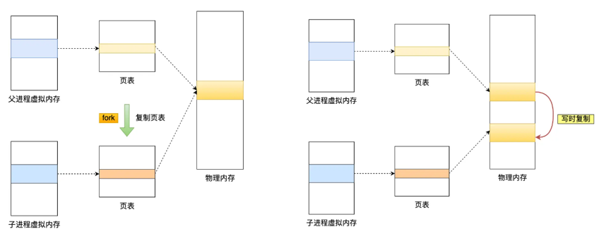

### AOF 日志是如何实现的？

**Redis 在执行完一条写操作命令后，就会把该命令以追加的方式写入到一个文件里；然后 Redis 重启时，会读取该文件记录的命令，然后逐一执行命令的方式来进行数据恢复。**


#### 为什么先执行命令，再把数据写入日志呢？

Reids 是先执行写操作命令后，才将该命令记录到 AOF 日志里的，这么做其实有两个好处。

- **避免额外的检查开销**：因为如果先将写操作命令记录到 AOF 日志里，再执行该命令的话，如果当前的命令语法有问题，那么如果不进行命令语法检查，该错误的命令记录到 AOF 日志里后，Redis 在使用日志恢复数据时，就可能会出错。
- **不会阻塞当前写操作命令的执行**：因为当写操作命令执行成功后，才会将命令记录到 AOF 日志。

当然，这样做也会带来风险：

- **数据可能会丢失：** 执行写操作命令和记录日志是两个过程，那当 Redis 在还没来得及将命令写入到硬盘时，服务器发生宕机了，这个数据就会有丢失的风险。
- **可能阻塞其他操作：** 由于写操作命令执行成功后才记录到 AOF 日志，**所以不会阻塞当前命令的执行，但因为 AOF 日志也是在主线程中执行，所以当 Redis 把日志文件写入磁盘的时候，还是会阻塞后续的操作无法执行**。

#### AOF 写回策略有几种？3种

Redis在执行完写操作命令会有三种方式将AOF日志数据写回硬盘，具体来说：

1. Redis 执行完写操作命令后，首先会将命令追加到AOF缓冲区（ server.aof_buf ）；
2. 然后通过 write() 系统调用，将AOF缓冲区（ server.aof_buf ）的数据写入到 AOF 文件，此时数据并没有写入到硬盘，而是拷贝到了**内核缓冲区 page cache，等待内核将数据写入硬盘**；
3. 具体内核缓冲区的数据什么时候写入到硬盘，由内核决定。

Redis 提供了 3 种写回硬盘的策略，控制的就是上面说的第三步的过程。 在 Redis.conf 配置文件中的 appendfsync 配置项可以有以下 3 种参数可填：

- **Always**，这个单词的意思是「总是」，所以它的意思是每次写操作命令执行完后，同步将 AOF 日志数据写回硬盘；
- **Everysec**，这个单词的意思是「每秒」，所以它的意思是每次写操作命令执行完后，先将命令写入到 AOF 文件的内核缓冲区，然后每隔一秒将缓冲区里的内容写回到硬盘；
- **No**，意味着不由 Redis 控制写回硬盘的时机，转交给操作系统控制写回的时机，也就是每次写操作命令执行完后，先将命令写入到 AOF 文件的内核缓冲区，再由操作系统决定何时将缓冲区内容写回硬盘。

我也把这 3 个写回策略的优缺点总结成了一张表格：


#### AOF 日志过大，会触发什么机制？

AOF 日志是一个文件，随着执行的写操作命令越来越多，文件的大小会越来越大。 如果当 AOF 日志文件过大就会带来性能问题，比如重启 Redis 后，需要读 AOF 文件的内容以恢复数据，如果文件过大，整个恢复的过程就会很慢。

**Redis 为了避免 AOF 文件越写越大，提供了 AOF 重写机制，当 AOF 文件的大小超过所设定的阈值后，Redis 就会启用 AOF 重写机制，来压缩 AOF 文件。**

**AOF 重写机制是在重写时，读取当前数据库中的所有键值对，然后将每一个键值对用一条命令记录到「新的 AOF 文件」，等到全部记录完后，就将新的 AOF 文件替换掉现有的 AOF 文件。**

举个例子，在没有使用重写机制前，假设前后执行了「*set name xiaolin*」和「*set name xiaolincoding*」这两个命令的话，就会将这两个命令记录到 AOF 文件。


但是**在使用重写机制后，就会读取 name 最新的 value（键值对） ，然后用一条 「set name xiaolincoding」命令记录到新的 AOF 文件**，之前的第一个命令就没有必要记录了，因为它属于「历史」命令，没有作用了。这样一来，一个键值对在重写日志中只用一条命令就行了。

重写工作完成后，就会将新的 AOF 文件覆盖现有的 AOF 文件，这就相当于压缩了 AOF 文件，使得 AOF 文件体积变小了。

#### 重写 AOF 日志的过程是怎样的？

Redis 的**重写 AOF 过程是由后台子进程 bgrewriteaof来完成的**，这么做可以达到两个好处：

- 子进程进行 AOF 重写期间，主进程可以继续处理命令请求，从而避免阻塞主进程；
- 子进程带有主进程的数据副本，这里使用子进程而不是线程，因为如果是使用线程，多线程之间会共享内存，那么在修改共享内存数据的时候，需要通过加锁来保证数据的安全，而这样就会降低性能。**而使用子进程，创建子进程时，父子进程是共享内存数据的，不过这个共享的内存只能以只读的方式，而当父子进程任意一方修改了该共享内存，就会发生「写时复制」，于是父子进程就有了独立的数据副本，就不用加锁来保证数据安全**。

**触发重写机制后，主进程就会创建重写 AOF 的子进程，此时父子进程共享物理内存，重写子进程只会对这个内存进行只读，重写 AOF 子进程会读取数据库里的所有数据，并逐一把内存数据的键值对转换成一条命令，再将命令记录到重写日志（新的 AOF 文件）**。

**但是重写过程中，主进程依然可以正常处理命令**，那问题来了，重写 AOF 日志过程中，如果主进程修改了已经存在 key-value，那么会发生写时复制，此时这个 key-value 数据在子进程的内存数据就跟主进程的内存数据不一致了，这时要怎么办呢？

为了解决这种数据不一致问题，Redis 设置了一个 **AOF 重写缓冲区**，这个缓冲区在创建 bgrewriteaof 子进程之后开始使用。

在重写 AOF 期间，当 Redis 执行完一个写命令之后，它会**同时将这个写命令写入到 「AOF 缓冲区」和 「AOF 重写缓冲区」**。


也就是说，在 bgrewriteaof 子进程执行 AOF 重写期间，主进程需要执行以下三个工作:

- 执行客户端发来的命令；
- 将执行后的写命令追加到 「AOF 缓冲区」；
- 将执行后的写命令追加到 「AOF 重写缓冲区」；

**当子进程完成 AOF 重写工作（*扫描数据库中所有数据，逐一把内存数据的键值对转换成一条命令，再将命令记录到重写日志*）后**，会向主进程发送一条信号，信号是进程间通讯的一种方式，且是异步的。

主进程收到该信号后，会调用一个信号处理函数，该函数主要做以下工作：

- **将 AOF 重写缓冲区中的所有内容追加到新的 AOF 的文件中，使得新旧两个 AOF 文件所保存的数据库状态一致；**
- **新的 AOF 的文件进行改名，覆盖现有的 AOF 文件。**

信号函数执行完后，主进程就可以继续像往常一样处理命令了。

#### AOF重写期间命令可能会写入两次，会造成什么影响？

AOF 重写期间，**Redis 会将新的写命令同时写入旧的 AOF 文件和重写缓冲区。**

**这样会带来额外的磁盘开销，但可以防止 Redis 在 AOF 重写过程中崩溃时数据丢失**。即使 AOF 重写过程中出现问题（例如 Redis 崩溃），旧的 AOF 文件仍然是完整的，不会丢失数据。

当 AOF 重写完成后，Redis 会通过**原子操作**将新的 AOF 文件替换掉旧的文件，从而完成重写过程，确保数据的完整性和一致性。

### Redis 的数据恢复？

当 Redis 中的数据丢失时，可以从 RDB 或者 AOF 中恢复数据。

可以将 RDB 文件或者 AOF 文件复制到 Redis 的数据目录下，然后重启 Redis 服务，Redis 会自动加载数据文件并恢复数据。

**Redis** 启动时加载数据的流程：

1. AOF 开启且存在 AOF 文件时，优先加载 AOF 文件。
2. AOF 关闭或者 AOF 文件不存在时，加载 RDB 文件。


### 为什么会有混合持久化？

RDB 优点是数据恢复速度快，但是快照的频率不好把握。频率太低，丢失的数据就会比较多，频率太高，就会影响性能。

AOF 优点是丢失数据少，但是数据恢复不快。

为了集成了两者的优点， Redis 4.0 提出了**混合使用 AOF 日志和内存快照**，也叫混合持久化，既保证了 Redis 重启速度，又降低数据丢失风险。

混合持久化工作在 **AOF 日志重写过程**。当开启了混合持久化时，**在 AOF 重写日志时，fork 出来的重写子进程会先将与主线程共享的内存数据以 RDB 方式写入到 AOF 文件**，**然后主线程处理的操作命令会被记录在重写缓冲区里，重写缓冲区里的增量命令会以 AOF 方式写入到 AOF 文件**，写入完成后通知主进程将新的含有 RDB 格式和 AOF 格式的 AOF 文件替换旧的的 AOF 文件。

也就是说，使用了混合持久化，AOF 文件的**前半部分是 RDB 格式的全量数据，后半部分是 AOF 格式的增量数据**。

这样的好处在于，重启 Redis 加载数据的时候，由于前半部分是 RDB 内容，这样**加载的时候速度会很快**。

加载完 RDB 的内容后，才会加载后半部分的 AOF 内容，这里的内容是 Redis 后台子进程重写 AOF 期间，主线程处理的操作命令，可以使得**数据更少的丢失**。

**混合持久化优点：**

- 混合持久化结合了 RDB 和 AOF 持久化的优点，开头为 RDB 的格式，使得 Redis 可以更快的启动，同时结合 AOF 的优点，有减低了大量数据丢失的风险。

**混合持久化缺点：**

- AOF 文件中添加了 RDB 格式的内容，使得 AOF 文件的可读性变得很差；
- 兼容性差，如果开启混合持久化，那么此混合持久化 AOF 文件，就不能用在 Redis 4.0 之前版本了。


## Redis 高可用（集群）

Redis 除了单机部署外，还可以通过主从复制、哨兵模式和集群模式来实现高可用。

**主从复制**：允许一个 Redis 服务器（主节点）将数据复制到一个或多个 Redis 服务器（从节点）。这种方式可以实现读写分离，适合读多写少的场景。

**哨兵模式**：用于监控主节点和从节点的状态，实现自动故障转移。如果主节点发生故障，哨兵可以自动将一个从节点升级为新的主节点。

**集群模式**：**Redis 集群通过分片的方式存储数据，每个节点存储数据的一部分，用户请求可以并行处理**。**集群模式支持自动分区、故障转移，并且可以在不停机的情况下进行节点增加或删除**。

### Redis如何实现服务高可用？

要想设计一个高可用的 Redis 服务，一定要从 Redis 的多服务节点来考虑，比如 Redis 的主从复制、哨兵模式、切片集群。

#### 主从复制

主从复制是 Redis 高可用服务的最基础的保证，实现方案就是将从前的一台 Redis 服务器，同步数据到多台从 Redis 服务器上，即一主多从的模式，且主从服务器之间采用的是「读写分离」的方式：主服务器可以进行读写操作，**当发生写操作时，自动将写操作同步给从服务器**，而从服务器一般是只读，并接受主服务器同步过来写操作命令，然后执行这条命令。


也就是说，所有的数据修改只在主服务器上进行，然后将最新的数据同步给从服务器，这样就使得主从服务器的数据是一致的。

注意，主从服务器之间的命令复制是**异步**进行的。

具体来说，在主从服务器命令传播阶段，主服务器收到新的写命令后，会发送给从服务器。。如果从服务器还没有执行主服务器同步过来的命令，主从服务器间的数据就不一致了。

所以，无法实现强一致性保证（主从数据时时刻刻保持一致），数据不一致是难以避免的。

#### 哨兵模式

在使用 Redis 主从服务的时候，会有一个问题，就是当 Redis 的主从服务器出现故障宕机时，需要手动进行恢复。

为了解决这个问题，Redis 增加了哨兵模式（**Redis Sentinel**），因为哨兵模式做到了可以监控主从服务器，并且提供**主从节点故障转移的功能。**


#### 集群模式

当 Redis 缓存数据量大到一台服务器无法缓存时，就需要使用 **Redis 集群**方案，它将数据分布在不同的服务器上，以此来降低系统对单主节点的依赖，从而提高 Redis 服务的读写性能。

**Redis集群方案采用哈希槽（Hash Slot）来处理数据和节点之间的映射关系**。在 Redis集群方案中，**一个切片集群共有 16384 个哈希槽**，这些哈希槽类似于数据分区，每个键值对都会根据它的 key，被映射到一个哈希槽中，具体执行过程分为两大步：

- 根据键值对的 key，按照 CRC16 算法计算一个 16 bit 的值。
- 再用 16bit 值对 16384 取模，得到 0~16383 范围内的模数，每个模数代表一个相应编号的哈希槽。

接下来的问题就是，这些哈希槽怎么被映射到具体的 Redis 节点上的呢？有两种方案：

- **平均分配：** 在使用 cluster create 命令创建 Redis 集群时，Redis 会自动把所有哈希槽平均分布到集群节点上。比如集群中有 9 个节点，则每个节点上槽的个数为 16384/9 个。
- **手动分配：** 可以使用 cluster meet 命令手动建立节点间的连接，组成集群，再使用 cluster addslots 命令，指定每个节点上的哈希槽个数。

为了方便你的理解，我通过一张图来解释数据、哈希槽，以及节点三者的映射分布关系。


上图中的切片集群一共有 2 个节点，假设有 4 个哈希槽（Slot 0～Slot 3）时，我们就可以通过命令手动分配哈希槽，比如节点 1 保存哈希槽 0 和 1，节点 2 保存哈希槽 2 和 3。

```c
redis-cli -h 192.168.1.10 –p 6379 cluster addslots 0,1
redis-cli -h 192.168.1.11 –p 6379 cluster addslots 2,3
```

然后在集群运行的过程中，key1 和 key2 计算完 CRC16 值后，对哈希槽总个数 4 进行取模，再根据各自的模数结果，就可以被映射到哈希槽 1（对应节点1） 和 哈希槽 2（对应节点2）。

需要注意的是，在手动分配哈希槽时，需要把 16384 个槽都分配完，否则 Redis 集群无法正常工作。

### 主从复制了解吗？

主从复制是指**将一台 Redis 服务器的数据，复制到其他的 Redis 服务器**，前者称为主节点 master，后者称为从节点slave。且数据的复制是单向的，只能由主节点到从节点。

**在 Redis 主从架构中，主节点负责处理所有的写操作，并将这些操作异步复制到从节点**。从节点主要用于读取操作，以分担主节点的压力和提高读性能。


#### 主从复制主要的作用是什么?

①、**数据冗余：** 主从复制实现了数据的热备份，是持久化之外的一种数据冗余方式。

②、**故障恢复：** 如果主节点挂掉了，可以将一个从节点提升为主节点，从而实现故障的快速恢复。

通常会使用 Sentinel 哨兵来实现自动故障转移，当主节点挂掉时，Sentinel 会自动将一个从节点升级为主节点，保证系统的可用性。

```
# sentinel.conf

port 26379
sentinel monitor mymaster 192.168.1.1 6379 2
sentinel down-after-milliseconds mymaster 5000
sentinel failover-timeout mymaster 60000
sentinel parallel-syncs mymaster 1
```

假如是从节点挂掉了，主节点不受影响，但应该尽快修复并重启挂掉的从节点，使其重新加入集群并从主节点同步数据。

③、**负载均衡：** **在主从复制的基础上，配合读写分离，可以由主节点提供写服务，由从节点提供读服务 *（即写 Redis 时连接主节点，读 Redis 时连接从节点）*，分担服务器负载**。尤其是在写少读多的场景下，通过多个从节点分担读负载，可以大大提高 Redis 服务器的并发量。

④、**高可用基石：** 除了上述作用以外，主从复制还是哨兵和集群能够实施的 **基础**。

#### 主从复制出现数据不一致怎么办？

**Redis 的主从复制是异步进行的，这意味着主节点在执行完写操作后，会立即返回给客户端，而不是等待从节点完成数据同步，所以无法实现强一致性保证（主从数据时时刻刻保持一致）。**

**在主节点将数据同步到从节点的过程中，可能会出现网络延迟或中断，从而导致从节点的数据滞后于主节点**。

**为了解决数据不一致的问题，主要有以下两种方法：**

- 第一种方法，尽量保证主从节点间的网络连接状况良好，避免主从节点在不同的机房。但可能会带来新的问题，就是整个机房都挂掉的情况。

- 第二种方法，Redis 本身也提供了一些机制来解决数据不一致的问题，具体做法：**监控主从节点的复制进度差，如果超过阈值，就禁止客户端从这个从节点读取数据。**

    - Redis 的 INFO replication 命令可以查看主节点接收写命令的进度信息（master_repl_offset）和从节点复制写命令的进度信息（slave_repl_offset），所以，我们就可以开发一个监控程序，先用 INFO replication 命令查到主、从节点的进度，然后，我们用 master_repl_offset 减去 slave_repl_offset，这样就能得到从节点和主节点间的复制进度差值了。

    - 如果某个从节点的进度差值大于我们预设的阈值，我们可以让客户端不再和这个从节点连接进行数据读取，这样就可以减少读到不一致数据的情况。不过，为了避免出现客户端和所有从节点都不能连接的情况，我们需要把复制进度差值的阈值设置得大一些。


#### Redis解决单点故障主要靠什么？主从如何做到故障自动切换？

**主从复制，当主节点发生故障时，从节点是无法自动升级为主节点的，这个过程需要人工处理，在此期间 Redis 无法对外提供写操作。**

**解决方案：**

- Redis 的哨兵机制（Sentinel）可以实现自动化的故障转移，当主节点宕机时，哨兵自动完成故障发现和故障转移，哨兵会自动将一个从节点升级为新的主节点，并通知给应用方，从而实现高可用性。
- 集群模式下，当某个节点发生故障时，Redis集群会自动将请求路由到其他节点，并通过从节点进行故障恢复。

### Redis 主从有几种常见的拓扑结构？

Redis 的复制拓扑结构可以支持单层或多层复制关系，根据拓扑复杂性可以分为以下三种：一主一从、一主多从、树状主从结构。

一主一从结构是最简单的复制拓扑结构，用于主节点出现宕机时从节点提供故障转移支持。


一主多从结构（又称为星形拓扑结构）使得应用端可以利用多个从节点实现读写分离。对于读占比较大的场景，可以把读命令发送到从节点来分担主节点压力。


树状主从结构（又称为树状拓扑结构）使得从节点不但可以复制主节点数据，同时可以作为其他从节点的主节点继续向下层复制。通过引入复制中间层，可以有效降低主节点负载和需要传送给从节点的数据量。


### Redis 的主从复制原理了解吗？6步

Redis 主从复制的工作流程大概可以分为如下几步：


1. **保存主节点（master）的 IP 和端口信息**：在这一步，主节点的 IP 和端口信息会被保存，便于从节点与主节点建立连接。
2. **主从节点建立连接**：当从节点发现新的主节点时，它会尝试与主节点建立网络连接。
3. **发送 PING 命令**：连接建立成功后，从节点会向主节点发送 PING 命令，进行首次通信。**这主要用于检查主从节点之间的网络连接是否正常，并确保主节点可以接受命令。**
4. **权限验证**：如果主节点要求密码验证，从节点必须提供正确的密码，才能通过验证。
5. **同步数据集**：在主从连接正常后，主节点会将当前持有的所有数据发送给从节点，进行初始的数据同步。
6. **命令持续复制**：同步完成后，主节点会持续地将写命令传递给从节点，确保主从节点的数据始终保持一致。

### 说说主从数据同步的方式？

**Redis 在 2.8 及以上版本使用 psync 命令完成主从数据同步，同步过程分为：全量复制和部分复制**。

**全量复制** 一般用于初次复制场景，Redis 早期支持的复制功能只有全量复制，它会把主节点全部数据一次性发送给从节点，当数据量较大时，会对主从节点和网络造成很大的开销。

完全同步发生在以下几种情况：

- **初次同步**：当一个从服务器（slave）首次连接到主服务器（master）时，会进行一次完全同步。
- **从服务器数据丢失**：如果从服务器数据由于某种原因（如断电）丢失，它会请求进行完全同步。
- **主服务器数据发生变化**：如果从服务器长时间未与主服务器同步，导致数据差异太大，也可能触发完全同步。

主从服务器间的第一次同步的过程可分为三个阶段：

- 第一阶段是建立链接与协商同步；

    - **步骤1.1**：**从节点发起同步请求**：从节点向主节点发送 `PSYNC ? -1` 命令（第一次全量复制时使用），表示请求全量同步。
        - 参数 `?` 表示从节点未知主节点的**运行ID（run ID）**，`-1` 表示初始偏移量。

    - **步骤1.2**：**主节点响应并协商**：主节点收到 `PSYNC ? -1` 后，判断为全量复制，回复 一个全量复制`+FULLRESYNC <run_id> <offset>` 的响应，从节点保存这两个值，用于后续同步或异常恢复。
        - `<run_id>`：主节点的唯一运行ID（标识主节点身份）。
        - `<offset>`：**当前主节点的复制偏移量（初始值为生成RDB时的偏移量）**。

- 第二阶段是同步RDB文件，主服务器同步数据给从服务器；

    - **步骤2.1**：**主节点生成RDB文件**，主节点执行 `BGSAVE` 命令，在后台生成RDB快照文件（持久化当前数据集）。
        - 此时主节点继续处理客户端请求，但将新写入的命令暂存到 **replication buffer**（复制缓冲区）中。
    - **步骤2.2**：**主节点传输RDB文件到从节点**，RDB生成完成后，主节点通过TCP连接将RDB文件发送给从节点。
        - 传输过程中，主节点持续记录新写命令到 **replication buffer**。
    - **步骤2.3**：**从节点接收并处理RDB文件**
        - **清空旧数据**：从节点接收到完整RDB文件后，**立即清空当前数据库**，确保数据一致性。
        - **加载RDB文件**：从节点将RDB文件加载到内存中，替换原有数据，完成数据集的初始化。

- 第三阶段是同步增量数据，主服务器发送新写操作命令给从服务器。

    - **步骤3.1**：**主节点发送缓冲区数据**：RDB加载完成后，主节点将 **replication buffer** 中记录的写命令（RDB生成后到传输完成期间的命令）发送给从节点。复制缓冲区中的数据包括一下三个部分：
        - 主服务器生成 RDB 文件期间；

        - 主服务器发送 RDB 文件给从服务器期间；
        - 「从服务器」加载 RDB 文件期间；

    - **步骤3.2**：**从节点应用增量命令**：从节点执行主节点发送的写命令，确保与主节点的数据完全一致。
        - 此时主从节点的偏移量（offset）同步，复制状态变为“在线”（online）。

- 第四阶段：后续处理（可选）

    - **步骤4.1**：**从节点AOF重写（若启用AOF）**：如果从节点开启了AOF持久化，加载RDB完成后会触发 `BGREWRITEAOF` 操作，生成新的AOF文件，确保AOF与当前数据一致。

    - **步骤4.2**：**更新复制状态**，主节点记录从节点的运行ID和偏移量，从节点保存主节点的run ID和当前offset，用于后续可能的增量复制（如网络恢复后的部分同步）。


**部分复制**：主要是 Redis 针对全量复制的过高开销做出的一种优化措施， 使用`psync {runId} {offset}`命令实现。当从节点（slave）正在复制主节点 （master）时，如果出现网络闪断或者命令丢失等异常情况时，从节点会向 主节点要求补发丢失的命令数据，**如果主节点的复制积压缓冲区内存在这部分数据则直接发送给从节点，这样就可以保持主从节点复制的一致性**。**增量同步允许从服务器从断点处继续同步，而不是每次都进行完全同步。**

1. 当主从节点之间网络出现中断时，如果超过 repl-timeout 时间，主节点会认为从节点故障并中断复制连接
2. 主从连接中断期间主节点依然响应命令，但因复制连接中断命令无法发送给从节点，不过主节点内部存在的复制积压缓冲区，依然可以保存最近一段时间的写命令数据，默认最大缓存 1MB。
3. 当主从节点网络恢复后，从节点会再次连上主节点。
4. 当主从连接恢复后，由于从节点之前保存了自身已复制的偏移量和主节点的运行 ID。因此会把它们当作 psync 参数发送给主节点，要求进行部分复制操作。
5. 主节点接到 psync 命令后首先核对参数 runId 是否与自身一致，如果一 致，说明之前复制的是当前主节点；之后根据参数 offset 在自身复制积压缓冲区查找，如果偏移量之后的数据存在缓冲区中，则对从节点发送+CONTINUE 响应，表示可以进行部分复制。（如果不是自己的runID，则表明主节点变更了，需要进行全量复制）
6. 然后主节点将主从服务器断线期间，所执行的写命令发送给从节点，然后从节点执行这些命令。


那么关键的问题来了，**主服务器怎么知道要将哪些增量数据发送给从服务器呢？**

答案藏在这两个东西里：

- **repl_backlog_buffer**，可译为 复制积压缓冲区，是一个「**环形**」缓冲区，用于主从服务器断连后，从中找到差异的数据；
- **replication offset**，标记上面那个缓冲区的同步进度，主从服务器都有各自的偏移量，主服务器使用 master_repl_offset 来记录自己「*写*」到的位置，从服务器使用 slave_repl_offset 来记录自己「*读*」到的位置。

那 repl_backlog_buffer 缓冲区是什么时候写入的呢？

在主服务器进行命令传播时，不仅会将写命令发送给从服务器，还会将写命令写入到 repl_backlog_buffer 缓冲区里，因此 这个缓冲区里会保存着最近传播的写命令。

网络断开后，当从服务器重新连上主服务器时，从服务器会通过 psync 命令将自己的复制偏移量 slave_repl_offset 发送给主服务器，主服务器根据自己的 master_repl_offset 和 slave_repl_offset 之间的差距，然后来决定对从服务器执行哪种同步操作：

- 如果判断出从服务器要读取的数据还在 repl_backlog_buffer 缓冲区里，那么主服务器将采用**增量同步**的方式；
- 相反，如果判断出从服务器要读取的数据已经不存在 repl_backlog_buffer 缓冲区里，那么主服务器将采用**全量同步**的方式。

当主服务器在 repl_backlog_buffer 中找到主从服务器差异（增量）的数据后，就会将增量的数据写入到 replication buffer 缓冲区，这个缓冲区我们前面也提到过，它是缓存将要传播给从服务器的命令。


repl_backlog_buffer 环形缓冲区的默认大小是 1M，并且由于它是一个环形缓冲区，所以当缓冲区写满后，主服务器继续写入的话，就会覆盖之前的数据。因此，当主服务器的写入速度远超于从服务器的读取速度，缓冲区的数据一下就会被覆盖。

那么在网络恢复时，如果从服务器想读的数据已经被覆盖了，主服务器就会采用全量同步，这个方式比增量同步的性能损耗要大很多。

因此，**为了避免在网络恢复时，主服务器频繁地使用全量同步的方式，我们应该调整下 repl_backlog_buffer 缓冲区大小，尽可能的大一些**，减少出现从服务器要读取的数据被覆盖的概率，从而使得主服务器采用增量同步的方式。

### 主从复制中两个 Buffer(replication buffer 、repl backlog buffer)有什么区别？

replication buffer（复制缓冲区） 、repl backlog buffer（复制积压缓冲区）区别如下：

- 出现的阶段不一样：
    - repl backlog buffer 是在增量复制阶段出现，**一个主节点只分配一个 repl backlog buffer**；
    - replication buffer 是在全量复制阶段和增量复制阶段都会出现，**主节点会给每个新连接的从节点，分配一个 replication buffer**；
- 这两个 Buffer 都有大小限制的，当缓冲区满了之后，发生的事情不一样：
    - 当 repl backlog buffer 满了，因为是环形结构，会直接**覆盖起始位置数据**;
    - 当 replication buffer 满了，会导致连接断开，删除缓存，从节点重新连接，**重新开始全量复制**。

### 主从复制存在哪些问题呢？

Redis 主从复制虽然实现了读写分离和数据备份，但也存在一些明显的缺点：

- 由于主从复制是异步的，**如果主节点在数据尚未完全同步到从节点时崩溃，会导致数据丢失**。
- **写操作集中在主节点，从节点只能处理读操作，无法分担写入压力**。
- 在网络分区的情况下，主节点和从节点可能无法相互通信，导致两个节点都被认为是主节点，形成多个主节点的情况，也就是脑裂。

#### 如何避免主从复制数据丢失？

主从切换过程中，产生数据丢失的情况有两种：

- 异步复制同步丢失
- 集群产生脑裂数据丢失

我们不可能保证数据完全不丢失，只能做到使得尽量少的数据丢失。

通过设置这两个参数来减少数据的丢失，**一个是主节点必须要有至少x个从节点在线，第二个是主从数据复制和同步的延迟不能超过1秒，只要一个不满足，主节点就会禁止写数据，把错误返回给客户端**

- min-slaves-to-write x，主节点必须要有**至少 x 个从节点连接**，如果小于这个数，主节点会禁止写数据。
- min-slaves-max-lag x，主从数据复制和同步的延迟**不能超过 x 秒**，如果主从同步的延迟超过 x 秒，主节点会禁止写数据。

#### 异步复制同步丢失

对于 Redis 主节点与从节点之间的数据复制，是异步复制的，当客户端发送写请求给主节点的时候，客户端会返回 ok，接着主节点将写请求异步同步给各个从节点，但是如果此时主节点还没来得及同步给从节点时发生了断电，那么主节点内存中的数据会丢失。

**减少异步复制的数据丢失的方案：**

Redis 配置里有一个参数 min-slaves-max-lag，表示一旦所有的从节点数据复制和同步的延迟都超过了 min-slaves-max-lag 定义的值，那么主节点就会拒绝接收任何请求。

假设将 min-slaves-max-lag 配置为 10s 后，根据目前 master->slave 的复制速度，如果数据同步完成所需要时间超过10s，就会认为 master 未来宕机后损失的数据会很多，master 就拒绝写入新请求。这样就能将 master 和 slave 数据差控制在10s内，即使 master 宕机也只是这未复制的 10s 数据。

那么对于客户端，当客户端发现 master 不可写后，我们可以采取降级措施，将数据暂时写入本地缓存和磁盘中，在一段时间（等 master 恢复正常）后重新写入 master 来保证数据不丢失，也可以将数据写入 消息队列，等 master 恢复正常，再隔一段时间去消费 消息队列 中的数据，让将数据重新写入 master 。

#### 脑裂问题了解吗？集群脑裂导致数据丢失怎么办？

Redis 的脑裂问题是指在主从模式或集群模式下，**由于网络分区或节点故障，可能导致系统中出现多个主节点，从而引发数据不一致、数据丢失等问题**。

**可以通过哨兵模式和集群模式中的投票机制和强制下线机制来解决。**

> 什么是脑裂？

那么在 Redis 中，集群脑裂产生数据丢失的现象是怎样的呢？

在 Redis 主从架构中，部署方式一般是「一主多从」，主节点提供写操作，从节点提供读操作。 如果主节点的网络突然发生了问题，它与所有的从节点都失联了，但是此时的主节点和客户端的网络是正常的，这个客户端并不知道 Redis 内部已经出现了问题，还在照样的向这个失联的主节点写数据（过程A），此时这些数据被旧主节点缓存到了缓冲区里，因为主从节点之间的网络问题，这些数据都是无法同步给从节点的。

这时，哨兵也发现主节点失联了，它就认为主节点挂了（但实际上主节点正常运行，只是网络出问题了），于是哨兵就会在「从节点」中选举出一个 leader 作为主节点，这时集群就有两个主节点了 —— **脑裂出现了**。

然后，网络突然好了，哨兵因为之前已经选举出一个新主节点了，它就会把旧主节点降级为从节点（A），然后从节点（A）会向新主节点请求数据同步，**因为第一次同步是全量同步的方式，此时的从节点（A）会清空掉自己本地的数据，然后再做全量同步。所以，之前客户端在过程 A 写入的数据就会丢失了，也就是集群产生脑裂数据丢失的问题**。

**总结一句话就是：由于网络问题，集群节点之间失去联系。主从数据不同步；重新平衡选举，产生两个主服务。等网络恢复，旧主节点会降级为从节点，再与新主节点进行同步复制的时候，由于会从节点会清空自己的缓冲区，所以导致之前客户端写入的数据丢失了。**

> 解决方案

**当主节点发现从节点下线或者通信超时的总数量大于阈值时，那么禁止主节点进行写数据，直接把错误返回给客户端。**

在 Redis 的配置文件中有两个参数我们可以设置：

- min-slaves-to-write x，主节点必须要有至少 x 个从节点连接，如果小于这个数，主节点会禁止写数据。
- min-slaves-max-lag x，主从数据复制和同步的延迟不能超过 x 秒，如果超过，主节点会禁止写数据。

我们可以把 min-slaves-to-write 和 min-slaves-max-lag 这两个配置项搭配起来使用，分别给它们设置一定的阈值，假设为 N 和 T。

这两个配置项组合后的要求是，主库连接的从库中至少有 N 个从库，和主库进行数据复制时的 ACK 消息延迟不能超过 T 秒，否则，主库就不会再接收客户端的写请求了。

即使原主库是假故障，它在假故障期间也无法响应哨兵心跳，也不能和从库进行同步，自然也就无法和从库进行 ACK 确认了。这样一来，min-slaves-to-write 和 min-slaves-max-lag 的组合要求就无法得到满足，**原主库就会被限制接收客户端写请求，客户端也就不能在原主库中写入新数据了**。

**等到新主库上线时，就只有新主库能接收和处理客户端请求，此时，新写的数据会被直接写到新主库中。而原主库会被哨兵降为从库，即使它的数据被清空了，也不会有新数据丢失。**

再来举个例子。

假设我们将 min-slaves-to-write 设置为 1，把 min-slaves-max-lag 设置为 12s，把哨兵的 down-after-milliseconds 设置为 10s，主库因为某些原因卡住了 15s，导致哨兵判断主库客观下线，开始进行主从切换。

同时，因为原主库卡住了 15s，没有一个从库能和原主库在 12s 内进行数据复制，原主库也无法接收客户端请求了。

这样一来，主从切换完成后，也只有新主库能接收请求，不会发生脑裂，也就不会发生数据丢失的问题了。

### redis主从和集群可以保证数据一致性吗 ？

redis 主从和集群在CAP理论都属于AP模型，即在面临网络分区时选择**保证可用性和分区容忍性，而牺牲了强一致性**。这意味着在网络分区的情况下，Redis主从复制和集群可以继续提供服务并保持可用，**但可能会出现部分节点之间的数据不一致**。

### Redis主从节点时长连接还是短连接？

长连接

### 怎么判断 Redis 某个节点是否正常工作？

**Redis 判断节点是否正常工作，主要通过互相之间的 ping-pong 心跳检测机制**。具体来说，当集群中的节点发送 ping 请求到某个节点时，如果该节点没有返回 pong 响应，并且超过一半的节点都无法收到该节点的 pong 响应，那么集群会认为该节点出现故障，并断开与该节点的连接。

**Redis 主从节点的心跳机制有所不同**，具体如下：

- **主节点**：默认每隔 10 秒向从节点发送 ping 命令，用于检查从节点的存活状态和连接状态。这个间隔时间可以通过参数 `repl-ping-slave-period` 来调整。
- **从节点**：每隔 1 秒向主节点发送 `replconf ack {offset}` 命令，上报自身的复制偏移量。这个操作的目的是：
    - 实时监控主从节点之间的网络状态；
    - 上报复制偏移量，以便检查是否存在数据丢失。如果从节点发现数据丢失，可以从主节点的复制缓冲区拉取丢失的数据。

### Redis是同步复制还是异步复制？

Redis 采用的是**异步复制**机制。

具体来说，当主节点收到写命令后，会先执行命令以更新自身内存中的数据，随后将该命令写入**为当前连接的从节点单独分配的复制缓冲区（replication buffer）** 中；之后，主节点无需等待从节点接收或执行该命令，而是通过后台线程异步地将缓冲区中的命令发送给从节点，自身则可以继续处理其他请求。

### Redis 哨兵了解吗？

**Redis 哨兵（Sentinel）机制**是 Redis 提供的高可用性解决方案，旨在监控 Redis 主从架构中的节点，并在主节点出现故障时，**自动进行故障转移**。

哨兵的核心功能包括：

1. **监控**：定期检查 Redis 主从节点的状态，确保它们按预期工作。
2. **通知**：当检测到故障时，哨兵会向管理员或系统通知故障信息。
3. **自动故障转移**：一旦主节点故障，哨兵会在从节点中选举出一个新的主节点，并将客户端连接指向新的主节点，确保服务的持续可用性。

通过这些功能，Redis 哨兵能够在主节点发生故障时，快速恢复系统，确保 Redis 集群的高可用性和稳定性。


> 1. [Java 面试指南（付费）](https://javabetter.cn/zhishixingqiu/mianshi.html)收录的比亚迪面经同学 1 面试原题：Redis 的哨兵机制了解吗？

### Redis 哨兵实现原理知道吗？

Redis 哨兵机制的核心职责包括 **监控**、**选主**和**通知**。

哨兵节点的工作流程包括以下几个重要步骤：**定时监控、主观下线和客观下线、领导者哨兵选举、故障转移等。**


1. **定时监控**：哨兵会定期向所有 Redis 节点发送 **PING** 命令，检测节点的可达性。如果在指定时间内没有收到回复，哨兵会将该节点标记为 **“主观下线”**。
2. **主观下线与客观下线**：当一个哨兵判断某个主节点为主观下线后，它会向其他哨兵节点询问其看法。如果多个哨兵认为该主节点确实不可用，并且达到预设的阈值，主节点会被标记为 **“客观下线”**。
3. **选举领导者哨兵**：一旦主节点被标记为客观下线，哨兵集群将启动Raft算法进行**领导者哨兵选举**。
4. **故障转移**：
    1. 领导者哨兵负责从**从节点中选择一个合适的节点作为新的主节点**，选择时会根据网络状况、节点优先级、复制偏移量、运行时ID来确定新的主节点；
    2. 当新主节点被确定后，领导者哨兵会向其发送 `SLAVEOF NO ONE` 命令，提升其为主节点；
    3. 同时，哨兵会更新其他从节点的配置，使它们指向新的主节点；
    4. 最后，哨兵通过 **发布/订阅机制** 通知客户端主节点已发生变化。

> 1. [Java 面试指南（付费）](https://javabetter.cn/zhishixingqiu/mianshi.html)收录的 OPPO 面经同学 1 面试原题：Redis的Sentinel和Cluster怎么理解？说一下大概原理

#### 故障节点主观下线与主管下线

Sentinel集群的每一个Sentinel节点会定时对redis集群的所有节点发心跳包检测节点是否正常。如果一个节点在down-after-milliseconds时间内没有回复Sentinel节点的心跳包，则该redis节点被该Sentinel节点主观下线。

当节点被一个Sentinel节点记为主观下线时，并不意味着该节点肯定故障了，还需要Sentinel集群的其他Sentinel节点共同判断为主观下线才行。

该Sentinel节点会询问其他Sentinel节点，如果Sentinel集群中超过quorum数量的Sentinel节点认为该redis节点主观下线，则该redis客观下线。

**如果客观下线的redis节点是从节点或者是Sentinel节点，则操作到此为止，没有后续的操作了；如果客观下线的redis节点为主节点，则开始故障转移，从从节点中选举一个节点升级为主节点。**

**如果需要从redis集群选举一个节点为主节点，首先需要从Sentinel集群中选举一个Sentinel节点作为Leader。**

#### 领导者哨兵选举了解吗？

Redis 使用 Raft 算法实现领导者哨兵选举的：当主节点挂掉后，新的主节点是由剩余的从节点发起选举后晋升的。


1. 每个在线的 Sentinel 节点都有资格成为领导者，当它确认主节点下线时候，会向其他哨兵节点发送命令，表明希望由自己来执行主从切换，并让所有其他哨兵进行投票。
    - 这个投票过程称为“Leader 选举”。候选者会给自己先投 1 票，然后向其他 Sentinel 节点发送投票的请求。

2. **收到请求的 Sentinel 节点会进行判断，如果候选者的日志与自己的日志一样新，任期号也小于自己，且之前没有投票过，就会同意投票，回复 Y。否则回复 N。**

3. 候选者收到投票后会统计支持自己的得票数，**如果候选者获得了集群中超过半数节点的投票支持（即多数原则）**，它将成为新的主节点。**新的主节点在确立后，会向其他从节点发送心跳信号，告诉它们自己已经成为主节点，并将其他节点的状态重置为从节点。**

4. 如果多个节点同时成为候选者，并且都有可能获得足够的票数，这种情况下可能会出现选票分裂。也就是没有候选者获得超过半数的选票，那么这次选举就会失败，所有候选者都会再次发起选举。
    - 为了防止无限制的选举失败，每个节点都会有一个选举超时时间，且是随机的。(超时时间指从节点在没有收到主节点的心跳信号或日志追加请求后，等待多长时间才会认为主节点已挂掉，从而进入候选状态并发起选举。)

推荐阅读：[Raft算法的选主过程详解](https://hoverzheng.github.io/post/technology-blog/blockchain/raft算法详解3--选主/)

> 1. [Java 面试指南（付费）](https://javabetter.cn/zhishixingqiu/mianshi.html)收录的8 后端开发秋招一面面试原题：raft主节点挂了怎么选从节点

#### 新的主节点是怎样被挑选出来的？

当Sentinel集群选举出Sentinel Leader后，由Sentinel Leader从redis从节点中选择一个redis节点作为主节点：

1. 过滤调故障节点和主观下线或断线的节点（5 秒内没有回复过Sentinel节点 ping 响应、与主节点失联超过 down-after-milliseconds*10 秒。)
2. **选择 slave-priority（从节点优先级）最高的从节点列表**，如果存在则返回，不存在则继续。
3. **选择复制偏移量最大的从节点**（数据写入量的字节，记录写了多少数据。主服务器会把偏移量同步给从服务器，当主从的偏移量一致，则数据是完全同步），如果存在则返 回，不存在则继续。
4. 选择 runid (redis每次启动的时候生成随机的runid作为redis的标识) 最小的从节点。

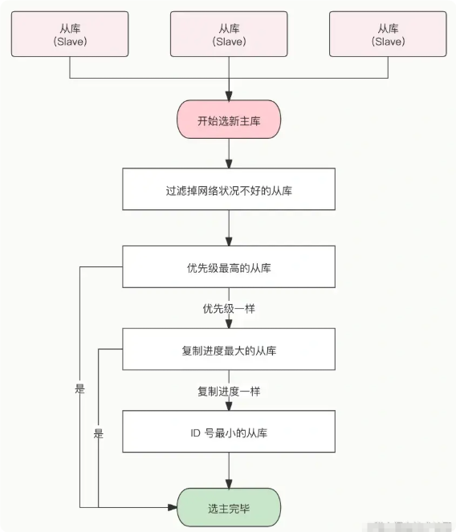

一旦发现master故障，sentinel需要在salve中选择一个作为新的master，选择依据是这样的：

- 首先会判断slave节点与master节点断开时间长短，如果超过指定值（down-after-milliseconds * 10）则会排除该slave节点
- 然后判断slave节点的slave-priority值，越小优先级越高，如果是0则永不参与选举
- 如果slave-prority一样，则判断slave节点的offset值，越大说明数据越新，优先级越高
- 最后是判断slave节点的运行id大小，越小优先级越高。

#### 当选出一个新的master后，该如何实现切换呢？

流程如下：

- sentinel给备选的slave1节点发送slaveof no one命令，让该节点成为master
- sentinel给所有其它slave发送slaveof 192.168.150.101 7002 命令，让这些slave成为新master的从节点，开始从新的master上同步数据。
- 最后，sentinel将故障节点标记为slave，当故障节点恢复后会自动成为新的master的slave节点

### Redis 集群了解吗？

主从和哨兵可以解决高可用、高并发读的问题。但是依然有两个问题没有解决：

- 海量数据存储问题

- 高并发写的问题

当 Redis 缓存数据量大到一台服务器无法缓存时，就需要使用Redis集群，我们通常所说的Redis集群主要是指**Redis 切片集群**（Redis Cluster ）方案，它是Redis官方实现的**唯一分布式集群方案**，通过**虚拟槽分区（Virtual Slot）** 将数据分散到多个节点，支持水平扩展和自动故障转移，**一举解决高可用和分布式问题**。

1. **数据分区：** 数据分区 *(或称数据分片)* 是集群最核心的功能。集群将数据分散到多个节点，一方面 突破了 Redis 单机内存大小的限制，**存储容量大大增加**；**另一方面** 每个主节点都可以对外提供读服务和写服务，**大大提高了集群的响应能力**。
2. **高可用：** 集群支持主从复制和主节点的 **自动故障转移** *（与哨兵类似）*，当任一节点发生故障时，集群仍然可以对外提供服务。


#### Redis Cluster == 切片集群 == 分片集群

切片集群是Redis官方实现的**唯一分布式集群方案**，通过**虚拟槽分区（Virtual Slot）** 将数据分散到多个节点，支持水平扩展和自动故障转移。比如说把 25G 的数据平均分为 5 份，每份 5G，然后启动 5 个 Redis 实例，每个实例保存一份数据。

在 Redis 3.0 之前，官方并没有针对切片集群提供具体的解决方案；但是在 Redis 3.0 之后，官方提供了 Redis Cluster，数据和实例之间的映射通过哈希槽（hash slot）来实现。在 Redis Cluster 方案中，**一个切片集群共有 16384 个哈希槽**，**每个键根据其名字的 CRC16 值被映射到这些哈希槽上**。然后，这些哈希槽会被均匀地分配到所有的 Redis 实例上。

> CRC16 是一种哈希算法，它可以将任意长度的输入数据映射为一个 16 位的哈希值。


**Redis Cluster 映射到哈希槽上的具体执行过程分为两大步：**

- 根据键值对的 key，按照 CRC16 算法计算一个 16 bit 的值。
- 再用 16 bit 值对 16384 取模，得到 0~16383 范围内的模数，每个模数代表一个相应编号的哈希槽。

**哈希槽怎么被映射到具体的 Redis 节点上的呢？有两种方案：**

- **平均分配：** 在使用 cluster create 命令创建 Redis 集群时，Redis 会自动把所有哈希槽平均分布到集群节点上。比如集群中有 9 个节点，则每个节点上槽的个数为 16384/9 个。

- **手动分配：** 可以使用 cluster meet 命令手动建立节点间的连接，组成集群，再使用 cluster addslots 命令，指定每个节点上的哈希槽个数。(在手动分配哈希槽时，需要把 16384 个槽都分配完，否则 Redis 集群无法正常工作)

    ```shell
    redis-cli -h 192.168.1.10 –p 6379 cluster addslots 0,1
    redis-cli -h 192.168.1.11 –p 6379 cluster addslots 2,3
    ```

#### Redis集群模式优缺点

优点：

- **高可用性**：Redis集群最主要的优点是提供了高可用性，节点之间采用主从复制机制，可以保证数据的持久性和容错能力，哪怕其中一个节点挂掉，整个集群还可以继续工作。
- **高性能：**Redis集群采用分片技术，将数据分散到多个节点，从而提高读写性能。当业务访问量大到单机Redis无法满足时，可以通过添加节点来增加集群的吞吐量。
- **扩展性好：**Redis集群的扩展性非常好，可以根据实际需求动态增加或减少节点，从而实现可扩展性。集群模式中的某些节点还可以作为代理节点，自动转发请求，增加数据模式的灵活度和可定制性。

缺点：

- **部署和维护较复杂：**Redis集群的部署和维护需要考虑到分片规则、节点的布置、主从配置以及故障处理等多个方面，需要较强的技术支持，增加了节点异常处理的复杂性和成本。
- **集群同步问题：**当某些节点失败或者网络出故障，集群中数据同步的问题也会出现。数据同步的复杂度和工作量随着节点的增加而增加，同步时间也较长，导致一定的读写延迟。
- **数据分片限制：**Redis集群的数据分片也限制了一些功能的实现，如在一个key上修改多次，可能会因为该key所在的节点位置变化而失败。此外，由于将数据分散存储到各个节点，某些操作不能跨节点实现，不同节点之间的一些操作需要额外注意。

### 集群中数据如何分区？

在 Redis 集群中，数据分区是通过将数据分散到不同的节点来实现的，常见的数据分区规则有三种：

- 节点取余分区
- 一致性哈希分区
- 虚拟槽分区

#### 节点取余分区

节点取余分区是一种简单的分区策略，其中数据项通过对某个值（通常是键的哈希值）进行取余操作来分配到不同的节点。

类似 HashMap 中的取余操作，数据项的键经过哈希函数计算后，对节点数量取余，然后将数据项分配到余数对应的节点上。

缺点是扩缩容时，大多数数据需要重新分配，因为节点总数的改变会影响取余结果，这可能导致大量数据迁移。


#### 一致性哈希分区

一致性哈希分区的原理是：将哈希值空间组织成一个环，数据项和节点都映射到这个环上。数据项由其哈希值直接映射到环上，然后顺时针分配到遇到的第一个节点。从而来减少节点变动时数据迁移的量。


Key 1 和 Key 2 会落入到 Node 1 中，Key 3、Key 4 会落入到 Node 2 中，Key 5 落入到 Node 3 中，Key 6 落入到 Node 4 中。

这种方式相比节点取余最大的好处在于加入和删除节点只影响哈希环中相邻的节点，对其他节点无影响。

但它还是存在问题：

- **节点在圆环上分布不平均，会造成部分缓存节点的压力较大**
- **当某个节点故障时，这个节点所要承担的所有访问都会被顺移到另一个节点上，会对后面这个节点造成压力。**

#### 虚拟槽分区？

在虚拟槽（也叫哈希槽）分区中，槽位的数量是固定的（例如 Redis Cluster 有 16384 = 2^14 个槽），每个键通过哈希算法（比如 CRC16）映射到这些槽上，每个集群节点负责管理一定范围内的槽。

这种分区可以灵活地将槽（以及槽中的数据）从一个节点迁移到另一个节点，从而实现平滑扩容和缩容；数据分布也更加均匀，Redis Cluster 采用的正是这种分区方式。


假设系统中有 4 个实际节点，假设为其分配了 16 个槽(0-15)；

- 槽 0-3 位于节点 node1；
- 槽 4-7 位于节点 node2；
- 槽 8-11 位于节点 node3；
- 槽 12-15 位于节点 node4。

如果此时删除 `node2`，只需要将槽 4-7 重新分配即可，例如将槽 4-5 分配给 `node1`，槽 6 分配给 `node3`，槽 7 分配给 `node4`，数据在节点上的分布仍然较为均衡。

如果此时增加 node5，也只需要将一部分槽分配给 node5 即可，比如说将槽 3、槽 7、槽 11、槽 15 迁移给 node5，节点上的其他槽位保留。

当然了，这取决于 `CRC16(key) % 槽的个数` 的具体结果。因为在 Redis Cluster 中，槽的个数刚好是 2 的 14 次方，这和 HashMap 中数组的长度必须是 2 的幂次方有着异曲同工之妙。

它能保证扩容后，大部分数据停留在扩容前的位置，只有少部分数据需要迁移到新的槽上。

> 1. [Java 面试指南（付费）](https://javabetter.cn/zhishixingqiu/mianshi.html)收录的小米暑期实习同学 E 一面面试原题：你知道 Redis 的一致性 hash 吗
> 2. [Java 面试指南（付费）](https://javabetter.cn/zhishixingqiu/mianshi.html)收录的字节跳动面经同学 1 Java 后端技术一面面试原题：Redis 扩容之后，哈希槽的位置是否发生变化？
> 3. [Java 面试指南（付费）](https://javabetter.cn/zhishixingqiu/mianshi.html)收录的字节跳动面经同学 8 Java 后端实习一面面试原题：redis 分片集群，如何分片的，有什么好处

### 能说说 Redis 集群的原理吗？

**Redis 集群通过数据分区来实现数据的分布式存储，通过自动故障转移实现高可用。**

#### 集群创建

数据分区是在集群创建的时候完成的。


**设置节点** Redis 集群一般由多个节点组成，节点数量至少为 6 个才能保证组成完整高可用的集群。每个节点需要开启配置 cluster-enabled yes，让 Redis 运行在集群模式下。


**节点握手** 节点握手是指一批运行在集群模式下的节点通过 Gossip 协议彼此通信， 达到感知对方的过程。节点握手是集群彼此通信的第一步，由客户端发起命 令：`cluster meet {ip} {port}`。完成节点握手之后，一个个的 Redis 节点就组成了一个多节点的集群。

**分配槽（slot）** Redis 集群把所有的数据映射到 16384 个槽中。每个节点对应若干个槽，只有当节点分配了槽，才能响应和这些槽关联的键命令。通过 cluster addslots 命令为节点分配槽。


#### 故障转移

**Redis 集群的故障转移和哨兵的故障转移类似，但是 Redis 集群中所有的节点都要承担状态维护的任务。**

**故障发现** Redis 集群内节点通过 ping/pong 消息实现节点通信，集群中每个节点都会定期向其他节点发送 ping 消息，接收节点回复 pong 消息作为响应。如果在 cluster-node-timeout 时间内通信一直失败，则发送节 点会认为接收节点存在故障，把接收节点标记为主观下线（pfail）状态。


当某个节点判断另一个节点主观下线后，相应的节点状态会跟随消息在集群内传播。通过 Gossip 消息传播，集群内节点不断收集到故障节点的下线报告。**当 半数以上持有槽的主节点都标记某个节点是主观下线时，触发客观下线流程。**


**故障恢复**：故障节点变为客观下线后，如果下线节点是持有槽的主节点则需要在它 的从节点中选出一个替换它，从而保证集群的高可用。


1. 资格检查 每个从节点都要检查最后与主节点断线时间，判断是否有资格替换故障 的主节点。

2. 准备选举时间 当从节点符合故障转移资格后，更新触发故障选举的时间，只有到达该 时间后才能执行后续流程。

3. 发起选举 当从节点定时任务检测到达故障选举时间（failover_auth_time）到达后，发起选举流程。

4. 选举投票 持有槽的主节点处理故障选举消息。投票过程其实是一个领导者选举的过程，如集群内有 N 个持有槽的主节 点代表有 N 张选票。由于在每个配置纪元内持有槽的主节点只能投票给一个 从节点，因此只能有一个从节点获得 N/2+1 的选票，保证能够找出唯一的从节点。

    

5. 替换主节点 当从节点收集到足够的选票之后，触发替换主节点操作。

#### 部署 Redis 集群至少需要几个物理节点？

在投票选举的环节，故障主节点也算在投票数内，假设集群内节点规模是 3 主 3 从，其中有 2 个主节点部署在一台机器上，当这台机器宕机时，由于从节点无法收集到 3/2+1 个主节点选票将导致故障转移失败。这个问题也适用于故障发现环节。因此部署集群时所有主节点最少需要部署在 3 台物理机上才能避免单点问题。

### 说说集群的伸缩？

Redis 集群使用数据分片和哈希槽的机制将数据分布到不同的节点上。集群扩容和缩容的关键，在于槽和节点之间的对应关系。


当需要扩容时，新的节点被添加到集群中，集群会自动执行数据迁移，以重新分布哈希槽到新的节点。数据迁移的过程可以确保在扩容期间数据的正常访问和插入。


当数据正在迁移时，客户端请求可能被路由到原有节点或新节点。Redis Cluster 会根据哈希槽的映射关系判断请求应该被路由到哪个节点，并在必要时进行重定向。

如果请求被路由到正在迁移数据的哈希槽，Redis Cluster 会返回一个 MOVED 响应，指示客户端重新路由请求到正确的目标节点。这种机制也就保证了数据迁移过程中的最终一致性。

当需要缩容时，Redis 集群会将槽从要缩容的节点上迁移到其他节点上，然后将要缩容的节点从集群中移除。

## Redis 过期删除与内存淘汰

### 如何设置过期时间？

先说一下对 key 设置过期时间的命令。 设置 key 过期时间的命令一共有 4 个：

- `expire <key> <n>`：设置 key 在 n 秒后过期，比如 expire key 100 表示设置 key 在 100 秒后过期；
- `pexpire <key> <n>`：设置 key 在 n 毫秒后过期，比如 pexpire key2 100000 表示设置 key2 在 100000 毫秒（100 秒）后过期。
- `expireat <key> <n>`：设置 key 在某个时间戳（精确到秒）之后过期，比如 expireat key3 1655654400 表示 key3 在时间戳 1655654400 后过期（精确到秒）；
- `pexpireat <key> <n>`：设置 key 在某个时间戳（精确到毫秒）之后过期，比如 pexpireat key4 1655654400000 表示 key4 在时间戳 1655654400000 后过期（精确到毫秒）

当然，在设置字符串时，也可以同时对 key 设置过期时间，共有 3 种命令：

- `set <key> <value> ex <n>` ：设置键值对的时候，同时指定过期时间（精确到秒）；
- `set <key> <value> px <n>` ：设置键值对的时候，同时指定过期时间（精确到毫秒）；
- `setex <key> <n> <valule>` ：设置键值对的时候，同时指定过期时间（精确到秒）。

如果你想查看某个 key 剩余的存活时间，可以使用 `TTL <key>` 命令。

```bash
# 设置键值对的时候，同时指定过期时间位 60 秒
> setex key1 60 value1
OK

# 查看 key1 过期时间还剩多少
> ttl key1
(integer) 56
> ttl key1
(integer) 52
```

如果突然反悔，取消 key 的过期时间，则可以使用 `PERSIST <key>` 命令。

```bash
# 取消 key1 的过期时间
> persist key1
(integer) 1

# 使用完 persist 命令之后，
# 查下 key1 的存活时间结果是 -1，表明 key1 永不过期
> ttl key1
(integer) -1
```

### Redis 如何判定 key 已过期了？

每当我们对一个 key 设置了过期时间时，Redis 会把该 key 带上过期时间存储到一个**过期字典**（expires dict）中，也就是说「过期字典」保存了数据库中所有 key 的过期时间。

过期字典存储在 redisDb 结构中，如下：

```c
typedef struct redisDb {
    dict *dict;    /* 数据库键空间，存放着所有的键值对 */
    dict *expires; /* 键的过期时间 */
    ....
} redisDb;
```

过期字典数据结构结构如下：

- 过期字典的 key 是一个指针，指向某个键对象；
- 过期字典的 value 是一个 long long 类型的整数，这个整数保存了 key 的过期时间；

过期字典的数据结构如下图所示：


字典实际上是哈希表，哈希表的最大好处就是让我们可以用 O(1) 的时间复杂度来快速查找。当我们查询一个 key 时，Redis 首先检查该 key 是否存在于过期字典中：

- 如果不在，则正常读取键值；
- 如果存在，则会获取该 key 的过期时间，然后与当前系统时间进行比对，如果比系统时间大，那就没有过期，否则判定该 key 已过期。

过期键判断流程如下图所示：


### Redis 报内存不足怎么处理？

Redis 内存不足有这么几种处理方式：

- 修改配置文件 redis.conf 的 maxmemory 参数，增加 Redis 可用内存
- 也可以通过命令 set maxmemory 动态设置内存上限
- 修改内存淘汰策略，及时释放内存空间
- 使用 Redis 集群模式，进行横向扩容。

### Redis 使用的过期删除策略是什么？

Redis 是可以对 key 设置过期时间的，因此需要有相应的机制将已过期的键值对删除，而做这个工作的就是过期键值删除策略。

**Redis 的 key 过期删除策略主要有两种：惰性删除和定期删除。**

- **惰性删除策略的做法是，不主动删除过期键，每次从数据库访问 key 时，都检测 key 是否过期，如果过期则删除该 key**。
    - 优点：因为每次访问时，才会检查 key 是否过期，所以此策略只会使用很少的系统资源，因此，惰性删除策略对 CPU 时间最友好。
    - 缺点：如果一个 key 已经过期，而这个 key 又仍然保留在数据库中，那么只要这个过期 key 一直没有被访问，它所占用的内存就不会释放，造成了一定的内存空间浪费。所以，惰性删除策略对内存不友好。

- **定期删除策略，即每隔一段时间，Redis 就会随机从数据库中检查一些键是否过期，如果过期就删除**。这种策略可以保证过期键及时被删除，但也会增加 Redis 的 CPU 消耗。可以通过 `config get hz` 命令查看 Redis 内部定时任务的频率。
    - Redis 的定期删除的流程：
        1. 从过期字典中随机抽取 20 个 key；
        1. 检查这 20 个 key 是否过期，并删除已过期的 key；
        1. 如果本轮检查的已过期 key 的数量，超过 5 个（20/4），也就是「已过期 key 的数量」占比「随机抽取 key 的数量」大于 25%，则继续重复步骤 1；如果已过期的 key 比例小于 25%，则停止继续删除过期 key，然后等待下一轮再检查。

    - 可以看到，定期删除是一个循环的流程。那 Redis 为了保证定期删除不会出现循环过度，导致线程卡死现象，为此增加了定期删除循环流程的时间上限，默认不会超过 25ms。

    - **优点**：通过限制删除操作执行的时长和频率，来减少删除操作对 CPU 的影响，同时也能删除一部分过期的数据减少了过期键对空间的无效占用。
    - **缺点**：难以确定删除操作执行的时长和频率。如果执行的太频繁，就会对 CPU 不友好；如果执行的太少，那又和惰性删除一样了，过期 key 占用的内存不会及时得到释放。

可以看到，惰性删除策略和定期删除策略都有各自的优点，所以 **Redis 选择「惰性删除+定期删除」这两种策略配和使用**，以求在合理使用 CPU 时间和避免内存浪费之间取得平衡。

> TIP：Redis 的过期删除的内容就暂时提这些，想更详细了解的，可以详细看这篇：[Redis 过期删除策略和内存淘汰策略有什么区别？(opens new window)](https://xiaolincoding.com/redis/module/strategy.html)

### Redis 持久化时，对过期键会如何处理的？

Redis 持久化文件有两种格式：RDB（Redis Database）和 AOF（Append Only File），下面我们分别来看过期键在这两种格式中的呈现状态。

RDB 文件分为两个阶段：RDB 文件生成阶段和加载阶段。

- **RDB 文件生成阶段**：从内存状态持久化成 RDB（文件）的时候，会对 key 进行过期检查，**过期的键「不会」被保存到新的 RDB 文件中**，因此 Redis 中的过期键不会对生成新 RDB 文件产生任何影响。

- **RDB 加载阶段**：RDB 加载阶段时，要看服务器是主服务器还是从服务器，分别对应以下两种情况：
    - **如果 Redis 是「主服务器」运行模式的话，在载入 RDB 文件时，程序会对文件中保存的键进行检查，过期键「不会」被载入到数据库中**。所以过期键不会对载入 RDB 文件的主服务器造成影响；
    - **如果 Redis 是「从服务器」运行模式的话，在载入 RDB 文件时，不论键是否过期都会被载入到数据库中**。但由于主从服务器在进行数据同步时，从服务器的数据会被清空。所以一般来说，过期键对载入 RDB 文件的从服务器也不会造成影响。

AOF 文件分为两个阶段：AOF 文件写入阶段和 AOF 重写阶段。

- **AOF 文件写入阶段**：当 Redis 以 AOF 模式持久化时，**如果数据库某个过期键还没被删除，那么 AOF 文件会保留此过期键；当此过期键被删除后，Redis 会向 AOF 文件追加一条 DEL 命令来显式地删除该键值**。
- **AOF 重写阶段**：执行 AOF 重写时，会对 Redis 中的键值对进行检查，**已过期的键不会被保存到重写后的 AOF 文件中**，因此不会对 AOF 重写造成任何影响。

### Redis 主从模式中，过期key如何处理？

当 Redis 运行在主从模式下时，**从库不会进行过期扫描，从库对过期的处理是被动的**。也就是即使从库中的 key 过期了，如果有客户端访问从库时，依然可以得到 key 对应的值，像未过期的键值对一样返回。

从库的过期键处理依靠主服务器控制，**主库在 key 到期时，会在 AOF 文件里增加一条 del 指令，同步到所有的从库**，从库通过执行这条 del 指令来删除过期的 key。

主节点处理了一个key或者通过淘汰算法淘汰了一个key，这个时间主节点模拟一条del命令发送给从节点，从节点收到该命令后，就进行删除key的操作。

### Redis 内存满了，会发生什么？

在 Redis 的运行内存达到了我们设置的最大运行内存，就会触发**内存淘汰机制**，此值在 Redis 的配置文件中可以找到，配置项为 maxmemory。

### Redis 内存淘汰策略有哪些？

Redis 内存淘汰策略共有八种，这八种策略大体分为「不进行数据淘汰」和「进行数据淘汰」两类策略。

**1、不进行数据淘汰的策略**

**noeviction**（Redis3.0之后，默认的内存淘汰策略） ：它表示当运行内存超过最大设置内存时，不淘汰任何数据，而是不再提供服务，直接返回错误。

**2、进行数据淘汰的策略**

针对「进行数据淘汰」这一类策略，又可以细分为「在设置了过期时间的数据中进行淘汰」和「在所有数据范围内进行淘汰」这两类策略。

在设置了过期时间的数据中进行淘汰：

- **volatile-random**：随机淘汰设置了过期时间的任意键值；
- **volatile-ttl**：优先淘汰更早过期的键值。（TTL，Time To Live，存活时间）
- **volatile-lru**（Redis3.0 之前，默认的内存淘汰策略）：淘汰所有设置了过期时间的键值中，最久未使用的键值；
- **volatile-lfu**（Redis 4.0 后新增的内存淘汰策略）：淘汰所有设置了过期时间的键值中，最少使用的键值；

在所有数据范围内进行淘汰：

- **allkeys-random**：随机淘汰任意键值;
- **allkeys-lru**：淘汰整个键值中最久未使用的键值；
- **allkeys-lfu**（Redis 4.0 后新增的内存淘汰策略）：淘汰整个键值中最少使用的键值。

#### LRU 算法和 LFU 算法有什么区别？

LRU（Least Recently Used）：基于时间维度，**淘汰最久未使用的键**。适合访问具有时间特性的场景。

LFU（Least Frequently Used）：基于次数维度，**淘汰访问频率最低的键**。更适合长期热点数据场景。

> 什么是 LRU 算法？

**LRU** 全称是 Least Recently Used 翻译为**最近最少使用的**，会选择淘汰最近最久未使用的数据。

**传统 LRU 算法的实现是基于「链表」结构，链表中的元素按照操作顺序从前往后排列，最新操作的键会被移动到表头，当需要内存淘汰时，只需要删除链表尾部的元素即可，因为链表尾部的元素就代表最久未被使用的元素。**

Redis 并没有使用这样的方式实现 LRU 算法，因为传统的 LRU 算法存在两个问题：

- 需要用链表管理所有的缓存数据，这会带来额外的空间开销；
- 当有数据被访问时，需要在链表上把该数据移动到头端，如果有大量数据被访问，就会带来很多链表移动操作，会很耗时，进而会降低 Redis 缓存性能。

> Redis 是如何实现 LRU 算法的？

Redis 实现的是一种**近似 LRU 算法**，目的是为了更好的节约内存，它的**实现方式是在 Redis 的对象结构体中添加一个额外的字段，用于记录此数据的最后一次访问时间**。

当 Redis 进行内存淘汰时，会使用**随机采样的方式来淘汰数据**，它是随机取 5 个值（此值可配置），然后**淘汰最久没有使用的那个**。

Redis 实现的 LRU 算法的优点：

- 不用为所有的数据维护一个大链表，节省了空间占用；
- 不用在每次数据访问时都移动链表项，提升了缓存的性能；

但是 LRU 算法有一个问题，**无法解决缓存污染问题**，比如应用一次读取了大量的数据，而这些数据只会被读取这一次，那么这些数据会留存在 Redis 缓存中很长一段时间，造成缓存污染。

因此，在 Redis 4.0 之后引入了 LFU 算法来解决这个问题。

> 什么是 LFU 算法？

LFU 全称是 Least Frequently Used 翻译为**最近最不常用的**，LFU 算法是根据数据访问次数来淘汰数据的，它的核心思想是“如果数据过去被访问多次，那么将来被访问的频率也更高”。

所以， LFU 算法会记录每个数据的访问次数。当一个数据被再次访问时，就会增加该数据的访问次数。这样就解决了偶尔被访问一次之后，数据留存在缓存中很长一段时间的问题，相比于 LRU 算法也更合理一些。

> Redis 是如何实现 LFU 算法的？

LFU 算法相比于 LRU 算法的实现，多记录了「数据的访问频次」的信息。Redis 对象的结构如下：

```c
typedef struct redisObject {
    ...

    // 24 bits，用于记录对象的访问信息
    unsigned lru:24;
    ...
} robj;
```

Redis 对象头中的 lru 字段，在 LRU 算法下和 LFU 算法下使用方式并不相同。

**在 LRU 算法中**，Redis 对象头的 24 bits 的 lru 字段是用来记录 key 的访问时间戳，因此在 LRU 模式下，Redis可以根据对象头中的 lru 字段记录的值，来比较最后一次 key 的访问时间长，从而淘汰最久未被使用的 key。

**在 LFU 算法中**，Redis对象头的 24 bits 的 lru 字段被分成两段来存储，高 16bit 存储 ldt(Last Decrement Time)，用来记录 key 的访问时间戳；低 8bit 存储 logc(Logistic Counter)，用来记录 key 的访问频次。


## Redis 应用

### 怎么处理热 key？

#### 热Key的判定

热 Key 指的是在短时间内被频繁访问的键。其出现多因热点数据访问量骤增，例如重大热搜事件、秒杀商品等场景。这些高频访问的 Key 会给存储它们的 Redis 带来较大压力：

- 在 Redis 集群部署时，热 Key 可能导致整体流量不均衡，使得个别节点的网络带宽、CPU、内存资源紧张，出现 OPS 过大的情况。
- 极端情况下，热 Key 的访问压力甚至会超过 Redis 本身所能承受的 OPS 上限。

通常依据 Key 被请求的频率来判定热 Key，具体表现为：

- **QPS 集中在特定 Key**：如总 QPS 为 10000 时，某一 Key 的 QPS 达到 8000。
- **带宽使用率集中在特定 Key**：例如一个含上千成员、总大小 1M 的哈希 Key，每秒有大量 HGETALL 请求。
- **CPU 使用率集中在特定 Key**：像一个有数万个成员的 ZSET Key，每秒接收大量 ZRANGE 请求。

> 注：OPS（Operations Per Second）是 Redis 的重要指标，代表 Redis 每秒能处理的命令数。

#### 如何发现热key？

- **客户端监控**：客户端是距离 Key “最近” 的位置，因为 Redis 命令由客户端发出。可在客户端设置全局字典（记录 Key 及调用次数），每次调用 Redis 命令时，通过该字典记录 Key 的访问情况，进而分析出热 Key。

- **代理端监控**：在基于代理的 Redis 分布式架构（如 Twemproxy、Codis）中，所有客户端请求都需经过代理端，因此可在代理端对 Key 的访问情况进行监控和统计，从而发现热 Key。

- **Redis 服务端监控**

  - **使用`MONITOR`命令**：该命令能实时查看 Redis 的所有操作，包括读写、删除等，可用于临时监控 Redis 实例以找出热 Key。但由于其对 Redis 性能影响较大，生产环境中禁止长时间开启，仅建议在紧急情况时，短暂执行并将输出重定向至文件，关闭命令后通过分析文件中的请求来识别热 Key。其使用方式为`redis-cli monitor`。

    

  - **通过`bigkeys`参数分析**：使用`redis-cli --bigkeys`命令，可辅助分析出可能的热 Key。

- **根据业务情况提前预估**：结合业务场景可预估部分热 Key，例如秒杀活动中的商品数据。但对于突发的热点事件等无法提前预估的情况，仍需依赖上述监控方式。

#### 怎么处理热 key？

发现了热Key之后，就可以采用以下方法进行处理：


- **把热 key 打散到不同的服务器，降低压⼒**：

  - **手动数据分片（针对单个极端热 Key）**：对于单个访问量极高的热 Key（如某一爆款商品 ID），通过手动生成多个备份 Key（添加随机后缀，如`hotKey_1`、`hotKey_2`），将相同数据存储到不同 Redis 实例。客户端访问时随机选择一个备份 Key，使原本集中在单个 Key 上的流量均匀分散到多个节点。见下例：

    ```java
    // N 为 Redis 实例个数，M 为 N 的 2倍
    const M = N * 2
    //生成随机数
    random = GenRandom(0, M)
    //构造备份新 Key
    bakHotKey = hotKey + "_" + random
    data = redis.GET(bakHotKey)
    if data == NULL {
        data = redis.GET(hotKey)
        if data == NULL {
            data = GetFromDB()
            // 可以利用原子锁来写入数据保证数据一致性
            redis.SET(hotKey, data, expireTime)
            redis.SET(bakHotKey, data, expireTime + GenRandom(0, 5))
        } else {
            redis.SET(bakHotKey, data, expireTime + GenRandom(0, 5))
        }
    }
    ```

  - **利用 Redis Cluster 集群特性（针对多个热 Key）**：借助 Redis Cluster 自带的哈希槽分片机制（16384 个哈希槽，每个槽对应不同节点），将多个不同的热 Key 通过哈希计算分配到不同节点。对于本身就存在多个独立热 Key 的场景（如多个热门商品 ID），无需额外处理即可通过集群自动实现分散存储，避免单节点压力集中。

- **引入⼆级缓存**：当出现热 Key 后，将其加载到应用服务器本地缓存（如 JVM 内存）中，后续请求直接从本地缓存读取，减少对 Redis 的直接访问。适用于读多写少的场景。

  - 常用本地缓存工具：Caffeine、Guava 等，也可直接使用 HashMap

  - 注意事项：需控制本地缓存大小，避免占用过多内存资源

- **采用读写分离架构**：如果热Key的产生来自于读请求，可采用读写分离架构，主节点处理写请求，从节点处理读请求，甚至可以不断地增加从节点。

  - 但是读写分离架构在增加业务代码复杂度的同时，也会增加Redis集群架构复杂度。不仅要为多个从节点提供转发层（如Proxy，LVS等）来实现负载均衡，还要考虑从节点数量显著增加后带来故障率增加的问题。Redis集群架构变更会为监控、运维、故障处理带来了更大的挑战。

### 缓存预热怎么做呢？

**缓存预热是指在系统启动阶段或运行初期，提前将预定义的关键数据加载到缓存中的操作。其核心目的是避免系统运行初期因缓存未命中（cache miss）而频繁访问数据库，从而减少首次请求的响应延迟，确保系统上线后能立即提供高效服务。**

缓存预热的实现方式多样，结合项目场景可采用以下方法：

- **项目启动时自动加载**：在应用程序启动流程中嵌入缓存预热逻辑，借助框架的初始化机制（如 Spring 的`@PostConstruct`注解、初始化 Bean 等）触发数据加载。系统会在服务启动完成前，自动查询数据库中的核心基础数据（如系统配置、静态字典、基础业务规则等），并将其写入缓存（如 Redis）。这种方式能保证服务一上线，缓存中就有基础数据，适用于启动时必须就绪的核心数据，避免用户首次访问时出现缓存空窗期。
- **定时任务触发**：借助 XXL-Job 等定时任务框架，按预设频率触发预热逻辑。系统会自动查询数据库中的热点数据（如高频访问的商品信息、用户配置等），并将其写入缓存，保证缓存数据的时效性。
- **消息队列异步处理**：**通过 RocketMQ 等消息队列实现异步预热**。具体流程为：先将数据库中热点数据的主键或 ID 发送至消息队列，再由专门的缓存服务消费这些消息，根据主键查询数据库获取完整数据后更新至缓存。这种方式能避免预热操作对主流程的阻塞，提升系统并发能力。

### 热点 key 重建？问题？解决？

开发的时候一般使用“缓存+过期时间”的策略，既可以加速数据读写，又保证数据的定期更新，这种模式基本能够满足绝大部分需求。

但是有两个问题如果同时出现，可能就会出现比较大的问题：

- 当前 key 是一个热点 key（例如一个热门的娱乐新闻），并发量非常大。
- 重建缓存不能在短时间完成，可能是一个复杂计算，例如复杂的 SQL、多次 IO、多个依赖等。 在缓存失效的瞬间，有大量线程来重建缓存，造成后端负载加大，甚至可能会让应用崩溃。

#### 怎么处理热key呢？

要解决这个问题也不是很复杂，解决问题的要点在于：

- 减少重建缓存的次数。
- 数据尽可能一致。
- 较少的潜在危险。

所以一般采用如下方式：

1. 互斥锁（mutex key） 这种方法只允许一个线程重建缓存，其他线程等待重建缓存的线程执行完，重新从缓存获取数据即可。
2. 永远不过期 “永远不过期”包含两层意思：

   - 从缓存层面来看，确实没有设置过期时间，所以不会出现热点 key 过期后产生的问题，也就是“物理”不过期。

   - 从功能层面来看，为每个 value 设置一个逻辑过期时间，当发现超过逻辑过期时间后，会使用单独的线程去构建缓存。


### 大 key 如何处理？

#### 什么是 Redis 大 key？

简单来说，如果一个 key 对应的 value 所占用的内存比较大，那这个 key 就可以看作是 bigkey。有一个不是特别精确的参考标准：

- String 类型的 value 超过 1MB
- 复合类型（List、Hash、Set、Sorted Set 等）的 value 包含的元素超过 5000 个（不过，对于复合类型的 value 来说，不一定包含的元素越多，占用的内存就越多）。

#### 大 key 会造成什么问题？

**1. 内存占用过高**：大Key占用大量内存，可能导致可用内存不足，触发内存淘汰策略（如`allkeys-lru`）。若内存持续耗尽，Redis实例可能崩溃，影响系统稳定性。

**2. 性能下降**：对大Key的读写（如`HGETALL`、`SMEMBERS`）或删除（`DEL`）需遍历大量数据，消耗更多CPU和内存资源，拖慢整体性能。例如：读取一个包含百万条记录的List时，可能因序列化/反序列化耗时导致响应延迟。

**3.阻塞问题：**

- 客户端超时阻塞：由于 Redis 执行命令是单线程处理，然后在操作大 key 时会比较耗时，那么就会阻塞 Redis，从客户端这一视角看，就是很久很久都没有响应。
- 网络阻塞：每次获取大 key 产生的网络流量较大，如果一个 key 的大小是 1 MB，每秒访问量为 1000，那么每秒会产生 1000MB 的流量，这对于普通千兆网卡的服务器来说是灾难性的。
- 工作线程阻塞：如果使用 del 删除大 key 时，会阻塞工作线程，这样就没办法处理后续的命令。

**4. 主从同步延迟**：主从复制时，大Key的写操作需全量传输到从节点，导致同步延迟增加。**若主节点故障，从节点因未及时同步大Key数据可能导致数据不一致或切换失败。**

**5. 数据倾斜（集群模式）**

- 内存分布不均：在Redis集群中，若某Slot存在大Key，该节点内存占用远高于其他节点，导致：
    - 内存资源分配不均衡，可能触发提前淘汰策略。
    - 该节点QPS过高，成为集群性能瓶颈。
- **极端情况**：某节点内存达到`maxmemory`上限，重要小Key可能被逐出，甚至引发内存溢出。

#### 如何找到大 key ？

**1.使用 Redis 自带的 `--bigkeys` 参数来查找**，可以通过 redis-cli --bigkeys 命令查找大 key：

```shell
redis-cli -h 127.0.0.1 -p6379 -a "password" -- bigkeys
```

使用注意事项：

- 这个命令会扫描（Scan）Redis 中的所有 key，会对 Redis 的性能有一点影响
  - 所以最好选择在从节点上执行该命令。因为主节点上执行时，会阻塞主节点；
  - 如果没有从节点，那么可以选择在 Redis 实例业务压力的低峰阶段进行扫描查询，以免影响到实例的正常运行；或者可以使用`-i`参数控制扫描间隔，避免长时间扫描降低 Redis 实例的性能。
- 这种方式只能找出每种数据结构中排名第一bigkey，无法获取内存占用前 N 位的 bigkey；且对于集合类型，仅统计元素数量，不涉及实际占用的内存量，然而，一个集合中的元素个数多，并不一定占用的内存就多，需要我们根据具体的业务情况来进一步判断。

- 在线上执行该命令时，为了降低对 Redis 的影响，需要指定 `-i` 参数控制扫描的频率。`redis-cli -p 6379 --bigkeys -i 3` 表示扫描过程中每次扫描后休息的时间间隔为 3 秒。

```shell
# redis-cli -h 127.0.0.1 -p6379 -a "password" -- bigkeys

# Scanning the entire keyspace to find biggest keys as well as
# average sizes per key type.  You can use -i 0.1 to sleep 0.1 sec
# per 100 SCAN commands (not usually needed).

[00.00%] Biggest string found so far '"ballcat:oauth:refresh_auth:f6cdb384-9a9d-4f2f-af01-dc3f28057c20"' with 4437 bytes
[00.00%] Biggest list   found so far '"my-list"' with 17 items

-------- summary -------

Sampled 5 keys in the keyspace!
Total key length in bytes is 264 (avg len 52.80)

Biggest   list found '"my-list"' has 17 items
Biggest string found '"ballcat:oauth:refresh_auth:f6cdb384-9a9d-4f2f-af01-dc3f28057c20"' has 4437 bytes

1 lists with 17 items (20.00% of keys, avg size 17.00)
0 hashs with 0 fields (00.00% of keys, avg size 0.00)
4 strings with 4831 bytes (80.00% of keys, avg size 1207.75)
0 streams with 0 entries (00.00% of keys, avg size 0.00)
0 sets with 0 members (00.00% of keys, avg size 0.00)
0 zsets with 0 members (00.00% of keys, avg size 0.00
```

**2、使用Redis自带的SCAN 命令查找大 key**

- 首先通过 SCAN 命令对数据库进行扫描（可按指定模式和数量返回匹配的 key）

- 然后再结合 TYPE 命令获取每个 key 的类型；

- 之后利用 STRLEN、HLEN、LLEN 等命令获取其长度或成员数量。其中，String 类型可直接用 STRLEN 命令获取字符串长度，即占用的内存空间字节数；对于集合类型，获取内存大小的方式有两种：

  - 若能从业务层预先知晓集合元素的平均大小，可通过对应命令获取元素个数后乘以平均大小计算总内存：List 用 LLEN、Hash 用 HLEN、Set 用 SCARD、Sorted Set 用 ZCARD；

  - 若无法提前知晓元素大小，可使用 MEMORY USAGE 命令（需 Redis 4.0 及以上版本）直接查询键值对占用的内存空间。

**3、使用 RdbTools 工具查找大 key**

使用 RdbTools 第三方开源工具，可以用来解析 Redis 快照（RDB）文件，找到其中的大 key。

比如，下面这条命令，将大于 10 kb 的  key  输出到一个表格文件。

```shell
rdb dump.rdb -c memory --bytes 10240 -f redis.csv
```

#### 大Key是怎么产生的？

bigkey 通常是由于下面这些原因产生的：

- **程序设计不当，比如直接使用 String 类型存储较大的文件对应的二进制数据。**
- 对于业务的数据规模考虑不周到，比如使用集合类型的时候没有考虑到数据量的快速增长。
- 未及时清理垃圾数据，比如哈希中冗余了大量的无用键值对。

#### 如何处理大 key？

- 选择合适的数据类型：在设计阶段合理选择数据类型是避免大 key 问题的基础。例如，对于需要频繁增删的场景，Hash 比 String 更适合存储对象属性；对于需要去重的场景，Set 比 List 更高效。根据业务特性选择恰当类型，可从源头减少大 key 产生的可能性。
- 对于不能删除的大key：可以进行压缩和拆分（value）
  - **String 类型处理**
    - 若 value 为 String 且难以拆分，可通过序列化、压缩算法（如 Snappy、Gzip）控制大小，但需注意序列化 / 反序列化带来的额外性能消耗。
    - 若压缩后仍为大 key，可拆分 value 为多个子 key，通过记录子 key 列表，使用`MGET`等命令实现批量读取。
  - **集合类型处理**：对于 List、Set 等集合类型，可根据预估数据规模进行分片，通过哈希计算将元素分配到不同分片，避免单个集合过大。

1.**压缩和拆分 key**

- 当 vaule 是 string 时，比较难拆分，则使用序列化、压缩算法将 key 的大小控制在合理范围内，但是序列化和反序列化都会带来额外的性能消耗。
- 当 value 是 string，压缩之后仍然是大 key 时，则需要进行拆分，将一个大 key 分为不同的部分，记录每个部分的 key，使用 multiget 等操作实现事务读取。
- 当 value 是 list/set 等集合类型时，根据预估的数据规模来进行分片，不同的元素计算后分到不同的片。

2.**删除大 key**

删除操作的本质是要释放键值对占用的内存空间，不要小瞧内存的释放过程。

释放内存只是第一步，为了更加高效地管理内存空间，在应用程序释放内存时，操作系统需要把释放掉的内存块插入一个空闲内存块的链表，以便后续进行管理和再分配。这个过程本身需要一定时间，而且会阻塞当前释放内存的应用程序。

所以，如果一下子释放了大量内存，空闲内存块链表操作时间就会增加，相应地就会造成 Redis 主线程的阻塞，如果主线程发生了阻塞，其他所有请求可能都会超时，超时越来越多，会造成 Redis 连接耗尽，产生各种异常。

因此，删除大 key 这一个动作，我们要小心。具体要怎么做呢？这里给出两种方法：

- 渐进式删除（< 4.0）：当 Redis 版本小于 4.0 时，建议通过 SCAN 命令执行增量迭代扫描 key，然后判断进行删除。
- 惰性删除/异步删除（ > 4.0）：当 Redis 版本大于 4.0 时，可使用 UNLINK 命令安全地删除大 Key，该命令能够以非阻塞的方式，逐步地清理传入的大 Key。

***1、渐进式删除***

- 步骤：
    1. **改名Key**：通过`RENAME`将大Key重命名为临时名称（如`gc:hash:xxx`），避免其他客户端访问。
    2. 分批次删除：
        - **Hash**：使用`HSCAN`遍历字段，每次获取100个字段，通过`HDEL`批量删除。
        - **List**：通过`LTRIM`逐步截断列表（如保留最后100个元素）。
        - **Set**：使用`SSCAN`获取100个元素，通过`SREM`批量删除。
        - **ZSet**：用`ZREMRANGEBYRANK`每次删除前100个元素。
    3. **最终删除Key**：所有元素删除后，用`DEL`删除临时Key。

***2、惰性/异步删除***

从 Redis 4.0 版本开始，可以采用**惰性删除**法，**用 unlink 命令代替 del 来删除**。

这样 Redis 会将这个 key 放入到一个异步线程中进行删除，这样不会阻塞主线程。

除了主动调用 unlink 命令实现异步删除之外，我们还可以通过配置参数，达到某些条件的时候自动进行异步删除。

主要有 4 种场景，默认都是关闭的：

```text
lazyfree-lazy-eviction no
lazyfree-lazy-expire no
lazyfree-lazy-server-del
noslave-lazy-flush no
```

它们代表的含义如下：

- lazyfree-lazy-eviction：表示当 Redis 运行内存超过 maxmeory 时，是否开启 lazy free 机制删除；
- lazyfree-lazy-expire：表示设置了过期时间的键值，当过期之后是否开启 lazy free 机制删除；
- lazyfree-lazy-server-del：有些指令在处理已存在的键时，会带有一个隐式的 del 键的操作，比如 rename 命令，当目标键已存在，Redis 会先删除目标键，如果这些目标键是一个 big key，就会造成阻塞删除的问题，此配置表示在这种场景中是否开启 lazy free 机制删除；
- slave-lazy-flush：针对 slave (从节点) 进行全量数据同步，slave 在加载 master 的 RDB 文件前，会运行 flushall 来清理自己的数据，它表示此时是否开启 lazy free 机制删除。

建议开启其中的 lazyfree-lazy-eviction、lazyfree-lazy-expire、lazyfree-lazy-server-del 等配置，这样就可以有效的提高主线程的执行效率。

> 1. 华为 OD 的面试中出现过该题：讲一讲 Redis 的热 Key 和大 Key

### 如何使用 Redis实现异步队列/消息队列？

我们知道 redis 支持很多种结构的数据，那么如何使用 redis 作为异步队列使用呢？ 一般有以下几种方式：

- **使用 list 作为队列，lpush 生产消息，rpop 消费消息**：这种方式，消费者死循环 rpop 从队列中消费消息。但是这样，即使队列里没有消息，也会进行 rpop，会导致 Redis CPU 的消耗。可以通过让消费者休眠的方式的方式来处理，但是这样又会有消息的延迟问题。


- **使用 list 作为队列，lpush 生产消息，brpop 消费消息**：brpop 是 rpop 的阻塞版本，list 为空的时候，它会一直阻塞，直到 list 中有值或者超时。这种方式只能实现一对一的消息队列。


- **使用 Redis 的 pub/sub 来进行消息的发布/订阅**：发布/订阅模式可以 1：N 的消息发布/订阅。发布者将消息发布到指定的频道频道（channel），订阅相应频道的客户端都能收到消息。**但是这种方式不是可靠的，它不保证订阅者一定能收到消息，也不进行消息的存储。**所以，一般的异步队列的实现还是交给专业的消息队列。


- **使用 Redis Stream 实现异步队列**：Stream 是 Redis 5.0 新增的专为消息队列设计的数据结构，支持自动生成唯一消息ID、消息持久化、多消费者协作和消息确认，适合需要可靠投递的场景。
  - **生产消息**：通过 `XADD` 命令写入消息，如 `XADD queue * content "hello"`（`*` 自动生成唯一消息 ID，格式为 “时间戳 - 序列号”，确保有序）；
  - 消费消息：支持两种模式
    - 单消费者：用 `XREAD BLOCK 0 STREAMS queue $` 阻塞读取新消息（`$` 表示从最新消息开始，也可指定历史 ID 回溯）；
    - 多消费者分组：通过 `XGROUP` 创建消费组，消费者用 `XREADGROUP` 获取消息，消费完成后用 `XACK` 确认，未确认消息可重试；**并且同一条消息不会被多个消费者重复消费**。
  - **核心优势**：消息持久化（重启不丢失）、支持消息确认与重试、可多消费者并行处理，解决了 list 单消费和 pub/sub 不可靠的问题。

### Redis 如何实现延时队列?

延时队列是一种能将任务延迟一段时间后再执行的队列机制，在实际业务中应用广泛，例如：

- 电商平台中，用户下单后若超过规定时间未付款，订单会自动取消；
- 打车软件里，若在设定时间内没有司机接单，平台会取消订单并提示用户；
- 外卖系统中，若商家在 10 分钟内未接单，订单会自动取消。

Redis 可以通过**有序集合（ZSet）** 来实现延时队列，核心利用了 ZSet 中元素的 **Score 属性**—— 将任务的延迟执行时间（通常是时间戳）存储在 Score 中，以此实现对任务执行顺序的排序。具体实现步骤如下：

1. **生产消息（添加任务）**：使用 `zadd key score member` 命令向 ZSet 中添加任务。其中：
   - `key` 是 ZSet 的名称，用于标识整个延时队列；
   - `score` 存储任务的延迟执行时间（如当前时间 + 延迟秒数的时间戳）；
   - `member` 是具体的任务内容（可以是序列化后的任务数据）。
2. **消费消息（执行任务）**：启动一个或多个消费者进程，定期通过 `zrangebyscore` 命令查询符合条件的任务。例如，使用 `zrangebyscore key 0 当前时间戳 withscores limit 0 1` 可以获取当前时间点前已到期的任务（Score 小于等于当前时间戳的任务），`limit 0 1` 用于控制每次取出一个任务，避免一次性处理过多任务导致压力过大。
3. **确认任务完成并移除**：当任务执行完成后，需要通过 `zrem key member` 命令将该任务从 ZSet 中删除，防止任务被重复消费。
   - **存在的问题**：**如果任务执行到一半，服务突然崩溃了**（比如机器断电），那么这个任务既没执行完，也没被 `zrem` 删除。等服务重启后，`zrangebyscore` 会再次查询到这个任务并重复执行。
   - **优化方案**：为避免任务执行过程中因异常中断导致任务丢失，也可先通过 `zremrangebyscore` 命令在查询任务时直接移除，再执行任务，**但需保证任务执行的可靠性，例如结合事务或分布式锁处理。**
     - **删除 Redis 任务 + 写入本地消息表（同一事务）**：当用 `zremrangebyscore` 从 Redis 删除到期任务时，同时在本地数据库的 “消息表” 中插入一条记录（状态为 “待处理”），这两步通过**数据库事务**保证原子性（要么都成功，要么都失败）。
       - 这样就避免了 “Redis 任务删了但消息没记录” 的情况（如果数据库操作失败，整个事务回滚，Redis 任务不会被删除）。
     - **执行任务 + 更新消息表状态（同一事务）**：任务执行成功后，通过数据库事务将消息表中对应记录的状态更新为 “已完成”。
     - **异常恢复：扫描未完成消息，重试任务**：如果任务执行到一半崩溃，消息表中会残留 “待处理” 状态的记录。服务重启后，通过定时任务扫描这些记录，将对应的任务重新加入 Redis 延时队列，实现 “失败重试”，确保任务最终执行。


> 1. [Java 面试指南（付费）](https://javabetter.cn/zhishixingqiu/mianshi.html)收录的腾讯面经同学 23 QQ 后台技术一面面试原题：Redis 实现延迟队列
> 2. [Java 面试指南（付费）](https://javabetter.cn/zhishixingqiu/mianshi.html)收录的字节跳动面经同学 8 Java 后端实习一面面试原题：redis 数据结构，用什么结构实现延迟消息队列

### Redisson延迟队列原理是什么？有什么优势？

Redisson 是一个开源的 Java 语言 Redis 客户端，提供了很多开箱即用的功能，比如多种分布式锁的实现、延时队列。我们可以借助 Redisson 内置的延时队列 RDelayedQueue 来实现延时任务功能。

**Redisson 的延迟队列 RDelayedQueue 是基于 Redis 的 ZSet 来实现的。ZSet 是一个有序集合，其中的每个元素都可以设置一个分数，代表该元素的权重。**

Redisson 利用这一特性，将需要延迟执行的任务插入到 SortedSet 中，并给它们设置相应的过期时间作为分数。

Redisson 定期使用 `zrangebyscore` 命令扫描 ZSet 中过期（小于当前时间戳）的元素，然后将这些过期元素从 ZSet 中移除，并将它们加入到就绪消息列表中。就绪消息列表是一个阻塞队列，有消息进入就会被消费者监听到。这样做可以避免消费者对整个 ZSet 进行轮询，提高了执行效率。

相比于 Redis 过期事件监听实现延时任务功能，这种方式具备下面这些优势：

1. **减少了丢消息的可能**：DelayedQueue 中的消息会被持久化，即使 Redis 宕机了，根据持久化机制，也只可能丢失一点消息，影响不大。当然了，你也可以使用扫描数据库的方法作为补偿机制。
2. **消息不存在重复消费问题**：每个客户端都是从同一个目标队列中获取任务的，不存在重复消费的问题。

跟 Redisson 内置的延时队列相比，消息队列可以通过保障消息消费的可靠性、控制消息生产者和消费者的数量等手段来实现更高的吞吐量和更强的可靠性，实际项目中首选使用消息队列的延时消息这种方案。

### Redis、Redisson、RLock、RedLock的区别与联系

- Redis 是一款开源的**高性能内存数据库**，支持多种数据结构（字符串、哈希、列表、集合等），兼具持久化能力（RDB/AOF），常用于缓存、分布式锁、消息队列等场景。
  - **核心作用**：作为底层存储介质，提供数据的快速读写能力，是分布式锁等功能的 “物理载体”。
  - **分布式锁基础**：Redis 本身可通过 `SET NX PX` 等命令实现简单的分布式锁（如 “当键不存在时设置键，同时指定过期时间”），但原生命令需开发者自行处理很多细节（如超时释放、重入性等）。
- Redisson 是基于 Redis 的**Java 客户端框架**，不仅封装了 Redis 的基础操作，还提供了分布式锁、分布式集合、分布式对象、延迟队列等丰富的分布式组件，解决了原生 Redis 客户端（如 Jedis）在复杂场景下的易用性问题。
  - **核心作用**：简化分布式场景开发，将 Redis 的底层命令封装为 “开箱即用” 的高级服务，屏蔽了网络通信、异常处理等细节。
  - **依赖关系**：完全依赖 Redis 作为存储层，所有功能均通过操作 Redis 实现。

- RLock 是 Redisson 框架中定义的**分布式锁接口**，全称为 `org.redisson.api.RLock`，继承了 Java 标准库的 `java.util.concurrent.locks.Lock` 接口，并扩展了分布式场景下的特有方法（如可重入、可中断、超时自动释放等）。
  - **核心作用**：定义分布式锁的行为规范，包括 `lock()`（获取锁）、`unlock()`（释放锁）、`tryLock(long waitTime, long leaseTime, TimeUnit unit)`（带超时的尝试获取锁）等方法。
  - **实现层**：RLock 是接口，其具体实现包括基于单个 Redis 实例的 `RedissonLock`、基于 RedLock 算法的 `RedissonRedLock` 等。
- RedLock（Redis Distributed Lock）是 Redis 官方提出的**分布式锁算法**，用于解决 “单点 Redis 实例” 在故障（如主从切换、集群分区）时可能出现的 “锁丢失” 问题，提高分布式锁的可靠性。
  - **核心思想**：使用 **5 个独立的 Redis 实例**（无主从关系），客户端需向超过半数（≥3 个）实例成功获取锁，才认为 “锁获取成功”；释放锁时需向所有实例发送释放命令。
  - **解决的问题**：避免因单个 Redis 实例故障（如主从切换时主库宕机，从库未同步锁信息）导致的锁失效。

### Redis 支持事务吗？

Redis 支持简单的事务，可以将多个命令打包，然后一次性的，按照顺序执行。主要通过 multi、exec、discard、watch 等命令来实现：

- multi：标记一个事务块的开始
- exec：执行所有事务块内的命令
- discard：取消事务，放弃执行事务块内的所有命令
- watch：监视一个或多个 key，如果在事务执行之前这个 key 被其他命令所改动，那么事务将被打断


#### 说一下 Redis 事务的原理？


- 使用 MULTI 命令开始一个事务。从这个命令执行之后开始，所有的后续命令都不会立即执行，而是被放入一个队列中。在这个阶段，Redis 只是记录下了这些命令。
- 使用 EXEC 命令触发事务的执行。一旦执行了 EXEC，之前 MULTI 后队列中的所有命令会被原子地（atomic）执行。这里的“原子”意味着这些命令要么全部执行，要么（在出现错误时）全部不执行。
- 如果在执行 EXEC 之前决定不执行事务，可以使用 DISCARD 命令来取消事务。这会清空事务队列并退出事务状态。
- WATCH 命令用于实现乐观锁。WATCH 命令可以监视一个或多个键，如果在执行事务的过程中（即在执行 MULTI 之后，执行 EXEC 之前），被监视的键被其他命令改变了，那么当执行 EXEC 时，事务将被取消，并且返回一个错误。

#### Redis 事务的注意点有哪些？

Redis 事务是不支持回滚的，一旦 EXEC 命令被调用，所有命令都会被执行，即使有些命令可能执行失败。

#### Redis 事务支持回滚吗？

MySQL 在执行事务时，会提供回滚机制，当事务执行发生错误时，事务中的所有操作都会撤销，已经修改的数据也会被恢复到事务执行前的状态。

**Redis 中并没有提供回滚机制**，虽然 Redis 提供了 DISCARD 命令，但是这个命令只能用来主动放弃事务执行，把暂存的命令队列清空，起不到回滚的效果。

下面是 DISCARD 命令用法：

```c
#读取 count 的值4
127.0.0.1:6379> GET count
"1"
#开启事务
127.0.0.1:6379> MULTI
OK
#发送事务的第一个操作，对count减1
127.0.0.1:6379> DECR count
QUEUED
#执行DISCARD命令，主动放弃事务
127.0.0.1:6379> DISCARD
OK
#再次读取a:stock的值，值没有被修改
127.0.0.1:6379> GET count
"1"
```

事务执行过程中，如果命令入队时没报错，而事务提交后，实际执行时报错了，正确的命令依然可以正常执行，所以这可以看出 **Redis 并不一定保证原子性**（原子性：事务中的命令要不全部成功，要不全部失败）。

比如下面这个例子：

```c
#获取name原本的值
127.0.0.1:6379> GET name
"xiaolin"
#开启事务
127.0.0.1:6379> MULTI
OK
#设置新值
127.0.0.1:6379(TX)> SET name xialincoding
QUEUED
#注意，这条命令是错误的
# expire 过期时间正确来说是数字，并不是‘10s’字符串，但是还是入队成功了
127.0.0.1:6379(TX)> EXPIRE name 10s
QUEUED
#提交事务，执行报错
#可以看到 set 执行成功，而 expire 执行错误。
127.0.0.1:6379(TX)> EXEC
1) OK
2) (error) ERR value is not an integer or out of range
#可以看到，name 还是被设置为新值了
127.0.0.1:6379> GET name
"xialincoding"
```

#### 为什么Redis 不支持事务回滚？

Redis官方文档大概的意思是，作者不支持事务回滚的原因有以下两个：

- 他认为 Redis 事务的执行时，错误通常都是编程错误造成的，这种错误通常只会出现在开发环境中，而很少会在实际的生产环境中出现，所以他认为没有必要为 Redis 开发事务回滚功能；
- 不支持事务回滚是因为事务回滚需要额外的资源和时间来管理和执行，**这种复杂的功能和 Redis 追求的简单高效的设计主旨不符合。**

#### Redis 事务的 ACID 特性如何体现？

ACID 一般指 MySQL 事务中的四个特性：原子性、一致性、隔离性、持久性。

虽然 Redis 提供了事务的支持，但它在 ACID 上的表现与 MySQL 有所不同。

**Redis 事务中，所有命令会依次执行，但并不支持部分失败后的自动回滚。因此 Redis 在事务层面并不能保证一致性**，我们必须通过程序逻辑来进行优化。

Redis 事务在一定程度上提供了隔离性，事务中的命令会按顺序执行，不会被其他客户端的命令插入。

Redis 的持久性依赖于其持久化机制（如 RDB 和 AOF），而不是事务本身。

#### Redis事务满足原子性吗？要怎么改进？

不满足，Redis 事务不支持回滚，一旦 EXEC 命令被调用，所有命令都会被执行，即使有些命令可能执行失败。

可以通过 Lua 脚本来实现事务的原子性，Lua 脚本在 Redis 中是原子执行的，执行过程中间不会插入其他命令。

> 1. [Java 面试指南（付费）](https://javabetter.cn/zhishixingqiu/mianshi.html)收录的华为一面原题：说下 Redis 事务
> 2. [二哥编程星球](https://javabetter.cn/zhishixingqiu/)球友[枕云眠美团 AI 面试原题](https://t.zsxq.com/BaHOh)：什么是 redis 的事务，它的 ACID 属性如何体现

> 1. [Java 面试指南（付费）](https://javabetter.cn/zhishixingqiu/mianshi.html)收录的快手同学 4 一面原题：Redis事务满足原子性吗？要怎么改进？

### Redis 的管道Pipeline了解吗？Redis 管道有什么用？

Pipeline 是客户端提供的批处理技术，允许客户端一次性向服务器发送多个命令，而不必等待每个命令的响应，从而减少网络延迟，提升整体性能。

- 它的工作原理类似于批量操作，即多个命令一次性打包发送，Redis 服务器依次执行后再将结果一次性返回给客户端。

- 但使用管道技术也要注意避免发送的命令过大，或管道内的数据太多而导致的网络阻塞。

- 要注意的是，管道技术本质上是客户端提供的功能，而非 Redis 服务器端的功能。

Redis 管道流程图：


在 Pipeline 模式下，客户端不会在每条命令发送后立即等待 Redis 的响应，而是将多个命令依次写入 TCP 缓冲区，所有命令一起发送到 Redis 服务器。

Redis 服务器接收到批量命令后，依次执行每个命令。

Redis 服务器执行完所有命令后，将每条命令的结果一次性打包通过 TCP 返回给客户端。

客户端一次性接收所有返回结果，并解析每个命令的执行结果。

> 1. [Java 面试指南（付费）](https://javabetter.cn/zhishixingqiu/mianshi.html)收录的京东面经同学 8 面试原题：对pipeline的理解，什么场景适合使用pipeline？有了解过pipeline的底层？

## Redis场景题

### 假如 Redis 里面有 1 亿个 key，其中有 10w 个 key 是以某个固定的已知的前缀开头的，如何将它们全部找出来？

使用 `keys` 指令可以扫出指定模式的 key 列表。但是要注意 keys 指令会导致线程阻塞一段时间，线上服务会停顿，直到指令执行完毕，服务才能恢复。这个时候可以使用 `scan` 指令，`scan` 指令可以无阻塞的提取出指定模式的 `key` 列表，但是会有一定的重复概率，在客户端做一次去重就可以了，但是整体所花费的时间会比直接用 `keys` 指令长。

### Redis 的秒杀场景下扮演了什么角色？（补充）

秒杀主要是指大量用户集中在短时间内对服务器进行访问，从而导致服务器负载剧增，可能出现系统响应缓慢甚至崩溃的情况。

针对秒杀的场景来说，最终抢到商品的用户是固定的，也就是说 100 个人和 10000 个人来抢一个商品，最终都只能有 100 个人抢到。

但是对于秒杀活动的初心来说，肯定是希望参与的用户越多越好，但真正开始下单时，最好能把请求控制在服务器能够承受的范围之内（😂）。


解决这一问题的关键就在于错峰削峰和限流。当然了，前端页面的静态化、按钮防抖也能够有效的减轻服务器的压力。

- 页面静态化：将商品详情等页面静态化，使用 CDN 分发。
- 按钮防抖：避免用户因频繁点击造成的额外请求，比如设定间隔时间后才能再次点击。

#### 如何实现错峰削峰呢？

针对车流量的晚高峰和早高峰，最强有力的办法就是限行，但限行不是无损的，毕竟限行的牌号无法出行。

无损的方式就是有的车辆早出发，有的车辆晚出发，这样就能够实现错峰出行。

在秒杀场景下，可以通过以下几种方式实现错峰削峰：

①、**预热缓存**：提前将热点数据加载到 Redis 缓存中，减少对数据库的访问压力。

②、**消息队列**：引入消息队列，将请求异步处理，减少瞬时请求压力。消息队列就像一个水库，可以削减上游的洪峰流量。


③、**多阶段多时间窗口**：将秒杀活动分为多个阶段，每个阶段设置不同的时间窗口，让用户在不同的时间段内参与秒杀活动。

④、**插入答题系统**：在秒杀活动中加入答题环节，只有答对题目的用户才能参与秒杀活动，这样可以减少无效请求。


#### 如何限流呢？

采用令牌桶算法，它就像在帝都买车，摇到号才有资格，没摇到就只能等下一次（😁）。

在实际开发中，我们需要维护一个容器，按照固定的速率往容器中放令牌（token），当请求到来时，从容器中取出一个令牌，如果容器中没有令牌，则拒绝请求。


第一步，使用 Redis 初始化令牌桶：

```
redis-cli SET "token_bucket" "100"
```

第二步，使用 Lua 脚本实现令牌桶算法；假设每秒向桶中添加 10 个令牌，但不超过桶的最大容量。

```
-- Lua 脚本来添加令牌，并确保不超过最大容量
local bucket = KEYS[1]
local add_count = tonumber(ARGV[1])
local max_tokens = tonumber(ARGV[2])
local current = tonumber(redis.call('GET', bucket) or 0)
local new_count = math.min(current + add_count, max_tokens)
redis.call('SET', bucket, tostring(new_count))
return new_count
```

第三步，使用 Shell 脚本调用 Lua 脚本：

```
#!/bin/bash
while true; do
    redis-cli EVAL "$(cat add_tokens.lua)" 1 token_bucket 10 100
    sleep 1
done
```

第四步，当请求到达时，需要检查并消耗一个令牌。

```
-- Lua 脚本来消耗一个令牌
local bucket = KEYS[1]
local tokens = tonumber(redis.call('GET', bucket) or 0)
if tokens > 0 then
    redis.call('DECR', bucket)
    return 1  -- 成功消耗令牌
else
    return 0  -- 令牌不足
end
```

调用 Lua 脚本：

```
redis-cli EVAL "$(cat consume_token.lua)" 1 token_bucket
```

> 1. [Java 面试指南（付费）](https://javabetter.cn/zhishixingqiu/mianshi.html)收录的农业银行面经同学 3 Java 后端面试原题：秒杀问题（错峰、削峰、前端、流量控制）
> 2. [Java 面试指南（付费）](https://javabetter.cn/zhishixingqiu/mianshi.html)收录的滴滴面经同学 3 网约车后端开发一面原题：限流算法

### 如何设计秒杀场景处理高并发以及超卖现象？

> 在数据库层面解决

1. 在查询商品库存时加排他锁，执行如下语句：

```sql
select * from goods for where goods_id=?  for update
```

在事务中线程A通过select * from goods for where goods_id=#{id} for update语句给goods_id为#{id}的数据行上了锁。那么其他线程此时可以使用select语句读取数据，但是如果也使用select for update语句加锁，或者使用update，delete都会阻塞，直到线程A将事务提交（或者回滚），其他线程中的某个线程排在线程A后的线程才能获取到锁。

1. 更新数据库减库存的时候，进行库存限制条件

```sql
update goods set stock = stock - 1 where goods_id = ？ and stock >0
```

这种通过数据库加锁来解决的方案，性能不是很好，在高并发的情况下，还可能存在因为获取不到数据库连接或者因为超时等待而报错。

> 利用分布式锁

同一个锁key，同一时间只能有一个客户端拿到锁，其他客户端会陷入无限的等待来尝试获取那个锁，只有获取到锁的客户端才能执行下面的业务逻辑。

这种方案的缺点是同一个商品在多用户同时下单的情况下，会基于分布式锁串行化处理，导致没法同时处理同一个商品的大量下单的请求。

> 利用分布式锁+分段缓存

把数据分成很多个段，每个段是一个单独的锁，所以多个线程过来并发修改数据的时候，可以并发的修改不同段的数据

假设场景：假如你现在商品有100个库存，在redis存放5个库存key，形如:

```sql
key1=goods-01,value=20;
key2=goods-02,value=20;
key3=goods-03，value=20
```

用户下单时对用户id进行%5计算，看落在哪个redis的key上，就去取哪个，这样每次就能够处理5个进程请求

这种方案可以解决同一个商品在多用户同时下单的情况，但有个坑需要解决：当某段锁的库存不足，一定要实现自动释放锁然后换下一个分段库存再次尝试加锁处理，此种方案复杂比较高。

> 利用redis的incr、decr的原子性 + 异步队列

实现思路

- 1、在系统初始化时，将商品的库存数量加载到redis缓存中
- 2、接收到秒杀请求时，在redis中进行预减库存（利用redis decr的原子性），当redis中的库存不足时，直接返回秒杀失败，否则继续进行第3步；
- 3、将请求放入异步队列中，返回正在排队中；
- 4、服务端异步队列将请求出队（哪些请求可以出队，可以根据业务来判定，比如：判断对应用户是否已经秒杀过对应商品，防止重复秒杀），出队成功的请求可以生成秒杀订单，减少数据库库存（在扣减库存的sql如下，返回秒杀订单详情）

```sql
update goods set stock = stock - 1 where goods_id = ? and stock >0
```

- 5、用户在客户端申请秒杀请求后，进行轮询，查看是否秒杀成功，秒杀成功则进入秒杀订单详情，否则秒杀失败

这种方案的缺点：由于是通过异步队列写入数据库中，可能存在数据不一致，其次引用多个组件复杂度比较高

# 分布式八股

## 分布式理论

### 说说CAP原则？

CAP 原则又称 CAP 定理，指的是在一个分布式系统中，Consistency（一致性）、Availability（可用性）、Partition tolerance（分区容错性）这 3 个基本需求，最多只能同时满足其中的 2 个。

| 选项                              | 描述                                                         |
| --------------------------------- | ------------------------------------------------------------ |
| Consistency（一致性）             | 指当数据存在多个副本时，所有副本的数据必须保持一致。（严格的一致性） |
| Availability（可用性）            | 指系统提供的服务需始终处于可用状态，对于用户的每一次请求，都能返回一个非错误的响应（不保证获取的数据为最新数据） |
| Partition tolerance（分区容错性） | 分布式系统在遇到任何网络分区故障的时候，仍然能够对外提供满足一致性和可用性的服务，除非整个网络环境都发生了故障 |

### 为什么 CAP 不可兼得呢？

**在分布式系统设计中，分区容错性（P）几乎是必须满足的**。因为如果为了避免分区而将所有服务和数据集中到单一节点（或 “同生共死” 的集群），就失去了**分布式系统 “分散部署、容错冗余” 的初衷**。因此，**分区容错性（P）通常是分布式系统的基础要求**。

在必须满足 P 的前提下，一致性（C）和可用性（A）为何无法同时保证？我们可以通过一个具体场景来分析：

假设有一个分布式系统被分割为两个分区 N1 和 N2：N1 包含数据副本 D1 和服务节点 S1；N2 包含数据副本 D2 和服务节点 S2；正常情况下，D1 和 D2 保持一致（D1 = D2），且 S1、S2 均可正常响应请求。


当网络分区发生（N1 与 N2 无法通信），且出现以下操作时：

- 用户先访问 N1，修改了 D1 的数据（此时 D1 已更新，D2 仍为旧值，因分区无法同步）；
- 随后用户再次访问，请求被路由到 N2，需要读取数据。

此时，系统面临两种选择，且两种选择无法兼容：

- **若优先保证一致性（C）**：由于 D1 和 D2 数据不一致，N2 不能返回错误数据，必须等待分区恢复、数据同步完成后再响应。但这个过程中，N2 处于 “不可用” 状态，**可用性（A）被牺牲**。
- **若优先保证可用性（A）**：N2 需立即返回当前数据（D2 的旧值），确保用户得到及时响应。但此时返回的数据与 D1 不一致，**一致性（C）被牺牲**。

因此，由于网络故障不可避免，分区容错性（P）是分布式系统的基础要求，在实际设计中只能在 “一致性（C）” 和 “可用性（A）” 之间权衡：

- **CP 系统**：优先保证一致性和分区容错性。网络分区时，可能拒绝部分请求以避免数据不一致（如 MongoDB 的强一致性模式、ZooKeeper）。
- **AP 系统**：优先保证可用性和分区容错性。网络分区时，允许数据暂时不一致，但确保所有节点都能响应请求，后续通过异步机制同步数据（如 Redis 集群、Elasticsearch）。

### CAP 对应的模型和应用？

- CA 模型（牺牲分区容错性）：从理论层面看，若完全不考虑分区容错性（即假设网络始终稳定、不会出现分区），系统可同时实现强一致性和高可用性。但在实际的分布式环境中，网络分区难以绝对避免，因此这里的 “CA” 更准确地指**允许分区发生时，各子系统仍能通过严格的同步机制维持 CA 特性**，这类模型通常适用于分区概率极低的场景。

  - 典型应用：
    - 部分集群数据库（如采用单机集群化部署的数据库，依赖节点间的实时同步保障数据一致与服务可用）
    - xFS 等分布式文件系统（通过对元数据的严格同步，兼顾一致性和可用性）

- CP 模型（牺牲可用性）：该模型优先保障一致性和分区容错性，在分区发生时，为避免数据不一致，会允许系统暂时牺牲可用性。具体表现为，系统会等待分区节点恢复同步，在此期间可能拒绝部分请求，即遵循 “宁可不可用，也不允许数据出错” 的原则。

  - 典型应用：
    - 分布式数据库（如 MongoDB 的强一致性模式，写入操作需多节点确认后才返回成功）
    - 分布式锁（如 ZooKeeper，通过节点选举和数据同步机制确保锁的唯一性，避免冲突）
    - 传统数据库的分布式事务（强调事务的强一致性，分区时可能阻塞以完成同步）

- **AP 模型（牺牲强一致性）**：此模型以高可用性和分区容错性为优先，在分区发生时，会牺牲强一致性（转为追求最终一致性）。当分区出现导致节点间失去联系时，各节点会基于本地数据独立提供服务，这可能造成短期内全局数据不一致，但能确保服务持续可用；待分区恢复后，节点间再通过异步同步修复数据一致性。

  - 典型应用：
    - 分布式缓存（如 Redis 集群，优先保证缓存节点的可用性，数据通过异步方式在节点间同步）
    - Web 缓存与 CDN（节点优先使用本地缓存响应请求，后续再异步更新缓存内容）
    - DNS 系统（分区时各节点基于本地记录进行解析，保证服务不中断，最终通过迭代同步达成一致）
    - 服务注册中心（如 Eureka，分区时各节点独立处理注册与发现请求，允许临时的数据不一致）

  在服务注册中心这一具体场景中，CAP 模型的取舍尤为直观，以下是常见组件的选择：

  - **ZooKeeper**：采用 CP 模型，在集群进行 leader 选举期间，会暂时停止服务以保证注册信息的一致性，适合对注册数据准确性要求极高的场景。
  - **Eureka**：采用 AP 模型，分区时各节点可独立提供服务，允许注册信息暂时不一致，优先确保服务注册与发现功能不中断。
  - **Nacos**：支持动态切换模式，作为配置中心时可配置为 CP 模式（需保证配置数据强一致），作为服务注册中心时可切换为 AP 模式（优先保障可用性）。

### BASE 理论了解吗？

BASE 理论是分布式系统设计中对 CAP 理论的重要补充与延伸，其核心思想是：在无法实现强一致性（Strong Consistency）的场景下，可通过灵活的设计满足业务对最终一致性（Eventual Consistency）的需求，从而在可用性与一致性之间取得平衡。BASE 由三个关键概念组成：基本可用（Basically Available）、软状态（Soft State）和最终一致性（Eventual Consistency）。

- Basically Available（基本可用）：指系统在遭遇不可预知的故障（如部分节点宕机、网络分区）时，仍能保证 “核心功能可用”，但可能在非核心层面出现降级。

  - 具体表现：
    - **响应时间降级**：例如正常情况下系统响应时间为 100ms，故障时可能延长至 1s，但核心服务仍能响应；
  - **功能降级**：例如电商平台在大促高峰期，暂时关闭非核心的 “商品评价” 功能，优先保障 “下单、支付” 等核心流程可用。

- Soft State（软状态）：软状态是对 “数据同步延时” 的容忍，通过接受短暂的不一致，换取系统在分布式环境下的灵活性和可用性。例如，分布式缓存中，数据从主节点同步到从节点的过程中，从节点可能暂时持有旧数据，这就是一种软状态。

  - **硬状态**：要求分布式系统中所有节点的数据副本时刻保持完全一致，不允许任何中间状态存在（如传统分布式事务中的强一致性要求）；

  - **软状态**：允许系统在数据同步过程中存在中间状态，即不同节点的数据副本可能暂时不一致，但这种不一致不会影响系统的整体可用性。

- Eventually Consistent（最终一致性）：软状态并非永久存在，系统需保证在 “一段时间后”（该时间取决于网络延时、系统负载、数据复制策略等因素），所有节点的数据副本会通过异步同步等机制达成一致，即从 “暂时不一致” 过渡到 “最终一致”。
  - **实际意义**：最终一致性避免了为追求强一致性而导致的系统阻塞或不可用，更贴合分布式系统的实际运行场景。例如，用户在社交平台发布一条动态，可能需要几秒时间才能在所有服务器节点上显示，但最终所有用户看到的内容是一致的，这就是最终一致性的体现。

## 分布式锁

### 为什么需要分布式锁？

在多线程环境中，如果多个线程同时访问共享资源（例如商品库存、外卖订单），会发生数据竞争，可能会导致出现脏数据或者系统问题，威胁到程序的正常运行。

为了保证共享资源被安全地访问，我们需要使用互斥操作对共享资源进行保护，即同一时刻只允许一个线程访问共享资源，其他线程需要等待当前线程释放后才能访问。这样可以避免数据竞争和脏数据问题，保证程序的正确性和稳定性。

**如何才能实现共享资源的互斥访问呢？** 锁是一个比较通用的解决方案，更准确点来说是悲观锁。

悲观锁总是假设最坏的情况，认为共享资源每次被访问的时候就会出现问题(比如共享数据被修改)，所以每次在获取资源操作的时候都会上锁，这样其他线程想拿到这个资源就会阻塞直到锁被上一个持有者释放。也就是说，**共享资源每次只给一个线程使用，其它线程阻塞，用完后再把资源转让给其它线程**。

**对于单机多线程来说**，在 Java 中，我们通常使用 `ReentrantLock` 类、`synchronized` 关键字这类 JDK 自带的 **本地锁** 来控制一个 JVM 进程内的多个线程对本地共享资源的互斥访问。同一时刻在一个JVM进程中只有一个线程可以获取到锁实现对共享资源进行访问。

**分布式系统下，不同的服务/客户端通常运行在独立的 JVM 进程上，如果多个 JVM 进程共享同一份资源的话，使用本地锁就没办法实现资源的互斥访问了**，因此需要用**分布式锁**来解决，可以实现多个线程不在同一个 JVM 进程中也能获取到同一把锁，进而实现共享资源的互斥访问。

### 分布式锁应该具备哪些条件？

一个可靠的分布式锁需要满足以下基础条件和进阶特性，以确保在分布式环境下的正确性和高效性：

**基础必备条件：**

- **互斥性**：任意时刻，锁只能被**一个客户端（或线程）** 持有，严格保证共享资源的独占访问，防止并发冲突。
- **安全性（解铃还须系铃人）**：锁只能由持有它的客户端释放，其他客户端无法释放不属于自己的锁，避免恶意或误操作导致的锁异常。
- **防死锁机制**：即使持有锁的客户端崩溃、网络中断或释放逻辑异常，锁也能通过超时机制等方式自动释放，确保资源不会被永久锁定，后续客户端可正常竞争。
- **高可用与容错性**：锁服务需具备高可用性，少数节点故障时仍能正常提供服务；即使部分存储节点（如 Redis、ZooKeeper 节点）失效，只要多数节点正常，客户端仍可完成加锁 / 解锁操作。

**进阶优化特性：**

- **可重入性**：同一客户端在持有锁的情况下，可再次获取该锁（无需释放前序锁），适用于递归调用或多步骤操作同一资源的场景。
- **高性能**：加锁和解锁操作需高效完成，避免成为系统瓶颈，尤其在高并发场景下应尽量减少网络交互和资源消耗。
- **非阻塞性（可选）**：当获取锁失败时，应能快速返回（而非无限期阻塞），便于客户端根据业务逻辑进行重试或降级处理。
- **公平性（可选）**：按请求顺序分配锁，避免某些客户端长期饥饿，适用于对顺序性要求较高的场景。

### 有哪些分布式锁的实现方案呢？

常见的分布式锁实现方案主要有以下几类，适用于不同的业务场景：

- 基于关系型数据库（如 MySQL）实现分布式锁
- 基于分布式键值存储系统（如 Redis、Etcd）实现分布式锁
- 基于分布式协调服务（如 ZooKeeper）实现分布式锁

**关系型数据库的方式一般是通过唯一索引或者排他锁实现。不过，一般不会使用这种方式，问题太多比如性能太差、不具备锁失效机制。基于 ZooKeeper 或者 Redis 实现分布式锁这两种实现方式要用的更多一些**


#### Redis 怎么实现分布式锁？

Redis 因单线程执行命令的特性，成为实现分布式锁的主流方案，其核心原理是通过原子操作保证锁的唯一性。

- **基础实现**：

  - 利用 `setNx` 命令（`set if not exist`）：当资源键不存在时，才会设置键值，即获取锁；若键已存在，则获取失败。

  - 避免死锁：需为锁设置过期时间，且保证设置键值和过期时间为原子操作（Redis 2.8+ 支持`set`命令同时指定`nx`和`ex`参数）：

    ```java
    set resourceName value ex 5 nx  # 键不存在时设置值，过期时间5秒
    ```

- **生产级方案Redisson**：实际开发中，通常使用 Redis 客户端 **Redisson**，它封装了分布式锁的完整逻辑，解决了锁超时、重入性、释放异常等问题，还支持 RedLock（多节点锁机制），提供了简洁的 API（如 `lock()`、`unlock()`），降低了开发复杂度。

#### ZooKeeper 如何实现分布式锁？

ZooKeeper 的数据节点和文件目录类似，例如有一个lock节点，在此节点下建立子节点是可以保证先后顺序的，即便是两个进程同时申请新建节点，也会按照先后顺序建立两个节点，所以我们可以用此特性实现分布式锁。具体逻辑如下：

1. **节点设计**：以某个资源为根节点（如 `/lock`），需要获取锁的客户端在根节点下创建**临时顺序节点**（节点名含序号，如 `Node1`、`Node2`）。
2. **获取锁**：客户端创建节点后，检查自身节点是否为根节点下序号最小的子节点。若是，则成功获取锁；若不是，则监听序号更小的节点，等待其释放锁。
3. **释放锁**：客户端完成操作后，删除自身创建的临时节点（若客户端宕机，临时节点会被 ZooKeeper 自动删除，避免死锁）。

**特点**：

- 天然支持锁的自动失效（临时节点特性）和有序性，无需额外设计过期机制。
- 但 ZooKeeper 属于较重的分布式组件，性能略低于 Redis，且部署和维护成本较高，因此在高并发场景中应用较少。


## 分布式锁实现方案

**分布式锁是用于分布式环境下并发控制的一种机制，用于控制某个资源在同一时刻只能被一个应用所使用**。

- https://www.cnblogs.com/crazymakercircle/p/14731826.html
- https://pdai.tech/md/arch/arch-z-lock.html#%E5%88%86%E5%B8%83%E5%BC%8F%E9%94%81%E7%9A%84%E8%AE%BE%E8%AE%A1%E5%8E%9F%E5%88%99
- https://www.cnblogs.com/xiaolincoding/p/16517673.html

### 基于MySQL实现分布式锁

在分布式系统中，分布式锁是保证数据一致性的重要机制。基于 MySQL 实现分布式锁主要有三种方式：基于数据库表、乐观锁和悲观锁。以下是对这三种方式的详细解析：

#### 基于数据库表（锁表，很少使用）

这是实现分布式锁最简单直接的方式，核心思想是通过数据库表的唯一性约束来控制并发访问。

**实现原理**：

1. 创建专门的锁表，对资源标识字段设置唯一索引，确保同一资源只能存在一条锁记录
2. 加锁：向锁表插入包含资源标识的记录，利用唯一索引约束，只有一个请求能成功插入（获得锁）
3. 释放锁：删除对应资源标识的记录

**实现示例**：

1. 创建锁表

```sql
CREATE TABLE database_lock (
  `id` BIGINT NOT NULL AUTO_INCREMENT,
  `resource` int NOT NULL COMMENT '锁定的资源标识',
  `description` varchar(1024) NOT NULL DEFAULT "" COMMENT '锁描述',
  `create_time` datetime NOT NULL DEFAULT CURRENT_TIMESTAMP COMMENT '创建时间',
  PRIMARY KEY (id),
  UNIQUE KEY uiq_idx_resource (resource)  -- 唯一索引保证资源锁的唯一性
) ENGINE=InnoDB DEFAULT CHARSET=utf8mb4 COMMENT='数据库分布式锁表';
```

2. 加锁操作
   - 成功插入表示获取锁成功
   - 插入失败（唯一约束冲突）表示锁已被占用

```sql
INSERT INTO database_lock(resource, description) VALUES (1, '获取资源1的锁');
```

3. 释放锁操作

```sql
DELETE FROM database_lock WHERE resource=1;
```

**缺点**：

- 性能较差：属于数据库 IO 操作，不适合高并发场景
- 缺乏自动释放机制：若持有锁的节点宕机，可能导致锁永久无法释放（需额外设计定时任务清理过期锁）
- 增加数据库负担：频繁的插入删除操作会影响数据库性能
- 不可重入：同一节点无法重复获取同一把锁

由于上述缺陷，这种方式在实际生产环境中很少使用。

#### 基于悲观锁

悲观锁的核心思想是 "先获取锁，再进行操作"，它假设并发访问一定会发生冲突，因此在操作数据前先锁定资源，防止其他事务对数据进行修改。

**实现原理**：

1. 在修改数据前，尝试为该记录加上排他锁（exclusive locking）
2. 加锁失败：说明资源被占用，当前请求需等待或抛出异常
3. 加锁成功：可以安全操作数据，事务完成后自动释放锁
4. 锁释放前，其他事务对该资源的操作会被阻塞

**MySQL InnoDB 实现示例**：

MySQL InnoDB 默认使用行级锁，且必须在事务中使用。需要先关闭自动提交：

```sql
set autocommit=0;  -- 关闭自动提交
```

完整事务流程：

```sql
-- 1. 开始事务
begin;

-- 2. 查询商品信息并加排他锁
-- for update会对查询到的记录加排他锁
select status from t_goods where id=1 for update;

-- 3. 业务操作：生成订单
insert into t_orders (id, goods_id) values (null, 1);

-- 4. 修改商品状态
update t_goods set status=2 where id=1;

-- 5. 提交事务，释放锁
commit;
```

**注意事项**：

- 行级锁基于索引：如果 SQL 语句未使用索引，会自动升级为表级锁，影响并发性能
- 锁的粒度：尽量锁定必要的最小范围数据，避免大范围锁定影响性能
- 死锁风险：长时间持有锁可能导致死锁，需合理设计事务长度

#### 基于乐观锁

乐观锁的核心思想是 "先操作，再验证"，它假设并发访问很少发生冲突，因此在操作数据时不加锁，只在提交时检查数据是否被修改过。

**实现原理**：

1. 读取数据时获取版本号（或时间戳）
2. 操作数据时携带该版本号
3. 提交时检查版本号是否与数据库中的一致：
   - 一致：说明数据未被修改，可以更新并递增版本号
   - 不一致：说明数据已被修改，放弃更新并处理冲突

**版本号实现示例**：

1. 表结构设计（包含版本号字段）

```sql
CREATE TABLE t_goods (
  `id` BIGINT NOT NULL AUTO_INCREMENT,
  `status` int NOT NULL COMMENT '商品状态',
  `version` int NOT NULL DEFAULT 0 COMMENT '版本号',
  PRIMARY KEY (id)
) ENGINE=InnoDB DEFAULT CHARSET=utf8mb4;
```

2. 乐观锁操作流程

```sql
-- 1. 查询商品信息，获取当前版本号
select status, version from t_goods where id=1;

-- 2. 业务处理（生成订单等操作）

-- 3. 更新商品状态，同时检查版本号
update t_goods
set status=2, version=version+1
where id=1 and version=#{version};  -- 此处的version为步骤1查询到的版本号
```

3. 判断是否更新成功

   - 通过检查更新操作影响的行数，确定是否成功获取 "锁"

   - 影响行数为 1：更新成功，即获取锁并完成操作

   - 影响行数为 0：更新失败，说明数据已被其他事务修改

**注意事项**：

- 冲突处理：需要设计合理的重试机制处理更新失败的情况
- 适用场景：适合读多写少、冲突较少的场景
- 外部系统影响：对于外部系统的更新操作可能无法控制，需考虑额外防护措施

#### 三种实现方式的共同缺陷

1. 数据库依赖：强依赖数据库可用性，数据库故障会导致锁机制失效
2. 性能开销：相比缓存实现的分布式锁，数据库操作开销更大
3. 锁升级风险：不当的 SQL 可能导致行锁升级为表锁，严重影响性能
4. 单点问题：单机数据库存在单点故障风险，需配合主从复制等方案
5. 可重入问题：三种方式都难以原生支持可重入特性，需额外设计实现

### 基于Redis命令实现分布式锁

Redis 本身可以被多个客户端共享访问，正好就是一个共享存储系统，可以用来保存分布式锁，而且 Redis 的读写性能高，可以应对高并发的锁操作场景。

基于 Redis 实现分布式锁时，加锁操作需满足以下三个核心条件：

- **原子性操作**：加锁过程包含读取锁变量、检查锁状态和设置锁变量三个步骤，必须以原子操作完成。通过 SET 命令配合 NX 选项可实现这一要求。
- **自动过期机制**：为避免客户端获得锁后发生异常导致锁无法释放（形成死锁），锁变量必须设置过期时间。可通过 SET 命令的 EX/PX 选项指定。
- **客户端唯一性标识**：锁变量的值需要能区分不同客户端的加锁操作，防止释放锁时出现误操作。因此每个客户端应设置唯一的标识值。

**利用 Redis SET 命令的 NX 参数实现分布式锁**，该参数的特性是 "仅在 key 不存在时才执行插入"，具体来说：

- 如果 key 不存在，则显示插入成功，可以用来表示加锁成功；
- 如果 key 存在，则会显示插入失败，可以用来表示加锁失败。

满足以上条件的分布式锁命令如下：

```mysql
SET key value NX PX 30000
```

- `key`：锁的名称，通常使用业务相关的命名（如 "lock:order:123"）。
- `value`：客户端唯一标识，建议使用 UUID 生成，用于区分不同客户端。
- `NX`：仅在 key 不存在时才执行设置操作。
- `PX 30000`：设置锁的过期时间为 30 秒，避免死锁。

**Java 实现示例**：

```java
// 加锁操作
String lockKey = "lock:order:123";  // 锁名称，包含业务标识
String uniqueId = UUID.randomUUID().toString();  // 生成客户端唯一标识

// 执行加锁操作：仅当key不存在时设置值，并指定10秒过期时间
boolean isLocked = redisTemplate.opsForValue()
    .setIfAbsent(lockKey, uniqueId, 10, TimeUnit.SECONDS);

if (isLocked) {  // 加锁成功
    try {
        // 执行业务逻辑
    } finally {
        // 解锁操作：使用Lua脚本保证原子性
        String unlockScript =
            "if redis.call('get', KEYS[1]) == ARGV[1] then " +
            "   return redis.call('del', KEYS[1]) " +
            "else " +
            "   return 0 " +
            "end";

        redisTemplate.execute(
            new DefaultRedisScript<>(unlockScript, Long.class),
            Collections.singletonList(lockKey),  // 传递key参数
            uniqueId                           // 传递客户端唯一标识
        );
    }
}
```

**解锁机制说明：**

- 释放锁的核心操作是删除对应的 key（del key），但必须严格保证：只有持有该锁的客户端才能执行删除操作。因此，解锁过程需要分两步进行：首先判断锁的 value 是否与当前客户端的唯一标识一致，确认一致后再执行删除操作。

- 由于这两个操作（判断和删除）需要保持原子性才能确保解锁安全（避免并发场景下的误操作），因此必须通过 Lua 脚本来实现。Redis 会将整个 Lua 脚本作为一个不可分割的原子操作执行，从而杜绝了在判断和删除之间可能出现的并发问题。
- 这种通过 key 对应的唯一 value 值进行判断后再删除的方式，有效防止了误删其他客户端持有锁的情况。最终，通过 SET 命令加锁与 Lua 脚本解锁的组合，我们在 Redis 单节点上完整实现了分布式锁的安全加锁与释放流程，可参见下面的图解。

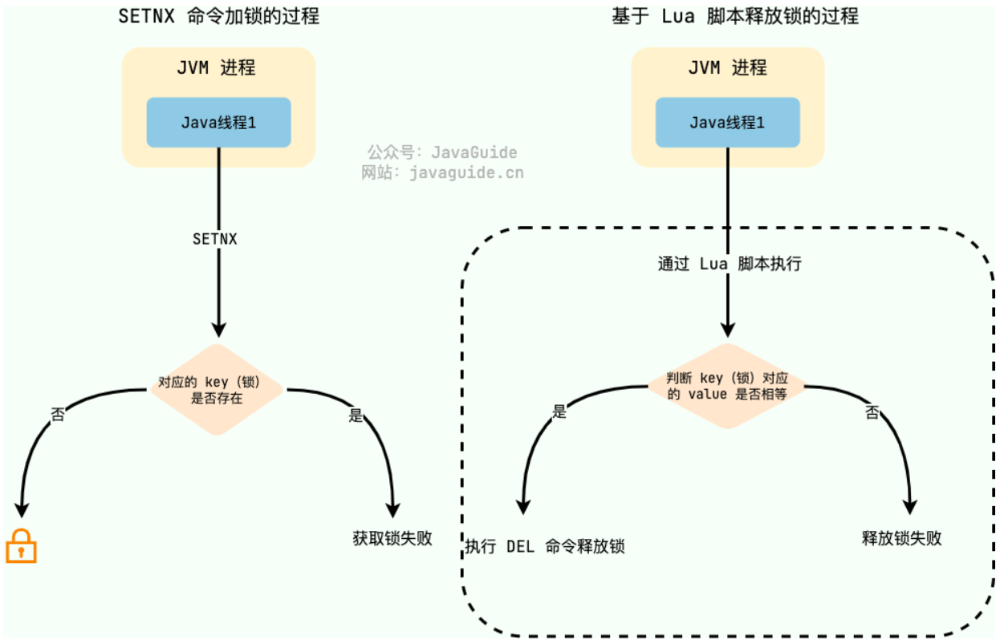

#### 基于Redis命令实现分布式锁的优缺点？

**优点：**

- **性能高效**：这是选择 Redis 实现分布式锁的核心优势。Redis 作为高性能的缓存数据库，读写速度快，能快速处理锁的获取与释放操作，适合高并发场景。
- **实现便捷**：Redis 提供了 `setnx`（SET if Not Exists）等原生命令，开发者可直接基于这些命令快速实现分布式锁的核心逻辑，无需复杂的额外开发。
- **可避免单点故障**：通过 Redis 集群部署（如主从、哨兵或集群模式），能有效规避单点故障风险，保障锁服务的可用性。

**缺点：**

- **超时时间设置难题**：为避免死锁（防止线程异常退出后锁永久占用），通常会为锁设置过期时间。若超时时间设置过长，会导致锁长期占用，降低并发效率；若设置过短，可能出现锁提前失效的问题：例如线程 A 获取锁后，因业务执行时间超过超时时间，锁自动释放，此时线程 B 会意外获取锁并操作共享资源，导致两个线程同时操作共享资源，破坏锁的独占性，引发数据不一致。
  - **解决方案（自动续期机制）**：核心思路是让锁的过期时间能根据业务执行情况动态调整：先为锁设置初始超时时间，同时启动一个守护线程（类似 “看门狗”）。守护线程会定期检查锁的状态，当锁即将过期且主线程仍在执行时，自动延长锁的超时时间；待主线程执行完毕后，再销毁守护线程并释放锁。
    - 这种方式能较好地平衡死锁风险与锁提前释放的问题，但会增加实现复杂度（如 Redisson 框架已封装此机制）。

- **主从复制模式下的可靠性问题**：Redis 主从节点间的数据同步是异步的。若线程在主节点获取锁后，主节点未将锁信息同步至从节点就宕机，新选举的主节点（原从节点）会认为该锁不存在，导致其他线程可重新获取锁，造成多个线程同时持有锁的情况，破坏锁的唯一性。

### 基于Redis客户端Redisson实现分布式锁

**对于 Java 开发者而言，无需从零构建分布式锁，开源 Redis 客户端 Redisson 提供了成熟的实现方案**。Redisson 不仅封装了分布式锁、延时队列等丰富功能，还兼容 Redis 单机、哨兵、集群等多种部署模式，是分布式锁场景的优选工具。

#### Redisson实现分布式锁

Redisson 中定义了 `org.redisson.api.RLock` 接口作为分布式锁的核心抽象，它继承自 Java 标准库的 `Lock` 接口，并扩展了分布式场景所需的特有方法。主要包括：

- `lock()`：获取锁（默认启用自动续期）；
- `lock(long leaseTime, TimeUnit unit)`：获取锁并指定过期时间（不启用自动续期）；
- `tryLock()`：尝试获取锁（带等待超时机制，当未指定锁的持有时间，会启动Redisson的看门狗机制）；
- `unlock()`：释放锁（必须确保执行，通常放在 `finally` 块中）。

以最常用的分布式可重入锁为例，Redisson 分布式锁的使用流程如下：

```java
// 1. 获取分布式锁对象（锁的唯一标识为"lock"）
RLock lock = redisson.getLock("lock");
try {
    // 2. 加锁，不设置锁超时时间，具备 Watch Dog 自动续期机制
    lock.lock();
    // 3. 执行业务逻辑（操作共享资源）
    // do something...
} finally {
    // 4. 释放锁（必须在finally中执行，确保锁一定会释放）
    lock.unlock();
}
```

需要注意的是：

- 当调用 `lock()` 未指定过期时间时，Redisson 会启用自动续期机制；
- 若手动指定过期时间（如 `lock.lock(10, TimeUnit.SECONDS)`），则不会启用自动续期，锁会在指定时间后自动释放。

| 方法签名                             | 等待时间（Wait Time） | 持有时间（Lease Time） | 启用看门狗 |
| ------------------------------------ | --------------------- | ---------------------- | ---------- |
| `lock()`                             | 无限                  | 默认 30s，自动续期     | 是         |
| `lock(leaseTime, unit)`              | 无限                  | `leaseTime`（固定）    | 否         |
| `tryLock()`                          | 0 秒（不等待）        | 默认 30 秒，自动续期   | 是         |
| `tryLock(waitTime, unit)`            | `waitTime`（超时）    | 默认 30 秒，自动续期   | 是         |
| `tryLock(waitTime, leaseTime, unit)` | `waitTime`（超时）    | `leaseTime`（固定）    | 否         |

#### Redisson实现分布式锁原理

- 基于通过 Redis Hash 结构存储锁信息：锁名为键，Hash 字段为客户端唯一标识（UUID + 线程 ID），Hash 值记录重入次数，天然支持可重入性。
  - 如何保证客户端标识的唯一性：Redisson 会在**客户端初始化阶段**生成一个全局唯一的 UUID（基于时间戳、MAC 地址等信息，确保不同机器、不同 JVM 实例的 UUID 不重复），之后每次获取锁时，将该 UUID 与当前线程的 ID（如 Java 的`Thread.currentThread().getId()`）拼接，形成 “UUID: 线程 ID” 的字符串作为 Hash 字段。

- **用 Lua 脚本保证获取锁和释放锁的原子性**：获取锁时，原子化判断锁是否存在、是否当前客户端持有，不存在则创建锁并设过期时间，已持有则增加重入次数；释放锁时，原子化减少次数，次数为 0 则删除锁，避免并发问题。
- **看门狗机制自动锁续期**：
  1. 触发条件与默认时间：当使用 `lock()` 或 `tryLock()` 未指定锁的过期时间时，Redisson 自动启用看门狗机制，默认锁有效期为 30 秒（`internalLockLeaseTime`）。
  2. 本地存储与任务创建：获锁成功后，Redisson 在本地维护一个 `ConcurrentHashMap`集合，集合中的键为锁名称，值为 Entry 对象，Entry 中包含当前线程 ID、锁实例及延时续期任务。同时创建一个延时任务，通过 **Netty 的 HashedWheelTimer**（轻量级定时任务调度器）为该锁创建专属延时任务，任务与锁强绑定（非全局扫描哈希结构），首次延迟 20 秒（30s - 10s）执行，之后每隔 10 秒（30s 的 1/3）触发一次。
  3. 续期逻辑：每次续期任务触发时，通过 Lua 脚本原子性检查锁是否仍被当前线程持有（判断 Redis Hash 结构中是否存在当前客户端标识）。若持有，则将锁的有效期刷新为 30 秒；若已释放（如线程解锁或崩溃），任务自动终止。
  4. 解锁时的清理：调用 `unlock()` 时，先通过 Lua 脚本递减重入次数，当次数为 0 时删除锁。同时从本地 `ConcurrentHashMap` 中取出对应 Entry，取消延时续期任务，移除线程 ID 及 Entry，避免资源泄露和无效续期。

- **通过发布订阅实现等待唤醒**：
  1. 当调用 `tryLock` 并指定最长等待时长、获锁失败时，当前线程会订阅该锁对应的专属释放消息频道，不再进行无效轮询；
  2. 一旦持有锁的线程执行 `unlock` 释放锁，会向该频道发布释放消息，订阅此频道的等待线程收到消息后，会在剩余等待时间内立即重试获取锁，若重试成功则返回 true，若等待时间耗尽仍未获锁则返回 false，以此高效实现等待线程的唤醒与重试。
- **防止死锁：** 主要通过 “锁超时自动释放” 和 “看门狗动态续期” 结合的方式防止死锁：锁默认有过期时间（如 30 秒），即使持有锁的客户端崩溃、网络中断等，锁到时间后会自动从 Redis 中失效；而正常持有锁时，看门狗会自动续期避免锁提前过期，一旦客户端异常，看门狗终止，锁仍会按原过期时间释放，确保资源不会被永久锁定，后续客户端可正常竞争。

#### Redisson 的看门狗（Watch Dog）机制

Redisson 中的分布式锁自带自动续期机制，使用起来非常简单，原理也比较简单，其提供了一个专门用来监控和续期锁的 **Watch Dog（ 看门狗）机制**：**如果操作共享资源的线程还未执行完成的话，Watch Dog 会不断地延长锁的过期时间，进而保证锁不会因为超时而被释放。**


**看门狗机制通过一套完整的触发、续期和终止逻辑，实现锁的动态有效期管理，具体流程如下：**

1. **触发条件**：仅当调用 `lock()` 方法**未指定过期时间**时，看门狗才会被激活。此时，锁的初始过期时间由 `lockWatchdogTimeout` 参数控制，默认值为 30 秒（可通过 `Config.setLockWatchdogTimeout()` 自定义，单位：毫秒）。

   ```java
   // 未指定过期时间，启用看门狗
   lock.lock();

   // 手动指定过期时间，不启用看门狗
   lock.lock(10, TimeUnit.SECONDS);
   ```

2. **续期逻辑**：看门狗通过定时任务周期性地延长锁的有效期，核心逻辑封装在 `renewExpiration()` 方法中

   - **续期流程如下：**
     1. **定时频率**：每隔 `internalLockLeaseTime / 3`（默认 10 秒，即 30 秒 / 3）执行一次续期检查。
     2. **续期判断**：通过异步任务调用 `renewExpirationAsync()` 方法，判断当前线程是否仍持有锁。**
     3. **递归续期**：若续期成功，继续调度下一次续期任务；若失败（如锁已释放或线程异常），则终止续期。

   - 关键代码实现：

     ```java
     private void renewExpiration() {
         // 创建定时任务，延迟 internalLockLeaseTime/3 后执行
         Timeout task = commandExecutor.getConnectionManager().newTimeout(new TimerTask() {
             @Override
             public void run(Timeout timeout) throws Exception {
                 // 异步执行续期操作
                 CompletionStage<Boolean> future = renewExpirationAsync(threadId);
                 future.whenComplete((res, e) -> {
                     if (e != null) {
                         // 续期失败，移除续期记录
                         log.error("锁续期失败", e);
                         EXPIRATION_RENEWAL_MAP.remove(getEntryName());
                         return;
                     }

                     if (res) {
                         // 续期成功，递归调度下一次续期
                         renewExpiration();
                     } else {
                         // 续期失败（如锁已释放），终止续期
                         cancelExpirationRenewal(null);
                     }
                 });
             }
         }, internalLockLeaseTime / 3, TimeUnit.MILLISECONDS); // 间隔 10 秒（默认）

         // 保存定时任务引用，便于后续取消
         ee.setTimeout(task);
     }
     ```

3. **原子性续期实现**：续期操作通过 `renewExpirationAsync()` 方法实现，底层依赖 **Lua 脚本**保证原子性，避免并发场景下的判断与续期操作分离导致的问题。

   - 脚本逻辑：

     - 先通过 `hexists` 判断当前线程是否仍持有锁（检查 Redis 哈希表中是否存在当前线程标识）；

     - 若持有锁，则通过 `pexpire` 将锁的过期时间重置为 `internalLockLeaseTime`（默认 30 秒）；

     - 返回 1 表示续期成功，0 表示续期失败。

   - 代码实现：

     ```java
     protected CompletionStage<Boolean> renewExpirationAsync(long threadId) {
         return evalWriteAsync(getRawName(), LongCodec.INSTANCE, RedisCommands.EVAL_BOOLEAN,
                 // Lua 脚本：判断线程是否持有锁，是则续期
                 "if (redis.call('hexists', KEYS[1], ARGV[2]) == 1) then " +
                         "redis.call('pexpire', KEYS[1], ARGV[1]); " + // 重置过期时间为 30 秒
                         "return 1; " +
                         "end; " +
                         "return 0;",
                 Collections.singletonList(getRawName()), // 锁的唯一标识（KEYS[1]）
                 internalLockLeaseTime, // 续期后的过期时间（ARGV[1]，默认 30 秒）
                 getLockName(threadId) // 当前线程标识（ARGV[2]）
         );
     }
     ```

4. **终止条件**
   当线程执行完业务逻辑并调用 `unlock()` 释放锁后，看门狗会自动停止续期任务，避免无效的资源消耗。

#### 检查锁的过程是原子操作吗？

在 Redis 的看门狗机制中，检查锁的过程并不是单独的一个步骤，而是与锁的续期操作绑定在一起，通过 Lua 脚本完成的。因此，检查与续期是一个整体的原子操作，以确保只有持有锁的客户端才能成功续期。在 Redisson 看门狗机制中，**检查锁的归属过程与续期操作并非分离的步骤，而是通过 Lua 脚本打包为一个整体执行**，因此这一过程是原子操作。

这种设计的核心目的是确保 “只有当前持有锁的客户端才能成功续期”，避免并发场景下的判断与续期操作分离导致的安全问题（例如：线程 A 检查到自己持有锁，但尚未执行续期时，锁被线程 B 抢占，此时线程 A 若继续续期会引发错误）。

以核心 Lua 脚本为例，其逻辑如下：

```lua
-- 先检查当前锁是否归属于当前线程（通过哈希表判断线程标识）
if (redis.call('hexists', KEYS[1], ARGV[2]) == 1) then
    -- 若持有锁，则执行续期（重置过期时间）
    redis.call('pexpire', KEYS[1], ARGV[1]);
    return 1; -- 续期成功
end;
return 0; -- 未持有锁，续期失败
```

脚本中，“检查锁的归属” 与 “续期” 两个动作被封装在同一个 Redis 命令中，通过 Redis 对 Lua 脚本的原子性支持（即脚本执行期间不会被其他命令打断），保证了整个过程的原子性。

### Redis和Redisson实现分布式锁的区别

- **实现方式**：Redis 分布式锁需手动基于 `SET NX` 等原生命令，配合 Lua 脚本保证原子性，需自行处理锁的获取、释放、重入逻辑；Redisson 是封装好的客户端，内部基于 Redis Hash 结构和 Lua 脚本实现，提供开箱即用的 API。
- **功能特性**：Redisson 原生支持可重入锁、自动续期（看门狗）、公平锁、红锁等高级特性；Redis 原生实现需手动编码支持这些功能，易出漏洞。
- **易用性与可靠性**：Redisson 屏蔽底层细节，减少手动编码错误；Redis 原生实现需开发者自行处理边界情况（如锁过期、误释放），可靠性依赖编码质量。

### 如何设计一个可重入的分布式锁，用什么结构设计？

可重入锁允许同一线程在持有锁的情况下多次获得锁而不会产生死锁。当线程请求锁时，如果它已经拥有了该锁，则可以直接获得锁，锁的计数器会增加。在释放锁时，计数器会减少，只有当计数器为零时，锁才会真正释放。

在分布式系统中，通常会使用诸如 Redis、Zookeeper 或 etcd 等组件来实现锁的管理。

下面以 **Redis** 为例，简单描述如何设计一个可重入的分布式锁。

设计要素：

- **锁标识（Lock ID）**：全局唯一的资源标识符，格式通常为 `lock:<resource_name>`（如 `lock:order_123`），用于定位某一资源的锁。
- **持有者标识（Owner ID）**：线程或进程的唯一标识符，通常是线程的 ID 或进程的 ID。
  - 作用：判断当前请求锁的线程是否为已持有锁的线程，是实现可重入的核心依据。
- **重入计数器（Count）**：记录同一持有者获取锁的次数，初始为 1，每次重入加 1，释放时减 1；只有当计数器归 0 时，才真正释放锁（删除锁标识）。
- **过期时间（TTL）**：防止持有者崩溃后锁永久残留导致死锁，需设置合理的超时时间（如 30 秒）。

我们可以在 Redis 中使用一个哈希表或简单的键值对来存储锁的状态。使用一个 key（如 `lock:<resource>`）来表示锁，包含以下字段：

- `owner`: 当前持有锁的线程/进程标识符
- `count`: 当前计数器，表示获得锁的次数
- `expires_at`: 锁的到期时间，用于防止死锁

**示例数据结构：**

```json
{
  "key": "lock:resource_1",
  "value": {
    "owner": "thread_id_or_process_id",
    "count": 3,
    "expires_at": "2023-10-01T12:00:00Z"
  }
}
```

以下是围绕这个锁结构的基本操作：所有操作需通过**原子命令**（如 Redis 的 Lua 脚本）实现，避免并发下的状态不一致

1. 获取锁 (Lock Acquisition)：尝试获取锁时，先检查锁标识（lock:resource）是否存在：
   - 若不存在（无锁状态），则创建锁记录，将 owner 设为当前线程 / 进程的唯一标识，count 初始化为 1，expires_at 设为当前时间加锁的超时时间（TTL）；
   - 若已存在且 owner 为当前标识（重入场景），则直接将 count 加 1，并更新 expires_at（延长锁有效期）；
   - 若已存在但 owner 为其他标识，则获取失败（锁被占用）。
2. 释放锁 (Lock Release)：释放锁时需先验证权限：
   - 若当前线程 / 进程的标识与锁的 owner 一致，则将 count 减 1；
   - 若减 1 后 count 为 0（完全释放），则删除锁标识；若 count 仍大于 0（部分释放），则仅更新 count 值；
   - 若标识不一致（非法释放），则直接拒绝操作；若锁已过期（expires_at 已过当前时间），则按过期逻辑处理，避免死锁残留。
3. 锁续期 (Lock Renewal)：为防止任务未完成时锁因超时被释放，由持有锁的线程启动一个**后台守护线程**（或定时任务），定期检查锁的当前状态：
   - 若锁仍由当前线程持有（owner 匹配且未过期），则更新 expires_at（延长一个 TTL 周期）；
   - 续期操作持续至锁完全释放（count=0）或线程终止（守护任务随线程销毁，锁最终因过期自动释放）。
4. 超时与故障恢复：可以设置锁的自动超时时间，例如，设定一个最大持锁时间，超时后锁自动释放。这可以在一定程度上防止死锁的发生。

**整体流程示例：**

- **获取锁**：
  - 线程A调用获取锁的 API。如果成功，返回锁的状态。
  - 如果线程B也尝试获取同一把锁，则会返回锁已被占用。
- **释放锁**：
  - 线程A在完成任务时调用释放锁的 API，递减 `count` 字段。
  - 如果 `count` 达到 0，删除锁并释放资源。
- **续约锁**：
  - 线程A在处理过程中可以根据需要续约锁，更新 `expires_at`。

### 基于RedLock如何实现分布式锁？如何解决集群情况下分布式锁的可靠性？

RedLock 是 Redis 官方提出的一种分布式锁实现方案，用于确保在分布式环境下安全可靠地获取锁。它的目标是在分布式系统中提供一种高可用、高容错的锁机制，确保在同一时刻，只有一个客户端能够成功获得锁，从而实现对共享资源的互斥访问。

Redlock 算法的基本思路，**是让客户端和多个独立的 Redis 节点依次请求申请加锁，如果客户端能够和半数以上的节点成功地完成加锁操作，那么我们就认为，客户端成功地获得分布式锁，否则加锁失败**。这样一来，即使有某个 Redis 节点发生故障，因为锁的数据在其他节点上也有保存，所以客户端仍然可以正常地进行锁操作，锁的数据也不会丢失。

在获取锁的过程中，Redlock 会根据配置的 waitTime（最大等待时间）和 leaseTime（锁的持有时间）进行灵活控制。比如，如果获取锁的时间小于锁的有效期（通过TTL命令获取锁的剩余时间），则表示获取锁成功。

官方推荐是至少部署 5 个 Redis 节点，而且都是主节点，它们之间没有任何关系，都是一个个孤立的节点。

Redisson 中的 RedLock 是基于 RedissonMultiLock（联锁）实现的。RedissonMultiLock 的 tryLock 方法会在指定的 Redis 实例上逐一尝试获取锁。

Redlock 算法加锁三个过程：

- 第一步是，客户端获取当前时间（t1）。
- 第二步是，客户端按顺序依次向 N 个 Redis 节点执行加锁操作：
  - 加锁操作使用 SET 命令，带上 NX，EX/PX 选项，以及带上客户端的唯一标识。
  - 如果某个 Redis 节点发生故障了，为了保证在这种情况下，Redlock 算法能够继续运行，我们需要给「加锁操作」设置一个超时时间（不是对「锁」设置超时时间，而是对「加锁操作」设置超时时间），加锁操作的超时时间需要远远地小于锁的过期时间，一般也就是设置为几十毫秒。
- 第三步是，一旦客户端从超过半数（大于等于 N/2+1）的 Redis 节点上成功获取到了锁，就再次获取当前时间（t2），然后计算计算整个加锁过程的总耗时（t2-t1）。如果 t2-t1 < 锁的过期时间，此时，认为客户端加锁成功，否则认为加锁失败。

可以看到，加锁成功要同时满足两个条件（*简述：如果有超过半数的 Redis 节点成功的获取到了锁，并且总耗时没有超过锁的有效时间，那么就是加锁成功*）：

- 条件一：客户端从超过半数（大于等于 N/2+1）的 Redis 节点上成功获取到了锁；
- 条件二：客户端从大多数节点获取锁的总耗时（t2-t1）小于锁设置的过期时间。

加锁成功后，客户端需要重新计算这把锁的有效时间，计算的结果是「锁最初设置的过期时间」减去「客户端从大多数节点获取锁的总耗时（t2-t1）」。如果计算的结果已经来不及完成共享数据的操作了，我们可以释放锁，以免出现还没完成数据操作，锁就过期了的情况。

加锁失败后，客户端向**所有 Redis 节点发起释放锁的操作**，释放锁的操作和在单节点上释放锁的操作一样，只要执行释放锁的 Lua 脚本就可以了。

#### 红锁能不能保证百分百上锁？

Redlock 不能保证百分百上锁，因为在分布式系统中，网络延迟、时钟漂移、Redis 实例宕机等因素都可能导致锁的获取失败。

### 加分布式锁时Redis如何保证不会发生冲突？

**①、原子性获取锁，避免竞争条件**：使用 `SET` 命令的 `NX`（仅不存在时设置）和 `PX`（设置过期时间）参数组合，将锁的获取和过期时间设置合并为一个原子操作。比如说 `SET lock_key unique_value NX PX 5000` 命令，其中 `NX` 确保了原子操作，如果 lock_key 已存在，SET 操作会返回`nil`；`PX 5000` 设置过期时间为 5000 毫秒，避免死锁。

**②、原子性释放锁，防止误删**：使用 Lua 脚本将锁的检查和释放操作封装为一个原子操作，确保安全地释放锁，避免释放其他节点持有的锁。

```shell
EVAL "if redis.call('get', KEYS[1]) == ARGV[1] then
        return redis.call('del', KEYS[1])
      else
        return 0
      end"
1 lock_key unique_value
```

**③、使用 Redlock 算法确保锁的正确获取和释放。**

```java
RLock lock = redisson.getLock("lock_key");
try {
    // 500ms 等待时间，10000ms 锁过期时间
    boolean isLocked = lock.tryLock(500, 10000, TimeUnit.MILLISECONDS);
    if (isLocked) {
        // 执行需要同步的操作
    }
} finally {
    lock.unlock();
}
```

## 分布式事务

### 什么是分布式事务?

在分布式环境下，会涉及到多个数据库，比如说支付库、商品库、订单库。因此要保证跨服务的事务一致性就变得非常复杂。

分布式事务其实就是将单一库的事务概念扩大到了多库，目的是为了保证跨服的数据一致性。


### 分布式事务有哪些常见的实现方案？

分布式事务的实现方式主要包括：

- 二阶段提交（2PC）：通过准备和提交阶段保证一致性，但性能较差。
- 三阶段提交（3PC）：在 2PC 的基础上增加了一个超时机制，降低了阻塞，但依旧存在数据不一致的风险。
- TCC：根据业务逻辑拆分为 Try、Confirm 和 Cancel 三个阶段，适合锁定资源的业务场景。
- 本地消息表：在数据库中存储事务事件，通过定时任务处理消息。
- 基于 MQ 的分布式事务：通过消息队列来实现异步确保，利用重试机制保障最终一致性，适用于对实时性要求不高的场景。

#### 说说 2PC 两阶段提交？

说到 2PC，就不得先说分布式事务中的 XA 协议。

在这个协议里，有三个角色：

- **AP（Application）**：应用系统（服务）
- **TM（Transaction Manager）**：事务管理器（全局事务管理）
- **RM（Resource Manager）**：资源管理器（数据库）


XA 协议采用**两阶段提交**方式来管理分布式事务。XA 接口提供资源管理器与事务管理器之间进行通信的标准接口。

两阶段提交的思路可以概括为：参与者将操作成败通知协调者，再由协调者根据所有参与者的反馈情况决定各参与者是否要提交操作还是回滚操作。


- 准备阶段：事务管理器要求每个涉及到事务的数据库预提交(precommit)此操作，并反映是否可以提交
- 提交阶段：事务协调器要求每个数据库提交数据，或者回滚数据。

优点：尽量保证了数据的强一致，实现成本较低，在各大主流数据库都有自己实现，对于 MySQL 是从 5.5 开始支持。

缺点:

- 单点问题：事务管理器在整个流程中扮演的角色很关键，如果其宕机，比如在第一阶段已经完成，在第二阶段正准备提交的时候事务管理器宕机，资源管理器就会一直阻塞，导致数据库无法使用。
- 同步阻塞：在准备就绪之后，资源管理器中的资源一直处于阻塞，直到提交完成，释放资源。
- 数据不一致：两阶段提交协议虽然为分布式数据强一致性所设计，但仍然存在数据不一致性的可能，比如在第二阶段中，假设协调者发出了事务 commit 的通知，但是因为网络问题该通知仅被一部分参与者所收到并执行了 commit 操作，其余的参与者则因为没有收到通知一直处于阻塞状态，这时候就产生了数据的不一致性。

#### 3PC（三阶段提交）了解吗？

三阶段提交（`3PC`）是二阶段提交（`2PC`）的一种改进版本 ，为解决两阶段提交协议的单点故障和同步阻塞问题。

三阶段提交有这么三个阶段：`CanCommit`，`PreCommit`，`DoCommit`三个阶段


- **CanCommit**：准备阶段。协调者向参与者发送 commit 请求，参与者如果可以提交就返回 Yes 响应，否则返回 No 响应。
- **PreCommit**：预提交阶段。协调者根据参与者在**准备阶段**的响应判断是否执行事务还是中断事务，参与者执行完操作之后返回 ACK 响应，同时开始等待最终指令。
- **DoCommit**：提交阶段。协调者根据参与者在**准备阶段**的响应判断是否执行事务还是中断事务：
- 如果所有参与者都返回正确的`ACK`响应，则提交事务
- 如果参与者有一个或多个参与者收到错误的`ACK`响应或者超时，则中断事务
- 如果参与者无法及时接收到来自协调者的提交或者中断事务请求时，在等待超时之后，会继续进行事务提交

可以看出，三阶段提交解决的只是两阶段提交中**单体故障**和**同步阻塞**的问题，因为加入了超时机制，这里的超时的机制作用于 **预提交阶段** 和 **提交阶段**。如果等待 **预提交请求** 超时，参与者直接回到准备阶段之前。如果等到**提交请求**超时，那参与者就会提交事务了。

**无论是 2PC 还是 3PC 都不能保证分布式系统中的数据 100%一致**。

#### TCC 了解吗？

**TCC（Try Confirm Cancel）** ，是两阶段提交的一个变种，针对每个操作，都需要有一个其对应的确认和取消操作，当操作成功时调用确认操作，当操作失败时调用取消操作，类似于二阶段提交，只不过是这里的提交和回滚是针对业务上的，所以基于 TCC 实现的分布式事务也可以看做是对业务的一种补偿机制。


- **Try**：尝试待执行的业务。订单系统将当前订单状态设置为支付中，库存系统校验当前剩余库存数量是否大于 1，然后将可用库存数量设置为库存剩余数量-1，。
- **Confirm**：确认执行业务，如果 Try 阶段执行成功，接着执行 Confirm 阶段，将订单状态修改为支付成功，库存剩余数量修改为可用库存数量。
- **Cancel**：取消待执行的业务，如果 Try 阶段执行失败，执行 Cancel 阶段，将订单状态修改为支付失败，可用库存数量修改为库存剩余数量。

**TCC** 是业务层面的分布式事务，保证最终一致性，不会一直持有资源的锁。

- **优点：** 把数据库层的二阶段提交交给应用层来实现，规避了数据库的 2PC 性能低下问题
- **缺点**：TCC 的 Try、Confirm 和 Cancel 操作功能需业务提供，开发成本高。TCC 对业务的侵入较大和业务紧耦合，需要根据特定的场景和业务逻辑来设计相应的操作

#### 本地消息表了解吗？

本地消息表的核心思想是将分布式事务拆分成本地事务进行处理。

例如，可以在订单库新增一个消息表，将新增订单和新增消息放到一个事务里完成，然后通过轮询的方式去查询消息表，将消息推送到 MQ，库存服务去消费 MQ。


**执行流程：**

1. 订单服务，添加一条订单和一条消息，在一个事务里提交
2. 订单服务，使用定时任务轮询查询状态为未同步的消息表，发送到 MQ，如果发送失败，就重试发送
3. 库存服务，接收 MQ 消息，修改库存表，需要保证幂等操作
4. 如果修改成功，调用 rpc 接口修改订单系统消息表的状态为已完成或者直接删除这条消息
5. 如果修改失败，可以不做处理，等待重试

订单服务中的消息有可能由于业务问题会一直重复发送，所以为了避免这种情况可以记录一下发送次数，当达到次数限制之后报警，人工接入处理；库存服务需要保证幂等，避免同一条消息被多次消费造成数据不一致。

本地消息表这种方案实现了最终一致性，需要在业务系统里增加消息表，业务逻辑中多一次插入的 DB 操作，所以性能会有损耗，而且最终一致性的间隔主要有定时任务的间隔时间决定

#### MQ 消息事务了解吗？

基于 MQ 的分布式事务是指**将两个事务通过消息队列进行异步解耦**，利用重试机制保障最终一致性，适用于对实时性要求不高的场景。

订单服务执行自己的本地事务，并发送消息到 MQ，库存服务接收到消息后，执行自己的本地事务，如果消费失败，可以利用重试机制确保最终一致性。


延迟队列在分布式事务中通常用于异步补偿、定时校验和故障重试等场景，确保数据最终一致性。

当主事务执行完成后，延迟队列会在一定时间后检查各子事务的状态，如果有失败的子事务，可以触发补偿操作，重试或回滚事务。

当分布式锁因为某些原因未被正常释放时，可以通过延迟队列在超时后自动释放锁，防止死锁。

#### 最大努力通知了解吗？

最大努力通知相比实现会简单一些，适用于一些对最终一致性实时性要求没那么高的业务，比如支付通知，短信通知。

以支付通知为例，业务系统调用支付平台进行支付，支付平台进行支付，进行操作支付之后支付平台会去同步通知业务系统支付操作是否成功，如果不成功，会一直异步重试，但是会有一个最大通知次数，如果超过这个次数后还是通知失败，就不再通知，业务系统自行调用支付平台提供一个查询接口，供业务系统进行查询支付操作是否成功。


**执行流程：**

1. 业务系统调用支付平台支付接口， 并在本地进行记录，支付状态为支付中
2. 支付平台进行支付操作之后，无论成功还是失败，同步给业务系统一个结果通知
3. 如果通知一直失败则根据重试规则异步进行重试，达到最大通知次数后，不再通知
4. 支付平台提供查询订单支付操作结果接口
5. 业务系统根据一定业务规则去支付平台查询支付结果

### 你们用什么？能说一下 Seata 吗？

我们用比较常用的是 Seata——自己去实现分布式事务调度还是比较麻烦的。

**Seata** 的设计目标是对业务无侵入，因此它是从业务无侵入的两阶段提交（全局事务）着手，在传统的两阶段上进行改进，他把一个分布式事务理解成一个包含了若干分支事务的全局事务。而全局事务的职责是协调它管理的分支事务达成一致性，要么一起成功提交，要么一起失败回滚。也就是一荣俱荣一损俱损~


**Seata** 中存在这么几种重要角色：

- **TC（Transaction Coordinator）**：事务协调者。管理全局的分支事务的状态，用于全局性事务的提交和回滚。
- **TM（Transaction Manager）**：事务管理者。用于开启、提交或回滚事务。
- **RM（Resource Manager）**：资源管理器。用于分支事务上的资源管理，向 **TC** 注册分支事务，上报分支事务的状态，接收 **TC** 的命令来提交或者回滚分支事务。


Seata 整体执行流程：

1. 服务 A 中的 **TM** 向 **TC** 申请开启一个全局事务，**TC** 就会创建一个全局事务并返回一个唯一的 **XID**
2. 服务 A 中的 **RM** 向 **TC** 注册分支事务，然后将这个分支事务纳入 **XID** 对应的全局事务管辖中
3. 服务 A 开始执行分支事务
4. 服务 A 开始远程调用 B 服务，此时 **XID** 会根据调用链传播
5. 服务 B 中的 **RM** 也向 **TC** 注册分支事务，然后将这个分支事务纳入 **XID** 对应的全局事务管辖中
6. 服务 B 开始执行分支事务
7. 全局事务调用处理结束后，**TM** 会根据有误异常情况，向 **TC** 发起全局事务的提交或回滚
8. **TC** 协调其管辖之下的所有分支事务，决定是提交还是回滚

> 1. [Java 面试指南（付费）](https://javabetter.cn/zhishixingqiu/mianshi.html)收录的字节跳动同学 17 后端技术面试原题：分布式事务怎么实现 为什么要用延迟队列

## 分布式一致性算法

### 分布式算法 paxos 了解么 ？

`Paxos` 有点类似前面说的 `2PC`，`3PC`，但比这两种算法更加完善。在很多大厂都得到了工程实践，比如阿里的 `OceanBase` 的 **分布式数据库**， `Google` 的 `chubby` **分布式锁** 。

#### Paxos 算法是什么？

`Paxos` 算法是 **基于消息传递** 且具有 **高效容错特性** 的一致性算法，目前公认的解决 **分布式一致性问题** 最有效的算法之一。

#### Paxos 算法的工作流程？

##### 角色

在 Paxos 中有这么几个角色：

1. **Proposer（提议者）** : 提议者提出提案，用于投票表决。
2. **Accecptor（接受者）** : 对提案进行投票，并接受达成共识的提案。
3. **Learner（学习者）** : 被告知投票的结果，接受达成共识的提案。

在实际中，一个节点可以同时充当不同角色。


提议者提出提案，提案=编号+value，可以表示为[M,V]，每个提案都有唯一编号，而且编号的大小是趋势递增的。

##### 算法流程

Paxos 算法包含两个阶段，第一阶段 **Prepare(准备)** 、第二阶段 **Accept(接受)** 。


###### Prepare(准备)阶段

1. 提议者提议一个新的提案 P[Mn,?]，然后向接受者的某个超过半数的子集成员发送编号为 Mn 的准备请求
2. 如果一个接受者收到一个编号为 Mn 的准备请求，并且编号 Mn 大于它已经响应的所有准备请求的编号，那么它就会将它已经批准过的最大编号的提案作为响应反馈给提议者，同时该接受者会承诺不会再批准任何编号小于 Mn 的提案。

总结一下，接受者在收到提案后，会给与提议者**两个承诺**与**一个应答**：

- 两个承诺：
- 承诺不会再接受提案号小于或等于 Mn 的 Prepare 请求
- 承诺不会再接受提案号小于 Mn 的 Accept 请求
- 一个应答：
- 不违背以前作出的承诺的前提下，回复已经通过的提案中提案号最大的那个提案所设定的值和提案号 Mmax，如果这个值从来没有被任何提案设定过，则返回空值。如果不满足已经做出的承诺，即收到的提案号并不是决策节点收到过的最大的，那允许直接对此 Prepare 请求不予理会。

###### Accept(接受)阶段

1. 如果提议者收到来自半数以上的接受者对于它发出的编号为 Mn 的准备请求的响应，那么它就会发送一个针对[Mn,Vn]的接受请求给接受者，注意 Vn 的值就是收到的响应中编号最大的提案的值，如果响应中不包含任何提案，那么它可以随意选定一个值。
2. 如果接受者收到这个针对[Mn,Vn]提案的接受请求，只要该接受者尚未对编号大于 Mn 的准备请求做出响应，它就可以通过这个提案。

当提议者收到了多数接受者的接受应答后，协商结束，共识决议形成，将形成的决议发送给所有学习节点进行学习。

所以 Paxos 算法的整体详细流程如下：


#### Paxos 算法有什么缺点吗？怎么优化？

前面描述的可以称之为 Basic Paxos 算法，在单提议者的前提下是没有问题的，但是假如有多个提议者互不相让，那么就可能导致整个提议的过程进入了死循环。

Lamport 提出了 Multi Paxos 的算法思想。

Multi Paxos 算法思想，简单说就是在多个提议者的情况下，选出一个 Leader（领导者），由领导者作为唯一的提议者，这样就可以解决提议者冲突的问题。

### 说说 Raft 算法？

#### Raft 算法是什么？

`Raft` 也是一个 **一致性算法**，和 `Paxos` 目标相同。但它还有另一个名字 - **易于理解的一致性算法**。`Paxos` 和 `Raft` 都是为了实现 **一致性** 产生的。这个过程如同选举一样，**参选者** 需要说服 **大多数选民** (Server) 投票给他，一旦选定后就跟随其操作。`Paxos` 和 `Raft` 的区别在于选举的 **具体过程** 不同。

#### Raft 算法的工作流程？

##### Raft 算法的角色

`Raft` 协议将 `Server` 进程分为三种角色：

- **Leader（领导者）**
- **Follower（跟随者）**
- **Candidate（候选人）**

就像一个民主社会，领导者由跟随者投票选出。刚开始没有 **领导者**，所有集群中的 **参与者** 都是 **跟随者**。

那么首先开启一轮大选。在大选期间 **所有跟随者** 都能参与竞选，这时所有跟随者的角色就变成了 **候选人**，民主投票选出领袖后就开始了这届领袖的任期，然后选举结束，所有除 **领导者** 的 **候选人** 又变回 **跟随者** 服从领导者领导。

这里提到一个概念 **「任期」**，用术语 `Term` 表达。

三类角色的变迁图如下：


##### Leader 选举过程

Raft 使用心跳（heartbeat）触发 Leader 选举。当 Server 启动时，初始化为 Follower。Leader 向所有 Followers 周期性发送 heartbeat。如果 Follower 在选举超时时间内没有收到 Leader 的 heartbeat，就会等待一段随机的时间后发起一次 Leader 选举。

Follower 将其当前 term 加一然后转换为 Candidate。它首先给自己投票并且给集群中的其他服务器发送 RequestVote RPC 。结果有以下三种情况：

- 赢得了多数（超过 1/2）的选票，成功选举为 Leader；
- 收到了 Leader 的消息，表示有其它服务器已经抢先当选了 Leader；
- 没有 Server 赢得多数的选票，Leader 选举失败，等待选举时间超时（`Election Timeout`）后发起下一次选举。


选出 `Leader` 后，`Leader` 通过 **定期** 向所有 `Follower` 发送 **心跳信息** 维持其统治。若 `Follower` 一段时间未收到 `Leader` 的 **心跳**，则认为 `Leader` 可能已经挂了，然后再次发起 **选举** 过程。


## 服务保护

微服务保护的方案有很多，比如：

- 请求限流
- 线程隔离
- 服务熔断

这些方案或多或少都会导致服务的体验上略有下降，比如请求限流，降低了并发上限；线程隔离，降低了可用资源数量；服务熔断，降低了服务的完整度，部分服务变的不可用或弱可用。因此这些方案都属于服务**降级**的方案。但通过这些方案，服务的健壮性得到了提升，接下来，我们逐一了解这些方案的原理。

在SpringCloud的早期版本中采用的服务保护技术叫做`Hystix`，不过后来被淘汰，替换为`Spring Cloud Circuit Breaker`，其底层实现可以是`Spring Retry`和`Resilience4J`。

不过在国内使用较多还是`SpringCloudAlibaba`中的`Sentinel`组件。

接下来，我们就分析一下`Sentinel`组件的一些基本实现原理以及它与`Hystix`的差异。

## 请求限流与限流算法

### 请求限流

服务故障的核心原因之一，在于突发高并发，即接口流量并非持续高位而是常以 “脉冲式” 激增，一旦超出服务处理能力，就可能导致资源耗尽、响应超时甚至整体宕机。而**请求限流**，正是通过限制或控制接口在单位时间内的访问流量，让原本高低起伏的并发请求曲线变得平稳，就像水电站的大坝：既能 “蓄水” 缓冲突发流量，又能通过 “控流” 让下游（服务）始终接收平稳的请求量，从根源上避免大部分因流量过载引发的故障。

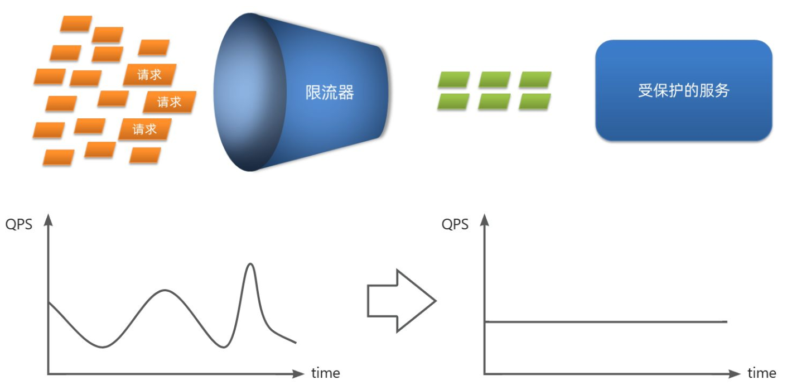

本质上，限流是对 “时间窗口内的请求量” 进行管控：当服务资源、处理能力有限时，通过设定规则限制上游调用请求，防止自身因过载停止服务。这其中有两个关键概念需要明确：

- **阈值**：单位时间内允许通过的最大请求量，比如设定 QPS（每秒查询率）阈值为 10，意味着 1 秒内最多接受 10 次请求；
- **拒绝策略**：当请求量超过阈值时的处理方式，常见的有 “直接拒绝”（超出请求立即返回错误）和 “排队等待”（超出请求暂存队列，按顺序处理）两种。

### 固定窗口计数器算法

**固定窗口计数器算法**是一种最简单直观的限流算法，固定窗口其实就是时间窗口，其原理是将时间划分为固定大小的窗口，通过计数器管控每个窗口内的请求量。其核心原理主要包括以下几个步骤：

1. 划分时间窗口：例如将时间按 1 秒为单位拆分（窗口跨度`Interval=1000ms`）；
2. 计数器统计：每个窗口内维护一个原子计数器，每接收 1 次请求则`+1`；
3. 阈值判断：若计数器达到预设阈值，超出请求直接拒绝；
4. 窗口重置：当前窗口结束后，计数器清零，进入下一个窗口重新统计。

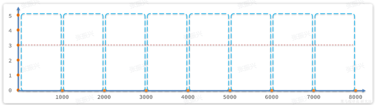

**图解与示例：**以 “窗口跨度 1 秒、阈值 3” 为例

- 正常场景：第 1、2 秒请求数分别为 2、1，均未超阈值，全部放行；第 3 秒请求数为 5，超阈值，2 个请求被拒绝（如下图）。

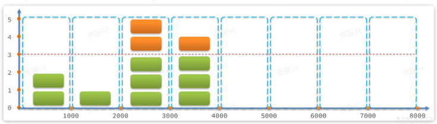

- 临界问题**（突刺现象）**：若第 5 秒的 3 次请求集中在`4.5~5s`，第 6 秒的 3 次请求集中在`5~5.5s`，则`4.5~5.5s`（跨 2 个窗口）实际请求数达 6，远超阈值（如下图）。


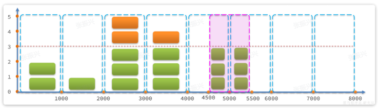

- 优缺点：
  - 优点：实现简单、易于理解，开发成本低
  - 缺点：
    -  限流不平滑：若前 10ms 用完阈值，后续 990ms 请求全被拒；
    - 无法应对跨窗口突刺：仅统计单个窗口请求，忽略跨窗口的流量叠加。
- 适用场景：仅适用于对限流精度要求低、流量波动小的场景（如内部非核心接口），因其实现简单、性能开销小，但无法应对突发流量。

### 滑动窗口计数器算法

滑动窗口是固定窗口的升级版，通过**将时间窗口拆分为更小的 “时间片”**，让窗口随时间 “滚动” 而非固定切换，实现更精细的流量统计。

**核心原理：**

1. 设定总窗口跨度（如 1 秒），并将其拆分为 n 个时间片（如 n=2，每个时间片 500ms）；
2. 窗口随当前请求时间滚动，始终覆盖 “当前时间 - 总窗口跨度” 到 “当前时间” 的范围；
3. 统计窗口内所有时间片的请求总数，若≤阈值则放行，否则拒绝。

很显然， **当滑动窗口的格子划分的越多，滑动窗口的滚动就越平滑，限流的统计就会越精确。**

举例说明：总窗口 1 秒（拆为 2 个 500ms 时间片）、阈值 3

- 第 1300ms 接收请求：窗口范围为`300ms~1300ms`（覆盖 500~1000ms、1000~1500ms 两个时间片），统计请求总数 3（未超阈值，放行）

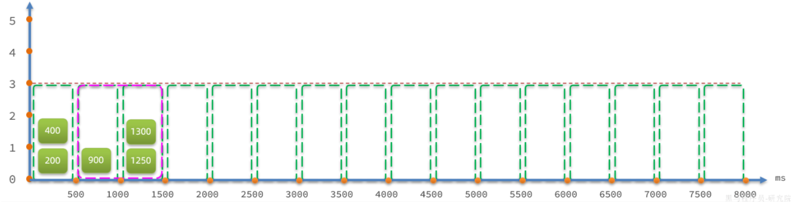

- 若第1400ms又来一个请求，会落在1000~1500时区，虽然该时区请求总数是3，但滑动窗口内总数已经达到4，因此该请求会被拒绝：

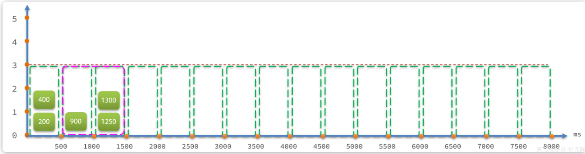

- 假如第1600ms又来的一个请求，处于1500~ 2000时区，根据算法，滑动窗口位置应该是1000~ 1500和1500~2000这两个时区，也就是向后移动：

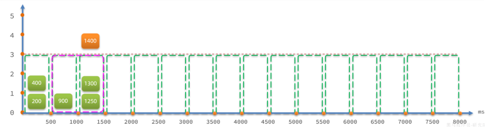

这就是滑动窗口计数的原理，解决了我们之前所说的问题，而且滑动窗口内划分的时区越多，这种统计就越准确。

优缺点：

- 优点：

  - 相比于固定窗口算法，滑动窗口计数器算法可以应对突然激增的流量。

  - 相比于固定窗口算法，滑动窗口计数器算法的颗粒度更小，可以提供更精确的限流控制。

- 缺点：

  - 与固定窗口计数器算法类似，滑动窗口计数器算法依然存在限流不够平滑的问题。

  - 相比较于固定窗口计数器算法，滑动窗口计数器算法实现和理解起来更复杂一些。

- 典型应用：

  - **Sentinel 默认限流模式**：Sentinel 的普通限流（如 QPS 限流）默认基于滑动窗口算法实现，确保限流精度；
  - **Sentinel 断路器计数**：Sentinel 中断路器统计 “异常请求比例”“慢请求比例” 时，也采用滑动窗口算法，避免因固定窗口导致的误判。

### 漏桶算法

漏桶算法的核心是 “让请求按固定速率处理”，无论上游请求如何波动，下游处理速率始终平稳，类似 “漏桶漏水”—— 水流（请求）倒入桶中，桶以固定速度漏水，即处理请求（和消息队列削峰/限流的思想是一样的）。

核心原理：

- 将每个请求视作 “水滴”，先放入 “漏桶”，通常用队列实现；
- 漏桶以**固定速率**（如 5 个 / 秒）向外 “漏水”，即从队列中取出请求并处理；
- 若漏桶为空，停止 “漏水”；若漏桶已满，即队列溢出，新倒入的 “水滴”（请求）直接被拒绝。


漏桶算法与令牌桶相似，但在设计上更适合应对并发波动较大的场景，以解决令牌桶中的问题。

漏桶的优势就是**流量整型**，桶就像是一个大坝，请求就是水，无论上游请求是 “洪峰” 还是 “细流”，经过漏桶后都会转化为 “平稳水流”，避免下游服务因处理速率波动而过载。并发量不断波动，就如图水流时大时小，但都会被大坝拦住。而后大坝按照固定的速度放水，避免下游被洪水淹没。

因此，不管并发量如何波动，经过漏桶处理后的请求一定是相对平滑的曲线：

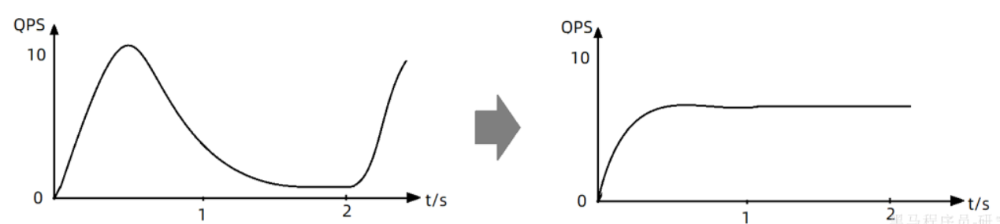

- 优点：
  - 实现简单，易于理解。
  - 可以控制限流速率，避免网络拥塞和系统过载。
- 缺点：
  - 无法应对突然激增的流量，因为只能以固定的速率处理请求，对系统资源利用不够友好。
  - 桶流入水（发请求）的速率如果一直大于桶流出水（处理请求）的速率的话，那么桶会一直是满的，一部分新的请求会被丢弃，导致服务质量下降。
- 典型应用：Sentinel 的 “限流后排队等待” 功能，正是基于漏桶算法实现，桶的容量取决于限流的QPS阈值以及允许等待的最大超时时间，具体逻辑如下：
  - 举例：设限流 QPS=5（即每 200ms 处理 1 个请求），最大等待超时时间 = 2000ms；所有请求进入队列（漏桶），第 N 个请求的预期处理时间 =（N-1）×200ms；若某请求的预期处理时间 > 2000ms（队列已满），则该请求被拒绝，避免无限等待。

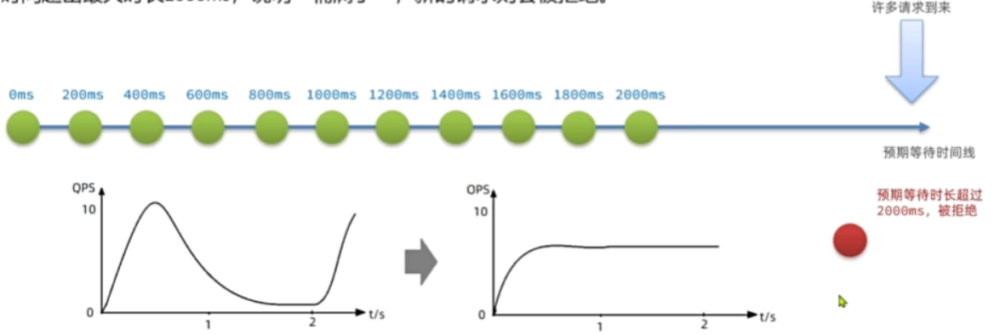

实际业务场景中，基本不会使用漏桶算法。

### 令牌桶算法

令牌桶算法的核心是 “通过发放‘令牌’控制请求通行”，既能限制长期平均流量，又能允许短期突发流量，灵活性较高。

其核心原理：

- 系统以**固定速率**（如 10 个 / 秒）向 “令牌桶” 中生成令牌；
- 令牌桶有**最大容量**：若桶已满，新生成的令牌直接丢弃（避免令牌过多占用内存）；
- 每个请求到达后，必须先从桶中**获取 1 个令牌**才能被处理；
- 若桶中无令牌，请求会被拒绝或排队（取决于拒绝策略）。

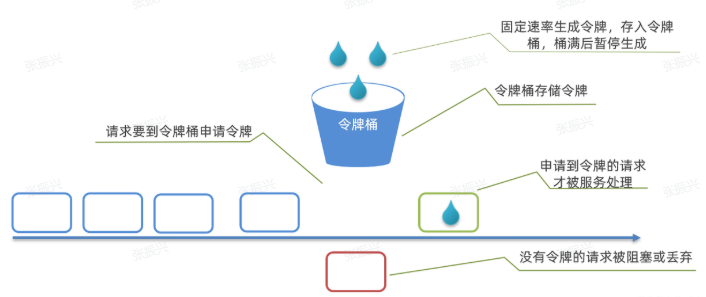


可能存在的问题：

- 某一秒令牌桶中产生了很多令牌，达到令牌桶上限N，缓存在令牌桶中，但是这一秒没有请求进入。
- 下一秒的前半秒涌入了超过2N个请求，之前缓存的令牌桶的令牌耗尽，同时这一秒又生成了N个令牌，于是总共放行了2N个请求。超出了我们设定的QPS阈值。

因此，在使用令牌桶算法时，尽量不要将令牌上限设定到服务能承受的QPS上限，而是预留一定的波动空间（如设为服务 QPS 上限的 1.2~1.5 倍），这样我们才能应对突发流量。

优点：

- 可以限制平均速率和应对突然激增的流量。
- 可以动态调整生成令牌的速率。

缺点：

- 如果令牌产生速率和桶的容量设置不合理，可能会出现问题比如大量的请求被丢弃、系统过载。
- 相比于其他限流算法，实现和理解起来更复杂一些。

典型应用

- **Guava RateLimiter**：谷歌 Guava 工具包中的限流组件，基于令牌桶算法实现，适用于单实例系统的限流；
- **Sentinel 热点参数限流**：Sentinel 对 “热点参数”（如频繁访问的用户 ID、商品 ID）的限流，采用令牌桶算法，兼顾精度与突发流量处理。

### 单机限流怎么做？

单机限流针对的是单体架构应用。

单机限流可以直接使用 Google Guava 自带的限流工具类 `RateLimiter` ，该工具类是基于令牌桶算法来限流，可以应对突发流量。

> Guava 地址：https://github.com/google/guava

除了最基本的令牌桶算法(平滑突发限流)实现之外，Guava 的`RateLimiter`还提供了 **平滑预热限流** 的算法实现。

平滑突发限流就是按照指定的速率放令牌到桶里，而平滑预热限流会有一段预热时间，预热时间之内，速率会逐渐提升到配置的速率。

另外，**Bucket4j** 是一个非常不错的基于令牌/漏桶算法的限流库。

> Bucket4j 地址：https://github.com/vladimir-bukhtoyarov/bucket4j

相对于，Guava 的限流工具类来说，Bucket4j 提供的限流功能更加全面。不仅支持单机限流和分布式限流，还可以集成监控，搭配 Prometheus 和 Grafana 使用。

不过，毕竟 Guava 也只是一个功能全面的工具类库，其提供的开箱即用的限流功能在很多单机场景下还是比较实用的。

Spring Cloud Gateway 中自带的单机限流的早期版本就是基于 Bucket4j 实现的。后来，替换成了 **Resilience4j**。

Resilience4j 是一个轻量级的容错组件，其灵感来自于 Hystrix。自[Netflix 宣布不再积极开发 Hystrix](https://github.com/Netflix/Hystrix/commit/a7df971cbaddd8c5e976b3cc5f14013fe6ad00e6) 之后，Spring 官方和 Netflix 都更推荐使用 Resilience4j 来做限流熔断。

> Resilience4j 地址: https://github.com/resilience4j/resilience4j

一般情况下，为了保证系统的高可用，项目的限流和熔断都是要一起做的。

Resilience4j 不仅提供限流，还提供了熔断、负载保护、自动重试等保障系统高可用开箱即用的功能。并且，Resilience4j 的生态也更好，很多网关都使用 Resilience4j 来做限流熔断的。

因此，在绝大部分场景下 Resilience4j 或许会是更好的选择。如果是一些比较简单的限流场景的话，Guava 或者 Bucket4j 也是不错的选择。

### 分布式限流怎么做？

分布式限流针对的分布式/微服务应用架构应用，在这种架构下，单机限流就不适用了，因为会存在多种服务，并且一种服务也可能会被部署多份。

分布式限流常见的方案：

- **借助中间件限流**：可以借助 Sentinel 或者使用 Redis 来自己实现对应的限流逻辑。
- **网关层限流**：比较常用的一种方案，直接在网关层把限流给安排上了。不过，通常网关层限流通常也需要借助到中间件/框架。就比如 Spring Cloud Gateway 的分布式限流实现`RedisRateLimiter`就是基于 Redis+Lua 来实现的，再比如 Spring Cloud Gateway 还可以整合 Sentinel 来做限流。

如果你要基于 Redis 来手动实现限流逻辑的话，建议配合 Lua 脚本来做。

**为什么建议 Redis+Lua 的方式？** 主要有两点原因：

- **减少了网络开销**：我们可以利用 Lua 脚本来批量执行多条 Redis 命令，这些 Redis 命令会被提交到 Redis 服务器一次性执行完成，大幅减小了网络开销。
- **原子性**：一段 Lua 脚本可以视作一条命令执行，一段 Lua 脚本执行过程中不会有其他脚本或 Redis 命令同时执行，保证了操作不会被其他指令插入或打扰。

我这里就不放具体的限流脚本代码了，网上也有很多现成的优秀的限流脚本供你参考，就比如 Apache 网关项目 ShenYu 的 RateLimiter 限流插件就基于 Redis + Lua 实现了令牌桶算法/并发令牌桶算法、漏桶算法、滑动窗口算法。

> ShenYu 地址: https://github.com/apache/incubator-shenyu


另外，如果不想自己写 Lua 脚本的话，也可以直接利用 Redisson 中的 `RRateLimiter` 来实现分布式限流，其底层实现就是基于 Lua 代码+令牌桶算法。

Redisson 是一个开源的 Java 语言 Redis 客户端，提供了很多开箱即用的功能，比如 Java 中常用的数据结构实现、分布式锁、延迟队列等等。并且，Redisson 还支持 Redis 单机、Redis Sentinel、Redis Cluster 等多种部署架构。

`RRateLimiter` 的使用方式非常简单。我们首先需要获取一个`RRateLimiter`对象，直接通过 Redisson 客户端获取即可。然后，设置限流规则就好。

```java
// 创建一个 Redisson 客户端实例
RedissonClient redissonClient = Redisson.create();
// 获取一个名为 "javaguide.limiter" 的限流器对象
RRateLimiter rateLimiter = redissonClient.getRateLimiter("javaguide.limiter");
// 尝试设置限流器的速率为每小时 100 次
// RateType 有两种，OVERALL是全局限流,ER_CLIENT是单Client限流（可以认为就是单机限流）
rateLimiter.trySetRate(RateType.OVERALL, 100, 1, RateIntervalUnit.HOURS);
```

接下来我们调用`acquire()`方法或`tryAcquire()`方法即可获取许可。

```java
// 获取一个许可，如果超过限流器的速率则会等待
// acquire()是同步方法，对应的异步方法：acquireAsync()
rateLimiter.acquire(1);
// 尝试在 5 秒内获取一个许可，如果成功则返回 true，否则返回 false
// tryAcquire()是同步方法，对应的异步方法：tryAcquireAsync()
boolean res = rateLimiter.tryAcquire(1, 5, TimeUnit.SECONDS);
```

#### Sentinel 与 Gateway 的限流差异

不同框架的限流实现，会根据自身定位选择合适的算法，其中 Sentinel 与 Gateway 的差异较为典型：

- **Gateway**：采用基于 Redis 实现的**令牌桶算法**—— 作为网关，Gateway 需应对分布式场景下的跨实例限流，Redis 的分布式特性能确保令牌生成与计数的全局一致性，避免单实例统计偏差；
- **Sentinel**：实现更灵活，融合多种算法：
  - 默认限流模式、断路器计数：基于**滑动时间窗口算法**，精准控制单位时间内请求量，避免突刺；
  - 限流后排队等待：基于**漏桶算法**，让超出阈值的请求按固定速率处理，而非直接拒绝；
  - 热点参数限流：基于**令牌桶算法**，针对高频参数（如高频用户 ID、商品 ID）单独控流，适配特殊场景需求。

## 线程隔离

当一个业务接口响应时间长，而且并发高时，就可能耗尽服务器的线程资源，导致服务内的其它接口受到影响。所以我们必须把这种影响降低，或者缩减影响的范围。线程隔离正是解决这个问题的好办法。

线程隔离的思想来自轮船的舱壁模式：


轮船的船舱会被隔板分割为N个相互隔离的密闭舱，假如轮船触礁进水，只有损坏的部分密闭舱会进水，而其他舱由于相互隔离，并不会进水。这样就把进水控制在部分船体，避免了整个船舱进水而沉没。

为了避免某个接口故障或压力过大导致整个服务不可用，我们可以限定每个接口可以使用的资源范围，也就是将其“隔离”起来。

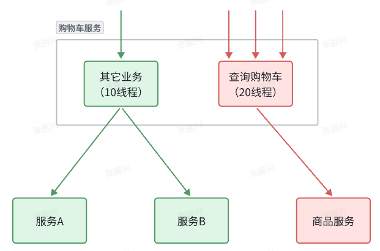

如图所示，我们给查询购物车业务限定可用线程数量上限为20，这样即便查询购物车的请求因为查询商品服务而出现故障，也不会导致服务器的线程资源被耗尽，不会影响到其它接口。

首先我们来看下线程隔离功能，无论是Hystix还是Sentinel都支持线程隔离。不过其实现方式不同。

线程隔离有两种方式实现：

- **线程池****隔离**：给每个服务调用业务分配一个线程池，利用线程池本身实现隔离效果
- **信号量****隔离**：不创建线程池，而是计数器模式，记录业务使用的线程数量，达到信号量上限时，禁止新的请求

如图：

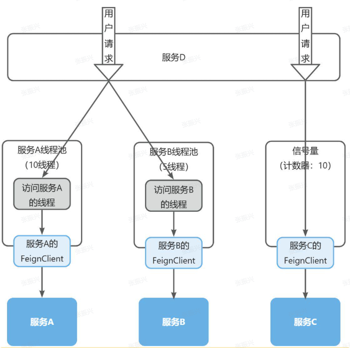

两者的优缺点如下：


Sentinel的线程隔离就是基于信号量隔离实现的，而Hystix两种都支持，但默认是基于线程池隔离。

Sentinel的线程隔离与Hystix的线程隔离有什么差别？
●问题说明：考察对线程隔离方案的掌握情况
难易程度：一般
参考话术:
答：线程隔离可以采用线程池隔离或者信号量隔离。
Hystix默认是基于线程池实现的线程隔离，每一个被隔离的业务都要创建一个独立的线程池，线程过多会带来额外的
CPU开销，性能一般，但是隔离性更强。
Sentinel则是基于信号量隔离的原理，这种方式不用创建线程池，性能较好，但是隔离性一般。

## 服务熔断

线程隔离虽然避免了雪崩问题，但故障服务（商品服务）依然会拖慢购物车服务（服务调用方）的接口响应速度。而且商品查询的故障依然会导致查询购物车功能出现故障，购物车业务也变的不可用了。

所以，我们要做两件事情：

- **编写服务降级逻辑**：就是服务调用失败后的处理逻辑，根据业务场景，可以抛出异常，也可以返回友好提示或默认数据。
- **异常统计和熔断**：统计服务提供方的异常比例，当比例过高表明该接口会影响到其它服务，应该拒绝调用该接口，而是直接走降级逻辑。

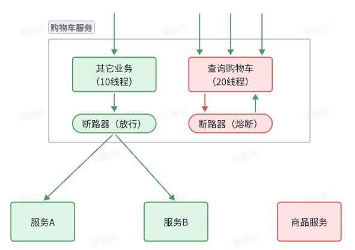
