# MySQL 基础教程

## 1. 数据库概述

## 1.1 数据库(DataBase)

- 数据库：英文名是 DataBase，简称DB，它是存储和管理数据的仓库，数据在数据库中是有组织的进行存储
- 数据库就是将数据存储在硬盘上，可以达到持久化存储的效果。那又是如何解决上述问题的？使用数据库管理系统。

## 1.2 数据库管理系统(DataBase Management System)

- 数据库管理系统：英文名是DataBase Management System，简称DBMS，它是管理数据库的大型软件，我们平时所说的MySQL数据库其实就是MySQL数据库管理系统
- 在电脑上安装了数据库管理系统后，就可以通过数据库管理系统创建数据库来存储数据，也可以通过该系统对数据库中的数据进行数据的增删改查相关的操作。

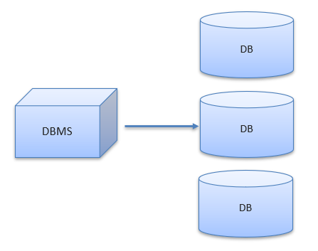

## 1.3 常见的DBMS

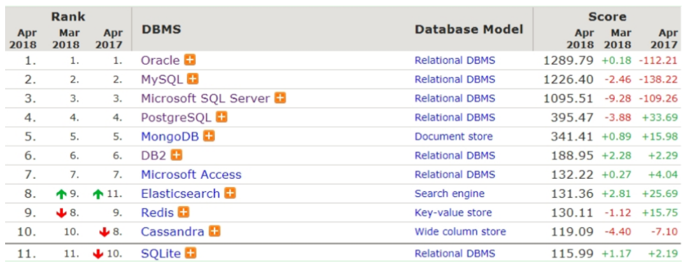

接下来对上面列举的数据库管理系统进行简单的介绍：

* Oracle：收费的大型数据库，Oracle 公司的产品
* ==MySQL==： 开源免费的中小型数据库。后来 Sun公司收购了 MySQL，而 Sun 公司又被 Oracle 收购
* SQL Server：MicroSoft 公司收费的中型的数据库。C#、.net 等语言常使用
* PostgreSQL：开源免费中小型的数据库
* DB2：IBM 公司的大型收费数据库产品
* SQLite：嵌入式的微型数据库。如：作为 Android 内置数据库
* MariaDB：开源免费中小型的数据库

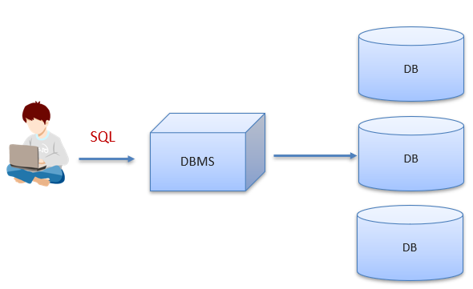

我们可以通过数据库管理系统操作数据库，对数据库中的数据进行增删改查操作，而怎么样让用户跟数据库管理系统打交道呢？就可以通过一门编程语言（SQL）来实现。

## 1.4  结构化查询语言SQL

* 结构化查询语言：英文名Structured Query Language，简称 SQL，它是一门操作关系型数据库的编程语言
* 定义操作所有关系型数据库的统一标准，可以使用SQL操作所有的关系型数据库管理系统，以后工作中如果使用到了其他的数据库管理系统，也同样的使用SQL来操作

## 2. SQL

- 通过SQL语句对数据库、表、数据进行增删改查操作

## 2.1 SQL概述

- SQL（Structured Query Language，结构化查询语言）是一种操作关系型数据库的标准化编程语言，最早由 IBM 在20世纪70年代开发，并由美国国家标准局（ANSI）制定了 SQL 标准，包括 SQL-86、SQL-89、SQL-92 和 SQL-99 等版本。
- SQL 的两个重要标准是 SQL92 和 SQL99，现代 SQL 语言仍遵循这些标准。
- 不同数据库可能会对 SQL 做出一些修改，这些修改被称为“方言”。

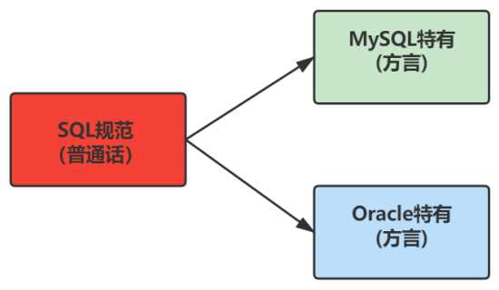

## 2.2 SQL分类

- SQL语言在功能上主要分为如下3大类：
  - **DDL**（Data Definition Language，数据定义语言）：用于定义数据库对象，如数据库、表、视图、索引等，还可用于创建、删除、修改数据库和表的结构。
    - 主要的关键字包括 `CREATE`、`DROP`、`ALTER` 等。
  - **DML**（Data Manipulation Language，数据操作语言）：用于操作数据库记录，包括添加、删除、更新和查询数据，并检查数据完整性。
    - 主要的关键字包括 `INSERT`、`DELETE`、`UPDATE`、`SELECT` 等。
    - `SELECT` 是 SQL 中最基础且最常用的查询语句，因其使用频繁，通常被单独归类为 **DQL**（Data Query Language，数据查询语言）
    - **DQL**（Data Query Language，数据查询语言）：用于查询数据库表中的数据，即对表记录进行查询操作。
  - **DCL**（Data Control Language，数据控制语言）：用于定义用户对数据库、表、字段的访问权限和安全级别。主要的关键字包括 `GRANT`、`REVOKE`、`COMMIT`、`ROLLBACK`、`SAVEPOINT` 等。

- 图解：

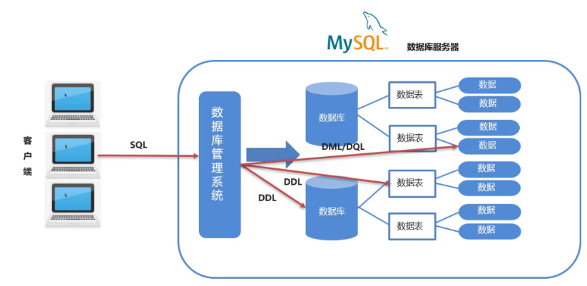

- 注意：以后我们最常操作的是 `DML` 和 `DQL`  ，因为我们开发中最常操作的就是数据。
- 还有单独将 COMMIT 、 ROLLBACK 取出来称为TCL （Transaction Control Language，事务控制语言）

## 2.3 SQL语言的规则与规范

### 2.3.1 基本规则

- SQL 可以写在一行或者多行。为了提高可读性，各子句分行写，必要时使用缩进
- 每条命令以 ; 或 \g 或 \G 结束
- 关键字不能被缩写也不能分行
- 关于标点符号：
  - 必须保证所有的()、单引号、双引号是成对结束的
  - 必须使用英文状态下的半角输入方式
  - **字符串型和日期时间类型的数据可以使用单引号（' '）表示**
  - **列的别名，尽量使用双引号（" "），而且不建议省略as**

### 2.3.2 SQL大小写规范(建议遵守)

- **MySQL** **在** **Windows** **环境下是大小写不敏感的**
- **MySQL** **在** **Linux** **环境下是大小写敏感的**
  - 数据库名、表名、表的别名、变量名是严格区分大小写的
  - 关键字、函数名、列名(或字段名)、列的别名(字段的别名) 是忽略大小写的。

- **推荐采用统一的书写规范：**
  - 数据库名、表名、表别名、字段名、字段别名等都小写
  - SQL 关键字、函数名、绑定变量等都大写

### 2.3.3 注释

- 单行注释：
  - 方式1：`-- 注释内容`
  - 方式2(MySQL特有)：`# 注释内容`
  - 注意：使用`-- `添加单行注释时，`--`后面一定要加空格，而`#`没有要求

- 多行注释：`/*注释内容*/`

```mysql
# 1.单行注释
SHOW DATABASES; -- 查询所有数据库名词
SHOW DATABASES; #查询所有数据库名词
# 2.多行注释
/*
查询所有数据库名词
*/
SHOW DATABASES;
```

### 2.3.4 命名规则

- 数据库、表名不得超过30个字符，变量名限制为29个
- 必须只能包含 A–Z, a–z, 0–9, _共63个字符
- 数据库名、表名、字段名等对象名中间不要包含空格
- 同一个MySQL软件中，数据库不能同名；同一个库中，表不能重名；同一个表中，字段不能重名
- 必须保证你的字段没有和保留字、数据库系统或常用方法冲突。如果坚持使用，请在SQL语句中使用`（着重号）引起来
- 保持字段名和类型的一致性，在命名字段并为其指定数据类型的时候一定要保证一致性。假如数据类型在一个表里是整数，那在另一个表里可就别变成字符型了

```mysql
#以下两句是一样的，不区分大小写
show databases;
SHOW DATABASES;
#创建表格
#create table student info(...); #表名错误，因为表名有空格
create table student_info(...);
#其中order使用``飘号，因为order和系统关键字或系统函数名等预定义标识符重名了
CREATE TABLE `order`(
	id		INT,
	lname	VARCHAR(20)
);
select id as "编号", `name` as "姓名" from t_stu;	#起别名时，as都可以省略
select id as 编号, `name` as 姓名 from t_stu;		#如果字段别名中没有空格，那么可以省略""
select id as 编 号, `name` as 姓 名 from t_stu;	#错误，如果字段别名中有空格，那么不能省略""
```


### 2.3.5 数据导入指令

- 在命令行客户端登陆mysql，使用source指令导入

  ```mysql
  mysql> source d:\mysqldb.sql
  mysql> desc employees;
  +----------------+-------------+------+-----+---------+-------+
  | Field | Type | Null | Key | Default | Extra |
  +----------------+-------------+------+-----+---------+-------+
  | employee_id | int(6) | NO | PRI | 0 | |
  | first_name | varchar(20) | YES | | NULL | |
  | last_name | varchar(25) | NO | | NULL | |
  | email | varchar(25) | NO | UNI | NULL | |
  | phone_number | varchar(20) | YES | | NULL | |
  | hire_date | date | NO | | NULL | |
  | job_id | varchar(10) | NO | MUL | NULL | |
  | salary | double(8,2) | YES | | NULL | |
  | commission_pct | double(2,2) | YES | | NULL | |
  | manager_id | int(6) | YES | MUL | NULL | |
  | department_id | int(4) | YES | MUL | NULL | |
  +----------------+-------------+------+-----+---------+-------+
  11 rows in set (0.00 sec)
  ```


## DCL（数据控制语言）

#### 管理用户

1．查询用户

```mysql
SELECT * FROM mysql.user;
```

2．创建用户

```mysql
CREATE USER '用户名'@'主机名' IDENTIFIED BY '密码';
```

3.修改用户密码

```mysql
ALTER USER '用户名'@'主机名' IDENTIFIED WITH mysql_native_password BY '新密码';
```

4.删除用户

```mysql
DROP USER '用户名'@'主机名';
```

案例：

```mysql
# A. 创建用户itcast, 只能够在当前主机localhost访问, 密码123456;
create user 'itcast'@'localhost' identified by '123456';
# B. 创建用户heima, 可以在任意主机访问该数据库, 密码123456;
create user 'heima'@'%' identified by '123456';
# C. 修改用户heima的访问密码为1234;
alter user 'heima'@'%' identified with mysql_native_password by '1234';
# D. 删除 itcast@localhost 用户
drop user 'itcast'@'localhost';
```


**权限**

**说明**

|        权限         |        说明        |
| :-----------------: | :----------------: |
| ALL, ALL PRIVILEGES |      所有权限      |
|       SELECT        |      查询数据      |
|       INSERT        |      插入数据      |
|       UPDATE        |      修改数据      |
|       DELETE        |      删除数据      |
|        ALTER        |       修改表       |
|        DROP         | 删除数据库/表/视图 |
|       CREATE        |   创建数据库/表    |


查询权限

```mysql
SHOW GRANTS FOR '用户名'@'主机名' ;
```


授予权限

```mysql
GRANT 权限列表 ON 数据库名.表名 TO '用户名'@'主机名';
```


撤销权限

```mysql
REVOKE 权限列表 ON 数据库名.表名 FROM '用户名'@'主机名';
```


注意事项：

• 多个权限之间，使用逗号分隔

• 授权时， 数据库名和表名可以使用 * 进行通配，代表所有。

案例:

A. 查询 'heima'@'%' 用户的权限

B. 授予 'heima'@'%' 用户itcast数据库所有表的所有操作权限

C. 撤销 'heima'@'%' 用户的itcast数据库的所有权限


## 3. DDL（数据定义语言）

## 3.0 基础知识

### 3.0.1 一条数据的存储过程

- 存储数据是处理数据的第一步 。只有正确地把数据存储起来，我们才能进行有效的处理和分析。否则，只能是一团乱麻，无从下手。

- 那么，怎样才能把用户各种经营相关的、纷繁复杂的数据，有序、高效地存储起来呢？ 在 MySQL 中，一个完整的数据存储过程总共有 4 步，分别是创建数据库、确认字段、创建数据表、插入数据。


- 我们要先创建一个数据库，而不是直接创建数据表呢？
  - 因为从系统架构的层次上看，MySQL 数据库系统从大到小依次是 数据库服务器 、 数据库 、 数据表 、数据表的 行与列 。

### 3.0.2 标识符命名规则

- 数据库名、表名不得超过30个字符，变量名限制为29个
- 必须只能包含 A–Z, a–z, 0–9, _共63个字符
- 数据库名、表名、字段名等对象名中间不要包含空格
- 同一个MySQL软件中，数据库不能同名；同一个库中，表不能重名；同一个表中，字段不能重名
- 必须保证你的字段没有和保留字、数据库系统或常用方法冲突。如果坚持使用，请在SQL语句中使用`（着重号）引起来
- 保持字段名和类型的一致性：在命名字段并为其指定数据类型的时候一定要保证一致性，假如数据类型在一个表里是整数，那在另一个表里可就别变成字符型了


## 3.1 操作数据库

我们先来学习DDL来操作数据库。而操作数据库主要就是对数据库的增删查操作。

### 3.1.1  创建数据库

* 方式1：创建数据库，如果数据库不存在，则直接创建；如果数据库不存在，则会报错`database exists`

  ```mysql
  CREATE DATABASE 数据库名;
  ```

- 方式2：创建数据库并指定字符集

  ```mysql
  CREATE DATABASE 数据库名 CHARACTER SET 字符集;
  ```

- 方式3：判断数据库是否已经存在，不存在则创建数据库（ 推荐 ）

  ```mysql
  CREATE DATABASE IF NOT EXISTS 数据库名;
  ```

> 注意：DATABASE不能改名，，一些可视化工具可以改名，它是新建库，把所有的表复制到新库，再删除旧库完成的

### 3.1.2 使用数据库

- **查询当前所有的数据库**

  ```mysql
  SHOW DATABASES; #有一个S，代表多个数据库,下面查询到的是的这些数据库是mysql安装好自带的数据库
  ```

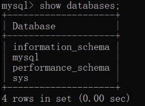

- **查看当前正在使用的数据库**

  ```mysql
  SELECT DATABASE(); #使用的一个 mysql 中的全局函数
  ```

- **查看指定库下所有的表**

  ```mysql
  SHOW TABLES FROM 数据库名;
  ```

- **查看数据库的创建信息**

  ```mysql
  SHOW CREATE DATABASE 数据库名;
  # 或者：
  SHOW CREATE DATABASE 数据库名\G
  ```

- 使用/切换数据库：

  ```mysql
  USE 数据库名;
  ```

> 注意：要操作表格和数据之前必须先说明是对哪个数据库进行操作，否则就要对所有对象加上“数据库名”

### 3.1.3  删除数据库

* 方式1：删除指定的数据库

  ```mysql
  DROP DATABASE 数据库名称;
  ```

* 方式2(推荐)：删除数据库(判断，如果存在则删除)

  ```mysql
  DROP DATABASE IF EXISTS 数据库名称;
  ```

### 3.1.4 修改数据库

- 更改数据库字符集

  ```mysql
  ALTER DATABASE 数据库名 CHARACTER SET 字符集; #比如：gbk、utf8等
  ```

## 3.2 操作表

操作表也就是对表进行增（Create）删（drop）改（Update）查（Delete）。

### 3.2.1  查询表

* **查询当前数据库下所有表名称**

  ```mysql
  SHOW TABLES;
  ```

- **查询指定库下面的所有表名称**

  ```mysql
  SHOW TABLES FROM 数据库名;
  ```

* **查询表结构**： 在MySQL中创建好数据表之后，可以查看数据表的结构。MySQL支持使用 DESCRIBE/DESC 语句查看数据表结构，也支持使用 SHOW CREATE TABLE 语句查看数据表结构，使用SHOW CREATE TABLE语句不仅可以查看表创建时的详细语句，还可以查看存储引擎和字符编码。

  * 方式1：

    ```mysql
    DESC 表名称;
    # 或者
    DESCRIBE 表名称;
    ```

  - 方式2：

    ```mysql
    SHOW CREATE TABLE 表名;
    SHOW CREATE TABLE 表名\G
    ```

  - 查看mysql数据库中func表的结构，运行语句如下：

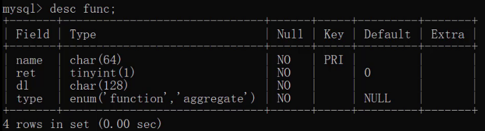

> 其中，各个字段的含义分别解释如下：
>
> - Field：表示字段名称。
> - Type：表示字段类型，这里 barcode、goodsname 是文本型的，price 是整数类型的。
> - Null：表示该列是否可以存储NULL值。
> - Key：表示该列是否已编制索引。PRI表示该列是表主键的一部分；UNI表示该列是UNIQUE索引的一
> - 部分；MUL表示在列中某个给定值允许出现多次。
> - Default：表示该列是否有默认值，如果有，那么值是多少。
> - Extra：表示可以获取的与给定列有关的附加信息，例如AUTO_INCREMENT等。

### 3.2.2  创建表

#### 3.3.2.1 方式1

* **语法格式：**

```sql
CREATE TABLE [IF NOT EXISTS] 表名 (
	字段名1  数据类型1 [约束条件] [默认值],
	字段名2  数据类型2 [约束条件] [默认值],
	…
	字段名n  数据类型n [约束条件] [默认值]
);

CREATE TABLE [IF NOT EXISTS] 表名 (
	字段名1  数据类型1 [约束条件] [默认值],
	字段名2  数据类型2 [约束条件] [默认值],
	…
	字段名n  数据类型n [约束条件] [默认值],
    表约束条件
);
```

- 注意事项：
  -  创建表首先需要有创建表的权限，同时还需要存储空间
  - **必须指定表名、列名(或字段名)、数据类型、长度**
  - 约束条件和默认值是可选项

- 案例1：

  ```mysql
  CREATE TABLE emp (
      -- int类型
      emp_id		INT,
      -- 最多保存20个中英文字符
      emp_name	VARCHAR(20),
      -- 总位数不超过15位
      salary		DOUBLE,
      -- 日期类型
      birthday	DATE
  );
  DESC emp;
  ```

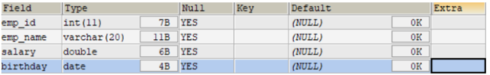

> MySQL在执行建表语句时，将id字段的类型设置为int(11)，这里的11实际上是int类型指定的显示宽度，默认的显示宽度为11。也可以在创建数据表的时候指定数据的显示宽度。

- 案例2：

  ```mysql
  CREATE TABLE dept(
      -- int类型，自增
      deptno	INT(2) AUTO_INCREMENT,
      dname	VARCHAR(14),
      loc	VARCHAR(13),
      -- 主键
      PRIMARY KEY (deptno)
  );
  DESCRIBE dept;
  ```

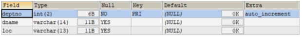

> 在MySQL 8.x版本中，不再推荐为INT类型指定显示长度，并在未来的版本中可能去掉这样的语法。

#### 3.2.2.2 方式2

- 使用`AS subquery`选项，将创建表和插入数据结合起来

  ```mysql
  CREATE TABLE  table [(column1,column2,....)] AS subquery;
  ```

- 注意事项：

  - 指定的列和子查询中的列要一一对应
  - 通过列名和默认值定义列

- 案例：

  ```mysql
  # 1.
  CREATE TABLE emp1 AS SELECT * FROM employees;
  # 2.
  CREATE TABLE emp2 AS SELECT * FROM employees WHERE 1=2; -- 创建的emp2是空表
  # 3.
  CREATE TABLE dept80
  AS
  SELECT employee_id, last_name, salary*12 ANNSAL, hire_date
  FROM employees
  WHERE department_id = 80;
  DESCRIBE dept80;
  ```

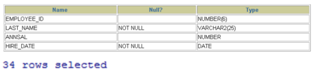


### 3.2.3  修改表

- 修改表指的是修改数据库中已经存在的数据表的结构。
- **使用** **ALTER TABLE** **语句可以实现：**
  - 向已有的表中添加列
  - 修改现有表中的列
  - 删除现有表中的列
  - 重命名现有表中的列

#### 3.2.3.1 添加一列

- 语法格式：默认添加在最后面

```mysql
ALTER TABLE 表名 ADD 【COLUMN】 字段名 字段类型 【FIRST|AFTER 字段名】;
```

- 案例：

```mysql
ALTER TABLE dept80 ADD job_id varchar(15);
```

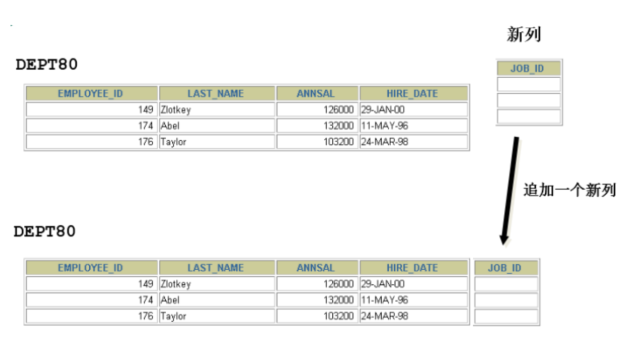

#### 3.2.3.2 修改一个列

- 可以修改列的数据类型，长度、默认值和位置

- 语法格式如下：

```sql
ALTER TABLE 表名 MODIFY 【COLUMN】 字段名1 字段类型 【DEFAULT 默认值】【FIRST|AFTER 字段名2】;
```

- 案例：

```mysql
ALTER TABLE dept80 MODIFY last_name VARCHAR(30);
ALTER TABLE dept80 MODIFY salary double(9,2) default 1000;
```

- 说明：对默认值的修改之影响今后对表的修改

#### 3.2.3.3 重命名一个列

- 语法格式：

```mysql
ALTER TABLE 表名 CHANGE 【column】 列名 新列名 新数据类型;
```

- 案例：

```mysql
ALTER TABLE dept80 CHANGE department_name dept_name varchar(15);
```

#### 3.2.3.4 删除一个列

- 语法格式：

```mysql
ALTER TABLE 表名 DROP 【COLUMN】字段名
```

- 案例：

```mysql
ALTER TABLE dept80 DROP COLUMN job_id;
```

#### 3.2.3.5 重命名表

- 方式1：使用RENAME

  ```mysql
  RENAME TABLE emp TO myemp;
  ```

- 方式2：必须是对象的拥有者

  ```mysql
  ALTER table dept RENAME [TO] detail_dept; -- [TO]可以省略
  ```

### 3.2.4  删除表

- 在MySQL中，当一张数据表 没有与其他任何数据表形成关联关系 时，可以将当前数据表直接删除，数据和结构都被删除；所有正在运行的相关事务被提交；所有相关索引被删除。

- 语法：

  ```mysql
  DROP TABLE [IF EXISTS] 表名;
  ```

- 说明：
  - `IF EXISTS`的含义为：如果当前数据库中存在相应的数据表，则删除数据表；如果当前数据库中不存在相应的数据表，则忽略删除语句，不再执行删除数据表的操作。
  - **`DROP TABLE`语句不能回滚**

- 运行语句效果如下：

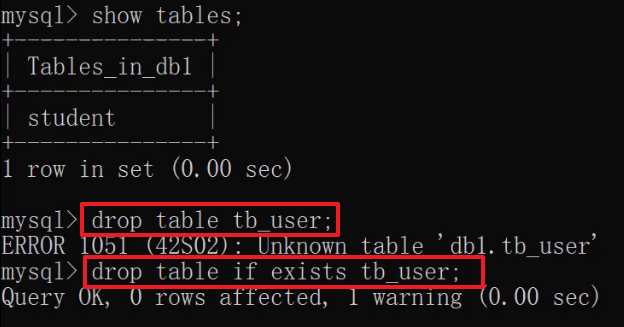

### 3.2.5 清空表

- 删除表中所有的数据，释放表的存储空间

  ```mysql
  TRUNCATE TABLE 表名;
  ```

- 说明：TRUNCATE语句**不能回滚**，而使用 DELETE 语句删除数据，可以回滚

- 举例：

  ```mysql
  SET autocommit = FALSE;
  DELETE FROM emp2;
  #TRUNCATE TABLE emp2;
  SELECT * FROM emp2;
  ROLLBACK;
  SELECT * FROM emp2;
  ```

> 阿里开发规范：
>
> 【参考】TRUNCATE TABLE 比 DELETE 速度快，且使用的系统和事务日志资源少，但 TRUNCATE 无事务且不触发 TRIGGER，有可能造成事故，故不建议在开发代码中使用此语句。
>
> 说明：TRUNCATE TABLE 在功能上与不带 WHERE 子句的 DELETE 语句相同


## 3.3 数据类型

- MySQL 支持多种类型，根据可以分为三类，如下图所示

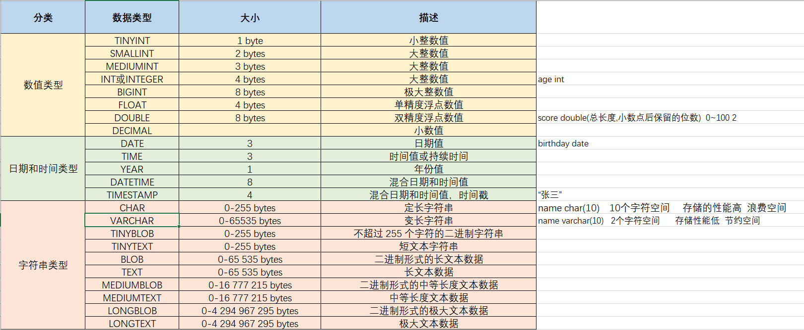

| 类型             | 类型举例                                                     |
| ---------------- | ------------------------------------------------------------ |
| 整数类型         | TINYINT、SMALLINT、MEDIUMINT、INT(或INTEGER)、BIGINT         |
| 浮点类型         | FLOAT、DOUBLE                                                |
| 定点数类型       | DECIMAL                                                      |
| 位类型           | BIT                                                          |
| 日期时间类型     | YEAR、TIME、**DATE**、DATETIME、TIMESTAMP                    |
| 文本字符串类型   | CHAR、**VARCHAR**、TINYTEXT、TEXT、MEDIUMTEXT、LONGTEXT      |
| 枚举类型         | ENUM                                                         |
| 集合类型         | SET                                                          |
| 二进制字符串类型 | BINARY、VARBINARY、TINYBLOB、BLOB、MEDIUMBLOB、LONGBLOB      |
| JSON类型         | JSON对象、JSON数组                                           |
| 空间数据类型     | 单值：GEOMETRY、POINT、LINESTRING、POLYGON；<br>集合：MULTIPOINT、MULTILINESTRING、MULTIPOLYGON、GEOMETRYCOLLECTION |

- 常见的几种数据类型介绍如下：

| 数据类型      | 描述                                                         |
| ------------- | ------------------------------------------------------------ |
| INT           | 从-2^31 到 2^31-1的整型数据。存储大小为 4个字节              |
| CHAR(size)    | 定长字符数据。若未指定，默认为1个字符，最大长度255           |
| VARCHAR(size) | 可变长字符数据，根据字符串实际长度保存，**必须指定长度**     |
| FLOAT(M,D)    | 单精度，占用4个字节，M=整数位+小数位，D=小数位。 D<=M<=255,0<=D<=30，默认M+D<=6 |
| DOUBLE(M,D)   | 双精度，占用8个字节，D<=M<=255,0<=D<=30，默认M+D<=15         |
| DECIMAL(M,D)  | 高精度小数，占用M+2个字节，D<=M<=65，0<=D<=30，最大取值范围与DOUBLE相同。 |
| DATE          | 日期型数据，格式'YYYY-MM-DD'                                 |
| BLOB          | 二进制形式的长文本数据，最大可达4G                           |
| TEXT          | 长文本数据，最大可达4G                                       |


* 数值

  ```sql
  tinyint : 小整数型，占一个字节
  int	： 大整数类型，占四个字节
	eg ： age int
  double ： 浮点类型
	使用格式： 字段名 double(总长度,小数点后保留的位数)
	eg ： score double(5,2)
  ```

* 日期

  ```sql
  date ： 日期值。只包含年月日
	eg ：birthday date ：
  datetime ： 混合日期和时间值。包含年月日时分秒
  ```

* 字符串

  ```sql
  char ： 定长字符串。
	优点：存储性能高
	缺点：浪费空间
	eg ： name char(10)  如果存储的数据字符个数不足10个，也会占10个的空间
  varchar ： 变长字符串。
	优点：节约空间
	缺点：存储性能底
	eg ： name varchar(10) 如果存储的数据字符个数不足10个，那就数据字符个数是几就占几个的空间
  ```

> 注意：其他类型参考资料中的《MySQL数据类型].xlsx》

**案例：**

```
需求：设计一张学生表，请注重数据类型、长度的合理性
	1. 编号
	2. 姓名，姓名最长不超过10个汉字
	3. 性别，因为取值只有两种可能，因此最多一个汉字
	4. 生日，取值为年月日
	5. 入学成绩，小数点后保留两位
	6. 邮件地址，最大长度不超过 64
	7. 家庭联系电话，不一定是手机号码，可能会出现 - 等字符
	8. 学生状态（用数字表示，正常、休学、毕业...）
```

语句设计如下：

```sql
create table student (
	id int,
    name varchar(10),
    gender char(1),
    birthday date,
    score double(5,2),
    email varchar(15),
    tel varchar(15),
    status tinyint
);
```

## 3.4 内容拓展

- **拓展1：阿里巴巴《Java开发手册》之MySQL字段命名**

  - 【 强制 】表名、字段名必须使用小写字母或数字，禁止出现数字开头，禁止两个下划线中间只出现数字。数据库字段名的修改代价很大，因为无法进行预发布，所以字段名称需要慎重考虑。
    - 正例：aliyun_admin，rdc_config，level3_name
    - 反例：AliyunAdmin，rdcConfig，level_3_name

  - 【 强制 】禁用保留字，如 desc、range、match、delayed 等，请参考 MySQL 官方保留字。

  - 【 强制 】表必备三字段：id, gmt_create, gmt_modified。
    - 说明：其中 id 必为主键，类型为BIGINT UNSIGNED、单表时自增、步长为 1。gmt_create, gmt_modified 的类型均为 DATETIME 类型，前者现在时表示主动式创建，后者过去分词表示被动式更新

  - 【 推荐 】表的命名最好是遵循 “业务名称_表的作用”。
    - 正例：alipay_task 、 force_project、 trade_config

  - 【 推荐 】库名与应用名称尽量一致。

  - 【参考】合适的字符存储长度，不但节约数据库表空间、节约索引存储，更重要的是提升检索速度。
    - 正例：无符号值可以避免误存负数，且扩大了表示范围。

  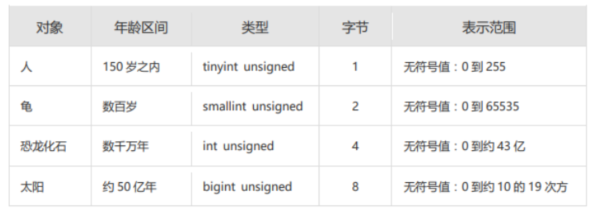

- **拓展2：如何理解清空表、删除表等操作需谨慎？！**
  - 表删除 操作将把表的定义和表中的数据一起删除，并且MySQL在执行删除操作时，不会有任何的确认信息提示，因此执行删除操时应当慎重。在删除表前，最好对表中的数据进行 备份 ，这样当操作失误时可以对数据进行恢复，以免造成无法挽回的后果。
  - 同样的，在使用 ALTER TABLE 进行表的基本修改操作时，在执行操作过程之前，也应该确保对数据进行完整的 备份 ，因为数据库的改变是 无法撤销 的，如果添加了一个不需要的字段，可以将其删除；相同的，如果删除了一个需要的列，该列下面的所有数据都将会丢失。

**拓展3：MySQL8新特性—DDL的原子化**

- 在MySQL 8.0版本中，InnoDB表的DDL支持事务完整性，即 DDL操作要么成功要么回滚 。
- DDL操作回滚日志写入到data dictionary数据字典表mysql.innodb_ddl_log（该表是隐藏的表，通过show tables无法看到）中，用于回滚操作。
- 通过设置参数，可将DDL操作日志打印输出到MySQL错误日志中。

## 4. DML（数据操作语言）

DML主要是对数据进行增（insert）删（delete）改（update）操作。

## 4.1 插入数据

### 4.1.1 方式1：使用VALUES的方式添加

- **情况1：为表的所有字段按默认顺序插入数据**

  - 语法格式：

    ```mysql
    INSERT INTO 表名 VALUES (value1,value2,....);
    ```

  - 注意事项：值列表中需要为表的每一个字段指定值，并且值的顺序必须和数据表中字段定义时的顺序相同。

  - 案例：

    ```mysql
    INSERT INTO departments VALUES (70, 'Pub', 100, 1700);
    INSERT INTO departments VALUES (100, 'Finance', NULL, NULL);
    ```

- **情况2：为表的指定字段插入数据**

  - 语法格式：

    ```mysql
    INSERT INTO 表名(column1 [, column2, …, columnn]) VALUES (value1 [,value2, …, valuen]);
    ```

  - 注意事项：
    - 为表的指定字段插入数据，就是在INSERT语句中只向部分字段中插入值，而其他字段的值为表定义时的默认值。
    - 在 INSERT 子句中随意列出列名，但是一旦列出，VALUES中要插入的value1,....valuen需要与column1,...columnn列一一对应。如果类型不同，将无法插入，并且MySQL会产生错误

  - 举例：

    ```mysql
    INSERT INTO departments(department_id, department_name) VALUES (80, 'IT');
    ```

- **情况3：同时插入多条记录，INSERT语句可以同时向数据表中插入多条记录，插入时指定多个值列表，每个值列表之间用逗号分隔开**

  - 语法格式：

    ```mysql
    INSERT INTO table_name
    VALUES
    (value1 [,value2, …, valuen]),
    (value1 [,value2, …, valuen]),
    ……
    (value1 [,value2, …, valuen]);

    # 或者
    INSERT INTO table_name(column1 [, column2, …, columnn])
    VALUES
    (value1 [,value2, …, valuen]),
    (value1 [,value2, …, valuen]),
    ……
    (value1 [,value2, …, valuen]);
    ```

  - 案例：

    ```mysql
    mysql> INSERT INTO emp(emp_id,emp_name)
    -> VALUES (1001,'shkstart'),
    -> (1002,'atguigu'),
    -> (1003,'Tom');
    Query OK, 3 rows affected (0.00 sec)
    Records: 3 Duplicates: 0 Warnings: 0
    ```

  - 说明：使用INSERT同时插入多条记录时，MySQL会返回一些在执行单行插入时没有的额外信息，这些信息的含义如下：

    - Records：表明插入的记录条数。
    - Duplicates：表明插入时被忽略的记录，原因可能是这些记录包含了重复的主键值。
    - Warnings：表明有问题的数据值，例如发生数据类型转换。

- 案例：

```sql
-- 给指定列添加数据
INSERT INTO stu (id, NAME) VALUES (1, '张三');
-- 给所有列添加数据，列名的列表可以省略的
INSERT INTO stu (id,NAME,sex,birthday,score,email,tel,STATUS) VALUES (2,'李四','男','1999-11-11',88.88,'lisi@itcast.cn','13888888888',1);

INSERT INTO stu VALUES (2,'李四','男','1999-11-11',88.88,'lisi@itcast.cn','13888888888',1);

-- 批量添加数据
INSERT INTO stu VALUES
	(2,'李四','男','1999-11-11',88.88,'lisi@itcast.cn','13888888888',1),
	(2,'李四','男','1999-11-11',88.88,'lisi@itcast.cn','13888888888',1),
	(2,'李四','男','1999-11-11',88.88,'lisi@itcast.cn','13888888888',1);
```

- 注意事项：
  - 一个同时插入多行记录的INSERT语句等同于多个单行插入的INSERT语句，但是多行的INSERT语句在处理过程中效率更高 。因为MySQL执行单条INSERT语句插入多行数据比使用多条INSERT语句快，**所以在插入多条记录时最好选择使用单条INSERT语句的方式插入。**
  - **VALUES 也可以写成 VALUE ，但是VALUES是标准写法。**
  - **字符和日期型数据应包含在单引号中**

### 4.1.2 方式2：将查询结果插入到表中

- INSERT还可以将SELECT语句查询的结果插入到表中，此时不需要把每一条记录的值一个一个输入，只需要使用一条INSERT语句和一条SELECT语句组成的组合语句即可快速地从一个或多个表中向一个表中插入多行。

- 基本语法格式如下：

  ```mysql
  INSERT INTO 目标表名 (tar_column1 [, tar_column2, …, tar_columnn])
  SELECT (src_column1 [, src_column2, …, src_columnn]) FROM 源表名 [WHERE condition]
  ```

- 说明：
  - 这句话的本质就是在INSERT中加入子查询语句
  - **不必书写VALUES子句**
  - 子查询中的值列表与INSERT子句中的列名对应

- 举例：

  ```mysql
  # 1.
  INSERT INTO emp2
  SELECT * FROM employees WHERE department_id = 90;

  # 2.
  INSERT INTO sales_reps(id, name, salary, commission_pct)
  SELECT employee_id, last_name, salary, commission_pct FROM employees WHERE job_id LIKE '%REP%';
  ```

## 4.2 更新数据

- 使用UPDATE语句更新数据，其基本语法格式如下：

  ```mysql
  UPDATE table_name SET column1=value1, column2=value2, … , column=valuen [WHERE condition]
  ```

- 说明：

  - 修改语句中如果不加条件，则将所有数据都修改！
  - 如果需要回滚数据，需要在DML前，进行设置：`SET AUTOCOMMIT = FALSE;`

- 举例1：

  ```mysql
  UPDATE employees SET department_id = 70 WHERE employee_id = 113;
  ```

- 举例2：

  ```mysql
  UPDATE copy_emp SET department_id = 110;
  ```

- 举例3：更新中的数据完整性错误

  ```mysql
  UPDATE employees SET department_id = 55 WHERE department_id = 110;
  ```

  - 报错：说明：不存在 55 号部门

    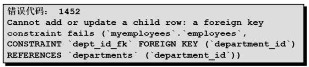


## 4.3 删除数据

* 使用DELETE语句从表中删除数据

```sql
DELETE FROM 表名 [WHERE 条件];
```

- 说明：
  - table_name指定要执行删除操作的表；
  - “[WHERE ]”为可选参数，指定删除条件，如果没有WHERE子句，DELETE语句将删除表中的所有记录。

- 举例：

```sql
-- 删除张三记录
delete from stu where name = '张三';

-- 删除stu表中所有的数据
delete from stu;
```

## 4.4 MySQL8新特性：计算列

- 什么叫计算列呢？简单来说就是某一列的值是通过别的列计算得来的。例如，a列值为1、b列值为2，c列不需要手动插入，定义a+b的结果为c的值，那么c就是计算列，是通过别的列计算得来的。

- 在MySQL 8.0中，CREATE TABLE 和 ALTER TABLE 中都支持增加计算列。下面以CREATE TABLE为例进行讲解。

- 举例：定义数据表tb1，然后定义字段id、字段a、字段b和字段c，其中字段c为计算列，用于计算a+b的值。 首先创建测试表tb1，语句如下：

  ```mysql
  CREATE TABLE tb1(
      id INT,
      a INT,
      b INT,
      c INT GENERATED ALWAYS AS (a + b) VIRTUAL
  );
  ```

- 插入数据：

  ```mysql
  INSERT INTO tb1(a,b) VALUES (100,200);
  ```

- 查询数据表tb1中的数据，结果如下：

  ```mysql
  mysql> SELECT * FROM tb1;
  +------+------+------+------+
  | id | a | b | c |
  +------+------+------+------+
  | NULL | 100 | 200 | 300 |
  +------+------+------+------+
  1 row in set (0.00 sec)
  ```

- 更新数据中的数据，语句如下：

  ```mysql
  mysql> UPDATE tb1 SET a = 500;
  Query OK, 0 rows affected (0.00 sec)
  Rows matched: 1 Changed: 0 Warnings: 0
  ```


## 5. DQL（数据查询语言）

- 数据查询语言的完整语法：

```sql
SELECT
    字段列表
FROM
    表名列表
WHERE
    条件列表
GROUP BY
    分组字段
HAVING
    分组后条件
ORDER BY
    排序字段
LIMIT
    分页限定
```

为了给大家演示查询的语句，我们需要先准备表及一些数据：

```sql
-- 删除stu表
drop table if exists stu;


-- 创建stu表
CREATE TABLE stu (
 id int, -- 编号
 name varchar(20), -- 姓名
 age int, -- 年龄
 sex varchar(5), -- 性别
 address varchar(100), -- 地址
 math double(5,2), -- 数学成绩
 english double(5,2), -- 英语成绩
 hire_date date -- 入学时间
);

-- 添加数据
INSERT INTO stu(id,NAME,age,sex,address,math,english,hire_date)
VALUES
(1,'马运',55,'男','杭州',66,78,'1995-09-01'),
(2,'马花疼',45,'女','深圳',98,87,'1998-09-01'),
(3,'马斯克',55,'男','香港',56,77,'1999-09-02'),
(4,'柳白',20,'女','湖南',76,65,'1997-09-05'),
(5,'柳青',20,'男','湖南',86,NULL,'1998-09-01'),
(6,'刘德花',57,'男','香港',99,99,'1998-09-01'),
(7,'张学右',22,'女','香港',99,99,'1998-09-01'),
(8,'德玛西亚',18,'男','南京',56,65,'1994-09-02');
```

## 5.1 基础查询

### 5.1.1  最基础查询

```mysql
SELECT 1; #没有任何子句
SELECT 9/2; #没有任何子句
```

### 5.1.2 查询多个字段

- 语法格式：

  ```mysql
  SELECT 字段列表 FROM 表名;
  SELECT * FROM 表名; -- 查询所有数据
  ```

- 说明：
  - 一般情况下，除非需要使用表中所有的字段数据，最好不要使用通配符`*`。使用通配符虽然可以节省输入查询语句的时间，但是获取不需要的列数据通常会降低查询和所使用的应用程序的效率。通配符的优势是，当不知道所需要的列的名称时，可以通过它获取它们
  - 在生产环境下，不推荐你直接使用`SELECT *`进行查询

### 5.1.3 给列起别名

- **给列起别名就是在列名和别名之间加入关键字`AS`，别名使用双引号，以便在别名中包含空格或特殊的字并区分大小写**

- 说明：

  - 给列名起别名，便于计算
  - `AS`关键字可以省略

- 举例：

  ```mysql
  SELECT last_name AS name, commission_pct comm
  FROM employees;
  ```

### 5.1.4 去除重复行

- 去除重复行关键字：`DISTINCT`

  ```mysql
  SELECT DISTINCT 字段列表 FROM 表名;
  ```

- 举例：

  ```mysql
  SELECT department_id FROM employees;
  SELECT DISTINCT department_id,salary FROM employees;
  ```

- 说明：
  - `DISTINCT`需要放到所有列名的前面，如果写成`SELECT salary, DISTINCT department_id FROM employees`会报错
  - 如果语句中存在多个列名，`DISTINCT`其实是对后面所有列名的组合进行去重，只有每一列的值都相同才算是一条重复的数据

### 5.1.5 空值参与运算

- 所有运算符或列值遇到null值，运算的结果都为null

  ```mysql
  SELECT employee_id,salary, commission_pct, 12 * salary * (1 + commission_pct) "annual_sal"
  FROM employees;
  ```

- 在MySQL里面， 空值不等于空字符串。一个空字符串的长度是 0，而一个空值的长度是空。而且，在MySQL里面，空值是占用空间的。

### 5.1.6 着重号

- 错误的

  ```mysql
  mysql> SELECT * FROM ORDER;
  ERROR 1064 (42000): You have an error in your SQL syntax; check the manual that corresponds to your MySQL server version for the right syntax to use near 'ORDER' at line 1
  ```

- 正确的

  ```mysql
  mysql> SELECT * FROM `ORDER`;
  +----------+------------+
  | order_id | order_name |
  +----------+------------+
  | 1 | shkstart |
  | 2 | tomcat |
  | 3 | dubbo |
  +----------+------------+
  3 rows in set (0.00 sec)
  mysql> SELECT * FROM `order`;
  +----------+------------+
  | order_id | order_name |
  +----------+------------+
  | 1 | shkstart |
  | 2 | tomcat |
  | 3 | dubbo |
  +----------+------------+
  3 rows in set (0.00 sec)
  ```

- 结论：我们需要保证表中的字段、表名等没有和保留字、数据库系统或常用方法冲突。如果真的相同，请在SQL语句中使用一对``（着重号）引起来。

### 5.1.7 查询常数

- SELECT 查询还可以对常数进行查询。对的，就是在 SELECT 查询结果中增加一列固定的常数列。这列的取值是我们指定的，而不是从数据表中动态取出的。

- 你可能会问为什么我们还要对常数进行查询呢？
  - SQL 中的 SELECT 语法的确提供了这个功能，一般来说我们只从一个表中查询数据，通常不需要增加一个固定的常数列，但如果我们想整合不同的数据源，用常数列作为这个表的标记，就需要查询常数。
  - 比如说，我们想对 employees 数据表中的员工姓名进行查询，同时增加一列字段 corporation ，这个字段固定值为“尚硅谷”，可以这样写：

```mysql
SELECT '尚硅谷' as corporation, last_name FROM employees;
```


## 5.2  条件查询WHERE

### 5.2.1 精确查询

- 基本语法格式：

```sql
SELECT 字段列表 FROM 表名 WHERE 条件列表;
```

* 说明：
  * 使用WHERE子句，将不满足条件的行过滤掉
  * WHERE子句紧随FROM子句
  * 条件列表可以使用以下运算符


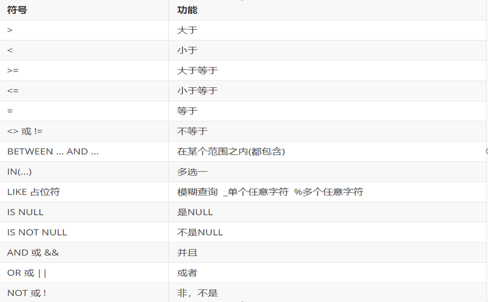

* 查询年龄大于20岁的学员信息

  ```sql
  select * from stu where age > 20;
  ```

* 查询年龄大于等于20岁的学员信息

  ```sql
  select * from stu where age >= 20;
  ```

* 查询年龄大于等于20岁 并且 年龄 小于等于 30岁 的学员信息

  ```sql
  select * from stu where age >= 20 &&  age <= 30;
  select * from stu where age >= 20 and  age <= 30;
  ```

  > **上面语句中 &&  和  and  都表示并且的意思。建议使用 and **
  >
  > 也可以使用  between ... and 来实现上面需求

  ```sql
  select * from stu where age BETWEEN 20 and 30;
  ```

* 查询入学日期在'1998-09-01' 到 '1999-09-01'  之间的学员信息

  ```sql
  select * from stu where hire_date BETWEEN '1998-09-01' and '1999-09-01';
  ```

* 查询年龄等于18岁的学员信息

  ```sql
  select * from stu where age = 18;
  ```

* 查询年龄不等于18岁的学员信息

  ```sql
  select * from stu where age != 18;
  select * from stu where age <> 18;
  ```

* 查询年龄等于18岁 或者 年龄等于20岁 或者 年龄等于22岁的学员信息

  ```sql
  select * from stu where age = 18 or age = 20 or age = 22;
  select * from stu where age in (18,20 ,22);
  ```

* 查询英语成绩为 null的学员信息

  null值的比较不能使用 =  或者 != 。需要使用 is  或者 is not

  ```sql
  select * from stu where english = null; -- 这个语句是不行的
  select * from stu where english is null;
  select * from stu where english is not null;
  ```

### 5.2.2  模糊查询

- **模糊查询使用like关键字，可以使用通配符进行占位:**
  - **（1）_ : 代表单个任意字符**
  - **（2）% : 代表任意个数字符**

* 查询姓'马'的学员信息

  ```sql
  select * from stu where name like '马%';
  ```

* 查询第二个字是'花'的学员信息

  ```sql
  select * from stu where name like '_花%';
  ```

* 查询名字中包含 '德' 的学员信息

  ```sql
  select * from stu where name like '%德%';
  ```


## 5.3 排序查询ORDER BY

### 5.3.1 排序规则

- 基本语法

```sql
SELECT 字段列表
FROM 表名
ORDER BY 排序字段名1 [排序方式1],排序字段名2 [排序方式2] …;
```

- 说明：

  - 上述语句中的排序方式有两种，分别是：
    - ASC ： 升序排列 **（默认值）**
    - DESC ： 降序排列

  - 如果有多个排序条件，当前边的条件值一样时，才会根据第二条件进行排序

### 5.3.2 单列排序

- 案例1：

  ```mysql
  SELECT last_name, job_id, department_id, hire_date
  FROM employees
  ORDER BY hire_date ;
  ```

  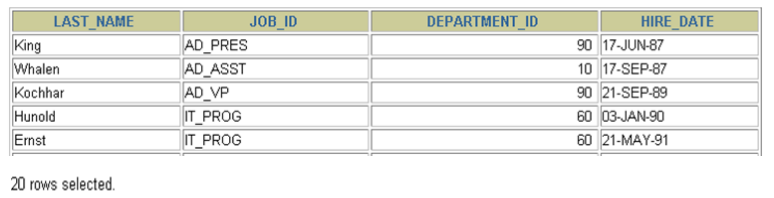

- 案例2：

  ```mysql
  SELECT last_name, job_id, department_id, hire_date
  FROM employees
  ORDER BY hire_date DESC ;
  ```

  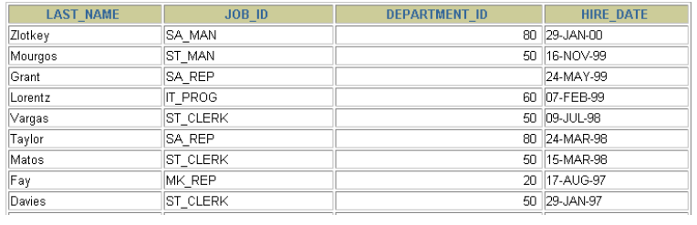

- 案例3：

  ```mysql
  SELECT employee_id, last_name, salary*12 annsal
  FROM employees
  ORDER BY annsal;
  ```

  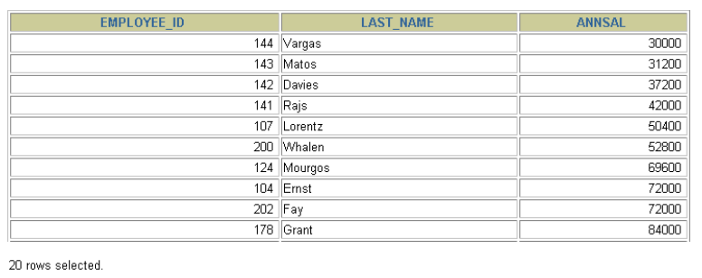

### 5.3.3 多列排序

- 案例：

  ```mysql
  SELECT last_name, department_id, salary
  FROM employees
  ORDER BY department_id, salary DESC;
  ```

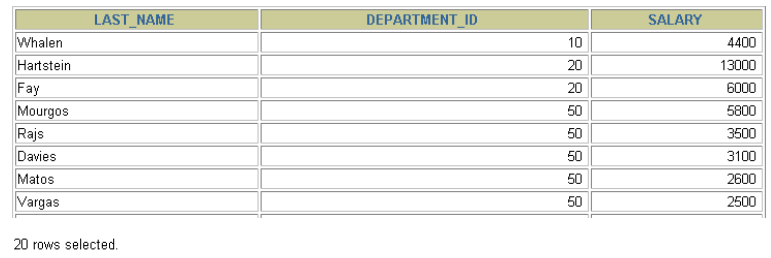

- 说明：
  - 可以使用不在SELECT列表中的列排序
  - 在对多列进行排序的时候，首先排序的第一列必须有相同的列值，才会对第二列进行排序。如果第一列数据中所有值都是唯一的，将不再对第二列进行排序


## 5.4 分页查询LIMIT

### 5.4.1 背景

如下图所示，大家在很多网站都见过类似的效果，如京东、百度、淘宝等。分页查询是将数据一页一页的展示给用户看，用户也可以通过点击查看下一页的数据。

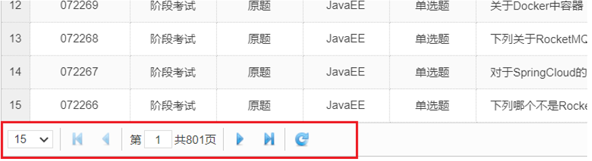

接下来我们先说分页查询的语法。

### 5.4.2 实现规则

- 语法规则：分页查询limit是MySQL数据库的方言

```sql
SELECT	字段列表
FROM	表名
LIMIT	[位置偏移量,] 行数
```

- 说明：
  - 第一个“位置偏移量”参数指示MySQL从哪一行开始显示，是一个可选参数，如果不指定“位置偏移量”，将会从表中的第一条记录开始（第一条记录的位置偏移量是0，第二条记录的位置偏移量是1，以此类推）；
  - 第二个参数“行数”指示返回的记录条数
  - MySQL 8.0中可以使用“LIMIT 3 OFFSET 4”，意思是获取从第5条记录开始后面的3条记录，和“LIMIT4,3;”返回的结果相同
  - **LIMIT 子句必须放在整个SELECT语句的最后！**

- 举例：

  ```mysql
  --前10条记录：
  SELECT * FROM 表名 LIMIT 0,10;
  或者
  SELECT * FROM 表名 LIMIT 10;
  --第11至20条记录：
  SELECT * FROM 表名 LIMIT 10,10;
  --第21至30条记录：
  SELECT * FROM 表名 LIMIT 20,10;
  ```

- 分页显示公式：(当前页数 - 1) * 每条页数  , 每条页数

  ```mysql
  SELECT * FROM table LIMIT(PageNo - 1)*PageSize,PageSize;
  ```

- 使用LIMIT的好处：约束返回结果的数量可以 减少数据表的网络传输量 ，也可以 提升查询效率 。如果我们知道返回结果只有1 条，就可以使用 LIMIT 1 ，告诉 SELECT 语句只需要返回一条记录即可。这样的好处就是 SELECT 不需要扫描完整的表，只需要检索到一条符合条件的记录即可返回。

### 5.4.3 拓展

在不同的 DBMS 中使用的关键字可能不同。在 MySQL、PostgreSQL、MariaDB 和 SQLite 中使用 LIMIT 关键字，而且需要放到 SELECT 语句的最后面。

- 如果是 SQL Server 和 Access，需要使用 TOP 关键字，比如：

  ```mysql
  SELECT TOP 5 name, hp_max FROM heros ORDER BY hp_max DESC
  ```

- 如果是 DB2，使用 FETCH FIRST 5 ROWS ONLY 这样的关键字：

  ```mysql
  SELECT name, hp_max FROM heros ORDER BY hp_max DESC FETCH FIRST 5 ROWS ONLY
  ```

- 如果是 Oracle，你需要基于 ROWNUM 来统计行数：

  ```mysql
  SELECT rownum,last_name,salary FROM employees WHERE rownum < 5 ORDER BY salary DESC;
  ```

需要说明的是，这条语句是先取出来前 5 条数据行，然后再按照 hp_max 从高到低的顺序进行排序。但这样产生的结果和上述方法的并不一样。我会在后面讲到子查询，你可以使用下面语句得到相同的结果

```mysql
SELECT rownum, last_name,salary
FROM (
    SELECT last_name,salary
    FROM employees
    ORDER BY salary DESC)
WHERE rownum < 10;
```


## 5.5 多表查询JOIN ON

### 5.5.1 多表查询概述

- **多表查询，也称为关联查询，指两个或更多个表一起完成查询操作。**
  - **前提条件：** 这些一起查询的表之间是有关系的（一对一、一对多），它们之间一定是有关联字段，这个关联字段可能建立了外键，也可能没有建立外键。比如：员工表和部门表，这两个表依靠“部门编号”进行关联。

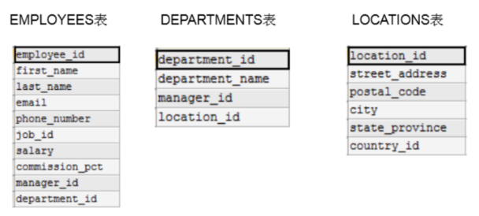

- 我们假设一共有107名员工，部门一共有27个，并不是所有的员工都有部门，也不是所有的部门都有员工，现在我想查询所有员工的姓名及其所在的部门名称，那么必然涉及到两个表，员工表和部门表，并且员工表和部门表是依靠部门编号进行关联，根据之前的学习知识，会很容易写出如下查询语句：

  ```mysql
  SELECT last_name, department_name
  FROM employees, departments;
  ```

- 上述查询语句会产生2889条查询结果出来，正常来说，应该是107条记录，我们把这种错误称为：笛卡尔积错误

- 笛卡尔积(或交叉连接)的理解：笛卡尔乘积是一个数学运算。假设我有两个集合 X 和 Y，那么 X 和 Y 的笛卡尔积就是 X 和 Y 的所有可能组合，也就是第一个对象来自于 X，第二个对象来自于 Y 的所有可能。组合的个数即为两个集合中元素个数的乘积数。

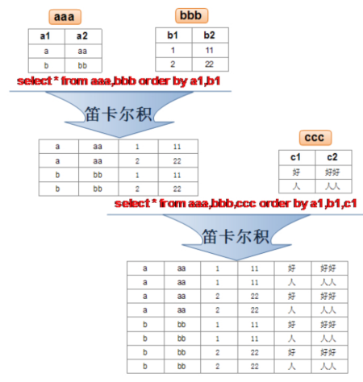

- SQL92中，笛卡尔积也称为 交叉连接 ，英文是`CROSS JOIN`。在 SQL99中也是使用`CROSS JOIN`表示交叉连接。它的作用就是可以把任意表进行连接，即使这两张表不相关。

- 案例分析与问题解决：

  - **笛卡尔积的错误会在下面条件下产生**：
    - 省略多个表的连接条件（或关联条件）
    - 连接条件（或关联条件）无效
    - 所有表中的所有行互相连接

  - 为了避免笛卡尔积， 可以**在** **WHERE** **加入有效的连接条件。**

  - 加入连接条件后，查询语法：

    ```mysql
    SELECT table1.column, table2.column
    FROM table1, table2
    WHERE table1.column1 = table2.column2; #连接条件
    ```

  - 在WHERE子句中写入连接条件

- 正确写法：**在表中有相同列时，在列名之前加上表名前缀。**

  ```mysql
  #案例：查询员工的姓名及其部门名称
  SELECT last_name, department_name
  FROM employees, departments
  WHERE employees.department_id = departments.department_id;
  ```

### 5.5.2 多表查询分类

- 对多表查询进行分类：
  - 根据连接条件中是否出现等式，可分为等值连接和非等值连接
  - 根据连接条件是否自我引用了，可分为自连接和非自连接
  - 根据连接结果，可分为内连接和外连接

#### 5.5.2.1 分类1：等值连接 和 非等值连接

- 等值连接指的是，多表查询语句中的连接条件使用的是等号。
  - 举例：其中第3行代码，它就是连接条件，它使用了等号，故称为等值连接。

```sql
SELECT employee_id, department_name
FROM employees, departments
WHERE employees.`department_id` = departments.`department_id`;
```

- 非等值连接：多表查询语句中的连接条件不是使用等号的称为非等值连接。

  > 举例：根据员工表 `employees` 员工的月工资 `salary` ，去职级表 `job_grades` 中查询其对应的职级。
  >
  > 职级表 `job_grades` 如图所示：
  >
  > 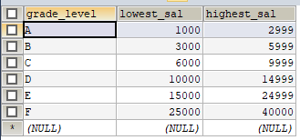
  >
  > 员工表 `employees` 如下图所示：
  >
  > 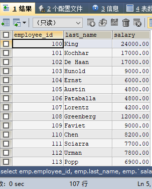
  >
  > 【分析】员工表 `employees` 和职级表 `job_grades` 之间没有相同的字段以供等值连接。唯一有关系的就是工资，那我们就可以通过非等值连接来查询这两个表。如下代码所示：
  >
  > ```sql
  > SELECT emp.employee_id, emp.last_name, jg.grade_level
  > FROM employees emp, job_grades jg
  > WHERE emp.`salary` BETWEEN jg.`lowest_sal` AND jg.`highest_sal`;
  > ```
  >
  > 查询结果：
  >
  > 

#### 5.5.2.2 分类2：自连接 和 非自连接

- 非自连接：指的是在多表查询中，连接的是不同的表。以上的等值连接和非等值连接的示例都属于非自连接。
- 自连接，顾名思义，就是自己连接自己，指的是在多表查询中连接的是同一张表

【例子】根据管理者的员工编号 `manager_id` ，查询员工表 `employees` 中每一个员工对应的管理者姓名和ID。员工表 `employees` 如下图所示：

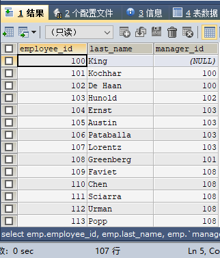

【分析】管理者的员工编号 `manager_id` 也必定是公司员工，对应着公司的员工编号 `employee_id` 。因此，我们可以把员工表复制为两份，一份看作员工表 (起别名为 `emp` )；另一份看作管理者表 (起别名为 `mgr` ) ，如下图所示，通过 `emp` 的管理者编号 `manager_id` 与 `mgr` 员工编号 `employee_id` 连接起来。

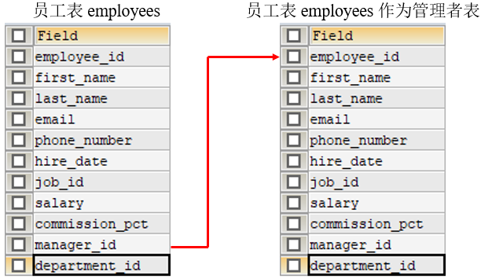

如下代码所示：

```sql
SELECT emp.`employee_id`, emp.`last_name`, mgr.`manager_id`, mgr.`last_name`
FROM employees emp, employees mgr
WHERE emp.`manager_id` = mgr.`employee_id`;
```

查询结果：

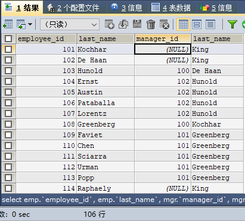


#### 5.5.2.3 分类3：内连接 和外连接

- 内连接(`INNER JOIN`)：合并具有同一列的两个以上的表的行，**结果集中不包含一个表与另一个表不匹配的行**，**只返回两个表中连接字段相等的行。**
- 外连接(`OUTER JOIN`)：两个表在连接过程中除了返回满足连接条件的行以外，**还返回左（或右）表中不满足条件的行 ，这种连接称为左（或右） 外连接**，如果即返回左表中不满足条件的行，又返回右表中不满足条件的行，这种连接称为满外连接或者全外连接。没有匹配的行时, 结果表中相应的列为空(NULL)
  - **左外连接(`LEFT JOIN`)：返回包括左表中的所有记录和右表中连接字段相等的记录，连接条件中左边的表也称为 主表 ，右边的表称为 从表**
  - **右外连接(`RIGHT JOIN`)：返回包括右表中的所有记录和左表中连接字段相等的记录，连接条件中右边的表也称为 主表 ，左边的表称为 从表**
  - **全外连接（`FULL JOIN`）：返回左右表中所有的记录和左右表中连接字段相等的记录**

> **SQL92：使用(+)创建连接**
>
> - 在 SQL92 中采用（+）代表从表所在的位置。即左或右外连接中，(+) 表示哪个是从表。
>
> - Oracle 对 SQL92 支持较好，而 MySQL 则不支持 SQL92 的外连接。
>
>   ```mysql
>   #左外连接
>   SELECT last_name,department_name
>   FROM employees ,departments
>   WHERE employees.department_id = departments.department_id(+);
>
>   #右外连接
>   SELECT last_name,department_name
>   FROM employees ,departments
>   WHERE employees.department_id(+) = departments.department_id;
>   ```
>
> - 而且在 SQL92 中，只有左外连接和右外连接，没有满（或全）外连接。

### 5.5.3 SQL99语法实现多表查询

- <https://blog.csdn.net/Sihang_Xie/article/details/125571345>

#### 5.5.3.1 基本语法

- 使用`JOIN ... ON`子句创建连接的语法结构：

  ```mysql
  SELECT table1.column, table2.column,table3.column
  FROM table1
  JOIN table2 ON table1 和 table2 的连接条件
  JOIN table3 ON table2 和 table3 的连接条件
  ```

- 说明：
  - **可以使用** **ON** **子句指定额外的连接条件**。
  - 这个连接条件是与其它条件分开的。
  - **ON** **子句使语句具有更高的易读性**。
  - 关键字`JOIN`、`INNER JOIN`、`CROSS JOIN`的含义是一样的，都表示内连接

> SQL99 采用的这种嵌套结构非常清爽、层次性更强、可读性更强，即使再多的表进行连接也都清晰可见。如果你采用 SQL92，可读性就会大打折扣。

#### 5.5.3.2 内连接(INNER JOIN)的实现

- 语法：

  ```mysql
  SELECT 字段列表
  FROM A表 [INNER/CROSS] JOIN B表
  ON 关联条件
  WHERE 等其他子句;
  ```

- 举例：

  ```mysql
  # 案例1：两个表
  SELECT e.employee_id, e.last_name, e.department_id, d.department_id, d.location_id
  FROM employees e
  JOIN departments d ON (e.department_id = d.department_id);

  # 等价于：
  SELECT last_name,department_name
  FROM employees,departments
  WHERE employees.department_id = departments.department_id;

  SELECT last_name,department_name
  FROM employees
  INNER JOIN departments ON employees.department_id = departments.department_id;

  SELECT last_name,department_name
  FROM employees
  CROSS JOIN departments ON employees.department_id = departments.department_id;

  # 案例2：三个表
  SELECT e.employee_id, l.city, d.department_name
  FROM employees e
  JOIN departments d ON d.department_id = e.department_id
  JOIN locations l ON d.location_id = l.location_id;
  ```

#### 5.5.3.3 左外连接(LEFT OUTER JOIN)的实现

- 基本语法：

  ```mysql
  #实现查询结果是A
  SELECT 字段列表
  FROM A表 LEFT [OUTER] JOIN B表
  ON 关联条件
  WHERE 等其他子句;
  ```

- 举例：

  ```mysql
  SELECT e.last_name, e.department_id, d.department_name
  FROM employees e
  LEFT OUTER JOIN departments d ON (e.department_id = d.department_id) ;
  ```

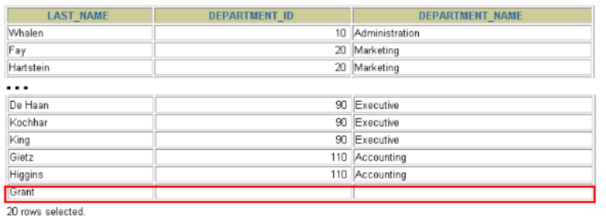

#### 5.5.3.4 右外连接(RIGHT OUTER JOIN)的实现

- 基本语法：

  ```mysql
  #实现查询结果是B
  SELECT 字段列表
  FROM A表 RIGHT [OUTER] JOIN B表
  ON 关联条件
  WHERE 等其他子句;
  ```

- 举例：

  ```mysql
  SELECT e.last_name, e.department_id, d.department_name
  FROM employees e
  RIGHT OUTER JOIN departments d ON (e.department_id = d.department_id);
  ```

#### 5.5.3.5 满外连接(FULL OUTER JOIN)的实现

- 满外连接的结果 = 左右表匹配的数据 + 左表没有匹配到的数据 + 右表没有匹配到的数据。
- SQL99是支持满外连接的，使用`FULL JOIN`或`FULL OUTER JOIN`来实现。
- 需要注意的是，MySQL不支持`FULL JOIN`，但是可以用`LEFT JOIN` **UNION** `RIGHT JOIN`代替

#### 5.5.3.6 UNION的使用

- **合并查询结果** 利用UNION关键字，可以给出多条SELECT语句，并将它们的结果组合成单个结果集。合并时，两个表对应的列数和数据类型必须相同，并且相互对应。各个SELECT语句之间使用UNION或UNION ALL关键字分隔。

- 语法格式：

  ```mysql
  SELECT column,... FROM table1
  UNION [ALL]
  SELECT column,... FROM table2
  ```

- **UNION操作符：返回两个查询的结果集的并集，去除重复记录**

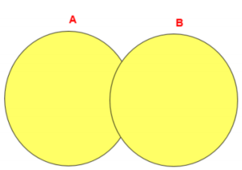

- **UNION ALL操作符：** 返回两个查询的结果集的并集。对于两个结果集的重复部分，不去重。

- **注意：执行UNION ALL语句时所需要的资源比UNION语句少。如果明确知道合并数据后的结果数据不存在重复数据，或者不需要去除重复的数据，则尽量使用UNION ALL语句，以提高数据查询的效率。**

- 举例：查询部门编号>90或邮箱包含a的员工信息

  ```mysql
  #方式1
  SELECT * FROM employees WHERE email LIKE '%a%' OR department_id>90;
  ```

  ```mysql
  #方式2
  SELECT * FROM employees WHERE email LIKE '%a%'
  UNION
  SELECT * FROM employees WHERE department_id>90;
  ```

- 举例：查询中国用户中男性的信息以及美国用户中年男性的用户信息

  ```mysql
  SELECT id,cname FROM t_chinamale WHERE csex='男'
  UNION ALL
  SELECT id,tname FROM t_usmale WHERE tGender='male';
  ```

#### 5.5.3.7 5种SQL JOINS的实现

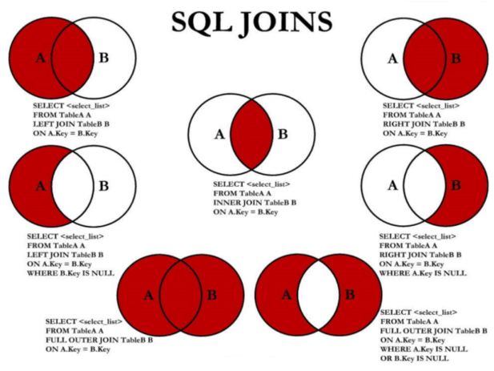

代码实现：

```mysql
#中图：内连接 A ∩ B
SELECT employee_id,last_name,department_name
FROM employees e
JOIN departments d ON e.`department_id` = d.`department_id`;
```

```mysql
#左上图：左外连接
SELECT employee_id,last_name,department_name
FROM employees e
LEFT JOIN departments d ON e.`department_id` = d.`department_id`;
```

```mysql
#右上图：右外连接
SELECT employee_id,last_name,department_name
FROM employees e
RIGHT JOIN departments d ON e.`department_id` = d.`department_id`;
```

```mysql
#左中图：A - A ∩ B
SELECT employee_id,last_name,department_name
FROM employees e
LEFT JOIN departments d ON e.`department_id` = d.`department_id`
WHERE d.`department_id` IS NULL
```

```mysql
#右中图：B - A ∩ B
SELECT employee_id,last_name,department_name
FROM employees e
RIGHT JOIN departments d ON e.`department_id` = d.`department_id`
WHERE e.`department_id` IS NULL
```

```mysql
#左下图：满外连接
# 左中图 + 右上图 A∪B
SELECT employee_id,last_name,department_name
FROM employees e
LEFT JOIN departments d ON e.`department_id` = d.`department_id`
WHERE d.`department_id` IS NULL
UNION ALL #没有去重操作，效率高
SELECT employee_id,last_name,department_name
FROM employees e RIGHT JOIN departments d
ON e.`department_id` = d.`department_id`;
```

```mysql
#右下图
#左中图 + 右中图 A ∪ B- A ∩ B 或者 (A - A ∩ B) ∪ （B - A ∩ B）
SELECT employee_id,last_name,department_name
FROM employees e
LEFT JOIN departments d ON e.`department_id` = d.`department_id`
WHERE d.`department_id` IS NULL
UNION ALL
SELECT employee_id,last_name,department_name
FROM employees e
RIGHT JOIN departments d ON e.`department_id` = d.`department_id`
WHERE e.`department_id` IS NULL
```

> 总结：
>
> - 左中图
>
>   ```mysql
>   #实现A - A ∩ B
>   select 字段列表
>   from A表 left join B表
>   on 关联条件
>   where 从表关联字段 is null and 等其他子句;
>   ```
>
> - 右中图
>
>   ```mysql
>   #实现B - A ∩ B
>   select 字段列表
>   from A表 right join B表
>   on 关联条件
>   where 从表关联字段 is null and 等其他子句;
>   ```
>
> - 左下图
>
>   ```mysql
>   #实现查询结果是A ∪ B
>   #用左外的A，union 右外的B
>   select 字段列表
>   from A表 left join B表
>   on 关联条件
>   where 等其他子句
>   union
>   select 字段列表
>   from A表 right join B表
>   on 关联条件
>   where 等其他子句;
>   ```
>
> - 右下图
>
>   ```mysql
>   #实现A∪B - A ∩ B 或 (A - A ∩ B) ∪ （B - A ∩ B）
>   #使用左外的 (A - A ∩ B) union 右外的（B - A ∩ B）
>   select 字段列表
>   from A表 left join B表
>   on 关联条件
>   where 从表关联字段 is null and 等其他子句
>   union
>   select 字段列表
>   from A表 right join B表
>   on 关联条件
>   where 从表关联字段 is null and 等其他子句
>   ```

### 5.5.4 SQL99新特性

#### 5.5.4.1 自然连接

- SQL99 在 SQL92 的基础上提供了一些特殊语法，比如 NATURAL JOIN 用来表示自然连接。我们可以把自然连接理解为 SQL92 中的等值连接。它会帮你自动查询两张连接表中 所有相同的字段 ，然后进行 等值连接 。

  - 在SQL92标准中：

    ```mysql
    SELECT employee_id,last_name,department_name
    FROM employees e JOIN departments d
    ON e.`department_id` = d.`department_id`
    AND e.`manager_id` = d.`manager_id`;
    ```

  - 在 SQL99 中你可以写成：

    ```mysql
    SELECT employee_id,last_name,department_name
    FROM employees e NATURAL JOIN departments d;
    ```

#### 5.5.4.2 USING连接

- 当我们进行连接的时候，SQL99还支持使用 USING 指定数据表里的 同名字段 进行等值连接。但是只能配合JOIN一起使用。比如：

  ```mysql
  SELECT employee_id,last_name,department_name
  FROM employees e JOIN departments d
  USING (department_id);
  ```

- 你能看出与自然连接 NATURAL JOIN 不同的是，USING 指定了具体的相同的字段名称，你需要在 USING的括号 () 中填入要指定的同名字段。同时使用 JOIN...USING 可以简化 JOIN ON 的等值连接。它与下面的 SQL 查询结果是相同的：

  ```mysql
  SELECT employee_id,last_name,department_name
  FROM employees e ,departments d
  WHERE e.department_id = d.department_id;
  ```

### 5.5.5 总结

- 表连接的约束条件可以有三种方式：WHERE, ON, USING
  - WHERE：适用于所有关联查询
  - ON ：只能和JOIN一起使用，只能写关联条件。虽然关联条件可以并到WHERE中和其他条件一起写，但分开写可读性更好。
  - USING：只能和JOIN一起使用，而且要求**两个**关联字段在关联表中名称一致，而且只能表示关联字段值相等

- **我们要 控制连接表的数量** 。多表连接就相当于嵌套 for 循环一样，非常消耗资源，会让 SQL 查询性能下降得很严重，因此不要连接不必要的表。在许多 DBMS 中，也都会有最大连接表的限制。
  - 【强制】超过三个表禁止 join。需要 join 的字段，数据类型保持绝对一致；多表关联查询时， 保证被关联的字段需要有索引。
  - 即使双表 join 也要注意表索引、SQL 性能

## 5.6 聚合函数

### 5.6.1 概念

- 聚合函数作用于一列数据，并对一列数据进行计算返回一个值
- 举例：现有一需求让我们求表中所有数据的数学成绩的总和。这就是对math字段进行纵向求和。

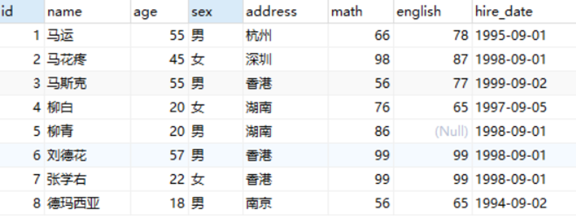

### 5.6.2 聚合函数分类

| 函数名      | 功能                             |
| ----------- | -------------------------------- |
| COUNT(列名) | 统计数量（一般选用不为null的列） |
| MAX(列名)   | 最大值                           |
| MAX(列名)   | 最小值                           |
| SUM(列名)   | 求和                             |
| AVG(列名)   | 平均值                           |

### 5.6.3 聚合函数语法

- 聚合函数基本语法格式：

```sql
SELECT [列名,] 聚合函数名(列名) ,...
FROM 表
[WHERE condition]
[GROUP BY column]
[ORDER BY column];
```

- 说明：
  - null 值不参与所有聚合函数运算
  - 聚合函数不能嵌套调用。比如不能出现类似“AVG(SUM(字段名称))”形式的调用。

### 5.6.4 AVG和SUM函数

- 可以对**数值型数据**使用AVG 和 SUM 函数

  ```mysql
  SELECT AVG(salary), MAX(salary),MIN(salary), SUM(salary)
  FROM employees
  WHERE job_id LIKE '%REP%';
  ```

### 5.6.5 MIN和MAX函数

- 可以对**任意数据类型**的数据使用 MIN 和 MAX 函数

  ```mysql
  SELECT MIN(hire_date), MAX(hire_date)
  FROM employees;
  ```

### 5.6.6 COUNT函数

- COUNT(*)返回表中记录总数，适用于**任意数据类型**

  ```mysql
  SELECT COUNT(*)
  FROM employees
  WHERE department_id = 50;
  ```

- **COUNT(expr) 返回expr不为空的记录总数**

  ```mysql
  SELECT COUNT(commission_pct)
  FROM employees
  WHERE department_id = 50;
  ```

- **问题1：用count(\*)，count(1)，count(列名)谁好呢?**
  - 其实，对于MyISAM引擎的表是没有区别的。这种引擎内部有一计数器在维护着行数。Innodb引擎的表用count(*),count(1)直接读行数，复杂度是O(n)，因为innodb真的要去数一遍。但好于具体的count(列名)。

- **问题：能不能使用count(列名)替换count(\*)?**
  - 不要使用 count(列名)来替代 count(\*) ， count(*) 是 SQL92 定义的标准统计行数的语法，跟数据库无关，跟 NULL 和非 NULL 无关。
- **说明：count(*)会统计值为 NULL 的行，而 count(列名)不会统计此列为 NULL 值的行。**

## 5.7 分组查询GROUP BY

### 5.7.1 基本使用

- 可以使用DROUP BY句子将表中的数据分成若干组，其基本语法格式如下：

```sql
SELECT 字段列表
FROM 表名
[WHERE 分组前条件限定]
GROUP BY 分组字段名;
```

- 注意：
  - WHERE一定放在FROM后面
  - 分组之后，查询的字段为聚合函数和分组字段，查询其他字段无任何意义

- **在SELECT列表中所有未包含在组函数中的列都应该包含在GROUP BY子句中**

  ```mysql
  SELECT department_id, AVG(salary)
  FROM employees
  GROUP BY department_id ;
  ```

- **包含在 GROUP BY 子句中的列不必包含在SELECT 列表中**

  ```mysql
  SELECT AVG(salary)
  FROM employees
  GROUP BY department_id ;
  ```

* 查询男同学和女同学各自的数学平均分

  ```sql
  select sex, avg(math) from stu group by sex;
  ```

  > 注意：分组之后，查询的字段为聚合函数和分组字段，查询其他字段无任何意义

  ```sql
  select name, sex, avg(math) from stu group by sex;  -- 这里查询name字段就没有任何意义
  ```

* 查询男同学和女同学各自的数学平均分，以及各自人数

  ```sql
  select sex, avg(math),count(*) from stu group by sex;
  ```

* 查询男同学和女同学各自的数学平均分，以及各自人数，要求：分数低于70分的不参与分组

  ```sql
  select sex, avg(math),count(*) from stu where math > 70 group by sex;
  ```

* 查询男同学和女同学各自的数学平均分，以及各自人数，要求：分数低于70分的不参与分组，分组之后人数大于2个的

  ```sql
  select sex, avg(math),count(*) from stu where math > 70 group by sex having count(*)  > 2;
  ```


### 5.7.2 使用多个列分组

- 举例：

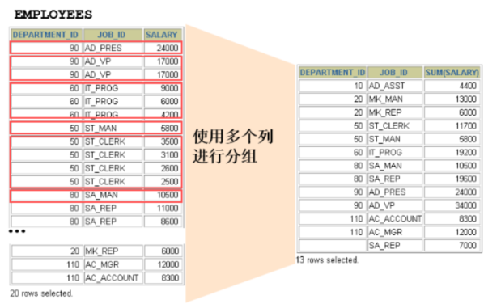

```mysql
SELECT department_id dept_id, job_id, SUM(salary)
FROM employees
GROUP BY department_id, job_id ;
```

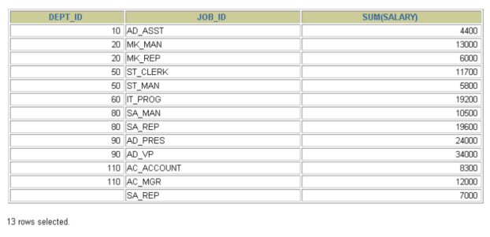


### 5.7.3  GROUP BY中使用WITH ROLLUP

- 使用 WITH ROLLUP 关键字之后，在所有查询出的分组记录之后增加一条记录，该记录计算查询出的所有记录的总和，即统计记录数量。

  ```mysql
  SELECT department_id,AVG(salary)
  FROM employees
  WHERE department_id > 80
  GROUP BY department_id WITH ROLLUP;
  ```

- **注意：当使用ROLLUP时，不能同时使用ORDER BY子句进行结果排序，即ROLLUP和ORDER BY是互相排斥的。**


## 5.8 HAVING

- 过滤分组：HAVING子句
  - 行已经被分组
  - 使用了聚合函数
  - 满足HAVING子句中条件的分组将被显示出来
- HAVING不能单独使用，必须要跟GROUP BY一起使用

### 5.8.1 基本使用

- 基本语法结构：

```mysql
SELECT 字段列表
FROM 表名
[WHERE 分组前条件限定]
GROUP BY 分组字段名
[HAVING 分组后条件过滤];
```

- 举例：

```mysql
SELECT department_id, MAX(salary)
FROM employees
GROUP BY department_id
HAVING MAX(salary) > 10000 ;
```

- **非法使用聚合函数 ： 不能在** **WHERE** **子句中使用聚合函数。**

  ```mysql
  # 以下语句会报错
  SELECT department_id, AVG(salary)
  FROM employees
  WHERE AVG(salary) > 8000
  GROUP BY department_id;
  ```

### 5.8.2 where 和 having 区别

1. **执行时机不同**：
   - `WHERE` 在分组前进行过滤，不满足条件的数据不会参与分组。
   - `HAVING` 在分组后进行过滤，作用于分组结果。
2. **判断条件不同**：
   - `WHERE` 不能对聚合函数进行判断。
   - `HAVING` 可以使用聚合函数进行判断。
3. **执行顺序**：
   - SQL 语句的执行顺序为：`WHERE` > 聚合函数 > `HAVING`。
4. **使用场景差异**：
   - `WHERE` 直接作用于表的字段，不能用于分组计算。
   - `HAVING` 必须配合 `GROUP BY` 使用，能够对分组字段和聚合结果进行筛选。
5. **连接操作中的区别**：
   - `WHERE` 在连接前先筛选数据，连接的数据集更小，效率更高。
   - `HAVING` 在连接后筛选，需处理更大的数据集，效率较低。

* **执行时机不一样：where 是分组之前进行限定，不满足where条件，则不参与分组，而having是分组之后对结果进行过滤。**
* **可判断的条件不一样：where 不能对聚合函数进行判断，having 可以**
* **原因：执行顺序：where>聚合函数>having**
* **区别1：WHERE可以直接使用表中的字段作为筛选条件，但不能使用分组中的计算函数作为筛选条件；HAVING必须要与GROUP BY配合使用，可以把分组计算的函数和分组字段作为筛选条件。**
  * 这决定了，在需要对数据进行分组统计的时候，HAVING 可以完成 WHERE 不能完成的任务。这是因为，在查询语法结构中，WHERE 在 GROUP BY 之前，所以无法对分组结果进行筛选。
  * HAVING 在 GROUP BY 之后，可以使用分组字段和分组中的计算函数，对分组的结果集进行筛选，这个功能是 WHERE 无法完成的。另外，WHERE排除的记录不再包括在分组中。

* **区别2：如果需要通过连接从关联表中获取需要的数据，WHERE是先筛选后连接，而HAVING是先连接后筛选。**
  * 这一点，就决定了在关联查询中，WHERE 比 HAVING 更高效。因为 WHERE 可以先筛选，用一个筛选后的较小数据集和关联表进行连接，这样占用的资源比较少，执行效率也比较高。HAVING 则需要先把结果集准备好，也就是用未被筛选的数据集进行关联，然后对这个大的数据集进行筛选，这样占用的资源就比较多，执行效率也较低。

* 总结：


- **开发中的选择：** WHERE 和 HAVING 也不是互相排斥的，我们可以在一个查询里面同时使用 WHERE 和 HAVING。包含分组统计函数的条件用 HAVING，普通条件用 WHERE。这样，我们就既利用了 WHERE 条件的高效快速，又发挥了 HAVING 可以使用包含分组统计函数的查询条件的优点。当数据量特别大的时候，运行效率会有很大的差别。

## 5.9 SELECT的执行过程

### 5.9.1 查询的结构

```mysql
#方式1：
SELECT ...,....,...
FROM ...,...,....
WHERE 多表的连接条件
AND 不包含组函数的过滤条件
GROUP BY ...,...
HAVING 包含组函数的过滤条件
ORDER BY 列名 ASC/DESC, [列名 ASC/DESC]
LIMIT [位置偏移量,] 行数

#方式2：
SELECT ...,....,...
FROM ... JOIN ...
ON 多表的连接条件
JOIN ...
ON ...
WHERE 不包含组函数的过滤条件
AND/OR 不包含组函数的过滤条件
GROUP BY ...,...
HAVING 包含组函数的过滤条件
ORDER BY 列名 ASC/DESC, [列名 ASC/DESC]
LIMIT [位置偏移量,] 行数

#其中：
#（1）from：从哪些表中筛选
#（2）on：关联多表查询时，去除笛卡尔积
#（3）where：从表中筛选的条件
#（4）group by：分组依据
#（5）having：在统计结果中再次筛选
#（6）order by：排序
#（7）limit：分页
```

### 5.9.2 SELECT执行顺序

- **关键字的顺序是不能颠倒的：**

  ```mysql
  SELECT ... FROM ... WHERE ... GROUP BY ... HAVING ... ORDER BY ... LIMIT...
  ```

- **SELECT语句的执行顺序（在 MySQL 和 Oracle 中，SELECT 执行顺序基本相同）：**

  ```mysql
  FROM -> WHERE -> GROUP BY -> HAVING -> SELECT 的字段 -> DISTINCT -> ORDER BY -> LIMIT
  ```

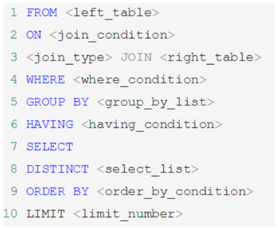

- 举例：

  ```mysql
  SELECT DISTINCT player_id, player_name, count(*) as num # 顺序 5
  FROM player JOIN team ON player.team_id = team.team_id # 顺序 1
  WHERE height > 1.80 # 顺序 2
  GROUP BY player.team_id # 顺序 3
  HAVING num > 2 # 顺序 4
  ORDER BY num DESC # 顺序 6
  LIMIT 2 # 顺序 7
  ```

- 在 SELECT 语句执行这些步骤的时候，每个步骤都会产生一个 虚拟表 ，然后将这个虚拟表传入下一个步骤中作为输入。需要注意的是，这些步骤隐含在 SQL 的执行过程中，对于我们来说是不可见的。

### 5.9.3 SQL的执行原理

SELECT 是先执行 FROM 这一步的。在这个阶段，如果是多张表联查，还会经历下面的几个步骤：

1. 首先先通过 CROSS JOIN 求笛卡尔积，相当于得到虚拟表 vt（virtual table）1-1；
2. 通过 ON 进行筛选，在虚拟表 vt1-1 的基础上进行筛选，得到虚拟表 vt1-2；
3. 添加外部行。如果我们使用的是左连接、右链接或者全连接，就会涉及到外部行，也就是在虚拟表 vt1-2 的基础上增加外部行，得到虚拟表 vt1-3

当然如果我们操作的是两张以上的表，还会重复上面的步骤，直到所有表都被处理完为止。这个过程得到是我们的原始数据。

当我们拿到了查询数据表的原始数据，也就是最终的虚拟表 vt1 ，就可以在此基础上再进行 WHERE 阶段 。在这个阶段中，会根据 vt1 表的结果进行筛选过滤，得到虚拟表 vt2 。

然后进入第三步和第四步，也就是 GROUP 和 HAVING 阶段 。在这个阶段中，实际上是在虚拟表 vt2 的基础上进行分组和分组过滤，得到中间的虚拟表 vt3 和 vt4。

当我们完成了条件筛选部分之后，就可以筛选表中提取的字段，也就是进入到 SELECT 和 DISTINCT阶段 。

首先在 SELECT 阶段会提取想要的字段，然后在 DISTINCT 阶段过滤掉重复的行，分别得到中间的虚拟表vt5-1 和 vt5-2 。

当我们提取了想要的字段数据之后，就可以按照指定的字段进行排序，也就是 ORDER BY 阶段 ，得到虚拟表 vt6 。

最后在 vt6 的基础上，取出指定行的记录，也就是 LIMIT 阶段 ，得到最终的结果，对应的是虚拟表vt7 。

当然我们在写 SELECT 语句的时候，不一定存在所有的关键字，相应的阶段就会省略。

同时因为 SQL 是一门类似英语的结构化查询语言，所以我们在写 SELECT 语句的时候，还要注意相应的关键字顺序，**所谓底层运行的原理，就是我们刚才讲到的执行顺序。**

## 5.10 子查询

子查询指一个查询语句嵌套在另一个查询语句内部的查询，这个特性从MySQL 4.1开始引入。

SQL 中子查询的使用大大增强了 SELECT 查询的能力，因为很多时候查询需要从结果集中获取数据，或者需要从同一个表中先计算得出一个数据结果，然后与这个数据结果（可能是某个标量，也可能是某个集合）进行比较。


## 6. 运算符

## 6.1 算术运算符


## 6.2 比较运算符


## 6.3 逻辑运算符


## 6.4 位运算符


## 6.5 运算符的优先级


## 6.6 拓展：使用正则表达式查询


## 7. 函数


## 7.1 单行函数


## 8. 约束

## 8.1约束(constraint)概述

### 8.1.1 概念

- **我们就可以从数据库层面在添加数据的时候进行限制，这个就是约束**
- 约束是作用于表中列上的规则，用于限制加入表的数据，可以在**创建表时规定约束（通过** **CREATE TABLE** **语句）**，或者**在表创建之后通过ALTER TABLE语句规定约束**
  - 例如：我们可以给id列加约束，让其值不能重复，不能为null值。

* 约束的存在保证了数据库中数据的正确性、有效性和完整性
  * 添加约束可以在添加数据的时候就限制不正确的数据，年龄是3000，数学成绩是-5分这样无效的数据，继而保障数据的完整性。

- **数据完整性（Data Integrity）是指数据的精确性（Accuracy）和可靠性（Reliability）**。它是防止数据库中存在不符合语义规定的数据和防止因错误信息的输入输出造成无效操作或错误信息而提出的。
- 为了保证数据的完整性，SQL规范以约束的方式对**表数据进行额外的条件限制**。从以下四个方面考虑：
  - **实体完整性（Entity Integrity）** ：例如，同一个表中，不能存在两条完全相同无法区分的记录
  - **域完整性（Domain Integrity）** ：例如：年龄范围0-120，性别范围“男/女”
  - **引用完整性（Referential Integrity）** ：例如：员工所在部门，在部门表中要能找到这个部门
  - **用户自定义完整性（User-defined Integrity）** ：例如：用户名唯一、密码不能为空等，本部门经理的工资不得高于本部门职工的平均工资的5倍。

### 8.1.2 约束的分类

- **根据约束数据列的限制，**约束可分为：
  - **单列约束**：每个约束只约束一列
  - **多列约束**：每个约束可约束多列数据

- **根据约束的作用范围**，约束可分为：
  - **列级约束**：只能作用在一个列上，跟在列的定义后面
  - **表级约束**：可以作用在多个列上，不与列一起，而是单独定义


- **根据约束起的作用**，约束可分为：
  1. **NOT NULL（非空约束）**：
     - 保证字段不能为空。
     - 例如：如果某列设为`NOT NULL`，那么尝试插入`NULL`值的数据将被拒绝。
  2. **UNIQUE（唯一性约束）**：
     - 保证字段在整个表中是唯一的，即不能有重复值。
     - 例如：如果某列设为`UNIQUE`，那么多个数据行中这个字段的值不能重复。
  3. **PRIMARY KEY（主键约束）**：
     - 主键是一行数据的唯一标识，要求非空且唯一。
     - 例如：ID列通常作为主键，标识每一行数据，不能重复也不能为空。
  4. **CHECK（检查约束）**：
     - 保证字段的值满足某些条件。
     - 例如：可以对年龄设置检查约束（CHECK），规定年龄必须在1到300之间。
     - **注意：`MySQL`不支持`CHECK`约束，但可以在应用层代码中实现类似的逻辑。**
  5. **DEFAULT（默认值约束）**：
     - 指定一个字段的默认值，如果在插入数据时未赋值，则使用默认值。
     - 例如：给`english`列设定默认值为`0`，当插入数据时若未指定该列值，系统会自动填充为`0`。
  6. **FOREIGN KEY（外键约束）**：
     - 用于在两个表之间建立关系，保证数据的一致性和完整性。
     - 例如：通过外键，可以确保表A中的某字段值在表B中有对应记录，维持表间关联性。

- 查看某个表已有的约束：

  ```mysql
  # information_schema 数据库名（系统库）
  # table_constraints  表约束（专门存储各个表的约束）
  SELECT * FROM information_schema.table_constraints
  WHERE table_name = '表名称';
  ```


## 8.2 非空约束NOT NULL

### 8.2.1 概述

- **非空约束是限定某个字段/某列的值不允许为空**
- **关键字：`NOT NULL`**
- **说明：**
  - 默认所有的类型的值都可以是NULL，包括INT、FLOAT等数据类型
  - 非空约束只能出现在表对象的列上，只能某个列单独限定非空，不能组合非空
  - 一个表可以有很多列都分别限定了非空
  - 空字符串不等于NULL，0也不等于NULL

### 8.2.2 添加非空约束

#### 建表时

- 基本语法格式：

  ```mysql
  CREATE TABLE 表名称(
      字段名 数据类型,
      字段名 数据类型 NOT NULL,
      字段名 数据类型 NOT NULL
  );
  ```

- 举例：

  ```mysql
  CREATE TABLE student(
      sid	int,
      sname	varchar(20) not null,
      tel	char(11) ,
      cardid	char(18)	not null
  );
  ```

#### 建表后

- 基本语法格式：

  ```mysql
  ALTER TABLE 表名 MODIFY 字段名 数据类型 NOT NULL;
  ```

- 举例：

  ```mysql
  ALTER TABLE student MODIFY sname varchar(20) NOT NULL;
  ```

### 8.2.3 删除非空约束

- 基本语法格式：

  ```mysql
  ALTER TABLE 表名 MODIFY 字段名 数据类型 NULL;#去掉not null，相当于修改某个非注解字段，该字段允许为空
  ALTER TABLE 表名 MODIFY 字段名 数据类型;		#去掉not null，相当于修改某个非注解字段，该字段允许为空
  ```


## 8.2 唯一性约束UNIQUE

### 8.2.1 概述

- 唯一性约束用于保证列中所有数据各不相同，即所有值不能重复
- 关键字：`UNIQUE`
- 说明：
  - 唯一性约束允许列值存在多个空值：`NULL`
  - 同一个表可以有多个唯一约束。
  - 唯一约束可以是某一个列的值唯一，也可以多个列组合的值唯一。
  - 在创建唯一约束的时候，如果不给唯一约束命名，就默认和列名相同。
  - **MySQL会给唯一约束的列上默认创建一个唯一索引**

### 8.2.2 添加唯一约束

#### 建表时

- 基本语法格式：

  ```mysql
  CREATE TABLE 表名称(
  字段名 数据类型,
  字段名 数据类型 UNIQUE,
  字段名 数据类型 UNIQUE KEY,
  字段名 数据类型
  );
  CREATE TABLE 表名称(
  字段名 数据类型,
  字段名 数据类型,
  字段名 数据类型,
  [CONSTRAINT 约束名] UNIQUE KEY(字段名)
  );
  ```

- 举例1：

  ```mysql
  CREATE TABLE student(
      sid	int,
      sname	varchar(20),
      tel	char(11) UNIQUE,
      cardid	char(18) UNIQUE KEY
  );
  ```

- 举例2：表示用户名和密码组合不能重复

  ```mysql
  CREATE TABLE USER(
      id			INT NOT NULL,
      NAME		VARCHAR(25),
      PASSWORD	VARCHAR(16),
      -- 使用表级约束语法
      CONSTRAINT uk_name_pwd UNIQUE(NAME,PASSWORD)
  );
  ```

#### 建表后

- 基本语法格式：

  ```mysql
  #字段列表中如果是一个字段，表示该列的值唯一。如果是两个或更多个字段，那么复合唯一，即多个字段的组合是唯一的
  #方式1：
  CREATE TABLE 表名称 ADD UNIQUE KEY(字段列表);
  #方式2：
  ALTER TABLE  表名称 MODIFY 字段名 字段类型 UNIQUE;
  ```

- 举例1：

  ```mysql
  ALTER TABLE USER ADD UNIQUE(NAME,PASSWORD);
  ```

  ```mysql
  ALTER TABLE USER ADD CONSTRAINT uk_name_pwd UNIQUE(NAME,PASSWORD);
  ```

  ```mysql
  ALTER TABLE USER MODIFY NAME VARCHAR(20) UNIQUE;
  ```

- 举例2：

  ```mysql
  ALTER TABLE student(
      sid	int primary key,
      sname	varchar(20),
      tel	char(11) ,
      cardid	char(18)
  );

  ALTER TABLE student ADD UNIQUE KEY(tel);
  ALTER TABLE student ADD UNIQUE KEY(cardid);
  ```

### 8.2.3 关于复合唯一约束

- 基本语法格式：

  ```mysql
  create table 表名称(
      字段名 数据类型,
      字段名 数据类型,
      字段名 数据类型,
      unique key(字段列表) #字段列表中写的是多个字段名，多个字段名用逗号分隔，表示那么是复合唯一，即多个字段的组合是唯一的
  );
  ```

- 举例：

  ```mysql
  #学生表
  create table student(
      sid	int, #学号
      sname	varchar(20), #姓名
      tel	char(11) unique key, #电话
      cardid	char(18) unique key #身份证号
  );

  #课程表
  create table course(
	cid	int, #课程编号
	cname	varchar(20) #课程名称
  );

  #选课表
  create table student_course(
      id		int,
      sid	int,
      cid	int,
      score	int,
      unique key(sid,cid) #复合唯一
  );

  # 初始化学生表和课程表
  insert into student values(1,'张三','13710011002','101223199012015623');#成功
  insert into student values(2,'李四','13710011003','101223199012015624');#成功
  insert into course values(1001,'Java'),(1002,'MySQL');#成功
  # 初始化选课表
  insert into student_course values
  (1, 1, 1001, 89),
  (2, 1, 1002, 90),
  (3, 2, 1001, 88),
  (4, 2, 1002, 56);#成功

  # 插入选课数据
  insert into student_course values (5, 1, 1001, 88);#失败
  #ERROR 1062 (23000): Duplicate entry '1-1001' for key 'sid' 违反sid-cid的复合唯一
  ```


### 8.2.4 删除唯一约束

- 说明：
  - 添加唯一性约束的列上也会自动创建唯一索引。
  - 删除唯一约束只能通过删除唯一索引的方式删除。
  - 删除时需要指定唯一索引名，唯一索引名就和唯一约束名一样。
  - 如果创建唯一约束时未指定名称，如果是单列，就默认和列名相同；如果是组合列，那么默认和()中排在第一个的列名相同。也可以自定义唯一性约束名。

- 查看都有哪些约束：

  ```mysql
  SELECT * FROM information_schema.table_constraints WHERE table_name = '表名'; #查看都有哪些约束
  ```

- 删除约束基本语法：

  ```mysql
  ALTER TABLE 表名 DROP INDEX 字段名;
  ```

- 举例：

  ```mysql
  ALTER TABLE USER DROP INDEX uk_name_pwd;
  ```

> 注意：可以通过`SHOW INDEX FROM 表名称;`查看索引

## 8.3  主键约束PRIMARY KEY

### 8.3.1 概述

- 主键约束用来唯一标识表中的一行记录

* 说明：
  * 主键约束相当于**唯一约束+非空约束的组合**，主键约束列不允许重复，也不允许出现空值
  * 一个表最多只能有一个主键约束，建立主键约束可以在列级别创建，也可以在表级别上创建
  * 主键约束对应着表中的一列或者多列（复合主键）
  * 如果是多列组合的复合主键约束，那么这些列都不允许为空值，并且组合的值不允许重复
  * **MySQL的主键名总是PRIMARY**，就算自己命名了主键约束名也没用
  * 当创建主键约束时，系统默认会在所在的列或列组合上建立对应的**主键索引**（能够根据主键查询的，就根据主键查询，效率更高）。如果删除主键约束了，主键约束对应的索引就自动删除了。
  * 需要注意的一点是，不要修改主键字段的值。因为主键是数据记录的唯一标识，如果修改了主键的值，就有可能会破坏数据的完整性。


### 8.3.2 添加主键约束

#### 建表时

- 基本语法格式：

  ```mysql
  CREATE TABLE 表名称(
      字段名 数据类型 PRIMARY KEY, #列级模式
      字段名 数据类型,
      字段名 数据类型
  );
  CREATE TABLE 表名称(
      字段名 数据类型,
      字段名 数据类型,
      字段名 数据类型,
      [CONSTRAINT 约束名] PRIMARY KEY(字段名) #表级模式
  );
  ```

- 举例1：

  ```mysql
  # 成功
  CREATE TABLE temp(
      id	int PRIMARY KEY,
      name varchar(20)
  );

  # 报错
  # 演示一个表建立两个主键约束
  create table temp(
      id int primary key,
      name varchar(20) primary key
  );
  ERROR 1068 (42000): Multiple（多重的） primary key defined（定义）
  ```

- 举例2：

  ```mysql
  # 列级约束
  CREATE TABLE emp4(
      id INT PRIMARY KEY AUTO_INCREMENT ,
      NAME VARCHAR(20)
  );

  # 表级约束
  CREATE TABLE emp5(
      id		INT NOT NULL AUTO_INCREMENT,
      NAME	VARCHAR(20),
      pwd	VARCHAR(15),
      CONSTRAINT emp5_id_pk PRIMARY KEY(id)
  );
  ```

#### 建表后

- 基本语法格式：

  ```mysql
  ALTER TABLE 表名称 ADD PRIMARY KEY(字段列表); #字段列表可以是一个字段，也可以是多个字段，如果是多个字段的话，是复合主键
  ```

- 举例：

  ```mysql
  ALTER TABLE student ADD PRIMARY KEY (sid);
  ALTER TABLE emp5 ADD PRIMARY KEY(NAME,pwd);
  ```

### 8.3.3 关于复合主键

- 基本语法格式：

  ```mysql
  create table 表名称(
      字段名 数据类型,
      字段名 数据类型,
      字段名 数据类型,
      primary key(字段名1,字段名2) #表示字段1和字段2的组合是唯一的，也可以有更多个字段
  );
  ```

- 举例1：

  ```mysql
  #学生表
  create table student(
      sid int primary key, #学号
      sname varchar(20) #学生姓名
  );
  #课程表
  create table course(
      cid int primary key, #课程编号
      cname varchar(20) #课程名称
  );
  #选课表
  create table student_course(
      sid int,
      cid int,
      score int,
      primary key(sid,cid) #复合主键
  );

  insert into student values(1,'张三'),(2,'李四');# 成功
  insert into course values(1001,'Java'),(1002,'MySQL');# 成功
  insert into student_course values(1, 1001, 89),(1,1002,90),(2,1001,88),(2,1002,56);# 成功

  insert into student_course values(1, 1001, 100);# 失败
  ERROR 1062 (23000): Duplicate entry '1-1001' for key 'PRIMARY'
  ```

- 举例2：

  ```mysql
  CREATE TABLE emp6(
      id		INT NOT NULL,
      NAME	VARCHAR(20),
      pwd	VARCHAR(15),
      CONSTRAINT emp7_pk PRIMARY KEY(NAME,pwd)
  );
  ```


### 8.3.4 删除主键约束


```sql
ALTER TABLE 表名 DROP PRIMARY KEY;
```

## 1.6  默认约束

* 概念

  保存数据时，未指定值则采用默认值

* 语法

  * 添加约束

    ```sql
    -- 创建表时添加默认约束
    CREATE TABLE 表名(
       列名 数据类型 DEFAULT 默认值,
       …
    );
    ```

    ```sql
    -- 建完表后添加默认约束
    ALTER TABLE 表名 ALTER 列名 SET DEFAULT 默认值;
    ```

  * 删除约束

    ```sql
    ALTER TABLE 表名 ALTER 列名 DROP DEFAULT;
    ```


## 1.8  外键约束

#### 1.8.1  概述

外键用来让两个表的数据之间建立链接，保证数据的一致性和完整性。

如何理解上面的概念呢？如下图有两张表，员工表和部门表：

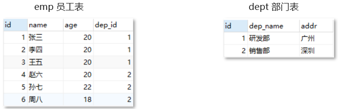

员工表中的dep_id字段是部门表的id字段关联，也就是说1号学生张三属于1号部门研发部的员工。现在我要删除1号部门，就会出现错误的数据（员工表中属于1号部门的数据）。而我们上面说的两张表的关系只是我们认为它们有关系，此时需要通过外键让这两张表产生数据库层面的关系，这样你要删除部门表中的1号部门的数据将无法删除。

#### 1.8.2  语法

* 添加外键约束

```sql
-- 创建表时添加外键约束
CREATE TABLE 表名(
   列名 数据类型,
   …
   [CONSTRAINT] [外键名称] FOREIGN KEY(外键列名) REFERENCES 主表(主表列名)
);
```

```sql
-- 建完表后添加外键约束
ALTER TABLE 表名 ADD CONSTRAINT 外键名称 FOREIGN KEY (外键字段名称) REFERENCES 主表名称(主表列名称);
```

* 删除外键约束

```sql
ALTER TABLE 表名 DROP FOREIGN KEY 外键名称;
```


#### 1.8.3  练习

根据上述语法创建员工表和部门表，并添加上外键约束：

```sql
-- 删除表
DROP TABLE IF EXISTS emp;
DROP TABLE IF EXISTS dept;

-- 部门表
CREATE TABLE dept(
	id int primary key auto_increment,
	dep_name varchar(20),
	addr varchar(20)
);
-- 员工表
CREATE TABLE emp(
	id int primary key auto_increment,
	name varchar(20),
	age int,
	dep_id int,

	-- 添加外键 dep_id,关联 dept 表的id主键
	CONSTRAINT fk_emp_dept FOREIGN KEY(dep_id) REFERENCES dept(id)
);
```

添加数据

```sql
-- 添加 2 个部门
insert into dept(dep_name,addr) values
('研发部','广州'),('销售部', '深圳');

-- 添加员工,dep_id 表示员工所在的部门
INSERT INTO emp (NAME, age, dep_id) VALUES
('张三', 20, 1),
('李四', 20, 1),
('王五', 20, 1),
('赵六', 20, 2),
('孙七', 22, 2),
('周八', 18, 2);
```

此时删除 `研发部` 这条数据，会发现无法删除。

删除外键

```sql
alter table emp drop FOREIGN key fk_emp_dept;
```

重新添加外键

```sql
alter table emp add CONSTRAINT fk_emp_dept FOREIGN key(dep_id) REFERENCES dept(id);
```


## 数据库设计

### 2.1  数据库设计简介

* 软件的研发步骤

  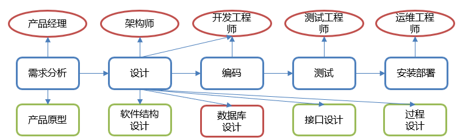

* 数据库设计概念

  * 数据库设计就是根据业务系统的具体需求，结合我们所选用的DBMS(数据库管理系统)，为这个业务系统构造出最优的数据存储模型。
  * 建立数据库中的==表结构==以及==表与表之间的关联关系==的过程。
  * 有哪些表？表里有哪些字段？表和表之间有什么关系？

* 数据库设计的步骤

  * 需求分析（数据是什么? 数据具有哪些属性? 数据与属性的特点是什么）

  * 逻辑分析（通过ER图对数据库进行逻辑建模，不需要考虑我们所选用的数据库管理系统）

    如下图就是ER(Entity/Relation)图：

    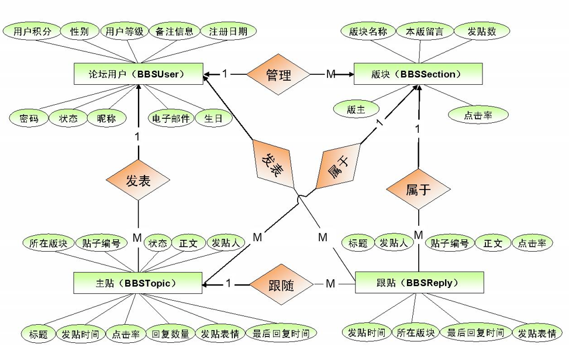

  * 物理设计（根据数据库自身的特点把逻辑设计转换为物理设计）

  * 维护设计（1.对新的需求进行建表；2.表优化）

* 表关系

  * 一对一

    * 如：用户 和 用户详情
    * **一对一关系多用于表拆分，将一个实体中经常使用的字段放一张表，不经常使用的字段放另一张表，用于提升查询性能**

    

    上图左边是用户的详细信息，而我们真正在展示用户信息时最长用的则是上图右边红框所示，所以我们会将详细信息查分成两周那个表。

  * 一对多

    * 如：部门 和 员工

    * 一个部门对应多个员工，一个员工对应一个部门。如下图：

      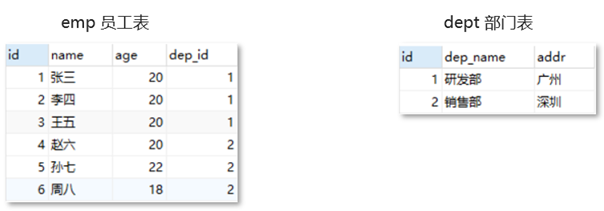

  * 多对多

    * 如：商品 和 订单

    * 一个商品对应多个订单，一个订单包含多个商品。如下图：

      

### 2.2  表关系(一对多)

* 一对多

  * 如：部门 和 员工
  * 一个部门对应多个员工，一个员工对应一个部门。

* 实现方式

  ==在多的一方建立外键，指向一的一方的主键==

* 案例

  我们还是以 `员工表` 和 `部门表` 举例:

  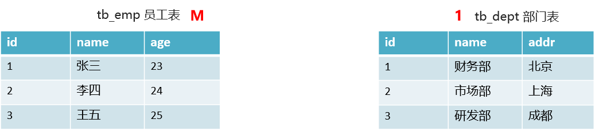

  经过分析发现，员工表属于多的一方，而部门表属于一的一方，此时我们会在员工表中添加一列（dep_id），指向于部门表的主键（id）：

  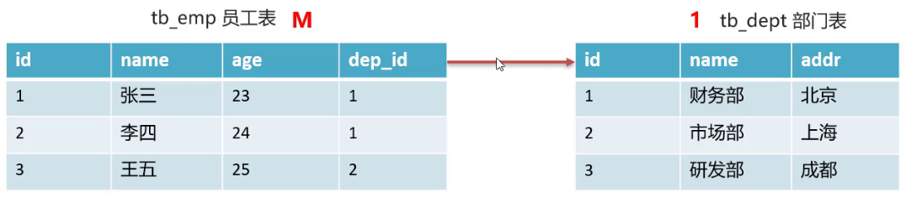

  建表语句如下：

  ```sql
  -- 删除表
  DROP TABLE IF EXISTS tb_emp;
  DROP TABLE IF EXISTS tb_dept;

  -- 部门表
  CREATE TABLE tb_dept(
	id int primary key auto_increment,
	dep_name varchar(20),
	addr varchar(20)
  );
  -- 员工表
  CREATE TABLE tb_emp(
	id int primary key auto_increment,
	name varchar(20),
	age int,
	dep_id int,

	-- 添加外键 dep_id,关联 dept 表的id主键
	CONSTRAINT fk_emp_dept FOREIGN KEY(dep_id) REFERENCES tb_dept(id)
  );
  ```

  查看表结构模型图：

  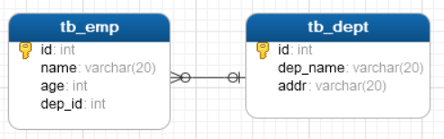

### 2.3  表关系(多对多)

* 多对多

  * 如：商品 和 订单
  * 一个商品对应多个订单，一个订单包含多个商品

* 实现方式

  **==建立第三张中间表，中间表至少包含两个外键，分别关联两方主键==**

* 案例

  我们以 `订单表` 和 `商品表` 举例：

  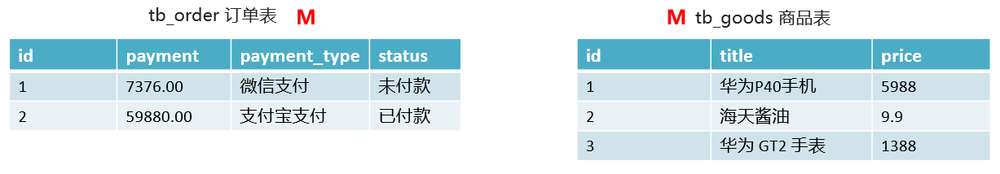

  经过分析发现，订单表和商品表都属于多的一方，此时需要创建一个中间表，在中间表中添加订单表的外键和商品表的外键指向两张表的主键：

  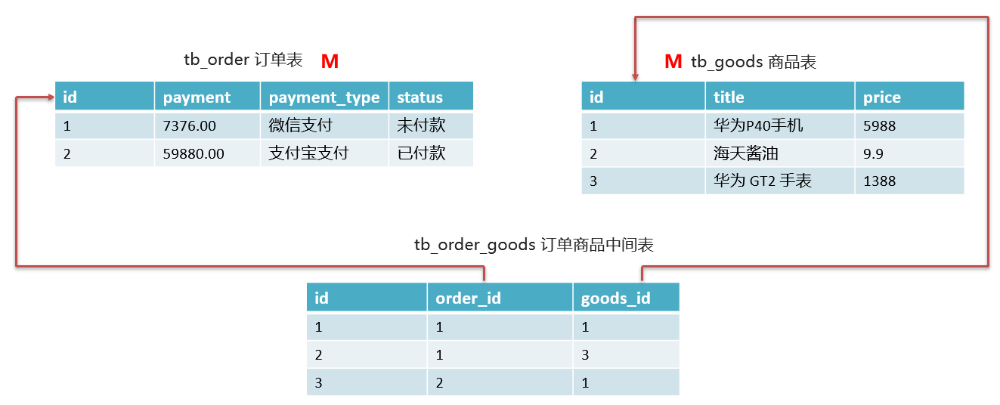

  建表语句如下：

  ```sql
  -- 删除表
  DROP TABLE IF EXISTS tb_order_goods;
  DROP TABLE IF EXISTS tb_order;
  DROP TABLE IF EXISTS tb_goods;

  -- 订单表
  CREATE TABLE tb_order(
	id int primary key auto_increment,
	payment double(10,2),
	payment_type TINYINT,
	status TINYINT
  );

  -- 商品表
  CREATE TABLE tb_goods(
	id int primary key auto_increment,
	title varchar(100),
	price double(10,2)
  );

  -- 订单商品中间表
  CREATE TABLE tb_order_goods(
	id int primary key auto_increment,
	order_id int,
	goods_id int,
	count int
  );

  -- 建完表后，添加外键
  alter table tb_order_goods add CONSTRAINT fk_order_id FOREIGN key(order_id) REFERENCES tb_order(id);
  alter table tb_order_goods add CONSTRAINT fk_goods_id FOREIGN key(goods_id) REFERENCES tb_goods(id);
  ```

  查看表结构模型图：

  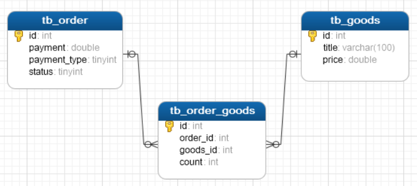

### 2.4  表关系(一对一)

* 一对一

  * 如：用户 和 用户详情
  * 一对一关系多用于表拆分，将一个实体中经常使用的字段放一张表，不经常使用的字段放另一张表，用于提升查询性能

* 实现方式

  ==在任意一方加入外键，关联另一方主键，并且设置外键为唯一(UNIQUE)==

* 案例

  我们以 `用户表` 举例：

  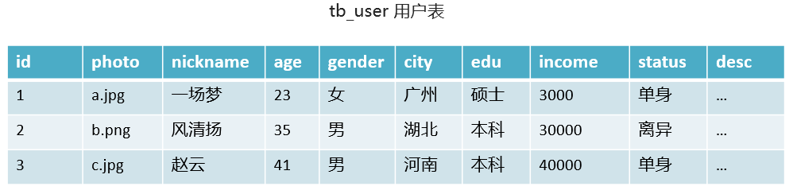

  而在真正使用过程中发现 id、photo、nickname、age、gender 字段比较常用，此时就可以将这张表查分成两张表。

​	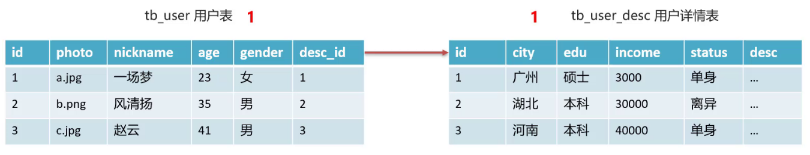

​

​	建表语句如下：

```sql
create table tb_user_desc (
	id int primary key auto_increment,
	city varchar(20),
	edu varchar(10),
	income int,
	status char(2),
	des varchar(100)
);

create table tb_user (
	id int primary key auto_increment,
	photo varchar(100),
	nickname varchar(50),
	age int,
	gender char(1),
	desc_id int unique,
	-- 添加外键
	CONSTRAINT fk_user_desc FOREIGN KEY(desc_id) REFERENCES tb_user_desc(id)
);
```

​	查看表结构模型图：

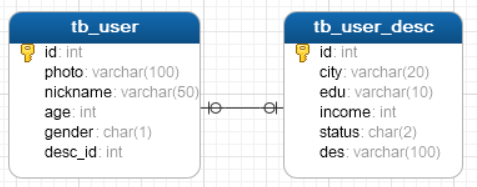


### 2.5  数据库设计案例

根据下图设计表及表和表之间的关系：


经过分析，我们分为 `专辑表`  `曲目表`  `短评表`  `用户表`   4张表。

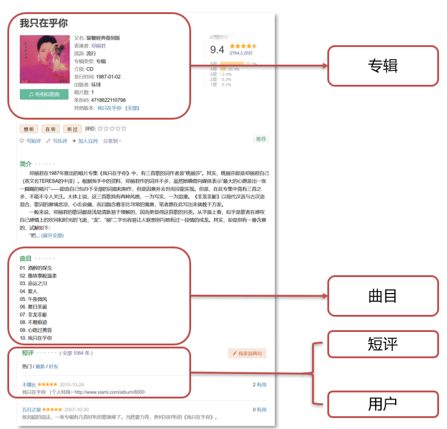

一个专辑可以有多个曲目，一个曲目只能属于某一张专辑，所以专辑表和曲目表的关系是==一对多==。

一个专辑可以被多个用户进行评论，一个用户可以对多个专辑进行评论，所以专辑表和用户表的关系是 ==多对多==。

一个用户可以发多个短评，一个短评只能是某一个人发的，所以用户表和短评表的关系是 ==一对多==。

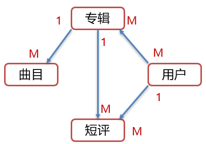


### 3.3  子查询

* 概念

  ==查询中嵌套查询，称嵌套查询为子查询。==

  什么是查询中嵌套查询呢？我们通过一个例子来看：

  **需求：查询工资高于猪八戒的员工信息。**

  来实现这个需求，我们就可以通过二步实现，第一步：先查询出来 猪八戒的工资

  ```sql
  select salary from emp where name = '猪八戒'
  ```

   第二步：查询工资高于猪八戒的员工信息

  ```sql
  select * from emp where salary > 3600;
  ```

  第二步中的3600可以通过第一步的sql查询出来，所以将3600用第一步的sql语句进行替换

  ```sql
  select * from emp where salary > (select salary from emp where name = '猪八戒');
  ```

  这就是查询语句中嵌套查询语句。

* 子查询根据查询结果不同，作用不同

  * 子查询语句结果是单行单列，子查询语句作为条件值，使用 =  !=  >  <  等进行条件判断
  * 子查询语句结果是多行单列，子查询语句作为条件值，使用 in 等关键字进行条件判断
  * 子查询语句结果是多行多列，子查询语句作为虚拟表

* 案例

  * 查询 '财务部' 和 '市场部' 所有的员工信息

    ```sql
    -- 查询 '财务部' 或者 '市场部' 所有的员工的部门did
    select did from dept where dname = '财务部' or dname = '市场部';

    select * from emp where dep_id in (select did from dept where dname = '财务部' or dname = '市场部');
    ```

  * 查询入职日期是 '2011-11-11' 之后的员工信息和部门信息

    ```sql
    -- 查询入职日期是 '2011-11-11' 之后的员工信息
    select * from emp where join_date > '2011-11-11' ;
    -- 将上面语句的结果作为虚拟表和dept表进行内连接查询
    select * from (select * from emp where join_date > '2011-11-11' ) t1, dept where t1.dep_id = dept.did;
    ```


### 3.4  案例

* 环境准备：

```sql
DROP TABLE IF EXISTS emp;
DROP TABLE IF EXISTS dept;
DROP TABLE IF EXISTS job;
DROP TABLE IF EXISTS salarygrade;

-- 部门表
CREATE TABLE dept (
  did INT PRIMARY KEY PRIMARY KEY, -- 部门id
  dname VARCHAR(50), -- 部门名称
  loc VARCHAR(50) -- 部门所在地
);

-- 职务表，职务名称，职务描述
CREATE TABLE job (
  id INT PRIMARY KEY,
  jname VARCHAR(20),
  description VARCHAR(50)
);

-- 员工表
CREATE TABLE emp (
  id INT PRIMARY KEY, -- 员工id
  ename VARCHAR(50), -- 员工姓名
  job_id INT, -- 职务id
  mgr INT , -- 上级领导
  joindate DATE, -- 入职日期
  salary DECIMAL(7,2), -- 工资
  bonus DECIMAL(7,2), -- 奖金
  dept_id INT, -- 所在部门编号
  CONSTRAINT emp_jobid_ref_job_id_fk FOREIGN KEY (job_id) REFERENCES job (id),
  CONSTRAINT emp_deptid_ref_dept_id_fk FOREIGN KEY (dept_id) REFERENCES dept (id)
);
-- 工资等级表
CREATE TABLE salarygrade (
  grade INT PRIMARY KEY,   -- 级别
  losalary INT,  -- 最低工资
  hisalary INT -- 最高工资
);

-- 添加4个部门
INSERT INTO dept(did,dname,loc) VALUES
(10,'教研部','北京'),
(20,'学工部','上海'),
(30,'销售部','广州'),
(40,'财务部','深圳');

-- 添加4个职务
INSERT INTO job (id, jname, description) VALUES
(1, '董事长', '管理整个公司，接单'),
(2, '经理', '管理部门员工'),
(3, '销售员', '向客人推销产品'),
(4, '文员', '使用办公软件');


-- 添加员工
INSERT INTO emp(id,ename,job_id,mgr,joindate,salary,bonus,dept_id) VALUES
(1001,'孙悟空',4,1004,'2000-12-17','8000.00',NULL,20),
(1002,'卢俊义',3,1006,'2001-02-20','16000.00','3000.00',30),
(1003,'林冲',3,1006,'2001-02-22','12500.00','5000.00',30),
(1004,'唐僧',2,1009,'2001-04-02','29750.00',NULL,20),
(1005,'李逵',4,1006,'2001-09-28','12500.00','14000.00',30),
(1006,'宋江',2,1009,'2001-05-01','28500.00',NULL,30),
(1007,'刘备',2,1009,'2001-09-01','24500.00',NULL,10),
(1008,'猪八戒',4,1004,'2007-04-19','30000.00',NULL,20),
(1009,'罗贯中',1,NULL,'2001-11-17','50000.00',NULL,10),
(1010,'吴用',3,1006,'2001-09-08','15000.00','0.00',30),
(1011,'沙僧',4,1004,'2007-05-23','11000.00',NULL,20),
(1012,'李逵',4,1006,'2001-12-03','9500.00',NULL,30),
(1013,'小白龙',4,1004,'2001-12-03','30000.00',NULL,20),
(1014,'关羽',4,1007,'2002-01-23','13000.00',NULL,10);


-- 添加5个工资等级
INSERT INTO salarygrade(grade,losalary,hisalary) VALUES
(1,7000,12000),
(2,12010,14000),
(3,14010,20000),
(4,20010,30000),
(5,30010,99990);
```

* 需求

  1. 查询所有员工信息。查询员工编号，员工姓名，工资，职务名称，职务描述

     ```sql
     /*
	分析：
		1. 员工编号，员工姓名，工资 信息在emp 员工表中
		2. 职务名称，职务描述 信息在 job 职务表中
		3. job 职务表 和 emp 员工表 是 一对多的关系 emp.job_id = job.id
     */
     -- 方式一 ：隐式内连接
     SELECT
	emp.id,
	emp.ename,
	emp.salary,
	job.jname,
	job.description
     FROM
	emp,
	job
     WHERE
	emp.job_id = job.id;

     -- 方式二 ：显式内连接
     SELECT
	emp.id,
	emp.ename,
	emp.salary,
	job.jname,
	job.description
     FROM
	emp
     INNER JOIN job ON emp.job_id = job.id;
     ```

  2. 查询员工编号，员工姓名，工资，职务名称，职务描述，部门名称，部门位置

     ```sql
     /*
	分析：
		1. 员工编号，员工姓名，工资 信息在emp 员工表中
		2. 职务名称，职务描述 信息在 job 职务表中
		3. job 职务表 和 emp 员工表 是 一对多的关系 emp.job_id = job.id

		4. 部门名称，部门位置 来自于 部门表 dept
		5. dept 和 emp 一对多关系 dept.id = emp.dept_id
     */

     -- 方式一 ：隐式内连接
     SELECT
	emp.id,
	emp.ename,
	emp.salary,
	job.jname,
	job.description,
	dept.dname,
	dept.loc
     FROM
	emp,
	job,
	dept
     WHERE
	emp.job_id = job.id
	and dept.id = emp.dept_id
     ;

     -- 方式二 ：显式内连接
     SELECT
	emp.id,
	emp.ename,
	emp.salary,
	job.jname,
	job.description,
	dept.dname,
	dept.loc
     FROM
	emp
     INNER JOIN job ON emp.job_id = job.id
     INNER JOIN dept ON dept.id = emp.dept_id
     ```

  3. 查询员工姓名，工资，工资等级

     ```sql
     /*
	分析：
		1. 员工姓名，工资 信息在emp 员工表中
		2. 工资等级 信息在 salarygrade 工资等级表中
		3. emp.salary >= salarygrade.losalary  and emp.salary <= salarygrade.hisalary
     */
     SELECT
	emp.ename,
	emp.salary,
	t2.*
     FROM
	emp,
	salarygrade t2
     WHERE
	emp.salary >= t2.losalary
     AND emp.salary <= t2.hisalary
     -- between t2.losalart and t2.hisalary
     ```

   ```

   ```

4. 查询员工姓名，工资，职务名称，职务描述，部门名称，部门位置，工资等级

   ```sql
   /*
	分析：
		1. 员工编号，员工姓名，工资 信息在emp 员工表中
		2. 职务名称，职务描述 信息在 job 职务表中
		3. job 职务表 和 emp 员工表 是 一对多的关系 emp.job_id = job.id

		4. 部门名称，部门位置 来自于 部门表 dept
		5. dept 和 emp 一对多关系 dept.id = emp.dept_id
		6. 工资等级 信息在 salarygrade 工资等级表中
		7. emp.salary >= salarygrade.losalary  and emp.salary <= salarygrade.hisalary
   */
   SELECT
	emp.id,
	emp.ename,
	emp.salary,
	job.jname,
	job.description,
	dept.dname,
	dept.loc,
	t2.grade
   FROM
	emp
   INNER JOIN job ON emp.job_id = job.id
   INNER JOIN dept ON dept.id = emp.dept_id
   INNER JOIN salarygrade t2 ON emp.salary BETWEEN t2.losalary and t2.hisalary;
   ```

5. 查询出部门编号、部门名称、部门位置、部门人数

   ```sql
   /*
	分析：
		1. 部门编号、部门名称、部门位置 来自于部门 dept 表
		2. 部门人数: 在emp表中 按照dept_id 进行分组，然后count(*)统计数量
		3. 使用子查询，让部门表和分组后的表进行内连接
   */
   -- 根据部门id分组查询每一个部门id和员工数
   select dept_id, count(*) from emp group by dept_id;

   SELECT
	dept.id,
	dept.dname,
	dept.loc,
	t1.count
   FROM
	dept,
	(
		SELECT
			dept_id,
			count(*) count
		FROM
			emp
		GROUP BY
			dept_id
	) t1
   WHERE
	dept.id = t1.dept_id
   ```
