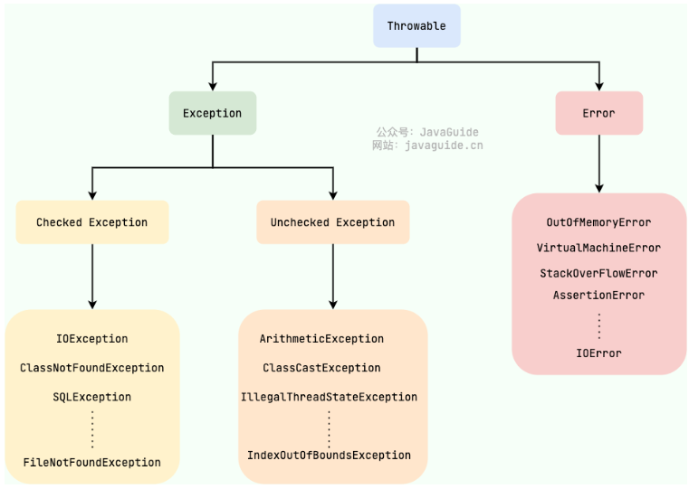

[toc]


# Java 基础面试题

## 基础概念与常识

### Java语言有哪些特点?

1. **面向对象：封装，继承，多态。**
2. **平台无关性/跨平台： Java 虚拟机实现平台无关性，一次编译，到处运行。**
3. **支持多线程：C++ 语言没有内置的多线程机制，因此必须调用操作系统的多线程功能来进行多线程程序设计，而 Java 语言却提供了多线程支持。**
4. **编译与解释并存，支持 JIT 编译，也就是即时编译器，它可以在程序运行时将字节码转换为热点机器码来提高程序的运行速度。**
5. **可靠性：具备异常处理和自动垃圾回收机制**。

### 什么是跨平台？原理是什么？

- 所谓的跨平台，是指 Java 语言编写的程序，一次编译后，可以在多个操作系统上运行。

- 原理是增加了一个中间件 JVM，JVM 负责将 Java 字节码转换为特定平台的机器码指令，并交给对应的操作系统去执行。

### Java SE vs Java EE

Java SE 是 Java 的基础版本，Java SE 更适合开发桌面应用程序或简单的服务器应用程序。

Java EE 是 Java 的高级版本，Java EE 更适合开发复杂的企业级应用程序或 Web 应用程序。

Java ME 是 Java 的微型版本，主要用于开发嵌入式消费电子设备的应用程序，例如手机、PDA、机顶盒、冰箱、空调等。

### Java 程序从源码到运行的流程

**Java 程序从源代码到运行需要经过三步：**

- **编译**：将 `.java` 源代码文件编译为 JVM 可识别的 `.class` 字节码文件；
- **解释**：JVM 执行字节码文件，将其翻译为操作系统可识别的机器码；
- **执行**：操作系统执行二进制的机器码。

### JDK、JRE、JVM 与 JIT 的关系

**简单来说：JRE 只包含运行 Java 程序所需的环境和核心类库，而 JDK 不仅包含 JRE，还包括用于开发和调试 Java 程序的工具。**

**具体来说：**

- **JVM**是 Java 虚拟机，是执行字节码的核心引擎，是Java 实现跨平台的基础。它负责将Java字节码（由Java编译器生成）解释或编译成机器码，并执行程序。JVM提供了内存管理、垃圾回收、安全性等功能。

- **JRE**是 Java 运行时环境，包含 JVM 及运行 Java 程序所需的核心类库（如`java.lang`包），是运行 Java 程序的最小环境。

- **JDK**简称Java开发工具包，为开发者提供了开发、编译、调试 Java 程序的一整套环境，它包含 JRE 及编译器（`javac`）、调试工具`jdb`等开发组件(如 javadoc（文档生成器）、jconsole（监控工具）、javap（反编译工具）等）。

- **JIT是即时编译器**，是 JVM 的一部分，负责在程序运行时将「热点代码」（频繁执行的方法或代码块）直接编译为机器码并缓存。相比 JVM 解释器逐行翻译字节码的方式，JIT 能显著提升执行效率。

### 什么是字节码？

字节码是 Java 源代码编译后的中间代码，即后缀名为 `.class` 的文件，**它是 Java 虚拟机（JVM）能够直接理解的语言，不依赖于特定的操作系统或硬件架构**，也不面向任何具体处理器，仅面向 JVM 规范。

### ☘️采用字节码的好处？

采用字节码的核心优势体现在两方面：

- **跨平台性**：同一套字节码可在任何安装了 JVM 的系统上运行（"一次编写，到处运行"），解决了传统编译型语言需为不同平台单独编译的问题。
- **性能平衡**：相比纯解释型语言（如 Python），字节码通过预编译减少了**运行时的解析成本**；相比纯编译型语言（如 C++），又保留了动态解释的灵活性，再结合`JIT`对热点代码的编译优化，实现了可移植性与执行效率的平衡。

### ☘️为什么说 Java 是 "编译与解释并存" 的语言？

编程语言按执行方式可分为两类：

- **编译型**（如 C、C++、Go）：**源代码在运行前通过编译器一次性转换为机器码**，执行速度快但跨平台性差。
- **解释型**（如 Python、JavaScript）：**源代码在运行时由解释器逐行转换为机器码**，跨平台性好但执行速度慢。

Java的特殊之处在于结合了两者的特点：

- 运行前，先通过JDK提供的编译指令`javac`将源代码**编译**为字节码（类似编译型语言的预编译过程）；
- 运行时，JVM先通过**解释器**逐行执行字节码（类似解释型语言），同时通过 **即时编译器JIT** 对热点代码进行**即时编译**，**直接生成机器码缓存复用**（类似编译型语言）。

因此，Java 程序的执行过程是 "编译（静态）+ 解释 + 即时编译（动态）" 的结合体，这也是它被称为 "编译与解释并存" 语言的核心原因。

### Java 和 C++ 的区别?

虽然，Java 和 C++ 都是面向对象的语言，都支持封装、继承和多态，但是，它们还是有挺多不相同的地方：

- **Java 不提供指针来直接访问内存，程序内存更加安全。**
- **Java 的类是单继承的，C++ 支持多重继承；虽然 Java 的类不可以多继承，但是接口可以多继承。**
- **Java 有自动内存管理垃圾回收机制(GC)，不需要程序员手动释放无用内存。**
- **C++同时支持方法重载和操作符重载，但是 Java 只支持方法重载**，操作符重载增加Java的复杂性，这与 Java 最初的设计思想不符。

## 基本语法

### 注释有哪几种形式？

Java中的注释有三种：

1. **单行注释**：通常用于解释方法内某单行代码的作用。
2. **多行注释**：通常用于解释一段代码的作用。
3. **文档注释**：通常用于生成 Java 开发文档。

用的比较多的还是单行注释和文档注释，多行注释在实际开发中使用的相对较少。

### 标识符和关键字的区别是什么？

**标识符**就是一个名字，当编写程序时，我们给程序、类、变量、方法等取的名字，都属于标识符。

**关键字则是被赋予特殊含义的标识符**，它有固定用途，只能用在特定的地方。

### Java 语言关键字有哪些？

| 分类                 | 关键字   |            |          |              |            |           |        |
| :------------------- | -------- | ---------- | -------- | ------------ | ---------- | --------- | ------ |
| 访问控制             | private  | protected  | public   | default      |            |           |        |
| 类，方法和变量修饰符 | abstract | class      | extends  | final        | implements | interface | native |
|                      | new      | static     | strictfp | synchronized | transient  | volatile  | enum   |
| 程序控制             | break    | continue   | return   | do           | while      | if        | else   |
|                      | for      | instanceof | switch   | case         | default    | assert    |        |
| 异常处理             | try      | catch      | throw    | throws       | finally    |           |        |
| 包相关               | import   | package    |          |              |            |           |        |
| 基本类型             | boolean  | byte       | char     | double       | float      | int       | long   |
|                      | short    |            |          |              |            |           |        |
| 变量引用             | super    | this       | void     |              |            |           |        |
| 保留字               | goto     | const      |          |              |            |           |        |

> Tips：所有的关键字都是小写的，在 IDE 中会以特殊颜色显示。
>
> `default` 这个关键字很特殊，既属于程序控制，也属于类，方法和变量修饰符，还属于访问控制。
>
> - 在程序控制中，当在 `switch` 中匹配不到任何情况时，可以使用 `default` 来编写默认匹配的情况。
> - 在类，方法和变量修饰符中，从 JDK8 开始引入了默认方法，可以使用 `default` 关键字来定义一个方法的默认实现。
> - 在访问控制中，如果一个方法前没有任何修饰符，则默认会有一个修饰符 `default`，但是这个修饰符加上了就会报错。

⚠️ 注意：虽然 `true`, `false`, 和 `null` 看起来像关键字但实际上他们是字面值，同时你也不可以作为标识符来使用。

### 自增自减运算符

在写代码的过程中，常见的一种情况是需要某个整数类型变量增加 1 或减少 1。Java 提供了自增运算符 (`++`) 和自减运算符 (`--`) 来简化这种操作。

`++` 和 `--` 运算符可以放在变量之前，也可以放在变量之后：

- **前缀形式**（例如 `++a` 或 `--a`）：先自增/自减变量的值，然后再使用该变量。
- **后缀形式**（例如 `a++` 或 `a--`）：先使用变量的当前值，然后再自增/自减变量的值。

为了方便记忆，可以使用下面的口诀：**符号在前就先加/减，符号在后就后加/减**。

### 移位运算符

移位运算符是最基本的运算符之一，几乎每种编程语言都包含这一运算符。移位操作中，被操作的数据被视为二进制数，移位就是将其向左或向右移动若干位的运算。

移位运算符在各种框架以及 JDK 自身的源码中使用还是挺广泛的，`HashMap`（JDK1.8） 中的 `hash` 方法的源码就用到了移位运算符：

```java
static final int hash(Object key) {
    int h;
    // key.hashCode()：返回散列值也就是hashcode
    // ^：按位异或
    // >>>:无符号右移，忽略符号位，空位都以0补齐
    return (key == null) ? 0 : (h = key.hashCode()) ^ (h >>> 16);
  }
```

Java 中有三种移位运算符：

- `<<` :左移运算符，向左移若干位，高位丢弃，低位补零。`x << n`,相当于 x 乘以 2 的 n 次方(不溢出的情况下)。
- `>>` :带符号右移，向右移若干位，高位补符号位，低位丢弃。正数高位补 0,负数高位补 1。`x >> n`,相当于 x 除以 2 的 n 次方。
- `>>>` :无符号右移，忽略符号位，空位都以 0 补齐。

虽然移位运算本质上可以分为左移和右移，但在实际应用中，右移操作需要考虑符号位的处理方式。

由于 `double`，`float` 在二进制中的表现比较特殊，因此不能来进行移位操作。

移位操作符实际上支持的类型只有`int`和`long`，编译器在对`short`、`byte`、`char`类型进行移位前，都会将其转换为`int`类型再操作。

**使用移位运算符的主要原因**：

1. **高效**：移位运算符直接对应于处理器的移位指令。现代处理器具有专门的硬件指令来执行这些移位操作，这些指令通常在一个时钟周期内完成。相比之下，乘法和除法等算术运算在硬件层面上需要更多的时钟周期来完成。
2. **节省内存**：通过移位操作，可以使用一个整数（如 `int` 或 `long`）来存储多个布尔值或标志位，从而节省内存。

移位运算符最常用于快速乘以或除以 2 的幂次方。除此之外，它还在以下方面发挥着重要作用：

- **位字段管理**：例如存储和操作多个布尔值。
- **哈希算法和加密解密**：通过移位和与、或等操作来混淆数据。
- **数据压缩**：例如霍夫曼编码通过移位运算符可以快速处理和操作二进制数据，以生成紧凑的压缩格式。
- **数据校验**：例如 CRC（循环冗余校验）通过移位和多项式除法生成和校验数据完整性。。
- **内存对齐**：通过移位操作，可以轻松计算和调整数据的对齐地址。

掌握最基本的移位运算符知识还是很有必要的，这不光可以帮助我们在代码中使用，还可以帮助我们理解源码中涉及到移位运算符的代码。

#### 如果移位的位数超过数值所占有的位数会怎样？

当 int 类型左移/右移位数大于等于 32 位操作时，会先求余（%）后再进行左移/右移操作。也就是说左移/右移 32 位相当于不进行移位操作（32%32=0），左移/右移 42 位相当于左移/右移 10 位（42%32=10）。当 long 类型进行左移/右移操作时，由于 long 对应的二进制是 64 位，因此求余操作的基数也变成了 64。

也就是说：`x<<42`等同于`x<<10`，`x>>42`等同于`x>>10`，`x >>>42`等同于`x >>> 10`。

**左移运算符代码示例**：

```java
int i = -1;
System.out.println("初始数据：" + i);
System.out.println("初始数据对应的二进制字符串：" + Integer.toBinaryString(i));
i <<= 10;
System.out.println("左移 10 位后的数据 " + i);
System.out.println("左移 10 位后的数据对应的二进制字符 " + Integer.toBinaryString(i));
```

输出：

```java
初始数据：-1
初始数据对应的二进制字符串：11111111111111111111111111111111
左移 10 位后的数据 -1024
左移 10 位后的数据对应的二进制字符 11111111111111111111110000000000
```

由于左移位数大于等于 32 位操作时，会先求余（%）后再进行左移操作，所以下面的代码左移 42 位相当于左移 10 位（42%32=10），输出结果和前面的代码一样。

```java
int i = -1;
System.out.println("初始数据：" + i);
System.out.println("初始数据对应的二进制字符串：" + Integer.toBinaryString(i));
i <<= 42;
System.out.println("左移 10 位后的数据 " + i);
System.out.println("左移 10 位后的数据对应的二进制字符 " + Integer.toBinaryString(i));
```

### continue、break 和 return 的区别是什么？

**在循环结构中，当循环条件不满足或者循环次数达到要求时，循环会正常结束**。但是，有时候可能需要在循环的过程中，当发生了某种条件之后 ，提前终止循环，这就需要用到下面几个关键词：

1. `continue`：指跳出当前的这一次循环，继续下一次循环。
2. `break`：指跳出整个循环体，继续执行循环下面的语句。

**`return` 用于跳出所在方法，结束该方法的运行**。return 一般有两种用法：

1. `return;`：直接使用 return 结束方法执行，用于没有返回值函数的方法
2. `return value;`：return 一个特定值，用于有返回值函数的方法

### &和&&有什么区别？

**`&` 是 逻辑与。**

**`&&`是短路与运算。逻辑与跟短路与的差别是非常大的，虽然二者都要求运算符左右两端的布尔值都是 true，整个表达式的值才是 true。**

**`&&`之所以称为短路运算是因为，如果`&&`左边的表达式的值是 false，右边的表达式会直接短路掉，不会进行运算。**

**注意**：逻辑或运算符（`|`）和短路或运算符（`||`）的差别也是类似。

### Java中static、final、static final的区别

#### static修饰符

- **修饰元素：变量、方法、代码块、内部类，不能修饰局部变量**
  - 变量：静态变量，类级别变量，所有实例共享同一份数据。
  - 方法：静态方法，类级别方法，与实例无关。
  - 代码块：用于在类加载时初始化一些数据，只执行一次。
  - 内部类：与外部类绑定但独立于外部类实例。
- **static：强调共享性，修饰的变量、方法、代码块属于类本身，不依赖于具体对象，而this、super与具体对象有关，因此static不能与this、super一起使用。**

#### final修饰符

- **修饰元素**：类、方法、变量
    - **修饰变量**：
        - **修饰基本数据类型的变量时，则变量一旦被赋值就不能再改变**。例如，`final int num = 10;`，这里的`num`就是一个常量，不能再对其进行重新赋值操作，否则会导致编译错误。
        - **修饰引用数据类型时，则这个引用变量不能再指向其他对象，但对象本身的内容是可以改变的**。例如，`final StringBuilder sb = new StringBuilder("Hello");`，不能让`sb`再指向其他`StringBuilder`对象，但可以通过`sb.append(" World");`来修改字符串的内容。

    - **修饰方法**：用`final`修饰的方法不能在子类中被重写。
    - **修饰类**：当`final`修饰一个类时，表示这个类不能被继承，是类继承体系中的最终形态。例如，Java 中的`String`类就是用`final`修饰的，这保证了`String`类的不可变性和安全性，防止其他类通过继承来改变`String`类的行为和特性。

- **final：强调不可变性，修饰的变量、方法、类在初始化后不能被修改或重写。**

#### static final修饰符

- **修饰元素**：属性、方法
  - **修饰属性**：一旦赋值，就不可修改，可以通过类名访问。
  - **修饰方法**：不能被重写，可以通过类名调用。


- **static final**：结合了static和final的特性，修饰的属性是类级别的常量，方法是不能重写的类方法。

### final、finally、finalize 的区别？

①、final 是一个修饰符，可以修饰类、方法和变量。当 final 修饰一个类时，表明这个类不能被继承；当 final 修饰一个方法时，表明这个方法不能被重写；当 final 修饰一个变量时，表明这个变量是个常量，一旦赋值后，就不能再被修改了。

②、finally 是 Java 中异常处理中的一个关键字，用来创建 try 块后面的 finally 块。无论 try 块中的代码是否抛出异常，finally 块中的代码总是会被执行。通常，finally 块被用来释放资源，如关闭文件、数据库连接等。

③、finalize 是Object 类的一个方法，用于在垃圾回收器将对象从内存中释放之前做一些必要的清理工作。这个方法在垃圾回收器准备释放对象占用的内存之前被自动调用。我们不能显式地调用 finalize 方法，因为它总是由垃圾回收器在适当的时间自动调用。

## 基本数据类型

### Java中有哪些数据类型

Java 的数据类型可以分为两种：**基本数据类型**和**引用数据类型**

- 8 种基本数据类型，分别为：

  - 6 种数字类型：
    - 4 种整数型：`byte`、`short`、`int`、`long`
    - 2 种浮点型：`float`、`double`

  - 1 种字符类型：`char`

  - 1 种布尔型：`boolean`


- 引用数据类型有：

  - 类

  - 接口

  - 数组

这 8 种基本数据类型的默认值以及所占空间的大小如下：

| 基本类型  | 位数 | 字节 | 默认值  | 取值范围                                                     |
| :-------- | :--- | :--- | :------ | ------------------------------------------------------------ |
| `byte`    | 8    | 1    | 0       | `-128 ~ 127`                                                 |
| `short`   | 16   | 2    | 0       | `-32768（-2^15） ~ 32767（2^15 - 1）`                        |
| `int`     | 32   | 4    | 0       | `-2147483648 ~ 2147483647`                                   |
| `long`    | 64   | 8    | 0L      | `-9223372036854775808（-2^63） ~ 9223372036854775807（2^63 -1）` |
| `char`    | 16   | 2    | 'u0000' | `0 ~ 65535（2^16 - 1）`                                      |
| `float`   | 32   | 4    | 0f      | `1.4E-45 ~ 3.4028235E38`                                     |
| `double`  | 64   | 8    | 0d      | `4.9E-324 ~ 1.7976931348623157E308`                          |
| `boolean` | 1    |      | false   | `true、false`                                                |

注意事项：

- Java 里使用 `long` 类型的数据一定要在数值后面加上 **L**，否则将作为整型解析。
- Java 里使用 `float` 类型的数据一定要在数值后面加上 **f 或 F**，否则将无法通过编译。
- `char a = 'h'`char :单引号，`String a = "hello"` String:双引号。
- Java 的每种基本类型所占存储空间的大小不会像其他大多数语言那样随机器硬件架构的变化而变化。**这种所占存储空间大小的不变性是 Java 程序比用其他大多数语言编写的程序更具可移植性的原因之一**
- 对于 `boolean`，官方文档未明确定义，它依赖于 JVM 厂商的具体实现。逻辑上理解是占用 1 位，但是实际中会考虑计算机高效存储因素。我本机的 64 位 JDK 中，通过 JOL 工具查看单独的 boolean 类型，以及 boolean 数组，所占用的空间都是 1 个字节。
- 这八种基本类型都有对应的包装类分别为：`Byte`、`Short`、`Integer`、`Long`、`Float`、`Double`、`Character`、`Boolean` 。
- 可以看到，像 `byte`、`short`、`int`、`long`能表示的最大正数都减 1 了，这是为什么呢？这是因为在二进制补码表示法中，最高位是用来表示符号的（0 表示正数，1 表示负数），其余位表示数值部分。所以，如果我们要表示最大的正数，我们需要把除了最高位之外的所有位都设为 1。如果我们再加 1，就会导致溢出，变成一个负数。

#### 给Integer最大值+1，是什么结果？

当给 Integer.MAX_VALUE 加 1 时，会发生溢出，变成 Integer.MIN_VALUE。

这是因为 Java 的整数类型采用的是二进制补码表示法，溢出时值会变成最小值。

- Integer.MAX_VALUE 的二进制表示是 01111111 11111111 11111111 11111111（32 位）。
- 加 1 后结果变成 10000000 00000000 00000000 00000000，即 -2147483648（Integer.MIN_VALUE）。

### 基本类型和包装类型的区别？

- **用途**：除了定义一些常量和局部变量之外，我们在其他地方比如方法参数、对象属性中很少会使用基本类型来定义变量。并且，包装类型可用于泛型，而基本类型不可以。
- **存储方式**：
    - 基本数据类型的局部变量存放在 Java 虚拟机栈中的局部变量表中，基本数据类型的成员变量（未被 `static` 修饰 ）存放在 Java 虚拟机的堆中。
    - 包装类型属于对象类型，我们知道几乎所有对象实例都存在于堆中。

- **占用空间**：相比于包装类型（对象类型）， 基本数据类型占用的空间往往非常小。
- **默认值**：成员变量包装类型不赋值就是 `null` ，而基本类型有默认值且不是 `null`。
- **比较方式**：对于基本数据类型来说，`==` 比较的是值。对于包装数据类型来说，`==` 比较的是对象的内存地址。所有整型包装类对象之间值的比较，全部使用 `equals()` 方法。

### 为什么要有包装类？

在 Java 中设计包装类，核心是为了打通基本数据类型与面向对象体系的衔接，解决两者之间的功能断层问题，主要有三个关键原因：

- **第一，让基本数据类型具备对象特性**。Java 的基本数据类型（如 int、char）是值类型，不是对象，无法拥有方法和属性。而包装类（如 Integer）通过封装，把基本类型的值与操作它的方法绑定，比如 Integer 提供的 parseInt ()（字符串转 int）、toString ()（int 转字符串）等工具方法，避免了开发者重复编写这类基础逻辑，让数据处理更高效。
- **第二，适配集合框架与泛型机制**。Java 的集合（如 ArrayList、HashMap）和泛型只能操作引用类型（对象），无法直接存储基本类型。包装类作为 “桥梁”，让基本类型能以对象形式存入集合，比如`List<Integer>`可以存储 int 值（实际是自动装箱为 Integer 对象），如果没有包装类，基本类型根本无法使用集合这类核心容器。
- **第三，支持 null 值表示 “无意义状态”**。基本类型有默认值（如 int 默认 0），但默认值可能本身就是有效业务数据（比如分数 0 分），无法区分 “未赋值” 和 “值为默认”。而包装类作为引用类型，默认值是 null，能天然表示 “未初始化” 或 “无意义”，这在数据库映射等场景中至关重要（比如数据库字段允许 null 时，用 Integer 而非 int 才能精准匹配）。

简单说，包装类就是为了让基本类型能融入 Java 的面向对象体系，满足方法调用、集合存储、状态表示等实际开发需求。

### ☘️包装类型的缓存机制了解么？

**包装类的缓存机制是指部分包装类（如 Integer、Byte 等）对小范围高频使用的数值提前创建并缓存对象，后续通过`valueOf`方法创建包装类对象或触发自动装箱时，不会重新创建新对象，而是直接复用缓存里的现成对象，这样以减少内存开销和提升性能。**

具体来说：

- `Byte`,`Short`,`Integer`,`Long` 这 4 种包装类默认创建了数值 **[-128，127]** 的相应类型的缓存数据，`Character` 创建了数值在 **[0,127]** 范围的缓存数据，`Boolean` 直接返回 `TRUE` or `FALSE`。
  - 对于 `Integer`，可以通过 JVM 参数 `-XX:AutoBoxCacheMax=<size>` 修改缓存上限，但不能修改下限 -128。实际使用时，并不建议设置过大的值，避免浪费内存，甚至是 OOM。
  - 对于`Byte`,`Short`,`Long` ,`Character` 没有类似 `-XX:AutoBoxCacheMax` 参数可以修改，因此缓存范围是固定的，无法通过 JVM 参数调整。`Boolean` 则直接返回预定义的 `TRUE` 和 `FALSE` 实例，没有缓存范围的概念。

- 两种浮点数类型的包装类 `Float`，`Double` 并没有实现缓存机制。


缓存仅在**使用`valueOf()`方法**或**自动装箱**时生效（自动装箱底层就是调用`valueOf()`）。如果直接用`new`创建包装类对象，会强制生成新对象，不使用缓存。

- 下面我们来看一个问题：下面的代码的输出结果是 `true` 还是 `false` 呢？

  ```java
  Integer i1 = 40;
  Integer i2 = new Integer(40);
  System.out.println(i1==i2);
  //答案：false
  //解释：`Integer i1=40` 这一行代码会发生装箱，也就是说这行代码等价于 `Integer i1=Integer.valueOf(40)` 。因此，`i1` 直接使用的是缓存中的对象。而`Integer i2 = new Integer(40)` 会直接创建新的对象。
  ```

记住：**所有整型包装类对象之间值的比较，全部使用 equals 方法比较**。


### ☘️自动装箱与拆箱了解吗？原理是什么？

- **自动装箱**：Java 会自动将基本数据类型（如 int、char）转换成对应的包装类对象（如 Integer、Character），底层实际调用包装类的`valueOf()`方法。
    - 比如写`Integer num = 10;`时，Java 会自动执行`Integer num = Integer.valueOf(10);`，不用手动通过`new`创建包装类对象。

- **自动拆箱**：Java 会自动将包装类对象（如 Integer、Double）转换成对应的基本数据类型，底层实际调用包装类的`xxxValue()`方法（比如 Integer 的`intValue()`）。
    - 比如写`int val = num;`（其中`num`是 Integer 对象）时，Java 会自动执行`int val = num.intValue();`，不用手动调用拆箱方法。


- **原理：装箱其实就是调用了 包装类的`valueOf()`方法，拆箱其实就是调用了 `xxxValue()`方法。**

注意：**如果频繁拆装箱的话，也会严重影响系统的性能。我们应该尽量避免不必要的拆装箱操作。**

### 自动类型转换、强制类型转换了解吗？数据类型转换方式你知道哪些？

- 自动类型转换（隐式转换）：当目标类型的范围大于源类型时，Java会自动将源类型转换为目标类型，不需要显式的类型转换。例如，将`int`转换为`long`、将`float`转换为`double`等。
- 强制类型转换（显式转换）：当目标类型的范围小于源类型时，需要使用强制类型转换将源类型转换为目标类型。这可能导致数据丢失或溢出。例如，将`long`转换为`int`、将`double`转换为`int`等。语法为：目标类型 变量名 = (目标类型) 源类型。


- 字符串转换：Java提供了将字符串表示的数据转换为其他类型数据的方法。例如，将字符串转换为整型`int`，可以使用`Integer.parseInt()`方法；将字符串转换为浮点型`double`，可以使用`Double.parseDouble()`方法等。
- 数值之间的转换：Java提供了一些数值类型之间的转换方法，如将整型转换为字符型、将字符型转换为整型等。这些转换方式可以通过类型的包装类来实现，例如`Character`类、`Integer`类等提供了相应的转换方法。

#### 判断题

①、`float f=3.4`，对吗？

不正确。3.4 默认是双精度，将双精度赋值给浮点型属于下转型（down-casting，也称窄化）会造成精度丢失，因此需要强制类型转换`float f =(float)3.4;`或者写成`float f =3.4F`

②、`short s1 = 1; s1 = s1 + 1；`对吗？`short s1 = 1; s1 += 1;`对吗？

`short s1 = 1; s1 = s1 + 1;` 会编译出错，由于 1 是 int 类型，因此 s1+1 运算结果也是 int 型，需要强制转换类型才能赋值给 short 型。

而 `short s1 = 1; s1 += 1;`可以正确编译，因为 `s1 += 1;`相当于 `s1 = (short)(s1 + 1);` 其中有隐含的强制类型转换

### 类型互转会出现什么问题吗？

- 数据丢失：当将一个范围较大的数据类型转换为一个范围较小的数据类型时，可能会发生数据丢失。例如，将一个`long`类型的值转换为`int`类型时，如果`long`值超出了`int`类型的范围，转换结果将是截断后的低位部分，高位部分的数据将丢失。
- 数据溢出：与数据丢失相反，当将一个范围较小的数据类型转换为一个范围较大的数据类型时，可能会发生数据溢出。例如，将一个`int`类型的值转换为`long`类型时，转换结果会填充额外的高位空间，但原始数据仍然保持不变。
- 精度损失：在进行浮点数类型的转换时，可能会发生精度损失。由于浮点数的表示方式不同，将一个单精度浮点数(`float`)转换为双精度浮点数(`double`)时，精度可能会损失。
- 类型不匹配导致的错误：在进行类型转换时，需要确保源类型和目标类型是兼容的。如果两者不兼容，会导致编译错误或运行时错误。

### 为什么浮点数运算的时候会有精度丢失的风险？

为什么会出现这个问题呢？

这个和计算机保存浮点数的机制有很大关系。我们知道计算机是二进制的，而且计算机在表示一个数字时，宽度是有限的，无限循环的小数存储在计算机时，只能被截断，所以就会导致小数精度发生损失的情况，进行数学运算时可能会遇到舍入误差，特别是连续运算累积误差可能会变得显著。这也就是解释了为什么浮点数没有办法用二进制精确表示。

### 如何解决浮点数运算的精度丢失问题？

`BigDecimal` 可以实现对浮点数的运算，不会造成精度丢失，通常情况下，大部分需要浮点数精确运算结果的业务场景（比如涉及到钱的场景）都是通过 `BigDecimal` 来做的。

```java
BigDecimal a = new BigDecimal("1.0");
BigDecimal b = new BigDecimal("1.00");
BigDecimal c = new BigDecimal("0.8");

BigDecimal x = a.subtract(c);
BigDecimal y = b.subtract(c);

System.out.println(x); /* 0.2 */
System.out.println(y); /* 0.20 */
// 比较内容，不是比较值
System.out.println(Objects.equals(x, y)); /* false */
// 比较值相等用相等compareTo，相等返回0
System.out.println(0 == x.compareTo(y)); /* true */
```

#### 讲一下数据准确性高是怎么保证的？

**在金融计算中，保证数据准确性有两种方案，一种使用 `BigDecimal`，一种将浮点数转换为整数 int 进行计算。**

肯定不能使用 `float` 和 `double` 类型，它们无法避免浮点数运算中常见的精度问题，因为这些数据类型采用二进制浮点数来表示，无法准确地表示，例如 `0.1`。

> 1. [Java 面试指南（付费）](https://javabetter.cn/zhishixingqiu/mianshi.html)收录的字节跳动同学 7 Java 后端实习一面的原题：讲一下数据准确性高是怎么保证的？

### 超过 long 整型的数据应该如何表示？

基本数值类型都有一个表达范围，如果超过这个范围就会有数值溢出的风险。

在 Java 中，64 位 long 整型是最大的整数类型。

```java
long l = Long.MAX_VALUE;
System.out.println(l + 1); // -9223372036854775808
System.out.println(l + 1 == Long.MIN_VALUE); // true
```

`BigInteger` 内部使用 `int[]` 数组来存储任意大小的整形数据。

相对于常规整数类型的运算来说，`BigInteger` 运算的效率会相对较低。

### Integer a= 127，Integer b = 127；Integer c= 128，Integer d = 128；相等吗?

a 和 b 相等，c 和 d 不相等。

这个问题涉及到 Java 的自动装箱机制以及`Integer`类的缓存机制。

对于第一对：

```
Integer a = 127;
Integer b = 127;
```

`a`和`b`是相等的。这是因为 Java 在自动装箱过程中，会使用`Integer.valueOf()`方法来创建`Integer`对象。

`Integer.valueOf()`方法会针对数值在-128 到 127 之间的`Integer`对象使用缓存。因此，`a`和`b`实际上引用了常量池中相同的`Integer`对象。

对于第二对：

```
Integer c = 128;
Integer d = 128;
```

`c`和`d`不相等。这是因为 128 超出了`Integer`缓存的范围(-128 到 127)。

因此，自动装箱过程会为`c`和`d`创建两个不同的`Integer`对象，它们有不同的引用地址。

可以通过`==`运算符来检查它们是否相等：

```
System.out.println(a == b); // 输出true
System.out.println(c == d); // 输出false
```

要比较`Integer`对象的数值是否相等，应该使用`equals`方法，而不是`==`运算符：

```
System.out.println(a.equals(b)); // 输出true
System.out.println(c.equals(d)); // 输出true
```

使用`equals`方法时，`c`和`d`的比较结果为`true`，因为`equals`比较的是对象的数值，而不是引用地址。

#### new Integer(10) == new Integer(10) 相等吗

在 Java 中，使用`new Integer(10) == new Integer(10)`进行比较时，结果是 false。

这是因为 new 关键字会在堆（Heap）上为每个 Integer 对象分配新的内存空间，所以这里创建了两个不同的 Integer 对象，它们有不同的内存地址。

当使用==运算符比较这两个对象时，实际上比较的是它们的内存地址，而不是它们的值，因此即使两个对象代表相同的数值（10），结果也是 false。

> 1. [Java 面试指南（付费）](https://javabetter.cn/zhishixingqiu/mianshi.html)收录的小米春招同学 K 一面面试原题：new Integer(10) == new Integer(10) 相等吗 常量池

### String 怎么转成 Integer 的？原理？

String 转 Integer 主要通过`Integer.parseInt (String s)`和`Integer.valueOf (String s)`两种方法实现，两者核心原理一致：均依赖 Integer 内部的`parseInt (String s, int radix)`方法完成转换 。

- `parseInt (String s, int radix)`方法底层会先校验字符串合法性（如非数字字符、空值等），再按指定进制（默认十进制）解析字符为对应数值，同时检查是否超出 int 类型范围（-2¹⁵~2¹⁵-1），溢出则抛 NumberFormatException；区别在于，parseInt 直接返回 int 基本类型，而 valueOf 会将解析得到的 int 值通过自动装箱转为 Integer 对象，且会触发 Integer 的缓存机制（复用 - 128~127 范围的对象）。

## 变量

### 成员变量与局部变量的区别？

- **定义位置**：从语法形式上看，成员变量是属于类的，而局部变量是在代码块或方法中定义的变量或是方法的参数；成员变量可以被访问控制修饰符（如`public`,`private`等）及`static` 等修饰符所修饰，而局部变量不能被访问控制修饰符及 `static` 所修饰；但是，成员变量和局部变量都能被 `final` 所修饰。
- **存储位置**：从变量在内存中的存储方式来看，如果成员变量是使用 `static` 修饰的，那么这个成员变量是属于类的，如果没有使用 `static` 修饰，这个成员变量是属于对象实例的。而对象存在于堆内存，局部变量则存在于栈内存。
- **作用域**：从变量在内存中的生存时间上看，成员变量是对象的一部分，它随着对象的创建而存在，而局部变量随着方法的调用而自动生成，随着方法的调用结束而消亡。
- **默认值**：从变量是否有默认值来看，成员变量如果没有被赋初始值，则会自动以类型的默认值而赋值（一种情况例外:被 `final` 修饰的成员变量也必须显式地赋值），而局部变量则不会自动赋值。

#### **为什么成员变量有默认值？**

- **确保程序的安全性**：如果成员变量没有默认值，它们可能会包含随机的、未定义的值，这可能导致程序运行时出现不可预测的行为或错误
- **编译器和运行时的要求**：局部变量未初始化编译器可以直接检测并报错，而成员变量的初始化可能依赖于运行时的逻辑，为了避免程序在运行时误报未初始化错误，Java选择为成员变量自动赋予默认值。这一设计确保了编译器的检查能够准确反映代码的意图，而不至于因为运行时初始化逻辑而产生不必要的编译错误。
- **内存管理**：成员变量存储在堆内存中，而局部变量存储在栈内存中。堆内存的管理需要确保对象的生命周期正确处理，并且在对象被垃圾回收之前，变量有一个确定的初始值。默认值机制为堆内存中的成员变量提供了一个安全的起点，避免了随机数据的污染。

### 静态变量有什么作用？

**静态变量可以被类的所有实例共享**，无论一个类创建了多少个对象，它们都共享同一份静态变量。也就是说，静态变量只会被分配一次内存，即使创建多个对象，**这样可以节省内存。**

- 静态变量是通过类名来访问的。

- 通常情况下，静态变量会被 `final` 关键字修饰成为常量。

### ☘️静态变量和实例变量的区别？

**静态变量:** 是指被 static 修饰符修饰的变量，也称为类变量，它属于类，不属于类的任何一个对象，一个类不管创建多少个对象，静态变量在内存中有且仅有一个副本，可以被类的所有实例共享。（方法区）

**实例变量:** 必须依存于某一实例，需要先创建对象然后通过对象才能访问到它。堆内存）

### 字符型常量和字符串常量的区别?

- **形式** : 字符常量是单引号引起的一个字符，字符串常量是双引号引起的 0 个或若干个字符。
- **含义** : 字符常量相当于一个整型值( ASCII 值)，可以参加表达式运算; 字符串常量代表一个地址值(该字符串在内存中存放位置)。
- **占内存大小**：字符常量只占 2 个字节（`char` 在 Java 中占两个字节）; 字符串常量占若干个字节。

## 方法

### 什么是方法的返回值?

**方法的返回值** 是指我们获取到的某个方法体中的代码执行后产生的结果！（前提是该方法可能产生结果）。返回值的作用是接收方法执行的结果，使得它可以用于其他的操作。

### 方法有哪几种类型？

我们可以按照方法的返回值和参数类型将方法分为下面这几种：

**1、无参数无返回值的方法**

**2、有参数无返回值的方法**

**3、有返回值无参数的方法**

**4、有返回值有参数的方法**

### 静态方法为什么不能调用非静态成员?

**本质是调用时机不对：因为静态方法是属于类的，在类加载的时候就会分配内存**，可以通过类名直接访问，**而非静态成员属于实例对象，只有在对象实例化之后才存在**，需要通过类的实例对象去访问。**在类的非静态成员不存在的时候静态方法就已经存在了，此时调用在内存中还不存在的非静态成员，属于非法操作。**

### 静态方法和实例方法有何不同？

**1、调用方式**

在外部调用静态方法时，可以使用 `类名.方法名` 的方式，也可以使用 `对象.方法名` 的方式，但不推荐；而实例方法只有通过`对象.方法名`的方式调用。也就是说，**调用静态方法可以无需创建对象** 。

**2、访问类成员是否存在限制**

静态方法只允许访问静态成员（即静态成员变量和静态方法），不允许访问实例成员（即实例成员变量和实例方法），而实例方法可以访问类的所有成员变量和方法。

### ☘️重载和重写有什么区别？

- 重载是指在同一个类中定义多个同名方法，根据不同的传参来执行不同的逻辑处理
    - 具体来说：方法名必须相同，参数类型不同、个数不同、顺序不同，方法返回值和访问修饰符可以不同。
- 重写是指子类重新定义父类中的允许访问的方法，输入数据一样，发生在运行期。
    1. 方法名、参数列表必须相同，子类方法返回值类型应比父类方法返回值类型更小或相等，抛出的异常范围小于等于父类，访问修饰符范围大于等于父类，遵守里氏代换原则。
    1. 如果父类方法访问修饰符为 `private/final/static` 则子类就不能重写该方法，但是被 `static` 修饰的方法能够被再次声明。
    1. 构造方法无法被重写


| 区别点     | 重载方法 | 重写方法                                                     |
| :--------- | :------- | :----------------------------------------------------------- |
| 发生范围   | 同一个类 | 子类                                                         |
| 参数列表   | 必须修改 | 一定不能修改                                                 |
| 返回类型   | 可修改   | 子类方法返回值类型应比父类方法返回值类型更小或相等           |
| 异常       | 可修改   | 子类方法声明抛出的异常类应比父类方法声明抛出的异常类更小或相等； |
| 访问修饰符 | 可修改   | 一定不能做更严格的限制（可以降低限制）                       |
| 发生阶段   | 编译期   | 运行期                                                       |

**方法的重写要遵循“两同两小一大”**（以下内容摘录自《疯狂 Java 讲义》）：

- “两同”即方法名相同、形参列表相同；
- “两小”指的是子类方法返回值类型应比父类方法返回值类型更小或相等，子类方法声明抛出的异常类应比父类方法声明抛出的异常类更小或相等；
- “一大”指的是子类方法的访问权限应比父类方法的访问权限更大或相等。

⭐️ 关于 **重写的返回值类型** 这里需要额外多说明一下，上面的表述不太清晰准确：如果方法的返回类型是 void 和基本数据类型，则返回值重写时不可修改。但是如果方法的返回值是引用类型，重写时是可以返回该引用类型的子类的。

### 什么是可变长参数？

**所谓可变长参数就是允许在调用方法时传入不定长度的参数，从 Java5 开始Java 支持定义可变长参数。**

**另外，可变参数只能作为函数的最后一个参数，但其前面可以有也可以没有任何其他参数。**

**遇到方法重载的情况怎么办呢？会优先匹配固定参数还是可变参数的方法呢？**

答案是会优先匹配固定参数的方法，因为固定参数的方法匹配度更高。

另外，Java 的可变参数编译后实际会被转换成一个数组，我们看编译后生成的 `class`文件就可以看出来了。

```java
public class VariableLengthArgument {

    public static void printVariable(String... args) {
        String[] var1 = args;
        int var2 = args.length;

        for(int var3 = 0; var3 < var2; ++var3) {
            String s = var1[var3];
            System.out.println(s);
        }

    }
    // ......
}
```

### Java 是值传递，还是引用传递？

Java 中将实参传递给方法（或函数）的方式是 **值传递**：

- **如果参数是基本类型的话，传递的就是基本类型的字面量值的拷贝，会创建副本。**
- **如果参数是引用类型，传递的就是实参所引用的对象在堆中地址值的拷贝，同样也会创建副本。**

> 更详细的解释：https://javaguide.cn/java/basis/why-there-only-value-passing-in-java.html

```java
//1.基本数据类型
public class Test {
    // 方法：修改形参num的值
    public static void changeInt(int num) {
        num = 100; // 这里改的是“形参副本”
        System.out.println("方法内num：" + num); // 输出100
    }

    public static void main(String[] args) {
        int a = 10; // 实参a
        changeInt(a); // 传递a的“值的拷贝”（把10拷贝给形参num）
        System.out.println("方法外a：" + a); // 输出10（实参a没被改）
    }
}

//2.引用数据类型
public class Test {
    // 方法：修改形参u的name属性
    public static void changeUserName(User u) {
        u.name = "李四"; // 这里改的是“地址指向的对象”
        System.out.println("方法内name：" + u.name); // 输出“李四”
    }

    public static void main(String[] args) {
        User user = new User("张三"); // 实参user：指向堆中User对象的地址（比如0x123）
        changeUserName(user); // 传递“地址的拷贝”（把0x123拷贝给形参u）
        System.out.println("方法外name：" + user.name); // 输出“李四”（对象属性被改）
    }
    //这里传递的不是 “对象本身”，而是实参 user 持有的 “对象地址拷贝”（比如把 0x123 拷贝给形参 u）。此时 user 和 u 都指向堆中同一个 User 对象，所以方法里通过 u 修改对象属性，外部 user 看到的也是修改后的值 —— 但这依然是 “值传递”，因为传递的是 “地址的拷贝”，不是 “引用本身”。
}
```

## 面向对象基础

### ☘️面向对象和面向过程的区别

面向过程编程（Procedural-Oriented Programming，POP）和面向对象编程（Object-Oriented Programming，OOP）是两种常见的编程范式，两者的主要区别在于解决问题的方式不同：

- **面向过程编程（POP）**：面向过程把解决问题的过程拆成一个个方法，通过一个个方法的执行解决问题。
- **面向对象编程（OOP）**：面向对象会先抽象出对象，然后用对象执行方法的方式解决问题。

相比较于 POP，OOP 开发的程序一般具有下面这些优点：

- **易维护**：OOP 依托封装性将数据与操作逻辑封装在类中，同时具备清晰的类结构，代码逻辑更规整，因此程序通常更容易维护。
- **易复用**：OOP 通过继承可直接复用父类的代码，结合多态还能适配不同使用场景，这种设计让代码的复用性更强。
- **易扩展**：**OOP 采用模块化的类与对象设计，后续为系统新增功能、扩展业务逻辑时，无需大幅改动原有代码**，操作更简单、灵活性更高。

POP 的编程方式通常更为简单和直接，适合处理一些较简单的任务。

### Java 创建对象有哪几种方式？

Java 有四种创建对象的方式：

①new 关键字创建：这是最常见和直接的方式，通过调用类的构造方法来创建对象。

```
Person person = new Person();
```

②反射机制创建：反射机制允许在运行时创建对象，并且可以访问类的私有成员，在框架和工具类中比较常见。

```
Class clazz = Class.forName("Person");
Person person = (Person) clazz.newInstance();
```

③拷贝创建：通过 clone 方法创建对象，需要实现 Cloneable 接口并重写 clone 方法。

```
Person person = new Person();
Person person2 = (Person) person.clone();
```

④序列化机制创建：通过序列化将对象转换为字节流，再通过反序列化从字节流中恢复对象，需要实现 Serializable 接口。

```
Person person = new Person();
ObjectOutputStream oos = new ObjectOutputStream(new FileOutputStream("person.txt"));
oos.writeObject(person);
ObjectInputStream ois = new ObjectInputStream(new FileInputStream("person.txt"));
Person person2 = (Person) ois.readObject();
```

### new子类的时候，子类和父类静态代码块，构造方法的执行顺序

- 静态代码块：在类加载时执行，仅执行一次，按**先父类后子类**的顺序执行。
- 构造方法：在每次创建对象时执行，按**先父类后子类**的顺序执行，先初始化块后构造方法。

在 Java 中，当创建一个子类对象时，子类和父类的静态代码块、构造方法的执行顺序遵循一定的规则。这些规则主要包括以下几个步骤：

1. 首先执行父类的静态代码块（仅在类第一次加载时执行）。
2. 接着执行子类的静态代码块（仅在类第一次加载时执行）。
3. 再执行父类的构造方法。
4. 最后执行子类的构造方法。

> 1. [Java 面试指南（付费）](https://javabetter.cn/zhishixingqiu/mianshi.html)收录的京东面经同学 2 后端面试原题：new 子类的时候，子类和父类静态代码块，构造方法的执行顺序

### 创建一个对象用什么运算符？对象实例与对象引用有何不同?

创建一个对象用 new 运算符，new运算符可以创建一个对象实例，对象实例在堆内存中；对象引用指向对象实例，对象引用存放在栈内存中。

- 一个对象引用可以指向 0 个或 1 个对象（一根绳子可以不系气球，也可以系一个气球）；
- 一个对象可以有 n 个引用指向它（可以用 n 条绳子系住一个气球）。

### 对象相等和引用相等的区别

- 对象的相等一般比较的是内存中存放的内容是否相等。
- 引用相等一般比较的是他们指向的内存地址是否相等。

### 如果一个类没有声明构造方法，该程序能正确执行吗?

构造方法是一种特殊的方法，主要作用是完成对象的初始化工作。

如果一个类没有声明构造方法，也可以执行！因为会有默认的不带参数的构造方法。但如果我们自己添加了类的构造方法，无论是否有参，Java 就不会添加默认的无参数的构造方法了。

### 构造方法有哪些特点？是否可被重写?

构造方法具有以下特点：

- **名称与类名相同**：构造方法的名称必须与类名完全一致。
- **没有返回值**：构造方法没有返回类型，且不能使用 `void` 声明。
- **自动执行**：在生成类的对象时，构造方法会自动执行，无需显式调用。
- **不能被重写（override）**，但**可以被重载（overload）**，因此，一个类中可以有多个构造方法，这些构造方法可以具有不同的参数列表，以提供不同的对象初始化方式。

### ☘️面向对象三大特征

面向对象编程有三大特性：封装、继承、多态。

- **封装**：封装是指将数据（属性，或者叫字段）和操作数据的方法（行为）捆绑在一起，形成一个独立的对象（类的实例），通过访问修饰符（如 private、protected、public）控制对内部信息的访问权限，隐藏对象的具体实现细节，只暴露必要的接口供外部使用。
    - 封装可以提高代码的安全性、可维护性，并减少外部依赖。

- **继承**：允许一个类（子类）继承另一个类（父类）的属性和方法，子类可以复用父类的代码，同时可以添加新的属性和方法，或重写父类的方法以实现特定功能。继承体现了 "is-a" （狗是动物）的关系，减少了代码冗余，形成了类的层次结构。
  1. 子类拥有父类对象所有的属性和方法（包括私有属性和私有方法），但是父类中的私有属性和方法子类是无法访问，**只是拥有**。
  1. 子类可以拥有自己属性和方法，即子类可以对父类进行扩展。
  1. 子类可以用自己的方式实现父类的方法。


- **多态**：多态允许不同类的对象对同一方法表现出不同的行为，具体表现为父类的引用指向子类的实例。
  - **实现多态的前置条件有三个：**
      - **子类继承父类**

      - **子类重写父类的方法**

      - **父类引用指向子类的对象**


    - **多态的特点:**
      - 对象类型和引用类型之间具有继承（类）/实现（接口）的关系；
      - 引用类型变量发出的方法调用的到底是哪个类中的方法，必须在程序运行期间才能确定；
      - 如果子类重写了父类的方法，真正执行的是子类重写的方法，如果子类没有重写父类的方法，执行的是父类的方法。
      - 多态不能调用 只在子类存在但在父类不存在 的方法；


#### 为什么要多组合少继承？

继承适合描述“is-a”的关系，但继承容易导致类之间的强耦合，一旦父类发生改变，子类也要随之改变，违背了开闭原则（对修改关闭，对扩展开放）。

组合适合描述“has-a”或“can-do”的关系，通过在类中组合其他类，能够更灵活地扩展功能，同时避免了复杂的类继承体系，遵循了开闭原则和松耦合的设计原则。

### 多态解决了什么问题？

多态允许同一方法或接口在不同类中有不同的实现。它底层是通过**动态绑定**机制，使得在运行时根据对象的实际类型选择正确的方法，而非在编译时确定。这样，父类引用可以指向子类对象，调用的是子类的具体实现。

多态提高了代码的**扩展性**和**复用性**，使得程序更加灵活和易于维护。它是许多设计模式和编程原则的基础，如**策略模式**、**依赖倒置原则**等，也能有效简化冗长的`if-else`判断逻辑。

### ☘️多态的实现原理是什么？

**多态的实现依托于动态绑定机制：Java会为每个类生成虚方法表，用于存储可重写方法的实际地址；当调用方法时，JVM会根据对象的实际类型，从其对应的虚方法表中查找并执行具体实现。**

具体来说：多态的动态绑定在 Java 中通过**虚方法表（Virtual Method Table）** 实现 ，每个类在加载时会生成一张虚方法表，存储该类所有可被重写的方法（虚方法）的实际地址。当父类引用指向子类对象时，这个引用会关联到子类的虚方法表；调用方法时，JVM 会直接从对象实际类型（子类）的虚方法表中查找并执行对应的方法实现，而非依赖引用的声明类型（父类）。


### ☘️接口和抽象类对比

#### ☘️接口和抽象类的共同点

- **实例化**：接口和抽象类都不能直接实例化，只能被实现（接口）或继承（抽象类）后才能创建具体的对象。
- **抽象方法**：接口和抽象类都可以包含抽象方法。抽象方法没有方法体，必须在子类或实现类中实现。

#### ☘️接口和抽象类的区别

- **设计目的**：
    - **接口主要用于对类的行为进行约束或者说提供一套行为标准，让不同的类可以实现同一接口，提供行为的多样化实现。**
    - **抽象类更多地是用来为多个相关的类提供一个共同的基础框架，主要用于代码复用，强调的是所属关系。**

- **继承和实现**：一个类只能继承一个类（包括抽象类），因为 Java 不支持多继承。但一个类可以实现多个接口，一个接口也可以继承多个其他接口。
- **成员变量**：
    - 接口中的成员变量只能是 `public static final` 类型的，不能被修改且必须有初始值。
    - 抽象类的成员变量可以有任何修饰符（`private`, `protected`, `public`），可以在子类中被重新定义或赋值。

- **方法：**
  - Java 8 之前，接口中的方法默认是抽象方法 `public abstract` ，也就是只能有方法声明。在 Java 8 及以上版本中，接口引入了新的方法类型：`default` 方法、`static` 方法和 `private` 方法。这些方法让接口的使用更加灵活。
  - 抽象类可以包含抽象方法和非抽象方法：抽象方法没有方法体，必须在子类中实现；非抽象方法有具体实现，可以直接在子类中使用或者重写。

- **构造方法：**
  - **抽象类可以有构造方法。**
  - **接口不能定义构造方法，接口主要用于定义一组方法规范，没有具体的实现细节。**

#### 接口可以多继承吗？

接口可以多继承，一个接口可以继承多个接口，使用逗号分隔。

#### 继承和抽象的区别？

- **继承是一种允许子类继承父类属性和方法的机制**。通过继承，子类可以重用父类的代码。

- **抽象是一种隐藏复杂性和只显示必要部分的技术**。**在面向对象编程中，抽象可以通过抽象类和接口实现。**

#### 抽象类和普通类的区别？

- 抽象类使用 abstract 关键字定义，不能被实例化，只能作为其他类的父类，可以包含抽象方法和非抽象方法。抽象方法没有方法体，必须由子类实现。
- 普通类没有 abstract 关键字，可以直接实例化，只能包含非抽象方法。

#### 抽象类能加final修饰吗？

**不能**，Java中的抽象类是用来被继承的，而final修饰符用于禁止类被继承或方法被重写，因此，抽象类和final修饰符是互斥的，不能同时使用。

### 什么是深拷贝、浅拷贝、引用拷贝？

- **浅拷贝**：浅拷贝会在堆上创建一个新的对象（区别于引用拷贝的一点），如果原对象内部的属性是引用类型的话，浅拷贝会直接复制内部对象的引用地址，也就是说拷贝对象和原对象共用同一个内部对象。
- **深拷贝**：深拷贝会完全复制整个对象，包括这个对象所包含的内部对象。

- **引用拷贝**：就是两个不同的引用指向同一个对象。

我专门画了一张图来描述浅拷贝、深拷贝、引用拷贝：


### ☘️访问修饰符 public、private、protected、以及默认时default的区别？

Java 中，可以使用访问控制符来保护对类、变量、方法和构造方法的访问。Java 支持 4 种不同的访问权限。

- **private** : 在同一类内可见,可以修饰变量、方法。**注意：不能修饰类（外部类）**
- **default** （即默认，什么也不写）: 在同一包内可见，不使用任何修饰符，可以修饰在类、接口、变量、方法。
- **protected** : 对同一包内的类和所有子类可见，可以修饰变量、方法。**注意：不能修饰类（外部类）**。
- **public** : 对所有类可见，可以修饰类、接口、变量、方法


### this关键字的作用？

**this 代表对象本身，可以理解为指向对象本身的一个指针。**

this 的用法在 Java 中大体可以分为 3 种：

1. 普通的直接引用，this 相当于是指向当前对象本身
2. 形参与成员变量名字重名，用 this 来区分

3. 引用本类的构造方法

## Object

### ☘️Object类的常见方法有哪些？

Object 类是一个特殊的类，是所有类的父类


- `public final native Class<?> getClass()`：native 方法，用于返回当前运行时对象的 Class 对象，使用了 final 关键字修饰，故不允许子类重写。
- `public native int hashCode()`：native 方法，用于返回对象的哈希码，主要使用在哈希表中，比如 JDK 中的HashMap。
- `public boolean equals(Object obj)`：用于比较两个对象的内存地址是否相等，String 类对该方法进行了重写以用于比较字符串的值是否相等。
- `protected native Object clone() throws CloneNotSupportedException`： native 方法，用于创建并返回当前对象的一份拷贝。
- `public String toString()`：返回类的名字实例的哈希码的 16 进制的字符串。建议 Object 所有的子类都重写这个方法。
- `public final native void notify()`：native 方法，并且不能重写。唤醒一个在此对象监视器上等待的线程(监视器相当于就是锁的概念)。如果有多个线程在等待只会任意唤醒一个。
- `public final native void notifyAll()`：native 方法，并且不能重写。跟 notify 一样，唯一的区别就是会唤醒在此对象监视器上等待的所有线程，而不是一个线程。
- `public final native void wait(long timeout) throws InterruptedException`：native方法，并且不能重写。暂停线程的执行。注意：sleep 方法没有释放锁，而 wait 方法释放了锁 ，timeout 是等待时间。
- `public final void wait(long timeout, int nanos) throws InterruptedException`：多了 nanos 参数，这个参数表示额外时间（以纳秒为单位，范围是 0-999999）。 所以超时的时间还需要加上 nanos 纳秒。
- `public final void wait() throws InterruptedException`：跟之前的2个wait方法一样，只不过该方法一直等待，没有超时时间这个概念
- `protected void finalize() throws Throwable { }`：实例被垃圾回收器回收的时候触发的操作

### ☘️==和equals()的区别

都是用来比较两个对象

**`==` 用于比较两个对象的引用，即它们是否指向同一个对象实例。**

- 对于基本数据类型来说，`==` 比较的是值。
- 对于引用数据类型来说，`==` 比较的是对象的内存地址。

> 因为 Java 只有值传递，所以，对于 == 来说，不管是比较基本数据类型，还是引用数据类型的变量，其本质比较的都是值，只是引用类型变量存的值是对象的地址。

**`equals()`** 不能用于判断基本数据类型的变量，只能用来判断两个对象是否相等。`equals()`方法`Object`类中的一个方法，而`Object`类是所有类的直接或间接父类，因此所有的类都有`equals()`方法。`equals()` 方法存在两种使用情况：

- **如果类没有重写 `equals()`方法**：通过`equals()`比较该类的两个对象时，等价于通过“==”比较这两个对象，使用的默认是 `Object`类`equals()`方法。
- **如果类重写了 `equals()`方法**：一般我们都重写 `equals()`方法来比较两个对象中的属性是否相等；若它们的属性相等，则返回 true，即认为这两个对象相等。

#### `String#equals()`和`Object#equals()`有何区别？

**`String` 中的 `equals` 方法是被重写过的， `Object` 的 `equals` 方法是比较的对象的内存地址，而 `String` 的 `equals` 方法比较的是对象的值。**

当创建 `String` 类型的对象时，虚拟机会在常量池中查找有没有已经存在的值和要创建的值相同的对象，如果有就把它赋给当前引用。如果没有就在常量池中重新创建一个 `String` 对象。

举个例子（这里只是为了举例。实际上，你按照下面这种写法的话，像 IDEA 这种比较智能的 IDE 都会提示你将 `==` 换成 `equals()` ）：

```java
String a = new String("ab"); // a 为一个引用
String b = new String("ab"); // b为另一个引用,对象的内容一样
String aa = "ab"; // 放在常量池中
String bb = "ab"; // 从常量池中查找
System.out.println(aa == bb);// true
System.out.println(a == b);// false
System.out.println(a.equals(b));// true
System.out.println(42 == 42.0);// true
```

### Object类中hashCode()方法的作用？

**`hashCode()` 是 Java 中 `Object` 类的核心 native 方法（由 C/C++ 实现），其主要功能是为对象生成一个 int 类型的哈希码（散列码），且生成后会被缓存。默认情况下，这个哈希码通常与对象的内存地址相关，因此不同对象的哈希码往往不同。**

- 由于 Java 中所有类都直接或间接继承自 `Object` 类，所以 `hashCode()` 方法存在于所有 Java 对象中，既可以直接调用，也能根据业务需求重写（重写时需遵循与 `equals()` 方法的关联约定）。

**该方法的核心价值体现在哈希表（如 `HashMap`、`HashSet` 等键值对存储结构）中，它的作用是确定对象在哈希表中的索引位置**。

- 哈希表的特点是能根据 “键” 快速检索 “值”，通过哈希码可以快速定位到对象可能存储的位置，避免了全量遍历的低效率，大幅提升了元素查找、插入等操作的性能。

### ☘️为什么重写 `equals()` 时必须重写 `hashCode()` 方法？

根据约定，如果两个对象通过 `equals()` 判断为相等，那么它们的 `hashCode()` 值也必须相等。否则，会导致在基于哈希的集合（如 `HashMap`）中出现问题。

**原因：**

- 在哈希表中（如 `HashMap`、`HashSet`），对象的 `hashCode()` 用于快速定位对象的存储位置。若 `equals()` 判断两个对象相等，它们的 `hashCode()` 也必须相等，这样才能正确地存储和查找对象。
- 如果 `equals()` 被重写但没有重写 `hashCode()`，则可能出现相等的对象具有不同的哈希值，从而导致哈希表无法正确处理这些对象，可能出现找不到对象或错误覆盖的情况。

#### 只重写元素的equals方法没重写hashCode会发生什么?

如果只重写 equals 方法，没有重写 hashCode 方法，那么会导致 equals 相等的两个对象，**hashCode不相等**，这样的话，两个对象会被 put 到数组中不同的位置，导致 get 的时候，无法获取到正确的值。

- 当使用 HashMap 存储键值对时，put 操作会先通过键的 hashCode 计算存储位置（桶位），再通过 equals 方法判断桶中是否存在相同的键。如果两个对象通过 equals 比较是相等的，但因未重写 hashCode 导致它们的 hashCode 不同，那么在 put 时会被分配到不同的桶位，被视为两个不同的键存入集合。
- 在执行 get 操作时，HashMap 会先根据键的 hashCode 找到对应的桶位，再在桶中通过 equals 查找。此时，即使存在一个与目标键 equals 相等的对象，也会因为 hashCode 不同被分配在其他桶位，导致 get 操作无法找到该对象，最终返回错误的结果（通常是 null）。这就使得哈希集合失去了 “根据键快速定位并确保唯一性” 的核心功能。

### ☘️为什么相同的哈希码不代表对象相等？哈希碰撞

**哈希码（`hashCode`）本质是通过哈希函数将对象的信息压缩成一个 `int` 类型的整数**，但 `int` 类型的取值范围是有限的（约 42 亿个可能的值），而现实中对象的数量和状态是无限的，当无限多的对象被映射到有限的哈希码空间时，**必然会出现 “不同对象产生相同哈希码” 的情况，这就是哈希碰撞**。

在哈希表（如 HashMap）中，哈希码的作用是快速定位对象的桶位而非判断相等，而equals则用于确保准确性。

**总结下来就是：**

- 如果两个对象的`hashCode` 值相等，那这两个对象不一定相等（哈希碰撞）。
- 如果两个对象的`hashCode` 值相等并且`equals()`方法也返回 `true`，我们才认为这两个对象相等。
- 如果两个对象的`hashCode` 值不相等，我们就可以直接认为这两个对象不相等。

## String

### String 是 Java 基本数据类型吗？可以被继承吗？

`String` 是一个类，属于引用数据类型。String 类被final 修饰，是所谓的不可变类，无法被继承。

#### String 有哪些常用方法？

我自己常用的有：

1. `length()` - 返回字符串的长度。
2. `charAt(int index)` - 返回指定位置的字符。
3. `substring(int beginIndex, int endIndex)` - 返回字符串的一个子串，从 `beginIndex` 到 `endIndex-1`。
4. `contains(CharSequence s)` - 检查字符串是否包含指定的字符序列。
5. `equals(Object anotherObject)` - 比较两个字符串的内容是否相等。
6. `indexOf(int ch)` 和 `indexOf(String str)` - 返回指定字符或字符串首次出现的位置。
7. `replace(char oldChar, char newChar)` 和 `replace(CharSequence target, CharSequence replacement)` - 替换字符串中的字符或字符序列。
8. `trim()` - 去除字符串两端的空白字符。
9. `split(String regex)` - 根据给定正则表达式的匹配拆分此字符串。

### ☘️String 为什么是不可变的?

我们知道被 `final` 关键字修饰的类不能被继承，修饰的方法不能被重写，修饰的变量是基本数据类型则值不能改变，修饰的变量是引用类型则不能再指向其他对象。因此，`final` 关键字修饰的数组保存字符串并不是 `String` 不可变的根本原因，因为这个数组保存的字符串是可变的（`final` 修饰引用类型变量的情况）。

**`String` 真正不可变有下面几点原因：**

1. **保存字符串的数组被 `final` 修饰且为私有的，并且`String` 类没有提供/暴露修改这个字符串的方法。**
2. **`String` 类被 `final` 修饰导致其不能被继承，进而避免了子类破坏 `String` 不可变。**

```java
public final class String implements java.io.Serializable, Comparable<String>, CharSequence {
    private final char value[];
  //...
}
```

### ☘️String、StringBuffer、StringBuilder 的区别与联系？

**可变性**

`String` 是不可变的。

`StringBuilder` 与 `StringBuffer` 均继承自 `AbstractStringBuilder` 类。该类内部用字符数组存储字符串，且数组未被 `final` 和 `private` 修饰，同时提供了一系列字符串操作方法，包括 `append`、`expandCapacity`、`insert`、`indexOf` 等，支持对字符串进行修改和基本操作。

**线程安全性**

`String` 中的对象是不可变的，也就可以理解为常量，线程安全。

`StringBuffer` 对方法加了同步锁或者对调用的方法加了同步锁，所以是线程安全的。

`StringBuilder` 并没有对方法进行加同步锁，所以是非线程安全的。

**性能**

每次对 `String` 类型进行改变的时候，都会生成一个新的 `String` 对象，然后将指针指向新的 `String` 对象，所以能行比较差。

而`StringBuffer` 每次都会对 `StringBuffer` 对象本身进行操作，而不是生成新的对象并改变对象引用。

相同情况下使用 `StringBuilder` 相比使用 `StringBuffer` 仅能获得 10%~15% 左右的性能提升，但却要冒多线程不安全的风险。

**使用场景：**

- 操作少量的数据: 适用 `String`
- 单线程操作字符串缓冲区下操作大量数据: 适用 `StringBuilder`
- 多线程操作字符串缓冲区下操作大量数据: 适用 `StringBuffer`

### 字符串拼接用“+” 还是 StringBuilder?

Java 语言本身并不支持运算符重载，“+”和“+=”是专门为 String 类重载过的运算符，也是 Java 中仅有的两个重载过的运算符。

```java
String str1 = "he";
String str2 = "llo";
String str3 = "world";
String str4 = str1 + str2 + str3;
```

上面的代码对应的字节码如下：


可以看出，字符串对象通过“+”的字符串拼接方式，实际上是通过 `StringBuilder` 调用 `append()` 方法实现的，拼接完成之后调用 `toString()` 得到一个 `String` 对象 。

不过，在循环内使用“+”进行字符串的拼接的话，存在比较明显的缺陷：**编译器不会创建单个 `StringBuilder` 以复用，会导致创建过多的 `StringBuilder` 对象**。

```java
String[] arr = {"he", "llo", "world"};
String s = "";
for (int i = 0; i < arr.length; i++) {
    s += arr[i];
}
System.out.println(s);
```

`StringBuilder` 对象是在循环内部被创建的，这意味着每循环一次就会创建一个 `StringBuilder` 对象。


如果直接使用 `StringBuilder` 对象进行字符串拼接的话，就不会存在这个问题了。

```java
String[] arr = {"he", "llo", "world"};
StringBuilder s = new StringBuilder();
for (String value : arr) {
    s.append(value);
}
System.out.println(s);
```


如果你使用 IDEA 的话，IDEA 自带的代码检查机制也会提示你修改代码。

### ☘️String str1 = new String("abc") 和 String str2 = "abc" 的区别？

- `String str2 = "abc"`直接使用双引号为字符串变量赋值时，Java 首先会检查字符串常量池中是否已经存在相同内容的字符串：
    - 如果存在，Java 就会让新的变量引用池中的那个字符串；

    - 如果不存在，它会创建一个新的字符串，放入池中，并让变量引用它。

- `String str1 = new String("abc")` 的方式创建字符串时，实际分为两步：

  - 第一步，先检查字符串字面量 "abc" 是否在字符串常量池中，如果没有则创建一个；如果已经存在，则引用它。

  - 第二步，在堆中再创建一个新的字符串对象，并将其初始化为字符串常量池中 "abc" 的一个副本。


#### String s1 = new String("abc");这句话创建了几个字符串对象？

先说答案：会创建 1 或 2 个字符串对象。

1. 字符串常量池中不存在 "abc"：会创建 2 个 字符串对象。一个在字符串常量池中，由 `ldc` 指令触发创建。一个在堆中，由 `new String()` 创建，并使用常量池中的 "abc" 进行初始化。
2. 字符串常量池中已存在 "abc"：会创建 1 个 字符串对象。该对象在堆中，由 `new String()` 创建，并使用常量池中的 "abc" 进行初始化。

> `ldc (load constant)` 指令的确是从常量池中加载各种类型的常量，包括字符串常量、整数常量、浮点数常量，甚至类引用等。对于字符串常量，`ldc` 指令的行为如下：
>
> 1. **从常量池加载字符串**：`ldc` 首先检查字符串常量池中是否已经有内容相同的字符串对象。
> 2. **复用已有字符串对象**：如果字符串常量池中已经存在内容相同的字符串对象，`ldc` 会将该对象的引用加载到操作数栈上。
> 3. **没有则创建新对象并加入常量池**：如果字符串常量池中没有相同内容的字符串对象，JVM 会在常量池中创建一个新的字符串对象，并将其引用加载到操作数栈中。

### String中intern()方法有什么作用?

`String.intern()` 是一个 `native` (本地) 方法，用来处理字符串常量池中的字符串对象引用。它的工作流程可以概括为以下两种情况：

1. **常量池中已有相同内容的字符串对象**：如果字符串常量池中已经有一个与调用 `intern()` 方法的字符串内容相同的 `String` 对象，`intern()` 方法会直接返回常量池中该对象的引用。
2. **常量池中没有相同内容的字符串对象**：如果字符串常量池中还没有一个与调用 `intern()` 方法的字符串内容相同的对象，`intern()` 方法会将当前字符串对象的引用添加到字符串常量池中，并返回该引用。

总结：

- `intern()` 方法的主要作用是确保字符串引用在常量池中的唯一性。
- 当调用 `intern()` 时，如果常量池中已经存在相同内容的字符串，则返回常量池中已有对象的引用；否则，将该字符串添加到常量池并返回其引用。

示例代码（JDK 1.8） :

```java
// s1 指向字符串常量池中的 "Java" 对象
String s1 = "Java";
// s2 也指向字符串常量池中的 "Java" 对象，和 s1 是同一个对象
String s2 = s1.intern();
// 在堆中创建一个新的 "Java" 对象，s3 指向它
String s3 = new String("Java");
// s4 指向字符串常量池中的 "Java" 对象，和 s1 是同一个对象
String s4 = s3.intern();
// s1 和 s2 指向的是同一个常量池中的对象
System.out.println(s1 == s2); // true
// s3 指向堆中的对象，s4 指向常量池中的对象，所以不同
System.out.println(s3 == s4); // false
// s1 和 s4 都指向常量池中的同一个对象
System.out.println(s1 == s4); // true
```

### String 类型的变量和常量做“+”运算时发生了什么？

先来看字符串不加 `final` 关键字拼接的情况（JDK1.8）：

```java
String str1 = "str";
String str2 = "ing";
String str3 = "str" + "ing";
String str4 = str1 + str2;
String str5 = "string";
System.out.println(str3 == str4);//false
System.out.println(str3 == str5);//true
System.out.println(str4 == str5);//false
```

> **注意**：比较 String 字符串的值是否相等，可以使用 `equals()` 方法。 `String` 中的 `equals` 方法是被重写过的。 `Object` 的 `equals` 方法是比较的对象的内存地址，而 `String` 的 `equals` 方法比较的是字符串的值是否相等。如果你使用 `==` 比较两个字符串是否相等的话，IDEA 还是提示你使用 `equals()` 方法替换。


**对于编译期可以确定值的字符串，也就是常量字符串 ，jvm 会将其存入字符串常量池。并且，字符串常量拼接得到的字符串常量在编译阶段就已经被存放字符串常量池，这个得益于编译器的优化。**

在编译过程中，Javac 编译器（下文中统称为编译器）会进行一个叫做 **常量折叠(Constant Folding)** 的代码优化。

常量折叠会把常量表达式的值求出来作为常量嵌在最终生成的代码中，这是 Javac 编译器会对源代码做的极少量优化措施之一(代码优化几乎都在即时编译器中进行)。

对于 `String str3 = "str" + "ing";` 编译器会给你优化成 `String str3 = "string";` 。

并不是所有的常量都会进行折叠，只有编译器在程序编译期就可以确定值的常量才可以：

- 基本数据类型( `byte`、`boolean`、`short`、`char`、`int`、`float`、`long`、`double`)以及字符串常量。
- `final` 修饰的基本数据类型和字符串变量
- 字符串通过 “+”拼接得到的字符串、基本数据类型之间算数运算（加减乘除）、基本数据类型的位运算（<<、>>、>>> ）

**引用的值在程序编译期是无法确定的，编译器无法对其进行优化。**

对象引用和“+”的字符串拼接方式，实际上是通过 `StringBuilder` 调用 `append()` 方法实现的，拼接完成之后调用 `toString()` 得到一个 `String` 对象 。

```java
String str4 = new StringBuilder().append(str1).append(str2).toString();
```

我们在平时写代码的时候，尽量避免多个字符串对象拼接，因为这样会重新创建对象。如果需要改变字符串的话，可以使用 `StringBuilder` 或者 `StringBuffer`。

不过，字符串使用 `final` 关键字声明之后，可以让编译器当做常量来处理。

示例代码：

```java
final String str1 = "str";
final String str2 = "ing";
// 下面两个表达式其实是等价的
String c = "str" + "ing";// 常量池中的对象
String d = str1 + str2; // 常量池中的对象
System.out.println(c == d);// true
```

被 `final` 关键字修饰之后的 `String` 会被编译器当做常量来处理，编译器在程序编译期就可以确定它的值，其效果就相当于访问常量。

如果 ，编译器在运行时才能知道其确切值的话，就无法对其优化。

示例代码（`str2` 在运行时才能确定其值）：

```java
final String str1 = "str";
final String str2 = getStr();
String c = "str" + "ing";// 常量池中的对象
String d = str1 + str2; // 在堆上创建的新的对象
System.out.println(c == d);// false
public static String getStr() {
      return "ing";
}
```

## 异常

### ☘️Java 中异常处理体系?

**`Throwable` 是 Java 语言中所有错误和异常的基类，它有两个主要的子类：Error 和 Exception，这两个类分别代表了 Java 异常处理体系中的两个分支。**

- **Error类代表程序无法处理的严重问题**，如系统崩溃、虚拟机错误、动态链接失败等。通常，程序不应该尝试捕获这类错误。
  - OutOfMemoryError 表示虚拟机内存不足
  - StackOverflowError 表示栈溢出
  - NoClassDefFoundError表示类定义错误
  - Virtual MachineError表示Java 虚拟机运行错误

- **Exception类代表程序可以处理的异常。可以通过 `catch` 来进行捕获**。`Exception` 又可以分为 Checked Exception (受检查异常，必须处理) 和 Unchecked Exception (非受检查异常，可以不处理)。

  - **Checked Exception (受检查异常，也被称为编译时异常)**：这类异常在编译时期就必须被显式处理（捕获或声明抛出），否则没办法通过编译。除了`RuntimeException`及其子类以外，其他的`Exception`类及其子类都属于受检查异常 。常见的受检查异常有：IO 相关的异常、`ClassNotFoundException`、`SQLException`...。

  - **Unchecked Exception(非检查异常，也被称为运行时异常)**：这类异常在运行时才会抛出，在编译过程中，这类异常即使不处理也可以正常通过编译。这类异常通常由程序错误导致。`RuntimeException` 及其子类都统称为非受检查异常，常见的有（建议记下来，日常开发中会经常用到）：

    - `NullPointerException`(空指针错误)

    - `ArithmeticException`（算术错误）

    - `ArrayIndexOutOfBoundsException`（数组越界错误）

    - `ClassCastException`（类型转换错误）

    - `IllegalArgumentException`(参数错误比如方法入参类型错误)




### ☘️异常的处理方式？

Java 的异常处理机制通过 **try-catch-finally** 语句和 **throw/throws** 关键字实现，用于捕获或抛出程序运行中的异常，增强程序的健壮性和可维护性。

Java 异常处理主要分为两类：**主动抛出异常** 和 **捕获处理异常**。


**主动抛出异常：`throw` 和 `throws`**

- **`throw`**：用于在代码中**显式抛出异常对象**，通常用于检测到非法状态或错误时主动终止流程。
- **`throws`**：用于在方法声明中**声明可能抛出的异常类型**。如果一个方法可能抛出异常，但不想在方法内部进行处理，可以使用throws关键字将异常传递给调用者来处理。

**捕获处理异常：`try-catch-finally`**

- **`try`：包裹可能抛出异常的代码块。**
- **`catch`：捕获并处理特定类型的异常。**
- **`finally`：用于定义无论是否发生异常都会执行的代码块。通常用于释放资源，确保资源的正确关闭。**

```java
try {
    //包含可能会出现异常的代码以及声明异常的方法
}catch(Exception e) {
    //捕获异常并进行处理
}finally {
    //可选，必执行的代码
}
```

### Throwable类常用方法有哪些？

- `String getMessage()`: 返回异常发生时的详细信息
- `String toString()`: 返回异常发生时的简要描述
- `String getLocalizedMessage()`: 返回异常对象的本地化信息。使用 `Throwable` 的子类覆盖这个方法，可以生成本地化信息。如果子类没有覆盖该方法，则该方法返回的信息与 `getMessage()`返回的结果相同
- `void printStackTrace()`: 在控制台上打印 `Throwable` 对象封装的异常信息

### 如何使用 `try-with-resources` 代替`try-catch-finally`？

1. **适用范围（资源的定义）：** 任何实现 `java.lang.AutoCloseable`或者 `java.io.Closeable` 的对象
2. **关闭资源和 finally 块的执行顺序：** 在 `try-with-resources` 语句中，任何 catch 或 finally 块在声明的资源关闭后运行

《Effective Java》中明确指出：

> 面对必须要关闭的资源，我们总是应该优先使用 `try-with-resources` 而不是`try-finally`。随之产生的代码更简短，更清晰，产生的异常对我们也更有用。`try-with-resources`语句让我们更容易编写必须要关闭的资源的代码，若采用`try-finally`则几乎做不到这点。

Java 中类似于`InputStream`、`OutputStream`、`Scanner`、`PrintWriter`等的资源都需要我们调用`close()`方法来手动关闭，一般情况下我们都是通过`try-catch-finally`语句来实现这个需求，如下：

```
//读取文本文件的内容
Scanner scanner = null;
try {
    scanner = new Scanner(new File("D://read.txt"));
    while (scanner.hasNext()) {
        System.out.println(scanner.nextLine());
    }
} catch (FileNotFoundException e) {
    e.printStackTrace();
} finally {
    if (scanner != null) {
        scanner.close();
    }
}
```

使用 Java 7 之后的 `try-with-resources` 语句改造上面的代码:

```
try (Scanner scanner = new Scanner(new File("test.txt"))) {
    while (scanner.hasNext()) {
        System.out.println(scanner.nextLine());
    }
} catch (FileNotFoundException fnfe) {
    fnfe.printStackTrace();
}
```

当然多个资源需要关闭的时候，使用 `try-with-resources` 实现起来也非常简单，如果你还是用`try-catch-finally`可能会带来很多问题。

通过使用分号分隔，可以在`try-with-resources`块中声明多个资源。

```
try (BufferedInputStream bin = new BufferedInputStream(new FileInputStream(new File("test.txt")));
     BufferedOutputStream bout = new BufferedOutputStream(new FileOutputStream(new File("out.txt")))) {
    int b;
    while ((b = bin.read()) != -1) {
        bout.write(b);
    }
}
catch (IOException e) {
    e.printStackTrace();
}
```

### ☘️catch和finally的异常可以同时抛出吗？

**如果 catch 块和finally块都抛出异常，那么catch 块中的异常会被丢弃，最终抛出的将是 finally 块中的异常，并且finally 块中的异常会覆盖并向上传递。**

```java
public class Example {
    public static void main(String[] args) {
        try {
            throw new Exception("Exception in try");
        } catch (Exception e) {
            throw new RuntimeException("Exception in catch");
        } finally {
            throw new IllegalArgumentException("Exception in finally");
        }
    }
}
```

- try 块首先抛出一个 Exception。
- 控制流进入 catch 块，catch 块中又抛出了一个 RuntimeException。
- 但是在 finally 块中，抛出了一个 IllegalArgumentException，最终程序抛出的异常是 finally 块中的 IllegalArgumentException。

虽然 catch 和 finally 中的异常不能同时抛出，但可以手动捕获 finally 块中的异常，并将 catch 块中的异常保留下来，避免被覆盖。常见的做法是使用一个变量临时存储 catch 中的异常，然后在 finally 中处理该异常：

```java
public class Example {
    public static void main(String[] args) {
        Exception catchException = null;
        try {
            throw new Exception("Exception in try");
        } catch (Exception e) {
            catchException = e;
            throw new RuntimeException("Exception in catch");
        } finally {
            try {
                throw new IllegalArgumentException("Exception in finally");
            } catch (IllegalArgumentException e) {
                if (catchException != null) {
                    System.out.println("Catch exception: " + catchException.getMessage());
                }
                System.out.println("Finally exception: " + e.getMessage());
            }
        }
    }
}
```

### ☘️细节题

#### try{return 2} fianlly{return 3}这条语句返回啥

```java
public class TryDemo {
    public static void main(String[] args) {
        System.out.println(test1());
    }
    public static int test1() {
        try {
            return 2;
        } finally {
            return 3;
        }
    }
}
```

执行结果：3。

try 返回前先执行 finally，结果 finally 里不按套路出牌，直接 return 了，自然也就走不到 try 里面的 return 了。

注意：finally 里面使用 return 仅存在于面试题中，实际开发这么写要挨吊的（😂）。

#### finally 中的代码一定会执行吗？

不一定的！在某些情况下，finally 中的代码不会被执行。

就比如说 finally 之前虚拟机被终止运行的话，finally 中的代码就不会被执行。

```java
try {
    System.out.println("Try to do something");
    throw new RuntimeException("RuntimeException");
} catch (Exception e) {
    System.out.println("Catch Exception -> " + e.getMessage());
    // 终止当前正在运行的Java虚拟机
    System.exit(1);
} finally {
    System.out.println("Finally");
}
```

输出：

```java
Try to do something
Catch Exception -> RuntimeException
```

另外，在以下 2 种特殊情况下，`finally` 块的代码也不会被执行：

1. 程序所在的线程死亡。
2. 关闭 CPU。

#### 题目 1

```java
public class TryDemo {
    public static void main(String[] args) {
        System.out.println(test());
    }
    public static int test() {
        try {
            return 1;
        } catch (Exception e) {
            return 2;
        } finally {
            System.out.print("3");
        }
    }
}
```

在`test()`方法中，首先有一个`try`块，接着是一个`catch`块（用于捕获异常），最后是一个`finally`块（无论是否捕获到异常，`finally`块总会执行）。

①、`try`块中包含一条`return 1;`语句。正常情况下，如果`try`块中的代码能够顺利执行，那么方法将返回数字`1`。在这个例子中，`try`块中没有任何可能抛出异常的操作，因此它会正常执行完毕，并准备返回`1`。

②、由于`try`块中没有异常发生，所以`catch`块中的代码不会执行。

③、无论前面的代码是否发生异常，`finally`块总是会执行。在这个例子中，`finally`块包含一条`System.out.print("3");`语句，意味着在方法结束前，会在控制台打印出`3`。

当执行`main`方法时，控制台的输出将会是：

```shell
31
```

这是因为`finally`块确保了它包含的`System.out.print("3");`会执行并打印`3`，随后`test()`方法返回`try`块中的值`1`，最终结果就是`31`。

#### 题目 2

```java
public class TryDemo {
    public static void main(String[] args) {
        System.out.println(test1());
    }
    public static int test1() {
        int i = 0;
        try {
            i = 2;
            return i;
        } finally {
            i = 3;
        }
    }
}
```

执行结果：2。

大家可能会以为结果应该是 3，因为在 return 前会执行 finally，而 i 在 finally 中被修改为 3 了，那最终返回 i 不是应该为 3 吗？

但其实，在执行 finally 之前，JVM 会先将 i 的结果暂存起来，然后 finally 执行完毕后，会返回之前暂存的结果，而不是返回 i，所以即使 i 已经被修改为 3，最终返回的还是之前暂存起来的结果 2。

## 泛型

### ☘️什么是泛型？有什么作用？

**泛型的本质是将数据类型参数化，它允许在定义类、接口和方法时将数据类型设置为类型参数，使用时再传入具体的数据类型。一旦指定了数据类型，编译器会在编译时检查类型的匹配性，如果不一致，将会直接报错。**

在 Java 中，**泛型（generics）是JDK 5**中引入的一项特性，**它提供了编译时类型安全检查机制，允许开发者在编译阶段捕捉到非法类型**，从而避免运行时的错误。

**泛型的主要作用是提高代码的类型安全性，它使得代码在编译时能够检查类型一致性，避免了不必要的类型转换和类型错误。**

在没有泛型的情况下，像 `List` 这样的集合类存储的是 `Object` 类型，因此从集合中读取数据时需要进行强制类型转换，否则会引发 `ClassCastException` 异常。而通过泛型，我们可以在编译时指定集合中的元素类型，避免了这种强制类型转换的风险。

```java
List list = new ArrayList();
list.add("hello");
String str = (String) list.get(0);  // 必须强制类型转换
```

### ☘️泛型的使用方式有哪几种？

泛型一般有三种使用方式:**泛型类**、**泛型接口**、**泛型方法**。


**1.泛型类**：

```java
//此处T可以随便写为任意标识，常见的如T、E、K、V等形式的参数常用于表示泛型
//在实例化泛型类时，必须指定T的具体类型
public class Generic<T>{

    private T key;

    public Generic(T key) {
        this.key = key;
    }

    public T getKey(){
        return key;
    }
}
```

如何实例化泛型类：

```java
Generic<Integer> genericInteger = new Generic<Integer>(123456);
```

**2.泛型接口** ：

```java
public interface Generator<T> {
    public T method();
}
```

实现泛型接口，指定类型：

```java
class GeneratorImpl<T> implements Generator<String>{
    @Override
    public String method() {
        return "hello";
    }
}
```

**3.泛型方法** ：

```java
public static <E> void printArray( E[] inputArray )
{
    for ( E element : inputArray ){
        System.out.printf( "%s ", element );
    }
    System.out.println();
}
```

使用：

```java
// 创建不同类型数组： Integer, Double 和 Character
Integer[] intArray = { 1, 2, 3 };
String[] stringArray = { "Hello", "World" };
printArray( intArray  );
printArray( stringArray  );
```

### ☘️什么是泛型擦除？

**泛型擦除（官方术语为“类型擦除”）是 Java 泛型的一项重要特性。它指的是，在 Java 中，所有的泛型类型信息在编译时都会被移除，直到运行时这些类型信息完全消失。换句话说，泛型仅在编译时存在，用于类型检查和代码优化，但在运行时并不保留泛型信息。**

由于 Java 是通过泛型擦除实现泛型的，因此我们说 Java 的泛型是“伪泛型”，这意味着泛型在运行时并不存在。编译器会将泛型类型转换成其原始类型（如 `Object`），从而实现泛型的功能。

例如，考虑以下代码：

```java
List<Cat> cats = new LinkedList<Cat>();
List list = cats;  // 泛型信息被擦除，list 和 cats 其实是同一个链表
list.add(new Dog());  // 运行时可以添加任何类型的元素
```

在编译时，Java 会静态检查 `cats` 和 `list` 的类型是否匹配，但到了运行时，这段代码和以下没有泛型的代码是等价的：

```java
List cats = new LinkedList();  // 无泛型
List list = cats;
list.add(new Dog());  // 运行时没有类型检查
```

这段代码没有泛型，因此在运行时，`list` 可以接受任何类型的对象，包括 `Dog`。这就是类型擦除的本质：编译时，Java 会使用泛型进行类型检查，但在运行时泛型信息被完全移除，所有泛型类型都会被替换为原始类型（通常是 `Object`）。

#### 为什么要类型擦除呢？

类型擦除的主要目的是为了保持向下兼容性。因为在 JDK 5 之前，Java 没有泛型，所有的集合类都是使用 `Object` 类型的。为了让泛型特性与旧版代码兼容，Java 通过类型擦除在编译时移除泛型类型信息，只保留原始类型。这样，泛型代码与非泛型代码能够在同一 JVM 中共存，同时也保证了编译时的类型安全。

> 1. [Java 面试指南（付费）](https://javabetter.cn/zhishixingqiu/mianshi.html)收录的 OPPO 面经同学 1 面试原题：泛型的作用是什么？

### 项目中哪里用到了泛型？

- 自定义接口通用返回结果 `CommonResult<T>` 通过参数 `T` 可根据具体的返回类型动态指定结果的数据类型
- 定义 `Excel` 处理类 `ExcelUtil<T>` 用于动态指定 `Excel` 导出的数据类型
- 构建集合工具类（参考 `Collections` 中的 `sort`, `binarySearch` 方法）

## 反射

### 什么是反射？

Java中反射 (Reflection) 是一种**在程序运行时，动态地获取类的信息并操作类或对象（方法、属性）的能力**。

反射具有以下特性：

1. **运行时类信息访问**：反射机制允许程序在运行时获取类的完整结构信息，包括类名、包名、父类、实现的接口、构造函数、方法和字段等。
2. **动态对象创建**：可以使用反射API动态地创建对象实例，即使在编译时不知道具体的类名。这是通过Class类的newInstance()方法或Constructor对象的newInstance()方法实现的。
3. **动态方法调用**：可以在运行时动态地调用对象的方法，包括私有方法。这通过Method类的invoke()方法实现，允许你传入对象实例和参数值来执行方法。
4. **访问和修改字段值**：反射还允许程序在运行时访问和修改对象的字段值，即使是私有的。这是通过Field类的get()和set()方法完成的。

正是这种在运行时“反观自身”并进行操作的能力，使得反射成为许多**通用框架和库的基石**。它让代码更加灵活，能够处理在编译时未知的类型。

反射功能主要通过 `java.lang.Class` 类及 `java.lang.reflect` 包中的类如 Method, Field, Constructor 等来实现。


比如说我们可以装来动态加载类并创建对象：

```java
String className = "java.util.Date";
Class<?> cls = Class.forName(className);
Object obj = cls.newInstance();
System.out.println(obj.getClass().getName());
```

比如说我们可以这样来访问字段和方法：

```java
// 加载并实例化类
Class<?> cls = Class.forName("java.util.Date");
Object obj = cls.newInstance();

// 获取并调用方法
Method method = cls.getMethod("getTime");
Object result = method.invoke(obj);
System.out.println("Time: " + result);

// 访问字段
Field field = cls.getDeclaredField("fastTime");
field.setAccessible(true); // 对于私有字段需要这样做
System.out.println("fastTime: " + field.getLong(obj));
```

### 反射有什么优缺点？

**优点：**

1. **灵活性和动态性**：反射允许程序在运行时动态地加载类、创建对象、调用方法和访问字段。这样可以根据实际需求（如配置文件、用户输入、注解等）动态地适应和扩展程序的行为，显著提高了系统的灵活性和适应性。
2. **框架开发的基础**：许多现代 Java 框架（如 Spring、Hibernate、MyBatis）都大量使用反射来实现依赖注入（DI）、面向切面编程（AOP）、对象关系映射（ORM）、注解处理等核心功能。反射是实现这些“魔法”功能不可或缺的基础工具。
3. **解耦合和通用性**：通过反射，可以编写更通用、可重用和高度解耦的代码，降低模块之间的依赖。例如，可以通过反射实现通用的对象拷贝、序列化、Bean 工具等。

**缺点：**

1. **性能开销**：反射操作通常比直接代码调用要慢。因为涉及到动态类型解析、方法查找以及 JIT 编译器的优化受限等因素。不过，对于大多数框架场景，这种性能损耗通常是可以接受的，或者框架本身会做一些缓存优化。
2. **安全性问题**：反射可以绕过 Java 语言的访问控制机制（如访问 `private` 字段和方法），破坏了封装性，可能导致数据泄露或程序被恶意篡改。此外，还可以绕过泛型检查，带来类型安全隐患。
3. **代码可读性和维护性**：过度使用反射会使代码变得复杂、难以理解和调试。错误通常在运行时才会暴露，不像编译期错误那样容易发现。

### 反射有哪些应用场景？

它广泛应用于许多框架和技术中，下面列出几个常见的应用场景：

**依赖注入与控制反转（IoC）:**

- **应用场景**：Spring、Spring Boot 等框架通过反射实现控制反转（IoC）。在启动时，框架扫描标注了特定注解的类（如 `@Component`, `@Service`, `@Repository`, `@Controller`），通过反射实例化这些类的对象，并自动注入依赖（例如 `@Autowired`）。

**示例**：

```java
@Service
public class MyService {
    @Autowired
    private MyRepository myRepository;
}
```

**注解处理**

- **应用场景**：反射用来读取类、方法或字段上的注解信息并根据注解执行相应的逻辑。例如，框架通过反射处理 `@Value` 注解，从配置文件中读取值并设置到字段上。

**示例**：

```java
@Value("${database.url}")
private String dbUrl;
```

**动态代理与 AOP（面向切面编程）**

- **应用场景**：反射常用于动态代理和 AOP 中，在调用方法前后加入额外逻辑（如日志记录、事务控制）。JDK 动态代理机制利用反射的 `Method.invoke` 方法来实现方法的动态调用。

**示例**：

```java
public class DebugInvocationHandler implements InvocationHandler {
    private final Object target;

    public DebugInvocationHandler(Object target) { this.target = target; }

    public Object invoke(Object proxy, Method method, Object[] args) throws Throwable {
        System.out.println("Before method: " + method.getName());
        Object result = method.invoke(target, args);
        System.out.println("After method: " + method.getName());
        return result;
    }
}
```

**对象关系映射（ORM）**

- **应用场景**：框架如 MyBatis 和 Hibernate 使用反射将数据库中的数据映射到 Java 对象。它们通过反射获取类的字段和方法，然后根据数据库中的字段名和配置映射数据。

**示例**：

```java
public class User {
    private String name;
    private int age;
    // Getter and Setter methods
}
```

**动态类加载**

- **应用场景**：反射可以用于动态加载类，支持在运行时加载和实例化未知类。例如，Spring 在运行时通过 `Class.forName` 加载和实例化 Bean。

**示例**：

```java
Class<?> clazz = Class.forName("com.example.MyClass");
Object instance = clazz.newInstance();
```

### 反射的原理是什么？

**Java 程序的执行分为编译和运行两步，编译之后会生成字节码(.class)文件，JVM 进行类加载的时候，会加载字节码文件，将类型相关的所有信息加载进方法区，反射就是去获取这些信息，然后进行各种操作。**

Java 反射（Reflection）的核心原理是**在程序运行时动态获取类的信息（如属性、方法、构造器等）并操作类或对象的成员**，而无需在编译期知道具体的类信息。

其底层实现依赖于 JVM 提供的**类元数据（Class Metadata）**：

- 每个类被加载到 JVM 后，都会生成一个对应的**Class 对象**，该对象包含了该类的所有信息（类名、父类、接口、属性、方法等）。
- 反射通过获取这个**Class 对象**，进而调用其提供的 API（如`getFields()`、`getMethods()`、`newInstance()`等）来操作类或对象。

## 注解

### 何谓注解？

在 Java 中，注解（`Annotation`）是一种特殊的标记，它们可以附加到类、方法、字段等元素上，提供额外的元数据。注解本身是一个接口，它继承自 `java.lang.annotation.Annotation`，并通过 `@interface` 关键字定义。例如，`@Override` 就是一个常见的注解，表明一个方法重写了父类的方法。注解本质上并不改变程序的逻辑，而是用于给编译器、运行时框架或工具提供信息。

**注解的定义：**

```java
import java.lang.annotation.ElementType;
import java.lang.annotation.Retention;
import java.lang.annotation.RetentionPolicy;
import java.lang.annotation.Target;

@Target(ElementType.METHOD)  // 注解的目标是方法
@Retention(RetentionPolicy.RUNTIME)  // 注解在运行时可用
public @interface MyAnnotation {
    String value() default "default";  // 定义一个 String 类型的属性，默认值为 "default"
}
```

- `@Target` 指定注解可以应用于哪些元素（如方法、类、字段等）。
- `@Retention` 控制注解的生命周期。

### 注解的作用和声明周期

注解的作用在于为程序提供元数据，供编译器、工具或框架使用。Java 注解具有三种生命周期，这影响了注解是否可在运行时访问：

- **RetentionPolicy.SOURCE**：注解仅在源代码中存在，编译后会丢弃。例如，`@Override` 就是此类注解，它只是用来给编译器提供信息，不会出现在 `.class` 文件中。
- **RetentionPolicy.CLASS**：注解会保留在 `.class` 文件中，但运行时不可访问。此类注解主要用于编译期处理。例如，`@Entity` 在一些 ORM 框架中会使用这种生命周期，供编译器和其他工具处理。
- **RetentionPolicy.RUNTIME**：注解会保留在 `.class` 文件中，并可以通过反射在运行时访问。这是最常用的生命周期类型，许多框架（如 Spring）都会使用这种类型的注解。例如，`@Autowired` 注解就是 `RUNTIME` 类型的，它会在运行时通过反射进行注入。

### 注解的解析方法有哪几种？

注解需要通过解析才会生效。注解解析通常有两种方式：**编译期解析**和**运行期解析**。

- **编译期解析**：编译器在编译 Java 代码时，扫描源代码中的注解并做相应的处理。例如，`@Override` 注解会在编译时检查方法是否重写了父类的方法，编译器会验证重写是否符合规范。
- **运行期解析**：运行时通过反射机制解析注解，许多框架和工具都使用这种方式。比如，Spring 框架会使用反射机制处理注解，如 `@Autowired`、`@Component` 等。通过反射，程序可以在运行时读取注解信息，并根据这些信息做出相应的处理。

### 对注解解析的底层实现了解吗？

注解本质上是一种特殊的接口，它继承自 `java.lang.annotation.Annotation` 接口，**所以注解也叫声明式接口**，例如，定义一个简单的注解：

```java
import java.lang.annotation.ElementType;
import java.lang.annotation.Retention;
import java.lang.annotation.RetentionPolicy;
import java.lang.annotation.Target;

@Target(ElementType.METHOD)  // 注解的目标是方法
@Retention(RetentionPolicy.RUNTIME)  // 注解在运行时可用
public @interface MyAnnotation {
    String value() default "default";  // 定义一个 String 类型的属性，默认值为 "default"
}
```

编译后，Java 编译器会将其转换为一个继承自 `Annotation` 的接口，并生成相应的字节码文件。

```java
public interface MyAnnotation extends java.lang.annotation.Annotation {
    String value();  // 注解的属性方法，返回类型为 String
}
```

根据注解的作用范围，Java 注解可以分为以下几种类型：

- **源码级别注解** ：仅存在于源码中，编译后不会保留（`@Retention(RetentionPolicy.SOURCE)`）。
- **类文件级别注解** ：保留在 `.class` 文件中，但运行时不可见（`@Retention(RetentionPolicy.CLASS)`）。
- **运行时注解** ：保留在 `.class` 文件中，并且可以通过反射在运行时访问（`@Retention(RetentionPolicy.RUNTIME)`）。

只有运行时注解可以通过反射机制进行解析。

当注解被标记为 `RUNTIME` 时，Java 编译器会在生成的 `.class` 文件中保存注解信息。这些信息存储在字节码的属性表（Attribute Table）中，具体包括以下内容：

- **RuntimeVisibleAnnotations** ：存储运行时可见的注解信息。
- **RuntimeInvisibleAnnotations** ：存储运行时不可见的注解信息。
- **RuntimeVisibleParameterAnnotations** 和 **RuntimeInvisibleParameterAnnotations** ：存储方法参数上的注解信息。

通过工具（如 `javap -v`）可以查看 `.class` 文件中的注解信息。

#### 注解解析的基本流程

注解的解析主要依赖于 Java 的反射机制。以下是解析注解的基本流程：

1、获取注册信息：通过反射 API 可以获取类、方法、字段等元素上的注解。例如：

```java
Class<?> clazz = MyClass.class;
MyAnnotation annotation = clazz.getAnnotation(MyAnnotation.class);
if (annotation != null) {
    System.out.println(annotation.value());// 输出 "default" 或者指定的值
}
```

2、底层原理：反射机制的核心类是 `java.lang.reflect.AnnotatedElement`，它是所有可以被注解修饰的元素（如 `Class`、`Method`、`Field` 等）的父接口。该接口提供了以下方法：

- `getAnnotation(Class<T> annotationClass)`：获取指定类型的注解。
- `getAnnotations()`：获取所有注解。
- `isAnnotationPresent(Class<? extends Annotation> annotationClass)`：判断是否包含指定注解。

这些方法的底层实现依赖于 JVM 提供的本地方法（Native Method），例如：

- `native Annotation[] getDeclaredAnnotations0(boolean publicOnly);`
- `native <A extends Annotation> A getAnnotation(Class<A> annotationClass);`

JVM 在加载类时会解析 `.class` 文件中的注解信息，并将其存储在内存中，供反射机制使用。

因此，注解解析的底层实现主要依赖于 Java 的反射机制和字节码文件的存储。通过 `@Retention` 元注解可以控制注解的保留策略，当使用 `RetentionPolicy.RUNTIME` 时，可以在运行时通过反射 API 来解析注解信息。在 JVM 层面，会从字节码文件中读取注解信息，并创建注解的代理对象来获取注解的属性值。

#### 动态代理与注解解析

注解本质上是接口，且通过动态代理类实现。Java 运行时会生成代理类，当通过反射获取注解时，返回的是 Java 运行时生成的动态代理对象。通过代理对象调用自定义注解的方法，最终会调用 `AnnotationInvocationHandler` 的 `invoke` 方法，该方法会从 `memberValues` 这个 `Map` 中索引出对应的值。`memberValues` 中的值来自 Java 常量池。

```java
public class AnnotationInvocationHandler implements InvocationHandler {
    private final Map<String, Object> memberValues;

    public Object invoke(Object proxy, Method method, Object[] args) throws Throwable {
        // 通过 memberValues 获取注解的值
        return memberValues.get(method.getName());
    }
}
```

### Java注解的作用域呢？

注解的作用域（Scope）指的是注解可以应用在哪些程序元素上，例如类、方法、字段等。Java注解的作用域可以分为三种：

1. 类级别作用域：用于描述类的注解，通常放置在类定义的上面，可以用来指定类的一些属性，如类的访问级别、继承关系、注释等。
2. 方法级别作用域：用于描述方法的注解，通常放置在方法定义的上面，可以用来指定方法的一些属性，如方法的访问级别、返回值类型、异常类型、注释等。
3. 字段级别作用域：用于描述字段的注解，通常放置在字段定义的上面，可以用来指定字段的一些属性，如字段的访问级别、默认值、注释等。

除了这三种作用域，Java还提供了其他一些注解作用域，例如构造函数作用域和局部变量作用域。这些注解作用域可以用来对构造函数和局部变量进行描述和注释。

## 序列化

如果我们需要持久化 Java 对象比如将 Java 对象保存在文件中，或者在网络传输 Java 对象，这些场景都需要用到序列化。

### 什么是序列化与反序列化？

- **序列化（Serialization）将数据结构或对象转换成可以存储或传输的形式，通常是二进制字节流，也可以是 JSON, XML 等文本格式**
  - **序列化的主要目的是通过网络传输对象或者说是将对象存储到文件系统、数据库、内存中**

- **反序列化（Deserialization）将在序列化过程中所生成的数据转换为原始数据结构或者对象的过程**


如果我们需要持久化 Java 对象比如将 Java 对象保存在文件中，或者在网络传输 Java 对象，这些场景都需要用到序列化。

下面是序列化和反序列化常见应用场景：

- 对象在进行网络传输（比如远程方法调用 RPC 的时候）之前需要先被序列化，接收到序列化的对象之后需要再进行反序列化；
- 将对象存储到文件之前需要进行序列化，将对象从文件中读取出来需要进行反序列化；
- 将对象存储到数据库（如 Redis）之前需要用到序列化，将对象从缓存数据库中读取出来需要反序列化；
- 将对象存储到内存之前需要进行序列化，从内存中读取出来之后需要进行反序列化。


#### Serializable 接口有什么用？

`Serializable`接口用于标记一个类可以被序列化。

```java
public class Person implements Serializable {
    private String name;
    private int age;
    // 省略 getter 和 setter 方法
}
```

#### serialVersionUID 有什么用？

serialVersionUID 是 Java 序列化机制中用于标识类版本的唯一标识符。它的作用是确保在序列化和反序列化过程中，类的版本是兼容的。

```java
import java.io.Serializable;

public class MyClass implements Serializable {
    private static final long serialVersionUID = 1L;
    private String name;
    private int age;

    // getters and setters
}
```

serialVersionUID 被设置为 1L 是一种比较省事的做法，也可以使用 Intellij IDEA 进行自动生成。

但只要 serialVersionUID 在序列化和反序列化过程中保持一致，就不会出现问题。

如果不显式声明 serialVersionUID，Java 运行时会根据类的详细信息自动生成一个 serialVersionUID。那么当类的结构发生变化时，自动生成的 serialVersionUID 就会发生变化，导致反序列化失败。

#### Java 序列化不包含静态变量吗？

是的，序列化机制只会保存对象的状态，而静态变量属于类的状态，不属于对象的状态。

### 如果有些变量不想序列化，怎么办？

可以使用`transient`关键字修饰不想序列化的变量。

```java
public class Person implements Serializable {
    private String name;
    private transient int age;
    // 省略 getter 和 setter 方法
}
```

`transient` 关键字的作用是：阻止实例中那些用此关键字修饰的的变量序列化；当对象被反序列化时，被 `transient` 修饰的变量值不会被持久化和恢复。

关于 `transient` 还有几点注意：

- `transient` 只能修饰变量，不能修饰类和方法。
- `transient` 修饰的变量，在反序列化后变量值将会被置成类型的默认值。例如，如果是修饰 `int` 类型，那么反序列后结果就是 `0`。
- `static` 变量因为不属于任何对象(Object)，所以无论有没有 `transient` 关键字修饰，均不会被序列化。

### 能解释一下序列化的过程吗？

序列化过程通常涉及到以下几个步骤：

第一步，实现 Serializable 接口。

```
public class Person implements Serializable {
    private String name;
    private int age;

    // 省略构造方法、getters和setters
}
```

第二步，使用 ObjectOutputStream 来将对象写入到输出流中。

```
ObjectOutputStream out = new ObjectOutputStream(new FileOutputStream("person.ser"));
```

第三步，调用 ObjectOutputStream 的 writeObject 方法，将对象序列化并写入到输出流中。

```
Person person = new Person("沉默王二", 18);
out.writeObject(person);
```

> 1. [Java 面试指南（付费）](https://javabetter.cn/zhishixingqiu/mianshi.html)收录的京东面经同学 2 后端面试原题：用过序列化和反序列化吗？
> 2. [二哥编程星球](https://javabetter.cn/zhishixingqiu/)球友[枕云眠美团 AI 面试原题](https://t.zsxq.com/BaHOh)：你了解 java 的序列化和反序列化吗，能解释一下序列化的过程和作用吗
> 3. [Java 面试指南（付费）](https://javabetter.cn/zhishixingqiu/mianshi.html)收录的vivo 面经同学 10 技术一面面试原题：什么是序列化，什么是反序列化

### 序列化协议对应于TCP/IP网络模型的哪一层？

如下图所示，OSI 七层协议模型中，表示层做的事情主要就是对应用层的用户数据进行处理转换为二进制流。反过来的话，就是将二进制流转换成应用层的用户数据。这不就对应的是序列化和反序列化么？

**因为，OSI 七层协议模型中的应用层、表示层和会话层对应的都是 TCP/IP 四层模型中的应用层，所以序列化协议属于 TCP/IP 协议应用层的一部分。**


### 说说有几种序列化方式？

Java 序列化方式有很多，常见的有三种：

- Java 对象流序列化 ：Java 原生序列化方法即通过 Java 原生流(InputStream 和 OutputStream 之间的转化)的方式进行转化，一般是对象输出流 `ObjectOutputStream`和对象输入流`ObjectInputStream`。
- Json 序列化：这个可能是我们最常用的序列化方式，Json 序列化的选择很多，一般会使用 jackson 包，通过 ObjectMapper 类来进行一些操作，比如将对象转化为 byte 数组或者将 json 串转化为对象。
- ProtoBuff 序列化：ProtocolBuffer 是一种轻便高效的结构化数据存储格式，ProtoBuff 序列化对象可以很大程度上将其压缩，可以大大减少数据传输大小，提高系统性能。

### 常见序列化协议有哪些？

JDK 自带的序列化方式一般不会用 ，因为序列化效率低并且存在安全问题。比较常用的序列化协议有 Hessian、Kryo、Protobuf、ProtoStuff，这些都是基于二进制的序列化协议。

像 JSON 和 XML 这种属于文本类序列化方式。虽然可读性比较好，但是性能较差，一般不会选择。

**常见的序列化协议可以分为以下两类：**

二进制序列化协议

- **Java 原生序列化** ：通过 `java.io.ObjectOutputStream` 和 `java.io.ObjectInputStream` 实现，是 Java 语言内置的标准序列化机制。其优点是简单易用，与 Java 语言紧密结合，支持复杂的对象图和引用关系，序列化后的数据是二进制格式，可跨平台传输。但存在性能较差、序列化后数据体积较大以及严重的安全问题等缺点，如易受反序列化漏洞攻击。
- **Protocol Buffers** ：由 Google 开发，需使用 `.proto` 文件定义数据结构。具有跨语言、高性能、体积小等优点，序列化后的数据是二进制格式，能有效减少数据传输量，提高系统性能，适用于对性能和数据传输效率要求较高的场景，如分布式系统和移动应用等。
- **Kryo** ：是一种高效的二进制序列化框架，其序列化后的数据体积小、性能高，且支持复杂的对象结构和引用关系。它不支持跨语言，但在 Java 生态系统内使用方便，常用于游戏开发、高性能计算等场景。
- **Hessian** ：支持跨语言调用，序列化后的数据是二进制格式，体积小、性能高，适用于构建分布式系统，尤其是在不同语言开发的服务之间进行通信的场景。
- **ProtoStuff** ：兼容 Protocol Buffers 的数据格式，序列化后的数据是二进制格式，体积小、性能高，同时具备一定的易用性，可用于替代 Protocol Buffers 的场景。

文本序列化协议

- **JSON 序列化** ：使用 Jackson、Gson 等第三方库实现，将对象转换为 JSON 格式的文本字符串。JSON 格式可读性强，便于调试和开发，且支持跨语言，广泛应用于 Web 开发、API 数据交互等场景。但相比二进制序列化方式，其序列化后的数据体积较大，性能相对较低。
- **XML 序列化** ：将对象转换为 XML 格式的文本字符串。XML 格式具有良好的可读性和可扩展性，常用于配置文件、数据存储等场景。然而，XML 的语法较为繁琐，序列化后的数据体积较大，解析和生成的性能也相对较差，因此在一些对性能要求较高的场景中使用较少。

### 为什么不推荐使用 JDK 自带的序列化？

我们很少或者说几乎不会直接使用 JDK 自带的序列化方式，主要原因有下面这些原因：

- **不支持跨语言调用** : 如果调用的是其他语言开发的服务的时候就不支持了。
- **性能差**：相比于其他序列化框架性能更低，主要原因是序列化之后的字节数组体积较大，导致传输成本加大。
- **存在安全问题**：序列化和反序列化本身并不存在问题。但当输入的反序列化的数据可被用户控制，那么攻击者即可通过构造恶意输入，让反序列化产生非预期的对象，在此过程中执行构造的任意代码。

## SPI

### 何谓 SPI?

SPI 即 Service Provider Interface ，字面意思就是：“服务提供者的接口”，我的理解是：专门提供给服务提供者或者扩展框架功能的开发者去使用的一个接口。

SPI 将服务接口和具体的服务实现分离开来，将服务调用方和服务实现者解耦，能够提升程序的扩展性、可维护性。修改或者替换服务实现并不需要修改调用方。

很多框架都使用了 Java 的 SPI 机制，比如：Spring 框架、数据库加载驱动、日志接口、以及 Dubbo 的扩展实现等等。

### SPI 和 API 有什么区别？

SPI 和API（Application Programming Interface） ，从广义上来说它们都属于接口，而且很容易混淆。下面先用一张图说明一下：


一般模块之间都是通过接口进行通讯，因此我们在服务调用方和服务实现方（也称服务提供者）之间引入一个“接口”。

- 当实现方提供了接口和实现，我们可以通过调用实现方的接口从而拥有实现方给我们提供的能力，这就是 **API**。这种情况下，接口和实现都是放在实现方的包中。调用方通过接口调用实现方的功能，而不需要关心具体的实现细节。
- 当接口存在于调用方这边时，这就是 **SPI** 。由接口调用方确定接口规则，然后由不同的厂商根据这个规则对这个接口进行实现，从而提供服务。

举个通俗易懂的例子：公司 H 是一家科技公司，新设计了一款芯片，然后现在需要量产了，而市面上有好几家芯片制造业公司，这个时候，只要 H 公司指定好了这芯片生产的标准（定义好了接口标准），那么这些合作的芯片公司（服务提供者）就按照标准交付自家特色的芯片（提供不同方案的实现，但是给出来的结果是一样的）。

### SPI 的优缺点？

通过 SPI 机制能够大大地提高接口设计的灵活性，但是 SPI 机制也存在一些缺点，比如：

- 需要遍历加载所有的实现类，不能做到按需加载，这样效率还是相对较低的。
- 当多个 `ServiceLoader` 同时 `load` 时，会有并发问题


## 语法糖

### 什么是语法糖？

**语法糖（Syntactic sugar）** 代指的是编程语言为了方便程序员开发程序而设计的一种特殊语法，这种语法对编程语言的功能并没有影响。实现相同的功能，基于语法糖写出来的代码往往更简单简洁且更易阅读。

举个例子，Java 中的 `for-each` 就是一个常用的语法糖，其原理其实就是基于普通的 for 循环和迭代器。

```java
String[] strs = {"JavaGuide", "公众号：JavaGuide", "博客：https://javaguide.cn/"};
for (String s : strs) {
    System.out.println(s);
}
```

不过，JVM 其实并不能识别语法糖，Java 语法糖要想被正确执行，需要先通过编译器进行解糖，也就是在程序编译阶段将其转换成 JVM 认识的基本语法。这也侧面说明，Java 中真正支持语法糖的是 Java 编译器而不是 JVM。如果你去看`com.sun.tools.javac.main.JavaCompiler`的源码，你会发现在`compile()`中有一个步骤就是调用`desugar()`，这个方法就是负责解语法糖的实现的。

### Java 中有哪些常见的语法糖？

Java 中最常用的语法糖主要有泛型、自动拆装箱、变长参数、枚举、内部类、增强 for 循环、try-with-resources 语法、lambda 表达式等。

## JDK1.8 新特性

### JDK 1.8 都有哪些新特性？

JDK 1.8 新增了不少新的特性，如 Lambda 表达式、接口默认方法、Stream API、日期时间 API、Optional 类等。

①、Java 8 允许在接口中添加默认方法和静态方法。

```java
public interface MyInterface {
    default void myDefaultMethod() {
        System.out.println("My default method");
    }

    static void myStaticMethod() {
        System.out.println("My static method");
    }
}
```

②、Lambda 表达式描述了一个代码块（或者叫匿名方法），可以将其作为参数传递给构造方法或者普通方法以便后续执行。

```java
public class LamadaTest {
    public static void main(String[] args) {
        new Thread(() -> System.out.println("沉默王二")).start();
    }
}
```

《Effective Java》的作者 Josh Bloch 建议使用 Lambda 表达式时，最好不要超过 3 行。否则代码可读性会变得很差。

③、Stream 是对 Java 集合框架的增强，它提供了一种高效且易于使用的数据处理方式。

```java
List<String> list = new ArrayList<>();
list.add("中国加油");
list.add("世界加油");
list.add("世界加油");

long count = list.stream().distinct().count();
System.out.println(count);
```

④、Java 8 引入了一个全新的日期和时间 API，位于`java.time`包中。这个新的 API 纠正了旧版`java.util.Date`类中的许多缺陷。

```java
LocalDate today = LocalDate.now();
System.out.println("Today's Local date : " + today);

LocalTime time = LocalTime.now();
System.out.println("Local time : " + time);

LocalDateTime now = LocalDateTime.now();
System.out.println("Current DateTime : " + now);
```

⑤、引入 Optional 是为了减少空指针异常。

```java
Optional<String> optional = Optional.of("沉默王二");
optional.isPresent();           // true
optional.get();                 // "沉默王二"
optional.orElse("沉默王三");    // "bam"
optional.ifPresent((s) -> System.out.println(s.charAt(0)));     // "沉"
```

> 1. [Java 面试指南（付费）](https://javabetter.cn/zhishixingqiu/mianshi.html)收录的招商银行面经同学 6 招银网络科技面试原题：JDK1.8 的特性？
> 2. [Java 面试指南（付费）](https://javabetter.cn/zhishixingqiu/mianshi.html)收录的联想面经同学 7 面试原题：Java 印象比较深的版本更新。

### Lambda表达式了解多少？

**Lambda 表达式主要用于提供一种简洁的方式来表示匿名方法，使 Java 具备了函数式编程的特性。**

比如说我们可以使用 Lambda 表达式来简化线程的创建：

```java
new Thread(() -> System.out.println("Hello World")).start();
```

这比以前的匿名内部类要简洁很多。

所谓的函数式编程，就是把函数作为参数传递给方法，或者作为方法的结果返回。比如说我们可以配合 Stream 流进行数据过滤：

```java
List<Integer> numbers = Arrays.asList(1, 2, 3, 4, 5, 6);
List<Integer> evenNumbers = numbers.stream()
    .filter(n -> n % 2 == 0)
    .collect(Collectors.toList());
```

其中 `n -> n % 2 == 0` 就是一个 Lambda 表达式。表示传入一个参数 n，返回 `n % 2 == 0` 的结果。

#### Java8 有哪些内置函数式接口？

JDK 1.8 API 包含了很多内置的函数式接口。其中就包括我们在老版本中经常见到的 **Comparator** 和 **Runnable**，Java 8 为他们都添加了 @FunctionalInterface 注解，以用来支持 Lambda 表达式。

除了这两个之外，还有 Callable、Predicate、Function、Supplier、Consumer 等等。

> 1. [Java 面试指南（付费）](https://javabetter.cn/zhishixingqiu/mianshi.html)收录的招商银行面经同学 6 招银网络科技面试原题：Lamada 表达式的作用？

### Optional 了解吗？

`Optional`是用于防范`NullPointerException`。

可以将 `Optional` 看做是包装对象（可能是 `null`, 也有可能非 `null`）的容器。当我们定义了 一个方法，这个方法返回的对象可能是空，也有可能非空的时候，我们就可以考虑用 `Optional` 来包装它，这也是在 Java 8 被推荐使用的做法。

```
Optional<String> optional = Optional.of("bam");

optional.isPresent();           // true
optional.get();                 // "bam"
optional.orElse("fallback");    // "bam"

optional.ifPresent((s) -> System.out.println(s.charAt(0)));     // "b"
```

### Stream 流用过吗？

`Stream` 流，简单来说，使用 `java.util.Stream` 对一个包含一个或多个元素的集合做各种操作。这些操作可能是 *中间操作* 亦或是 *终端操作*。 终端操作会返回一个结果，而中间操作会返回一个 `Stream` 流。

Stream 流一般用于集合，我们对一个集合做几个常见操作：

```java
List<String> stringCollection = new ArrayList<>();
stringCollection.add("ddd2");
stringCollection.add("aaa2");
stringCollection.add("bbb1");
stringCollection.add("aaa1");
stringCollection.add("bbb3");
stringCollection.add("ccc");
stringCollection.add("bbb2");
stringCollection.add("ddd1");
```

- **Filter 过滤**

```java
stringCollection
    .stream()
    .filter((s) -> s.startsWith("a"))
    .forEach(System.out::println);

// "aaa2", "aaa1"
```

- **Sorted 排序**

```java
stringCollection
    .stream()
    .sorted()
    .filter((s) -> s.startsWith("a"))
    .forEach(System.out::println);

// "aaa1", "aaa2"
```

- **Map 转换**

```java
stringCollection
    .stream()
    .map(String::toUpperCase)
    .sorted((a, b) -> b.compareTo(a))
    .forEach(System.out::println);

// "DDD2", "DDD1", "CCC", "BBB3", "BBB2", "AAA2", "AAA1"
```

- **Match 匹配**

```java
// 验证 list 中 string 是否有以 a 开头的, 匹配到第一个，即返回 true
boolean anyStartsWithA =
    stringCollection
        .stream()
        .anyMatch((s) -> s.startsWith("a"));

System.out.println(anyStartsWithA);      // true

// 验证 list 中 string 是否都是以 a 开头的
boolean allStartsWithA =
    stringCollection
        .stream()
        .allMatch((s) -> s.startsWith("a"));

System.out.println(allStartsWithA);      // false

// 验证 list 中 string 是否都不是以 z 开头的,
boolean noneStartsWithZ =
    stringCollection
        .stream()
        .noneMatch((s) -> s.startsWith("z"));

System.out.println(noneStartsWithZ);      // true
```

- **Count 计数**

`count` 是一个终端操作，它能够统计 `stream` 流中的元素总数，返回值是 `long` 类型。

```java
// 先对 list 中字符串开头为 b 进行过滤，让后统计数量
long startsWithB =
    stringCollection
        .stream()
        .filter((s) -> s.startsWith("b"))
        .count();

System.out.println(startsWithB);    // 3
```

- **Reduce**

`Reduce` 中文翻译为：*减少、缩小*。通过入参的 `Function`，我们能够将 `list` 归约成一个值。它的返回类型是 `Optional` 类型。

```java
Optional<String> reduced =
    stringCollection
        .stream()
        .sorted()
        .reduce((s1, s2) -> s1 + "#" + s2);

reduced.ifPresent(System.out::println);
// "aaa1#aaa2#bbb1#bbb2#bbb3#ccc#ddd1#ddd2"
```

以上是常见的几种流式操作，还有其它的一些流式操作，可以帮助我们更便捷地处理集合数据。
