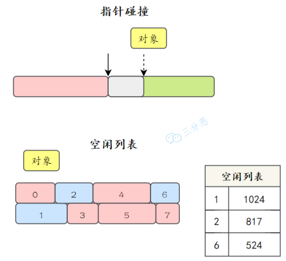
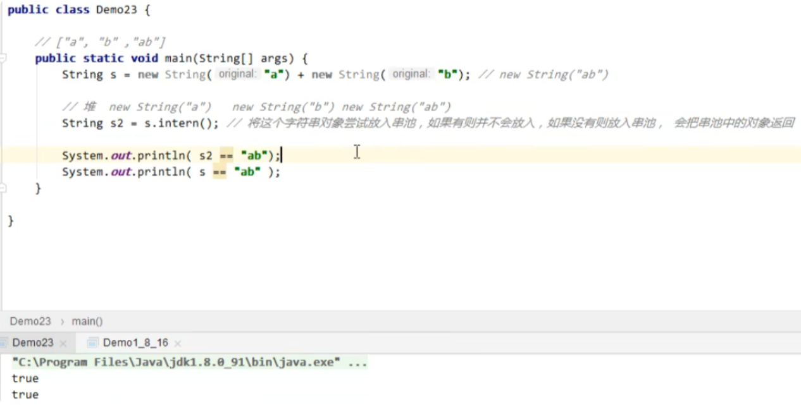
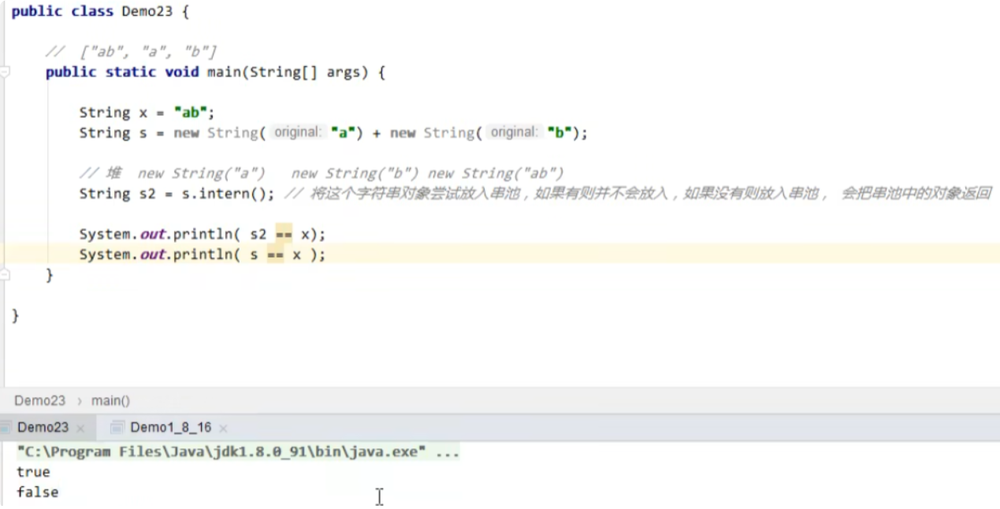
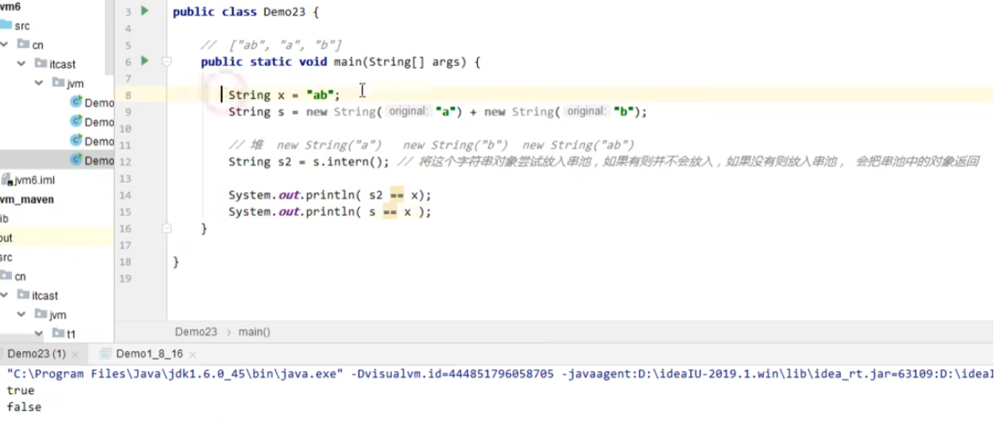
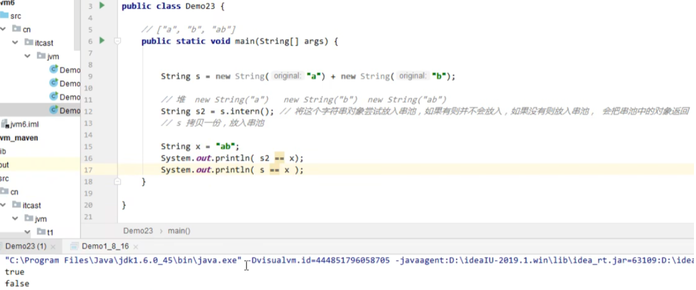
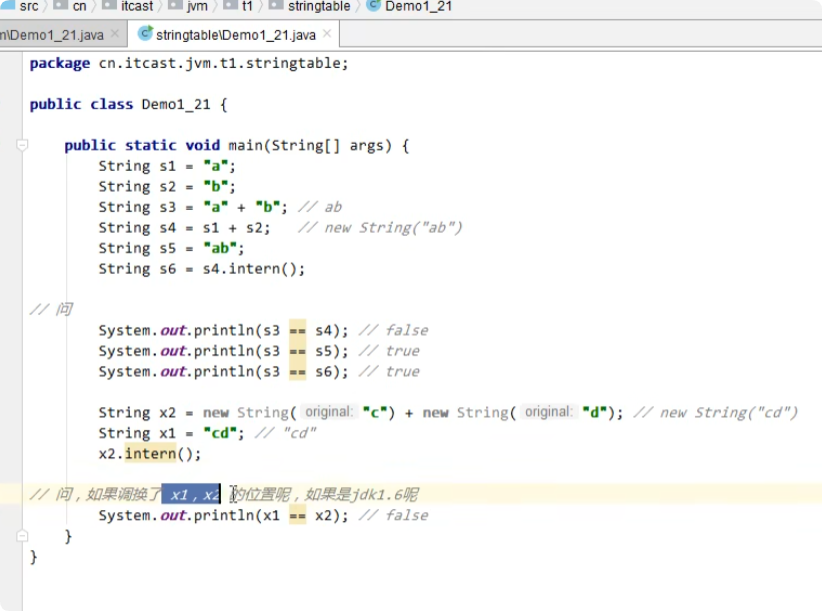
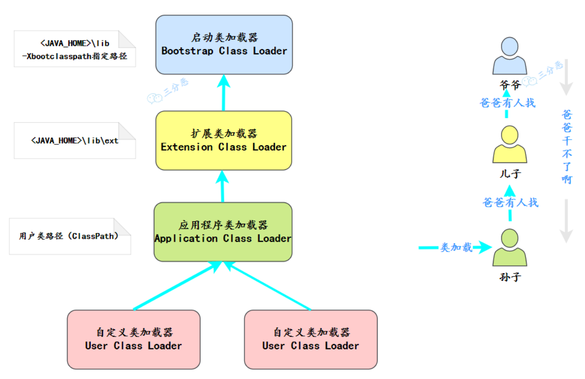
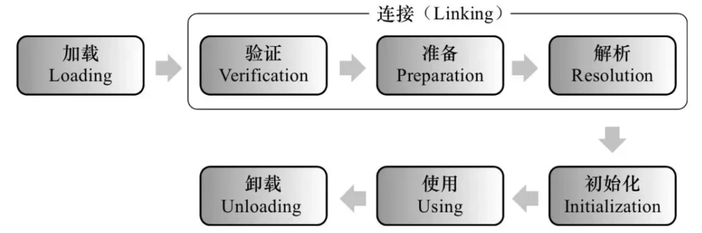

[toc]


# JVM 面试题

## 基础

### 请简单说一下JVM及其特性？

①、**JVM是Java实现跨平台的基石，使得Java代码可以实现一次编译，到处运行的特性，也可以称为跨平台特性**

- 程序运行之前，需要先通过编译器将 Java 源代码文件编译成 Java 字节码文件；

- 程序运行时，JVM 会对字节码文件进行逐行解释，翻译成机器码指令，并交给对应的操作系统去执行。

②、**自动内存管理：JVM 通过内置的垃圾回收器（GC）自动管理内存，包括对象的内存分配与回收**。程序员无需手动释放内存，大幅减少了内存泄漏和野指针等问题，降低了开发复杂度。

③、**即时编译（JIT）优化**：JVM 并非单纯解释执行字节码，还包含即时编译器。它会识别运行中的 “热点代码”（被频繁执行的代码），将其编译为机器码并缓存，后续直接执行缓存的机器码，显著提升程序运行效率，平衡了解释执行的灵活性和编译执行的高效性。

④、**多语言支持**：JVM 并非仅支持 Java 语言，不同编程语言（Kotlin、Scala、Groovy 等）通过各自的编译器编译成字节码文件，最终也可以通过 JVM 在不同平台（Windows、Mac、Linux）上运行，使其成为跨语言的执行平台。

⑤、**安全防护机制**：例如JVM底层会进行数组下标越界检查，增强了程序的安全性和稳定性。

### JVM的组织架构

JVM 大致可以划分为五个部分：类加载器、运行时数据区、字节码执行引擎、本地方法接口、本地方法库


① 类加载器：类加载器负责从文件系统、网络或其他来源加载类文件，将类文件中的二进制数据读入到内存中，并生成 Class 对象（具体来说，JVM会在堆内存中创建一个对应于该类的 java.lang.Class 对象，这个 Class 对象是该类在内存中的唯一标识，包含了该类的元数据信息（如类名、方法、字段等），是程序运行时访问和操作该类的入口。）

② 运行时数据区：是 JVM 执行 Java 程序时在内存中分配的、用于处理各类数据的空间，这些区域按 Java 虚拟机规范划分为方法区、堆、虚拟机栈、程序计数器和本地方法栈。

③ 字节码执行引擎：是 JVM 的核心组件，负责执行字节码，其组成包括虚拟处理器（解释器）和即时编译器（JIT）等。

④本地方法接口（JNI，Java Native Interface）：提供 Java 调用本地（C/C++）方法的接口。

⑤本地方法库（Native Method Libraries）：包含 本地方法接口(JNI) 实现的本地代码库（如 `.so` 文件在 Linux，`.dll` 在 Windows），为 JVM 提供底层支持（如内存管理、线程调度、I/O 操作）。

## 内存管理

### 🌟说一下 JVM 的内存结构


**简单来说：**

根据 JDK 8 规范，JVM 运行时内存共分为虚拟机栈、本地方法栈、程序计数器、堆、方法区五个部分：

- 其中方法区和堆是线程共享的
- 虚拟机栈、本地方法栈和程序计数器是线程私有的，生命周期与线程相同

还有一部分内存叫直接内存，属于操作系统的本地内存，也是可以直接操作的。

**具体来说：**

JVM的内存结构主要分为以下几个部分：

- **程序计数器**：**可理解为当前线程所执行字节码的行号指示器**，记录“下一条”将被执行的 JVM 字节码指令地址。
  - 物理上是通过寄存器来实现的，是一块较小的内存空间。
  - 是唯一一个在 Java 虚拟机规范中没有规定任何 **内存溢出OOM** 情况的区域。
- **虚拟机栈为线程执行Java 方法时所提供的内存**。线程在执行每个 Java 方法时，都会为该方法创建一个**栈帧**（Frame），栈帧中包含局部变量表、操作数栈、动态链接、方法出口等信息，然后该栈帧会被压入虚拟机栈中；当方法执行完毕后，栈帧会从虚拟机栈中弹出。
  - 每个栈由多个栈帧(Frame）组成，对应着每次方法调用时所占用的内存；每个线程只能有一个活动栈帧，对应着当前正在执行的那个方法。
  - **可能会抛出栈溢出异常StackOverflowError 和内存不足异常OOM异常**。
- **本地方法栈**：与虚拟机栈类似，只不过虚拟机栈是为执行 Java 方法提供内存，而本地方法栈专门为**线程调用 native 方法（通常由 C/C++ 编写）时所提供的内存**。在 HotSpot 虚拟机中，本地方法栈与 Java 虚拟机栈被合并实现，不再做严格区分。本地方法执行时也会创建栈帧，同样可能出现 StackOverflowError 和 OutOfMemoryError 两种错误。
  - 当一个 Java 程序调用一个 native 方法时，JVM 会切换到本地方法栈来执行这个方法
  - 在本地方法栈中，主要存放了 native 方法的局部变量、动态链接和方法出口等信息。
- **堆**：是 JVM 中最大的一块内存区域，**主要用于存放类的对象实例和数组，它在虚拟机启动时创建**。从内存回收角度，堆被划分为新生代和老年代，新生代又分为 Eden 区（**伊甸园区** 或 **新生区**）和两个 Survivor 区（两个幸存者区）（通常称为 **S0** 和 **S1**，或 **From 区** 和 **To 区**）。
  - 如果在堆中没有内存完成实例分配，并且堆也无法扩展时会抛出OOM异常。
- **方法区（元空间）**：方法区并不真实存在，属于 Java 虚拟机规范中的一个逻辑概念，用于存储已被 JVM 加载的类元信息、常量、静态变量、即时编译器编译后的代码缓存等。
  - 在Java 8之前，方法区的实现称为永久代 PermGen，属于堆的一部分；但在 Java 8 及之后的版本中，已经被元空间所替代，使用本地内存。
  - 当方法区无法满足新的内存分配需求，会抛出OOM异常。
  - 字节码里可用 `short` 表示的数值会直接跟随指令保存，超出 `short` 范围的常量则写入常量池。
- **直接内存**：它不属于 JVM 自己管理的内存区域，是一种 “堆外内存”（即不在 Java 堆中的内存）。这种内存是通过 NIO 类引入的，能显著提升 I/O 操作的性能。如果分配的直接内存过多，超过了系统能提供的总内存，也会抛出 OutOfMemoryError（内存不足）异常。
  - NIO 是一种基于 “通道（Channel）” 和 “缓冲区（Buffer）” 的 I/O 处理模式。它可以通过本地系统的函数库（非 Java 层面的系统函数）直接分配堆外内存，然后在 Java 堆里放一个叫 DirectByteBuffer 的对象， 这个对象就像一个 “引用指针”，让 Java 代码能通过它操作那块堆外内存，避免了数据在 Java 堆和本地内存之间 “来回复制”，提升I/O效率。

#### 常量池、运行时常量池、字符串常量池？说一下 JDK 1.6、1.7、1.8 内存区域的变化？

- 常量池，也被称为类常量池，指的是字节码文件中的静态常量表，存储了类中所有的 “字面量” 和 “符号引用”，虚拟机指令根据这张常量表找到要执行的类名、方法名、参数类型、字面量等信息：
  - 字符串字面量（如`"hello"`）；
  - 类和接口的全限定名（如`java/lang/String`）；
  - 字段和方法的名称及描述符（如`add:(II)I`表示一个接收两个 int 参数、返回 int 的 add 方法）。
- **运行时常量池**：是方法区的一部分，当 JVM 加载类时，会解析字节码文件中的常量池，将其转换为 运行时常量池，并把里面的符号引用变为真实地址。
  - 运行时常量池具有动态性，运行时也可将新的常量放入池中，当无法申请到足够内存时，会抛出内存溢出OOM异常。
- **字符串常量池**是常量池中的一个特殊部分，用于存放类中**字面量形式的字符串**。
  - 字符串常量池内存区域变化：
    - 在 JDK 1.6 版本中，方法区由堆内存中的永久代实现，属于堆的一部分。
    - 在 JDK 1.7 版本中，方法区仍由堆内存中的永久代实现，但此时字符串常量池和静态变量被迁出，移入了普通的 Java 堆中。
    - 在 JDK 1.8 版本中，方法区的实现由原来的堆内存中的永久代转为本地内存中的元空间（Metaspace）。类元数据与运行时常量池被移至元空间，且该区域会按需向操作系统申请内存，默认没有硬上限，而字符串常量池和静态变量仍然留在 Java 堆中。


#### 栈中存的是什么？

**在 JVM 内存模型中，栈（Stack）是线程私有的内存区域，主要用于管理线程的局部变量和方法调用的上下文。**

**具体来说，栈中存储的是基本数据类型（如 int、double 等）的具体值，以及对象的引用（即指向堆中实际对象实例的地址）。**

需要注意的是，栈并不直接存储对象本身，对象实例本身始终存放在堆中，栈仅通过引用关联这些对象。

#### 方法区中存的是什么？

它用于存储已被虚拟机加载的**类元数据、运行时常量池、字段和方法信息、静态变量、即时编译器编译后的代码缓存**等。

- **类元信息**：类的全限定名、父类与接口列表、访问标志、版本号、类加载器引用等，用来支持 Java 反射和类型检查。
  - **运行时常量池**：JVM 加载类时，会解析字节码文件中的常量池，将其转换为运行时常量池（包含字面量和符号引用），并将其中的符号引用解析为直接引用（真实内存地址）。
  - **字段与方法信息**：
    - 字段信息：类中声明的所有字段（成员变量）的名称、数据类型、访问修饰符（public、private 等）、是否为静态（static）或常量（final）等。
    - 方法信息：类中声明的所有方法的名称、返回值类型、参数列表、访问修饰符、方法的字节码指令（包括`<clinit>()`静态初始化方法和`<init>()`构造器的字节码）、异常表（throws 声明的异常）等。
- **静态变量与编译期常量**：`static`变量（含其初始值）和被`final`修饰且在编译期可确定值的常量（这类常量会存入运行时常量池）。
- **JIT即时编译器编译后的本地代码**：HotSpot 将其放在 Code Cache；规范上仍视为方法区的一部分，用于提升热点方法的执行效率。

#### 一个什么都没有的空方法，空的参数都没有，那局部变量表里有没有变量？

对于静态方法，由于不需要访问实例对象this，因此在局部变量表中不会有任何变量。

对于非静态方法，即使是一个完全空的方法，局部变量表中也会有一个用于存储 this 引用的变量。this 引用指向当前实例对象，在方法调用时被隐式传入。

#### 介绍一下本地方法栈的运行场景？

当 Java 应用需要与操作系统底层或硬件交互时，通常会用到本地方法栈。比如调用操作系统的特定功能，如内存管理、文件操作、系统时间、系统调用等。

举例说明：

- 获取系统时间的 `System.currentTimeMillis()` 方法就是调用本地方法，来获取操作系统当前时间的。
- JVM 自身的一些底层功能也需要通过本地方法来实现：像 Object 类中的 `hashCode()` 方法、`clone()` 方法等。

#### native 方法解释一下？

**native 方法是在 Java 中通过 native 关键字声明的，用于调用非 Java 语言（如 C/C++ ）编写的代码**。Java 可以通过 JNI，也就是 Java Native Interface 与底层系统、硬件设备、或者本地库进行交互。

#### 程序计数器的为什么是私有的？

程序计数器（Program Counter Register）是 JVM 运行时数据区的一块小内存，**核心作用是记录当前线程正在执行的字节码指令的地址**。

Java 是多线程语言，CPU 通过 “时间片轮转” 的方式调度线程（即给每个线程分配一段执行时间），当线程的时间片用完时，CPU 会暂停该线程的执行，切换到其他线程；待后续重新分配到时间片时，线程需要从暂停的位置继续执行。

因此，**每个线程必须拥有独立的程序计数器**，来单独记录自己的指令执行位置，这也让程序计数器成为 JVM 中唯一一块不会发生 OutOfMemoryError 的内存区域。

#### 堆和栈的区别是什么？

堆属于线程共享的内存区域，几乎所有 new 出来的对象都会堆上分配，生命周期不由单个方法调用所决定，可以在方法调用结束后继续存在，直到不再被任何变量引用，最后被垃圾收集器回收。

栈属于线程私有的内存区域，主要存储局部变量、方法参数、对象引用等，通常随着方法调用的结束而自动释放，不需要垃圾收集器处理。

区别：

- 是否是线程私有
  - 栈中的数据对线程是私有的，每个线程有自己的栈空间。
  - 堆中的数据对线程是共享的，所有线程都可以访问堆上的对象。
- 存储的内容
- 生命周期
  - 栈中的数据具有确定的生命周期，当一个方法调用结束时，其对应的栈帧就会被销毁，栈中存储的局部变量也会随之消失。
  - 堆中的对象生命周期不确定，对象会在垃圾回收机制（Garbage Collection, GC）检测到对象不再被引用时才被回收。
- **存取速度**：
  - 栈的存取速度通常比堆快，因为栈遵循先进后出（LIFO, Last In First Out）的原则，操作简单快速。
  - 堆的存取速度相对较慢，因为对象在堆上的分配和回收需要更多的时间，而且垃圾回收机制的运行也会影响性能。
- **存储空间**：
  - 栈的空间相对较小，且固定，由操作系统管理。当栈溢出时，通常是因为递归过深或局部变量过大。
  - 堆的空间较大，动态扩展，由JVM管理。堆溢出通常是由于创建了太多的大对象或未能及时回收不再使用的对象。

#### 方法内的局部变量是否线程安全？

- **如果方法内局部变量没有逃离方法的作用访问**，它是线程安全的
- **如果是局部变量引用了对象，并逃离了方法的作用范围**，需要考虑线程安全

#### 变量存在什么位置？

对于局部变量，**它存储在当前方法栈帧中的局部变量表中**，当方法执行完毕，栈帧被回收，局部变量也会被释放。

对于静态变量来说，它存储在 Java 虚拟机规范中的方法区中，在Java 6中是永久代，在 Java8 及以后是元空间。

#### 堆内存是如何分配的？

- 指针碰撞：把指针向空闲空间方向挪动一段与对象大小相等的距离，如果没有发生碰撞，就将这段内存分配给实例对象，适用于新生代，Serial 和 ParNew 等不会产生内存碎片的垃圾收集器。
- 空闲列表：虚拟机维护一个列表，记录上哪些内存块是可用的，分配的时候从列表中找到一块足够大的空间分配给实例对象，并更新列表上的记录，适用于老年代， CMS 可能产生内存碎片的垃圾收集器。



### 字符串常量池StringTable介绍一下？

- 字符串常量池（即 StringTable）是一个专门存储字面量形式的字符串缓冲池，它能够有效减少重复字符串对象的创建和内存消耗，因为字符串是 Java 中一种常用的数据类型，并且字符串是不可变对象，频繁地创建和销毁字符串对象不仅浪费内存，还增加了垃圾回收的压力。通过缓冲池机制，字符串常量池能避免频繁的对象创建和内存分配，从而提升性能。
- 字符串常量池是 JVM 为了提升性能和减少内存消耗针对字符串（String 类）专门开辟的一块区域，主要目的是为了避免字符串的重复创建。
- 字符串常量池本质上是一个哈希表，但这个哈希表与 Java 集合中的哈希表不同，不能动态扩容。由于字符串种类丰富，哈希碰撞的情况较为常见，这可能会导致性能下降。如果哈希表中的某些字符串产生了链表等数据结构，查询性能就会变差，因此字符串常量池需要加入垃圾回收机制来保持其性能。

- **String与字符串常量池**

  - 直接使用双引号声明出来的String对象会直接存储在常量池中，比如：`String info="atguigu.com";`
  - 如果不是用双引号声明的String对象，可以使用String提供的intern()方法放入串池中：
    - **JDK 1.8**：当调用 `intern()` 时，JVM 会将该字符串尝试放入常量池。如果池中已经有该字符串，`intern()` 会直接返回池中的引用；如果池中没有该字符串，JVM 会将该字符串放入池中并返回这个新的引用。此时，对象引用指向常量池中存储的地址。
    - **JDK 1.6**：与 JDK 1.8 类似，当调用 `intern()` 时，JVM 会检查该字符串是否已经在常量池中。如果已存在，则返回池中的引用；如果不存在，则会把该字符串复制一份放入池中，并返回常量池中的引用。即使该字符串不在池中，引用返回的是常量池中新复制出来的对象的引用。

  - 在字符串常量池中，字符串通常是以符号的形式存在的，只有在首次使用时，才会被转换为对象，即字符串具有延迟加载的特性。

  - 通过字符串常量池，Java 可以有效避免创建多个相同内容的字符串对象，减少内存使用并提升性能。这是因为常量池中的字符串是共享的，多个引用指向同一内存位置。

  - 在 JDK 1.8 中，字符串拼接通过 `StringBuilder` 来实现，这样可以避免频繁地创建新的字符串对象，提升拼接操作的效率；并且字符串常量的拼接会在编译期优化进行优化，编译器会将多个常量拼接操作合并成一个单一的字符串字面量，从而提高执行效率。

案例1：



案例2：



案例3：



案例4：



案例5：



#### String s = new String（“abc”）执行过程中分别对应哪些内存区域？

首先，我们看到这个代码中有一个new关键字，我们知道**new**指令是创建一个类的实例对象并完成加载初始化的，因此这个字符串对象是在**运行期**才能确定的，创建的字符串对象是在**堆内存上**。

其次，在String的构造方法中传递了一个字符串abc，由于这里的abc是被final修饰的属性，所以它是一个字符串常量。在首次构建这个对象时，JVM拿字面量"abc"去字符串常量池试图获取其对应String对象的引用。于是在堆中创建了一个"abc"的String对象，并将其引用保存到字符串常量池中，然后返回；

所以，**如果abc这个字符串常量不存在，则创建两个对象，分别是abc这个字符串常量，以及new String这个实例对象。如果abc这字符串常量存在，则只会创建一个对象**。

### 为什么使用元空间替代永久代？

**首先是分析永久代为什么不好：**

- 永久代是Java堆中的一部分，用于存储类元信息、静态变量、运行时常量池等。**它有一个固定的大小，当应用程序加载了大量的类或者大量使用反射时，永久代很容易发生内存溢出异常**，而调整永久代的大小需要手动设置JVM参数，这不仅增加了配置的复杂性，而且在不同的场景下需要不断调整，给开发和运维带来了不便。
- 永久代的垃圾收集比较复杂，因为它涉及到类的卸载，而类的卸载又和类加载器有关。**在某些情况下，即使类不再被使用，但由于类加载器的存在，类也不会被卸载，从而导致内存泄漏**。此外，永久代的垃圾收集通常与Java堆的其他部分分开进行，增加了垃圾收集器的实现复杂性。

**利用元空间的好处：**

- **「元空间」**使用本地内存，也就是操作系统的内存，这样可以动态地根据应用程序的需求扩展大小，这种方式更加灵活，可以减少因为永久代大小不当设置导致的内存错误。
- 使用元空间代替永久代还有助于性能优化，因为元空间是基于本地内存的，它的扩展通常比永久代更快，且不受JVM堆大小的限制。这意味着元空间可以更快地响应类加载的需求。

### 🌟对象的生命周期

对象的生命周期包括创建、使用和销毁三个阶段：

- 创建：对象通过关键字new在堆内存中被实例化，构造函数被调用，对象的内存空间被分配。
- 使用：对象被引用并执行相应的操作，可以通过引用访问对象的属性和方法，在程序运行过程中被不断使用。
- 销毁：当对象不再被引用时，通过垃圾回收机制自动回收对象所占用的内存空间，从而完成对象的销毁过程。

### 🌟new指令创建对象的过程了解吗？5步

在Java中创建对象的过程包括以下几个步骤：

1. **类加载检查**：当使用`new`创建对象时，虚拟机会先检查`new`指令的参数是否能在**运行时常量池**中定位到一个类的**符号引用**，并且检查这个符号引用代表的类是否已被**加载过、解析和初始化**过，如果没有，则必须先执行相应的**类加载过程**。
2. **分配内存：在类加载检查通过后，接下来虚拟机将为新生对象分配内存**。对象所需的**内存大小**在**类加载**完成后便可确定，为对象分配空间的任务等同于把一块确定大小的内存从 Java 堆中划分出来。
3. **初始化默认值：内存分配完成后，虚拟机需要将分配到的内存空间都初始化为默认值（不包括对象头）**，这一步操作保证了对象的实例字段在 Java 代码中可以不赋初始值就直接使用，程序能访问到这些字段的数据类型所对应的零值。（比如数值类型的成员变量初始值是 0，布尔类型是 false，对象类型是 null。）
4. **进行必要设置，比如对象头**：初始化零值完成之后，虚拟机要对对象进行**必要的设置**，例如这个对象是哪个类的实例、如何才能找到类的元数据信息、对象的哈希码、对象的 GC 分代年龄等信息。这些信息存放在**对象头**中。另外，根据虚拟机当前运行状态的不同，如是否启用偏向锁等，对象头会有不同的设置方式。
5. **执行构造方法 `<clinit>` 完成赋值操作，将成员变量赋值为预期的值**：在上面工作都完成之后，从虚拟机的视角来看，一个新的对象已经产生了，但从 Java 程序的视角来看，对象创建才刚开始——构造函数，即class文件中的方法还没有执行，所有的字段都还为零，**对象需要的其他资源和状态信息**还没有按照预定的意图构造好。所以一般来说，执行 new 指令之后会接着执行方法，把对象按照程序员的意愿进行初始化，这样一个真正可用的对象才算完全被构造出来。


### 对象的销毁过程了解吗？

当对象不再被任何引用指向时，就会变成垃圾。

垃圾收集器会通过可达性分析算法判断对象是否存活，如果对象不可达，就会被回收。

垃圾收集器通过标记-清除、复制、标记-整理等算法来回收内存，将对象占用的内存空间释放出来。

### 🌟对象的内存布局

对象的内存布局是由 Java 虚拟机规范定义的，但具体的实现细节各有不同。

在HotSpot虚拟机中，对象在内存中包括三部分：**对象头、实例数据和对齐填充。**


#### 🌟说说对象头的作用？

对象头是对象存储在内存中的元信息，又包括三部分：MarkWord、类型指针、数组长度。

- MarkWord：用于存储对象运行时的状态信息，比如哈希值、锁状态标志、GC分代年龄等。**这部分在 64 位操作系统下占 8 字节，32 位操作系统下占 4 字节。**
- 类型指针：指向它的类的元数据的指针，虚拟机通过这个指针来确定这个对象是哪一个类的实例。这部分就涉及到指针压缩的概念，**在开启指针压缩的状况下占 4 字节，未开启状况下占 8 字节。** 类型指针可能会被压缩，以节省内存空间。在 JDK 8 中，压缩指针默认是开启的。 32位操作系统则只需要4个字节。
- 数组长度：这部分只有是数组对象才有，**若是是非数组对象就没这部分。这部分占 4 字节。** 32位操作系统也是4个字节

#### 实例数据了解吗？

实例数据是对象实际的字段值，也就是成员变量的值，按照字段在类中声明的顺序存储。

JVM 会对这些数据进行对齐/重排，以提高内存访问速度。

#### 对齐填充了解吗？

由于 JVM 的内存模型要求对象的起始地址是 8 字节对齐（64 位 JVM 中），因此对象的总大小必须是 8 字节的倍数。（HotSpot（无论 32 位还是 64 位）默认都把每个对象起始地址按 8 字节对齐）

如果对象头和实例数据的总长度不是 8 的倍数，JVM 会通过填充额外的字节来对齐。

比如说，如果对象头 + 实例数据 = 14 字节，则需要填充 2 个字节，使总长度变为 16 字节。

#### 为什么非要进行8字节对齐呢？

因为 CPU 进行内存访问时，一次寻址的指针大小是 8 字节，正好是 L1 缓存行的大小。如果不进行内存对齐，则可能出现跨缓存行访问，导致额外的缓存行加载，CPU 的访问效率就会降低。


比如说上图中 obj1 占 6 个字节，由于没有对齐，导致这一行缓存中多了 2 个字节 obj2 的数据，当 CPU 访问 obj2 的时候，就会导致缓存行刷新。

也就说，8 字节对齐，是为了效率的提高，以空间换时间的一种方案。

#### new Object()对象的内存大小是多少？

一般来说，目前的操作系统都是 64 位的，并且 JDK 8 中的压缩指针是默认开启的，因此在 64 位的 JVM 上，`new Object()`的大小是 16 字节（12 字节的对象头 + 4 字节的对齐填充）。


对象头的大小是固定的，在 32 位 JVM 上是 8 字节，在 64 位 JVM 上是 16 字节；如果开启了压缩指针，就是 12 字节。

实例数据的大小取决于对象的成员变量和它们的类型。对于`new Object()`来说，由于默认没有成员变量，因此我们可以认为此时的实例数据大小是 0。

假如 MyObject 对象有三个成员变量，分别是 int、long 和 byte 类型，那么它们占用的内存大小分别是 4 字节、8 字节和 1 字节。

```
class MyObject {
    int a;        // 4 字节
    long b;       // 8 字节
    byte c;       // 1 字节
}
```

考虑到对齐填充，MyObject 对象的总大小为 12（对象头） + 4（a） + 8（b） + 1（c） + 7（填充） = 32 字节。

#### 对象的引用大小了解吗？

在 64 位 JVM 上，未开启压缩指针时，对象引用占用 8 字节；开启压缩指针时，对象引用会被压缩到 4 字节。HotSpot 虚拟机默认是开启压缩指针的。


> 1. [Java 面试指南（付费）](https://javabetter.cn/zhishixingqiu/mianshi.html)收录的帆软同学 3 Java 后端一面的原题：Object a = new object()的大小，对象引用占多少大小？
> 2. [Java 面试指南（付费）](https://javabetter.cn/zhishixingqiu/mianshi.html)收录的去哪儿面经同学 1 技术二面面试原题：Object 底层的数据结构（蒙了）

### JVM 怎么访问对象的？

**主流的方式有两种：句柄和直接指针。**

- 句柄是通过一个中间的句柄表来定位对象的
  - 优点：对象被移动时只需要修改句柄表中的指针，而不需要修改对象引用本身。
  - 缺点：访问速度慢。

- 直接指针则是通过引用直接指向对象的内存地址，对象的实例数据和类型信息都存储在堆中固定的内存区域。
  - 优点是访问速度更快，因为少了一次句柄的寻址操作。
  - 缺点是如果对象在内存中移动，引用需要更新为新的地址。

**HotSpot 虚拟机主要使用直接指针来进行对象访问。**


### 🌟四大引用说一下

四种，分别是强引用、软引用、弱引用和虚引用。

- **强引用是 Java 中最常见的引用类型，指的就是代码中普遍存在的赋值方式。使用 new 关键字赋值的引用就是强引用**，只要强引用关联着对象，垃圾收集器就不会回收这部分对象，即使内存不足。只有所有 GC Roots 对象都不通过【强引用】引用该对象，该对象才能被垃圾回收。

  ```java
  // str 就是一个强引用
  String str = new String("沉默王二");
  ```

- 软引用指的是那些有用但不是必须要的对象，通过 SoftReference 类实现。软引用的对象在内存不足时会被回收。可以配合引用队列来释放软引用自身。

  ```java
  // softRef 就是一个软引用
  SoftReference<String> softRef = new SoftReference<>(new String("沉默王二"));
  ```

- 弱引用用于描述一些短生命周期的非必须对象，通过 WeakReference 类实现的，例如ThreadLocal 中的 Entry对象。弱引用的对象下一次垃圾回收的时候一定会被回收，而不管内存是否足够。可以配合引用队列来释放弱引用自身。

  ```java
  static class Entry extends WeakReference<ThreadLocal<?>> {
      /** The value associated with this ThreadLocal. */
      Object value;

      //节点类
      Entry(ThreadLocal<?> k, Object v) {
          //key赋值
          super(k);
          //value赋值
          value = v;
      }
  }
  ```

- **虚引用也被称作幻影引用，是最弱的引用关系，可以用PhantomReference来描述**，他必须和ReferenceQueue一起使用，当发生垃圾回收的时候，虚引用也会被回收。可以用虚引用来管理堆外内存。必须配合引用队列使用，被引用对象回收时，会将虚引用入队，由 Reference Handler 线程调用虚引用相关方法释放直接内存。

  ```java
  // phantomRef 就是一个虚引用
  PhantomReference<String> phantomRef = new PhantomReference<>(new String("沉默王二"), new ReferenceQueue<>());
  ```

- **终结器引用（FinalReference）**：无需手动编码，但其内部配合引用队列使用，在垃圾回收时，终结器引用入队（被引用对象暂时没有被回收），再由 Finalizer 线程通过终结器引用找到被引用对象并调用它的 finalize 方法，第二次 GC 时才能回收被引用对象

#### 弱引用了解吗？举例说明在哪里可以用?

在Java中，弱引用是通过`WeakReference`类实现的，它的一个主要用途是创建非强制性的对象引用，这些引用可以在内存压力大时被垃圾回收器清理，从而避免内存泄露。

弱引用的使用场景：

- **缓存系统**：弱引用常用于实现缓存，特别是当希望缓存项能够在内存压力下自动释放时。如果缓存的大小不受控制，可能会导致内存溢出。使用弱引用来维护缓存，可以让JVM在需要更多内存时自动清理这些缓存对象。
- **对象池**：在对象池中，弱引用可以用来管理那些暂时不使用的对象。当对象不再被强引用时，它们可以被垃圾回收，释放内存。
- **避免内存泄露**：当一个对象不应该被长期引用时，使用弱引用可以防止该对象被意外地保留，从而避免潜在的内存泄露。

### 🌟详细说一下Java 堆？

堆是Java 虚拟机所管理的内存中最大的一块，所有线程共享，因此堆中对象都需要考虑线程安全的问题。在虚拟机启动时创建，**主要用来存储类的对象实例和数组。**

堆也是垃圾回收器管理的目标区域。从内存回收的角度来看，由于垃圾回收器大部分都是基于分代收集理论设计的，**所以堆又被细分为新生代、老年代，新生代占堆空间的1/3，老年代占堆空间的2/3**

- **新生代（Young Generation）**:新生代分为Eden Space和Survivor Space。
  - 在Eden Space中， 大多数新创建的对象首先存放在这里。Eden区相对较小，当Eden区满时，会触发一次Minor GC（新生代垃圾回收）。
  - 在Survivor Spaces中，通常分为两个相等大小的区域，称为S0（Survivor 0）和S1（Survivor 1）。在每次Minor GC后，存活下来的对象会被移动到其中一个Survivor空间，以继续它们的生命周期。这两个区域轮流充当对象的中转站，帮助区分短暂存活的对象和长期存活的对象。
- **老年代（Old Generation/Tenured Generation）**:存放过一次或多次Minor GC（新生代垃圾回收）仍存活的对象会被移动到老年代。老年代中的对象生命周期较长，因此Major GC（也称为Full GC，涉及老年代的垃圾回收）发生的频率相对较低，但其执行时间通常比Minor GC长。老年代的空间通常比新生代大，以存储更多的长期存活对象。
- **元空间（Metaspace）**:从Java 8开始，永久代（Permanent Generation）被元空间取代，用于存储类的元数据信息，如类的结构信息（如字段、方法信息等）。元空间并不在Java堆中，而是使用本地内存，这解决了永久代容易出现的内存溢出问题。
- **大对象区（Large Object Space / Humongous Objects）**:在某些JVM实现中（如G1垃圾收集器），为大对象分配了专门的区域，称为大对象区或Humongous Objects区域。**大对象是指需要大量连续内存空间的对象，如大数组**。这类对象直接分配在老年代，以避免因频繁的年轻代晋升而导致的内存碎片化问题。


大部分情况，对象都会首先在 Eden 区域分配，在一次新生代垃圾回收后，如果对象还存活，则会进入 S0 或者 S1，并且对象的年龄还会加 1(Eden 区->Survivor 区后对象的初始年龄变为 1)，当它的年龄增加到一定程度（默认为 15 岁），就会被晋升到老年代中。对象晋升到老年代的年龄阈值，可以通过参数 `-XX:MaxTenuringThreshold` 来设置。不过，设置的值应该在 0-15。

**为什么年龄只能是 0-15?**

因为记录年龄的区域在对象头中，这个区域的大小通常是 4 位。这 4 位可以表示的最大二进制数字是 1111，即十进制的 15。因此，对象的年龄被限制为 0 到 15。

这个年龄信息就是在Mark Word中存放的（Mark Word还存放了对象自身的其他信息比如哈希码、锁状态信息等等）。`markOop.hpp`定义了mark word的结构：


可以看到对象年龄占用的大小确实是 4 位。

#### 如果有个大对象一般是在哪个区域？

大对象通常会直接分配到老年代。

- **新生代主要用于存放生命周期较短的对象，并且其内存空间相对较小**。如果将大对象分配到新生代，可能会很快导致新生代空间不足，从而频繁触发 Minor GC。而每次 Minor GC 都需要进行对象的复制和移动操作，这会带来一定的性能开销。将大对象直接分配到老年代，可以减少新生代的内存压力，降低 Minor GC 的频率。

- 大对象通常需要连续的内存空间，如果在新生代中频繁分配和回收大对象，容易产生内存碎片，导致后续分配大对象时可能因为内存不连续而失败。老年代的空间相对较大，更适合存储大对象，有助于减少内存碎片的产生。

#### 说一下新生代的区域划分？

新生代的垃圾收集主要采用复制算法，因为新生代的存活对象比较少，每次复制少量的存活对象效率比较高。

基于这种算法，虚拟机将内存分为一块较大的 Eden 空间和两块较小的 Survivor 空间，每次分配内存只使用 Eden 和其中一块 Survivor。发生垃圾收集时，将 Eden 和 Survivor 中仍然存活的对象一次性复制到另外一块 Survivor 空间上，然后直接清理掉 Eden 和已用过的那块 Survivor 空间。默认 Eden 和 Survivor 的大小比例是 8∶1：1。


### 🌟对象什么时候会进入老年代？

在 Java 虚拟机（JVM）的内存模型中，对象通常先在年轻代分配内存。随着垃圾回收的进行，满足特定条件的对象会从年轻代进入老年代。具体场景如下：


- **长期存活的对象会进入老年代**：JVM 会为每个对象维护一个 “年龄计数器”，记录对象在新生代经历 Minor GC 的次数。每次 Minor GC 后若对象未被回收，年龄就会加 1。当年龄超过默认阈值（通过`-XX:MaxTenuringThreshold`设置，默认值为 15）时，对象会被晋升至老年代。
- **大对象直接进入老年代**：大对象指占用内存较大的对象（如长字符串、大数组等）。JVM 通过`-XX:PretenureSizeThreshold`参数控制大对象的判断阈值：若对象大小超过该值，会直接在老年代分配（避免在年轻代频繁复制大对象，影响效率）。
  - 注意：JDK 8 中该参数默认值为 0，即默认情况下大对象不会直接进入老年代，仍需通过年龄阈值判断。而在 G1 垃圾收集器中，当对象大小超过一个 Region 容量的 50% 时，会被视为 “大对象”，直接分配到专门的 HUMONGOUS 区域（可视为老年代的一部分）。
- **动态年龄判断机制触发晋升**：若 Survivor 区中，相同年龄的所有对象总大小之和和超过 Survivor 区容量的一半，那么年龄大于等于该年龄的所有对象会被直接晋升至老年代。
  - 这一机制的目的是避免 Survivor 区空间不足时，对象在两个 Survivor 区之间频繁复制，从而提高垃圾回收效率。

### STW 了解吗？

JVM 进行垃圾回收的过程中，会涉及到对象的移动，**为了保证对象引用在移动过程中不被修改**，必须暂停所有的用户线程，像这样的停顿，我们称之为`Stop The World`，简称 STW。

#### 如何暂停线程呢？

**JVM 会使用一个名为安全点（Safe Point）的机制来确保线程能够被安全地暂停**，其过程包括四个步骤：

- JVM 发出暂停信号；
- 线程执行到安全点后，挂起自身并等待垃圾收集完成；
- 垃圾回收器完成 GC 操作；
- 线程恢复执行。

#### 什么是安全点？

安全点是 JVM 的一种机制，常用于垃圾回收的 STW 操作，**用于让线程在执行到某些特定位置时，可以被安全地暂停。**

通常位于方法调用、循环跳转、异常处理等位置，以保证线程暂停时数据的一致性。

用个通俗的比喻，老王去拉车，车上的东西很重，老王累的汗流浃背，但是老王不能在上坡或者下坡时休息，只能在平地上停下来擦擦汗，喝口水。


### 对象一定分配在堆中吗？

对象并非一定分配在堆中。默认情况下，Java 对象会在堆中分配内存，但 JVM 会进行逃逸分析，来判断对象的生命周期是否只在方法内部，如果是的话，这个对象可以直接在栈上分配内存。

从 JDK7开始已经默认开启逃逸分析，如果某些方法中的对象引用没有被返回或者未被外面使用（也就是未逃逸出去）。

举例来说，下面的代码中，对象 `new Person()` 的生命周期只在 `testStackAllocation` 方法内部，因此 JVM 会将这个对象分配在栈上。

```java
public void testStackAllocation() {
    Person p = new Person();  // 对象可能分配在栈上
    p.name = "沉默王二是只狗";
    p.age = 18;
    System.out.println(p.name);
}
```

#### 什么是逃逸分析？

逃逸分析是一种 JVM 优化技术，**用来分析对象的作用域和生命周期，判断对象是否逃逸出方法或线程。**

可以通过分析对象的引用流向，判断对象是否被方法返回、赋值到全局变量、传递到其他线程等，来确定对象是否逃逸。

如果对象没有逃逸，就可以进行栈上分配、同步消除、标量替换等优化，以提高程序的性能。

#### 逃逸具体是指什么？

根据对象逃逸的范围，可以分为**方法逃逸和线程逃逸。**

当对象被方法外部的代码引用，生命周期超出了方法的范围，那么对象就必须分配在堆中，由垃圾收集器管理。比如下面代码 `new Person()` 创建的对象被返回，那么这个对象就逃逸出当前方法了。

```java
public Person createPerson() {
    return new Person(); // 对象逃逸出方法
}
```

当对象被另外一个线程引用，生命周期超出了当前线程，那么对象就必须分配在堆中，并且线程之间需要同步。比如下面代码中对象 `new Person()` 被另外一个线程引用了，发生了线程逃逸。

```java
public void threadEscapeExample() {
    Person p = new Person(); // 对象逃逸到另一个线程
    new Thread(() -> {
        System.out.println(p);
    }).start();
}
```


#### 逃逸分析会带来什么好处？

主要有三个。

第一，**如果确定一个对象不会逃逸，那么就可以考虑栈上分配，对象占用的内存随着栈帧出栈后销毁，这样垃圾收集的压力就降低很多。**

第二，**线程同步需要加锁，加锁就要占用系统资源**，如果逃逸分析能够确定一个对象不会逃逸出线程，那么这个对象就不用加锁，从而减少线程同步的开销。

第三，**如果对象的字段在方法中独立使用，JVM 可以将对象分解为标量变量，避免对象分配。**

```java
public void scalarReplacementExample() {
    Point p = new Point(1, 2);
    System.out.println(p.getX() + p.getY());
}
```

如果 Point 对象未逃逸，JVM 可以优化为：

```java
int x = 1;
int y = 2;
System.out.println(x + y);
```

> 1. [Java 面试指南（付费）](https://javabetter.cn/zhishixingqiu/mianshi.html)收录的收钱吧面经同学 1 Java 后端一面面试原题：所有对象都在堆上对不对？

### 🌟内存溢出了解吗？

**内存溢出（OutOfMemoryError, OOM）**：是指JVM在尝试申请内存时，没有足够的内存空间分配，从而抛出 OutOfMemoryError。可能是因为堆、元空间、栈或直接内存不足导致的。可以通过优化内存配置、减少对象分配来解决。

- 常见触发原因：
  - **大量对象创建**：程序中不断创建大量对象，超出JVM堆的限制。
  - **持久引用**：大型数据结构（如缓存、集合等）长时间持有对象引用，导致内存累积。
  - **递归调用**：深度递归导致栈溢出。

```java
List<String> list = new ArrayList<>();
while (true) {
    list.add("OutOfMemory".repeat(1000)); // 无限增加内存
}
```

#### 内存溢出有哪几种情况？

- **堆内存溢出**：当出现Java.lang.OutOfMemoryError:Java heap space异常时，就是堆内存溢出了。原因是代码中可能存在大对象分配，或者发生了内存泄露，导致在多次GC之后，还是无法找到一块足够大的内存容纳当前对象。
- **栈溢出**：如果我们写一段程序不断的进行递归调用，而且没有退出条件，就会导致不断地进行压栈。类似这种情况，JVM 实际会抛出 StackOverFlowError；当然，如果 JVM 试图去扩展栈空间的的时候失败，则会抛出 OutOfMemoryError。
- **元空间溢出**：元空间的溢出，系统会抛出Java.lang.OutOfMemoryError: Metaspace。出现这个异常的问题的原因是**系统的代码非常多或引用的第三方包非常多或者通过动态代码生成类加载等方法，导致元空间的内存占用很大**。
- **直接内存溢出**：在使用ByteBuffer中的allocateDirect()的时候会用到，很多JavaNIO(像netty)的框架中被封装为其他的方法，出现该问题时会抛出Java.lang.OutOfMemoryError: Direct buffer memory异常。

#### 什么情况下会发生栈溢出？

栈溢出发生在栈帧过大或者栈帧过多，当一个方法被调用时，JVM 会在栈中分配一个栈帧，用于存储该方法的执行信息。

- 本质是因为线程的栈空间不足，导致无法再为新的栈帧分配内存。

两种常见触发场景：

- 典型场景是递归调用，没有正确的终止条件下，会导致递归无限进行。
- 如果方法中定义了特别大的局部变量，栈帧会变得很大，导致栈空间更容易耗尽。


#### 有没有处理过内存溢出？

我在之前负责「技术派」项目的文件上传功能时，遇到过内存溢出问题。当时有用户反馈上传大文件（超过 100MB）时，系统会突然崩溃，后台日志直接报了`Java heap space`错误。

**排查过程：**

发现问题后，我先通过错误类型定位了问题区域，`Java heap space`说明是堆内存不足，大概率是大文件处理时创建了过大的对象，导致内存被瞬间占满。

为了找到根因，我做了这几步：

1. 通过设置JVM参数让服务在崩溃前自动生成堆转储文件（`jmap -dump:format=b,file=heap.hprof <进程ID>`），保留了内存快照；
2. 用 MAT 工具分析快照，发现内存中存在大量字节数组（byte []），占比超过 80%，追踪引用链后发现，代码里是把整个文件一次性读入内存处理（用`FileInputStream`全量读取后转字节数组），大文件直接撑爆了堆内存；
3. 同时用`jstack`查看线程状态，确认没有死循环或阻塞，排除了其他内存消耗因素。

**解决措施：**

1. **临时应急**：先通过`-Xmx`参数把堆内存从 2G 调大到 4G，确保服务先恢复可用；
2. **代码修复**：核心是改「全量加载」为「流式处理」—— 用`BufferedInputStream`按缓冲区（比如 8KB）分片读取文件，处理完一块释放一块内存，避免大对象长期占用堆空间；
3. **预防措施**：在上传入口增加文件大小限制（最大 50MB），并添加内存监控告警，当堆内存使用率超过 80% 时自动预警。

### 🌟内存泄漏了解吗?

**内存泄露（Memory Leak）**：指程序在运行过程中不再使用的对象仍然被引用，而无法被垃圾回收器回收，从而导致可用内存逐渐减少。**通常是因为长期存活的对象持有短期存活对象的引用，又没有及时释放，从而导致短期存活对象无法被回收而导致的。**

- **常见触发原因**：
  - **静态集合**：使用静态数据结构（如`HashMap`或`ArrayList`）存储对象，且未清理。

  - **事件监听**：未取消对事件源的监听，导致对象持续被引用。

  - **线程**：未停止的线程可能持有对象引用，无法被回收。

```java
class MemoryLeakExample {
    private static List<Object> staticList = new ArrayList<>();
    public void addObject() {
        staticList.add(new Object()); // 对象不会被回收
    }
}
```

#### 🌟内存泄漏原因及其解决方案?

**1. 静态变量导致的内存泄漏**：静态变量的生命周期与应用程序相同，如果静态变量持有对象的引用，这些对象将无法被 GC 回收。如果静态的集合中添加的对象越来越多，但却没有及时清理，就会导致内存泄漏。

```java
public class StaticTest {
    public static List<Double> list = new ArrayList<>();
    public void populateList() {
        for (int i = 0; i < 10000000; i++) {
            list.add(Math.random());
        }
        Log.info("Debug Point 2");
    }
    public static void main(String[] args) {
        Log.info("Debug Point 1");
        new StaticTest().populateList();
        Log.info("Debug Point 3");
    }
}
```

- **解决方案**
  - **减少静态变量的使用**：避免将大对象或集合声明为 `static`。

  - **及时清理静态集合**：在不再需要时清空集合（如 `list.clear()`）。

  - **单例模式优化**：如果使用单例，尽量采用**懒加载**（延迟初始化），避免提前加载不必要的资源。


**2. 单例模式引发的内存泄漏**：单例对象的生命周期与应用程序相同，如果单例对象持有其他对象的引用（如集合、外部资源），这些对象将无法被回收。

```java
class Singleton {
    private static final Singleton INSTANCE = new Singleton();
    private List<Object> objects = new ArrayList<>(); // 持有外部引用

    public static Singleton getInstance() {
        return INSTANCE;
    }
}
```

- **解决方案**

  - **避免单例持有大量数据**：单例应尽量只持有轻量级对象。

  - **手动解耦引用**：在单例不再需要时，手动将引用设为 `null`（如 `objects = null`）。

  - **使用依赖注入**：通过框架（如 Spring）管理对象生命周期，减少硬编码的单例引用。


**3. 资源未关闭导致的内存泄漏**：数据库连接、IO 流、Socket 等资源未及时关闭，会导致内存泄漏。即使发生异常，未在 `finally` 块中关闭资源，也会阻塞 GC。

- 无论什么时候当我们创建一个连接或打开一个流，JVM都会分配内存给这些资源，忘记关闭这些资源，会阻塞内存，从而导致GC无法进行清理；特别是当程序发生异常时，没有在finally中进行资源关闭的情况；这些未正常关闭的连接，如果不进行处理，轻则影响程序性能，重则导致OutOfMemoryError异常发生。

- **解决方案**

  - 始终记得在finally中进行资源的关闭，并且关闭连接的自身代码不能发生异常

  - Java7以上版本可使用try-with-resources代码方式进行资源关闭。

    ```java
    try (Connection conn = DriverManager.getConnection("url", "", "")) {
        // 使用资源
    } catch (SQLException e) {
        // 处理异常
    }
    ```

  - **避免嵌套资源**：关闭外层资源时，内层资源会自动关闭（如关闭 `Statement` 时会关闭关联的 `ResultSet`）。


**4. ThreadLocal 使用不当导致的内存泄漏**：`ThreadLocal` 通过线程本地存储（`ThreadLocalMap`）实现线程隔离，但若未及时清理，可能导致内存泄漏。

- `ThreadLocalMap` 的 Key 是 `ThreadLocal` 的弱引用（Weak Reference），当 `ThreadLocal` 对象被垃圾回收后，Key 会变为 `null`，但对应的 Value（存储的实际数据）仍通过线程的强引用链（`Thread -> ThreadLocalMap -> Entry -> Value`）存在，无法被回收。

- **典型场景**：线程池中的线程长期存活（如 Tomcat 线程池），导致 `ThreadLocal` 的 Value 无法释放。

- **解决方案**

  - 使用ThreadLocal提供的remove方法，可对当前线程中的value值进行移除；

  - 不要使用ThreadLocal.set(null) 的方式清除value，它实际上并没有清除值，而是创建新的键值对（Key 为 `null`，Value 为 `null`）。

  - 最好将ThreadLocal视为需要在finally块中关闭的资源，以确保即使在发生异常的情况下也始终关闭该资源。

  - 可使用 `WeakHashMap` 或依赖注入框架管理上下文，无需线程隔离。


> 详细解释：
>
> ThreadLocal提供了线程本地变量，它可以保证访问到的变量属于当前线程，每个线程都保存有一个变量副本，每个线程的变量都不同。ThreadLocal相当于提供了一种线程隔离，将变量与线程相绑定，从而实现线程安全的特性。
>
> ThreadLocal的实现中，每个Thread维护一个ThreadLocalMap集合，这个集合的底层是一个Entry数组，数组中，key是ThreadLocal实例本身，value是真正需要存储的Object。
>
> ThreadLocalMap使用ThreadLocal的弱引用作为key，如果一个ThreadLocal没有外部强引用来引用它，那么系统GC时，这个ThreadLocal势必会被回收，这样一来，ThreadLocalMap中就会出现key为null的Entry，就没有办法访问这些key为null的Entry的value。
>
> 如果当前线程迟迟不结束的话，这些key为null的Entry的value就会一直存在一条强引用链：Thread Ref -> Thread -> ThreaLocalMap -> Entry -> value永远无法回收，造成内存泄漏。
>
> 

#### 有没有处理过内存泄漏？

当时在做技术派项目的时候，由于 ThreadLocal 没有及时清理导致出现了内存泄漏问题。

我用可视化的监控工具 VisualVM，配合 JDK 自带的 jstack 等命令行工具进行了排查。

- **首先确认内存泄漏现象**：通过监控工具（如`jstat`、VisualVM）观察内存使用趋势确认发生了内存泄漏现象：若 GC 后内存仍持续增长，可能存在泄漏。
- **接着获取堆内存快照**：使用`jmap -dump:format=b,file=heapdump.hprof <进程ID>`生成堆转储文件，记录对象分布。
- **然后分析发生内存泄漏的对象**：用工具（MAT、JProfiler）分析堆快照，重点关注：
  - 数量异常多的对象（如集合中积累了大量无用元素）。
  - 对象的引用链（找到谁在持有无用对象的引用，如静态集合未清理、缓存未设置过期时间等）。
- **最后定位到相关代码**：根据引用链定位到具体代码，修复引用未释放的问题（如移除多余引用、使用弱引用等）。

## 垃圾回收

### 🌟什么是JVM垃圾回收机制？

垃圾回收机制是Java里面自动管理内存的一种机制，它的核心作用是识别并回收堆内存或方法区中不在被应用的对象所占的空间，这种机制减少了内存泄漏和内存溢出的可能性。

1. 通常会通过可达性分析算法来判断对象是否存活，也就是JVM 在做 GC 之前，会先搞清楚什么是垃圾，什么不是垃圾；

2. 在确定了哪些垃圾可以被回收后，垃圾收集器（如 CMS、G1、ZGC）要做的事情就是进行垃圾回收，可以采用标记清除算法、复制算法、标记整理算法、分代收集算法等。

### 如何触发垃圾回收？

垃圾回收的触发方式主要有以下几种：

- **JVM 内存不足时**：当堆内存无法为新对象分配空间，JVM 会自动触发垃圾回收。
- **手动建议**：可通过`System.gc()`或`Runtime.getRuntime().gc()`主动建议 JVM 执行回收，但这只是建议，不保证立即执行。
- **JVM 参数调控**：启动时通过`-Xmx`（最大堆）、`-Xms`（初始堆）等参数设定内存阈值，间接影响回收触发时机。
- **内部阈值触发**：垃圾收集器会监控对象数量或内存占用，达到预设阈值时自动启动回收。

#### 垃圾回收的内存区域有哪些？

JVM 的垃圾回收器不仅仅会对堆进行垃圾回收，它还会对方法区进行垃圾回收。

1. **堆（Heap）：** 堆是用于存储对象实例的内存区域。大部分的垃圾回收工作都发生在堆上，因为大多数对象都会被分配在堆上，而垃圾回收的重点通常也是回收堆中不再被引用的对象，以释放内存空间。
2. **方法区（Method Area）：** 方法区是用于存储类元信息、运行时常量池、静态变量等数据的区域。虽然方法区中的垃圾回收与堆有所不同，但是同样存在对不再需要的常量、无用的类信息等进行清理的过程。

### 🌟如何判断对象可以被垃圾回收？

**有两种方式：引用计数法和可达性分析法**

Java 通过可达性分析算法来判断一个对象是否还存活。这也是 G1、CMS 等主流垃圾收集器使用的主要算法。

#### 什么是引用计数法？（Reference Counting）

- **原理**：为每个对象分配一个引用计数器，每当有一个地方引用它时，计数器加1；当引用失效时，计数器减1。当计数器为0时，表示对象不再被任何变量引用，可以被回收。
- **缺点**：不能解决循环引用的问题，即两个对象相互引用，但不再被其他任何对象引用，这时引用计数器不会为0，导致对象无法被回收。

#### 可达性分析算法（Reachability Analysis）

**原理**：通过一组被称为 “GC Roots” 的根对象出发，递归扫描它们引用的对象，如果一个对象与 GC Roots 之间没有任何引用链相连，则该对象被认为是不可达的，可以被回收。

#### 做可达性分析的时候有哪些前置性的操作？

**在进行可达性分析之前，JVM 会暂停所有正在执行的应用线程。**

原因：这是因为可达性分析过程**必须确保在执行分析时，内存中的对象关系不会被应用线程修改**。如果不暂停应用线程，可能会出现对象引用的改变，导致垃圾回收过程中判断对象是否可达的结果不一致，从而引发严重的内存错误或数据丢失。

### 🌟可作为GC Roots的引用有哪几种？

所谓的 GC Roots，就是一组必须活跃的引用，它们是程序运行时的起点，是一切引用链的源头。在 Java 中，GC Roots 包括以下几种：

- **虚拟机栈（栈帧中的本地变量表）中引用的对象**：即当前正在执行的方法里的局部变量、方法参数等，这些引用直接关联着方法执行过程中使用的对象。
- **本地方法栈中引用的对象**：指通过 JNI（Java Native Interface）调用的 Native 方法中所引用的对象。
- **方法区中类的静态属性引用的对象**：如类中被 `static` 修饰的成员变量所指向的对象（属于类级别，而非实例）。
- **方法区中常量引用的对象**：如类中用 `final` 修饰的静态常量（非字符串类型）所引用的对象，其引用信息存储在方法区的运行时常量池中。

### finalize()方法了解吗？

在垃圾回收过程中，当对象被标记为不可达时，JVM 会检查对象是否重写了 `finalize()` 方法，并调用该方法，如果对象在 `finalize()` 方法中通过 `this` 关键字将自己赋值给某个类的静态变量或实例变量，那么该对象可以避免被回收。

垃圾回收就是古代的秋后问斩，`finalize()` 就是刀下留人。

### 垃圾回收机制是为了解决了什么问题？垃圾回收器的作用是什么？

JVM有垃圾回收机制的原因是为了解决内存管理的问题。在传统的编程语言中，开发人员需要手动分配和释放内存，这可能导致内存泄漏、内存溢出等问题。

而Java引入了垃圾回收机制来自动管理 Java 应用程序的运行时内存，**自动检测和回收**不再使用的对象，从而释放它们所占用的内存空间。这样可以避免内存泄漏和内存溢出。提高开发效率、减少错误，并且使程序更加可靠和稳定。

### 🌟有哪些垃圾回收算法？

垃圾收集算法主要有四种，分别是标记-清除算法、复制算法和标记-整理算法、分代回收算法

- **标记 - 清除算法**分为 “标记” 和 “清除” 两个阶段，首先通过可达性分析标记所有存活对象（未被标记的即为待回收对象），然后统一清除所有未标记的对象。
  - 优点：实现简单，无需移动对象。
  - 缺点：标记和清除过程效率较低；回收后会产生大量内存碎片，可能导致后续大对象分配时因找不到连续空间而提前触发 GC。
- **复制算法**为解决标记清楚算法的内存碎片问题而设计，将内存划分为大小相等的两块（或按比例划分，如 Eden 区与 Survivor 区），每次只使用其中一块。当使用的区域内存不足时，将存活对象复制到另一块区域，再一次性清理原区域。
  - 优点：无内存碎片，回收效率高（只需清理整个区域）。
  - 缺点：内存利用率低（总有一块区域闲置）；若存活对象多，复制操作成本会显著上升，不适合对象存活率高的场景。
- **标记 - 整理算法**则是针对老年代对象存活率高的特点设计，结合了标记 - 清除和复制算法的思路：首先标记所有存活对象，随后将存活对象向内存一端移动，最后清理边界外的所有空间。
  - 优点：解决了标记 - 清除的内存碎片问题，同时避免了复制算法的内存浪费。
  - 缺点：移动存活对象需要额外开销，对象存活率越高，移动成本越大。
- **分代回收算法**目前主流的垃圾回收算法，根据对象存活周期将内存划分为新生代（对象存活时间短、存活率低）和老年代（对象存活时间长、存活率高），根据各个区域的特点选择合适的垃圾收集算法：
  - 新生代：采用复制算法（因存活对象少，复制成本低）。
  - 老年代：采用标记 - 整理算法（因存活对象多，需避免碎片且减少内存浪费）。
  - 优点：结合不同代的特点最大化回收效率，平衡了性能与内存利用率。

#### 为什么采用分代垃圾回收算法？

**采用分代垃圾回收机制的核心是利用对象存活周期的显著差异进行针对性优化**：程序中的大多数对象存活时间短（新生代），少数对象存活时间长（老年代），通过将内存划分为不同代，针对不同代的对象特性采用不同回收策略，**既能缩小每次回收的范围以降低成本，又能平衡回收效率与内存利用率**。

### MinorGC/YoungGC、MajorGC/OldGC、FullGC、Mixed GC的区别

在Java中，垃圾回收机制是自动管理内存的重要组成部分。根据其作用范围和触发条件的不同，可以将GC分为三种类型：Minor GC（也称为Young GC）、Major GC（有时也称为Old GC）、以及Full GC。以下是这三种GC的区别和触发场景：

#### Minor GC (Young GC)

- **作用范围**：只针对年轻代进行垃圾回收，包括Eden区和两个Survivor区（S0和S1）。
- **触发条件**：当Eden区空间不足时，JVM会触发一次Minor GC，将Eden区和一个Survivor区中的存活对象移动到另一个Survivor区或老年代（Old Generation）。
- **特点**：通常发生得非常频繁，因为年轻代中对象的生命周期较短，回收效率高，暂停时间相对较短。

#### Major GC（Old GC）

- **作用范围**：主要针对老年代进行垃圾回收，但不一定只回收老年代，是 CMS 的特有行为。
- **触发条件**：当老年代空间不足时，或者系统检测到年轻代对象晋升到老年代的速度过快，可能会触发Major GC。
- **特点**：相比Minor GC，Major GC发生的频率较低，但每次回收可能需要更长的时间，因为老年代中的对象存活率较高。

#### Full GC

- **作用范围**：是最彻底的垃圾回收，涉及整个 Java 堆和方法区，因此它是最耗时的 GC，通常在 JVM 压力很大时发生。
- **触发条件**：
  - 直接调用`System.gc()`或`Runtime.getRuntime().gc()`方法时，虽然不能保证立即执行，但JVM会尝试执行Full GC。
  - 在进行Minor GC/Young GC（新生代垃圾回收） 的时候，如果发现老年代的连续可用内存空间小于新生代升入老年代的对象总和的平均大小，说明本次 Young GC 后升入老年代的对象可能超出了当前老年代的可用空间，从而触发 Full GC。
  - 在进行Minor GC/Young GC（新生代垃圾回收）后，老年代空间不足以容纳存活的对象，则会触发Full GC，对整个堆内存进行回收。
  - 当方法区空间不足时，会触发Full GC。
- **特点**：Full GC是最昂贵的操作，因为它需要停止所有的工作线程（Stop The World），遍历整个堆内存来查找和回收不再使用的对象，因此应尽量减少Full GC的触发。

- **FULL GC怎么去清理的？**：Full GC 会从 GC Root 出发，标记所有可达对象。新生代使用复制算法，清空 Eden 区。老年代使用标记-整理算法，回收对象并消除碎片。停顿时间较长，会影响系统响应性能。

#### Mixed GC

Mixed GC 是 G1 垃圾收集器特有的一种 GC 类型，它在一次 GC 中同时清理新生代和部分老年代。

### 空间分配担保是什么？

**空间分配担保是指JVM在进行Minor GC前，会确保老年代有足够的空间存放从新生代晋升的对象，如果老年代空间不足，可能会触发 Full GC。**

JDK 6 Update 24 之前，在发生 Minor GC 之前，虚拟机必须先检查老年代最大可用的连续空间是否大于新生代所有对象总空间，如果这个条件成立，那这一次 Minor GC 可以确保是安全的。如果不成立，则虚拟机会先查看 `-XX:HandlePromotionFailure` 参数的设置值是否允许担保失败(Handle Promotion Failure);如果允许，那会继续检查老年代最大可用的连续空间是否大于历次晋升到老年代对象的平均大小，如果大于，将尝试进行一次 Minor GC，尽管这次 Minor GC 是有风险的;如果小于，或者 `-XX: HandlePromotionFailure` 设置不允许冒险，那这时就要改为进行一次 Full GC。

JDK 6 Update 24 之后的规则变为只要老年代的连续空间大于新生代对象总大小或者历次晋升的平均大小，就会进行 Minor GC，否则将进行 Full GC。

> 1. [Java 面试指南（付费）](https://javabetter.cn/zhishixingqiu/mianshi.html)收录的快手同学 4 一面原题：如何判断死亡对象？GC Roots有哪些？空间分配担保是什么？

### 🌟有哪些垃圾回收器？

**如果说收集算法是内存回收的方法论，那么垃圾收集器就是内存回收的具体实现。**

- Serial 收集器（复制算法、响应速度优先): 新生代单线程收集器，标记和清理都是单线程，优点是简单高效；
- Serial Old收集器 (标记-整理算法、响应速度优先): 老年代单线程收集器，Serial收集器的老年代版本；
- ParNew 收集器 (复制算法、响应速度优先): 新生代收并行集器，实际上是Serial收集器的多线程版本，在多核CPU环境下有着比Serial更好的表现。
- Parallel Scavenge收集器 (复制算法、吞吐量优先): 新生代并行垃圾收集器，追求高吞吐量，高效利用 CPU。高吞吐量可以高效率的利用CPU时间，尽快完成程序的运算任务，适合后台应用等对交互相应要求不高的场景。（吞吐量 = 用户线程时间/(用户线程时间+GC线程时间)）
- Parallel Old收集器 (标记-整理算法、吞吐量优先)： 老年代并行收集器，Parallel Scavenge收集器的老年代版本；
- CMS(Concurrent Mark Sweep)收集器（标记-清除算法、响应速度优先）： 老年代并行收集器，以获取最短回收停顿时间为目标的收集器，具有高并发、低停顿的特点，追求最短GC回收停顿时间。
  - CMS 是第一个关注 GC 停顿时间的垃圾收集器，JDK 5 时引入，JDK9 被标记弃用，JDK14 被移除。
- G1(Garbage First)收集器 (标记-整理算法、响应速度优先)： Java堆并行收集器，G1收集器基于“标记-整理”算法实现，也就是说不会产生内存碎片。此外，G1收集器不同于之前的收集器的一个重要特点是：G1回收的范围是整个Java堆(包括新生代，老年代)，而前六种收集器回收的范围仅限于新生代或老年代
  - G1 在 JDK 7 时引入，在 JDK 9 时取代 CMS 成为了默认的垃圾收集器。
- ZGC 收集器：是JDK11推出的一款低延迟垃圾收集器，适用于大内存低延迟服务的内存管理和回收，在 128G 的大堆下，最大停顿时间才 1.68 ms，性能远胜于 G1 和 CMS。

**JVM 的垃圾收集器主要分为两大类：**

- 分代收集器，分代收集器的代表是 CMS
- 分区收集器，分区收集器的代表是 G1 和 ZGC


#### 说说 Serial 收集器？

Serial 收集器是最基础、历史最悠久的收集器，它是一个单线程工作的收集器，使用一个处理器或一条收集线程去完成垃圾收集工作，并且进行垃圾收集时，必须暂停其他所有工作线程，直到垃圾收集结束，这就是所谓的“Stop The World”。

Serial/Serial Old 收集器的运行过程如图：


#### 说说 Serial Old 收集器？

Serial Old 是 Serial 收集器的老年代版本，它同样是一个单线程收集器，使用标记-整理算法。

#### 说说 ParNew 收集器？

ParNew 收集器实质上是 Serial 收集器的多线程并行版本，使用多条线程进行垃圾收集。除了使用多线程进行垃圾收集外，其余行为（控制参数、收集算法、回收策略等等）和 Serial 收集器完全一样。

**新生代采用复制算法，老年代采用标记-整理算法。**

ParNew/Serial Old 收集器运行示意图如下：


它是许多运行在 Server 模式下的虚拟机的首要选择，除了 Serial 收集器外，只有它能与 CMS 收集器（真正意义上的并发收集器）配合工作。

#### 说说Parallel Scavenge收集器？

Parallel Scavenge 收集器是一款新生代收集器，基于标记-复制算法实现，也能够并行收集，和 ParNew 有些类似，但 Parallel Scavenge 主要关注的是垃圾收集的吞吐量——所谓吞吐量，就是 CPU 用于运行用户代码的时间和总消耗时间的比值，比值越大，说明垃圾收集的占比越小。


#### 说说 Parallel Old 收集器？

Parallel Old 是 Parallel Scavenge 收集器的老年代版本，基于标记-整理算法实现，使用多条 GC 线程在 STW 期间同时进行垃圾回收。

#### 并行和并发概念补充

- **并行（Parallel）**：指多条垃圾收集线程并行工作，但此时用户线程仍然处于等待状态。
- **并发（Concurrent）**：指用户线程与垃圾收集线程同时执行（但不一定是并行，可能会交替执行），用户程序在继续运行，而垃圾收集器运行在另一个 CPU 上。

### 🌟CMS垃圾收集器

CMS 在 JDK 5 时引入，JDK 9 时被标记弃用，JDK 14 时被移除。

**CMS（Concurrent Mark Sweep）收集器是一种以获取最短回收停顿时间为目标的收集器。它非常符合在注重用户体验的应用上使用。**

**CMS收集器是 HotSpot 虚拟机第一款真正意义上的并发收集器，它第一次实现了让垃圾收集线程与用户线程（基本上）同时工作。**

CMS 是一种低延迟的垃圾收集器，采用标记-清除算法，分为**初始标记、并发标记、重新标记和并发清除四个阶段**，优点是垃圾回收线程和应用线程同时运行，停顿时间短，适合延迟敏感的应用，但容易产生内存碎片，可能触发Full GC。


CMS 使用**标记-清除**算法进行垃圾收集，分 4 大步：

- **初始标记**：标记所有从GC Roots直接可达的对象，这个阶段需要 STW（暂停用户线程），但速度很快。
- **并发标记**：**从初始标记的对象出发**，遍历所有对象，标记所有可达的对象。这个阶段是并发进行的。
- **重新标记**：**修正并发标记期间因为用户程序继续运行而导致标记产生变动的那一部分对象的标记记录**，这个阶段的停顿时间一般会比初始标记阶段的时间稍长，远远比并发标记阶段时间短。这个阶段也会STW
- **并发清除**：开启用户线程，同时 **GC 线程开始清除未被标记的对象，回收它们占用的内存空间**。

从它的名字就可以看出它是一款优秀的垃圾收集器，主要优点：**并发收集、低停顿**。但是它有下面三个明显的缺点：

- **对CPU资源敏感；**
- **无法处理浮动垃圾；**
- **它使用的回收算法-“标记-清除”算法会导致收集结束时会有大量空间碎片产生。**

#### 你提到了remark，那它remark具体是怎么执行的？三色标记法？

是的，remark 阶段通常会结合三色标记法来执行，确保在并发标记期间所有存活对象都被正确标记。目的是修正并发标记阶段中可能遗漏的对象引用变化。

在 remark 阶段，垃圾收集器会停止应用线程，以确保在这个阶段不会有引用关系的进一步变化。这种暂停通常很短暂。remark 阶段主要包括以下操作：

1. 处理写屏障记录的引用变化：在并发标记阶段，应用程序可能会更新对象的引用（比如一个黑色对象新增了对一个白色对象的引用），这些变化通过写屏障记录下来。在 remark 阶段，GC 会处理这些记录，确保所有可达对象都正确地标记为灰色或黑色。
2. 扫描灰色对象：再次遍历灰色对象，处理它们的所有引用，确保引用的对象正确标记为灰色或黑色。
3. 清理：确保所有引用关系正确处理后，灰色对象标记为黑色，白色对象保持不变。这一步完成后，所有存活对象都应当是黑色的。

### 什么是三色标记法？

三色标记法是 CMS（Concurrent Mark Sweep）和 G1（Garbage-First）等垃圾回收器采用的一种并发标记算法，其核心作用是在保证垃圾回收停顿时间可控的前提下，准确标记出内存中所有可达对象，进而将未被标记的对象判定为垃圾并进行回收。

该算法通过三种颜色对对象的存活状态进行分类，它将对象分为三类：

1. **白色（White）**：表示尚未被垃圾回收器访问过的对象。在标记过程结束后，若对象仍为白色，则意味着它是不可达的（即没有任何引用指向它），会被判定为垃圾并进行回收。
2. **灰色（Gray）**：表示已经被垃圾回收器访问到，但该对象所引用的其他对象尚未完全标记完毕。灰色对象处于待处理状态，需要后续进一步遍历其引用的对象。
3. **黑色（Black）**：表示已经被垃圾回收器访问，且该对象所有引用的对象都已完成标记。黑色对象是完全处理完毕的，后续无需再对其进行操作。


三色标记法的工作流程：

①、初始标记（Initial Marking）：从 GC Roots 开始，标记所有直接可达的对象为灰色。

②、并发标记（Concurrent Marking）：在此阶段，标记所有灰色对象引用的对象为灰色，然后将灰色对象自身标记为黑色。这个过程是并发的，和应用线程同时进行。

此阶段的一个问题是，应用线程可能在并发标记期间修改对象的引用关系，导致一些对象的标记状态不准确。

③、重新标记（Remarking）：重新标记阶段的目标是处理并发标记阶段遗漏的引用变化。为了确保所有存活对象都被正确标记，remark 需要在 STW 暂停期间执行。

④、使用写屏障（Write Barrier）来捕捉并发标记阶段应用线程对对象引用的更新。通过遍历这些更新的引用来修正标记状态，确保遗漏的对象不会被错误地回收。

### 🌟G1垃圾收集器

G1 垃圾收集器于 JDK7 中引入，在 JDK9 时取代 CMS 成为默认垃圾收集器。

它是一个面向大内存、高吞吐场景的收集器，它能够在保证高吞吐量的同时，能以极高概率满足 垃圾回收GC 停顿时间要求。

它采用 “标记 - 整理” 算法，避免了内存碎片问题；同时通过对堆的区域化管理实现灵活回收，具体来说，它将 Java 堆划分为多个大小相等的独立 Region，每个 Region 可动态扮演新生代或老年代的角色。此外，G1 专为大对象设计了 Humongous 区，当一个对象大小超过单个 Region 大小的 50% 时（例如 Region 为 2M，对象超过 1M），就会被放入该区域。这种设计使得 G1 无需回收整个新生代或老年代，只需针对部分 Region 进行垃圾收集，从而实现停顿时间可控。


G1 收集器的运行过程大致可划分为这几个步骤：

- **初始标记**： 垃圾收集线程先停顿所有用户线程，仅标记 **GC Roots 直接可达** 的对象。这一步极快，主要目的是为后续并发标记建立起根集合，同时启动对年轻代 （含 Survivor 区）中“根分区”的扫描。
- **并发标记**：用户线程恢复运行，垃圾回收GC 线程在后台采用 SATB 算法自上而下遍历对象图，标记整堆中**所有可达对象**。这一阶段与应用完全并行，耗时取决于堆容量和存活对象数量。
- **最终标记**： 处理并发标记阶段结束后残留的少量未处理的引用变更，会发生短暂停顿（STW）。
- **筛选回收**：根据标记结果，**G1 会计算出哪些区域的回收价值最高（也就是包含最多垃圾的区域），选择回收价值高的区域，复制存活对象到新区域，回收旧区域内存**，这一阶段包含一个或多个停顿（STW），具体取决于回收的复杂度。

**G1 收集器在后台维护了一个优先列表，每次根据允许的收集时间，优先选择回收价值最大的 Region(这也就是它的名字 Garbage-First 的由来)** 。这种使用 Region 划分内存空间以及有优先级的区域回收方式，保证了 G1 收集器在有限时间内可以尽可能高的收集效率（把内存化整为零）。


#### G1回收器的特色是什么？

G1最大特点是引入分区思路，弱化分代概念，能合理利用垃圾收集各个周期的资源，解决了包括CMS在内的众多收集器的缺陷。

G1回收器是JDK7中HotSpot虚拟机的重要进化特征，其主要特点如下：

- **高效的收集方式**：
  - **并发标记**：G1采用并发标记的方式找出堆中的垃圾对象，且并发标记阶段与应用线程同时执行。
  - **混合收集**：并发标记完成后，G1计算出价值最高的区域（即包含最多垃圾的区域）并优先回收，回收方式涉及部分新生代和老年代区域。选择回收成本低、收益高的区域可提升回收效率并减少停顿时间。
- **可预测的停顿**：尽管G1垃圾回收期间仍有“Stop the World”事件，但其添加了停顿时间预测机制，用户可在JVM启动时指定期望停顿时间，G1会尽量在该时间内完成回收。
- **并行与并发优势**：G1可充分利用CPU及多核环境优势，用多个CPU缩短“Stop-The-World”停顿时间，部分原本需停顿Java线程执行的GC动作，G1仍可并发执行让Java程序继续运行。
- **空间整合优势**：G1整体基于“标记-整理”算法，局部基于“标记-复制”算法，与CMS的“标记-清除”算法不同，不会产生空间碎片，分配大对象时不会因无法得到连续空间而提前触发FULL GC。

> 1. [Java 面试指南（付费）](https://javabetter.cn/zhishixingqiu/mianshi.html)收录的京东面经同学 1 Java 技术一面面试原题：说说 G1 垃圾回收器的原理
> 2. [Java 面试指南（付费）](https://javabetter.cn/zhishixingqiu/mianshi.html)收录的携程面经同学 1 Java 后端技术一面面试原题：对象创建到销毁，内存如何分配的，（类加载和对象创建过程，CMS，G1 内存清理和分配）
> 3. [Java 面试指南（付费）](https://javabetter.cn/zhishixingqiu/mianshi.html)收录的百度同学 4 面试原题：G1 垃圾回收器了解吗?
> 4. [Java 面试指南（付费）](https://javabetter.cn/zhishixingqiu/mianshi.html)收录的理想汽车面经同学 2 一面面试原题：了解过G1垃圾回收器吗？

### CMS 垃圾收集器和 G1 垃圾收集器的区别？

**相同点：**

- 两者都是并发类型垃圾回收器

**区别一：使用的范围不一样：**

- CMS收集器是老年代的收集器，可以配合新生代的Serial和ParNew收集器一起使用
- G1收集器收集范围是老年代和新生代，不需要结合其他收集器使用

**区别二：STW的时间：**

- CMS收集器以**最小的停顿时间为目标**的收集器。
- G1收集器是可预测垃圾回收的停顿时间（建立可预测的停顿时间模型），较少出现长时间停顿

**区别三： 垃圾碎片**

- CMS收集器是使用“标记-清除”算法进行的垃圾回收，容易产生内存碎片。那么CMS在为新对象分配内存空间时，将无法使用指针碰撞（Bump the Pointer）技术，而只能够选择空闲列表（Free List）执行内存分配。
- G1收集器使用的是“标记-复制/整理”算法，进行了空间整合，没有内存空间碎片。

**区别四: CMS会产生浮动垃圾**

- **CMS** 在并发标记完成后仍允许应用线程继续运行并分配/释放对象，这些“**标记完才变成垃圾**”的对象就会成为**浮动垃圾**。它们得等下一轮 CMS 才能被清掉；如果老年代因为浮动垃圾过多而被迅速填满，就会触发 **Concurrent Mode Failure**，CMS 被迫退化成单线程 Serial Old，停顿时间骤增。
- **G1** 同样会产生浮动垃圾（也用 SATB 写屏障），但通过把堆划分为众多 Region，并且每轮只回收“收益最高”的一小批 Region，浮动垃圾被局限在暂不回收的 Region 里，对整体可用空间影响较小。并且G1的筛选回收是多个垃圾回收线程并行垃圾回收的，相较于CMS的并发回收更快。

**区别五： 垃圾回收的过程不一样**

> 1. [Java 面试指南（付费）](https://javabetter.cn/zhishixingqiu/mianshi.html)收录的快手面经同学 5 面试原题：CMS 垃圾收集器和 G1 垃圾收集器什么区别

### 🌟ZGC收集器？

与 CMS 中的 ParNew 和 G1 类似，ZGC 也采用复制算法，不过 ZGC 对该算法做了重大改进，它通过并发标记和重定位来避免大部分 Stop-The-World 停顿，主要依赖指针染色来管理对象状态。

- **标记对象的可达性**：通过在指针上增加标记位，不需要额外的标记位即可判断对象的存活状态。
- **重定位状态**：在对象被移动时，可以通过指针染色来更新对象的引用，而不需要等待全局同步。

ZGC 是 JDK 11 时引入的一款低延迟的垃圾收集器，最大特点可以将暂停时间控制在几毫秒以内，且暂停时间不受堆内存大小的影响，出现 Stop The World 的情况会更少，但代价是牺牲了一些吞吐量。ZGC 最大支持 16TB 的堆内存。适用于需要超低延迟的场景，比如金融交易系统、电商平台。


### 垃圾回收算法哪些阶段会stop the world?

标记-复制算法应用在CMS新生代（ParNew是CMS默认的新生代垃圾回收器）和G1垃圾回收器中。标记-复制算法可以分为三个阶段：

- 标记阶段，即从GC Roots集合开始，标记活跃对象；
- 转移阶段，即把活跃对象复制到新的内存地址上；
- 重定位阶段，因为转移导致对象的地址发生了变化，在重定位阶段，所有指向对象旧地址的指针都要调整到对象新的地址上。

下面以G1为例，通过G1中标记-复制算法过程（G1的Young GC和Mixed GC均采用该算法），分析G1停顿耗时的主要瓶颈。G1垃圾回收周期如下图所示：


G1的混合回收过程可以分为标记阶段、清理阶段和复制阶段。

**标记阶段停顿分析**

- 初始标记阶段：初始标记阶段是指从GC Roots出发标记全部直接子节点的过程，该阶段是STW的。由于GC Roots数量不多，通常该阶段耗时非常短。
- 并发标记阶段：并发标记阶段是指从GC Roots开始对堆中对象进行可达性分析，找出存活对象。该阶段是并发的，即应用线程和GC线程可以同时活动。并发标记耗时相对长很多，但因为不是STW，所以我们不太关心该阶段耗时的长短。
- 再标记阶段：重新标记那些在并发标记阶段发生变化的对象。该阶段是STW的。

**清理阶段停顿分析**

- 清理阶段清点出有存活对象的分区和没有存活对象的分区，该阶段不会清理垃圾对象，也不会执行存活对象的复制。该阶段是STW的。

**复制阶段停顿分析**

- 复制算法中的转移阶段需要分配新内存和复制对象的成员变量。转移阶段是STW的，其中内存分配通常耗时非常短，但对象成员变量的复制耗时有可能较长，这是因为复制耗时与存活对象数量与对象复杂度成正比。对象越复杂，复制耗时越长。

四个STW过程中，初始标记因为只标记GC Roots，耗时较短。再标记因为对象数少，耗时也较短。清理阶段因为内存分区数量少，耗时也较短。转移阶段要处理所有存活的对象，耗时会较长。

因此，G1停顿时间的瓶颈主要是标记-复制中的转移阶段STW。

#### 标记复制的标记过程和复制过程会不会停顿？

在标记-复制算法 中，标记阶段和复制阶段都会触发STW。

- 标记阶段停顿是为了保证对象的引用关系不被修改。
- 复制阶段停顿是防止对象在复制过程中被修改。

### 垃圾收集器应该如何选择？

如果应用程序只需要一个很小的内存空间（大约 100 MB），或者对停顿时间没有特殊的要求，可以选择 Serial 收集器。

如果优先考虑应用程序的峰值性能，并且没有时间要求，或者可以接受 1 秒或更长的停顿时间，可以选择 Parallel 收集器。

如果响应时间比吞吐量优先级高，或者垃圾收集暂停必须保持在大约 1 秒以内，可以选择 CMS/ G1 收集器。

如果响应时间是高优先级的，或者堆空间比较大，可以选择 ZGC 收集器。

#### 什么情况下使用CMS，什么情况使用G1?

CMS **适用于对延迟敏感的应用场景**，主要目标是减少停顿时间，但容易产生内存碎片。

G1 则提供了更好的停顿时间预测和内存压缩能力，**适用于大内存和多核处理器环境**。

#### 你的项目线上用的什么垃圾收集器？

我们生产环境中采用了设计比较优秀的 G1 垃圾收集器，因为它不仅能满足低停顿的要求，而且解决了 CMS 的浮动垃圾问题、内存碎片问题。

G1 非常适合大内存、多核处理器的环境。

> 以上是比较符合面试官预期的回答，但实际上，大多数情况下我们可能还是使用的 JDK 8 默认垃圾收集器。

可以通过以下命令查看当前 JVM 的垃圾收集器：

```
java -XX:+PrintCommandLineFlags -version
```


`UseParallelGC` = `Parallel Scavenge + Parallel Old`，表示新生代用`Parallel Scavenge`收集器，老年代使用`Parallel Old` 收集器。

因此你也可以这样回答：

我们系统的业务相对复杂，但并发量并不是特别高，所以我们选择了适用于多核处理器、能够并行处理垃圾回收任务，且能提供高吞吐量的`Parallel GC`。

但这个说法不讨喜，你也可以回答：

我们系统采用的是 CMS 收集器，能够最大限度减少应用暂停时间。

#### 工作中项目使用的什么垃圾回收算法？

我们生产环境中采用了设计比较优秀的 G1 垃圾收集器，G1 采用的是分区式标记-整理算法，将堆划分为多个区域，按需回收，适用于大内存和多核环境，能够同时考虑吞吐量和暂停时间。

或者：

我们系统采用的是 CMS 收集器，CMS 采用的是标记-清除算法，能够并发标记和清除垃圾，减少暂停时间，适用于对延迟敏感的应用。

再或者：

我们系统采用的是 Parallel 收集器，Parallel 采用的是年轻代使用复制算法，老年代使用标记-整理算法，适用于高吞吐量要求的应用。

> 1. [Java 面试指南（付费）](https://javabetter.cn/zhishixingqiu/mianshi.html)收录的华为 OD 面经同学 3 技术二面面试原题：工作中项目使用的什么垃圾回收算法

## 类加载机制

### 🌟了解类加载机制吗？

JVM 的类加载机制，指的是将Class文件中描述类的数据结构（类的字节码指令、类元信息）加载到内存，经验证、准备、解析和初始化等处理后，转化为 JVM 可直接使用的类型的过程。

这一机制是 JVM 执行代码的基础，核心涉及三个关键概念：类加载器、类加载过程、双亲委派模型。

- **类加载器**：负责将类文件加载到内存中，生成Class对象。
- **类加载过程**：包括加载、验证、准备、解析和初始化等步骤。
- **双亲委派模型**：当一个类加载器接收到类加载请求时，它会把请求委派给父类加载器去完成，依次递归，直到最顶层的类加载器，如果父类加载器无法完成加载请求，子类加载器才会尝试自己去加载。

### 🌟类加载器有哪些？

类加载器负责从文件系统、网络或其他来源加载类文件，将类文件中的二进制数据读入到内存中，并生成 Class 对象（具体来说，JVM会在堆内存中创建一个对应于该类的 java.lang.Class 对象，这个 Class 对象是该类在内存中的唯一标识，包含了该类的元数据信息（如类名、方法、字段等），是程序运行时访问和操作该类的入口。）

主要有四种：

- **启动类加载器（Bootstrap Class Loader）**：这是最顶层的类加载器，负责Java核心类库的加载，如位于`jre/lib/rt.jar`中的类和其他核心库位于`JAVA_HOME/jre/lib`目录下的类。启动类加载器无法被Java程序直接引用。
- **扩展类加载器（Extension Class Loader）**：它是Java语言实现的，继承自ClassLoader类，负责加载Java扩展目录（`JAVA_HOME/jre/lib/ext`或由系统变量`java.ext.dirs`指定的目录）下的`jar`包和类库。扩展类加载器由启动类加载器加载，并且父加载器就是启动类加载器。
- **应用程序类加载器（Application Class Loader）**：这也是Java语言实现的，**负责加载用户类路径ClassPath下的类库**，是我们平时编写Java程序时默认使用的类加载器。应用程序类加载器的父加载器是扩展类加载器。它可以通过`ClassLoader.getSystemClassLoader()`方法获取到。我们编写的任何类都是由应用程序类加载器加载的，除非显式使用自定义类加载器。
- **自定义类加载器（Custom Class Loader）**：通过继承`java.lang.ClassLoader`类来实现自定义的类加载方式，比如从网络加载class文件、数据库、甚至是加密的文件中加载类等。自定义类加载器可以用来扩展Java应用程序的灵活性和安全性，是Java动态性的一个重要体现。

这些类加载器之间的关系形成了**双亲委派模型，其核心思想是当一个类加载器收到类加载的请求时，首先不会自己去尝试加载这个类，而是把这个请求委派给父类加载器去完成，每一层次的类加载器都是如此，因此所有的加载请求最终都会被传送到顶层的启动类加载器中。**

**只有当父加载器反馈自己无法完成这个加载请求（它的搜索范围中没有找到所需的类）时，子加载器才会尝试自己去加载。**



### 🌟类加载过程

一个类从被加载到虚拟机内存中开始，到从内存中卸载，**整个生命周期需要经过七个阶段**：加载 、验证、准备、解析、初始化、使用和卸载。



**①、加载：将类的二进制字节码加载到内存中。**

- 具体来说分为三步：
  - 通过类的全限定名（包名 + 类名）获取到该类的字节码文件的二进制字节流；
  - 将二进制字节流所代表的静态存储结构转化为方法区的运行时数据结构（包括类的元数据、方法、字段、常量池等）
  - 生成Class对象：在内存中创建一个代表该类的`java.lang.Class`对象（通常存放在堆中），作为后续访问方法区中类元数据的入口。


**②、链接可以细分为三个小的阶段：**

- **验证：检查类文件格式是否符合 JVM 规范。**
    - 确保字节码文件中的字节流包含的信息，符合当前虚拟机的要求，保证这个被加载的class类的正确性，不会危害到虚拟机的安全。验证阶段大致会完成以下四个阶段的检验动作：文件格式校验、元数据验证、字节码验证、符号引用验证。
- **准备：为类的静态变量分配内存，并初始化为默认值。**比如int类型初始值是0，但是被final修饰的static字段不会设置，因为final在编译的时候就分配了。
- **解析：将常量池中的「符号引用」替换为「直接引用」**
    - 符号引用是以一组符号来描述所引用的目标，符号可以是任何形式的字面量，只要使用的时候可以无歧义地定位到目标即可。
    - 直接引用可以是直接指向目标的指针、相对偏移量或是一个能间接定位到目标的句柄，直接引用是和虚拟机实现的内存布局相关的。如果有了直接引用， 那引用的目标必定已经存在在内存中了。

**③、初始化：执行静态代码块和静态变量初始化。**

- 初始化是整个类加载过程的最后一个阶段，初始化阶段简单来说就是执行类的构造器方法，要注意的是这里的构造器方法并不是开发者写的，而是编译器自动生成的。换句话说，初始化阶段是在执行类的构造方法，也就是javap中看到的 `<clinit>()`。
- 在准备阶段，静态变量已经被赋过默认初始值了，在初始化阶段，静态变量将被赋值为代码期望赋的值。比如说 `static int a = 1;`，在准备阶段，`a` 的值为 0，在初始化阶段，`a` 的值为 1。

**④、使用：使用类或者创建对象**

**⑤、卸载：如果该类不会再以任何形式在代码中被引用，就会被卸载：**

1. 该类所有的实例都已经被回收，也就是Java堆中不存在该类的任何实例。
2. 加载该类的ClassLoader已经被回收。
3. 类对应的java.lang.Class对象没有任何地方被引用，无法在任何地方通过反射访问该类的方法。

### 🌟什么是双亲委派机制？

- **双亲委派模型是**指当某个类加载器收到加载请求时，它先把请求交给父加载器，**一直至递归到最顶端的启动类加载器**；如果祖先加载器能在自己的搜索路径中找到目标类，就直接返回，整条调用链终止；只有当所有父加载器都表示找不到时，请求才回落到最初的子加载器，由它在自己的路径里尝试加载，否则抛出 ClassNotFoundException。这样做既避免了同一类被多次加载，又确保了核心类库只能由顶层加载器提供，**从而保持类型唯一性和系统安全**。

#### 为双亲委派机制的作用？

- **保证类的唯一性，避免类的重复加载**：父加载器加载的类，子加载器无需重复加载。通过委托机制，确保了所有加载请求都会传递到启动类加载器，避免了不同类加载器重复加载相同类的情况，保证了Java核心类库的统一性，也防止了用户自定义类覆盖核心类库的可能。
- **保证核心类库的安全性**：如 `java.lang.*` 只能由启动类加载器加载，防止被篡改。
  - 由于Java核心库被启动类加载器加载，而启动类加载器只加载信任的类路径中的类，这样可以防止不可信的类假冒核心类，增强了系统的安全性。例如，恶意代码无法自定义一个`Java.lang.System`类并加载到JVM中，因为这个请求会被委托给启动类加载器，而启动类加载器只会加载标准的Java库中的类。


#### 在 JVM 中满足什么条件的两个类会被视为同一个类？

在 JVM 中，两个类被视为同一个类，必须同时满足以下两个条件：

- **类的全限定名完全相同**：即类的包名和类名组成的完整名称必须一致（例如`com.example.User`与`com.example.User`）。

- **由同一个个类加载器实例加载**：加载这两个类的类加载器必须是同一个实例（引用相同）。即使两个类加载器属于同一类型（如自定义的`MyClassLoader`），只要是不同的实例，加载的同名字类也会被 JVM 视为不同的类。

这一规则的底层原因是 JVM 通过 “类加载器的命名空间” 实现类的隔离：每个类加载器拥有独立的命名空间，同一命名空间中不允许存在全限定类名相同的类；而不同命名空间中，即使类名相同，也会被视为独立的类。这一机制确保了类的唯一性和安全性，是 Java 类加载机制的核心特性之一。

### 🌟如何破坏双亲委派机制？

自定义类加载器，继承`ClassLoader`抽象类

- 如果要打破双亲委派机制，就重写`ClassLoader`的 `loadClass()` 方法；
- 如果不想打破双亲委派机制，就重写`ClassLoader`类中的 `findClass()` 方法，那些无法被父类加载器加载的类最终会通过`findClass()`被加载。

（下面帮助理解）

- `protected Class loadClass(String name, boolean resolve)`：加载指定二进制名称的类，实现了双亲委派机制，`name` 为类的二进制名称，`resolve` 如果为 true，在加载时调用 `resolveClass(Class<?> c)` 方法解析该类。
- `protected Class findClass(String name)`：根据类的二进制名称来查找类，默认实现是空方法。

### 🌟为什么要破坏双亲委派机制并举例说明？

**打破双亲委派模型通常是因为某些机制需要从子类加载器动态加载类，而不是依赖父类加载器的加载顺序**。以下是三个典型的例子：

#### SPI 机制（以 JDBC 驱动加载为例）

SPI（Service Provider Interface）是 Java 提供的一种服务发现机制，它允许框架动态加载第三方实现类（如数据库驱动、日志组件等）。但这与双亲委派机制是矛盾，因为SPI 的核心接口（如 JDBC 的`java.sql.Driver`）通常由启动类加载器（加载 JDK 核心类库）加载，而具体实现类（如 MySQL 的`com.mysql.cj.jdbc.Driver`）则位于用户类路径（由应用程序类加载器加载）。按照双亲委派，启动类加载器只能委托父加载器（无父加载器），无法访问应用类加载器加载的实现类。

- **解决方案**：可以通过一个**线程上下文类加载器**（Thread Context ClassLoader）打破限制，框架核心类（如`DriverManager`）会从当前线程中获取上下文类加载器（通常是应用程序类加载器），由其加载用户类路径中的实现类。这本质上是 “父加载器委托子加载器”，逆向打破了 “父优先” 规则。

#### 热部署框架（如 Spring Boot DevTools）

热部署要求**在不重启 JVM 的情况下，用新版本类替换已加载的旧版本类**，而双亲委派机制下，一个类的唯一性由 “类加载器 + 全限定名” 共同决定，若父加载器已加载某个类，子加载器无法重复加载。

- **解决方案**：**使用自定义类加载器，每次代码更新时，创建新的类加载器加载更新后的类（旧类加载器及其实例会被垃圾回收）**。由于新类与旧类来自不同加载器，即使全限定名相同，JVM 也会视为不同的类，从而实现 “热替换”。这种 “同一类被不同加载器重复加载” 的行为，直接打破了双亲委派对类唯一性的限制。

#### Tomcat 的类加载机制

Tomcat 作为 Web 容器需同时部署多个 Web 应用（如电商后台和管理系统），这些应用需要类隔离（同名类不冲突）和版本独立（可依赖不同版本类库），但 Java 双亲委派模型的类共享特性会让父加载器加载的类被所有应用共享，导致无法实现类的独立与版本隔离。比如父加载器加载了`Spring 5`的类，那么所有子加载器（对应不同应用）都只能用这个`Spring 5`，没法再加载`Spring 6`；再比如父加载器如果加载了一个`com.example.User`，所有应用就都只能用这个类，没法用自己的同名类。

- 解决方案：Tomcat 通过自定义多层次类加载器实现的，其中核心是为每个 Web 应用配备一个`WebAppClassLoader`，它打破了类加载的 “父优先” 规则，会优先加载当前应用`WEB-INF/classes`和`WEB-INF/lib`目录下的类，仅当自身无法加载时才委托父加载器，这种 “子优先” 的加载逻辑确保了每个应用的类独立于其他应用和容器核心类，从而完美解决了多应用的类隔离问题。


## JVM 调优

- JVM内存溢出：https://cloud.tencent.com/developer/article/1665287  OOM

### 用过哪些性能监控的命令行工具？

操作系统层面，我用过 top、vmstat、iostat、netstat 等命令，可以监控系统整体的资源使用情况，比如说内存、CPU、IO 使用情况、网络使用情况。

JDK 自带的命令行工具层面，我用过 jps(查看当前系统中有哪些java进程)、jstat、jinfo、jmap（查看堆内存占用情况）、jhat、jstack、jcmd 等，可以查看 JVM 运行时信息、内存使用情况、堆栈信息等。

#### 你一般都怎么用jmap？

①、我一般会使用 `jmap -heap <pid>` 查看堆内存摘要，包括新生代、老年代、元空间等。


②、或者使用 `jmap -histo <pid>` 查看对象分布。


③、还有生成堆转储文件：`jmap -dump:format=b,file=<path> <pid>`。


> 1. [Java 面试指南（付费）](https://javabetter.cn/zhishixingqiu/mianshi.html)收录的哔哩哔哩同学 1 二面面试原题：你是如何使用jmap，你用过哪些命令？

### 了解哪些可视化的性能监控工具？

我自己用过的可视化工具主要有：

①、JConsole：JDK 自带的监控工具，可以用来监视 Java 应用程序的运行状态，包括内存使用、线程状态、类加载、GC 等。


②、VisualVM：一个基于 NetBeans 的可视化工具，在很长一段时间内，VisualVM 都是 Oracle 官方主推的故障处理工具。集成了多个 JDK 命令行工具的功能，非常友好。堆dump转储功能


③、Java Mission Control：JMC 最初是 JRockit VM 中的诊断工具，但在 Oracle JDK7 Update 40 以后，就绑定到了 HotSpot VM 中。不过后来又被 Oracle 开源出来作为了一个单独的产品。


#### 用过哪些第三方的工具？

①、**MAT**：一个 Java 堆内存分析工具，主要用于分析和查找 Java 堆中的内存泄漏和内存消耗问题；可以从 Java 堆转储文件中分析内存使用情况，并提供丰富的报告，如内存泄漏疑点、最大对象和 GC 根信息；支持通过图形界面查询对象，以及检查对象间的引用关系。

②、**GChisto**：GC 日志分析工具，可以帮助我们优化垃圾收集行为和调整 GC 性能。

③、**JProfiler**：一个全功能的商业化 Java 性能分析工具，提供 CPU、 内存和线程的实时分析。

④、**arthas**：阿里巴巴开源的 Java 诊断工具，主要用于线上的应用诊断；支持在不停机的情况下进行诊断；可以提供包括 JVM 信息查看、监控、Trace 命令、反编译等功能。

⑤、**async-profiler**：一个低开销的性能分析工具，支持生成火焰图，适用于复杂性能问题的分析。

> 1. [Java 面试指南（付费）](https://javabetter.cn/zhishixingqiu/mianshi.html)收录的华为面经同学 9 Java 通用软件开发一面面试原题：如何查看当前 Java 程序里哪些对象正在使用，哪些对象已经被释放

### 做过 JVM 调优吗？

JVM 调优是一个复杂的过程，调优的对象包括堆内存、垃圾收集器和 JVM 运行时参数等。


如果堆内存设置过小，可能会导致频繁的垃圾回收。所以在技术派实战项目中，启动 JVM 的时候配置了 `-Xms` 和 `-Xmx` 参数，让堆内存最大可用内存为 2G（我用的丐版服务器）。

在项目运行期间，我会使用 JVisualVM 定期观察和分析 GC 日志，如果发现频繁的 Full GC，我会特意关注一下老年代的使用情况。

接着，通过分析 Heap dump 寻找内存泄漏的源头，看看是否有未关闭的资源，长生命周期的大对象等。

之后进行代码优化，比如说减少大对象的创建、优化数据结构的使用方式、减少不必要的对象持有等。

> 1. [Java 面试指南（付费）](https://javabetter.cn/zhishixingqiu/mianshi.html)收录的华为面经同学 6 Java 通用软件开发一面面试原题：说说你对 JVM 调优的了解

### CPU 占用过高怎么排查？

首先，使用 top 命令查看 CPU 占用情况，找到占用 CPU 较高的进程 ID。

```
top
```


接着，使用 jstack 命令查看对应进程的线程堆栈信息。

```
jstack -l <pid> > thread-dump.txt
```

> 上面 👆🏻 这个命令会将所有线程的堆栈信息输出到 thread-dump.txt 文件中。

然后再使用 top 命令查看进程中线程的占用情况，找到占用 CPU 较高的线程 ID。

```
top -H -p <pid>
```


> 注意，top 命令显示的线程 ID 是十进制的，而 jstack 输出的是十六进制的，所以需要将线程 ID 转换为十六进制。

```
printf "%x\n" PID
```

接着在 jstack 的输出中搜索这个十六进制的线程 ID，找到对应的堆栈信息。

```
"Thread-5" #21 prio=5 os_prio=0 tid=0x00007f812c018800 nid=0x1a85 runnable [0x00007f811c000000]
   java.lang.Thread.State: RUNNABLE
    at com.example.MyClass.myMethod(MyClass.java:123)
    at ...
```

最后，根据堆栈信息定位到具体的业务方法，查看是否有死循环、频繁的垃圾回收、资源竞争导致的上下文频繁切换等问题。

> 1. [Java 面试指南（付费）](https://javabetter.cn/zhishixingqiu/mianshi.html)收录的阿里面经同学 1 闲鱼后端一面的原题：上线的业务出了问题怎么调试，比如某个线程 cpu 占用率高，怎么看堆栈信息
> 2. [Java 面试指南（付费）](https://javabetter.cn/zhishixingqiu/mianshi.html)收录的快手同学 4 一面原题：服务器的CPU占用持续升高，有哪些排查问题的手段？排查后发现是项目产生了内存泄露，如何确定问题出在哪里？

### 内存飙高问题怎么排查？

内存飚高一般是因为创建了大量的 Java 对象导致的，如果持续飙高则说明垃圾回收跟不上对象创建的速度，或者内存泄漏导致对象无法回收。

排查的方法主要分为以下几步：

第一，先观察垃圾回收的情况，可以通过 `jstat -gc PID 1000` 查看 GC 次数和时间。

或者使用 `jmap -histo PID | head -20` 查看堆内存占用空间最大的前 20 个对象类型。

第二步，通过 jmap 命令 dump 出堆内存信息。


第三步，使用可视化工具分析 dump 文件，比如说 VisualVM，找到占用内存高的对象，再找到创建该对象的业务代码位置，从代码和业务场景中定位具体问题。


> 1. [Java 面试指南（付费）](https://javabetter.cn/zhishixingqiu/mianshi.html)收录的联想面经同学 7 面试原题：怎么定位线上的内存问题。

### 频繁 Minor GC怎么办？

频繁的 Minor GC 通常意味着新生代中的对象频繁地被垃圾回收，可能是因为新生代空间设置的过小，或者是因为程序中存在大量的短生命周期对象（如临时变量）。

可以使用 GC 日志进行分析，查看 GC 的频率和耗时，找到频繁 GC 的原因。

```
-XX:+PrintGCDetails -Xloggc:gc.log
```

或者使用监控工具查看堆内存的使用情况，特别是新生代（Eden 和 Survivor 区）的使用情况。

如果是因为新生代空间不足，可以通过 `-Xmn` 增加新生代的大小，减缓新生代的填满速度。

```
java -Xmn256m your-app.jar
```

如果对象需要长期存活，但频繁从 Survivor 区晋升到老年代，可以通过 `-XX:SurvivorRatio` 参数调整 Eden 和 Survivor 的比例。默认比例是 8:1，表示 8 个空间用于 Eden，1 个空间用于 Survivor 区。

```
-XX:SurvivorRatio=6
```

调整为 6 的话，会减少 Eden 区的大小，增加 Survivor 区的大小，以确保对象在 Survivor 区中存活的时间足够长，避免过早晋升到老年代。

### 频繁 Full GC 怎么办？

频繁的 Full GC 通常意味着老年代中的对象频繁地被垃圾回收，可能是因为老年代空间设置的过小，或者是因为程序中存在大量的长生命周期对象。

#### 该怎么排查 Full GC 频繁问题？

我厂会通过专门的性能监控系统，查看 GC 的频率和堆内存的使用情况，然后根据监控数据分析 GC 的原因。

如果是小厂，可以这么回复。

我一般会使用 JDK 的自带工具，包括 jmap、jstat 等。

```java
# 查看堆内存各区域的使用率以及GC情况
jstat -gcutil -h20 pid 1000
# 查看堆内存中的存活对象，并按空间排序
jmap -histo pid | head -n20
# dump堆内存文件
jmap -dump:format=b,file=heap pid
```

或者使用一些可视化的工具，比如 VisualVM、JConsole 等，查看堆内存的使用情况。

假如是因为大对象直接分配到老年代导致的 Full GC 频繁，可以通过 `-XX:PretenureSizeThreshold` 参数设置大对象直接进入老年代的阈值。

或者将大对象拆分成小对象，减少大对象的创建。比如说分页。

假如是因为内存泄漏导致的频繁 Full GC，可以通过分析堆内存 dump 文件找到内存泄漏的对象，再找到内存泄漏的代码位置。

假如是因为长生命周期的对象进入到了老年代，要及时释放资源，比如说 ThreadLocal、数据库连接、IO 资源等。

假如是因为 GC 参数配置不合理导致的频繁 Full GC，可以通过调整 GC 参数来优化 GC 行为。或者直接更换更适合的 GC 收集器，如 G1、ZGC 等。

> 1. [Java 面试指南（付费）](https://javabetter.cn/zhishixingqiu/mianshi.html)收录的得物面经同学 8 一面面试原题：Java 中 full gc 频繁，有哪些原因

### JVM 的常见参数配置知道哪些？

#### 配置堆内存大小的参数有哪些？

- `-Xms`：初始堆大小
- `-Xmx`：最大堆大小
- `-XX:NewSize=n`：设置年轻代大小
- `-XX:NewRatio=n`：设置年轻代和年老代的比值。如：n 为 3 表示年轻代和年老代比值为 1：3，年轻代占总和的 1/4
- `-XX:SurvivorRatio=n`：年轻代中 Eden 区与两个 Survivor 区的比值。如 n=3 表示 Eden 占 3 Survivor 占 2，一个 Survivor 区占整个年轻代的 1/5

#### 配置 GC 收集器的参数有哪些？

- `-XX:+UseSerialGC`：设置串行收集器
- `-XX:+UseParallelGC`：设置并行收集器
- `-XX:+UseParalledlOldGC`：设置并行老年代收集器
- `-XX:+UseConcMarkSweepGC`：设置并发收集器

#### 配置并行收集的参数有哪些？

- `-XX:MaxGCPauseMillis=n`：设置最大垃圾回收停顿时间
- `-XX:GCTimeRatio=n`：设置垃圾回收时间占程序运行时间的比例
- `-XX:+CMSIncrementalMode`：设置增量模式，适合单 CPU 环境
- `-XX:ParallelGCThreads=n`：设置并行收集器的线程数

#### 打印 GC 回收的过程日志信息的参数有哪些？

- `-XX:+PrintGC`：输出 GC 日志
- `-XX:+PrintGCDetails`：输出 GC 详细日志
- `-XX:+PrintGCTimeStamps`：输出 GC 的时间戳（以基准时间的形式）
- `-Xloggc:filename`：日志文件的输出路径
