# 消息队列面试题

- https://mp.weixin.qq.com/s/LkdSDlHbguiDemOsuG6XDQ

## 基础

### 什么是消息队列？

消息队列（Message Queue，简称 MQ）是一种用于异步通信的机制，允许不同的系统组件或服务之间交换信息。它的本质是一个**转发器**，负责**发消息、存消息、消费消息**。

1. **发送消息**：消息由发送方产生并放入队列。
2. **存消息**：队列负责存储消息，直到消息被消费。
3. **消费消息**：消息被接收方从队列中取出并处理。

业界流行的开源消息中间件包括：`RabbitMQ、RocketMQ、Kafka`。**消息队列的主要作用是解耦发送者和接收者之间的直接依赖。**

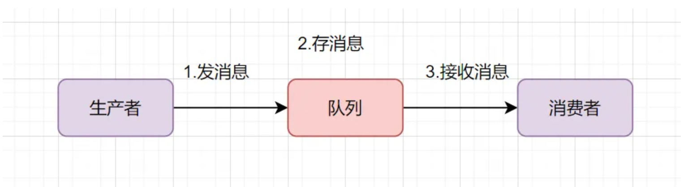

我们可以把消息队列看作是一个存放消息的容器，当我们需要使用消息的时候，直接从容器中取出消息供自己使用即可。由于队列 Queue 是一种先进先出的数据结构，所以消费消息时也是按照顺序来消费的。

参与消息传递的双方称为 **生产者** 和 **消费者** ，生产者负责发送消息，消费者负责处理消息。

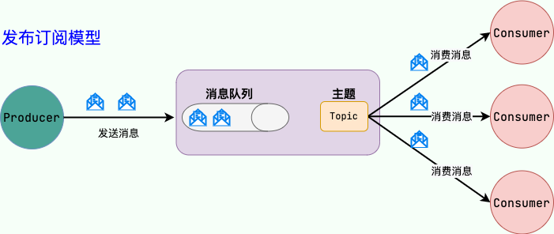

### 为什么要使用消息队列呢？

之所以需要使用消息队列（MQ），核心在于它能解决**同步调用**模式的固有缺陷：同步调用不仅**拓展性差**、**会导致性能下降**，**还容易引发级联失败（事务）**。

**消息队列作为实现异步调用的关键中间件，能通过异步通信机制，有效降低系统耦合度、提升性能与业务拓展性，同时实现故障隔离以避免级联失败，从而增强分布式系统的可用性、解耦能力和异步通信效率。**

### 消息队列应用场景有哪些？

- https://www.cnblogs.com/makemylife/p/18101509

- **实现异步处理，提升系统性能**：将耗时任务通过消息队列异步执行，可避免用户请求因等待耗时操作而延迟，快速响应用户并提升系统整体效率。
  - **例如**：用户下单后，系统无需同步处理订单信息校验、库存更新等耗时步骤，可立即返回 “下单成功” 的反馈，同时将订单处理任务放入消息队列，由后台服务异步完成；在多步骤非同步操作中（如订单创建后需更新轨迹、库存、客户状态等），通过消息队列异步执行这些任务，能显著加快系统响应速度，优化用户体验。

- **削峰限流，保障系统稳定**：面对短时间高并发请求（如秒杀、促销活动），消息队列可作为缓冲区，先存储大量瞬时请求，再由后端服务按自身处理能力逐步消费，避免直接冲击后端导致系统崩溃，实现 “削峰填谷”。
  - 以秒杀场景为例：用户海量请求先被发送至消息队列（如 RocketMQ），队列按顺序缓存请求；下游通知系统从队列中按合理速率读取消息，仅处理满足秒杀条件的请求并通知用户。这一过程中，生产者异步发送消息快速响应用户，消费者动态调整速率适配负载，有效抵御流量峰值。

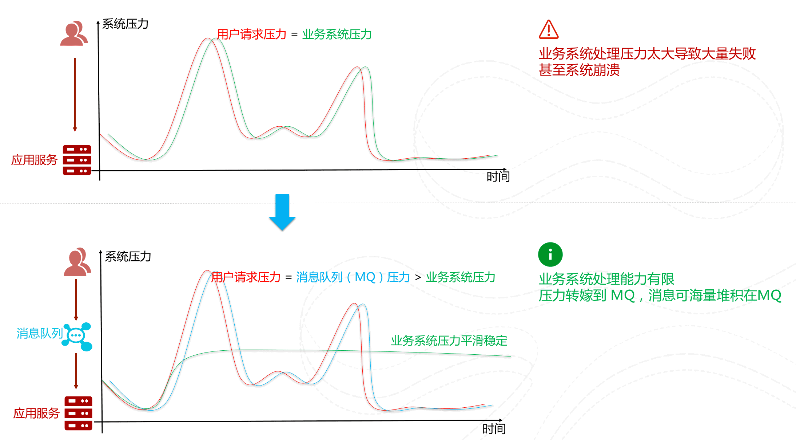

- **异步解耦，降低系统耦合性**：基于发布 - 订阅模式，消息生产者仅需将消息发送至队列，无需关注消费者是谁；消费者从队列获取消息处理，无需与生产者直接通信。这种 “无直接依赖” 的设计，大幅降低模块间耦合，提升系统扩展性。
  - 例如：商城系统中，用户下单后需触发财务扣款、仓储调库存、物流发货、消息通知等操作。通过消息队列，下单服务只需发送 “订单创建” 消息，各下游服务订阅消息后自行处理，新增服务（如风控）只需订阅消息即可接入，无需修改原有系统，保障了系统稳定性和可扩展性。


- **延时/定时调度**：消息队列支持消息发送后延迟指定时间再被消费，适用于订单超时处理、分布式延时任务等场景。主流消息队列（如 RocketMQ 5.0、RabbitMQ、Pulsar）可提供秒级精度的定时能力，且无需复杂的数据库扫描，性能高效、开发门槛低。

- **其他场景**

  - **分布式事务**：在分布式系统中，跨多个服务的操作需要保证 “要么全成功，要么全失败” 的原子性（即分布式事务一致性），消息队列的事务消息功能是实现这一目标的重要方案。通过 “事务消息” 机制，将分布式操作拆分为 “本地事务执行” 和 “消息通知其他服务” 两个步骤，并通过消息队列的状态确认机制确保两者的一致性。以 RocketMQ 为例，其事务消息流程如下：

    - 生产者发送 “半消息”（暂不投递的消息）到队列，此时消息处于待确认状态；
    - 执行本地事务（如 A 服务扣减库存），若本地事务成功，向队列发送 “提交” 指令，消息被投递到消费者（如 B 服务执行加库存）；若本地事务失败，发送 “回滚” 指令，消息被丢弃，避免其他服务执行无效操作。

    - **典型场景**：

      - 跨银行转账：用户从银行 A 转账到银行 B，需保证 A 扣钱和 B 加钱同时成功。通过事务消息，银行 A 扣钱成功后才通知银行 B 加钱，若 A 扣钱失败则消息回滚，避免单边账；

      - 电商订单与库存：下单时需扣减库存并创建订单，若库存扣减失败，订单创建消息回滚，确保库存与订单状态一致。

  - **顺序保证**：在部分业务中，数据的处理顺序直接影响结果正确性（如流程依赖、状态流转），消息队列可通过机制保证消息按发送顺序被消费。大多数消息队列（如 RocketMQ）通过队列内消息有序实现顺序性。例如：RocketMQ 支持 “全局顺序消息”（单队列存储所有消息）和 “局部顺序消息”（按业务标识分片到固定队列），满足不同粒度的顺序需求。
    - **典型场景**：
      - 订单状态流转：订单的 “创建 - 支付 - 发货 - 完成” 状态需按顺序处理，若 “支付” 消息先于 “创建” 消息被消费，会导致业务逻辑错误，消息队列的顺序保证可避免此类问题；
      - 数据同步：数据库 binlog 同步到数据仓库时，需按 SQL 执行顺序同步，否则会导致数据不一致，消息队列的顺序性可确保同步准确性。

### 使用消息队列会带来哪些问题？

- **系统可用性降低**：引入消息队列后，它会成为系统的核心依赖组件。一旦 MQ 出现故障（如集群宕机、消息丢失），会直接阻断业务流程 —— 生产者无法发送消息、消费者无法获取消息，导致上下游服务交互中断。为避免可用性下降，需额外设计高可用方案（如 MQ 集群部署、主从备份），但这会增加系统的维护成本；若高可用设计不到位，系统整体可用性反而会因 MQ 的引入而降低。

- **系统复杂性提升**：消息队列的加入会引入一系列需额外处理的问题，显著增加系统设计与维护的复杂度：
  - **消息重复消费**：发送或消费重试可能导致消息重复，若业务未做去重处理（如重复积分），会引发异常；
  - **消息丢失**：需应对生产者发送失败、MQ 存储故障、消费者处理失败未确认等场景下的消息丢失问题；
  - **消息顺序性**：发布订阅模型中，消息可能因多分区、多消费者导致无序，若涉及资金等关键业务，无序消费可能引发严重后果。
- **一致性与可靠性挑战**：
  - **数据一致性风险**：异步场景下，若消费者未正确处理消息（如处理失败未重试），会出现如果生产者已执行操作，当时消费者未同步执行的不一致状态（例如订单支付成功，但积分系统未加分）；
  - **分布式事务难题**：跨系统交互时（如订单系统扣钱与积分系统加分），需保证 “要么都成功，要么都失败”，但 MQ 本身无法直接解决分布式事务问题，需额外设计补偿机制（如事务消息）；
  - **消息堆积隐患**：若生产者发送速度远快于消费者处理速度，消息会在队列中大量堆积，不仅占用存储空间，还可能因积压过久影响业务时效性，甚至拖垮下游系统。

### 消息队列有哪些？简单介绍一下各自的特点？

#### RocketMQ

- **出身**：阿里开源，现在是 Apache 顶级项目，Java 写的，国内用得很多。
- 最突出的点：
  - 吞吐高：单机十万级，支持海量消息堆积（10 亿级），双 11 扛过考验，适合秒杀、大促场景。
  - 可靠：能通过配置做到消息 0 丢失，金融场景（比如订单、支付）常用。
  - 功能全：支持事务消息、定时消息这些高级功能，Java 团队改源码也方便。
- **缺点**：客户端语言支持少，主要是 Java，C++ 不成熟；没实现 JMS 接口，迁移麻烦。

#### RabbitMQ

- **出身**：开源，用 Erlang 写的，基于 AMQP 协议，老牌消息队列。
- 最突出的点：
  - 灵活：路由功能强，支持各种复杂的消息转发（比如通过交换机路由），多协议兼容（AMQP、STOMP 等）。
  - 多语言友好：Java、Python、PHP 这些主流语言都支持，适合公司多语言开发的场景。
  - 易管理：自带管理界面，运维起来方便。
- **缺点**：Erlang 语言开发，源码难改；单机吞吐一般（万级），不如 RocketMQ 和 Kafka。

#### Kafka

- **出身**：LinkedIn 开源，Apache 顶级项目，早期用来处理日志，现在是流式处理利器。
- 最突出的点：
  - 吞吐极高：单机十万级，比 RocketMQ 还强点，适合海量数据场景（比如日志收集、用户行为分析）。
  - 架构简单：新版本（3.3+）不用依赖 Zookeeper 了，部署维护更方便。
  - 流式处理：不仅能发消息，还能实时处理消息流，大数据场景常用。
- **缺点**：功能单一，高级特性少（比如没有事务消息）；消息可靠性一般，可能丢少量数据。

#### ActiveMQ

- 老牌队列，Apache 的，Java 写的，支持多种协议。
- 现在用得少了，因为吞吐低（万级），功能也不如其他几个全，面试提一句 “早期常用，现在基本被替代” 就行。

### 消息队列选型

目前主流的消息队列有三种：RabbitMQ、RocketMQ、Kafka，三者的关键差异可以从几个核心维度区分：

- **吞吐量**：RabbitMQ 是 “万级” QPS，适合中小规模场景；RocketMQ 和 Kafka 是 “10 万级”，能抗住高并发（比如秒杀、大促）。
- **可用性**：三者都支持集群部署，可用性较高。其中 RocketMQ 和 Kafka 的分布式架构更成熟，节点故障时对整体影响更小；RabbitMQ 通过主从复制也能保证高可用。
- **消息可靠性**：RabbitMQ 和 RocketMQ 的可靠性更强（默认配置下不易丢消息）；Kafka 默认是异步刷盘，极端情况下可能丢失少量消息（需通过配置优化）。
- **功能丰富度**：RocketMQ 支持事务消息、延迟队列、顺序消息等 12 种高级特性，适合复杂业务；RabbitMQ 功能均衡（如死信队列、消息确认机制），适合通用场景；Kafka 功能相对单一，主要聚焦 “收发消息”，适合简单数据传输。
- **开发语言**：RabbitMQ 基于 Erlang 开发，源码阅读门槛高；RocketMQ 基于 Java 开发，对 Java 技术栈团队更友好；Kafka 基于 Scala&Java，国内团队熟悉度略低于 RocketMQ。

#### 选型核心思路匹配业务场景

- **高吞吐 + 简单场景（如日志采集、监控数据传输）**：优先 Kafka，它的极致吞吐（普通机器可抗十几万 QPS）能高效处理 “纯数据管道” 类需求，且部署成本低。
- **多主题 + 通用场景（如公司中台、多业务接入）**：需支持大量主题（Topic），RabbitMQ 支持百万级主题，性能稳定；RocketMQ 支持千级主题，也能满足多数场景；Kafka 仅支持百级（多了性能下滑），不适合这类场景。
- **复杂业务 + 高可靠场景（如金融交易、订单链路）**：需丰富功能和稳定性，RocketMQ 的事务消息（解决分布式事务）、顺序消息（如物流状态同步）等特性更适配；RabbitMQ 也能满足部分需求，但复杂功能（如事务）需二次开发。

#### 为什么选择 RocketMQ？

我们项目选择 RocketMQ，主要考虑三点：

- **团队适配性**：基于 Java 开发，团队都是 Java 栈，遇到底层问题时能直接读源码排查，比 RabbitMQ（Erlang 开发）的维护成本低很多。
- **生产级验证**：作为阿里开源中间件，经历过双十一等超大规模场景考验，稳定性有保障；社区活跃，线上问题能快速找到解决方案。
- **功能覆盖业务**：我们有分布式事务（如支付结果同步）、订单超时关闭（延迟队列）、物流状态顺序更新（顺序消息）等需求，RocketMQ 的原生支持直接满足，减少了二次开发成本。

#### RabbitMQ、RocketMQ、Kafka 的针对性选型

- **RabbitMQ**：适合中小规模、功能需求均衡的场景（如普通业务通知、简单异步通信），尤其是需要支持大量主题（如中台多业务接入）时，它的百万级主题支持是优势；但 Erlang 开发的维护门槛，不适合需要深度定制的团队。
- **RocketMQ**：适合中大规模、业务复杂的场景（金融交易、订单链路），需要事务、延迟等高级功能，且团队是 Java 栈，它的功能丰富度和维护成本平衡得最好。
- **Kafka**：适合 “数据管道” 类场景（日志采集、监控数据传输），追求极致吞吐且功能需求简单，能接受少量消息丢失风险（可通过配置优化），选它最高效。

### 消息重复消费怎么解决？

首先我们需要知道为什么会产生重复消息，主要从两个角度考虑：

- **生产端重试机制**：生产端发送消息后，若未收到 MQ 服务器的确认ACK（可能因网络波动、服务器临时故障），会触发重试逻辑重复发送消息，导致 MQ 中出现重复消息。

- **消费端位移提交延迟**：消费端处理消息后，需向 MQ 提交 “消费位移”（标记消息已处理）。若处理完成但位移未提交时服务宕机，重启后 MQ 会认为消息未消费，重新推送，导致重复消费。

知道原因之后，再看如何解决消息重复消费，首先RocketMQ 本身不直接消除重复消息，因此我们需要**通过业务层实现幂等性，确保重复消息不会影响最终业务状态**。我们可以通过以下方案来防止消息队列重复消费：

- **生产端优化（辅助作用）**：成熟的 MQ 框架（如 RocketMQ）会通过`message_id`进行去重，允许生产端自定义唯一`message_id`，MQ 会对相同 ID 的消息去重（通过本地存储已处理 ID，以空间换时间）；并且生产端仍需避免无意义重试（例如设置合理超时时间、区分可重试 / 不可重试场景）。

- **消费端核心方案（业务层幂等）**：无论 MQ 如何优化，**消费端都需通过业务标识确保同一消息仅生效一次**，常见实现方式：

  - **唯一标识校验**：用业务唯一 ID（如订单号、支付流水号）作为幂等键，处理前先查询数据库 / Redis，若已处理则直接跳过。

  - **原子操作**：通过数据库唯一索引、Redis SETNX 等原子操作，确保重复请求仅执行一次（例如 “插入订单” 时用订单号作为唯一索引，重复插入会触发异常，直接忽略）。

### 消息队列的可靠性怎么保证？

消息队列主要分为三大块：**生产者、中间件、消费者**，分别对应着消息丢失可能发生的三个阶段：生产阶段、存储阶段、消费阶段。要保证消息的可靠性，就需要从这三个阶段入手。

- 在**消息生产阶段**，核心目标是确保消息能成功从生产者传递到消息队列中间件。可以通过以下方式实现：
  - **同步发送**：生产者发送消息后等待中间件的确认响应，只有收到成功反馈才判定发送完成，若失败或超时则触发重试。
  - **异步发送**：通过回调函数监听发送结果，一旦发现异常立即执行重试逻辑。
  - **超时处理**：**可借助中间件提供的日志查询 API，校验消息是否已实际存储在 Broker 中**，以此为依据决定是否需要重新发送。
- 在**消息存储阶段**的关键是保障消息在中间件中稳定留存，即便遭遇系统故障也不丢失。措施包括：
  - **持久化存储**：确保消息队列能够持久化消息是非常关键的。例如 RabbitMQ 可通过将队列和消息均设置为持久化（`durable = true`），使消息写入磁盘；RocketMQ 则将消息持久化到 CommitLog 日志文件，确保服务器重启或 Broker 宕机后，未处理的消息仍可恢复。
  - **刷盘机制**：Broker 提供同步刷盘和异步刷盘两种方式。同步刷盘更可靠，Producer 发送消息后，等待数据持久化到磁盘后再返回响应。
  - **主从模式**：Broker 支持 Master 和 Slave 同步复制或异步复制模式。生产者将消息发送到 Master，消费者可以从 Master 或 Slave 消费。同步复制模式确保即使 Master 宕机，Slave 中也有消息备份，保证消息不丢失。
- 在**消息消费阶段**：消费者在接收和处理消息时，必须确保消息被可靠消费。
  - **采用延迟确认机制**：消费者在执行完所有消费业务逻辑后，再发送消费确认，消息队列只有收到确认后，才会将消息从队列中移除。这样，如果消费过程中出现异常，消息队列会重新投递消息，确保消息不丢失。
  - **采用合适的消息重试策略**：当消费者处理消息失败时，需要有合理的重试策略。可以设置重试次数和重试间隔时间。例如，在第一次处理失败后，等待一段时间（如 5 秒）后进行第二次重试，如果重试多次（如 3 次）后仍然失败，可以将消息发送到死信队列，以便后续人工排查或者采取其他特殊处理。

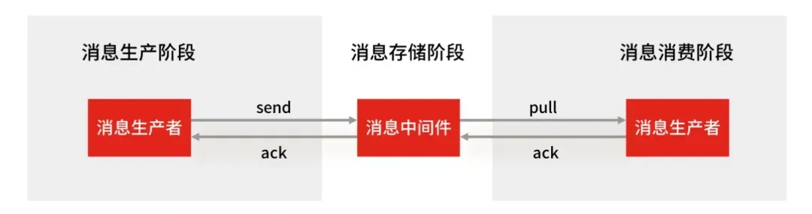

### 消息队列的顺序性怎么保证

**消息的有序性，指消息的消费顺序能与发送顺序严格保持一致**。比如一个订单产生的 “订单创建、订单付款、订单完成”3 条消息，消费时同一条订单必须按这个顺序处理，否则会造成业务混乱；而不同订单的消息可并发消费，比如先处理第三个订单的付款，再处理第二个订单的创建，不会影响业务逻辑。

消息顺序性保证的方式如下：

- **有序消息处理场景识别**：首先需要明确业务场景中哪些消息是需要保证顺序的。例如，在金融交易系统中，对于同用户的转账操作顺序是不能打乱的。对于需要顺序处理的消息，要确保消息队列和消费者能够按照特定的顺序进行处理。
- **消息队列对顺序性的支持**：部分消息队列本身提供了顺序性保证的功能。比如 RocketMQ 可以通过将消息划分到同一个队列（Queue）来保证消息在队列内是有序的，消费者按照队列顺序读取消息就可以保证消息顺序。但这也可能会限制消息的并行处理程度，需要在顺序性和吞吐量之间进行权衡。
- **消费者顺序处理策略**：消费者在处理顺序消息时，应该避免并发处理可能导致顺序打乱的情况。例如，可以通过单线程或者使用线程池并对顺序消息进行串行化处理等方式，确保消息按照正确的顺序被消费。

### RocketMQ顺序消息如何实现？

RocketMQ 实现顺序消息的核心逻辑，是通过**严格控制消息的生产路由与消费执行顺序**实现的：即保证同一业务维度（如同一订单、同一用户）的消息，在生产时被发送到同一个队列，并在消费时由同一个消费者线程按队列内顺序处理。

需要明确的是，**RocketMQ 仅保证队列层面的局部顺序一致性，而非主题层面的全局有序，也就是说，主题本身是无序的，只有将消息约束在单个队列中，才能利用队列的先进先出特性实现顺序性。**

基于此，RocketMQ 推荐的顺序消费方案是：按业务维度划分队列，将需要顺序消费的消息路由到同一队列（满足顺序需求），不同业务维度的消息则分散在不同队列并发消费（兼顾处理效率，避免消息堆积）。其底层原理可拆解为两点：

1. **生产端（Producer）**：将同一业务维度的一批有序消息，强制发送到同一个 MessageQueue；
2. **消费端与 Broker 端**：Broker 通过对 MessageQueue 加锁，确保单个队列仅被一个 Consumer 占用；Consumer 再通过单线程消费该队列消息，最终保证消费顺序与生产顺序一致。

根据顺序保障的范围，RocketMQ 顺序消息可分为两类，二者特性与适用场景差异显著：

- **局部顺序消息**：仅保证 “同一消费队列” 内的消息有序，不同队列的消息仍可并发且无序；且在 Broker 重启的短暂时间内，可能出现临时乱序。这是最常用的模式，能平衡顺序需求与系统吞吐量。
- **全局顺序消息**：保证整个 Topic 内所有消息的绝对有序，即使 Broker 异常重启也不会破坏顺序性。但该模式代价极高 —— 由于所有消息需依赖单个队列，一旦 Broker 集群中承载该队列的机器不可用，整个集群将无法提供服务，仅适用于 binlog 同步等极端严格的场景。

实际业务中，大多数场景可容忍短暂乱序，因此**局部顺序消息是主流选择**。需注意的是，RocketMQ 生产者默认采用 “轮询”（或其他负载均衡策略）向 Topic 的不同队列发送消息，若不做自定义配置，同一业务维度的消息（如同一订单的 “创建 - 支付 - 发货”）可能被分散到不同队列，导致无法利用队列有序特性。因此，局部顺序消息需通过自定义路由逻辑解决这一问题。

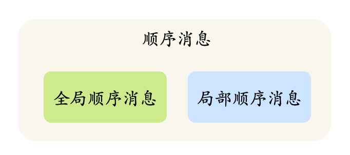

#### 局部顺序消息如何实现？

局部顺序消息是**最贴合 RocketMQ 队列有序特性的场景**，核心是 “同一业务分区有序、不同分区并发”，完全匹配大多数业务的顺序需求（如订单流程、用户操作日志）。

其实现逻辑围绕 “消息路由到固定队列” 和 “单线程消费队列” 展开，具体分三步：

1. **生产端需固定业务消息到同一队列**，通过「自定义 MessageQueueSelector + Hash 取模」实现。以业务唯一标识（如订单 ID、用户 ID）为 Hash 输入，对 Topic 的队列总数取模，将计算结果对应的队列作为消息的目标队列。这样可确保同一业务标识的消息始终路由到同一个 MessageQueue。**RocketMQ 提供了三种队列选择算法，可根据需求选择：**

   - **轮询算法**：默认策略，按队列顺序依次发送消息，保证消息在各队列均匀分布（不适合顺序场景，需替换）；

   - **最小投递延迟算法**：优先选择投递延迟低的队列，可能导致消息分布不均，需通过 `producer.setSendLatencyFaultEnable(true)` 开启；

   - **自定义算法**：继承`MessageQueueSelector`重写选择逻辑，示例代码如下：

     ```java
     SendResult sendResult = producer.send(msg, new MessageQueueSelector() {
         @Override
         public MessageQueue select(List<MessageQueue> mqs, Message msg, Object arg) {
             // arg 可传入业务标识（如订单ID）
             Long orderId = (Long) arg;
             // Hash 取模：确保同一订单ID路由到同一队列
             int queueIndex = (int) (orderId % mqs.size());
             return mqs.get(queueIndex);
         }
     }, orderId); // 传入业务标识作为 arg
     ```

2. **消费端要确保单线程消费单个队列**，RocketMQ 默认按 “队列粒度” 分配消费线程：每个 MessageQueue 仅绑定一个消费线程，无需额外配置。若自定义消费线程池，需确保 “队列与线程一一对应”，避免多线程并发消费同一队列导致乱序。

3. **顺序保障逻辑**表现为：同一业务标识的消息被路由到同一队列，且该队列仅被单线程消费，最终实现同一业务维度严格有序、不同业务维度并发处理的效果。

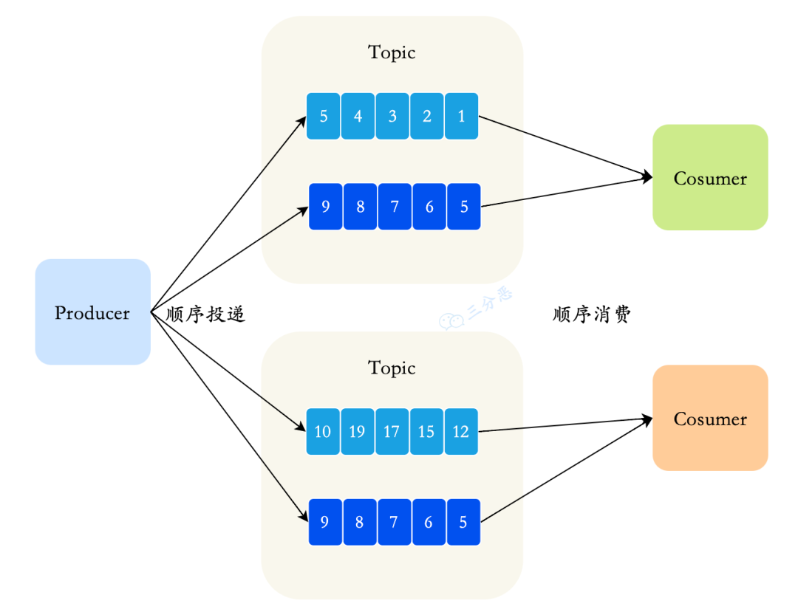

#### 全局顺序消息如何实现？

全局顺序消息要求整个 Topic 内所有消息严格按生产顺序消费，仅适用于对顺序绝对敏感且能接受低可用性的场景（如数据库 binlog 同步）。其核心是**强制所有消息进入同一个 MessageQueue**，具体实现逻辑如下：

1. **Topic 配置：仅创建一个队列**：在创建 Topic 时，指定队列数量为 1（配置参数 `defaultQueueNums=1`），确保整个 Topic 只有一个 MessageQueue—— 所有消息只能进入该队列，从源头保证生产顺序。
2. **生产端：无需复杂路由逻辑**：由于 Topic 仅一个队列，生产者无需自定义 `MessageQueueSelector`，所有消息默认发送到该唯一队列；若需更严谨，也可通过自定义 Selector 强制指定该队列。
3. **消费端：仅启动一个消费线程**：即使 Consumer 集群有多个节点，也需确保仅一个节点消费该唯一队列；同时，消费节点内仅启动一个消费线程，避免多线程并发破坏顺序。

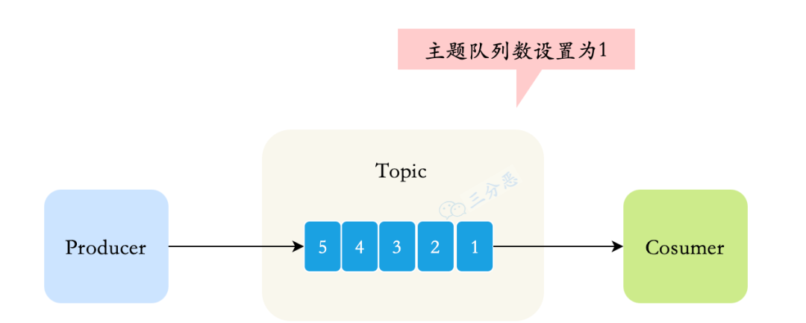

### 消息堆积怎么处理？

当出现消息堆积时，核心是尽快消费完堆积的消息，关键在于提高消费能力。

**通常有两种处理办法： 消费者扩容和消息迁移与队列扩容**

- **消费者扩容**：如果当前主题（Topic）的消息队列（Message Queue）数量多于消费者（consumer）数量。
  - 具体做法：通过增加消费者的数量，让更多的消费者一起处理消息。因为每个消费者可以负责处理一个或多个消息队列的消息，消费者多了，整体的消费速度会加快，能更快把积压的消息处理完。
- **消息迁移与队列扩容**：如果当前主题（Topic）的消息队列（Message Queue）数量少于或等于消费者（consumer）数量，这时再增加消费者也起不到作用。
  - 具体做法：
    1. 新建一个临时主题（temporary Topic），给这个临时主题设置更多的消息队列；
    2. 先用一些消费者把原主题中积压的消息转发到临时主题（这些消费者只负责转发，不做业务处理，速度很快）；
    3. 为临时主题配备足够多的消费者（数量和临时主题的消息队列数量匹配），快速处理临时主题里的消息；
    4. 等积压的消息处理完后，恢复原来的消费流程。

> 当然，最快速解决消息堆积问题的方法还是增加消费者实例，不过 **同时你还需要增加每个主题的队列数量** 。
>
> 别忘了在 `RocketMQ` 中，**一个队列只会被一个消费者消费**

### 半消息实现分布式事务消息以保证数据一致性

一条普通的MQ消息，从产生到被消费，大概流程如下：

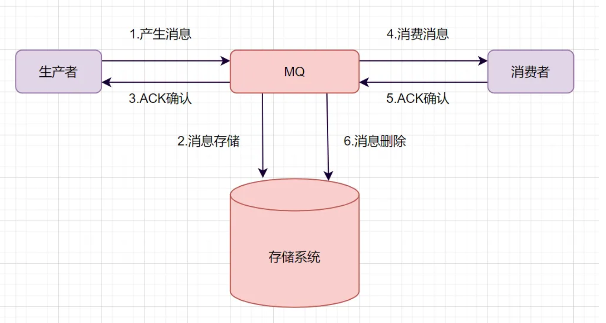

1. 生产者产生消息，发送带MQ服务器
2. MQ收到消息后，将消息持久化到存储系统。
3. MQ服务器返回ACK到生产者。
4. MQ服务器把消息push给消费者
5. 消费者消费完消息，响应ACK
6. MQ服务器收到ACK，认为消息消费成功，即在存储中删除消息。

但这种流程无法解决 **“本地事务执行” 与 “消息发送” 的一致性问题 **（比如本地事务成功但消息发送失败，会导致下游数据缺失）

**半消息是事务消息的核心载体**，指**生产者发送到 MQ 服务器后，被标记为 “暂不可投递” 状态的消息**，此时消费者无法感知这条消息，只有等生产者完成本地事务并进行二次确认（commit/rollback）后，MQ 才会决定将消息投递或丢弃。

**以下单场景为例**：订单系统需要在 “创建订单”（本地事务）后，通过消息通知库存系统减库存。若订单创建成功但消息没发出去，会导致库存未减，数据不一致。事务消息的解决逻辑如下：

1. **生产者发送半消息(①）**：生产者生成消息后，先向 MQ 服务器（Broker）发送一条半消息（事务消息）。
2. **MQ 暂存半消息并反馈(②、③)**：MQ 收到半消息后，将其持久化到存储系统，同时标记为 “待发送 / 暂不可投递” 状态（消费者此时无法感知），并向生产者返回 “半消息发送成功” 的 ACK。
3. **生产者执行本地事务(④)**：生产者收到 ACK 后，执行核心业务逻辑（如创建订单、扣减余额等本地事务）。
4. **二次确认(⑤)**：本地事务执行完成后，生产者根据执行结果向 MQ 发送二次确认：
   - 若本地事务成功，发送 “commit” 指令，即MQ服务器直接将半消息标记为 “可投递”；
   - 若本地事务失败，发送 “rollback” 指令，即MQ服务器直接丢弃此半消息。
5. **正常情况：消费者接收并处理消息(⑥、⑦、⑧)**。具体来说，若 MQ 收到 “commit”指令，则将消息推送给消费者；消费者处理完消息（如执行下游业务，如减库存）后，向 MQ 返回 ACK，MQ 删除消息，流程结束。
6. **异常情况，即未收到二次确认时：MQ 触发消息回查（⑨）**。具体来说，若因网络故障等原因，MQ 长时间未收到生产者的 commit/rollback 指令，会主动扫描 “未确认的半消息”，并向生产者发起 “事务状态查询”。
7. **生产者回查并补充确认**：生产者收到回查请求后，查询本地事务的实际执行结果（如订单是否成功创建），并根据结果向 MQ 补充发送 commit/rollback 指令，MQ 按步骤 4 的规则处理消息，最终保证数据一致。（因此需要些回查代码）

> 生产者回查失败了可以通过消息队列的重试机制或者加入死信队列，进行人工处理

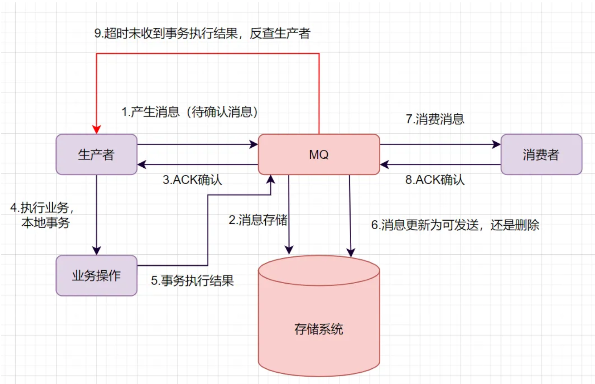

### 延时消息了解吗？

**延时消息是指消息发送后，不会被立即消费，而是需要等待指定的延时时间后，才会被投递到目标队列供消费者处理的消息类型。**

它在实际业务中应用广泛，最典型的场景如**电商订单超时自动取消**：用户提交订单后，系统发送一条延时消息（如 15分钟后触发），到期后检查订单状态，若仍未付款则自动取消订单并释放库存。

#### RocketMQ延时消息是怎么实现的？

由于RocketMQ 原生支持延时消息，**在代码层面**，使用时只需在代码中为消息指定**延时级别**（4.x 版本）或**具体延时时间**（5.x 版本）即可，无需额外复杂配置。

**底层原理层面，RocketMQ实现延时消息的核心机制可概括为：专用队列临时存储 + 定时任务到期转发，不同版本的实现细节有所区别：**

- 4.x 版本仅支持预设的延时等级。其底层流程为：

  - Broker 接收延时消息后，不会直接投递到目标 Topic，**而是先将其存入一个特殊的临时主题 `SCHEDULE_TOPIC_XXXX` 中**，**该主题下的队列与延时等级一一对应（不同等级的消息进入不同队列）**。

  - Broker 内部的 `ScheduleMessageService` 组件会**启动定时任务**，轮询 `SCHEDULE_TOPIC_XXXX` 的各个队列，检查消息是否达到预设的延时时间。

  - 当消息到期后，定时任务会将其从临时队列中取出，重新投递到原目标 Topic 的队列中，此时消费者即可像消费普通消息一样处理该延时消息。

- **5.x 版本：引入了时间轮（TimerWheel）组件，支持任意精度的延时时间（不再依赖固定等级）**。本质仍基于 “临时存储 + 定时调度”，但通过时间轮优化了定时任务的调度效率：时间轮通过分层的环形结构管理延时任务，能更高效地触发到期消息的投递，解决了 4.x 版本中固定等级的局限性，同时提升了大量延时消息场景下的处理性能。


RocketMQ 4.x 版本的延时消息依赖预设的延时等级（如 1s、5s、10s 等，共 18 个等级），底层通过将延时消息先发送到名为`SCHEDULE_TOPIC_XXXX`的特殊主题，消息存储时会根据延时等级确定对应的队列（每个等级对应一个队列），然后由定时任务线程每隔一定时间扫描这些队列，当消息到达预设延时时间后，将其重新投递到目标主题的队列中，供消费者消费。

RocketMQ 5.x 版本的延时消息引入了时间轮（TimeWheel）机制，支持任意精度的延时时间（不再依赖固定等级），底层将延时消息存储在专门的延时队列中，时间轮通过分层计时（如秒级、分级、小时级）跟踪消息到期时间，当消息到达延时时间后，由时间轮触发回调，将消息从延时队列迁移到目标消费队列，实现精准的延时投递，大幅提升了灵活性和时效性。

RocketMQ 5.x 的时间轮处理延时消息时，先根据消息延时时间确定其所属层级（如秒级、分钟级等），将消息放入对应层级时间轮的指定槽位（槽位对应固定时间间隔）；随着时间轮指针按固定间隔转动，若消息在高层级，会在指针到达其槽位时被下转到低层级时间轮继续等待，直至进入最低层级；当指针最终指向消息所在槽位时，遍历槽内消息，将到期的消息从延时队列投递到目标消费队列，完成延时触发。

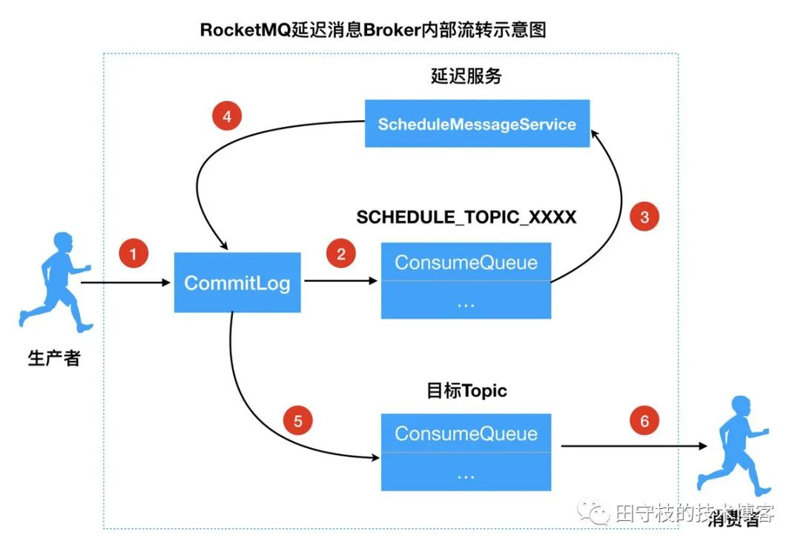

#### RabbitMQ怎么实现延迟消息？

延迟队列是一种特殊的消息队列，专门用于存储延迟消息，即消息发送后不会被消费者立即获取，而是需等待预设的延迟时间到期后，才会被投递到消费队列供消费者处理。

RabbitMQ 本身并未原生提供延迟队列功能，要实现延迟消息的处理，通常有两种主流方式：

- **基于 TTL + 死信交换机（DLX）的组合实现**：消息发送时可设置 TTL（Time To Live，消息存活时间），若消息在 TTL 内未被消费，则会成为 “死信”。此时通过配置队列的死信交换机（DLX），可将死信路由到指定的消费队列，消费者从该队列获取消息时，便相当于实现了 “延迟消费”。整个流程通过 “消息过期触发死信 → 死信交换机转发到消费队列” 的机制，间接实现延迟效果。

- **基于官方插件 rabbitmq-delayed-message-exchange 实现**：RabbitMQ 3.5.7 及以上版本支持该插件（依赖 Erlang/OPT 18.0 及以上）。插件提供了一种特殊的交换机类型（x-delayed-message），消息发送到该交换机时可直接指定延迟时间，交换机将在延迟时间到期后，自动将消息路由到绑定的目标队列，无需手动处理死信，简化了延迟队列的实现流程。

综上，AMQP 协议及 RabbitMQ 本身并未直接支持延迟队列，但通过 TTL+DLX 的组合机制，或借助专用插件，均可有效实现延迟消息的处理需求。

### 死信队列知道吗？

**死信队列是消息中间件中用于存储无法被正常处理的消息的专用队列，其核心作用在于：避免未成功消费的消息直接丢失，通过留存死信保障消息处理的可追溯性；便于后续排查消费失败的原因（如业务逻辑漏洞、依赖服务异常等）；支持对死信消息进行重新投递、备份等操作，确保消息最终能被正确处理。**

不同中间件的实现方式有所差异，以下分别说明：

#### RocketMQ 的死信队列

- **自动创建机制**：RocketMQ 会为每个产生死信的主题自动创建对应的死信队列（命名规则为 `%DLQ%+原主题名`），无需手动配置。
- **死信产生场景**：主要与消费重试相关。当消息被消费者消费失败后，RocketMQ 会按照预设策略重试（如固定间隔重试），若超过**最大重试次数**仍未成功消费，消息会被标记为死信，自动进入对应死信队列。
- 核心作用：
  - 留存死信便于排查失败原因（如业务逻辑问题、依赖故障等）；
  - 问题解决后可从死信队列重发消息，让消费者再次处理；
  - 支持导出备份，避免消息丢失。

#### RabbitMQ 的死信队列

- **手动配置机制**：RabbitMQ 原生支持死信队列，但需手动配置关联关系（非自动创建），核心通过设置死信交换机实现路由。
- **死信产生场景**：
  - ① 消息被消费者通过 `basic.reject`/`basic.nack` 手动拒绝，且参数 `requeue=false`（不重新入队）；
  - ② 消息超过预设过期时间（TTL）未被消费；
  - ③ 队列达到最大长度，新消息入队时旧消息被 “挤出”。
- **配置方式**：
  - ① 定义 “死信交换机”（DLX，类型可与业务交换机一致）；
  - ② 定义 “死信队列”，并与死信交换机通过绑定键关联；
  - ③ 在业务队列属性中，通过 `x-dead-letter-exchange` 指定死信交换机，`x-dead-letter-routing-key` 指定死信路由键（默认使用原消息路由键）。
- **核心作用**：通过留存死信支持后续排查、重发或备份，区别在于 RabbitMQ 可通过配置自定义死信路由规则，灵活性更高。

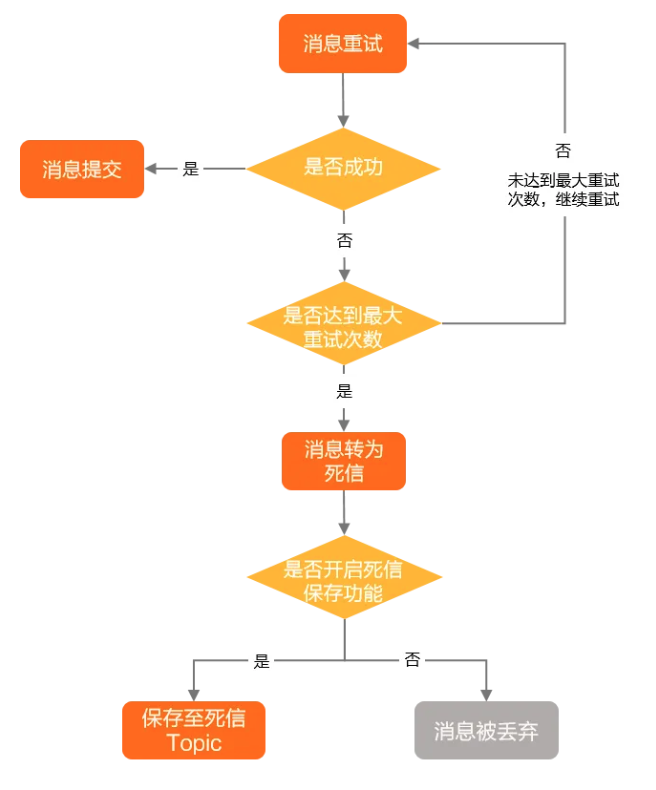

### 消息队列有哪些消息模型？

消息队列有两种模型：**队列模型**和**发布/订阅模型**。

- **队列模型**：这是消息队列最基础的模型，对应 “发送 - 存储 - 接收” 的核心流程。在该模型中，生产者将消息发送至特定队列，一个队列可接收多个生产者的消息；同时，一个队列也可关联多个消费者，但消费者之间是竞争关系，也就是说每条消息只会被其中一个消费者获取并消费，确保消息的唯一处理。

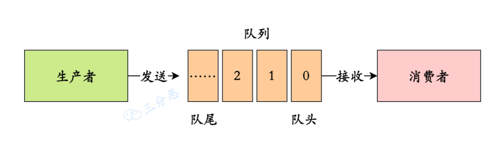

- **发布/订阅模型**：当需要将同一份消息分发给多个消费者，且每个消费者都需获取全量消息时，队列模型无法满足需求，发布 / 订阅模型由此产生。在该模型中，**消息发送方称为发布者（Publisher），接收方称为订阅者（Subscriber），服务端存储消息的容器称为主题（Topic）**。发布者将消息发送至主题，订阅者需先 “订阅主题” 才能接收消息。**这里的 “订阅” 既是动作，也可理解为主题在消费时的逻辑副本 —— 每个订阅者的订阅关系中，都能获取该主题的所有消息，实现消息的多副本分发。**

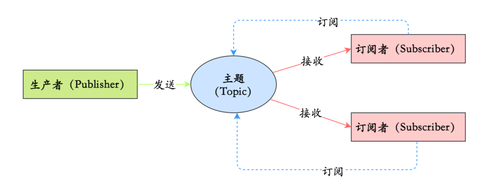

**两种模型的核心角色（生产者 / 发布者、消息容器 / 队列 / 主题、消费者 / 订阅者）本质一致，最关键的差异在于消息的消费方式： 队列模型中消息仅能被一个消费者消费，而发布 / 订阅模型支持消息被多个订阅者全量获取。**

### 消息队列是参考哪种设计模式？

消息队列的设计思路主要参考了**发布 - 订阅模式**，不过它与观察者模式有相似之处，核心差异在于解耦程度。但是两种设计模式思路是一样的，举个生活例子：

- **观察者模式**：就像公司行政给内部员工发福利（比如月饼、粽子）。这里 “公司” 是 “主题”（被观察者），“员工” 是 “观察者”，行政部门只是传递福利的 “直接桥梁”—— 主题（公司）明确知道观察者（员工）的存在，两者属于 “同一整体”，耦合度高。
- **发布 - 订阅模式**：类似公司给外部客户发快递。此时 “公司” 是 “发布者”，“客户” 是 “订阅者”，两者是独立个体，唯一的连接是 “快递公司”（即 “发布 - 订阅中心”）。发布者（公司）不需要知道订阅者（客户）是谁，只需把快递交给快递公司；订阅者（客户）也不需要关注谁发的快递，只需等待快递公司送达。这种模式通过中间层实现了发布者与订阅者的完全解耦，耦合度低。

为什么需要这种区分？如果用观察者模式的思路处理 “给外部发快递”（让公司自己管理配送），公司就会被迫承担快递公司的职能，导致业务繁杂、偏离核心目标。因此，当两个对象需要独立运作时，发布 - 订阅模式更合适。

- **观察者模式是一个一对多的关系**。观察者先主动订阅主题（被观察者），当主题状态变化时，会遍历所有已订阅的观察者，直接通知它们更新。此时，主题必须知道所有观察者的存在，双方是 “紧耦合” 的。。


- **发布订阅模式是多对多的关系，引入了中间层（发布订阅中心），实现发布者与订阅者的 完全解耦**。订阅者先在中心订阅感兴趣的消息，发布者只需将消息发送到中心，由中心负责把消息转发给所有对应订阅者。此时，发布者不知道订阅者是谁，订阅者也不知道发布者是谁，双方通过中间层间接交互。

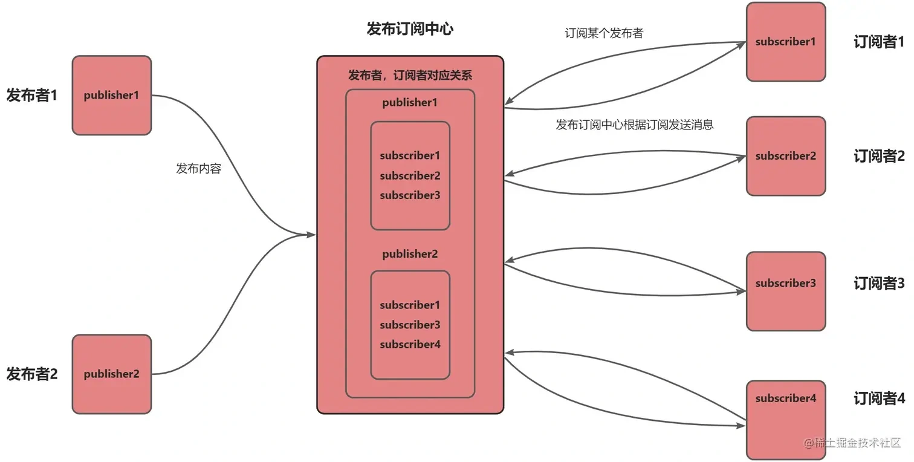

### 消息的消费模式了解吗？

消息消费主要有两种模式：**集群消费（Clustering）** 和**广播消费（Broadcasting）**。

- **集群消费是默认模式，指多个消费者组成一个消费组，共同消费某个主题的多个队列**。此时，一个队列只会被组内的一个消费者独占消费（避免重复处理）；若某个消费者故障下线，组内其他消费者会自动接替其负责的队列，继续消费，确保消息不积压。

- **广播消费则是同一消费组内的每个消费者都会收到并处理同一条消息，即消息会被全量分发到组内所有消费者**。适用于需要多节点同时处理同一份数据的场景（如多节点同步配置信息）。

### 让你写一个消息队列，该如何进行架构设计？

这个问题面试官主要考察三个方面的知识点：

- 你有没有对消息队列的架构原理比较了解
- 考察你的个人设计能力
- 考察编程思想，如什么高可用、可扩展性、幂等等等。

回答这类问题，并不要求你研究过那技术的源码，你知道那个技术框架的基本结构、工作原理即可。设计一个消息队列，我们可以从这几个角度去思考：

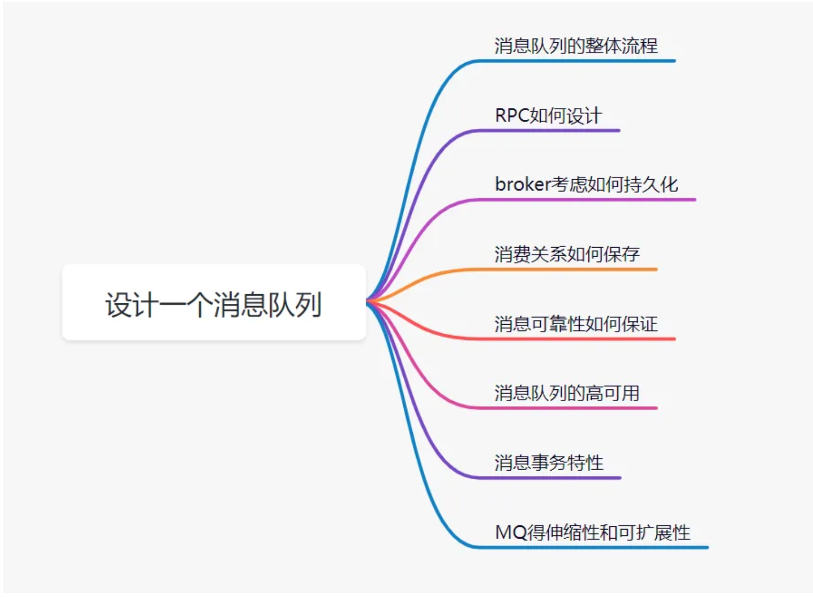

1. 首先是消息队列的整体流程，producer发送消息给broker，broker存储好，broker再发送给consumer消费，consumer回复消费确认等。
2. producer发送消息给broker，broker发消息给consumer消费，那就需要两次RPC了，RPC如何设计呢？可以参考开源框架Dubbo，你可以说说服务发现、序列化协议等等
3. broker考虑如何持久化呢，是放文件系统还是数据库呢，会不会消息堆积呢，消息堆积如何处理呢。
4. 消费关系如何保存呢？点对点还是广播方式呢？广播关系又是如何维护呢？zk还是config server
5. 消息可靠性如何保证呢？如果消息重复了，如何幂等处理呢？
6. 消息队列的高可用如何设计呢？可以参考Kafka的高可用保障机制。多副本 -> leader & follower -> broker 挂了重新选举 leader 即可对外服务。
7. 消息事务特性，与本地业务同个事务，本地消息落库;消息投递到服务端，本地才删除；定时任务扫描本地消息库，补偿发送。
8. MQ得伸缩性和可扩展性，如果消息积压或者资源不够时，如何支持快速扩容，提高吞吐？可以参照一下 Kafka 的设计理念，broker -> topic -> partition，每个 partition 放一个机器，就存一部分数据。如果现在资源不够了，简单啊，给 topic 增加 partition，然后做数据迁移，增加机器，不就可以存放更多数据，提供更高的吞吐量了。

### RPC 和消息队列的区别

RPC 和消息队列都是分布式微服务系统中重要的组件之一，下面我们来简单对比一下两者：

- **从用途来看**：RPC 主要用来解决两个服务的远程通信问题，不需要了解底层网络的通信机制。通过 RPC 可以帮助我们调用远程计算机上某个服务的方法，这个过程就像调用本地方法一样简单。消息队列主要用来降低系统耦合性、实现任务异步、有效地进行流量削峰。
- **从通信方式来看**：RPC 是双向直接网络通讯，消息队列是单向引入中间载体的网络通讯。
- **从架构上来看**：消息队列需要把消息存储起来，RPC 则没有这个要求，因为前面也说了 RPC 是双向直接网络通讯。
- **从请求处理的时效性来看**：通过 RPC 发出的调用一般会立即被处理，存放在消息队列中的消息并不一定会立即被处理。

RPC 和消息队列本质上是网络通讯的两种不同的实现机制，两者的用途不同，万不可将两者混为一谈。

## RabbitMQ

### RabbitMQ有哪些特性？

RabbitMQ 以 **可靠性、灵活性、高可用性** 为核心优势，广泛适用于微服务、IoT、金融等需稳定消息传递的场景。具体来说：

- **可靠性则是通过持久化机制和消息确认机制来保障：**
  - **持久化机制**：支持消息、队列、交换器的持久化（如声明队列时设置 `durable=True`），消息会写入磁盘，即使服务器重启也能恢复；
  - **消息确认机制**：包含生产者确认（`confirm` 模式，消息成功送达后反馈）和消费者确认（处理完成后发送信号，服务器才删除消息），避免传输或处理环节的丢失风险。

- **灵活性体现在强大的路由能力上，RabbitMQ提供了多种交换器（Exchange）类型实现多样化消息路由**，包括：直连交换器（精确匹配路由键）、扇形交换器（广播到所有绑定队列）、主题交换器（通配符匹配）、头部交换器（基于消息头部属性匹配）等类型，支持复杂路由场景；可通过多交换器绑定组合（实现超时关单），或插件扩展路由逻辑，灵活应对复杂业务的消息分发场景。
  - **超时关单逻辑**：主交换机接收生产者消息后，按规则将消息路由到主队列。主队列可设置`x-message-ttl`（消息存活时间），若消息在 TTL 内未被消费，会成为死信。主队列通过配置`x-dead-letter-exchange`参数绑定死信交换机（DLX），死信会被发送到 DLX，再由 DLX 路由至死信队列，最终由死信队列的消费者处理。

- **高可用性主要体现在镜像队列机制与集群扩展能力上**：一方面支持创建镜像队列，将队列内容复制到集群多个节点，即便某个节点故障，其他节点仍能提供服务，确保消息不丢失；另一方面支持多节点组成集群，可根据业务负载动态增减节点，灵活应对流量波动，进一步提升系统整体的稳定运行能力。

- 此外，**RabbitMQ 还具备多协议兼容性，原生支持 AMQP 协议，同时兼容 STOMP、MQTT 等**，可适配 IoT 设备通信、跨系统集成等多场景，降低不同技术栈间的对接成本。

### RabbitMQ 核心概念？

RabbitMQ 整体上是一个生产者与消费者模型，主要负责接收、存储和转发消息。可以把消息传递的过程想象成：当你将一个包裹送到邮局，邮局会暂存并最终将邮件通过邮递员送到收件人的手上，RabbitMQ 就好比由邮局、邮箱和邮递员组成的一个系统。从计算机术语层面来说，RabbitMQ 模型更像是一种交换机模型。

RabbitMQ 的整体模型架构如下：

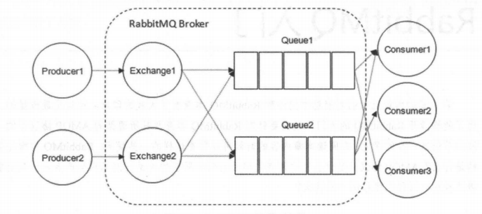

下面我会一一介绍上图中的一些概念。

#### Producer(生产者) 和 Consumer(消费者)

- **Producer(生产者)** :生产消息的一方（邮件投递者）
- **Consumer(消费者)** :消费消息的一方（邮件收件人）

消息一般由 2 部分组成：**消息头**（或者说是标签 Label）和 **消息体**。消息体也可以称为 payLoad ,消息体是不透明的，而消息头则由一系列的可选属性组成，这些属性包括 routing-key（路由键）、priority（相对于其他消息的优先权）、delivery-mode（指出该消息可能需要持久性存储）等。生产者把消息交由 RabbitMQ 后，RabbitMQ 会根据消息头把消息发送给感兴趣的 Consumer(消费者)。

#### Exchange(交换器)

在 RabbitMQ 中，消息并不是直接被投递到 **Queue(消息队列)** 中的，中间还必须经过 **Exchange(交换器)** 这一层，**Exchange(交换器)** 会把我们的消息分配到对应的 **Queue(消息队列)** 中。

**Exchange(交换器)** 用来接收生产者发送的消息，并将这些消息路由给服务器中的队列中，如果路由不到，或许会返回给 **Producer(生产者)** ，或许会被直接丢弃掉 。这里可以将 RabbitMQ 中的交换器看作一个简单的实体。

**RabbitMQ 的 Exchange(交换器) 有 4 种类型，不同的类型对应着不同的路由策略**：**direct(默认)**，**fanout**, **topic**, 和 **headers**，不同类型的 Exchange 转发消息的策略有所区别。这个会在介绍 **Exchange Types(交换器类型)** 的时候介绍到。

Exchange(交换器) 示意图如下：

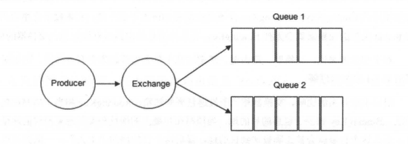

生产者将消息发给交换器的时候，一般会指定一个 **RoutingKey(路由键)**，用来指定这个消息的路由规则，而这个 **RoutingKey 需要与交换器类型和绑定键(BindingKey)联合使用才能最终生效**。

RabbitMQ 中通过 **Binding(绑定)** 将 **Exchange(交换器)** 与 **Queue(消息队列)** 关联起来，在绑定的时候一般会指定一个 **BindingKey(绑定建)** ,这样 RabbitMQ 就知道如何正确将消息路由到队列了,如下图所示。一个绑定就是基于路由键将交换器和消息队列连接起来的路由规则，所以可以将交换器理解成一个由绑定构成的路由表。Exchange 和 Queue 的绑定可以是多对多的关系。

Binding(绑定) 示意图：

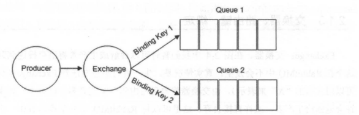

生产者将消息发送给交换器时，需要一个 RoutingKey,当 BindingKey 和 RoutingKey 相匹配时，消息会被路由到对应的队列中。在绑定多个队列到同一个交换器的时候，这些绑定允许使用相同的 BindingKey。BindingKey 并不是在所有的情况下都生效，它依赖于交换器类型，比如 fanout 类型的交换器就会无视，而是将消息路由到所有绑定到该交换器的队列中。

#### Queue(消息队列)

**Queue(消息队列)** 是RabbitMQ 的内部对象，用来保存消息直到发送给消费者。它是消息的容器，也是消息的终点。一个消息可投入一个或多个队列。消息一直在队列里面，等待消费者连接到这个队列将其取走。

**RabbitMQ** 中消息只能存储在 **队列** 中，这一点和 **Kafka** 这种消息中间件相反。Kafka 将消息存储在 **topic（主题）** 这个逻辑层面，而相对应的队列逻辑只是 topic 实际存储文件中的位移标识。 RabbitMQ 的生产者生产消息并最终投递到队列中，消费者可以从队列中获取消息并消费。

**多个消费者可以订阅同一个队列**，这时队列中的消息会被平均分摊（Round-Robin，即轮询）给多个消费者进行处理，而不是每个消费者都收到所有的消息并处理，这样避免消息被重复消费。

**RabbitMQ** 不支持队列层面的广播消费,如果有广播消费的需求，需要在其上进行二次开发,这样会很麻烦，不建议这样做。

#### Broker（消息中间件的服务节点）

**对于 RabbitMQ 来说，一个 RabbitMQ Broker 可以简单地看作一个 RabbitMQ 服务节点，或者 RabbitMQ 服务实例。大多数情况下也可以将一个 RabbitMQ Broker 看作一台 RabbitMQ 服务器。**

下图展示了生产者将消息存入 RabbitMQ Broker,以及消费者从 Broker 中消费数据的整个流程。

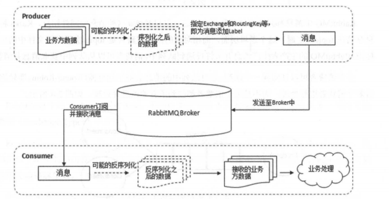

这样图 1 中的一些关于 RabbitMQ 的基本概念我们就介绍完毕了，下面再来介绍一下 **Exchange Types(交换器类型)** 。

#### Exchange Types(交换器类型)

RabbitMQ 常用的 Exchange Type 有 **fanout**、**direct**、**topic**、**headers** 这四种（AMQP 规范里还提到两种 Exchange Type，分别为 system 与 自定义，这里不予以描述）。

**1、fanout**

fanout 类型的 Exchange 路由规则非常简单，它会把所有发送到该 Exchange 的消息路由到所有与它绑定的 Queue 中，不需要做任何判断操作，所以 fanout 类型是所有的交换机类型里面速度最快的。fanout 类型常用来广播消息。

**2、direct**

direct 类型的 Exchange 路由规则也很简单，它会把消息路由到那些 Bindingkey 与 RoutingKey 完全匹配的 Queue 中。

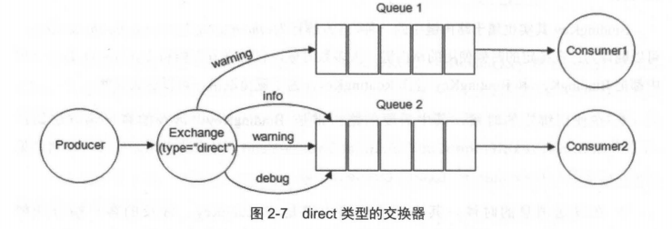

以上图为例，如果发送消息的时候设置路由键为“warning”,那么消息会路由到 Queue1 和 Queue2。如果在发送消息的时候设置路由键为"Info”或者"debug”，消息只会路由到 Queue2。如果以其他的路由键发送消息，则消息不会路由到这两个队列中。

direct 类型常用在处理有优先级的任务，根据任务的优先级把消息发送到对应的队列，这样可以指派更多的资源去处理高优先级的队列。

**3、topic**

前面讲到 direct 类型的交换器路由规则是完全匹配 BindingKey 和 RoutingKey ，但是这种严格的匹配方式在很多情况下不能满足实际业务的需求。topic 类型的交换器在匹配规则上进行了扩展，它与 direct 类型的交换器相似，也是将消息路由到 BindingKey 和 RoutingKey 相匹配的队列中，但这里的匹配规则有些不同，它约定：

- RoutingKey 为一个点号“．”分隔的字符串（被点号“．”分隔开的每一段独立的字符串称为一个单词），如 “com.rabbitmq.client”、“java.util.concurrent”、“com.hidden.client”;
- BindingKey 和 RoutingKey 一样也是点号“．”分隔的字符串；
- BindingKey 中可以存在两种特殊字符串“*”和“#”，用于做模糊匹配，其中“*”用于匹配一个单词，“#”用于匹配多个单词(可以是零个)。

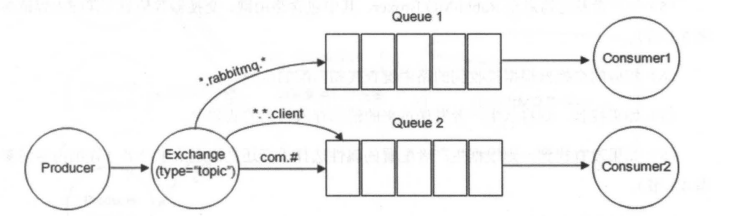

以上图为例：

- 路由键为 “com.rabbitmq.client” 的消息会同时路由到 Queue1 和 Queue2;
- 路由键为 “com.hidden.client” 的消息只会路由到 Queue2 中；
- 路由键为 “com.hidden.demo” 的消息只会路由到 Queue2 中；
- 路由键为 “java.rabbitmq.demo” 的消息只会路由到 Queue1 中；
- 路由键为 “java.util.concurrent” 的消息将会被丢弃或者返回给生产者（需要设置 mandatory 参数），因为它没有匹配任何路由键。

**4、headers(不推荐)**

headers 类型的交换器不依赖于路由键的匹配规则来路由消息，而是根据发送的消息内容中的 headers 属性进行匹配。在绑定队列和交换器时指定一组键值对，当发送消息到交换器时，RabbitMQ 会获取到该消息的 headers（也是一个键值对的形式)，对比其中的键值对是否完全匹配队列和交换器绑定时指定的键值对，如果完全匹配则消息会路由到该队列，否则不会路由到该队列。headers 类型的交换器性能会很差，而且也不实用，基本上不会看到它的存在。

### RabbitMQ的底层架构是什么？

以下是 RabbitMQ 的一些核心架构组件和特性：

- **核心组件**：生产者负责发送消息到 RabbitMQ、消费者负责从 RabbitMQ 接收并处理消息、RabbitMQ 本身负责存储和转发消息。
- **交换机**：交换机接收来自生产者的消息，并根据 routing key 和绑定规则将消息路由到一个或多个队列。
- **持久化**：RabbitMQ 支持消息的持久化，可以将消息保存在磁盘上，以确保在 RabbitMQ 重启后消息不丢失，队列也可以设置为持久化，以保证其结构在重启后不会丢失。
- **确认机制**：为了确保消息可靠送达，RabbitMQ 使用确认机制，消费者在处理完消息后发送确认给 RabbitMQ，未确认的消息会重新入队。
- **高可用性**：RabbitMQ 提供了集群模式，可以将多个 RabbitMQ 实例组成一个集群，以提高可用性和负载均衡。通过镜像队列，可以在多个节点上复制同一队列的内容，以防止单点故障。

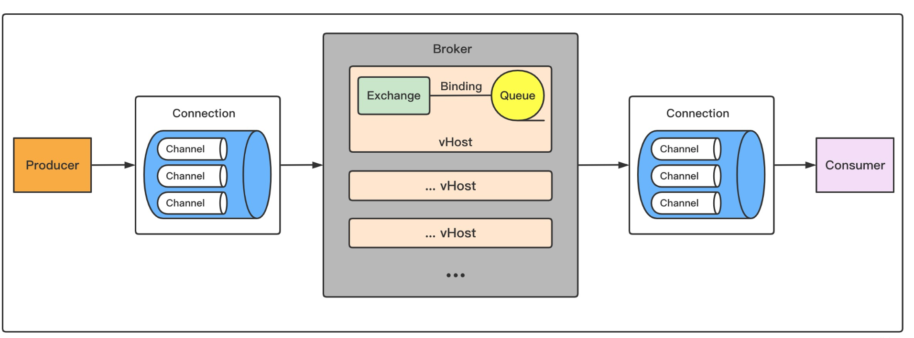

### JMS 和 AMQP

#### JMS 是什么？

JMS（JAVA Message Service,java 消息服务）是 Java 的消息服务，JMS 的客户端之间可以通过 JMS 服务进行异步的消息传输。**JMS（JAVA Message Service，Java 消息服务）API 是一个消息服务的标准或者说是规范**，允许应用程序组件基于 JavaEE 平台创建、发送、接收和读取消息。它使分布式通信耦合度更低，消息服务更加可靠以及异步性。

JMS 定义了五种不同的消息正文格式以及调用的消息类型，允许你发送并接收以一些不同形式的数据：

- `StreamMessage：Java` 原始值的数据流
- `MapMessage`：一套名称-值对
- `TextMessage`：一个字符串对象
- `ObjectMessage`：一个序列化的 Java 对象
- `BytesMessage`：一个字节的数据流

**ActiveMQ（已被淘汰） 就是基于 JMS 规范实现的。**

#### AMQP 是什么？

AMQP（Advanced Message Queuing Protocol）即高级消息队列协议，是一套应用层的开放标准二进制协议，专为面向消息的中间件设计，兼容 JMS。其核心价值在于实现跨客户端、中间件产品及开发语言的消息传递 —— 基于该协议的客户端与消息中间件可自由交互，不受技术栈限制。

RabbitMQ 是 AMQP 协议的典型实现（基于 Erlang 语言开发），同时也支持 STOMP、MQTT 等其他协议。两者模型架构完全一致：生产者将消息发送至交换器，交换器通过绑定规则将消息路由到队列；且 RabbitMQ 中的交换器、交换器类型、队列、绑定、路由键等核心概念，均严格遵循 AMQP 协议定义。

**AMQP 协议的三层结构：**

1. **Module Layer（模块层）**：协议最高层，定义了客户端可调用的各类命令（如发送消息、创建队列等），是业务逻辑实现的基础。
2. **Session Layer（会话层）**：中间层，负责协调客户端与服务器的通信 —— 将客户端命令传递至服务器，再将服务器的应答返回给客户端，同时提供可靠性同步机制和错误处理能力。
3. **Transport Layer（传输层）**：最底层，负责二进制数据流的传输，包含帧处理、信道复用、错误检测及数据表示等基础功能。

**AMQP 模型的三大核心组件：**

1. **交换器（Exchange）**：消息代理服务器中用于路由消息的组件，接收生产者发送的消息，并根据绑定规则决定消息投递方向。
2. **队列（Queue）**：存储消息的数据结构，可位于内存或硬盘中，是消息的最终落脚点，供消费者获取。
3. **绑定（Binding）**：定义交换器与队列之间的关联规则，告知交换器应将消息投递给哪些队列，通常与路由键（Routing Key）配合使用。

#### JMS vs AMQP

|   对比方向   | JMS                                                         | AMQP                                                         |
| :----------: | :---------------------------------------------------------- | :----------------------------------------------------------- |
|     定义     | Java API                                                    | 协议                                                         |
|    跨语言    | 否                                                          | 是                                                           |
|    跨平台    | 否                                                          | 是                                                           |
| 支持消息类型 | 提供两种消息模型：①Peer-2-Peer队列模型;②Pub/sub发布订阅模型 | 提供了五种消息模型：①direct exchange；②fanout exchange；③topic change；④headers exchange；⑤system exchange。本质来讲，后四种和 JMS 的 pub/sub 模型没有太大差别，仅是在路由机制上做了更详细的划分； |
| 支持消息类型 | 支持多种消息类型 ，我们在上面提到过                         | byte[]（二进制）                                             |

**总结：**

- AMQP 为消息定义了线路层（wire-level protocol）的协议，而 JMS 所定义的是 API 规范。在 Java 体系中，多个 client 均可以通过 JMS 进行交互，不需要应用修改代码，但是其对跨平台的支持较差。而 AMQP 天然具有跨平台、跨语言特性。
- JMS 支持 `TextMessage`、`MapMessage` 等复杂的消息类型；而 AMQP 仅支持 `byte[]` 消息类型（复杂的类型可序列化后发送）。
- 由于 Exchange 提供的路由算法，AMQP 可以提供多样化的路由方式来传递消息到消息队列，而 JMS 仅支持 队列 和 主题/订阅 方式两种。

### RabbitMQ 有哪些工作模式？

- 简单模式
- work 工作模式
- pub/sub 发布订阅模式
- Routing 路由模式
- Topic 主题模式

### RabbitMQ 消息怎么传输？

由于 TCP 链接的创建和销毁开销较大，且并发数受系统资源限制，会造成性能瓶颈，所以 RabbitMQ 使用信道的方式来传输数据。信道（Channel）是生产者、消费者与 RabbitMQ 通信的渠道，信道是建立在 TCP 链接上的虚拟链接，且每条 TCP 链接上的信道数量没有限制。就是说 RabbitMQ 在一条 TCP 链接上建立成百上千个信道来达到多个线程处理，这个 TCP 被多个线程共享，每个信道在 RabbitMQ 都有唯一的 ID，保证了信道私有性，每个信道对应一个线程使用。

### 如何保证消息的可靠性？

消息到 MQ 的过程中搞丢，MQ 自己搞丢，MQ 到消费过程中搞丢。

- 生产者到 RabbitMQ：事务机制和 Confirm 机制，注意：事务机制和 Confirm 机制是互斥的，两者不能共存，会导致 RabbitMQ 报错。
- RabbitMQ 自身：持久化、集群、普通模式、镜像模式。
- RabbitMQ 到消费者：basicAck 机制、死信队列、消息补偿机制。

### 如何保证 RabbitMQ 消息的顺序性？

- 拆分多个 queue(消息队列)，每个 queue(消息队列) 一个 consumer(消费者)，就是多一些 queue (消息队列)而已，确实是麻烦点；
- 或者就一个 queue (消息队列)但是对应一个 consumer(消费者)，然后这个 consumer(消费者)内部用内存队列做排队，然后分发给底层不同的 worker 来处理。

### 什么是优先级队列？

RabbitMQ 自 V3.5.0 有优先级队列实现，优先级高的队列会先被消费。

可以通过`x-max-priority`参数来实现优先级队列。不过，当消费速度大于生产速度且 Broker 没有堆积的情况下，优先级显得没有意义。

### 如何保证 RabbitMQ 高可用的？

RabbitMQ 是比较有代表性的，因为是基于主从（非分布式）做高可用性的，我们就以 RabbitMQ 为例子讲解第一种 MQ 的高可用性怎么实现。RabbitMQ 有三种模式：单机模式、普通集群模式、镜像集群模式。

**普通集群模式**

意思就是在多台机器上启动多个 RabbitMQ 实例，每个机器启动一个。你创建的 queue，只会放在一个 RabbitMQ 实例上，但是每个实例都同步 queue 的元数据（元数据可以认为是 queue 的一些配置信息，通过元数据，可以找到 queue 所在实例）。

你消费的时候，实际上如果连接到了另外一个实例，那么那个实例会从 queue 所在实例上拉取数据过来。这方案主要是提高吞吐量的，就是说让集群中多个节点来服务某个 queue 的读写操作。

**镜像集群模式**

这种模式，才是所谓的 RabbitMQ 的高可用模式。跟普通集群模式不一样的是，在镜像集群模式下，你创建的 queue，无论元数据还是 queue 里的消息都会存在于多个实例上，就是说，每个 RabbitMQ 节点都有这个 queue 的一个完整镜像，包含 queue 的全部数据的意思。然后每次你写消息到 queue 的时候，都会自动把消息同步到多个实例的 queue 上。RabbitMQ 有很好的管理控制台，就是在后台新增一个策略，这个策略是镜像集群模式的策略，指定的时候是可以要求数据同步到所有节点的，也可以要求同步到指定数量的节点，再次创建 queue 的时候，应用这个策略，就会自动将数据同步到其他的节点上去了。

这样的好处在于，你任何一个机器宕机了，没事儿，其它机器（节点）还包含了这个 queue 的完整数据，别的 consumer 都可以到其它节点上去消费数据。坏处在于，第一，这个性能开销也太大了吧，消息需要同步到所有机器上，导致网络带宽压力和消耗很重！RabbitMQ 一个 queue 的数据都是放在一个节点里的，镜像集群下，也是每个节点都放这个 queue 的完整数据。

### 如何解决消息队列的延时以及过期失效问题？

RabbtiMQ 是可以设置过期时间的，也就是 TTL。如果消息在 queue 中积压超过一定的时间就会被 RabbitMQ 给清理掉，这个数据就没了。那这就是第二个坑了。这就不是说数据会大量积压在 mq 里，而是大量的数据会直接搞丢。我们可以采取一个方案，就是批量重导，这个我们之前线上也有类似的场景干过。就是大量积压的时候，我们当时就直接丢弃数据了，然后等过了高峰期以后，比如大家一起喝咖啡熬夜到晚上 12 点以后，用户都睡觉了。这个时候我们就开始写程序，将丢失的那批数据，写个临时程序，一点一点的查出来，然后重新灌入 mq 里面去，把白天丢的数据给他补回来。也只能是这样了。假设 1 万个订单积压在 mq 里面，没有处理，其中 1000 个订单都丢了，你只能手动写程序把那 1000 个订单给查出来，手动发到 mq 里去再补一次。

## RocketMQ

### 说说你对 RocketMQ 的理解？

- 核心特征：RocketMQ 是阿里巴巴开源的一款分布式消息中间件，专注于分布式场景下的消息传递需求，具备高吞吐量、低延迟和高可用性等关键优势，能支撑大规模分布式系统的消息交互。
- 主要组件：RocketMQ是一个基于发布订阅模型（主题模型）的消息中间件，核心组件包括生产者（发送消息）、消费者（处理消息）、Broker（消息存储与转发节点）、Topic（消息分类标签）及队列（消息实际存储单元）。
- 消息流转机制：消息由生产者发送至 Broker，Broker 依据路由规则将消息存储到对应队列中，最终由消费者从队列拉取并处理。
- 典型适用场景：适用于异步解耦（如系统间非实时交互）、流量削峰（如应对突发高并发请求）等分布式架构常见需求。

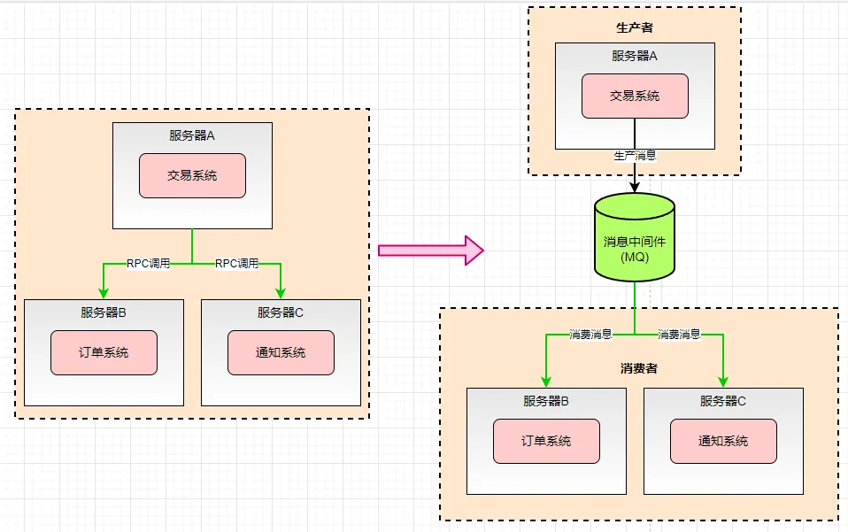

> 1. [Java 面试指南（付费）](https://javabetter.cn/zhishixingqiu/mianshi.html)收录的京东同学 4 云实习面试原题：说说你对RocketMQ的理解

### RoctetMQ基本架构

RocketMQ 的核心架构由四大组件构成，分别是 NameServer、Broker、Producer（生产者）、Consumer（消费者），它们对应消息流转中的「路由发现」「消息存储与中转」「消息发送」「消息接收」四大核心环节。为保障高可用，各组件通常采用集群部署模式。其整体架构如下：

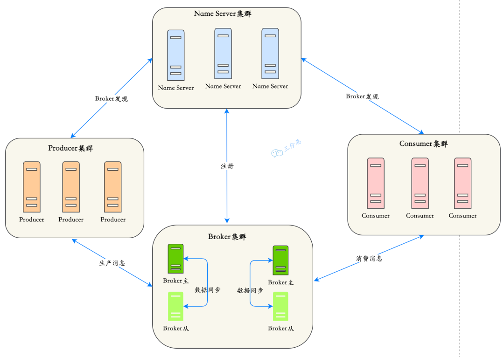

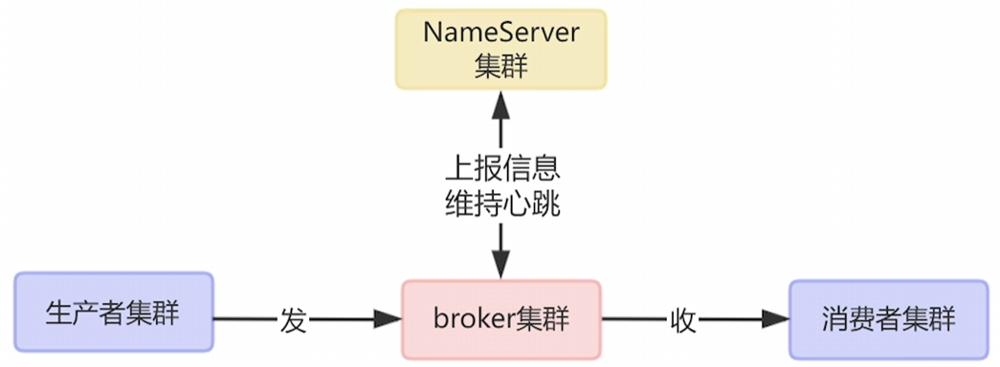

一个人RocketMQ包含生产者集群、消费者集群、Broker集群、和NameServer集群

Broker负责接收生产者消息、持久化消息、然乎处理消费者的拉取请求

NameServer是一个轻量级的注册中心，用来管理Broker集群、管理Topic等用的，和kafka用的zk和kraft差不多，

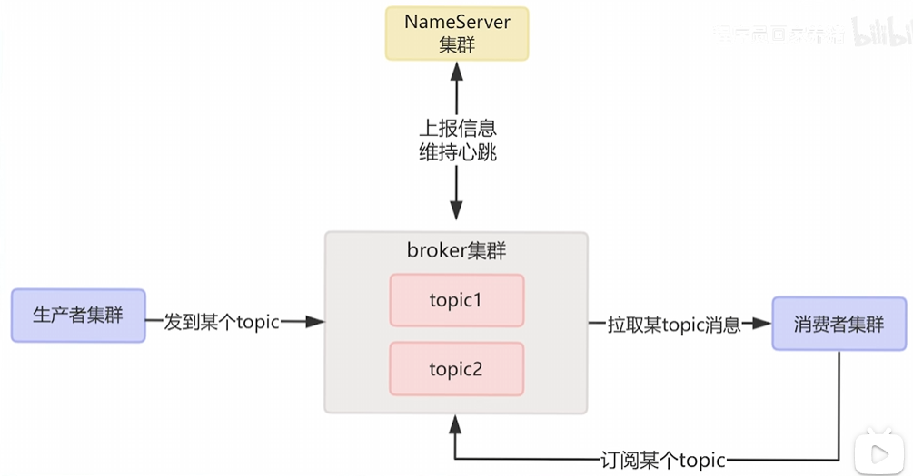

消息会有很多种不同的类型,Broker会根据Topic去分类，生产者把不同类型的这个消息发送给对应的Topic，消费者订阅对应的Topic，然后进行消费


Topic实际上就是一个逻辑上的分类的概念，从存储消息的角度来看，topic内部是多个队列（单机 RocketMQ 中，一个 Topic 的队列数量**默认是 4 个**），这里的队列在Kafka中叫Partition分区

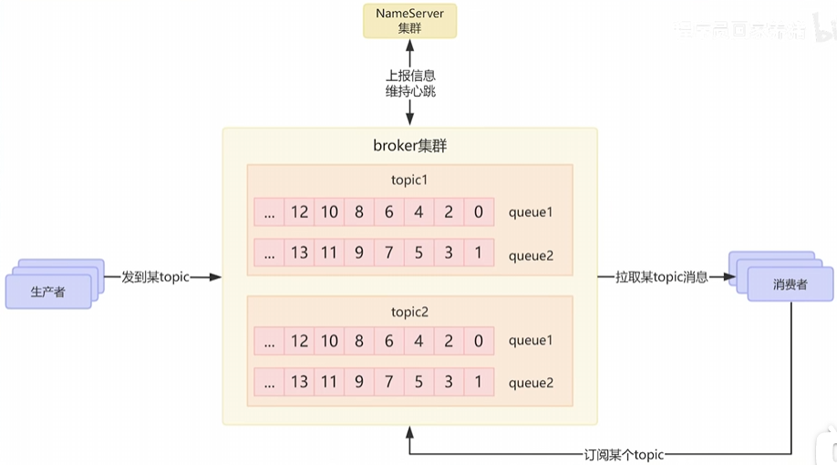

一个消息可以被多个消费者消费，队列中的每个消息，都会分配给一个唯一标识，叫偏移量offset，就是一个低调递增的一个整数，用于标识每个队列中的消息消费到那里了

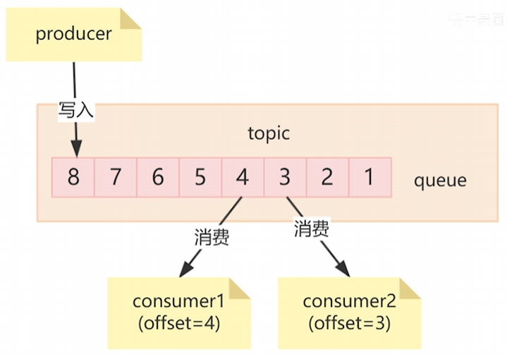

RocketMQ其实还有一个概念就是标签Tag,tag就是同一个topic下对消息更细粒度的一个分类，消费者可以根据tag去过滤消息，如果说一个topic对应的那些队列都放在一个机器上，那这个机器的IO就会称为这个Topic的性能瓶颈，所以一个Topic下有多个队列，每个队列都只存储一部分的数据，broker是做集群的，一个topic下的不同队列就可以分布到不同的broker节点上，这可以解决单机性能瓶颈，但是RocketMQ只能保证一个队列里面的消息是有序的，不同队列间的消息的有序性是无法保证的，这个和kafka是一样的，

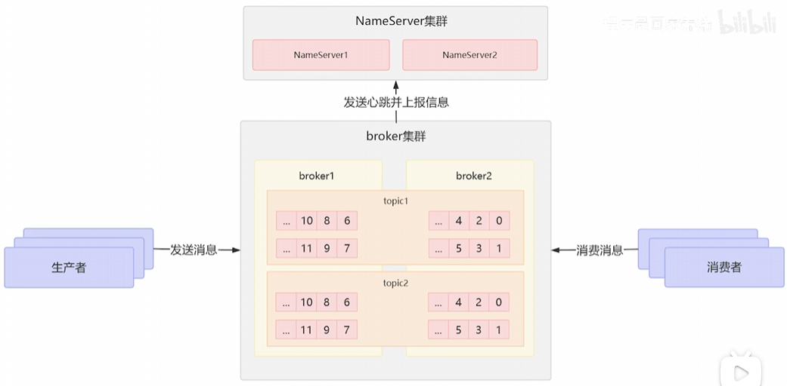

如果每个broker只存一部分数据，如果broker挂了，那存的这份数据不就丢失了，如何保证高可用性的呢？

RocketMQ的高可用和Kafka的多副本机制是类似的，但是RocketQM实际上是对Broker做主从，对Broker做副本，主节点负责处理读写的请求，从节点负责同步主节点的数据，主节点挂了，就需要在从节点中选一个转从为主，然后处理读写请求


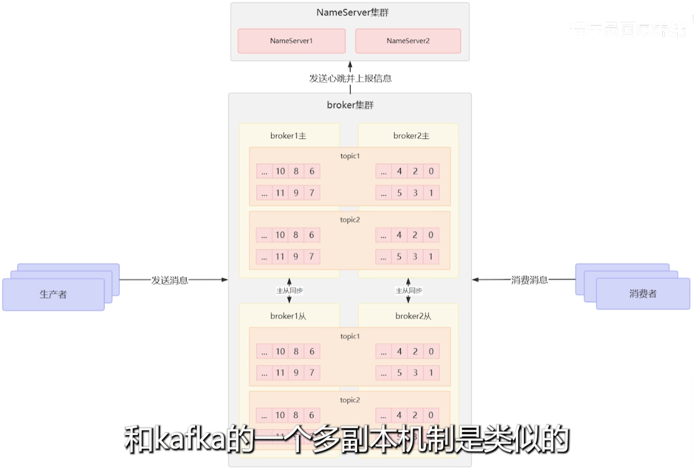

那么多的broker，生产者怎么知道应该发给哪个Broker呢？消费者获取消息的时候怎么知道应该从哪个broker中获取消息呢？所以这个时候就需要一个注册中心专门管理Broker集群，这就是nameserver :第一：保存集群的状态信息、通过Broker的定时上报心跳来感知这个节点上下线‘第二 掌管消息路由，让生产者知道消息应该发给哪个broker，让消费者知道哪个broker中应该去取消息；第三，负责集群中的负载均衡和故障转移，为了保证name server高可用，它自身也是做集群的

那一个Topic下，有多个分布到不同Broker节点上的队列，如果这么多队列，只有一个消费者进行消费，那就有点慢，因此一个消费者可以组成一个消费者组，然后一个消费者组内的多个消费者可以并行的消费一个Topic中的多个队列，但是topic中的队列只能够被一个消费者组的一个消费者消费，如果说消费者组内的消费者的数量超过了队列的数量，那多余的消费者就空闲了

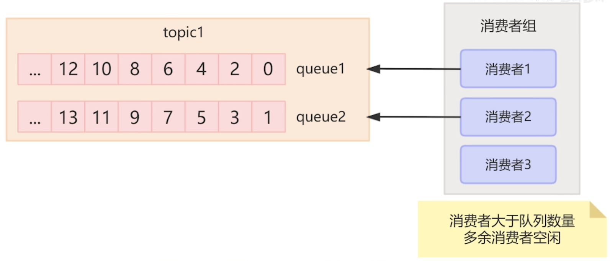


RocketMQ把相同业务逻辑的生产者分成一组就是，生产者组，但是kafka中没有生产者组的概念，因为kafka追求高吞吐量，kafka的生产者只发消息，不关心消息被谁消费了，也不关心消息的状态，它不需要对生产者进行分组，ROcketMQ主要设计是用来发订单、交易这种重要的业务消息，它提供事务机制，生产者需要和Broker多次交互发送半消息、提交、回滚事务，broker就需要知道来自同一个业务的所有的生产者是谁，方便进行协调，所有就要搞一个生产者组出来。

若将 RocketMQ 比作一套高效运转的「数字邮政系统」，则四大组件可对应为：

- 发信人 → Producer（生产者）：负责发起消息
- 收信人 → Consumer（消费者）：负责接收并处理消息
- 邮局 → Broker：负责暂存、中转消息
- 邮政管理中心 → NameServer：负责协调各邮局，指引消息流转路径

#### NameServer

`NameServer`它是一个 **注册中心** ，主要提供两个功能：**Broker 管理** 和 **路由信息管理** 。说白了就是 `Broker` 会将自己的信息注册到 `NameServer` 中，此时 `NameServer` 就存放了很多 `Broker` 的信息(Broker 的路由表)，消费者和生产者就从 `NameServer` 中获取路由表然后照着路由表的信息和对应的 `Broker` 进行通信(生产者和消费者定期会向 `NameServer` 去查询相关的 `Broker` 的信息)。

#### Broker

Broker 是 RocketMQ 体系中的**核心存储与转发节点**，不仅承担消息的存储、中转、分发与投递职责，还负责消息查询功能的支撑及服务高可用的保障，是连接消息生产者（Producer）与消费者（Consumer）的关键枢纽。

- **内部存储结构**：Broker 内部维护多个 Consumer Queue（消息索引队列），用于存储消息索引；真正的消息内容则存储在 CommitLog（日志文件）中。

- **通信机制**：单个 Broker 会与所有 NameServer 建立长连接，通过心跳同步自身状态，并定时将维护的 Topic 信息同步至 NameServer，底层通信基于 Netty 实现。

#### Producer

消息生产者，由用户自行实现并分布式部署，负责从业务端发送消息。Producer通过多种负载均衡模式向Broker集群发送消息，具备低延时特性，且支持快速失败。RocketMQ提供三种消息发送方式：

- **同步发送**：发送方发出消息后，需等待接收方响应才发送下一个数据包，适用于重要通知场景（如重要邮件、营销短信）；
- **异步发送**：发送方发出消息后无需等待响应即可发送下一个数据包，适用于链路耗时较长但对响应时间敏感的场景（如用户视频上传后通知转码）；
- **单向发送**：仅负责发送消息，不等待服务器回应且无回调，适用于耗时极短、可靠性要求不高的场景（如日志收集）。

#### Consumer

消息消费者，负责消费消息，通常由后台系统异步处理。Consumer 由用户部署，支持 PUSH 和 PULL 两种消费模式，以及集群消费、广播消费，提供实时消息订阅机制。

- **Pull（拉取型）**：主动从消息服务器拉取消息，批量获取后触发消费过程，属于主动消费模式；
- **Push（推送型）**：封装了消息拉取、消费进度维护等内部逻辑，仅将消息到达时的回调接口暴露给用户，属于被动消费模式（底层仍通过拉取实现，区别在于需先注册消费监听器，由监听器触发消费）。

### RocketMQ整体工作流程？

RocketMQ是一个分布式消息队列中间件，融合了“消息队列” 与 “分布式系统” 的特性：

- 作为消息队列，它遵循 “发送 - 存储 - 接收”（Producer-Broker-Consumer）的核心模型；
- 作为分布式系统，它通过 “服务端（Broker）、客户端（Producer/Consumer）、注册中心（NameServer）” 的架构实现集群化协作。

其整体工作流程围绕四大核心组件（NameServer 注册中心集群、Producer 生产者集群、Consumer 消费者集群、Broker 消息存储节点）展开，具体步骤如下：

- **Broker 注册与存活维护**：Broker 作为消息的存储和转发节点，启动时会主动向集群中所有 NameServer 注册自身信息（包括节点地址、负责的主题分区等），并通过长连接持续通信。为确保 NameServer 实时掌握其状态，Broker 每 30 秒发送一次心跳包，证明节点存活。

- **Producer 发送消息**：生产者发送消息前，需先从 NameServer 获取目标主题（Topic）对应的 Broker 地址列表。随后，根据预设的负载均衡策略（如轮询、哈希）选择合适的 Broker 节点，将消息发送至该节点下的具体消息队列（Message Queue）。Broker 接收到消息后，完成持久化存储并向 Producer 返回确认。

- **Consumer消费消息**：消费者启动后，同样从 NameServer 获取订阅主题对应的 Broker 地址，通过 “主动拉取” 模式从分配到的消息队列中获取消息并处理。消费过程中，Consumer 会定期向 Broker 上报消费进度（Offset）以避免重复消费；若消费组内节点数量变化（如扩容、下线），还会触发 “重平衡” 机制重新分配队列，确保负载均衡。

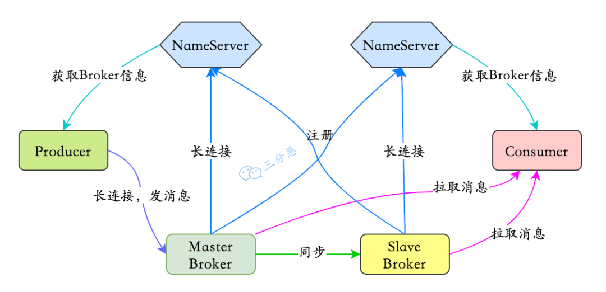

那么多broker，生产者发消息的时候，怎么知道应该发给哪个broker呢，消费者消费消息的时候，怎么知道从哪个broker中获取呢？

RockerMQ的工作流程是什么样子的？

首先Broker集群会定时的去向NameServer去发送一个心跳包，上报topic和队列的一个信息，然后NameServer会在内存中去维护一张路由表，记录了topic到集群的一个映射关系，以及每个broker上的消息队列的一个详细的配置，那生产者通过访问NameServer就能获取到消息的路由信息，然后发送给对应的broker，broker接收到消息之后，会持久化到磁盘，然后同步数据给从节点，消息的消费者通过访问这个nameserver，就能够获取到订阅这个topic的一个路由消息，就知道从哪个Broker中去拉取消息了

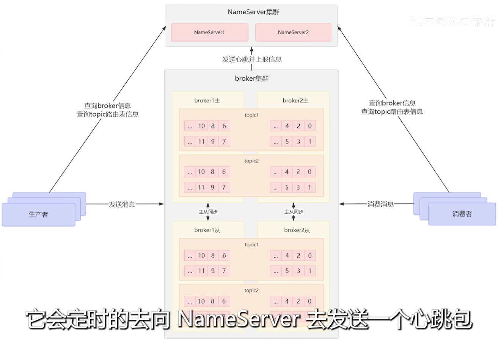

### RocketMQ的消息模型

**RocketMQ 采用标准的发布 - 订阅（Pub/Sub）消息模型，其核心概念（生产者、消费者、主题）与该模型中的定义完全一致。**

RocketMQ的消息体系由以下核心部分构成：

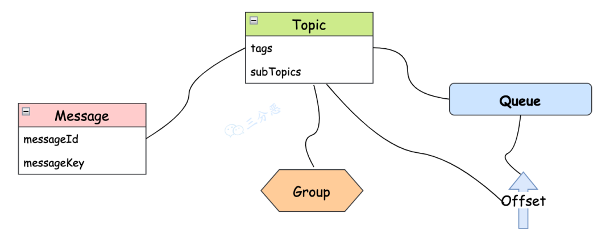

- **Message（消息）**：**消息是实际需要传输的信息载体**。**每条消息必须指定主题（Topic）**—— 可类比为信件的邮寄地址，用于明确消息的投递方向；**还可按需设置标签（Tag）和额外键值对**，其中键值对可作为业务标识，方便在 Broker 上查询消息以排查问题。
- **Topic（主题）**：主题是消息的一级分类，用于对消息进行归类，以便于区分不同的业务消息。例如电商系统中，可划分为 “交易消息”“物流消息” 等主题，每条消息必须归属一个主题。
  - 生产者发送消息时必须指定主题，消费者也只能订阅主题来获取消息。
  - 主题是一个 “逻辑容器”，不直接存储消息，而是通过其包含的消息队列实现物理存储。
  - 主题与生产者、消费者的关联灵活：一个主题可接收 0 到多个生产者的消息，一个生产者也可向多个主题发送消息；同时，一个主题可被 0 到多个消费者订阅。

- **Tag（标签）**：标签可视为子主题，是消息的二级分类，为业务细分提供灵活性。例如 “交易消息” 主题下，可通过 “交易创建”“交易完成” 等标签区分不同场景的消息（消息也可不带标签）。标签不仅能保持代码逻辑清晰，还能辅助 RocketMQ 的消息查询系统快速定位目标消息。

- **Consumer Group（消费组）**：是 RocketMQ 实现负载均衡和容错的核心单位，它是一组逻辑上功能相同的消费者实例的集合（例如多个 “订单处理服务” 实例）。
  - **每个消费组会独立消费主题中的完整消息集，不同消费组的消费进度互不干扰 ，即一条消息被消费组 1 消费后，仍会被消费组 2 再次消费；**
  - **一个消费组包含多个消费者，组内消费者是竞争关系：默认情况下，一条消息被组内某个消费者处理后，同组其他消费者不会再收到该消息，以此实现消息的负载均衡。**
- **Message Queue（消息队列）**：消息队列是主题的底层存储和传输单元，一个主题可包含多个消息队列。消费者若需获取某个主题的全部消息，需遍历其下所有消息队列。除消息队列外，RocketMQ 还包含其他队列类型（如 ConsumerQueue），用于辅助消息处理流程。
- **Offset（位移）**：由于消息需被多个消费组重复消费，已消费的消息不会立即删除，RocketMQ会为每个消费组在每个队列上维护 “消费位移（Consumer Offset）”：位移之前的消息已被消费，之后的消息待消费；每成功消费一条消息，位移值加一。形象地说，消息队列可视为一个无限长的数组，Offset 就是数组的下标。

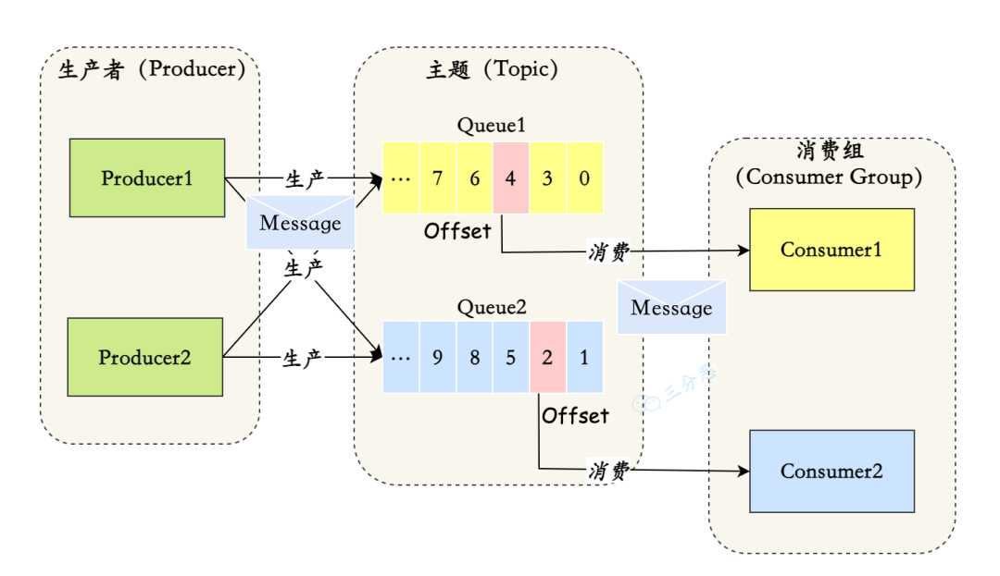

#### 主题、消费组、消息队列和消费者之间的关系

- 主题（Topic）与消息队列（Message Queue）：主题是消息的逻辑分类标签，而消息队列是主题的物理存储载体，二者为**包含关系**：
  - 一个主题必然包含**多个消息队列**（数量可配置，通常与 Broker 节点数相关，默认 4 个），消息队列是消息实际存储和传输的单元。
  - 生产者发送消息到主题时，消息会通过负载均衡策略（如轮询、哈希）被路由到该主题下的某个具体队列；消费者订阅主题时，实际是从该主题下的消息队列中拉取消息。
- 主题（Topic）与消费组（Consumer Group）：主题与消费组通过 “订阅” 关联，呈现**多对多关系**，且各自消费独立：
  - 一个消费组可订阅多个主题（例如：“订单服务组” 需同时处理 “订单创建” 和 “支付完成” 两个主题的消息）；一个主题也可被多个消费组订阅（例如：“订单创建” 主题可同时被 “库存处理组” 和 “日志分析组” 订阅）。
  - 核心特性：不同消费组对同一主题的消费完全独立， 每个消费组会单独维护自己的消费进度（即 Offset，记录已消费到队列的哪个位置），互不干扰。例如：消费组 A 可能已消费到队列 Offset=100，而消费组 B 可能仅消费到 Offset=50。
- 消费组（Consumer Group）与消费者（Consumer）：消费者是消费组的具体实例，二者为**包含关系**，旨在实现消费能力的扩展与高可用：
  - 消费者必须隶属于某个消费组（通过配置`groupName`指定），一个消费组可包含多个消费者实例（例如：分布式部署的 3 个服务节点，每个节点都是该消费组的一个消费者）。
  - 作用：通过多个消费者实例分摊消费压力（负载均衡）；当某个消费者故障下线时，其他消费者会接管其负责的队列（高可用）。

- 消息队列（Message Queue）与消费者（Consumer）：消息队列与消费者的关联由消费组统一管理，遵循 “**同一组内独占、跨组共享**” 的规则：

  - **同一消费组内**：通过 “重平衡”（Rebalance）机制分配队列，确保 “一个队列只能被一个消费者消费”（避免重复消费），但一个消费者可消费多个队列。例如：若主题有 4 个队列，消费组有 2 个消费者，则每个消费者可能分配 2 个队列；若消费组有 5 个消费者，则会有 1 个消费者因无队列可分配而空闲。

  - **不同消费组间**：同一队列可被多个消费组的消费者同时消费（因各消费组维护独立的 Offset）。例如：消费组 A 的消费者 1 和消费组 B 的消费者 2 可同时消费主题下的队列 0。

  - 当消费组内消费者数量变化（如扩容、下线）时，RocketMQ 会自动触发 “重平衡”，重新分配队列，确保负载均衡。


### 如何保证 RocketMQ 的高可用？

NameServer 因为是无状态，且不相互通信的，所以只要集群部署就可以保证高可用。

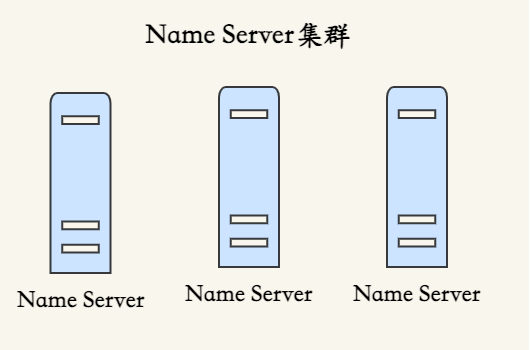

RocketMQ 的高可用主要是在体现在 Broker 的读和写的高可用，Broker 的高可用是通过`集群`和`主从`实现的。

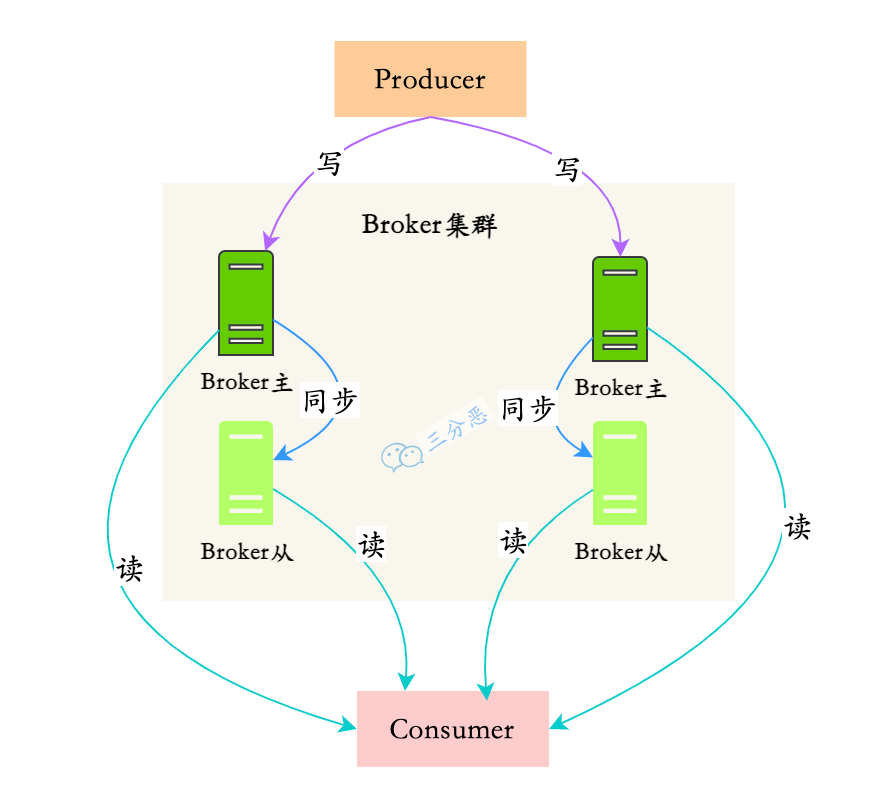

Broker 可以配置两种角色：Master 和 Slave，Master 角色的 Broker 支持读和写，Slave 角色的 Broker 只支持读，Master 会向 Slave 同步消息。

也就是说 Producer 只能向 Master 角色的 Broker 写入消息，Cosumer 可以从 Master 和 Slave 角色的 Broker 读取消息。

Consumer 的配置文件中，并不需要设置是从 Master 读还是从 Slave 读，当 Master 不可用或者繁忙的时候， Consumer 的读请求会被自动切换到从 Slave。有了自动切换 Consumer 这种机制，当一个 Master 角色的机器出现故障后，Consumer 仍然可以从 Slave 读取消息，不影响 Consumer 读取消息，这就实现了读的高可用。

如何达到发送端写的高可用性呢？在创建 Topic 的时候，把 Topic 的多个 Message Queue 创建在多个 Broker 组上（相同 Broker 名称，不同 brokerId 机器组成 Broker 组），这样当 Broker 组的 Master 不可用后，其他组 Master 仍然可用， Producer 仍然可以发送消息 RocketMQ 目前还不支持把 Slave 自动转成 Master ，如果机器资源不足，需要把 Slave 转成 Master ，则要手动停止 Slave 色的 Broker ，更改配置文件，用新的配置文件启动 Broker。

### 如何实现消息过滤？

消息过滤主要通过两种核心方案实现，各有优劣及适用场景：

- **Broker 端过滤**：由 Broker 按照 Consumer 的过滤逻辑提前筛选消息，优势是能避免无用消息传输到 Consumer 端，减少网络开销；但缺点是会加重 Broker 的负担，实现逻辑相对复杂。
- **Consumer 端过滤**：Consumer 接收消息后自行按规则（如消息的 Tag）过滤，优势是实现简单、对 Broker 无额外压力；但可能导致大量无用消息传输到 Consumer 端后被丢弃，存在资源浪费。

实际应用中，通常优先采用 Consumer 端过滤；若需提升吞吐量、减少无效传输，可选择 Broker 端过滤。

具体的消息过滤方式有三种，各有特点：

1. **根据 Tag 过滤**：最常用的方式，高效且简单，适用于按固定标签分类的消息场景。

   ```java
   DefaultMQPushConsumer consumer = new DefaultMQPushConsumer("CID_EXAMPLE");
   // 订阅Topic中标签为TAGA、TAGB或TAGC的消息
   consumer.subscribe("TOPIC", "TAGA || TAGB || TAGC");
   ```

2. **SQL 表达式过滤**：支持更灵活的条件筛选（基于消息属性），适用于复杂过滤规则的场景。

   ```java
   DefaultMQPushConsumer consumer = new DefaultMQPushConsumer("please_rename_unique_group_name_4");
   // 过滤出消息属性a满足“0≤a≤3”的消息
   consumer.subscribe("TopicTest", MessageSelector.bySql("a between 0 and 3"));
   consumer.registerMessageListener(new MessageListenerConcurrently() {
       @Override
       public ConsumeConcurrentlyStatus consumeMessage(List<MessageExt> msgs, ConsumeConcurrentlyContext context) {
           return ConsumeConcurrentlyStatus.CONSUME_SUCCESS;
       }
   });
   consumer.start();
   ```

3. **Filter Server 方式**：最灵活但实现最复杂，允许用户自定义过滤函数，适用于极特殊的定制化过滤需求。

### RocketMQ消息刷盘机制：同步刷盘和异步刷盘

RocketMQ 通过刷盘机制将内存中的消息持久化到磁盘，以避免机器掉电等异常情况下的数据丢失。**其核心提供两种刷盘策略，底层均依赖 NIO 的`MappedByteBuffer.force()`方法完成数据从内存映射区到磁盘的写入**，具体实现如下：

- **同步刷盘**：当消息写入 Broker 的内存映射区（如 CommitLog 的内存映射文件）后，Broker 会立即调用`force()`方法触发刷盘，**并等待数据完全写入磁盘后，才向 Producer 返回ACK**。这种策略通过阻塞等待确保数据可靠落地，但会牺牲一定的吞吐量。一般地适用于金融等特定业务场景。
- **异步刷盘**：消息写入 Broker 的内存映射区后，**Broker 无需等待刷盘完成，直接向 Producer 返回ACK**；随后唤醒专门的刷盘线程，由该线程异步调用`force()`方法将数据持久化到磁盘。此策略不阻塞消息发送流程，能提升系统吞吐量，但存在极短时间内（刷盘完成前）数据丢失的风险。一般适用于如发验证码等对于消息保证要求不太高的业务场景。

Broker 在处理消息时，直接操作内存映射文件以提升读写效率，但内存数据无法抵抗物理故障，因此刷盘是保障数据持久性的关键环节。两种策略的核心差异在于是否阻塞消息发送流程以等待刷盘完成，可根据业务对可靠性和吞吐量的需求灵活选择。

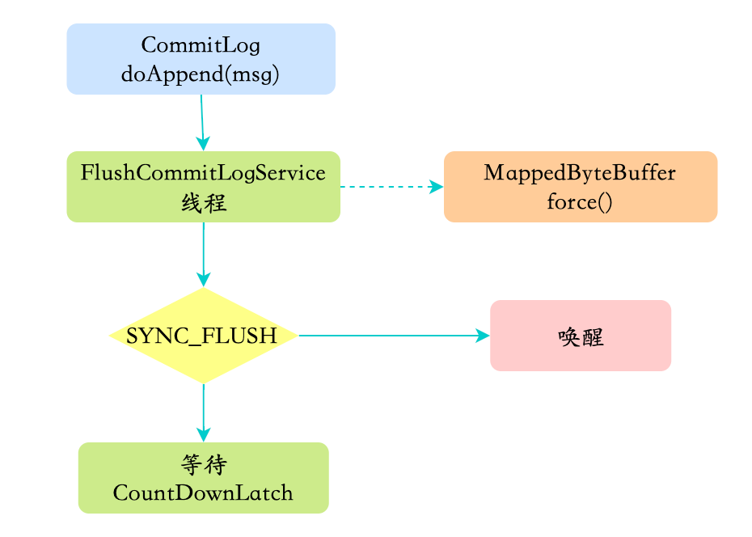

### 说说RocketMQ怎么对文件进行读写的？

RocketMQ 对文件的读写设计，**核心是通过整合内存映射、操作系统缓存机制及顺序读写特性，最大化减少数据拷贝开销，实现高效的文件读写操作**。

- **一是基于内存映射实现零拷贝的直接读写**：RocketMQ 采用 Java中的NIO 中的`MappedByteBuffer`作为文件读写的核心方式。其原理是通过`FileChannel`将磁盘文件直接映射到用户态内存地址，使得应用程序对文件的读写无需经过传统 I/O 的 “磁盘→内核缓冲区→用户缓冲区” 多步拷贝，而是直接操作内存地址完成，这本质上实现了零拷贝，大幅降低了性能损耗。
  - 为适配内存映射机制，RocketMQ 的核心文件（如存储完整消息的 CommitLog、存储消费元信息的 ConsumeQueue）均采用定长结构设计，确保文件可被一次性映射到内存，简化操作并提升效率。
- **二是结合操作系统缓存机制与顺序读写特性提升效率**：ConsumeQueue 作为逻辑消费队列，存储数据量小且采用顺序读取，在 PageCache 的预读取机制作用下，其读性能几乎接近内存读取，即便消息堆积也不会影响性能。而存储完整消息的 CommitLog 由于读取时会产生较多随机访问，性能易受影响。若选择合适的系统 I/O 调度算法（如块存储为 SSD 时采用 “Deadline” 算法），可提升随机读性能。
  - **页缓存（PageCache）是操作系统对文件的缓存，用于加速文件读写**。通常，程序对文件的顺序读写速度接近内存读写，核心原因是操作系统通过 PageCache 机制优化读写性能，**即操作系统会将部分内存用作 PageCache**。
    - 数据写入时，操作系统会先写入 Cache，再由 pdflush 内核线程异步将 Cache 中的数据刷盘至物理磁盘；
    - 数据读取时，若未命中 PageCache，操作系统从物理磁盘读取的同时，会顺序预读取相邻块的数据。

### RocketMQ的Broker存储机制

**RocketMQ 的 Broker采用混合型存储结构实现数据存储，遵循 “数据与索引分离” 的核心设计**：所有 Topic 的消息实体（含主体及元数据）统一存储在 CommitLog 中，而 ConsumeQueue 作为消费索引专门服务于消息消费场景，IndexFile 则作为查询索引支持按 Key 或时间快速检索 —— 这三类文件各司其职又协同配合，既通过 CommitLog 的集中存储保证了消息的可靠持久化，又借助 ConsumeQueue 和 IndexFile 的索引能力优化了消费与查询性能。

具体来说，**Broker 的数据存储流程主要包括消息持久化和 索引异步构建两个核心环节**，各文件协同工作如下：

1. **消息写入与持久化**：Producer 发送消息至 Broker 后，Broker 先将消息顺序写入 CommitLog，并通过同步或异步刷盘机制将消息持久化至磁盘。一旦消息成功写入 CommitLog 并完成刷盘，即确保消息不会丢失，为后续消费提供基础。
2. **索引文件的异步构建**：消息写入 CommitLog 后，Broker 的后台线程`ReputMessageService`会异步分发请求，基于 CommitLog 中的消息数据构建 ConsumeQueue 和 IndexFile：
   - 对 ConsumeQueue：按 Topic 和队列拆分消息索引，将消息在 CommitLog 中的偏移量、长度等信息写入对应 Topic 的消费队列，供 Consumer 快速拉取；
   - 对 IndexFile：生成消息 Key 与 CommitLog 物理位置的哈希映射，支持按 Key 查询消息。
3. **消费与查询的协同**
   - Consumer 通过 ConsumeQueue 直接定位 CommitLog 中的消息位置，高效拉取消息；
   - 如需按 Key 查询消息，可通过 IndexFile 快速找到消息在 CommitLog 中的存储位置，再从 CommitLog 中读取完整消息。

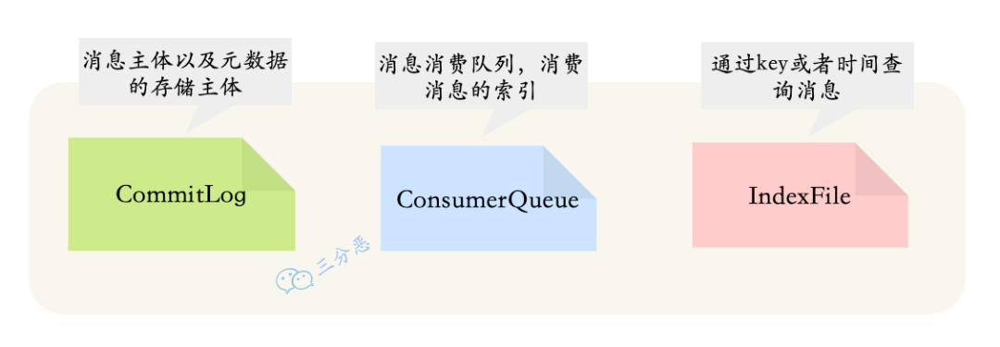

- **CommitLog是消息实体的统一存储文件， 用于存储所有 Producer 发送的消息主体及元数据，是消息持久化的核心载体**。其关键特点为：
  - 文件规格：单个文件默认 1G，文件名以 20 位数字表示起始偏移量（例如第一个文件为`00000000000000000000`，起始偏移量 0；写满后生成下一个文件，起始偏移量为 1073741824）。
  - 存储方式：消息内容长度不固定，按写入顺序连续存储，保证高效写入。
  - 存储路径：`${Rocket_Home}/store/commitlog`，所有 Topic 的消息实体都集中在此，实现数据统一管理。

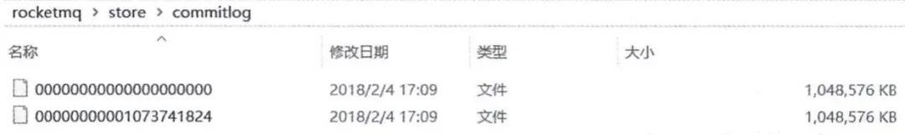

- **ConsumeQueue（逻辑消费队列） 是消费队列的索引文件，其引入的核心目的是提升消息消费性能**。由于 RocketMQ 采用基于主题（Topic）的订阅模式，消息消费需针对特定 Topic 进行，若直接遍历 CommitLog 文件按 Topic 检索消息会非常低效，而有了 ConsumeQueue 后，消费者（Consumer）可通过它快速定位待消费消息。
  - **存储内容**：作为消费消息的索引，ConsumeQueue 保存了指定 Topic 下队列消息在 CommitLog 中的关键信息，每条记录固定为 20 字节，具体包括 8 字节的消息在 CommitLog 中的物理偏移量（用于定位消息位置）、4 字节的消息长度（用于确定消息读取范围），以及 8 字节的消息 Tag 的 HashCode（用于快速过滤不需要的消息）。
  - **文件结构**：单个文件含 30 万条记录，大小约 5.72M，支持像数组一样随机访问。
  - **存储路径**：按`topic/queue/file`三层结构组织，具体为`$HOME/store/consumequeue/{topic}/{queueId}/{fileName}`，与 Topic 和队列一一对应，方便 Consumer 快速定位待消费消息。

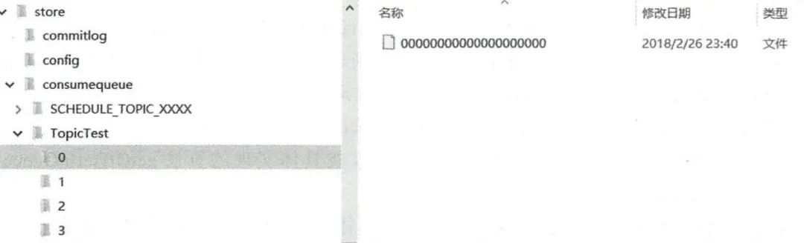

- **IndexFile是消息查询的哈希索引文件，它的作用是支持通过消息 Key 或时间区间查询消息，底层实现为文件系统中的 HashMap 结构，通过哈希映射关联消息 Key 与 CommitLog 物理位置。**
  - 结构：单个文件约 400M，可存储 2000 万条索引；文件名以创建时间戳命名。
  - 路径：`${Rocket_Home}/store/index`，提供高效的消息检索能力。

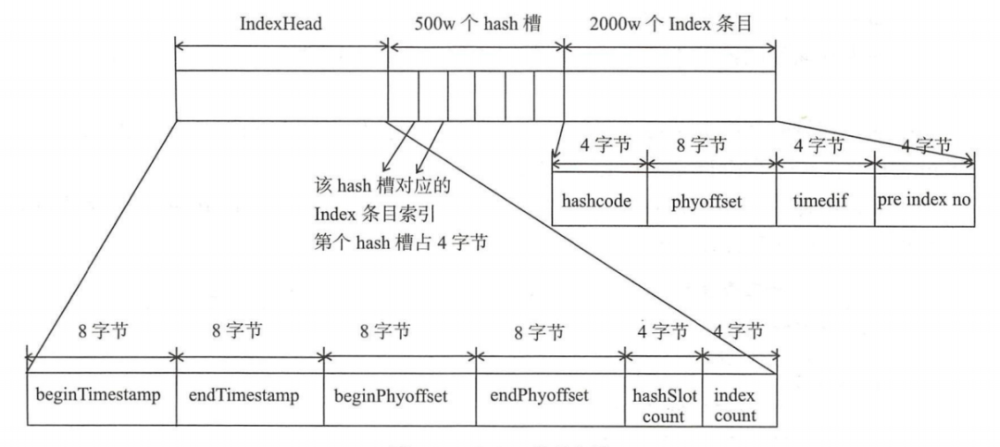


### 能说下 RocketMQ 的负载均衡是如何实现的？

**RocketMQ 的负载均衡逻辑全部在客户端（Client）完成，主要分为 Producer 端发送消息时的负载均衡和 Consumer 端订阅消息时的负载均衡两部分。**

#### Producer的负载均衡

Producer 发送消息时，会先根据消息的 Topic 找到对应的 TopicPublishInfo（路由信息）。在获取路由信息后，客户端默认通过 `selectOneMessageQueue()` 方法从 TopicPublishInfo 中的 `messageQueueList`（消息队列列表）中选择一个队列发送消息。

这里有一个关键开关 `sendLatencyFaultEnable`：

- 若开启，会在随机递增取模的基础上，过滤掉不可用的 Broker（基于 `latencyFaultTolerance` 机制）。
  - `latencyFaultTolerance` 机制是实现消息发送高可用的核心，其原理是对之前失败的请求按延迟时间进行退避（例如：延迟超过 550ms 退避 3000ms，超过 1000ms 退避 60000ms），避免频繁向故障节点发送请求。
- 若关闭，则直接通过随机递增取模的方式选择队列。

#### Consumer的负载均衡

RocketMQ 中，Consumer 的 Push 和 Pull 两种消费模式本质都是基于 “拉模式” 实现的：Push 模式是对 Pull 模式的封装（拉取到消息后提交给消费线程池，再立即尝试继续拉取；未拉取到则延迟重试）。

两种模式都需要 Consumer 明确从 Broker 的哪个消息队列获取消息，因此需要在 Consumer 端实现负载均衡：即把 Broker 中的多个 MessageQueue 分配给同一 ConsumerGroup 中的不同 Consumer。

Consumer 端负载均衡的核心设计理念是：同一消息队列在同一时间仅允许被同一消费组内的一个消费者消费，而一个消费者可以同时消费多个消息队列。

- **Consumer 端的心跳包发送**：Consumer 启动后，会通过定时任务定期向 RocketMQ 集群的所有 Broker 发送心跳包，包含消费组名称、订阅关系、通信模式、客户端 ID 等信息。Broker 收到心跳后，会将信息维护在 `ConsumerManager` 的本地缓存 `consumerTable` 中，同时将客户端网络通道信息存入 `channelInfoTable`，为后续负载均衡提供元数据依据。

- **负载均衡核心类RebalanceImpl**：在 Consumer 启动流程中，**启动 `MQClientInstance` 时会同步启动负载均衡服务线程 `RebalanceService`（每隔 20 秒执行一次）**，其 `run()` 方法最终调用 `RebalanceImpl` 类的 `rebalanceByTopic()` 方法，这是 Consumer 负载均衡的核心逻辑。

`rebalanceByTopic()`方法会根据消费者通信类型为“广播模式”还是“集群模式”做不同的逻辑处理。这里主要来看下集群模式下的主要处理流程：

- 1）从`rebalanceImpl`实例的本地缓存变量`topicSubscribeInfoTable`中，获取该`Topic`主题下的消息消费队列集合`mqSet`；
- 2）以 Topic 和消费组为参数，调用 `mQClientFactory.findConsumerIdList()` 向 Broker 请求该消费组下的消费者 ID 列表；
- 3）对消息队列和消费者 ID 分别排序，通过队列分配策略（默认是平均分配算法）计算当前 Consumer 应分配的队列。
  - 平均分配算法类似分页逻辑：先对所有 MessageQueue 和 Consumer 排序，计算每页（每个 Consumer）平均包含的队列数量及范围，再遍历范围确定当前 Consumer 对应的队列。

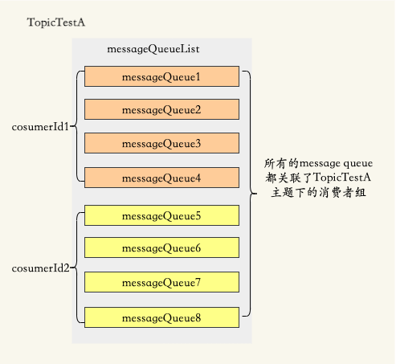

- 4）调用 `updateProcessQueueTableInRebalance()` 方法更新队列分配结果，具体逻辑是将分配到的队列（`mqSet`）与本地缓存 `processQueueTable` 比对过滤

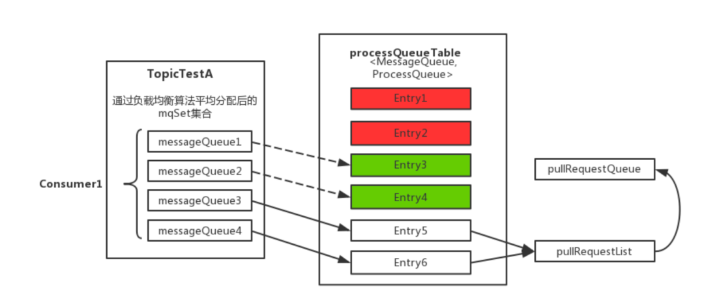

- 上图中`processQueueTable`标注的红色部分，代表当前`processQueueTable`中存在但未被分配到的消息队列（即与`mqSet`无交集的队列）。
  - 处理逻辑为：先将这些队列的`Dropped`属性设为`true`，再通过`removeUnnecessaryMessageQueue()`方法尝试从`processQueueTable`缓存中移除它们。
    - 该方法的具体逻辑是：每隔 1 秒尝试获取当前消费处理队列的锁，若成功获取则返回`true`并移除对应的键值对；若等待 1 秒后仍未获取到锁，则返回`false`（暂不移除）。

- 上图中`processQueueTable`的绿色部分，代表当前`processQueueTable`与`mqSet`的交集队列（即既在缓存中又被分配到的队列）。此时需判断队列对应的`ProcessQueue`是否过期：在 Pull 模式下不做额外处理；在 Push 模式下，则将`Dropped`属性设为`true`，并通过上述`removeUnnecessaryMessageQueue()`方法按同样逻辑尝试移除。
- 最终，针对过滤后`mqSet`中剩余的消息队列，为每个`MessageQueue`创建`ProcessQueue`对象并存入`RebalanceImpl`的`processQueueTable`中。过程中会调用`RebalanceImpl`的`computePullFromWhere(MessageQueue mq)`方法，获取该队列的下一个消费偏移量（offset），并将其填充到新创建的`PullRequest`对象中。随后，这些`PullRequest`会被添加到`pullRequestList`，再通过`dispatchPullRequest()`方法依次放入`PullMessageService`服务线程的阻塞队列`pullRequestQueue`中，等待该线程取出并向 Broker 发起消息拉取请求。需注意的是，`RebalancePushImpl`与`RebalancePullImpl`对`dispatchPullRequest()`的实现存在差异，其中`RebalancePullImpl`的该方法为空白实现。

### RocketMQ消息长轮询了解吗？

**RocketMQ 的长轮询机制是 Consumer 拉取消息时的一种优化策略**：当 Consumer 向 Broker 拉取消息时，若目标消息队列（Queue）中没有可用数据，Broker 不会立即返回空结果，而是将该拉取请求（PullRequest）暂存起来。直到队列中有新消息到达，或长轮询的阻塞时间超时，Broker 才会重新处理该队列上所有暂存的PullRequest并返回结果。

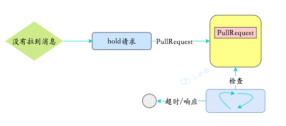

#### Broker 对无数据请求的处理（PullMessageProcessor）

当 Broker 处理拉取请求（`PullMessageProcessor#processRequest`）时，若检测到目标队列无消息（返回码为 `ResponseCode.PULL_NOT_FOUND`），会按以下逻辑处理：

```java
// 当未拉取到数据时
case ResponseCode.PULL_NOT_FOUND:
    // 检查 Broker 和 Consumer 是否允许挂起请求（默认开启）
    if (brokerAllowSuspend && hasSuspendFlag) {
        // 计算阻塞等待时间：若长轮询开启则使用指定超时时间，否则使用短轮询时间
        long pollingTimeMills = suspendTimeoutMillisLong;
        if (!this.brokerController.getBrokerConfig().isLongPollingEnable()) {
            pollingTimeMills = this.brokerController.getBrokerConfig().getShortPollingTimeMills();
        }

        // 提取请求中的主题、偏移量、队列ID等信息
        String topic = requestHeader.getTopic();
        long offset = requestHeader.getQueueOffset();
        int queueId = requestHeader.getQueueId();
        // 封装 PullRequest 对象，包含请求详情、阻塞时间、当前时间等信息
        PullRequest pullRequest = new PullRequest(request, channel, pollingTimeMills,
                this.brokerController.getMessageStore().now(), offset, subscriptionData, messageFilter);
        // 将 PullRequest 暂存到 PullRequestHoldService 中
        this.brokerController.getPullRequestHoldService().suspendPullRequest(topic, queueId, pullRequest);
        // 不立即返回响应，等待触发条件后再处理
        response = null;
        break;
    }
```

上述逻辑的核心是：在允许挂起的情况下，将拉取请求封装为 PullRequest 并暂存，而非立即返回空结果，从而减少无效的空轮询。

#### 暂存请求的检查机制（PullRequestHoldService）

Broker 中专门有一个服务线程 `PullRequestHoldService` 负责监控暂存的 PullRequest，其核心逻辑在 `run()` 方法中：

```java
@Override
public void run() {
    log.info("{} service started", this.getServiceName());
    while (!this.isStopped()) {
        try {
            // 根据配置决定等待间隔：长轮询模式下每5秒检查一次，短轮询则使用配置的短轮询时间
            if (this.brokerController.getBrokerConfig().isLongPollingEnable()) {
                this.waitForRunning(5 * 1000);
            } else {
                this.waitForRunning(this.brokerController.getBrokerConfig().getShortPollingTimeMills());
            }

            long beginLockTimestamp = this.systemClock.now();
            // 检查所有暂存的 PullRequest，判断是否满足处理条件（有新消息或超时）
            this.checkHoldRequest();
            long costTime = this.systemClock.now() - beginLockTimestamp;
            if (costTime > 5 * 1000) {
                log.info("[NOTIFYME] check hold request cost {} ms.", costTime);
            }
        } catch (Throwable e) {
            log.warn(this.getServiceName() + " service has exception. ", e);
        }
    }

    log.info("{} service end", this.getServiceName());
}
```

该线程会定期（长轮询默认 5 秒一次）调用 `checkHoldRequest()` 方法，检查暂存的 PullRequest：

- 若对应队列已产生新消息，立即唤醒请求并返回数据；
- 若请求已超时（达到预设的 `pollingTimeMills`），则返回空结果，避免无限阻塞。

通过这种机制，RocketMQ 在保证消息实时性的同时，大幅减少了 Consumer 与 Broker 之间的无效通信，提升了系统性能。

### 什么是回溯消费？

回溯消费是指 `Consumer` 已经消费成功的消息，由于业务上需求需要重新消费，在`RocketMQ` 中， `Broker` 在向`Consumer` 投递成功消息后，**消息仍然需要保留** 。并且重新消费一般是按照时间维度，例如由于 `Consumer` 系统故障，恢复后需要重新消费 1 小时前的数据，那么 `Broker` 要提供一种机制，可以按照时间维度来回退消费进度。`RocketMQ` 支持按照时间回溯消费，时间维度精确到毫秒。

### 为什么 RocketMQ 不使用 Zookeeper 作为注册中心呢？

Kafka 我们都知道采用 Zookeeper 作为注册中心——当然也开始逐渐去 Zookeeper，RocketMQ 不使用 Zookeeper 其实主要可能从这几方面来考虑：

1. 基于可用性的考虑，根据 CAP 理论，同时最多只能满足两个点，而 Zookeeper 满足的是 CP，也就是说 Zookeeper 并不能保证服务的可用性，Zookeeper 在进行选举的时候，整个选举的时间太长，期间整个集群都处于不可用的状态，而这对于一个注册中心来说肯定是不能接受的，作为服务发现来说就应该是为可用性而设计。
2. 基于性能的考虑，NameServer 本身的实现非常轻量，而且可以通过增加机器的方式水平扩展，增加集群的抗压能力，而 Zookeeper 的写是不可扩展的，Zookeeper 要解决这个问题只能通过划分领域，划分多个 Zookeeper 集群来解决，首先操作起来太复杂，其次这样还是又违反了 CAP 中的 A 的设计，导致服务之间是不连通的。
3. 持久化的机制来带的问题，ZooKeeper 的 ZAB 协议对每一个写请求，会在每个 ZooKeeper 节点上保持写一个事务日志，同时再加上定期的将内存数据镜像（Snapshot）到磁盘来保证数据的一致性和持久性，而对于一个简单的服务发现的场景来说，这其实没有太大的必要，这个实现方案太重了。而且本身存储的数据应该是高度定制化的。
4. 消息发送应该弱依赖注册中心，而 RocketMQ 的设计理念也正是基于此，生产者在第一次发送消息的时候从 NameServer 获取到 Broker 地址后缓存到本地，如果 NameServer 整个集群不可用，短时间内对于生产者和消费者并不会产生太大影响。
