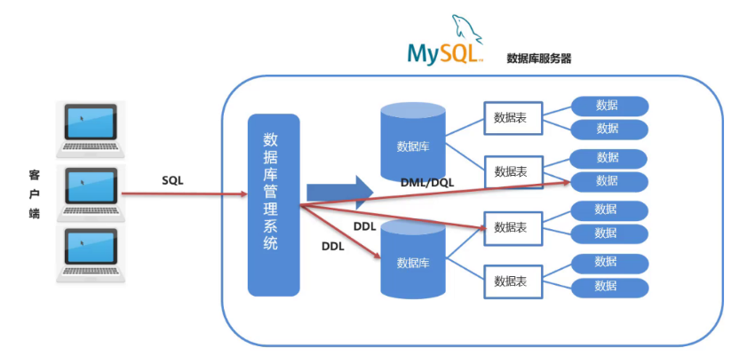
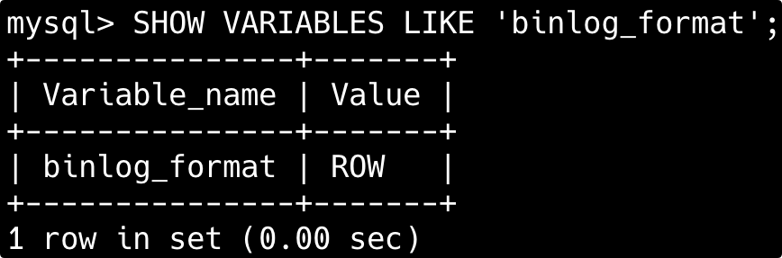
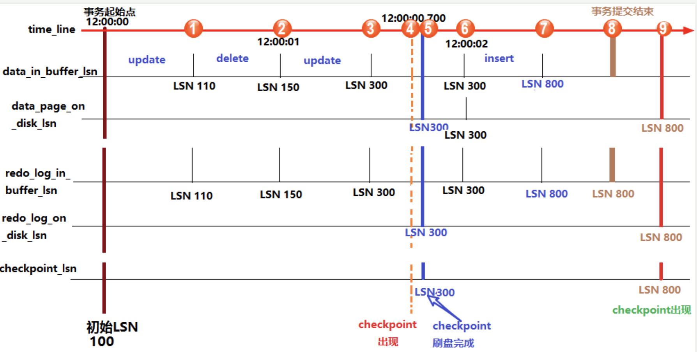
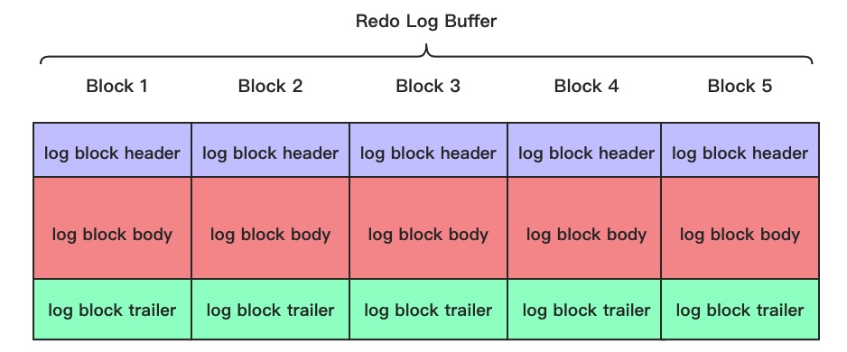
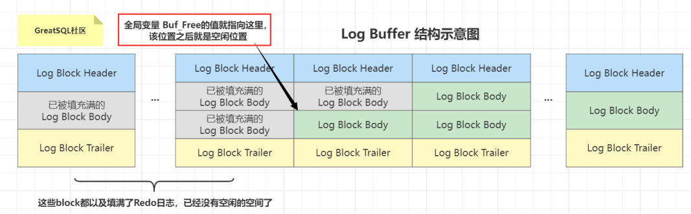
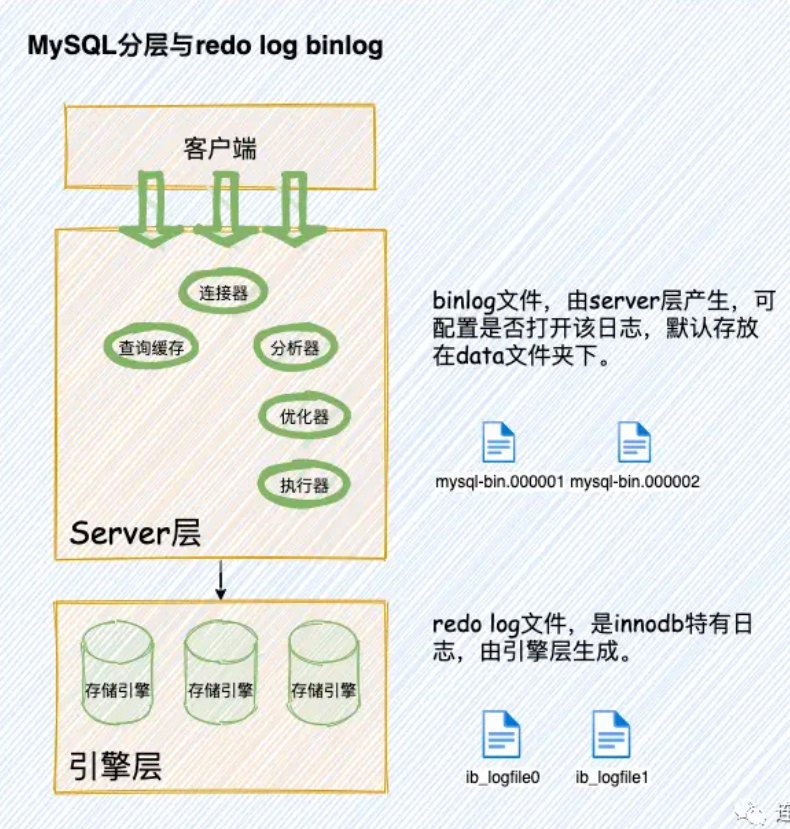
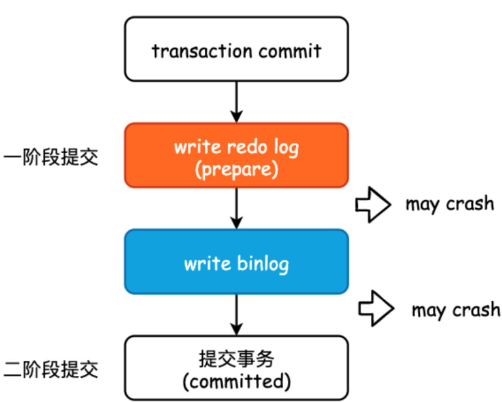
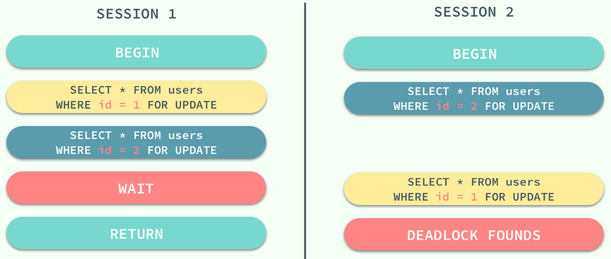
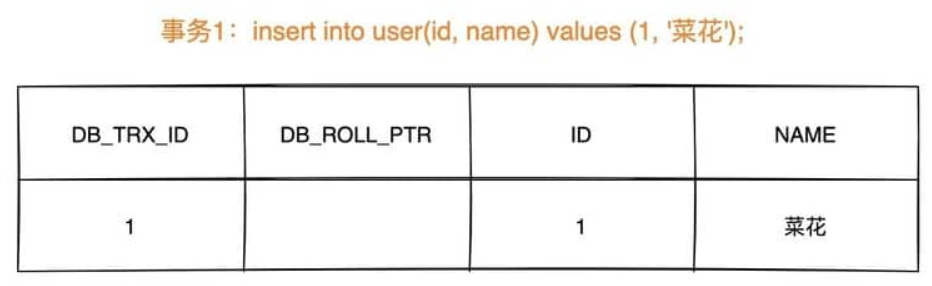
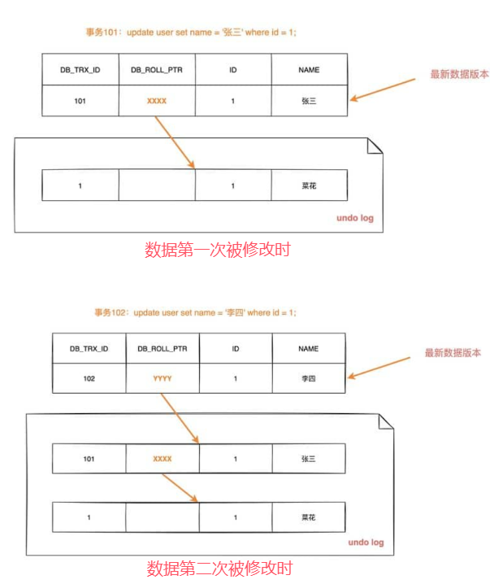

[toc]


# MySQL 面试题

## 基础概念

### 🌟什么是数据库、数据库管理系统、数据库管理员、数据库系统？

- **数据库** (DataBase 简称 DB)就是信息的集合或者说数据库是由数据库管理系统管理的数据的集合。
- **数据库管理系统** (Database Management System 简称 DBMS)是一种操纵和管理数据库的**大型软件**，通常用于建立、使用和维护数据库。
- **数据库管理员**(Database Administrator, 简称 DBA)负责全面管理和控制数据库系统。
- **数据库系统** (Data Base System，简称 DBS)通常由软件、数据库和数据管理员(DBA)组成。

### 🌟什么是元组、码、候选码、主码、外码、主属性、非主属性？

- **元组**（tuple）是关系数据库中的基本概念，关系是一张表，表中的每行（即数据库中的每条记录）就是一个元组，每列就是一个属性。 在二维表里，元组也称为行。
- **码**就是能唯一标识实体的属性，对应表中的列。
- **候选码**：若关系中的某一属性或属性组的值能唯一的标识一个元组，而其任何、子集都不能再标识，则称该属性组为候选码。例如：在学生实体中，“学号”是能唯一的区分学生实体的，同时又假设“姓名”、“班级”的属性组合足以区分学生实体，那么{学号}和{姓名，班级}都是候选码。
- **主码**也叫主键。主码是从候选码中选出来的。 一个实体集中只能有一个主码，但可以有多个候选码。
- **外码**也叫外键。如果一个关系中的一个属性是另外一个关系中的主码则这个属性为外码。
- **主属性**是指候选码中出现过的属性。比如关系 工人（工号，身份证号，姓名，性别，部门）. 显然工号和身份证号都能够唯一标示这个关系，所以都是候选码。工号、身份证号这两个属性就是主属性。如果主码是一个属性组，那么属性组中的属性都是主属性。
- **非主属性**是指不包含在任何一个候选码中的属性。比如在关系——学生（学号，姓名，年龄，性别，班级）中，主码是“学号”，那么其他的“姓名”、“年龄”、“性别”、“班级”就都可以称为非主属性。

### 什么是ER图？

**ER 图**全称是 Entity Relationship Diagram（实体联系图），提供了表示实体类型、属性和联系的方法。

ER图由下面 3 个要素组成：

- **实体**：通常是现实世界的业务对象，当然使用一些逻辑对象也可以。比如对于一个校园管理系统，会涉及学生、教师、课程、班级等等实体。在 ER 图中，实体使用矩形框表示。
- **属性**：即某个实体拥有的属性，属性用来描述组成实体的要素，对于产品设计来说可以理解为字段。在 ER 图中，属性使用椭圆形表示。
- **联系**：即实体与实体之间的关系，在 ER 图中用菱形表示，这个关系不仅有业务关联关系，还能通过数字表示实体之间的数量对照关系。例如，一个班级会有多个学生就是一种实体间的联系。

下图是一个学生选课的 ER 图，每个学生可以选若干门课程，同一门课程也可以被若干人选择，所以它们之间的关系是多对多（M: N）。另外，还有其他两种实体之间的关系是：1 对 1（1:1）、1 对多（1: N）。


### 主键和外键有什么区别?

- **主键(主码)**：主键用于唯一标识一个元组（一条记录），不能有重复，不允许为空。一个表只能有一个主键。
- **外键(外码)**：外键用来和其他表建立联系用，外键是另一表的主键，外键是可以有重复的，可以是空值。一个表可以有多个外键。

### 说一下外键约束

**外键约束的作用是维护表与表之间的关系，确保数据的完整性和一致性**。让我们举一个简单的例子：

假设你有两个表，一个是学生表，另一个是课程表，这两个表之间有一个关系，即一个学生可以选修多门课程，而一门课程也可以被多个学生选修。在这种情况下，我们可以在学生表中定义一个指向课程表的外键，这个外键约束确保了每个学生所选的课程在`courses`表中都存在，从而维护了数据的完整性和一致性。

如果没有定义外键约束，那么就有可能出现学生选了不存在的课程或者删除了一个课程而忘记从学生表中删除选修该课程的学生的情况，这会破坏数据的完整性和一致性。因此，使用外键约束可以帮助我们避免这些问题。

#### 为什么不推荐使用外键与级联？

不推荐使用外键与级联，主要出于以下原因：从大型系统和高并发场景考虑，外键与级联存在明显局限：

- 一是**增加开发与维护复杂度**，操作时需时刻考虑约束关系，修改表结构或需求变化时灵活性差，测试数据也更麻烦；
- 二是**额外消耗数据库资源**，数据库需持续检查外键约束以保证一致性，加重性能负担；
- 三是**不适应分布式架构**，分库分表环境下外键无法生效；
- 四是**存在并发风险**，级联更新会导致强阻塞，可能引发数据库更新风暴，尤其不适合高并发集群场景。

因此，阿里巴巴等企业规范要求在应用层而非数据库层处理关联关系。

### 什么是存储过程?

**存储过程是包含一组SQL语句及逻辑控制语句（如分支、循环）的预编译数据库程序**。当业务操作需多条 SQL 协作完成时（如复杂订单生成、多表数据同步），可将这些 SQL 封装成存储过程，后续调用即可重复执行，无需重复编写；且存储过程经预编译后，执行速度比单次执行多条零散 SQL 更快，调试通过后能稳定运行。

不过，存储过程在互联网公司应用极少，主要有以下几个原因：

- 一是调试难度高、扩展性差，逻辑修改和问题排查不便；
- 二是移植性弱，不同数据库的存储过程语法不通用，切换数据库时需重新编写；
- 三是消耗数据库资源，会加重数据库负担。

因此阿里巴巴等企业的开发规范明确禁止使用存储过程。

### 数据库设计通常分为哪几步?

1. **需求分析** : 分析用户的需求，包括数据、功能和性能需求。
2. **概念结构设计** : 主要采用 E-R 模型进行设计，包括画 E-R 图。
3. **逻辑结构设计** : 通过将 E-R 图转换成表，实现从 E-R 模型到关系模型的转换。
4. **物理结构设计** : 主要是为所设计的数据库选择合适的存储结构和存取路径。
5. **数据库实施** : 包括编程、测试和试运行。
6. **数据库的运行和维护** : 系统的运行与数据库的日常维护。

### 🌟数据库三大范式是什么？

数据库范式有 3 种：

- **1NF(第一范式)需要确保数据库表的每一列都是不可分割的基本数据单元**。比如说用户地址，应该拆分成省、市、区、详细地址等 4 个字段。
  - 属性不可再分
  - 1NF 是所有关系型数据库的最基本要求，也就是说关系型数据库中创建的表一定满足第一范式。

- **2NF(第二范式)需要确保数据库表中的每一列都和主键相关，而不能只与主键的某一部分相关（主要针对联合主键而言）**。比如在订单表中，商品名称、单位、商品价格等字段应该拆分到商品表中。
  - 在1NF的基础上，非码属性必须完全依赖于候选码（在1NF基础上消除非主属性对主码的部分函数依赖）


- **3NF(第三范式)需要确保数据表中的每一列数据都和主键直接相关，而不能间接相关**。符合 3NF 要求的数据库设计，**基本**上解决了数据冗余过大，插入异常，修改异常，删除异常的问题。
  - 在2NF基础上，任何非主属性 (opens new window)不依赖于其它非主属性（在2NF基础上消除了非主属性对于码的传递函数依赖 ）

举例说明：


上表中，所有属性都完全依赖于学号，所以满足第二范式，但是“班主任性别”和“班主任年龄”直接依赖的是“班主任姓名”，

而不是主键“学号”，所以需做如下调整：


这样一来，就满足了第三范式的要求

### 建表的时候需要考虑哪些问题？

- **首先需要考虑表是否符合数据库的三大范式**：确保字段不可再分，消除非主键依赖，确保字段仅依赖于主键等。
- 然后在选择字段类型时，应该尽量选择合适的数据类型。
- 在字符集上，尽量选择 utf8mb4，这样不仅可以支持中文和英文，还可以支持表情符号等。
- 当数据量较大时，比如上千万行数据，需要考虑分表。比如订单表，可以采用水平分表的方式来分散单表存储压力。

### 怎么存储emoji（表情符号）?

因为 emoji（😊）是 4 个字节的 UTF-8 字符，而 MySQL 的 utf8 字符集只支持最多 3 个字节的 UTF-8 字符，所以在 MySQL 中存储 emoji 时，需要使用 utf8mb4 字符集。

```mysql
ALTER TABLE mytable CONVERT TO CHARACTER SET utf8mb4 COLLATE utf8mb4_unicode_ci;
```

MySQL 8.0 已经默认支持 utf8mb4 字符集，可以通过 `SHOW VARIABLES WHERE Variable_name LIKE 'character\_set\_%' OR Variable_name LIKE 'collation%';` 查看。

> 1. [Java 面试指南（付费）](https://javabetter.cn/zhishixingqiu/mianshi.html)收录的字节跳动面经同学 13 Java 后端二面面试原题：什么是三大范式，为什么要有三大范式，什么场景下不用遵循三大范式，举一个场景
> 2. [Java 面试指南（付费）](https://javabetter.cn/zhishixingqiu/mianshi.html)收录的京东面经同学 5 Java 后端技术一面面试原题：建表考虑哪些问题

### 🌟MySQL怎么连表查询？两张表怎么进行连接？内连接、左连接、右连接有什么区别？

MySQL 连表查询用于将多个表中相关联的数据关联起来查询，核心是通过表间的共同字段（如主键与外键）建立关联。

MySQL 中两张表之间的连接主要分为内连接、外连接和交叉连接，外连接又可以分为左外连接、右外连接和全外连接。

具体来说：

- **内连接**用于返回两个表中有匹配关系的行，相当于两个数据集的交集。
- **外连接**不仅返回两个表中匹配的行，还返回没有匹配的行，用 `null` 来填充。
  - 左连接会保留左表中符合条件的所有记录，如果右表中有匹配的记录，就返回匹配的记录，否则就用 null 填充，相当于两个数据集的并集
  - 右连接则刚好相反。

- **交叉连接会返回两张表的笛卡尔积**，也就是将左表的每一行与右表的每一行进行组合，返回的行数是两张表行数的乘积。


**举例说明：**

1. **内连接 (INNER JOIN)**： 内连接用于返回两个表中有匹配关系的行，相当于两个数据集的交集。例如，员工表和部门表，查询每个员工及其所在的部门名称。

   ```mysql
   SELECT employees.name, departments.name
   FROM employees
   INNER JOIN departments
   ON employees.department_id = departments.id;
   ```

2. **左外连接 (LEFT JOIN)**：左外连接返回左表中的所有行，即使在右表中没有匹配的行，未匹配的右表列会包含NULL。例如，查询返回所有员工及其部门名称，包括那些没有分配部门的员工。

   ```mysql
   SELECT employees.name, departments.name
   FROM employees
   LEFT JOIN departments
   ON employees.department_id = departments.id;
   ```

3. **右外连接 (RIGHT JOIN)**： 右外连接返回右表中的所有行，即使左表中没有匹配的行。未匹配的左表列会包含NULL。例如，查询返回所有部门及其员工，包括那些没有分配员工的部门。

   ```sql
   SELECT employees.name, departments.name
   FROM employees
   RIGHT JOIN departments
   ON employees.department_id = departments.id;
   ```

4. **全外连接 (FULL JOIN)**： 全外连接返回两个表中所有行，包括非匹配行。在MySQL中，FULL JOIN 需要使用 UNION 来实现，因为 MySQL 不直接支持 FULL JOIN。例如，查询返回所有员工和所有部门，包括没有匹配行的记录。

   ```mysql
   SELECT employees.name, departments.name
   FROM employees
   LEFT JOIN departments
   ON employees.department_id = departments.id

   UNION

   SELECT employees.name, departments.name
   FROM employees
   RIGHT JOIN departments
   ON employees.department_id = departments.id;
   ```

5. **交叉连接**：假设有 A 表和 B 表，A 表有 2 行数据，B 表有 3 行数据，那么交叉连接的结果就是 2 ✖️ 3 = 6 行。笛卡尔积是数学中的一个概念，例如集合 `A={a,b}`，集合 `B={0,1,2}`，那么 A✖️B=`{<a,0>,<a,1>,<a,2>,<b,0>,<b,1>,<b,2>,}`。

   ```mysql
   SELECT A.id, B.id
   FROM A
   CROSS JOIN B;
   ```


> 1. [Java 面试指南（付费）](https://javabetter.cn/zhishixingqiu/mianshi.html)收录的用友面试原题：两张表怎么进行连接
> 1. [Java 面试指南（付费）](https://javabetter.cn/zhishixingqiu/mianshi.html)收录的腾讯 Java 后端实习一面原题：请说说 MySQL 的内联、左联、右联的区别。

### 🌟UNION 与 UNION ALL 的区别？

UNION会自动去除合并后结果集中的重复行。

UNION ALL不会去重，会将所有结果集合并起来。

### MySQL如何避免重复插入数据？

主要有三种方法：

- 如果需要保证全局唯一性，使用UNIQUE约束是最佳做法。
- 如果需要插入和更新结合可以使用`ON DUPLICATE KEY UPDATE`。
- 对于快速忽略重复插入，`INSERT IGNORE`是合适的选择。

**具体来说：**

**方式一：使用UNIQUE约束**

在表的相关列上添加UNIQUE约束，确保每个值在该列中唯一。例如：

```sql
CREATE TABLE users (
    id INT PRIMARY KEY AUTO_INCREMENT,
    email VARCHAR(255) UNIQUE,
    name VARCHAR(255)
);
```

如果尝试插入重复的email，MySQL会返回错误。

**方式二：使用INSERT ... ON DUPLICATE KEY UPDATE**

这种语句允许在插入记录时处理重复键的情况。如果插入的记录与现有记录冲突，可以选择更新现有记录：

```sql
INSERT INTO users (email, name)
VALUES ('example@example.com', 'John Doe')
ON DUPLICATE KEY UPDATE name = VALUES(name);
```

**方式三：使用INSERT IGNORE**： 该语句会在插入记录时忽略那些因重复键而导致的插入错误。例如：

```sql
INSERT IGNORE INTO users (email, name)
VALUES ('example@example.com', 'John Doe');
```

如果email已经存在，这条插入语句将被忽略而不会返回错误。

### CHAR和VARCHAR有什么区别？

- **CHAR是固定长度的字符串类型，定义时需要指定固定长度**；不管实际存储的字符长度是多少，都只会占用指定长度字符的空间；**如果插入的数据小于固定字符长度，剩余的部分会用空格填充**；CHAR适合存储长度固定的数据，如固定长度的代码、状态等，存储空间固定，对于短字符串效率较高。
- **VARCHAR是可变长度的字符串类型，定义时需要指定最大长度，实际存储时根据实际长度占用存储空间**。varchar 原则上最多可以容纳 65535 个字符，**但考虑字符集，以及 MySQL 需要 1 到 2 个字节来表示字符串长度，所以实际上最大可以设置到 65533**。VARCHAR适合存储长度可变的数据，如用户输入的文本、备注等，节约存储空间。

二者对超长数据的处理一致：若插入数据超过定义的长度（如向 CHAR (4) 或 VARCHAR (4) 插入 8 字符的 “abcdefgh”），超出部分会被截断，最终仅存储前 4 字符 “abcd”。

具体差异可参考下表：

| 插入的值   | CHAR (4) 存储内容    | CHAR (4) 存储需求（字节） | VARCHAR (4) 存储内容 | VARCHAR (4) 存储需求（字节） |
| ---------- | -------------------- | ------------------------- | -------------------- | ---------------------------- |
| 空值（''） | ' '（4 个空格）      | 4                         | ''（空字符串）       | 1（仅存长度标识）            |
| 'ab'       | 'ab '（后补 2 空格） | 4                         | 'ab'                 | 3（2 字节数据 + 1 字节长度） |
| 'abcd'     | 'abcd'               | 4                         | 'abcd'               | 5（4 字节数据 + 1 字节长度） |
| 'abcdefgh' | 'abcd'（截断后）     | 4                         | 'abcd'（截断后）     | 5（4 字节数据 + 1 字节长度） |

###  VARCHAR后面代表字节还是字符？

**`VARCHAR` 后面括号里的数字代表的是字符数，而不是字节数。**

比如 `VARCHAR(10)`，这里的 10 表示该字段最多可以存储 10 个字符。字符的字节长度取决于所使用的字符集。

- 如果字符集是 ASCII 字符集：ASCII 字符集每个字符占用 1 个字节，那么 VARCHAR(10) 最多可以存储 10 个 ASCII 字符，同时占用的存储空间最多为 10 个字节（不考虑额外的长度记录开销）。
- 如果字符集是 UTF - 8 字符集，它的每个字符可能占用 1 到 4 个字节，对于 `VARCHAR(10)` 的字段，它最多可以存储 10 个字符，但占用的字节数会根据字符的不同而变化。

### int(1)和int(10) 在mysql有什么不同？

**`INT(1)` 和 `INT(10)` 的区别主要在于 显示宽度，而不是存储范围或数据类型本身的大小**。以下是核心区别的总结：

- 本质是显示宽度，不改变存储方式：`INT` 的存储固定为 4 字节，所有 `INT`（无论写成 `INT(1)` 还是 `INT(10)`）占用的存储空间 均为 4 字节。括号内的数值（如 `1` 或 `10`）是显示宽度，用于在 特定场景下 控制数值的展示格式。
- 唯一作用场景：`ZEROFILL` 补零显示，当字段设置 `ZEROFILL` 时：数字显示时会用前导零填充至指定宽度。比如，字段类型为 `INT(4) ZEROFILL`，实际存入 `5` → 显示为 `0005`，实际存入 `12345` → 显示仍为 `12345`（宽度超限时不截断）。

举一个例子

```mysql
-- 创建一个包含 INT(1) 和 INT(10) 字段的表，并设置 ZEROFILL 属性
CREATE TABLE test_int (
    num1 INT(1) ZEROFILL,
    num2 INT(10) ZEROFILL
);

-- 插入数据
INSERT INTO test_int (num1, num2) VALUES (1, 1);

-- 查询数据
SELECT * FROM test_int;
```

结果分析：

- `num1` 字段由于设置为 `INT(1) ZEROFILL`，其显示宽度为 1，插入数据 `1` 时会显示为 `1`。
- `num2` 字段设置为 `INT(10) ZEROFILL`，显示宽度为 10，插入数据 `1` 时会在前面填充零，显示为 `0000000001`。

### blob 和 text 有什么区别？

**blob 用于存储二进制数据，比如图片、音频、视频、文件等**。但实际开发中，我们都会把这些文件存储到 OSS 或者文件服务器上，然后在数据库中存储文件的 URL。

**text 用于存储文本数据，比如文章、评论、日志等**。

### Text数据类型可以无限大吗？

MySQL 3 种text类型的最大长度如下：

- TEXT：65,535 bytes ~64kb
- MEDIUMTEXT：16,777,215 bytes ~16Mb
- LONGTEXT：4,294,967,295 bytes ~4Gb

### DATETIME 和 TIMESTAMP 有什么区别？

- **DATETIME直接存储完整的日期时间值（如 `2024-08-23 15:30:00`），与时区无关**，无论数据库或应用时区如何变化，存储的值始终不变；默认值为 `NULL`，需手动指定时间，占用 8 个字节。

- **TIMESTAMP 存储的是 Unix 时间戳（即 1970-01-01 00:00:01 UTC 起的秒数），受时区影响**，查询时会根据当前时区转换为对应时间；默认值为当前时间（`CURRENT_TIMESTAMP`），且支持 `ON UPDATE CURRENT_TIMESTAMP` 自动更新（如记录数据最后修改时间），仅占用 4 个字节，因自动更新特性在实际开发中更常用。


### 记录货币用什么类型比较好？

如果是电商、交易、账单等涉及货币的场景，建议使用 DECIMAL 类型，因为 DECIMAL 类型是精确数值类型，不会出现浮点数计算误差。

例如，`DECIMAL(19,4)` 可以存储最多 19 位数字，其中 4 位是小数。

```
CREATE TABLE orders (
    id INT AUTO_INCREMENT,
    amount DECIMAL(19,4),
    PRIMARY KEY (id)
);
```

如果是银行，涉及到支付的场景，建议使用 BIGINT 类型。可以将货币金额乘以一个固定因子，比如 100，表示以“分”为单位，然后存储为 `BIGINT`。这种方式既避免了浮点数问题，同时也提供了不错的性能。但在展示的时候需要除以相应的因子。

#### 为什么不推荐使用 FLOAT 或 DOUBLE？

因为 FLOAT 和 DOUBLE 都是浮点数类型，会存在精度问题。

在许多编程语言中，`0.1 + 0.2` 的结果会是类似 `0.30000000000000004` 的值，而不是预期的 `0.3`。

### in和exist的区别

**在MySQL中，`IN` 和 `EXISTS` 都是用来处理子查询的关键词，但它们在功能、性能和使用场景上有各自的特点和区别。**

- **IN：匹配值是否在结果集中**，即用于检查左侧字段或表达式的值，是否存在于右侧的列表或子查询结果集中，存在则返回 `TRUE`，否则返回 `FALSE`。
  - 执行顺序：**先执行子查询**，将子查询的所有结果加载到内存中形成一个 “值列表”，再拿外部查询的每条记录与该列表逐一比对，匹配则保留。

- **EXISTS：判断子查询是否有结果**，仅判断子查询是否能返回至少一行数据，不关心返回的具体值，有结果则返回 `TRUE`，无结果则返回 `FALSE`。
  - 执行顺序：**先遍历外部查询的每一行**，将当前行的字段代入子查询中执行；若子查询能查到数据（哪怕只有一行），立即停止该次子查询，保留当前外部记录，无需继续扫描。

**区别与选择：**

- **性能差异**：在很多情况下，`EXISTS` 的性能优于 `IN`，特别是当子查询的表很大时。这是因为`EXISTS` 一旦找到匹配项就会立即停止查询，而`IN`可能会扫描整个子查询结果集。
- **使用场景**：如果子查询结果集较小且不频繁变动，`IN` 可能更直观易懂；而当子查询涉及外部查询的每一行判断，并且子查询的效率较高时，`EXISTS` 更为合适。
- **NULL值处理**：`IN` 能够正确处理子查询中包含NULL值的情况，而`EXISTS` 不受子查询结果中NULL值的影响，因为它关注的是行的存在性，而不是具体值。
  - `IN`: 如果子查询的结果集中包含 `NULL` 值，可能会导致意外的结果。例如，`WHERE column IN (subquery)`，如果 `subquery` 返回 `NULL`，则 `column IN (subquery)` 永远不会为真，除非 `column` 本身也为 `NULL`。
  - `EXISTS`: 对 `NULL` 值的处理更加直接。`EXISTS` 只是检查子查询是否返回行，不关心行的具体值，因此不受 `NULL` 值的影响

**IN语法结构：**

```sql
-- 语法1：
SELECT column_name(s)
FROM table_name
WHERE column_name IN (value1, value2, ...);
-- 语法2：
-- IN 的临时表可能成为性能瓶颈
SELECT column_name(s)
FROM table_name
WHERE column_name IN (SELECT column_name FROM another_table WHERE condition);
```

例子：

```sql
-- 选修了课程 ID 为 101 的学生
-- 用IN：先查选了101的student_id列表，再找这些id对应的学生
SELECT * FROM students
WHERE id IN (SELECT student_id FROM scores WHERE course_id = 101);
```

**EXISTS语法结构：**

```sql
-- EXISTS 可以利用关联索引
SELECT column_name(s)
FROM table_name
WHERE EXISTS (SELECT column_name FROM another_table WHERE condition);
```

例子：

```sql
-- 选修了课程 ID 为 101 的学生
-- 用EXISTS：对每个学生，看他是否选了101，有就留下
SELECT * FROM students s
WHERE EXISTS (SELECT 1 FROM scores sc WHERE sc.student_id = s.id AND sc.course_id = 101);
```

### MySQL基本函数有哪些？

- 字符串函数
- 数值函数
- 日期和时间函数
- 聚合函数

#### 字符串函数

**CONCAT(str1, str2, ...)**：连接多个字符串，返回一个合并后的字符串。

```sql
SELECT CONCAT('Hello', ' ', 'World') AS Greeting;
```

**LENGTH(str)**：返回字符串的长度（字符数）。

```sql
SELECT LENGTH('Hello') AS StringLength;
```

**SUBSTRING(str, pos, len)**：从指定位置开始，截取指定长度的子字符串。

```sql
SELECT SUBSTRING('Hello World', 1, 5) AS SubStr;
```

**REPLACE(str, from_str, to_str)**：将字符串中的某部分替换为另一个字符串。

```sql
SELECT REPLACE('Hello World', 'World', 'MySQL') AS ReplacedStr;
```

#### 数值函数

**ABS(num)**：返回数字的绝对值。

```sql
SELECT ABS(-10) AS AbsoluteValue;
```

**POWER(num, exponent)**：返回指定数字的指定幂次方。

```sql
SELECT POWER(2, 3) AS PowerValue;
```

#### 日期和时间函数

**NOW()**：返回当前日期和时间。

```sql
SELECT NOW() AS CurrentDateTime;
```

**CURDATE()**：返回当前日期。

```sql
SELECT CURDATE() AS CurrentDate;
```

#### 聚合函数

**COUNT(column)**：计算指定列中的非NULL值的个数。

```sql
SELECT COUNT(*) AS RowCount FROM my_table;
```

**SUM(column)**：计算指定列的总和。

```sql
SELECT SUM(price) AS TotalPrice FROM orders;
```

**AVG(column)**：计算指定列的平均值。

```sql
SELECT AVG(price) AS AveragePrice FROM orders;
```

**MAX(column)**：返回指定列的最大值。

```sql
SELECT MAX(price) AS MaxPrice FROM orders;
```

**MIN(column)**：返回指定列的最小值。

```sql
SELECT MIN(price) AS MinPrice FROM orders;
```

> 1. [Java 面试指南（付费）](https://javabetter.cn/zhishixingqiu/mianshi.html)收录的华为 OD 面经同学 1 一面面试原题：用过哪些 MySQL 函数？
> 2. [Java 面试指南（付费）](https://javabetter.cn/zhishixingqiu/mianshi.html)收录的 小公司面经合集好未来测开面经同学 3 测开一面面试原题：知道 MySQL 的哪些函数，如 order by count()

### drop、delete与truncate的区别？

#### 用法不同

- `drop`(丢弃数据): `drop table 表名` ，属于物理删除，用来删除整张表，包括表结构，且不能回滚。
- `truncate` (清空数据) : `truncate table 表名` ，用于清空表中的所有数据，但会保留表结构，并且再插入数据的时候自增长 id 又从 1 开始，但是不能回滚。
- `delete`（删除数据） : `delete from 表名 where 列名=值`，删除某一行的数据，可以带 WHERE 条件，可以回滚。如果不加 `where` 子句和`truncate table 表名`作用类似。

`truncate` 和不带 `where`子句的 `delete`、以及 `drop` 都会删除表内的数据，但是 **`truncate` 和 `delete` 只删除数据不删除表的结构(定义)，执行 `drop` 语句，此表的结构也会删除，也就是执行`drop` 之后对应的表不复存在。**

#### 属于不同的数据库语言

`truncate` 和 `drop` 属于 DDL(数据定义语言)语句，操作立即生效，**原数据不放到回滚段中，不能回滚**，操作不触发触发器；而 `delete` 语句是 DML (数据库操作语言)语句，这个操作会放到回滚段中，事务提交之后才生效。

**DML语句和DDL语句区别：**

- DML 是数据库操作语言（Data Manipulation Language）的缩写，是指对数据库中表记录的操作，主要包括表记录的插入、更新、删除和查询，是开发人员日常使用最频繁的操作。
- DDL 是数据定义语言（Data Definition Language）的缩写，是对数据库内部的对象进行创建、删除、修改的操作语言。它和 DML 语言的最大区别是 DML 只是对表内部数据的操作，而不涉及到表的定义、结构的修改，更不会涉及到其他对象。DDL 语句更多的被数据库管理员（DBA）所使用，一般的开发人员很少使用。

另外，由于`select`不会对表进行破坏，所以有的地方也会把`select`单独区分开叫做数据库查询语言 DQL（Data Query Language）。

#### 执行速度不同

一般来说：`drop` > `truncate` > `delete`（这个我没有实际测试过）。

- `delete`命令执行的时候会产生数据库的`binlog`日志，而日志记录是需要消耗时间的，但是也有个好处方便数据回滚恢复。
- `truncate`命令执行的时候不会产生数据库日志，因此比`delete`要快。除此之外，还会把表的自增值重置和索引恢复到初始大小等。
- `drop`命令会把表占用的空间全部释放掉。

### 🌟count(1)、count(*)与count(列名)的区别？

在 InnoDB 引擎中，`COUNT(1)` 和 `COUNT(*)` 没有区别，都是用来统计所有行，包括 NULL；`COUNT(列名)` 只统计列名不为 NULL 的行数。

如果表有索引，`COUNT(*)` 会直接用索引统计，而不是全表扫描，而 `COUNT(1)` 也会被 MySQL 优化为 `COUNT(*)`。

另外，MySQL 8.0 官方手册有明确说明，InnoDB 引擎对 `SELECT COUNT(*)` 和 `SELECT COUNT(1)` 的处理方式完全一致，性能并无差异。

```mysql
-- 假设 users 表：
+----+-------+------------+
| id | name  | email      |
+----+-------+------------+
| 1  | 张三  | zhang@xx.com|
| 2  | 李四  | NULL        |
| 3  | 王二  | wang@xx.com |
+----+-------+------------+

-- COUNT(*)
SELECT COUNT(*) FROM users;
-- 结果：3  （统计所有行）

-- COUNT(1)
SELECT COUNT(1) FROM users;
-- 结果：3  （统计所有行）

-- COUNT(email)
SELECT COUNT(email) FROM users;
-- 结果：2  （NULL 不计入统计）
```

### 🌟SQL查询语句的执行顺序了解吗？

所有的查询语句都是从FROM开始执行，在执行过程中，每个步骤都会生成一个虚拟表，这个虚拟表将作为下一个执行步骤的输入，最后一个步骤产生的虚拟表即为输出结果。

**先执行 FROM 确定主表(1)，再执行 JOIN 连接(2,3)，然后 WHERE 进行过滤(4)，接着 GROUP BY 进行分组(5)，HAVING 过滤聚合结果(6)，SELECT 选择最终列，ORDER BY 排序，最后 LIMIT 限制返回行数。**

**WHERE 先执行是为了减少数据量，HAVING 只能过滤聚合数据，ORDER BY 必须在 SELECT 之后排序最终结果，LIMIT 最后执行以减少数据传输。**

总的来说，**先找数据（FROM/JOIN）→ 早过滤（WHERE）→ 分组聚合（GROUP BY/HAVING）→ 选列去重（SELECT/DISTINCT）→ 排序（ORDER BY）→ 限数量（LIMIT）**

```mysql
(7) SELECT
(8) DISTINCT <column>,
(6) AGG_FUNC <column> or <expression>, ...
(1) FROM <left_table>
    (3) <join_type>JOIN<right_table>
    (2) ON<join_condition>
(4) WHERE <where_condition>
(5) GROUP BY <group_by_list>
(6) HAVING <having_condtion>
(9) ORDER BY <order_by_list>
(10) LIMIT <limit_number>;
```

| 执行顺序 | SQL 关键字 |              作用              |
| :------: | :--------: | :----------------------------: |
|    ①     |    FROM    |       确定主表，准备数据       |
|    ②     |     ON     |        连接多个表的条件        |
|    ③     |    JOIN    | 执行 INNER JOIN / LEFT JOIN 等 |
|    ④     |   WHERE    |     过滤行数据（提高效率）     |
|    ⑤     |  GROUP BY  |            进行分组            |
|    ⑥     |   HAVING   |        过滤聚合后的数据        |
|    ⑦     |   SELECT   |        选择最终返回的列        |
|    ⑧     |  DISTINCT  |            进行去重            |
|    ⑨     |  ORDER BY  |         对最终结果排序         |
|    ⑩     |   LIMIT    |          限制返回行数          |

这个执行顺序与编写 SQL 语句的顺序不同，这也是为什么有时候在 SELECT 子句中定义的别名不能在 WHERE 子句中使用得原因，因为 WHERE 是在 SELECT 之前执行的。

咱们拿一个实际需求举例：**“从学生表（students）和成绩表（scores）中，找‘年级 = 高一’的学生，按‘班级’分组，筛选出‘班级平均分≥80’的组，最后只显示班级名和平均分，按平均分降序，取前 3 个班级”**。对应 SQL 大概是这样：

```sql
SELECT
  s.class AS 班级,  -- ⑦选最终列
  AVG(sc.score) AS 平均分  -- ⑥聚合函数
FROM students s  -- ①主表
LEFT JOIN scores sc  -- ③连表
  ON s.id = sc.student_id  -- ②连表条件
WHERE s.grade = '高一'  -- ④过滤行
GROUP BY s.class  -- ⑤分组
HAVING AVG(sc.score) ≥ 80  -- ⑥过滤聚合结果
ORDER BY 平均分 DESC  -- ⑨排序
LIMIT 3;  -- ⑩限制行数
```

#### LIMIT 为什么在最后执行？

因为 LIMIT 是在最终结果集上执行的，如果在 WHERE 之前执行 LIMIT，那么就会先返回所有行，然后再进行 LIMIT 限制，这样会增加数据传输的开销。

#### ORDER BY 为什么在 SELECT 之后执行？

**因为排序需要基于最终返回的列，如果 ORDER BY 早于 SELECT 执行**，计算 `COUNT(*)` 之类的聚合函数就会出问题。

```
SELECT name, COUNT(*) AS order_count
FROM orders
GROUP BY name
ORDER BY order_count DESC;
```

### 介绍一下 MySQL 的常用命令

SQL语言在功能上主要分为如下3大类：
- **DDL**（Data Definition Language，数据定义语言）：用于定义数据库对象，如数据库、表、视图、索引等，还可用于创建、删除、修改数据库和表的结构。
  - 主要的关键字包括 `CREATE`、`DROP`、`ALTER`、`TRUNCATE` 等。
- **DML**（Data Manipulation Language，数据操作语言）：用于操作数据库记录，包括添加、删除、更新和查询数据，并检查数据完整性。
  - 主要的关键字包括 `INSERT`、`DELETE`、`UPDATE`、`SELECT` 等。
  - `SELECT` 是 SQL 中最基础且最常用的查询语句，因其使用频繁，通常被单独归类为 **DQL**（Data Query Language，数据查询语言）
  - **DQL**（Data Query Language，数据查询语言）：用于查询数据库表中的数据，即对表记录进行查询操作。
- **DCL**（Data Control Language，数据控制语言）：用于定义用户对数据库、表、字段的访问权限和安全级别。主要的关键字包括 `GRANT`、`REVOKE`、`COMMIT`、`ROLLBACK`、`SAVEPOINT` 等。

注意：以后我们最常操作的是 `DML` 和 `DQL`  ，因为我们开发中最常操作的就是数据。

还有单独将 COMMIT 、 ROLLBACK 取出来称为TCL （Transaction Control Language，事务控制语言）

**图解：**



### MySQL中bin目录下的可执行文件了解吗

MySQL 的 bin 目录下有很多可执行文件，主要用于管理 MySQL 服务器、数据库、表、数据等。比如说：

- **mysql：用于连接 MySQL 服务器。**
- **mysqldump：用于数据库备份，对数据备份、迁移或恢复时非常有用。**
- mysqladmin：用来执行一些管理操作，比如说创建数据库、删除数据库、查看 MySQL 服务器的状态等。
- mysqlcheck：用于检查、修复、分析和优化数据库表，对数据库的维护和性能优化非常有用。
- mysqlimport：用于从文本文件中导入数据到数据库表中，适合批量数据导入。
- mysqlshow：用于显示 MySQL 数据库服务器中的数据库、表、列等信息。
- mysqlbinlog：用于查看 MySQL 二进制日志文件的内容，可以用于恢复数据、查看数据变更等。

### 说说 SQL 的隐式数据类型转换？

当一个整数和一个浮点数相加时，整数会被转换为浮点数。

```mysql
SELECT 1 + 1.0; -- 结果为 2.0
```

当一个字符串和一个整数相加时，字符串会被转换为整数。

```mysql
SELECT '1' + 1; -- 结果为 2
```

隐式转换会导致意想不到的结果，最好通过显式转换来规避。

```mysql
SELECT CAST('1' AS SIGNED INTEGER) + 1; -- 结果为 2
```

> 1. [Java 面试指南（付费）](https://javabetter.cn/zhishixingqiu/mianshi.html)收录的小公司面经合集同学 1 Java 后端面试原题：说说 SQL 的隐式数据类型转换？

## 存储引擎

### 🌟执行一条查询语句请求的过程是什么？

下面就是 MySQL 执行一条 SQL 查询语句的流程：

- 第一步，客户端发送 SQL 查询语句到 MySQL 服务器。
- 第二步，连接器跟客户端建立连接，并管理连接、校验用户身份以及权限；
- 第三步：查询缓存，查询语句如果命中查询缓存则直接返回，否则继续往下执行。**MySQL 8.0 已删除该模块**
- 第四步，解析器对 SQL 查询语句进行词法分析、语法分析，然后构建语法树，**方便后续模块读取表名、字段、语句类型**；
- 第五步，**执行 SQL语句，执行 SQL 语句共有三个阶段：**
  - 预处理器：**检查SQL语句中的表或字段是否存在**，如果是 `select *` 语句则将语句中的 `*` 符号扩展为表上的所有列。
  - 优化器：基于查询成本的考虑， 选择查询成本最小的执行计划。
  - 执行器：执行器在执行前会校验权限，**并调用存储引擎API完成数据读写，最终将结果返回客户端**
- 第六步：存储引擎负责查询数据，并返回满足条件的原始数据行给执行器。


### 🌟update语句的具体执行过程是怎样的？

具体更新一条记录 `UPDATE t_user SET name = 'xiaolin' WHERE id = 1;` 的流程如下:

1. **执行器负责具体执行，会调用存储引擎的接口，通过主键索引树搜索获取 id = 1 这一行记录：**
   - 如果 id=1 这一行所在的数据页本来就在 buffer pool 中，就直接返回给执行器更新；
   - 如果记录不在 buffer pool，将数据页从磁盘读入到 buffer pool，返回记录给执行器。
2. **执行器得到聚簇索引记录后，会看一下更新前的记录和更新后的记录是否一样（server层）：**
   - 如果一样的话就不进行后续更新流程；
   - 如果不一样的话就把更新前的记录和更新后的记录都当作参数传给 InnoDB 层，让 InnoDB 真正的执行更新记录的操作；
3. **开启事务， InnoDB 层更新记录前，首先要记录相应的 undo log**。因为这是更新操作，需要把被更新的列的旧值记下来，也就是要生成一条 undo log，这条undo log 会写入 Buffer Pool 中的 Undo 页面，不过在内存修改该 Undo 页面后，需要记录对应的 redo log。
4. **InnoDB 层开始更新记录，会先更新内存（同时标记为脏页），然后将记录写到 redo log 里面，这个时候更新就算完成了**。为了减少磁盘I/O，不会立即将脏页写入磁盘，后续由后台线程选择一个合适的时机将脏页写入到磁盘。这就是 **WAL 技术**，MySQL 的写操作并不是立刻写到磁盘上，而是先写 redo 日志，然后在合适的时间再将修改的行数据写到磁盘上。
5. **至此，一条记录更新完了。**
6. **在一条更新语句执行完成后，然后开始记录该语句对应的 binlog，此时记录的 binlog 会被保存到 binlog cache，并没有刷新到硬盘上的 binlog 文件，在事务提交时才会统一将该事务运行过程中的所有 binlog 刷新到硬盘。**
7. **最后是事务提交**，采用两阶段提交：
   - **prepare 阶段**：将 redo log 对应的事务状态设置为 prepare，然后将 redo log 刷新到硬盘；
   - **commit 阶段**：将 binlog 刷新到磁盘，接着调用引擎的提交事务接口，将 redo log 状态设置为 commit（将事务设置为 commit 状态后，刷入到磁盘 redo log 文件）；
8. **至此，一条更新语句执行完成。**

### 🌟讲一讲MySQL的存储引擎吧？

MySQL 支持多种存储引擎，可通过`SHOW ENGINES`命令查看所有支持的存储引擎。**在 MySQL 5.5.5 之前，MyISAM 是默认存储引擎；5.5.5 版本之后，InnoDB 成为默认存储引擎，且在所有存储引擎中，只有 InnoDB 是事务性存储引擎，支持事务。**

- InnoDB：作为 MySQL 的默认存储引擎，具有 ACID 事务支持、行级锁、外键约束等特性，适用于高并发的读写操作，能较好地保障数据完整性和进行并发控制。
- MyISAM：另一种常见的存储引擎，存储空间和内存消耗较低，适用于大量读操作的场景，但不支持事务、行级锁和外键约束，**因此在并发写入和数据完整性方面有一定限制。**
- Memory：Memory存储引擎将数据存储在内存中，适用于对性能要求较高的读操作，但服务器重启或崩溃时数据会丢失，且不支持事务、行级锁和外键约束。

### 🌟MySQL为什么InnoDB是默认引擎？

**InnoDB引擎在事务支持、并发性能、崩溃恢复等方面具有优势**，因此被MySQL选择为默认的存储引擎。

- **事务支持**：InnoDB引擎提供了对事务的支持，可以进行ACID（原子性、一致性、隔离性、持久性）属性的操作。MyISAM存储引擎是不支持事务的。
- **并发性能**：并发性能体现在锁的粒度上面。InnoDB存储引擎最小的锁粒度是行锁，可以提供更好的并发性能；MyISAM存储引擎的最小的锁粒度是表锁，一个更新语句会锁住整张表，导致其他查询和更新都会被阻塞，因此并发访问受限。
- **崩溃恢复**：InnoDB引擎通过 redo log重做日志实现了崩溃恢复，可以在数据库发生异常情况（如断电）时，通过日志文件进行恢复，保证数据的持久性和一致性。MyISAM是不支持崩溃恢复的。

### 说一下MySQL的InnoDB与MyISAM的区别？

- **事务支持**：InnoDB 支持事务，MyISAM 不支持事务，这是 MySQL 将默认存储引擎从 MyISAM 变成 InnoDB 的重要原因之一。因此InnoDB支持数据库异常崩溃后端安全回恢复，这个过程依赖于 重做日志redo log。
- **并发性能**：并发性能体现在锁的粒度上面。InnoDB存储引擎最小的锁粒度是行锁，可以提供更好的并发性能；MyISAM存储引擎的最小的锁粒度是表锁，一个更新语句会锁住整张表，导致其他查询和更新都会被阻塞，因此并发访问受限。
- **索引结构**：
  - InnoDB存储结构采用聚簇索引：聚簇索引的文件存放在主键索引的叶子节点上，因此 InnoDB 必须要有主键，通过主键索引效率很高。但是辅助索引需要两次查询，先查询到主键，然后再通过主键查询到数据。因此，主键不应该过大，因为主键太大，其他索引也都会很大。
  - MyISAM存储结构采用非聚簇索引：索引和数据文件是分离的，索引保存的是数据文件的指针，并且主键索引和辅助索引是独立的。

- **count 的效率**：InnoDB 不保存表的具体行数，执行`select count(*) from table`时需要全表扫描；MyISAM 用一个变量保存整个表的行数，执行上述语句时只需读出该变量，速度很快。

### 数据管理里数据文件大体分成哪几种数据文件？

我们每创建一个 database（数据库） 都会在`/var/lib/mysql/`目录里面创建一个以 database 为名的目录，然后**保存表结构和表数据的文件都会存放在这个目录**里。

比如，我这里有一个名为 my_test 的 database，该 database 里有一张名为 t_order 数据库表。


然后，我们进入 /var/lib/mysql/my_test 目录，看看里面有什么文件？

```plain
[root@xiaolin ~]#ls /var/lib/mysql/my_test
db.opt
t_order.frm
t_order.ibd
```

可以看到，共有三个文件，这三个文件分别代表着：

- db.opt，**用来存储当前数据库的默认字符集和字符校验规则**。
- t_order.frm ，t_order 的表结构会保存在这个文件。在 MySQL 中建立一张表都会生成一个.frm 文件，该文件是用来保存每个表的元数据信息的，主要包含表结构定义。
- t_order.ibd，t_order 的表数据会保存在这个文件。
  - 表数据既可以存在共享表空间文件（文件名：ibdata1）里，也可以存放在独占表空间文件（文件名：表名字.ibd）。这个行为是由参数 innodb_file_per_table 控制的，若设置了参数 innodb_file_per_table 为 1，则会将存储的数据、索引等信息单独存储在一个独占表空间
  - 从 MySQL 5.6.6 版本开始，它的默认值就是 1 了，因此从这个版本之后， MySQL 中每一张表的数据都存放在一个独立的 .ibd 文件。


### MySQL的表空间文件的结构：段、区、页、行

MySQL 是以表的形式存储数据的，而表空间的结构则**由段（segment）、区（extent）、页（page）、行（row）组成**。

①段：表空间由多个段组成，常见的段有数据段、索引段、回滚段等。

- 创建索引时会创建两个段，数据段和索引段，数据段用来存储B+树中叶子节点的区的集合；索引段用来存储B+树中非叶子节点的区的集合。
- 回滚段存储的事务执行过程中用于数据回滚的区的集合。

②区：段由一个或多个区组成，区是一组连续的页，通常包含 64 个连续的页，也就是 1M 的数据。

- 使用区而非单独的页进行数据分配可以优化磁盘操作，减少磁盘寻道时间，特别是在大量数据进行读写时。

③页：页是 InnoDB 存储数据的基本单元，默认大小为 16 KB，索引树上的一个节点就是一个页；数据库每次读写都是以 16 KB 为单位的，一次最少从磁盘中读取 16KB 的数据到内存，一次最少写入 16KB 的数据到磁盘。

④行：**InnoDB 采用行存储方式对数据进行组织和管理，行数据可能有多个格式**，比如说REDUNDANT、COMPACT、DYNAMIC 等。**MySQL 8.0 默认的行格式是 DYNAMIC，由COMPACT 演变而来**，意味着这些数据如果超过了页内联存储的限制，则会被存储在溢出页中。


### InnoDB行格式有哪些？

行格式（row_format），就是一条记录的存储结构。

InnoDB 提供了 4 种行格式，分别是 Redundant、Compact、Dynamic和 Compressed 行格式。

- Redundant 是很古老的行格式了， MySQL 5.0 版本之前用的行格式，现在基本没人用了。
- 由于 Redundant 不是一种紧凑的行格式，所以 MySQL 5.0 之后引入了 Compact 行记录存储方式，Compact 是一种紧凑的行格式，设计的初衷就是为了让一个数据页中可以存放更多的行记录，**从 MySQL 5.1 版本之后，行格式默认设置成 Compact。**
- Dynamic 和 Compressed 两个都是紧凑的行格式，它们的行格式都和 Compact 差不多，因为都是基于 Compact 改进一点东西。**从 MySQL5.7 版本之后，默认使用 Dynamic 行格式。**

### MySQL存储引擎架构

MySQL 存储引擎采用的是 **插件式架构** ，支持多种存储引擎，我们甚至可以为不同的数据库表设置不同的存储引擎以适应不同场景的需要。**存储引擎是基于表的，而不是数据库。**

### MySQL的语法树解析是什么？

**SQL 语法树解析是将 SQL 查询语句转换成抽象语法树（AST）的过程，是数据库引擎处理查询的第一步，也是防止 SQL 注入的重要手段。**

通常分为 3 个阶段。

**第一个阶段是词法分析：拆解 SQL 语句，识别关键字、表名、列名等。** MySQL 会根据你输入的字符串识别出关键字出来。

**---这部分是帮助大家理解 start，面试中可不背---**

比如说：

```mysql
SELECT id, name FROM users WHERE age > 18;
```

将会被拆解为：

```mysql
[SELECT] [id] [,] [name] [FROM] [users] [WHERE] [age] [>] [18] [;]
```

**---这部分是帮助大家理解 end，面试中可不背---**

**第二个阶段是语法分析：检查 SQL 是否符合语法规则，并构建抽象语法树。**

- 根据词法分析的结果，语法解析器会根据语法规则，判断你输入的这个 SQL 语句是否满足 MySQL 语法，如果没问题就会构建出 SQL 语法树，这样方便后面模块获取 SQL 类型、表名、字段名、 where 条件等等。

比如说上面的语句会被构建成如下的语法树：

```
          SELECT
         /      \
     Columns     FROM
    /      \      |
  id      name  users
               |
             WHERE
               |
            age > 18
```

**第三个阶段是语义分析：检查表、列是否存在，进行权限验证等。** 小林coding说不在这一部分做，这个是预处理器做的任务

> 1. [Java 面试指南（付费）](https://javabetter.cn/zhishixingqiu/mianshi.html)收录的字节跳动面经同学 21 抖音商城一面面试原题：sql的语法树解析

## 日志

### 🌟MySQL 日志文件有哪些？

MySQL日志主要分7类：

错误日志记录运行问题诊断，慢查询日志分析SQL性能，通用日志记录所有操作语句

**二进制日志（binlog）支持主从复制和数据恢复，中继日志（relay log）暂存主库同步数据**

**重做日志（redo log）保障事务持久化，回滚日志（undo log）实现事务回滚和MVCC。**

**具体来说可分为MySQL数据库层面的日志和InnoDB存储引擎层面的日志：**

①、**错误日志**（error log）：记录 MySQL 服务器启动、运行或停止时出现的严重错误。

②、**慢查询日志**（slow query log）：记录执行时间超过long_query_time值的所有 SQL 语句。这个时间值是可配置的，默认情况下，慢查询日志功能是关闭的。

③、**一般查询日志**（general log）：记录 MySQL 服务器的启动关闭信息，客户端的连接信息，以及更新、查询的 SQL 语句等，主要用于调试。

④、**二进制日志**（binlog，也叫归档日志）：**记录所有修改数据库状态的 SQL 语句**，以及每个语句的执行时间，如 INSERT、UPDATE、DELETE 等，但不包括 SELECT 和 SHOW 这类的操作，是 Server 层生成的日志，主要**用于数据备份和主从复制**。

⑤、**中继日志（relay log）**：用于主从复制场景下，**从数据库Slave的I/O线程**从**主数据库Master的binlog**中**读取数据库的更改记录并写入到中继日志中**，然后在**从数据库**数据库执行修改操作。

⑥、**重做日志**（redo log）：是用于数据库记录**事务对数据页的修改操作**的日志，是**物理级别**日志，而非 SQL 级，是事务**持久性**的保障，核心用于数据库崩溃恢复，避免已提交事务的数据丢失。

⑦、**回滚日志**（undo log，或者叫事务日志）：记录数据被修改前的值，实现了事务中的原子性和隔离性，用于事务回滚和MVCC。

> 重做日志 和 回滚日志 其实都不是 MySQL 数据库层面的日志，而是 InnoDB 存储引擎的日志。二者的作用联系紧密，事务的隔离性由锁来实现，原子性、持久性通过数据库的 重做日志 或 回滚日志 来完成。重做日志用来保证事务的持久性，回滚日志用来保证事务的原子性和 MVCC。

### 什么是binlog日志？

推荐阅读：[带你了解 MySQL Binlog 不为人知的秘密](https://www.cnblogs.com/rickiyang/p/13841811.html)

**binlog（二进制日志）是MySQL的逻辑日志，以二进制形式持久化记录所有数据库表结构变更（DDL）和数据修改操作（DML），但不会记录查询类操作（如SELECT/SHOW）**。从后缀名上来看，binlog 文件分为两类：以`.index`结尾的索引文件，以 `.00000*`结尾的二进制日志文件。

- MySQL 在完成一条更新操作后，Server 层还会生成一条 binlog，等之后事务提交的时候，会将该事物执行过程中产生的所有 binlog 统一写 入 binlog 文件，binlog 是 MySQL 的 Server 层实现的日志，所有存储引擎都可以使用。
- binlog 是追加写，写满一个文件，就创建一个新的文件继续写，不会覆盖以前的日志，保存的是全量的日志，用于备份恢复、主从复制；

如果误删了数据，就可以使用 binlog 进行回退到误删之前的状态。

```shell
# 步骤1：恢复全量备份
mysql -u root -p < full_backup.sql
# 步骤2：应用Binlog到指定时间点
mysqlbinlog --start-datetime="2025-03-13 14:00:00" --stop-datetime="2025-03-13 15:00:00" binlog.000001 | mysql -u root -p
```

binlog 默认是没有启用的。如果要搭建主从复制，则需要开启，就可以让从库定时读取主库的 binlog。

**MySQL 的binlog日志支持三种记录格式：Statement(语句模式)、Row(行模式)和Mixed(混合模式)，其中 Row 模式是5.5版本之后的默认设置**。具体的区别如下：

- STATEMENT：记录执行的 SQL 语句，每一条修改数据的 SQL 都会被记录到 binlog 中（相当于记录了逻辑操作，所以针对这种格式， binlog 可以称为逻辑日志），主从复制中 slave 端再根据 SQL 语句重现。
  - 缺点：**STATEMENT 有动态函数的问题，比如你用了 uuid 或者 now 这些函数**，你在主库上执行的结果并不是你在从库执行的结果，这种随时在变的函数会导致复制的数据不一致。
- ROW：**记录数据行的具体修改内容**，记录行数据最终被修改成什么样了（这种格式的日志，就不能称为逻辑日志了），不会出现 STATEMENT 下动态函数的问题。`ROW`格式记录的内容看不到详细信息，要通过`mysqlbinlog`工具解析出来。
  - **ROW 的缺点是每行数据的变化结果都会被记录，比如执行批量 update 语句，更新多少行数据就会产生多少条记录**，使 binlog 文件过大，而在 STATEMENT 格式下只会记录一个 update 语句而已。
- MIXED：binlog 的混合日志格式，会根据 SQL 语句特性自动在 STATEMENT 和 ROW 模式间切换：优先以 STATEMENT 模式记录确定性操作（如普通增删改 SQL），保持日志简洁；**当检测到可能导致数据不一致的操作**（如含 NOW ()、RAND () 等非确定性函数，或依赖执行计划的语句）时，自动切换为 ROW 模式记录行数据变化，以此平衡日志效率与同步准确性。



生产环境中是一定要启用的，可以通过在 my.cnf 文件中配置 log_bin 参数，以启用 binlog。

```properties
log_bin = mysql-bin #开启binlog

#mysql-bin.*日志文件最大字节（单位：字节）
#设置最大100MB
max_binlog_size=104857600

#设置了只保留7天BINLOG（单位：天）
expire_logs_days = 7

#binlog日志只记录指定库的更新
#binlog-do-db=db_name

#binlog日志不记录指定库的更新
#binlog-ignore-db=db_name

#写缓冲多少次，刷一次磁盘，默认0
sync_binlog=0
```

#### binlog 的写入与刷盘机制

- **binlog 的写入机制：**在事务执行期间，**相关日志会先暂存到binlog cache（每个线程独立分配的一块内存区域）**；当事务提交时，binlog cache 中的内容才会被写入到 binlog 文件。这一设计的核心原因是，**一个事务的binlog必须作为完整单元存在，不允许被拆分，因此即使事务体积很大，也能通过 binlog cache 保证一次性写入**。
  - **binlog cache大小控制**：通过参数`binlog_cache_size`可设置单个线程的 binlog cache 容量。若事务日志大小超过该参数限制，超出部分会临时写入磁盘（Swap 区域）。

- binlog 日志刷盘流程如下图：
  - **write 操作**：将日志从binlog cache写入到操作系统的**文件系统缓存page cache**，此过程未实际持久化到磁盘，因此速度较快。
  - **fsync 操作**：将 page cache 中的日志数据真正持久化到磁盘，是保证数据不丢失的关键步骤。


- **刷盘时机的控制：`write`和`fsync`的执行时机由参数`sync_binlog`控制，该参数的默认值为`1`，不同取值对应不同的刷盘策略：**
  - **sync_binlog = 0**：事务提交时仅执行`write`（写入 page cache），由操作系统自主决定何时执行`fsync`（通常依赖系统的缓存刷新机制）。这种策略可以减少磁盘 IO 操作，性能较高。若机器宕机，page cache 中未执行 fsync 的 binlog 会丢失。
  - **sync_binlog = 1**（推荐的安全策略）：每次事务提交时，既执行`write`也执行`fsync`，确保 binlog 实时持久化到磁盘。与 redo log 的刷盘逻辑类似，安全性最高，但可能因频繁 IO 影响性能。
  - **sync_binlog = N（N > 1，折中策略）**：事务提交时执行`write`，但累积`N`个事务后才统一执行一次`fsync`。适用于IO 瓶颈明显的场景，通过减少 fsync 次数提升性能。如果机器宕机，可能丢失最近`N`个事务的 binlog 日志。

### 🌟有了binlog为什么还要undo log 和 redo log？

MySQL 同时存在 binlog、undo log 和 redo log，是因为三者分别承担不同层级的关键功能且无法相互替代：

**binlog** 是MySQL中Server 层的逻辑日志，**记录所有 SQL语句或行变更（如主从复制），但无法追踪物理层数据页状态**；

**redo log**则是InnoDB存储引擎的物理日志，通过记录脏页修改实现崩溃恢复，确保已提交事务的数据持久性；

**undo log** 则记录事务前的数据版本，支持事务回滚和并发读写（MVCC）。

简而言之，binlog 保证全局逻辑一致性，redo log 解决物理页持久化问题，undo log 处理事务原子性与多版本控制，三者协同保障事务的 ACID 特性。

> 另外一种回答方式。

binlog 会记录整个 SQL 或行变化；redo log 是为了恢复“已提交但未刷盘”的数据，undo log 是为了撤销未提交的事务。

以一次事务更新为例：

```mysql
# 开启事务
BEGIN;
# 更新数据
UPDATE users SET age = age + 8 WHERE id = 1;
# 提交事务
COMMIT;
```

事务开始的时候会生成 undo log，记录更新前的数据，比如原值是 18：

```mysql
undo log: id=1, age=18
```

修改数据的时候，会将数据写入到 redo log。

比如数据页 page_id=123 上，id=1 的用户被更新为 age=26：

```mysql
redo log (prepare):
page_id=123, offset=0x40, before=18, after=26
```

等事务提交的时候，redo log 刷盘，binlog 刷盘。

binlog 写完之后，redo log 的状态会变为 commit：

```mysql
redo log (commit):
page_id=123, offset=0x40, before=18, after=26
```

binlog 如果是 Statement 格式，会记录一条 SQL 语句：

```mysql
# at 1234
#240514 10:00:00 server id 1
SET TIMESTAMP=1715659200;
UPDATE users SET age = age + 1 WHERE id = 1;
```

binlog 如果是 Row 格式，会记录：

```mysql
# at 5678
#240514 10:05:00 server id 1
SET TIMESTAMP=1715659500;
/*!*/;
### UPDATE `test`.`users`
### WHERE
###   @1=1 (id)
###   @2='Bob' (name)
###   @3=24 (age)
### SET
###   @2='Alice' (name)
###   @3=25 (age)
```

随后，后台线程会将 redo log 中的变更异步刷新到磁盘。

### 🌟MySQL如何保障数据持久性

MySQL通过redo log（重做日志）来保障事务的持久性。

**在事务执行时，InnoDB 存储引擎会把对数据页的修改操作实时记录到 redo log 中；当事务提交时，redo log 会被强制刷入磁盘，即便此时数据页还未从内存刷到磁盘（即 “脏页未持久化”）。**

这种机制为数据库的崩溃恢复提供了可靠保障：即便数据库在运行过程中因断电、进程崩溃等意外情况突然宕机，**只要 redo log 已经持久化，重启后通过重放 redo log 里的修改操作，就能恢复到事务提交后的数据页状态**，避免已提交事务的数据丢失。

#### 什么是WAL（Write-Ahead Logging）？

预写日志是 InnoDB 实现事务持久化的核心机制，它的思想是：先写日志再刷磁盘。

即在修改数据页之前，先将修改记录写入 Redo Log。

这样的话，即使数据页尚未写入磁盘，系统崩溃时也能通过 Redo Log 恢复数据。


### MySQL崩溃恢复详解

**MySQL的崩溃恢复机制依赖于 checkpoint 机制、redo log 和 undo log 的协同作用**。

MySQL 的崩溃恢复机制核心依赖于 checkpoint 机制、redo log（重做日志）和 undo log（回滚日志）的协同作用，具体流程如下：

checkpoint 机制会在 redo log 中记录最后一次将数据页持久化到磁盘时的日志序列号（LSN）。数据库重启后，数据库从该 LSN 开始，重放后续所有 redo log，过程中不仅会恢复数据页的物理修改（如数据值更新、索引调整等），还会同步重放 undo log 的相关记录，确保 undo log 本身的完整性，最终将数据库恢复到崩溃前的物理状态。

redo log重放完成后，数据库还需通过 undo log 对所有未提交的事务进行回滚，撤销其对数据的修改，从而保证事务的原子性。

三者协同确保了 MySQL 在崩溃后既能恢复已提交事务的数据（持久性），又能撤销未提交事务的修改（原子性），最终使数据库恢复到一致性状态。

#### 那么怎么判断事务是否提交呢？

redo log 重放后，数据库只能恢复到崩溃前的物理状态，可能存在未提交事务的修改（因事务未完成提交，其修改虽被 redo log 记录，却不应生效），因此需要通过 undo log 保证事务的原子性（要么全提交，要么全回滚）。

具体来说，数据库会扫描事务系统页（存储所有事务元数据的特殊页），获取崩溃时所有事务的 ID 及状态（提交 / 未提交）。若事务未提交，就需要通过 undo log 回滚其修改，回滚过程会逆向应用 undo log 中记录的旧值，**将未提交事务修改过的数据恢复到操作前的状态**，最终确保所有未提交事务的影响被彻底清除。

MySQL 通过 redo log 保障已提交事务的数据不丢失，借助 checkpoint 机制确定恢复起点，结合 redo log 重放实现物理状态恢复，最后通过 undo log 回滚未提交事务，兼顾了数据持久性与事务原子性，从而在崩溃后仍能恢复到一致状态。

### 🌟说说redo log的工作机制？redo log写入过程了解吗

InnoDB存储引擎层的Redo Log核心作用是保障事务的持久性，其工作机制基于 **Write-Ahead Logging（WAL，预写日志）机制**：即数据修改时，先将日志写入 Redo Log，再更新内存中的数据页，确保即使系统崩溃，已提交的修改也能通过日志恢复。

结合图示的流程，Redo Log 的写入步骤如下：

1. **事务执行修改操作**：当数据库执行更新类 SQL语句时，**InnoDB存储引擎会先在Buffer Pool内存中定位到需要修改的数据页**，若数据页不在内存的 Buffer Pool 中，则从磁盘加载，对应步骤2。
2. **记录 Redo Log 到内存缓冲区Redo Log Buffer**：修改操作会生成 Redo Log 记录（包含数据页位置、修改内容等信息），这个记录会先写入内存中的 **Redo Log Buffer**中（步骤 4）。
3. **事务提交时，Redo Log Buffer 中的日志会被刷新到磁盘上的 Redo Log 文件（步骤 6）**。这里的刷新并非直接写入磁盘，而是先写入操作系统的缓存（Page Cache），再通过 `fsync` 操作强制刷盘（步骤 7），确保日志真正持久化。
4. 同时，数据页的修改会写入 Buffer Pool 中的缓存页，形成 **脏页**（已修改但未刷盘的页）。**脏页不会立即刷盘，而是由后台线程在满足条件时（如内存不足、日志写满、定时触发等）异步刷写到磁盘数据文件（步骤 8）**。


**Redo Log 文件是固定大小的一组文件，采用循环写入方式，写满后会覆盖最早的记录**。为避免覆盖未持久化的日志，InnoDB 通过**CheckPoint 机制**定期将内存中的脏页刷盘，**并记录 CheckPoint 位置（即已刷盘的日志终点）**。写满时，只会覆盖 CheckPoint 之前的日志，确保未刷盘的数据对应的日志不会丢失。

**若 MySQL 崩溃重启，会先检查 Redo Log：对于 CheckPoint 之后的日志，重放所有已提交事务的记录，将数据恢复到崩溃前的状态**；未提交的事务则通过 Undo Log 回滚，保证数据一致性。由于只需处理 CheckPoint 之后的日志，大幅减少了恢复时需要重放的日志量，提升了恢复效率。

#### Checkpoint机制详解

Checkpoint机制是 InnoDB 存储引擎中**保障事务持久性以及redo log 空间循环利用的核心机制，其核心逻辑是通过主动刷写脏页并标记日志安全点，实现日志空间的回收和崩溃恢复效率的优化。**

**Checkpoint机制的核心功能：**当 Buffer Pool 中积累了大量脏页（已修改但未写入磁盘的数据页）时，**Checkpoint 会在合适的时机（如内存不足、日志空间紧张等）将部分脏页刷写到磁盘，同时记录当前的日志位置（即 Checkpoint LSN）**。**这一标记意味着该位置之前的 redo log 对应的修改已安全落盘，后续可被新日志覆盖，无需保留。** 并且，当MySQL 崩溃重启时，无需重放全部 redo log，只需从 Checkpoint LSN 之后的日志开始恢复（这部分日志对应的脏页尚未刷盘），极大减少了恢复耗时，提升了系统可用性。

redo log 文件采用**循环写入模式**，类似一个环形缓冲区，其正常运转依赖两个关键标记：

- **write pos**：**记录的是当前 Redo Log 的写入位置**，代表新的日志记录即将写入的点。随着事务执行，write pos 会不断向后移动，当写满当前日志文件后，会循环到文件起始位置继续写入（顺时针移动）；
- **checkpoint**：**记录的是日志文件中已完成脏页刷盘的位置**。也就是说，checkpoint 之前的日志对应的脏页已经被刷写到磁盘数据文件，这部分日志空间已不再需要用于崩溃恢复，可以被新的日志覆盖复用（顺时针移动）。


两者的关系可直观理解为：

- **write pos 与 checkpoint 之间的区域**（图中红色部分）：空闲空间，可用于记录新的更新操作；
- **checkpoint 到 write pos 之间的区域**（图中蓝色部分）：已写入但对应脏页未刷盘的日志，需保留以应对崩溃。

当 write pos 追上 checkpoint 时，意味着 redo log 空间耗尽，此时 MySQL 会**暂停新的更新操作**，触发 Checkpoint 机制：

1. 将 Buffer Pool 中脏页批量刷写到磁盘；
2. 移动 checkpoint 至最新的安全位置；
3. 释放旧日志空间，允许新日志写入；
4. 恢复更新操作的执行。

#### Checkpoint机制触发时机（脏页刷盘的时机）

- **日志空间不足时**：当 Redo Log 的写入位置（write pos）逐渐接近 Checkpoint 位置时，会触发**Sharp Checkpoint**（精确检查点），此时需要强制刷写大量脏页，以释放日志空间供新日志写入，避免因日志满而阻塞事务。
- **内存不足时**：当 Buffer Pool 可用空间紧张，需要淘汰部分页面为新数据腾出空间时，若待淘汰的是脏页，会触发针对性的刷盘操作，只将这部分脏页刷写到磁盘，确保内存释放的同时不丢失已修改的数据。
- **定时触发时**：InnoDB 的**后台线程会按固定周期（如每几秒）执行Fuzzy Checkpoint（模糊检查点）**，这种方式会异步、批量地刷写部分脏页，**既能逐步减少脏页积累，又不会因集中刷盘导致数据库性能波动**。
- **正常关闭时**：当 MySQL 执行正常 shutdown 操作时，会触发全量 Checkpoint，将 Buffer Pool 中所有未刷盘的脏页一次性写入磁盘，确保重启时数据状态完整，无需依赖 Redo Log 进行大量恢复操作。

#### 详解Checkpoint和LSN的关系

- **LSN（日志序列号）是一个递增的数字序列号，相当于数据库操作的 “时间戳”**。它会被分配给每一条 redo log（重做日志），同时也会关联到数据页 —— 当数据页被修改时，其自身的 LSN 会更新为最后一次修改它的 redo log 的 LSN。通过 LSN，系统能清晰追踪 “每条日志的生成顺序”“每个数据页最后一次被修改的时间点”，从而准确判断数据的新旧状态和关联关系。
- checkpoint 则具有双重含义：
  - 一方面，它是一种机制，负责主动将内存中未持久化的脏页（已修改但未写入磁盘的数据页）刷写到磁盘，并同步更新日志的安全标记；
  - 另一方面，它也指 redo log 中一个具体的位置点，这个位置由对应的 LSN（即 checkpoint LSN）来标识，代表 “最后一次确保数据完成持久化的边界”。



上图从时间维度，展示了事务执行过程中，**内存中数据、磁盘上数据、redo log（重做日志）、checkpoint（检查点）** 各自的 LSN（日志序列号）是如何变化和关联的，我们可以分步骤拆解来看：

- 1）**初始状态（事务起始点 12:00:00**）：初始 LSN 为 100，此时内存（`data_in_buffer_lsn`）、磁盘数据页（`data_page_on_disk_lsn`）、redo log 缓冲区（`redo_log_in_buffer_lsn`）、磁盘 redo log（`redo_log_on_disk_lsn`）、checkpoint 的 LSN 都以 100 为基准（还未发生修改）。

- **2）事务执行了多次修改（update、delete、insert），每次修改都会产生新的 LSN，并同步到不同组件**：

  - **内存数据（`data_in_buffer_lsn`）**：每次修改（如步骤①update、步骤②delete、步骤③update、步骤⑥insert）都会生成新的 LSN（110、150、300、800），这些是内存中数据页被修改后的 “最新版本号”。

  - **redo log 缓冲区（`redo_log_in_buffer_lsn`）**：每次修改都会把操作记录到 redo log 缓冲区，所以缓冲区的 LSN 会和内存数据的 LSN 同步更新（110、150、300、800）—— 这一步是为了 “记录修改动作”，确保后续能重放。

  - **磁盘 redo log（`redo_log_on_disk_lsn`）**：redo log 会被**刷盘**（从缓冲区写到磁盘），图中步骤④时，LSN=300 的 redo log 被刷到磁盘；事务提交（步骤⑨）时，LSN=800 的 redo log 也被刷到磁盘 —— 这一步是为了 “持久化日志”，保证崩溃后能恢复。

  - **磁盘数据页（`data_page_on_disk_lsn`）**：内存数据页会被**刷盘**（从内存写到磁盘），图中步骤④时，LSN=300 的数据页被刷到磁盘；事务提交后（步骤⑨），LSN=800 的数据页也被刷到磁盘 —— 这一步是为了 “持久化数据”。

- **3）在 checkpoint 机制里，checkpoint 对应的 LSN 代表最后一次确保数据完成持久化的位置**，它的推进意味着：**该 LSN 之前的日志以及对应的数据，都已安全刷写到磁盘，后续可被覆盖，或视为 “完成持久化” 状态**。

  - 步骤④ checkpoint 刷盘完成，LSN=300：说明 “LSN 小于等于 300 的 redo log 及其对应的数据页，均已安全持久化至磁盘”。
  - 事务提交后（步骤⑨）新的 checkpoint 出现，LSN=800：表明 “LSN 小于等于 800 的 redo log 及其对应的数据页，都已安全持久化至磁盘”。

#### redo log是在内存里吗？

事务执行过程中，生成的 redo log 会在 redo log buffer 中，也就是在内存中，等事务提交的时候，会把 redo log 写入磁盘。

#### 🌟redo log怎么保证持久性的？

Redo log是MySQL中用于保证持久性的重要机制之一。它通过以下方式来保证持久性：

1. Write-ahead logging（WAL）：在事务提交之前，将事务所做的修改操作记录到redo log中，然后再将数据写入磁盘。这样即使在数据写入磁盘之前发生了宕机，系统可以通过redo log中的记录来恢复数据。
2. Redo log的顺序写入：redo log采用追加写入的方式，将redo日志记录追加到文件末尾，而不是随机写入，这样可以减少磁盘的随机I/O操作，提高写入性能。
3. Checkpoint机制：MySQL会定期将内存中的数据刷新到磁盘，同时将最新的LSN（Log Sequence Number）记录到磁盘中，这个LSN可以确保redo log中的操作是按顺序执行的。在恢复数据时，系统会根据LSN来确定从哪个位置开始应用redo log。

#### 🌟为什么需要 Redo Log（WAL 机制的核心原因）

**我们之所以需要 Redo Log，而非直接将数据修改写入磁盘数据页，本质是为了解决磁盘 IO 性能低与事务持久性要求高之间的矛盾**，这正是 WAL（Write-Ahead Logging，预写日志）机制的核心价值所在。

**直接将数据修改写入磁盘数据页并实时刷盘**，会有三个主要的问题：

- **写入性能的瓶颈：顺序写远优于随机写**
  - 数据页在磁盘上的物理存储位置是分散的，每次修改后都刷盘属于**随机写**（需要频繁定位磁盘地址），IO 效率极低；
  - 而 redo log 是按日志生成顺序追加写入的**顺序写**，无需寻址，磁盘 IO 性能远超随机写，能显著提升事务提交效率。
- **故障恢复的风险：确保事务持久性**
  - 若仅依赖数据页刷盘，一旦数据库在数据页未写完时宕机，已提交事务的修改会因未持久化到磁盘而丢失，无法满足事务 “持久性” 的要求
  - 而 Redo Log 会先于数据页记录所有物理修改细节，即便数据库崩溃，重启后也能通过 Redo Log “重做” 所有已提交的修改，确保数据不丢失。
- **写入成本的浪费：增量记录远小于全页刷新**
  - **数据页固定大小为 16KB**，即使仅修改页中几个字节（例如更新某行的一个字段），也需将整个 16KB 数据页刷盘，IO 成本极高；
  - 而 Redo Log 仅记录增量修改信息（如数据页的地址、修改的偏移量、具体的修改值等），**单条日志记录通常仅几十字节，相比全页刷盘，能大幅减少磁盘的写入量**。

#### 说一下 redo log 日志文件组

**redo log 日志文件并非单个存在，而是以日志文件组的形式存储在硬盘上，组内每个redo log文件大小相同**，例如，可配置为4个各1GB的文件组成总容量4GB的日志文件组；**这些文件采用环形数组方式写入，即从头开始写，写到末尾后会回到开头循环覆盖旧日志，命名遵循`ib_logfile0`、`ib_logfile1`……`ib_logfilen`的规则**。


在这个**日志文件组**中还有两个重要的属性，分别是 `write pos、checkpoint`：

- **write pos**：记录当前 Redo Log 的写入位置，代表新的日志记录即将写入的点。随着事务执行，每次刷盘 redo log 记录到**日志文件组**中，write pos就会不断向后移动更新，当写满当前日志文件后，会循环到文件起始位置继续写入（顺时针移动）；
- **checkpoint**：标记着日志文件中 “已完成脏页刷盘” 的位置。也就是说，checkpoint 之前的日志对应的脏页已经被刷写到磁盘数据文件，这部分日志空间已不再需要用于崩溃恢复，可以被新的日志覆盖复用（顺时针移动）。


如果 `write pos` 追上 `checkpoint` ，表示**日志文件组**满了，这时候不能再写入新的 redo log 记录，MySQL 得停下来，清空一些记录，把 `checkpoint` 推进一下。


每次 MySQL 加载**日志文件组**恢复数据时，会清空加载过的 redo log 记录，并把 `checkpoint` 后移更新。

**MySQL 不同版本对 redo log 的配置方式有所区别：**

- **8.0.30 之前版本**：可通过`innodb_log_files_in_group`设置文件数量，通过`innodb_log_file_size`设置单个文件大小。
- **8.0.30 及之后版本**：上述两个参数被废弃，改为通过`innodb_redo_log_capacity`指定总容量；**文件数量固定为 32 个**，单个文件大小 = 总容量 ÷32。

#### redo log的刷盘时机？

InnoDB 的 redo log 刷盘动作由多种场景触发：

1. **事务提交时**：这是最关键的刷盘场景，具体行为由 `innodb_flush_log_at_trx_commit` 参数控制（默认值 1）。比如默认配置下，**事务提交会强制将 Redo Log Buffer 中的日志，经 `fsync` 直接刷到磁盘，确保事务持久性**；若参数为 0 或 2，则会降低刷盘强度（如 0 依赖后台定时刷）。
2. **Redo Log Buffer 空间不足（被动触发）**：当 Redo Log Buffer 的占用量接近 `innodb_log_buffer_size`（默认 16MB）的一半时，会主动触发刷盘。这是为了避免缓冲区被占满，导致后续事务无法生成新日志。
3. **后台线程定时刷盘**：InnoDB 后台线程默认每 1 秒执行一次刷盘，无论事务是否提交 ，先将 Redo Log Buffer 日志写入操作系统 Page Cache，再调用 `fsync` 强制刷到磁盘，避免日志在内存中堆积过久。
4. **Checkpoint 机制触发（关联脏页刷盘）**：执行 Checkpoint 刷脏页前，必须先确保这些脏页对应的 redo log 已刷盘。因为脏页刷盘后，若后续数据库崩溃，需依赖 redo log 恢复，提前刷日志能避免 “脏页已刷盘但日志丢失” 的矛盾。
5. **正常关闭或强制刷新**：MySQL 正常关闭（如 `shutdown`）时，会强制将所有未刷盘的 redo log 写入磁盘；执行 `FLUSH TABLES WITH READ LOCK` 这类手动命令时，也会触发全量刷盘，保障数据一致性。
6. **事务日志缓冲区满了（即Redo Log Buffer 满，属于极限被动触发）**：当 Redo Log Buffer 被完全写满时，会立即触发刷盘 ，这是极限情况，确保新生成的 redo log 有空间存储，避免事务阻塞。


需要补充的是，redo log 从 Redo Log Buffer 到磁盘，可能会经过操作系统的文件系统缓存Page Cache 这一步；但 InnoDB 在事务提交、Checkpoint 等关键场景中，会主动调用 `fsync` 跳过文件系统缓存Page Cache直接刷盘，确保日志真正持久化，而非停留在操作系统缓存中。

#### innodb_flush_log_at_trx_commit 参数你了解多少？

**innodb_flush_log_at_trx_commit 参数是用来控制事务提交时，Redo Log 的刷盘策略**，一共有三种：

- 0：表示事务提交时不刷盘，日志会暂时保存在 Redo Log Buffer 中，而是交给后台线程每隔 1 秒执行一次刷盘操作。这种方式性能最好，但是在 MySQL 宕机时可能会丢失一秒内的事务。

- 1：表示事务提交时会立即刷盘，确保事务提交后数据就持久化到磁盘。这种方式是最安全的，也是 InnoDB 的默认值。

- 2：表示事务提交时只把 Redo Log Buffer 写入到page cache（文件系统缓存），由操作系统决定什么时候刷盘。操作系统宕机时，可能会丢失一部分数据。

#### 未提交事务的redo log会刷盘吗？

会。即使事务未提交，其产生的 redo log 也可能被刷盘，主要有以下两种场景：

1. **后台线程定时刷盘**：InnoDB 的后台线程默认每 1 秒会将 Redo Log Buffer 中的日志（包括未提交事务的日志）写入文件系统缓存，再调用 `fsync` 强制把缓存刷到磁盘，确保日志持久化。
2. **Redo Log Buffer 空间不足**：当 Redo Log Buffer 占用空间接近 `innodb_log_buffer_size`（默认 16MB）的一半时，会触发被动刷盘，此时未提交事务的日志也可能被写入磁盘。

这意味着，redo log 的刷盘时机并不完全依赖事务提交，未提交事务的日志也可能因系统策略提前持久化到磁盘。


#### Redo Log Buffer 是顺序写还是随机写？

MySQL 在启动后会向操作系统申请一块连续的内存空间作为 Redo Log Buffer，并将其分为若干个连续的 Redo Log Block。

那为了提高写入效率，Redo Log Buffer 采用了顺序写入的方式，会先往前面的 Redo Log Block 中写入，当写满后再往后面的 Block 中写入。

于此同时，InnoDB 还提供了一个全局变量 buf_free，来控制后续的 redo log 记录应该写入到 block 中的哪个位置。





#### buf_next_to_write 了解吗？

buf_next_to_write 指向 Redo Log Buffer 中下一次需要写入硬盘的起始位置；而buf_free指向的是Redo Log Buffer中空闲区域的起始位置。


### 🌟bin log 和 redo log 有什么区别？

**日志类型与记录内容：**

- **binlog**：属于**逻辑日志**，**记录的是数据修改的逻辑操作**，例如 "将 id=2 的行中 age 字段增加 1"，或原始 SQL 语句（取决于格式）。
- **redo log**：属于**物理日志**，**记录的是数据页的具体修改**，例如 "将 page_id=123 中偏移量 0x40 的值从 18 改为 26"。

**实现层级与适用范围：**

- **binlog**：由 MySQL 的 **Server 层**实现，所有存储引擎（如 InnoDB、MyISAM）均可使用，与存储引擎无关。
- **redo log**：仅由 **InnoDB 存储引擎**实现，是 InnoDB 保证事务持久性的核心机制。

**写入方式与生命周期：**

- **binlog**：**追加写入**，文件写满后自动创建新文件，不会覆盖历史记录，**保存的是全量操作日志**，可用于追溯完整历史。
- **redo log**：**循环写入**，空间固定（由 `innodb_log_file_size` 等参数配置），**写满后会覆盖旧日志，仅保留未刷盘的脏页相关记录**，已持久化的数据日志会被清除。

**主要作用：**

- **binlog**：用于**数据同步**（如主从复制）和**时间点恢复**（通过回放日志恢复到指定时刻）。
- **redo log**：用于**崩溃恢复**，确保数据库宕机后，已提交事务的修改不会丢失（通过重放日志恢复未刷盘的数据）。

**事务一致性保障**：为保证两种日志的一致性，InnoDB 采用**两阶段提交**：

- 事务提交时，redo log 先进入 `prepare` 状态；
- 随后写入 binlog；
- 最后 redo log 标记为 `commit` 状态。



### 🌟为什么要两阶段提交呢？

**MySQL 采用两阶段提交机制(2PC)，主要是为了解决 redo log（存储引擎层）和 binlog（Server 层）在独立写入时可能出现的"半成功状态"问题。**

**由于这两个日志的持久化到磁盘是独立过程，若仅 redo log 写入成功而 binlog 写入失败（或反之），会导致主从数据不一致或崩溃恢复后数据丢失。**

两阶段提交简单来说：通过先 prepare redo log、再写 binlog、最后 commit redo log 的流程，确保两者要么全部持久化成功，要么全部失败，从而避免逻辑不一致。



### 🌟两阶段提交过程是怎么样的？

在 MySQL 的 InnoDB 存储引擎中，开启 binlog 的情况下，MySQL 会同时维护 binlog 日志与 InnoDB 的 redo log，为了保证这两个日志的一致性，MySQL 使用了**内部 XA 事务**（内部 XA 事务由 binlog 作为协调者，存储引擎是参与者），当客户端执行 **提交commit 语句或者在自动提交** 的情况下，MySQL 内部开启一个 XA 事务，**分两阶段来完成 XA 事务的提交**，如下图：


事务的提交过程有两个阶段，就是**将 redo log 的写入拆成了两个步骤：prepare 和 commit，中间再穿插写入binlog**，具体如下：

- **prepare 阶段**：将 XID（内部 XA 事务的 ID） 写入到 redo log，同时将 redo log对应的事务状态设置为 prepare，然后将 redo log 持久化到磁盘（innodb_flush_log_at_trx_commit = 1 的作用）；
- **commit 阶段**：把 XID 写入到 binlog，然后将 binlog 持久化到磁盘（sync_binlog = 1 的作用），接着调用引擎的提交事务接口，将 redo log 状态设置为 commit，此时该状态并不需要持久化到磁盘，只需要 write 到文件系统的 page cache 中就够了，因为只要 binlog 写磁盘成功，就算 redo log 的状态还是 prepare 也没有关系，一样会被认为事务已经执行成功。

#### 两阶段提交的不同时刻，MySQL 异常重启会出现什么现象？

下图中有时刻 A 和时刻 B 都有可能发生崩溃：


不管是时刻 A（redo log 已经写入磁盘， binlog 还没写入磁盘），还是时刻 B （redo log 和 binlog 都已经写入磁盘，还没写入 commit 标识）崩溃，**此时的 redo log 都处于 prepare 状态**。

在 MySQL 重启后会按顺序扫描 redo log 文件，碰到处于 prepare 状态的 redo log，就拿着 redo log 中的 XID 去 binlog 查看是否存在此 XID：

- **如果 binlog 中没有当前内部 XA 事务的 XID，说明 redo log 完成刷盘，但是 binlog 还没有刷盘，则回滚事务**。对应时刻 A 崩溃恢复的情况。
- **如果 binlog 中有当前内部 XA 事务的 XID，说明 redo log 和 binlog 都已经完成了刷盘，则提交事务**。对应时刻 B 崩溃恢复的情况。

可以看到，**对于处于 prepare 阶段的 redo log，即可以提交事务，也可以回滚事务，这取决于是否能在 binlog 中查找到与 redo log 相同的 XID**，如果有就提交事务，如果没有就回滚事务。这样就可以保证 redo log 和 binlog 这两份日志的一致性了。

所以说，**两阶段提交是以 binlog 写成功为事务提交成功的标识**，因为 binlog 写成功了，就意味着能在 binlog 中查找到与 redo log 相同的 XID。

#### 为什么2PC能保证 redo log 和 binlog 的强⼀致性？

- 假如 MySQL 在预写 redo log 之后、写入 binlog 之前崩溃：**那么 MySQL 重启后 InnoDB 会回滚该事务，因为 redo log 不是提交状态，并且由于 binlog 中没有写入数据，所以从库也不会有该事务的数据。**

- 假如 MySQL 在写入 binlog 之后、redo log 提交之前崩溃：那么 MySQL 重启后 InnoDB 会提交该事务，因为 redo log 是提交状态，并且由于 binlog 中有写入数据，所以从库也会同步到该事务的数据。


伪代码如下所示：

```mysql
// 事务开始
begin;

// try
{
    // 执行 SQL
    execute SQL;

    // 写入 redo log 并标记为 prepare
    write redo log prepare xid;

    // 写入 binlog
    write binlog xid sql;

    // 提交 redo log
    commit redo log xid;
}
// catch
{
    // 回滚 redo log
    innodb rollback redo log xid;
}

// 事务结束
end;
```

#### XID了解吗？

XID 是 binlog 中用来标识事务提交的唯一标识符。

在事务提交时，会写入一个 XID_EVENT 到 binlog，表示这个事务真正完成了。

它不仅用于主从复制中事务完整性的判断，也在崩溃恢复中对 redo log 和 binlog 的一致性校验起到关键作用。

XID 可以帮助 MySQL 判断哪些redo log是已提交的，哪些是未提交需要回滚的，是两阶段提交机制中非常关键的一环。


```shell
  Log_name         | Pos  | Event_type     | Server_id | End_log_pos | Info
| mysql-bin.000003 | 2005 | Gtid           |   1013307 |        2070 | SET @@SESSION.GTID_NEXT= 'f971d5f1-d450-11ec-9e7b-5254000a56df:11'                 |
| mysql-bin.000003 | 2070 | Query          |   1013307 |        2142 | BEGIN                                                                              |
| mysql-bin.000003 | 2142 | Table_map      |   1013307 |        2187 | table_id: 109 (test.t1)                                                            |
| mysql-bin.000003 | 2187 | Write_rows     |   1013307 |        2227 | table_id: 109 flags: STMT_END_F                                                    |
| mysql-bin.000003 | 2227 | Xid            |   1013307 |        2258 | COMMIT /* xid=121 */
```

### 🌟undo log日志的作用是什么？

**undo log 是 InnoDB 引擎实现事务原子性（Atomicity）的日志，同时也实现 MVCC（多版本并发控制）的基础，主要作用可分为事务回滚保障和并发读隔离两部分**：

- 首先，它最核心的功能是**用于事务回滚保障，实现原子性**。当事务执行更新、删除、插入等操作时，InnoDB 会先将 **数据修改前的状态** 记录到 undo log 中，一旦事务执行失败或主动触发 `ROLLBACK`，InnoDB 就会读取 undo log 中的历史数据，**反向执行操作（删变插、插变删、改回旧值），将数据恢复到事务开始前的状态，避免部分修改残留**，保证事务 “要么全做，要么全不做”。
  - 比如插入一条记录时，会记录这条记录的主键，方便回滚时直接删除；
  - 删除一条记录时，会完整保存这条记录的原始内容，回滚时可重新插入；
  - 更新一条记录时，会留存被改字段的旧值，回滚时能恢复为修改前的状态。

- 其次，**undo log 还为 MVCC 提供了数据的历史版本，让读已提交和可重复读等隔离级别得以实现**。当多个事务并发操作同一数据时，未提交事务修改的数据不会直接覆盖原始数据，而是通过 undo log 保留历史版本。其他事务读取数据时，若当前数据已被修改，可通过 undo log 回溯到符合隔离级别的历史版本（比如 “可重复读” 级别下，事务首次读取后，后续读取会一直使用同一版本的 undo 数据），避免了脏读、不可重复读等问题，实现了 “读写不阻塞” 的高效并发。

#### 有了undo log为啥还需要redo log呢？

Buffer Pool 是提高了读写效率没错，但是问题来了，Buffer Pool 是基于内存的，而内存总是不可靠，万一断电重启，还没来得及落盘的脏页数据就会丢失。

为了防止断电导致数据丢失的问题，当有一条记录需要更新的时候，InnoDB 引擎就会先更新内存（同时标记为脏页），然后将本次对这个页的修改以 redo log 的形式记录下来，**这个时候更新就算完成了**。

后续，InnoDB 引擎会在适当的时候，由后台线程将缓存在 Buffer Pool 的脏页刷新到磁盘里，这就是 **WAL （Write-Ahead Logging）技术**。

**WAL 技术指的是， MySQL 的写操作并不是立刻写到磁盘上，而是先写日志，然后在合适的时间再写到磁盘上**。

redo log 是物理日志，记录了某个数据页做了什么修改，比如**对 XXX 表空间中的 YYY 数据页 ZZZ 偏移量的地方做了AAA 更新**，每当执行一个事务就会产生这样的一条或者多条物理日志。

在事务提交时，只要先将 redo log 持久化到磁盘即可，可以不需要等到将缓存在 Buffer Pool 里的脏页数据持久化到磁盘。

当系统崩溃时，虽然脏页数据没有持久化，但是 redo log 已经持久化，接着 MySQL 重启后，可以根据 redo log 的内容，将所有数据恢复到最新的状态。

redo log 和 undo log 这两种日志是属于 InnoDB 存储引擎的日志，它们的区别在于：

- redo log 记录了此次事务「**完成后**」的数据状态，记录的是更新**之后**的值；
- undo log 记录了此次事务「**开始前**」的数据状态，记录的是更新**之前**的值；

事务提交之前发生了崩溃，重启后会通过 undo log 回滚事务；事务提交之后发生了崩溃，重启后会通过 redo log 恢复事务，如下图：


所以有了 redo log，再通过 WAL 技术，InnoDB 就可以保证即使数据库发生异常重启，之前已提交的记录都不会丢失，这个能力称为 **crash-safe**（崩溃恢复）。可以看出来， **redo log 保证了事务四大特性中的持久性**。

写入 redo log 的方式使用了追加操作， 所以磁盘操作是**顺序写**，而写入数据需要先找到写入位置，然后才写到磁盘，所以磁盘操作是**随机写**。

磁盘的「顺序写 」比「随机写」 高效的多，因此 redo log 写入磁盘的开销更小。

可以说这是 WAL 技术的另外一个优点：**MySQL 的写操作从磁盘的「随机写」变成了「顺序写」**，提升语句的执行性能。这是因为 MySQL 的写操作并不是立刻更新到磁盘上，而是先记录在日志上，然后在合适的时间再更新到磁盘上 。

至此， 针对为什么需要 redo log 这个问题我们有两个答案：

- **实现事务的持久性，让 MySQL 有 crash-safe 的能力**，能够保证 MySQL 在任何时间段突然崩溃，重启后之前已提交的记录都不会丢失；
- **将写操作从「随机写」变成了「顺序写」**，提升 MySQL 写入磁盘的性能。

### mysql 两次写（double write buffer）了解吗？

我们常见的服务器一般都是Linux操作系统，Linux文件系统页（OS Page）的大小默认是4KB。而MySQL的页（Page）大小默认是16KB。

MySQL程序是跑在Linux操作系统上的，需要跟操作系统交互，所以MySQL中一页数据刷到磁盘，要写4个文件系统里的页。

需要注意的是，这个操作并非原子操作，比如我操作系统写到第二个页的时候，Linux机器断电了，这时候就会出现问题了。造成”页数据损坏“。并且这种”页数据损坏“靠 redo日志是无法修复的。


Double write Buffer的出现就是为了解决上面的这种情况，虽然名字带了Buffer，但实际上Double write Buffer是内存+磁盘的结构。


**Double write Buffer 作用是，在把页写到数据文件之前，InnoDB先把它们写到一个叫double write buffer（双写缓冲区）的共享表空间内，在写double write buffer完成后，InnoDB才会把页写到数据文件的适当的位置**。如果在写页的过程中发生意外崩溃，InnoDB在稍后的恢复过程中在double write buffer中找到完好的page副本用于恢复，所以本质上是一个最近写回的页面的备份拷贝。


如上图所示，当有页数据要刷盘时：

- 页数据先通过memcpy函数拷贝至内存中的Double write Buffer（大小为约 2MB）中，Double write Buffer 分为两个区域，每次写入一个区域（最多 1MB 的数据）。
- Double write Buffer的内存里的数据页，会fsync刷到Double write Buffer的磁盘上，写两次到到共享表空间中(连续存储，顺序写，性能很高)，每次写1MB；
- 写入完成后，再将脏页刷到数据磁盘存储`.ibd`文件上（随机写）；

当MySQL出现异常崩溃时，有如下几种情况发生：

- 情况一：步骤1前宕机，刷盘未开始，数据在redo log，后期可以恢复
- 情况二：步骤1后，步骤2前宕机，因为是在内存中，宕机清空内存，和情况1一样
- 情况三：步骤2后，步骤3前宕机，因为DWB的磁盘有完整的数据，可以修复损坏的页数据

由此我们可以得出结论，double write buffer是针对实际的buffer数据页的原子性保证，就是避免MySQL异常崩溃时，写的那几个data page不会出错，要么都写了，要么什么都没有做。

#### 为什么redo log无法代替double write buffer？

redo log的设计之初，是“账本的作用”，是一种操作日志，用于MySQL异常崩溃恢复使用，是InnoDB引擎特有的日志，本质上是物理日志，记录的是 “ 在某个数据页上做了什么修改 ” ，但如果数据页本身已经发生了损坏，redo log来恢复已经损坏的数据块是无效的，数据块的本身已经损坏，再次重做依然是一个坏块。 所以此时需要一个数据块的副本来还原该损坏的数据块，再利用重做日志进行其他数据块的重做操作，这就是double write buffer的原因作用。

### Buffer Pool 缓存什么？

InnoDB 会把存储的数据划分为若干个「页」，以页作为磁盘和内存交互的基本单位，一个页的默认大小为 16KB。因此，Buffer Pool 同样需要按「页」来划分。

在 MySQL 启动的时候，**InnoDB 会为 Buffer Pool 申请一片连续的内存空间，然后按照默认的`16KB`的大小划分出一个个的页， Buffer Pool 中的页就叫做缓存页**。此时这些缓存页都是空闲的，之后随着程序的运行，才会有磁盘上的页被缓存到 Buffer Pool 中。

所以，MySQL 刚启动的时候，你会观察到使用的虚拟内存空间很大，而使用到的物理内存空间却很小，这是因为只有这些虚拟内存被访问后，操作系统才会触发缺页中断，申请物理内存，接着将虚拟地址和物理地址建立映射关系。

Buffer Pool 除了缓存「索引页」和「数据页」，还包括了 Undo 页，插入缓存、自适应哈希索引、锁信息等等。


> Undo 页是记录什么？

开启事务后，InnoDB 层更新记录前，首先要记录相应的 undo log，如果是更新操作，需要把被更新的列的旧值记下来，也就是要生成一条 undo log，undo log 会写入 Buffer Pool 中的 Undo 页面。

> 查询一条记录，就只需要缓冲一条记录吗？

不是的。

当我们查询一条记录时，InnoDB 是会把整个页的数据加载到 Buffer Pool 中，将页加载到 Buffer Pool 后，再通过页里的「页目录」去定位到某条具体的记录。

### 页修改之后为什么不直接刷盘呢？

InnoDB 以页作为磁盘与内存交互的单位，直接刷盘会导致即使只修改了几个字节数据会将整个页刷盘，产生大量随机 IO，严重影响 MySQL 性能；因此，使用 buffer pool 缓存这些也，后台线程会根据刷盘策略和淘汰策略管理这些缓存页。

（拓展：缓存页淘汰策略？）

### Buffer Pool中缓存页的淘汰策略？（LRU ）

MySQL 使用了改进的 LRU 算法，将链表分为 young 区域和 old 区域，默认比例为 63:37，young 区域存放的时热点数据。

从磁盘读取页的时候，会预读一些相邻的页，放入 old 区头部，淘汰 old 尾部的缓存页；当这个页面被访问并且页面在 old 区停留超过一定时间后，才会将页插入 young 区头部。

young 区域前 1/4 不会被移动到头部，young 区域后 3/4 才会和 old 区域才会移动到头部。

（这么做主要是为了解决预读失效和 Buffer Pool 污染两个问题）

分为 young 区和 old 区主要是为了解决预读失效的问题，有些预读页可能一直没有被访问，如果占用头部会导致热点数据被淘汰，缓存命中率降低。

设置时间主要是为了解决缓存污染的问题，有些页面可能只会扫描一次，（举个例子：比如一个模糊查询），如果占用头部会导致热点数据被淘汰，缓存命中率降低。

## 索引

### 🌟索引是什么？有什么好处？为什么使用索引会加快查询？

**索引是一种用于快速查询和检索数据的数据结构，其本质可以看成是一种排序好的数据结构。**

**索引，类似于书记的目录，给数据库中的数据加上索引，可以减少磁盘IO操作的次数，提升查找效率，如果没用索引，会进行全表扫描**：

- 数据库文件是存储在磁盘上的，磁盘 I/O 是数据库操作中最耗时的部分之一。**没有索引时**，数据库会进行全表扫描（Sequential Scan），这意味着它必须读取表中的每一行数据来查找匹配的行，查询的时间复杂度是 O(n)。当表的数据量非常大时，就会导致大量的磁盘 I/O 操作。

- **有了索引，就可以直接跳到索引指示的数据位置，而不必扫描整张表，从而大大减少了磁盘 I/O 操作的次数**。MySQL 的 InnoDB 存储引擎默认使用 B+ 树来作为索引的数据结构，而 B+ 树的查询效率非常高，时间复杂度为 O(logdN)，其中 d 表示节点允许的最大子节点个数为 d 个。

索引文件相较于数据库文件，体积小得多，查到索引之后再映射到数据库记录，查询效率就会高很多。

索引就好像书的目录，通过目录去查找对应的章节内容会比一页一页的翻书快很多。

#### 索引优化举例？

在实际开发中，我们可以通过合理使用单字段索引、复合索引和覆盖索引来优化查询。例如，如果要加速查询 age 字段的条件，我们可以在 age 字段上创建索引。

```mysql
CREATE INDEX idx_age ON users(age);
```

如果查询涉及多个字段 age 和 name，可以使用复合索引来提高查询效率。

```mysql
CREATE INDEX idx_age_name ON users(age, name);
```

当我们只需要查询部分字段时 `SELECT name FROM users WHERE age = 30;`，覆盖索引可以提升查询效率。

```mysql
CREATE INDEX idx_age_name ON users(age, name);
```

由于 age 和 name 字段都在索引中，MySQL 直接从索引中获取结果，无需回表查找。

### 🌟索引的优缺点？

**索引的优点：**

1. **查询速度快 (主要目的)**：通过索引，数据库可以**大幅减少需要扫描的数据量**，**直接定位到符合条件的记录，从而显著加快数据检索速度，减少磁盘 I/O 次数**。
2. **保证数据唯一性**：通过创建**唯一索引 (Unique Index)**，可以确保表中的某一列（或几列组合）的值是独一无二的，比如用户ID、邮箱等。主键本身就是一种唯一索引。
3. **加速排序和分组**：如果查询中的 ORDER BY 或 GROUP BY 子句涉及的列建有索引，数据库往往可以直接利用索引已经排好序的特性，避免额外的排序操作，从而提升性能。

**索引的缺点：**

1. **创建和维护耗时**：创建索引本身需要时间，特别是对大表操作时。更重要的是，当对表中的数据进行**增、删、改 (DML操作)** 时，不仅要操作数据本身，相关的索引也必须动态更新和维护，这会**降低这些 DML 操作的执行效率**。
2. **占用存储空间**：索引本质上也是一种数据结构，需要以物理文件（或内存结构）的形式存储，因此会**额外占用一定的磁盘空间**。索引越多、越大，占用的空间也就越多。
3. **可能被误用或失效**：如果索引设计不当，或者查询语句写得不好，数据库优化器可能不会选择使用索引（或者选错索引），反而导致性能下降。

#### 用了索引就一定能提高查询性能吗？

**不一定。** 大多数情况下，合理使用索引确实比全表扫描快得多。但也有例外：

- **数据量太小**：如果表里的数据非常少（比如就几百条），全表扫描可能比通过索引查找更快，因为走索引本身也有开销。
- **查询结果集占比过大**：如果要查询的数据占了整张表的大部分（比如超过20%-30%），优化器可能会认为全表扫描更划算，因为通过索引多次回表（随机I/O）的成本可能高于一次顺序的全表扫描。
- **索引设计或维护不佳时**：比如索引字段区分度低（如性别、状态等）、索引失效（如使用函数操作索引列），或统计信息过时导致优化器误判（MySQL 会定期更新统计信息，也可通过 `analyze table` 手动更新，避免这类问题），都会让索引无法发挥作用，甚至拖慢查询。

### 🌟能简单说一下索引的分类吗？

MySQL可以按照四个角度来分类索引。

- 按「数据结构」分类：**B+树索引、Hash索引、Full-text索引**。
- 按「物理存储」分类：**聚簇索引（主键索引）、非聚簇索引（二级索引、辅助索引）**。
- 按「字段特性」分类：**主键索引、唯一索引、普通索引、前缀索引**。
- 按「字段个数」分类：**单列索引、联合索引**。

#### 从数据结构上分类？

从数据结构的角度来看，MySQL 常见索引有 B+Tree 索引、HASH 索引、Full-Text 索引。


①、B + 树索引是最常见的索引类型，**它将索引值按照特定算法组织成多路平衡树形数据结构**。每次查询时，从树的根节点开始逐层向下查找，最终到达叶子节点找到对应的值，查询效率为 O (logdN)（其中 d 为树的度，N 为数据总量）。B + 树索引是 **InnoDB 存储引擎的默认索引类型**，创建时无需专门指定索引类型。

B+ 树是 B 树的升级版，**B+ 树中的非叶子节点都不存储数据，只存储索引**；**叶子节点中存储了所有的数据，并且构成了一个从小到大的有序双向链表，当进行范围查询时，使得在完成一次树的遍历定位到范围查询的起点后，可以直接通过叶子节点间的指针顺序访问整个查询范围内的所有记录**，而无需对树进行多次遍历。这在处理大范围的查询时特别高效。

InnoDB 是在 MySQL 5.5 之后成为默认的 MySQL 存储引擎，B+Tree 索引类型也是 MySQL 存储引擎采用最多的索引类型。

在创建表时，InnoDB 存储引擎会根据不同的场景选择不同的列作为索引：

- 如果表中定义了主键，默认会使用主键作为聚簇索引的索引键（key）；
- 如果没有定义主键，**就选择第一个不包含 NULL 值的唯一列作为聚簇索引的索引键**（key）；
- 在上面两个都没有的情况下，InnoDB 将自动生成一个隐式自增 id 列作为聚簇索引的索引键（key）；

除聚簇索引外，其他所有索引都称为辅助索引（也叫二级索引或非聚簇索引）。**无论是主键索引还是二级索引，InnoDB 默认都采用 B + 树结构**。

②、Hash 索引是一种基于哈希表的索引，查询效率可以达到 O(1)。Innodb存储引擎和MyISAM引擎不支持HASH索引、只有Memory存储引擎支持。既然哈希表这么快，**为什么 MySQL 没有使用其作为索引的数据结构呢？** **主要是因为 Hash 索引不支持顺序和范围查询**。假如我们要对表中的数据进行排序或者进行范围查询，那 Hash索引可就不行了。并且，每次 IO 只能取一个。

Hash 索引在原理上和 Java 中的 HashMap类似，当发生哈希冲突的时候也是通过拉链法来解决。


注意，我们这里创建的是 MEMORY 存储引擎，InnoDB 并不提供直接创建哈希索引的选项，因为 B+ 树索引能够很好地支持范围查询和等值查询，满足了大多数数据库操作的需要。

**不过，InnoDB 存储引擎内部使用了一种名为“自适应哈希索引”（Adaptive Hash Index, AHI）的技术。**

**自适应哈希索引并不是由用户显式创建的，而是 InnoDB 根据数据访问的模式自动建立和管理的。当 InnoDB 发现某个索引被频繁访问时，会在内存中创建一个哈希索引，以加速对这个索引的访问。**

可以通过下面的语句查看自适应哈希索引的状态：`SHOW VARIABLES LIKE 'innodb_adaptive_hash_index';`，默认是开启的状态

③、**Full-text全文索引**：特定于文本数据的索引，用于提高文本搜索的效率。

假设有一个名为 articles 的表，下面这条语句在 content 列上创建了一个全文索引。

```mysql
CREATE FULLTEXT INDEX idx_article_content ON articles(content);
```

#### 从物理存储上分类

- 聚簇索引是一种将**索引结构与数据行存储在一起**的索引，其叶子节点直接存储**完整的数据行**，即索引与数据物理存储在一起，数据的物理顺序与索引顺序一致。因此，通过聚簇索引查询时，找到叶子节点就等于获取了完整的数据，无需额外 “回表”。
  - 一张表**只能有一个聚簇索引**（因为数据物理存储顺序唯一），InnoDB 会默认以表的**主键**（`PRIMARY KEY`）创建聚簇索引。如果表没有显式定义主键，InnoDB 会：
    - 优先选择第一个**非空的唯一索引**作为聚簇索引；
    - 若没有这样的索引，会自动生成一个隐藏的**行 ID**（6 字节的自增数字）作为聚簇索引的键。
- 非聚簇索引**它的叶子节点只包含索引列以及指向数据记录的指针（如主键值）**，而不是完整的数据行，索引与数据物理存储分离，数据的物理顺序与索引顺序无关。
  - 因此，通常通过非聚簇索引查找记录要先找到主键，然后通过主键再到聚簇索引中找到对应的记录行，这个过程被称为**回表**；如果查询的数据能在二级索引里查询的到，那么就不需要回表，这个过程就是**覆盖索引**。
  - 一张表**可以有多个非聚簇索引**，**MyISAM 存储引擎不管是主键索引，还是二级索引使用的都是非聚簇索引。**


#### 从字段特性上的分类？

①、**主键索引**: 建立在主键字段上的索引，通常在创建表的时候一起创建，一张表最多只有一个主键索引，索引列的值不允许有空值。强调列值的唯一性和非空性。

当创建表的时候，可以直接指定主键索引：

```mysql
CREATE TABLE users (
    id INT AUTO_INCREMENT PRIMARY KEY,
    username VARCHAR(255) NOT NULL,
    email VARCHAR(255)
);
```

id 列被指定为主键索引，同时，MySQL 会自动为这个列创建一个聚簇索引（主键索引一定是聚簇索引）。

可以通过 `show index from table_name` 查看索引信息，比如前面创建的 users 表：


- `Non_unique` 如果索引不能包含重复词，则为 0；如果可以，则为 1。这可以帮助我们区分是唯一索引还是普通索引。
- `Key_name` 索引的名称。如果索引是主键，那么这个值是 PRIMARY。
- `Column_name` 索引所包含的字段名。
- `Index_type` 索引的类型，比如 BTREE、HASH 等。

②、**唯一索引**: 建立在 UNIQUE 字段上的索引，一张表可以有多个唯一索引，索引列的值必须唯一，但是允许有空值。

可以通过下面的语句创建唯一索引：

```mysql
CREATE UNIQUE INDEX idx_username ON users(username);
```

同样可以通过 `show index from table_name` 确认索引信息：


`Non_unique` 为 0，表示这是一个唯一索引。

③、**普通索引**: 建立在普通字段上的索引，既不要求字段为主键，也不要求字段为 UNIQUE，用于加速查询。

可以通过下面的语句创建普通索引：

```mysql
CREATE INDEX idx_email ON users(email);
```

这次我们通过下面的语句一起把三个索引的关键信息查出来：

```mysql
SELECT `TABLE_NAME` AS `Table`, `NON_UNIQUE`, `INDEX_NAME` AS `Key_name`, `COLUMN_NAME` AS `Column_name`, `INDEX_TYPE` AS `Index_type`
FROM information_schema.statistics
WHERE `TABLE_NAME` = 'users' AND `TABLE_SCHEMA` = DATABASE();
```


可以确定 idx_email 是一个普通索引，因为 `Non_unique` 为 1。

④、**前缀索引**：前缀索引是指对字符类型字段的前几个字符建立的索引，而不是在整个字段上建立的索引，前缀索引可以建立在字段类型为 char、 varchar、binary、varbinary 的列上。使用前缀索引的目的是为了减少索引占用的存储空间，提升查询效率。

在创建表时，创建前缀索引的方式如下：

```sql
CREATE TABLE table_name(
    column_list,
    INDEX(column_name(length))
);
```

建表后，如果要创建前缀索引，可以使用这面这条命令：

```sql
CREATE INDEX index_name
ON table_name(column_name(length));
```

#### 按字段个数分类

从字段个数的角度来看，索引分为单列索引、联合索引（复合索引）。

- 建立在单列（字段）上的索引称为单列索引，比如主键索引；
- 建立在多列（字段）上的索引称为联合索引；

通过将多个字段组合成一个索引，该索引就被称为联合索引。

比如，将商品表中的 product_no 和 name 字段组合成联合索引(product_no, name)，创建联合索引的方式如下：

```sql
CREATE INDEX index_product_no_name ON product(product_no, name);
```

联合索引(product_no, name) 的 B+Tree 示意图如下（图中叶子节点之间我画了单向链表，但是实际上是双向链表，原图我找不到了，修改不了，偷个懒我不重画了，大家脑补成双向链表就行）。


可以看到，联合索引的非叶子节点用两个字段的值作为 B+Tree 的 key 值。当在联合索引查询数据时，先按 product_no 字段比较，在 product_no 相同的情况下再按 name 字段比较。

也就是说，联合索引查询的 B+Tree 是先按 product_no 进行排序，然后再 product_no 相同的情况再按 name 字段排序。

因此，使用联合索引时，存在**最左匹配原则**，也就是按照最左优先的方式进行索引的匹配。在使用联合索引进行查询的时候，如果不遵循「最左匹配原则」，联合索引会失效，这样就无法利用到索引快速查询的特性了。

比如，如果创建了一个 (a, b, c) 联合索引，如果查询条件是以下这几种，就可以匹配上联合索引：

- where a=1；
- where a=1 and b=2 and c=3；
- where a=1 and b=2；

需要注意的是，因为有查询优化器，所以 a 字段在 where 子句的顺序并不重要。

但是，如果查询条件是以下这几种，因为不符合最左匹配原则，所以就无法匹配上联合索引，联合索引就会失效:

- where b=2；
- where c=3；
- where b=2 and c=3；

上面这些查询条件之所以会失效，是因为(a, b, c) 联合索引，是先按 a 排序，在 a 相同的情况再按 b 排序，在 b 相同的情况再按 c 排序。所以，**b 和 c 是全局无序，局部相对有序的**，这样在没有遵循最左匹配原则的情况下，是无法利用到索引的。

联合索引有一些特殊情况，**并不是查询过程使用了联合索引查询，就代表联合索引中的所有字段都用到了联合索引进行索引查询**，也就是可能存在部分字段用到联合索引的 B+Tree，部分字段没有用到联合索引的B+Tree的情况。

这种特殊情况就发生在范围查询。联合索引的最左匹配原则会一直向右匹配直到遇到「范围查询」就会停止匹配。**也就是范围查询的字段可以用到联合索引，但是在范围查询字段的后面的字段无法用到联合索引**。

### 🌟聚簇索引与非聚簇索引的区别？

MySQL 默认的存储引擎是 InnoDB，InnoDB 的索引是按照 B+ 树结构存储的，不同类型的索引有不同的存储方式。

**区别1：索引与数据关系**

- 聚簇索引的叶子节点直接存储**完整的数据记录**，**即索引与数据物理存储在一起，数据的物理顺序与索引顺序一致**。
- 非聚簇索引的叶子节点**仅存储索引值和指向数据记录的 “指针”**（在 InnoDB 中通常是聚簇索引的主键值），索引结构与数据物理存储完全分离，数据的物理顺序与索引顺序无关。

**区别2：唯一性**

- **每个表只能有一个聚簇索引，因为数据物理存储顺序唯一**
- **一张表可以有多个非聚簇索引。**

**区别3：查询效率**

- **聚簇索引**范围查询（如 `id BETWEEN 100 AND 200`）和排序查询效率极高。因为数据物理连续存储，找到索引范围即可一次性读取所有相关数据，无需额外寻址（回表）。
- **非聚簇索引**在使用覆盖索引进行查询时效率更高，因为它不需要读取完整的数据行；如果需要进行回表的操作，使用非聚簇索引效率比较低，因为需要进行额外的回表操作。

举例来说：

- **InnoDB（MySQL）**：
  - **默认以主键作为聚簇索引；若未显式定义主键，会选择第一个非空唯一索引作为聚簇索引；若均不存在，会自动生成隐藏的6字节的行 ID 作为聚簇索引。**
  - **所有非聚簇索引（如二级索引、联合索引）的叶子节点均存储主键值，依赖聚簇索引实现数据定位。**
- **MyISAM（MySQL）**：不支持聚簇索引，所有索引均为非聚簇索引，叶子节点存储数据行的物理地址（磁盘文件偏移量），索引与数据完全分离。


#### 如果聚簇索引的数据更新，它的存储要不要变化？

- 如果更新的数据是非索引数据，也就是普通的用户记录，那么存储结构是不会发生变化
- 如果更新的数据是索引数据，那么存储结构是有变化的，因为要维护 b+树的有序性

### 🌟MySQL主键是聚簇索引吗？

在MySQL的InnoDB存储引擎中，主键确实是以聚簇索引的形式存储的。

InnoDB将数据存储在B+树的结构中，其中主键索引的B+树就是所谓的聚簇索引。这意味着表中的数据行在物理上是按照主键的顺序排列的，聚簇索引的叶节点包含了实际的数据行。

**InnoDB 在创建聚簇索引时，会根据不同的场景选择不同的列作为索引：**

- **如果有主键，默认会使用主键作为聚簇索引的索引键；**
- **如果没有主键，就选择第一个不包含 NULL 值的唯一索引为聚簇索引的索引键；**
- **在上面两个都没有的情况下，InnoDB 将自动生成一个隐式自增 id 列作为聚簇索引的索引键；**

一张表只能有一个聚簇索引，那为了实现非主键字段的快速搜索，就引出了二级索引（非聚簇索引/辅助索引），它也是利用了 B+ 树的数据结构，但是二级索引的叶子节点存放的是主键值，不是实际数据。

### 🌟MySQL中索引的数据结构？

MySQL InnoDB 引擎是用了B+树作为了索引的数据结构。

- B+树是一种平衡多叉树，叶子节点才存放数据，非叶子节点只存放索引，而且每个节点里的数据是**按主键顺序存放**的；
- 每一层父节点的索引值都会出现在下层子节点的索引值中，因此在叶子节点中，包括了所有的索引值信息；
- 每一个叶子节点都有两个指针，分别指向下一个叶子节点和上一个叶子节点，形成一个双向链表。

主键索引的B+树如图所示：


比如，我们执行了下面这条查询语句：

```sql
select * from product where id= 5;
```

这条语句使用了主键索引查询 id 号为 5 的商品。查询过程是这样的，B+Tree 会自顶向下逐层进行查找：

- 将 5 与根节点的索引数据 (1，10，20) 比较，5 在 1 和 10 之间，所以根据 B+Tree的搜索逻辑，找到第二层的索引数据 (1，4，7)；
- 在第二层的索引数据 (1，4，7)中进行查找，因为 5 在 4 和 7 之间，所以找到第三层的索引数据（4，5，6）；
- 在叶子节点的索引数据（4，5，6）中进行查找，然后我们找到了索引值为 5 的行数据。

数据库的索引和数据都是存储在硬盘的，我们可以把读取一个节点当作一次磁盘 I/O 操作。那么上面的整个查询过程一共经历了 3 个节点，也就是进行了 3 次 I/O 操作。

B+Tree 存储千万级的数据只需要 3-4 层高度就可以满足，这意味着从千万级的表查询目标数据最多需要 3-4 次磁盘 I/O，所以**B+Tree 相比于 B 树和二叉树来说，最大的优势在于查询效率很高，因为即使在数据量很大的情况，查询一个数据的磁盘 I/O 依然维持在 3-4次。**

### 🌟找到B+树的叶子节点之后是如何查找数据的？页目录

当查询定位到 B + 树的叶子节点后（即找到存储目标数据的「数据页」），**并不会直接遍历整个页的记录，而是通过页目录（Page Directory） 实现快速定位，而数据页中的记录按照「主键」顺序组成双向链表。**

**页目录就是由多个槽组成的，槽相当于分组记录的索引**。然后，因为记录是按照「主键值」从小到大排序的，所以**我们通过槽查找记录时，可以使用二分法快速定位要查询的记录在哪个槽（哪个记录分组），定位到槽后，再遍历槽内的所有记录，找到对应的记录**，无需从最小记录开始遍历整个页中的记录链表。以上面那张图举个例子，5 个槽的编号分别为 0，1，2，3，4，我想查找主键为 11 的用户记录：

- 先二分得出槽中间位是 (0+4)/2=2 ，2号槽里最大的记录为 8。因为 11 > 8，所以需要从 2 号槽后继续搜索记录；
- 再使用二分搜索出 2 号和 4 槽的中间位是 (2+4)/2= 3，3 号槽里最大的记录为 12。因为 11 < 12，所以主键为 11 的记录在 3 号槽里；
- 再从 3 号槽指向的主键值为 9 记录开始向下搜索 2 次，定位到主键为 11 的记录，取出该条记录的信息即为我们想要查找的内容。

那 InnoDB 是如何给记录创建页目录的呢？

页目录与记录的关系如下图：


页目录创建的过程如下：

1. 将所有的记录划分成几个组，这些记录包括最小记录和最大记录，但不包括标记为“已删除”的记录；
2. 每个记录组的最后一条记录就是组内最大的那条记录，并且最后一条记录的头信息中会存储该组一共有多少条记录，作为 n_owned 字段（上图中粉红色字段）
3. 页目录用来存储每组最后一条记录的地址偏移量，这些地址偏移量会按照先后顺序存储起来，每组的地址偏移量也被称之为槽（slot），每个槽相当于指针指向了不同组的最后一个记录。

### 🌟联合索引了解吗？

- **概念**：**联合索引是指基于数据库中多个列共同构建的索引**

- **创建语法**：

  ```mysql
  CREATE INDEX index_name ON table_name (column1, column2, ...);
  ```

- **底层数据结构**：对于MySQL来说，联合索引的底层存储结构于主键索引（聚簇索引）类似，核心依赖B + 树，它是一种多路搜索树，它的每个节点可以包含多个子节点。

  - **非叶子节点**：**存储联合索引中部分列的值、这些值对应的主键值，以及指向子节点的指针**。其核心作用是作为 “索引目录”，通过比较索引列的值快速定位到下一层节点，缩小查询范围。
  - **叶子节点**：存储联合索引中**所有列的完整值**以及对应的**主键值**（用于回表查询完整数据）。此外，所有叶子节点通过**双向链表**连接，这一设计使得范围查询（如`age > 20 AND score > 80`）时，无需从头遍历整个树，只需找到起始节点后顺着链表连续读取即可，大幅提升查询效率。
  - **排序规则：叶子节点中所有记录的排序严格遵循联合索引的列的顺序**，即：
    1. 首先按**第一列**（最左列）的值排序；
    2. 当第一列的值相同时，再按**第二列**的值排序；
    3. 若前两列的值均相同，则按**第三列**的值排序，以此类推。

#### 创建联合索引时需要注意什么？

建立联合索引时的字段顺序，对索引效率也有很大影响。越靠前的字段被用于索引过滤的概率越高，实际开发工作中**建立联合索引时，要把区分度大的字段排在前面，这样区分度大的字段越有可能被更多的 SQL 使用到**。

区分度就是某个字段 column 不同值的个数「除以」表的总行数，计算公式如下：


比如，性别的区分度就很小，不适合建立索引或不适合排在联合索引列的靠前的位置，而 UUID 这类字段就比较适合做索引或排在联合索引列的靠前的位置。

因为如果索引的区分度很小，假设字段的值分布均匀，那么无论搜索哪个值都可能得到一半的数据。在这些情况下，还不如不要索引，**因为 MySQL 还有一个查询优化器，查询优化器发现某个值出现在表的数据行中的百分比（惯用的百分比界线是"30%"）很高的时候，它一般会忽略索引，进行全表扫描。**

#### 若某列同时存在单列索引和包含该列的联合索引，单独查询此列时会优先使用哪个索引？

当一个列（如 `a`）同时存在单列索引 `a` 和以它为最左列的联合索引（如 `(a, b)`）时，MySQL 并不会固定优先选择某类索引，而是由优化器根据**查询成本估算**来决定：

- 对于仅涉及该列的查询（如 `SELECT * FROM table WHERE a = ?`）：优化器会比较单列索引 `a` 和联合索引 `(a, b)` 的查询成本（包括索引大小、数据分布、是否需要回表等）。通常情况下，单列索引可能更占优，因为其结构更紧凑，扫描范围更小。
- 对于同时涉及联合索引中其他列的查询（如 `SELECT a, b FROM table WHERE a = ? AND b = ?`）：优化器更可能选择联合索引 `(a, b)`。因为该索引既包含查询所需的过滤条件（`a` 和 `b`），又能覆盖查询结果（`a` 和 `b`），可避免回表操作，整体查询成本更低。

**简言之，MySQL 始终以 “最低查询成本” 为目标选择索引，而非单纯依据索引类型（单列或联合）。**

### 🌟什么是最左匹配原则？

**最左匹配原则是联合索引在查询时遵循的核心规则**，简单来说：**索引会优先匹配最左边的列，再依次向右匹配，一旦遇到无法匹配的情况（比如中间列没有出现在查询条件中），后续的列就不会再被索引利用**。

举例说明：一个复合索引包含`(col1, col2, col3)`，那么它可以支持 `col1`、`col1,col2` 和 `col1, col2, col3` 的查询优化，但不支持只有 col2 或 col3 的查询。

#### 最左匹配原则为什么不从最左开始查，就无法匹配呢？

最左匹配原则之所以要求 “从最左开始查”，核心原因和联合索引的**底层 B + 树排序结构直接相关**：**联合索引的 B + 树是按 最左列优先 的规则排序的，跳过最左列会导致后续列的排序失去  有序性基础，自然无法被索引利用。**

#### 联合索引 (a, b, c) 下各查询语句的索引使用情况

联合索引 (a, b, c) 的 B+ 树按 "a 优先，a 相同则按 b，b 相同再按 c" 的规则排序，查询时遵循最左匹配原则。以下是各语句的索引使用细节：

1. `select * from t where a = 2 and b = 2;`
   - **索引使用**：能利用联合索引的 `a` 和 `b` 列。
   - 原因：查询条件包含索引最左的 `a` 和 `b`，与索引排序的排序逻辑完全匹配（先按 `a=2` 定位范围，再在该范围内按 `b=2` 精确匹配），可直接通过索引找到对应记录的主键，再回表取完整数据。
2. `select * from t where b = 2 and c = 2;`
   - **索引使用**：无法利用联合索引，可能触发全表扫描。
   - 原因：缺少最左列 `a` 的条件。联合索引中 `b` 和 `c` 的排序依赖于 `a`（只有 `a` 相同时 `b` 才有序，`b` 相同时 `c` 才有序），全局范围内 `b` 和 `c` 是无序的。索引树无法通过 `b=2` 直接定位，只能逐行扫描判断。
3. `select * from t where a > 2 and b = 2;`
   - **索引使用**：仅 `a` 列能利用索引，`b=2` 需通过「索引下推」优化过滤。
   - 原因：`a > 2` 是范围条件，在索引树中可定位到 `a>2` 的所有记录（这部分记录的 `a` 是有序的），但范围条件后 `b` 的有序性被打破（不同 `a` 对应的 `b` 可能无序）。因此，**数据库会先通过索引找到 `a>2` 的范围，再在索引叶子节点中直接过滤 `b=2`（索引下推，减少回表次数），最后回表取完整数据**。
4. `select * from t where a = 2 and c < 5;`
   - **索引使用**：仅 `a` 列能利用索引，`c < 5` 可通过索引下推过滤。
   - 原因：`a=2` 能精确定位到索引中 `a=2` 的范围（该范围内 `b` 有序，但查询中没有 `b` 的条件），而 `c` 的有序性依赖于 `b`（只有 `b` 相同时 `c` 才有序），因此 `c` 无法直接通过索引匹配。数据库会先定位 `a=2` 的范围，再在索引中过滤 `c<5`（索引下推），最后回表。
5. `select * from t where b > 2 and a = 2;`
   - **索引使用**：能利用联合索引的 `a` 和 `b` 列。
   - 原因：虽然查询条件中 `b` 写在 `a` 前面，但 MySQL 会自动优化条件顺序，将 `a=2` 作为最左条件先匹配，再在 `a=2` 的范围内按 `b>2` 匹配（符合索引的 `a→b` 排序逻辑），因此 `a` 和 `b` 都能利用索引。
6. `select * from t where a = 2 and c = 1;`
   - **索引使用**：仅 `a` 列能利用索引，`c=1` 可通过索引下推过滤。
   - 原因：同第 4 条，`a=2` 能精确定位范围，但缺少 `b` 的条件导致 `c` 无序，无法直接通过索引匹配 `c=1`。数据库会在 `a=2` 的索引范围内过滤 `c=1`（索引下推），再回表。

#### (A,B,C) 联合索引 `select * from tbn where a=? and b in (?,?) and c>?` 会走索引吗？

该查询**会走 (A,B,C) 联合索引**，核心原因是查询条件完全遵循了联合索引 “最左前缀匹配” 原则，且各条件对索引的利用逻辑连贯：

- 首先通过 `A=?` 的精确匹配，在联合索引中快速定位到所有 A 列等于目标值的索引范围；
- 接着在该范围内，利用 `B IN (?,?)` 的多值匹配（本质仍是对 B 列的精确筛选，符合索引第二列的匹配逻辑），进一步缩小到 A 固定、B 为指定两个值的索引子集；
- 最后针对这个子集，通过 `C>?` 的范围查询，基于索引第三列 C 的有序性，高效筛选出符合条件的记录。

整个过程完全依托联合索引的列顺序和有序性实现，无需回表扫描全表。

### MySQL模糊查询怎么查，什么情况下模糊查询不走索引？

MySQL 中进行模糊查询主要使用 LIKE 语句，结合通配符 %（代表任意多个字符）和 _（代表单个字符）来实现。

```mysql
SELECT * FROM table WHERE column LIKE '%xxx%';
```

这个查询会返回所有 column 列中包含 xxx 的记录。

但是，如果模糊查询的通配符 % 出现在搜索字符串的开始位置，如 `LIKE '%xxx'`，MySQL 将无法使用索引，因为数据库必须扫描全表以匹配任意位置的字符串。

#### MySQL模糊查询如果遵循最左前缀匹配，查询是不是一定会用到索引？

**即使遵循最左前缀匹配原则，使用 LIKE 的查询也未必能完全利用索引，关键取决于通配符的位置**：

以联合索引`(age, name)`为例：

- 当 LIKE 的通配符在字符串末尾（如`age=18 AND name LIKE 'xxx%'`）时，能完全匹配联合索引的最左前缀规则。此时优化器会直接通过索引定位`age=18`且`name`以`xxx`开头的记录，执行**索引范围扫描（type: range）**，所有符合条件的记录都能通过索引筛选，无需额外过滤（filtered: 100%）。
- 当 LIKE 的通配符在字符串开头（如`age=18 AND name LIKE '%xxx'`）时，虽然`age`字段仍能利用索引的最左前缀快速定位到符合条件的范围（如`age=18`的所有行），但`name`字段的索引无法被有效使用，因为`%`在开头会导致索引的有序性失效，无法通过索引筛选`name`。此时优化器会先通过`age`筛选出候选行（type: ref），再对这些行逐行检查`name`是否符合条件（filtered 通常低于 100%），相当于索引只用到了`age`部分，`name`字段的过滤是在索引之外完成的。

简言之，最左前缀匹配能保证联合索引的前缀字段被使用，但 LIKE 中`%`的位置会决定后续字段是否能有效利用索引 —— 前缀通配符会导致对应字段的索引失效，仅能用到前面的前缀字段索引。

### 创建索引有哪些注意点？

**①、选择合适的列作为索引**

- 经常作为查询条件（WHERE 子句）、排序条件（ORDER BY 子句）、分组条件（GROUP BY 子句）的列是建立索引的好选项。
- 区分度低的字段，不要建索引，例如性别。
- 频繁更新的字段，不要建索引。

**②、避免过多的索引**

- 因为每个索引都需要占用额外的磁盘空间；
- 并且更新表（INSERT、UPDATE、DELETE 操作）的时候，索引都需要被更新。

**③、利用前缀索引和索引列的顺序**

- 对于字符串类型的列，可以考虑使用前缀索引来减少索引大小。
- 在创建联合索引时，应该根据查询条件将最常用的放在前面，遵守最左前缀原则。

> 1. [Java 面试指南（付费）](https://javabetter.cn/zhishixingqiu/mianshi.html)收录的用友金融一面原题：索引的作用，加索引需要注意什么
> 2. [Java 面试指南（付费）](https://javabetter.cn/zhishixingqiu/mianshi.html)收录的京东同学 10 后端实习一面的原题：查询和更新都频繁的字段是否适合创建索引，为什么
> 3. [Java 面试指南（付费）](https://javabetter.cn/zhishixingqiu/mianshi.html)收录的小米春招同学 K 一面面试原题：索引怎么设计才是最好的
> 4. [Java 面试指南（付费）](https://javabetter.cn/zhishixingqiu/mianshi.html)收录的京东面经同学 1 Java 技术一面面试原题：MySQL 索引结构，建立索引的策略
> 5. [Java 面试指南（付费）](https://javabetter.cn/zhishixingqiu/mianshi.html)收录的阿里面经同学 5 阿里妈妈 Java 后端技术一面面试原题：索引的分类，创建索引的最佳实践
> 6. [Java 面试指南（付费）](https://javabetter.cn/zhishixingqiu/mianshi.html)收录的oppo 面经同学 8 后端开发秋招一面面试原题：建索引的时候应该注意什么
> 7. [Java 面试指南（付费）](https://javabetter.cn/zhishixingqiu/mianshi.html)收录的京东面经同学 5 Java 后端技术一面面试原题：建立索引考虑哪些问题

### 索引不适合哪些场景呢？

- **数据表较小**：当表中的数据量很小，或者查询需要扫描表中大部分数据时，数据库优化器可能会选择全表扫描而不是使用索引。在这种情况下，维护索引的开销可能大于其带来的性能提升。
- **频繁更新的列**：对于经常进行更新、删除或插入操作的列，使用索引可能会导致性能下降。因为每次数据变更时，索引也需要更新，这会增加额外的写操作负担。

#### 性别字段能建立索引吗？

性别字段通常不适合建立索引。

因为性别字段的区分度较低，单独创建一个索引提升查询速度的效果有限。

如果性别字段又很少用于查询，表的数据规模较小，那么建立索引反而会增加额外的存储空间和维护成本。

如果性别字段确实经常用于查询条件，数据规模也比较大，可以将性别字段作为复合索引的一部分，与选择性较高的字段一起加索引，会更好一些。

**举例解释：**

假设性别字段有100w数据，50w男、50w女，区别度几乎等于 0 。区分度的计算方式 ：select count(DISTINCT sex)/count(*) from sys_user

实际上对于性别字段不适合创建索引，是因为select * 操作，还得进行50w次回表操作，根据主键从聚簇索引中找到其他字段 ，这一部分开销从上面的测试来说还是比较大的，所以从性能角度来看不建议性别字段加索引，加上索引并不是索引失效，而是回表操作使得变慢的。

既然走索引的查询的成本比全表扫描高，优化器就会选择全表扫描的方向进行查询，这时候建立的性别字段索引就没有启到加快查询的作用，反而还因为创建了索引占用了空间。

#### 什么是区分度？

区分度（Selectivity）是衡量一个字段在数据库表中唯一值的比例，用来表示该字段在索引优化中的有效性。

**区分度 = 字段的唯一值数量 / 字段的总记录数**；接近 1，字段值大部分是唯一的。例如，用户的唯一 ID，一般都是主键索引。接近 0，则说明字段值重复度高。

例如，一个表中有 1000 条记录，其中性别字段只有两个值（男、女），那么性别字段的区分度只有 0.002。

高区分度的字段更适合拿来作为索引，因为索引可以更有效地缩小查询范围。

### 什么样的字段适合加索引？什么不适合？

适合加索引的字段包括：

- 经常出现在 WHERE 子句中的字段，如 `SELECT * FROM users WHERE age = 30` 中的 age 字段，加上索引后可以快速定位到满足条件的记录。
- 经常用于 JOIN 的字段，如 `SELECT * FROM users u JOIN orders o ON u.id = o.user_id` 中的 user_id 字段，加上索引后可以避免多表扫描。
- 经常出现在 ORDER BY 或 GROUP BY 子句中的字段，如 `SELECT * FROM users ORDER BY age` 中的 age 字段。加上索引后可以避免额外的排序操作。
- 高区分度的字段，比如有唯一性限制的字段，查询时可以有效减少返回的数据行，比如用户 ID、邮箱等。

对应的，不适合加索引的字段包括：

- **低区分度字段，如性别、状态等。MySQL有一个查询优化器，当查询优化器发现某个值出现在表的数据行中的百分比很高的时候，它一般会忽略索引，进行全表扫描。**

- 经常更新的字段不用创建索引，如用户的登录时间、登录次数等，还比如不要对电商项目的用户余额建立索引，因为索引字段频繁修改。
- 不经常出现在查询条件中的字段，如用户的生日、地址等。
- 使用函数、运算符的字段。
- 表数据太少的时候，不需要创建索引。

### 🌟什么是回表？

**回表是指在数据库查询过程中，通过非聚簇索引（secondary index）查找到记录的主键值后，再根据这个主键值到聚簇索引（clustered index）中查找完整记录的过程。**

回表操作通常发生在使用非聚簇索引进行查询，但查询的字段不全在该二级索引中，必须通过主键进行再次查询以获取完整数据。

换句话说，数据库需要先查找索引，然后再根据索引回到数据表中去查找实际的数据。

因此，使用非聚簇索引查找数据通常比使用聚簇索引要慢，因为需要进行两次磁盘访问。当然，如果索引所在的数据页已经被加载到内存中，那么非聚簇索引的查找速度也可以非常快。

#### 回表记录越多好吗？

回表记录越多并不是一件好事。事实上，回表的代价是很高的，尤其在记录较多时，回表操作会显著影响查询性能。

因为每次回表操作都需要进行一次磁盘 I/O 读取操作，如果回表记录很多，会导致大量的磁盘 I/O。

索引覆盖（Covering Index）可以减少回表操作，将查询的字段都放在索引中，这样不需要回表就可以获取到查询结果了。

> 1. [Java 面试指南（付费）](https://javabetter.cn/zhishixingqiu/mianshi.html)收录的字节跳动面经同学 1 Java 后端技术一面面试原题：使用非聚簇索引如何查找数据？
> 2. [Java 面试指南（付费）](https://javabetter.cn/zhishixingqiu/mianshi.html)收录的字节跳动面经同学 1 技术二面面试原题：回表记录越多好吗？（回表的代价）

### 🌟什么是索引覆盖？

索引覆盖（Covering Index）是数据库查询优化中的一个重要概念，指的是**查询所需的所有字段（包括 SELECT 后的列、WHERE 条件中的列、ORDER BY 或 GROUP BY 中的列等）都能被某个索引完全包含，此时数据库无需进行回表，仅通过查询该索引就能直接返回结果**。

**作用**：覆盖索引能够显著提高查询性能，因为减少了访问数据页的次数，从而减少了I/O操作。

**常见场景：**

- **当查询的 `SELECT` 子句中只包含索引列，且 `WHERE` 条件也基于该索引列时，可直接通过索引返回结果。**

  ```mysql
  SELECT price FROM products WHERE price > 100;
  ```

- 当查询涉及多个字段（如 `WHERE` 条件、`SELECT` 返回列）时，若这些字段都包含在**联合索引**中，可利用索引覆盖优化。

  ```mysql
  -- 表 users 有联合索引 idx_age_name (age, name)，执行查询：
  SELECT name FROM users WHERE age = 30;
  ```

- 对于非主键索引（二级索引），若查询的所有字段都在二级索引中，则可跳过回表步骤。常规查询需通过索引找到主键后 “回表” 获取完整数据。

  ```mysql
  -- 表 articles 主键为 id，有二级索引 idx_author_status (author, status)，执行查询：
  SELECT author, status FROM articles WHERE author = '张三' AND status = 1;
  ```

### 🌟什么是索引下推？

**索引下推`（Index Condition Pushdown (ICP) ）`是 MySQL 5.6 时添加的，它允许存储引擎在索引遍历过程中，执行部分 `WHERE` 语句的判断条件，直接过滤掉不满足条件的记录，从而减少回表次数，提高查询效率。**

举例：有一张 user 表，建了一个联合索引（name, age），查询语句：`select * from user where name like '张%' and age=10;`

- **没有索引下推优化的情况下**：MySQL 会先根据 `name like '张%'` 查找条件匹配的数据，对于符合索引条件的每一条记录，都会去访问对应的数据行，并在 Server 层过滤 `age=10` 这个条件。这样就等于说及时 age 不等于 10，MySQL 也会执行回表操作。

- **有索引下推的情况下**：MySQL 可以在存储引擎层检查 `name like '张%' and age=10` 的条件，而不仅仅是 `name like '张%'`。这就意味着不符合 age = 10 条件的记录将会在索引扫描时被过滤掉，从而减少了回表的次数。

**索引下推的 下推 其实就是指将部分上层（Server 层）负责的事情，交给了下层（存储引擎层）去处理**，**这样不仅可以减少回表次数之外，还可以减少存储引擎层和 Server 层的数据传输量。**


### 什么是条件下推？

条件下推是数据库查询优化中的一种重要技术，简单来说，就是**将过滤条件尽可能地放在查询流程的早期执行**，减少中间结果的数据量，从而提高查询效率。

**它的核心思路是：不要等到数据都汇总或处理完了再过滤，而是在数据刚被读取时就进行筛选，这样后续的计算和处理就能基于更少的数据进行。**

**举例说明：**

**例 1：子查询中的条件下推**

原始查询：

```mysql
SELECT * FROM (
  SELECT * FROM orders WHERE total > 100  -- 子查询先过滤total
) AS subquery
WHERE subquery.status = 'shipped';  -- 外层再过滤status
```

优化后（条件下推）：

```mysql
SELECT * FROM (
  -- 两个条件在子查询阶段就一起过滤
  SELECT * FROM orders WHERE total > 100 AND status = 'shipped'
) AS subquery;
```

**效果**：子查询直接返回符合两个条件的数据，避免了先返回大量数据再在外层过滤的浪费。

**例 2：UNION 中的条件下推**

原始查询：

```mysql
(SELECT * FROM t1)
UNION ALL
(SELECT * FROM t2)
ORDER BY col LIMIT 10;  -- 合并后才取前10条
```

优化后（条件下推）：

```mysql
(SELECT * FROM t1 ORDER BY col LIMIT 10)  -- 先取t1的前10条
UNION ALL
(SELECT * FROM t2 ORDER BY col LIMIT 10)  -- 先取t2的前10条
```

**效果**：每个子查询只返回 10 条数据，大大减少了合并时的临时数据量。

**例 3：JOIN 连接中的条件下推**

原始查询：

```mysql
SELECT * FROM orders
JOIN customers ON orders.customer_id = customers.id
WHERE customers.country = 'china';  -- 连接后才过滤国家
```

优化后（条件下推）：

```mysql
SELECT * FROM orders
JOIN (
  SELECT * FROM customers WHERE country = 'china'  -- 先过滤出中国客户
) AS filtered_customers
ON orders.customer_id = filtered_customers.id;
```

**效果**：先过滤出符合条件的客户，再与订单表连接，减少了连接操作的数据量。

简单来说，条件下推就像在水流的源头安装过滤器，而不是等到水都流到下游了才过滤 —— 越早过滤，后续需要处理的水量就越少，效率自然更高。数据库优化器通常会自动进行条件下推，但了解这个原理有助于我们写出更高效的 SQL。

### 🌟索引哪些情况下会失效呢？5条

- **在索引列上使用函数、表达式计算、类型转换操作**，索引可能失效，因为 MySQL 无法预先计算出函数或表达式的结果。例如：`SELECT * FROM table WHERE YEAR(date_column) = 2021`
  - MySQL 在遇到字符串和数字比较的时候，会自动把字符串转为数字，然后再进行比较。如果字符串是索引列，而条件语句中的输入参数是数字的话，那么索引列会发生隐式类型转换，由于隐式类型转换是通过`CAST`函数实现的，等同于对索引列使用了函数，所以就会导致索引失效。
- 使用不等于（小于`<`或者大于`>`）或者`NOT`操作符会导致失效，因为它们会扫描全表。
- 当我们使用左或者左右模糊匹配的时候，也就是`like %xx`或者`like %xx%`这两种方式都会造成索引失效。
- 联合索引要能正确使用需要遵循最左匹配原则，也就是按照最左优先的方式进行索引的匹配，否则就会导致索引失效。
- 在WHERE子句中，如果在OR前的条件列是索引列，而在OR后的条件列不是索引列，那么索引会失效。
  - 由于 OR 连接的两个条件需要 “合并结果”，数据库无法单独依赖索引完成全部查询（否则会漏掉非索引列条件匹配的记录），因此会放弃使用索引，转而采用全表扫描的方式，导致索引失效。


### 索引是不是建的越多越好？

当然不是。

- **索引建的越多会占据更多的磁盘空间**
- **索引虽然会提高查询效率，但是会降低更新表的效率**。在对表进行频繁的增删场景下，MySQL 不仅要更新数据，还要更新对应的索引文件，这对于B+树的维护所付出的性能消耗也会越大

### 说说索引优化的思路？

①选择合适的索引类型

- 如果需要等值查询和范围查询，请选择 B+树索引。
- 如果是用于处理文本数据的全文搜索，请选择全文索引。

②创建适当的索引

- 创建组合索引时，应将查询中最常用、区分度高的列放在前面。对于查询条件 `WHERE age = 18 AND gender = '女' AND city = '洛阳'`，如果 age 列的值相对较为分散，可以优先考虑将 age 放在组合索引的第一位。
- 使用 SELECT 语句时，尽量选择覆盖索引来避免不必要的回表操作，也就是说，索引中包含了查询所需的所有列；但要注意，覆盖索引的列数不宜过多，否则会增加索引的存储空间。

> 1. [Java 面试指南（付费）](https://javabetter.cn/zhishixingqiu/mianshi.html)收录的比亚迪面经同学 12 Java 技术面试原题：索引优化的思路

### 索引优化详细讲讲

常见优化索引的方法：

- 前缀索引优化：使用前缀索引是为了减小索引字段大小，可以增加一个索引页中存储的索引值，有效提高索引的查询速度。在一些大字符串的字段作为索引时，使用前缀索引可以帮助我们减小索引项的大小。
- 覆盖索引优化，尽量减少回表操作：覆盖索引是指 SQL 中 query 的所有字段，在索引 B+Tree 的叶子节点上都能找得到的那些索引，从二级索引中查询得到记录，而不需要通过聚簇索引查询获得，可以避免回表的操作。
- 主键索引最好是自增的：
  - 如果我们使用自增主键，那么每次插入的新数据就会按顺序添加到当前索引节点的位置，不需要移动已有的数据，当页面写满，就会自动开辟一个新页面。因为每次**插入一条新记录，都是追加操作，不需要重新移动数据**，因此这种插入数据的方法效率非常高。
  - 如果我们使用非自增主键，由于每次插入主键的索引值都是随机的，因此每次插入新的数据时，就可能会插入到现有数据页中间的某个位置，这将不得不移动其它数据来满足新数据的插入，甚至需要从一个页面复制数据到另外一个页面，我们通常将这种情况称为**页分裂**。页分裂还有可能会造成大量的内存碎片，导致索引结构不紧凑，从而影响查询效率。
- 防止索引失效

### 表中十个字段，主键用自增ID还是UUID？

用的是自增 id。

因为 uuid 相对顺序的自增 id 来说是毫无规律可言的，新行的值不一定要比之前的主键的值要大，所以 innodb 无法做到总是把新行插入到索引的最后，而是需要为新行寻找新的合适的位置从而来分配新的空间。

这个过程需要做很多额外的操作，数据的毫无顺序会导致数据分布散乱，将会导致以下的问题：

- 写入的目标页很可能已经刷新到磁盘上并且从缓存上移除，或者还没有被加载到缓存中，innodb 在插入之前不得不先找到并从磁盘读取目标页到内存中，这将导致大量的随机 IO。
- 因为写入是乱序的，innodb 不得不频繁的做页分裂操作，以便为新的行分配空间，页分裂导致移动大量的数据，影响性能。
- 由于频繁的页分裂，页会变得稀疏并被不规则的填充，最终会导致数据会有碎片。

结论：使用 InnoDB 应该尽可能的按主键的自增顺序插入，并且尽可能使用单调的增加的聚簇键的值来插入新行。

### 什么自增ID更快一些，UUID不快吗，它在B+树里面存储是有序的吗?

自增的主键的值是顺序的，所以 Innodb 把每一条记录都存储在一条记录的后面，所以自增 id 更快的原因：

- 下一条记录就会写入新的页中，一旦数据按照这种顺序的方式加载，主键页就会近乎于顺序的记录填满，提升了页面的最大填充率，不会有页的浪费
- 新插入的行一定会在原有的最大数据行下一行，mysql定位和寻址很快，不会为计算新行的位置而做出额外的消耗
- 减少了页分裂和碎片的产生

但是 UUID 不是递增的，MySQL 中索引的数据结构是 B+Tree，这种数据结构的特点是索引树上的节点的数据是有序的，而如果使用 UUID 作为主键，那么每次插入数据时，因为无法保证每次产生的 UUID 有序，所以就会出现新的 UUID 需要插入到索引树的中间去，这样可能会频繁地导致页分裂，使性能下降。

而且，UUID 太占用内存。每个 UUID 由 36 个字符组成，在字符串进行比较时，需要从前往后比较，字符串越长，性能越差。另外字符串越长，占用的内存越大，由于页的大小是固定的，这样一个页上能存放的关键字数量就会越少，这样最终就会导致索引树的高度越大，在索引搜索的时候，发生的磁盘 IO 次数越多，性能越差。

### 🌟为什么 InnoDB 要使用 B+树作为索引？

**第一个是磁盘IO操作次数**

**第二个是范围查询**

**简版回答：**

MySQL 的默认存储引擎是 InnoDB，它采用的是 B+树索引，**B+树是一种自平衡的多路查找树，和红黑树、二叉平衡树不同，B+树的每个节点可以有 m 个子节点**，而红黑树和二叉平衡树都只有 2 个。

和 B 树不同，B+树的非叶子节点只存储键值，不存储数据，而叶子节点存储了所有的数据，并且构成了一个有序链表。

这样做的好处是，非叶子节点上由于没有存储数据，就可以存储更多的键值对，再加上叶子节点构成了一个有序链表，范围查询时就可以直接通过叶子节点间的指针顺序访问整个查询范围内的所有记录，而无需对树进行多次遍历。查询的效率会更高。

**详细回答：**

MySQL 的默认存储引擎是 InnoDB，它采用的是 B+树索引，是 B 树的升级版。

B树是一种自平衡的多路查找树，和红黑树、二叉平衡树不同，B树的每个节点可以有 m 个子节点，而红黑树和二叉平衡树都只有 2 个，相同数据量的情况下，红黑树、二叉平衡树是细高个，而 B树是矮胖子。

内存和磁盘在进行 IO 读写的时候，有一个最小的逻辑单元，叫做页（Page），页的大小一般是 4KB。


那为了提高读写效率，从磁盘往内存中读数据的时候，一次会读取至少一页的数据，比如说读取 2KB 的数据，实际上会读取 4KB 的数据；读取 5KB 的数据，实际上会读取 8KB 的数据。**我们要尽量减少读写的次数**。

因为读的次数越多，效率就越低。

对于红黑树、二叉平衡树这种细高个来说，意味着查找数据时就需要更多的磁盘 IO，因为每一层都可能需要从磁盘加载新的节点。

B 树的节点大小通常与页的大小对齐，这样每次从磁盘加载一个节点时，可以正好是一个页的大小。因为 B 树的节点可以有多个子节点，可以填充更多的信息以达到一页的大小。


B 树的一个节点通常包括三个部分：

- 键值：即表中的主键
- 指针：存储子节点的信息
- 数据：表记录中除主键外的数据

不过，正所谓“祸兮福所倚，福兮祸所伏”，正是因为 B 树的每个节点上都存了数据，就导致每个节点能存储的键值和指针变少了，因为每一页的大小是固定的，对吧？

于是 B+树就来了，B+树的非叶子节点只存储键值，不存储数据，而叶子节点存储了所有的数据，并且构成了一个有序链表。


这样做的好处是，非叶子节点上由于没有存储数据，就可以存储更多的键值对，树就变得更加矮胖了。

由此一来，查找数据进行的磁盘 IO 就更少了，查询的效率也就更高了。

再加上叶子节点构成了一个有序链表，范围查询时就可以直接通过叶子节点间的指针顺序访问整个查询范围内的所有记录，而无需对树进行多次遍历。

**注**：在 InnoDB 存储引擎中，默认的页大小是 16KB。可以通过 `show variables like 'innodb_page_size';` 查看。

#### B+树的叶子节点是单向链表还是双向链表？如果从大值向小值检索，如何操作？

B+树的叶子节点是通过双向链表连接的，这样可以方便范围查询、倒序遍历或者排序。

- 当执行范围查询时，可以从范围的开始点或结束点开始，向前或向后遍历，这使得查询更为灵活。
- 在需要对数据进行逆序处理时，双向链表非常有用。

如果需要在 B+树中从大值向小值进行检索，可以按以下步骤操作：

- 定位到最右侧节点：首先，找到包含最大值的叶子节点。这通常通过从根节点开始向右遍历树的方式实现。
- 反向遍历：一旦定位到了最右侧的叶子节点，可以利用叶节点间的双向链表向左遍历。


Innodb 使用的 B+ 树有一些特别的点，比如：

- B+ 树的叶子节点之间是用「双向链表」进行连接，这样的好处是既能向右遍历，也能向左遍历。
- B+ 树点节点内容是数据页，数据页里存放了用户的记录以及各种信息，每个数据页默认大小是 16 KB。

Innodb 根据索引类型不同，分为聚集和二级索引。他们区别在于，聚集索引的叶子节点存放的是实际数据，所有完整的用户记录都存放在聚集索引的叶子节点，而二级索引的叶子节点存放的是主键值，而不是实际数据。

因为表的数据都是存放在聚集索引的叶子节点里，所以 InnoDB 存储引擎一定会为表创建一个聚集索引，且由于数据在物理上只会保存一份，所以聚簇索引只能有一个，而二级索引可以创建多个。

#### 为什么 MongoDB 索引用 B树，而 MySQL 用 B+ 树？

推荐阅读：[为什么 MongoDB 索引用 B树，而 MySQL 用 B+ 树？](https://www.cnblogs.com/rjzheng/p/12316685.html)

**MySQL 属于关系型数据库，所以范围查询会比较多，所以采用了 B+树；但 MongoDB 属于非关系型数据库，在大多数情况下，只需要查询单条数据，所以 MongoDB 选择了 B 树。**

具体原因：

**B树的特点是每个节点都存储数据，相邻的叶子节点之间没有指针链接。**

**B+树的特点是非叶子节点只存储索引，叶子节点存储数据，并且相邻的叶子节点之间有指针链接。**

那么在查找单条数据时，B 树的查询效率可能会更高，因为每个节点都存储数据，所以最好情况就是 O(1)。

但由于 B 树的节点之间没有指针链接，所以并不适合做范围查询，因为范围查询需要遍历多个节点。

而 B+ 树的叶子节点之间有指针链接，所以适合做范围查询，因为可以直接通过叶子节点间的指针顺序访问整个查询范围内的所有记录，而无需对树进行多次遍历。

### 一棵 B+树能存储多少条数据呢？


假如我们的主键 ID 是 bigint 类型，长度为 8 个字节。指针大小在 InnoDB 源码中设置为 6 字节，这样一共 14 字节。所以非叶子节点(一页16k)可以存储 16384/14=1170 个这样的单元(键值+指针)。

一个指针指向一个存放记录的页，一页可以放 16 条数据，树深度为 2 的时候，可以存放 1170*16=**18720** 条（1.8w条）数据。

同理，树深度为 3 的时候，可以存储的数据为 $1170*1170*16=21902400$条记录。（2千万）

理论上，在 InnoDB 存储引擎中，B+树的高度一般为 2-4 层，就可以满足千万级数据的存储。查找数据的时候，一次页的查找代表一次 IO，当我们通过主键索引查询的时候，最多只需要 2-4 次 IO 就可以了。

#### innodb 使用数据页存储数据？默认数据页大小 16K，我现在有一张表，有 2kw 数据，我这个 b+树的高度有几层？

推荐阅读：[Innodb 引擎中 B+树一般有几层？能容纳多少数据量？](https://www.cnblogs.com/yifanSJ/p/17662132.html)

在 MySQL 中，InnoDB 存储引擎的最小存储单元是页，默认大小是 16k。页可以用来存储 B+树叶子节点上的数据，也可以存放非叶子节点上的键值对。

在查找数据时，一次页的查找代表一次 IO，一般 B+树的高度为2-4层，所以通过主键索引查询时，最多只需要2-4次 IO 就可以了。

已知非叶子节点可以存储 1170 个键值对。

> 主键 ID 是 bigint 类型，长度为 8 个字节。指针大小在 InnoDB 源码中设置为 6 字节，这样一共是 14 字节。所以非叶子节点（一页）可以存储 16384/14=1170 个这样的单元(键值+指针)。

假设一行数据的大小为 1KB，那么一页的叶子节点就可以存储 16 条数据。对于 3 层的 B+树，第一层叶子节点数*第二层叶子节点数*一页能够存储的数据量 = 1170*1170*16 = 21902400 条数据。


如果有 2KW 条数据，那么这颗 B+树的高度为 3 层。

#### 每个叶子节点能存放多少条数据？

B+ 树索引的每个叶子节点对应一个数据页，默认大小为 16KB。假设一条数据的大小为 1k，那么每个叶子节点可以存放 16 条数据。

> 1. [Java 面试指南（付费）](https://javabetter.cn/zhishixingqiu/mianshi.html)收录的字节跳动商业化一面的原题：说说 B+树，为什么 3 层容纳 2000W 条，为什么 2000w 条数据查的快
> 2. [Java 面试指南（付费）](https://javabetter.cn/zhishixingqiu/mianshi.html)收录的奇安信面经同学 1 Java 技术一面面试原题：innodb 使用数据页存储数据？默认数据页大小 16K，我现在有一张表，有 2kw 数据，我这个 b+树的高度有几层？
> 3. [Java 面试指南（付费）](https://javabetter.cn/zhishixingqiu/mianshi.html)收录的美团面经同学 18 成都到家面试原题：一张表最多存多少数据（我答得2kw，根据b+树的三层高度计算）
> 4. [Java 面试指南（付费）](https://javabetter.cn/zhishixingqiu/mianshi.html)收录的得物面经同学 1 面试原题：MySQL B+树的度数越大越好吗，一般设多少
> 5. [Java 面试指南（付费）](https://javabetter.cn/zhishixingqiu/mianshi.html)收录的腾讯面经同学 29 Java 后端一面原题：InnoDB中一个三层的B+树能存多少数据？每个叶子节点能存放多少条数据？

### 索引已经建好了，那我再插入一条数据，索引会有哪些变化？

插入新数据可能导致B+树结构的调整和索引信息的更新，以保持B+树的平衡性和正确性，这些变化通常由数据库系统自动处理，确保数据的一致性和索引的有效性。

如果插入的数据导致叶子节点已满，可能会触发叶子节点的分裂操作，以保持B+树的平衡性。

插入数据时，索引（以 B + 树为例）的变化主要包括两个核心过程，均由数据库自动完成：

1. **索引项插入与有序性维护**：新数据的索引键**会按顺序插入到 B + 树对应的叶子节点中，保持叶子节点内记录按索引键有序排列，同时更新叶子节点间的链表指针**，确保整体顺序连贯。
2. **节点分裂与树结构平衡**：若插入后叶子节点达到容量上限（如填满 16KB 数据页），会触发分裂，**即原节点拆分为两个节点，部分记录迁移至新节点，同时向上层非叶子节点新增索引项（指向新节点）**。若上层节点也因此满员，会继续向上分裂，极端情况下可能导致树高增加，但最终始终保持 B + 树的平衡结构，保障查询效率不受影响。

### 为什么不用二叉树或者AVL树？

- **普通二叉树**存在退化的情况，如果它退化成链表，就相当于全表扫描。
- **AVL 树是平衡二叉树**，但因为只有 2 叉，高度会比较高，磁盘 I/O 次数就会非常多。

而 B+ 树是N叉树，每一层可以存储更多的节点数据，树的高度就会降低，因此读取磁盘的次数就会下降，查询效率就快。

> 1. [Java 面试指南（付费）](https://javabetter.cn/zhishixingqiu/mianshi.html)收录的百度面经同学 1 文心一言 25 实习 Java 后端面试原题：MySQL 索引为什么使用 B+树而不是用别的数据结构？
> 2. [Java 面试指南（付费）](https://javabetter.cn/zhishixingqiu/mianshi.html)收录的腾讯面经同学 27 云后台技术一面面试原题：为什么不用二叉树？为什么不用AVL树？

### 🌟为什么用 B+ 树而不用 B 树呢？B+树的好处是什么？

B 树和 B+ 都是通过多叉树的方式，会将树的高度变矮，所以这两个数据结构非常适合检索存于磁盘中的数据。

但是 MySQL 默认的存储引擎 InnoDB 采用的是B+作为索引的数据结构，原因有：

- B+树的非叶子节点不存放实际的记录数据，仅存放索引，因此数据量相同的情况下，相比存储即存索引又存记录的B树，B+树的非叶子节点可以存放更多的索引，因此B+树可以比B树更「矮胖」，查询底层节点的磁盘I/O次数会更少。
- B+树叶子节点之间用链表连接了起来，有利于范围查询，如 ORDER BY 和 BETWEEN，只需要找到符合条件的第一个叶子节点，顺序扫描后续的叶子节点就可以了。**相比之下，B 树的每次范围查询都需要回溯到父节点，查询效率较低。**
- B+树有大量的冗余节点（所有非叶子节点都是冗余索引），**这些冗余索引让 B+ 树在插入、删除的效率都更高，比如删除根节点的时候，不会像 B 树那样会发生复杂的树的变化。**


#### B+树的时间复杂度是多少？

树的高度 h 为：

h=⌈logm⁡N⌉

其中 N 是数据总量，m 是阶数。每层需要做一次二分查找，复杂度为 O(log⁡m)。

总复杂度为：

O(logm⁡N⋅log⁡m)=O(log⁡N)

#### 为什么用 B+树不用跳表呢？

- B+树的高度在3层时存储的数据可能已达千万级别；对于跳表而言同样去维护千万的数据量那么所造成的跳表层数过高而导致的磁盘IO次数增多

- 跳表基于链表，节点分布不连续，会频繁触发随机磁盘访问，性能较差。
- 跳表需要逐节点遍历链表，范围查询性能不如 B+ 树。

### B+树的范围查找怎么做的？

**B+ 树索引的范围查找主要依赖叶子节点之间的双向链表来完成**：

第一步，从 B+ 树的根节点开始，通过索引键值逐层向下查找，找到第一个满足条件的叶子节点。

第二步，利用叶子节点之间的双向链表，从起始节点开始，依次向后遍历每个节点。**当索引值超过查询范围，或者遍历到链表末尾时，终止查询。**

### MySQL为什么用B+树结构？和其他结构比的优点？

- **B+Tree vs B Tree：**B+Tree 只在叶子节点存储数据，而 B 树 的非叶子节点也要存储数据，所以 B+Tree 的单个节点的数据量更小，在相同的磁盘 I/O 次数下，就能查询更多的节点。另外，B+Tree 叶子节点采用的是双链表连接，适合 MySQL 中常见的基于范围的顺序查找，而 B 树无法做到这一点。
- **B+Tree vs 二叉树：**对于有 N 个叶子节点的 B+Tree，其搜索复杂度为O(logdN)，其中 d 表示节点允许的最大子节点个数为 d 个。在实际的应用当中， d 值是大于100的，这样就保证了，即使数据达到千万级别时，B+Tree 的高度依然维持在 3~4 层左右，也就是说一次数据查询操作只需要做 3~4 次的磁盘 I/O 操作就能查询到目标数据。而二叉树的每个父节点的儿子节点个数只能是 2 个，意味着其搜索复杂度为 O(logN)，这已经比 B+Tree 高出不少，因此二叉树检索到目标数据所经历的磁盘 I/O 次数要更多。
- **B+Tree vs Hash：**Hash 在做等值查询的时候效率贼快，搜索复杂度为 O(1)。但是 Hash 表不适合做范围查询，它更适合做等值的查询，这也是 B+Tree 索引要比 Hash 表索引有着更广泛的适用场景的原因

#### Hash 索引和 B+ 树索引区别是什么？

- B+ 树索引可以进行范围查询，Hash 索引不能。
- B+ 树索引支持联合索引的最左侧原则，Hash 索引不支持。
- B+ 树索引支持 order by 排序，Hash 索引不支持。
- Hash 索引在等值查询上比 B+ 树索引效率更高。
- B+ 树使用 like 进行模糊查询的时候，`LIKE 'abc%'` 的话可以起到索引优化的作用，Hash 索引无法进行模糊查询。

> 1. [Java 面试指南（付费）](https://javabetter.cn/zhishixingqiu/mianshi.html)收录的美团面经同学 16 暑期实习一面面试原题：MySQL 模糊查询怎么查，什么情况下模糊查询不走索引
> 2. [Java 面试指南（付费）](https://javabetter.cn/zhishixingqiu/mianshi.html)收录的作业帮面经同学 1 Java 后端一面面试原题：为什么不用hash索引

### MySQL是先建立索引好还是先插入数据好？

如果是小批量插入，可以先建索引；但在大数据量数据导入场景下，推荐先插入数据再建索引。

因为索引是基于 B+ 树的，大量插入时如果提前建索引，会频繁触发页分裂和索引结构调整，影响性能。

插入完成后统一构建索引，MySQL 会按顺序批量生成索引结构，速度更快、资源消耗更低。

## 锁

### 🌟MySQL 中有那些锁？

MySQL 中有多种类型的锁，可以从不同维度来分类：

**按锁粒度划分的话：**

- **全局锁**：锁定整个 MySQL 实例（包含所有数据库），此时所有写操作（增删改、建表、改表等）会被阻塞，读操作只能读取快照数据。通常用于全库备份，确保备份期间的数据一致性。

- **表级锁：**
  - 表锁通过 `LOCK TABLES` 语句显式锁定整张表，**不仅会阻塞其他线程的对该表读写操作，也会限制当前线程对其它表的访问权限**。这种锁机制资源开销小、加锁速度快且不会产生死锁，，但并发性能较低，适合以查询为主、更新较少的场景（如 MyISAM 引擎的默认锁策略）

    - 表共享读锁（S锁）：多个事务可同时读，所有写操作（包括当前线程）会被阻塞。（语法：`LOCK TABLES 表名 READ;`）
    - 表独占写锁（X锁）：当前事务独占表，其他事务的读写操作全被阻塞，且当前线程只能写该表。（语法：`LOCK TABLES 表名 WRITE;`）

  - 元数据锁（MDL）：作用是保证当用户对表执行 CRUD 操作时，防止其他线程对该表的结构进行变更。具体来说，对数据库表进行 CRUD 操作时会自动加上 MDL 读锁，而对表做结构变更操作时则会加上 MDL 写锁。MDL 是在事务提交后才会释放，这意味着**事务执行期间，MDL 是一直持有的**。

  - 意向锁：当执行插入、更新、删除操作，需要先对表加上「意向独占锁」，然后对该记录加独占锁。**意向锁的目的是为了快速判断表里是否有记录被加锁**。

- 行级锁：锁定单行或多行，开销大、加锁慢，可能出现死锁，但并发度高。InnoDB 引擎是支持行级锁的，而 MyISAM 引擎并不支持行级锁。

  - 记录锁（Record Lock）：**锁定索引中的具体记录**，而且记录锁是有 S 锁和 X 锁之分的，满足读写互斥，写写互斥。
  - 间隙锁（Gap Lock）：**锁定索引记录之间的间隙，仅在可重复读及以上隔离级别生效，主要用于解决幻读问题**。
  - 临键锁（Next-Key Lock）：是记录锁和间隙锁的组合，**锁定一个左开右闭的区间（如 `(5, 10]`）：既锁定区间内的间隙，防止插入新纪录；又锁定区间右端点对应的记录本身，防止修改或删除**。

**按照加锁机制划分的话：有乐观锁和悲观锁。**

- 乐观锁假设冲突少，通过版本号或 CAS 机制检测冲突（如 `UPDATE SET version=version+1 WHERE version=old_version`）。
- 悲观锁假设并发冲突频繁，先加锁再操作`SELECT .... FOR UPDATE`。

**按照兼容性划分的话：有共享锁和排他锁。**

- 共享锁（S锁(**Shared**)/读锁）：允许多个事务同时读取数据，但阻塞写操作。语法：`SELECT ... LOCK IN SHARE MODE`
- 排他锁（X锁(**Exclusive**)/写锁）：独占数据，阻塞其他事务的读写。语法：`SELECT ... FOR UPDATE`。

**按照锁模式分类：记录锁、间隙锁、临键锁、意向锁、插入意向锁**


> MDL 不需要显示调用，那它是在什么时候释放的?

MDL 是在事务提交后才会释放，这意味着**事务执行期间，MDL 是一直持有的**。

那如果数据库有一个长事务（所谓的长事务，就是开启了事务，但是一直还没提交），那在对表结构做变更操作的时候，可能会发生意想不到的事情，比如下面这个顺序的场景：

1. 首先，线程 A 先启用了事务（但是一直不提交），然后执行一条 select 语句，此时就先对该表加上 MDL 读锁；
2. 然后，线程 B 也执行了同样的 select 语句，此时并不会阻塞，因为「读读」并不冲突；
3. 接着，线程 C 修改了表字段，此时由于线程 A 的事务并没有提交，也就是 MDL 读锁还在占用着，这时线程 C 就无法申请到 MDL 写锁，就会被阻塞，

那么在线程 C 阻塞后，后续有对该表的 select 语句，就都会被阻塞，如果此时有大量该表的 select 语句的请求到来，就会有大量的线程被阻塞住，这时数据库的线程很快就会爆满了。

> 为什么线程 C 因为申请不到 MDL 写锁，而导致后续的申请读锁的查询操作也会被阻塞？

这是因为申请 MDL 锁的操作会形成一个队列，队列中**写锁获取优先级高于读锁**，一旦出现 MDL 写锁等待，会阻塞后续该表的所有 CRUD 操作。

所以为了能安全的对表结构进行变更，在对表结构变更前，先要看看数据库中的长事务，是否有事务已经对表加上了 MDL 读锁，如果可以考虑 kill 掉这个长事务，然后再做表结构的变更。

### 全局锁了解吗？

- 全局锁就是对整个数据库实例进行加锁，当执行全局锁定操作时，整个数据库将会处于只读状态，**这时其他线程的所有增删改或者表结构修改都会阻塞**，直到全局锁被释放。
- **使用命令**：在 MySQL 中，可以使用 `FLUSH TABLES WITH READ LOCK` 命令来获取全局锁，执行该命令后，所有表将被锁定为只读状态；在完成备份或迁移后，使用 `UNLOCK TABLES` 命令释放全局锁。
- 应用场景：**全局锁主要应用于做全库逻辑备份，或者数据迁移时，这样在备份数据库期间，不会因为数据或表结构的更新，而出现备份文件的数据与预期的不一样，可以使用全局锁来保证数据的一致性。**

```mysql
-- 锁定整个数据库
FLUSH TABLES WITH READ LOCK;

-- 执行备份操作
-- 例如使用 mysqldump 进行备份
! mysqldump -u username -p database_name > backup.sql

-- 释放全局锁定
UNLOCK TABLES;
```

### 表级锁和行级锁了解吗？有什么区别？

MyISAM 仅仅支持表级锁(table-level locking)，一锁就锁整张表，这在并发写的情况下性非常差。InnoDB 不光支持表级锁(table-level locking)，还支持行级锁(row-level locking)，默认为行级锁。

行级锁的粒度更小，仅对相关的记录上锁即可（对一行或者多行记录加锁），所以对于并发写入操作来说， InnoDB 的性能更高。

**表级锁和行级锁对比**：

- **表级锁：** MySQL 中锁定粒度最大的一种锁（全局锁除外），**是针对非索引字段加的锁，对当前操作的整张表加锁**。实现简单，资源消耗也比较少，加锁快，不会出现死锁。不过，触发锁冲突的概率最高，高并发下效率极低。**表级锁和存储引擎无关，MyISAM 和 InnoDB 引擎都支持表级锁。**
- **行级锁：** MySQL 中锁定粒度最小的一种锁，**是 针对索引字段加的锁 ，只针对当前操作的行记录进行加锁**。 行级锁能大大减少数据库操作的冲突。其加锁粒度最小，并发度高，但加锁的开销也最大，加锁慢，会出现死锁。**行级锁和存储引擎有关，是在存储引擎层面实现的。**

### 表锁了解吗？

**表锁常见于 MyISAM 引擎，InnoDB 也可以手动通过 `LOCK TABLES` 加锁，适合读多写少、全表扫描或者表结构变更的场景用。**

表锁又可以细分为共享锁和排他锁。

**共享锁允许多个事务同时读表，但不允许写操作。**

```mysql
LOCK TABLES table_name READ;  -- 显式加读锁
SELECT * FROM table_name;     -- 其他会话可读，不可写
UNLOCK TABLES;                -- 释放锁
```

**排他锁只允许一个事务进行写操作，其他事务不能读也不能写。**

```mysql
LOCK TABLES table_name WRITE; -- 显式加写锁
INSERT/UPDATE/DELETE table_name; -- 其他会话读写均阻塞
UNLOCK TABLES;
```

MyISAM 在执行 `SELECT` 时会自动加读锁，执行 `INSERT/UPDATE/DELETE` 时会加写锁。

对于 InnoDB 引擎，无索引的 `UPDATE/DELETE` 可能会导致锁升级为表锁。

```mysql
UPDATE innodb_table SET name='new' WHERE name='old'; -- 全表扫描，退化为表锁
```

执行 `ALTER TABLE` 时会自动加表锁，阻塞所有读写操作。

> 1. [Java 面试指南（付费）](https://javabetter.cn/zhishixingqiu/mianshi.html)收录的美团面经同学 3 Java 后端技术一面面试原题：数据库中的全局锁 表锁 行级锁 每种锁的应用场景有哪些
> 2. [Java 面试指南（付费）](https://javabetter.cn/zhishixingqiu/mianshi.html)收录的同学 30 腾讯音乐面试原题：mysql的表级锁有几种

### 🌟说说MySQL的行锁？

**行锁是 InnoDB 存储引擎特有的细粒度锁，仅锁定表中特定的行记录，允许其他事务访问表中未锁定的行**，能显著提升并发性能。**其核心特性是基于索引实现，因此只有通过索引条件检索数据时，InnoDB 才会使用行锁**；若未使用索引（或索引失效），会退化为表级锁。

行锁主要分为记录锁、间隙锁和临键锁。

行锁可通过显式语句加锁，且写操作会自动加锁，需注意以下要点：

- **显式加锁**：
  - 加共享锁（S 锁）：使用 `SELECT ... LOCK IN SHARE MODE`，允许其他事务读但阻塞写。
  - 加排他锁（X 锁）：使用 `SELECT ... FOR UPDATE`，阻塞其他事务的读和写。
- **自动加锁（写操作）**：
  - **UPDATE 和 DELETE**：根据 WHERE 条件中的索引，对匹配的行自动加排他锁（X 锁）；若未使用索引，会退化为表级锁。
  - **INSERT**：对新插入的行自动加排他锁（X 锁），同时可能在插入位置的间隙加 “插入意向锁”（特殊间隙锁），阻止其他事务在相同位置插入数据。
- **通用注意事项**：
  1. 锁的生命周期与事务绑定：需在事务中执行（通过 `BEGIN` 或 `START TRANSACTION` 开启），事务提交或回滚后自动释放；
  2. 行锁依赖索引：若查询条件未使用索引，会退化为表级锁，导致全表阻塞。例如 `SELECT * FROM user WHERE name = '王二' FOR UPDATE` 中，若 `name` 无索引，会锁定整张表。

#### 记录锁（Record Lock）

**记录锁最基础的行锁，仅锁定索引中具体记录。**

- 特性：有共享锁（S 锁）和排他锁（X 锁）之分，遵循 “读读兼容、读写互斥、写写互斥” 规则。

- **触发场景：使用唯一索引（如主键）进行等值查询时，会自动对匹配的记录加锁**。例如：

  ```mysql
  SELECT * FROM table WHERE id = 1 FOR UPDATE;  -- 加排他锁（X锁）
  UPDATE table SET name = 'xxx' WHERE id = 1;  -- 隐式加排他锁（X锁）
  ```

#### 间隙锁（Gap Lock）

**间隙锁锁定索引记录之间的 “间隙”（不包含记录本身），防止其他事务在该范围内插入新记录，仅在可重复读及以上隔离级别生效，主要用于解决幻读问题。**

- 特性：间隙锁虽然存在 X 型间隙锁和 S 型间隙锁，但是并没有什么区别，**间隙锁之间是兼容的，即两个事务可以同时持有包含共同间隙范围的间隙锁，并不存在互斥关系，因为间隙锁的目的是防止插入幻影记录而提出的**（目的是为了防止幻读）。
- 触发场景：执行范围查询（如 `BETWEEN`、`>`、`<`）时，会对查询范围涉及的间隙加锁。例如：若表中存在 `id=5` 和 `id=10` 的记录，执行 `SELECT * FROM table WHERE id BETWEEN 5 AND 10 FOR UPDATE` 时，会锁定 `(5,10)` 间隙，阻止插入 `id=7` 等新记录。

#### 临键锁（Next-Key Lock）

**临键锁记录锁与间隙锁的组合，它锁定的是 “左开右闭” 的区间（包含区间右端点的记录），是 InnoDB 在可重复读隔离级别下的默认行锁类型。**

- 特性：既能锁定区间内的间隙，防止插入新纪录；又能锁定区间的右端点的记录，防止修改和删除。**如果一个事务获取了 X 型的 next-key lock，那么另外一个事务在获取相同范围的 X 型的 next-key lock 时，是会被阻塞的**。因为虽然相同范围的间隙锁是多个事务相互兼容的，但对于记录锁，我们是要考虑 X 型与 S 型关系，X 型的记录锁与 X 型的记录锁是冲突的。
- 退化规则：
  - 若使用唯一索引等值查询且匹配到记录，临键锁会退化为记录锁；
  - 若未匹配到记录，会退化为间隙锁。
- 示例：执行 `SELECT * FROM table WHERE id BETWEEN 5 AND 10 FOR UPDATE` 时，临键锁会锁定 `(5,10]` 区间，既阻止插入 `id=7`（间隙锁作用），又锁定 `id=10` 的记录（记录锁作用）。

#### 插入意向锁

一个事务在插入一条记录的时候，需要判断插入位置是否已被其他事务加了间隙锁（next-key lock 也包含间隙锁）。

如果有的话，插入操作就会发生**阻塞**，直到拥有间隙锁的那个事务提交为止（释放间隙锁的时刻），在此期间会生成一个**插入意向锁**，表明有事务想在某个区间插入新记录，但是现在处于等待状态。

举个例子，假设事务 A 已经对表加了一个范围 id 为（3，5）间隙锁。


当事务 A 还没提交的时候，事务 B 向该表插入一条 id = 4 的新记录，这时会判断到插入的位置已经被事务 A 加了间隙锁，于是事物 B 会生成一个插入意向锁，然后将锁的状态设置为等待状态（*PS：MySQL 加锁时，是先生成锁结构，然后设置锁的状态，如果锁状态是等待状态，并不是意味着事务成功获取到了锁，只有当锁状态为正常状态时，才代表事务成功获取到了锁*），此时事务 B 就会发生阻塞，直到事务 A 提交了事务。

插入意向锁名字虽然有意向锁，但是它并**不是意向锁，它是一种特殊的间隙锁，属于行级别锁**。

如果说间隙锁锁住的是一个区间，那么「插入意向锁」锁住的就是一个点。因而从这个角度来说，插入意向锁确实是一种特殊的间隙锁。

插入意向锁与间隙锁的另一个非常重要的差别是：尽管「插入意向锁」也属于间隙锁，但两个事务却不能在同一时间内，一个拥有间隙锁，另一个拥有该间隙区间内的插入意向锁（当然，插入意向锁如果不在间隙锁区间内则是可以的）。

#### 执行什么命令会加上间隙锁？

**在可重复读（RR）隔离级别下（InnoDB 存储引擎触发间隙锁的核心前提），执行两类带加锁逻辑的 SQL 语句，且查询条件为范围查询（或非唯一索引等值查询）时，InnoDB 会自动对查询涉及的间隙添加间隙锁：一类是显式指定加锁指令的 SELECT 语句，另一类是隐式触发加锁的 UPDATE/DELETE 语句。**

具体包含以下场景，需明确显式与隐式加锁的完整逻辑：

1. **显式加锁的 SELECT 语句 + 范围查询**：
   - 用 `SELECT ... FOR UPDATE` 搭配范围条件（如 `WHERE id > 50`、`WHERE price BETWEEN 200 AND 300`），会对符合范围的间隙加排他性间隙锁；
   - 用 `SELECT ... LOCK IN SHARE MODE` 搭配范围查询（如 `WHERE create_time < '2024-05-01'`），会对对应间隙加共享性间隙锁（虽为共享模式，但间隙锁核心作用仍是阻止插入）。
2. **隐式加锁的 UPDATE/DELETE 语句 + 范围查询**：执行 `UPDATE` 或 `DELETE` 时，InnoDB 会自动为匹配条件的记录及间隙加锁（无需显式写加锁指令）：
   - 例：`DELETE FROM user WHERE score < 60`（范围条件），会隐式锁定 `score < 60` 对应的所有间隙，防止其他事务插入 `score=55` 等符合条件的新记录，避免删除后 “重新出现” 该类数据；
   - 例：`UPDATE order SET status='canceled' WHERE pay_time BETWEEN '2024-01-01' AND '2024-01-31'`，会隐式锁定该时间区间涉及的间隙，防止插入新的待取消订单。

同时需注意边界条件：

- 若查询条件是 **唯一索引等值查询**（如 `WHERE id=10` 且 id 为主键），仅锁定记录本身，不会触发间隙锁；
- 仅可重复读（RR）及以上隔离级别生效，读已提交（RC）级别因 “半一致性读” 优化，无间隙锁逻辑。

#### MySQL两个线程的update语句同时处理一条数据，会不会有阻塞？

如果是两个事务同时更新了 id = 1，比如 update ... where id = 1，**那么是会阻塞的**。

**因为 InnoDB 存储引擎实现了行级锁**，当A事务对 id =1 这行记录进行更新时，会对主键 id 为 1 的**记录加X（排他）类型的记录锁**，这样第二事务对 id = 1 进行更新时，发现已经有记录锁了，就会陷入阻塞状态。

#### 两条update语句处理一张表的不同的主键范围的记录，一个<10，一个>15，会不会遇到阻塞？底层是为什么的？

不会，因为锁住的范围不一样，不会形成冲突。

- 第一条 update sql 的话（ id<10），锁住的范围是（-♾️，10）
- 第二条 update sql 的话（id >15），锁住的范围是（15，+♾️）

#### 如果2个范围不是主键或索引？还会阻塞吗？

如果2个范围查询的字段不是索引的话，那就代表 update 没有用到索引，这时候触发了全表扫描，全部索引都会加行级锁，这时候第二条 update 执行的时候，就会阻塞了。

因为如果 update 没有用到索引，在扫描过程中会对索引加锁，所以全表扫描的场景下，所有记录都会被加锁，也就是这条 update 语句产生了 4 个记录锁和 5 个间隙锁，相当于锁住了全表。


### 数据库的表锁和行锁有什么作用？

表锁的作用：

- **整体控制**：表锁可以用来控制整个表的并发访问，当一个事务获取了表锁时，其他事务无法对该表进行任何读写操作，从而确保数据的完整性和一致性。
- **粒度大**：表锁的粒度比较大，在锁定表的情况下，可能会影响到整个表的其他操作，可能会引起锁竞争和性能问题。
- **适用于大批量操作**：表锁适合于需要大批量操作表中数据的场景，例如表的重建、大量数据的加载等。

行锁的作用：

- **细粒度控制**：行锁可以精确控制对表中某行数据的访问，使得其他事务可以同时访问表中的其他行数据，在并发量大的系统中能够提高并发性能。
- **减少锁冲突**：行锁不会像表锁那样造成整个表的锁冲突，减少了锁竞争的可能性，提高了并发访问的效率。
- **适用于频繁单行操作**：行锁适合于需要频繁对表中单独行进行操作的场景，例如订单系统中的订单修改、删除等操作。

### 意向锁是什么知道吗？

意向锁是 InnoDB 引擎特有的**表级锁**，它本身不直接锁定数据行，而是作为一种 “信号”，表示某个事务**打算在表中某些行上添加共享锁（S 锁）或排他锁（X 锁）**。这种设计的目的是**快速判断表中是否存在行级锁**，避免逐行检查的低效操作，从而提升锁机制的整体性能。

意向锁分为**意向共享锁（IS 锁）** 和**意向排他锁（IX 锁）**，均由 InnoDB 自动添加和释放，无需手动干预：

- **意向共享锁（IS 锁）**：当事务打算对表中某些行加**共享锁（S 锁）** 时，会先自动对表加意向共享锁。
  - 典型场景：执行 `SELECT ... LOCK IN SHARE MODE` 语句时，事务会先加 IS 锁，再对目标行加 S 锁。

- **意向排他锁（IX 锁）**：当事务打算对表中某些行加**排他锁（X 锁）** 时，会先自动对表加意向排他锁。
  - 典型场景：执行 `SELECT ... FOR UPDATE` 语句时，先加 IX 锁，再对目标行加 X 锁；执行 INSERT/UPDATE/DELETE 等 DML 操作时（这些操作会自动对行加 X 锁），会先加 IX 锁。

**意向锁是表级锁，其兼容性仅与表级锁（如显式表锁的 S 锁、X 锁） 相关，与行级锁无关**。具体规则如下：

- IS 锁和 IX 锁之间**兼容**（多个事务可同时意向加锁，不冲突）；
- IS 锁与表级 S 锁**兼容**（读表和意向读行可同时进行），与表级 X 锁**互斥**；
- IX 锁与表级 S 锁、X 锁均**互斥**（意向写行时，不允许全表读或写）。

| 当前锁 \ 请求锁 | 表级 S 锁 | 表级 X 锁 | IS 锁 | IX 锁 |
| --------------- | --------- | --------- | ----- | ----- |
| **表级 S 锁**   | 兼容      | 互斥      | 兼容  | 互斥  |
| **表级 X 锁**   | 互斥      | 互斥      | 互斥  | 互斥  |
| **IS 锁**       | 兼容      | 互斥      | 兼容  | 兼容  |
| **IX 锁**       | 互斥      | 互斥      | 兼容  | 兼容  |

#### 意向锁的意义是什么？

意向锁的意义在于，事务加行锁前会先在表上添加对应的意向锁，这样其他事务申请表级锁时，只需检查表上的意向锁就能快速判断是否存在行锁冲突，无需逐行检查，从而大幅提升了锁冲突判断的效率。

### 🌟MySQL 的乐观锁和悲观锁了解吗？

- 悲观锁是一种先上锁再操作的保守策略，它假设数据并发访问时必然发生冲突，**因此在处理数据的全过程中都会加锁，保证同一时间只有一个线程能操作数据**。MySQL 中的行锁、表锁等均属于悲观锁。

- 乐观锁则假设并发冲突是小概率事件，因此在读取数据时不加锁，仅在提交更新时通过程序逻辑检查数据是否被其他事务修改过。**它并非 MySQL 内置机制，常见实现方式是借助表中的版本号（version）或时间戳（timestamp）字段：查询时获取当前版本信息，更新时以版本号或时间戳作为条件，确保只有未被修改的数据才能更新成功**。

#### 如何通过悲观锁和乐观锁解决库存超卖问题？

- 悲观锁的解决思路是，通过 `SELECT ... FOR UPDATE` 在查询库存时直接锁定对应记录，确保其他事务必须等待当前事务完成后才能操作该行数据，从而避免并发扣减导致的超卖。

  ```mysql
  BEGIN;
  -- 对id=1的商品记录加排他锁
  SELECT stock FROM products WHERE id=1 FOR UPDATE;
  -- 生成订单
  INSERT INTO orders (user_id, product_id) VALUES (123, 1);
  -- 扣减库存
  UPDATE products SET stock=stock-1 WHERE id=1;
  COMMIT;
  ```

- 乐观锁的解决思路是，在商品表中增加版本号字段。**查询库存时同时获取当前版本号，扣减库存时以版本号作为条件**（例如 `UPDATE products SET stock=stock-1, version=version+1 WHERE id=1 AND version=旧版本号`），**只有当版本号未发生变化（即数据未被其他事务修改）时，更新才会生效**，以此防止超卖。

  ```mysql
  -- 查询商品信息，获取版本号
  SELECT stock, version FROM products WHERE id=1;

  -- 更新库存时检查版本号
  UPDATE products
  SET stock=stock-1, version=version+1
  WHERE id=1 AND version=旧版本号;
  ```

> 1. [Java 面试指南（付费）](https://javabetter.cn/zhishixingqiu/mianshi.html)收录的小公司面经合集同学 1 Java 后端面试原题：乐观锁和悲观锁，库存的超卖问题的原因和解决方案？
> 2. [Java 面试指南（付费）](https://javabetter.cn/zhishixingqiu/mianshi.html)收录的京东面经同学 5 Java 后端技术一面面试原题：乐观锁与悲观锁

### 遇到过MySQL死锁问题吗，你是如何解决的？

在实际开发中，我遇到过 MySQL 死锁问题。死锁的本质是**多个事务在并发执行时，因相互持有对方需要的资源（锁）而陷入无限等待的状态**。最常见的死锁场景是**事务访问资源的顺序不一致**。例如：

- 事务 A 先更新表 1 的记录，再尝试更新表 2 的记录；
- 事务 B 先更新表 2 的记录，再尝试更新表 1 的记录；

当两个事务分别持有表 1 和表 2 的锁，并等待对方释放锁时，就会触发死锁。



**死锁的排查步骤：**

- 首先通过执行 `SHOW ENGINE INNODB STATUS\G;` 命令查看死锁日志，可以获取详细的死锁信息，从日志中能快速定位到引发死锁的具体表、记录和操作顺序。
- 然后根据日志信息分析锁冲突原因，确认死锁是否由**资源访问顺序不一致**导致（这是最常见的原因）

解决办法也很简单，先使用 `SHOW ENGINE INNODB STATUS\G;` 确认死锁的具体信息，然后调整资源的访问顺序。


> 1. [Java 面试指南（付费）](https://javabetter.cn/zhishixingqiu/mianshi.html)收录的虾皮面经同学 13 一面面试原题：遇到过mysql死锁或者数据不安全吗

### 共享锁和排他锁了解吗？

不论是表级锁还是行级锁，都存在共享锁（Share Lock，S 锁）和排他锁（Exclusive Lock，X 锁）这两类：

- **共享锁（S 锁）**：又称读锁，事务在读取记录的时候获取共享锁，允许多个事务同时获取（锁兼容）。
- **排他锁（X 锁）**：又称写锁/独占锁，事务在修改记录的时候获取排他锁，不允许多个事务同时获取。如果一个记录已经被加了排他锁，那其他事务不能再对这条事务加任何类型的锁（锁不兼容）。

排他锁与任何的锁都不兼容，共享锁仅和共享锁兼容。

|      | S 锁   | X 锁 |
| :--- | :----- | :--- |
| S 锁 | 不冲突 | 冲突 |
| X 锁 | 冲突   | 冲突 |

由于 MVCC 的存在，对于一般的 `SELECT` 语句，InnoDB 不会加任何锁。不过， 你可以通过以下语句显式加共享锁或排他锁。

```mysql
# 共享锁 可以在 MySQL 5.7 和 MySQL 8.0 中使用
SELECT ... LOCK IN SHARE MODE;
# 共享锁 可以在 MySQL 8.0 中使用
SELECT ... FOR SHARE;
# 排他锁
SELECT ... FOR UPDATE;
```

### 自增锁有了解吗？简单了解即可

**自增锁（AUTO-INC Locks）是 InnoDB 中针对含 `AUTO_INCREMENT` 字段（如自增主键）的表设计的特殊表级锁，用于保证自增字段值的唯一性和连续性。**

**当事务向含自增字段的表插入数据时，会先获取自增锁，分配自增值后释放（无需等待事务提交）**。其行为由 `innodb_autoinc_lock_mode` 参数控制，有三种模式：

- 0（传统模式）：全量使用表级锁，插入完成后释放，并发低；
- 1（连续模式，MySQL 8.0 前默认）：普通插入用轻量锁（分配后立即释放），批量插入（如 `INSERT...SELECT`）仍用表级锁，平衡并发与连续性；
- 2（交错模式，MySQL 8.0 后默认）：所有插入用轻量锁，并发最高，但需配合 `binlog_format=row` 避免主从数据不一致。

## 事务

### 🌟何谓事务？

**事务是数据库中逻辑上的一组操作，这组操作要么全部成功执行，要么全部不执行，以此保证数据的一致性。**

简单来说，事务就像现实中 “捆绑在一起的操作”：比如转账场景中，“小明账户扣减 1000 元” 和 “小红账户增加 1000 元” 这两个操作必须作为一个整体 —— 要么都完成（转账成功），要么都不完成（转账失败，双方账户不变），绝不允许出现 “一方扣钱另一方未到账” 的情况。

**需要注意的是，事务能否生效取决于数据库引擎是否支持。例如 MySQL 中，InnoDB 引擎支持事务，而 MyISAM 引擎不支持，若使用后者，事务相关的逻辑将无法保证。**

### 🌟事务的特性ACID

事务具有四个基本特性，也就是通常所说的 ACID 特性，即原子性、一致性、隔离性和持久性。主要作用是保证数据库操作的一致性。

- **原子性**（`Atomicity`）：事务是数据库最小的执行单位，不允许分割，事务中的一组操作要么全部完成，要么全部失败。如果事务中的任何一个操作失败了，整个事务都会回滚到事务开始之前的状态，如同这些操作从未被执行过一样。

- **一致性**（`Consistency`）：执行事务前后，数据保持一致。例如转账业务中，无论事务是否成功，转账者和收款人的总额应该是不变的。

- **隔离性**（`Isolation`）：**在数据库并发访问场景下，每个用户的事务都能独立运行，不受其他事务干扰**，确保各并发事务间的数据访问互不影响 。
  - 隔离性主要是为了解决事务并发执行时可能出现的问题，如脏读、不可重复读、幻读等。数据库系统通过事务隔离级别（如读未提交、读已提交、可重复读、串行化）来实现事务的隔离性。

- **持久性**（`Durability`）：**一个事务被提交之后，它对数据库中数据的改变是持久的，即使数据库发生故障，也能恢复到最近一次提交的状态**。
  - 通常，持久性是通过数据库的崩溃恢复和日志机制来实现的，确保提交的事务更改不会丢失。

**只有保证了事务的持久性、原子性、隔离性之后，一致性才能得到保障。也就是说 A、I、D 是手段，C 是目的！**

#### 使用场景

- **银行转账系统**：事务用于确保转账的操作是原子性的，例如从一个账户扣款的同时，另一账户应该相应增加。如果操作过程中发生故障，整个转账操作会回滚，避免部分完成的转账导致数据不一致。

- **电商平台订单系统**：在生成订单、扣减库存、支付结算等环节中，每一步都需要保证原子性和一致性，确保在系统发生故障时不会出现订单已生成但库存不足的情况。

- **数据库批量更新操作**：当需要对多个数据表执行批量更新时，使用事务来保证这些操作要么都成功，要么都回滚。比如批量修改用户信息、批量删除记录等。

- **数据同步系统**：在数据同步操作中，事务用于确保同步的数据在操作过程中保持一致性。例如，从一个系统迁移数据到另一个系统时，事务能确保迁移过程中无数据丢失或不一致。

### 🌟InnoDB存储引擎是如何保证ACID的？

MySQL 通过事务、undo log、redo log 来确保 ACID。

- **原子性（Atomicity）**依托 undo log（回滚日志）实现：
  - **事务执行过程中，InnoDB 会将每行数据的修改前状态记录到 undo log 中；**
  - **当事务需要回滚（如执行 ROLLBACK 指令或发生异常中断）时**，InnoDB存储引擎可通过undo log中的信息将数据回滚至事务开始前的状态；并且，回滚日志会先于数据持久化到磁盘上。这样就保证了即使遇到数据库突然宕机等情况，当用户再次启动数据库的时候，数据库还能够通过查询回滚日志来回滚之前未完成的事务。
  - **事务成功提交后**，undo log 会被标记为失效，由后台 purge 线程异步清理以释放空间。

- **持久性（Durability）**通过 redo log（重做日志）机制确保：
  - redo log 记录的是物理层面的修改操作（如 "某数据页偏移量 XX 处的值修改为 YY"），而非逻辑修改操作。
  - MySQL采用 "Write-Ahead Logging"（预先写日志）策略，所有数据修改先写入 redo log（同时刷盘），再见修改之后的脏页数据异步写入数据文件中。即使数据库崩溃，重启时可通过 redo log 重放所有已提交事务的修改，确保数据不丢失。日志文件采用固定大小循环写入模式，通过 checkpoint 机制管理日志刷新点。
- **隔离性是由MVCC（多版本并发控制）和锁机制共同保障**：
  - MySQL 提供了多种隔离级别，默认使用可重复读级别。其中 MVCC 机制通过为每行记录分配版本号，让每个事务都能访问到专属的数据版本，事务读取时会根据自身隔离级别和记录版本号进行判断，只获取符合条件的数据，以此实现事务间的隔离。
  - 同时，配合行级锁（Record Lock）、间隙锁（Gap Lock）及临键锁（Next-Key Lock）等锁机制，有效解决了包括幻读在内的各类并发问题。
- **一致性则是通过持久性+原子性+隔离性来保证**

### 并发事务带来了哪些问题?

MySQL 服务端是允许多个客户端连接的，这意味着 MySQL 会出现同时处理多个事务的情况。那么**在同时处理多个事务的时候，就可能出现脏读（dirty read）、丢失修改、不可重复读（non-repeatable read）、幻读（phantom read）的问题**。

- **脏读**：一个事务读取到另一个未提交事务修改的数据。例如，事务 A 修改了数据但未提交，事务 B 读取到该修改，若事务 A 随后回滚，事务 B 就读到了 “无效” 数据。
- **丢失修改**：两个事务同时操作同一数据，后提交的事务覆盖了先提交事务的修改，导致先做的修改丢失。比如，事务 A 和 B 同时读取数据并修改，A 先提交，B 后提交，A 的修改会被 B 覆盖。
- **不可重复读**：同一事务内多次读取同一数据，因其他事务提交了修改，导致前后两次读取的值不一致。例如，事务 A 第一次读数据为 10，事务 B 修改并提交为 20，事务 A 再次读取时变为 20，无法重复得到初始值。（和幻读相比，侧重于记录的修改或者删除）
- **幻读**：同一事务内多次查询某范围数据，因其他事务插入了新数据并提交，**导致前后查询的记录数量不一致（多了一些之前“不存在” 的记录）**。比如，事务 A 查询 “年龄 > 20” 的记录有 3 条，事务 B 插入 1 条符合条件的记录并提交，事务 A 再次查询时变为 4 条，像出现了幻觉。（和不可重复读相比，侧重于记录的新增）

### 哪些场景不适合脏读？

脏读是指一个事务在读取到另一个事务未提交的数据时发生。脏读可能会导致不一致的数据被读取，并可能引起问题。以下是一些不适合脏读的场景：

- **银行系统**：在银行系统中，如果一个账户的余额正在被调整但尚未提交，另一个事务读取了这个临时的余额，可能会导致客户看到不正确的余额。
- **库存管理系统**：在一个库存管理系统中，如果一个商品的数量正在被更新但尚未提交，另一个事务读取了这个临时的数量，可能会导致库存管理错误。
- **在线订单系统**：在一个在线订单系统中，如果一个订单正在被修改但尚未提交，另一个事务读取了这个临时的订单状态，可能导致订单状态显示错误，客户收到不准确的信息。

在以上这些场景中，脏读可能导致严重的问题，因此应该避免发生脏读，保证数据的一致性和准确性。

### 🌟并发事务的控制方式有哪些？MySQL 是怎么解决并发问题的？

MySQL 解决并发事务问题的核心方式有两种：**锁机制**和**多版本并发控制（MVCC）**。前者属于 “悲观控制”，通过直接锁定资源避免冲突；后者属于 “乐观控制”，通过多版本数据实现无锁并发访问。

**锁机制**主要是通过**锁来显式控制共享资源**而不是通过调度手段，**MySQL 中主要是通过 读写锁 来实现并发控制。读写锁可以做到读读并行，但是无法做到写读、写写并行**。

- **共享锁（S 锁）**：又称读锁，事务在读取记录的时候获取共享锁，允许多个事务同时获取（锁兼容）。
- **排他锁（X 锁）**：又称写锁/独占锁，事务在修改记录的时候获取排他锁，不允许多个事务同时获取。如果一个记录已经被加了排他锁，那其他事务不能再对这条记录加任何类型的锁（锁不兼容）。

另外，根据根据锁粒度的不同，又被分为 **表级锁(table-level locking)** 和 **行级锁(row-level locking)** 。InnoDB 不光支持表级锁，还支持行级锁，默认为行级锁。行级锁的粒度更小，仅对相关的记录上锁即可（对一行或者多行记录加锁），所以对于并发写入操作来说， InnoDB 的性能更高。**不论是表级锁还是行级锁，都存在共享锁（Share Lock，S 锁）和排他锁（Exclusive Lock，X 锁）这两类。**

**MVCC主要是通过多版本数据实现无锁并发**，**即对一份数据会存储多个版本，通过事务的可见性来保证事务能看到自己应该看到的版本**。通常会有一个全局的版本分配器来为每一行数据设置版本号，版本号是唯一的。

MVCC 在 MySQL 中实现所依赖的手段主要是：**行记录中的隐藏字段、read view、undo log**。

- **隐藏字段**：每行数据包含隐藏的版本号（如创建版本、删除版本），标记数据的修改版本；
- **undo log**：记录数据的历史版本，供事务访问旧版本数据；
- **Read View**：事务开启时生成的 “视图”，用于判断当前事务能看到哪些版本的数据（例如未提交的修改对其他事务不可见）。

### 🌟SQL 标准定义了哪些事务隔离级别?

SQL 标准定义了四个隔离级别：

- **READ-UNCOMMITTED(读未提交)** ：最低的隔离级别，允许读取尚未提交的数据变更，可能会导致脏读、幻读或不可重复读。
- **READ-COMMITTED(读已提交)** ：允许读取并发事务已经提交的数据，可以阻止脏读，但是幻读或不可重复读仍有可能发生。
- **REPEATABLE-READ(可重复读)** ：对同一字段的多次读取结果都是一致的，除非数据是被本身事务自己所修改，可以阻止脏读和不可重复读，但幻读仍有可能发生。
- **SERIALIZABLE(可串行化)** ：最高的隔离级别，完全服从 ACID 的隔离级别。所有的事务依次逐个执行，这样事务之间就完全不可能产生干扰，也就是说，该级别可以防止脏读、不可重复读以及幻读。

|     隔离级别     | 脏读 | 不可重复读 | 幻读 |
| :--------------: | :--: | :--------: | :--: |
| READ-UNCOMMITTED |  √   |     √      |  √   |
|  READ-COMMITTED  |  ×   |     √      |  √   |
| REPEATABLE-READ  |  ×   |     ×      |  √   |
|   SERIALIZABLE   |  ×   |     ×      |  ×   |

### 🌟MySQL四种隔离级别是如何实现的？

**简要回答：**

MySQL/事务的隔离级别基于锁和 MVCC 机制共同实现的。具体如下：

- **读未提交（READ-UNCOMMITTED）**：不提供任何锁机制来保护读取的数据，允许读取未提交的数据（即脏读）。此时事务隔离性最弱，读操作不会对数据加锁。
- **读已提交（READ-COMMITTED）**：主要基于 MVCC 实现，**但每次读操作都会生成一个新的 ReadView，只读取当前已提交且版本号小于等于当前事务版本号的数据版本，从而保证读取到的数据是最新的已提交数据版本**。但在某些写操作时可能也会用到行级锁。
- **可重复读（REPEATABLE-READ）**：主要基于 MVCC 实现，事务开启时生成一个 ReadView，后续读操作基于此 ReadView 保持一致性，保证事务内多次读取同一数据的结果一致（不会看到其他事务未提交或已提交但较晚的数据）。但在某些情况下（如当前读）需要加锁，例如防止幻读等。
- **串行化（SERIALIZABLE）**：完全通过锁机制实现，读操作加共享锁，写操作加排他锁，直到事务结束才释放。

### 🌟MySQL 的默认隔离级别是怎么解决幻读的？

MySQL InnoDB 存储引擎的默认支持的隔离级别是 **REPEATABLE-READ（可重读）**。在标准的 SQL 隔离级别定义里，REPEATABLE-READ(可重复读)是不可以防止幻读的。**但是！InnoDB 实现的 REPEATABLE-READ 隔离级别其实是可以解决幻读问题发生的，主要有下面两种情况：**

- **快照读（一致性非锁定读）**：指执行普通`SELECT`语句（不包含`lock in share mode`或`for update`等锁指令）时的读取方式。
  - **解决方案**：InnoDB存储引擎是利用 MVCC（多版本并发控制）机制，只会在事务开启后的第一次查询生成 `Read View` ，并使用至事务提交。所以在生成 `Read View` 之后其它事务所做的更新、插入记录版本对当前事务并不可见，实现了可重复读和防止快照读下的 “幻读”。

- **当前读（锁定读）**：包括执行`SELECT ... lock in share mode`（共享锁）、`SELECT ... for update`（排他锁）等显式加锁查询，以及`INSERT`、`UPDATE`、`DELETE`等写入操作时的读取方式。在当前读下，读取的都是最新的数据，如果其它事务有插入新的记录，并且刚好在当前事务查询范围内，就会产生幻读！
  - **解决方案**：InnoDB存储引擎是利用 **Next-Key Lock** 机制，它是行锁（Record Lock）与间隙锁（Gap Lock）的组合，具体来说：在执行当前读的时候，邻键锁不仅会锁定已有记录，还会锁定记录之间的间隙，这样可以防止其他事务在锁定范围内插入新行，从根本上阻断幻读产生的可能。


因为隔离级别越低，事务请求的锁越少，所以大部分数据库系统的隔离级别都是 **READ-COMMITTED** ，但是你要知道的是 InnoDB 存储引擎默认使用 **REPEATABLE-READ** 并不会有任何性能损失。

InnoDB 存储引擎在分布式事务的情况下一般会用到 SERIALIZABLE 隔离级别。

《MySQL 技术内幕：InnoDB 存储引擎(第 2 版)》7.7 章这样写到：

> **InnoDB 存储引擎提供了对 XA 事务的支持，并通过 XA 事务来支持分布式事务的实现**。分布式事务指的是允许多个独立的事务资源（transactional resources）参与到一个全局的事务中。事务资源通常是关系型数据库系统，但也可以是其他类型的资源。全局事务要求在其中的所有参与的事务要么都提交，要么都回滚，这对于事务原有的 ACID 要求又有了提高。**另外，在使用分布式事务时，InnoDB 存储引擎的事务隔离级别必须设置为 SERIALIZABLE**。

#### 可重复读隔离级别下，A事务提交的数据，在B事务能看见吗？

可重复读隔离级是由 MVCC（多版本并发控制）实现的。**具体来说，事务启动后（执行 begin 语句后），在执行第一个查询语句后，会创建一个 Read View，后续的查询语句利用这个 Read View，通过这个 Read View 就可以在 undo log 版本链找到事务开始时的数据，所以事务过程中每次查询的数据都是一样的**，即使中途有其他事务插入了新纪录，是查询不出来这条数据的。

- **若 A 事务在 B 事务创建 Read View 之前提交**：B 事务能看见 A 事务提交的数据。例如：

  - 10:00：A 事务开始，执行 `UPDATE user SET name='张三' WHERE id=1` 并提交；

  - 10:05：B 事务开始，执行第一个查询语句（如 `SELECT * FROM user WHERE id=1`）—— 此时 B 事务创建 Read View，该视图会包含 A 事务（已提交）的事务 ID；

  - 后续 B 事务中查询 `id=1` 的记录时，会通过 Read View 在 undo log 版本链中匹配到 A 事务提交后的最新数据，因此能看见 A 提交的修改。

- **若 A 事务在 B 事务创建 Read View 之后提交**：B 事务无法看见 A 事务提交的数据。这是可重复读隔离级别的核心特性，具体逻辑如下：

  - B 事务执行 `BEGIN` 后，**首次执行查询语句时会创建一个固定的 Read View**（而非事务开始时创建）；

  - 该 Read View 会记录当前数据库中 “活跃事务（未提交）的 ID 范围”，后续 B 事务的所有查询，都会基于这个固定的 Read View 去 undo log 版本链中筛选数据 —— 仅能看到 “在 Read View 创建前已提交的事务数据”，或 “B 事务自身修改的数据”；

  - 即使后续 A 事务提交了新数据（如插入、更新记录），由于 A 事务的提交时间在 B 事务 Read View 创建之后，其数据会被 Read View 判定为 “不可见”，因此 B 事务全程查询不到 A 提交的新内容，确保了 “同一事务内多次查询结果一致”。

### 串行化隔离级别是通过什么实现的？

InnoDB 存储引擎的串行化隔离级别通过 **行级锁（Next-Key Lock）** 实现：

- **读操作**：自动将普通 `SELECT` 转换为 `SELECT ... LOCK IN SHARE MODE`，对扫描的记录加共享间隙锁（S 型 Next-Key Lock），锁定范围及记录本身，防止其他事务插入或修改。
- **写操作**：对扫描的记录加排他间隙锁（X 型 Next-Key Lock），确保独占访问。
- 特点：
  - 锁粒度更细，允许不同事务操作表中的不同行，提升并发性能
  - 通过间隙锁和记录锁的组合，彻底解决幻读问题

MyISAM 存储引擎使用 **表级锁** 实现串行化：

- **读操作**：自动加表级共享锁（S 锁），允许其他事务并发读，但阻塞所有写操作，直到事务结束才释放锁。
- **写操作**：自动加表级排他锁（X 锁），独占整个表，阻塞所有其他事务的读写操作，直到事务结束释放锁。
- 特点：严格串行化，但并发性能极低，适用于极少写入的静态表场景

### 事务隔离级别代码演示

在下面我会使用 2 个命令行 MySQL ，模拟多线程（多事务）对同一份数据的脏读问题。

MySQL 命令行的默认配置中事务都是自动提交的，即执行 SQL 语句后就会马上执行 COMMIT 操作。如果要显式地开启一个事务需要使用命令：`START TRANSACTION`。

我们可以通过下面的命令来设置隔离级别。

```mysql
SET [SESSION|GLOBAL] TRANSACTION ISOLATION LEVEL [READ UNCOMMITTED|READ COMMITTED|REPEATABLE READ|SERIALIZABLE]
```

我们再来看一下我们在下面实际操作中使用到的一些并发控制语句：

- `START TRANSACTION` |`BEGIN`：显式地开启一个事务。
- `COMMIT`：提交事务，使得对数据库做的所有修改成为永久性。
- `ROLLBACK`：回滚会结束用户的事务，并撤销正在进行的所有未提交的修改。

#### 读未提交->脏读


#### 读已提交->避免脏读，但是会发生不可重复读

**虽然避免的脏读，但是出现了不可重复读的问题**


#### 可重复读->避免不可重复读，但是会发生幻读

**可重复读情况演示：**


#### A 事务未提交，B 事务上查询到的是旧值还是新值？

在 MySQL 的默认隔离级别（可重复读）下，如果事务 A 修改了数据但未提交，事务 B 将看到修改之前的数据。

这是因为在可重复读隔离级别下，MySQL 将通过多版本并发控制（MVCC）机制来保证一个事务不会看到其他事务未提交的数据，从而确保读一致性。

### 幻读

#### 演示幻读出现的情况

下面代码：SQL 脚本 1 在第一次查询工资为 500 的记录时只有一条，SQL 脚本 2 插入了一条工资为 500 的记录，提交之后；SQL 脚本 1 在同一个事务中再次使用当前读查询发现出现了两条工资为 500 的记录这种就是幻读。


#### 解决幻读的方法

- 解决幻读的方式有很多，但是它们的核心思想就是一个事务在操作某张表数据的时候，另外一个事务不允许新增或者删除这张表中的数据了。
- 解决幻读的方式主要有以下几种：**只用记前面**
  - **将事务隔离级别调整为串行化(`SERIALIZABLE`) ，但会导致大量的锁竞争**：将事务隔离级别设置为串行化，能确保同一时间只有一个事务可以操作数据，有效避免幻读。但这种方式会导致大量的锁竞争，严重影响系统并发性能，在高并发场景下不推荐使用。
  - **在可重复读的事务级别下给事务操作的这张表添加表锁**：在可重复读的事务级别下，给事务操作的表添加表锁，使其他事务无法对该表进行数据新增或删除，从而避免幻读。不过，表锁的粒度较大，会降低系统并发度，在有频繁读写操作的场景中，可能会导致性能瓶颈。
  - **在可重复读的事务级别下给事务操作的这张表添加 `Next-key Lock（Record Lock+Gap Lock）`**：Next-key Lock是记录锁（Record Lock）和间隙锁（Gap Lock）的组合，在可重复读事务级别下使用。它不仅锁住记录本身，还锁住记录之间的间隙，防止其他事务在间隙范围内插入数据，有效避免幻读，同时相对表锁，对并发性能的影响较小。
  - **利用 MVCC 机制（多版本并发控制）：在可重复读的隔离级别下，MVCC 机制为每个事务维护一个快照**。事务在读取数据时，只能读取到快照中的数据，不会读取到其他事务插入的数据，从而避免幻读。这种方式通过多版本控制，减少了锁的使用，提高了并发性能，是一种较为常用的解决幻读的方式。

#### MySQL设置了可重读隔离级后，怎么保证不发生幻读？

**尽量在开启事务之后，马上执行 select ... for update 这类锁定读的语句**，因为它会对记录加 next-key lock，从而避免其他事务插入一条新记录，就避免了幻读的问题。

#### 举个例子说可重复读下的幻读问题

**可重复读隔离级别下虽然很大程度上避免了幻读，但是还是没有能完全解决幻读**。

我举例一个可重复读隔离级别发生幻读现象的场景。以这张表作为例子：


事务 A 执行查询 id = 5 的记录，此时表中是没有该记录的，所以查询不出来。

```sql
# 事务 A
mysql> begin;
Query OK, 0 rows affected (0.00 sec)

mysql> select * from t_stu where id = 5;
Empty set (0.01 sec)
```

然后事务 B 插入一条 id = 5 的记录，并且提交了事务。

```sql
# 事务 B
mysql> begin;
Query OK, 0 rows affected (0.00 sec)

mysql> insert into t_stu values(5, '小美', 18);
Query OK, 1 row affected (0.00 sec)

mysql> commit;
Query OK, 0 rows affected (0.00 sec)
```

此时，**事务 A 更新 id = 5 这条记录，对没错，事务 A 看不到 id = 5 这条记录，但是他去更新了这条记录，这场景确实很违和，然后再次查询 id = 5 的记录，事务 A 就能看到事务 B 插入的纪录了，幻读就是发生在这种违和的场景**。

```sql
# 事务 A
mysql> update t_stu set name = '小林coding' where id = 5;
Query OK, 1 row affected (0.01 sec)
Rows matched: 1  Changed: 1  Warnings: 0

mysql> select * from t_stu where id = 5;
+----+--------------+------+
| id | name         | age  |
+----+--------------+------+
|  5 | 小林coding   |   18 |
+----+--------------+------+
1 row in set (0.00 sec)
```

整个发生幻读的时序图如下：

在可重复读隔离级别下，事务 A 第一次执行普通的 select 语句时生成了一个 ReadView，之后事务 B 向表中新插入了一条 id = 5 的记录并提交。接着，事务 A 对 id = 5 这条记录进行了更新操作，在这个时刻，这条新记录的 trx_id 隐藏列的值就变成了事务 A 的事务 id，之后事务 A 再使用普通 select 语句去查询这条记录时就可以看到这条记录了，于是就发生了幻读。

因为这种特殊现象的存在，所以我们认为 **MySQL Innodb 中的 MVCC 并不能完全避免幻读现象**。

### 事务会不会自动提交？

在 MySQL 中，默认情况下事务是 自动提交 的。每执行一条 SQL 语句（如 INSERT、UPDATE），都会被当作一个事务自动提交。

如果需要手动控制事务，可以使用 START TRANSACTION 开启事务，并通过 COMMIT 或 ROLLBACK 完成事务。

### 🌟介绍一下MVCC及其原理？

> - https://javaguide.cn/database/mysql/innodb-implementation-of-mvcc.html#%E5%9C%A8-rc-%E4%B8%8B-readview-%E7%94%9F%E6%88%90%E6%83%85%E5%86%B5
> - https://mp.weixin.qq.com/s/va6EJMysbTpo1hNqWouGHA

**MVCC 的中文名称是多版本并发控制，它是 MySQL 中一种重要的并发控制机制，核心作用是在多个事务同时对数据库进行读写操作时，既能保证数据的一致性，又能维持事务间的隔离性，减少事务间的阻塞，从而高效处理并发读取操作。**

**MVCC的核心机制简单理解：当事务要开始时，数据库会为这个事务创建一个对应的数据快照（从而定格此时的数据库状态）**

- **对于读操作**：事务始终基于自己开始时的快照读取数据，即使其他事务在此期间修改了数据，它看到的仍是快照中的状态，实现非阻塞读。
- **对于写操作**：事务修改数据时，不会直接覆盖原始数据，而是在当前数据版本的基础上创建一个新的版本（新版本会关联到该事务），并将旧版本存入 undo 日志中。其他事务的读操作仍可访问旧版本，因此写操作不会阻塞读操作。

**`MVCC` 的具体实现依赖于：**数据库行的隐藏字段、`Read View`（读视图）和 `undo log`（回滚日志）。

**简单来说**：

InnoDB 会为每行数据添加隐藏字段，其中 `DB_TRX_ID` 记录最后修改该数据的事务 ID，`DB_ROLL_PTR` 则指向该数据在 `undo log` 中的历史版本，形成版本链。
当事务执行查询时，InnoDB 会生成 `Read View`（读视图），记录了当前数据库中活跃事务的 ID 范围。通过比对数据行的 `DB_TRX_ID` 与 `Read View` 中记录的事务 ID，根据数据可见性规则，InnoDB 能判定当前版本的数据是否对该事务可见：

- 若可见，直接读取当前版本；
- 若不可见，则通过 `DB_ROLL_PTR` 追溯 `undo log` 中的历史版本，直到找到符合可见性规则的版本。

**详细解释：**

#### 隐藏字段

`InnoDB` 存储引擎会为聚簇索引叶子节点的每行数据中加三个隐藏字段：

- **`DB_TRX_ID`（6 字节）**：用于标记最后一次对该行记录执行**插入、更新或删除**操作的事务 ID。
  - 注意：`delete` 操作在 InnoDB 内部会被视为一种特殊的更新，仅通过记录头 `Record header` 中的 `deleted_flag` 字段标记为已删除，其事务 ID 仍会记录在此字段中。

- **`DB_ROLL_PTR`（7 字节）**：即回滚指针，本质是一个指向 `undo log`（回滚日志）的指针。每当该行记录被修改时，旧版本的记录会被写入 `undo log` 中，`DB_ROLL_PTR` 会指向该旧版本记录，从而形成一条 “版本链”，供事务回滚或 MVCC 读取旧版本数据时使用。若该行记录从未被更新过，此指针为空。

- **`DB_ROW_ID`（6 字节）**：是 InnoDB 自动生成的行 ID，用于在特殊情况下作为聚簇索引的键值：
  - 当表中没有显式定义主键时；且表中也没有可作为主键的唯一非空索引时，InnoDB 会使用 `DB_ROW_ID` 生成聚簇索引。
  - 若表中已存在主键或符合条件的唯一索引，则此隐藏字段可能不会出现（或不被使用）。


#### ReadView

Read View在创建的时候会记录四个重要的字段：

- 当前数据库中「活跃事务」的**事务 id 列表**m_ids，注意是一个列表，**“活跃事务”指的就是，启动了但还没提交的事务**。
- 当前数据库中「活跃事务」中事务 **id 最小的事务**min_trx_id，也就是 m_ids 的最小值。
- **创建 Read View 时当前数据库中应该给下一个事务的 id 值**max_trx_id，也就是全局事务中最大的事务 id 值 + 1；
- **创建该 Read View 的事务的事务 id指**creator_trx_id。


在创建 Read View 后，我们可以将数据库记录中的 trx_id 划分这三种情况：


一个事务去访问记录的时候，除了自己的更新记录总是可见之外，还有这几种情况：

- 如果记录的 trx_id 值小于 Read View 中的 min_trx_id 值，表示这个版本的记录是在创建 Read View **前**已经提交的事务生成的，所以该版本的记录对当前事务**可见**。
- 如果记录的 trx_id 值大于等于 Read View 中的 max_trx_id 值，表示这个版本的记录是在创建 Read View **后**才启动的事务生成的，所以该版本的记录对当前事务**不可见**。
- 如果记录的 trx_id 值在 Read View 的 min_trx_id 和 max_trx_id 之间，需要判断 trx_id 是否在 m_ids 列表中：
  - 如果记录的 trx_id **在** m_ids 列表中，表示生成该版本记录的活跃事务依然活跃着（还没提交事务），所以该版本的记录对当前事务**不可见**。
  - 如果记录的 trx_id **不在** m_ids列表中，表示生成该版本记录的活跃事务已经被提交，所以该版本的记录对当前事务**可见**。


#### undo-log

**`undo log` 是 InnoDB 存储引擎中用于支持事务回滚和 MVCC 机制的关键日志**，主要有两个作用：

- **事务回滚的依据**：当事务执行失败或主动触发回滚时，`undo log` 会记录数据修改前的状态，通过反向操作（如将更新后的值恢复为原值、删除新增的记录等）将数据恢复到修改前的样子，保证事务的原子性（Atomicity）。
- **MVCC 的版本数据源**：在并发场景中，若当前数据版本对读取事务不可见（例如被其他未提交事务修改），事务可以通过 `undo log` 中存储的历史版本数据实现 “非锁定读”（即无需等待锁释放，直接读取旧版本），从而提升并发读写效率。

InnoDB 根据操作类型将 `undo log` 分为两类：

- **`insert undo log`（插入回滚日志）**：仅在 `INSERT` 操作中生成，用于记录新增记录的原始信息。由于插入的记录仅对当前事务可见（其他事务在事务提交前无法看到），因此当事务提交后，该 `undo log` 就失去了作用，会被直接删除，无需后续清理。
  - **示例**：当事务执行 `INSERT INTO t (id, name) VALUES (1, '菜花')` 时，`insert undo log` 会记录这条新增记录的信息，若事务回滚，可通过该日志删除这条记录。



- **`update undo log`（更新回滚日志）**：在 执行更新`UPDATE` 或删除 `DELETE` 操作中生成（`DELETE` 在 InnoDB 内部被视为特殊的更新，仅标记记录为 “删除”）。这类 `undo log` 不仅用于事务回滚，还可能被 MVCC 机制引用（供其他事务读取历史版本），因此事务提交后不能立即删除，而是会被放入 `undo log` 链表中，等待 `purge` 线程（后台清理线程）判断：当确认没有事务再需要访问这些历史版本时，才会被最终删除。
  - **版本链形成**：多次修改同一行记录时，每次修改都会生成新的 `update undo log`，并通过聚簇索引记录的 `roll_ptr`（回滚指针）串联成 “版本链”。链首是数据的最新版本，链尾是最早的旧版本，供不同事务根据可见性规则读取对应版本。如下图所示：



#### 数据可见性算法

在 `InnoDB` 存储引擎中，创建一个新事务后，执行每个 `select` 语句前，都会创建一个快照（Read View），**快照中保存了当前数据库系统中正处于活跃（没有 commit）的事务的 ID 号**。其实简单的说保存的是系统中当前不应该被本事务看到的其他事务 ID 列表（即 m_ids）。当用户在这个事务中要读取某个记录行的时候，`InnoDB` 会将该记录行的 `DB_TRX_ID` 与 `Read View` 中的一些变量及当前事务 ID 进行比较，判断是否满足可见性条件：

1. 如果记录 DB_TRX_ID < m_up_limit_id，那么表明最新修改该行的事务（DB_TRX_ID）在当前事务创建快照之前就提交了，所以该记录行的值对当前事务是可见的
2. 如果 DB_TRX_ID >= m_low_limit_id，那么表明最新修改该行的事务（DB_TRX_ID）在当前事务创建快照之后才修改该行，所以该记录行的值对当前事务不可见。跳到步骤 5
3. m_ids 为空，则表明在当前事务创建快照之前，修改该行的事务就已经提交了，所以该记录行的值对当前事务是可见的
4. 如果 m_up_limit_id <= DB_TRX_ID < m_low_limit_id，表明最新修改该行的事务（DB_TRX_ID）在当前事务创建快照的时候可能处于“活动状态”或者“已提交状态”；所以就要对活跃事务列表 m_ids 进行查找（源码中是用的二分查找，因为是有序的）
   - 如果在活跃事务列表 m_ids 中能找到 DB_TRX_ID，表明：① 在当前事务创建快照前，该记录行的值被事务 ID 为 DB_TRX_ID 的事务修改了，但没有提交；或者 ② 在当前事务创建快照后，该记录行的值被事务 ID 为 DB_TRX_ID 的事务修改了。这些情况下，这个记录行的值对当前事务都是不可见的。跳到步骤 5
   - 在活跃事务列表中找不到，则表明“id 为 trx_id 的事务”在修改“该记录行的值”后，在“当前事务”创建快照前就已经提交了，所以记录行对当前事务可见。
5. 在该记录行的 DB_ROLL_PTR 指针所指向的 `undo log` 取出快照记录，用快照记录的 DB_TRX_ID 跳到步骤 1 重新开始判断，直到找到满足的快照版本或返回空

[具体的比较算法](https://github.com/facebook/mysql-8.0/blob/8.0/storage/innobase/include/read0types.h#L161)如下([图源](https://leviathan.vip/2019/03/20/InnoDB的事务分析-MVCC/#MVCC-1))：


#### 读已提交RC和可重复读RR隔离级别下MVCC的差异

对于「读已提交」和「可重复读」隔离级别的事务来说，它们是通过 Read View 来实现的，它们的区别在于创建 Read View 的时机不同，大家可以把 Read View 理解成一个数据快照，就像相机拍照那样，定格某一时刻的风景。

- 「读已提交」隔离级别是在「每个select语句执行前」都会重新生成一个 Read View；
- 「可重复读」隔离级别是执行第一条select时，生成一个 Read View，然后整个事务期间都在用这个 Read View。

#### MVCC 解决不可重复读问题

虽然 RC 和 RR 都通过 `MVCC` 来读取快照数据，但由于 **生成 Read View 时机不同**，从而在 RR 级别下实现可重复读

举个例子：


##### 在 RC下ReadView 生成情况

**1. 假设时间线来到 T4 ，那么此时数据行 id = 1 的版本链为：**


由于 RC 级别下每次查询都会生成`Read View` ，并且事务 101、102 并未提交，此时 `103` 事务生成的 `Read View` 中活跃的事务 **`m_ids` 为：[101,102]** ，`m_low_limit_id`为：104，`m_up_limit_id`为：101，`m_creator_trx_id` 为：103

- 此时最新记录的 `DB_TRX_ID` 为 101，m_up_limit_id <= 101 < m_low_limit_id，所以要在 `m_ids` 列表中查找，发现 `DB_TRX_ID` 存在列表中，那么这个记录不可见
- 根据 `DB_ROLL_PTR` 找到 `undo log` 中的上一版本记录，上一条记录的 `DB_TRX_ID` 还是 101，不可见
- 继续找上一条 `DB_TRX_ID`为 1，满足 1 < m_up_limit_id，可见，所以事务 103 查询到数据为 `name = 菜花`

**2. 时间线来到 T6 ，数据的版本链为：**


因为在 RC 级别下，重新生成 `Read View`，这时事务 101 已经提交，102 并未提交，所以此时 `Read View` 中活跃的事务 **`m_ids`：[102]** ，`m_low_limit_id`为：104，`m_up_limit_id`为：102，`m_creator_trx_id`为：103

- 此时最新记录的 `DB_TRX_ID` 为 102，m_up_limit_id <= 102 < m_low_limit_id，所以要在 `m_ids` 列表中查找，发现 `DB_TRX_ID` 存在列表中，那么这个记录不可见
- 根据 `DB_ROLL_PTR` 找到 `undo log` 中的上一版本记录，上一条记录的 `DB_TRX_ID` 为 101，满足 101 < m_up_limit_id，记录可见，所以在 `T6` 时间点查询到数据为 `name = 李四`，与时间 T4 查询到的结果不一致，不可重复读！

**3. 时间线来到 T9 ，数据的版本链为：**


重新生成 `Read View`， 这时事务 101 和 102 都已经提交，所以 **m_ids** 为空，则 m_up_limit_id = m_low_limit_id = 104，最新版本事务 ID 为 102，满足 102 < m_low_limit_id，可见，查询结果为 `name = 赵六`

> **总结：** **在 RC 隔离级别下，事务在每次查询开始时都会生成并设置新的 Read View，所以导致不可重复读**

##### 在RR下 ReadView 生成情况

在可重复读级别下，只会在事务开始后第一次读取数据时生成一个 Read View（m_ids 列表）

**1. 在 T4 情况下的版本链为：**


在当前执行 `select` 语句时生成一个 `Read View`，此时 **`m_ids`：[101,102]** ，`m_low_limit_id`为：104，`m_up_limit_id`为：101，`m_creator_trx_id` 为：103

此时和 RC 级别下一样：

- 最新记录的 `DB_TRX_ID` 为 101，m_up_limit_id <= 101 < m_low_limit_id，所以要在 `m_ids` 列表中查找，发现 `DB_TRX_ID` 存在列表中，那么这个记录不可见
- 根据 `DB_ROLL_PTR` 找到 `undo log` 中的上一版本记录，上一条记录的 `DB_TRX_ID` 还是 101，不可见
- 继续找上一条 `DB_TRX_ID`为 1，满足 1 < m_up_limit_id，可见，所以事务 103 查询到数据为 `name = 菜花`

**2. 时间点 T6 情况下：**


在 RR 级别下只会生成一次`Read View`，所以此时依然沿用 **`m_ids`：[101,102]** ，`m_low_limit_id`为：104，`m_up_limit_id`为：101，`m_creator_trx_id` 为：103

- 最新记录的 `DB_TRX_ID` 为 102，m_up_limit_id <= 102 < m_low_limit_id，所以要在 `m_ids` 列表中查找，发现 `DB_TRX_ID` 存在列表中，那么这个记录不可见
- 根据 `DB_ROLL_PTR` 找到 `undo log` 中的上一版本记录，上一条记录的 `DB_TRX_ID` 为 101，不可见
- 继续根据 `DB_ROLL_PTR` 找到 `undo log` 中的上一版本记录，上一条记录的 `DB_TRX_ID` 还是 101，不可见
- 继续找上一条 `DB_TRX_ID`为 1，满足 1 < m_up_limit_id，可见，所以事务 103 查询到数据为 `name = 菜花`

**3. 时间点 T9 情况下：**


此时情况跟 T6 完全一样，由于已经生成了 `Read View`，此时依然沿用 **`m_ids`：[101,102]** ，所以查询结果依然是 `name = 菜花`

### 一条 UPDATE 操作是否具备原子性？

是的，在数据库中，单条 UPDATE 操作是具备原子性的。这种原子性主要通过**锁机制**与**事务日志（尤其是 undo log）** 共同保证，具体实现逻辑如下：

- **锁机制确保并发安全**：**当事务执行 UPDATE 时，数据库会对目标行数据加行级锁（如 InnoDB 的排他锁），阻止其他事务同时修改同一行数据**。这保证了在当前事务完成前，其他事务无法干扰本次更新，避免了 "脏写"（多个事务同时修改同一数据导致的不一致）。

- **undo log 保障回滚能力**：当事务执行 UPDATE 时，数据库会先将被修改行的**旧版本数据**写入 undo log（回滚日志），再执行实际的数据更新。
- 若事务正常提交，undo log 会被标记为可清理，后续由数据库后台线程删除；

- 若事务执行失败（如出现错误、被中断或手动回滚），数据库会利用 undo log 中的旧版本数据，将记录恢复到更新前的状态，确保操作要么完全生效，要么完全不生效。

单条 UPDATE 作为事务的基本操作单元，其原子性体现在：**整个更新过程（包括加锁、修改数据、记录日志等）要么全部成功提交，要么在发生异常时通过回滚完全撤销，不会留下部分修改的中间状态**。

### 滥用事务，或者一个事务里有特别多sql的弊端？

事务的资源在事务提交之后才会释放的，比如存储资源、锁。

如果一个事务特别多 sql，那么会带来这些问题：

- 如果一个事务特别多 sql，锁定的数据太多，容易造成大量的死锁和锁超时。
- 回滚记录会占用大量存储空间，事务回滚时间长。在MySQL中，实际上每条记录在更新的时候都会同时记录一条回滚操作。记录上的最新值，通过回滚操作，都可以得到前一个状态的值，sql 越多，所需要保存的回滚数据就越多。
- 执行时间长，容易造成主从延迟，主库上必须等事务执行完成才会写入binlog，再传给备库。所以，如果一个主库上的语句执行10分钟，那这个事务很可能就会导致从库延迟10分钟

## MySQL 性能优化

### MySQL出现性能差的原因有哪些？

MySQL 性能差主要源于三类核心问题：

1. **查询低效**：如 SQL 走全表扫描（无索引 / 索引失效）、语句复杂（多表 JOIN 顺序差、嵌套子查询深），消耗过多 IO 和 CPU；
2. **数据与表设计问题**：单表数据量过大（千万 / 亿级）、表结构冗余、数据碎片多，增加磁盘 IO 成本；
3. **索引与缓存缺失**：未建高频查询索引、索引设计不合理（如未遵循最左前缀）、热点数据无缓存（如没加 Redis），导致数据库承载过量请求。

添加索引、缓存热点数据是常用解决手段，但需先定位具体原因（如索引失效而非没建索引），再针对性优化。

### 如何查看是否用到了索引？

可以通过 `EXPLAIN` 关键字来查看是否使用了索引。

```mysql
EXPLAIN SELECT * FROM table WHERE column = 'value';
```

其结果中的 `key` 值显示了查询是否使用索引，如果使用了索引，会显示索引的名称，比如下面这个截图就表明该查询语句使用了主键索引。


### 🌟什么是慢 SQL？

推荐阅读：[慢 SQL 优化一点小思路](https://juejin.cn/post/7048974570228809741)

在 MySQL 中，**执行耗时超过 `long_query_time` 阈值的语句**被认定为“慢 SQL”，并会被记录到慢查询日志中（需开启慢日志）。

- 查看当前阈值：`SHOW VARIABLES LIKE 'long_query_time';`
- 默认值：`10s`（可按需调整）
- 常配合开启慢日志：`SET GLOBAL slow_query_log = ON;`

#### 如何优化慢 SQL 呢？

- 首先是找到慢SQL语句：可以通过启用慢查询日志，记录那些超过指定执行时间的 SQL 查询。
  - 也可以使用 `show processlist;` 命令查看当前正在执行的 SQL 语句，找出执行时间较长的 SQL。
  - 在业务基建中加入对慢 SQL 的监控，常见的方案有字节码插桩、连接池扩展、ORM 框架扩展等。

- 然后在慢SQL语句前加入EXPLAIN查看慢 SQL 的执行计划，看看有没有用索引，大部分情况下，慢 SQL 的原因都是因为没有用到索引。

  ```mysql
  EXPLAIN SELECT * FROM your_table WHERE conditions;
  ```

- **最后根据分析结果，通过添加索引、优化查询条件、减少返回字段等方式进行优化。**

### 🌟explain指令了解吗？

**EXPLAIN 是 MySQL 用来查看 SQL语句执行计划的指令，可以帮助我们分析查询语句的性能问题**，比如有没有走索引、有没有外部排序、有没有索引覆盖等。使用方式也非常简单，直接在`select`前加上 `explain` 关键字就可以了：

```mysql
explain select * from students where name='王二';
```

更高级的用法可以配合 `format=json` 参数，将 explain 的输出结果以 JSON 格式返回：

```mysql
explain format=json select * from students where name='王二';
```

#### explain输出结果中常见的字段含义？

**使用EXPLAIN指令一共有12个参数输出，如下表（以 `EXPLAIN SELECT * FROM orders WHERE user_id = 100` 的输出为例），但是主要关注几个字段是：type、key、rows 和 Extra**：**可以帮助我们判断查询语句是否走索引、是否全表扫描、预估扫描行数是否过大**，以及是否触发了 `filesort` 或临时表。比如：`type=ALL, key=NULL` 说明在全表扫描，可考虑为 `WHERE` 条件列建索引；`Extra=Using filesort` 说明发生文件排序，可为 `ORDER BY` 列建索引。

- **type字段**表示找到所需数据时使用的扫描方式是什么，一般情况下，建议 type 值达到 const、eq_ref 或 ref，因为这些类型表明查询使用了索引，效率较高；如果是范围查询，range 类型也是可以接受的；ALL 类型表示全表扫描，性能最差，往往不可接受，需要优化。常见扫描类型的**执行效率从低到高的顺序为**：
  - All（全表扫描）：表示逐行扫描整表，性能最差。

  - index（全索引扫描）：index 和 all 差不多，只不过 index 对索引表进行全扫描，这样做的好处是不再需要对数据进行排序，但是开销依然很大。所以，要尽量避免全表扫描和全索引扫描。

  - range（索引范围扫描）：range 表示采用了索引范围扫描，一般在 where 子句中使用 < 、>、in、between 等关键词，只检索给定范围的行，属于范围查找。**从这一级别开始，索引的作用会越来越明显，因此我们需要尽量让 SQL 查询可以使用到 range 这一级别及以上的 type 访问方式**。

  - ref（非唯一索引扫描）：ref 类型表示采用了非唯一索引，或者是唯一索引的非唯一性前缀，返回数据返回可能是多条。因为虽然使用了索引，但该索引列的值并不唯一，有重复。这样即使使用索引快速查找到了第一条数据，仍然不能停止，要进行目标值附近的小范围扫描。但它的好处是它并不需要扫全表，因为索引是有序的，即便有重复值，也是在一个非常小的范围内扫描。

  - eq_ref（唯一索引扫描）：eq_ref 类型是使用主键或唯一索引时产生的访问方式，通常使用在多表联查中。比如，对两张表进行联查，关联条件是两张表的 user_id 相等，且 user_id 是唯一索引，那么使用 EXPLAIN 进行执行计划查看的时候，type 就会显示 eq_ref。

  - const（结果只有一条的主键或唯一索引扫描）：const 类型表示使用了主键或者唯一索引与常量值进行比较，比如 select name from product where id=1。需要说明的是 const 类型和 eq_ref 都使用了主键或唯一索引，不过这两个类型有所区别，**const 是与常量进行比较，查询效率会更快，而 eq_ref 通常用于多表联查中**。

  - system，表仅有一行（系统表或衍生表），无需优化。


- **key字段**：表示实际用的索引，如果这一项为 NULL，说明没有使用索引
- **rows字段**：**表示优化器估算的需要扫描的行数**。数值越小越好，若与实际差距大，可能统计信息过期（需 ANALYZE TABLE）。结合 filtered 字段可以计算最终返回行数（rows × filtered）。

- **Extra** 字段显示 SQL 执行的附加信息。主要取值与处理建议：
  - **Using index：覆盖索引，无需回表（好信号）**。可通过只查询索引列来刻意形成覆盖索引。
  - **Using where**：存储引擎返回后仍由 Server 层过滤（条件未完全下推/索引不完全覆盖）。
    - 优化：避免在索引列上做函数/隐式转换，尽量让过滤条件可走索引。
  - **Using filesort**：需要额外排序（常见于 `ORDER BY`、部分 `GROUP BY`），可能落盘，代价高。
    - 优化：为排序列建索引，最好与 `WHERE` 条件组成**同一联合索引且同方向**，并尽量缩小结果集。
  - **Using temporary**：使用临时表保存中间结果（常见于 `GROUP BY`、`DISTINCT`，有时配合 `ORDER BY`），代价高。
    - 优化：为分组/去重列建索引、减少参与分组/排序的列，必要时预聚合/物化或拆查询。
  - **Using join buffer**：使用连接缓冲区（BNL/Hash Join），通常表示关联键缺少合适索引或选择性差。
    - 优化：给 JOIN 键建索引，调整表连接顺序/驱动表，必要时适度增大 `join_buffer_size`。
  - **Select tables optimized away**：优化器把计算等价改写为常量或直接用索引统计（如某些 `COUNT(*)/MIN/MAX`），一般无需处理。

**其它字段详细介绍：**

| 字段          | 值            | 含义与优化指导                                               |
| ------------- | ------------- | ------------------------------------------------------------ |
| id            | 1             | 查询的执行顺序编号。id 相同：同一执行层级，按 table 列从上到下顺序执行（如多表 JOIN）；id 递增：嵌套子查询，数值越大优先级越高，越先执行。例如：`EXPLAIN SELECT * FROM t1 JOIN (SELECT * FROM t2 WHERE id = 1) AS sub;`，t2 子查询的 id=2，优先执行。 |
| select_type   | SIMPLE        | 查询的类型。常见的类型有：  SIMPLE：简单查询，不包含子查询或者 UNION。 PRIMARY：查询中如果包含子查询，则最外层查询被标记为 PRIMARY。需要关注子查询或派生表性能。 SUBQUERY：子查询；需要避免多层嵌套，尽量改写为 JOIN。 DERIVED：派生表（FROM 子句中的子查询）。需要减少派生表数据量，或物化为临时表。 |
| table         | orders        | 当前步骤操作的表名。  derivedN：表示派生表（N 对应 id）。 unionNM,N：表示 UNION 合并的结果（M、N 为参与 UNION 的 id）。 |
| partitions    | NULL          | 涉及的分区。                                                 |
| type          | ref           | 表示 MySQL 在表中找到所需行的方式。常见类型： - system/const：唯一值匹配（性能最佳） - eq_ref：主键/唯一索引连接 - ref：非唯一索引匹配 - range：索引范围扫描 - index：全索引扫描 - ALL：全表扫描（需优化） |
| possible_keys | `idx_user_id` | 可能会用到的索引，但并不一定实际被使用。若为空，说明无合适索引。 |
| key           | `idx_user_id` | 实际使用的索引。如果为 NULL，则没有使用索引。如果为 PRIMARY，则使用了主键索引。若为 NULL，表示未使用索引。 |
| key_len       | 4             | 使用的索引字节数，反映索引列的利用率。使用联合索引 (a, b)，key_len 是 a 和 b 的字节总和（仅当查询条件用到 a 或 a+b 时有效）。 |
| ref           | const         | 与索引比较的列或常量（如 WHERE user_id=100 中的 100）。  const：常量。例如 WHERE `column = 'value'`。 func：函数。例如 WHERE `column = func(column)`。 |
| rows          | 50            | 优化器估算的需要扫描的行数。数值越小越好，若与实际差距大，可能统计信息过期（需 ANALYZE TABLE）。结合 filtered 字段可以计算最终返回行数（rows × filtered）。 |
| filtered      | 100.00        | 查询条件过滤后剩余行的百分比。例如 rows=1000 且 filtered=10%，则最终返回约 100 行。 |
| Extra         | `Using where` | 附加信息： - Using index：覆盖索引（无需回表） - Using temporary：使用临时表 - Using filesort：文件排序 |

### 给你张表，发现查询速度很慢，你有那些解决方案

- **分析查询语句**：使用EXPLAIN命令分析SQL执行计划，找出慢查询的原因，比如是否使用了全表扫描，是否存在索引未被利用的情况等，并根据相应情况对索引进行适当修改。
- **创建或优化索引**：**根据查询条件创建合适的索引**，特别是经常用于where子句的字段、order by 排序的字段、Join 连表查询的字典、 group by的字段，**并且如果查询中经常涉及多个字段，考虑创建联合索引，使用联合索引要符合最左匹配原则，不然会索引失效**
- **避免索引失效：**比如不要用左模糊匹配、函数计算、表达式计算等等。
- **查询优化**：
  - 避免使用`select *`，只查询真正需要的列；
  - 使用覆盖索引，即索引包含所有查询的字段；
  - 联表查询最好要以小表驱动大表，并且被驱动表的字段要有索引，当然最好通过冗余字段的设计，避免联表查询。

- **分页优化：**针对`limit n,y`深分页的查询优化，可以把`limit`查询转换成某个位置的查询：`select * from tb_sku where id > 20000 limit 10`，该方案适用于主键自增的表.
- **优化数据库表**：如果单表的数据超过了千万级别，考虑是否需要将大表拆分为小表，减轻单个表的查询压力；也可以将字段多的表分解成多个表，有些字段使用频率高，有些低，数据量大时，会由于使用频率低的存在而变慢，可以考虑分开。
- **使用缓存技术**：引入缓存层，如Redis，存储热点数据和频繁查询的结果，但是要考虑缓存一致性的问题，对于读请求会选择旁路缓存策略，对于写请求会选择先更新 db，再删除缓存的策略。

### 如果Explain用到的索引不正确的话，有什么办法干预吗？

可以使用`force index`，强制走索引。

比如：

```mysql
EXPLAIN SELECT
    productName, buyPrice
FROM
    products
FORCE INDEX (idx_buyprice)
WHERE
    buyPrice BETWEEN 10 AND 80
ORDER BY buyPrice;
```

输出：


### 什么是深分页？

**深分页是指在数据库查询中，需要获取位置非常靠后的分页数据（例如第 1000 页及以后）的场景**。这类查询通常通过 `LIMIT offset, count` 语法实现，**其中 `offset` 代表跳过的行数，`count` 代表返回的行数**。**当 `offset` 数值极大（如几十万、上百万）时，MySQL必须先扫描并跳过前 `offset` 行数据，然后再返回接下来的 `count` 行**。也就是说，即使最终只需要 10 条数据，数据库也需要先处理掉前面的 `offset` 条数据，这个过程会消耗大量的时间和资源。

深分页的**用大量无效扫描换取少量目标数据**，其性能损耗与 `offset` 成正比。

#### 深分页优化方案

| 方案              | 核心优势                   | 主要局限                 | 最佳适用场景                   |
| ----------------- | -------------------------- | ------------------------ | ------------------------------ |
| 子查询            | 减少主查询扫描范围         | 临时表开销、受偏移量影响 | 中等偏移量、简单过滤的分页     |
| 延迟关联          | 避免临时表，性能优于子查询 | 仍受偏移量影响           | 大数据量、多条件过滤的分页     |
| 覆盖索引          | 避免回表，减少 IO          | 结果集大时可能全表扫描   | 查询字段固定且较少的场景       |
| 书签记录 / Keyset | 性能恒定，超大数据量适用   | 不支持跳页               | 超大数据量、仅需滚动查询的场景 |

##### 子查询优化

**核心思路：先通过子查询在主键索引上快速定位分页的起始 ID，再用起始 ID 过滤主查询，减少主查询的扫描范围。**

**实现示例**：

```sql
-- 子查询获取第1000001条记录的ID，主查询基于该ID取后续10条
SELECT * FROM t_order
WHERE id >= (SELECT id FROM t_order WHERE id > 1000000 LIMIT 1)
LIMIT 10;
```

**工作原理**：

1. 子查询利用主键索引快速定位到偏移量对应的 ID（如第 1000001 条的 ID）。
2. 主查询通过`id >= 起始ID`直接过滤，避免扫描前 1000000 条数据。

**优点**：

- 利用主键索引减少扫描范围，性能优于直接使用`LIMIT 1000000, 10`。

**局限性**：

1. 子查询会生成临时表，复杂场景（如多条件过滤）下性能下降。
2. 仅适用于 ID 正序排序，若 ID 因过滤条件变得离散，则效果不佳。

**适用场景**：简单过滤条件、按 ID 排序、中等偏移量的分页场景。

##### 延迟关联（INNER JOIN）

**核心思路**：与子查询思路类似，但通过`INNER JOIN`将分页操作转移到主键索引，避免子查询的临时表开销，减少回表次数。

**实现示例**：

```sql
-- 子查询获取目标页的ID列表，主查询通过JOIN获取完整数据
SELECT t1.*
FROM t_order t1
INNER JOIN (SELECT id FROM t_order WHERE id > 1000000 LIMIT 10) t2
ON t1.id = t2.id;
```

**工作原理**：

1. 子查询仅获取目标页的 ID（利用主键索引，高效）。
2. 主查询通过主键`JOIN`子查询结果，直接获取完整数据，避免大范围回表。

**优点**：

- 避免子查询的临时表问题，性能优于子查询，适合大数据量分页。

**局限性**：

- 仍受偏移量影响（偏移越大，子查询扫描范围越大），性能随偏移量增长线性下降。

**适用场景**：大数据量、多条件过滤、按 ID 排序的分页场景（优于子查询）。

##### 覆盖索引

**核心思路：通过创建包含查询所需所有字段的索引（覆盖索引），使数据库直接从索引获取数据，避免回表操作，减少 IO 开销。**

**实现示例**：

```sql
-- 若查询字段为id、code、type，可创建覆盖索引(idx_code_type)
SELECT id, code, type FROM t_order
ORDER BY code
LIMIT 1000000, 10;
```

**优点**：

- 避免回表（二级索引到聚集索引的二次查询），减少 IO 操作。
- 索引按顺序存储，可将随机 IO 转为顺序 IO，提升效率。

**局限性**：

- 若结果集占表总行数比例过高，MySQL 可能放弃索引，选择全表扫描。
- 强制使用索引（`FORCE INDEX`）可能导致优化器选择非最优计划。

**适用场景**：查询字段固定且较少、可创建覆盖索引的场景。

##### 书签记录（滚动查询）

**核心思路：通过书签记录上一页最后一条数据的排序键（如 ID），直接定位下一页的起始位置，，实现 “上一页 / 下一页” 的滚动查询，避免使用`OFFSET`。**

**实现示例**：

```sql
-- 以上一页最后一条ID（4999990）为书签，获取下一页
SELECT * FROM t_coupon_task_fail
WHERE batch_id = '1830889785603571980'
  AND id > 4999990
LIMIT 10;
```

**优点**：

- 性能与偏移量无关，无论数据量多大（如 4000 万级），查询时间均为微秒级。
- 可线性扩展，适合超大数据量场景。

**局限性**：

- 不支持任意跳页（如直接从第 1 页跳到第 100 页），仅支持连续滚动。
- 依赖稳定的排序键（如自增主键、唯一索引），且需客户端保存上一页的 “书签”。

**适用场景**：超大数据量、仅需 “上一页 / 下一页” 滚动、排序键唯一且稳定的场景（如日志、订单列表）。

### `select * from tbn limit 1000000000` 的问题

**这条语句的本质是从表中读取前 1000000000 条数据（因为 `LIMIT N` 等价于 `LIMIT 0, N`），但实际业务中几乎不会有这样的合理需求**，其问题主要体现在：

- **全表扫描与资源耗尽**：MySQL 执行时会触发无过滤条件的全表扫描，逐行读取并返回前 10 亿条数据。即便表中数据不足 10 亿行，也会扫描全部记录，过程中持续占用大量 CPU 计算资源、内存缓冲区和磁盘 IO 通道，可能导致数据库连接池耗尽、内存溢出（OOM），甚至阻塞其他正常业务查询。
- **索引完全失效**：由于语句缺少 `WHERE` 条件，无法通过索引定位数据范围，即使表中存在索引，也需从第一条记录开始逐行遍历至第 10 亿条（等同于全表扫描），索引的快速定位能力被完全浪费，执行效率与无索引场景几乎一致。
- **数据一致性与可用性问题**：一方面，10 亿条数据的读取耗时极长，期间若有数据插入、删除或更新，会导致返回结果出现重复或遗漏；另一方面，如此海量的数据传输和处理远超常规业务承载能力（按单条 1KB 计算约 1TB 数据），实际应用中几乎无法有效使用。

### 🌟你知道哪些方法来优化 SQL？

SQL 优化核心思路：**尽可能少扫描数据、尽快返回结果**，常用优化方向及具体方法如下：

- **避免 `select *`**
  - **`select *`存在诸多弊端，具体如下：**
    - **冗余数据加载问题**：`select *`会强制 MySQL 读取表中所有字段，像 text、blob 这类大字段，若应用程序无需，加载它们会占用更多缓存空间，挤占其他重要数据的缓存资源，降低系统整体吞吐量 。
    - **网络传输开销**：冗余字段增加了数据传输量，尤其是大字段场景，会明显加大网络传输开销 。
    - **索引覆盖失效**：可能使本可利用索引覆盖（查询字段都在索引里，无需回表查询）的情况，变成全表扫描，大幅降低查询效率 。
  - **优化做法**：明确业务所需查询字段，用具体字段查询（如`select name`，实际为业务相关有效字段）替代`select *`，这样既能减少数据传输量，又利于利用索引覆盖，提升查询性能

- 分页优化：解决深度分页时全表扫描问题，常用两种方式：
  - **延迟关联**：先通过索引表获取行 ID，再关联其他表取详情，适合多表关联场景。
  - **书签（记录定位）**：记住上一页最后一条数据的主键值，下一页从该值开始查询，跳过偏移量计算，适合翻页、资讯流等场景。
- 索引优化（让查询更快命中数据）
  - **索引覆盖**：查询字段都在索引中，无需回表查询，直接从索引返回结果。
  - **避免使用不等号`!=`或者`<>`**：这类操作符可能让索引失效，导致全表扫描，可拆成范围查询（如 `column>'aaa' or column<'aaa'` ）。
  - **前缀索引**：对长字段（如邮箱），取前几位建索引（如 `alter table test add index index2(email(6))` ），但注意无法用于 `order by`/`group by` 。
  - **避免列上函数运算**：直接对列用函数（如 `date_format(create_time,'%Y-%m-%d')` ）会让索引失效，改用范围查询（如 `create_time>='2021-01-01 00:00:00' and create_time<'2021-01-02 00:00:00'` ）。
  - **联合索引遵循最左前缀**：查询条件要从索引最左侧字段开始，才能利用索引。

#### JOIN代替子查询有什么好处？

JOIN 相比子查询的核心优势在于性能优化，主要体现在：

- **索引利用率更高**：JOIN 的`ON`条件可直接触发索引，而子查询可能因嵌套结构导致索引失效。
- **执行效率更优**：JOIN 通过一次连接操作完成数据关联，避免了子查询的多次重复执行（尤其大数据量场景差异显著）。

举例说明：

```mysql
-- 子查询（低效）：外层每一行触发一次内层查询
SELECT o.order_id, o.amount,
       (SELECT c.name FROM customers c WHERE c.customer_id = o.customer_id) AS customer_name
FROM orders o;

-- JOIN（高效）：一次关联操作完成匹配
SELECT o.order_id, o.amount, c.name AS customer_name
FROM orders o
JOIN customers c ON o.customer_id = c.customer_id;
```

| 对比项   | 子查询                                                       | JOIN                                                         |
| -------- | ------------------------------------------------------------ | ------------------------------------------------------------ |
| 索引使用 | 内层子查询 `WHERE c.customer_id = o.customer_id` 每次执行时，可能无法直接利用 orders 表的 customer_id 索引。 | JOIN 的 ON 条件 `o.customer_id = c.customer_id` 可以直接利用 orders 的 idx_customer_id 索引，加速连接过程。 |
| 执行计划 | 子查询会被重复执行（每次外层 orders 行都会触发一次子查询），导致全表扫描。 | 优化器可能选择通过索引快速关联两张表，减少数据扫描量。例如，先通过 orders 的索引找到 customer_id，再与 customers 主键快速匹配。 |
| 性能表现 | 当 orders 表数据量大时，子查询可能因重复执行导致性能急剧下降。 | JOIN 的一次连接操作通常更高效，尤其在大数据量时。            |

对于子查询，执行流程是这样的：

- 外层 orders 表的每一行都会触发一次子查询。
- 如果 orders 表有 1000 条记录，则子查询会执行 1000 次。
- 每次子查询都需要单独查询 customers 表（即使 customer_id 相同）。

而 JOIN 的执行流程是这样的：

- 数据库优化器会将两张表的连接操作合并为一次执行。
- 通过索引（如 orders.customer_id 和 customers.customer_id）快速关联数据。
- 仅执行一次关联操作，而非多次子查询。

#### JOIN操作为什么要小表驱动大表？

在 JOIN 操作中，“小表驱动大表”（即让数据量更小的表作为驱动表，数据量更大的表作为被驱动表）是优化查询性能的重要原则，**其核心逻辑是通过减少外层循环的执行次数，降低整体运算成本**。具体原因可从两种场景分析：

- 当被驱动表（大表）的 JOIN 字段有索引时：**若大表的关联字段上存在索引，驱动表的每一行数据都会通过索引快速匹配大表中的对应行**。此时，查询的时间复杂度为：**驱动表行数（N） × 大表索引查找复杂度（log M）**，即 **N × log M**（M 为大表行数）。若反过来用大表做驱动表，时间复杂度则变为 **M × log N**。由于 N < M 且 log 函数增长缓慢，显然 **N × log M < M × log N**，**小表驱动大表能显著减少总运算量。**

- 当被驱动表（大表）的 JOIN 字段无索引时：此时 MySQL 会先将驱动表的数据加载到 `join_buffer` 内存缓冲区，再全表扫描大表，逐行与缓冲区中的数据匹配。时间复杂度取决于驱动表的分段次数（K）和大表行数（M），即 **K × M**。其中，分段次数 K = 驱动表行数（N） / `join_buffer_size`（内存缓冲区大小）。**若小表做驱动表，N 更小，K 值也更小，需要的内存分段和大表扫描次数更少；若大表做驱动表，K 值会显著增大，导致更多次的内存交换和大表全表扫描，性能大幅下降。**

**驱动表的默认规则：MySQL 中驱动表的选择受 JOIN 类型影响：**

- **LEFT JOIN**：左表固定为驱动表，右表为被驱动表；

- **RIGHT JOIN**：右表固定为驱动表，左表为被驱动表；

- **INNER JOIN**：MySQL 会自动选择**过滤后数据量更小的表**作为驱动表（非物理表大小，而是经 WHERE 条件过滤后的逻辑数据量）。

#### 为什么要避免使用 JOIN 关联太多的表？

多表 JOIN 存在两大性能隐患：

- **优化器效率下降**：表数量增加导致执行路径呈指数级增长（如 5 表 JOIN 需评估 120 种顺序），可能选择低效执行计划。
- **内存 / 磁盘开销激增**：中间结果集需缓存，若超出`join_buffer_size`，内存临时表会转为磁盘临时表，性能骤降。

**建议**：参考《阿里巴巴 Java 开发手册》，JOIN 关联表不超过 3 张。

#### 如何进行排序优化？

排序优化的核心是减少`filesort`（文件排序），主要手段：

1. **创建排序索引**：
   - 单字段排序：对`ORDER BY`字段建索引（如`ALTER TABLE users ADD INDEX idx_age (age)`）。
   - 多字段排序：联合索引需满足最左前缀原则（如`ORDER BY age, name`需索引`(age, name)`）。
2. **优化排序参数**：
   - 增大`sort_buffer_size`（内存排序缓冲区）：让排序在内存中完成，减少磁盘 IO。
   - 增大`max_length_for_sort_data`（全字段排序阈值）：控制排序算法选择（全字段 /rowid 排序）。
3. **限制排序数据量**：
   - 只查询必要字段，减少排序数据传输。
   - 优化深度分页：用`WHERE`条件替代`OFFSET`（如`WHERE age > last_age LIMIT 20`）。

#### 什么是 filesort？

**当无法利用索引完成排序时，MySQL 需自行排序的过程：数据量小时，在内存中排序；数据量大时，需写入临时文件并在磁盘排序，称为`filesort`。**


#### 全字段排序和 rowid 排序了解多少？

在 MySQL 中，当排序字段是索引字段且符合最左前缀原则时，数据库可直接利用索引的有序性完成排序，无需额外排序操作。**但当无法使用索引排序时，MySQL 就需要在内存或磁盘中执行排序，此时会用到两种算法：全字段排序和rowid 排序**。这两种算法的选择，由系统变量 `max_length_for_sort_data` 与查询字段的总大小共同决定：若查询字段总长度 ≤ `max_length_for_sort_data`，则使用全字段排序；反之，则使用 rowid 排序。

- 全字段排序的核心逻辑是：一次性取出满足条件行的所有字段，在 `sort buffer`（排序缓冲区）中完成排序后直接返回结果，无需回表操作。

  - 示例解析：以 `SELECT * FROM user WHERE name = "王二" ORDER BY age` 为例

    - 从 name 索引中找到第一个满足 `name='张三'` 的主键 id；

    - 根据主键 id 取出整行所有的字段，存入 sort buffer；

    - 重复上述过程直到处理完所有满足条件的行

    - 对 sort buffer 中的数据按 age 排序，返回结果。


  - 优缺点分析
    - **优点**：仅需一次磁盘 IO（回表取全字段时），避免了二次操作，效率较高。
    - 缺点：
      - 内存占用大：由于需要存储整行数据，若数据量超过 `sort buffer` 大小，会触发分片读取，需借助临时文件进行合并排序，反而可能增加 IO 次数；
      - 兼容性限制：无法处理包含 `text` 或 `blob` 类型的字段（这类字段长度可能超过 `sort buffer` 限制）。

- rowid 排序采用 “两阶段” 模式：第一阶段仅处理排序相关字段和主键 ID，第二阶段再根据排序后的主键回表获取其他所需字段。

  - 示例解析：以 `SELECT * FROM user WHERE name = "王二" ORDER BY age` 为例
    - 从 `name` 索引中找到第一个满足 `name = '王二'` 的主键 ID；
    - 根据该主键 ID 回表取出排序字段 `age`，并连同主键 ID 一起存入 `sort buffer`；
    - 重复步骤 1-2，直到处理完所有满足条件的行；
    - 对 `sort buffer` 中的数据按 `age` 字段排序；
    - 遍历排序后的主键 ID 列表，逐次回表取出其他所需字段（如 `name`、`id` 之外的字段），最终返回完整结果。


  - 优缺点分析
    - **优点**：内存占用少（仅存储排序字段和主键 ID），适合字段较多、数据量大的场景，或包含长文本字段的表。
    - **缺点**：需要两次磁盘 IO（第一次回表取排序字段和主键，第二次回表取其他字段），可能增加 IO 开销。

#### 你对Sort_merge_passes参数了解吗？

- 概念：**Sort_merge_passes 是 MySQL 中一个重要的状态变量，用于统计数据库在执行排序操作时，进行归并排序的总次数**。它直接反映了排序操作对磁盘临时文件的依赖程度，是衡量排序性能的关键指标之一。

- 产生：当 MySQL 需要对数据进行排序（且无法利用索引有序性）时，会经历两个阶段：
  - **内存排序阶段**：会首先尝试在 `sort_buffer_size` 定义的内存缓冲区中完成排序。
  - **外部排序阶段**：但如果待排序数据量超过了 `sort_buffer_size` 的限制，内存无法容纳全部数据，MySQL 就会触发**外部排序**：将数据分割成多个小块，每块在内存中排序后写入临时文件，最后再对这些已排序的临时文件进行归并操作以得到最终有序结果。**每一次这样的归并操作，都会使 Sort_merge_passes 的值加 1**。


- **Sort_merge_passes意义：**
  - 如果该参数值较低或稳定，说明大部分排序可在内存中完成，性能较好；
  - 若 Sort_merge_passes 在短时间内快速增长，则表明大量排序操作需要依赖临时文件和归并过程，可能存在以下问题：
    - `sort_buffer_size` 设置过小，无法满足内存排序需求；
    - 待排序数据量过大，或查询语句设计不合理（如未有效利用索引排序）


## 高可用

### MySQL主从复制了解吗

MySQL 主从复制是一种数据同步机制，用于将主数据库的数据变更同步复制到一个或多个从数据库，从而实现读写分离、负载均衡和数据备份等功能。

MySQL 主从复制其核心依赖于 **binlog（二进制日志）**—— 主库会将所有数据变更以二进制形式记录到 binlog 中，从库则通过同步并执行这些日志来保持与主库的数据一致性。

这个过程一般是**异步**的，也就是主库上执行事务操作的线程不会等待复制 binlog 的线程同步完成。


**整个主从复制过程可概括为 “写入 - 同步 - 回放” 三个阶段，配合特定线程协同完成：**

- **阶段一：主库写入 Binlog**：主库接收客户端的事务请求后，先将数据变更以事件形式记录到 binlog 中，再提交事务并更新存储引擎（如 InnoDB）中的数据，最后向客户端返回 “操作成功” 的响应。

- **阶段二：从库同步 Binlog**：从库会启动一个 **I/O 线程**，专门连接主库的 **log dump 线程**（主库用于发送 binlog 的线程），接收主库的 binlog 日志，并将其写入本地的 **relay log（中继日志）** 中，随后向主库返回 “同步成功” 的确认。

- **阶段三：从库回放 Binlog**：从库同时启动一个 **SQL 线程**，实时监控 relay log 的新增内容，按顺序读取并执行其中的事件（模拟主库的事务操作），最终更新从库的存储引擎数据，实现与主库的一致性。

#### 主从复制的典型架构价值

- **读写分离**：写操作仅在主库执行，读操作分散到从库，避免写锁影响读性能；
- **负载均衡**：多从库可分担读压力，提升系统整体吞吐量；
- **高可用**：主库故障时，可快速切换到从库，减少服务中断时间；
- **数据备份**：从库可作为数据备份节点，避免直接在主库执行备份操作带来的性能损耗。

### 主从延迟都怎么处理？

主从同步延迟是 MySQL 主从架构中常见的问题，根源在于**从库需要先接收主库的 binlog 日志，再通过 SQL 线程执行日志内容以同步数据。在高并发写入、大事务执行或网络波动时，这种延迟可能加剧，导致读写数据不一致。**

以下是针对性的解决方案：

- ##### 强制关键查询走主库：对于一致性要求极高的业务（如支付结果查询、订单状态核对），直接将查询路由至主库，避免从库延迟导致的脏读。

- ##### 容忍短暂不一致，优化用户体验：对于非核心业务（如商品浏览记录、非实时统计数据），可允许短暂的数据延迟，通过提示用户“数据同步中，请稍后刷新”，然后借助异步通知机制替代实时查询。

- ##### 采用半同步复制降低延迟：半同步复制是对传统异步复制的改进：主库在提交事务时，需等待至少一个从库确认已接收 binlog（无需等待执行完成），才完成最终提交。这在保证主库性能的同时，显著降低了数据丢失风险和同步延迟。

#### 请说说半同步复制的流程？

**半同步复制的核心流程：**

1. 主库执行事务并写入 binlog；
2. 主库等待从库的 IO 线程确认已接收并写入 relay log；
3. 若在超时时间内收到至少一个从库的确认，主库完成事务提交；
4. 若超时未收到确认，主库自动降级为异步复制，避免阻塞业务。

### MySQL数据库读写分离了解吗？

MySQL 读写分离是一种通过拆分数据库 “读”“写” 操作来提升系统性能的架构设计：

- **写操作**（如`INSERT`/`UPDATE`/`DELETE`等数据变更操作）仅由**主库**处理；
- **读操作**（如`SELECT`查询）则分配给多个**从库**处理；

通过这种拆分，既能避免读操作对主库的资源占用，又能通过多个从库分担读压力，从而提升系统的并发能力。

**读写分离依赖 MySQL 的主从复制机制保证主从库数据一致**，其底层流程如下：

1. 主库将所有数据变更记录到**binlog**（二进制日志）中；
2. 主库的`dump_thread`线程通过 TCP 协议，将 binlog 主动推送给从库；
3. 从库的`io_thread`线程接收 binlog 后，写入本地的**relay log**（中继日志）；
4. 从库的`sql_thread`线程读取 relay log，顺序执行其中的 SQL 语句，同步主库数据，最终保证主从数据一致。

#### 读写分离的实现方式有哪些？

根据系统规模不同，读写分离的实现方式可分为三类：

**应用层手动控制（适用于小型项目）：**

- **原理**：在业务代码中直接硬编码区分主从数据源，写操作调用主库连接，读操作调用从库连接。
- **特点**：实现简单，无需额外组件，但代码耦合度高，新增从库或调整路由规则时需修改业务代码，扩展性差。
- 架构示意：如业务代码封装图所示，通过代码层直接指定主从数据源路由。


**Spring + 多数据源插件 / AOP 自动路由（适用于中等项目）**

- **原理**：基于 Spring 框架，通过多数据源插件（如 Dynamic-Datasource）或 AOP 自定义注解（如`@Read`/`@Write`），在方法调用时自动切换数据源。
- **特点**：业务代码与数据源路由逻辑解耦，通过配置或注解即可实现路由，适合中等规模系统，维护成本低于手动控制。

**大型系统通常用中间件代理，常见中间件有ShardingSphere、MyCat 等，作为应用与数据库之间的代理层，统一接收请求并处理路由。**

- 核心功能：

  - 自动路由：识别 SQL 类型，写请求转发至主库，读请求分发到从库；
  - 附加能力：支持从库负载均衡（如轮询、权重分配）、主从故障转移（主库宕机时自动切换备用主库）等。

- Mycat 的读写分离功能依赖于 MySQL 的主从复制架构：

  - writeHost: 表示主节点，负责处理所有的 DML SQL 语句，如 INSERT、UPDATE 和 DELETE。

  - readHost: 表示从节点，负责处理查询 SQL 语句（如 SELECT），以实现读写分离。


正常情况下，Mycat 会将第一个配置的 writeHost 作为默认的写节点。所有的 DML SQL 语句会被发送到此默认写节点执行。


写节点完成数据写入后，通过 MySQL 的主从复制机制，将数据同步到所有从节点，确保主从数据一致性。

### 分表和分库是什么？有什么区别？

- **分库**是一种水平扩展数据库的技术，将数据根据一定规则划分到多个独立的数据库中。每个数据库只负责存储部分数据，实现了数据的拆分和分布式存储。分库主要是为了解决并发连接过多，单机 mysql扛不住的问题。
- **分表**指的是将单个数据库中的表拆分成多个表，每个表只负责存储一部分数据。这种数据的垂直划分能够提高查询效率，减轻单个表的压力。分表主要是为了解决单表数据量太大，导致查询性能下降的问题。

**分库与分表可以从：垂直（纵向）和 水平（横向）两种纬度进行拆分**。下边我们以经典的订单业务举例，看看如何拆分。

- 分库技巧：

  - **垂直分库**：**一般来说按照业务和功能的维度进行拆分，将不同业务数据分别放到不同的数据库中，核心理念专库专用**。按业务类型对数据分离，剥离为多个数据库，像订单、支付、会员、积分相关等表放在对应的订单库、支付库、会员库、积分库。垂直分库把一个库的压力分摊到多个库，提升了一些数据库性能，但并没有解决由于单表数据量过大导致的性能问题，所以就需要配合后边的分表来解决。

  - **水平分库**：**是按一定规则把同一个表拆分到不同的数据库中，每个库可以位于不同的服务器上，以此实现水平扩展，是一种常见的提升数据库性能的方式**。这种方案往往能解决单库存储量及性能瓶颈问题，但由于同一个表被分配在不同的数据库中，数据的访问需要额外的路由工作，因此系统的复杂度也被提升了。

- 分表技巧：

  - **垂直分表**：**针对业务上字段比较多的大表进行的，一般是把业务宽表中比较独立的字段，或者不常用的字段拆分到单独的数据表中，是一种大表拆小表的模式**。数据库它是以行为单位将数据加载到内存中，这样拆分以后核心表大多是访问频率较高的字段，而且字段长度也都较短，因而可以加载更多数据到内存中，减少磁盘IO，增加索引查询的命中率，进一步提升数据库性能。
    - 在**技术派实战项目**中，我们将文章的基本信息和内容详情做了垂直分表处理，因为文章的内容会占用比较大的空间，在只需要查看文章基本信息时把文章详情也带出来的话，就会占用更多的网络 IO 和内存导致查询变慢；而文章的基本信息，如标题、作者、状态等信息占用的空间较小，很适合不需要查询文章详情的场景。


  - **水平分表**：是在**同一个数据库内**，把一张大数据量的表按一定规则，切分成多个结构完全相同表，而每个表只存原表的一部分数据。水平分表尽管拆分了表，但子表都还是在同一个数据库实例中，只是解决了单一表数据量过大的问题，并没有将拆分后的表分散到不同的机器上，还在竞争同一个物理机的CPU、内存、网络IO等。要想进一步提升性能，就需要将拆分后的表分散到不同的数据库中，达到分布式的效果。
    - 当单表超过 500 万条数据，就可以考虑水平分表了。


> 1. [Java 面试指南（付费）](https://javabetter.cn/zhishixingqiu/mianshi.html)收录的快手面经同学 7 Java 后端技术一面面试原题：分库分表了解吗
> 2. [Java 面试指南（付费）](https://javabetter.cn/zhishixingqiu/mianshi.html)收录的华为面经同学 8 技术二面面试原题：说说分库分表的准则

> 1. [Java 面试指南（付费）](https://javabetter.cn/zhishixingqiu/mianshi.html)收录的快手面经同学 7 Java 后端技术一面面试原题：分库分表了解吗
> 2. [Java 面试指南（付费）](https://javabetter.cn/zhishixingqiu/mianshi.html)收录的华为面经同学 8 技术二面面试原题：说说分库分表的准则
> 3. [Java 面试指南（付费）](https://javabetter.cn/zhishixingqiu/mianshi.html)收录的腾讯面经同学 29 Java 后端一面原题：表存满了之后怎么扩表？

#### 水平分库分表的分片策略有哪几种？

**常见的分片策略有三种：范围分片、Hash 分片和路由分片。**

- **范围分片**：按分片键的取值范围拆分，适用于数据有连续性的场景（如时间、ID 递增）。比如：用户 ID 1-10000 → `db1.user_1`，10001-20000 → `db2.user_2`。


- **Hash 分片**：对分片键哈希取模，将数据均匀分散，适用于数据离散的场景（如用户 ID、订单 ID）。


- **路由分片**：通过配置表记录分片规则，适用于分片键无规律的场景。比如：用`order_router`表记录订单 ID 与存储表的映射：

  | order_id | table_id  |
  | -------- | --------- |
  | 1001     | order_001 |
  | 1002     | order_003 |


> 1. [Java 面试指南（付费）](https://javabetter.cn/zhishixingqiu/mianshi.html)收录的腾讯面经同学 24 面试原题：项目中的水平分表是怎么做的？分片键具体是怎么设置的？
> 2. [Java 面试指南（付费）](https://javabetter.cn/zhishixingqiu/mianshi.html)收录的腾讯面经同学 29 Java 后端一面原题：分库分表具体的分片策略是怎么做的？

#### 分库分表会带来什么问题呢？

- **分布式事务一致性问题**：单库环境下依赖 MySQL 的 ACID 特性即可保证事务完整性，但分库后跨库操作无法直接使用单机事务机制。此时需引入分布式事务解决方案：
  - **Seata 的 AT 模式**：基于全局锁和 undo log 实现分布式事务的自动提交与回滚，对业务侵入性低；
  - **TCC 模式**：通过 Try-Confirm-Cancel 三个阶段的手动编码，实现强一致性，适用于核心业务场景；
  - 其他方案：如本地消息表、Saga 模式等，根据业务对一致性的要求灵活选择。

- **跨库联表查询能力受限**：分库分表后，原本简单的 JOIN 查询因数据分布在不同库表中而无法直接执行，需通过业务层或中间件解决
  - **应用层拼接**：将联表逻辑拆分为多次单表查询，在业务代码中完成数据组装
  - **引入搜索引擎**：将需频繁关联查询的数据同步至 Elasticsearch 等组件，通过索引查询替代跨库 JOIN，平衡查询效率与开发复杂度。

- 自增 ID 在分片场景下容易冲突，需要使用全局唯一方案。数据库表被切分后，不能再依赖数据库自身的主键生成机制，所以需要一些手段来保证全局主键唯一。
  - **雪花算法**：通过时间戳 + 机器 ID + 序列号的 64 位结构，生成全局唯一且带时序性的 ID；
  - **中间件方案**：如京东 JD-hotkey、百度 UidGenerator 等，提供高可用的分布式 ID 服务；
  - **数据库中间表**：通过单独的 ID 生成表维护全局自增序列（性能较低，适用于中小规模场景）

### 常用的分库分表中间件有哪些？

常用的分库分表中间件有 ShardingSphere 和 Mycat。

①、ShardingSphere 最初由当当开源，后来贡献给了 Apache，其子项目 Sharding-JDBC 主要在 Java 的 JDBC 层提供额外的服务。无需额外部署和依赖，可理解为增强版的 JDBC 驱动，完全兼容 JDBC 和各种 ORM 框架。

②、Mycat 是由阿里巴巴的一款产品 Cobar 衍生而来，可以把它看作一个数据库代理。

### 不停机扩容怎么实现？

- 第一阶段采用双写同步的方式，同时向旧库和新库写入数据，保证新产生的数据能实时同步到新库；读操作暂时仍由旧库承担，避免业务感知到切换过程。
  - **关键保障**：借助消息队列实现异步补偿机制，当某一方写入失败时，可通过消息重试确保数据最终一致，同时设计幂等写入逻辑（如基于唯一标识判断），防止因重试等导致的数据重复写入问题。


- 第二阶段，通过 Canal 监听旧库的 binlog 日志，或开发自研脚本，**将旧库中存量的历史数据同步至新库，确保新旧库数据覆盖完整**；并且，对于关键业务，在查询时同时访问新旧库，对比返回结果，若存在差异，及时触发告警并排查问题，直至确认新库数据与旧库完全一致，为后续切换奠定基础。

- 第三阶段，在确认新库数据一致性后，逐步将读请求从旧库切换到新库，待读请求完全切换且稳定运行一段时间后，停止向旧库写入数据，最终下线旧库，完成整个不停机扩容过程。


