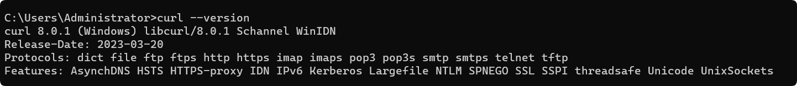
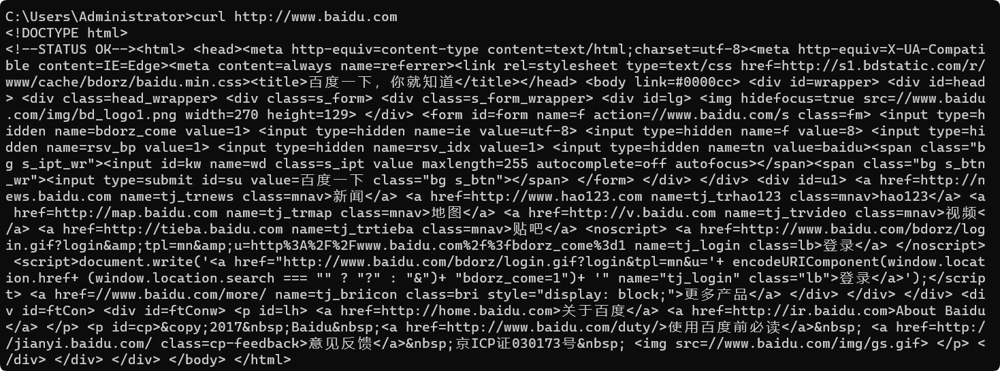

# curl 命令详解

## 前言

`curl` 是基于 URL 传输数据的命令行工具，常用于发送 HTTP 请求、查看响应、上传下载文件和定位网络问题。它会接收服务器返回的数据，但不会像浏览器一样执行页面中的 JavaScript。

理解 curl 命令时，先分清请求方法、URL、请求头和请求体，再看响应头、响应体及退出状态。示例中的 `api.example.com`、`files.example.com` 是占位域名，应替换为自己的测试服务；`https://example.com` 可用于简单的网页访问演示。

## 1. 安装与帮助

```bash
curl --version       # 检查版本、协议与功能支持
curl --help          # 查看常用选项
man curl             # 查本机版本的完整手册
```



尚未安装时，使用对应系统的包管理器。以下命令按系统选择一条执行：

```bash
sudo apt install curl  # Debian / Ubuntu
sudo dnf install curl  # 使用 dnf 的发行版
brew install curl      # macOS 使用 Homebrew 安装
```

部分旧环境使用 `yum install curl`。Windows 环境可以先检查 `curl.exe --version`；在某些 PowerShell 版本中，`curl` 可能是其他命令的别名，使用 `curl.exe` 能明确调用程序。

## 2. 从一次 GET 请求开始

```bash
curl 'https://example.com'
```

没有指定上传数据或其他请求方式时，HTTP 请求通常使用 GET。响应体默认写到标准输出，进度及诊断信息通常写到标准错误。因此能看到网页源文本，不代表浏览器已经渲染页面。



### 2.1 分清响应头与响应体

| 命令 | 作用 |
| --- | --- |
| `curl URL` | 显示响应体 |
| `curl -i URL` | 显示响应头和响应体，仍然是正常的 GET 等请求 |
| `curl -I URL` | 发送 HEAD 请求，只取响应头；服务端需支持 HEAD |
| `curl -D headers.txt -o body.txt URL` | 响应头、响应体分别写入文件 |
| `curl -v URL` | 输出连接过程、请求头及响应头等调试信息 |

`-i` 显示的是**响应头**。`-I` 则改变了请求方式；HEAD 成功并不保证对应 GET 的业务处理也成功。

```bash
curl -i 'https://example.com'
curl -D headers.txt -o body.html 'https://example.com'
```

### 2.2 控制输出、重定向与超时

```bash
curl -sS 'https://example.com'
curl -L 'https://example.com'
curl --connect-timeout 3 --max-time 10 'https://example.com'
```

`-s` 隐藏进度及错误信息，配合 `-S` 可以在安静输出的同时保留失败诊断。`-L` 跟随 HTTP 重定向；默认不会自动跟随。`--connect-timeout` 限制连接阶段，`--max-time` 限制整个传输过程的总耗时，单位都是秒。

查看输出与保存文件也可以使用 Shell 重定向，但通常 `-o` 更直观：

```bash
curl -sS -o page.html 'https://example.com'
```

`>` 会覆盖文件，`>>` 会追加文件。多次把完整网页追加到一个文件中，通常不能得到一个结构正确的新网页。

## 3. 组织请求参数

### 3.1 URL 查询参数与中文编码

```bash
curl -G 'https://api.example.com/search' \
  --data-urlencode 'q=Linux 命令' \
  --data-urlencode 'page=1'
```

`-G` 将数据放入 URL 查询字符串，并使用 GET；`--data-urlencode` 负责编码参数内容，适合中文、空格及特殊字符。直接写完整 URL 时也应加引号，防止 `&` 等字符被 Shell 解释。

```bash
curl 'https://api.example.com/search?q=linux&page=1'
```

### 3.2 表单与 POST

```bash
# 没有请求体的 POST
curl -X POST 'https://api.example.com/tasks'

# -d 会默认采用 POST，并以表单方式组织数据
curl 'https://api.example.com/login' \
  -d 'user=demo' \
  -d 'mode=test'
```

多个 `-d` 的内容用 `&` 连接。数据值包含需要编码的字符时改用 `--data-urlencode`。`-X` 只指定方法名，不会自动生成相应格式的请求体。

### 3.3 JSON 与文件内容

```bash
curl 'https://api.example.com/tasks' \
  -H 'Content-Type: application/json' \
  -d '{"title":"demo","enabled":true}'

# 原样读取文件内容作为请求体
curl 'https://api.example.com/tasks' \
  -H 'Content-Type: application/json' \
  --data-binary '@request.json'
```

请求头告诉服务端正文采用 JSON 格式，正文仍需本身就是合法 JSON。`-d @file` 与 `--data-binary @file` 并非完全等价：需要保留文件中的换行等字节时，使用 `--data-binary`。

### 3.4 请求头、User-Agent 与 Referer

```bash
curl 'https://api.example.com/items' \
  -H 'Accept: application/json' \
  -H 'X-Request-ID: demo-001'

curl -A 'TutorialClient/1.0' 'https://example.com'
curl -e 'https://example.com/' 'https://files.example.com/image.png'
```

`-H` 可以重复使用；`-A` 设置 `User-Agent`，`-e` 设置 HTTP 的 `Referer`。这些字段只描述请求信息，不代表客户端自动拥有服务器的访问权限。

### 3.5 Cookie 与基本认证

```bash
curl -b 'theme=dark; lang=zh' 'https://api.example.com/profile'
curl -c cookies.txt 'https://api.example.com/session'
curl -b cookies.txt 'https://api.example.com/profile'
curl -u demo 'https://api.example.com/private'
```

`-b` 发送 Cookie，可以接受字符串或已有 Cookie 文件；`-c` 将收到的 Cookie 保存到文件。`-u demo` 在交互环境中提示输入密码，避免把真实密码直接写在示例或命令历史里。基本认证应配合 HTTPS。

## 4. 下载与上传文件

### 4.1 保存文件及批量下载

```bash
curl -fL -o guide.pdf 'https://files.example.com/guide.pdf'
curl -fLO 'https://files.example.com/guide.pdf'
curl -fLO 'https://files.example.com/image[1-5].png'
```

`-o` 指定本地名称，`-O` 使用 URL 路径末尾的名称。带 `[1-5]` 的范围由 curl 展开，因此要用引号保护，避免先被 Shell 当作文件名模式处理。`-f` 使多数 HTTP 4xx/5xx 响应以失败状态结束，避免将错误页面误当成正常下载结果。

可用 `--progress-bar` 显示简洁进度条；支持情况和细节以本机 curl 手册为准。

### 4.2 压缩、限速、续传与重试

```bash
curl --compressed 'https://api.example.com/items'
curl --limit-rate 200K -O 'https://files.example.com/archive.tar.gz'
curl -C - -O 'https://files.example.com/archive.tar.gz'
curl --retry 3 -fLO 'https://files.example.com/archive.tar.gz'
```

`--compressed` 请求支持的 HTTP 内容压缩，并自动解压响应，不等于把本地文件打成压缩包。`--limit-rate` 限制传输速度；`-C -` 根据本地文件推断续传位置，需要服务端支持相应续传方式。

`--retry 3` 对符合 curl 重试条件的失败最多重试三次，并不是所有失败都自动重试。下载通常容易重复执行；创建订单、提交任务等有副作用的请求，应先确认接口的幂等性，不能仅因超时就认定服务端未处理。

### 4.3 范围下载

```bash
curl -r 0-99 -o part1.bin 'https://files.example.com/sample.bin'
curl -r 100-199 -o part2.bin 'https://files.example.com/sample.bin'
cat part1.bin part2.bin > combined.bin
```

字节范围包含两端，因此第一段是 100 字节，第二段从 100 开始，不能与第一段重叠。服务端可能忽略 Range 返回完整内容；合并前应核对响应状态 `206`、`Content-Range` 和实际大小。上例只取前 200 字节，不是下载完整文件。

### 4.4 FTP 下载与文件上传

```bash
curl -O -u demo 'ftp://files.example.com/report.csv'

# multipart/form-data 表单上传
curl 'https://api.example.com/upload' \
  -F 'file=@report.csv;type=text/csv;filename=report.csv' \
  -F 'description=monthly report'
```

FTP 示例使用账户认证；协议是否可用可查看 `curl --version` 的协议列表。普通 FTP 不提供 TLS 加密，实际使用应根据服务器能力选择安全的传输协议。

`-F` 构造 multipart 表单，`@` 表示读取本地文件，`type` 指定该部分的 MIME 类型，`filename` 指定上传的名称。让 curl 生成包含 boundary 的 Content-Type，不要手动写一个不完整的 multipart 请求头。

## 5. HTTPS 证书与代理

### 5.1 证书验证

```bash
curl --cacert ca.pem 'https://api.example.com'
curl --cert client.pem --key client.key 'https://api.example.com'
```

`--cacert` 指定用于验证服务器的 CA 证书；`--cert` 与 `--key` 用于要求客户端证书的双向 TLS 场景。

`-k` 会跳过服务器证书验证，可用于受控环境中临时定位证书问题，但会失去身份验证保障。修复证书、信任链或主机名配置才是长期解决方式。

### 5.2 代理配置

```bash
curl -x 'http://127.0.0.1:8080' 'https://example.com'
# 只对这一次命令设置环境变量
https_proxy='http://127.0.0.1:8080' curl 'https://example.com'
```

也可以在 `~/.curlrc` 中写入配置：

```text
proxy = "http://127.0.0.1:8080"
```

默认配置会影响后续命令。排查“相同命令在不同机器上行为不同”时，检查环境变量和配置文件；`curl -q URL` 将 `-q` 放在第一个参数位置，可以跳过默认 curl 配置文件。

## 6. 判断请求结果与定位耗时

### 6.1 HTTP 状态码不等于进程退出状态

默认情况下，服务器返回 HTTP 404 或 500，curl 仍可能以 `0` 退出，因为它成功完成了 HTTP 传输。若脚本需要把 HTTP 错误视为失败，可使用 `-f`，或在支持的版本中使用保留响应体的 `--fail-with-body`。

```bash
curl -sS -f -o response.json 'https://api.example.com/items'
printf 'curl 退出状态：%s\n' "$?"
```

退出状态需要紧接着读取。`6` 常见于域名解析失败，`7` 常见于连接失败，`22` 常见于使用 `-f` 后遇到 HTTP 错误，`28` 表示超时；具体诊断还要结合错误正文及详细连接信息。

### 6.2 输出状态与时间指标

```bash
curl -sS -o /dev/null \
  --connect-timeout 3 --max-time 10 \
  -w 'http=%{http_code}\ndns=%{time_namelookup}\nconnect=%{time_connect}\nfirst_byte=%{time_starttransfer}\ntotal=%{time_total}\n' \
  'https://example.com'
```

`-o /dev/null` 丢弃响应体，`-w` 输出传输统计。各时间值通常是从请求开始计算的累计时间，不能直接全部相加；复用连接、代理和重定向也会影响解释。`time_starttransfer` 是收到首字节前的时间，不等于纯服务端业务执行耗时。

需要响应体时，把 `/dev/null` 换成文件名。要查看连接和协商过程，可使用 `-v`；更细的追踪可用 `--trace-ascii trace.txt`。调试输出可能包含认证头、Cookie 和正文，分享前应去掉敏感值。

## 7. 使用 HTTP 请求文件管理调试场景


HTTP Request 是 IDEA 内置的一款 HTTP 模拟请求工具。

只需要按照简单的规则编写**纯文本**配置即可模拟 HTTP 请求。请求文件便于保存和重复执行调试场景。

HTTP Request 的主要功能如下：

- 支持模拟所有类型的 HTTP 请求，包括 GET、POST、PATCH、DELETE、PUT、HEAD、OPTIONS 等；
- 支持动态参数；
- 支持断言，可以编写和执行测试用例；
- 支持模拟文件上传；
- 记录请求日志；

### 7.1 编写请求文件

HTTP Request 工具的使用非常简单，只需要在 IDEA 内任何位置新建 `.http` 文件，然后在 `.http` 文件中填写相应规则即可。

这里有一个请求示例：

```http
### Send POST request with json body
POST https://httpbin.org/post
Content-Type: application/json

{
  "id": 999,
  "value": "content"
}

### GET request with a header
GET https://httpbin.org/ip
Accept: application/json

```


其中：

- 第 1 行开头的 `###` 代表开始一个新的 HTTP 请求，后面可以跟注释内容（ `#` 代表单行注释）；
- 第 2 行中的 `POST` 指定了请求方法，这里支持 HTTP 的所有请求方法； 后面的 `https://httpbin.org/post` 表示请求 uri；
- 第 3 行表示请求头。请求方法后面**紧邻的所有行**都会被当做请求头处理；
- 第 5-8 行是请求体，会被放置到 RequestBody 中；请求体和请求头之间需要有一个**空行**分割；

后面的 Get 请求同理。

如果你还是不清楚如何编写 HTTP 请求，可以点击编辑器右上角的 “Examples” 来查看 IDEA 官方示例：


编写完请求规则之后，只需要点击执行按钮，即可在控制台看到请求结果。


### 7.2 从 curl 转换

浏览器开发者工具可以将请求复制为 curl 命令，再导入 IDE 的 HTTP Client。这样便于保留方法、URL、请求头和正文；Cookie 过期、运行环境或服务端状态变化，仍可能影响复现结果。具体菜单位置随 IDE 版本变化。

复制浏览器请求的 curl 命令： 

把 curl 命令转换为 HTTP Request:

- 点击 `.http` 文件编辑器右上角的 “Convert...” 按钮；
- 选择 “Convert Curl to HTTP Request”; 
- IDEA 会弹出一个文本框并自动粘贴剪贴板中的 curl 命令，我们也可以自行粘贴 curl 命令； 
- 确认 curl 命令无误之后，点击 “Convert” 即可生成 HTTP Request 请求； 

## 总结

先用最小 GET 请求验证连接，再逐步加入参数、请求头和正文；观察结果时分别检查 curl 退出状态、HTTP 状态和业务响应。对上传、续传、代理及证书问题，明确每个选项改变的行为，才能让调试结果可解释。

## 参考资料

- [curl 官方手册](https://curl.se/docs/manpage.html)
- [curl HTTP scripting](https://curl.se/docs/httpscripting.html)
- [原有 HTTP Client 图示来源](https://idea.diqigan.cn/practices/capacity/http-request.html)
