# Git 安装与配置

> 本片教程是分享的 Git 教程的第一期：Git 的安装与配置。

## 1. 前言

- 最新实验室新配了一台电脑，因此各种软件需要重新安装，为了方便以后再次安装，于是在此记录一下`Git`的安装过程
- **提前说明，Git的安装教程本质不复杂，只需在更改安装目录之后不停点击`next`即可，全部的选项均选择默认，毛毛张此次分享是为了详细说明每一步的选项的意思**

## 2. Git 下载

- Git的下载也比较简单，只需要到Git官网(<https://git-scm.com/>)点击下载即可，如下图


- **跳转到如下界面，点击下面任意一处即可下载**

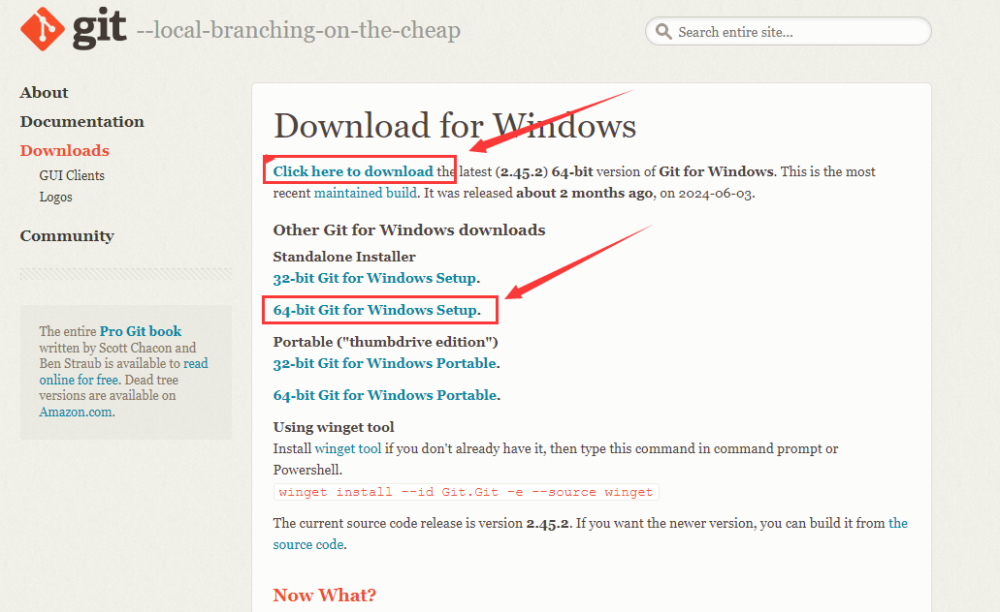

> **如此下载的就是Git的最新版本**

## 3. Git 的安装

> 上面介绍了下载教程，下面将详细介绍安装教程，由于Git版本较多，但是整个安装步骤相差不大，接下来我们就对这个最新版本进行安装工作

- 步骤1：双击下载的安装包


- 步骤2：开始安装，这个界面主要展示了GPL第 2 版协议的内容，点击`next`进入下一步

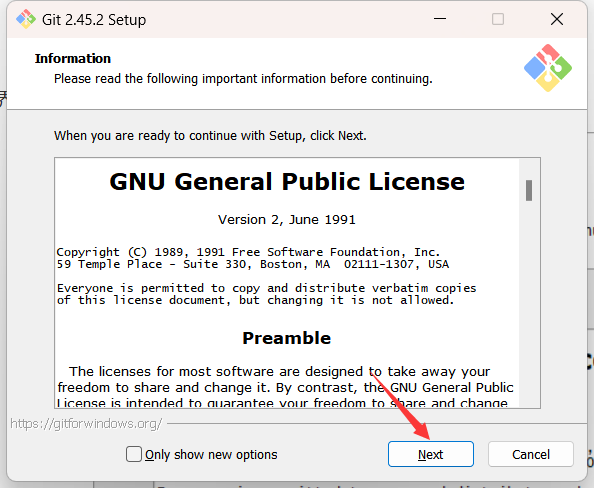

- 步骤3：选择安装目录，可点击`Browse…`更换目录，也可直接在方框里面改，点击 [next] 到下一步

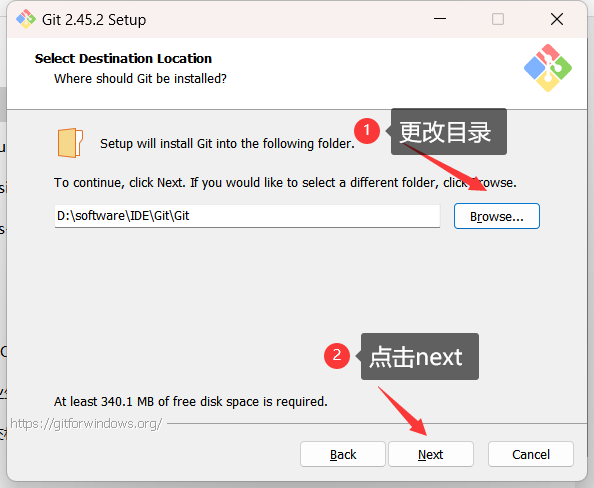


- **步骤4：选择安装组件**，图中这些英文都比较简单，我已经把大概意思翻译出来了，大家根据自己的需要选择勾选。点击 [next] 到下一步。

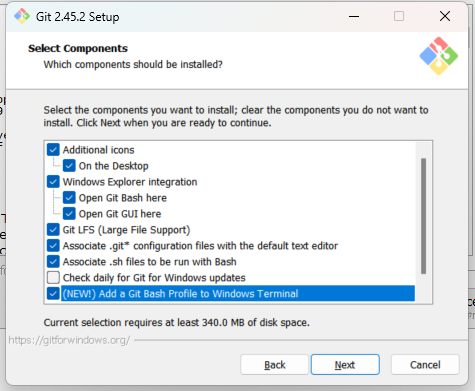

- **选项说明：** 最后一个选项打勾的话，需要下载Windows Terminal配合 Git Bash使用，如下图所示

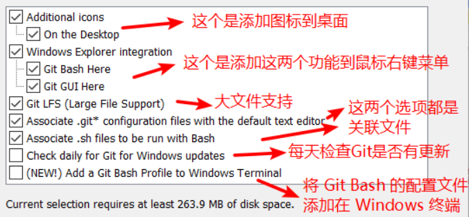

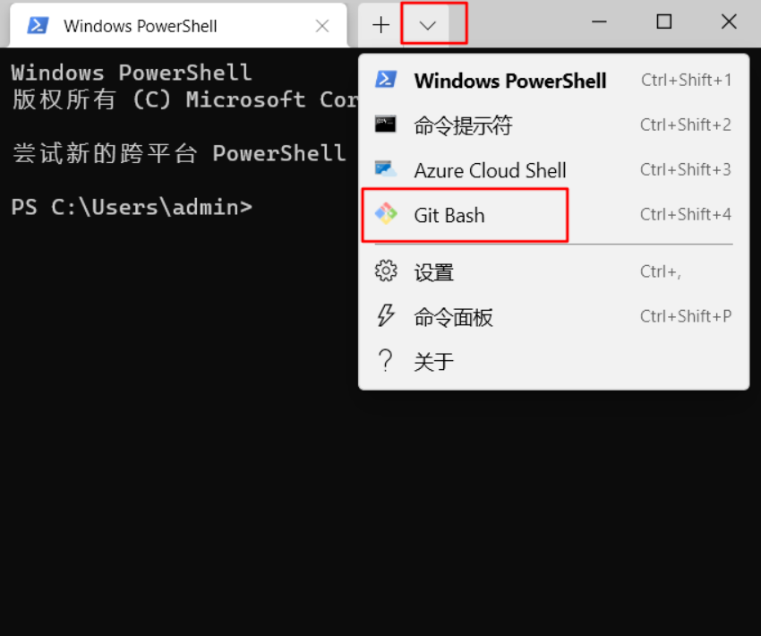


- **步骤5：选择开始菜单文件夹**，方框内 Git 可改为其他名字，也可点击 “`Browse...`” 选择其他文件夹或者给"`Don't create a Start Menu folder`" 打勾不要文件夹，**点击 [next] 到下一步**。

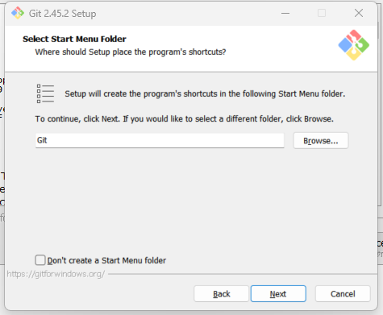

- **步骤6：选择 Git 默认编辑器**，**下图为默认编辑器 `Vim`，可直接点击 [next] 。**

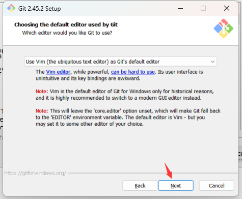

- **步骤7：决定初始化新项目(仓库)的主干名字**，第一种是让 Git 自己选择，名字是 `master` ，但是未来也有可能会改为其他名字；第二种是我们自行决定，默认是 `main`，当然，你也可以改为其他的名字。**一般默认第一种，点击 Next到下一步。**

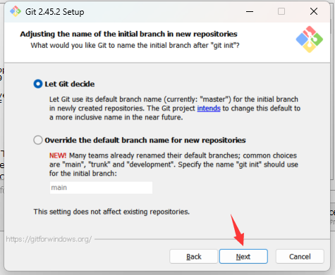

> **注：**  第二个选项下面有个 NEW！ ，说很多团队已经重命名他们的默认主干名为 main . 这是因为2020 年非裔男子乔治·弗洛伊德因白人警察暴力执法惨死而掀起的 Black Lives Matter(黑人的命也是命)运动，很多人认为master不尊重黑人，呼吁改为 main.

- **步骤8：调整你的 path 环境变量**，选择默认推荐的那一个即可，点击Next

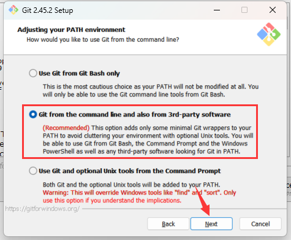

- 步骤9：选择ssh可执行文件，选择默认的，点击Next

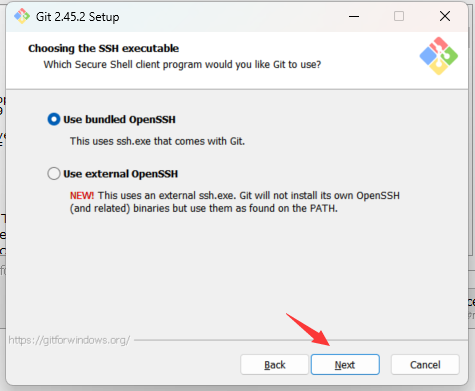


- 步骤10：选择HTTPS传输方式，选择默认的，点击Next


- 步骤11：配置行尾符号转换，选择默认的，点击Next

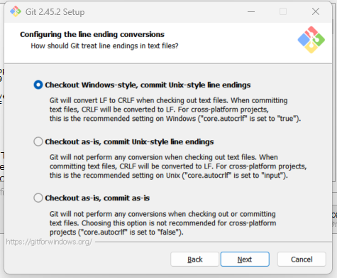

- 步骤12：配置终端模拟器以与Git Bash一起使用，选择默认的，点击Next

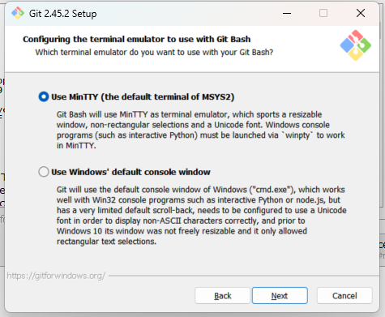

- 步骤13：选择默认的，点击Next

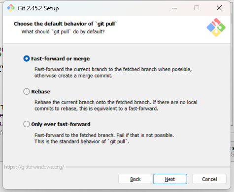

- 步骤14：选择默认的，点击Next

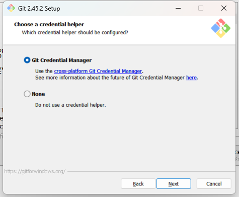

- 步骤15：配置额外的选项，选择默认的，点击Next

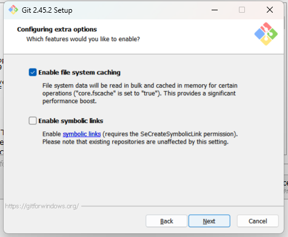

- **步骤16：配置实验性选项**，不用勾选，点击Install


- 步骤17： 等待安装

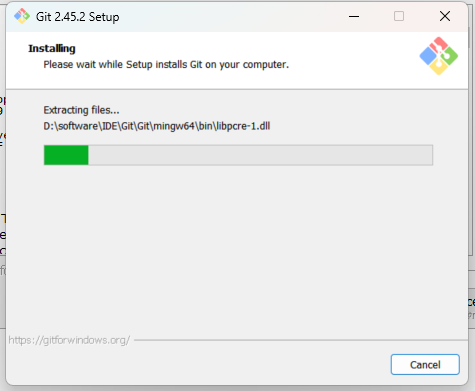

- 步骤18：取消勾选，点击Finish即安装成功

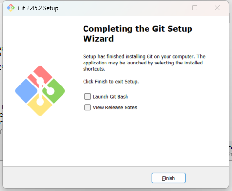

## 4. 验证安装成功

## 4.1 Git简介

- **这是Git安装成功后开始菜单里面的图：**

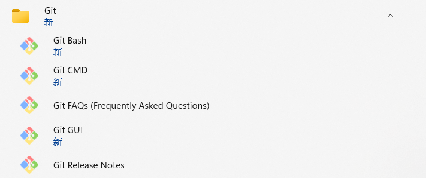

- **其中，Git Bash，是Git配套的一个控制台；Git CMD (弃用)，是通过CMD使用Git（不推荐使用）；Git GUI，是Git的可视化操作工具**

## 4.2 验证

- 步骤1： 运行上面的`Git Bash`执行程序，或者在桌面空白处右击，选择`Git Bash Here`

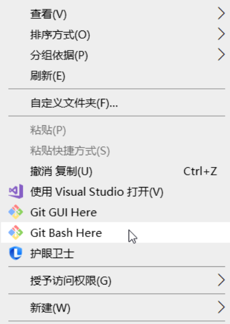

- 步骤2：点击后，会打开``Git`编辑窗口

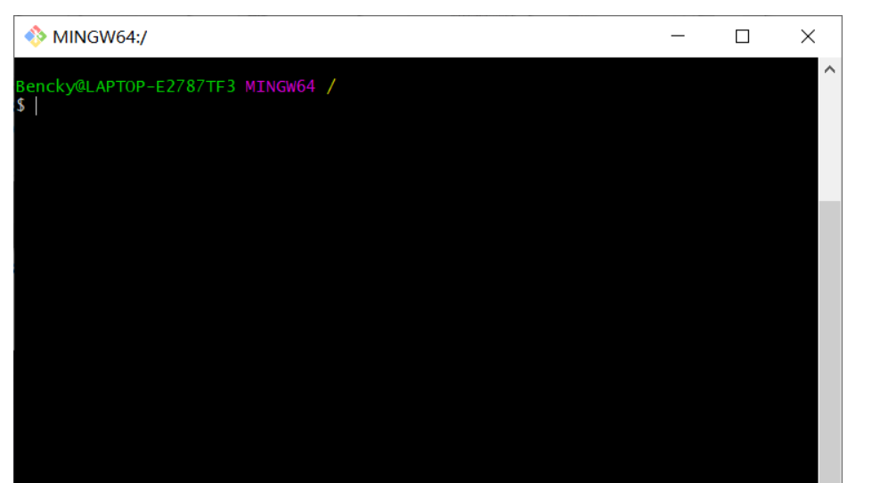

- **步骤3：版本查看，输入`git -v`或者`git --version`后回车，可以查看当前版本，显示当前版本信息**

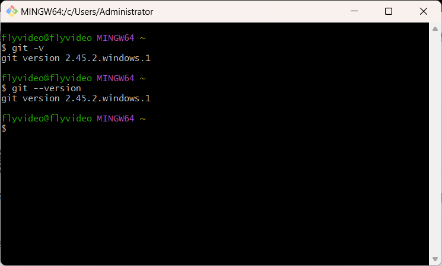

## 5. 配置 GitHub

- 安装好Git之后想要连接Github还需要进行下面三个操作：
  - 配置用户
  - 配置SSH公钥
  - 测试SSH连接

## 5.1 配置用户

**步骤1：打开Git Bash，输入如下命令**

```shell
git config --global user.name "mmz" # 配置用户名,随便取
git config --global user.email "zzxkingdom@163.com" # 配置用户邮箱，随便设置成一个自己可用的邮箱
git config --global user.name # 查看配置的用户名
git config --global user.email # 查看配置的用户邮箱
```

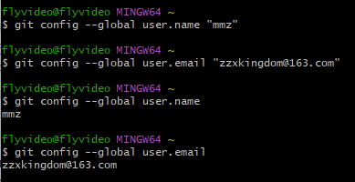

## 5.2 配置SSH公钥

**步骤1：打开Git Bash，输入如下命令，此命令执行进程中需要用户的确认，直接全部回车即可**

```shell
ssh-keygen -t rsa -C "上面填写的邮箱"
```

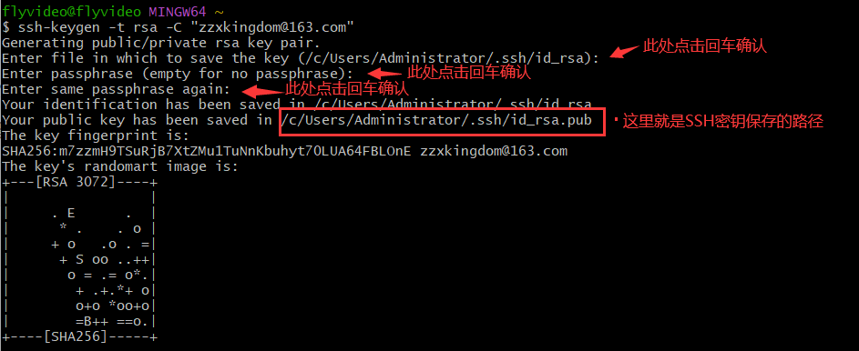

**步骤2：获取密钥信息，有两种方式**

- 方式1：在Git Bash中输入如下命令，然后从头复制输出的全部信息

  ```shell
  cat ~/.ssh/id_rsa.pub
  ```

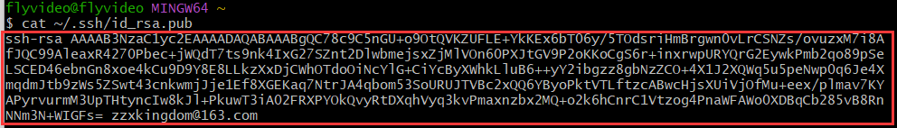

- 方式2：按照上图中的文件路径`/c/Users/Administrator/.ssh/id_rsa.pub`，即可找到SSH密钥保存的文件。值得注意的是，SSH密钥分为公钥和密钥，只有公钥才是我们需要的，即后缀名为`.pub`的文件。**打开公钥文件（使用记事本打开即可）可以看到一串以`ssh-rsa`为开头，你注册的邮箱为结束的代码。将这串公钥从头到尾复制，下一步将使用这串公钥。**

  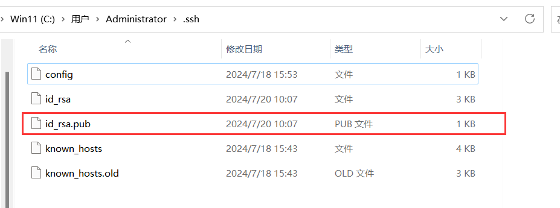

  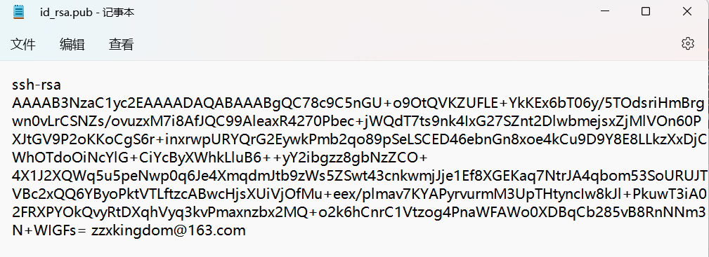

  步骤3：进入Github，点击右上角的头像，然后点击设置

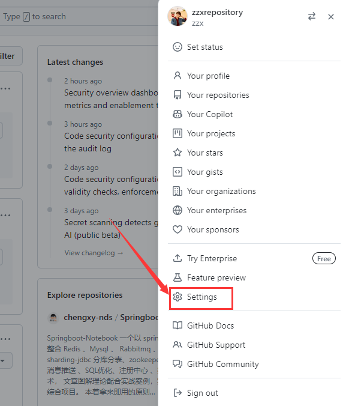

**步骤4：选择SSH与GPG密钥配置页面`SSH and GPG keys`，建立新SSH密钥`New SSH key`**

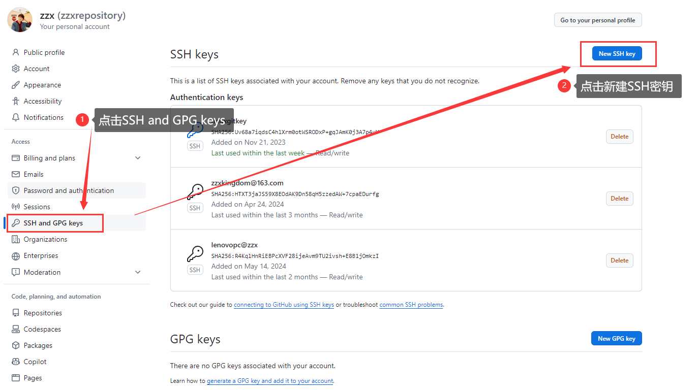

**步骤5：给新建的密钥创建一个名称方便管理，并将刚刚复制的公钥粘贴在`Key`对话框，点击`Add SSH key`**

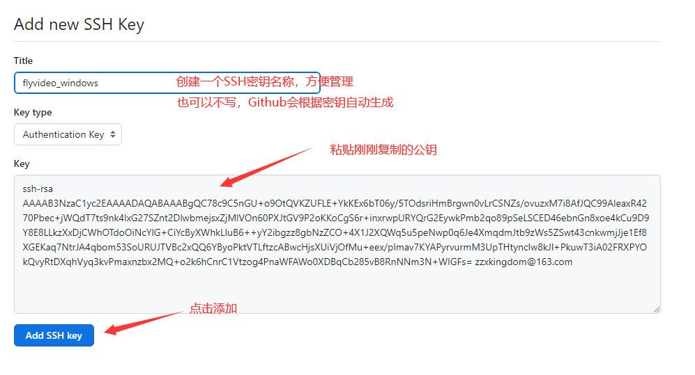

**步骤6：输入Github密码确认添加，即可添加成功**

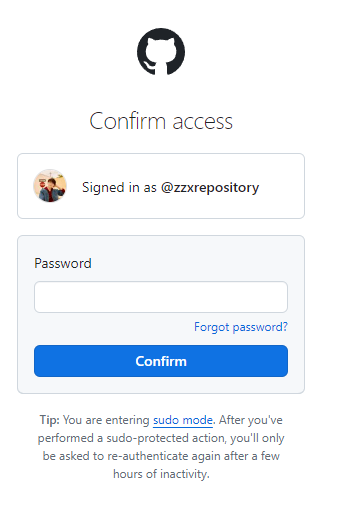

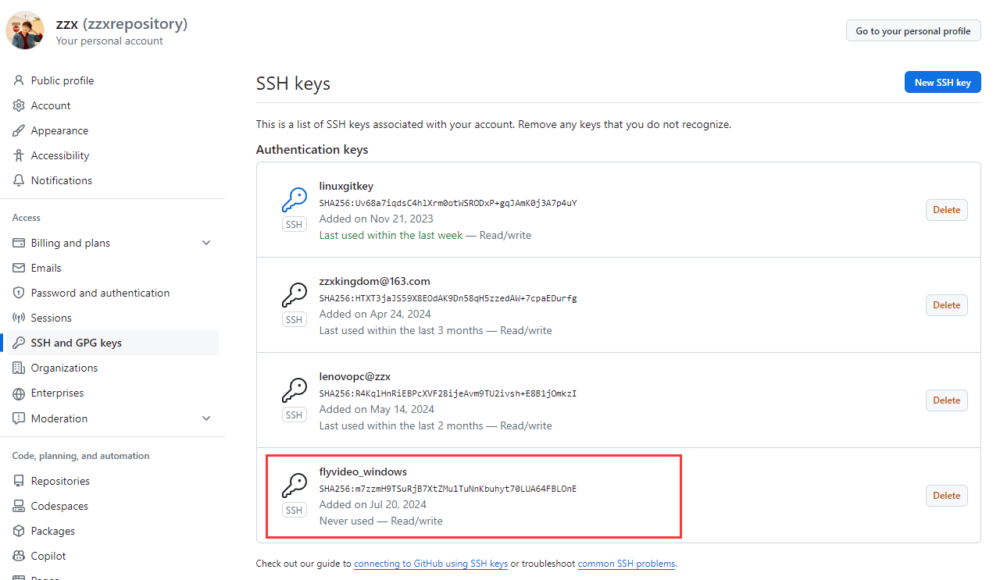

## 5.3 绑定SSH连接

> 上面在Github中添加了本地电脑SSH连接的公钥，所以只要使用就可以连接，下面来进行测试

步骤1：打开Git Bash界面，输入如下命令：

```bash
ssh -T git@github.com
```

步骤2：输入命令后，过程中会需要用户确定绑定，输入yes即可确定，返回以下结果即代表已成功绑定！！！

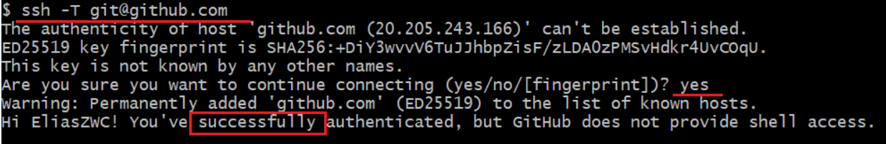

> 对于已经绑定好的Github，接下来还需要进行克隆（下载)到本地和上传到Github两方面的测试来确定一下功能是否可以正常使用，后面毛毛张会继续发布整理的Git使用教程，由于内容比较多，还在整理过程中，如果整理完，会第一时间发布

## 参考文献

- Windows系统Git安装教程（详解Git安装过程）<https://www.cnblogs.com/xueweisuoyong/p/11914045.html>
- Git安装教程（详细）<https://www.jianshu.com/p/bebba0d8038e>
- GNU操作系统-许可证  [↩︎](https://blog.csdn.net/mukes/article/details/115693833#fnref1)
- 大塚弘记. GitHub入门与实践 [M]. 鹏浩, 刘斌, 译. 人民邮电出版社,2017 [↩︎](https://blog.csdn.net/mukes/article/details/115693833#fnref2)
- MintTY官网[↩︎](https://blog.csdn.net/mukes/article/details/115693833#fnref3)
- <https://blog.csdn.net/qq_42372031/article/details/130676236>
- <https://blog.csdn.net/EliasChang/article/details/136561863>
